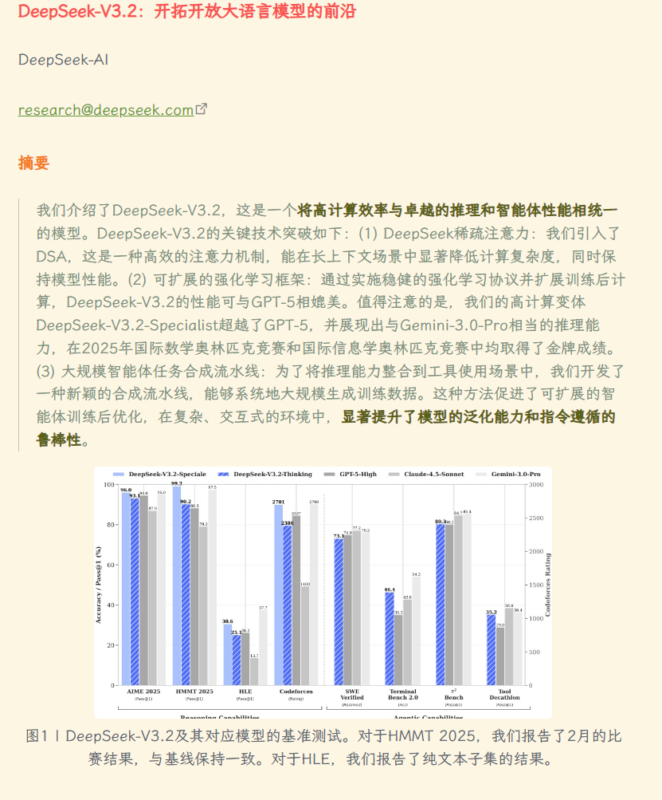
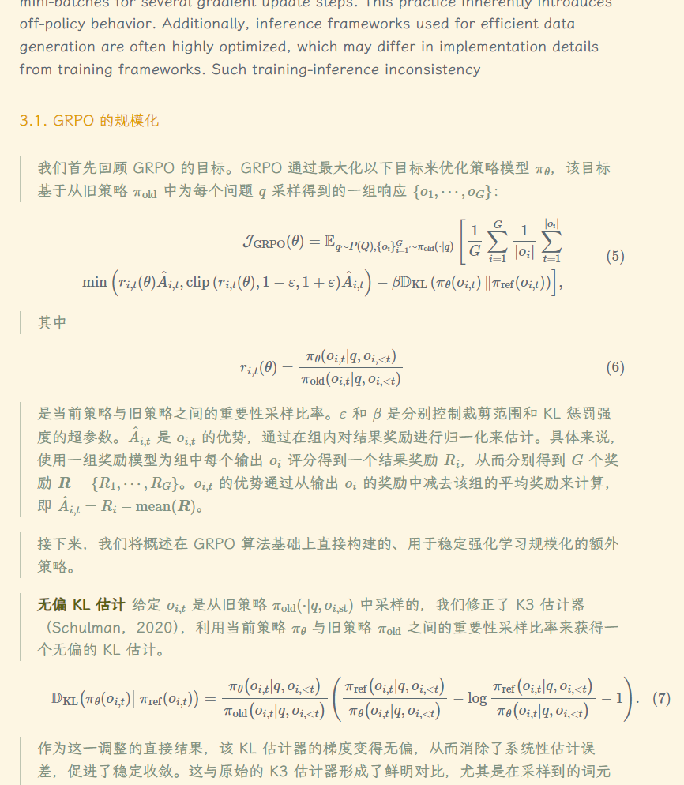
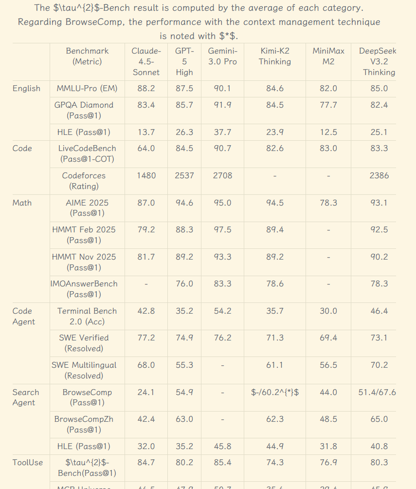

# pdf2md-zh

一个实用的 PDF 转双语 Markdown 工具。项目基于 PaddleOCR 提取文档结构与排版，并调用 DeepSeek 大模型对提取的英文内容进行翻译，最终生成中英对照的 Markdown 文件。

## 主要特性

- **文档结构解析**：通过 PaddleOCR-VL-1.5 接口提取 PDF 的文本、图片及布局。
- **并发智能翻译**：基于 `asyncio` 和 DeepSeek API 实现多页并发翻译，显著提升长文档处理速度。
- **排版清理与优化**：自动修复 LaTeX 行内及块级公式的空格和缩进问题，确保在 Markdown 中正常渲染。
- **自动分页聚合**：将翻译结果按指定页数自动合并（如每50页合成一个文件），方便阅读与管理。
- **图片本地提取**：解析 Markdown 结果并自动下载保存原文档中的配图。

## 项目结构

```text
.
├── md/                     # 输出目录（Markdown文件与图片存放处）
├── pdf/                    # 输入目录（待处理的 PDF 文件存放处）
├── src/pdf2md/             # 核心逻辑源码
│   ├── deepseek_trans.py   # DeepSeek 翻译接口封装
│   ├── paddle_ocr.py       # PaddleOCR API 请求封装
│   └── pdf2md.py           # 核心控制流与文件处理逻辑
├── .env.example            # 环境变量配置模板
├── pyproject.toml          # 项目配置与依赖说明
└── run.py                  # 项目运行入口
```

## 环境准备

本项目推荐使用 [uv](https://github.com/astral-sh/uv) 进行环境和依赖管理。

1. **安装依赖**
   ```bash
   uv sync
   # 或者使用
   uv pip install -e .
   ```

2. **配置环境变量**
   复制 `.env.example` 文件为 `.env`：
   ```bash
   cp .env.example .env
   ```
   在 `.env` 中填入你的 API 密钥：
   ```env
   PADDLE_API_TOKEN=your_paddleocr_token_here
   DEEPSEEK_API_KEY=your_deepseek_api_key_here
   ```
   > API 密钥获取：
   > - Paddle API Token: [百度飞桨 AI Studio](https://aistudio.baidu.com/)
   > - DeepSeek API Key: [DeepSeek 开放平台](https://platform.deepseek.com/)

## 使用说明

1. 将待转换的 PDF 文档放入 `pdf/` 目录（例如 `pdf/paper.pdf`）。**（可以在 `pdf/` 和 `md/` 文件夹中找到相关示例）**
2. 执行入口脚本：
   ```bash
   python run.py
   ```

### 进阶配置

可以通过修改 `run.py` 中的实例化参数来调整执行行为：

```python
agent = PDF2MD(
    input_path="./pdf/paper.pdf", 
    output_path="./md/paper",
    combine_page=50,  # 几个单页合并为一个 Markdown 文件
    trans_num=10      # 翻译时的最大异步并发数
)
```

处理完成后，生成的文本与图片将会统一保存在 `md/<pdf-文件名>/` 目录下。

## 注意事项

OCR 识别效果和最终翻译格式直接依赖于底层模型（PaddleOCR 与 DeepSeek）的能力。在实际使用中，可能会出现非预期的情况（如排版错位、公式识别不准或特殊字符遗漏）。一般可以通过重新运行对应的段落，或进行简单的手动排版对齐即可解决。

## 效果展示

由于 GitHub 的 Markdown 渲染对于公式不友好，下面展示本工具生成的双语翻译文本在 Obsidian 等专业 Markdown 软件中的实际渲染效果：

<div align="center">
  
  
  
</div>