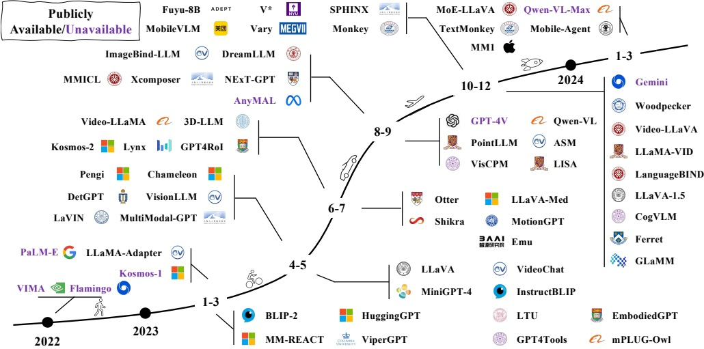
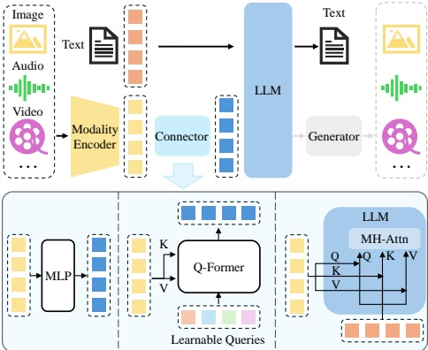
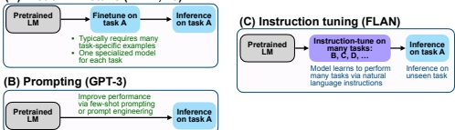
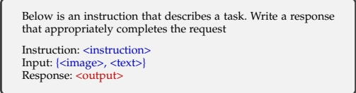

# 多模态大语言模型综述

尹书康*，傅超友* $\dagger$，赵思睿*，李珂，孙兴，徐童，IEEE Fellow 陈恩红

## 摘要

摘要— 近年来，以 GPT-4V 为代表的多模态大语言模型已成为新的研究热点，其利用强大的大语言模型作为“大脑”来执行多模态任务。MLLM 展现出令人惊讶的**涌现能力**，例如根据图像编写故事、无需 OCR 的数学推理等，这些能力在传统的多模态方法中较为罕见，暗示了通往通用人工智能的一条潜在路径。为此，学术界和工业界都致力于开发能够媲美甚至超越 GPT-4V 的 MLLM，以惊人的速度推动着研究的边界。本文旨在追溯和总结 MLLM 的最新进展。首先，我们介绍了 MLLM 的基本框架，并阐述了其相关概念，包括**架构、训练策略与数据，以及评估方法**。随后，我们探讨了 MLLM 如何扩展以支持更细的粒度、更多的模态、更多的语言以及更多的应用场景。接着，我们讨论了**多模态幻觉问题**以及相关扩展技术，包括多模态上下文学习、多模态思维链和 LLM 辅助视觉推理。最后，我们总结了现有挑战并指出了有前景的研究方向。鉴于 MLLM 的时代才刚刚开始，我们将持续更新本综述，并希望它能激发更多的研究。一个收集最新论文的关联 GitHub 链接位于 https://github.com/BradyFU/Awesome-Multimodal-Large-Language-Models。

关键词— 多模态大语言模型，视觉语言模型，大语言模型。

## 1 引言

近年来，大语言模型取得了显著进展 [1], [2], [3], [4], [5]。通过扩大数据规模和模型规模，这些 LLM 产生了非凡的涌现能力，通常包括**指令跟随**、**上下文学习**和**思维链**。尽管 LLM 在大多数自然语言处理任务上展现出了令人惊讶的零样本/少样本推理性能，但由于它们只能理解离散文本，因此本质上对视觉是“盲”的。与此同时，大规模视觉模型虽然“看得清楚” [9], [10], [11], [12]，但在推理能力上普遍滞后。

鉴于这种互补性，LLM 和 LVM 相互融合，催生了多模态大语言模型这一新领域。形式上，它指的是**基于 LLM、具备接收、推理和输出多模态信息能力的模型**。在 MLLM 出现之前，已有大量致力于多模态的研究工作，可分为判别式 [13], [14], [15] 和生成式 [16], [17], [18] 两种范式。作为前者的代表，CLIP [13] 将视觉和文本信息投射到一个统一的表示空间中，为下游多模态任务搭建了桥梁。相比之下，OFA [16] 是后者的代表，它以序列到序列的方式统一了多模态任务。根据序列操作方式，MLLM 可归为后者，但与传统模型相比，它展现出两个代表性特征：(1) MLLM 基于具有**数十亿参数**的 LLM，这是先前模型所不具备的。(2) MLLM 采用新的训练范式来释放其全部潜力，例如使用**多模态指令微调**来鼓励模型遵循新指令。凭借这两个特征，MLLM 展现出新的能力，例如根据图像编写网站代码 [21]、理解表情包的深层含义 [22] 以及无需 OCR 的数学推理 [23]。

自 GPT-4 [3] 发布以来，由于其展示出的惊人多模态示例，引发了对 MLLM 的研究热潮。学术界和工业界的共同努力推动了其快速发展。MLLM 的初步研究主要集中于基于文本提示和图像 [20], [24]/视频 [25], [26]/音频 [27] 的文本内容生成。后续工作扩展了其能力或应用场景，包括：(1) **更好的粒度支持**。开发了对用户提示的更精细控制，以通过边界框 [28] 支持特定区域，或通过点击 [29] 支持特定对象。(2) **增强了对输入和输出模态的支持** [30], [31]，例如图像、视频、音频和点云。除了输入，像 NExT-GPT [32] 这样的项目还进一步支持不同模态的输出。(3) **改进的语言支持**。已有努力将 MLLM 的成功扩展到训练语料相对有限的其他语言（例如中文）[33], [34]。(4) **扩展到更多领域和应用场景**。一些研究将 MLLM 的强大能力迁移到其他领域，例如医学图像理解 [35], [36], [37] 和文档解析 [38], [39], [40]。此外，还开发了多模态智能体以辅助现实世界交互，例如具身智能体 [41], [42] 和 GUI 智能体 [43], [44], [45]。图 1 展示了 MLLM 的发展时间线。

鉴于如此快速的进展和充满希望的结果

---

**图 1：代表性多模态大语言模型（MLLM）的发展时间线。我们正见证该领域的快速增长。更多工作可在我们每日更新的 GitHub 页面中找到。**

鉴于该领域的快速发展，我们撰写本综述旨在让研究人员掌握 MLLM 的基本思想、主要方法和当前进展。请注意，我们主要关注视觉和语言模态，但也包含涉及视频和音频等其他模态的工作。具体而言，我们涵盖了 MLLM 最重要的方面并附有相应总结，同时开设了一个会实时更新的 GitHub 页面。据我们所知，这是**首篇关于 MLLM 的综述**。

本综述后续部分结构如下：首先全面回顾 MLLM 的核心方面，包括：(1) **主流架构**（§2）；(2) **完整的训练策略与数据方案**（§3）；(3) **性能评估的常见实践**（§4）。随后，我们深入探讨关于 MLLM 的一些重要议题，每个议题聚焦于一个主要问题：(1) **哪些方面可以进一步改进或扩展**（§5）？(2) **如何缓解多模态幻觉问题**（§6）？综述继续介绍了三种关键技术（§7），每种技术专用于特定场景：**多模态上下文学习**（§7.1）是一种在推理阶段常用的有效技术，用于提升少样本性能。另一项重要技术是**多模态思维链**（§7.2），通常用于复杂推理任务。之后，我们概述了一种开发基于大语言模型系统的通用思路，以解决复合推理任务或处理常见用户查询（§7.3）。最后，我们以总结和潜在研究方向结束本综述。

## 2 架构

一个典型的 MLLM 可以抽象为三个模块，即**预训练的模态编码器**、**预训练的大语言模型**以及连接它们的**模态接口**。类比人类，图像/音频编码器等模态编码器就像是接收并预处理光学/声学信号的人眼/耳朵，而大语言模型则如同理解并对处理后的信号进行推理的人脑。在两者之间，模态接口负责**对齐不同模态**。一些 MLLM 还包含一个生成器，用于输出文本以外的其他模态。架构示意图如图 2 所示。本节将依次介绍每个模块。

### 2.1 模态编码器

编码器将原始信息（如图像或音频）压缩成更紧凑的表示。一种常见方法是使用已与其他模态对齐的预训练编码器，而非从头开始训练。例如，CLIP [13] 通过在大规模图文对上预训练，纳入了一个在语义上与文本对齐的视觉编码器。因此，使用这种**初始已预对齐的编码器**，通过对齐预训练（见 §3.1）来与大语言模型对齐会更容易。

常用图像编码器系列总结于表 1。除了原始的 CLIP 图像编码器 [13]，一些工作也探索使用其他变体。例如，MiniGPT-4 [21] 采用了 EVA-CLIP [47], [48]（ViT-G/14）编码器，该编码器使用了改进的训练技术进行训练。相比之下，Osprey [29] 引入了基于卷积的 ConvNext-L 编码器 [46]，以利用更高分辨率和多层次特征。一些工作还探索了**无编码器的架构**。例如，Fuyu-8b [49] 的图像块在送入大语言模型之前直接进行投影。因此，该模型天然支持**灵活的图像分辨率输入**。

---

**表1：常用图像编码器总结**

<table border=1 style='margin: auto; word-wrap: break-word;'><tr><td style='text-align: center; word-wrap: break-word;'>变体</td><td style='text-align: center; word-wrap: break-word;'>预训练语料库</td><td style='text-align: center; word-wrap: break-word;'>分辨率</td><td style='text-align: center; word-wrap: break-word;'>样本数 (B)</td><td style='text-align: center; word-wrap: break-word;'>参数量 (M)</td></tr><tr><td style='text-align: center; word-wrap: break-word;'>OpenCLIP-ConvNext-L</td><td style='text-align: center; word-wrap: break-word;'>LAION-2B</td><td style='text-align: center; word-wrap: break-word;'>320</td><td style='text-align: center; word-wrap: break-word;'>29</td><td style='text-align: center; word-wrap: break-word;'>197.4</td></tr><tr><td style='text-align: center; word-wrap: break-word;'>CLIP-ViT-L/14</td><td style='text-align: center; word-wrap: break-word;'>OpenAI WIT</td><td style='text-align: center; word-wrap: break-word;'>224/336</td><td style='text-align: center; word-wrap: break-word;'>13</td><td style='text-align: center; word-wrap: break-word;'>304.0</td></tr><tr><td style='text-align: center; word-wrap: break-word;'>EVA-CLIP-ViT-G/14</td><td style='text-align: center; word-wrap: break-word;'>LAION-2B, COYO-700M</td><td style='text-align: center; word-wrap: break-word;'>224</td><td style='text-align: center; word-wrap: break-word;'>11</td><td style='text-align: center; word-wrap: break-word;'>1000.0</td></tr><tr><td style='text-align: center; word-wrap: break-word;'>OpenCLIP-ViT-G/14</td><td style='text-align: center; word-wrap: break-word;'>LAION-2B</td><td style='text-align: center; word-wrap: break-word;'>224</td><td style='text-align: center; word-wrap: break-word;'>34</td><td style='text-align: center; word-wrap: break-word;'>1012.7</td></tr><tr><td style='text-align: center; word-wrap: break-word;'>OpenCLIP-ViT-bigG/14</td><td style='text-align: center; word-wrap: break-word;'>LAION-2B</td><td style='text-align: center; word-wrap: break-word;'>224</td><td style='text-align: center; word-wrap: break-word;'>34</td><td style='text-align: center; word-wrap: break-word;'>1844.9</td></tr></table>

**图2：典型多模态大语言模型架构示意图**。它包括一个编码器、一个连接器和一个大语言模型。可以**可选地**在大语言模型上附加一个生成器，以生成文本以外的更多模态内容。编码器接收图像、音频或视频并输出特征，这些特征由连接器处理，以便大语言模型能够更好地理解。连接器大致分为三种类型：**基于投影的**、**基于查询的**和**基于融合的**连接器。前两种类型采用**令牌级融合**，将特征处理成令牌与文本令牌一起发送，而最后一种类型则在大语言模型内部实现**特征级融合**。

在选择编码器时，人们通常会考虑分辨率、参数量和预训练语料库等因素。**值得注意的是**，许多工作已经通过实验验证，使用更高的分辨率可以**显著提升性能**。提升输入分辨率的方法可分为**直接缩放**和**分块划分**两种。直接缩放方式将更高分辨率的图像输入编码器，这通常涉及进一步微调编码器或替换为更高分辨率的预训练编码器。类似地，CogAgent采用**双编码器机制**，其中两个编码器分别处理高分辨率和低分辨率图像。高分辨率特征通过交叉注意力注入到低分辨率分支中。分块划分方法将高分辨率图像切割成小块，并重用低分辨率编码器。例如，Monkey和SPHINX将大图像划分为更小的块，并将子图像与下采样的高分辨率图像一起发送给图像编码器，其中子图像和低分辨率图像分别捕获**局部特征**和**全局特征**。相比之下，经验研究发现，与输入分辨率相比，参数规模和训练数据构成的重要性较低。

其他模态也有类似的编码器可用。例如，Pengi使用CLAP模型作为音频编码器。ImageBind-LLM使用ImageBind编码器，它支持编码图像、文本、音频、深度、热成像和惯性测量单元数据。得益于强大的编码器，ImageBind-LLM能够响应多种模态的输入。

### 2.2 预训练大语言模型

相比于从头开始训练一个大语言模型，从一个预训练的模型出发**更为高效和实用**。通过对海量网络语料的预训练，大语言模型已被嵌入丰富的世界知识，并展现出强大的泛化和推理能力。

我们在表2中总结了常用且公开可用的大语言模型。**值得注意的是**，大多数大语言模型都属于因果解码器类别，遵循GPT-3的设计。其中，FlanT5系列是相对早期的大语言模型，在BLIP-2和InstructBLIP等工作中被使用。LLaMA系列和Vicuna家族是**具有代表性的开源大语言模型**，吸引了大量学术关注。由于这两个大语言模型主要是在英语语料上预训练的，它们在多语言支持（如中文）方面存在局限。相比之下，Qwen是一个**双语大语言模型**，能很好地支持中文和英文。

**需要指出的是**，扩大大语言模型的参数量也会带来额外的收益，类似于提高输入分辨率的情况。具体来说，研究发现，**仅仅将大语言模型从7B扩展到13B**，就能在各种基准测试上带来全面的提升。此外，当使用34B的大语言模型时，即使在训练期间仅使用英语多模态数据，模型也**展现出了新兴的零样本中文能力**。通过将大语言模型从13B扩展到35B和65B/70B，也观察到了类似的现象，其中更大的模型规模为专门为多模态大语言模型设计的基准测试带来了**一致的性能增益**。也有工作使用更小的大语言模型以促进在移动设备上的部署。例如，MobileVLM系列使用缩小的LLaMA，使得在移动处理器上能够进行高效的推理。

**最近**，针对大语言模型的**专家混合架构**探索获得了越来越多的关注。与密集模型相比，这种稀疏架构通过**选择性激活参数**，能够在**不增加计算成本**的情况下扩大总参数量。根据经验，MM1和MoE-LLaVA发现，专家混合的实现**在几乎所有基准测试上都比密集模型取得了更好的性能**。

---

表2：常用开源大语言模型概览。en, zh, fr, de 分别代表英语、中文、法语和德语。

<table border=1 style='margin: auto; word-wrap: break-word;'><tr><td style='text-align: center; word-wrap: break-word;'>模型</td><td style='text-align: center; word-wrap: break-word;'>发布日期</td><td style='text-align: center; word-wrap: break-word;'>预训练数据规模</td><td style='text-align: center; word-wrap: break-word;'>参数量 (B)</td><td style='text-align: center; word-wrap: break-word;'>语言支持</td><td style='text-align: center; word-wrap: break-word;'>架构</td></tr><tr><td style='text-align: center; word-wrap: break-word;'>Flan-T5-XL/XXL [56]</td><td style='text-align: center; word-wrap: break-word;'>2022年10月</td><td style='text-align: center; word-wrap: break-word;'>-</td><td style='text-align: center; word-wrap: break-word;'>3/11</td><td style='text-align: center; word-wrap: break-word;'>en, fr, de</td><td style='text-align: center; word-wrap: break-word;'>编码器-解码器</td></tr><tr><td style='text-align: center; word-wrap: break-word;'>LLaMA [5]</td><td style='text-align: center; word-wrap: break-word;'>2023年2月</td><td style='text-align: center; word-wrap: break-word;'>1.4万亿词元</td><td style='text-align: center; word-wrap: break-word;'>7/13/33/65</td><td style='text-align: center; word-wrap: break-word;'>en</td><td style='text-align: center; word-wrap: break-word;'>因果解码器</td></tr><tr><td style='text-align: center; word-wrap: break-word;'>Vicuna [4]</td><td style='text-align: center; word-wrap: break-word;'>2023年3月</td><td style='text-align: center; word-wrap: break-word;'>1.4万亿词元</td><td style='text-align: center; word-wrap: break-word;'>7/13/33</td><td style='text-align: center; word-wrap: break-word;'>en</td><td style='text-align: center; word-wrap: break-word;'>因果解码器</td></tr><tr><td style='text-align: center; word-wrap: break-word;'>LLaMA-2 [57]</td><td style='text-align: center; word-wrap: break-word;'>2023年7月</td><td style='text-align: center; word-wrap: break-word;'>2万亿词元</td><td style='text-align: center; word-wrap: break-word;'>7/13/70</td><td style='text-align: center; word-wrap: break-word;'>en</td><td style='text-align: center; word-wrap: break-word;'>因果解码器</td></tr><tr><td style='text-align: center; word-wrap: break-word;'>Qwen [58]</td><td style='text-align: center; word-wrap: break-word;'>2023年9月</td><td style='text-align: center; word-wrap: break-word;'>3万亿词元</td><td style='text-align: center; word-wrap: break-word;'>1.8/7/14/72</td><td style='text-align: center; word-wrap: break-word;'>en, zh</td><td style='text-align: center; word-wrap: break-word;'>因果解码器</td></tr></table>

### 2.3 模态接口

由于大语言模型仅能感知文本，因此**弥合自然语言与其他模态之间的鸿沟**是必要的。然而，以端到端方式训练一个大型多模态模型的成本会很高。一种更实用的方法是在预训练的视觉编码器与大语言模型之间引入一个**可学习的连接器**。另一种方法是借助专家模型将图像翻译成语言，然后将语言输入大语言模型。

**可学习的连接器**。它**负责弥合不同模态之间的差距**。具体来说，该模块将信息投影到大语言模型能够高效理解的空间中。根据多模态信息融合的方式，实现此类接口大致有两种方法，即**词元级融合**和**特征级融合**。

对于**词元级融合**，编码器输出的特征被转换成词元，并在送入大语言模型之前与文本词元拼接。一个常见且可行的解决方案是利用一组**可学习的查询词元**，以基于查询的方式提取信息[69]，这种方法首先在BLIP-2[59]中实现，随后被一系列工作所沿用[26], [60], [70]。此类Q-Former风格的方法将视觉词元压缩为数量更少的表征向量。相比之下，一些方法则简单地使用基于多层感知机的接口来弥合模态鸿沟[20], [37], [71], [72]。例如，LLaVA系列采用一个或两个线性多层感知机[20], [50]来投影视觉词元，并将特征维度与词嵌入对齐。

值得注意的是，MM1[52]对连接器的设计选择进行了消融实验，发现对于**词元级融合**，**模态适配器的类型远不如视觉词元的数量和输入分辨率重要**。然而，Zeng等人[73]比较了词元级和特征级融合的性能，并通过实验揭示，在视觉问答基准测试中，词元级融合的变体表现更好。关于性能差距，作者认为交叉注意力模型可能需要更复杂的超参数搜索过程才能达到可比的性能。

作为另一条技术路线，**特征级融合**会插入额外的模块，以实现文本特征与视觉特征之间的**深度交互与融合**。例如，Flamingo[74]在大语言模型的冻结Transformer层之间插入了额外的交叉注意力层，从而用外部视觉线索增强语言特征。类似地，CogVLM[75]在每个Transformer层中插入一个视觉专家模块，以实现视觉与语言特征之间的**双重交互与融合**。为了获得更好的性能，所引入模块的QKV权重矩阵是从预训练的大语言模型初始化而来。类似地，LLaMA-Adapter[76]将可学习的提示引入Transformer层。这些提示首先与视觉知识进行嵌入，然后作为前缀与文本特征拼接。

就参数量而言，**可学习的接口**通常只占编码器和大语言模型的一小部分。以Qwen-VL[34]为例，其Q-Former的参数量约为0.08B，不到总参数量的1%，而编码器和大语言模型分别约占19.8%（1.9B）和80.2%（7.7B）。

**专家模型**。除了可学习的接口，使用专家模型（例如图像描述生成模型）也是弥合模态鸿沟的一种可行方法[77], [78], [79], [80]。其基本思想是**无需训练即可将多模态输入转换为语言**。通过这种方式，大语言模型可以通过转换后的语言来理解多模态信息。例如，VideoChat-Text[25]使用预训练的视觉模型来提取动作等视觉信息，并利用语音识别模型丰富描述。尽管使用专家模型很直接，但它可能不如采用可学习的接口那样灵活。将外部模态转换为文本会导致**信息损失**。例如，将视频转换为文本描述会扭曲时空关系[25]。

## 3 训练策略与数据

一个成熟的多模态大语言模型会经历三个训练阶段，即**预训练**、**指令微调**和**对齐微调**。每个训练阶段需要不同类型的数据，并实现不同的目标。在本节中，我们将讨论各训练阶段的训练目标，以及数据收集与特点。

### 3.1 预训练

#### 3.1.1 训练细节

作为第一个训练阶段，**预训练**的主要目标是**对齐不同模态并学习多模态的世界知识**。预训练阶段通常需要大规模的文本配对数据，例如描述性数据。通常，这些配对数据用自然语言句子描述图像/音频/视频。

这里，我们考虑一个常见场景，即训练多模态大语言模型以对齐视觉与文本。如表3所示，给定一张图像，模型被训练以自回归方式预测图像的描述，遵循标准的交叉熵损失。预训练的常见方法是**保持预训练模块（如视觉编码器和大语言模型）冻结**，并训练一个可学习的接口[20], [35], [72]。其思想是在不丢失预训练知识的情况下对齐不同模态。一些方法[34], [81], [82]也会解冻更多模块（例如视觉编码器），以便为对齐提供更多可训练参数。需要注意的是

---

<table border=1 style='margin: auto; word-wrap: break-word;'><tr><td style='text-align: center; word-wrap: break-word;'>输入:  $\langle image \rangle$响应:  $\{caption\}$</td></tr></table>

表 3: 一个用于构建描述数据的简化模板。{<image>} 是视觉标记的占位符，{caption} 是图像的描述。**请注意，只有标红的部分用于损失计算。**

**训练方案与数据质量密切相关。** 对于简短且噪声较多的描述数据，可以采用较低的分辨率（例如 224）来加速训练过程；而对于更长、更干净的数据，则最好利用更高的分辨率（例如 448 或更高）以**减少幻觉现象**。此外，ShareGPT4V [83] 发现，在预训练阶段使用高质量的描述数据时，**解锁视觉编码器能促进更好的模态对齐**。

#### 3.1.2 数据

预训练数据主要服务于两个目的，即：(1) **对齐不同模态**；(2) **提供世界知识**。根据粒度，预训练语料可分为粗粒度和细粒度数据，我们将依次介绍。我们在表 4 中总结了常用的预训练数据集。

粗粒度描述数据通常具有一些共同特点：(1) **数据量巨大**，因为样本通常来源于互联网。(2) 由于其网络爬取的性质，描述通常**简短且带有噪声**，因为它们源自网络图像的替代文本。这些数据可以通过自动工具进行清洗和过滤，例如，使用 CLIP [13] 模型过滤掉相似度低于预设阈值的图像-文本对。接下来，我们介绍一些代表性的粗粒度数据集。

CC。 CC-3M [84] 是一个包含 330 万图像-描述对的网络规模描述数据集，其中原始描述来源于与图像相关联的替代文本。作者设计了一个复杂的流程来清洗数据：(1) 对于图像，过滤掉内容不当或宽高比不合适的图像。(2) 对于文本，使用 NLP 工具获取文本标注，并根据设计的启发式规则过滤样本。(3) 对于图像-文本对，通过分类器为图像分配标签。如果文本标注与图像标签不重叠，则丢弃相应的样本。

CC-12M [85] 是 CC-3M 的后续工作，包含 1240 万图像-描述对。与之前的工作相比，CC-12M 放宽并简化了数据收集流程，从而收集了更多数据。

SBU Captions [86]。这是一个包含 100 万图像-文本对的带描述照片数据集，图像和描述均来自 Flickr。具体来说，通过使用大量查询词查询 Flickr 网站获取初始图像集。这些图像附带的描述即作为描述。然后，为了确保描述与图像相关，保留的图像需满足以下要求：(1) 图像描述的**长度令人满意**，由观察决定。(2) 图像描述在预定义的术语列表中至少包含 2 个单词，并且包含一个通常表示空间关系的介词（例如“在……上”、“在……下”）。

表 4: 用于预训练的常用数据集。

<table border=1 style='margin: auto; word-wrap: break-word;'><tr><td style='text-align: center; word-wrap: break-word;'>数据集</td><td style='text-align: center; word-wrap: break-word;'>样本数</td><td style='text-align: center; word-wrap: break-word;'>日期</td></tr><tr><td colspan="3">粗粒度图像-文本</td></tr><tr><td style='text-align: center; word-wrap: break-word;'>CC-3M [84]</td><td style='text-align: center; word-wrap: break-word;'>3.3M</td><td style='text-align: center; word-wrap: break-word;'>2018</td></tr><tr><td style='text-align: center; word-wrap: break-word;'>CC-12M [85]</td><td style='text-align: center; word-wrap: break-word;'>12.4M</td><td style='text-align: center; word-wrap: break-word;'>2020</td></tr><tr><td style='text-align: center; word-wrap: break-word;'>SBU Captions [86]</td><td style='text-align: center; word-wrap: break-word;'>1M</td><td style='text-align: center; word-wrap: break-word;'>2011</td></tr><tr><td style='text-align: center; word-wrap: break-word;'>LAION-5B [87]</td><td style='text-align: center; word-wrap: break-word;'>5.9B</td><td style='text-align: center; word-wrap: break-word;'>Mar-2022</td></tr><tr><td style='text-align: center; word-wrap: break-word;'>LAION-2B [87]</td><td style='text-align: center; word-wrap: break-word;'>2.3B</td><td style='text-align: center; word-wrap: break-word;'>Mar-2022</td></tr><tr><td style='text-align: center; word-wrap: break-word;'>LAION-COCO [88]</td><td style='text-align: center; word-wrap: break-word;'>600M</td><td style='text-align: center; word-wrap: break-word;'>Sep-2022</td></tr><tr><td style='text-align: center; word-wrap: break-word;'>COYO-700M [90]</td><td style='text-align: center; word-wrap: break-word;'>747M</td><td style='text-align: center; word-wrap: break-word;'>Aug-2022</td></tr><tr><td colspan="3">细粒度图像-文本</td></tr><tr><td style='text-align: center; word-wrap: break-word;'>ShareGPT4V-PT [83]</td><td style='text-align: center; word-wrap: break-word;'>1.2M</td><td style='text-align: center; word-wrap: break-word;'>Nov-2023</td></tr><tr><td style='text-align: center; word-wrap: break-word;'>LVIS-Instruct4V [91]</td><td style='text-align: center; word-wrap: break-word;'>111K</td><td style='text-align: center; word-wrap: break-word;'>Nov-2023</td></tr><tr><td style='text-align: center; word-wrap: break-word;'>ALLaVA [92]</td><td style='text-align: center; word-wrap: break-word;'>709K</td><td style='text-align: center; word-wrap: break-word;'>Feb-2024</td></tr><tr><td colspan="3">视频-文本</td></tr><tr><td style='text-align: center; word-wrap: break-word;'>MSR-VTT [93]</td><td style='text-align: center; word-wrap: break-word;'>200K</td><td style='text-align: center; word-wrap: break-word;'>2016</td></tr><tr><td colspan="3">音频-文本</td></tr><tr><td style='text-align: center; word-wrap: break-word;'>WavCaps [94]</td><td style='text-align: center; word-wrap: break-word;'>24K</td><td style='text-align: center; word-wrap: break-word;'>Mar-2023</td></tr></table>

LAION。该系列是大型网络规模数据集，图像从互联网爬取，关联的替代文本作为描述。为了过滤图像-文本对，执行以下步骤：(1) 丢弃文本长度过短或图像尺寸过小或过大的样本。(2) 基于 URL 进行图像去重。(3) 提取图像和文本的 CLIP [13] 嵌入，并使用这些嵌入来丢弃可能非法内容以及嵌入之间余弦相似度较低的图像-文本对。以下是一些典型变体的简要总结：

• LAION-5B [87]: 这是一个用于研究目的的 58.5 亿图像-文本对数据集。该数据集是多语言的，包含一个 20 亿的英语子集。

• LAION-COCO [88]: 它包含从 LAION-5B 英语子集中提取的 6 亿张图像。描述是合成的，使用 BLIP [89] 生成各种图像描述，并使用 CLIP [13] 选择最适合图像的描述。

COYO-700M [90]。它包含 7.47 亿图像-文本对，这些数据从 CommonCrawl 中提取。对于数据过滤，作者设计了以下策略：(1) 对于图像，过滤掉尺寸、内容、格式或宽高比不合适的图像。此外，基于 pHash 值过滤图像，以移除与 ImageNet 和 MS-COCO 等公共数据集重叠的图像。(2) 对于文本，仅保留长度满意、具有名词形式且用词恰当的英文文本。句子前后的空白将被移除，连续的空白字符将被替换为单个空白。此外，出现超过 10 次的文本（例如“image for”）将被丢弃。(3) 对于图像-文本对，基于（图像 vHash, 文本）元组移除重复样本。

最近，更多工作 [83], [91], [92] 探索了通过提示强大的 MLLM（例如 GPT-4V）来生成高质量的细粒度数据。与粗粒度数据相比，这些数据通常包含对图像**更长、更准确的描述**，从而能够在图像和文本模态之间实现**更细粒度的对齐**。然而，由于这种方法通常需要调用商用 MLLM，因此成本更高，数据量也相对较小。值得注意的是，ShareGPT4V [83] 通过首先使用 GPT-4V 生成的描述训练一个描述生成器来**寻求平衡**。

---

(A) 预训练–微调 (BERT, T5)

图 3：三种典型学习范式的比较。图片来自 [19]。

100K 数据，然后使用预训练的标题生成器将数据量扩展到 1.2M。

### 3.2 指令微调

#### 3.2.1 简介

指令指的是对任务的描述。直观上，指令微调旨在**教导模型更好地理解用户的指令并完成所需任务**。通过这种方式进行微调，大型语言模型能够遵循新指令泛化到未见过的任务，从而提升零样本性能。这一简单而有效的想法激发了后续自然语言处理工作的成功，例如 ChatGPT [2]、InstructGPT [95]、FLAN [19]、[56] 和 OPT-IML [96]。

指令微调与相关典型学习范式的比较如图 3 所示。监督微调方法通常需要大量特定任务的数据来训练一个特定任务的模型。提示方法减少了对大规模数据的依赖，可以通过提示工程来完成专门任务。在这种情况下，虽然少样本性能有所提升，但**零样本性能仍然相当平庸**[7]。与之不同的是，指令微调学习的是如何泛化到未见过的任务，而不是像前两种方法那样拟合特定任务。此外，指令微调与多任务提示高度相关[97]。

在本节中，我们将阐述指令样本的格式、训练目标、收集指令数据的典型方法以及相应的常用数据集。

#### 3.2.2 训练细节

一个多模态指令样本通常包含一个可选的指令和一个输入-输出对。指令通常是描述任务的自然语言句子，例如“详细描述这张图片”。输入可以是像 VQA 任务[99]那样的图像-文本对，或者仅仅是像图像描述任务[100]那样的图像。

表 5：结构化多模态指令数据的简化模板。<instruction> 是任务的文本描述。{<image>, <text>} 和 <output> 是数据样本的输入和输出。请注意，对于某些数据集，输入中的 <text> 可能缺失，例如图像描述数据集仅包含 <image>。该示例改编自 [98]。

输出是针对给定输入的指令的答案。指令模板是灵活的，并**取决于人工设计**[20], [25], [98]，如表 5 所示。需要注意的是，指令模板也可以推广到多轮对话的情况[20], [37], [71], [98]。

形式上，一个多模态指令样本可以表示为一个三元组形式，即 $(I, \mathcal{M}, \mathcal{R})$，其中 $I, M, R$ 分别代表指令、多模态输入和真实响应。多模态大语言模型在给定指令和多模态输入的情况下预测一个答案：

$$
\mathcal{A}=f(\mathcal{I},\mathcal{M};\theta)   \tag*{(1)}
$$

这里，A 表示预测的答案，$\theta$ 是模型的参数。训练目标通常是用于训练大型语言模型的原始自回归目标[20], [37], [71], [101]，基于此，鼓励多模态大语言模型预测响应的下一个标记。该目标可以表示为：

$$
\mathcal{L}(\theta)=-\sum_{i=1}^{N}\log p(\mathcal{R}_{i}|\mathcal{I},\mathcal{R}_{<i};\theta)   \tag*{(2)}
$$

其中 N 是真实响应的长度。

由于指令数据在格式上更灵活，任务表述更多样，**收集数据样本通常更加棘手且成本更高**。在本节中，我们总结了三种大规模收集指令数据的典型方法，即数据适配、自指令和数据混合。

#### 3.2.3 数据收集

**数据适配**。特定任务的数据集是高质量数据的丰富来源。因此，大量工作[60], [70], [76], [82], [101], [102], [103], [104]利用现有的高质量数据集来构建指令格式的数据集。以 VQA 数据集的转换为例，原始样本是一个输入-输出对，其中输入包括一张图像和一个自然语言问题，输出是基于图像的该问题的文本答案。这些数据集的输入-输出对可以自然地构成指令样本的多模态输入和响应（见 §3.2.2）。指令，即任务的描述，可以来源于人工设计，也可以来源于 GPT 辅助的半自动生成。具体来说，一些工作[21], [35], [60], [70], [102], [105]手工制作一组候选指令，并在训练过程中采样其中之一。我们提供了一个 VQA 数据集的指令模板示例，如表 6 所示。其他工作则手动设计一些种子指令，并使用这些指令来提示 GPT 生成更多指令[25], [82], [98]。

需要注意的是，由于现有 VQA 和描述数据集的答案通常很简洁，直接使用这些数据集进行指令微调可能会限制多模态大语言模型的输出长度。有两种常见策略来解决这个问题。第一种是在指令中明确指定。例如，ChatBridge[104]明确声明对于简短答案数据使用“简短”，对于传统的粗粒度描述数据使用“一个句子”和“单个句子”。第二种是**扩展现有答案的长度**[105]。例如，M³IT[105]提出通过重新表述原始答案来...

---

<table border=1 style='margin: auto; word-wrap: break-word;'><tr><td style='text-align: center; word-wrap: break-word;'>• &lt;图像&gt; {问题}</td></tr><tr><td style='text-align: break-word; word-wrap: break-word;'>• &lt;图像&gt; 问题: {问题}</td></tr><tr><td style='text-align: center; word-wrap: break-word;'>• &lt;图像&gt; {问题} 该问题的简短答案是</td></tr><tr><td style='text-align: center; word-wrap: break-word;'>• &lt;图像&gt; 问: {问题} 答:</td></tr><tr><td style='text-align: center; word-wrap: break-word;'>• &lt;图像&gt; 问题: {问题} 简短回答:</td></tr><tr><td style='text-align: center; word-wrap: break-word;'>• &lt;图像&gt; 给定图像，用不超过三个词回答以下问题。{问题}</td></tr><tr><td style='text-align: center; word-wrap: break-word;'>• &lt;图像&gt; 基于图像，用简短回答回应此问题: {问题}. 答案:</td></tr><tr><td style='text-align: center; word-wrap: break-word;'>• &lt;图像&gt; 使用提供的图像回答问题: {问题} 请提供尽可能简短的答案:</td></tr><tr><td style='text-align: center; word-wrap: break-word;'>• &lt;图像&gt; 以下问题的答案是什么？&quot;问题?&quot;</td></tr><tr><td style='text-align: center; word-wrap: break-word;'>• &lt;图像&gt; 问题 &quot;问题&quot; 可以利用图像回答。简短答案是</td></tr></table>

表6: 用于VQA数据集的指令模板，引用自[60]。<图像>和{问题}分别对应原始VQA数据集中的图像和问题。

表7: **通过自指令生成的热门数据集总结**。对于输入/输出模态，I: 图像，T: 文本，V: 视频，A: 音频。对于数据构成，M-T和S-T分别表示多轮和单轮。

<table border=1 style='margin: auto; word-wrap: break-word;'><tr><td style='text-align: center; word-wrap: break-word;'>数据集</td><td style='text-align: center; word-wrap: break-word;'>样本数</td><td style='text-align: center; word-wrap: break-word;'>模态</td><td style='text-align: center; word-wrap: break-word;'>来源</td><td style='text-align: center; word-wrap: break-word;'>构成</td></tr><tr><td style='text-align: center; word-wrap: break-word;'>LLaVA-Instruct</td><td style='text-align: center; word-wrap: break-word;'>158K</td><td style='text-align: center; word-wrap: break-word;'>I + T $\rightarrow$ T</td><td style='text-align: center; word-wrap: break-word;'>MS-COCO</td><td style='text-align: center; word-wrap: break-word;'>23K 描述 + 58K M-T QA + 77K 推理</td></tr><tr><td style='text-align: center; word-wrap: break-word;'>LVIS-Instruct</td><td style='text-align: center; word-wrap: break-word;'>220K</td><td style='text-align: center; word-wrap: break-word;'>I + T $\rightarrow$ T</td><td style='text-align: center; word-wrap: break-word;'>LVIS</td><td style='text-align: center; word-wrap: break-word;'>110K 描述 + 110K M-T QA</td></tr><tr><td style='text-align: center; word-wrap: break-word;'>ALLaVA</td><td style='text-align: center; word-wrap: break-word;'>1.4M</td><td style='text-align: center; word-wrap: break-word;'>I + T $\rightarrow$ T</td><td style='text-align: center; word-wrap: break-word;'>VFlan, LAION</td><td style='text-align: center; word-wrap: break-word;'>709K 描述 + 709K S-T QA</td></tr><tr><td style='text-align: center; word-wrap: break-word;'>Video-ChatGPT</td><td style='text-align: center; word-wrap: break-word;'>100K</td><td style='text-align: center; word-wrap: break-word;'>V + T $\rightarrow$ T</td><td style='text-align: center; word-wrap: break-word;'>ActivityNet</td><td style='text-align: center; word-wrap: break-word;'>7K 描述 + 4K M-T QA</td></tr><tr><td style='text-align: center; word-wrap: break-word;'>VideoChat</td><td style='text-align: center; word-wrap: break-word;'>11K</td><td style='text-align: center; word-wrap: break-word;'>V+T $\rightarrow$ T</td><td style='text-align: center; word-wrap: break-word;'>WebVid</td><td style='text-align: center; word-wrap: break-word;'>描述 + 总结 + 创作</td></tr><tr><td style='text-align: center; word-wrap: break-word;'>Clotho-Detail</td><td style='text-align: center; word-wrap: break-word;'>3.9K</td><td style='text-align: center; word-wrap: break-word;'>A + T $\rightarrow$ T</td><td style='text-align: center; word-wrap: break-word;'>Clotho</td><td style='text-align: center; word-wrap: break-word;'>描述</td></tr></table>

通过向ChatGPT提供原始问题、答案以及图像的上下文信息（例如描述和OCR文本）来生成指令。

**自指令**。尽管现有的多任务数据集可以提供丰富的数据源，但它们通常**不能很好地满足**现实场景中的人类需求，例如多轮对话。为了解决这个问题，一些工作通过**自指令**来收集样本，该方法利用大语言模型，基于少量人工标注的样本生成文本指令遵循数据。具体来说，先手工制作一些指令遵循样本作为演示，然后提示ChatGPT/GPT-4以这些演示为指导生成更多的指令样本。LLaVA将这种方法扩展到多模态领域，**将图像转化为文本描述和边界框**，并提示纯文本GPT-4在要求和演示的指导下生成新数据。通过这种方式，构建了一个多模态指令数据集，称为LLaVA-Instruct-150k。遵循这一思路，后续工作如MiniGPT-4、ChatBridge、GPT4Tools和DetGPT开发了满足不同需求的数据集。最近，随着更强大的多模态模型GPT-4V的发布，许多工作采用GPT-4V来生成更高质量的数据，例如LVIS-Instruct4V和ALLaVA。我们在表7中总结了通过自指令生成的流行数据集。

**数据混合**。除了多模态指令数据外，**纯语言的用户-助手对话数据**也可以用来提高对话熟练度和指令遵循能力。LaVIN通过从纯语言和多模态数据中随机采样直接构建一个小批量。Multinstruct探索了融合单模态和多模态数据进行训练的不同策略，包括混合指令微调和顺序指令微调。

#### 3.2.4 数据质量

最近的研究表明，指令微调样本的**数据质量不亚于数量**的重要性。Lynx发现，在大规模但嘈杂的图像-文本对上进行预训练的模型，其性能不如在较小但更干净的数据集上进行预训练的模型。类似地，Wei等人发现，**质量更高但数量更少的指令微调数据可以实现更好的性能**。对于数据过滤，该工作提出了一些评估数据质量的指标，以及相应的方法来自动过滤掉低质量的视觉-语言数据。这里我们讨论关于数据质量的两个重要方面。

**提示多样性**。指令的多样性已被发现对模型性能至关重要。Lynx通过实验验证，**多样化的提示有助于提高模型的性能和泛化能力**。

**任务覆盖**。就训练数据中包含的任务而言，Du等人进行了一项实证研究，发现**视觉推理任务在提升模型性能方面优于描述和问答任务**。此外，该研究还表明，**增强指令的复杂性**可能比增加任务多样性和纳入细粒度空间标注更有益。

### 3.3 对齐微调

#### 3.3.1 引言

对齐微调更常用于**模型需要与特定人类偏好对齐**的场景，例如减少幻觉的响应。目前，**基于人类反馈的强化学习和直接偏好优化**是对齐微调的两种主要技术。在本节中，我们将介绍

---

#### 3.3.2 训练细节

**RLHF**。该技术旨在利用强化学习算法使大语言模型与人类偏好对齐，**以人类标注作为训练循环中的监督信号**。以 InstructGPT 为例，RLHF 包含三个关键步骤：

1)  **监督微调**。此步骤旨在对预训练模型进行微调，以呈现初步期望的输出行为。在 RLHF 设置中，微调后的模型称为策略模型。**值得注意的是**，此步骤可能会被跳过，因为监督策略模型 $\pi^{\text{SFT}}$ 可以从一个经过指令微调的模型初始化。

2)  **奖励建模**。此步骤使用偏好对训练一个奖励模型。给定一个多模态提示（例如图像和文本）x 和一个回应对 $(y_{w}, y_{l})$，奖励模型 $r_{\theta}$ 学习根据以下目标，为**更受偏好的回应** $y_{w}$ 给出更高的奖励，反之对 $y_{l}$ 亦然：

$$
\mathcal{L}(\theta)=-\mathbb{E}_{(x,y_{w},y_{l})\sim\mathcal{D}}\left[\log(\sigma(r_{\theta}(x,y_{w})-r_{\theta}(x,y_{l}))\right.   \tag*{(3)}
$$

其中 $\mathcal{D} = \{(x, y_w, y_l)\}$ 是由人类标注员标注的比较数据集。在实践中，奖励模型 $r_\theta$ 与策略模型具有相似的结构。

3)  **强化学习**。在此步骤中，采用近端策略优化算法来优化强化学习策略模型 $\pi_{\phi}^{RL}$。**为了避免偏离原始策略过远**，通常会在训练目标中添加一个逐词符的 KL 惩罚项，从而形成以下目标：

$$
\begin{align*}\mathcal{L}(\phi)&=-\mathbb{E}_{x\sim\mathcal{D},y\sim\pi^{RL}_\phi(y|x)}\Big[r_\theta(x,y)\\&-\beta\cdot\mathbb{D}_{KL}\Big(\pi^{RL}_\phi(y|x)||\pi^{REF}(y|x)\Big)\Big]\end{align*}   \tag*{(4)}
$$

其中 $\beta$ 是 KL 惩罚项的系数。通常，强化学习策略 $\pi_{\phi}^{RL}$ 和参考模型 $\pi^{REF}$ 都从监督模型 $\pi^{SFT}$ 初始化。**通过此调整过程，得到的强化学习策略模型有望与人类偏好对齐**。

研究者们已经探索使用 RLHF 技术来实现更好的多模态对齐。例如，LLaVA-RLHF 收集了人类偏好数据，并基于 LLaVA 微调了一个产生更少幻觉的模型。

**DPO**。它利用简单的二元分类损失从人类偏好标签中学习。**与基于 PPO 的 RLHF 算法相比**，DPO 无需学习显式的奖励模型，从而将整个流程简化为两个步骤，即人类偏好数据收集和偏好学习。其学习目标如下：

$$
\begin{array}{r l r}&{}&{\mathcal{L}(\phi)=-\mathbb{E}_{(x,y_{w},y_{l})\sim\mathcal{D}}\Big[\log\sigma\Big(\beta\log\frac{\pi_{\phi}^{\mathrm{R L}}(y_{w}|x)}{\pi^{\mathrm{R E F}}(y_{w}|x)}}\\ &{}&{-\beta\log\frac{\pi_{\phi}^{\mathrm{R L}}(y_{l}|x)}{\pi^{\mathrm{R E F}}(y_{l}|x)}\Big)\Big]}\end{array}   \tag*{(5)}
$$

RLHF-V 通过修正模型回应中的幻觉，收集了细粒度（片段级）的偏好数据对，并使用获得的数据执行密集 DPO。Silkie 则通过提示 GPT-4V 来收集偏好数据，并通过 DPO 将偏好监督知识蒸馏到一个指令微调模型中。

#### 3.3.3 数据

对齐微调数据收集的要旨在于收集对模型回应的反馈，即判断哪个回应更好。**收集此类数据通常成本更高**，并且用于此阶段的数据量通常比之前阶段使用的还要少。在本部分，我们将介绍一些数据集，并在表 8 中进行总结。

**LLaVA-RLHF**。它包含了 10K 个从人类在诚实性和帮助性方面的反馈中收集的偏好对。该数据集主要用于减少模型回应中的幻觉。

**RLHF-V**。它拥有 5.7K 个通过片段级幻觉修正收集的细粒度人类反馈数据。

**VLFeedback**。它利用人工智能为模型回应提供反馈。该数据集包含超过 380K 个由 GPT-4V 在帮助性、忠实性和伦理关切方面评分的比较对。

## 4 评估

评估是开发多模态大语言模型的重要组成部分，因为它为模型优化提供反馈，并有助于比较不同模型的性能。与传统多模态模型的评估方法相比，多模态大语言模型的评估呈现出几个新特点：(1) 由于多模态大语言模型通常功能广泛，**进行全面评估至关重要**。(2) 多模态大语言模型展现出许多需要特别关注的新兴能力，因此需要新的评估方案。根据问题类型，多模态大语言模型的评估大致可分为两类：封闭集和开放集。

### 4.1 封闭集

封闭集问题是指答案选项被预定义且限制在一个有限集合内的一类问题。评估通常在特定任务的数据集上进行。在这种情况下，**模型的回应可以自然地通过基准指标来判断**。例如，InstructBLIP 报告了在 ScienceQA 上的准确率，以及在 NoCaps 和 Flickr30K 上的 CIDEr 分数。评估设置通常是零样本或微调。第一种设置通常会选择覆盖不同通用任务的广泛数据集，并将其分为训练用数据集和保留数据集。在前者上进行调优后，在后者（即未见过的数据集）上评估零样本性能。

---

甚至包括未见过的任务。相比之下，第二种设置常见于特定领域任务的评估。例如，LLaVA [20] 和 LLaMA-Adapter [76] 报告了在 ScienceQA [116] 上的微调性能。LLaVA-Med [35] 报告了在生物医学 VQA [120], [121], [122] 上的结果。

上述评估方法通常仅限于少数选定的任务或数据集，缺乏全面的量化比较。为此，一些研究致力于为 MLLMs 专门设计新的基准测试 [123], [124], [125], [126], [127], [128], [129]。例如，Fu 等人 [123] 构建了一个全面的评估基准 MME，包含总计 14 项感知和认知任务。MME 中的所有指令-答案对都是手动设计的，以避免数据泄露。MMBench [124] 是一个专门为评估模型能力的多个维度而设计的基准，使用 ChatGPT 将开放式回答与预定义选项进行匹配。Video-ChatGPT [130] 和 Video-Bench [131] 关注视频领域，提出了专门的基准以及用于评估的工具。也有评估策略旨在评估模型的特定方面 [102]，例如用于评估幻觉程度的 POPE [132]。

### 4.2 开放式评估

与封闭式问题相比，对开放式问题的回答可以更加灵活，此时 MLLMs 通常扮演聊天机器人的角色。由于聊天内容可以是任意的，其判断比封闭式输出更为棘手。判断标准可分为人工评分、GPT 评分和案例分析。人工评分需要人类评估生成的回答。这种方法通常涉及手工设计的问题，旨在评估特定维度。例如，mPLUG-Owl [81] 收集了一个视觉相关的评估集，以判断自然图像理解、图表和流程图理解等能力。类似地，GPT4Tools [107] 分别构建了两套用于微调和零样本性能评估的集合，并从思维、行动、论据和整体性方面评估回答。

由于人工评估劳动密集，一些研究者探索了使用 GPT 进行评分，即 GPT 评分。这种方法常用于评估多模态对话的性能。LLaVA [20] 提出通过纯文本 GPT-4 在不同方面（如帮助性和准确性）对回答进行评分。具体来说，从 COCO [133] 验证集中采样 30 张图像，每张图像通过 GPT-4 的自指令方式关联一个简短问题、一个详细问题和一个复杂推理问题。将模型和 GPT-4 生成的答案发送给 GPT-4 进行比较。后续工作遵循这一思路，提示 ChatGPT [81] 或 GPT-4 [35], [70], [101], [104], [105] 对结果进行评分 [35], [70], [81], [101], [104] 或判断哪个更好 [103]。

应用纯文本 GPT-4 作为评估器的一个主要问题是，判断仅基于与图像相关的文本内容（如描述或边界框坐标），而无法访问图像本身 [35]。因此，在这种情况下将 GPT-4 设置为性能上限可能存在问题。随着 GPT 视觉接口的发布，一些工作 [77], [134] 利用更先进的 GPT-4V 模型来评估 MLLMs 的性能。例如，Woodpecker [77] 采用 GPT-4V 根据图像判断模型回答的质量。由于 GPT-4V 可以直接访问图像，这种评估预期比使用纯文本 GPT-4 更为准确。

一种补充方法是通过案例研究来比较 MLLMs 的不同能力。例如，一些研究评估了两个典型的先进商用模型 GPT-4V 和 Gemini。Yang 等人 [135] 通过设计跨多个领域和任务的一系列样本，对 GPT-4V 进行了深入的定性分析，涵盖从初步技能（如图像描述和对象计数）到需要世界知识和推理的复杂任务（如笑话理解和作为具身代理的室内导航）。Wen 等人 [136] 通过设计针对自动驾驶场景的样本，对 GPT-4V 进行了更聚焦的评估。Fu 等人 [137] 通过将 Gemini-Pro 与 GPT-4V 进行比较，对前者进行了全面评估。结果表明，尽管响应风格不同，GPT-4V 和 Gemini 表现出相当的视觉推理能力。

## 5 扩展能力

近期研究在扩展 MLLMs 的能力方面取得了显著进展，涵盖从更强大的基础能力到更广泛的应用场景。我们在此追溯 MLLMs 在此方面的主要发展脉络。

**粒度支持**。为了促进智能体与用户之间更好的交互，研究人员开发了在模型输入和输出方面提供更精细粒度支持的 MLLMs。在输入方面，支持用户提示进行更精细控制的模型逐步发展，从图像级别演进到区域级别 [28], [138], [139]，甚至像素级别 [29], [140], [141]。具体来说，Shikra [28] 支持区域级别的输入和理解。用户可以通过引用以自然语言形式的边界框表示的特定区域，更灵活地与助手交互。Ferret [141] 更进一步，通过设计混合表示方案支持更灵活的引用。该模型支持不同形式的提示，包括点、框和草图。类似地，Osprey [29] 通过利用分割模型 [9] 支持点输入。借助预训练分割模型的卓越能力，Osprey 能够通过单次点击指定单个实体或其部分。在输出方面，接地能力随着输入支持的发展而得到提升。Shikra [28] 支持以带边界框标注的形式将回答与图像关联，从而实现更高的精度和更精细的引用体验。LISA [142] 进一步支持掩码级别的理解和推理，这使得像素级别的接地成为可能。

**模态支持**。增加对更多模态的支持是 MLLM 研究的一个趋势。一方面，研究者探索了适配 MLLMs 以支持更多多模态内容的输入，例如 3D 点云 [41], [143], [144], [145]。另一方面，MLLMs 也被扩展到生成更多模态的响应，例如图像 [32], [146], [147], [148]、音频 [32], [147], [149], [150] 和视频 [32], [151]。例如，NExT-GPT [32]

---

**提出了一个框架，支持混合模态的输入和输出**，特别是文本、图像、音频和视频的组合，这借助于连接到 MLLM 上的扩散模型。该框架采用编码器-解码器架构，并将 LLM 作为理解和推理的核心。

**语言支持**。当前的模型主要是单语言的，这很可能是因为高质量的非英语训练语料稀缺。一些工作致力于开发多语言模型，以覆盖更广泛的用户。VisCPM 通过设计多阶段训练方案，将模型能力迁移到多语言环境中。具体而言，该方案以英语为枢纽语言，因其拥有丰富的训练语料。利用一个预训练的双语 LLM，通过在指令微调阶段添加一些翻译样本，将多模态能力迁移到中文。采用类似的方法，Qwen-VL 是从双语 LLM Qwen 发展而来，并支持中文和英文。在预训练期间，中文数据被混合到训练语料中以保持模型的双语能力，占整个数据量的 22.7%。

**场景/任务扩展**。除了开发通用的通用助手外，一些研究专注于**需要考虑实际条件的更具体场景**，而另一些则将 MLLM 扩展到具有特定专业知识的**下游任务**。

一个典型的趋势是**使 MLLM 适应更具体的现实生活场景**。MobileVLM 探索为资源受限的场景开发小尺寸的 MLLM 变体。它采用了一些设计和技术以便在移动设备上部署，例如使用更小尺寸的 LLM 和量化技术来加速计算。其他工作开发了**与现实世界交互的智能体**，例如专门为图形用户界面设计的用户友好型助手，如 CogAgent、AppAgent 和 Mobile-Agent。这些助手擅长规划和引导每一步，以完成用户指定的任务，充当人机交互的有用助手。另一条路线是**为 MLLM 增强特定技能**，以解决不同领域的任务，例如文档理解和医疗领域。对于文档理解，mPLUG-DocOwl 利用各种形式的文档级数据进行微调，从而在不依赖 OCR 的文档理解方面得到了增强的模型。TextMonkey 整合了多个与文档理解相关的任务以提高模型性能。除了传统的文档图像和场景文本数据集外，还添加了位置相关任务以减少幻觉，并帮助模型学习将响应建立在视觉信息之上。通过灌输医疗领域的知识，MLLM 也可以扩展到医疗领域。例如，LLaVA-Med 将医学知识注入到原始的 LLaVA 中，开发出一个专门用于医学图像理解和问答的助手。

## 6 多模态幻觉

多模态幻觉指的是 MLLM 生成的响应与图像内容不一致的现象。作为一个基本且重要的问题，它受到了越来越多的关注。在本节中，我们简要介绍一些相关概念和研究进展。

### 6.1 概述

当前关于多模态幻觉的研究可进一步分为三种类型：

1)  **存在性幻觉**是最基本的形式，意味着模型错误地声称图像中存在某些物体。
2)  **属性性幻觉**意味着以错误的方式描述某些物体的属性，例如未能正确识别狗的颜色。它通常与存在性幻觉相关联，因为属性的描述应基于图像中存在的物体。
3)  **关系性幻觉**是一种更复杂的类型，也基于物体的存在。它指的是对物体之间关系（如相对位置和交互）的错误描述。

接下来，我们首先介绍一些具体的评估方法，这些方法对于衡量缓解幻觉的方法的性能很有用。然后，我们将根据每种方法所属的主要类别，详细讨论当前减少幻觉的方法。

### 6.2 评估方法

CHAIR 是一种早期的度量标准，用于评估开放式描述中的幻觉水平。该度量标准衡量包含幻觉物体的句子比例，或在所有提及物体中幻觉物体的比例。相比之下，POPE 是一种评估封闭式选择的方法。具体而言，它制定多个带有二元选择的提示，每个提示都询问图像中是否存在特定物体。该方法还涵盖了更具挑战性的设置，以评估 MLLM 的鲁棒性，并考虑了数据统计。最终评估使用一个简单的关键词检测机制，即通过检测关键词"是/否"，将开放式响应转换为封闭式的二元选择。采用类似的评估方法，MME 提供了更全面的评估，涵盖了存在、计数、位置和颜色等方面。

与之前使用匹配机制来检测和判定幻觉的方法不同，HaELM 提出**使用纯文本 LLM 作为评判者**，自动判断 MLLM 的描述相对于参考描述是否正确。鉴于纯文本 LLM 只能访问有限的图像上下文且需要参考标注，Woodpecker 使用 GPT-4V 直接评估基于图像的模型响应。FaithScore 是一种更细粒度的度量标准，它基于一个流程：将描述性句子分解为子句，并分别评估每个子句。基于先前的研究，AMBER 是一个无需 LLM 的基准测试，它涵盖了判别性任务和生成性任务，并涉及三种可能的幻觉类型。

---

### 6.3 缓解方法

根据高层次的思想，当前的方法大致可分为三类：**预校正**、**过程校正**与**后校正**。

**预校正**。对于幻觉问题，一种直观且直接的解决方案是**收集专用数据**（例如负样本数据）并利用这些数据进行微调，从而获得幻觉响应更少的模型。

LRV-Instruction [164] 引入了一个视觉指令微调数据集。除了常见的正样本指令外，该数据集还精心设计了不同语义层面的负样本指令，以鼓励模型生成**忠实于图像内容**的响应。LLaVA-RLHF [112] 收集了人类偏好对，并利用强化学习技术对模型进行微调，使得模型输出与幻觉更少的答案更加一致。

**过程校正**。另一类方法是在架构设计或特征表示方面进行改进。这些工作试图探索幻觉产生的原因，并设计相应的补救措施以**在生成过程中缓解幻觉**。

HallE-Switch [159] 对物体存在性幻觉的可能因素进行了实证分析，并假设存在性幻觉源于视觉编码器未充分捕捉到的物体，而模型实际上是基于**大语言模型中嵌入的知识进行推断**的。基于此假设，该工作引入了一个连续控制因子及相应的训练方案，以在推理过程中控制模型输出中的“想象”程度。

VCD [165] 指出，物体幻觉主要源于两个原因：训练语料库中的**统计偏差**以及大语言模型中**强大的语言先验**。作者注意到，当向图像中注入噪声时，多模态大模型倾向于依赖语言先验而非图像内容来生成响应，从而导致幻觉。相应地，该工作设计了一种“**先放大后对比**”的解码方案，以抵消这种错误的偏差。

HACL [166] 研究了视觉与语言的嵌入空间。基于观察，该工作设计了一种对比学习方案，旨在拉近配对的跨模态表示，同时将非幻觉与幻觉的文本表示**推离**。

**后校正**。与之前的范式不同，后校正采用**事后补救**的方式缓解幻觉，即在输出生成后对幻觉进行修正。Wood-pecker [77] 是一个无需训练、用于幻觉校正的通用框架。具体而言，该方法**整合专家模型**来补充图像的上下文信息，并构建了一个逐步校正幻觉的流程。该方法的**可解释性**在于可以检查每个步骤的中间结果，并且物体能够与图像内容对应。另一项方法 LURE [167] 训练了一个专门的修订器，用于**遮蔽描述中不确定性较高的物体**，并重新生成响应。

## 7 扩展技术

### 7.1 多模态上下文学习

上下文学习是大语言模型的一项重要涌现能力。上下文学习有两个优点：(1) 与传统的监督学习范式（从大量数据中学习隐式模式）不同，上下文学习的**关键在于类比学习**[168]。具体来说，在上下文学习设置中，大语言模型从少量示例（以及一个可选的指令）中学习，并外推到新问题上，从而以**少量样本的方式**解决复杂且未见过的任务 [22], [169], [170]。(2) 上下文学习通常以**无需训练的方式实现**[168]，因此可以在推理阶段灵活地集成到不同的框架中。与上下文学习密切相关的一项技术是指令微调（见 §3.2），经验表明指令微调能够增强上下文学习能力 [19]。

在多模态大模型的背景下，上下文学习已扩展到更多模态，形成了**多模态上下文学习**。基于 (§3.2) 中的设置，在推理时，可以通过向原始样本添加一个演示集（即一组上下文样本）来实现多模态上下文学习。在这种情况下，模板可以扩展为表 9 所示。请注意，我们列举了两个上下文示例用于说明，但示例的数量和顺序可以灵活调整。事实上，模型通常对演示的**排列顺序敏感**[168], [171]。

#### 7.1.1 上下文学习能力的提升

近年来，越来越多的研究工作致力于在各种场景下提升上下文学习的性能。本节将追溯该领域的发展，并总结一些相关的工作。

MIMIC-IT [172] 通过构建一个以多模态上下文格式化的指令数据集，**将上下文学习与指令微调相结合**。在该数据集上进行指令微调的模型，在图像描述任务中展现出**更强的少样本性能**。Emu [173] 扩展了 Flamingo [74] 的思想，在模型生成和相应训练语料中引入了额外的模态。借助引入的视觉解码器（即 Stable Diffusion），该模型从额外的视觉监督中学习，并在输出格式和上下文推理方面支持**更大的灵活性**。具体来说，除了以纯文本形式回答外，模型还可以**以图像的形式给出响应**。Sheng 等人

---

等人 [174] 采纳了类似思路，尝试将输出模态扩展至文本与图像。该工作并未为图像采用专门的编码器，而是采用统一的量化方案与共享的嵌入层。

另一些研究探索在特定设定下提升少样本学习性能。链接上下文学习 [175] 侧重于增强图像-标签对之间的因果关联，并通过构建正负图像-描述对来实施对比训练方案。MMICL [176] 旨在提升处理多张相关图像时的推理能力。为加强图文关联，该工作提出一种上下文方案，将交错的图文数据转换为统一格式。Jeong [177] 发现，当插入少量不连贯的图像/文本作为噪声时，多模态大语言模型可能被误导，从而给出与上下文不一致的回应。基于此观察，该工作相应提出一种预过滤方法，以移除无关上下文并促进更连贯的回应。

#### 7.1.2 应用

在多模态应用方面，**多模态上下文学习** 主要用于两种场景：(1) 解决各类视觉推理任务 [22], [74], [178], [179], [180] 以及 (2) 教导大语言模型使用外部工具 [169], [170], [181]。前者通常涉及从少量任务特定示例中学习，并推广至新的相似问题。从指令和演示提供的信息中，大语言模型得以理解任务内容与输出模板，最终生成预期答案。相比之下，工具使用示例更为细粒度。它们通常包含一系列可顺序执行的步骤以完成任务。因此，**第二种场景与思维链密切相关**（见 §7.2）。

### 7.2 多模态思维链

正如开创性工作 [8] 所指出的，思维链是“一系列中间推理步骤”，已被证明在复杂推理任务中行之有效 [8], [182], [183]。思维链的主要思想是提示大语言模型不仅输出最终答案，还要输出推导出答案的推理过程，这类似于人类的认知过程。

受自然语言处理领域成功的启发，多项研究 [184], [185], [186], [187] 被提出，旨在将单模态思维链扩展至**多模态思维链**。我们首先介绍获取多模态思维链能力的不同范式（§7.2.1）。随后，我们阐述多模态思维链更具体的方面，包括链的配置（§7.2.2）与生成模式（§7.2.3）。

#### 7.2.1 学习范式

学习范式也是一个值得探究的方面。获取多模态思维链能力大致有三种途径，即通过**微调**以及**免训练或少/零样本学习**。这三种方式对样本量的需求是递减的。

直观上，微调方法通常涉及为多模态思维链学习构建特定数据集。例如，Lu 等人 [116] 构建了一个包含讲解和解释的科学问答数据集 ScienceQA，可作为学习思维链推理的来源，并在该数据集上对模型进行微调。Multimodal-CoT [185] 也使用了 ScienceQA 基准，但以两步方式生成输出，即推理依据（推理步骤链）以及基于该推理依据的最终答案。CoT-PT [187] 通过结合提示微调和步骤特定的视觉偏置，学习一种隐式的推理链。

与微调相比，少/零样本学习在计算上更为高效。两者主要区别在于，少样本学习通常需要手工制作一些上下文内示例，以便模型能更容易地学会逐步推理。相比之下，零样本学习则不需要任何特定示例来进行思维链学习。在这种情况下，模型通过提示设计的指令（如“让我们逐帧思考”或“这两个关键帧之间发生了什么” [184], [186]）来学习利用其嵌入的知识和推理能力，而无需明确指导。类似地，一些工作 [22], [188] 通过描述任务和工具使用方式来提示模型，从而将复杂任务分解为子任务。

#### 7.2.2 链配置

结构和长度是推理链的两个关键方面。在结构方面，现有方法可分为**单链式**和**树状**方法。使用单一链条进行推理是多种方法广泛采用的范式 [116], [185]。具体而言，逐步推理过程形成一个单一的问题-依据-答案链。最近，一些方法探索使用更复杂的方案，即树状链，进行推理。具体来说，DDCoT [189] 将一个问题分解为多个子问题，每个子问题由大语言模型自身或视觉专家解决以生成推理依据。然后大语言模型聚合这些依据并进行推理，形成最终答案。关于链的长度，可分为**自适应**和**预定义**两种形式。前者配置要求大语言模型自行决定何时停止推理链 [22], [116], [169], [170], [185], [188]，而后者的设定则在达到预定义长度时停止推理链 [79], [184], [186], [187]。

#### 7.2.3 生成模式

如何构建推理链是一个值得研究的问题。我们将现有工作总结为 (1) **基于填充的模式**和 (2) **基于预测的模式**。具体而言，基于填充的模式要求根据周围上下文（前后步骤）推断中间步骤以填补逻辑空白 [184], [186]。相比之下，基于预测的模式要求在给定条件（如指令和先前的推理历史）下扩展推理链 [22], [116], [169], [170], [185], [188]。这两种模式都要求生成的步骤应保持一致且正确。

### 7.3 大语言模型辅助的视觉推理

#### 7.3.1 引言

受工具增强大语言模型成功 [190], [191], [192], [193] 的启发，一些研究探索了调用外部工具 [22], [107], [169], [170] 或视觉基础模型 [22], [79], [80], [188], [194], [195], [196] 来完成视觉推理任务的可能性。将大语言模型作为助手，并

---

基于不同的角色，这些研究构建了任务特定[79]、[197]、[198]或通用[22]、[169]、[170]、[181]、[188]的视觉推理系统。

与传统的视觉推理模型[199]、[200]、[201]相比，这些工作展现出几个**优良特性**：(1) **强大的泛化能力**。得益于从大规模预训练中学到的丰富开放世界知识，这些系统能够轻松泛化到未见过的物体或概念，并展现出卓越的零样本/少样本性能[169]、[170]、[195]、[197]、[198]、[202]。(2) **涌现能力**。借助大语言模型强大的推理能力，这些系统能够执行复杂任务。例如，给定一张图像，MM-REACT [22] 能够解读表面之下的含义，例如解释一个表情包为何有趣。(3) **更好的交互性与可控性**。传统模型通常只允许有限的控制机制，并且常常需要昂贵的精心策划的数据集[203]、[204]。相比之下，基于大语言模型的系统能够在用户友好的界面（例如点击和自然语言查询）中进行**精细控制**[79]。

对于这部分内容，我们首先介绍构建大语言模型辅助视觉推理系统所采用的不同训练范式（§7.3.2）。然后，我们深入探讨大语言模型在这些系统中扮演的主要角色（§7.3.3）。

#### 7.3.2 训练范式

根据训练范式，大语言模型辅助视觉推理系统可分为两种类型，即免训练型和微调型。

**免训练型**。由于预训练大语言模型中存储了丰富的先验知识，一种直观且简单的方法是**冻结预训练模型**，直接提示大语言模型来满足各种需求。根据具体设置，推理系统可进一步分为少样本模型[22]、[169]、[170]、[181]和零样本模型[79]、[197]。少样本模型需要少量手工设计的上下文示例（见§7.1）来引导大语言模型生成程序或一系列执行步骤。这些程序或执行步骤作为指令，驱动相应的基础模型或外部工具/模块。零样本模型更进一步，直接利用大语言模型的语言学/语义知识或推理能力。例如，PointCLIP V2 [197] 提示 GPT-3 生成具有3D相关语义的描述，以便更好地与对应图像对齐。在 CAT [79] 中，则指导大语言模型根据用户查询来优化描述文本。

**微调型**。一些研究采用进一步的微调来提升系统在工具使用方面的规划能力[107]，或提升其定位能力[142]、[205]。例如，GPT4Tools [107] 引入了指令调优方法（见§3.2）。相应地，收集了一个新的与工具相关的指令数据集，用于微调模型。

#### 7.3.3 功能

为了进一步探究大语言模型在大语言模型辅助视觉推理系统中**具体扮演何种角色**，现有的相关工作被划分为三种类型：

*   大语言模型作为控制器
*   大语言模型作为决策者
*   大语言模型作为语义优化器

前两种角色与思维链相关（见§7.2）。由于复杂任务需要被分解为更简单的中间步骤，这两种角色被频繁使用。当大语言模型作为控制器时，系统通常**单轮完成**任务；而当其作为决策者时，**多轮交互**更为常见。我们将在后续部分详细阐述大语言模型如何扮演这些角色。

**大语言模型作为控制器**。在这种情况下，大语言模型充当中央控制器，其职责是：(1) 将复杂任务分解为更简单的子任务/步骤；(2) 将这些任务分配给合适的工具/模块。第一步通常通过利用大语言模型的思维链能力来完成。具体来说，明确提示大语言模型输出任务规划[181]，或者更直接地，输出需要调用的模块[107]、[169]、[170]。例如，VisProg [170] 提示 GPT-3 输出一个视觉程序，其中每一行程序调用一个模块来执行一个子任务。此外，还要求大语言模型为模块输入输出参数名称。为了处理这些复杂要求，会使用一些手工设计的上下文示例作为参考[169]、[170]、[181]。这与推理链的优化（见§7.2），或更具体地说，与最少到最多提示[206]技术密切相关。通过这种方式，复杂问题被分解为依次解决的子问题。

**大语言模型作为决策者**。在这种情况下，复杂任务以多轮方式解决，通常是迭代式的[195]。决策者通常履行以下职责：(1) **总结当前上下文和历史信息**，并判断当前步骤可用的信息是否足以回答问题或完成任务；(2) **组织并总结答案**，以用户友好的方式呈现。

**大语言模型作为语义优化器**。当大语言模型被用作语义优化器时，研究人员主要利用其丰富的语言学和语义知识。具体来说，通常会指导大语言模型将信息整合成**连贯流畅的自然语言句子**[202]，或者根据不同特定需求生成文本[79]、[197]、[198]。

## 8 挑战与未来方向

多模态大语言模型的发展仍处于**初级阶段**，因此存在很大的改进空间，我们总结如下：

*   当前的多模态大语言模型在处理**长上下文的多模态信息**方面存在局限。这限制了具有更多多模态标记的高级模型的发展，例如长视频理解、以及图像和文本交织的长文档理解。

*   多模态大语言模型需要升级以遵循**更复杂的指令**。例如，生成高质量问答对数据的主流方法仍然是提示闭源的 GPT-4V，因为它具备先进的指令遵循能力，而其他模型通常无法达到同等水平。

*   在多模态上下文学习 和多模态思维链 等技术方面仍有**巨大的改进空间**。目前对这两种技术的研究仍处于初级阶段，多模态大语言模型的相关能力较弱。因此，探索其底层机制和潜在的改进方向前景广阔。

---

• 基于多模态大语言模型开发具身智能体是一个热门课题。开发能够与现实世界交互的此类智能体具有重要意义。这类尝试需要模型具备关键能力，包括**感知、推理、规划与执行**。

• 安全问题。与大型语言模型类似，多模态大语言模型也可能受到精心设计的攻击的威胁。换言之，多模态大语言模型可能被误导，输出带有偏见或不理想的响应。因此，**提升模型安全性**将是一个重要课题。

## 9 结论

在本文中，我们对现有的多模态大语言模型文献进行了综述，并对其主要发展方向提供了宏观视角，包括基本方法及其相关扩展。此外，我们**强调了当前有待填补的研究空白**，并指出了一些有前景的研究方向。我们希望本次综述能为读者清晰地展现多模态大语言模型的当前进展，并激发更多研究工作。

## 参考文献

[1] W. X. Zhao, K. Zhou, J. Li, T. Tang, X. Wang, Y. Hou, Y. Min, B. Zhang, J. Zhang, Z. Dong et al., "A survey of large language models," arXiv:2303.18223, 2023. 1

[2] OpenAI, "Chatgpt: A language model for conversational AI," OpenAI, Tech. Rep., 2023. [Online]. Available: https://www.openai.com/research/chatgpt1,6

[3] —, "Gpt-4 technical report," arXiv:2303.08774, 2023. 1

[4] W.-L. Chiang, Z. Li, Z. Lin, Y. Sheng, Z. Wu, H. Zhang, L. Zheng, S. Zhuang, Y. Zhuang, J. E. Gonzalez et al., "Vicuna: An open-source chatbot impressing gpt-4 with 90% chatgpt quality," 2023. [Online]. Available: https://vicuna.lmsys.org 1, 3, 4

[5] H. Touvron, T. Lavril, G. Izacard, X. Martinet, M.-A. Lachaux, T. Lacroix, B. Rozière, N. Goyal, E. Hambro, F. Azhar et al., "Llama: Open and efficient foundation language models," arXiv:2302.13971, 2023. 1, 3, 4

[6] B. Peng, C. Li, P. He, M. Galley, and J. Gao, "Instruction tuning with gpt-4," arXiv:2304.03277, 2023. 1

[7] T. Brown, B. Mann, N. Ryder, M. Subbiah, J. D. Kaplan, P. Dhariwal, A. Neelakantan, P. Shyam, G. Sastry, A. Askell et al., "Language models are few-shot learners," NeurIPS, 2020. 1, 3, 6

[8] J. Wei, X. Wang, D. Schuurmans, M. Bosma, E. Chi, Q. Le, and D. Zhou, "Chain of thought prompting elicits reasoning in large language models," arXiv:2201.11903, 2022. 1, 12

[9] A. Kirillov, E. Mintun, N. Ravi, H. Mao, C. Rolland, L. Gustafson, T. Xiao, S. Whitehead, A. C. Berg, W.-Y. Lo et al., "Segment anything," arXiv:2304.02643, 2023. 1, 9

[10] Y. Shen, C. Fu, P. Chen, M. Zhang, K. Li, X. Sun, Y. Wu, S. Lin, and R. Ji, "Aligning and prompting everything all at once for universal visual perception," in CVPR, 2024. 1

[11] H. Zhang, F. Li, S. Liu, L. Zhang, H. Su, J. Zhu, L. M. Ni, and H.-Y. Shum, "Dino: Detr with improved denoising anchor boxes for end-to-end object detection," arXiv:2203.03605, 2022. 1

[12] M. Oquab, T. Darcet, T. Moutakanni, H. Vo, M. Szafraniec, V. Khalidov, P. Fernandez, D. Haziza, F. Massa, A. El-Nouby et al., "Dinov2: Learning robust visual features without supervision," arXiv:2304.07193, 2023. 1

[13] A. Radford, J. W. Kim, C. Hallacy, A. Ramesh, G. Goh, S. Agarwal, G. Sastry, A. Askell, P. Mishkin, J. Clark et al., "Learning transferable visual models from natural language supervision," in ICML, 2021. 1, 2, 3, 5

[14] J. Li, R. Selvaraju, A. Gotmare, S. Joty, C. Xiong, and S. C. H. Hoi, "Align before fuse: Vision and language representation learning with momentum distillation," NeurIPS, 2021. 1

[15] Y.-C. Chen, L. Li, L. Yu, A. El Kholy, F. Ahmed, Z. Gan, Y. Cheng, and J. Liu, "Uniter: Universal image-text representation learning," in ECCV, 2020. 1

[17] J. Cho, J. Lei, H. Tan, and M. Bansal, "Unifying vision-and-language tasks via text generation," in ICML, 2021. 1

[16] P. Wang, A. Yang, R. Men, J. Lin, S. Bai, Z. Li, J. Ma, C. Zhou, J. Zhou, and H. Yang, "Ofa: Unifying architectures, tasks, and modalities through a simple sequence-to-sequence learning framework," in ICML, 2022. 1

[18] Z. Wang, J. Yu, A. W. Yu, Z. Dai, Y. Tsvetkov, and Y. Cao, "Simvlm: Simple visual language model pretraining with weak supervision," arXiv:2108.10904, 2021. 1

[19] J. Wei, M. Bosma, V. Y. Zhao, K. Guu, A. W. Yu, B. Lester, N. Du, A. M. Dai, and Q. V. Le, "Finetuned language models are zero-shot learners," arXiv:2109.01652, 2021. 1, 6, 11

[20] H. Liu, C. Li, Q. Wu, and Y. J. Lee, "Visual instruction tuning," arXiv:2304.08485, 2023. 1, 4, 6, 7, 8, 9, 10

[21] D. Zhu, J. Chen, X. Shen, X. Li, and M. Elhoseiny, "Minigpt-4: Enhancing vision-language understanding with advanced large language models," arXiv:2304.10592, 2023. 1, 2, 6, 7

[22] Z. Yang, L. Li, J. Wang, K. Lin, E. Azarnasab, F. Ahmed, Z. Liu, C. Liu, M. Zeng, and L. Wang, "Mm-react: Prompting chatgpt for multimodal reasoning and action," arXiv:2303.11381, 2023. 1, 11, 12, 13

[23] D. Driess, F. Xia, M. S. Sajjadi, C. Lynch, A. Chowdhery, B. Ichter, A. Wahid, J. Tompson, Q. Vuong, T. Yu et al., "Palm-e: An embodied multimodal language model," arXiv:2303.03378, 2023.

[24] A. Awadalla, I. Gao, J. Gardner, J. Hessel, Y. Hanafy, W. Zhu, K. Marathe, Y. Bitton, S. Gadre, S. Sagawa et al., "Openflamingo: An open-source framework for training large autoregressive vision-language models," arXiv:2308.01390, 2023. 1

[25] K. Li, Y. He, Y. Wang, Y. Li, W. Wang, P. Luo, Y. Wang, L. Wang, and Y. Qiao, "Videochat: Chat-centric video understanding," arXiv:2305.06355, 2023. 1, 4, 6

[26] H. Zhang, X. Li, and L. Bing, "Video-llama: An instruction-tuned audio-visual language model for video understanding," arXiv:2306.02858, 2023. 1, 4

[27] S. Deshmukh, B. Elizalde, R. Singh, and H. Wang, "Pengi: An audio language model for audio tasks," NeurIPS, 2024. 1, 3

[28] K. Chen, Z. Zhang, W. Zeng, R. Zhang, F. Zhu, and R. Zhao, "Shikra: Unleashing multimodal llm's referential dialogue magic," arXiv:2306.15195. 1, 9

[29] Y. Yuan, W. Li, J. Liu, D. Tang, X. Luo, C. Qin, L. Zhang, and J. Zhu, "Osprey: Pixel understanding with visual instruction tuning," arXiv:2312.10032. 1, 2, 9

[30] J. Han, R. Zhang, W. Shao, P. Gao, P. Xu, H. Xiao, K. Zhang, C. Liu, S. Wen, Z. Guo et al., "Imagebind-llm: Multi-modality instruction tuning," arXiv:2309.03905, 2023. 1, 3

[31] S. Moon, A. Madotto, Z. Lin, T. Nagarajan, M. Smith, S. Jain, C.-F. Yeh, P. Murugesan, P. Heidari, Y. Liu et al., "Anymal: An efficient and scalable any-modality augmented language model," arXiv:2309.16058, 2023. 1

[32] S. Wu, H. Fei, L. Qu, W. Ji, and T.-S. Chua, "Next-gpt: Any-to-any multimodal llm," arXiv:2309.05519, 2023. 1, 9

[33] J. Hu, Y. Yao, C. Wang, S. Wang, Y. Pan, Q. Chen, T. Yu, H. Wu, Y. Zhao, H. Zhang et al., "Large multilingual models pivot zero-shot multimodal learning across languages," arXiv:2308.12038, 2023. 1, 10

[34] J. Bai, S. Bai, S. Yang, S. Wang, S. Tan, P. Wang, J. Lin, C. Zhou, and J. Zhou, "Qwen-vl: A frontier large vision-language model with versatile abilities," arXiv:2308.12966, 2023. 1, 3, 4, 10

[35] C. Li, C. Wong, S. Zhang, N. Usuyama, H. Liu, J. Yang, T. Naumann, H. Poon, and J. Gao, "Llava-med: Training a large language-and-vision assistant for biomedicine in one day," arXiv:2306.00890, 2023. 1, 4, 6, 8, 9, 10

[36] M. Moor, Q. Huang, S. Wu, M. Yasunaga, Y. Dalmia, J. Leskovec, C. Zakka, E. P. Reis, and P. Rajpurkar, "Med-flamingo: a multimodal medical few-shot learner," in Machine Learning for Health (ML4H), 2023. 1, 10

[37] X. Zhang, C. Wu, Z. Zhao, W. Lin, Y. Zhang, Y. Wang, and W. Xie, "Pmc-vqa: Visual instruction tuning for medical visual question answering," arXiv:2305.10415, 2023. 1, 4, 6, 10

[38] J. Ye, A. Hu, H. Xu, Q. Ye, M. Yan, Y. Dan, C. Zhao, G. Xu, C. Li, J. Tian et al., "mplug-docowl: Modularized multimodal large language model for document understanding," arXiv:2307.02499, 2023. 1, 10

[39] Y. Liu, B. Yang, Q. Liu, Z. Li, Z. Ma, S. Zhang, and X. Bai, "Textmonkey: An ocr-free large multimodal model for understanding document," arXiv:2403.04473, 2024. 1, 10

[40] A. Hu, Y. Shi, H. Xu, J. Ye, Q. Ye, M. Yan, C. Li, Q. Qian, J. Zhang, and F. Huang, "mplug-paperowl: Scientific diagram analysis with the multimodal large language model," arXiv:2311.18248, 2023. 1

---

[41] J. Huang, S. Yong, X. Ma, X. Linghu, P. Li, Y. Wang, Q. Li, S.-C. Zhu, B. Jia, and S. Huang, "An embodied generalist agent in 3d world," arXiv:2311.12871, 2023. 1, 9, 10

[42] Z. Peng, W. Wang, L. Dong, Y. Hao, S. Huang, S. Ma, and F. Wei, "Kosmos-2: Grounding multimodal large language models to the world," arXiv:2306.14824, 2023. 1

[43] Z. Yang, J. Liu, Y. Han, X. Chen, Z. Huang, B. Fu, and G. Yu, "Appagent: Multimodal agents as smartphone users," arXiv:2312.13771, 2023. 1, 10

[44] W. Hong, W. Wang, Q. Lv, J. Xu, W. Yu, J. Ji, Y. Wang, Z. Wang, Y. Dong, M. Ding et al., "Cogagent: A visual language model for gui agents," arXiv:2312.08914, 2023. 1, 3, 10

[45] J. Wang, H. Xu, J. Ye, M. Yan, W. Shen, J. Zhang, F. Huang, and J. Sang, "Mobile-agent: Autonomous multi-modal mobile device agent with visual perception," arXiv:2401.16158, 2024. 1, 10

[46] M. Cherti, R. Beaumont, R. Wightman, M. Wortsman, G. Ilharco, C. Gordon, C. Schuhmann, L. Schmidt, and J. Jitsev, "Reproducible scaling laws for contrastive language-image learning," in CVPR, 2023. 2, 3

[47] Q. Sun, Y. Fang, L. Wu, X. Wang, and Y. Cao, “Eva-clip: Improved training techniques for clip at scale,” arXiv:2303.15389, 2023. 2, 3

[48] Y. Fang, W. Wang, B. Xie, Q. Sun, L. Wu, X. Wang, T. Huang, X. Wang, and Y. Cao, "Eva: Exploring the limits of masked visual representation learning at scale," in CVPR, 2023. 2

[50] H. Liu, C. Li, Y. Li, and Y. J. Lee, "Improved baselines with visual instruction tuning," arXiv:2310.03744, 2023. 3, 4

[49] R. Bavishi, E. Elsen, C. Hawthorne, M. Nye, A. Odena, A. Somani, and S. Taqirlar, "Introducing our multimodal models," 2023. [Online]. Available: https://www.adept.ai/blog/fuyu-8b2

[51] Z. Li, B. Yang, Q. Liu, Z. Ma, S. Zhang, J. Yang, Y. Sun, Y. Liu, and X. Bai, "Monkey: Image resolution and text label are important things for large multi-modal models," arXiv:2311.06607, 2023. 3

[52] B. McKinzie, Z. Gan, J.-P. Fauconnier, S. Dodge, B. Zhang, P. Dufter, D. Shah, X. Du, F. Peng, F. Weers et al., "Mm1: Methods, analysis & insights from multimodal llm pre-training," arXiv:2403.09611, 2024. 3, 4

[53] Z. Lin, C. Liu, R. Zhang, P. Gao, L. Qiu, H. Xiao, H. Qiu, C. Lin, W. Shao, K. Chen et al., "Sphinx: The joint mixing of weights, tasks, and visual embeddings for multi-modal large language models," arXiv:2311.07575, 2023. 3

[54] B. Elizalde, S. Deshmukh, M. Al Ismail, and H. Wang, "Clap learning audio concepts from natural language supervision," in ICASSP, 2023. 3

[55] R. Girdhar, A. El-Nouby, Z. Liu, M. Singh, K. V. Alwala, A. Joulin, and I. Misra, "Imagebind: One embedding space to bind them all," in CVPR, 2023. 3

[56] H. W. Chung, L. Hou, S. Longpre, B. Zoph, Y. Tay, W. Fedus, E. Li, X. Wang, M. Dehghani, S. Brahma et al., "Scaling instruction-finetuned language models," arXiv:2210.11416, 2022. 3, 4, 6

[57] H. Touvron, L. Martin, K. Stone, P. Albert, A. Almahairi, Y. Babaei, N. Bashlykov, S. Batra, P. Bhargava, S. Bhosale et al., "Llama 2: Open foundation and fine-tuned chat models," arXiv:2307.09288, 2023. 3, 4

[58] J. Bai, S. Bai, Y. Chu, Z. Cui, K. Dang, X. Deng, Y. Fan, W. Ge, Y. Han, F. Huang et al., "Qwen technical report," arXiv:2309.16609, 2023. 3, 4, 10

[59] J. Li, D. Li, S. Savarese, and S. Hoi, "Blip-2: Bootstrapping language-image pre-training with frozen image encoders and large language models," arXiv:2301.12597, 2023. 3, 4

[60] W. Dai, J. Li, D. Li, A. M. H. Tiong, J. Zhao, W. Wang, B. Li, P. Fung, and S. Hoi, "Instructblip: Towards general-purpose vision-language models with instruction tuning," arXiv:2305.06500, 2023. 3, 4, 6, 7, 8

[61] H. Liu, C. Li, Y. Li, B. Li, Y. Zhang, S. Shen, and Y. J. Lee, "Llava-next: Improved reasoning, ocr, and world knowledge," January 2024. [Online]. Available: https://llava-vl.github.io/blog/2024-01-30-llava-next/3

[62] Y. Lu, C. Li, H. Liu, J. Yang, J. Gao, and Y. Shen, "An empirical study of scaling instruct-tuned large multimodal models," arXiv:2309.09958, 2023. 3

[64] X. Chu, L. Qiao, X. Zhang, S. Xu, F. Wei, Y. Yang, X. Sun, Y. Hu, X. Lin, B. Zhang et al., “Mobilevlm v2: Faster and stronger baseline for vision language model,” arXiv:2402.03766, 2024. 3

[65] S. Shen, L. Hou, Y. Zhou, N. Du, S. Longpre, J. Wei, H. W. Chung, B. Zoph, W. Fedus, X. Chen et al., "Mixture-of-experts meets instruction tuning: A winning combination for large language models," arXiv:2305.14705, 2023. 3

[66] A. Q. Jiang, A. Sablayrolles, A. Roux, A. Mensch, B. Savary, C. Bamford, D. S. Chaplot, D. d. I. Casas, E. B. Hanna, F. Bressand et al., "Mixtral of experts," arXiv:2401.04088, 2024. 3

[67] W. Fedus, B. Zoph, and N. Shazeer, "Switch transformers: Scaling to trillion parameter models with simple and efficient sparsity," JMLR, 2022. 3

[68] B. Lin, Z. Tang, Y. Ye, J. Cui, B. Zhu, P. Jin, J. Zhang, M. Ning, and L. Yuan, "Moe-llava: Mixture of experts for large vision-language models," arXiv:2401.15947, 2024. 3

[69] N. Carion, F. Massa, G. Synnaeve, N. Usunier, A. Kirillov, and S. Zagoruyko, "End-to-end object detection with transformers," in ECCV, 2020. 4

[70] F. Chen, M. Han, H. Zhao, Q. Zhang, J. Shi, S. Xu, and B. Xu, "X-llm: Bootstrapping advanced large language models by treating multi-modalities as foreign languages," arXiv:2305.04160, 2023. 4, 6, 8, 9

[71] Y. Su, T. Lan, H. Li, J. Xu, Y. Wang, and D. Cai, "Pandagpt: One model to instruction-follow them all," arXiv:2305.16355, 2023. 4, 6

[72] R. Pi, J. Gao, S. Diao, R. Pan, H. Dong, J. Zhang, L. Yao, J. Han, H. Xu, and L. K. T. Zhang, "Detgpt: Detect what you need via reasoning," arXiv:2305.14167, 2023. 4, 7

[73] Y. Zeng, H. Zhang, J. Zheng, J. Xia, G. Wei, Y. Wei, Y. Zhang, and T. Kong, "What matters in training a gpt4-style language model with multimodal inputs?" arXiv:2307.02469, 2023. 4, 7

[74] J.-B. Alayrac, J. Donahue, P. Luc, A. Miech, I. Barr, Y. Hasson, K. Lenc, A. Mensch, K. Millican, M. Reynolds et al., "Flamingo: a visual language model for few-shot learning," NeurIPS, 2022. 4, 11, 12

[75] W. Wang, Q. Lv, W. Yu, W. Hong, J. Qi, Y. Wang, J. Ji, Z. Yang, L. Zhao, X. Song et al., "CogvIm: Visual expert for pretrained language models," arXiv:2311.03079, 2023. 4

[76] R. Zhang, J. Han, A. Zhou, X. Hu, S. Yan, P. Lu, H. Li, P. Gao, and Y. Qiao, "Llama-adapter: Efficient fine-tuning of language models with zero-init attention," arXiv:2303.16199, 2023. 4, 6, 8, 9

[77] S. Yin, C. Fu, S. Zhao, T. Xu, H. Wang, D. Sui, Y. Shen, K. Li, X. Sun, and E. Chen, "Woodpecker: Hallucination correction for multimodal large language models," arXiv:2310.16045, 2023. 4, 9, 10, 11

[78] J. Guo, J. Li, D. Li, A. M. H. Tiong, B. Li, D. Tao, and S. Hoi, “From images to textual prompts: Zero-shot visual question answering with frozen large language models,” in CVPR, 2023. 4

[79] T. Wang, J. Zhang, J. Fei, Y. Ge, H. Zheng, Y. Tang, Z. Li, M. Gao, S. Zhao, Y. Shan et al., "Caption anything: Interactive image description with diverse multimodal controls," arXiv:2305.02677, 2023. 4, 12, 13

[80] D. Zhu, J. Chen, K. Haydarov, X. Shen, W. Zhang, and M. Elhoseiny, "Chatgpt asks, blip-2 answers: Automatic questioning towards enriched visual descriptions," arXiv:2303.06594, 2023. 4, 12

[81] Q. Ye, H. Xu, G. Xu, J. Ye, M. Yan, Y. Zhou, J. Wang, A. Hu, P. Shi, Y. Shi et al., "mplug-owl: Modularization empowers large language models with multimodality," arXiv:2304.14178, 2023. 4, 7, 9

[82] W. Wang, Z. Chen, X. Chen, J. Wu, X. Zhu, G. Zeng, P. Luo, T. Lu, J. Zhou, Y. Qiao et al., "Visionllm: Large language model is also an open-ended decoder for vision-centric tasks," arXiv:2305.11175, 2023. 4, 6

[83] L. Chen, J. Li, X. Dong, P. Zhang, C. He, J. Wang, F. Zhao, and D. Lin, “Sharegpt4v: Improving large multi-modal models with better captions,” arXiv:2311.12793, 2023. 5

[84] P. Sharma, N. Ding, S. Goodman, and R. Soricut, "Conceptual captions: A cleaned, hypernymed, image alt-text dataset for automatic image captioning," in ACL, 2018. 5

[85] S. Changpinyo, P. Sharma, N. Ding, and R. Soricut, "Conceptual 12m: Pushing web-scale image-text pre-training to recognize long-tail visual concepts," in CVPR, 2021. 5

[86] V. Ordonez, G. Kulkarni, and T. Berg, "Im2text: Describing images using 1 million captioned photographs," NeurIPS, 2011. 5

[87] C. Schuhmann, R. Beaumont, R. Vencu, C. Gordon, R. Wightman, M. Cherti, T. Coombes, A. Katta, C. Mullis, M. Wortsman et al., "Laion-5b: An open large-scale dataset for training next generation image-text models," NeurIPS, 2022. 5

---

[88] C. Schuhmann, A. Köpf, R. Vencu, T. Coombes, and R. Beaumont, "Laion coco: 600m synthetic captions from laion2b-en." https://laion.ai/blog/laion-coco/, 2022. 5

[89] J. Li, D. Li, C. Xiong, and S. Hoi, "Blip: Bootstrapping language-image pre-training for unified vision-language understanding and generation," in ICML, 2022. 5

[90] M. Byeon, B. Park, H. Kim, S. Lee, W. Baek, and S. Kim, "Coyo-700m: Image-text pair dataset," https://github.com/kakaobrain/coyo-dataset, 2022. 5

[91] J. Wang, L. Meng, Z. Weng, B. He, Z. Wu, and Y.-G. Jiang, "To see is to believe: Prompting gpt-4v for better visual instruction tuning," arXiv:2311.07574, 2023. 5, 7

[92] G. H. Chen, S. Chen, R. Zhang, J. Chen, X. Wu, Z. Zhang, Z. Chen, J. Li, X. Wan, and B. Wang, "Allava: Harnessing gpt4v-synthesized data for a lite vision-language model," arXiv:2402.11684, 2024. 5, 7

[93] J. Xu, T. Mei, T. Yao, and Y. Rui, "Msr-vtt: A large video description dataset for bridging video and language," in CVPR, 2016. 5

[94] X. Mei, C. Meng, H. Liu, Q. Kong, T. Ko, C. Zhao, M. D. Plumbley, Y. Zou, and W. Wang, "Wavcaps: A chatgpt-assisted weakly-labelled audio captioning dataset for audio-language multimodal research," arXiv:2303.17395, 2023. 5

[95] L. Ouyang, J. Wu, X. Jiang, D. Almeida, C. Wainwright, P. Mishkin, C. Zhang, S. Agarwal, K. Slama, A. Ray et al., "Training language models to follow instructions with human feedback," NeurIPS, 2022. 6, 8

[96] S. Iyer, X. V. Lin, R. Pasunuru, T. Mihaylov, D. Simig, P. Yu, K. Shuster, T. Wang, Q. Liu, P. S. Koura et al., "Opt-iml: Scaling language model instruction meta learning through the lens of generalization," arXiv:2212.12017, 2022. 6

[97] V. Sanh, A. Webson, C. Raffel, S. H. Bach, L. Sutawika, Z. Alyafeai, A. Chaffin, A. Stiegler, T. L. Scao, A. Raja et al., "Multitask prompted training enables zero-shot task generalization," arXiv:2110.08207, 2021. 6

[98] T. Gong, C. Lyu, S. Zhang, Y. Wang, M. Zheng, Q. Zhao, K. Liu, W. Zhang, P. Luo, and K. Chen, "Multimodal-gpt: A vision and language model for dialogue with humans," arXiv:2305.04790, 2023. 6, 7, 11

[99] S. Antol, A. Agrawal, J. Lu, M. Mitchell, D. Batra, C. L. Zitnick, and D. Parikh, “Vqa: Visual question answering,” in ICCV, 2015. 6

[100] A. Karpathy and L. Fei-Fei, "Deep visual-semantic alignments for generating image descriptions," in CVPR, 2015. 6

[101] G. Luo, Y. Zhou, T. Ren, S. Chen, X. Sun, and R. Ji, "Cheap and quick: Efficient vision-language instruction tuning for large language models," arXiv:2305.15023, 2023. 6, 7, 8, 9

[102] Z. Xu, Y. Shen, and L. Huang, "Multiinstruct: Improving multi-modal zero-shot learning via instruction tuning," arXiv:2212.10773, 2022. 6, 7, 8, 9

[103] P. Gao, J. Han, R. Zhang, Z. Lin, S. Geng, A. Zhou, W. Zhang, P. Lu, C. He, X. Yue et al., "Llama-adapter v2: Parameter-efficient visual instruction model," arXiv:2304.15010, 2023. 6, 7, 8, 9

[104] Z. Zhao, L. Guo, T. Yue, S. Chen, S. Shao, X. Zhu, Z. Yuan, and J. Liu, "Chatbridge: Bridging modalities with large language model as a language catalyst," arXiv:2305.16103, 2023. 6, 7, 8, 9

[105] L. Li, Y. Yin, S. Li, L. Chen, P. Wang, S. Ren, M. Li, Y. Yang, J. Xu, X. Sun, L. Kong, and Q. Liu, "M³it: A large-scale dataset towards multi-modal multilingual instruction tuning," arXiv:2306.04387, 2023. 6, 8, 9

[106] Y. Wang, Y. Kordi, S. Mishra, A. Liu, N. A. Smith, D. Khashabi, and H. Hajishirzi, "Self-instruct: Aligning language model with self-generated instructions," arXiv:2212.10560, 2022. 7

[107] R. Yang, L. Song, Y. Li, S. Zhao, Y. Ge, X. Li, and Y. Shan, "Gpt4tools: Teaching large language model to use tools via self-instruction," arXiv:2305.18752, 2023. 7, 9, 12, 13

[108] L. Wei, Z. Jiang, W. Huang, and L. Sun, "Instructiongpt-4: A 200-instruction paradigm for fine-tuning minigpt-4," arXiv:2308.12067, 2023. 7

[109] Y. Du, H. Guo, K. Zhou, W. X. Zhao, J. Wang, C. Wang, M. Cai, R. Song, and J.-R. Wen, "What makes for good visual instructions? synthesizing complex visual reasoning instructions for visual instruction tuning," arXiv:2311.01487, 2023. 7

[110] D. M. Ziegler, N. Stiennon, J. Wu, T. B. Brown, A. Radford, D. Amodei, P. Christiano, and G. Irving, "Fine-tuning language models from human preferences," arXiv:1909.08593, 2019. 8

[111] N. Stiennon, L. Ouyang, J. Wu, D. Ziegler, R. Lowe, C. Voss, A. Radford, D. Amodei, and P. F. Christiano, "Learning to summarize with human feedback," NeurIPS, 2020. 8

[112] Z. Sun, S. Shen, S. Cao, H. Liu, C. Li, Y. Shen, C. Gan, L.-Y. Gui, Y.-X. Wang, Y. Yang et al., "Aligning large multimodal models with factually augmented rlhf," arXiv:2309.14525, 2023. 8, 11

[113] R. Rafailov, A. Sharma, E. Mitchell, S. Ermon, C. D. Manning, and C. Finn, "Direct preference optimization: Your language model is secretly a reward model," NeurIPS, 2023. 8

[114] T. Yu, Y. Yao, H. Zhang, T. He, Y. Han, G. Cui, J. Hu, Z. Liu, H.-T. Zheng, M. Sun et al., "Rlhf-v: Towards trustworthy mlms via behavior alignment from fine-grained correctional human feedback," arXiv:2312.00849, 2023. 8

[115] L. Li, Z. Xie, M. Li, S. Chen, P. Wang, L. Chen, Y. Yang, B. Wang, and L. Kong, "Silkie: Preference distillation for large visual language models," arXiv:2312.10665, 2023. 8

[116] P. Lu, S. Mishra, T. Xia, L. Qiu, K.-W. Chang, S.-C. Zhu, O. Tafjord, P. Clark, and A. Kalyan, "Learn to explain: Multimodal reasoning via thought chains for science question answering," NeurIPS, 2022. 8, 9, 12

[117] R. Vedantam, C. Lawrence Zitnick, and D. Parikh, "Cider: Consensus-based image description evaluation," in CVPR, 2015. 8

[118] H. Agrawal, K. Desai, Y. Wang, X. Chen, R. Jain, M. Johnson, D. Batra, D. Parikh, S. Lee, and P. Anderson, "Nocaps: Novel object captioning at scale," in ICCV, 2019. 8

[119] P. Young, A. Lai, M. Hodosh, and J. Hockenmaier, "From image descriptions to visual denotations: New similarity metrics for semantic inference over event descriptions," TACL, 2014. 8

[120] X. He, Y. Zhang, L. Mou, E. Xing, and P. Xie, "Pathvqa: 30000+ questions for medical visual question answering," arXiv:2003.10286, 2020. 9

[121] J. J. Lau, S. Gayen, A. Ben Abacha, and D. Demner-Fushman, "A dataset of clinically generated visual questions and answers about radiology images," Sci. Data, 2018. 9

[122] B. Liu, L.-M. Zhan, L. Xu, L. Ma, Y. Yang, and X.-M. Wu, "Slake: A semantically-labeled knowledge-enhanced dataset for medical visual question answering," in ISBI, 2021. 9

[123] C. Fu, P. Chen, Y. Shen, Y. Qin, M. Zhang, X. Lin, Z. Qiu, W. Lin, Z. Qiu, W. Lin et al., "Mme: A comprehensive evaluation benchmark for multimodal large language models," arXiv:2306.13394, 2023. 9, 10

[124] Y. Liu, H. Duan, Y. Zhang, B. Li, S. Zhang, W. Zhao, Y. Yuan, J. Wang, C. He, Z. Liu et al., "Mmbench: Is your multi-modal model an all-around player?" arXiv:2307.06281, 2023. 9

[125] W. Yu, Z. Yang, L. Li, J. Wang, K. Lin, Z. Liu, X. Wang, and L. Wang, "Mm-vet: Evaluating large multimodal models for integrated capabilities," arXiv:2308.02490, 2023. 9

[126] B. Li, R. Wang, G. Wang, Y. Ge, Y. Ge, and Y. Shan, "Seedbench: Benchmarking multimodal llms with generative comprehension," in CVPR, 2024. 9

[127] P. Lu, H. Bansal, T. Xia, J. Liu, C. Li, H. Hajishirzi, H. Cheng, K.-W. Chang, M. Galley, and J. Gao, "Mathvista: Evaluating mathematical reasoning of foundation models in visual contexts," in ICLR, 2024. 9

[128] X. Yue, Y. Ni, K. Zhang, T. Zheng, R. Liu, G. Zhang, S. Stevens, D. Jiang, W. Ren, Y. Sun et al., "Mmmu: A massive multi-discipline multimodal understanding and reasoning benchmark for expert agi," arXiv:2311.16502, 2023. 9

[129] F. Liu, T. Guan, Z. Li, L. Chen, Y. Yacoob, D. Manocha, and T. Zhou, "Hallusionbench: You see what you think? or you think what you see? an image-context reasoning benchmark challenging for gpt-4v (ision), llava-1.5, and other multi-modality models," in CVPR, 2024. 9

[130] M. Maaz, H. Rasheed, S. Khan, and F. S. Khan, "Video-chatgpt: Towards detailed video understanding via large vision and language models," arXiv:2306.05424, 2023. 9

[131] M. Ning, B. Zhu, Y. Xie, B. Lin, J. Cui, L. Yuan, D. Chen, and L. Yuan, "Video-bench: A comprehensive benchmark and toolkit for evaluating video-based large language models," arXiv:2311.16103, 2023. 9

[132] Y. Li, Y. Du, K. Zhou, J. Wang, W. X. Zhao, and J.-R. Wen, "Evaluating object hallucination in large vision-language models," arXiv:2305.10355, 2023. 9, 10

[133] T.-Y. Lin, M. Maire, S. Belongie, J. Hays, P. Perona, D. Ramanan, P. Dollár, and C. L. Zitnick, "Microsoft coco: Common objects in context," in ECCV, 2014. 9

---

[134] M. Li, L. Li, Y. Yin, M. Ahmed, Z. Liu, and Q. Liu, "红队测试视觉语言模型," arXiv:2401.12915, 2024. 9

[135] Z. Yang, L. Li, K. Lin, J. Wang, C.-C. Lin, Z. Liu, and L. Wang, "大型多模态模型的黎明：GPT-4V(ision)的初步探索," arXiv:2309.17421. 9

[136] L. Wen, X. Yang, D. Fu, X. Wang, P. Cai, X. Li, T. Ma, Y. Li, L. Xu, D. Shang et al., "与GPT-4V(ision)同行：视觉语言模型在自动驾驶领域的早期探索," arXiv:2311.05332. 9

[137] C. Fu, R. Zhang, H. Lin, Z. Wang, T. Gao, Y. Luo, Y. Huang, Z. Zhang, L. Qiu, G. Ye et al., "GPT-4V的挑战者？Gemini在视觉专业能力上的早期探索," arXiv:2312.12436. 9

[138] S. Zhang, P. Sun, S. Chen, M. Xiao, W. Shao, W. Zhang, K. Chen, and P. Luo, "GPT4ROI：基于感兴趣区域的大语言模型指令微调," arXiv:2307.03601, 2023. 9

[139] S. Xuan, Q. Guo, M. Yang, and S. Zhang, "Pink：揭示指代理解对多模态大语言模型的能力提升," arXiv:2310.00582, 2023. 9

[140] H. Rasheed, M. Maaz, S. Shaji, A. Shaker, S. Khan, H. Cholakkal, R. M. Anwer, E. Xing, M.-H. Yang, and F. S. Khan, "GLAMM：基于像素接地的大型多模态模型," arXiv:2311.03356. 9

[141] H. You, H. Zhang, Z. Gan, X. Du, B. Zhang, Z. Wang, L. Cao, S.-F. Chang, and Y. Yang, "Ferret：在任何位置、任何粒度下指代并定位任何物体," arXiv:2310.07704, 2023. 9

[142] X. Lai, Z. Tian, Y. Chen, Y. Li, Y. Yuan, S. Liu, and J. Jia, "Lisa：通过大语言模型进行推理分割," arXiv:2308.00692, 2023. 9, 13

[143] R. Xu, X. Wang, T. Wang, Y. Chen, J. Pang, and D. Lin, "PointLLM：赋能大语言模型理解点云," arXiv:2308.16911, 2023. 9

[144] S. Chen, X. Chen, C. Zhang, M. Li, G. Yu, H. Fei, H. Zhu, J. Fan, and T. Chen, "LL3DA：面向全方位3D理解、推理与规划的视觉交互式指令微调," arXiv:2311.18651, 2023. 9

[145] Y. Hong, H. Zhen, P. Chen, S. Zheng, Y. Du, Z. Chen, and C. Gan, "3D-LLM：将3D世界注入大语言模型," NeurIPS, 2023. 9

[146] Q. Sun, Q. Yu, Y. Cui, F. Zhang, X. Zhang, Y. Wang, H. Gao, J. Liu, T. Huang, and X. Wang, "多模态生成式预训练," in ICLR, 2024. 9

[147] J. Zhan, J. Dai, J. Ye, Y. Zhou, D. Zhang, Z. Liu, X. Zhang, R. Yuan, G. Zhang, L. Li et al., "AnyGPT：基于离散序列建模的统一多模态大语言模型," arXiv:2402.12226, 2024. 9

[148] E. Aiello, L. Yu, Y. Nie, A. Aghajanyan, and B. Oguz, "联合训练大型自回归多模态模型," arXiv:2309.15564, 2023. 9

[149] D. Zhang, S. Li, X. Zhang, J. Zhan, P. Wang, Y. Zhou, and X. Qiu, "SpeechGPT：赋能大语言模型具备内在的跨模态对话能力," arXiv:2305.11000, 2023. 9

[150] P. K. Rubenstein, C. Asawaroengchai, D. D. Nguyen, A. Bapna, Z. Borsos, F. d. C. Quitry, P. Chen, D. E. Badawy, W. Han, E. Kharitonov et al., "AudioPaLM：一个能说会听的大语言模型," arXiv:2306.12925, 2023. 9

[151] X. Wang, B. Zhuang, and Q. Wu, "Modaverse：利用大语言模型高效转换模态," arXiv:2401.06395, 2024. 9

[152] J. Ho, A. Jain, and P. Abbeel, "去噪扩散概率模型," NeurIPS, 2020. 10

[153] R. Rombach, A. Blattmann, D. Lorenz, P. Esser, and B. Ommer, "基于隐扩散模型的高分辨率图像合成," in CVPR, 2022. 10

[154] R. Gong, Q. Huang, X. Ma, H. Vo, Z. Durante, Y. Noda, Z. Zheng, S.-C. Zhu, D. Terzopoulos, L. Fei-Fei et al., "MindAgent：涌现的游戏交互," arXiv:2309.09971, 2023. 10

[155] Y. Mu, Q. Zhang, M. Hu, W. Wang, M. Ding, J. Jin, B. Wang, J. Dai, Y. Qiao, and P. Luo, "EmbodiedGPT：通过具身思维链进行视觉语言预训练," arXiv:2305.15021, 2023. 10

[156] A. Hu, H. Xu, J. Ye, M. Yan, L. Zhang, B. Zhang, C. Li, J. Zhang, Q. Jin, F. Huang et al., "mPLUG-DocOwl 1.5：面向免OCR文档理解的统一结构学习," arXiv:2403.12895, 2024. 10

[157] J. Ye, A. Hu, H. Xu, Q. Ye, M. Yan, G. Xu, C. Li, J. Tian, Q. Qian, J. Zhang et al., "UReader：基于多模态大语言模型的通用免OCR视觉情境语言理解," in EMNLP, 2023. 10

[158] C. Li, C. Wong, S. Zhang, N. Usuyama, H. Liu, J. Yang, T. Naumann, H. Poon, and J. Gao, "LLaVA-Med：一天内训练用于生物医学领域的大型语言视觉助手," arXiv:2306.00890, 2023. 10

[159] B. Zhai, S. Yang, X. Zhao, C. Xu, S. Shen, D. Zhao, K. Keutzer, M. Li, T. Yan, and X. Fan, "HALLE-Switch：反思与控制大型视觉语言模型在详细描述中的物体存在幻觉," arXiv:2310.01779, 2023. 10, 11

[160] A. Rohrbach, L. A. Hendricks, K. Burns, T. Darrell, and K. Saenko, "图像描述中的物体幻觉," in EMNLP, 2018. 10

[161] J. Wang, Y. Zhou, G. Xu, P. Shi, C. Zhao, H. Xu, Q. Ye, M. Yan, J. Zhang, J. Zhu et al., "大型视觉语言模型中幻觉的评估与分析," arXiv:2308.15126, 2023. 10

[162] L. Jing, R. Li, Y. Chen, M. Jia, and X. Du, "FaithScore：评估大型视觉语言模型中的幻觉," arXiv:2311.01477, 2023. 10

[163] J. Wang, Y. Wang, G. Xu, J. Zhang, Y. Gu, H. Jia, M. Yan, J. Zhang, and J. Sang, "一个无需大语言模型的多维度基准，用于评估大语言模型的幻觉," arXiv:2311.07397, 2023. 10

[164] F. Liu, K. Lin, L. Li, J. Wang, Y. Yacoob, and L. Wang, "通过鲁棒的指令微调缓解大型多模态模型中的幻觉," in ICLR, 2024. 11

[165] S. Leng, H. Zhang, G. Chen, X. Li, S. Lu, C. Miao, and L. Bing, "通过视觉对比解码缓解大型视觉语言模型中的物体幻觉," in CVPR, 2024. 11

[166] C. Jiang, H. Xu, M. Dong, J. Chen, W. Ye, M. Yan, Q. Ye, J. Zhang, F. Huang, and S. Zhang, "幻觉增强的对比学习用于多模态大语言模型," arXiv:2312.06968, 2023. 11

[167] Y. Zhou, C. Cui, J. Yoon, L. Zhang, Z. Deng, C. Finn, M. Bansal, and H. Yao, "分析与缓解大型视觉语言模型中的物体幻觉," arXiv:2310.00754, 2023. 11

[168] Q. Dong, L. Li, D. Dai, C. Zheng, Z. Wu, B. Chang, X. Sun, J. Xu, and Z. Sui, "上下文学习综述," arXiv:2301.00234, 2022. 11

[169] P. Lu, B. Peng, H. Cheng, M. Galley, K.-W. Chang, Y. N. Wu, S. C. Zhu, and J. Gao, "Chameleon：大语言模型的即插即用组合推理," arXiv:2304.09842, 2023. 11, 12, 13

[170] T. Gupta and A. Kembhavi, "视觉编程：无需训练的组合式视觉推理," in CVPR, 2023. 11, 12, 13

[171] Y. Lu, M. Bartolo, A. Moore, S. Riedel, and P. Stenetorp, "神奇的提示顺序及其寻找方法：克服少样本提示顺序敏感性," arXiv:2104.08786, 2021. 11

[172] B. Li, Y. Zhang, L. Chen, J. Wang, F. Pu, J. Yang, C. Li, and Z. Liu, "Mimic-IT：多模态上下文指令微调," arXiv:2306.05425, 2023. 11

[173] Q. Sun, Q. Yu, Y. Cui, F. Zhang, X. Zhang, Y. Wang, H. Gao, J. Liu, T. Huang, and X. Wang, "多模态生成式预训练," arXiv:2307.05222, 2023. 11

[174] D. Sheng, D. Chen, Z. Tan, Q. Liu, Q. Chu, J. Bao, T. Gong, B. Liu, S. Xu, and N. Yu, "迈向更统一的上下文视觉理解," arXiv:2312.02520, 2023. 12

[175] Y. Tai, W. Fan, Z. Zhang, F. Zhu, R. Zhao, and Z. Liu, "多模态大语言模型的链接上下文学习," arXiv:2308.07891, 2023. 12

[176] H. Zhao, Z. Cai, S. Si, X. Ma, K. An, L. Chen, Z. Liu, S. Wang, W. Han, and B. Chang, "MMICL：通过多模态上下文学习赋能视觉语言模型," arXiv:2309.07915, 2023. 12

[177] J. Jeong, "劫持大型多模态模型的上下文," arXiv:2312.07553, 2023. 12, 14

[178] Z. Yang, Z. Gan, J. Wang, X. Hu, Y. Lu, Z. Liu, and L. Wang, "GPT-3用于少样本知识型视觉问答的实证研究," in AAAI, 2022. 12

[179] M. Tsimpoukelli, J. L. Menick, S. Cabi, S. Eslami, O. Vinyals, and F. Hill, "使用冻结语言模型进行多模态少样本学习," NeurIPS, 2021. 12

[180] B. Li, Y. Zhang, L. Chen, J. Wang, J. Yang, and Z. Liu, "Otter：一个具备上下文指令微调能力的多模态模型," arXiv:2305.03726, 2023. 12

[181] Y. Shen, K. Song, X. Tan, D. Li, W. Lu, and Y. Zhuang, "HuggingGPT：利用ChatGPT及其HuggingFace中的朋友们解决AI任务," arXiv:2303.17580, 2023. 12, 13

[182] T. Kojima, S. S. Gu, M. Reid, Y. Matsuo, and Y. Iwasawa, "大语言模型是零样本推理器," arXiv:2205.11916, 2022. 12

---

[183] Z. Zhang, A. Zhang, M. Li, and A. Smola, "**大型语言模型中的自动思维链提示**，" arXiv:2210.03493, 2022. 12

[184] D. Rose, V. Himakunthala, A. Ouyang, R. He, A. Mei, Y. Lu, M. Saxon, C. Sonar, D. Mirza, and W. Y. Wang, "**视觉思维链：通过多模态填充弥合逻辑鸿沟**，" arXiv:2305.02317, 2023. 12

[185] Z. Zhang, A. Zhang, M. Li, H. Zhao, G. Karypis, and A. Smola, "**语言模型中的多模态思维链推理**，" arXiv:2302.00923, 2023. 12

[186] V. Himakunthala, A. Ouyang, D. Rose, R. He, A. Mei, Y. Lu, C. Sonar, M. Saxon, and W. Y. Wang, "**让我们逐帧思考：通过视频填充与预测评估视频思维链**，" arXiv:2305.13903, 2023. 12

[187] J. Ge, H. Luo, S. Qian, Y. Gan, J. Fu, and S. Zhan, "**视觉语言模型中的思维链提示调优**，" arXiv:2304.07919, 2023. 12

[188] C. Wu, S. Yin, W. Qi, X. Wang, Z. Tang, and N. Duan, "**Visual ChatGPT：使用视觉基础模型进行对话、绘图与编辑**，" arXiv:2303.04671, 2023. 12, 13

[189] G. Zheng, B. Yang, J. Tang, H.-Y. Zhou, and S. Yang, "**DDCoT：语言模型多模态推理中职责分明的思维链提示**，" in NeurIPS, 2023. 12

[190] A. Parisi, Y. Zhao, and N. Fiedel, "**TALM：工具增强的语言模型**，" arXiv:2205.12255, 2022. 12

[191] L. Gao, A. Madaan, S. Zhou, U. Alon, P. Liu, Y. Yang, J. Callan, and G. Neubig, "**PAL：程序辅助的语言模型**，" arXiv:2211.10435, 2022. 12

[192] T. Schick, J. Dwivedi-Yu, R. Dessì, R. Raileanu, M. Lomeli, L. Zettlemoyer, N. Cancedda, and T. Scialom, "**Toolformer：语言模型可以自我学习使用工具**，" arXiv:2302.04761, 2023. 12

[193] R. Nakano, J. Hilton, S. Balaji, J. Wu, L. Ouyang, C. Kim, C. Hesse, S. Jain, V. Kosaraju, W. Saunders et al., "**WebGPT：基于浏览器辅助与人类反馈的问答系统**，" arXiv:2112.09332, 2021. 12

[194] A. Zeng, A. Wong, S. Welker, K. Choromanski, F. Tombari, A. Purohit, M. Ryoo, V. Sindhwani, J. Lee, V. Vanhoucke et al., "**苏格拉底式模型：用语言组合零样本多模态推理**，" arXiv:2204.00598, 2022. 12

[195] H. You, R. Sun, Z. Wang, L. Chen, G. Wang, H. A. Ayyubi, K.-W. Chang, and S.-F. Chang, "**IdealGPT：通过大型语言模型迭代分解视觉与语言推理**，" arXiv:2305.14985, 2023. 12, 13

[196] V. Udandarao, A. Gupta, and S. Albanie, "**Sus-X：免训练的仅名称视觉语言模型迁移**，" arXiv:2211.16198, 2022. 12

[197] X. Zhu, R. Zhang, B. He, Z. Zeng, S. Zhang, and P. Gao, "**PointCLIP V2：适配CLIP以实现强大的3D开放世界学习**，" arXiv:2211.11682, 2022. 13

[198] R. Zhang, X. Hu, B. Li, S. Huang, H. Deng, Y. Qiao, P. Gao, and H. Li, "**提示、生成、然后缓存：基础模型的级联创造强大的少样本学习器**，" in CVPR, 2023. 13

[199] P. Anderson, X. He, C. Buehler, D. Teney, M. Johnson, S. Gould, and L. Zhang, "**自底向上与自顶向下的注意力机制用于图像描述与视觉问答**，" in CVPR, 2018. 13

[200] Z. Yu, J. Yu, Y. Cui, D. Tao, and Q. Tian, "**用于视觉问答的深度模块化协同注意力网络**，" in CVPR, 2019. 13

[201] P. Gao, Z. Jiang, H. You, P. Lu, S. C. Hoi, X. Wang, and H. Li, "**用于视觉问答的具有模内与模间注意力流的动态融合**，" in CVPR, 2019. 13

[202] A. Zeng, A. Wong, S. Welker, K. Choromanski, F. Tombari, A. Purohit, M. Ryoo, V. Sindhwani, J. Lee, V. Vanhoucke et al., "**苏格拉底式模型：用语言组合零样本多模态推理**，" arXiv:2204.00598, 2022. 13

[203] C. Gan, Z. Gan, X. He, J. Gao, and L. Deng, "**StyleNet：生成具有风格的吸引人视觉描述**，" in CVPR, 2017. 13

[204] A. Mathews, L. Xie, and X. He, "**SenticCap：生成带有情感的图像描述**，" in AAAI, 2016. 13

[205] P. Wu and S. Xie, "**V*：引导式视觉搜索作为多模态大语言模型的核心机制**，" arXiv:2312.14135, 2023. 13

[206] D. Zhou, N. Schärli, L. Hou, J. Wei, N. Scales, X. Wang, D. Schuurmans, O. Bousquet, Q. Le, and E. Chi, "**从易到难提示使大型语言模型能够进行复杂推理**，" arXiv:2205.10625, 2022. 13

[207] Y. Zhao, T. Pang, C. Du, X. Yang, C. Li, N.-M. Cheung, and M. Lin, "**论大型视觉语言模型的对抗鲁棒性评估**，" arXiv:2305.16934, 2023. 14

[208] E. Shayegani, Y. Dong, and N. Abu-Ghazaleh, "**分而治之的越狱：针对多模态语言模型的组合式对抗攻击**，" in ICLR, 2023. 14