

# DeepSeek-V4：

# 迈向高效百万级Token上下文智能

DeepSeek-AI

research@deepseek.com

## 摘要

我们发布了DeepSeek-V4系列的预览版本，包括两个强大的混合专家（MoE）语言模型——**DeepSeek-V4-Pro**（1.6T参数，49B激活）和**DeepSeek-V4-Flash**（284B参数，13B激活）——两者均支持**一百万个Token的上下文长度**。DeepSeek-V4系列在架构和优化方面引入了多项关键升级：（1）**混合注意力架构**，结合了压缩稀疏注意力（CSA）和重度压缩注意力（HCA），以提升长上下文效率；（2）**流形约束超连接（mHC）**，增强了传统的残差连接；（3）**Muon优化器**，实现更快的收敛和更高的训练稳定性。我们在超过**32T个多样化高质量Token**上对两个模型进行了预训练，随后通过全面的后训练流程解锁并进一步增强其能力。**DeepSeek-V4-Pro Max**作为DeepSeek-V4-Pro的最大推理努力模式，重新定义了开源模型的最先进水平，在核心任务上超越了其前代。与此同时，DeepSeek-V4系列在**长上下文场景中表现出极高的效率**。在百万级Token上下文设置下，与DeepSeek-V3.2相比，DeepSeek-V4-Pro仅需**27%的单Token推理FLOPs**和**10%的KV缓存**。这使得我们能够常规支持百万级Token上下文，从而让长程任务以及进一步的测试时扩展更加可行。模型检查点可在 https://huggingface.co/collections/deepseek-ai/deepseek-v4 获取。

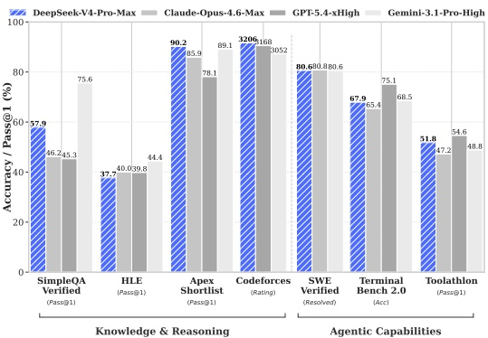

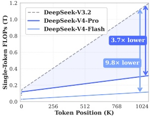

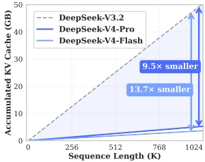

图1 | 左：DeepSeek-V4-Pro-Max及其对标模型的基准性能。右：DeepSeek-V4系列与DeepSeek-V3.2的推理FLOPs和KV缓存大小。

---

## 目录

1 引言 4  
  
2 架构 6  
  
2.1 继承自DeepSeek-V3的设计 7  
  
2.2 **流形约束的超连接** 7  
  
2.3 **基于CSA和HCA的混合注意力** 9  
  
2.3.1 **压缩稀疏注意力** 9  
  
2.3.2 **高度压缩注意力** 11  
  
2.3.3 其他细节 12  
  
2.3.4 **效率讨论** 13  
  
2.4 Muon优化器 14  
  
3 **通用基础设施** 15  
  
3.1 **专家并行中的细粒度通信-计算重叠** 15  
  
3.2 **基于TileLang的灵活高效核开发** 16  
  
3.3 **高性能批量不变且确定性的核库** 18  
  
3.4 **FP4量化感知训练** 19  
  
3.5 **训练框架** 20  
  
3.5.1 Muon的高效实现 20  
  
3.5.2 mHC的高性价比且内存高效实现 21  
  
3.5.3 **长上下文注意力的上下文并行** 21  
  
3.5.4 **用于灵活激活检查点的扩展自动微分** 21  
  
3.6 **推理框架** 22  
  
3.6.1 **KV缓存结构与管理** 22  
  
3.6.2 **磁盘KV缓存存储** 23  
  
4 **预训练** 24  
  
4.1 **数据构建** 24  
  
4.2 **预训练设置** 25  
  
4.2.1 **模型设置** 25  
  
4.2.2 **训练设置** 25  
  
4.2.3 **缓解训练不稳定** 26  
  
4.3 **评估** 27  
  
4.3.1 **评估基准** 27  
  
4.3.2 **评估结果** 28

---

5 **后训练** 29  
5.1 **后训练流水线** 29  
5.1.1 **专家训练** 29  
5.1.2 **在线策略蒸馏** 32  
5.2 **RL与OPD基础设施** 34  
5.2.1 **FP4量化集成** 34  
5.2.2 **全词汇OPD的高效教师调度** 34  
5.2.3 **可抢占且容错的Rollout服务** 34  
5.2.4 **面向百万Token上下文的RL框架扩展** 35  
5.2.5 **面向智能体AI的沙盒基础设施** 35  
5.3 **标准基准评估** 36  
5.3.1 **评估设置** 36  
5.3.2 **评估结果** 38  
5.4 **现实任务性能** 41  
5.4.1 **中文写作** 41  
5.4.2 **搜索** 42  
5.4.3 **白领任务** 42  
5.4.4 **代码智能体** 44  
6 **结论、局限性与未来方向** 44  
A **作者列表与致谢** 54  
A.1 **作者列表** 54  
A.2 **致谢** 55  
B **评估细节** 55

---

## 1. 引言

推理模型（DeepSeek-AI, 2025; OpenAI, 2024c）的出现确立了**测试时扩展的新范式**，推动了大语言模型（LLMs）性能的显著提升。然而，**这一扩展范式从根本上受限于标准注意力机制的二次方计算复杂度**（Vaswani et al., 2017），这为超长上下文和推理过程造成了难以承受的瓶颈。与此同时，**长时域场景与任务的涌现**——从复杂的智能体工作流到大规模跨文档分析——也使得高效支持超长上下文成为未来发展的关键。尽管近期开源工作（Bai et al., 2025a; DeepSeek-AI, 2024; MiniMax, 2025; Qwen, 2025）在通用能力上取得了进展，但**处理超长序列时的核心架构低效问题仍是主要阻碍**，限制了测试时扩展的进一步收益，也阻碍了对长时域场景和任务的深入探索。

为突破超长上下文中的效率瓶颈，我们开发了**DeepSeek-V4系列**，包括预览版DeepSeek-V4-Pro（1.6万亿参数，490亿激活参数）和DeepSeek-V4-Flash（2840亿参数，130亿激活参数）。通过架构创新，DeepSeek-V4系列在处理超长序列的计算效率上实现了**质的飞跃**。这一突破使得高效支持百万级别上下文长度成为可能，**开启了下一代大语言模型的百万长度上下文新时代**。我们相信，高效处理超长序列的能力将**解锁测试时扩展的下一个前沿**，为长时域任务的深入研究铺平道路，并为探索在线学习等未来范式奠定必要基础。

与DeepSeek-V3架构（DeepSeek-AI, 2024）相比，DeepSeek-V4系列保留了DeepSeekMoE框架（Dai et al., 2024）和多Token预测（MTP）策略，同时在架构和优化方面引入了多项关键创新。为提升长上下文效率，我们设计了**混合注意力机制**，结合了**压缩稀疏注意力（CSA）**和**高度压缩注意力（HCA）**。CSA沿序列维度压缩KV缓存，然后执行DeepSeek稀疏注意力（DSA）（DeepSeek-AI, 2025）；而HCA对KV缓存进行更激进的压缩，但保持密集注意力。为增强建模能力，我们引入了**流形约束超连接（mHC）**（Xie et al., 2026），对传统残差连接进行了升级。此外，我们将**Muon优化器**（Jordan et al., 2024; Liu et al., 2025）应用于DeepSeek-V4系列的训练，实现了更快的收敛和更稳定的训练。

为实现DeepSeek-V4系列的高效训练和推理以及高效开发，我们引入了多项基础设施优化。首先，我们设计并实现了**MoE模块的单一融合内核**，完全重叠了计算、通信和内存访问。其次，我们采用**TileLang**（Wang et al., 2026），一种**领域特定语言（DSL）**，以平衡开发效率与运行时性能。第三，我们提供了高效的**批量不变和确定性内核库**，确保训练和推理的比特级可重现性。第四，我们引入了**FP4量化感知训练**，用于MoE专家权重和索引器QK路径，以减少内存和计算开销。第五，在训练框架方面，我们扩展了**自动微分框架**，引入**张量级检查点**以实现细粒度的重计算控制；通过针对Muon优化器的**混合ZeRO策略**、基于重计算和融合内核的**经济高效mHC实现**以及管理压缩注意力的**两阶段上下文并行**，提升了训练效率。最后，在推理框架方面，我们设计了**异构KV缓存结构**，结合**磁盘存储策略**，以实现高效共享前缀复用。

---

通过采用混合 CSA 和 HCA，并在计算和存储上进行精度优化，**DeepSeek-V4 系列**与 DeepSeek-V3.2 相比，实现了**显著更低的推理 FLOPs** 和**大幅缩减的 KV 缓存大小**，尤其在长上下文场景中。图 1 右侧展示了 DeepSeek-V3.2 与 DeepSeek-V4 系列预估的单 token 推理 FLOPs 和累积 KV 缓存大小。在 1M token 上下文场景中，即使激活参数更多的 DeepSeek-V4-Pro，其单 token FLOPs（以等效 FP8 FLOPs 计）也仅为 DeepSeek-V3.2 的**27%**，KV 缓存大小仅为**10%**。此外，激活参数更少的 DeepSeek-V4-Flash 进一步提升了效率：在 1M token 上下文设置下，其单 token FLOPs 仅为 DeepSeek-V3.2 的**10%**，KV 缓存大小仅为**7%**。另外，对于 DeepSeek-V4 系列，路由专家参数采用 FP4 精度。尽管现有硬件上 FP4 × FP8 操作的峰值 FLOPs 与 FP8 × FP8 相同，但理论上在未来硬件上可实现**1/3 的效率提升**，这将进一步增强 DeepSeek-V4 系列的效率。

在预训练阶段，我们分别在 **32T tokens** 上训练 DeepSeek-V4-Flash，在 **33T tokens** 上训练 DeepSeek-V4-Pro。预训练完成后，这两个模型原生且高效地支持 **1M 长度上下文**。在我们的内部评估中，DeepSeek-V4-Flash-Base 凭借其更高效的参数设计，已在**大多数基准测试**上超越 DeepSeek-V3.2-Base。DeepSeek-V4-Pro-Base 进一步扩大这一优势，成为 DeepSeek 基础模型的新标杆，在**推理、编程、长上下文和世界知识**任务上实现了全面领先。

DeepSeek-V4 系列的后训练管道采用**两阶段范式**：先独立培养领域专家，再通过**在线策略蒸馏**（Lu and Lab, 2025）进行统一模型整合。首先，针对每个目标领域（如数学、编程、智能体、指令跟随），分别独立训练一个专家模型。基础模型先在高质量、领域特定数据上进行**监督微调**（SFT），以建立基础能力。随后，使用**组相对策略优化**（GRPO）（DeepSeek-AI, 2025）进行**强化学习**（RL），由针对特定成功标准设计的奖励模型引导，进一步优化模型以获得领域对齐行为。此阶段产生一组多样化的专业专家，各自在其领域表现卓越。最后，为了整合这些不同专长，通过在线策略蒸馏训练一个统一模型，其中统一模型作为学生，学习以教师模型优化逆向 KL 散度损失。

##### 核心评估结果摘要

• **知识**：在广泛世界知识评估中，DeepSeek-V4-Pro-Max（DeepSeek-V4-Pro 的最大推理努力模式）在 SimpleQA（OpenAI, 2024d）和 Chinese-SimpleQA（He et al., 2024）基准上**显著超越**领先的开源模型。在教育知识方面——通过 MMLU-Pro（Wang et al., 2024b）、HLE（Phan et al., 2025）和 GPQA（Rein et al., 2023）评估——DeepSeek-V4-Pro-Max 略领先于同类开源模型。DeepSeek-V4-Pro-Max 已**大幅缩小**与领先闭源模型 Gemini-3.1-Pro 的差距，尽管在基于知识的评估中仍稍逊一筹。

• **推理**：通过扩展推理 token，DeepSeek-V4-Pro-Max 在标准推理基准上展现出**优于** GPT-5.2 和 Gemini-3.0-Pro 的性能。然而，其表现**略逊于** GPT-5.4 和 Gemini-3.1-Pro，表明其发展轨迹落后于最前沿模型约 **3 到 6 个月**。此外，DeepSeek-V4-Flash-Max 达到了可比水平。

---

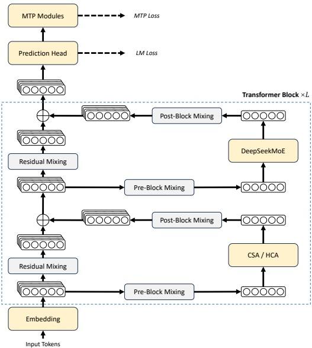

图2 | DeepSeek-V4系列整体架构。我们在注意力层使用混合CSA（压缩稀疏注意力）和HCA（高度压缩注意力），在前馈层使用DeepSeekMoE，并通过mHC增强传统残差连接。

性能达到GPT-5.2和Gemini-3.0-Pro的水平，**成为一种极具成本效益的架构**，适用于复杂推理任务。

• **Agent**：在公开基准测试中，DeepSeek-V4-Pro-Max与Kimi-K2.6和GLM-5.1等领先开源模型持平，但稍逊于前沿闭源模型。在内部评估中，DeepSeek-V4-Pro-Max优于Claude Sonnet 4.5，接近Opus 4.5的水平。

• **长上下文**：DeepSeek-V4-Pro-Max在100万token上下文窗口的合成和实际用例中表现强劲，在学术基准上甚至超越Gemini-3.1-Pro。

• **DeepSeek-V4-Pro 对比 DeepSeek-V4-Flash**：由于参数规模较小，DeepSeek-V4-Flash-Max在知识评估中表现较低。然而，当分配更大的思考预算时，**它在推理任务上取得了可比的结果**。在Agent评估中，尽管DeepSeek-V4-Flash-Max在多个基准上与DeepSeek-V4-Pro-Max性能相当，但在更复杂、高难度的任务上仍落后于其更大的版本。

## 2. 架构

总体而言，DeepSeek-V4系列保留了Transformer（Vaswani et al., 2017）架构和多Token预测（MTP）模块（DeepSeek-AI, 2024; Gloeckle et al., 2024），同时在DeepSeek-V3基础上引入了几项关键升级：（1）首先，我们引入流形约束超连接（mHC）（Xie et al., 2026）来增强传统残差连接；

---

(2) 其次，我们设计了一种**混合注意力架构**，通过**压缩稀疏注意力**和**重度压缩注意力**显著提升了长上下文效率。 (3) 第三，我们采用 Muon（Jordan 等, 2024; Liu 等, 2025）作为优化器。对于**混合专家（MoE）组件**，我们仍然采用 DeepSeekMoE（Dai 等, 2024）架构，仅对 DeepSeek-V3 做了少量调整。**多令牌预测（MTP）**（DeepSeek-AI, 2024; Gloeckle 等, 2024; Li 等, 2024; Qi 等, 2020）配置与 DeepSeek-V3 保持一致。所有其他未指定的细节均遵循 DeepSeek-V3（DeepSeek-AI, 2024）中建立的设置。图 2 展示了 DeepSeek-V4 的整体架构，具体细节如下所述。

### 2.1. 从 DeepSeek-V3 继承的设计

**混合专家。** 与之前的 DeepSeek 系列模型（DeepSeek-AI, 2024; DeepSeek-AI, 2024）一样，DeepSeek-V4 系列也在前馈网络（FFN）中采用 DeepSeekMoE 范式（Dai 等, 2024），该范式设置了**细粒度路由专家**和**共享专家**。与 DeepSeek-V3 不同的是，我们将计算亲和度分数的激活函数从 Sigmoid( $\cdot$) 改为 Sqrt(Softplus( $\cdot$))。对于**负载均衡**，我们同样采用**无辅助损失策略**（DeepSeek-AI, 2024; Wang 等, 2024a），并辅以轻微的**序列级平衡损失**，以防止单个序列内出现极端不平衡。对于 DeepSeek-V4，我们移除了对路由目标节点数量的限制，并精心重新设计了并行策略以保持训练效率。此外，与 DeepSeek-V3 相比，我们将初始几个 Transformer 块中的密集 FFN 层替换为采用**哈希路由**（Roller 等, 2021）的 MoE 层。哈希路由策略根据输入令牌 ID 的预定义哈希函数确定每个令牌的目标专家。

**多令牌预测。** 与 DeepSeek-V3 类似，DeepSeek-V4 系列也设置了 MTP 模块和目标。鉴于 MTP 策略已在 DeepSeek-V3 中得到验证，我们对其不加修改地直接应用于 DeepSeek-V4 系列。

### 2.2. **流形约束超连接**

如图 2 所示，DeepSeek-V4 系列引入了**流形约束超连接（mHC）**（Xie 等, 2026）来增强相邻 Transformer 块之间的传统残差连接。与朴素超连接（HC）（Zhu 等, 2025）相比，mHC 的核心思想是将残差映射约束在特定**流形**上，从而在保持模型表达能力的同时增强跨层信号传播的稳定性。本小节简要介绍标准 HC，并描述我们如何设计用于稳定训练的 mHC。

**标准超连接。** 标准 HC 将残差流的宽度扩展了 $n_{\mathrm{hc}}$ 倍。具体来说，残差流的形状从 $\mathbb{R}^d$ 扩展到 $\mathbb{R}^{n_{\mathrm{hc}} \times d}$，其中 $d$ 是实际层输入的隐藏大小。令 $X_l = [\mathbf{x}_{l,1}; \ldots; \mathbf{x}_{l,n_{\mathrm{hc}}}]^T \in \mathbb{R}^{n_{\mathrm{hc}} \times d}$ 为第 $l$ 层之前的残差状态。HC 引入了三个线性映射：输入映射 $A_l \in \mathbb{R}^{1 \times n_{\mathrm{hc}}}$、残差变换 $B_l \in \mathbb{R}^{n_{\mathrm{hc}} \times n_{\mathrm{hc}}}$ 和输出映射 $C_l \in \mathbb{R}^{n_{\mathrm{hc}} \times 1}$。残差状态的更新公式如下：

$$
X_{l+1}=B_{l}X_{l}+C_{l}\mathcal{F}_{l}(A_{l}X_{l}),   \tag*{(1)}
$$

其中 $\mathcal{F}_l$ 表示第 $l$ 层（例如 MoE 层），其输入和输出形状均为 $\mathbb{R}^d$。注意，实际层输入 $A_l X_l \in \mathbb{R}^d$ 也是 $d$ 维的，因此扩展后的残差

---

宽度**不影响内层设计**。HC**将残差宽度与实际隐藏大小解耦**，提供了一个**计算开销极小的互补缩放轴**，因为$n_{hc}$通常远小于隐藏大小d。然而，尽管HC在提升模型性能方面展现了潜力，我们发现当堆叠多个层时，训练会频繁出现**数值不稳定性**，这阻碍了HC的缩放。

**流形约束残差映射**。mHC的**核心创新**是将残差映射矩阵$B_l$约束到**双随机矩阵流形**（Birkhoff多面体）M上，从而增强**层间信号传播的稳定性**：

$$
B_{l}\in\mathcal{M}:=\{M\in\mathbb{R}^{n\times n}\mid M\mathbf{1}_{n}=\mathbf{1}_{n},\mathbf{1}_{n}^{T}M=\mathbf{1}_{n}^{T},M\geqslant0\}.   \tag*{(2)}
$$

该约束确保了映射矩阵的谱范数$\|B_l\|_2$**被限制在1以内**，因此残差变换是**非扩张**的，这在前向传播和反向传播过程中都增强了**数值稳定性**。此外，集合$M$在乘法下是封闭的，这保证了mHC深层堆叠场景下的稳定性。另外，**输入变换**$A_l$和**输出变换**$C_l$也通过Sigmoid函数被约束为**非负且有界**，以避免**信号抵消的风险**。

**动态参数化**。三个线性映射的参数是动态生成的，它们被分解为**动态（输入依赖）分量和静态（输入独立）分量**。给定输入$X_l \in \mathbb{R}^{n_h \times d}$，首先将其**展平并归一化**：$\hat{X}_l = \text{RMSNorm}(\text{vec}(X_l)) \in \mathbb{R}^{1 \times n_h \times d}$。然后，我们遵循传统HC生成**无约束的原始参数**$\hat{A}_l \in \mathbb{R}^{1 \times n_h}$，$\hat{B}_l \in \mathbb{R}^{n_h \times n_h}$，以及$\tilde{C}_l \in \mathbb{R}^{n_h \times 1}$：

$$
\tilde{A}_{l}=\alpha_{l}^{\mathrm{p r e}}\cdot(\hat{X}_{l}W_{l}^{\mathrm{p r e}})+S_{l}^{\mathrm{p r e}},   \tag*{(3)}
$$

$$
\tilde{B}_{l}=\alpha_{l}^{\mathrm{r e s}}\cdot\mathrm{M a t}(\hat{X}_{l}W_{l}^{\mathrm{r e s}})+S_{l}^{\mathrm{r e s}},   \tag*{(4)}
$$

$$
\tilde{C}_{l}=\alpha_{l}^{\mathrm{p o s t}}\cdot(\hat{X}_{l}W_{l}^{\mathrm{p o s t}})^{T}+S_{l}^{\mathrm{p o s t}},   \tag*{(5)}
$$

其中$W_l^{\text{pre}}, W_l^{\text{post}} \in \mathbb{R}^{n_{\text{hc}}d \times n_{\text{hc}}}$和$W_l^{\text{res}} \in \mathbb{R}^{n_{\text{hc}}d \times n_{\text{hc}}^2}$是用于生成**动态分量**的**可学习参数**；Mat( $\cdot$)将大小为$1 \times n_{\text{hc}}^2$的向量**重塑**为$n_{\text{hc}} \times n_{\text{hc}}$的矩阵；$S_l^{\text{pre}} \in \mathbb{R}^{1 \times n_{\text{hc}}}, S_l^{\text{post}} \in \mathbb{R}^{n_{\text{hc}} \times 1}$和$S_l^{\text{res}} \in \mathbb{R}^{n_{\text{hc}} \times n_{\text{hc}}}$是**可学习的静态偏置**；$\alpha_l^{\text{pre}}, \alpha_l^{\text{res}}, \alpha_l^{\text{post}} \in \mathbb{R}$是**可学习的门控因子**，初始化为小值。

**应用参数约束**。在获得**无约束的原始参数**$\tilde{A}_l$、$\tilde{B}_l$、$\tilde{C}_l$后，我们对其应用前述约束以**增强数值稳定性**。具体来说，对于**输入和输出映射**，我们使用**Sigmoid函数**$\sigma(\cdot)$来确保其**非负性和有界性**：

$$
A_{l}=\sigma(\tilde{A}_{l}),
$$

$$
C_{l}=2\sigma(\tilde{C}_{l}).   \tag*{(6)}
$$

至于残差映射$\tilde{B}_l$，我们将其**投影到双随机矩阵流形**$M$上。这通过**Sinkhorn-Knopp算法**实现，该算法首先对$\tilde{B}_l$应用**指数函数**以**确保正性**，得到$M^{(0)} = \exp(\tilde{B}_l)$，然后迭代执行**列和行归一化**；

$$
M^{(t)}=\mathcal{T}_{r}(\mathcal{T}_{c}(M^{(t-1)})),   \tag*{(8)}
$$

其中$\mathcal{T}_r$和$\mathcal{T}_c$**分别表示行归一化和列归一化**。该迭代**收敛到**一个**受约束的双随机矩阵**$B_l = M^{(t_{\max})}$。我们选择$t_{\max} = 20$作为实际值。

---

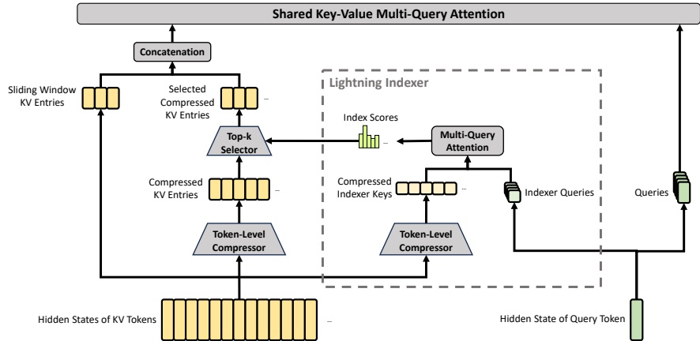

**图3 | CSA的核心架构**。它将KV条目数量压缩为原来的$\frac{1}{m}$倍，然后应用DeepSeek Sparse Attention进行进一步加速。此外，一小部分**滑动窗口KV条目**与选定的压缩KV条目相结合，以增强**局部细粒度依赖性**。

### 2.3. 基于CSA和HCA的混合注意力

随着上下文长度达到极端规模，注意力机制成为模型中的**主导计算瓶颈**。对于DeepSeek-V4，我们设计了两种高效的注意力架构——**压缩稀疏注意力（CSA）**和**高度压缩注意力（HCA）**——并采用它们的交错混合配置，这**显著降低了长文本场景中的注意力计算成本**。CSA结合了压缩和稀疏注意力策略：它首先将每m个token的**KV缓存**压缩为一个条目，然后应用DeepSeek Sparse Attention（DSA）（DeepSeek-AI, 2025），其中每个查询token仅关注k个压缩后的KV条目。HCA旨在通过将每$m'$（$\gg m$）个token的KV缓存合并为一个条目来实现**极端压缩**。CSA和HCA的混合架构**显著提升了DeepSeek-V4系列的长上下文效率**，使得**百万token的上下文**在实践中成为可行。本小节描述了我们混合注意力架构的核心技术，我们还提供了一个开源实现$^{1}$以明确说明更多细节。

#### 2.3.1. 压缩稀疏注意力

CSA的核心架构如图3所示，它首先将每m个token的KV缓存压缩为一个条目，然后应用DeepSeek Sparse Attention进行**进一步加速**。

**压缩KV条目**。设$H \in \mathbb{R}^{n \times d}$为输入隐藏状态序列，其中$n$为序列长度，$d$为隐藏大小。CSA首先计算两个KV条目序列$C^a, C^b \in \mathbb{R}^{n \times c}$及其对应的压缩权重$Z^a, Z^b \in \mathbb{R}^{n \times c}$，其中$c$为头

---

维度：

$$
C^{a}=H\cdot W^{a K V},\quad C^{b}=H\cdot W^{b K V},   \tag*{(9)}
$$

$$
Z^{a}=H\cdot W^{a Z},\qquad Z^{b}=H\cdot W^{b Z},   \tag*{(10)}
$$

其中 $W^{aKV}$、$W^{bKV}$、$W^{aZ}$、$W^{bZ} \in \mathbb{R}^{d \times c}$ 是可训练参数。接下来，$C^a$ 和 $C^b$ 中的每 **$m$ 个 KV 条目** 将根据其压缩权重和可学习的位置偏置 $B^a$、$B^b \in \mathbb{R}^{m \times c}$ 被压缩为一个条目，从而生成 $C^{\text{Comp}} \in \mathbb{R}^\frac{n}{m} \times c$。每个压缩后的条目 $C_i^{\text{Comp}} \in \mathbb{R}^c$ 通过以下方式计算：

$$
[S_{m i:m(i+1)-1}^{a};S_{m(i-1):m i-1}^{b}]=\operatorname{S o f t m a x}_{\operatorname{r o w}}\big([Z_{m i:m(i+1)-1}^{a}+B^{a};Z_{m(i-1):m i-1}^{b}+B^{b}]\big),   \tag*{(11)}
$$

$$
C_{i}^{Comp}=\sum_{j=mi}^{m(i+1)-1}S_{j}^{a}\odot C_{j}^{a}+\sum_{j=m(i-1)}^{mi-1}S_{j}^{b}\odot C_{j}^{b},   \tag*{(12)}
$$

其中 $\odot$ 表示哈达玛积；Softmax$_{row}(\cdot)$ 表示沿行维度的 Softmax 操作，该操作对来自 $Z^a$ 和 $Z^b$ 的共 **$2m$ 个元素** 进行归一化。当 $i = 0$ 时，$Z_{m(i-1):mi-1}^b$ 以负无穷填充，$C_{m(i-1):mi-1}^b$ 以零填充。注意，每个 $C_i^{Comp}$ 源自 **$2m$ 个 KV 条目**，但用于 $C_i^{Comp}$ 的 $C^b$ 索引与用于 $C_{i-1}^{Comp}$ 的 $C^a$ 索引存在重叠。因此，CSA 实际上将序列长度压缩为原来的 **$\frac{1}{m}$**。

**用于稀疏选择的 Lightning Indexer**。在获得压缩后的 KV 条目 $C^{Comp}$ 后，CSA 应用 DSA 策略，选择 **top-k 个压缩后的 KV 条目** 用于核心注意力机制。首先，CSA 执行与 $C^{Comp}$ 相同的压缩操作，得到压缩后的索引器键 $K^{IComp} \in \mathbb{R}^{\frac{n}{m} \times c^{l}}$，其中 $c^{l}$ 是索引器头维度。然后，对于查询令牌 $t$，我们以低秩方式生成索引器查询 $\{q_{t,1}^{l}, q_{t,2}^{l}, \ldots, q_{t,n_{t}^{l}}^{l}\}$：

$$
\mathbf{c}_{t}^{Q}=\mathbf{h}_{t}\cdot W^{D Q},   \tag*{(13)}
$$

$$
[\mathbf{q}_{t,1}^{I};\mathbf{q}_{t,2}^{I};...;\mathbf{q}_{t,n_{h}^{I}}^{I}]=\mathbf{q}_{t}^{I}=\mathbf{c}_{t}^{Q}\cdot W^{I U Q},   \tag*{(14)}
$$

其中 $\mathbf{h}_t \in \mathbb{R}^d$ 是查询令牌 $t$ 的输入隐藏状态；$\mathbf{c}_t^Q \in \mathbb{R}^d_c$ 是查询的压缩潜在向量；$d_c$ 表示查询压缩维度；$n_h^l$ 表示索引器查询头的数量；$W^{DQ} \in \mathbb{R}^{d \times d_c}$ 和 $W^{IUQ} \in \mathbb{R}^{d_c \times c_l^{n_h}}$ 分别是索引器查询的下投影和上投影矩阵。接下来，查询令牌 $t$ 与先前压缩块 $s$（$s < \text{Floor}(\frac{t}{m})$）之间的索引分数 $I_{t,s} \in \mathbb{R}$ 通过以下方式计算：

$$
[w_{t,1}^{I};w_{t,2}^{I};...;w_{t,n_{h}^{I}}^{I}]=\mathbf{w}_{t}^{I}=\mathbf{h}_{t}\cdot W^{w},   \tag*{(15)}
$$

$$
I_{t,s}=\sum_{h=1}^{n_{h}^{I}}w_{t,h}^{I}\cdot\mathrm{R e L U}\left(\mathbf{q}_{t,h}^{I}\cdot K_{s}^{\mathrm{I C o m p}}\right),   \tag*{(16)}
$$

其中 $W^{w} \in \mathbb{R}^{d \times n_h}$ 是一个可学习矩阵；$w_{t,h}^I \in \mathbb{R}$ 是第 $h$ 个索引器头的权重。对于查询令牌 $t$，根据其索引分数 $I_{t,:}$，我们采用 **top-k 选择器** 有选择地保留部分压缩后的 KV 条目 $C_t^{SprsComp}$，用于后续的核心注意力机制：

$$
C_{t}^{\mathrm{S p r s C o m p}}=\left\{C_{s}^{\mathrm{C o m p}}\;\middle|\;I_{t,s}\in\mathrm{T o p-k}(I_{t,:})\right\}.   \tag*{(17)}
$$

---

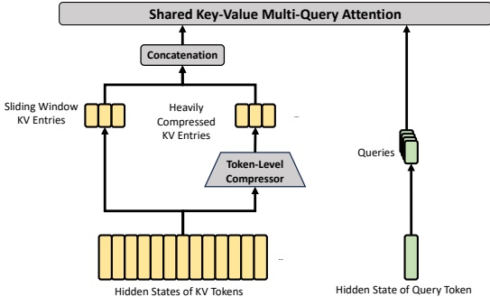

图4 | HCA的核心架构。它执行更重的压缩，其中 $m'$（$\gg$ m）个token的KV条目将被合并为一个。此外，我们还额外引入了一小组滑动窗口KV条目，以增强局部细粒度依赖。

**共享键值MQA**。在选择了稀疏KV条目后，CSA随后以**多查询注意力（MQA）**（Shazeer, 2019）的方式执行核心注意力，其中 $C_t^{SprsComp}$ 中的每个压缩KV条目同时充当注意力键和值。具体来说，对于查询token t，我们首先从压缩潜在向量 $\mathbf{c}_t^Q$ 生成注意力查询 $\{q_{t,1}; q_{t,2}; \ldots; q_{t,n_h}\}$：

$$
[\mathbf{q}_{t,1};\mathbf{q}_{t,2};...;\mathbf{q}_{t,n_{h}}]=\mathbf{q}_{t}=\mathbf{c}_{t}^{Q}\cdot W^{U Q},   \tag*{(18)}
$$

其中 $n_h$ 表示查询头的数量；$W^{UQ} \in \mathbb{R}^{d_c \times cn_h}$ 是查询的上投影矩阵。注意，潜在查询向量 $\mathbf{c}_t^Q$ 与索引器查询所使用的相同。接下来，我们对 $\{q_{t,i}\}$ 和 $C_t^{\text{SprsComp}}$ 执行MQA：

$$
\mathbf{o}_{t,i}=CoreAttn\left(\mathbf{q u e r y}=\mathbf{q}_{t,i},\mathbf{k e y}=C_{t}^{S p r s C o m p},\mathbf{v a l u e}=C_{t}^{S p r s C o m p}\right),   \tag*{(19)}
$$

其中 $\mathbf{0}_{t,i} \in \mathbb{R}^c$ 是第 $t$ 个 token 的第 $i$ 个头的核心注意力输出；**CoreAttn( $\cdot$)** 表示核心注意力操作。

**分组输出投影**。在DeepSeek-V4的配置中，$cn_h$ 相当大。因此，直接将核心注意力操作的输出 $[\mathbf{o}_{t,1}; \mathbf{o}_{t,2}; \ldots; \mathbf{o}_{t,nh}] = \mathbf{o}_t \in \mathbb{R}^{cn_h}$ 投影到 $d$ 维隐藏状态将带来巨大的计算负担。为减轻这一成本，我们设计了分组输出投影策略。具体来说，我们首先将 $n_h$ 个输出分成 $g$ 组，然后对每组输出 $\mathbf{o}_{t,i}^G \in \mathbb{R}^{c{\frac{n_h}{g}}}$，将其投影为 $d_g$ 维中间输出 $\mathbf{o}_{t,i}^{G'} \in \mathbb{R}^{d_g}$，其中 $d_g < c^{\frac{n_h}{g}}$。最后，将中间输出 $[\mathbf{o}_{t,1}^{G'}; \mathbf{o}_{t,2}^{G'}; \ldots; \mathbf{o}_{t,gh}^{G'}] \in \mathbb{R}^{d_g^g}$ 投影到最终的注意力输出 $\hat{\mathbf{o}}_t \in \mathbb{R}^d$。

#### 2.3.2. 重度压缩注意力

HCA的核心架构如图4所示，它以更重的方式压缩KV缓存，但不采用稀疏注意力。

**压缩KV条目**。总的来说，HCA的压缩策略与CSA类似，但采用了更大的压缩率 $m'$（$\gg m$）并且不执行重叠。

---

压缩。设 $H \in \mathbb{R}^{n \times d}$ 为输入隐藏状态序列，HCA 首先计算原始的 KV 条目 $C \in \mathbb{R}^{n \times c}$ 及其对应的压缩权重 $Z \in \mathbb{R}^{n \times c}$：

$$
C=H\cdot W^{K V},   \tag*{(20)}
$$

$$
Z=H\cdot W^{Z},   \tag*{(21)}
$$

其中 $W^{KV}, W^Z \in \mathbb{R}^{d \times c}$ 是可训练参数。接着，$C$ 中的每 $m'$ 个 KV 条目将根据压缩权重和**可学习的位置偏置** $B \in \mathbb{R}^{m' \times c}$ 压缩为一个，生成 $C^{\text{Comp}} \in \mathbb{R}^{\frac{n}{m' \times c}}$。每个压缩后的条目 $C_i^{\text{Comp}} \in \mathbb{R}^c$ 通过下式计算：

$$
S_{m^{\prime}i:m^{\prime}(i+1)-1}=Softmax_{row}\left(Z_{m^{\prime}i:m^{\prime}(i+1)-1}+B\right),   \tag*{(22)}
$$

$$
C_{i}^{\mathrm{C o m p}}=\sum_{j=m^{\prime}i}^{m^{\prime}(i+1)-1}S_{j}\odot C_{j}.   \tag*{(23)}
$$

**通过这种压缩操作，HCA 将序列长度压缩为原来的 $\frac{1}{m'}$ 倍。**

共享键值 MQA 与分组输出投影。HCA 还采用了与 CSA 相同的共享 KV MQA 和分组输出投影策略。在 KV 压缩之后，对于查询词元 $t$，HCA 首先通过**低秩方式**生成注意力查询 $\{\mathbf{q}_{t,1}; \mathbf{q}_{t,2}; \ldots; \mathbf{q}_{t,n_{h}}\}$：

$$
\mathbf{c}_{t}^{Q}=\mathbf{h}_{t}\cdot W^{D Q},   \tag*{(24)}
$$

$$
[\mathbf{q}_{t,1};\mathbf{q}_{t,2};...;\mathbf{q}_{t,n_{h}}]=\mathbf{q}_{t}=\mathbf{c}_{t}^{Q}\cdot W^{U Q},   \tag*{(25)}
$$

其中 $\mathbf{h}_t \in \mathbb{R}^d$ 是查询词元 $t$ 的输入隐藏状态；$n_h$ 表示查询头数量；$W^{DQ} \in \mathbb{R}^{d \times d_c}$ 和 $W^{UQ} \in \mathbb{R}^{d_c \times c n_h}$ 分别是查询的下投影和上投影矩阵。接着，我们对 $\{\mathbf{q}_{t,i}\}$ 和 $C^{\text{Comp}}$ 执行 MQA：

$$
\mathbf{o}_{t,i}=CoreAttn\left(\mathbf{q u e r y}=\mathbf{q}_{t,i},\mathbf{k e y}=C^{Comp},\mathbf{v a l u e}=C^{Comp}\right),   \tag*{(26)}
$$

其中 $\mathbf{o}_{t,i} \in \mathbb{R}^c$ 是第 $t$ 个词元上第 $i$ 个头的核心注意力输出。接下来，与 CSA 类似，HCA 将 $n_h$ 个输出分成 $g$ 组，对于每组输出 $\mathbf{o}_{t,i}^G \in \mathbb{R}^{c^{\frac{n_h}{g}}}$，HCA 将其投影为 $d_g$ 维的中间输出 $\mathbf{o}_{t,i}^G' \in \mathbb{R}^{d_g}$，其中 $d_g < c^{\frac{n_h}{g}}$。最后，HCA 将中间输出 $[\mathbf{o}_{t,1}^G'; \mathbf{o}_{t,2}^G'; \ldots; \mathbf{o}_{t,g}^G'] \in \mathbb{R}^{d_g}$ 投影为最终的注意力输出 $\hat{\mathbf{o}}_t \in \mathbb{R}^d$。

#### 2.3.3. 其他细节

除了上述 CSA 和 HCA 的核心架构外，我们的混合注意力还融合了其他若干技术。为行文清晰起见，我们在上述介绍中省略了这些附加技术，将在本小节中简要描述。同时，本小节仅关注其核心思想，为简洁起见可能省略一些微小细节。**建议读者参考我们的开源实现以获取明确无误的细节。**

查询与键值条目归一化。对于 CSA 和 HCA，在核心注意力操作之前，我们分别对查询的每个头以及压缩后 KV 条目的唯一头**额外执行 RMSNorm 操作**。这种归一化避免了注意力对数爆炸，并可能提升训练稳定性。

---

**部分旋转位置编码**。对于CSA和HCA，我们**部分地采用旋转位置编码**（RoPE）应用于注意力查询、KV条目以及核心注意力输出。具体来说，对于CSA和HCA中使用的每个查询向量和KV条目向量，我们对其最后64维应用RoPE。由于KV条目同时作为注意力键和值，朴素的核心注意力输出 $\{o_{t,i}\}$ 将携带绝对位置嵌入，这些嵌入来自KV条目的加权和。作为对策，我们还在每个 $\mathbf{o}_{t,i}$ 的最后64维上应用位置参数为 -i 的RoPE。这样一来，核心注意力的输出将携带**相对位置嵌入**——每个KV条目对核心注意力输出的贡献也将与查询和KV条目之间的距离相关。

**滑动窗口注意力的额外分支**。为了严格保持CSA和HCA中的因果性，每个查询仅关注前面的压缩KV块。因此，查询无法访问其自身压缩块内其他令牌的信息。同时，在语言建模中，最近的令牌通常与查询令牌具有**更大相关性**。基于这些原因，我们以滑动窗口方式为CSA和HCA引入了一个**补充注意力分支**，以更好地建模局部依赖关系。具体来说，对于每个查询令牌，我们额外生成 $n_{\text{win}}$ 个未压缩的KV条目，对应最近的 $n_{\text{win}}$ 个令牌。在CSA和HCA的核心注意力中，这些滑动窗口中的KV条目将与压缩的KV条目一起使用。

**注意力汇聚**。在CSA和HCA的核心注意力中，我们采用了注意力汇聚技巧（OpenAI, 2025; Xiao et al., 2024）。具体来说，我们设置一系列可学习的汇聚logits $\{z_{1}^{\prime}, z_{2}^{\prime}, \ldots, z_{n_{h}}^{\prime}\}$。对于第h个注意力头，$\text{Exp}(z_{h}^{\prime})$ 将被添加到注意力分数的分母中：

$$
s_{h,i,j}=\frac{\mathrm{E x p}(z_{h,i,j})}{\sum_{k}\mathrm{E x p}(z_{h,i,k})+\mathrm{E x p}(z_{h}^{\prime})},   \tag*{(27)}
$$

其中 $s_{h,i,j}, z_{h,i,j} \in \mathbb{R}$ 表示第h个注意力头中第i个查询令牌与第j个先前令牌或压缩块之间的注意力分数和注意力logit。该技术允许每个查询头将其总注意力分数调整为**不等于1**，甚至接近0。

#### 2.3.4. 效率讨论

由于采用了混合CSA和HCA，以及低精度计算和存储，DeepSeek-V4系列的注意力模块在注意力FLOPs和KV缓存大小方面均取得了**显著效率提升**，尤其是在长上下文场景中。首先，我们对KV条目采用**混合存储格式**：旋转位置编码（RoPE）维度使用BF16精度，其余维度使用FP8精度。这种混合表示相比纯BF16存储将KV缓存大小减少了近一半。其次，Lightning索引器内的注意力计算以**FP4精度**进行，在超长上下文下加速了注意力操作。第三，相对于DeepSeek-V3.2，DeepSeek-V4系列选择了更小的注意力top-k，从而提高了短文本和中等长度文本的模型效率。最后，也是最重要的，**压缩注意力和混合注意力技术**大幅减少了KV缓存大小和计算FLOPs。

以头维度为128的BF16 GQA8（Ainslie et al., 2023）作为基线——这是LLM注意力的常见配置之一——在1M上下文的设置下，DeepSeek-V4系列的KV缓存大小可以**戏剧性地减少到基线的约2%**。

---

算法1 DeepSeek-V4的Muon优化器

**需要**: 学习率 $\eta$，动量 $\mu$，权重衰减 $\lambda$，更新缩放因子 $\gamma$

1: 对于每个训练步 t，执行
2:     对于每个逻辑上独立的权重 $W \in \mathbb{R}^{n \times m}$，执行
3:          $G_t = \nabla_W \mathcal{L}_t(W_{t-1})$
4:          $M_t = \mu M_{t-1} + G_t$
5:          $O_t' = \text{HybridNewtonSchulz}(\mu M_t + G_t)$
6:          $O_t = O_t' \cdot \sqrt{\max(n, m)} \cdot \gamma$
7:          $W_t = W_{t-1} \cdot (1 - \eta \lambda) - \eta O_t$
8:     结束循环
9: 结束循环

此外，即使与已经具备高效基线的 DeepSeek-V3.2 (DeepSeek-AI, 2025) 相比，DeepSeek-V4 系列在效率上仍然展现出 **显著优势**。其推理 FLOPs 和 KV 缓存大小的对比见图 1 右侧部分。

### 2.4. Muon优化器

我们在 DeepSeek-V4 系列的大部分模块中采用 Muon (Jordan et al., 2024; Liu et al., 2025) 优化器，因其 **收敛速度更快** 且 **训练稳定性更佳**。我们的 Muon 优化完整算法总结于算法 1。

**基本配置**。我们保持对嵌入模块、预测头模块、mHC 模块的静态偏置和门控因子以及所有 RMSNorm 模块的权重使用 AdamW (Loshchilov and Hutter, 2017) 优化器。其余所有模块均使用 Muon 更新。遵循 Liu et al. (2025) 的做法，我们对 Muon 参数应用权重衰减，使用 Nesterov (Jordan et al., 2024; Nesterov, 1983) 技巧，并重新缩放更新矩阵的均方根 (RMS) 以复用于我们的 AdamW 超参数。与它们不同的是，我们使用 **混合牛顿-舒尔茨迭代** 进行正交化。

**混合牛顿-舒尔茨迭代**。对于给定矩阵 $M$，设其奇异值分解 (SVD) 为 $M = U \Sigma V^T$。牛顿-舒尔茨迭代旨在将 $M$ 近似正交化为 $UV^T$。通常，先将 $M$ 归一化为 $M_0 = M / \|M\|_F$ 以确保其最大奇异值不超过 1。然后，每次牛顿-舒尔茨迭代执行以下操作：

$$
M_{k}=a M_{k-1}+b\big(M_{k-1}M_{k-1}^{T}\big)M_{k-1}+c\big(M_{k-1}M_{k-1}^{T}\big)^{2}M_{k-1}.   \tag*{(28)}
$$

我们的混合牛顿-舒尔茨在 **两个不同阶段** 执行 10 次迭代。前 8 步中，我们使用系数 $(a, b, c) = (3.4445, -4.7750, 2.0315)$ 以 **驱动快速收敛**，使奇异值接近 1。最后 2 步中，我们切换至系数 $(a, b, c) = (2, -1.5, 0.5)$，从而 **稳定地将奇异值精确控制在 1**。

**避免注意力logits爆炸**。DeepSeek-V4 系列的注意力架构允许我们 **直接对注意力查询和KV条目应用RMSNorm**，从而有效防止注意力logits爆炸。因此，我们在 Muon 优化器中不采用 QK-Clip 技术 (Liu et al., 2025)。

---

## 3. 通用基础设施

### 3.1. 专家并行中的细粒度通信-计算重叠

混合专家模型（MoE）可通过**专家并行**（EP）加速。然而，EP要求复杂的节点间通信，并对互联带宽和延迟提出了很高的要求。为缓解EP中的通信瓶颈，并在更低的互联带宽需求下实现更高的端到端性能，我们提出了一种**细粒度EP方案**，将通信与计算融合到单个流水线内核中，实现通信与计算的重叠。

**通信延迟可以被隐藏。** 我们EP方案的关键洞察在于，MoE层中的通信延迟可以有效地隐藏在计算之下。如图5所示，在DeepSeek-V4系列中，每个MoE层主要可分解为四个阶段：两个通信密集型阶段——$\underline{\text{Dispatch}}$（分发）和 $\underline{\text{Combine}}$（合并），以及两个计算密集型阶段——$\underline{\text{Linear-1}}$和 $\underline{\text{Linear-2}}$。我们的性能分析表明，在单个MoE层内，通信的总时间小于计算的总时间。因此，在将通信与计算融合为一个统一流水线后，计算仍然是主要瓶颈，这意味着系统可以容忍较低的互联带宽，而不会降低端到端性能。

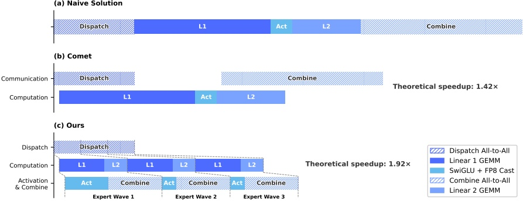

图5 | 我们的EP方案与相关工作的对比。Comet (Zhang et al., 2025b) 将Dispatch与Linear-1重叠，Linear-2与Combine分别重叠。我们的EP方案通过将专家分割并调度为多个wave，实现了**更细粒度的重叠**。理论加速比基于DeepSeek-V4-Flash架构配置进行评估。

**细粒度EP方案。** 为了进一步降低互联带宽需求并增强重叠的收益，我们引入了一种**更细粒度的专家划分方案**。受多项相关工作 (Aimuyo et al., 2025; Zhang et al., 2025b) 的启发，我们将专家分割并调度为多个wave。每个wave包含一小部分专家。一旦wave内的所有专家完成通信，计算即可立即开始，无需等待其他专家。在稳态下，当前wave的计算、下一wave的令牌传输以及已完成专家的结果发送可以同时进行，如图5所示。这形成了专家间的**细粒度流水线**，使计算和通信在整个wave期间保持连续。基于wave的调度方案显著提升了重叠效率。

---

在诸如 **Reinforcement Learning (RL) rollout** 等极端情况下的性能，这些情况通常遇到**长尾小批量数据**。

**性能与开源的大核（Mega-Kernel）**。我们在 NVIDIA GPU 和华为昇腾 NPU 平台上验证了细粒度 EP 方案。与强非融合基线相比，对于通用推理工作负载，它实现了 **1.50 ∼ 1.73 倍** 的加速，对于延迟敏感场景（如 **RL rollouts** 和高速智能体服务）则高达 **1.96 倍**。我们已开源基于 CUDA 的大核实现，命名为 **MegaMoE²**，作为 DeepGEMM 的一个组件。

**观察与建议**。我们分享内核开发中的观察和经验教训，并向硬件供应商提出一些建议，以期助力高效硬件设计并实现更好的软硬件协同设计：

• **计算-通信比**。完全的计算-通信重叠取决于**计算-通信比**，而不仅仅是带宽。用 C 表示峰值计算吞吐量，B 表示互连带宽，当 $C/B \leq V_{comp}/V_{comm}$ 时，通信可以被完全隐藏，其中 $V_{comp}$ 表示计算量，$V_{comm}$ 表示通信量。对于 DeepSeek-V4-Pro，每个 token-专家对需要 6hd FLOPs（SwiGLU 门控、上投影和下投影），但仅需 3h 字节的通信（FP8 分发 + BF16 合并），这简化为：

$$
\frac{C}{B}\leqslant2d=6144FLOPs/Byte.
$$

也就是说，每 GBps 的互连带宽足以隐藏 6.1 TFLOP/s 计算量的通信。一旦带宽达到这一阈值，它就不再是瓶颈，将额外的芯片面积用于进一步提升带宽会带来**边际收益递减**。我们鼓励未来的硬件设计瞄准这样的平衡点，而不是无条件地扩展带宽。

• **功耗预算**。极端的核融合使得计算、存储和网络同时处于高负载状态，使得**功率限制**成为关键的性能瓶颈。我们建议未来的硬件设计为此类完全并发的工作负载提供充足的功率余量。

• **通信原语**。我们采用基于**拉取（pull-based）**的方式，每个 GPU 主动从其他 GPU 读取数据，避免了细粒度推送（push）所需的高通知延迟。未来具有更低延迟跨 GPU 信令的硬件将使推送变得可行，并实现更自然的通信模式。

• **激活函数**。我们建议用低成本的逐元素激活函数替换 SwiGLU，该函数不涉及指数或除法运算。这直接减轻了后 GEMM 处理负担，并且在相同的参数预算下，移除门控投影会扩大中间维度 d，进一步**放宽带宽需求**。

### 3.2. 使用 TileLang 进行灵活高效的内核开发

在实践中，我们精细的模型架构本会产生数百个细粒度的 Torch ATen 算子。我们采用 **TileLang**（Wang et al., 2026）开发了一组融合内核来取代其中的绝大部分，以最小的努力实现了**最优性能**。

---

还允许我们在验证过程中快速原型设计如注意力变体之类的算子。这些核在模型架构开发、大规模训练以及最终推理服务的生产部署中扮演关键角色。作为一种**领域特定语言（DSL）**，TileLang在开发效率与运行时性能之间取得平衡，支持快速开发，同时在同一代码库内实现深度、迭代的优化。此外，我们与TileLang社区紧密合作，以培育更敏捷、高效、稳定的核开发工作流。

**通过主机代码生成减少调用开销**。随着加速器性能不断提升，CPU侧的编排开销日益突出。对于小型、高度优化的核，这种固定的主机开销很容易限制利用率和吞吐量。此类开销的一个常见来源是，主机端逻辑（如运行时契约检查）通常用Python编写以追求灵活性，从而带来固定的每次调用成本。

我们通过**主机代码生成（Host Codegen）**来缓解这一开销，将大多数主机端逻辑移至生成的主机代码中。具体而言，我们首先在**中间表示（IR）**级别协同生成设备核和一个轻量级主机启动器，嵌入从语言前端解析的必要元数据——如数据类型、秩/形状约束、步长/布局假设。然后，启动器被降级到基于TVM-FFI（Chen等，2018）框架构建的主机源代码之上，其紧凑的调用约定和零拷贝张量互操作共同最小化了主机端开销。在运行时，这段生成的主机代码执行验证和参数编组，将所有Python执行路径中的每次调用开销转移。我们的测量显示，CPU侧验证开销从几十或几百微秒降至每次调用不足一微秒。

**SMT求解器辅助的形式化整数分析**。TileLang核涉及复杂的张量索引算术，需要强大的形式化整数分析能力。在布局推断、内存危害检测、边界分析等编译优化阶段，编译器必须验证整数表达式是否满足特定属性以启用相应优化。因此，更强的形式化分析能力能够解锁更高级、更复杂的优化机会。

为此，我们将**Z3 SMT求解器**（De Moura和Bjørner，2008）集成到TileLang的代数系统中，为张量程序中的大多数整数表达式提供形式化分析能力。我们通过将TileLang的整数表达式转换为Z3的**无量词非线性整数算术（QF_NIA）**，在计算开销与时态表达能力之间取得平衡。基于整数线性规划（ILP）求解器的QF_NIA无缝地解决内核中常见的标准线性整数表达式。此外，其固有的非线性推理能力有效应对高级挑战，如对可变张量形状进行向量化。在合理的资源限制下，Z3提升了整体优化性能，同时将编译时间开销限制在几秒内。这在多个优化阶段（包括向量化、屏障插入和代码简化）产生显著影响。

**数值精度与位级可重现性**。在生产环境中，数值正确性和可重现性与原始吞吐量同样重要。因此，我们默认优先保证精度：在编译器层面禁用快速数学优化，而影响精度的近似操作仅作为显式、主动选择的**前端算子**提供（例如T.__exp、T.__log和T.__sin）。反之，当需要严格的IEEE-754语义时，TileLang提供相应支持。

---

支持显式舍入模式的 IEEE 兼容内建函数（例如 **T.ieee_fsqrt**、**T.ieee_fdiv** 和 **T.ieee_add**），使开发者能够精确指定数值行为。

我们还致力于**位级可重现性**，以验证内核与手写 CUDA 基线的对齐。我们将 **TileLang 的代数化简和下推规则与主流 CUDA 工具链（如 NVCC）对齐**，避免引入意外位级差异的转换。**布局注解（例如 T.annotate_layout）** 进一步允许用户固定布局相关的下推决策，使求值和累积顺序与参考 CUDA 实现保持一致，从而在需要时实现比特级完全一致的输出。

我们的评估表明，这些**面向精度和可重现性的设计选择并未牺牲性能**：在保守默认设置下，TileLang 内核仍具有竞争力，同时暴露了可选择性放宽数值约束以提升速度的调节旋钮。

### 3.3. 高性能批不变性与确定性内核库

为了支持高效的训练和推理，我们开发了一套**全面高性能的计算内核**。除了基本功能和最大化硬件利用率之外，另一个关键设计目标是**确保训练的可重现性以及预训练、后训练和推理流水线之间的位级对齐**。因此，我们实现了**端到端、位级批不变性和确定性内核**，且性能开销最小。这些内核有助于调试、稳定性分析和一致的后训练行为。

**批不变性**。批不变性确保任何给定 token 的输出**在比特级上完全一致**，无论其在批次中的位置如何。为了实现批不变性，主要挑战如下：

- **注意力机制**。为了实现批不变性，我们不能使用**拆分-KV 方法**（Dao 等人，2023），该方法将单个序列的注意力计算分布到多个流多处理器（SM）上以平衡负载。然而，放弃该技术会导致严重的**波量化问题** $^{3}$，这可能会对 GPU 利用率产生不利影响。为了解决这个问题，我们开发了一种**双内核策略**用于批不变解码。**第一个内核**在单个 SM 内计算整个序列的注意力输出，确保满载波的高吞吐量。**第二个内核**为了最小化最终部分填充波的延迟，从而缓解波量化，使用多个 SM 处理单个序列。为了确保这两个内核的位级一致性，我们精心设计了第二个内核的计算路径，使其**累积顺序与第一个内核相同**。此外，第二个内核利用**线程块簇内的分布式共享内存** $^{4}$，实现跨 SM 的高速数据交换。这种双内核方法有效地将批不变解码的开销控制在可忽略的水平。

- **矩阵乘法**。传统的 cuBLAS 库（NVIDIA 公司，2024）无法实现批不变性。因此，我们**用 DeepGEMM**（Zhao 等人，2025）**端到端地替换了它**。此外，对于非常小的批次大小，传统实现通常使用**拆分-k**（Osama 等人，2023）技术来提升性能。不幸的是，拆分-k 技术无法保证批不变性，而这是 DeepSeek-V4 中的一个关键特性。

---

因此，我们在大多数场景中**放弃了 split-k**，但这可能会导致性能下降。为了解决这个问题，我们引入了一系列优化措施，使得我们实现的矩阵乘法在大多数主要场景中能够**匹配甚至超越**标准 split-k 的性能。

**确定性**。确定性训练对于调试硬件或软件问题非常有益。此外，当训练出现异常（如损失尖峰）时，确定性使研究人员更容易定位数值原因并进一步优化模型设计。训练中的非确定性通常源于非确定性的累加顺序，这往往是由于使用了原子加法指令。该问题主要出现在反向传播过程中，尤其是在以下部分：

- **注意力反向传播**。在稀疏注意力的传统反向传播实现中，我们使用 atomicAdd 来累加 KV token 的梯度。由于浮点数加法的非结合性，这引入了非确定性。为了解决这个问题，我们为每个 SM 分配独立的累加缓冲区，然后对所有缓冲区进行全局确定性求和。

- **MoE 反向传播**。当来自不同 rank 的多个 SM 同时向接收 rank 上的同一缓冲区写入数据时，协商写入位置也会引入非确定性。为了解决这个问题，我们设计了每个单独 rank 内的 token 顺序预处理机制，并结合跨多个 rank 的缓冲区隔离。这一策略确保了专家并行发送结果和 MoE 反向传播中累加顺序的确定性。

- **mHC 中的矩阵乘法**。mHC 涉及一个输出维度仅为 24 的矩阵乘法。对于非常小的批量大小，我们被迫使用 split-k（Osama 等, 2023）算法，其朴素实现会导致非确定性。为了解决这个问题，我们分别输出每个拆分部分，并在后续核函数中执行确定性归约，从而**同时保持性能和确定性**。

### 3.4. FP4 量化感知训练

为了实现部署时的推理加速和内存节省，我们在训练后阶段引入了**量化感知训练（QAT）**（Jacob 等, 2018），使模型能够适应量化引入的精度下降。我们将 FP4（MXFP4）量化（Rouhani 等, 2023）应用于两个组件：（1）MoE 专家权重，这是 GPU 内存占用的**主要来源**（OpenAI, 2025）；（2）CSA 索引器中的查询-键（QK）路径，其中 QK 激活值完全以 FP4 格式缓存、加载和相乘，从而加速长上下文场景中的注意力分数计算。此外，在 QAT 过程中，我们还将索引分数 $I_{:,:}$ 从 FP32 进一步量化为 BF16。这一优化为 top-k 选择器实现了**2 倍加速**，同时保持了 99.7% 的 KV 条目召回率。

对于 MoE 专家权重，遵循 QAT 的常见做法，优化器维护的 FP32 主权重首先被量化为 FP4，然后反量化回 FP8 用于计算。值得注意的是，我们的 FP4 到 FP8 反量化是**无损的**。这是因为 FP8（E4M3）相比于 FP4（E2M1）多了 2 个指数位，提供了更大的动态范围。因此，只要每个 FP8 量化块（128×128 tile）内 FP4 子块（1×32 tile）的最大和最小缩放因子之比不超过某个阈值，细粒度的缩放信息就可以被 FP8 扩展的动态范围**完全吸收**。我们通过实验验证了当前权重满足这一条件。这使得整个 QAT 流程能够**完全重用**现有的 FP8 训练框架，无需

---

任何修改。在反向传播中，梯度是根据前向传播中相同的FP8权重计算的，并直接传播回FP32主权重，相当于通过量化操作应用直通估计器（STE）。这也避免了对转置权重进行重新量化的需要。

在RL训练的推理和滚动阶段（不涉及反向传播），**我们直接使用真实的FP4量化权重**，而不是模拟量化。这确保了采样期间的模型行为与在线部署完全一致，同时减少了内核内存加载以实现实际加速，并显著降低了内存消耗。类似地，我们在CSA索引器中处理QK路径。

### 3.5. 训练框架

我们的训练框架建立在为DeepSeek-V3开发的可扩展且高效的基础设施之上。在训练DeepSeek-V4时，我们继承了这一坚实基础，同时引入了若干关键创新以适应其新颖的架构组件——特别是Muon优化器、mHC和混合注意力机制——同时保持高训练效率和稳定性。

#### 3.5.1. Muon的高效实现

Muon优化器需要完整的梯度矩阵来计算参数更新，这在与零冗余优化器（ZeRO）结合时带来了挑战。传统的ZeRO针对逐元素优化器（如AdamW）设计，其中单个参数矩阵可以被分区并在多个rank上更新。为了解决这一冲突，**我们为Muon设计了一种ZeRO桶分配的混合策略**。

对于稠密参数，我们限制ZeRO并行的最大大小，并**采用背包算法**将参数矩阵分配到这些rank上，确保每个rank管理大致平衡的负载。每个rank上的桶被填充以匹配所有rank中最大桶的大小，便于高效的reduce-scatter操作。在我们的设置中，每个rank管理不超过五个参数矩阵，这种填充通常引入不到10%的内存开销。当数据并行的总体大小超过ZeRO限制时，我们在额外的数据并行组中冗余计算Muon更新，以计算换取减少的总桶内存。

对于MoE参数，我们独立优化每个专家。首先将所有层中所有专家的SwiGLU中的所有下投影矩阵展平，接着展平上投影矩阵和门矩阵。然后，我们对展平的向量进行填充，以确保我们可以将这个向量均匀分布到所有rank上，而无需拆分任何逻辑上独立的矩阵。由于专家数量众多，我们不对MoE参数的ZeRO并行设置限制，填充开销也可忽略不计。

此外，在每个rank上，形状相同的连续参数将自动合并，从而实现Newton-Schulz迭代的批量执行，以提高硬件利用率。此外，我们观察到Muon中的Newton-Schulz迭代在使用BF16矩阵乘法计算时保持稳定。利用这一点，**我们进一步以随机舍入方式将MoE梯度量化为BF16精度**，在数据并行rank之间同步，从而将通信量减半。为了避免低精度加法器引入的累积误差，**我们用两阶段方法取代传统的树形或环形reduce-scatter集合**。首先，全到全操作在各rank之间交换局部梯度，然后每个rank以FP32格式执行局部求和。这种设计保持了数值鲁棒性。

---

#### 3.5.2. **成本效益高且内存高效的mHC实现**

与传统残差连接相比，mHC的引入增加了**激活内存消耗**和**流水线阶段间的通信量**。为缓解这些开销，我们实施了几种优化策略。

首先，我们**精心设计并实现了**训练和推理的**mHC融合内核**。其次，我们引入了一种**重计算策略**，选择性地对中间张量进行检查点设置。具体来说，我们重新计算了**层间的大多数隐藏状态**和**所有归一化层的输入**，同时**避免了计算密集型操作**的重计算。这**在内存节省和计算开销之间取得了平衡**。第三，我们**调整了DualPipe 1F1B重叠方案**，以适应增加的流水线通信，并允许mHC中某些操作的**并发执行**。

总体而言，这些优化将mHC的**墙钟时间开销限制为重叠的1F1B流水线阶段的6.7%**。工程优化的更多细节可在专门的mHC论文（Xie et al., 2026）中找到。

#### 3.5.3. **长上下文注意力的上下文并行**

传统上下文并行将序列维度分割，每个rank维护**连续的s个token**。这给我们的压缩注意力机制带来了两个挑战。一方面，训练样本由多个序列**打包而成**，每个序列**独立地以因子m（或m'）压缩**，任何少于m的尾部token被丢弃。因此，压缩后的KV长度通常**小于s/m**，且各rank之间不同。另一方面，压缩需要**m个连续的KV条目**，这些条目可能**跨越两个相邻CP rank的边界**。

为了解决这些挑战，我们设计了一种**两阶段通信方法**。第一阶段，每个rank i将其**最后m个未压缩的KV条目**发送给rank i+1。然后，rank i+1将其中一些接收到的条目与**本地s个未压缩KV条目**一起压缩，产生**固定长度为s/m+1的压缩条目**，其中存在一些填充条目。第二阶段，在所有CP rank上执行**all-gather操作**，收集本地压缩的KV条目。然后，一个**融合的选择和填充算子**将它们重新组织为完整的压缩KV条目集，总长度为cp_size * s/m。任何填充条目位于尾部。对于HCA和CSA中的索引器，每个查询token的压缩KV条目的**可见范围**可以通过规则**预先计算**。对于CSA中的稀疏注意力，**top-k选择器**明确指定每个查询可见的压缩KV条目的索引。

#### 3.5.4. **用于灵活激活检查点的扩展自动微分**

传统激活检查点实现**以整个模块为粒度**，决定在反向传播期间保留还是重新计算其输出激活。这种**粗粒度**常常导致**重计算成本和激活内存占用之间的次优权衡**。另一种方法是**手动实现整个层的前向和反向逻辑**，显式管理张量检查点状态。虽然**实现了细粒度控制**，但这种方法**失去了自动微分框架的便利性**，大幅增加了开发复杂度。

为了在不牺牲编程效率的情况下实现**细粒度控制**，我们实现了一种**支持自动微分的张量级激活检查点机制**。利用这种机制，开发人员只需**实现前向传播**并**选择性地注释**。

---

用于自动检查点和重计算的**独立张量**。我们的框架利用 TorchFX (Reed et al., 2022) 来追踪**完整的计算图**。对于每个被标注的张量，它执行反向遍历以识别其重计算所需的**最小子图**。我们将这些最小子图定义为**重计算图**，并在对应梯度计算之前将其插入反向逻辑中。

与手动实现相比，该设计在训练过程中**不会引入额外开销**。该框架中的重计算是通过**直接释放**已标注张量的 GPU 内存并**复用**重计算张量的存储指针来实现的，无需任何 GPU 内存拷贝。此外，由于图追踪具体执行模型，我们可以追踪每个张量的底层存储指针，从而实现对共享存储的张量（例如 reshape 操作的输入和输出）进行**自动重计算去重**。这使开发者在标注重计算时**无需再考虑底层内存细节**。

### 3.6. 推理框架

我们的推理框架在很大程度上继承了 DeepSeek-V3 的框架，但在 **KV Cache 管理方面存在一些差异**。

#### 3.6.1. KV Cache 结构与管理

为了**高效管理** DeepSeek-V4 中混合注意力机制产生的异构 KV cache，我们设计了一种**定制化的 KV cache 布局**。该布局如图 6 所示，下面我们将详细阐述。

**DeepSeek-V4 中的异构 KV 条目。** DeepSeek-V4 系列中的混合注意力机制引入了多种类型的 KV 条目，这些条目具有不同的键值（KV）缓存大小和更新规则。用于稀疏选择的**闪电索引器**向 KV cache 引入了额外的维度，这些维度的嵌入大小与主注意力中的不同。CSA 和 HCA 中采用的**压缩技术**分别将序列长度减少 $\frac{1}{m}$ 和 $\frac{1}{m}$ 倍，从而减小了总 KV cache 大小。因此，不同层的 KV cache 大小各不相同。此外，**滑动窗口注意力**（SWA）层也以不同的 KV cache 大小运行，并具有独立的缓存命中与驱逐策略。在压缩分支中，每 m 个 token 生成一个 KV 条目。当剩余 token 数量不足以进行压缩时，所有待处理的 token 及其关联的隐藏状态必须保留在缓冲区中，直到可以执行压缩操作。这些缓冲的 token 代表了由位置上下文确定的序列状态，并在 KV cache 框架内进行管理。

**管理混合注意力 KV Cache 的挑战。** 混合注意力机制**违反了** PagedAttention 及其变体背后的**基本假设**。尽管最近的混合 KV cache 管理算法（例如 Jenga (Zhang et al., 2025a)、Hymba (Dong et al., 2025)）针对通用混合注意力模型或特定结构，但**两个主要障碍**阻止了在 PagedAttention 框架下整合所有层的 KV cache：

• 多样化的缓存策略，例如滑动窗口注意力中使用的策略。

• 高性能注意力核施加的约束，包括**对齐要求**。

---

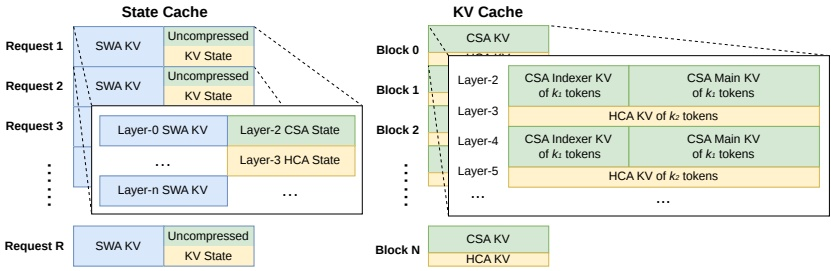

图6 | DeepSeek-V4的KV缓存布局示意图。KV缓存组织为两个主要部分：用于CSA/HCA的经典KV缓存，以及用于SWA和CSA/HCA中未就绪压缩令牌的状态缓存。在状态缓存中，每个请求分配一个固定大小的缓存块。在该块内，SWA段存储最近 $n_{\text{win}}$ 个令牌对应的KV条目，而CSA/HCA段存储尚未准备好压缩的未压缩尾部状态。在经典KV缓存中，我们为每个请求分配多个缓存块。每个缓存块覆盖 $\text{lcm}(m, m')$ 个原始令牌，生成 $k_1 = \frac{\text{lcm}(m, m')}{m}$ 个CSA压缩令牌和 $k_2 = \frac{\text{lcm}(m, m')}{m'}$ 个HCA压缩令牌。

为了实现DeepSeek-V4的高效KV缓存管理，我们设计了相应的策略来克服这两个挑战。

**SWA与未压缩尾部令牌的状态缓存**。针对第一个障碍，我们采用了替代的缓存管理机制。由于SWA旨在**在有限的KV缓存大小下提升性能**，因此将其与压缩分支中的未压缩尾部令牌一起视为**状态空间模型**是合理的。相应的KV缓存可以视为**仅依赖于当前位置的序列特定状态**。据此，我们预分配一个**固定且有限大小的状态缓存池**，并动态将其分配给每个序列。

**稀疏注意力内核协同设计**。针对第二个障碍，传统的高性能注意力内核通常假设每个块有固定数量B个令牌以优化性能，对应CSA中 $B \cdot m$ 个原始令牌和HCA中 $B \cdot m'$ 个原始令牌。通过采用**高性能稀疏注意力内核**，不同层可以容纳每块可变数量的令牌而不会降低性能。实现这一点需要**协同设计KV缓存布局和稀疏注意力内核**。例如，对缓存块进行填充以对齐缓存行可以提升性能。因此，对于压缩比为m的CSA和压缩比为 $m'$ 的HCA，每个块的原始令牌数可以是这两个压缩比的最小公倍数 $\text{lcm}(m, m')$ 的任意倍数。

#### 3.6.2. 磁盘上KV缓存存储

在服务DeepSeek-V4时，我们利用磁盘上KV缓存存储机制来**消除共享前缀请求的重复预填充**。对于CSA/HCA中的压缩KV条目和滑动窗口注意力（SWA）中的未压缩KV条目，我们设计了**独立的存储管理方案**。

---

对于CSA和HCA，我们简单地将所有压缩后的KV条目存储到磁盘上。当请求命中一个已存储的前缀时，我们读取并重用该前缀对应的压缩KV条目，直到最后一个完整的压缩块。特别地，对于尾部不完整块中的前缀令牌，我们仍需重新计算它们以恢复未压缩的KV条目，因为CSA和HCA中的未压缩KV条目并未存储。

对于SWA KV条目，由于它们未被压缩且存在于每一层中，其体积大约是压缩后的CSA和HCA KV条目的8倍。为了高效处理这些庞大的SWA KV条目，我们提出并实现了三种不同的磁盘SWA KV条目管理策略，每种策略在存储开销与计算冗余之间做出不同的权衡：

- **完整SWA缓存**。此策略存储所有令牌的完整SWA KV条目，确保计算零冗余。在此策略下，命中前缀的SWA KV条目只需读取该前缀最后$n_{win}$个令牌的磁盘缓存即可重建。尽管计算零冗余，但此策略在现代基于SSD的存储系统中效率低下——每次命中请求只会访问存储的SWA KV缓存的一小部分，导致不平衡的写密集型访问模式。

- **周期性检查点**。此策略每隔p个令牌设置一个检查点，存储最后$n_{win}$个令牌的SWA KV条目（p为可调参数）。对于命中前缀，我们加载最近的检查点状态，然后重新计算剩余的尾部令牌。通过调整p，此策略实现了存储与计算之间的按需权衡。

- **零SWA缓存**。此策略不存储任何SWA KV条目。对于命中前缀，我们需要进行更多的重计算来恢复SWA KV条目。具体来说，在每个注意力层中，每个令牌的SWA KV条目仅依赖于上一层中最近$n_{\text{win}}$个令牌的SWA KV条目。因此，利用缓存的CSA和HCA KV条目，只需重新计算最后$n_{\text{win}} \cdot L$个令牌，即可为L层模型恢复最后$n_{\text{win}}$个SWA KV条目。

根据具体的部署场景，我们选择最合适的策略，以实现存储与计算之间的期望权衡。

## 4. 预训练

### 4.1. 数据构建

在DeepSeek-V3预训练数据的基础上，我们致力于构建一个更多样化、更高质量且有效上下文更长的训练语料库。我们不断优化数据构建流程。对于网络来源数据，我们实施过滤策略以移除批量自动生成和模板化内容，从而降低模型崩溃的风险（Zhu et al., 2024）。数学和编程语料仍是训练数据的核心组成部分，我们还在中期训练阶段通过引入代理数据进一步增强DeepSeek-V4系列的编码能力。对于多语言数据，我们为DeepSeek-V4构建了更大的语料库，提升了其对不同文化中长尾知识的捕捉能力。对于DeepSeek-V4，我们**特别强调长文档数据的筛选**，优先选择科学论文、技术报告及其他体现独特学术价值的材料。综合以上所有，我们的预训练语料库包含超过32T个令牌，涵盖数学内容、代码、网页、长文档以及其他高质量类别。

对于预训练数据，我们基本上遵循与DeepSeek-相同的预处理策略。

---

V3. 关于分词，在 DeepSeek-V3 分词器的基础上，我们引入了少量特殊标记用于上下文构建，并**保持词汇量大小仍为 128K**。我们还继承了 DeepSeek-V3 中的令牌拆分 (DeepSeek-AI, 2024) 和中间填充 (FIM) (DeepSeek-AI, 2024) 策略。受 Ding 等人 (2024) 的启发，我们将来自不同来源的文档打包成适当的序列，以**尽量减少样本截断**。与 DeepSeek-V3 不同，我们在预训练期间采用了**样本级注意力掩码**。

### 4.2. 预训练设置

#### 4.2.1. 模型设置

**DeepSeek-V4-Flash**。我们将 Transformer 层数设置为 43，隐藏维度 $d$ 设置为 4096。对于前两层，我们使用纯滑动窗口注意力。在后续层中，交替使用 CSA 和 HCA。对于 CSA，我们将压缩率 $m$ 设置为 4，索引器查询头数 $n_h^l$ 设置为 64，索引器头维度 $c^l$ 设置为 128，并**将稀疏注意力选择的 KV 条目数（即注意力 top-k）设置为 512**。对于 HCA，我们将压缩率 $m'$ 设置为 128。对于 CSA 和 HCA，我们都将查询头数 $n_h$ 设置为 64，头维度 $c$ 设置为 512，查询压缩维度 $d_c$ 设置为 1024。输出投影组数 $g$ 设置为 8，每个中间注意力输出的维度 $d_g$ 设置为 1024。对于额外的滑动窗口注意力分支，窗口大小 $n_{\text{win}}$ 设置为 128。我们在所有 Transformer 块中都使用 MoE 层，但在前 3 个 MoE 层使用哈希路由策略。每个 MoE 层包含 1 个共享专家和 256 个路由专家，其中每个专家的中间隐藏维度为 2048。在路由专家中，**每个令牌将激活 6 个专家**。多令牌预测深度设置为 1。对于 mHC，扩展因子 $n_{\text{hc}}$ 设置为 4，Sinkhorn-Knopp 迭代次数 $t_{\text{max}}$ 设置为 20。在此配置下，DeepSeek-V4-Flash 包含 **284B 总参数**，其中**每个令牌激活 13B 参数**。

**DeepSeek-V4-Pro**。我们将 Transformer 层数设置为 61，隐藏维度 $d$ 设置为 7168。对于前两层，我们使用 HCA。在后续层中，交替使用 CSA 和 HCA。对于 CSA，我们将压缩率 $m$ 设置为 4，索引器查询头数 $n_h$ 设置为 64，索引器头维度 $c^l$ 设置为 128，并**将稀疏注意力选择的 KV 条目数（即注意力 top-k）设置为 1024**。对于 HCA，我们将压缩率 $m'$ 设置为 128。对于 CSA 和 HCA，我们都将查询头数 $n_h$ 设置为 128，头维度 $c$ 设置为 512，查询压缩维度 $d_c$ 设置为 1536。输出投影组数 $g$ 设置为 16，每个中间注意力输出的维度 $d_g$ 设置为 1024。对于额外的滑动窗口注意力分支，窗口大小 $n_{\text{win}}$ 设置为 128。我们在所有 Transformer 块中都使用 MoE 层，但在前 3 个 MoE 层使用哈希路由策略。每个 MoE 层包含 1 个共享专家和 384 个路由专家，其中每个专家的中间隐藏维度为 3072。在路由专家中，**每个令牌将激活 6 个专家**。多令牌预测深度设置为 1。对于 mHC，扩展因子 $n_{\text{hc}}$ 设置为 4，Sinkhorn-Knopp 迭代次数 $t_{\text{max}}$ 设置为 20。在此配置下，DeepSeek-V4-Flash 包含 **1.6T 总参数**，其中**每个令牌激活 49B 参数**。

#### 4.2.2. 训练设置

**DeepSeek-V4-Flash**。我们对大部分参数采用 **Muon 优化器** (Jordan 等人, 2024; Liu 等人, 2025)，但对

---

嵌入模块、预测头模块以及所有RMSNorm模块的权重。对于AdamW，我们将其超参数设置为 $\beta_1 = 0.9$，$\beta_2 = 0.95$，$\varepsilon = 10^{-20}$，weight_decay = 0.1。对于Muon，我们将动量设置为0.95，权重衰减设置为0.1，并将每个更新矩阵的RMS重新缩放至0.18，以便复用AdamW学习率。我们在32T tokens上训练**DeepSeek-V4-Flash**，与DeepSeek-V3类似，我们还采用了**批量大小调度策略**，即从较小的批量大小（以tokens计）逐渐增加到75.5M，并在大部分训练过程中保持75.5M。学习率在前2000步线性预热，然后在大部分训练过程中维持在 $2.7 \times 10^{-4}$。接近训练结束时，我们最终根据余弦调度将学习率衰减至 $2.7 \times 10^{-5}$。训练从序列长度4K开始，我们逐步将训练序列长度扩展到16K、64K和1M。对于稀疏注意力设置，我们首先在前1T tokens使用密集注意力对模型进行预热，然后在序列长度为64K时引入稀疏注意力，并在后续训练中保持稀疏注意力。在引入注意力稀疏性时，我们首先设置一个短阶段来预热CSA中的闪电索引器，然后在大部分训练中使用稀疏注意力进行模型训练。对于无辅助损失的负载均衡，我们将偏置更新速度设置为0.001。对于平衡损失，我们将其损失权重设置为0.0001，以避免单个序列内出现极端不平衡。**MTP损失权重**在大部分训练中设置为0.3，在开始学习率衰减时设置为0.1。

**DeepSeek-V4-Pro**。除超参数的具体数值外，**DeepSeek-V4-Pro**的训练设置与**DeepSeek-V4-Flash**基本一致。我们对大多数参数使用Muon优化器，但对嵌入模块、预测头模块以及所有RMSNorm模块的权重使用AdamW优化器。AdamW和Muon的超参数与**DeepSeek-V4-Flash**相同。我们在33T tokens上训练**DeepSeek-V4-Pro**，并同样采用**批量大小调度策略**，最大批量大小为94.4M tokens。学习率调度策略与**DeepSeek-V4-Flash**基本相同，但峰值学习率设置为 $2.0 \times 10^{-4}$，最终学习率设置为 $2.0 \times 10^{-5}$。训练同样从序列长度4K开始，并逐步扩展到16K、64K和1M。与**DeepSeek-V4-Flash**相比，**DeepSeek-V4-Pro**从更长的密集注意力阶段开始，引入稀疏注意力的策略与**DeepSeek-V4-Flash**相同，遵循**两阶段训练方法**。对于无辅助损失的负载均衡，我们将偏置更新速度设置为0.001。对于平衡损失，我们将其损失权重设置为0.0001，以避免单个序列内出现极端不平衡。**MTP损失权重**在大部分训练中设置为0.3，在开始学习率衰减时设置为0.1。

#### 4.2.3. 缓解训练不稳定性

训练万亿参数规模的MoE模型面临显著的稳定性挑战，**DeepSeek-V4系列**也不例外。我们在训练过程中遇到了明显的不稳定性问题。虽然简单的回滚可以暂时恢复训练状态，但作为长期解决方案并不充分，因为它们无法防止损失尖峰的再次出现。根据经验，我们发现损失尖峰的出现与MoE层中的异常值始终相关，并且路由机制本身似乎加剧了这些异常值的出现。因此，我们从两个维度着手解决这一问题：**打破由路由引发的恶性循环**，以及**直接抑制异常值**。幸运的是，我们发现了两种能够有效维持训练稳定性的实用技术。尽管对其底层机制的全面理论理解目前仍是一个悬而未决的问题，但我们公开分享这些技术，以促进社区的进一步探索。

---

**预知路由（Anticipatory Routing）。** 我们发现将骨干网络和路由网络的同步更新解耦能显著提升训练稳定性。因此，在步骤 t，我们使用当前网络参数 $\theta_t$ 计算特征，但路由索引是通过历史网络参数 $\theta_{t-\Delta t}$ 计算并应用的。实际中，为避免两次加载模型参数的开销，我们会在步骤 $t-\Delta t$ 提前获取步骤 t 的数据。我们**“预知地”**计算并缓存后续步骤 t 所需的路由索引，这也是该方法得名预知路由的原因。我们在基础设施层面也对此进行了大量优化：第一，预计算路由索引仅需对数据进行一次前向传播，通过精心编排管道执行并让计算与专家并行（EP）通信重叠，成功将预知路由的额外时间开销控制在约 20%；第二，我们引入自动检测机制，仅在出现损失尖峰时触发短暂回退并激活预知路由；在此模式下运行一段时间后，系统会恢复为标准训练。最终，这种动态应用使我们能够在**不牺牲模型性能**的前提下，以**可忽略的整体额外训练开销**避免损失尖峰。

**SwiGLU钳制（SwiGLU Clamping）。** 先前文献（Bello et al., 2017; Riviere et al., 2024）已明确使用钳制来约束数值范围以增强训练稳定性。在我们的实际训练中，经验发现使用 SwiGLU 钳制（OpenAI, 2025）能**有效消除异常值**并**显著促进训练过程稳定**，且不影响性能。在 DeepSeek-V4-Flash 和 DeepSeek-V4-Pro 的整个训练过程中，我们将 SwiGLU 的线性分量钳制在 $[-10, 10]$ 范围内，同时将门控分量的上界限制为 10。

### 4.3. 评估

#### 4.3.1. 评估基准

在对基础模型进行评估时，我们考虑涵盖四个关键维度的基准：**世界知识**、**语言理解与推理**、**编码与数学**以及**长上下文处理**。

世界知识基准包括：AGIEval (Zhong et al., 2023)、C-Eval (Huang et al., 2023)、CMMLU (Li et al., 2023)、MMLU (Hendrycks et al., 2020)、MMLU-Redux (Gema et al., 2024)、MMLU-Pro (Wang et al., 2024b)、MMMLU (OpenAI, 2024a)、MultiLoKo (Hupkes and Bogoychev, 2025)、Simple-QA verified (Haas et al., 2025)、SuperGPQA (Du et al., 2025)、FACTS Parametric (Cheng et al., 2025) 以及 TriviaQA (Joshi et al., 2017)。

语言理解与推理基准包括：BigBench Hard (BBH) (Suzgun et al., 2022)、DROP (Dua et al., 2019)、HellaSwag (Zellers et al., 2019)、CLUEWSC (Xu et al., 2020) 和 WinoGrande (Sakaguchi et al., 2019)。

编码与数学基准包括：BigCodeBench (Zhuo et al., 2025)、HumanEval (Chen et al., 2021)、GSM8K (Cobbe et al., 2021)、MATH (Hendrycks et al., 2021)、MGSM (Shi et al., 2023) 和 CMath (Wei et al., 2023)。

长上下文基准包括：LongBench-V2 (Bai et al., 2025b)。

---

表1 | DeepSeek-V3.2-Base、DeepSeek-V4-Flash-Base 与 DeepSeek-V4-Pro-Base 的对比。所有模型均在内部框架下评估，并采用相同的评估设置。**得分差距不超过0.3的被视为同一水平**。每行最高分以粗体显示，第二高分以下划线标注。

<table border=1 style='margin: auto; word-wrap: break-word;'><tr><td style='text-align: center; word-wrap: break-word;'></td><td style='text-align: center; word-wrap: break-word;'>Benchmark (Metric)</td><td style='text-align: center; word-wrap: break-word;'># Shots</td><td style='text-align: center; word-wrap: break-word;'>DeepSeek-V3.2 Base</td><td style='text-align: center; word-wrap: break-word;'>DeepSeek-V4-Flash Base</td><td style='text-align: center; word-wrap: break-word;'>DeepSeek-V4-Pro Base</td></tr><tr><td style='text-align: center; word-wrap: break-word;'></td><td style='text-align: center; word-wrap: break-word;'>Architecture</td><td style='text-align: center; word-wrap: break-word;'>-</td><td style='text-align: center; word-wrap: break-word;'>MoE</td><td style='text-align: center; word-wrap: break-word;'>MoE</td><td style='text-align: center; word-wrap: break-word;'>MoE</td></tr><tr><td style='text-align: center; word-wrap: break-word;'></td><td style='text-align: center; word-wrap: break-word;'># Activated Params</td><td style='text-align: center; word-wrap: break-word;'>-</td><td style='text-align: center; word-wrap: break-word;'>37B</td><td style='text-align: center; word-wrap: break-word;'>13B</td><td style='text-align: center; word-wrap: break-word;'>49B</td></tr><tr><td style='text-align: center; word-wrap: break-word;'></td><td style='text-align: center; word-wrap: break-word;'># Total Params</td><td style='text-align: center; word-wrap: break-word;'>-</td><td style='text-align: center; word-wrap: break-word;'>671B</td><td style='text-align: center; word-wrap: break-word;'>284B</td><td style='text-align: center; word-wrap: break-word;'>1.6T</td></tr><tr><td rowspan="12">World Knowl.</td><td style='text-align: center; word-wrap: break-word;'>AGIEval (EM)</td><td style='text-align: center; word-wrap: break-word;'>0-shot</td><td style='text-align: center; word-wrap: break-word;'>80.1</td><td style='text-align: center; word-wrap: break-word;'>82.6</td><td style='text-align: center; word-wrap: break-word;'>83.1</td></tr><tr><td style='text-align: center; word-wrap: break-word;'>MMLU (EM)</td><td style='text-align: center; word-wrap: break-word;'>5-shot</td><td style='text-align: center; word-wrap: break-word;'>87.8</td><td style='text-align: center; word-wrap: break-word;'>88.7</td><td style='text-align: center; word-wrap: break-word;'>90.1</td></tr><tr><td style='text-align: center; word-wrap: break-word;'>MMLU-Redux (EM)</td><td style='text-align: center; word-wrap: break-word;'>5-shot</td><td style='text-align: center; word-wrap: break-word;'>87.5</td><td style='text-align: center; word-wrap: break-word;'>89.4</td><td style='text-align: center; word-wrap: break-word;'>90.8</td></tr><tr><td style='text-align: center; word-wrap: break-word;'>MMLU-Pro (EM)</td><td style='text-align: center; word-wrap: break-word;'>5-shot</td><td style='text-align: center; word-wrap: break-word;'>65.5</td><td style='text-align: center; word-wrap: break-word;'>68.3</td><td style='text-align: center; word-wrap: break-word;'>73.5</td></tr><tr><td style='text-align: center; word-wrap: break-word;'>MMMLU (EM)</td><td style='text-align: center; word-wrap: break-word;'>5-shot</td><td style='text-align: center; word-wrap: break-word;'>87.9</td><td style='text-align: center; word-wrap: break-word;'>88.8</td><td style='text-align: center; word-wrap: break-word;'>90.3</td></tr><tr><td style='text-align: center; word-wrap: break-word;'>C-Eval (EM)</td><td style='text-align: center; word-wrap: break-word;'>5-shot</td><td style='text-align: center; word-wrap: break-word;'>90.4</td><td style='text-align: center; word-wrap: break-word;'>92.1</td><td style='text-align: center; word-wrap: break-word;'>93.1</td></tr><tr><td style='text-align: center; word-wrap: break-word;'>CMMLU (EM)</td><td style='text-align: center; word-wrap: break-word;'>5-shot</td><td style='text-align: center; word-wrap: break-word;'>88.9</td><td style='text-align: center; word-wrap: break-word;'>90.4</td><td style='text-align: center; word-wrap: break-word;'>90.8</td></tr><tr><td style='text-align: center; word-wrap: break-word;'>MultiLoKo (EM)</td><td style='text-align: center; word-wrap: break-word;'>5-shot</td><td style='text-align: center; word-wrap: break-word;'>38.7</td><td style='text-align: center; word-wrap: break-word;'>42.2</td><td style='text-align: center; word-wrap: break-word;'>51.1</td></tr><tr><td style='text-align: center; word-wrap: break-word;'>Simple-QA verified (EM)</td><td style='text-align: center; word-wrap: break-word;'>25-shot</td><td style='text-align: center; word-wrap: break-word;'>28.3</td><td style='text-align: center; word-wrap: break-word;'>30.1</td><td style='text-align: center; word-wrap: break-word;'>55.2</td></tr><tr><td style='text-align: center; word-wrap: break-word;'>SuperGPQA (EM)</td><td style='text-align: center; word-wrap: break-word;'>5-shot</td><td style='text-align: center; word-wrap: break-word;'>45.0</td><td style='text-align: center; word-wrap: break-word;'>46.5</td><td style='text-align: center; word-wrap: break-word;'>53.9</td></tr><tr><td style='text-align: center; word-wrap: break-word;'>FACTS Parametric (EM)</td><td style='text-align: center; word-wrap: break-word;'>25-shot</td><td style='text-align: center; word-wrap: break-word;'>27.1</td><td style='text-align: center; word-wrap: break-word;'>33.9</td><td style='text-align: center; word-wrap: break-word;'>62.6</td></tr><tr><td style='text-align: center; word-wrap: break-word;'>TriviaQA (EM)</td><td style='text-align: center; word-wrap: break-word;'>5-shot</td><td style='text-align: center; word-wrap: break-word;'>83.3</td><td style='text-align: center; word-wrap: break-word;'>82.8</td><td style='text-align: center; word-wrap: break-word;'>85.6</td></tr><tr><td rowspan="5">Lang. &amp; Reas.</td><td style='text-align: center; word-wrap: break-word;'>BBH (EM)</td><td style='text-align: center; word-wrap: break-word;'>3-shot</td><td style='text-align: center; word-wrap: break-word;'>87.6</td><td style='text-align: center; word-wrap: break-word;'>86.9</td><td style='text-align: center; word-wrap: break-word;'>87.5</td></tr><tr><td style='text-align: center; word-wrap: break-word;'>DROP (FI)</td><td style='text-align: center; word-wrap: break-word;'>1-shot</td><td style='text-align: center; word-wrap: break-word;'>88.2</td><td style='text-align: center; word-wrap: break-word;'>88.6</td><td style='text-align: center; word-wrap: break-word;'>88.7</td></tr><tr><td style='text-align: center; word-wrap: break-word;'>HellaSwag (EM)</td><td style='text-align: center; word-wrap: break-word;'>0-shot</td><td style='text-align: center; word-wrap: break-word;'>86.4</td><td style='text-align: center; word-wrap: break-word;'>85.7</td><td style='text-align: center; word-wrap: break-word;'>88.0</td></tr><tr><td style='text-align: center; word-wrap: break-word;'>WinoGrande (EM)</td><td style='text-align: center; word-wrap: break-word;'>0-shot</td><td style='text-align: center; word-wrap: break-word;'>78.9</td><td style='text-align: center; word-wrap: break-word;'>79.5</td><td style='text-align: center; word-wrap: break-word;'>81.5</td></tr><tr><td style='text-align: center; word-wrap: break-word;'>CLUEWSC (EM)</td><td style='text-align: center; word-wrap: break-word;'>5-shot</td><td style='text-align: center; word-wrap: break-word;'>83.5</td><td style='text-align: center; word-wrap: break-word;'>82.2</td><td style='text-align: center; word-wrap: break-word;'>85.2</td></tr><tr><td rowspan="6">Code &amp; Math</td><td style='text-align: center; word-wrap: break-word;'>BigCodeBench (Pass@1)</td><td style='text-align: center; word-wrap: break-word;'>3-shot</td><td style='text-align: center; word-wrap: break-word;'>63.9</td><td style='text-align: center; word-wrap: break-word;'>56.8</td><td style='text-align: center; word-wrap: break-word;'>59.2</td></tr><tr><td style='text-align: center; word-wrap: break-word;'>HumanEval (Pass@1)</td><td style='text-align: center; word-wrap: break-word;'>0-shot</td><td style='text-align: center; word-wrap: break-word;'>62.8</td><td style='text-align: center; word-wrap: break-word;'>69.5</td><td style='text-align: center; word-wrap: break-word;'>76.8</td></tr><tr><td style='text-align: center; word-wrap: break-word;'>GSM8K (EM)</td><td style='text-align: center; word-wrap: break-word;'>8-shot</td><td style='text-align: center; word-wrap: break-word;'>91.1</td><td style='text-align: center; word-wrap: break-word;'>90.8</td><td style='text-align: center; word-wrap: break-word;'>92.6</td></tr><tr><td style='text-align: center; word-wrap: break-word;'>MATH (EM)</td><td style='text-align: center; word-wrap: break-word;'>4-shot</td><td style='text-align: center; word-wrap: break-word;'>60.5</td><td style='text-align: center; word-wrap: break-word;'>57.4</td><td style='text-align: center; word-wrap: break-word;'>64.5</td></tr><tr><td style='text-align: center; word-wrap: break-word;'>MGSM (EM)</td><td style='text-align: center; word-wrap: break-word;'>8-shot</td><td style='text-align: center; word-wrap: break-word;'>81.3</td><td style='text-align: center; word-wrap: break-word;'>85.7</td><td style='text-align: center; word-wrap: break-word;'>84.4</td></tr><tr><td style='text-align: center; word-wrap: break-word;'>CMath (EM)</td><td style='text-align: center; word-wrap: break-word;'>3-shot</td><td style='text-align: center; word-wrap: break-word;'>92.6</td><td style='text-align: center; word-wrap: break-word;'>93.6</td><td style='text-align: center; word-wrap: break-word;'>90.9</td></tr><tr><td style='text-align: center; word-wrap: break-word;'>Long Context</td><td style='text-align: center; word-wrap: break-word;'>LongBench-V2 (EM)</td><td style='text-align: center; word-wrap: break-word;'>1-shot</td><td style='text-align: center; word-wrap: break-word;'>40.2</td><td style='text-align: center; word-wrap: break-word;'>44.7</td><td style='text-align: center; word-wrap: break-word;'>51.5</td></tr></table>

#### 4.3.2. 评估结果

在表1中，我们详细比较了 DeepSeek-V3.2、DeepSeek-V4-Flash 和 DeepSeek-V4-Pro 的基础模型，所有模型均在统一的内部框架下评估，并采用**严格一致的设置**。

对比 DeepSeek-V4-Flash-Base 与 DeepSeek-V3.2-Base，**揭示了一个令人信服的效率故事**。尽管 DeepSeek-V4-Flash-Base 使用的激活参数和总参数数量**明显更少**，但它却在**大量基准测试中超越了** DeepSeek-V3.2-Base。这一优势在**世界知识任务**和**具有挑战性的长上下文场景**中尤为突出。这些结果表明，DeepSeek-V4-Flash-Base 中的架构改进、数据质量提升和训练优化，即使在**更紧凑的参数预算**下也能带来**卓越的性能**，有效地在大多数评估中超越了规模更大的 DeepSeek-V3.2-Base。

此外，DeepSeek-V4-Pro-Base 展示了**进一步的决定性能力飞跃**，在几乎所有类别中**确立了对 DeepSeek-V3.2-Base 和 DeepSeek-V4-Flash-Base 的近乎全面的主导地位**。通过几乎所有类别的改进，DeepSeek-V4-Pro-Base 达到了新的

---

在最具挑战性的基准测试中，**DeepSeek基础模型的表现达到了新的高度**。在知识密集型评估中，它取得了显著提升，同时大幅推进了长上下文理解能力。在大多数推理和代码基准测试中，DeepSeek-V4-Pro-Base也超越了之前的两个模型。**这一全面的提升证明了DeepSeek-V4-Pro-Base是DeepSeek系列中最强的基础模型**，在知识、推理、编码和长上下文能力各方面均优于其前代模型。

## 5. 后训练

### 5.1. 后训练流程

在预训练之后，我们进行了后训练阶段，以产出DeepSeek-V4系列的最终模型。虽然训练流程在很大程度上与DeepSeek-V3.2相似，但我们进行了一个关键的方法论替换：**混合强化学习（RL）阶段被完全替换为在线策略蒸馏（OPD）**。

#### 5.1.1. 专家训练

领域专家的开发是通过调整DeepSeek-V3.2训练流程进行的。具体而言，每个模型依次经过一个初始微调阶段和随后的强化学习（RL）阶段进行优化，其中RL由领域特定的提示和奖励信号引导。在RL阶段，我们实现了组相对策略优化（GRPO）算法，保持了与我们先前研究（DeepSeek-AI，2025；DeepSeek-AI，2025）紧密相关的超参数。

**推理努力**。众所周知，模型在推理任务上的表现从根本上取决于计算努力的投入。因此，我们在不同的RL配置下训练了不同的专家模型，以促进针对不同推理能力优化的模型的开发。如表2所示，DeepSeek-V4-Pro和DeepSeek-V4-Flash都支持三种特定的推理努力模式。对于每种模式，我们在RL训练中应用不同的长度惩罚和上下文窗口，从而产生不同的输出token长度用于推理。为了整合这些不同的推理模式，我们使用了由<think>和</think>标记分隔的特定响应格式。此外，对于“最大思考”模式，我们在系统提示的开头附加一个特定指令以引导模型的推理过程，如表3所示。

**生成式奖励模型**。通常，易于验证的任务可以使用简单的基于规则的验证器或测试用例有效优化。相比之下，难以验证的任务传统上依赖于基于人类反馈的强化学习（RLHF），这需要大量的人工标注来训练一个标量奖励模型。然而，在DeepSeek-V4系列的后训练阶段，**我们摒弃了这些传统的基于标量的奖励模型**。相反，为了解决难以验证的任务，我们整理了基于评分标准的RL数据，并采用生成式奖励模型（GRM）来评估策略轨迹。关键在于，**我们直接将RL优化应用于GRM本身**。在这种范式下，演员网络本身充当GRM，从而实现了模型评估（判断）能力与其标准生成能力的联合优化。通过统一这些角色，模型的内在推理能力被自然地融合到其评估过程中，从而产生高度稳健的评分。此外，这种方法仅需最少量的多样化人工标注即可实现卓越的性能，因为

---

**表2 | 三种推理模式的比较**

<table border=1 style='margin: auto; word-wrap: break-word;'><tr><td style='text-align: center; word-wrap: break-word;'>**推理模式**</td><td style='text-align: center; word-wrap: break-word;'>**特点**</td><td style='text-align: center; word-wrap: break-word;'>**典型用例**</td><td style='text-align: center; word-wrap: break-word;'>**响应格式**</td></tr><tr><td style='text-align: center; word-wrap: break-word;'>非思考模式</td><td style='text-align: center; word-wrap: break-word;'>基于习惯或简单规则的**快速、直观响应**。</td><td style='text-align: center; word-wrap: break-word;'>日常例行任务、紧急反应、低风险决策。</td><td style='text-align: center; word-wrap: break-word;'>&lt;/think&gt; **摘要**</td></tr><tr><td style='text-align: center; word-wrap: break-word;'>思考高模式</td><td style='text-align: center; word-wrap: break-word;'>有意识的逻辑分析，**较慢但更准确**。</td><td style='text-align: center; word-wrap: break-word;'>复杂问题求解、规划、中等风险决策。</td><td style='text-align: center; word-wrap: break-word;'>&lt;think&gt; **思考tokens** &lt;/think&gt; **摘要**</td></tr><tr><td style='text-align: center; word-wrap: break-word;'>思考最大模式</td><td style='text-align: center; word-wrap: break-word;'>**将推理推向极致**。缓慢但强大。</td><td style='text-align: center; word-wrap: break-word;'>探索模型推理能力的边界。</td><td style='text-align: center; word-wrap: break-word;'>1. 开头加入**特殊的系统提示**。 2. &lt;think&gt; **思考tokens** &lt;/think&gt; **摘要**</td></tr></table>

**表3 | 注入到"思考最大"模式系统提示中的指令**

<table border=1 style='margin: auto; word-wrap: break-word;'><tr><td style='text-align: center; word-wrap: break-word;'>**注入指令**</td></tr><tr><td style='text-align: center; word-wrap: break-word;'>**推理努力**：绝对最大，不允许任何捷径。你必须**非常彻底地思考**，全面分解问题以解决根本原因，对所有潜在路径、边缘情况和对抗场景严格进行压力测试。明确写出你的**整个思考过程**，记录每个中间步骤、考虑过的替代方案和被拒绝的假设，确保没有任何假设未被检查。</td></tr></table>

模型利用自身的逻辑在复杂任务中进行泛化。

**工具调用模式与特殊token**。与之前的版本一致，我们使用专用的<think></think>标记来界定推理路径。在DeepSeek-V4系列中，我们引入了一种新的工具调用模式，该模式使用特殊的"|DSML|"token，并采用基于XML的格式进行工具调用，如表4所示。我们的实验表明，XML格式有效缓解了转义失败的问题，减少了工具调用错误，为模型与工具的交互提供了**更稳健的接口**。

**交错思考**。DeepSeek-V3.2引入了一种上下文管理策略，该策略在工具结果轮次之间保留推理痕迹，但在新用户消息到来时丢弃它们。虽然有效，但这仍然在复杂的智能体工作流中导致不必要的token浪费——**每次新的用户轮次都会刷新所有累积的推理内容**，迫使模型从头开始重建其问题解决状态。利用扩展的**1M-token上下文**

---

**表 4 | DeepSeek-V4 系列的工具调用模式**

工具

你可以使用一系列工具来帮助回答用户的问题。你可以通过编写如下格式的“<|DSML|tool_calls>”代码块来调用工具：

<|DSML|tool_calls>
<|DSML|invoke name="$TOOL_NAME">
<|DSML|parameter name="$PARAMETER_NAME" string="true|false">$PARAMETER_VALUE</DSML|parameter>
...
</DSML|invoke>
<|DSML|invoke name="$TOOL_NAME2">
...
</DSML|invoke>
</DSML|tool_calls>

**字符串参数**应直接指定，并设置 `string="true"`。对于所有其他类型（数字、布尔值、数组、对象），请以 JSON 格式传递值，并设置 `string="false"`。

如果 `thinking_mode` 已启用（由 `<think>` 触发），**你必须在任何工具调用或最终回复之前**，将完整的推理过程放在 `<think>...</think>` 内。

否则，在 `</think>` 之后直接输出工具调用或最终回复。

### 可用工具模式

{Tool Definition...}

**你必须严格遵循上述定义的工具名称和参数模式**来调用工具。

对于 *DeepSeek-V4 系列* 的窗口机制，我们进一步优化了这一机制，以最大化在智能体环境中交织思考的有效性：

- **工具调用场景**。如图 7(a) 所示，所有推理内容在整个对话过程中被完整保留。与 *DeepSeek-V3.2* 在每个新用户轮次后丢弃思考轨迹不同，*DeepSeek-V4* 系列**在全部轮次中保持完整的推理历史**，包括跨越用户消息的边界。这使得模型能够在长期智能体任务中**维持连贯、累积的思维链**。

- **通用对话场景**。如图 7(b) 所示，保留了原有策略：当新用户消息到来时，**丢弃先前轮次的推理内容**，以保持上下文简洁，适用于持久思考轨迹收益有限的场景。

与 *DeepSeek-V3.2* 类似，那些通过用户消息模拟工具交互的智能体框架（如 *Terminus*）可能不会触发工具调用的上下文路径，因此**无法受益于增强的推理持久性**。我们继续推荐在此类架构中使用非思考模型。

---

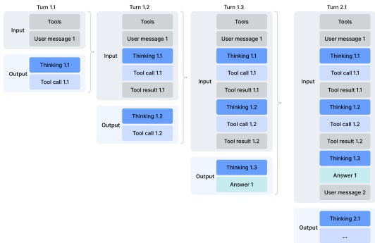

### a) 使用工具的思考

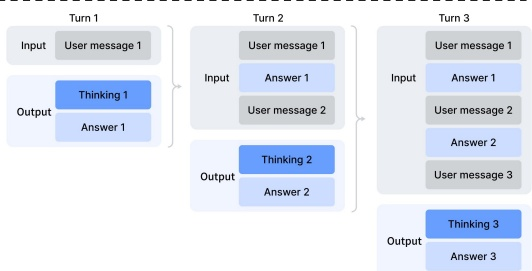

b) 不使用工具的思考

图7 | DeepSeek-V4系列的思考管理

**快速指令**。在聊天机器人场景中，生成响应前必须执行若干辅助任务（例如，判断是否触发网络搜索、意图识别等）。传统上，这些任务由单独的**小模型**处理，由于无法复用已有的KV缓存，需要**冗余的预填充**。为克服这一限制，我们引入了**快速指令**。我们直接在输入序列中附加一组专用的特殊令牌，每个令牌对应一个特定的辅助任务。通过直接复用已计算的KV缓存，该机制**完全避免了冗余预填充**，并允许某些任务（如生成搜索查询、判断权威性和领域）**并行执行**。因此，该方法显著降低了用户感知的**首令牌时间（TTFT）**，并消除了维护和迭代额外小模型的工程开销。支持的快速指令令牌总结于表5中。

#### 5.1.2. 在线策略蒸馏

在通过专门的微调和强化学习训练了多个领域专家后，我们采用**多教师在线策略蒸馏（OPD）**作为将专家能力合并到最终模型的主要技术。OPD已成为一种有效的**后训练范式**，能够高效地将领域专家的知识和能力转移到一个**单一统一模型**中。这是通过让学生在自身生成的轨迹上从教师模型的输出分布中学习来实现的。形式上，给定一组N个专家模型

---

表5 | 辅助任务的快速指令特殊标记

<table border=1 style='margin: auto; word-wrap: break-word;'><tr><td style='text-align: center; word-wrap: break-word;'>特殊标记</td><td style='text-align: center; word-wrap: break-word;'>描述</td><td style='text-align: center; word-wrap: break-word;'>格式</td></tr><tr><td style='text-align: center; word-wrap: break-word;'>&lt;|action|&gt;</td><td style='text-align: center; word-wrap: break-word;'>判断用户提示是否需要网络搜索，还是可以直接回答。</td><td style='text-align: center; word-wrap: break-word;'>...&lt;|User|&gt;{提示}&lt;|Assistant|&gt;</td></tr><tr><td style='text-align: center; word-wrap: break-word;'>&lt;|title|&gt;</td><td style='text-align: center; word-wrap: break-word;'>在首次助手响应后生成简短的对话标题。</td><td style='text-align: center; word-wrap: break-word;'>...&lt;|Assistant|&gt;{响应}&lt;|end_of_sentence|&gt;&lt;|title|&gt;</td></tr><tr><td style='text-align: center; word-wrap: break-word;'>&lt;|query|&gt;</td><td style='text-align: center; word-wrap: break-word;'>为用户提示生成搜索查询。</td><td style='text-align: center; word-wrap: break-word;'>...&lt;|User|&gt;{提示}&lt;|query|&gt;</td></tr><tr><td style='text-align: center; word-wrap: break-word;'>&lt;|authority|&gt;</td><td style='text-align: center; word-wrap: break-word;'>分类用户提示对来源权威性的需求。</td><td style='text-align: center; word-wrap: break-word;'>...&lt;|User|&gt;{提示}&lt;|authority|&gt;</td></tr><tr><td style='text-align: center; word-wrap: break-word;'>&lt;|domain|&gt;</td><td style='text-align: center; word-wrap: break-word;'>识别用户提示所属的领域。</td><td style='text-align: center; word-wrap: break-word;'>...&lt;|User|&gt;{提示}&lt;|domain|&gt;</td></tr><tr><td style='text-align: center; word-wrap: break-word;'>&lt;|extracted_url|&gt;</td><td style='text-align: center; word-wrap: break-word;'>判断用户提示中的每个URL是否应该被获取并阅读。</td><td style='text-align: center; word-wrap: break-word;'>...&lt;|User|&gt;{提示}&lt;|extracted_url|&gt;&lt;|url|&gt;</td></tr></table>

给定 $\{\pi_{E_1}, \pi_{E_2}, \ldots, \pi_{E_N}\}$，OPD目标函数定义为：

$$
\mathcal{L}_{\mathrm{O P D}}(\theta)=\sum_{i=1}^{N}w_{i}\cdot\mathrm{D}_{\mathrm{K L}}\left(\pi_{\theta}\parallel\pi_{E_{i}}\right).   \tag*{(29)}
$$

在该公式中，$w_i$ 表示分配给每个专家模型的权重，通常由该专家的**相对重要性**决定。计算反向KL散度 $D_{\text{KL}}\left(\pi_\theta \parallel \pi_{E_i}\right)$ 需要从学生模型 $\pi_\theta$ 中采样训练轨迹，以保持**在线学习**。其核心逻辑在于：统一策略 $\pi_\theta$ 能够根据当前任务上下文有选择地从相关专家那里学习（例如，在数学推理任务中与数学专家对齐，在编程任务中与编程专家对齐）。通过这种机制，源自物理上不同专家权重的知识通过**logits级别的对齐**被整合到一个统一的参数空间中，从而有效避免了传统权重合并或混合RL技术中常见的性能退化问题。在此阶段，使用了覆盖多个领域的**十余个教师模型**来蒸馏出一个学生模型。

在优化上述OPD目标时，先前的工作通常将全词汇KL损失简化为每个token位置上的token级KL估计，并通过在策略损失计算中用 $\text{sg}[\log \frac{\pi_{E_i}(y_t|x,y_{<t})}{\pi_\theta(y_t|x,y_{<t})}]$（sg表示停止梯度操作）作为每个token的优势估计值来复用强化学习框架。尽管这种方法节省资源，但它会导致梯度估计的**高方差**，并常常引起**训练不稳定**。因此，我们在OPD中采用了**全词汇logit蒸馏**。在计算反向KL散度时保留完整的logit分布，能够产生更稳定的梯度估计，并确保教师知识被**忠实蒸馏**。在下一小节中，我们将描述使大规模全词汇OPD成为可行的工程努力。

---

### 5.2. RL 和 OPD 基础设施

我们的后训练基础设施基于为 DeepSeek-V3.2 开发的可扩展框架构建。具体而言，我们集成了第 3.5 节所述的**相同分布式训练栈**以及前文介绍的用于高效自回归采样的**生成引擎**。在此基础之上，本工作引入了以下**主要增强**。这些设计使得涉及**超过十个不同教师模型**的超长上下文 RL 和 OPD 合并任务能够高效执行，从而**大幅加速模型发布的迭代周期**。

#### 5.2.1. FP4 量化集成

我们应用 FP4（MXFP4）量化来加速**生成过程**以及所有**仅推理的前向传播**，包括教师模型和参考模型，从而**减少内存流量和采样延迟**。如第 3.4 节所述，我们在生成和推理阶段**直接使用原生 FP4 权重**。对于训练步骤，FP4 量化通过**无损的 FP4 到 FP8 反量化步骤**进行模拟，从而可以**无缝复用现有的 FP8 混合精度框架**（使用 FP32 主权重），并且**无需对反向传播流程进行任何修改**。

#### 5.2.2. 全词汇 OPD 的高效教师调度

我们的框架支持**全词汇的在线策略蒸馏（On-Policy Distillation, OPD）**，教师数量**实际上无上限**，每个教师可能包含**数万亿参数**。为了实现这一点，所有教师权重都被**卸载到集中式分布式存储**中，并在教师前向传播期间**按需加载**，采用**类似 ZeRO 的参数分片**以减轻 I/O 和 DRAM 压力。此外，即使将词表大小 $|V| > 100k$ 的所有教师的 logits **物化到磁盘**也是不可行的。我们通过在教师前向传播期间**仅将最后一层的隐藏状态缓存到集中式缓冲区**来解决这个问题。在训练时，检索这些缓存的状态并通过**相应的预测头模块**以**在线重建完整的 logits**。这种设计引入了**微不足道的重计算开销**，同时**完全避免了显式 logits 物化带来的内存负担**。为了减轻教师预测头的 GPU 内存占用，我们在数据分发过程中**按教师索引对训练样本进行排序**。这种安排确保**每个不同的教师头每个小批量只被加载一次**，并且任何时候设备内存中**最多只驻留一个教师头**。所有参数和隐藏状态的加载/卸载操作**在后台异步进行**，**不会阻塞关键路径上的计算**。最后，使用**专门的 TileLang 内核**计算教师和学生 logits 之间的**精确 KL 散度**，**加速计算**并**减少动态内存分配**。

#### 5.2.3. 可抢占且容错的生成服务

为了**最大化 GPU 资源利用率**，同时能够为高优先级任务**快速提供硬件**，我们的 GPU 集群采用**集群级抢占式任务调度器**，任何正在运行的任务都可能**随时被抢占**。此外，大规模 GPU 集群中**硬件故障**也很常见。为此，我们为 RL/OPD 生成实现了一个**可抢占且容错的 LLM 生成服务**。

具体来说，我们为每个生成请求实现了一个**令牌粒度的预写日志（Write-Ahead Log, WAL）**。每当为请求生成一个新令牌时，我们**立即将其追加到该请求的 WAL 中**。在抢占期间，我们**暂停推理引擎**并**保存 KV 缓存**。

---

未完成的请求。**恢复时**，我们使用持久化的WAL和保存的KV缓存继续解码。**即使发生致命硬件错误**，我们也可以使用WAL中持久化的令牌重新运行预填充阶段以重建KV缓存。

**重要的是**，从头重新生成未完成的请求在数学上是不正确的，因为这引入了长度偏差。由于较短的响应更有可能在中断中幸存下来，从头重新生成会使模型在发生中断时更倾向于生成更短的序列。如果推理栈是批不变且确定性的，则可以通过为采样器中使用的伪随机数生成器使用一致的种子重新生成来解决此正确性问题。**然而**，这种方法仍然会带来重新运行解码阶段的额外成本，使其远不如我们的令牌粒度WAL方法高效。

#### 5.2.4. 扩展RL框架以支持百万令牌上下文

我们引入了**针对性的优化**，以在百万令牌序列上实现高效的RL和OPD。在部署阶段，我们采用了一种**可抢占且容错的部署服务**，详见第5.2.3节。对于推理和训练阶段，我们将部署数据格式分解为**轻量级元数据**和**重型每令牌字段**。在数据分发期间，可以加载整个部署数据的元数据以执行全局洗牌和打包布局计算。重型每令牌字段通过共享内存数据加载器加载，以消除节点内数据冗余，并在小批量粒度上消费后立即释放，从而**显著降低CPU和GPU内存压力**。设备上的小批量数量根据工作负载动态确定，允许在计算吞吐量和I/O重叠之间进行**高效的权衡**。

#### 5.2.5. 用于智能体AI的沙箱基础设施

为了满足智能体AI在后训练和评估期间**多样化的执行需求**，我们构建了一个生产级沙箱平台——**DeepSeek弹性计算（DSec）**。DSec由三个Rust组件组成——**API网关（Apiserver）**、**每主机代理（Edge）**和**集群监控器（Watcher）**——它们通过自定义RPC协议相互连接，并在3FS分布式文件系统（DeepSeek-AI, 2025）之上水平扩展。在生产环境中，单个DSec集群管理着**数十万个并发沙箱实例**。

DSec的设计基于**四个观察**：（1）智能体工作负载高度异构，从轻量级函数调用到完整的软件工程流水线，具有多样化的操作系统和安全要求；（2）环境镜像数量众多且体积庞大，但必须快速加载并支持迭代定制；（3）高密度部署要求高效的CPU和内存利用率；（4）沙箱生命周期必须与GPU训练计划协调，包括抢占和基于检查点的恢复。基于这些观察，我们将在下面分别阐述DSec的**四个核心设计**。

**统一接口背后的四个执行底层**。DSec暴露了一个单一的Python SDK（libdsec），该SDK抽象了四个执行底层。**函数调用**将无状态调用分发到预热的容器池，消除了冷启动开销。**容器**完全兼容Docker，并利用EROFS（Gao等，2019）按需加载以实现高效的镜像组装。**microVM**基于Firecracker（Agache等，2020）构建，为安全敏感、高密度部署添加了VM级隔离。**fullVM**基于QEMU（Bellard，2005）构建，支持任意客户操作系统。所有四个共享一个通用API表面——命令执行，

---

文件传输和TTY访问，且切换仅需更改参数。

**通过分层存储实现快速镜像加载**。DSec采用分层按需加载方式，在保证快速启动的同时支持大规模且不断增长的环境镜像库。对于容器，基础镜像和文件系统提交作为基于3FS的只读EROFS层存储，直接挂载到overlay lowerdirs中。挂载时，文件元数据已在本地磁盘就绪；而数据块则按需从3FS获取。对于微型虚拟机，DSec使用overlaybd（Li等人，2020）磁盘格式：只读基础层驻留在3FS上以实现跨实例共享，写入则进入本地写时复制层。此类快照可链式组织，便于**高效版本管理和毫秒级恢复**。

**大规模并发下的密度优化**。为适应每个集群数十万个沙箱，DSec解决了两个资源瓶颈。首先，它减少了虚拟化环境中重复的页缓存占用，并通过内存回收实现安全超量分配。其次，它缓解了容器运行时中的自旋锁争用，从而降低了每个沙箱的CPU开销，**显著提高了单机部署密度**。

**轨迹记录与抢占安全恢复**。DSec为每个沙箱维护一个全局有序的轨迹日志，持久记录每次命令调用及其结果。该轨迹服务于三个目的：(1) **客户端快速转发**——当训练任务被抢占时，沙箱资源仍被保留；恢复时，DSec重放已缓存的前序完成命令的结果，加速任务恢复，同时防止非幂等操作重执行导致的错误；(2) **细粒度溯源**——每个状态变更的来源和对应结果均可追踪；(3) **确定性重放**——任何历史会话均可从其轨迹忠实地复现。

### 5.3. 标准基准评估

#### 5.3.1. 评估设置

**知识与推理**。知识推理数据集包括MMLU-Pro（Wang等人，2024b）、GPQA（Rein等人，2023）、Human Last Exam（Phan等人，2025）、Simple-QA Verified（Haas等人，2025）、Chinese-SimpleQA（He等人，2024）、LiveCodeBench-v6（Jain等人，2024）、CodeForces（内部基准）、HMMT 2026 Feb、Apex（Balunović等人，2025）、Apex Shortlist（Balunović等人，2025）、IMOAnswerBench（Luong等人，2025）和PutnamBench（Tsoukalas等人，2024）。

对于代码能力，我们在LiveCodeBench-v6和内部Codeforces基准上评估DeepSeek-V4系列。Codeforces方面，我们收集了14场Codeforces Div. 1比赛，共114道题（2025年5月-2025年11月）。Elo评分的计算方式如下：每场比赛，每道题生成32个候选解。对每道题独立地不放回采样其中10个解，并随机排序形成提交序列。每个提交由领域专家构建的测试套件评判。解题得分遵循OpenAI（2025）的罚分方案：模型获得人类参赛者中解决同一问题且先前失败次数相同的中间分数。由此得到每个采样提交序列的总比赛得分，随后转换为比赛排名，再通过标准Codeforces评分系统转换为预估评分。比赛级别的预期评分定义为

---

该估计评分的**期望值**基于每个问题所有可能的随机选择与10份提交顺序。模型的**总体评分**是所有14场竞赛中这些竞赛级别期望评分的平均值。

"

对于**形式化数学任务**，我们在基于代理的设置中评估，使用Lean v4.28.0-rc1 (Moura and Ullrich, 2021)，可访问Lean编译器和语义策略搜索，最多执行500次工具调用，并设定最大推理努力。此外，我们评估了一个计算更密集的流程：首先通过**自我验证**(Shao et al., 2025)生成并筛选候选的自然语言解决方案，然后将保留的解决方案作为指导提供给形式化代理，用于证明相应的Lean语句。该设计利用非形式推理改善探索，同时通过**形式化验证**保持严格正确性。提交只有在严格验证器Comparator在两个设置下均接受时，才被计为正确。

对于K2.6和GLM-5.1，我们已留空部分条目，因其API过于繁忙，未能返回查询响应。

**1M-Token上下文**。由于DeepSeek-V4系列支持1M-token上下文，我们通过选择OpenAI MRCR (OpenAI, 2024b)和CorpusQA (Lu et al., 2026)作为基准，评估模型在长上下文场景中的性能。我们重新评估了Claude Opus 4.6和Gemini 3.1 Pro在这些任务上的表现，旨在统一所有模型的配置。我们未评估GPT-5.4，因其API未能响应我们的大部分查询。

**Agent**。Agent数据集包括Terminal Bench 2.0 (Merrill et al., 2026)、SWE-Verified (OpenAI, 2024e)、SWE Multilingual (Yang et al., 2025)、SWE-Pro (Deng et al., 2025)、BrowseComp (Wei et al., 2025)、MCPAtlas的公开评估集 (Bandi et al., 2026)、GDPval-AA (AA, 2025; Patwardhan et al., 2025)以及Tool-Decathlon (Li et al., 2025)。

对于代码代理任务（SWE-Verified、Terminal-Bench、SWE-Pro、SWE Multilingual），我们使用内部开发的评估框架评估DeepSeek-V4系列。该框架提供**最小工具集**——一个bash工具和一个文件编辑工具。最大交互步骤数设置为500，最大上下文长度设置为512K tokens。关于Terminal-Bench 2.0，我们承认GLM-5.1所指出的环境相关问题。尽管如此，我们报告了在原版Terminal-Bench 2.0数据集上的性能，以保证一致性。在Terminal-Bench 2.0 Verified子集上，DeepSeek-V4-Pro得分约为**72.0**。

对于搜索代理任务（BrowseComp、HLE w/ tool），我们也使用内部环境，配备网络搜索和Python工具，并将最大交互步骤数设置为500，最大上下文长度设置为512K tokens。对于BrowseComp，我们采用与DeepSeek-V3.2 (DeepSeek-AI, 2025)相同的**丢弃所有上下文**管理策略。

---

#### 5.3.2. 评估结果

表6 | DeepSeek-V4-Pro-Max与闭源/开源模型的比较。"Max"、"xHigh"和"High"表示推理努力程度。最佳结果以粗体突出显示，次佳结果以下划线标出。

<table border=1 style='margin: auto; word-wrap: break-word;'><tr><td rowspan="2">Benchmark (Metric)</td><td colspan="3">Opus-4.6 GPT-5.4 Gemini-3.1-Pro</td><td style='text-align: center; word-wrap: break-word;'>K2.6</td><td style='text-align: center; word-wrap: break-word;'>GLM-5.1</td><td style='text-align: center; word-wrap: break-word;'>DS-V4-Pro</td></tr><tr><td style='text-align: center; word-wrap: break-word;'>Max</td><td style='text-align: center; word-wrap: break-word;'>xHigh</td><td style='text-align: center; word-wrap: break-word;'>High</td><td style='text-align: center; word-wrap: break-word;'>Thinking</td><td style='text-align: center; word-wrap: break-word;'>Thinking</td><td style='text-align: center; word-wrap: break-word;'>Max</td></tr><tr><td style='text-align: center; word-wrap: break-word;'>MMLU-Pro (EM)</td><td style='text-align: center; word-wrap: break-word;'>89.1</td><td style='text-align: center; word-wrap: break-word;'>87.5</td><td style='text-align: center; word-wrap: break-word;'>91.0</td><td style='text-align: center; word-wrap: break-word;'>87.1</td><td style='text-align: center; word-wrap: break-word;'>86.0</td><td style='text-align: center; word-wrap: break-word;'>87.5</td></tr><tr><td style='text-align: center; word-wrap: break-word;'>SimpleQA-Verified (Pass@1)</td><td style='text-align: center; word-wrap: break-word;'>46.2</td><td style='text-align: center; word-wrap: break-word;'>45.3</td><td style='text-align: center; word-wrap: break-word;'>75.6</td><td style='text-align: center; word-wrap: break-word;'>36.9</td><td style='text-align: center; word-wrap: break-word;'>38.1</td><td style='text-align: center; word-wrap: break-word;'>57.9</td></tr><tr><td style='text-align: center; word-wrap: break-word;'>Chinese-SimpleQA (Pass@1)</td><td style='text-align: center; word-wrap: break-word;'>76.4</td><td style='text-align: center; word-wrap: break-word;'>76.8</td><td style='text-align: center; word-wrap: break-word;'>85.9</td><td style='text-align: center; word-wrap: break-word;'>75.9</td><td style='text-align: center; word-wrap: break-word;'>75.0</td><td style='text-align: center; word-wrap: break-word;'>84.4</td></tr><tr><td style='text-align: center; word-wrap: break-word;'>GPQA Diamond (Pass@1)</td><td style='text-align: center; word-wrap: break-word;'>91.3</td><td style='text-align: center; word-wrap: break-word;'>93.0</td><td style='text-align: center; word-wrap: break-word;'>94.3</td><td style='text-align: center; word-wrap: break-word;'>90.5</td><td style='text-align: center; word-wrap: break-word;'>86.2</td><td style='text-align: center; word-wrap: break-word;'>90.1</td></tr><tr><td style='text-align: center; word-wrap: break-word;'>HLE (Pass@1)</td><td style='text-align: center; word-wrap: break-word;'>40.0</td><td style='text-align: center; word-wrap: break-word;'>39.8</td><td style='text-align: center; word-wrap: break-word;'>44.4</td><td style='text-align: center; word-wrap: break-word;'>36.4</td><td style='text-align: center; word-wrap: break-word;'>34.7</td><td style='text-align: center; word-wrap: break-word;'>37.7</td></tr><tr><td style='text-align: center; word-wrap: break-word;'>LiveCodeBench (Pass@1)</td><td style='text-align: center; word-wrap: break-word;'>88.8</td><td style='text-align: center; word-wrap: break-word;'>-</td><td style='text-align: center; word-wrap: break-word;'>91.7</td><td style='text-align: center; word-wrap: break-word;'>89.6</td><td style='text-align: center; word-wrap: break-word;'>-</td><td style='text-align: center; word-wrap: break-word;'>93.5</td></tr><tr><td style='text-align: center; word-wrap: break-word;'>Codeforces (Rating)</td><td style='text-align: center; word-wrap: break-word;'>-</td><td style='text-align: center; word-wrap: break-word;'>3168</td><td style='text-align: center; word-wrap: break-word;'>3052</td><td style='text-align: center; word-wrap: break-word;'>-</td><td style='text-align: center; word-wrap: break-word;'>-</td><td style='text-align: center; word-wrap: break-word;'>3206</td></tr><tr><td style='text-align: center; word-wrap: break-word;'>HMMT 2026 Feb (Pass@1)</td><td style='text-align: center; word-wrap: break-word;'>96.2</td><td style='text-align: center; word-wrap: break-word;'>97.7</td><td style='text-align: center; word-wrap: break-word;'>94.7</td><td style='text-align: center; word-wrap: break-word;'>92.7</td><td style='text-align: center; word-wrap: break-word;'>89.4</td><td style='text-align: center; word-wrap: break-word;'>95.2</td></tr><tr><td style='text-align: center; word-wrap: break-word;'>IMOAnswerBench (Pass@1)</td><td style='text-align: center; word-wrap: break-word;'>75.3</td><td style='text-align: center; word-wrap: break-word;'>91.4</td><td style='text-align: center; word-wrap: break-word;'>81.0</td><td style='text-align: center; word-wrap: break-word;'>86.0</td><td style='text-align: center; word-wrap: break-word;'>83.8</td><td style='text-align: center; word-wrap: break-word;'>89.8</td></tr><tr><td style='text-align: center; word-wrap: break-word;'>Apex (Pass@1)</td><td style='text-align: center; word-wrap: break-word;'>34.5</td><td style='text-align: center; word-wrap: break-word;'>54.1</td><td style='text-align: center; word-wrap: break-word;'>60.9</td><td style='text-align: center; word-wrap: break-word;'>24.0</td><td style='text-align: center; word-wrap: break-word;'>11.5</td><td style='text-align: center; word-wrap: break-word;'>38.3</td></tr><tr><td style='text-align: center; word-wrap: break-word;'>Apex Shortlist (Pass@1)</td><td style='text-align: center; word-wrap: break-word;'>85.9</td><td style='text-align: center; word-wrap: break-word;'>78.1</td><td style='text-align: center; word-wrap: break-word;'>89.1</td><td style='text-align: center; word-wrap: break-word;'>75.5</td><td style='text-align: center; word-wrap: break-word;'>72.4</td><td style='text-align: center; word-wrap: break-word;'>90.2</td></tr><tr><td style='text-align: center; word-wrap: break-word;'>MRCR 1M (MMR)</td><td style='text-align: center; word-wrap: break-word;'>92.9</td><td style='text-align: center; word-wrap: break-word;'>-</td><td style='text-align: center; word-wrap: break-word;'>76.3</td><td style='text-align: center; word-wrap: break-word;'>-</td><td style='text-align: center; word-wrap: break-word;'>-</td><td style='text-align: center; word-wrap: break-word;'>83.5</td></tr><tr><td style='text-align: center; word-wrap: break-word;'>CorpusQA 1M (ACC)</td><td style='text-align: center; word-wrap: break-word;'>71.7</td><td style='text-align: center; word-wrap: break-word;'>-</td><td style='text-align: center; word-wrap: break-word;'>53.8</td><td style='text-align: center; word-wrap: break-word;'>-</td><td style='text-align: center; word-wrap: break-word;'>-</td><td style='text-align: center; word-wrap: break-word;'>62.0</td></tr><tr><td style='text-align: center; word-wrap: break-word;'>Terminal Bench 2.0 (Acc)</td><td style='text-align: center; word-wrap: break-word;'>65.4</td><td style='text-align: center; word-wrap: break-word;'>75.1</td><td style='text-align: center; word-wrap: break-word;'>68.5</td><td style='text-align: center; word-wrap: break-word;'>66.7</td><td style='text-align: center; word-wrap: break-word;'>63.5</td><td style='text-align: center; word-wrap: break-word;'>67.9</td></tr><tr><td style='text-align: center; word-wrap: break-word;'>SWE Verified (Resolved)</td><td style='text-align: center; word-wrap: break-word;'>80.8</td><td style='text-align: center; word-wrap: break-word;'>-</td><td style='text-align: center; word-wrap: break-word;'>80.6</td><td style='text-align: center; word-wrap: break-word;'>80.2</td><td style='text-align: center; word-wrap: break-word;'>-</td><td style='text-align: center; word-wrap: break-word;'>80.6</td></tr><tr><td style='text-align: center; word-wrap: break-word;'>SWE Pro (Resolved)</td><td style='text-align: center; word-wrap: break-word;'>57.3</td><td style='text-align: center; word-wrap: break-word;'>57.7</td><td style='text-align: center; word-wrap: break-word;'>54.2</td><td style='text-align: center; word-wrap: break-word;'>58.6</td><td style='text-align: center; word-wrap: break-word;'>58.4</td><td style='text-align: center; word-wrap: break-word;'>55.4</td></tr><tr><td style='text-align: center; word-wrap: break-word;'>SWE Multilingual (Resolved)</td><td style='text-align: center; word-wrap: break-word;'>77.5</td><td style='text-align: center; word-wrap: break-word;'>-</td><td style='text-align: center; word-wrap: break-word;'>-</td><td style='text-align: center; word-wrap: break-word;'>76.7</td><td style='text-align: center; word-wrap: break-word;'>73.3</td><td style='text-align: center; word-wrap: break-word;'>76.2</td></tr><tr><td style='text-align: center; word-wrap: break-word;'>BrowseComp (Pass@1)</td><td style='text-align: center; word-wrap: break-word;'>83.7</td><td style='text-align: center; word-wrap: break-word;'>82.7</td><td style='text-align: center; word-wrap: break-word;'>85.9</td><td style='text-align: center; word-wrap: break-word;'>83.2</td><td style='text-align: center; word-wrap: break-word;'>79.3</td><td style='text-align: center; word-wrap: break-word;'>83.4</td></tr><tr><td style='text-align: center; word-wrap: break-word;'>HLE w/ tools (Pass@1)</td><td style='text-align: center; word-wrap: break-word;'>53.1</td><td style='text-align: center; word-wrap: break-word;'>52.0</td><td style='text-align: center; word-wrap: break-word;'>51.6</td><td style='text-align: center; word-wrap: break-word;'>54.0</td><td style='text-align: center; word-wrap: break-word;'>50.4</td><td style='text-align: center; word-wrap: break-word;'>48.2</td></tr><tr><td style='text-align: center; word-wrap: break-word;'>GDPval-AA (Elo)</td><td style='text-align: center; word-wrap: break-word;'>1619</td><td style='text-align: center; word-wrap: break-word;'>1674</td><td style='text-align: center; word-wrap: break-word;'>1314</td><td style='text-align: center; word-wrap: break-word;'>1482</td><td style='text-align: center; word-wrap: break-word;'>1535</td><td style='text-align: center; word-wrap: break-word;'>1554</td></tr><tr><td style='text-align: center; word-wrap: break-word;'>MCPAtlas Public(Pass@1)</td><td style='text-align: center; word-wrap: break-word;'>73.8</td><td style='text-align: center; word-wrap: break-word;'>67.2</td><td style='text-align: center; word-wrap: break-word;'>69.2</td><td style='text-align: center; word-wrap: break-word;'>66.6</td><td style='text-align: center; word-wrap: break-word;'>71.8</td><td style='text-align: center; word-wrap: break-word;'>73.6</td></tr><tr><td style='text-align: center; word-wrap: break-word;'>Toolathlon (Pass@1)</td><td style='text-align: center; word-wrap: break-word;'>47.2</td><td style='text-align: center; word-wrap: break-word;'>54.6</td><td style='text-align: center; word-wrap: break-word;'>48.8</td><td style='text-align: center; word-wrap: break-word;'>50.0</td><td style='text-align: center; word-wrap: break-word;'>40.7</td><td style='text-align: center; word-wrap: break-word;'>51.8</td></tr></table>

表6展示了**DeepSeek-V4-Pro-Max**与其他闭源/开源模型的比较。同时，我们评估了**DeepSeek-V4-Flash**和**DeepSeek-V4-Pro**的不同模式，并将结果展示在表7中。

**知识。** 在通用世界知识的评估中，**DeepSeek-V4-Pro-Max**（即DeepSeek-V4-Pro的最大推理努力模式）在开源大语言模型中**达到了新的最先进水平**。如SimpleQA-Verified所示，**DeepSeek-V4-Pro-Max**以**20个绝对百分点的优势**显著超越了所有现有的开源基线模型。尽管取得了这些进展，它目前仍落后于领先的专有模型**Gemini-3.1-Pro**。在教育和知识推理领域，**DeepSeek-V4-Pro-Max**在MMLU-Pro、GPQA和HLE基准测试中**略微优于**Kimi和GLM，尽管仍落后于领先的专有模型。总体而言，**DeepSeek-V4-Pro-Max**标志着**增强开源模型世界知识能力的一个重要里程碑**。

此外，**DeepSeek-V4-Flash**和**DeepSeek-V4-Pro**在知识型任务上存在**显著的性能差距**；这是意料之中的，因为更大的参数量有助于在预训练中保留更多的知识。值得注意的是，**当分配更高的推理努力时，这两个模型在知识基准测试中都表现出更好的结果**。

---

表7 | DeepSeek-V4系列不同规模和模式的比较。"Non-Think"、"High"和"Max"表示推理努力程度。

<table border=1 style='margin: auto; word-wrap: break-word;'><tr><td colspan="2">Benchmark (Metric)</td><td colspan="3">DeepSeek-V4-Flash</td><td colspan="3">DeepSeek-V4-Pro</td></tr><tr><td style='text-align: center; word-wrap: break-word;'></td><td style='text-align: center; word-wrap: break-word;'></td><td style='text-align: center; word-wrap: break-word;'>Non-Think</td><td style='text-align: center; word-wrap: break-word;'>High</td><td style='text-align: center; word-wrap: break-word;'>Max</td><td style='text-align: center; word-wrap: break-word;'>Non-Think</td><td style='text-align: center; word-wrap: break-word;'>High</td><td style='text-align: center; word-wrap: break-word;'>Max</td></tr><tr><td colspan="2">MMLU-Pro (EM)</td><td style='text-align: center; word-wrap: break-word;'>83.0</td><td style='text-align: center; word-wrap: break-word;'>86.4</td><td style='text-align: center; word-wrap: break-word;'>86.2</td><td style='text-align: center; word-wrap: break-word;'>82.9</td><td style='text-align: center; word-wrap: break-word;'>87.1</td><td style='text-align: center; word-wrap: break-word;'>87.5</td></tr><tr><td colspan="2">SimpleQA-Verified (Pass@1)</td><td style='text-align: center; word-wrap: break-word;'>23.1</td><td style='text-align: center; word-wrap: break-word;'>28.9</td><td style='text-align: center; word-wrap: break-word;'>34.1</td><td style='text-align: center; word-wrap: break-word;'>45.0</td><td style='text-align: center; word-wrap: break-word;'>46.2</td><td style='text-align: center; word-wrap: break-word;'>57.9</td></tr><tr><td colspan="2">Chinese-SimpleQA (Pass@1)</td><td style='text-align: center; word-wrap: break-word;'>71.5</td><td style='text-align: center; word-wrap: break-word;'>73.2</td><td style='text-align: center; word-wrap: break-word;'>78.9</td><td style='text-align: center; word-wrap: break-word;'>75.8</td><td style='text-align: center; word-wrap: break-word;'>77.7</td><td style='text-align: center; word-wrap: break-word;'>84.4</td></tr><tr><td colspan="2">GPQA Diamond (Pass@1)</td><td style='text-align: center; word-wrap: break-word;'>71.2</td><td style='text-align: center; word-wrap: break-word;'>87.4</td><td style='text-align: center; word-wrap: break-word;'>88.1</td><td style='text-align: center; word-wrap: break-word;'>72.9</td><td style='text-align: center; word-wrap: break-word;'>89.1</td><td style='text-align: center; word-wrap: break-word;'>90.1</td></tr><tr><td colspan="2">HLE (Pass@1)</td><td style='text-align: center; word-wrap: break-word;'>8.1</td><td style='text-align: center; word-wrap: break-word;'>29.4</td><td style='text-align: center; word-wrap: break-word;'>34.8</td><td style='text-align: center; word-wrap: break-word;'>7.7</td><td style='text-align: center; word-wrap: break-word;'>34.5</td><td style='text-align: center; word-wrap: break-word;'>37.7</td></tr><tr><td colspan="2">LiveCodeBench (Pass@1-COT)</td><td style='text-align: center; word-wrap: break-word;'>55.2</td><td style='text-align: center; word-wrap: break-word;'>88.4</td><td style='text-align: center; word-wrap: break-word;'>91.6</td><td style='text-align: center; word-wrap: break-word;'>56.8</td><td style='text-align: center; word-wrap: break-word;'>89.8</td><td style='text-align: center; word-wrap: break-word;'>93.5</td></tr><tr><td colspan="2">Codeforces (Rating)</td><td style='text-align: center; word-wrap: break-word;'>-</td><td style='text-align: center; word-wrap: break-word;'>2816</td><td style='text-align: center; word-wrap: break-word;'>3052</td><td style='text-align: center; word-wrap: break-word;'>-</td><td style='text-align: center; word-wrap: break-word;'>2919</td><td style='text-align: center; word-wrap: break-word;'>3206</td></tr><tr><td colspan="2">HMMT 2026 Feb (Pass@1)</td><td style='text-align: center; word-wrap: break-word;'>40.8</td><td style='text-align: center; word-wrap: break-word;'>91.9</td><td style='text-align: center; word-wrap: break-word;'>94.8</td><td style='text-align: center; word-wrap: break-word;'>31.7</td><td style='text-align: center; word-wrap: break-word;'>94.0</td><td style='text-align: center; word-wrap: break-word;'>95.2</td></tr><tr><td colspan="2">IMOAnswerBench (Pass@1)</td><td style='text-align: center; word-wrap: break-word;'>41.9</td><td style='text-align: center; word-wrap: break-word;'>85.1</td><td style='text-align: center; word-wrap: break-word;'>88.4</td><td style='text-align: center; word-wrap: break-word;'>35.3</td><td style='text-align: center; word-wrap: break-word;'>88.0</td><td style='text-align: center; word-wrap: break-word;'>89.8</td></tr><tr><td colspan="2">Apex (Pass@1)</td><td style='text-align: center; word-wrap: break-word;'>1.0</td><td style='text-align: center; word-wrap: break-word;'>19.1</td><td style='text-align: center; word-wrap: break-word;'>33.0</td><td style='text-align: center; word-wrap: break-word;'>0.4</td><td style='text-align: center; word-wrap: break-word;'>27.4</td><td style='text-align: center; word-wrap: break-word;'>38.3</td></tr><tr><td colspan="2">Apex Shortlist (Pass@1)</td><td style='text-align: center; word-wrap: break-word;'>9.3</td><td style='text-align: center; word-wrap: break-word;'>72.1</td><td style='text-align: center; word-wrap: break-word;'>85.7</td><td style='text-align: center; word-wrap: break-word;'>9.2</td><td style='text-align: center; word-wrap: break-word;'>85.5</td><td style='text-align: center; word-wrap: break-word;'>90.2</td></tr><tr><td rowspan="2">Long</td><td style='text-align: center; word-wrap: break-word;'>MRCR 1M(MMR)</td><td style='text-align: center; word-wrap: break-word;'>37.5</td><td style='text-align: center; word-wrap: break-word;'>76.9</td><td style='text-align: center; word-wrap: break-word;'>78.7</td><td style='text-align: center; word-wrap: break-word;'>44.7</td><td style='text-align: center; word-wrap: break-word;'>83.3</td><td style='text-align: center; word-wrap: break-word;'>83.5</td></tr><tr><td style='text-align: center; word-wrap: break-word;'>CorpusQA 1M(ACC)</td><td style='text-align: center; word-wrap: break-word;'>15.5</td><td style='text-align: center; word-wrap: break-word;'>59.3</td><td style='text-align: center; word-wrap: break-word;'>60.5</td><td style='text-align: center; word-wrap: break-word;'>35.6</td><td style='text-align: center; word-wrap: break-word;'>56.5</td><td style='text-align: center; word-wrap: break-word;'>62.0</td></tr><tr><td rowspan="9">Agentic</td><td style='text-align: center; word-wrap: break-word;'>Terminal Bench 2.0 (Acc)</td><td style='text-align: center; word-wrap: break-word;'>49.1</td><td style='text-align: center; word-wrap: break-word;'>56.6</td><td style='text-align: center; word-wrap: break-word;'>56.9</td><td style='text-align: center; word-wrap: break-word;'>59.1</td><td style='text-align: center; word-wrap: break-word;'>63.3</td><td style='text-align: center; word-wrap: break-word;'>67.9</td></tr><tr><td style='text-align: center; word-wrap: break-word;'>SWE Verified (Resolved)</td><td style='text-align: center; word-wrap: break-word;'>73.7</td><td style='text-align: center; word-wrap: break-word;'>78.6</td><td style='text-align: center; word-wrap: break-word;'>79.0</td><td style='text-align: center; word-wrap: break-word;'>73.6</td><td style='text-align: center; word-wrap: break-word;'>79.4</td><td style='text-align: center; word-wrap: break-word;'>80.6</td></tr><tr><td style='text-align: center; word-wrap: break-word;'>SWE Pro (Resolved)</td><td style='text-align: center; word-wrap: break-word;'>49.1</td><td style='text-align: center; word-wrap: break-word;'>52.3</td><td style='text-align: center; word-wrap: break-word;'>52.6</td><td style='text-align: center; word-wrap: break-word;'>52.1</td><td style='text-align: center; word-wrap: break-word;'>54.4</td><td style='text-align: center; word-wrap: break-word;'>55.4</td></tr><tr><td style='text-align: center; word-wrap: break-word;'>SWE Multilingual (Resolved)</td><td style='text-align: center; word-wrap: break-word;'>69.7</td><td style='text-align: center; word-wrap: break-word;'>70.2</td><td style='text-align: center; word-wrap: break-word;'>73.3</td><td style='text-align: center; word-wrap: break-word;'>69.8</td><td style='text-align: center; word-wrap: break-word;'>74.1</td><td style='text-align: center; word-wrap: break-word;'>76.2</td></tr><tr><td style='text-align: center; word-wrap: break-word;'>BrowseComp (Pass@1)</td><td style='text-align: center; word-wrap: break-word;'>-</td><td style='text-align: center; word-wrap: break-word;'>53.5</td><td style='text-align: center; word-wrap: break-word;'>73.2</td><td style='text-align: center; word-wrap: break-word;'>-</td><td style='text-align: center; word-wrap: break-word;'>80.4</td><td style='text-align: center; word-wrap: break-word;'>83.4</td></tr><tr><td style='text-align: center; word-wrap: break-word;'>HLE w/ tools (Pass@1)</td><td style='text-align: center; word-wrap: break-word;'>-</td><td style='text-align: center; word-wrap: break-word;'>40.3</td><td style='text-align: center; word-wrap: break-word;'>45.1</td><td style='text-align: center; word-wrap: break-word;'>-</td><td style='text-align: center; word-wrap: break-word;'>44.7</td><td style='text-align: center; word-wrap: break-word;'>48.2</td></tr><tr><td style='text-align: center; word-wrap: break-word;'>MCPAtlas Public (Pass@1)</td><td style='text-align: center; word-wrap: break-word;'>64.0</td><td style='text-align: center; word-wrap: break-word;'>67.4</td><td style='text-align: center; word-wrap: break-word;'>69.0</td><td style='text-align: center; word-wrap: break-word;'>69.4</td><td style='text-align: center; word-wrap: break-word;'>74.2</td><td style='text-align: center; word-wrap: break-word;'>73.6</td></tr><tr><td style='text-align: center; word-wrap: break-word;'>GDPval-AA (Elo)</td><td style='text-align: center; word-wrap: break-word;'>-</td><td style='text-align: center; word-wrap: break-word;'>-</td><td style='text-align: center; word-wrap: break-word;'>1395</td><td style='text-align: center; word-wrap: break-word;'>-</td><td style='text-align: center; word-wrap: break-word;'>-</td><td style='text-align: center; word-wrap: break-word;'>1554</td></tr><tr><td style='text-align: center; word-wrap: break-word;'>Toolathlon (Pass@1)</td><td style='text-align: center; word-wrap: break-word;'>40.7</td><td style='text-align: center; word-wrap: break-word;'>43.5</td><td style='text-align: center; word-wrap: break-word;'>47.8</td><td style='text-align: center; word-wrap: break-word;'>46.3</td><td style='text-align: center; word-wrap: break-word;'>49.0</td><td style='text-align: center; word-wrap: break-word;'>51.8</td></tr></table>

**推理能力。** DeepSeek-V4-Pro-Max 在推理基准测试中**全面超越所有先前开源模型**，并在多项指标上**比肩最新的闭源模型**；同时，较小的 DeepSeek-V4-Flash-Max 也在代码和数学推理任务上**超越了此前最优的开源模型 K2.6-Thinking**。此外，DeepSeek-V4-Pro 和 DeepSeek-V4-Flash 在编程竞赛中表现出色。根据我们的评估，它们的性能**与 GPT-5.4 相当**，这是开源模型首次在此类任务上**比肩闭源模型**。在 Codeforces 排行榜上，DeepSeek-V4-Pro-Max 目前在人类参赛者中**排名第 23 位**。DeepSeek-V4 在形式化数学任务上也展现出强劲性能，无论是**智能体设置**还是**高计算量设置**下均表现优异。在智能体设置下，它取得了**最优结果**（如图 8 所示），**超越 Seed Prover (Chen et al., 2025)** 等先前模型；采用更高计算量的流水线后，性能进一步提升，**超越包括 Aristotle (Achim et al., 2025) 在内的系统**，并在该设置下**持平已知最佳结果**。

**智能体能力。** DeepSeek-V4 系列在评估中展现出强大的智能体性能。在代码智能体任务上，DeepSeek-V4-Pro 取得了**与 K2.6 和 GLM-5.1 相当的结果**，不过这些开源模型**仍落后于闭源模型**。在编程任务上，DeepSeek-V4-Flash 的表现**不及 DeepSeek-V4-Pro**，尤其在 Terminal Bench 2.0 上差距明显。其他智能体评估中也观察到类似趋势。值得注意的是，DeepSeek-V4-Pro 在 MCPAtlas 和 Toolathlon（涵盖大量工具和 MCP 服务的两个评估集）上表现良好，说明我们的模型**具备优秀的泛化能力**，而非仅在内部框架上表现优异。

---

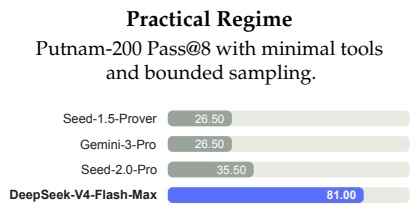

前沿范式

Putnam-2025结合**形式与非形式混合推理**及**大规模计算缩放**。

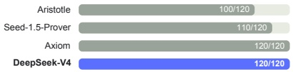

图8 | 实践与前沿范式下的形式推理。左图：Putnam-200 Pass@8评估了PutnamBench (Tsoukalas等, 2024)的一个固定随机子集，遵循Seed-Prover引入的设置；所有模型在相同的问题集上测试。我们遵循Seed-Prover协议，但用开源的LeanExplore (Asher, 2025)替换了专有搜索工具，从而产生了一个**轻量级设置**，具有最少的Agent工具和有边界的采样。右图：Putnam-2025在规模化混合形式-非形式范式下探索数学推理的前沿，其中非形式推理与形式验证相结合，以揭示差距并提高严谨性；DeepSeek-V4达到了**完美的120/120证明**。

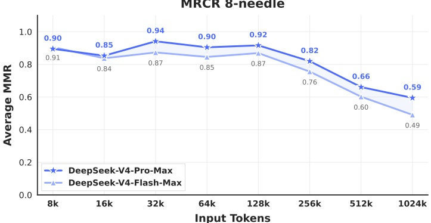

图9 | DeepSeek-V4系列在MRCR任务上的性能。

1M-Token上下文。DeepSeek-V4-Pro在MRCR任务上优于Gemini-3.1-Pro，该任务衡量上下文检索能力，但**仍落后于Claude Opus 4.6**。如图9所示，在128K上下文窗口内，检索性能保持**高度稳定**。虽然超出128K标记后性能下降变得可见，但模型在1M标记下的检索能力与专有和开源对手相比**仍然非常强**。与MRCR不同，CorpusQA更接近真实场景。评估结果也表明DeepSeek-V4-Pro**优于**Gemini-3.1-Pro。

推理努力。如表7所示，Max模式在RL中使用更长的上下文和减小的长度惩罚，在**最具挑战性的任务上**优于High模式。图10展示了DeepSeek-V4-Pro、DeepSeek-V4-Flash和DeepSeek-V3.2在代表性推理和Agent任务上的性能和成本比较。通过扩展测试时计算，DeepSeek-V4系列相较于前代实现了**实质性改进**。此外，在像HLE这样的推理任务上，DeepSeek-V4-Pro展现出**更高的Token效率**。

---

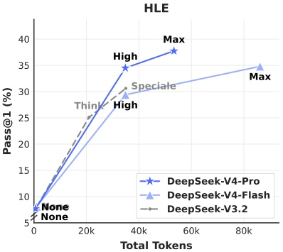

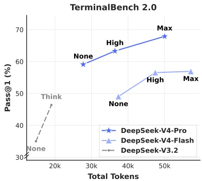

图10 | 不同推理努力程度下的HLE和Terminal Bench 2.0性能。“None”表示非思考模式，“Speciale”表示DeepSeek-V3.2-Speciale模型。

DeepSeek-V3.2。

### 5.4. 真实世界任务性能

标准化基准测试往往难以捕捉多样化真实世界任务的复杂性，从而导致测试结果与实际用户体验之间存在差距。为了弥合这一鸿沟，我们开发了专有的内部指标，这些指标**优先考虑真实世界使用模式而非传统基准**。这种方法确保了我们的优化能够转化为**切实的收益**。我们的评估框架专门针对DeepSeek API和Chatbot的主要用例，使模型性能与实际需求保持一致。

#### 5.4.1. 中文写作

DeepSeek的主要用例之一是中文写作。我们针对功能性写作和创意写作进行了严格的评估。表12展示了DeepSeek-V4-Pro与Gemini-3.1-Pro在功能性写作任务上的成对比较。这些任务由常见的日常写作查询组成，提示通常简洁明了。我们选择Gemini-3.1-Pro作为基线，因为它在我们的评估中是**中文写作领域表现最佳的外部模型**。结果表明，DeepSeek-V4-Pro**以62.7%对34.1%的整体胜率**优于基线；这主要归因于在中文写作场景中，Gemini有时会允许其固有的风格偏好覆盖用户的明确要求。

表13展示了创意写作的比较，该比较从**指令遵循**和**写作质量**两个维度进行评估。与Gemini-3.1-Pro相比，DeepSeek-V4-Pro在指令遵循上达到60.0%的胜率，在写作质量上达到77.5%的胜率，体现了**指令遵循方面的边际提升**和**写作质量上的大幅进步**。尽管DeepSeek-V4-Pro在总体用户案例分析中取得了更优结果，但仅针对最具挑战性的提示（即涉及高复杂度约束或多轮场景的提示）进行的评估显示，Claude Opus 4.5**仍保持对DeepSeek-V4-Pro的性能优势**。如表14所示，Claude Opus 4.5以52.0%对45.9%的胜率领先。

---

#### 5.4.2. 搜索

**搜索增强的问答**是DeepSeek聊天机器人的核心能力。在DeepSeek网页端和应用程序中，"非思考"模式采用**检索增强搜索**（RAG），而"思考"模式则使用**代理搜索**。

**检索增强搜索。** 我们进行了成对评估，比较了DeepSeek-V4-Pro和DeepSeek-V3.2在客观与主观问答类别中的表现。如表11所示，DeepSeek-V4-Pro显著优于DeepSeek-V3.2，在两个类别中均展现出一致的优势。最显著的提升出现在**单值搜索**和**规划与策略任务**中，这表明DeepSeek-V4-Pro擅长定位精确的事实答案，并从检索到的上下文中综合出结构化计划。然而，DeepSeek-V3.2在比较和推荐任务上仍保持相对竞争力，说明DeepSeek-V4-Pro在需要对搜索结果进行平衡、多视角推理的场景中仍有改进空间。

**代理搜索。** 与标准RAG不同，代理搜索使模型能够根据查询**迭代调用搜索和抓取工具**，显著提升了整体搜索性能。针对DeepSeek-Chat中的思考模式，我们优化了代理搜索功能，以在预定义的"思考预算"内最大化回答准确性。如表9所示，代理搜索始终优于RAG，尤其是在复杂任务上。此外，其成本依然高效，代理搜索仅比标准RAG略贵（见表10）。

#### 5.4.3. 白领任务

为严格评估模型在**复杂企业生产力场景**中的实用性，我们构建了一套涵盖30个高级中文专业任务的综合套件。这些工作流特意包含了**高层次的认知需求**，包括深度信息分析、全面文档生成和细致文档编辑，横跨13个关键行业（如金融、教育、法律和技术）的多样化领域。评估在配备基本工具（包括Bash和网络搜索）的内部代理框架中进行。

鉴于这些任务的开放性，自动指标通常难以捕捉高质量回答的细微差别。因此，我们进行了**人工评估**，比较了DeepSeek-V4-Pro-Max与Opus-4.6-Max的性能。标注者从四个维度对模型输出进行盲评：

• **任务完成度**：核心问题是否成功解决。
• **指令遵循**：对特定约束和指示的遵从程度。
• **内容质量**：事实准确性、逻辑连贯性和专业语气。
• **格式美观**：布局可读性和视觉呈现。

如图11所示，DeepSeek-V4-Pro-Max在多样化的中文白领任务中优于Opus-4.6-Max，实现了**63%的惊人非失败率**，并在分析、生成和编辑任务中展现了持续优势。图12中详细维度得分显示了该模型在**任务完成度**方面的主要优势。

---

**内容质量**。具体而言，DeepSeek-V4-Pro-Max 通过**频繁提供补充性见解和自我验证步骤**，**主动预测用户的隐含意图**。它在**生成长篇内容**方面也表现出色，能够提供**深入、连贯的叙述**，而非依赖 Opus-4.6-Max 经常使用的**过于简化的要点列表**。此外，该模型**严格遵循正式的专业规范**，例如**标准化的中文层级编号**。然而，在**指令遵循**方面，它偶尔会**忽略特定的格式约束**，略逊于 Opus。此外，该模型在将**大量文本输入压缩为简洁摘要**方面的能力较弱。最后，其**格式美学**在**演示幻灯片的整体视觉设计**方面仍有**很大的改进空间**。Figure 13、14 和 15 展示了多个测试案例；由于某些输出篇幅过长，仅展示部分页面。

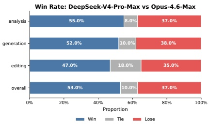

Figure 11 | Win-rate comparison across analysis, generation, editing tasks, and the overall performance.

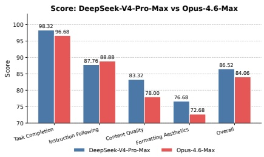

Figure 12 | Detailed dimension scores including Task Completion, Content Quality, Formatting Aesthetics, and Instruction Following.

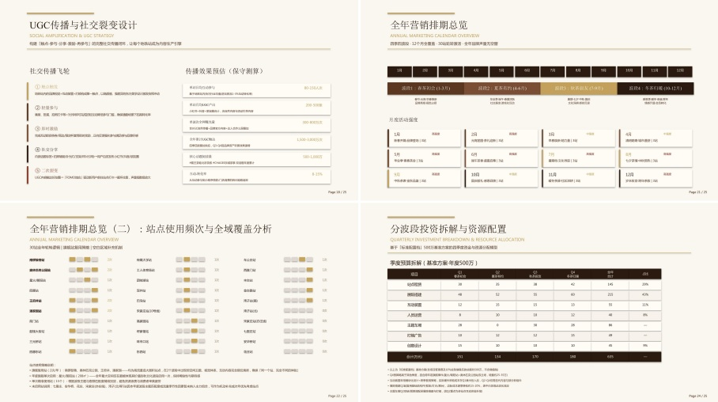

Figure 13 | Example output of a task which requires drafting a joint marketing proposal for a popular bubble tea brand and the Beijing Subway.

---

#### 5.4.4. 代码智能体

为评估我们的代码智能体能力，我们从**真实的内部研发工作负载**中精心挑选任务。我们从50多名内部工程师处收集了约**200个具有挑战性的任务**，涵盖**特性开发、漏洞修复、代码重构和诊断**，涉及**PyTorch、CUDA、Rust和C++**等多种技术栈。每个任务均附带其原始代码库、相应执行环境以及**人工标注的评分标准**；经过严格的质量筛选后，保留了**30个任务**作为评估集。如表8所示，**DeepSeek-V4-Pro显著优于Claude Sonnet 4.5**，并接近Claude Opus 4.5的水平。

表8 | 研发编码基准对比（外部模型仅供评估参考）

<table border=1 style='margin: auto; word-wrap: break-word;'><tr><td style='text-align: center; word-wrap: break-word;'>模型</td><td style='text-align: center; word-wrap: break-word;'>Haiku 4.5</td><td style='text-align: center; word-wrap: break-word;'>Sonnet 4.5</td><td style='text-align: center; word-wrap: break-word;'>DeepSeek-V4-Pro-Max</td><td style='text-align: center; word-wrap: break-word;'>Opus 4.5</td><td style='text-align: center; word-wrap: break-word;'>Opus 4.5 Thinking</td><td style='text-align: center; word-wrap: break-word;'>Opus 4.6 Thinking</td></tr><tr><td style='text-align: center; word-wrap: break-word;'>通过率 (%)</td><td style='text-align: center; word-wrap: break-word;'>13</td><td style='text-align: center; word-wrap: break-word;'>47</td><td style='text-align: center; word-wrap: break-word;'>67</td><td style='text-align: center; word-wrap: break-word;'>70</td><td style='text-align: center; word-wrap: break-word;'>73</td><td style='text-align: center; word-wrap: break-word;'>80</td></tr></table>

在一项面向DeepSeek开发者和研究员（N = 85）的调查中——所有参与者均在日常工作中使用DeepSeek-V4-Pro进行代码智能体任务——询问**DeepSeek-V4-Pro是否已准备好作为默认和主要编码模型**，以取代其他前沿模型。结果显示，**52%的人表示肯定**，**39%倾向于肯定**，**不到9%的人表示否定**。受访者认为DeepSeek-V4-Pro在大多数任务中能提供**令人满意的结果**，但也指出了**轻微错误、对模糊提示的误解以及偶尔的过度思考**等问题。

## 6. 结论、局限与未来方向

在本工作中，我们呈现了DeepSeek-V4系列的**预览版本**，旨在打造突破超长上下文处理效率瓶颈的下一代大语言模型。通过结合**CSA与HCA的混合注意力架构**，DeepSeek-V4系列在**长序列效率**上实现了质的飞跃。架构创新与**广泛的基础设施优化**相结合，使得原生支持**百万级token上下文**成为可能，并为未来的**测试时扩展、长周期任务以及在线学习等新兴范式**奠定了必要基础。评估结果表明，**DeepSeek-V4-Pro-Max**（DeepSeek-V4-Pro的最大推理努力模式）**重新定义了开放模型的业界最佳水平**。它在知识基准上**大幅超越此前开源模型**，在推理性能上**接近前沿闭源模型**，同时提供**具有竞争力的智能体能力**。与此同时，**DeepSeek-V4-Flash-Max**在保持**高度成本效益架构**的同时，实现了与领先闭源模型**相当的推理性能**。我们相信，DeepSeek-V4系列为开放模型开启了**百万长度上下文的新纪元**，并为实现更好的**效率、规模和智能**铺平了道路。

为追求**极致的超长上下文效率**，DeepSeek-V4系列采用了**大胆的架构设计**。为降低风险，我们保留了诸多**经过初步验证的组件和技巧**，这些做法虽有效，但也使架构相对复杂。在未来的迭代中，我们将开展**更全面、更有原则的研究**，将架构精简至最核心的设计，使其在**不牺牲性能的前提下更加优雅**。同时，尽管**前瞻路由和SwiGLU裁剪**已被证实能有效缓解训练不稳定性，但其**底层原理仍未被充分理解**。我们将积极研究**训练稳定性的基础问题**，并加强**内部指标监控**，力求以**更具原则性和可预测性的方式**实现稳定的大规模训练。

---

此外，除了MoE和稀疏注意力架构之外，我们还将**主动探索模型稀疏性的新维度**——例如更稀疏的嵌入模块（Cheng et al., 2026）——以在不牺牲能力的前提下进一步提升计算和内存效率。我们还将**持续研究低延迟架构和系统技术**，使长文本部署和交互更加灵敏。此外，**我们认识到长期、多轮代理任务的重要性和实用价值**，并将继续在此方向迭代和探索。我们也在致力于为模型**融入多模态能力**。最后，**我们致力于开发更好的数据策展与合成策略**，以持续增强模型在日益广泛的场景和任务中的智能、鲁棒性和实际可用性。

## References

AA. Gdpval-aa leaderboard, 2025. URL https://artificialanalysis.ai/methodology/intelligence-benchmarking#gdpval-aa.

T. Achim, A. Best, A. Bietti, K. Der, M. Fédérico, S. Gukov, D. Halpern-Leistner, K. Henningsgard, Y. Kudryashov, A. Meiburg, et al. Aristotle: Imo-level automated theorem proving.  $\underline{\text{arXiv}}$ preprint arXiv:2510.01346, 2025.

A. Agache, M. Brooker, A. Florescu, A. Iordache, A. Liguori, R. Neugebauer, P. Piwonka, and D.-M. Popa. Firecracker: lightweight virtualization for serverless applications. In Proceedings of the 17th Usenix Conference on Networked Systems Design and Implementation, NSDI'20, page 419–434, USA, 2020. USENIX Association. ISBN 9781939133137.

O. J. Aimuyo, B. Oh, and R. Singh. Flashmoe: Fast distributed moe in a single kernel.  $\underline{\text{Advances in Neural Information Processing Systems}}$, 2025. URL https://neurips.cc/virtual/2025/poster/119124.

J. Ainslie, J. Lee-Thorp, M. de Jong, Y. Zemlyanskiy, F. Lebrón, and S. Sanghai. Gqa: Training generalized multi-query transformer models from multi-head checkpoints. arXiv preprint arXiv:2305.13245, 2023.

J. Asher. LeanExplore: A search engine for Lean 4 declarations, 2025. URL https://arxiv.org/abs/2506.11085.

Y. Bai, Y. Bao, G. Chen, J. Chen, N. Chen, R. Chen, Y. Chen, Y. Chen, Y. Chen, Z. Chen, J. Cui, H. Ding, M. Dong, A. Du, C. Du, D. Du, Y. Du, Y. Fan, Y. Feng, K. Fu, B. Gao, H. Gao, P. Gao, T. Gao, X. Gu, L. Guan, H. Guo, J. Guo, H. Hu, X. Hao, T. He, W. He, W. He, C. Hong, Y. Hu, Z. Hu, W. Huang, Z. Huang, Z. Huang, T. Jiang, Z. Jiang, X. Jin, Y. Kang, G. Lai, C. Li, F. Li, H. Li, M. Li, W. Li, Y. Li, Y. Li, Z. Li, Z. Li, H. Lin, X. Lin, Z. Lin, C. Liu, C. Liu, H. Liu, J. Liu, J. Liu, L. Liu, S. Liu, T. Y. Liu, T. Liu, W. Liu, Y. Liu, Y. Liu, Y. Liu, Z. Liu, E. Lu, L. Lu, S. Ma, X. Ma, Y. Ma, S. Mao, J. Mei, X. Men, Y. Miao, S. Pan, Y. Peng, R. Qin, B. Qu, Z. Shang, L. Shi, S. Shi, F. Song, J. Su, Z. Su, X. Sun, F. Sung, H. Tang, J. Tao, Q. Teng, C. Wang, D. Wang, F. Wang, and H. Wang. Kimi K2: open agentic intelligence. CoRR, abs/2507.20534, 2025a. URL https://doi.org/10.48550/arXiv.2507.20534.

Y. Bai, S. Tu, J. Zhang, H. Peng, X. Wang, X. Lv, S. Cao, J. Xu, L. Hou, Y. Dong, et al. Longbench v2: Towards deeper understanding and reasoning on realistic long-context multitasks. In Proceedings of the 63rd Annual Meeting of the Association for Computational Linguistics (Volume 1: Long Papers), pages 3639–3664, 2025b.

---

M. Balunović, J. Dekoninck, I. Rétrov, N. Jovanović, and M. Vechev. **Matharena: 评估LLMs在未污染数学竞赛上的表现**. Proceedings of the Neural Information Processing Systems Track on Datasets and Benchmark, 2025.

C. Bandi, B. Hertzberg, G. Boo, T. Polakam, J. Da, S. Hassaan, M. Sharma, A. Park, E. Hernandez, D. Rambado, et al. **Mcp-atlas: 一个基于真实MCP服务器的大规模工具使用能力基准**. arXiv preprint arXiv:2602.00933, 2026.

F. Bellard. **Qemu: 一个快速且可移植的动态翻译器**. In  $\underline{\text{Proceedings of the Annual Conference on USENIX Annual Technical Conference}}$, ATEC '05, page 41, USA, 2005. USENIX Association.

I. Bello, H. Pham, Q. V. Le, M. Norouzi, and S. Bengio. **基于强化学习的神经组合优化**, 2017. URL https://openreview.net/forum?id=rJY3vk9eg.

J. Chen, W. Chen, J. Du, J. Hu, Z. Jiang, A. Jie, X. Jin, X. Jin, C. Li, W. Shi, Z. Wang, M. Wang, C. Wei, S. Wei, H. Xin, F. Yang, W. Gao, Z. Yuan, T. Zhan, Z. Zheng, T. Zhou, and T. H. Zhu. **Seed-Prover 1.5: 通过从经验中学习掌握本科水平的定理证明**, 2025. URL https://arxiv.org/abs/2512.17260.

M. Chen, J. Tworek, H. Jun, Q. Yuan, H. P. de Oliveira Pinto, J. Kaplan, H. Edwards, Y. Burda, N. Joseph, G. Brockman, A. Ray, R. Puri, G. Krueger, M. Petrov, H. Khlaaf, G. Sastry, P. Mishkin, B. Chan, S. Gray, N. Ryder, M. Pavlov, A. Power, L. Kaiser, M. Bavarian, C. Winter, P. Tillet, F. P. Such, D. Cummings, M. Plappert, F. Chantzis, E. Barnes, A. Herbert-Voss, W. H. Guss, A. Nichol, A. Paino, N. Tezak, J. Tang, I. Babuschkin, S. Balaji, S. Jain, W. Saunders, C. Hesse, A. N. Carr, J. Leike, J. Achiam, V. Misra, E. Morikawa, A. Radford, M. Knight, M. Brundage, M. Murati, K. Mayer, P. Welinder, B. McGrew, D. Amodei, S. McCandlish, I. Sutskever, and W. Zaremba. **评估基于代码训练的大型语言模型**.  $\underline{\text{CoRR}}$, abs/2107.03374, 2021. URL https://arxiv.org/abs/2107.03374.

T. Chen, T. Moreau, Z. Jiang, L. Zheng, E. Yan, H. Shen, M. Cowan, L. Wang, Y. Hu, L. Ceze, C. Guestrin, and A. Krishnamurthy. **TVM: 一个用于深度学习的自动化端到端优化编译器**. In  $\underline{\text{13th USENIX Symposium on Operating Systems Design and Implementation (OSDI 18),}}$ pages 578–594, Carlsbad, CA, Oct. 2018. USENIX Association. ISBN 978-1-939133-08-3. URL https://www.usenix.org/conference/osdi18/presentation/chen.

A. Cheng, A. Jacovi, A. Globerson, B. Golan, C. Kwong, C. Alberti, C. Tao, E. Ben-David, G. S. Tomar, L. Haas, et al. **事实排行榜：大型语言模型事实性的综合基准**. arXiv preprint arXiv:2512.10791, 2025.

X. Cheng, W. Zeng, D. Dai, Q. Chen, B. Wang, Z. Xie, K. Huang, X. Yu, Z. Hao, Y. Li, H. Zhang, H. Zhang, D. Zhao, and W. Liang. **通过可扩展查找实现条件记忆：大型语言模型稀疏性的新维度**. CoRR, abs/2601.07372, 2026. doi: 10.48550/ARXIV.2601.07372. URL https://doi.org/10.48550/arXiv.2601.07372.

K. Cobbe, V. Kosaraju, M. Bavarian, M. Chen, H. Jun, L. Kaiser, M. Plappert, J. Tworek, J. Hilton, R. Nakano, et al. **训练验证器以解决数学应用题**.  $\underline{\text{arXiv preprint}}$ arXiv:2110.14168, 2021.

D. Dai, C. Deng, C. Zhao, R. X. Xu, H. Gao, D. Chen, J. Li, W. Zeng, X. Yu, Y. Wu, Z. Xie, Y. K. Li, P. Huang, F. Luo, C. Ruan, Z. Sui, and W. Liang. **DeepSeekMoE: 迈向混合专家语言模型中极致的专家专业化**.  $\underline{\text{CoRR}}$, abs/2401.06066, 2024. URL https://doi.org/10.48550/arXiv.2401.06066.

---

T. Dao, D. Haziza, F. Massa, and G. Sizov. **用于长上下文推理的快速解码**，2023。URL https://pytorch.org/blog/flash-decoding/。

L. De Moura and N. Bjørner. **Z3：一种高效的SMT求解器**。在《软件理论与实践会议，第14届工具与算法系统构建与分析国际会议，TACAS'08/ETAPS'08》论文集中，第337–340页，柏林，海德堡，2008。Springer-Verlag。ISBN 3540787992。

DeepSeek-AI. **DeepSeek-Coder-V2：打破代码智能中闭源模型的障碍**。$\underline{\text{CoRR}}$，abs/2406.11931，2024。URL https://doi.org/10.48550/arXiv.2406.11931。

DeepSeek-AI. **DeepSeek-V3技术报告**。$\underline{\text{CoRR}}$，abs/2412.19437，2024。URL https://doi.org/10.48550/arXiv.2412.19437。

DeepSeek-AI. **DeepSeek-V2：一个强大、经济且高效的混合专家语言模型**。$\underline{\text{CoRR}}$，abs/2405.04434，2024。URL https://doi.org/10.48550/arXiv.2405.04434。

DeepSeek-AI. **Fire-flyer文件系统**，2025。URL https://github.com/deepseek-ai/3FS。

DeepSeek-AI. **DeepSeek-R1通过强化学习激励LLM推理**。$\underline{\text{Nat., 645(8081):633–638, 2025. URL https://doi.org/10.1038/s41586-025-09422-z.}}$

DeepSeek-AI. **DeepSeek-V3.2：推动开放大型语言模型的前沿**，2025。URL https://arxiv.org/abs/2512.02556。

X. Deng, J. Da, E. Pan, Y. Y. He, C. Ide, K. Garg, N. Lauffer, A. Park, N. Pasari, C. Rane, K. Sampath, M. Krishnan, S. Kundurthy, S. Hendryx, Z. Wang, V. Bharadwaj, J. Holm, R. Aluri, C. B. C. Zhang, N. Jacobson, B. Liu, and B. Kenstler. **SWE-bench Pro：AI智能体能解决长期软件工程任务吗？**，2025。URL https://arxiv.org/abs/2509.16941。

H. Ding, Z. Wang, G. Paolini, V. Kumar, A. Deoras, D. Roth, and S. Soatto. **更少的截断改进语言建模**。$\underline{\text{arXiv preprint arXiv:2404.10830}}$，2024。

X. Dong, Y. Fu, S. Diao, W. Byeon, Z. CHEN, A. S. Mahabaleshwarkar, S.-Y. Liu, M. V. keirsbilck, M.-H. Chen, Y. Suhara, Y. C. Lin, J. Kautz, and P. Molchanov. **Hymba：一种用于小型语言模型的混合头部架构**。在第十三届国际学习表征会议，2025。URL https://openreview.net/forum?id=A1ztozypga。

X. Du, Y. Yao, K. Ma, B. Wang, T. Zheng, K. Zhu, M. Liu, Y. Liang, X. Jin, Z. Wei, et al. **SuperGPQA：将LLM评估扩展到285个研究生学科**。arXiv preprint arXiv:2502.14739，2025。

D. Dua, Y. Wang, P. Dasigi, G. Stanovsky, S. Singh, and M. Gardner. **DROP：一个需要对段落进行离散推理的阅读理解基准**。在J. Burstein, C. Doran, and T. Solorio编辑的《2019年北美计算语言学协会人类语言技术会议论文集，NAACL-HLT 2019，美国明尼苏达州明尼阿波利斯，2019年6月2-7日，第1卷（长篇和短篇论文）》，第2368–2378页。计算语言学协会，2019。doi: 10.18653/V1/N19-1246。URL https://doi.org/10.18653/v1/n19-1246。

X. Gao, M. Dong, X. Miao, W. Du, C. Yu, and H. Chen. **EROFS：一种面向资源受限设备的压缩友好型只读文件系统**。在《2019年USENIX年度技术会议论文集，USENIX ATC '19》，第149–162页，美国，2019。USENIX协会。ISBN 9781939133038。

---

A. P. Gema, J. O. J. Leang, G. Hong, A. Devoto, A. C. M. Mancino, K. Saxena, X. He, Y. Zhao, X. Du, M. R. G. Madani, C. Barale, R. McHardy, J. Harris, J. Kaddour, E. van Krieken, and P. Minervini. 我们完成MMLU了吗？  $\underline{\text{CoRR}}$, abs/2406.04127, 2024. URL https://doi.org/10.48550/arXiv.2406.04127.

F. Gloeckle, B. Y. Idrissi, B. Rozière, D. Lopez-Paz, and G. Synnaeve. 通过多令牌预测实现更好更快的大型语言模型. In  $\underline{\text{第41届国际机器学习大会, ICML 2024, 维也纳, 奥地利, 2024年7月21-27日. OpenReview.net, 2024. URL https://openreview.net/forum?id=pEWAcejiU2.}}$

L. Haas, G. Yona, G. D'Antonio, S. Goldshtein, and D. Das. Simpleqa已验证：一个可靠的事实性基准，用于衡量参数化知识.  $\underline{\text{arXiv preprint arXiv:2509.07968}}$, 2025.

Y. He, S. Li, J. Liu, Y. Tan, W. Wang, H. Huang, X. Bu, H. Guo, C. Hu, B. Zheng, et al. Chinese simpleqa：大型语言模型的中文事实性评估.  $\underline{\text{arXiv preprint}}$ arXiv:2411.07140, 2024.

D. Hendrycks, C. Burns, S. Basart, A. Zou, M. Mazeika, D. Song, and J. Steinhardt. 衡量大规模多任务语言理解.  $\underline{\text{arXiv preprint arXiv:2009.03300}}$, 2020.

D. Hendrycks, C. Burns, S. Kadavath, A. Arora, S. Basart, E. Tang, D. Song, and J. Steinhardt. 使用MATH数据集衡量数学问题求解能力.  $\underline{\text{arXiv preprint arXiv:2103.03874}}$ 2021.

Y. Huang, Y. Bai, Z. Zhu, J. Zhang, J. Zhang, T. Su, J. Liu, C. Lv, Y. Zhang, J. Lei, et al. C-Eval：一个多级别、多学科的中文基础模型评估套件. arXiv preprint arXiv:2305.08322, 2023.

D. Hupkes and N. Bogoychev. Multiloko：覆盖31种语言的大型语言模型多语言本地知识基准. CoRR, abs/2504.10356, 2025. doi: 10.48550/ARXIV.2504.10356. URL https://doi.org/10.48550/arXiv.2504.10356.

B. Jacob, S. Kligys, B. Chen, M. Zhu, M. Tang, A. Howard, H. Adam, and D. Kalenichenko. 神经网络量化与训练以实现仅整数算术的高效推理. In Proceedings of the IEEE Conference on Computer Vision and Pattern Recognition (CVPR), June 2018.

N. Jain, K. Han, A. Gu, W.-D. Li, F. Yan, T. Zhang, S. Wang, A. Solar-Lezama, K. Sen, and I. Stoica. Livecodebench：大型语言模型代码评估的全面且无污染评估. arXiv preprint arXiv:2403.07974, 2024.

K. Jordan, Y. Jin, V. Boza, J. You, F. Cesista, L. Newhouse, and J. Bernstein. Muon：神经网络的隐藏层优化器.  $\underline{\text{Cited on, page 10, 2024.}}$

M. Joshi, E. Choi, D. Weld, and L. Zettlemoyer. TriviaQA：一个大规模远距离监督的阅读理解挑战数据集. In R. Barzilay and M.-Y. Kan, editors, Proceedings of the 55th Annual Meeting of the Association for Computational Linguistics (Volume 1: Long Papers), pages 1601–1611, Vancouver, Canada, July 2017. Association for Computational Linguistics. doi: 10.18653/v1/P17-1147. URL https://aclanthology.org/P17-1147.

H. Li, Y. Yuan, R. Du, K. Ma, L. Liu, and W. Hsu. DADI：用于敏捷和弹性应用程序部署的块级镜像服务. In 2020 USENIX Annual Technical Conference (USENIX ATC 20), pages 727–740. USENIX Association, July 2020. ISBN 978-1-939133-14-4. URL https://www.usenix.org/conference/atc20/presentation/li-huiba.

---

H. Li, Y. Zhang, F. Koto, Y. Yang, H. Zhao, Y. Gong, N. Duan, and T. Baldwin. CMMLU: **测量中文中的大规模多任务语言理解**. arXiv预印本 arXiv:2306.09212, 2023.

J. Li, W. Zhao, J. Zhao, W. Zeng, H. Wu, X. Wang, R. Ge, Y. Cao, Y. Huang, W. Liu, et al. The tool decathlon: **对语言代理进行多样化、现实且长期任务执行的基准测试**. arXiv预印本 arXiv:2510.25726, 2025.

Y. Li, F. Wei, C. Zhang, and H. Zhang. EAGLE: **推测性采样需要重新思考特征不确定性**. 载于 $\underline{\text{第41届国际机器学习大会, ICML 2024, 维也纳, 奥地利, 2024年7月21-27日. OpenReview.net, 2024. URL https://openreview.net/forum?id=1NdN7eXyb4.}}$

J. Liu, J. Su, X. Yao, Z. Jiang, G. Lai, Y. Du, Y. Qin, W. Xu, E. Lu, J. Yan, Y. Chen, H. Zheng, Y. Liu, S. Liu, B. Yin, W. He, H. Zhu, Y. Wang, J. Wang, M. Dong, Z. Zhang, Y. Kang, H. Zhang, X. Xu, Y. Zhang, Y. Wu, X. Zhou, and Z. Yang. Muon是面向大语言模型训练的可扩展方法. $\underline{\text{CoRR}}$, abs/2502.16982, 2025. URL https://doi.org/10.48550/arXiv.2502.16982.

I. Loshchilov and F. Hutter. **解耦权重衰减正则化**. $\underline{\text{arXiv预印本 arXiv:1711.05101}}$, 2017.

K. Lu and T. M. Lab. **在策略蒸馏**. $\underline{\text{Thinking Machines Lab: Connectionism}}$, 2025. doi:10.64434/tml.20251026. https://thinkingmachines.ai/blog/on-policy-distillation.

Z. Lu, C. Li, Y. Shi, W. Shen, M. Yan, and F. Huang. CorpusQA: **一个用于语料库级分析和推理的千万token基准**. arXiv预印本 arXiv:2601.14952, 2026.

T. Luong, D. Hwang, H. H. Nguyen, G. Ghiasi, Y. Chervonyi, I. Seo, J. Kim, G. Bingham, J. Lee, S. Mishra, A. Zhai, C. H. Hu, H. Michalewski, J. Kim, J. Ahn, J. Bae, X. Song, T. H. Trinh, Q. V. Le, and J. Jung. **迈向稳健的数学推理**. 载于2025年自然语言处理实证方法会议论文集, 2025. URL https://aclanthology.org/2025.emnlp-main.1794/.

M. A. Merrill, A. G. Shaw, N. Carlini, B. Li, H. Raj, I. Bercovich, L. Shi, J. Y. Shin, T. Walshe, E. K. Buchanan, et al. Terminal-bench: **在命令行界面上对代理进行困难、现实任务的基准测试**. arXiv预印本 arXiv:2601.11868, 2026.

Minimax. **认识Minimax-M2**, 2025. URL https://github.com/MiniMax-AI/MiniMax-M2.

L. d. Moura and S. Ullrich. **Lean 4定理证明器与编程语言**. 载于 $\underline{\text{国际自动推理会议}}$, 第625–635页. Springer, 2021.

Y. Nesterov. A method of solving a convex programming problem with convergence rate  $O(1/k^{2})$. $\underline{\text{Soviet Mathematics Doklady, 27:372–376, 1983.}}$

NVIDIA Corporation. **cuBLAS文档**, 2024. URL https://docs.nvidia.com/cuda/cublas/. 版本12.4. 访问日期: 2024-09-16.

OpenAI. **多语言大规模多任务语言理解 (MMMLU)**, 2024a. URL https://huggingface.co/datasets/openai/MMMLU.

OpenAI. **OpenAI MRCR：长上下文大海捞针基准测试**, 2024b. URL https://huggingface.co/datasets/openai/mrcr.

---

OpenAI. 使用LLMs进行推理, 2024c. URL https://openai.com/index/learning-to-reason-with-llms.

OpenAI. 介绍SimpleQA, 2024d. URL https://openai.com/index/introducing-simpleqa/.

OpenAI. 介绍SWE-bench verified：我们正在发布一个经过人工验证的SWE-bench子集，更多, 2024e. URL https://openai.com/index/introducing-swe-bench-verified/.

OpenAI. gpt-oss-120b和gpt-oss-20b模型卡. CoRR, abs/2508.10925, 2025. doi: 10.48550/A RXIV.2508.10925. URL https://doi.org/10.48550/arXiv.2508.10925.

M. Osama, D. Merrill, C. Cecka, M. Garland, and J. D. Owens. Stream-k: GPU上稠密矩阵乘法的以工作为中心的并行分解. In Proceedings of the 28th ACM SIGPLAN Annual Symposium on Principles and Practice of Parallel Programming, pages 429–431, 2023.

T. Patwardhan, R. Dias, E. Proehl, G. Kim, M. Wang, O. Watkins, S. P. Fishman, M. Aljubeh, P. Thacker, L. Fauconnet, et al. Gdpval：评估AI模型在真实世界经济价值任务上的性能. arXiv preprint arXiv:2510.04374, 2025.

L. Phan, A. Gatti, Z. Han, N. Li, J. Hu, H. Zhang, C. B. C. Zhang, M. Shaaban, J. Ling, S. Shi, et al. 人类的最后一次考试. arXiv preprint arXiv:2501.14249, 2025.

W. Qi, Y. Yan, Y. Gong, D. Liu, N. Duan, J. Chen, R. Zhang, and M. Zhou. Prophetnet：为序列到序列预训练预测未来n-gram. In T. Cohn, Y. He, and Y. Liu, editors, Findings of the Association for Computational Linguistics: EMNLP 2020, Online Event, 16-20 November 2020, volume EMNLP 2020 of Findings of ACL, pages 2401–2410. Association for Computational Linguistics, 2020. URL https://doi.org/10.18653/v1/2020.findings-emnlp.217.

Qwen. Qwen3技术报告. CoRR, abs/2505.09388, 2025. doi: 10.48550/ARXIV.2505.09388. URL https://doi.org/10.48550/arXiv.2505.09388.

S. Rajbhandari, J. Rasley, O. Ruwase, and Y. He. Zero：面向训练万亿参数模型的内存优化. In SC20: International Conference for High Performance Computing, Networking, Storage and Analysis, pages 1–16. IEEE, 2020.

J. K. Reed, Z. DeVito, H. He, A. Ussery, and J. Ansel. Torch.fx：Python中深度学习的实用程序捕获与转换, 2022. URL https://arxiv.org/abs/2112.08429.

D. Rein, B. L. Hou, A. C. Stickland, J. Petty, R. Y. Pang, J. Dirani, J. Michael, and S. R. Bowman. GPQA：一个研究生级别的防谷歌问答基准. arXiv preprint arXiv:2311.12022, 2023.

G. T. M. Riviere, S. Pathak, P. G. Sessa, C. Hardin, S. Bhupatiraju, L. Hussenot, T. Mesnard, B. Shahriari, A. Ram'e, J. Ferret, P. Liu, P. D. Tafti, A. Friesen, M. Casbon, S. Ramos, R. Kumar, C. L. Lan, S. Jerome, A. Tsitsulin, N. Vieillard, P. Stańczyk, S. Girgin, N. Momchev, M. Hoffman, S. Thakoor, J.-B. Grill, B. Neyshabur, A. Walton, A. Severyn, A. Parrish, A. Ahmad, A. Hutchison, A. Abdagic, A. Carl, A. Shen, A. Brock, A. Coenen, A. Laforge, A. Paterson, B. Bastian, B. Piot, B. Wu, B. Royal, C. Chen, C. Kumar, C. Perry, C. A. Welty, C. A. Choquette-Choo, D. Sinopalnikov, D. Weinberger, D. Vijaykumar, D. Rogozi'nska, D. Herbison, E. Bandy, E. Wang, E. Noland, E. Moreira, E. Senter, E. Eltyshev, F. Visin, G. Rasskin, G. Wei, G. Cameron,

---

G. Martins, H. Hashemi, H. Klimczak-Pluci’nska, H. Batra, H. Dhand, I. Nardini, J. Mein, J. Zhou, J. Svensson, J. Stanway, J. Chan, J. Zhou, J. Carrasqueira, J. Iljazi, J. Becker, J. Fernandez, J. R. van Amersfoort, J. Gordon, J. Lipschultz, J. Newlan, J. Ji, K. Mohamed, K. Badola, K. Black, K. Millican, K. McDonell, K. Nguyen, K. Sodhia, K. Greene, L. L. Sjoesund, L. Usui, L. Sifre, L. Heuermann, L. cia Lago, L. McNealus, L. B. Soares, L. Kilpatrick, L. Dixon, L. L. B. Martins, M. Reid, M. Singh, M. Iverson, M. Gorner, M. Velloso, M. Wirth, M. Davidow, M. Miller, M. Rahtz, M. Watson, M. Risdal, M. Kazemi, M. Moynihan, M. Zhang, M. Kahng, M. Park, M. Rahman, M. Khatwani, N. Dao, N. shad Bardoliwalla, N. Devanathan, N. Dumai, N. Chauhan, O. Wahltinez, P. Botarda, P. Barnes, P. Barham, P. Michel, P. chong Jin, P. Georgiev, P. Culliton, P. Kuppala, R. Comanescu, R. Merhej, R. Jana, R. A. Rokni, R. Agarwal, R. Mullins, S. Saadat, S. M. M. Carthy, S. Perrin, S. M. R. Arnold, S. bastian Krause, S. Dai, S. Garg, S. Sheth, S. Ronstrom, S. Chan, T. Jordan, T. Yu, T. Eccles, T. Hennigan, T. Kocisky, T. Doshi, V. Jain, V. Yadav, V. Meshram, V. Dharmadhikari, W. Barkley, W. Wei, W. Ye, W. Han, W. Kwon, X. Xu, Z. Shen, Z. Gong, Z. Wei, V. Cotruta, P. Kirk, A. Rao, M. Giang, L. Peran, T. Warkentin, E. Collins, J. Barral, Z. Ghahramani, R. Hadsell, D. Sculley, J. Banks, A. Dragan, S. Petrov, O. Vinyals, J. Dean, D. Hassabis, K. Kavukcuoglu, C. Farabet, E. Buchatskaya, S. Borgeaud, N. Fiedel, A. Joulin, K. Kenealy, R. Dadashi, and A. Andreev. **Gemma 2：在实用规模上改进开放语言模型**. arXiv preprint arXiv:2408.00118, 2024.

S. Roller, S. Sukhbaatar, A. Szlam, and J. Weston. **面向大规模稀疏模型的哈希层**. In M. Ranzato, A. Beygelzimer, Y. N. Dauphin, P. Liang, and J. W. Vaughan, editors, Advances in Neural Information Processing Systems 34: Annual Conference on Neural Information Processing Systems 2021, NeurIPS 2021, December 6-14, 2021, virtual, pages 17555–17566, 2021. URL https://proceedings.neurips.cc/paper/2021/hash/92bf5e6240737e0326ea59846a83e076-Abstract.html.

B. D. Rouhani, R. Zhao, A. More, M. Hall, A. Khodamoradi, S. Deng, D. Choudhary, M. Cornea, E. Dellinger, K. Denolf, S. Dusan, V. Elango, M. Golub, A. Heinecke, P. James-Roxby, D. Jani, G. Kolhe, M. Langhammer, A. Li, L. Melnick, M. Mesmakhosroshahi, A. Rodriguez, M. Schulte, R. Shafipour, L. Shao, M. Siu, P. Dubey, P. Micikevicius, M. Naumov, C. Verrilli, R. Wittig, D. Burger, and E. Chung. **用于深度学习的微缩放数据格式**, 2023.

K. Sakaguchi, R. L. Bras, C. Bhagavatula, and Y. Choi. **Winogrande：大规模对抗性Winograd模式挑战**, 2019.

Z. Shao, Y. Luo, C. Lu, Z. Z. Ren, J. Hu, T. Ye, Z. Gou, S. Ma, and X. Zhang. **Deepseekmath-v2：迈向可自验证的数学推理**, 2025. URL https://arxiv.org/abs/2511.22570.

N. Shazeer. **快速Transformer解码：一个写入头足矣**.  $\underline{\text{CoRR}}$, abs/1911.02150, 2019. URL http://arxiv.org/abs/1911.02150.

N. Shazeer. **GLU变体改进Transformer**.  $\underline{\text{arXiv preprint arXiv:2002.05202}}$, 2020.

F. Shi, M. Suzgun, M. Freitag, X. Wang, S. Srivats, S. Vosoughi, H. W. Chung, Y. Tay, S. Ruder, D. Zhou, D. Das, and J. Wei. **语言模型是多语言思维链推理器**. In The Eleventh International Conference on Learning Representations, ICLR 2023, Kigali, Rwanda, May 1-5, 2023. OpenReview.net, 2023. URL https://openreview.net/forum?id=fR3wGCk-IXp.

J. Su, M. Ahmed, Y. Lu, S. Pan, W. Bo, and Y. Liu. **Roformer：使用旋转位置嵌入增强的Transformer**. Neurocomputing, 568:127063, 2024.

---

M. Suzgun, N. Scales, N. Schärli, S. Gehrmann, Y. Tay, H. W. Chung, A. Chowdhery, Q. V. Le, E. H. Chi, D. Zhou, et al. **挑战Big-Bench任务以及思维链是否能解决它们**. arXiv preprint arXiv:2210.09261, 2022.

G. Tsoukalas, J. Lee, J. Jennings, J. Xin, M. Ding, M. Jennings, A. Thakur, and S. Chaudhuri. **Putnambench：在普特南数学竞赛上评估神经定理证明器**, 2024. URL https://arxiv.org/abs/2407.11214.

A. Vaswani, N. Shazeer, N. Parmar, J. Uszkoreit, L. Jones, A. N. Gomez, Ł. Kaiser, and I. Polosukhin. **注意力即一切**.  $\underline{\text{Advances in neural information processing systems}}$, 30, 2017.

L. Wang, H. Gao, C. Zhao, X. Sun, and D. Dai. **混合专家模型的无辅助损失负载均衡策略**.  $\underline{\text{CoRR}}$, abs/2408.15664, 2024a. URL https://doi.org/10.48550/arXiv.2408.15664.

L. Wang, Y. Cheng, Y. Shi, Z. Mo, Z. Tang, W. Xie, T. Wu, L. Ma, Y. Xia, J. Xue, et al. **Tilelang：桥接现代神经核中的可编程性和性能**. In  $\underline{\text{The Fourteenth}}$  $\underline{\text{International Conference on Learning Representations}}$, 2026.

Y. Wang, X. Ma, G. Zhang, Y. Ni, A. Chandra, S. Guo, W. Ren, A. Arulraj, X. He, Z. Jiang, T. Li, M. Ku, K. Wang, A. Zhuang, R. Fan, X. Yue, and W. Chen. **Mmlu-pro：一个更鲁棒且更具挑战性的多任务语言理解基准**. CoRR, abs/2406.01574, 2024b. URL https://doi.org/10.48550/arXiv.2406.01574.

J. Wei, Z. Sun, S. Papay, S. McKinney, J. Han, I. Fulford, H. W. Chung, A. T. Passos, W. Fedus, and A. Glaese. **Browsecomp：一个简单但具有挑战性的浏览代理基准**.  $\underline{\text{arXiv preprint arXiv:2504.12516}}$, 2025.

T. Wei, J. Luan, W. Liu, S. Dong, and B. Wang. **Cmath：你的语言模型能通过中国小学数学测试吗？**, 2023.

G. Xiao, Y. Tian, B. Chen, S. Han, and M. Lewis. **带有注意力汇的高效流式语言模型**. In The Twelfth International Conference on Learning Representations, ICLR 2024, Vienna, Austria, May 7-11, 2024. OpenReview.net, 2024. URL https://openreview.net/forum?id=NG7sS51zVF.

Z. Xie, Y. Wei, H. Cao, C. Zhao, C. Deng, J. Li, D. Dai, H. Gao, J. Chang, K. Yu, L. Zhao, S. Zhou, Z. Xu, Z. Zhang, W. Zeng, S. Hu, Y. Wang, J. Yuan, L. Wang, and W. Liang. **mhc：流形约束的超连接**, 2026. URL https://arxiv.org/abs/2512.24880.

L. Xu, H. Hu, X. Zhang, L. Li, C. Cao, Y. Li, Y. Xu, K. Sun, D. Yu, C. Yu, Y. Tian, Q. Dong, W. Liu, B. Shi, Y. Cui, J. Li, J. Zeng, R. Wang, W. Xie, Y. Li, Y. Patterson, Z. Tian, Y. Zhang, H. Zhou, S. Liu, Z. Zhao, Q. Zhao, C. Yue, X. Zhang, Z. Yang, K. Richardson, and Z. Lan. **CLUE：一个中文语言理解评估基准**. In D. Scott, N. Bel, and C. Zong, editors, Proceedings of the 28th International Conference on Computational Linguistics, COLING 2020, Barcelona, Spain (Online), December 8-13, 2020, pages 4762–4772. International Committee on Computational Linguistics, 2020. doi: 10.18653/V1/2020.COLING-MAIN.419. URL https://doi.org/10.18653/v1/2020.coling-main.419.

J. Yang, K. Lieret, C. E. Jimenez, A. Wettig, K. Khandpur, Y. Zhang, B. Hui, O. Press, L. Schmidt, and D. Yang. **Swe-smith：为软件工程代理扩展数据**, 2025. URL https://arxiv.org/abs/2504.21798.

---

R. Zellers, A. Holtzman, Y. Bisk, A. Farhadi, and Y. Choi. HellaSwag: Can a machine really finish your sentence? In A. Korhonen, D. R. Traum, and L. Márquez, editors, Proceedings of the 57th Conference of the Association for Computational Linguistics, ACL 2019, Florence, Italy, July 28- August 2, 2019, Volume 1: Long Papers, pages 4791–4800. Association for Computational Linguistics, 2019. doi: 10.18653/v1/p19-1472. URL https://doi.org/10.18653/v1/p19-1472.

C. Zhang, K. Du, S. Liu, W. Kwon, X. Mo, Y. Wang, X. Liu, K. You, Z. Li, M. Long, J. Zhai, J. Gonzalez, and I. Stoica. Jenga: Effective memory management for serving llm with heterogeneity. In Proceedings of the ACM SIGOPS 31st Symposium on Operating Systems Principles, SOSP '25, page 446–461, New York, NY, USA, 2025a. Association for Computing Machinery. ISBN 9798400718700. doi: 10.1145/3731569.3764823. URL https://doi.org/10.1145/3731569.3764823.

S. Zhang, N. Zheng, H. Lin, Z. Jiang, W. Bao, C. Jiang, Q. Hou, W. Cui, S. Zheng, L.-W. Chang, Q. Chen, and X. Liu. Comet: Fine-grained computation-communication overlapping for mixture-of-experts. 2025b. URL https://arxiv.org/abs/2502.19811.

C. Zhao, L. Zhao, J. Li, Z. Xu, and C. Xu. Deepgemm: clean and efficient fp8 gemm kernels with fine-grained scaling. https://github.com/deepseek-ai/DeepGEMM, 2025.

W. Zhong, R. Cui, Y. Guo, Y. Liang, S. Lu, Y. Wang, A. Saied, W. Chen, and N. Duan. AGIEval: A human-centric benchmark for evaluating foundation models. CoRR, abs/2304.06364, 2023. doi: 10.48550/arXiv.2304.06364. URL https://doi.org/10.48550/arXiv.2304.06364.

D. Zhu, H. Huang, Z. Huang, Y. Zeng, Y. Mao, B. Wu, Q. Min, and X. Zhou. Hyperconnections. In The Thirteenth International Conference on Learning Representations, ICLR 2025, Singapore, April 24-28, 2025. OpenReview.net, 2025. URL https://openreview.net/forum?id=9FqARW7dwB.

X. Zhu, D. Cheng, H. Li, K. Zhang, E. Hua, X. Lv, N. Ding, Z. Lin, Z. Zheng, and B. Zhou. How to synthesize text data without model collapse? arXiv preprint arXiv:2412.14689, 2024.

T. Y. Zhuo, M. C. Vu, J. Chim, H. Hu, W. Yu, R. Widyasari, I. N. B. Yusuf, H. Zhan, J. He, I. Paul, S. Brunner, C. Gong, J. Hoang, A. R. Zebaze, X. Hong, W. Li, J. Kaddour, M. Xu, Z. Zhang, P. Yadav, and et al. Bigcodebench: Benchmarking code generation with diverse function calls and complex instructions. In The Thirteenth International Conference on Learning Representations, ICLR 2025, Singapore, April 24-28, 2025. OpenReview.net, 2025. URL https://openreview.net/forum?id=YrycTjllL0.

---

## 附录

### A. 作者列表与致谢

### A.1. 作者列表

**作者按名字的字母顺序排列。名字标有 * 表示已离开我们团队的成员。**

研究与工程：Anyi Xu, Bangcai Lin, Bing Xue, Bingxuan Wang*, Bingzheng Xu, Bochao Wu, Bowei Zhang, Chaofan Lin, Chen Dong, Chengda Lu, Chenggang Zhao, Chengqi Deng, Chenhao Xu, Chenze Shao, Chong Ruan*, Conner Sun, Damai Dai, Daya Guo*, Dejian Yang, Deli Chen, Donghao Li, Erhang Li, Fangyun Lin, Fangzhou Yuan, Feiyu Xia, Fucong Dai, Guangbo Hao, Guanting Chen, Guoai Cao, Guolai Meng, Guowei Li, Han Yu, Han Zhang, Hanwei Xu, Hao Li, Haofen Liang, Haoling Zhang, Haoming Luo, Haoran Wei*, Haotian Yuan, Haowei Zhang*, Haowen Luo, Haoyu Chen, Haozhe Ji, Honghui Ding, Hongxuan Tang, Huanqi Cao, Huazuo Gao, Hui Qu, Hui Zeng, J. Yang, J.Q. Zhu, Jia Yu, Jialiang Huang, Jiasheng Ye, Jiashi Li, Jiaxin Xu, Jiewen Hu, Jin Yan, Jingchang Chen, Jingli Zhou, Jingting Xiang, Jingyang Yuan, Jingyuan Cheng, Jinhua Zhu, Jiping Yu, Joseph Sun, Jun Ran*, Junguang Jiang, Junjie Qiu, Junlong Li*, Junxiao Song, Kai Dong, Kaige Gao, Kang Guan, Kexing Zhou, Kezhao Huang*, Kuai Yu, Lean Wang, Lecong Zhang, Lei Wang, Li Zhang, Liang Zhao, Lihua Guo, Lingxiao Luo, Linwang Ma, Litong Wang, Liyu Cai, Liyue Zhang, Longhao Chen, M.S. Di, M.Y Xu, Max Mei, Mingchuan Zhang, Minghua Zhang, Minghui Tang, Mingxu Zhou, Panpan Huang, Peixin Cong, Peiyi Wang, Qiancheng Wang, Qihao Zhu, Qingyang Li, Qinyu Chen, Qiushi Du, Qiwei Jiang, Rui Tian, Ruifan Xu, Ruijie Lu, Ruiling Xu, Ruiqi Ge, Ruisong Zhang, Ruizhe Pan, Runji Wang, Runqian Chen, Runqiu Yin, Runxin Xu, Ruomeng Shen, Ruoyu Zhang, S.H. Liu, Shanghao Lu, Shangyan Zhou, Shanhuang Chen, Shaofei Cai, Shaoheng Nie, Shaoyuan Chen, Shengding Hu, Shengyu Liu, Shiqiang Hu, Shirong Ma, Shiyu Wang, Shuiping Yu, Shunfeng Zhou, Shuting Pan, Shuying Yu, Songyang Zhou, Tao Ni, Tao Yun, Tian Jin, Tian Pei, Tian Ye, Tianle Lin, Tianran Ji, Tianyi Cui, Tianyuan Yue, Tingting Yu, Tun Wang, W. Zhang, Wangding Zeng, Weilin Zhao, Wen Liu, Wenfeng Liang, Wenjie Pang, Wenjing Luo, Wenjing Yao, Wenjun Gao, Wenkai Yang, Wenlve Huang, Wentao Zhang, Wenting Ma, Xi Gao, Xiang He, Xiangwen Wang, Xiao Bi, Xiaodong Liu, Xiaohan Wang, Xiaokang Chen, Xiaokang Zhang, Xiaotao Nie, Xin Cheng, Xin Liu, Xin Xie, Xingchao Liu, Xingchen Liu, Xingkai Yu, Xingyou Li, Xinyu Yang, Xu Chen, Xuanyu Wang, Xuecheng Su, Xuheng Lin, Xuwei Fu, Y.C. Yan, Y.Q. Wang*, Y.W. Ma, Yanfeng Luo, Yang Zhang, Yanhong Xu, Yanru Ma, Yanwen Huang, Yao Li, Yao Li, Yao Zhao, Yaofeng Sun, Yaohui Wang, Yi Qian, Yi Yu, Yichao Zhang, Yifan Ding, Yifan Shi, Yijia Wu, Yiliang Xiong, Ying He, Ying Zhou, Yingjia Luo, Yinmin Zhong, Yishi Piao, Yisong Wang, Yixiang Zhang, Yixiao Chen, Yixuan Tan, Yixuan Wei, Yiyang Ma, Yiyuan Liu, Yonglun Yang, Yongqiang Guo, Yongtong Wu, Yu Wu, Yuan Cheng, Yuan Ou, Yuanfan Xu, Yuanhao Li, Yuduan Wang, Yuhan Wu, Yuhao Meng, Yuheng Zou, YuKun Li, Yunfan Xiong, Yupeng Chen, Yuqian Cao, Yuqian Wang, Yushun Zhang, Yutong Lin, Yuxian Gu, Yuxiang Luo, Yuxiang You, Yuxuan Liu, Yuxuan Zhou, Yuyang Zhou, Yuzhen Huang, Z.F. Wu, Zehao Wang, Zehua Zhao, Zehui Ren, Zhangli Sha, Zhe Fu, Zhean Xu, Zhenda Xie, Zhengyan Zhang, Zhewen Hao, Zhibin Gou, Zhicheng Ma, Zhigang Yan, Zhihong Shao, Zhixian Huang, Zhixuan Chen, Zhiyu Wu, Zhizhou Ren, Zhuoshu Li, Zhuping Zhang, Zian Xu, Zihao Wang, Zihui Gu, Zijia Zhu, Zilin Li, Zipeng Zhang*, Ziwei Xie, Ziyi Gao, Zizheng Pan, Zongqing Yao.

商务与合规：Chenchen Ling, Chengyu Hou, Dongjie Ji, Fang Wei, Hengqing Zhang, Jia Luo, Jia Song, Jialu Cai, Jian Liang, Jiangting Zhou, Jieyu Yang, Jin Chen, Jingzi Zhou, Junmin Zheng, Leyi Xia, Linyan Zhu, Miaojun Wang, Mingming Li, Minmin Han, Ning Wang, Panpan

---

Wang, Peng Zhang, Ruyi Chen, Shangmian Sun, Shaoqing Wu, W.L. Xiao, Wei An, Wenqing Hou, Xianzu Wang, Xiaowen Sun, Xiaoxiang Wang, Xinyu Zhang, Xueyin Chen, Yao Xu, Yi Shao, Yiling Ma, Ying Tang, Yuehan Yang, Yuer Xu, Yukun Zha, Yuping Lin, Yuting Yan, Zekai Zhang, Zhe Ju, Zheren Gao, Zhongyu Wu, Zihua Qu, Ziyi Wan.

### A.2. 致谢

我们感谢Dolly Deng和其他测试人员对DeepSeek-V4系列模型能力提出的宝贵建议和反馈。

### B. 评估细节

表9 | DeepSeek-V4-Pro的Agentic Search与Retrieval Augmented Search对比。

<table border=1 style='margin: auto; word-wrap: break-word;'><tr><td style='text-align: center; word-wrap: break-word;'>难度</td><td style='text-align: center; word-wrap: break-word;'>类别</td><td style='text-align: center; word-wrap: break-word;'>#</td><td style='text-align: center; word-wrap: break-word;'>智能体胜</td><td style='text-align: center; word-wrap: break-word;'>RAG胜</td><td style='text-align: center; word-wrap: break-word;'>平局</td><td style='text-align: center; word-wrap: break-word;'>智能体%</td><td style='text-align: center; word-wrap: break-word;'>RAG%</td><td style='text-align: center; word-wrap: break-word;'>平局%</td></tr><tr><td rowspan="2">简单</td><td style='text-align: center; word-wrap: break-word;'>Objective Q&A (客观问答)</td><td style='text-align: center; word-wrap: break-word;'>196</td><td style='text-align: center; word-wrap: break-word;'>110</td><td style='text-align: center; word-wrap: break-word;'>43</td><td style='text-align: center; word-wrap: break-word;'>43</td><td style='text-align: center; word-wrap: break-word;'>56.1</td><td style='text-align: center; word-wrap: break-word;'>21.9</td><td style='text-align: center; word-wrap: break-word;'>21.9</td></tr><tr><td style='text-align: center; word-wrap: break-word;'>Subjective Q&A (主观问答)</td><td style='text-align: center; word-wrap: break-word;'>321</td><td style='text-align: center; word-wrap: break-word;'>198</td><td style='text-align: center; word-wrap: break-word;'>56</td><td style='text-align: center; word-wrap: break-word;'>67</td><td style='text-align: center; word-wrap: break-word;'>61.7</td><td style='text-align: center; word-wrap: break-word;'>17.4</td><td style='text-align: center; word-wrap: break-word;'>20.9</td></tr><tr><td rowspan="3">困难</td><td style='text-align: center; word-wrap: break-word;'>Objective Q&A (客观问答)</td><td style='text-align: center; word-wrap: break-word;'>168</td><td style='text-align: center; word-wrap: break-word;'>102</td><td style='text-align: center; word-wrap: break-word;'>33</td><td style='text-align: center; word-wrap: break-word;'>33</td><td style='text-align: center; word-wrap: break-word;'>60.7</td><td style='text-align: center; word-wrap: break-word;'>19.6</td><td style='text-align: center; word-wrap: break-word;'>19.6</td></tr><tr><td style='text-align: center; word-wrap: break-word;'>Subjective Q&A (主观问答)</td><td style='text-align: center; word-wrap: break-word;'>184</td><td style='text-align: center; word-wrap: break-word;'>126</td><td style='text-align: center; word-wrap: break-word;'>27</td><td style='text-align: center; word-wrap: break-word;'>31</td><td style='text-align: center; word-wrap: break-word;'>68.5</td><td style='text-align: center; word-wrap: break-word;'>14.7</td><td style='text-align: center; word-wrap: break-word;'>16.8</td></tr><tr><td style='text-align: center; word-wrap: break-word;'>Total (总计)</td><td style='text-align: center; word-wrap: break-word;'>869</td><td style='text-align: center; word-wrap: break-word;'>536</td><td style='text-align: center; word-wrap: break-word;'>159</td><td style='text-align: center; word-wrap: break-word;'>174</td><td style='text-align: center; word-wrap: break-word;'>61.7</td><td style='text-align: center; word-wrap: break-word;'>18.3</td><td style='text-align: center; word-wrap: break-word;'>20.0</td></tr></table>

表10 | 成本对比：DeepSeek-V4-Pro的Agentic Search与Retrieval Augmented Search（均值）。Agentic Search的大部分工具调用是并行的。

<table border=1 style='margin: auto; word-wrap: break-word;'><tr><td style='text-align: center; word-wrap: break-word;'>版本</td><td style='text-align: center; word-wrap: break-word;'>工具调用</td><td style='text-align: center; word-wrap: break-word;'>预填充（令牌）</td><td style='text-align: center; word-wrap: break-word;'>输出（令牌）</td></tr><tr><td style='text-align: center; word-wrap: break-word;'>V4 Agentic Search</td><td style='text-align: center; word-wrap: break-word;'>16.2</td><td style='text-align: center; word-wrap: break-word;'>13649</td><td style='text-align: center; word-wrap: break-word;'>1526</td></tr><tr><td style='text-align: center; word-wrap: break-word;'>V4 Retrieval Augmented Search</td><td style='text-align: center; word-wrap: break-word;'>—</td><td style='text-align: center; word-wrap: break-word;'>10453</td><td style='text-align: center; word-wrap: break-word;'>1308</td></tr></table>

表11 | DeepSeek-V4-Pro与DeepSeek-V3.2在搜索问答任务上的对比评估。

<table border=1 style='margin: auto; word-wrap: break-word;'><tr><td rowspan="2">类别</td><td rowspan="2">子类别</td><td rowspan="2">#</td><td colspan="6">内部综合评估 (内部综合评估)</td></tr><tr><td style='text-align: center; word-wrap: break-word;'>V4胜</td><td style='text-align: center; word-wrap: break-word;'>V3.2胜</td><td style='text-align: center; word-wrap: break-word;'>平局</td><td style='text-align: center; word-wrap: break-word;'>V4%</td><td style='text-align: center; word-wrap: break-word;'>V3.2%</td><td style='text-align: center; word-wrap: break-word;'>平局%</td></tr><tr><td style='text-align: center; word-wrap: break-word;'>客观</td><td style='text-align: center; word-wrap: break-word;'>单值信息查找</td><td style='text-align: center; word-wrap: break-word;'>95</td><td style='text-align: center; word-wrap: break-word;'>36</td><td style='text-align: center; word-wrap: break-word;'>10</td><td style='text-align: center; word-wrap: break-word;'>49</td><td style='text-align: center; word-wrap: break-word;'>37.9</td><td style='text-align: center; word-wrap: break-word;'>10.5</td><td style='text-align: center; word-wrap: break-word;'>51.6</td></tr><tr><td rowspan="3">问答（客观问答）</td><td style='text-align: center; word-wrap: break-word;'>实体信息查找</td><td style='text-align: center; word-wrap: break-word;'>99</td><td style='text-align: center; word-wrap: break-word;'>24</td><td style='text-align: center; word-wrap: break-word;'>7</td><td style='text-align: center; word-wrap: break-word;'>68</td><td style='text-align: center; word-wrap: break-word;'>24.2</td><td style='text-align: center; word-wrap: break-word;'>7.1</td><td style='text-align: center; word-wrap: break-word;'>68.7</td></tr><tr><td style='text-align: center; word-wrap: break-word;'>枚举型信息查找</td><td style='text-align: center; word-wrap: break-word;'>95</td><td style='text-align: center; word-wrap: break-word;'>19</td><td style='text-align: center; word-wrap: break-word;'>8</td><td style='text-align: center; word-wrap: break-word;'>68</td><td style='text-align: center; word-wrap: break-word;'>20.0</td><td style='text-align: center; word-wrap: break-word;'>8.4</td><td style='text-align: center; word-wrap: break-word;'>71.6</td></tr><tr><td style='text-align: center; word-wrap: break-word;'>小计</td><td style='text-align: center; word-wrap: break-word;'>289</td><td style='text-align: center; word-wrap: break-word;'>79</td><td style='text-align: center; word-wrap: break-word;'>25</td><td style='text-align: center; word-wrap: break-word;'>185</td><td style='text-align: center; word-wrap: break-word;'>27.3</td><td style='text-align: center; word-wrap: break-word;'>8.7</td><td style='text-align: center; word-wrap: break-word;'>64.0</td></tr><tr><td rowspan="8">主观问答（主观问答）</td><td style='text-align: center; word-wrap: break-word;'>原因分析</td><td style='text-align: center; word-wrap: break-word;'>100</td><td style='text-align: center; word-wrap: break-word;'>28</td><td style='text-align: center; word-wrap: break-word;'>5</td><td style='text-align: center; word-wrap: break-word;'>67</td><td style='text-align: center; word-wrap: break-word;'>28.0</td><td style='text-align: center; word-wrap: break-word;'>5.0</td><td style='text-align: center; word-wrap: break-word;'>67.0</td></tr><tr><td style='text-align: center; word-wrap: break-word;'>对比</td><td style='text-align: center; word-wrap: break-word;'>96</td><td style='text-align: center; word-wrap: break-word;'>28</td><td style='text-align: center; word-wrap: break-word;'>20</td><td style='text-align: center; word-wrap: break-word;'>48</td><td style='text-align: center; word-wrap: break-word;'>29.2</td><td style='text-align: center; word-wrap: break-word;'>20.8</td><td style='text-align: center; word-wrap: break-word;'>50.0</td></tr><tr><td style='text-align: center; word-wrap: break-word;'>寻求建议</td><td style='text-align: center; word-wrap: break-word;'>92</td><td style='text-align: center; word-wrap: break-word;'>23</td><td style='text-align: center; word-wrap: break-word;'>8</td><td style='text-align: center; word-wrap: break-word;'>61</td><td style='text-align: center; word-wrap: break-word;'>25.0</td><td style='text-align: center; word-wrap: break-word;'>8.7</td><td style='text-align: center; word-wrap: break-word;'>66.3</td></tr><tr><td style='text-align: center; word-wrap: break-word;'>推荐</td><td style='text-align: center; word-wrap: break-word;'>95</td><td style='text-align: center; word-wrap: break-word;'>26</td><td style='text-align: center; word-wrap: break-word;'>19</td><td style='text-align: center; word-wrap: break-word;'>50</td><td style='text-align: center; word-wrap: break-word;'>27.4</td><td style='text-align: center; word-wrap: break-word;'>20.0</td><td style='text-align: center; word-wrap: break-word;'>52.6</td></tr><tr><td style='text-align: center; word-wrap: break-word;'>攻略计划</td><td style='text-align: center; word-wrap: break-word;'>92</td><td style='text-align: center; word-wrap: break-word;'>32</td><td style='text-align: center; word-wrap: break-word;'>11</td><td style='text-align: center; word-wrap: break-word;'>49</td><td style='text-align: center; word-wrap: break-word;'>34.8</td><td style='text-align: center; word-wrap: break-word;'>12.0</td><td style='text-align: center; word-wrap: break-word;'>53.3</td></tr><tr><td style='text-align: center; word-wrap: break-word;'>评价看法</td><td style='text-align: center; word-wrap: break-word;'>96</td><td style='text-align: center; word-wrap: break-word;'>30</td><td style='text-align: center; word-wrap: break-word;'>8</td><td style='text-align: center; word-wrap: break-word;'>58</td><td style='text-align: center; word-wrap: break-word;'>31.2</td><td style='text-align: center; word-wrap: break-word;'>8.3</td><td style='text-align: center; word-wrap: break-word;'>60.4</td></tr><tr><td style='text-align: center; word-wrap: break-word;'>趋势分析</td><td style='text-align: center; word-wrap: break-word;'>96</td><td style='text-align: center; word-wrap: break-word;'>23</td><td style='text-align: center; word-wrap: break-word;'>3</td><td style='text-align: center; word-wrap: break-word;'>70</td><td style='text-align: center; word-wrap: break-word;'>24.0</td><td style='text-align: center; word-wrap: break-word;'>3.1</td><td style='text-align: center; word-wrap: break-word;'>72.9</td></tr><tr><td style='text-align: center; word-wrap: break-word;'>小计</td><td style='text-align: center; word-wrap: break-word;'>667</td><td style='text-align: center; word-wrap: break-word;'>190</td><td style='text-align: center; word-wrap: break-word;'>74</td><td style='text-align: center; word-wrap: break-word;'>403</td><td style='text-align: center; word-wrap: break-word;'>28.5</td><td style='text-align: center; word-wrap: break-word;'>11.1</td><td style='text-align: center; word-wrap: break-word;'>60.4</td></tr><tr><td style='text-align: center; word-wrap: break-word;'></td><td style='text-align: center; word-wrap: break-word;'>总计</td><td style='text-align: center; word-wrap: break-word;'>956</td><td style='text-align: center; word-wrap: break-word;'>269</td><td style='text-align: center; word-wrap: break-word;'>99</td><td style='text-align: center; word-wrap: break-word;'>588</td><td style='text-align: center; word-wrap: break-word;'>28.1</td><td style='text-align: center; word-wrap: break-word;'>10.4</td><td style='text-align: center; word-wrap: break-word;'>61.5</td></tr></table>

---

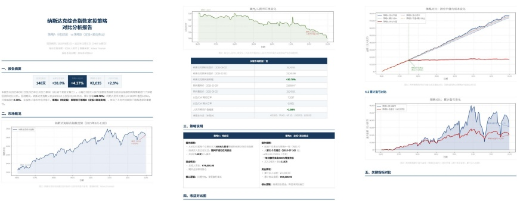

**图14 | 需要比较纳斯达克两种常规投资策略的任务示例输出。**

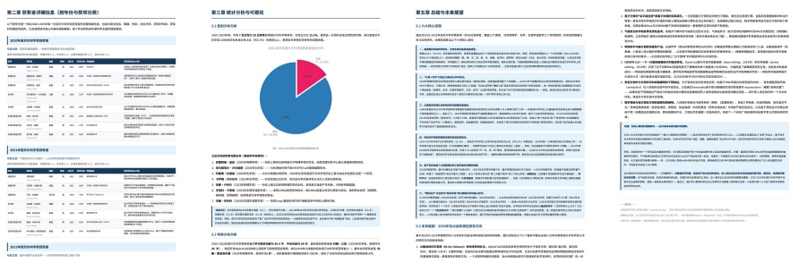

**图15 | 需要研究2020-2025年诺贝尔科学奖并生成分析性PDF报告的任务示例输出。**

---

**表 12 | DeepSeek-V4-Pro 与 Gemini-3.1-Pro 在中文功能写作中的对比分析**

<table border=1 style='margin: auto; word-wrap: break-word;'><tr><td rowspan="2">**类别**</td><td rowspan="2">**子类别**</td><td rowspan="2">**#**</td><td colspan="6">**内部综合评估**</td></tr><tr><td style='text-align: center; word-wrap: break-word;'>DS 胜</td><td style='text-align: center; word-wrap: break-word;'>Gem 胜</td><td style='text-align: center; word-wrap: break-word;'>平</td><td style='text-align: center; word-wrap: break-word;'>DS%</td><td style='text-align: center; word-wrap: break-word;'>Gem%</td><td style='text-align: center; word-wrap: break-word;'>平%</td></tr><tr><td rowspan="9">**办公文本**</td><td style='text-align: center; word-wrap: break-word;'>报告</td><td style='text-align: center; word-wrap: break-word;'>527</td><td style='text-align: center; word-wrap: break-word;'>350</td><td style='text-align: center; word-wrap: break-word;'>162</td><td style='text-align: center; word-wrap: break-word;'>15</td><td style='text-align: center; word-wrap: break-word;'>66.41</td><td style='text-align: center; word-wrap: break-word;'>30.74</td><td style='text-align: center; word-wrap: break-word;'>2.85</td></tr><tr><td style='text-align: center; word-wrap: break-word;'>方案策划</td><td style='text-align: center; word-wrap: break-word;'>291</td><td style='text-align: center; word-wrap: break-word;'>181</td><td style='text-align: center; word-wrap: break-word;'>103</td><td style='text-align: center; word-wrap: break-word;'>7</td><td style='text-align: center; word-wrap: break-word;'>62.20</td><td style='text-align: center; word-wrap: break-word;'>35.40</td><td style='text-align: center; word-wrap: break-word;'>2.41</td></tr><tr><td style='text-align: center; word-wrap: break-word;'>教育培训</td><td style='text-align: center; word-wrap: break-word;'>159</td><td style='text-align: center; word-wrap: break-word;'>100</td><td style='text-align: center; word-wrap: break-word;'>56</td><td style='text-align: center; word-wrap: break-word;'>3</td><td style='text-align: center; word-wrap: break-word;'>62.89</td><td style='text-align: center; word-wrap: break-word;'>35.22</td><td style='text-align: center; word-wrap: break-word;'>1.89</td></tr><tr><td style='text-align: center; word-wrap: break-word;'>邮件书信</td><td style='text-align: center; word-wrap: break-word;'>146</td><td style='text-align: center; word-wrap: break-word;'>107</td><td style='text-align: center; word-wrap: break-word;'>37</td><td style='text-align: center; word-wrap: break-word;'>2</td><td style='text-align: center; word-wrap: break-word;'>73.29</td><td style='text-align: center; word-wrap: break-word;'>25.34</td><td style='text-align: center; word-wrap: break-word;'>1.37</td></tr><tr><td style='text-align: center; word-wrap: break-word;'>通知公告</td><td style='text-align: center; word-wrap: break-word;'>72</td><td style='text-align: center; word-wrap: break-word;'>43</td><td style='text-align: center; word-wrap: break-word;'>24</td><td style='text-align: center; word-wrap: break-word;'>5</td><td style='text-align: center; word-wrap: break-word;'>59.72</td><td style='text-align: center; word-wrap: break-word;'>33.33</td><td style='text-align: center; word-wrap: break-word;'>6.94</td></tr><tr><td style='text-align: center; word-wrap: break-word;'>专业文本</td><td style='text-align: center; word-wrap: break-word;'>63</td><td style='text-align: center; word-wrap: break-word;'>34</td><td style='text-align: center; word-wrap: break-word;'>27</td><td style='text-align: center; word-wrap: break-word;'>2</td><td style='text-align: center; word-wrap: break-word;'>53.97</td><td style='text-align: center; word-wrap: break-word;'>42.86</td><td style='text-align: center; word-wrap: break-word;'>3.17</td></tr><tr><td style='text-align: center; word-wrap: break-word;'>招聘求职</td><td style='text-align: center; word-wrap: break-word;'>42</td><td style='text-align: center; word-wrap: break-word;'>27</td><td style='text-align: center; word-wrap: break-word;'>15</td><td style='text-align: center; word-wrap: break-word;'>0</td><td style='text-align: center; word-wrap: break-word;'>64.29</td><td style='text-align: center; word-wrap: break-word;'>35.71</td><td style='text-align: center; word-wrap: break-word;'>0.00</td></tr><tr><td style='text-align: center; word-wrap: break-word;'>技术文本</td><td style='text-align: center; word-wrap: break-word;'>29</td><td style='text-align: center; word-wrap: break-word;'>22</td><td style='text-align: center; word-wrap: break-word;'>7</td><td style='text-align: center; word-wrap: break-word;'>0</td><td style='text-align: center; word-wrap: break-word;'>75.86</td><td style='text-align: center; word-wrap: break-word;'>24.14</td><td style='text-align: center; word-wrap: break-word;'>0.00</td></tr><tr><td style='text-align: center; word-wrap: break-word;'>介绍评价</td><td style='text-align: center; word-wrap: break-word;'>20</td><td style='text-align: center; word-wrap: break-word;'>15</td><td style='text-align: center; word-wrap: break-word;'>5</td><td style='text-align: center; word-wrap: break-word;'>0</td><td style='text-align: center; word-wrap: break-word;'>75.00</td><td style='text-align: center; word-wrap: break-word;'>25.00</td><td style='text-align: center; word-wrap: break-word;'>0.00</td></tr><tr><td style='text-align: center; word-wrap: break-word;'></td><td style='text-align: center; word-wrap: break-word;'>**小计**</td><td style='text-align: center; word-wrap: break-word;'>1349</td><td style='text-align: center; word-wrap: break-word;'>879</td><td style='text-align: center; word-wrap: break-word;'>436</td><td style='text-align: center; word-wrap: break-word;'>34</td><td style='text-align: center; word-wrap: break-word;'>65.16</td><td style='text-align: center; word-wrap: break-word;'>32.32</td><td style='text-align: center; word-wrap: break-word;'>2.52</td></tr><tr><td rowspan="8">**媒体文本**</td><td style='text-align: center; word-wrap: break-word;'>社交媒体文案</td><td style='text-align: center; word-wrap: break-word;'>267</td><td style='text-align: center; word-wrap: break-word;'>156</td><td style='text-align: center; word-wrap: break-word;'>101</td><td style='text-align: center; word-wrap: break-word;'>10</td><td style='text-align: center; word-wrap: break-word;'>58.43</td><td style='text-align: center; word-wrap: break-word;'>37.83</td><td style='text-align: center; word-wrap: break-word;'>3.75</td></tr><tr><td style='text-align: center; word-wrap: break-word;'>广告商品文案</td><td style='text-align: center; word-wrap: break-word;'>214</td><td style='text-align: center; word-wrap: break-word;'>109</td><td style='text-align: center; word-wrap: break-word;'>98</td><td style='text-align: center; word-wrap: break-word;'>7</td><td style='text-align: center; word-wrap: break-word;'>50.93</td><td style='text-align: center; word-wrap: break-word;'>45.79</td><td style='text-align: center; word-wrap: break-word;'>3.27</td></tr><tr><td style='text-align: center; word-wrap: break-word;'>内容平台长文</td><td style='text-align: center; word-wrap: break-word;'>99</td><td style='text-align: center; word-wrap: break-word;'>71</td><td style='text-align: center; word-wrap: break-word;'>25</td><td style='text-align: center; word-wrap: break-word;'>3</td><td style='text-align: center; word-wrap: break-word;'>71.72</td><td style='text-align: center; word-wrap: break-word;'>25.25</td><td style='text-align: center; word-wrap: break-word;'>3.03</td></tr><tr><td style='text-align: center; word-wrap: break-word;'>新闻报道</td><td style='text-align: center; word-wrap: break-word;'>51</td><td style='text-align: center; word-wrap: break-word;'>27</td><td style='text-align: center; word-wrap: break-word;'>22</td><td style='text-align: center; word-wrap: break-word;'>2</td><td style='text-align: center; word-wrap: break-word;'>52.94</td><td style='text-align: center; word-wrap: break-word;'>43.14</td><td style='text-align: center; word-wrap: break-word;'>3.92</td></tr><tr><td style='text-align: center; word-wrap: break-word;'>营销软文</td><td style='text-align: center; word-wrap: break-word;'>17</td><td style='text-align: center; word-wrap: break-word;'>12</td><td style='text-align: center; word-wrap: break-word;'>4</td><td style='text-align: center; word-wrap: break-word;'>1</td><td style='text-align: center; word-wrap: break-word;'>70.59</td><td style='text-align: center; word-wrap: break-word;'>23.53</td><td style='text-align: center; word-wrap: break-word;'>5.88</td></tr><tr><td style='text-align: center; word-wrap: break-word;'>标题</td><td style='text-align: center; word-wrap: break-word;'>11</td><td style='text-align: center; word-wrap: break-word;'>7</td><td style='text-align: center; word-wrap: break-word;'>4</td><td style='text-align: center; word-wrap: break-word;'>0</td><td style='text-align: center; word-wrap: break-word;'>63.64</td><td style='text-align: center; word-wrap: break-word;'>36.36</td><td style='text-align: center; word-wrap: break-word;'>0.00</td></tr><tr><td style='text-align: center; word-wrap: break-word;'>口播文案</td><td style='text-align: center; word-wrap: break-word;'>4</td><td style='text-align: center; word-wrap: break-word;'>2</td><td style='text-align: center; word-wrap: break-word;'>1</td><td style='text-align: center; word-wrap: break-word;'>1</td><td style='text-align: center; word-wrap: break-word;'>50.00</td><td style='text-align: center; word-wrap: break-word;'>25.00</td><td style='text-align: center; word-wrap: break-word;'>25.00</td></tr><tr><td style='text-align: center; word-wrap: break-word;'>评论</td><td style='text-align: center; word-wrap: break-word;'>3</td><td style='text-align: center; word-wrap: break-word;'>2</td><td style='text-align: center; word-wrap: break-word;'>1</td><td style='text-align: center; word-wrap: break-word;'>0</td><td style='text-align: center; word-wrap: break-word;'>66.67</td><td style='text-align: center; word-wrap: break-word;'>33.33</td><td style='text-align: center; word-wrap: break-word;'>0.00</td></tr><tr><td style='text-align: center; word-wrap: break-word;'></td><td style='text-align: center; word-wrap: break-word;'>**小计**</td><td style='text-align: center; word-wrap: break-word;'>666</td><td style='text-align: center; word-wrap: break-word;'>386</td><td style='text-align: center; word-wrap: break-word;'>256</td><td style='text-align: center; word-wrap: break-word;'>24</td><td style='text-align: center; word-wrap: break-word;'>57.96</td><td style='text-align: center; word-wrap: break-word;'>38.44</td><td style='text-align: center; word-wrap: break-word;'>3.60</td></tr><tr><td rowspan="5">**生活文本**</td><td style='text-align: center; word-wrap: break-word;'>祝贺文本</td><td style='text-align: center; word-wrap: break-word;'>101</td><td style='text-align: center; word-wrap: break-word;'>54</td><td style='text-align: center; word-wrap: break-word;'>41</td><td style='text-align: center; word-wrap: break-word;'>6</td><td style='text-align: center; word-wrap: break-word;'>53.47</td><td style='text-align: center; word-wrap: break-word;'>40.59</td><td style='text-align: center; word-wrap: break-word;'>5.94</td></tr><tr><td style='text-align: center; word-wrap: break-word;'>沟通回复</td><td style='text-align: center; word-wrap: break-word;'>100</td><td style='text-align: center; word-wrap: break-word;'>71</td><td style='text-align: center; word-wrap: break-word;'>26</td><td style='text-align: center; word-wrap: break-word;'>3</td><td style='text-align: center; word-wrap: break-word;'>71.00</td><td style='text-align: center; word-wrap: break-word;'>26.00</td><td style='text-align: center; word-wrap: break-word;'>3.00</td></tr><tr><td style='text-align: center; word-wrap: break-word;'>心得感想</td><td style='text-align: center; word-wrap: break-word;'>90</td><td style='text-align: center; word-wrap: break-word;'>68</td><td style='text-align: center; word-wrap: break-word;'>17</td><td style='text-align: center; word-wrap: break-word;'>5</td><td style='text-align: center; word-wrap: break-word;'>75.56</td><td style='text-align: center; word-wrap: break-word;'>18.89</td><td style='text-align: center; word-wrap: break-word;'>5.56</td></tr><tr><td style='text-align: center; word-wrap: break-word;'>介绍评价</td><td style='text-align: center; word-wrap: break-word;'>55</td><td style='text-align: center; word-wrap: break-word;'>44</td><td style='text-align: center; word-wrap: break-word;'>9</td><td style='text-align: center; word-wrap: break-word;'>2</td><td style='text-align: center; word-wrap: break-word;'>80.00</td><td style='text-align: center; word-wrap: break-word;'>16.36</td><td style='text-align: center; word-wrap: break-word;'>3.64</td></tr><tr><td style='text-align: center; word-wrap: break-word;'>评论</td><td style='text-align: center; word-wrap: break-word;'>44</td><td style='text-align: center; word-wrap: break-word;'>34</td><td style='text-align: center; word-wrap: break-word;'>8</td><td style='text-align: center; word-wrap: break-word;'>2</td><td style='text-align: center; word-wrap: break-word;'>77.27</td><td style='text-align: center; word-wrap: break-word;'>18.18</td><td style='text-align: center; word-wrap: break-word;'>4.55</td></tr><tr><td style='text-align: center; word-wrap: break-word;'></td><td style='text-align: center; word-wrap: break-word;'>**小计**</td><td style='text-align: center; word-wrap: break-word;'>390</td><td style='text-align: center; word-wrap: break-word;'>271</td><td style='text-align: center; word-wrap: break-word;'>101</td><td style='text-align: center; word-wrap: break-word;'>18</td><td style='text-align: center; word-wrap: break-word;'>69.49</td><td style='text-align: center; word-wrap: break-word;'>25.90</td><td style='text-align: center; word-wrap: break-word;'>4.62</td></tr><tr><td rowspan="5">**口头文本**</td><td style='text-align: center; word-wrap: break-word;'>发言稿</td><td style='text-align: center; word-wrap: break-word;'>226</td><td style='text-align: center; word-wrap: break-word;'>135</td><td style='text-align: center; word-wrap: break-word;'>85</td><td style='text-align: center; word-wrap: break-word;'>6</td><td style='text-align: center; word-wrap: break-word;'>59.73</td><td style='text-align: center; word-wrap: break-word;'>37.61</td><td style='text-align: center; word-wrap: break-word;'>2.65</td></tr><tr><td style='text-align: center; word-wrap: break-word;'>口播文案</td><td style='text-align: center; word-wrap: break-word;'>51</td><td style='text-align: center; word-wrap: break-word;'>25</td><td style='text-align: center; word-wrap: break-word;'>23</td><td style='text-align: center; word-wrap: break-word;'>3</td><td style='text-align: center; word-wrap: break-word;'>49.02</td><td style='text-align: center; word-wrap: break-word;'>45.10</td><td style='text-align: center; word-wrap: break-word;'>5.88</td></tr><tr><td style='text-align: center; word-wrap: break-word;'>话术</td><td style='text-align: center; word-wrap: break-word;'>31</td><td style='text-align: center; word-wrap: break-word;'>22</td><td style='text-align: center; word-wrap: break-word;'>6</td><td style='text-align: center; word-wrap: break-word;'>3</td><td style='text-align: center; word-wrap: break-word;'>70.97</td><td style='text-align: center; word-wrap: break-word;'>19.35</td><td style='text-align: center; word-wrap: break-word;'>9.68</td></tr><tr><td style='text-align: center; word-wrap: break-word;'>对话文本</td><td style='text-align: center; word-wrap: break-word;'>10</td><td style='text-align: center; word-wrap: break-word;'>4</td><td style='text-align: center; word-wrap: break-word;'>6</td><td style='text-align: center; word-wrap: break-word;'>0</td><td style='text-align: center; word-wrap: break-word;'>40.00</td><td style='text-align: center; word-wrap: break-word;'>60.00</td><td style='text-align: center; word-wrap: break-word;'>0.00</td></tr><tr><td style='text-align: center; word-wrap: break-word;'>祝贺文本</td><td style='text-align: center; word-wrap: break-word;'>1</td><td style='text-align: center; word-wrap: break-word;'>1</td><td style='text-align: center; word-wrap: break-word;'>0</td><td style='text-align: center; word-wrap: break-word;'>0</td><td style='text-align: center; word-wrap: break-word;'>100.00</td><td style='text-align: center; word-wrap: break-word;'>0.00</td><td style='text-align: center; word-wrap: break-word;'>0.00</td></tr><tr><td style='text-align: center; word-wrap: break-word;'></td><td style='text-align: center; word-wrap: break-word;'>**小计**</td><td style='text-align: center; word-wrap: break-word;'>319</td><td style='text-align: center; word-wrap: break-word;'>187</td><td style='text-align: center; word-wrap: break-word;'>120</td><td style='text-align: center; word-wrap: break-word;'>12</td><td style='text-align: center; word-wrap: break-word;'>58.62</td><td style='text-align: center; word-wrap: break-word;'>37.62</td><td style='text-align: center; word-wrap: break-word;'>3.76</td></tr><tr><td rowspan="5">**公文文本**</td><td style='text-align: center; word-wrap: break-word;'>事务文书</td><td style='text-align: center; word-wrap: break-word;'>117</td><td style='text-align: center; word-wrap: break-word;'>60</td><td style='text-align: center; word-wrap: break-word;'>53</td><td style='text-align: center; word-wrap: break-word;'>4</td><td style='text-align: center; word-wrap: break-word;'>51.28</td><td style='text-align: center; word-wrap: break-word;'>45.30</td><td style='text-align: center; word-wrap: break-word;'>3.42</td></tr><tr><td style='text-align: center; word-wrap: break-word;'>个人文书</td><td style='text-align: center; word-wrap: break-word;'>73</td><td style='text-align: center; word-wrap: break-word;'>45</td><td style='text-align: center; word-wrap: break-word;'>27</td><td style='text-align: center; word-wrap: break-word;'>1</td><td style='text-align: center; word-wrap: break-word;'>61.64</td><td style='text-align: center; word-wrap: break-word;'>36.99</td><td style='text-align: center; word-wrap: break-word;'>1.37</td></tr><tr><td style='text-align: center; word-wrap: break-word;'>行政公文</td><td style='text-align: center; word-wrap: break-word;'>34</td><td style='text-align: center; word-wrap: break-word;'>19</td><td style='text-align: center; word-wrap: break-word;'>14</td><td style='text-align: center; word-wrap: break-word;'>1</td><td style='text-align: center; word-wrap: break-word;'>55.88</td><td style='text-align: center; word-wrap: break-word;'>41.18</td><td style='text-align: center; word-wrap: break-word;'>2.94</td></tr><tr><td style='text-align: center; word-wrap: break-word;'>发言稿</td><td style='text-align: center; word-wrap: break-word;'>3</td><td style='text-align: center; word-wrap: break-word;'>1</td><td style='text-align: center; word-wrap: break-word;'>2</td><td style='text-align: center; word-wrap: break-word;'>0</td><td style='text-align: center; word-wrap: break-word;'>33.33</td><td style='text-align: center; word-wrap: break-word;'>66.67</td><td style='text-align: center; word-wrap: break-word;'>0.00</td></tr><tr><td style='text-align: center; word-wrap: break-word;'>申论写作</td><td style='text-align: center; word-wrap: break-word;'>3</td><td style='text-align: center; word-wrap: break-word;'>1</td><td style='text-align: center; word-wrap: break-word;'>1</td><td style='text-align: center; word-wrap: break-word;'>1</td><td style='text-align: center; word-wrap: break-word;'>33.33</td><td style='text-align: center; word-wrap: break-word;'>33.33</td><td style='text-align: center; word-wrap: break-word;'>33.33</td></tr><tr><td style='text-align: center; word-wrap: break-word;'></td><td style='text-align: center; word-wrap: break-word;'>**小计**</td><td style='text-align: center; word-wrap: break-word;'>230</td><td style='text-align: center; word-wrap: break-word;'>126</td><td style='text-align: center; word-wrap: break-word;'>97</td><td style='text-align: center; word-wrap: break-word;'>7</td><td style='text-align: center; word-wrap: break-word;'>54.78</td><td style='text-align: center; word-wrap: break-word;'>42.17</td><td style='text-align: center; word-wrap: break-word;'>3.04</td></tr><tr><td rowspan="4">**学术文本**</td><td style='text-align: center; word-wrap: break-word;'>学术论文</td><td style='text-align: center; word-wrap: break-word;'>104</td><td style='text-align: center; word-wrap: break-word;'>67</td><td style='text-align: center; word-wrap: break-word;'>32</td><td style='text-align: center; word-wrap: break-word;'>5</td><td style='text-align: center; word-wrap: break-word;'>64.42</td><td style='text-align: center; word-wrap: break-word;'>30.77</td><td style='text-align: center; word-wrap: break-word;'>4.81</td></tr><tr><td style='text-align: center; word-wrap: break-word;'>课程作业</td><td style='text-align: center; word-wrap: break-word;'>90</td><td style='text-align: center; word-wrap: break-word;'>53</td><td style='text-align: center; word-wrap: break-word;'>35</td><td style='text-align: center; word-wrap: break-word;'>2</td><td style='text-align: center; word-wrap: break-word;'>58.89</td><td style='text-align: center; word-wrap: break-word;'>38.89</td><td style='text-align: center; word-wrap: break-word;'>2.22</td></tr><tr><td style='text-align: center; word-wrap: break-word;'>学术辅助</td><td style='text-align: center; word-wrap: break-word;'>15</td><td style='text-align: center; word-wrap: break-word;'>11</td><td style='text-align: center; word-wrap: break-word;'>3</td><td style='text-align: center; word-wrap: break-word;'>1</td><td style='text-align: center; word-wrap: break-word;'>73.33</td><td style='text-align: center; word-wrap: break-word;'>20.00</td><td style='text-align: center; word-wrap: break-word;'>6.67</td></tr><tr><td style='text-align: center; word-wrap: break-word;'>专业科普</td><td style='text-align: center; word-wrap: break-word;'>7</td><td style='text-align: center; word-wrap: break-word;'>6</td><td style='text-align: center; word-wrap: break-word;'>1</td><td style='text-align: center; word-wrap: break-word;'>0</td><td style='text-align: center; word-wrap: break-word;'>85.71</td><td style='text-align: center; word-wrap: break-word;'>14.29</td><td style='text-align: center; word-wrap: break-word;'>0.00</td></tr><tr><td style='text-align: center; word-wrap: break-word;'></td><td style='text-align: center; word-wrap: break-word;'>**小计**</td><td style='text-align: center; word-wrap: break-word;'>216</td><td style='text-align: center; word-wrap: break-word;'>137</td><td style='text-align: center; word-wrap: break-word;'>71</td><td style='text-align: center; word-wrap: break-word;'>8</td><td style='text-align: center; word-wrap: break-word;'>63.43</td><td style='text-align: center; word-wrap: break-word;'>32.87</td><td style='text-align: center; word-wrap: break-word;'>3.70</td></tr><tr><td style='text-align: center; word-wrap: break-word;'>**总计**</td><td style='text-align: center; word-wrap: break-word;'></td><td style='text-align: center; word-wrap: break-word;'>3170</td><td style='text-align: center; word-wrap: break-word;'>1986</td><td style='text-align: center; word-wrap: break-word;'>1081</td><td style='text-align: center; word-wrap: break-word;'>103</td><td style='text-align: center; word-wrap: break-word;'>62.65</td><td style='text-align: center; word-wrap: break-word;'>34.10</td><td style='text-align: center; word-wrap: break-word;'>3.25</td></tr></table>

---

**表13** | **DeepSeek-V4-Pro** 与 **Gemini-3.1-Pro** 在中文创意写作中的对比分析。

<table border=1 style='margin: auto; word-wrap: break-word;'><tr><td rowspan="2">子类别 (文体)</td><td rowspan="2">#</td><td colspan="6">指令遵循 (指令遵循)</td><td colspan="6">写作质量 (写作质量)</td></tr><tr><td style='text-align: center; word-wrap: break-word;'>DS</td><td style='text-align: center; word-wrap: break-word;'>Gem</td><td style='text-align: center; word-wrap: break-word;'>Tie</td><td style='text-align: center; word-wrap: break-word;'>DS%</td><td style='text-align: center; word-wrap: break-word;'>Gem%</td><td style='text-align: center; word-wrap: break-word;'>Tie%</td><td style='text-align: center; word-wrap: break-word;'>DS</td><td style='text-align: center; word-wrap: break-word;'>Gem</td><td style='text-align: center; word-wrap: break-word;'>Tie</td><td style='text-align: center; word-wrap: break-word;'>DS%</td><td style='text-align: center; word-wrap: break-word;'>Gem%</td><td style='text-align: center; word-wrap: break-word;'>Tie%</td></tr><tr><td style='text-align: center; word-wrap: break-word;'>小说故事 (小说故事)</td><td style='text-align: center; word-wrap: break-word;'>836</td><td style='text-align: center; word-wrap: break-word;'>504</td><td style='text-align: center; word-wrap: break-word;'>323</td><td style='text-align: center; word-wrap: break-word;'>5</td><td style='text-align: center; word-wrap: break-word;'>60.58</td><td style='text-align: center; word-wrap: break-word;'>38.82</td><td style='text-align: center; word-wrap: break-word;'>0.60</td><td style='text-align: center; word-wrap: break-word;'>672</td><td style='text-align: center; word-wrap: break-word;'>157</td><td style='text-align: center; word-wrap: break-word;'>3</td><td style='text-align: center; word-wrap: break-word;'>80.77</td><td style='text-align: center; word-wrap: break-word;'>18.87</td><td style='text-align: center; word-wrap: break-word;'>0.36</td></tr><tr><td style='text-align: center; word-wrap: break-word;'>泛小说故事 (泛小说故事)</td><td style='text-align: center; word-wrap: break-word;'>662</td><td style='text-align: center; word-wrap: break-word;'>368</td><td style='text-align: center; word-wrap: break-word;'>290</td><td style='text-align: center; word-wrap: break-word;'>3</td><td style='text-align: center; word-wrap: break-word;'>55.67</td><td style='text-align: center; word-wrap: break-word;'>43.87</td><td style='text-align: center; word-wrap: break-word;'>0.45</td><td style='text-align: center; word-wrap: break-word;'>467</td><td style='text-align: center; word-wrap: break-word;'>194</td><td style='text-align: center; word-wrap: break-word;'>0</td><td style='text-align: center; word-wrap: break-word;'>70.65</td><td style='text-align: center; word-wrap: break-word;'>29.35</td><td style='text-align: center; word-wrap: break-word;'>0.00</td></tr><tr><td style='text-align: center; word-wrap: break-word;'>同人文 (同人文)</td><td style='text-align: center; word-wrap: break-word;'>410</td><td style='text-align: center; word-wrap: break-word;'>253</td><td style='text-align: center; word-wrap: break-word;'>150</td><td style='text-align: center; word-wrap: break-word;'>3</td><td style='text-align: center; word-wrap: break-word;'>62.32</td><td style='text-align: center; word-wrap: break-word;'>36.95</td><td style='text-align: center; word-wrap: break-word;'>0.74</td><td style='text-align: center; word-wrap: break-word;'>338</td><td style='text-align: center; word-wrap: break-word;'>67</td><td style='text-align: center; word-wrap: break-word;'>1</td><td style='text-align: center; word-wrap: break-word;'>83.25</td><td style='text-align: center; word-wrap: break-word;'>16.50</td><td style='text-align: center; word-wrap: break-word;'>0.25</td></tr><tr><td style='text-align: center; word-wrap: break-word;'>泛同人文 (泛同人文)</td><td style='text-align: center; word-wrap: break-word;'>202</td><td style='text-align: center; word-wrap: break-word;'>111</td><td style='text-align: center; word-wrap: break-word;'>90</td><td style='text-align: center; word-wrap: break-word;'>1</td><td style='text-align: center; word-wrap: break-word;'>54.95</td><td style='text-align: center; word-wrap: break-word;'>44.55</td><td style='text-align: center; word-wrap: break-word;'>0.50</td><td style='text-align: center; word-wrap: break-word;'>161</td><td style='text-align: center; word-wrap: break-word;'>40</td><td style='text-align: center; word-wrap: break-word;'>1</td><td style='text-align: center; word-wrap: break-word;'>79.70</td><td style='text-align: center; word-wrap: break-word;'>19.80</td><td style='text-align: center; word-wrap: break-word;'>0.50</td></tr><tr><td style='text-align: center; word-wrap: break-word;'>记叙文 (记叙文)</td><td style='text-align: center; word-wrap: break-word;'>171</td><td style='text-align: center; word-wrap: break-word;'>115</td><td style='text-align: center; word-wrap: break-word;'>54</td><td style='text-align: center; word-wrap: break-word;'>2</td><td style='text-align: center; word-wrap: break-word;'>67.25</td><td style='text-align: center; word-wrap: break-word;'>31.58</td><td style='text-align: center; word-wrap: break-word;'>1.17</td><td style='text-align: center; word-wrap: break-word;'>141</td><td style='text-align: center; word-wrap: break-word;'>30</td><td style='text-align: center; word-wrap: break-word;'>0</td><td style='text-align: center; word-wrap: break-word;'>82.46</td><td style='text-align: center; word-wrap: break-word;'>17.54</td><td style='text-align: center; word-wrap: break-word;'>0.00</td></tr><tr><td style='text-align: center; word-wrap: break-word;'>泛散文 (泛散文)</td><td style='text-align: center; word-wrap: break-word;'>124</td><td style='text-align: center; word-wrap: break-word;'>83</td><td style='text-align: center; word-wrap: break-word;'>40</td><td style='text-align: center; word-wrap: break-word;'>1</td><td style='text-align: center; word-wrap: break-word;'>66.94</td><td style='text-align: center; word-wrap: break-word;'>32.26</td><td style='text-align: center; word-wrap: break-word;'>0.81</td><td style='text-align: center; word-wrap: break-word;'>88</td><td style='text-align: center; word-wrap: break-word;'>36</td><td style='text-align: center; word-wrap: break-word;'>0</td><td style='text-align: center; word-wrap: break-word;'>70.97</td><td style='text-align: center; word-wrap: break-word;'>29.03</td><td style='text-align: center; word-wrap: break-word;'>0.00</td></tr><tr><td style='text-align: center; word-wrap: break-word;'>散文 (散文)</td><td style='text-align: center; word-wrap: break-word;'>112</td><td style='text-align: center; word-wrap: break-word;'>74</td><td style='text-align: center; word-wrap: break-word;'>38</td><td style='text-align: center; word-wrap: break-word;'>0</td><td style='text-align: center; word-wrap: break-word;'>66.07</td><td style='text-align: center; word-wrap: break-word;'>33.93</td><td style='text-align: center; word-wrap: break-word;'>0.00</td><td style='text-align: center; word-wrap: break-word;'>92</td><td style='text-align: center; word-wrap: break-word;'>20</td><td style='text-align: center; word-wrap: break-word;'>0</td><td style='text-align: center; word-wrap: break-word;'>82.14</td><td style='text-align: center; word-wrap: break-word;'>17.86</td><td style='text-align: center; word-wrap: break-word;'>0.00</td></tr><tr><td style='text-align: center; word-wrap: break-word;'>文笔 (文笔)</td><td style='text-align: center; word-wrap: break-word;'>112</td><td style='text-align: center; word-wrap: break-word;'>81</td><td style='text-align: center; word-wrap: break-word;'>31</td><td style='text-align: center; word-wrap: break-word;'>0</td><td style='text-align: center; word-wrap: break-word;'>72.32</td><td style='text-align: center; word-wrap: break-word;'>27.68</td><td style='text-align: center; word-wrap: break-word;'>0.00</td><td style='text-align: center; word-wrap: break-word;'>86</td><td style='text-align: center; word-wrap: break-word;'>26</td><td style='text-align: center; word-wrap: break-word;'>0</td><td style='text-align: center; word-wrap: break-word;'>76.79</td><td style='text-align: center; word-wrap: break-word;'>23.21</td><td style='text-align: center; word-wrap: break-word;'>0.00</td></tr><tr><td style='text-align: center; word-wrap: break-word;'>古诗文 (古诗文)</td><td style='text-align: center; word-wrap: break-word;'>48</td><td style='text-align: center; word-wrap: break-word;'>24</td><td style='text-align: center; word-wrap: break-word;'>24</td><td style='text-align: center; word-wrap: break-word;'>0</td><td style='text-align: center; word-wrap: break-word;'>50.00</td><td style='text-align: center; word-wrap: break-word;'>50.00</td><td style='text-align: center; word-wrap: break-word;'>0.00</td><td style='text-align: center; word-wrap: break-word;'>39</td><td style='text-align: center; word-wrap: break-word;'>9</td><td style='text-align: center; word-wrap: break-word;'>0</td><td style='text-align: center; word-wrap: break-word;'>81.25</td><td style='text-align: center; word-wrap: break-word;'>18.75</td><td style='text-align: center; word-wrap: break-word;'>0.00</td></tr><tr><td style='text-align: center; word-wrap: break-word;'>现代诗 (现代诗)</td><td style='text-align: center; word-wrap: break-word;'>43</td><td style='text-align: center; word-wrap: break-word;'>23</td><td style='text-align: center; word-wrap: break-word;'>20</td><td style='text-align: center; word-wrap: break-word;'>0</td><td style='text-align: center; word-wrap: break-word;'>53.49</td><td style='text-align: center; word-wrap: break-word;'>46.51</td><td style='text-align: center; word-wrap: break-word;'>0.00</td><td style='text-align: center; word-wrap: break-word;'>32</td><td style='text-align: center; word-wrap: break-word;'>11</td><td style='text-align: center; word-wrap: break-word;'>0</td><td style='text-align: center; word-wrap: break-word;'>74.42</td><td style='text-align: center; word-wrap: break-word;'>25.58</td><td style='text-align: center; word-wrap: break-word;'>0.00</td></tr><tr><td style='text-align: center; word-wrap: break-word;'>歌词 (歌词)</td><td style='text-align: center; word-wrap: break-word;'>30</td><td style='text-align: center; word-wrap: break-word;'>8</td><td style='text-align: center; word-wrap: break-word;'>22</td><td style='text-align: center; word-wrap: break-word;'>0</td><td style='text-align: center; word-wrap: break-word;'>26.67</td><td style='text-align: center; word-wrap: break-word;'>73.33</td><td style='text-align: center; word-wrap: break-word;'>0.00</td><td style='text-align: center; word-wrap: break-word;'>16</td><td style='text-align: center; word-wrap: break-word;'>14</td><td style='text-align: center; word-wrap: break-word;'>0</td><td style='text-align: center; word-wrap: break-word;'>53.33</td><td style='text-align: center; word-wrap: break-word;'>46.67</td><td style='text-align: center; word-wrap: break-word;'>0.00</td></tr><tr><td style='text-align: center; word-wrap: break-word;'>赏析 (赏析)</td><td style='text-align: center; word-wrap: break-word;'>27</td><td style='text-align: center; word-wrap: break-word;'>20</td><td style='text-align: center; word-wrap: break-word;'>7</td><td style='text-align: center; word-wrap: break-word;'>0</td><td style='text-align: center; word-wrap: break-word;'>74.07</td><td style='text-align: center; word-wrap: break-word;'>25.93</td><td style='text-align: center; word-wrap: break-word;'>0.00</td><td style='text-align: center; word-wrap: break-word;'>18</td><td style='text-align: center; word-wrap: break-word;'>9</td><td style='text-align: center; word-wrap: break-word;'>0</td><td style='text-align: center; word-wrap: break-word;'>66.67</td><td style='text-align: center; word-wrap: break-word;'>33.33</td><td style='text-align: center; word-wrap: break-word;'>0.00</td></tr><tr><td style='text-align: center; word-wrap: break-word;'>泛议论文 (泛议论文)</td><td style='text-align: center; word-wrap: break-word;'>24</td><td style='text-align: center; word-wrap: break-word;'>15</td><td style='text-align: center; word-wrap: break-word;'>9</td><td style='text-align: center; word-wrap: break-word;'>0</td><td style='text-align: center; word-wrap: break-word;'>62.50</td><td style='text-align: center; word-wrap: break-word;'>37.50</td><td style='text-align: center; word-wrap: break-word;'>0.00</td><td style='text-align: center; word-wrap: break-word;'>17</td><td style='text-align: center; word-wrap: break-word;'>7</td><td style='text-align: center; word-wrap: break-word;'>0</td><td style='text-align: center; word-wrap: break-word;'>70.83</td><td style='text-align: center; word-wrap: break-word;'>29.17</td><td style='text-align: center; word-wrap: break-word;'>0.00</td></tr><tr><td style='text-align: center; word-wrap: break-word;'>泛记叙文 (泛记叙文)</td><td style='text-align: center; word-wrap: break-word;'>23</td><td style='text-align: center; word-wrap: break-word;'>11</td><td style='text-align: center; word-wrap: break-word;'>12</td><td style='text-align: center; word-wrap: break-word;'>0</td><td style='text-align: center; word-wrap: break-word;'>47.83</td><td style='text-align: center; word-wrap: break-word;'>52.17</td><td style='text-align: center; word-wrap: break-word;'>0.00</td><td style='text-align: center; word-wrap: break-word;'>15</td><td style='text-align: center; word-wrap: break-word;'>8</td><td style='text-align: center; word-wrap: break-word;'>0</td><td style='text-align: center; word-wrap: break-word;'>65.22</td><td style='text-align: center; word-wrap: break-word;'>34.78</td><td style='text-align: center; word-wrap: break-word;'>0.00</td></tr><tr><td style='text-align: center; word-wrap: break-word;'>泛古文诗歌 (泛古文诗歌)</td><td style='text-align: center; word-wrap: break-word;'>9</td><td style='text-align: center; word-wrap: break-word;'>5</td><td style='text-align: center; word-wrap: break-word;'>4</td><td style='text-align: center; word-wrap: break-word;'>0</td><td style='text-align: center; word-wrap: break-word;'>55.56</td><td style='text-align: center; word-wrap: break-word;'>44.44</td><td style='text-align: center; word-wrap: break-word;'>0.00</td><td style='text-align: center; word-wrap: break-word;'>5</td><td style='text-align: center; word-wrap: break-word;'>4</td><td style='text-align: center; word-wrap: break-word;'>0</td><td style='text-align: center; word-wrap: break-word;'>55.56</td><td style='text-align: center; word-wrap: break-word;'>44.44</td><td style='text-align: center; word-wrap: break-word;'>0.00</td></tr><tr><td style='text-align: center; word-wrap: break-word;'>创意写作 (创意写作)</td><td style='text-align: center; word-wrap: break-word;'>6</td><td style='text-align: center; word-wrap: break-word;'>2</td><td style='text-align: center; word-wrap: break-word;'>4</td><td style='text-align: center; word-wrap: break-word;'>0</td><td style='text-align: center; word-wrap: break-word;'>33.33</td><td style='text-align: center; word-wrap: break-word;'>66.67</td><td style='text-align: center; word-wrap: break-word;'>0.00</td><td style='text-align: center; word-wrap: break-word;'>4</td><td style='text-align: center; word-wrap: break-word;'>2</td><td style='text-align: center; word-wrap: break-word;'>0</td><td style='text-align: center; word-wrap: break-word;'>66.67</td><td style='text-align: center; word-wrap: break-word;'>33.33</td><td style='text-align: center; word-wrap: break-word;'>0.00</td></tr><tr><td style='text-align: center; word-wrap: break-word;'>议论文 (议论文)</td><td style='text-align: center; word-wrap: break-word;'>5</td><td style='text-align: center; word-wrap: break-word;'>5</td><td style='text-align: center; word-wrap: break-word;'>0</td><td style='text-align: center; word-wrap: break-word;'>0</td><td style='text-align: center; word-wrap: break-word;'>100.00</td><td style='text-align: center; word-wrap: break-word;'>0.00</td><td style='text-align: center; word-wrap: break-word;'>0.00</td><td style='text-align: center; word-wrap: break-word;'>5</td><td style='text-align: center; word-wrap: break-word;'>0</td><td style='text-align: center; word-wrap: break-word;'>0</td><td style='text-align: center; word-wrap: break-word;'>100.00</td><td style='text-align: center; word-wrap: break-word;'>0.00</td><td style='text-align: center; word-wrap: break-word;'>0.00</td></tr><tr><td style='text-align: center; word-wrap: break-word;'>泛现代诗 (泛现代诗)</td><td style='text-align: center; word-wrap: break-word;'>2</td><td style='text-align: center; word-wrap: break-word;'>1</td><td style='text-align: center; word-wrap: break-word;'>1</td><td style='text-align: center; word-wrap: break-word;'>0</td><td style='text-align: center; word-wrap: break-word;'>50.00</td><td style='text-align: center; word-wrap: break-word;'>50.00</td><td style='text-align: center; word-wrap: break-word;'>0.00</td><td style='text-align: center; word-wrap: break-word;'>2</td><td style='text-align: center; word-wrap: break-word;'>0</td><td style='text-align: center; word-wrap: break-word;'>0</td><td style='text-align: center; word-wrap: break-word;'>100.00</td><td style='text-align: center; word-wrap: break-word;'>0.00</td><td style='text-align: center; word-wrap: break-word;'>0.00</td></tr><tr><td style='text-align: center; word-wrap: break-word;'>**总计 (总计)**</td><td style='text-align: center; word-wrap: break-word;'>2837</td><td style='text-align: center; word-wrap: break-word;'>1703</td><td style='text-align: center; word-wrap: break-word;'>1119</td><td style='text-align: center; word-wrap: break-word;'>15</td><td style='text-align: center; word-wrap: break-word;'>60.03</td><td style='text-align: center; word-wrap: break-word;'>39.44</td><td style='text-align: center; word-wrap: break-word;'>0.53</td><td style='text-align: center; word-wrap: break-word;'>2198</td><td style='text-align: center; word-wrap: break-word;'>634</td><td style='text-align: center; word-wrap: break-word;'>5</td><td style='text-align: center; word-wrap: break-word;'>77.48</td><td style='text-align: center; word-wrap: break-word;'>22.35</td><td style='text-align: center; word-wrap: break-word;'>0.18</td></tr></table>

**表14** | **DeepSeek-V4-Pro** 与 **Claude-Opus-4.5** 在复杂指令跟随和多轮写作上的对比。

<table border=1 style='margin: auto; word-wrap: break-word;'><tr><td rowspan="2">类别</td><td rowspan="2">#</td><td colspan="6">内部综合评估 (内部综合评估)</td></tr><tr><td style='text-align: center; word-wrap: break-word;'>DS</td><td style='text-align: center; word-wrap: break-word;'>Opus</td><td style='text-align: center; word-wrap: break-word;'>Tie</td><td style='text-align: center; word-wrap: break-word;'>DS%</td><td style='text-align: center; word-wrap: break-word;'>Opus%</td><td style='text-align: center; word-wrap: break-word;'>Tie%</td></tr><tr><td style='text-align: center; word-wrap: break-word;'>复杂指令跟随 (复杂指令跟随)</td><td style='text-align: center; word-wrap: break-word;'>49</td><td style='text-align: center; word-wrap: break-word;'>23</td><td style='text-align: center; word-wrap: break-word;'>26</td><td style='text-align: center; word-wrap: break-word;'>0</td><td style='text-align: center; word-wrap: break-word;'>46.9%</td><td style='text-align: center; word-wrap: break-word;'>53.1%</td><td style='text-align: center; word-wrap: break-word;'>0.0%</td></tr><tr><td style='text-align: center; word-wrap: break-word;'>多轮写作 (多轮写作)</td><td style='text-align: center; word-wrap: break-word;'>147</td><td style='text-align: center; word-wrap: break-word;'>67</td><td style='text-align: center; word-wrap: break-word;'>76</td><td style='text-align: center; word-wrap: break-word;'>4</td><td style='text-align: center; word-wrap: break-word;'>45.6%</td><td style='text-align: center; word-wrap: break-word;'>51.7%</td><td style='text-align: center; word-wrap: break-word;'>2.7%</td></tr><tr><td style='text-align: center; word-wrap: break-word;'>**总计 (总计)**</td><td style='text-align: center; word-wrap: break-word;'>196</td><td style='text-align: center; word-wrap: break-word;'>90</td><td style='text-align: center; word-wrap: break-word;'>102</td><td style='text-align: center; word-wrap: break-word;'>4</td><td style='text-align: center; word-wrap: break-word;'>45.9%</td><td style='text-align: center; word-wrap: break-word;'>52.0%</td><td style='text-align: center; word-wrap: break-word;'>2.0%</td></tr></table>