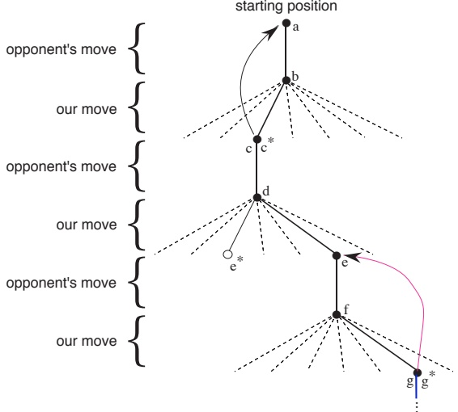
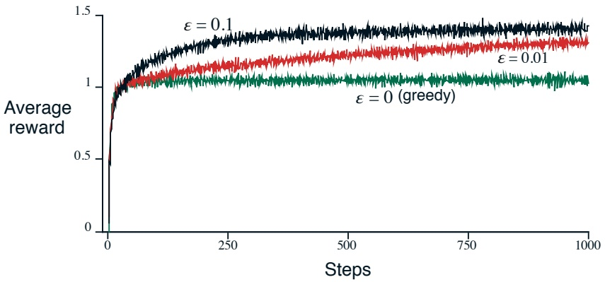
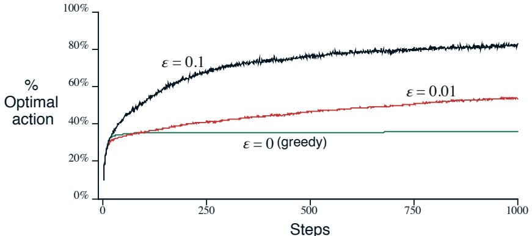

# Reinforcement Learning: An Introduction

Second edition, in progress

Richard S. Sutton and Andrew G. Barto

© 2014, 2015

A Bradford Book

The MIT Press

Cambridge, Massachusetts

London, England

---

In memory of A. Harry Klopf

---

## Contents

Preface ..... viii  
Series Forward ..... xii  
Summary of Notation ..... xiii  
1 The Reinforcement Learning Problem ..... 1  
1.1 Reinforcement Learning ..... 2  
1.2 Examples ..... 5  
1.3 Elements of Reinforcement Learning ..... 7  
1.4 Limitations and Scope ..... 9  
1.5 An Extended Example: Tic-Tac-Toe ..... 10  
1.6 Summary ..... 15  
1.7 History of Reinforcement Learning ..... 16  
1.8 Bibliographical Remarks ..... 25  
I Tabular Solution Methods ..... 27  
2 Multi-arm Bandits ..... 31  
2.1 An n-Armed Bandit Problem ..... 32  
2.2 Action-Value Methods ..... 33  
2.3 Incremental Implementation ..... 36  
2.4 Tracking a Nonstationary Problem ..... 38  
2.5 Optimistic Initial Values ..... 39  
2.6 Upper-Confidence-Bound Action Selection ..... 41

---

2.7 Gradient Bandits ..... 42  
2.8 Associative Search (Contextual Bandits) ..... 46  
2.9 Summary ..... 47  
  
3 Finite Markov Decision Processes ..... 53  
3.1 The Agent-Environment Interface ..... 53  
3.2 Goals and Rewards ..... 57  
3.3 Returns ..... 59  
3.4 Unified Notation for Episodic and Continuing Tasks ..... 61  
  
*3.5 The Markov Property ..... 62  
3.6 Markov Decision Processes ..... 67  
3.7 Value Functions ..... 70  
3.8 Optimal Value Functions ..... 75  
3.9 Optimality and Approximation ..... 79  
3.10 Summary ..... 80  
  
4 Dynamic Programming ..... 89  
4.1 Policy Evaluation ..... 90  
4.2 Policy Improvement ..... 94  
4.3 Policy Iteration ..... 96  
4.4 Value Iteration ..... 98  
4.5 Asynchronous Dynamic Programming ..... 101  
4.6 Generalized Policy Iteration ..... 104  
4.7 Efficiency of Dynamic Programming ..... 106  
4.8 Summary ..... 107  
  
5 Monte Carlo Methods ..... 113  
5.1 Monte Carlo Prediction ..... 114  
5.2 Monte Carlo Estimation of Action Values ..... 119  
5.3 Monte Carlo Control ..... 120  
5.4 Monte Carlo Control without Exploring Starts ..... 124

---

## CONTENTS

5.5 Off-policy Prediction via Importance Sampling ..... 127  
5.6 Incremental Implementation ..... 133  
5.7 Off-Policy Monte Carlo Control ..... 135  
*5.8 Importance Sampling on Truncated Returns ..... 136  
5.9 Summary ..... 138  
  
6 Temporal-Difference Learning ..... 143  
6.1 TD Prediction ..... 143  
6.2 Advantages of TD Prediction Methods ..... 148  
6.3 Optimality of TD(0) ..... 151  
6.4 Sarsa: On-Policy TD Control ..... 154  
6.5 Q-Learning: Off-Policy TD Control ..... 157  
6.6 Games, Afterstates, and Other Special Cases ..... 160  
6.7 Summary ..... 161  
  
7 Eligibility Traces ..... 167  
7.1 n-Step TD Prediction ..... 168  
7.2 The Forward View of TD(λ) ..... 172  
7.3 The Backward View of TD(λ) ..... 177  
7.4 Equivalences of Forward and Backward Views ..... 181  
7.5 Sarsa(λ) ..... 183  
7.6 Watkins's Q(λ) ..... 186  
7.7 Off-policy Eligibility Traces using Importance Sampling ..... 188  
7.8 Implementation Issues ..... 189  
*7.9 Variable λ ..... 190  
7.10 Conclusions ..... 190  
  
8 Planning and Learning with Tabular Methods ..... 195  
8.1 Models and Planning ..... 195  
8.2 Integrating Planning, Acting, and Learning ..... 198  
8.3 When the Model Is Wrong ..... 203

---

8.4 Prioritized Sweeping ..... 206  
8.5 Full vs. Sample Backups ..... 210  
8.6 Trajectory Sampling ..... 213  
8.7 Heuristic Search ..... 217  
8.8 Monte Carlo Tree Search ..... 220  
8.9 Summary ..... 220  
  
II Approximate Solution Methods ..... 223  
  
9 On-policy Approximation of Action Values ..... 225  
9.1 Value Prediction with Function Approximation ..... 226  
9.2 Gradient-Descent Methods ..... 229  
9.3 Linear Methods ..... 232  
9.4 Control with Function Approximation ..... 241  
9.5 Should We Bootstrap? ..... 247  
9.6 Summary ..... 249  
  
10 Off-policy Approximation of Action Values ..... 255  
  
11 Policy Approximation ..... 257  
11.1 Actor-Critic Methods ..... 257  
11.2 Eligibility Traces for Actor-Critic Methods ..... 259  
11.3 R-Learning and the Average-Reward Setting ..... 260  
  
III Frontiers ..... 265  
  
12 Psychology ..... 269  
  
13 Neuroscience ..... 271  
  
14 Applications and Case Studies ..... 273  
14.1 TD-Gammon ..... 273

---

## CONTENTS

14.2 Samuel's Checkers Player ..... 279  
14.3 The Acrobot ..... 282  
14.4 Elevator Dispatching ..... 286  
14.5 Dynamic Channel Allocation ..... 291  
14.6 Job-Shop Scheduling ..... 295  
  
15 Prospects ..... 303  
15.1 The Unified View ..... 303  
15.2 State Estimation ..... 306  
15.3 Temporal Abstraction ..... 306  
15.4 Predictive Representations ..... 306  
15.5 Other Frontier Dimensions ..... 306  
  
References ..... 311  
  
Index ..... 338

---

#### Preface

We first came to focus on what is now known as reinforcement learning in late 1979. We were both at the University of Massachusetts, working on one of the earliest projects to revive the idea that networks of neuronlike adaptive elements might prove to be a promising approach to artificial adaptive intelligence. The project explored the “heterostatic theory of adaptive systems” developed by A. Harry Klopf. Harry’s work was a rich source of ideas, and we were permitted to explore them critically and compare them with the long history of prior work in adaptive systems. Our task became one of teasing the ideas apart and understanding their relationships and relative importance. This continues today, but in 1979 we came to realize that perhaps the simplest of the ideas, which had long been taken for granted, had received surprisingly little attention from a computational perspective. This was simply the idea of a learning system that wants something, that adapts its behavior in order to maximize a special signal from its environment. This was the idea of a “he-donistic” learning system, or, as we would say now, the idea of reinforcement learning.

Like others, we had a sense that reinforcement learning had been thoroughly explored in the early days of cybernetics and artificial intelligence. On closer inspection, though, we found that it had been explored only slightly. While reinforcement learning had clearly motivated some of the earliest computational studies of learning, most of these researchers had gone on to other things, such as pattern classification, supervised learning, and adaptive control, or they had abandoned the study of learning altogether. As a result, the special issues involved in learning how to get something from the environment received relatively little attention. In retrospect, focusing on this idea was the critical step that set this branch of research in motion. Little progress could be made in the computational study of reinforcement learning until it was recognized that such a fundamental idea had not yet been thoroughly explored.

The field has come a long way since then, evolving and maturing in several directions. Reinforcement learning has gradually become one of the most active research areas in machine learning, artificial intelligence, and neural network research. The field has developed strong mathematical foundations and impressive applications. The computational study of reinforcement learning is now a large field, with hundreds of active researchers around the world in diverse disciplines such as psychology, control theory, artificial intelligence, and neuroscience. Particularly important have been the contributions establishing and developing the relationships to the theory of optimal control and dynamic programming. The overall problem of learning from interaction to achieve

---

goals is still far from being solved, but our understanding of it has improved significantly. We can now place component ideas, such as temporal-difference learning, dynamic programming, and function approximation, within a coherent perspective with respect to the overall problem.

Our goal in writing this book was to provide a clear and simple account of the key ideas and algorithms of reinforcement learning. We wanted our treatment to be accessible to readers in all of the related disciplines, but we could not cover all of these perspectives in detail. For the most part, our treatment takes the point of view of artificial intelligence and engineering. In this second edition, we plan to have one chapter summarizing the connections to psychology and neuroscience, which are many and rapidly developing. Coverage of connections to other fields we leave to others or to another time. We also chose not to produce a rigorous formal treatment of reinforcement learning. We did not reach for the highest possible level of mathematical abstraction and did not rely on a theorem-proof format. We tried to choose a level of mathematical detail that points the mathematically inclined in the right directions without distracting from the simplicity and potential generality of the underlying ideas.

The book consists of three parts. Part I is introductory and problem oriented. We focus on the simplest aspects of reinforcement learning and on its main distinguishing features. One full chapter is devoted to introducing the reinforcement learning problem whose solution we explore in the rest of the book. Part II presents tabular versions (assuming a small finite state space) of all the basic solution methods based on estimating action values. We introduce dynamic programming, Monte Carlo methods, and temporal-difference learning. There is a chapter on eligibility traces which unifies the latter two methods, and a chapter that unifies planning methods (such as dynamic programming and state-space search) and learning methods (such as Monte Carlo and temporal-difference learning). Part III is concerned with extending the tabular methods to include various forms of approximation including function approximation, policy-gradient methods, and methods designed for solving off-policy learning problems. Part IV surveys some of the frontiers of reinforcement learning in biology and applications.

This book was designed to be used as a text in a one- or two-semester course, perhaps supplemented by readings from the literature or by a more mathematical text such as Bertsekas and Tsitsiklis (1996) or Szepesvari (2010). This book can also be used as part of a broader course on machine learning, artificial intelligence, or neural networks. In this case, it may be desirable to cover only a subset of the material. We recommend covering Chapter 1 for a brief overview, Chapter 2 through Section 2.2, Chapter 3 except Sections 3.4, 3.5 and 3.9, and then selecting sections from the remaining chapters according

---

to time and interests. The five chapters of Part II build on each other and are best covered in sequence; of these, Chapter 6 is the most important for the subject and for the rest of the book. A course focusing on machine learning or neural networks should cover Chapter 9, and a course focusing on artificial intelligence or planning should cover Chapter 8. Throughout the book, sections that are more difficult and not essential to the rest of the book are marked with a *. These can be omitted on first reading without creating problems later on. Some exercises are marked with a * to indicate that they are more advanced and not essential to understanding the basic material of the chapter.

The book is largely self-contained. The only mathematical background assumed is familiarity with elementary concepts of probability, such as expectations of random variables. Chapter 9 is substantially easier to digest if the reader has some knowledge of artificial neural networks or some other kind of supervised learning method, but it can be read without prior background. We strongly recommend working the exercises provided throughout the book. Solution manuals are available to instructors. This and other related and timely material is available via the Internet.

At the end of most chapters is a section entitled “Bibliographical and Historical Remarks,” wherein we credit the sources of the ideas presented in that chapter, provide pointers to further reading and ongoing research, and describe relevant historical background. Despite our attempts to make these sections authoritative and complete, we have undoubtedly left out some important prior work. For that we apologize, and welcome corrections and extensions for incorporation into a subsequent edition.

In some sense we have been working toward this book for thirty years, and we have lots of people to thank. First, we thank those who have personally helped us develop the overall view presented in this book: Harry Klopf, for helping us recognize that reinforcement learning needed to be revived; Chris Watkins, Dimitri Bertsekas, John Tsitsiklis, and Paul Werbos, for helping us see the value of the relationships to dynamic programming; John Moore and Jim Kehoe, for insights and inspirations from animal learning theory; Oliver Selfridge, for emphasizing the breadth and importance of adaptation; and, more generally, our colleagues and students who have contributed in countless ways: Ron Williams, Charles Anderson, Satinder Singh, Sridhar Mahadevan, Steve Bradtke, Bob Crites, Peter Dayan, and Leemon Baird. Our view of reinforcement learning has been significantly enriched by discussions with Paul Cohen, Paul Utgoff, Martha Steenstrup, Gerry Tesauro, Mike Jordan, Leslie Kaelbling, Andrew Moore, Chris Atkeson, Tom Mitchell, Nils Nilsson, Stuart Russell, Tom Dietterich, Tom Dean, and Bob Narendra. We thank Michael Littman, Gerry Tesauro, Bob Crites, Satinder Singh, and Wei Zhang for providing specifics of Sections 4.7, 15.1, 15.4, 15.5, and 15.6 respectively. We

---

thank the Air Force Office of Scientific Research, the National Science Foundation, and GTE Laboratories for their long and farsighted support.

We also wish to thank the many people who have read drafts of this book and provided valuable comments, including Tom Kalt, John Tsitsiklis, Pawel Cichosz, Olle Gällmo, Chuck Anderson, Stuart Russell, Ben Van Roy, Paul Steenstrup, Paul Cohen, Sridhar Mahadevan, Jette Randlov, Brian Sheppard, Thomas O'Connell, Richard Coggins, Cristina Versino, John H. Hiett, Andreas Badelt, Jay Ponte, Joe Beck, Justus Piater, Martha Steenstrup, Satinder Singh, Tommi Jaakkola, Dimitri Bertsekas, Torbjörn Ekman, Christina Björkman, Jakob Carlström, and Olle Palmgren. Finally, we thank Gwyn Mitchell for helping in many ways, and Harry Stanton and Bob Prior for being our champions at MIT Press.

---

xii

Series Forward

---

#### Summary of Notation

Capital letters are used for random variables and major algorithm variables. Lower case letters are used for the values of random variables and for scalar functions. Quantities that are required to be real-valued vectors are written in bold and in lower case (even if random variables).

s state
a action
§ set of all nonterminal states
§+ set of all states, including the terminal state
 $\mathcal{A}(s)$ set of actions possible in state s
 $\mathcal{R}$ set of possible rewards

t discrete time step
T final time step of an episode
 $S_{t}$ state at t
 $A_{t}$ action at t
 $R_{t}$ reward at t, dependent, like  $S_{t}$, on  $A_{t-1}$ and  $S_{t-1}$
 $G_{t}$ return (cumulative discounted reward) following t
 $G_{t}^{(n)}$ n-step return (Section 7.1)
 $G_{t}^{\lambda}$  $\lambda$-return (Section 7.2)

 $\pi$ policy, decision-making rule
 $\pi(s)$ action taken in state s under deterministic policy  $\pi$
 $\pi(a|s)$ probability of taking action a in state s under stochastic policy  $\pi$
 $p(s', r|s, a)$ probability of transitioning to state  $s'$, with reward r, from s, a

 $v_{\pi}(s)$ value of state s under policy  $\pi$ (expected return)
 $v_{*}(s)$ value of state s under the optimal policy
 $q_{\pi}(s, a)$ value of taking action a in state s under policy  $\pi$
 $q_{*}(s, a)$ value of taking action a in state s under the optimal policy
 $V_{t}(s)$ estimate (a random variable) of  $v_{\pi}(s)$ or  $v_{*}(s)$
 $Q_{t}(s, a)$ estimate (a random variable) of  $q_{\pi}(s, a)$ or  $q_{*}(s, a)$

 $\hat{v}(s, \mathbf{w})$ approximate value of state s given a vector of weights  $\mathbf{w}$
 $\hat{q}(s, a, \mathbf{w})$ approximate value of state-action pair s, a given weights  $\mathbf{w}$
 $\mathbf{w}, \mathbf{w}_{t}$ vector of (possibly learned) weights underlying an approximate value function
 $\mathbf{x}(s)$ vector of features visible when in state s
 $\mathbf{w}^{\top} \mathbf{x}$ inner product of vectors,  $\mathbf{w}^{\top} \mathbf{x} = \sum_{i} w_{i} x_{i}$; e.g.,  $\hat{v}(s, \mathbf{w}) = \mathbf{w}^{\top} \mathbf{x}(s)$

---

<table border=1 style='margin: auto; word-wrap: break-word;'><tr><td style='text-align: center; word-wrap: break-word;'>$\delta_{t}$</td><td style='text-align: center; word-wrap: break-word;'>temporal-difference error at  $t$ (a random variable, even though not upper case)</td></tr><tr><td style='text-align: center; word-wrap: break-word;'>$E_{t}(s)$</td><td style='text-align: center; word-wrap: break-word;'>eligibility trace for state  $s$ at  $t$</td></tr><tr><td style='text-align: center; word-wrap: break-word;'>$E_{t}(s,a)$</td><td style='text-align: center; word-wrap: break-word;'>eligibility trace for a state-action pair</td></tr><tr><td style='text-align: center; word-wrap: break-word;'>$\mathbf{e}_{t}$</td><td style='text-align: center; word-wrap: break-word;'>eligibility trace vector at  $t$</td></tr><tr><td style='text-align: center; word-wrap: break-word;'>$\gamma$</td><td style='text-align: center; word-wrap: break-word;'>discount-rate parameter</td></tr><tr><td style='text-align: center; word-wrap: break-word;'>$\varepsilon$</td><td style='text-align: center; word-wrap: break-word;'>probability of random action in  $\varepsilon$-greedy policy</td></tr><tr><td style='text-align: center; word-wrap: break-word;'>$\alpha, \beta$</td><td style='text-align: center; word-wrap: break-word;'>step-size parameters</td></tr><tr><td style='text-align: center; word-wrap: break-word;'>$\lambda$</td><td style='text-align: center; word-wrap: break-word;'>decay-rate parameter for eligibility traces</td></tr></table>

---

# The Reinforcement Learning Problem

The idea that we learn by interacting with our environment is probably the first to occur to us when we think about the nature of learning. When an infant plays, waves its arms, or looks about, it has no explicit teacher, but it does have a direct sensorimotor connection to its environment. Exercising this connection produces a wealth of information about cause and effect, about the consequences of actions, and about what to do in order to achieve goals. Throughout our lives, such interactions are undoubtedly a major source of knowledge about our environment and ourselves. Whether we are learning to drive a car or to hold a conversation, we are acutely aware of how our environment responds to what we do, and we seek to influence what happens through our behavior. Learning from interaction is a foundational idea underlying nearly all theories of learning and intelligence.

In this book we explore a computational approach to learning from interaction. Rather than directly theorizing about how people or animals learn, we explore idealized learning situations and evaluate the effectiveness of various learning methods. That is, we adopt the perspective of an artificial intelligence researcher or engineer. We explore designs for machines that are effective in solving learning problems of scientific or economic interest, evaluating the designs through mathematical analysis or computational experiments. The approach we explore, called reinforcement learning, is much more focused on goal-directed learning from interaction than are other approaches to machine learning.

---

## 1.1 Reinforcement Learning

Reinforcement learning is like many topics with names ending in -ing, such as machine learning, planning, and mountaineering, in that it is simultaneously a problem, a class of solution methods that work well on the class of problems, and the field that studies these problems and their solution methods. Reinforcement learning problems involve learning what to do—how to map situations to actions—so as to maximize a numerical reward signal. In an essential way they are closed-loop problems because the learning system's actions influence its later inputs. Moreover, the learner is not told which actions to take, as in many forms of machine learning, but instead must discover which actions yield the most reward by trying them out. In the most interesting and challenging cases, actions may affect not only the immediate reward but also the next situation and, through that, all subsequent rewards. These three characteristics—being closed-loop in an essential way, not having direct instructions as to what actions to take, and where the consequences of actions, including reward signals, play out over extended time periods—are the three most important distinguishing features of reinforcement learning problems.

A full specification of reinforcement learning problems in terms of optimal control of Markov decision processes must wait until Chapter 3, but the basic idea is simply to capture the most important aspects of the real problem facing a learning agent interacting with its environment to achieve a goal. Clearly, such an agent must be able to sense the state of the environment to some extent and must be able to take actions that affect the state. The agent also must have a goal or goals relating to the state of the environment. The formulation is intended to include just these three aspects—sensation, action, and goal—in their simplest possible forms without trivializing any of them.

Any method that is well suited to solving this kind of problem we consider to be a reinforcement learning method. Reinforcement learning is different from supervised learning, the kind of learning studied in most current research in field of machine learning. Supervised learning is learning from a training set of labeled examples provided by a knowledgeable external supervisor. Each example is a description of a situation together with a specification—the label—of the correct action the system should take to that situation, which is often to identify a category to which the situation belongs. The object of this kind of learning is for the system to extrapolate, or generalize, its responses so that it acts correctly in situations not present in the training set. This is an important kind of learning, but alone it is not adequate for learning from interaction. In interactive problems it is often impractical to obtain examples of desired behavior that are both correct and representative of all the situations in which the agent has to act. In uncharted territory—where one would

---

## 1.1. REINFORCEMENT LEARNING

expect learning to be most beneficial—an agent must be able to learn from its own experience.

Reinforcement learning is also different from what machine learning researchers call unsupervised learning, which is typically about finding structure hidden in collections of unlabeled data. The terms supervised learning and unsupervised learning appear to exhaustively classify machine learning paradigms, but they do not. Although one might be tempted to think of reinforcement learning as a kind of unsupervised learning because it does not rely on examples of correct behavior, reinforcement learning is trying to maximize a reward signal instead of trying to find hidden structure. Uncovering structure in an agent's experience can certainly be useful in reinforcement learning, but by itself does not address the reinforcement learning agent's problem of maximizing a reward signal. We therefore consider reinforcement learning to be a third machine learning paradigm, alongside of supervised learning, unsupervised learning, and perhaps other paradigms as well.

One of the challenges that arise in reinforcement learning, and not in other kinds of learning, is the trade-off between exploration and exploitation. To obtain a lot of reward, a reinforcement learning agent must prefer actions that it has tried in the past and found to be effective in producing reward. But to discover such actions, it has to try actions that it has not selected before. The agent has to exploit what it already knows in order to obtain reward, but it also has to explore in order to make better action selections in the future. The dilemma is that neither exploration nor exploitation can be pursued exclusively without failing at the task. The agent must try a variety of actions and progressively favor those that appear to be best. On a stochastic task, each action must be tried many times to gain a reliable estimate its expected reward. The exploration-exploitation dilemma has been intensively studied by mathematicians for many decades (see Chapter 2). For now, we simply note that the entire issue of balancing exploration and exploitation does not even arise in supervised and unsupervised learning, at least in their purist forms.

Another key feature of reinforcement learning is that it explicitly considers the whole problem of a goal-directed agent interacting with an uncertain environment. This is in contrast with many approaches that consider subproblems without addressing how they might fit into a larger picture. For example, we have mentioned that much of machine learning research is concerned with supervised learning without explicitly specifying how such an ability would finally be useful. Other researchers have developed theories of planning with general goals, but without considering planning's role in real-time decision-making, or the question of where the predictive models necessary for planning would come from. Although these approaches have yielded many useful results,

---

their focus on isolated subproblems is a significant limitation.

Reinforcement learning takes the opposite tack, starting with a complete, interactive, goal-seeking agent. All reinforcement learning agents have explicit goals, can sense aspects of their environments, and can choose actions to influence their environments. Moreover, it is usually assumed from the beginning that the agent has to operate despite significant uncertainty about the environment it faces. When reinforcement learning involves planning, it has to address the interplay between planning and real-time action selection, as well as the question of how environment models are acquired and improved. When reinforcement learning involves supervised learning, it does so for specific reasons that determine which capabilities are critical and which are not. For learning research to make progress, important subproblems have to be isolated and studied, but they should be subproblems that play clear roles in complete, interactive, goal-seeking agents, even if all the details of the complete agent cannot yet be filled in.

One of the most exciting aspects of modern reinforcement learning is its substantive and fruitful interactions with other engineering and scientific disciplines. Reinforcement learning is part of a decades-long trend within artificial intelligence and machine learning toward greater integration with statistics, optimization, and other mathematical subjects. For example, the ability of some reinforcement learning methods to learn with parameterized approximators addresses the classical “curse of dimensionality” in operations research and control theory. More distinctively, reinforcement learning has also interacted strongly with psychology and neuroscience, with substantial benefits going both ways. Of all the forms of machine learning, reinforcement learning is the closest to the kind of learning that humans and other animals do, and many of the core algorithms of reinforcement learning were originally inspired by biological learning systems. And reinforcement learning has also given back, both through a psychological model of animal learning that better matches some of the empirical data, and through an influential model of parts of the brain’s reward system. The body of this book develops the ideas of reinforcement learning that pertain to engineering and artificial intelligence, with connections to psychology and neuroscience summarized in Chapters ?? and ??.

Finally, reinforcement learning is also part of a larger trend in artificial intelligence back toward simple general principles. Since the late 1960's, many artificial intelligence researchers presumed that there are no general principles to be discovered, that intelligence is instead due to the possession of vast numbers of special purpose tricks, procedures, and heuristics. It was sometimes said that if we could just get enough relevant facts into a machine, say one million, or one billion, then it would become intelligent. Methods based on general

---

principles, such as search or learning, were characterized as “weak methods,” whereas those based on specific knowledge were called “strong methods.” This view is still common today, but much less dominant. From our point of view, it was simply premature: too little effort had been put into the search for general principles to conclude that there were none. Modern AI now includes much research looking for general principles of learning, search, and decision-making, as well as trying to incorporate vast amounts of domain knowledge. It is not clear how far back the pendulum will swing, but reinforcement learning research is certainly part of the swing back toward simpler and fewer general principles of artificial intelligence.

## 1.2 Examples

A good way to understand reinforcement learning is to consider some of the examples and possible applications that have guided its development.

● A master chess player makes a move. The choice is informed both by planning—anticipating possible replies and counterreplies—and by immediate, intuitive judgments of the desirability of particular positions and moves.

● An adaptive controller adjusts parameters of a petroleum refinery’s operation in real time. The controller optimizes the yield/cost/quality trade-off on the basis of specified marginal costs without sticking strictly to the set points originally suggested by engineers.

- A gazelle calf struggles to its feet minutes after being born. Half an hour later it is running at 20 miles per hour.

● A mobile robot decides whether it should enter a new room in search of more trash to collect or start trying to find its way back to its battery recharging station. It makes its decision based on the current charge level of its battery and how quickly and easily it has been able to find the recharger in the past.

- Phil prepares his breakfast. Closely examined, even this apparently mundane activity reveals a complex web of conditional behavior and interlocking goal-subgoal relationships: walking to the cupboard, opening it, selecting a cereal box, then reaching for, grasping, and retrieving the box. Other complex, tuned, interactive sequences of behavior are required to obtain a bowl, spoon, and milk jug. Each step involves a series

---

of eye movements to obtain information and to guide reaching and locomotion. Rapid judgments are continually made about how to carry the objects or whether it is better to ferry some of them to the dining table before obtaining others. Each step is guided by goals, such as grasping a spoon or getting to the refrigerator, and is in service of other goals, such as having the spoon to eat with once the cereal is prepared and ultimately obtaining nourishment. Whether he is aware of it or not, Phil is accessing information about the state of his body that determines his nutritional needs, level of hunger, and food preferences.

These examples share features that are so basic that they are easy to overlook. All involve interaction between an active decision-making agent and its environment, within which the agent seeks to achieve a goal despite uncertainty about its environment. The agent's actions are permitted to affect the future state of the environment (e.g., the next chess position, the level of reservoirs of the refinery, the robot's next location and the future charge level of its battery), thereby affecting the options and opportunities available to the agent at later times. Correct choice requires taking into account indirect, delayed consequences of actions, and thus may require foresight or planning.

At the same time, in all these examples the effects of actions cannot be fully predicted; thus the agent must monitor its environment frequently and react appropriately. For example, Phil must watch the milk he pours into his cereal bowl to keep it from overflowing. All these examples involve goals that are explicit in the sense that the agent can judge progress toward its goal based on what it can sense directly. The chess player knows whether or not he wins, the refinery controller knows how much petroleum is being produced, the mobile robot knows when its batteries run down, and Phil knows whether or not he is enjoying his breakfast.

Neither the agent nor its environment may coincide with what we normally think of as an agent and its environment. An agent is not necessarily an entire robot or organism, and its environment is not necessarily only what is outside of a robot or organism. The example robot's battery is part of the environment of its controlling agent, and Phil's degree of hunger and food preferences are features of the environment of his internal decision-making agent. The state of an agent's environment often include's information about the state of the machine or organism in which the agent resides, and this can include memories and even aspirations. Throughout this book we are being abstract in this way when we talk about agents and their environments.

In all of these examples the agent can use its experience to improve its performance over time. The chess player refines the intuition he uses to evaluate positions, thereby improving his play; the gazelle calf improves the efficiency

---

## 1.3. ELEMENTS OF REINFORCEMENT LEARNING

with which it can run; Phil learns to streamline making his breakfast. The knowledge the agent brings to the task at the start—either from previous experience with related tasks or built into it by design or evolution—influences what is useful or easy to learn, but interaction with the environment is essential for adjusting behavior to exploit specific features of the task.

## 1.3 Elements of Reinforcement Learning

Beyond the agent and the environment, one can identify four main subelements of a reinforcement learning system: a policy, a reward signal, a value function, and, optionally, a model of the environment.

A policy defines the learning agent’s way of behaving at a given time. Roughly speaking, a policy is a mapping from perceived states of the environment to actions to be taken when in those states. It corresponds to what in psychology would be called a set of stimulus-response rules or associations (provided that stimuli include those that can come from within the animal). In some cases the policy may be a simple function or lookup table, whereas in others it may involve extensive computation such as a search process. The policy is the core of a reinforcement learning agent in the sense that it alone is sufficient to determine behavior. In general, policies may be stochastic.

A reward signal defines the goal in a reinforcement learning problem. On each time step, the environment sends to the reinforcement learning agent a single number, a reward. The agent's sole objective is to maximize the total reward it receives over the long run. The reward signal thus defines what are the good and bad events for the agent. In a biological system, we might think of rewards as analogous to the experiences of pleasure or pain. They are the immediate and defining features of the problem faced by the agent. The reward sent to the agent at any time depends on the agent's current action and the current state of the agent's environment. The agent cannot alter the process that does this. The only way the agent can influence the reward signal is through its actions, which can have a direct effect on reward, or an indirect effect through changing the environment's state. In our example above of Phil eating breakfast, the reinforcement learning agent directing his behavior might receive different reward signals when he eats his breakfast depending on how hungry he is, what mood he is in, and other features of his of his body, which is part of his internal reinforcement learning agent's environment. The reward signal is the primary basis for altering the policy. If an action selected by the policy is followed by low reward, then the policy may be changed to select some other action in that situation in the future. In general, reward signals may be stochastic functions of the state of the environment and the actions

---

taken.

Whereas the reward signal indicates what is good in an immediate sense, a value function specifies what is good in the long run. Roughly speaking, the value of a state is the total amount of reward an agent can expect to accumulate over the future, starting from that state. Whereas rewards determine the immediate, intrinsic desirability of environmental states, values indicate the long-term desirability of states after taking into account the states that are likely to follow, and the rewards available in those states. For example, a state might always yield a low immediate reward but still have a high value because it is regularly followed by other states that yield high rewards. Or the reverse could be true. To make a human analogy, rewards are somewhat like pleasure (if high) and pain (if low), whereas values correspond to a more refined and farsighted judgment of how pleased or displeased we are that our environment is in a particular state. Expressed this way, we hope it is clear that value functions formalize a basic and familiar idea.

Rewards are in a sense primary, whereas values, as predictions of rewards, are secondary. Without rewards there could be no values, and the only purpose of estimating values is to achieve more reward. Nevertheless, it is values with which we are most concerned when making and evaluating decisions. Action choices are made based on value judgments. We seek actions that bring about states of highest value, not highest reward, because these actions obtain the greatest amount of reward for us over the long run. In decision-making and planning, the derived quantity called value is the one with which we are most concerned. Unfortunately, it is much harder to determine values than it is to determine rewards. Rewards are basically given directly by the environment, but values must be estimated and re-estimated from the sequences of observations an agent makes over its entire lifetime. In fact, the most important component of almost all reinforcement learning algorithms we consider is a method for efficiently estimating values. The central role of value estimation is arguably the most important thing we have learned about reinforcement learning over the last few decades.

The fourth and final element of some reinforcement learning systems is a model of the environment. This is something that mimics the behavior of the environment, or more generally, that allows inferences to be made about how the environment will behave. For example, given a state and action, the model might predict the resultant next state and next reward. Models are used for planning, by which we mean any way of deciding on a course of action by considering possible future situations before they are actually experienced. Methods for solving reinforcement learning problems that use models and planning are called model-based methods, as opposed to simpler model-free methods that are explicitly trial-and-error learners—viewed as almost the

---

## 1.4. LIMITATIONS AND SCOPE

opposite of planning. In Chapter 9 we explore reinforcement learning systems that simultaneously learn by trial and error, learn a model of the environment, and use the model for planning. Modern reinforcement learning spans the spectrum from low-level, trial-and-error learning to high-level, deliberative planning.

## 1.4 Limitations and Scope

Most of the reinforcement learning methods we consider in this book are structured around estimating value functions, but it is not strictly necessary to do this to solve reinforcement learning problems. For example, methods such as genetic algorithms, genetic programming, simulated annealing, and other optimization methods have been used to approach reinforcement learning problems without ever appealing to value functions. These methods evaluate the “lifetime” behavior of many non-learning agents, each using a different policy for interacting with its environment, and select those that are able to obtain the most reward. We call these evolutionary methods because their operation is analogous to the way biological evolution produces organisms with skilled behavior even when they do not learn during their individual lifetimes. If the space of policies is sufficiently small, or can be structured so that good policies are common or easy to find—or if a lot of time is available for the search—then evolutionary methods can be effective. In addition, evolutionary methods have advantages on problems in which the learning agent cannot accurately sense the state of its environment.

Our focus is on reinforcement learning methods that involve learning while interacting with the environment, which evolutionary methods do not do (unless they evolve learning algorithms, as in some of the approaches that have been studied). It is our belief that methods able to take advantage of the details of individual behavioral interactions can be much more efficient than evolutionary methods in many cases. Evolutionary methods ignore much of the useful structure of the reinforcement learning problem: they do not use the fact that the policy they are searching for is a function from states to actions; they do not notice which states an individual passes through during its lifetime, or which actions it selects. In some cases this information can be misleading (e.g., when states are misperceived), but more often it should enable more efficient search. Although evolution and learning share many features and naturally work together, we do not consider evolutionary methods by themselves to be especially well suited to reinforcement learning problems. For simplicity, in this book when we use the term “reinforcement learning method” we do not include evolutionary methods.

---

However, we do include some methods that, like evolutionary methods, do not appeal to value functions. These methods search in spaces of policies defined by a collection of numerical parameters. They estimate the directions the parameters should be adjusted in order to most rapidly improve a policy's performance. Unlike evolutionary methods, however, they produce these estimates while the agent is interacting with its environment and so can take advantage of the details of individual behavioral interactions. Methods like this, called policy gradient methods, have proven useful in many problems, and some of the simplest reinforcement learning methods fall into this category. In fact, some of these methods take advantage of value function estimates to improve their gradient estimates. Overall, the distinction between policy gradient methods and other methods we include as reinforcement learning methods is not sharply defined.

Reinforcement learning’s connection to optimization methods deserves some additional comment because it is a source of a common misunderstanding. When we say that a reinforcement learning agent’s goal is to maximize a numerical reward signal, we of course are not insisting that the agent has to actually achieve the goal of maximum reward. Trying to maximize a quantity does not mean that that quantity is ever maximized. The point is that a reinforcement learning agent is always trying to increase the amount of reward it receives. Many factors can prevent it from achieving the maximum, even if one exists. In other words, optimization is not the same a optimality.

## 1.5 An Extended Example: Tic-Tac-Toe

To illustrate the general idea of reinforcement learning and contrast it with other approaches, we next consider a single example in more detail.

Consider the familiar child’s game of tic-tac-toe. Two players take turns playing on a three-by-three board. One player plays Xs and the other Os until one player wins by placing three marks in a row, horizontally, vertically, or diagonally, as the X player has in this game:

<table border=1 style='margin: auto; word-wrap: break-word;'><tr><td style='text-align: center; word-wrap: break-word;'>X</td><td style='text-align: center; word-wrap: break-word;'>O</td><td style='text-align: center; word-wrap: break-word;'>O</td></tr><tr><td style='text-align: center; word-wrap: break-word;'>O</td><td style='text-align: center; word-wrap: break-word;'>X</td><td style='text-align: center; word-wrap: break-word;'>X</td></tr><tr><td style='text-align: center; word-wrap: break-word;'></td><td style='text-align: center; word-wrap: break-word;'></td><td style='text-align: center; word-wrap: break-word;'>X</td></tr></table>

If the board fills up with neither player getting three in a row, the game is a draw. Because a skilled player can play so as never to lose, let us assume that we are playing against an imperfect player, one whose play is sometimes

---

incorrect and allows us to win. For the moment, in fact, let us consider draws and losses to be equally bad for us. How might we construct a player that will find the imperfections in its opponent's play and learn to maximize its chances of winning?

Although this is a simple problem, it cannot readily be solved in a satisfactory way through classical techniques. For example, the classical “minimax” solution from game theory is not correct here because it assumes a particular way of playing by the opponent. For example, a minimax player would never reach a game state from which it could lose, even if in fact it always won from that state because of incorrect play by the opponent. Classical optimization methods for sequential decision problems, such as dynamic programming, can compute an optimal solution for any opponent, but require as input a complete specification of that opponent, including the probabilities with which the opponent makes each move in each board state. Let us assume that this information is not available a priori for this problem, as it is not for the vast majority of problems of practical interest. On the other hand, such information can be estimated from experience, in this case by playing many games against the opponent. About the best one can do on this problem is first to learn a model of the opponent’s behavior, up to some level of confidence, and then apply dynamic programming to compute an optimal solution given the approximate opponent model. In the end, this is not that different from some of the reinforcement learning methods we examine later in this book.

An evolutionary method applied to this problem would directly search the space of possible policies for one with a high probability of winning against the opponent. Here, a policy is a rule that tells the player what move to make for every state of the game—every possible configuration of Xs and Os on the three-by-three board. For each policy considered, an estimate of its winning probability would be obtained by playing some number of games against the opponent. This evaluation would then direct which policy or policies were considered next. A typical evolutionary method would hill-climb in policy space, successively generating and evaluating policies in an attempt to obtain incremental improvements. Or, perhaps, a genetic-style algorithm could be used that would maintain and evaluate a population of policies. Literally hundreds of different optimization methods could be applied.

Here is how the tic-tac-toe problem would be approached with a method making use of a value function. First we set up a table of numbers, one for each possible state of the game. Each number will be the latest estimate of the probability of our winning from that state. We treat this estimate as the state's value, and the whole table is the learned value function. State A has higher value than state B, or is considered "better" than state B, if the current estimate of the probability of our winning from A is higher than it is from B.

---

Figure 1.1: A sequence of tic-tac-toe moves. The solid lines represent the moves taken during a game; the dashed lines represent moves that we (our reinforcement learning player) considered but did not make. Our second move was an exploratory move, meaning that it was taken even though another sibling move, the one leading to e*, was ranked higher. Exploratory moves do not result in any learning, but each of our other moves does, causing backups as suggested by the curved arrows and detailed in the text.

Assuming we always play Xs, then for all states with three Xs in a row the probability of winning is 1, because we have already won. Similarly, for all states with three Os in a row, or that are “filled up,” the correct probability is 0, as we cannot win from them. We set the initial values of all the other states to 0.5, representing a guess that we have a 50% chance of winning.

We play many games against the opponent. To select our moves we examine the states that would result from each of our possible moves (one for each blank space on the board) and look up their current values in the table. Most of the time we move greedily, selecting the move that leads to the state with greatest value, that is, with the highest estimated probability of winning. Occasionally, however, we select randomly from among the other moves instead. These are called exploratory moves because they cause us to experience states that we might otherwise never see. A sequence of moves made and considered during a game can be diagrammed as in Figure 1.1.

---

While we are playing, we change the values of the states in which we find ourselves during the game. We attempt to make them more accurate estimates of the probabilities of winning. To do this, we “back up” the value of the state after each greedy move to the state before the move, as suggested by the arrows in Figure 1.1. More precisely, the current value of the earlier state is adjusted to be closer to the value of the later state. This can be done by moving the earlier state’s value a fraction of the way toward the value of the later state. If we let s denote the state before the greedy move, and  $s'$ the state after the move, then the update to the estimated value of s, denoted  $V(s)$, can be written as

 
$$
V(s)\leftarrow V(s)+\alpha\Big[V(s^{\prime})-V(s)\Big],
$$
 

where  $\alpha$ is a small positive fraction called the step-size parameter, which influences the rate of learning. This update rule is an example of a temporal-difference learning method, so called because its changes are based on a difference,  $V(s') - V(s)$, between estimates at two different times.

The method described above performs quite well on this task. For example, if the step-size parameter is reduced properly over time, this method converges, for any fixed opponent, to the true probabilities of winning from each state given optimal play by our player. Furthermore, the moves then taken (except on exploratory moves) are in fact the optimal moves against the opponent. In other words, the method converges to an optimal policy for playing the game. If the step-size parameter is not reduced all the way to zero over time, then this player also plays well against opponents that slowly change their way of playing.

This example illustrates the differences between evolutionary methods and the methods that learn value functions. To evaluate a policy an evolutionary method holds the policy fixed and plays many games against the opponent, or simulate many games using a model of the opponent. The frequency of wins gives an unbiased estimate of the probability of winning with that policy, and can be used to direct the next policy selection. But each policy change is made only after many games, and only the final outcome of each game is used: what happens during the games is ignored. For example, if the player wins, then all of its behavior in the game is given credit, independently of how specific moves might have been critical to the win. Credit is even given to moves that never occurred! Value function methods, in contrast, allow individual states to be evaluated. In the end, evolutionary and value function methods both search the space of policies, but learning a value function takes advantage of information available during the course of play.

This simple example illustrates some of the key features of reinforcement learning methods. First, there is the emphasis on learning while interacting

---

with an environment, in this case with an opponent player. Second, there is a clear goal, and correct behavior requires planning or foresight that takes into account delayed effects of one's choices. For example, the simple reinforcement learning player would learn to set up multi-move traps for a shortsighted opponent. It is a striking feature of the reinforcement learning solution that it can achieve the effects of planning and lookahead without using a model of the opponent and without conducting an explicit search over possible sequences of future states and actions.

While this example illustrates some of the key features of reinforcement learning, it is so simple that it might give the impression that reinforcement learning is more limited than it really is. Although tic-tac-toe is a two-person game, reinforcement learning also applies in the case in which there is no external adversary, that is, in the case of a “game against nature.” Reinforcement learning also is not restricted to problems in which behavior breaks down into separate episodes, like the separate games of tic-tac-toe, with reward only at the end of each episode. It is just as applicable when behavior continues indefinitely and when rewards of various magnitudes can be received at any time. Reinforcement learning is also applicable to problems that do not even break down into discrete time steps, like the plays of tic-tac-toe. The general principles apply to continuous-time problems as well, although the theory gets more complicated and we omit it from this introductory treatment.

Tic-tac-toe has a relatively small, finite state set, whereas reinforcement learning can be used when the state set is very large, or even infinite. For example, Gerry Tesauro (1992, 1995) combined the algorithm described above with an artificial neural network to learn to play backgammon, which has approximately  $10^{20}$ states. With this many states it is impossible ever to experience more than a small fraction of them. Tesauro's program learned to play far better than any previous program, and now plays at the level of the world's best human players (see Chapter 15). The neural network provides the program with the ability to generalize from its experience, so that in new states it selects moves based on information saved from similar states faced in the past, as determined by its network. How well a reinforcement learning system can work in problems with such large state sets is intimately tied to how appropriately it can generalize from past experience. It is in this role that we have the greatest need for supervised learning methods with reinforcement learning. Neural networks are not the only, or necessarily the best, way to do this.

In this tic-tac-toe example, learning started with no prior knowledge beyond the rules of the game, but reinforcement learning by no means entails a tabula rasa view of learning and intelligence. On the contrary, prior information can be incorporated into reinforcement learning in a variety of ways that

---

can be critical for efficient learning. We also had access to the true state in the tic-tac-toe example, whereas reinforcement learning can also be applied when part of the state is hidden, or when different states appear to the learner to be the same. That case, however, is substantially more difficult, and we do not cover it significantly in this book.

Finally, the tic-tac-toe player was able to look ahead and know the states that would result from each of its possible moves. To do this, it had to have a model of the game that allowed it to “think about” how its environment would change in response to moves that it might never make. Many problems are like this, but in others even a short-term model of the effects of actions is lacking. Reinforcement learning can be applied in either case. No model is required, but models can easily be used if they are available or can be learned.

On the other hand, there are reinforcement learning methods that do not need any kind of environment model at all. Model-free systems cannot even think about how their environments will change in response to a single action. The tic-tac-toe player is model-free in this sense with respect to its opponent: it has no model of its opponent of any kind. Because models have to be reasonably accurate to be useful, model-free methods can have advantages over more complex methods when the real bottleneck in solving a problem is the difficulty of constructing a sufficiently accurate environment model. Model-free methods are also important building blocks for model-based methods. In this book we devote several chapters to model-free methods before we discuss how they can be used as components of more complex model-based methods.

But reinforcement learning can be used at both high and low levels in a system. Although the tic-tac-toe player learned only about the basic moves of the game, nothing prevents reinforcement learning from working at higher levels where each of the “actions” may itself be the application of a possibly elaborate problem-solving method. In hierarchical learning systems, reinforcement learning can work simultaneously on several levels.

## 1.6 Summary

Reinforcement learning is a computational approach to understanding and automating goal-directed learning and decision-making. It is distinguished from other computational approaches by its emphasis on learning by an agent from direct interaction with its environment, without relying on exemplary supervision or complete models of the environment. In our opinion, reinforcement learning is the first field to seriously address the computational issues that arise when learning from interaction with an environment in order to achieve

---

long-term goals.

Reinforcement learning uses a formal framework defining the interaction between a learning agent and its environment in terms of states, actions, and rewards. This framework is intended to be a simple way of representing essential features of the artificial intelligence problem. These features include a sense of cause and effect, a sense of uncertainty and nondeterminism, and the existence of explicit goals.

The concepts of value and value functions are the key features of most of the reinforcement learning methods that we consider in this book. We take the position that value functions are important for efficient search in the space of policies. Their use of value functions distinguishes reinforcement learning methods from evolutionary methods that search directly in policy space guided by scalar evaluations of entire policies.

## 1.7 History of Reinforcement Learning

The history of reinforcement learning has two main threads, both long and rich, that were pursued independently before intertwining in modern reinforcement learning. One thread concerns learning by trial and error that started in the psychology of animal learning. This thread runs through some of the earliest work in artificial intelligence and led to the revival of reinforcement learning in the early 1980s. The other thread concerns the problem of optimal control and its solution using value functions and dynamic programming. For the most part, this thread did not involve learning. Although the two threads have been largely independent, the exceptions revolve around a third, less distinct thread concerning temporal-difference methods such as used in the tic-tac-toe example in this chapter. All three threads came together in the late 1980s to produce the modern field of reinforcement learning as we present it in this book.

The thread focusing on trial-and-error learning is the one with which we are most familiar and about which we have the most to say in this brief history. Before doing that, however, we briefly discuss the optimal control thread.

The term “optimal control” came into use in the late 1950s to describe the problem of designing a controller to minimize a measure of a dynamical system’s behavior over time. One of the approaches to this problem was developed in the mid-1950s by Richard Bellman and others through extending a nineteenth century theory of Hamilton and Jacobi. This approach uses the concepts of a dynamical system’s state and of a value function, or “optimal return function,” to define a functional equation, now often called the Bell

---

## 1.7. HISTORY OF REINFORCEMENT LEARNING

man equation. The class of methods for solving optimal control problems by solving this equation came to be known as dynamic programming (Bellman, 1957a). Bellman (1957b) also introduced the discrete stochastic version of the optimal control problem known as Markovian decision processes (MDPs), and Ronald Howard (1960) devised the policy iteration method for MDPs. All of these are essential elements underlying the theory and algorithms of modern reinforcement learning.

Dynamic programming is widely considered the only feasible way of solving general stochastic optimal control problems. It suffers from what Bellman called “the curse of dimensionality,” meaning that its computational requirements grow exponentially with the number of state variables, but it is still far more efficient and more widely applicable than any other general method. Dynamic programming has been extensively developed since the late 1950s, including extensions to partially observable MDPs (surveyed by Lovejoy, 1991), many applications (surveyed by White, 1985, 1988, 1993), approximation methods (surveyed by Rust, 1996), and asynchronous methods (Bertsekas, 1982, 1983). Many excellent modern treatments of dynamic programming are available (e.g., Bertsekas, 1995; Puterman, 1994; Ross, 1983; and Whittle, 1982, 1983). Bryson (1996) provides an authoritative history of optimal control.

Connections between optimal control and dynamic programming, on the one hand, and learning, on the other, were slow to be recognized. We cannot be sure about what accounted for this separation, but its main cause was likely the separation between the disciplines involved and their different goals. Also contributing may have been the prevalent view of dynamic programming as an off-line computation depending essentially on accurate system models and analytic solutions to the Bellman equation. Further, the simplest form of dynamic programming is a computation that proceeds backwards in time, making it difficult to see how it could be involved in a learning process that must proceed in a forward direction. Perhaps the first to connect optimal control and dynamic programming with learning was Paul Werbos (1977), who proposed an approximate approach to dynamic programming that he called “heuristic dynamic programming.” He later argued for the need for greater interrelation of dynamic programming and learning methods and its relevance to understanding neural and cognitive mechanisms (Werbos, 1987). For us the full integration of dynamic programming methods with on-line learning did not occur until the work of Chris Watkins in 1989, whose treatment of reinforcement learning using the MDP formalism has been widely adopted (Watkins, 1989). Since then these relationships have been extensively developed by many researchers, most particularly by Dimitri Bertsekas and John Tsitsiklis (1996), who coined the term “neurodynamic programming” to refer

---

to the combination of dynamic programming and neural networks. Another term currently in use is “approximate dynamic programming.” These various approaches emphasize different aspects of the subject, but they all share with reinforcement learning an interest in circumventing the classical shortcomings of dynamic programming.

In this book, we consider all of the work in optimal control also to be, in a sense, work in reinforcement learning. We define a reinforcement learning method as any effective way of solving reinforcement learning problems, and it is now clear that these problems are closely related to optimal control problems, particularly stochastic optimal control problems such as those formulated as MDPs. Accordingly, we must consider the solution methods of optimal control, such as dynamic programming, also to be reinforcement learning methods. Because almost all of the conventional methods require complete knowledge of the system to be controlled, it feels a little unnatural to say that they are part of reinforcement learning. On the other hand, many dynamic programming algorithms are incremental and iterative. Like learning methods, they gradually reach the correct answer through successive approximations. As we show in the rest of this book, these similarities are far more than superficial. The theories and solution methods for the cases of complete and incomplete knowledge are so closely related that we feel they must be considered together as part of the same subject matter.

Let us return now to the other major thread leading to the modern field of reinforcement learning, that centered on the idea of trial-and-error learning. We only touch on the major points of contact here, taking up this topic in more detail in Chapter ??. According to American psychologist R. S. Woodworth the idea of trial-and-error learning goes as far back as the 1850s to Alexander Bain's discussion of learning by "groping and experiment" and more explicitly to the British ethologist and psychologist Conway Lloyd Morgan's 1894 use of the term to describe his observations of animal behavior (Woodworth, 1938). Perhaps the first to succinctly express the essence of trial-and-error learning as a principle of learning was Edward Thorndike:

Of several responses made to the same situation, those which are accompanied or closely followed by satisfaction to the animal will, other things being equal, be more firmly connected with the situation, so that, when it recurs, they will be more likely to recur; those which are accompanied or closely followed by discomfort to the animal will, other things being equal, have their connections with that situation weakened, so that, when it recurs, they will be less likely to occur. The greater the satisfaction or discomfort, the greater the strengthening or weakening of the bond. (Thorndike, 1911, p. 244)

---

## 1.7. HISTORY OF REINFORCEMENT LEARNING

Thorndike called this the “Law of Effect” because it describes the effect of reinforcing events on the tendency to select actions. Thorndike later modified the law to better account for accumulating data on animal learning (such as differences between the effects of reward and punishment), and the law in its various forms has generated considerable controversy among learning theorists (e.g., see Gallistel, 2005; Herrnstein, 1970; Kimble, 1961, 1967; Mazur, 1994). Despite this, the Law of Effect—in one form or another—is widely regarded as a basic principle underlying much behavior (e.g., Hilgard and Bower, 1975; Dennett, 1978; Campbell, 1960; Cziko, 1995). It is the basis of the influential learning theories of Clark Hull and experimental methods of B. F. Skinner (e.g., Hull, 1943; Skinner, 1938).

The term “reinforcement” in the context of animal learning came into use well after Thorndike’s expression of the Law of Effect, to the best of our knowledge first appearing in this context in the 1927 English translation of Pavlov’s monograph on conditioned reflexes. Reinforcement is the strengthening of a pattern of behavior as a result of an animal receiving a stimulus—a reinforcer—in an appropriate temporal relationship with another stimulus or with a response. Some psychologists extended its meaning to include the process of weakening in addition to strengthening, as well applying when the omission or termination of an event changes behavior. Reinforcement produces changes in behavior that persist after the reinforcer is withdrawn, so that a stimulus that attracts an animal’s attention or that energizes its behavior without producing lasting changes is not considered to be a reinforcer.

The idea of implementing trial-and-error learning in a computer appeared among the earliest thoughts about the possibility of artificial intelligence. In a 1948 report, Alan Turing described a design for a “pleasure-pain system” that worked along the lines of the Law of Effect:

When a configuration is reached for which the action is undetermined, a random choice for the missing data is made and the appropriate entry is made in the description, tentatively, and is applied. When a pain stimulus occurs all tentative entries are cancelled, and when a pleasure stimulus occurs they are all made permanent. (Turing, 1948)

In 1952 Claude Shannon demonstrated a maze-running mouse named Theseus that used trial and error to find its way to a goal location in a maze, with the maze itself remembering the successful directions via magnets and relays under its floor (Shannon, 1952). Other early computational investigations of trial-and-error learning were those of Minsky and of Farley and Clark, both in 1954. In his Ph.D. dissertation, Minsky discussed computational models of reinforcement learning and described his construction of an analog machine

---

composed of components he called SNARCs (Stochastic Neural-Analog Reinforcement Calculators). Farley and Clark described another neural-network learning machine designed to learn by trial and error. In the 1960s the terms “reinforcement” and “reinforcement learning” were used in the engineering literature for the first time (e.g., Waltz and Fu, 1965; Mendel, 1966; Fu, 1970; Mendel and McClaren, 1970). Particularly influential was Minsky’s paper “Steps Toward Artificial Intelligence” (Minsky, 1961), which discussed several issues relevant to reinforcement learning, including what he called the credit assignment problem: How do you distribute credit for success among the many decisions that may have been involved in producing it? All of the methods we discuss in this book are, in a sense, directed toward solving this problem.

The interests of Farley and Clark (1954; Clark and Farley, 1955) shifted from trial-and-error learning to generalization and pattern recognition, that is, from reinforcement learning to supervised learning. This began a pattern of confusion about the relationship between these types of learning. Many researchers seemed to believe that they were studying reinforcement learning when they were actually studying supervised learning. For example, neural network pioneers such as Rosenblatt (1962) and Widrow and Hoff (1960) were clearly motivated by reinforcement learning—they used the language of rewards and punishments—but the systems they studied were supervised learning systems suitable for pattern recognition and perceptual learning. Even today, some researchers and textbooks minimize or blur the distinction between these types of learning. For example, some neural-network textbooks have used the term “trial-and-error” to describe networks that learn from training examples. This is an understandable confusion because these networks use error information to update connection weights, but this substantially misses the essential selectional character of trial-and-error learning.

Partly as a result of these confusions, research into genuine trial-and-error learning became rare in the the 1960s and 1970s. In the next few paragraphs we discuss some of the exceptions and partial exceptions to this trend.

One of these was the work by a New Zealand researcher named John Andreae. Andreae (1963) developed a system called STeLLA that learned by trial and error in interaction with its environment. This system included an internal model of the world and, later, an “internal monologue” to deal with problems of hidden state (Andreae, 1969a). Andreae’s later work (1977) placed more emphasis on learning from a teacher, but still included trial and error. Unfortunately, his pioneering research was not well known, and did not greatly impact subsequent reinforcement learning research.

More influential was the work of Donald Michie. In 1961 and 1963 he described a simple trial-and-error learning system for learning how to play

---

## 1.7. HISTORY OF REINFORCEMENT LEARNING

tic-tac-toe (or naughts and crosses) called MENACE (for Matchbox Educable Naughts and Crosses Engine). It consisted of a matchbox for each possible game position, each matchbox containing a number of colored beads, a different color for each possible move from that position. By drawing a bead at random from the matchbox corresponding to the current game position, one could determine MENACE's move. When a game was over, beads were added to or removed from the boxes used during play to reinforce or punish MENACE's decisions. Michie and Chambers (1968) described another tic-tac-toe reinforcement learner called GLEE (Game Learning Expectimaxing Engine) and a reinforcement learning controller called BOXES. They applied BOXES to the task of learning to balance a pole hinged to a movable cart on the basis of a failure signal occurring only when the pole fell or the cart reached the end of a track. This task was adapted from the earlier work of Widrow and Smith (1964), who used supervised learning methods, assuming instruction from a teacher already able to balance the pole. Michie and Chambers's version of pole-balancing is one of the best early examples of a reinforcement learning task under conditions of incomplete knowledge. It influenced much later work in reinforcement learning, beginning with some of our own studies (Barto, Sutton, and Anderson, 1983; Sutton, 1984). Michie has consistently emphasized the role of trial and error and learning as essential aspects of artificial intelligence (Michie, 1974).

Widrow, Gupta, and Maitra (1973) modified the Least-Mean-Square (LMS) algorithm of Widrow and Hoff (1960) to produce a reinforcement learning rule that could learn from success and failure signals instead of from training examples. They called this form of learning “selective bootstrap adaptation” and described it as “learning with a critic” instead of “learning with a teacher.” They analyzed this rule and showed how it could learn to play blackjack. This was an isolated foray into reinforcement learning by Widrow, whose contributions to supervised learning were much more influential. Our use of the term “critic” is derived from Widrow, Gupta, and Maitra’s paper.

Research on learning automata had a more direct influence on the trial-and-error thread leading to modern reinforcement learning research. These are methods for solving a nonassociative, purely selectional learning problem known as the n-armed bandit by analogy to a slot machine, or “one-armed bandit,” except with n levers (see Chapter 2). Learning automata are simple, low-memory machines for improving the probability of reward in these problems. Learning automata originated with work in the 1960s of the Russian mathematician and physicist M. L. Tsetlin and colleagues (published posthumously in Tsetlin, 1973) and has been extensively developed since then within engineering (see Narendra and Thathachar, 1974, 1989). These developments included the study of stochastic learning automata, which are methods for up-

---

dating action probabilities on the basis of reward signals. Stochastic learning automata were foreshadowed by earlier work in psychology, beginning with William Estes' 1950 effort toward a statistical theory of learning (Estes, 1950) and further developed by others, most famously by psychologist Robert Bush and statistician Frederick Mosteller (Bush and Mosteller, 1955).

The statistical learning theories developed in psychology were adopted by researchers in economics, leading to a thread of research in that field devoted to reinforcement learning. This work began in 1973 with the application of Bush and Mosteller's learning theory to a collection of classical economic models (Cross, 1973). One goal of this research was to study artificial agents that act more like real people than do traditional idealized economic agents (Arthur, 1991). This approach expanded to the study of reinforcement learning in the context of game theory. Although reinforcement learning in economics developed largely independently of the early work in artificial intelligence, reinforcement learning and game theory is a topic of current interest in both fields, but one that is beyond the scope of this book. Camerer (2003) discusses the reinforcement learning tradition in economics, and Nowé et al. (2012) provide an overview of the subject from the point of view of multi-agent extensions to the approach that we introduce in this book. Reinforcement learning and game theory is a much different subject from reinforcement learning used in programs to play tic-tac-toe, checkers, and other recreational games. See, for example, Szita (2012) for an overview of this aspect of reinforcement learning and games.

John Holland (1975) outlined a general theory of adaptive systems based on selectional principles. His early work concerned trial and error primarily in its nonassociative form, as in evolutionary methods and the n-armed bandit. In 1986 he introduced classifier systems, true reinforcement learning systems including association and value functions. A key component of Holland's classifier systems was always a genetic algorithm, an evolutionary method whose role was to evolve useful representations. Classifier systems have been extensively developed by many researchers to form a major branch of reinforcement learning research (reviewed by Urbanowicz and Moore, 2009), but genetic algorithms—which we do not consider to be reinforcement learning systems by themselves—have received much more attention, as have other approaches to evolutionary computation (e.g., Fogel, Owens and Walsh, 1966, and Koza, 1992).

The individual most responsible for reviving the trial-and-error thread to reinforcement learning within artificial intelligence was Harry Klopf (1972, 1975, 1982). Klopf recognized that essential aspects of adaptive behavior were being lost as learning researchers came to focus almost exclusively on supervised learning. What was missing, according to Klopf, were the hedonic

---

aspects of behavior, the drive to achieve some result from the environment, to control the environment toward desired ends and away from undesired ends. This is the essential idea of trial-and-error learning. Klopf's ideas were especially influential on the authors because our assessment of them (Barto and Sutton, 1981a) led to our appreciation of the distinction between supervised and reinforcement learning, and to our eventual focus on reinforcement learning. Much of the early work that we and colleagues accomplished was directed toward showing that reinforcement learning and supervised learning were indeed different (Barto, Sutton, and Brouwer, 1981; Barto and Sutton, 1981b; Barto and Anandan, 1985). Other studies showed how reinforcement learning could address important problems in neural network learning, in particular, how it could produce learning algorithms for multilayer networks (Barto, Anderson, and Sutton, 1982; Barto and Anderson, 1985; Barto and Anandan, 1985; Barto, 1985, 1986; Barto and Jordan, 1987). We say more about the reinforcement learning and neural networks in Chapter Y.

We turn now to the third thread to the history of reinforcement learning, that concerning temporal-difference learning. Temporal-difference learning methods are distinctive in being driven by the difference between temporally successive estimates of the same quantity—for example, of the probability of winning in the tic-tac-toe example. This thread is smaller and less distinct than the other two, but it has played a particularly important role in the field, in part because temporal-difference methods seem to be new and unique to reinforcement learning.

The origins of temporal-difference learning are in part in animal learning psychology, in particular, in the notion of secondary reinforcers. A secondary reinforcer is a stimulus that has been paired with a primary reinforcer such as food or pain and, as a result, has come to take on similar reinforcing properties. Minsky (1954) may have been the first to realize that this psychological principle could be important for artificial learning systems. Arthur Samuel (1959) was the first to propose and implement a learning method that included temporal-difference ideas, as part of his celebrated checkers-playing program.

Samuel made no reference to Minsky’s work or to possible connections to animal learning. His inspiration apparently came from Claude Shannon’s (1950) suggestion that a computer could be programmed to use an evaluation function to play chess, and that it might be able to improve its play by modifying this function on-line. (It is possible that these ideas of Shannon’s also influenced Bellman, but we know of no evidence for this.) Minsky (1961) extensively discussed Samuel’s work in his “Steps” paper, suggesting the connection to secondary reinforcement theories, both natural and artificial.

As we have discussed, in the decade following the work of Minsky and

---

Samuel, little computational work was done on trial-and-error learning, and apparently no computational work at all was done on temporal-difference learning. In 1972, Klopf brought trial-and-error learning together with an important component of temporal-difference learning. Klopf was interested in principles that would scale to learning in large systems, and thus was intrigued by notions of local reinforcement, whereby subcomponents of an overall learning system could reinforce one another. He developed the idea of “generalized reinforcement,” whereby every component (nominally, every neuron) views all of its inputs in reinforcement terms: excitatory inputs as rewards and inhibitory inputs as punishments. This is not the same idea as what we now know as temporal-difference learning, and in retrospect it is farther from it than was Samuel’s work. On the other hand, Klopf linked the idea with trial-and-error learning and related it to the massive empirical database of animal learning psychology.

Sutton (1978a, 1978b, 1978c) developed Klopf's ideas further, particularly the links to animal learning theories, describing learning rules driven by changes in temporally successive predictions. He and Barto refined these ideas and developed a psychological model of classical conditioning based on temporal-difference learning (Sutton and Barto, 1981a; Barto and Sutton, 1982). There followed several other influential psychological models of classical conditioning based on temporal-difference learning (e.g., Klopf, 1988; Moore et al., 1986; Sutton and Barto, 1987, 1990). Some neuroscience models developed at this time are well interpreted in terms of temporal-difference learning (Hawkins and Kandel, 1984; Byrne, Gingrich, and Baxter, 1990; Gelperin, Hopfield, and Tank, 1985; Tesauro, 1986; Friston et al., 1994), although in most cases there was no historical connection.

Our early work on temporal-difference learning was strongly influenced by animal learning theories and by Klopf's work. Relationships to Minsky's "Steps" paper and to Samuel's checkers players appear to have been recognized only afterward. By 1981, however, we were fully aware of all the prior work mentioned above as part of the temporal-difference and trial-and-error threads. At this time we developed a method for using temporal-difference learning in trial-and-error learning, known as the actor-critic architecture, and applied this method to Michie and Chambers's pole-balancing problem (Barto, Sutton, and Anderson, 1983). This method was extensively studied in Sutton's (1984) Ph.D. dissertation and extended to use backpropagation neural networks in Anderson's (1986) Ph.D. dissertation. Around this time, Holland (1986) incorporated temporal-difference ideas explicitly into his classifier systems. A key step was taken by Sutton in 1988 by separating temporal-difference learning from control, treating it as a general prediction method. That paper also introduced the TD( $\lambda$) algorithm and proved some of its convergence properties.

---

As we were finalizing our work on the actor-critic architecture in 1981, we discovered a paper by Ian Witten (1977) that contains the earliest known publication of a temporal-difference learning rule. He proposed the method that we now call tabular TD(0) for use as part of an adaptive controller for solving MDPs. Witten's work was a descendant of Andreae's early experiments with STeLLA and other trial-and-error learning systems. Thus, Witten's 1977 paper spanned both major threads of reinforcement learning research—trial-and-error learning and optimal control—while making a distinct early contribution to temporal-difference learning.

The temporal-difference and optimal control threads were fully brought together in 1989 with Chris Watkins's development of Q-learning. This work extended and integrated prior work in all three threads of reinforcement learning research. Paul Werbos (1987) contributed to this integration by arguing for the convergence of trial-and-error learning and dynamic programming since 1977. By the time of Watkins's work there had been tremendous growth in reinforcement learning research, primarily in the machine learning subfield of artificial intelligence, but also in neural networks and artificial intelligence more broadly. In 1992, the remarkable success of Gerry Tesauro's backgammon playing program, TD-Gammon, brought additional attention to the field.

In the time since publication of the first edition of this book, a flourishing subfield of neuroscience developed that focuses on the relationship between reinforcement learning algorithms and reinforcement learning in the nervous system. Most responsible for this is an uncanny similarity between the behavior of temporal-difference algorithms and the activity of dopamine producing neurons in the brain, as pointed out by a number of researchers (Friston et al., 1994; Barto, 1995a; Houk, Adams, and Barto, 1995; Montague, Dayan, and Sejnowski, 1996; and Schultz, Dayan, and Montague, 1997). Chapter Y provides is an introduction to this exciting aspect of reinforcement learning.

Other important contributions made in the recent history of reinforcement learning are too numerous to mention in this brief account; we cite many these at the end of the individual chapters in which they arise.

## 1.8 Bibliographical Remarks

For additional general coverage of reinforcement learning, we refer the reader to the books by Szepesvári (2010), Bertsekas and Tsitsiklis (1996), and Kaelbling (1993a). Books that take a control or operation research perspective are those of Si et al. (2004), Powell (2011), and Lewis and Liu (2012). Two special issues of the journal Machine Learning focus on reinforcement learning: Sutton

---

(1992) and Kaelbling (1996). Useful surveys are provided by Barto (1995b); Kaelbling, Littman, and Moore (1996); and Keerthi and Ravindran (1997). The volume edited by Weiring and van Otterlo (2012) provides an excellent overview of recent developments.

The example of Phil’s breakfast in this chapter was inspired by Agre (1988). We direct the reader to Chapter 6 for references to the kind of temporal-difference method we used in the tic-tac-toe example.

#### Exercises

Exercise 1.1: Self-Play Suppose, instead of playing against a random opponent, the reinforcement learning algorithm described above played against itself. What do you think would happen in this case? Would it learn a different way of playing?

Exercise 1.2: Symmetries Many tic-tac-toe positions appear different but are really the same because of symmetries. How might we amend the reinforcement learning algorithm described above to take advantage of this? In what ways would this improve it? Now think again. Suppose the opponent did not take advantage of symmetries. In that case, should we? Is it true, then, that symmetrically equivalent positions should necessarily have the same value?

Exercise 1.3: Greedy Play Suppose the reinforcement learning player was greedy, that is, it always played the move that brought it to the position that it rated the best. Would it learn to play better, or worse, than a nongreedy player? What problems might occur?

Exercise 1.4: Learning from Exploration Suppose learning updates occurred after all moves, including exploratory moves. If the step-size parameter is appropriately reduced over time, then the state values would converge to a set of probabilities. What are the two sets of probabilities computed when we do, and when we do not, learn from exploratory moves? Assuming that we do continue to make exploratory moves, which set of probabilities might be better to learn? Which would result in more wins?

Exercise 1.5: Other Improvements Can you think of other ways to improve the reinforcement learning player? Can you think of any better way to solve the tic-tac-toe problem as posed?

---

Part I

Tabular Solution Methods

---

---

In this part of the book we describe almost all the core ideas of reinforcement learning algorithms in their simplest forms, that in which the state and action spaces are small enough for the approximate action-value function to be represented as an array, or table. In this case, the methods can often find exact solutions, that is, they can often find exactly the optimal value function and the optimal policy. This contrasts with the approximate methods described in the next part of the book, which only find approximate solutions, but which in return can be applied effectively to much larger problems.

The first chapter of this part of the book describes solution methods for the special of the reinforcement learning problem in which there is only a single state, called bandit problems. The second chapter describes the general problem formulation that we treat throughout the rest of the book—finite markov decision processes—and its main ideas including Bellman equations and value functions.

The next three chapters describe three fundamental classes of methods for solving finite Markov decision problems: dynamic programming, Monte Carlo methods, and temporal-difference learning. Each class of methods has its strengths and weaknesses. Dynamic programming methods are well developed mathematically, but require a complete and accurate model of the environment. Monte Carlo methods don't require a model and are conceptually simple, but are not suited for step-by-step incremental computation. Finally, temporal-difference methods require no model and are fully incremental, but are more complex to analyze. The methods also differ in several ways with respect to their efficiency and speed of convergence.

The remaining two chapters describe how these three classes of methods can be combined to obtain the best features of each of them. In one chapter we describe how the strengths of Monte Carlo methods can be combined with the strengths of temporal-difference methods via the use of eligibility traces. In the final chapter of this part of the book we show these two learning methods can be combined with model learning and planning methods (such as dynamic programming) for a complete and unified solution to the tabular reinforcement learning problem.

---

---

### Chapter 2

### Multi-arm Bandits

The most important feature distinguishing reinforcement learning from other types of learning is that it uses training information that evaluates the actions taken rather than instructs by giving correct actions. This is what creates the need for active exploration, for an explicit trial-and-error search for good behavior. Purely evaluative feedback indicates how good the action taken is, but not whether it is the best or the worst action possible. Evaluative feedback is the basis of methods for function optimization, including evolutionary methods. Purely instructive feedback, on the other hand, indicates the correct action to take, independently of the action actually taken. This kind of feedback is the basis of supervised learning, which includes large parts of pattern classification, artificial neural networks, and system identification. In their pure forms, these two kinds of feedback are quite distinct: evaluative feedback depends entirely on the action taken, whereas instructive feedback is independent of the action taken. There are also interesting intermediate cases in which evaluation and instruction blend together.

In this chapter we study the evaluative aspect of reinforcement learning in a simplified setting, one that does not involve learning to act in more than one situation. This nonassociative setting is the one in which most prior work involving evaluative feedback has been done, and it avoids much of the complexity of the full reinforcement learning problem. Studying this case will enable us to see most clearly how evaluative feedback differs from, and yet can be combined with, instructive feedback.

The particular nonassociative, evaluative feedback problem that we explore is a simple version of the n-armed bandit problem. We use this problem to introduce a number of basic learning methods which we extend in later chapters to apply to the full reinforcement learning problem. At the end of this chapter, we take a step closer to the full reinforcement learning problem by discussing

---

what happens when the bandit problem becomes associative, that is, when actions are taken in more than one situation.

## 2.1 An n-Armed Bandit Problem

Consider the following learning problem. You are faced repeatedly with a choice among n different options, or actions. After each choice you receive a numerical reward chosen from a stationary probability distribution that depends on the action you selected. Your objective is to maximize the expected total reward over some time period, for example, over 1000 action selections, or time steps.

This is the original form of the n-armed bandit problem, so named by analogy to a slot machine, or “one-armed bandit,” except that it has n levers instead of one. Each action selection is like a play of one of the slot machine’s levers, and the rewards are the payoffs for hitting the jackpot. Through repeated action selections you are to maximize your winnings by concentrating your actions on the best levers. Another analogy is that of a doctor choosing between experimental treatments for a series of seriously ill patients. Each action selection is a treatment selection, and each reward is the survival or well-being of the patient. Today the term “n-armed bandit problem” is sometimes used for a generalization of the problem described above, but in this book we use it to refer just to this simple case.

In our n-armed bandit problem, each action has an expected or mean reward given that that action is selected; let us call this the value of that action. If you knew the value of each action, then it would be trivial to solve the n-armed bandit problem: you would always select the action with highest value. We assume that you do not know the action values with certainty, although you may have estimates.

If you maintain estimates of the action values, then at any time step there is at least one action whose estimated value is greatest. We call this a greedy action. If you select a greedy action, we say that you are exploiting your current knowledge of the values of the actions. If instead you select one of the nongreedy actions, then we say you are exploring, because this enables you to improve your estimate of the nongreedy action's value. Exploitation is the right thing to do to maximize the expected reward on the one step, but exploration may produce the greater total reward in the long run. For example, suppose the greedy action's value is known with certainty, while several other actions are estimated to be nearly as good but with substantial uncertainty. The uncertainty is such that at least one of these other actions probably is

---

actually better than the greedy action, but you don't know which one. If you have many time steps ahead on which to make action selections, then it may be better to explore the nongreedy actions and discover which of them are better than the greedy action. Reward is lower in the short run, during exploration, but higher in the long run because after you have discovered the better actions, you can exploit them many times. Because it is not possible both to explore and to exploit with any single action selection, one often refers to the "conflict" between exploration and exploitation.

In any specific case, whether it is better to explore or exploit depends in a complex way on the precise values of the estimates, uncertainties, and the number of remaining steps. There are many sophisticated methods for balancing exploration and exploitation for particular mathematical formulations of the n-armed bandit and related problems. However, most of these methods make strong assumptions about stationarity and prior knowledge that are either violated or impossible to verify in applications and in the full reinforcement learning problem that we consider in subsequent chapters. The guarantees of optimality or bounded loss for these methods are of little comfort when the assumptions of their theory do not apply.

In this book we do not worry about balancing exploration and exploitation in a sophisticated way; we worry only about balancing them at all. In this chapter we present several simple balancing methods for the n-armed bandit problem and show that they work much better than methods that always exploit. The need to balance exploration and exploitation is a distinctive challenge that arises in reinforcement learning; the simplicity of the n-armed bandit problem enables us to show this in a particularly clear form.

## 2.2 Action-Value Methods

We begin by looking more closely at some simple methods for estimating the values of actions and for using the estimates to make action selection decisions. In this chapter, we denote the true (actual) value of action a as  $q(a)$, and the estimated value on the  $t$th time step as  $Q_t(a)$. Recall that the true value of an action is the mean reward received when that action is selected. One natural way to estimate this is by averaging the rewards actually received when the action was selected. In other words, if by the  $t$th time step action a has been chosen  $N_t(a)$ times prior to t, yielding rewards  $R_1, R_2, \ldots, R_{N_t(a)}$, then its value is estimated to be

$$
Q_{t}(a)=\frac{R_{1}+R_{2}+\cdots+R_{N_{t}(a)}}{N_{t}(a)}.   \tag*{(2.1)}
$$

---

If  $N_t(a) = 0$, then we define  $Q_t(a)$ instead as some default value, such as  $Q_1(a) = 0$. As  $N_t(a) \to \infty$, by the law of large numbers,  $Q_t(a)$ converges to  $q(a)$. We call this the sample-average method for estimating action values because each estimate is a simple average of the sample of relevant rewards. Of course this is just one way to estimate action values, and not necessarily the best one. Nevertheless, for now let us stay with this simple estimation method and turn to the question of how the estimates might be used to select actions.

The simplest action selection rule is to select the action (or one of the actions) with highest estimated action value, that is, to select at step t one of the greedy actions,  $A_{t}^{*}$, for which  $Q_{t}(A_{t}^{*}) = \max_{a} Q_{t}(a)$. This greedy action selection method can be written as

$$
A_{t}=\underset{a}{\arg\max}Q_{t}(a),   \tag*{  (2.2) }
$$

where  $\arg\max_{a}$ denotes the value of a at which the expression that follows is maximized (with ties broken arbitrarily). Greedy action selection always exploits current knowledge to maximize immediate reward; it spends no time at all sampling apparently inferior actions to see if they might really be better. A simple alternative is to behave greedily most of the time, but every once in a while, say with small probability  $\varepsilon$, instead to select randomly from amongst all the actions with equal probability independently of the action-value estimates. We call methods using this near-greedy action selection rule  $\varepsilon$-greedy methods. An advantage of these methods is that, in the limit as the number of plays increases, every action will be sampled an infinite number of times, guaranteeing that  $N_{t}(a) \to \infty$ for all a, and thus ensuring that all the  $Q_{t}(a)$ converge to  $q(a)$. This of course implies that the probability of selecting the optimal action converges to greater than  $1 - \varepsilon$, that is, to near certainty. These are just asymptotic guarantees, however, and say little about the practical effectiveness of the methods.

To roughly assess the relative effectiveness of the greedy and  $\varepsilon$-greedy methods, we compared them numerically on a suite of test problems. This was a set of 2000 randomly generated n-armed bandit tasks with n = 10. For each bandit, the action values,  $q(a)$,  $a = 1, \ldots, 10$, were selected according to a normal (Gaussian) distribution with mean 0 and variance 1. On tth time step with a given bandit, the actual reward  $R_t$ was the  $q(A_t)$ for the bandit (where  $A_t$ was the action selected) plus a normally distributed noise term that was mean 0 and variance 1. Averaging over bandits, we can plot the performance and behavior of various methods as they improve with experience over 1000 steps, as in Figure 2.1. We call this suite of test tasks the 10-armed testbed.

Figure 2.1 compares a greedy method with two  $\varepsilon$-greedy methods ( $\varepsilon = 0.01$ and  $\varepsilon = 0.1$), as described above, on the 10-armed testbed. Both methods

---

Figure 2.1: Average performance of  $\varepsilon$-greedy action-value methods on the 10-armed testbed. These data are averages over 2000 tasks. All methods used sample averages as their action-value estimates. The detailed structure at the beginning of these curves depends on how actions are selected when multiple actions have the same maximal action value. Here such ties were broken randomly. An alternative that has a similar effect is to add a very small amount of randomness to each of the initial action values, so that ties effectively never happen.

---

formed their action-value estimates using the sample-average technique. The upper graph shows the increase in expected reward with experience. The greedy method improved slightly faster than the other methods at the very beginning, but then leveled off at a lower level. It achieved a reward per step of only about 1, compared with the best possible of about 1.55 on this testbed. The greedy method performs significantly worse in the long run because it often gets stuck performing suboptimal actions. The lower graph shows that the greedy method found the optimal action in only approximately one-third of the tasks. In the other two-thirds, its initial samples of the optimal action were disappointing, and it never returned to it. The  $\varepsilon$-greedy methods eventually perform better because they continue to explore, and to improve their chances of recognizing the optimal action. The  $\varepsilon = 0.1$ method explores more, and usually finds the optimal action earlier, but never selects it more than 91% of the time. The  $\varepsilon = 0.01$ method improves more slowly, but eventually performs better than the  $\varepsilon = 0.1$ method on both performance measures. It is also possible to reduce  $\varepsilon$ over time to try to get the best of both high and low values.

The advantage of  $\varepsilon$-greedy over greedy methods depends on the task. For example, suppose the reward variance had been larger, say 10 instead of 1. With noisier rewards it takes more exploration to find the optimal action, and  $\varepsilon$-greedy methods should fare even better relative to the greedy method. On the other hand, if the reward variances were zero, then the greedy method would know the true value of each action after trying it once. In this case the greedy method might actually perform best because it would soon find the optimal action and then never explore. But even in the deterministic case, there is a large advantage to exploring if we weaken some of the other assumptions. For example, suppose the bandit task were nonstationary, that is, that the true values of the actions changed over time. In this case exploration is needed even in the deterministic case to make sure one of the nongreedy actions has not changed to become better than the greedy one. As we will see in the next few chapters, effective nonstationarity is the case most commonly encountered in reinforcement learning. Even if the underlying task is stationary and deterministic, the learner faces a set of banditlike decision tasks each of which changes over time due to the learning process itself. Reinforcement learning requires a balance between exploration and exploitation.

## 2.3 Incremental Implementation

The action-value methods we have discussed so far all estimate action values as sample averages of observed rewards. The obvious implementation is to