

The essence of the idea is to think of discounting as determining a probability of termination or, equivalently, a degree of partial termination. For any  $\gamma \in [0,1)$, we can think of the return  $G_0$ as partly terminating in one step, to the degree  $1 - \gamma$, producing a return of just the first reward,  $R_1$, and as partly terminating after two steps, to the degree  $(1 - \gamma)\gamma$, producing a return of  $R_1 + R_2$, and so on. The latter degree corresponds to terminating on the second step,  $1 - \gamma$, and not having already terminated on the first step,  $\gamma$. The degree of termination on the third step is thus  $(1 - \gamma)\gamma^2$, with the  $\gamma^2$ reflecting that termination did not occur on either of the first two steps. The partial returns here are called flat partial returns:

 
$$
\bar{G}_{t}^{h}=R_{t+1}+R_{t+2}+\cdots+R_{h},\qquad0\leq t<h\leq T,
$$
 

where “flat” denotes the absence of discounting, and “partial” denotes that these returns do not extend all the way to termination but instead stop at h, called the horizon (and T is the time of termination of the episode). The conventional full return  $G_{t}$ can be viewed as a sum of flat partial returns as suggested above as follows:

 
$$
\begin{aligned}G_{t}&=R_{t+1}+\gamma R_{t+2}+\gamma^{2}R_{t+3}+\cdots+\gamma^{T-t-1}R_{T}\\&=(1-\gamma)R_{t+1}\\&\quad+(1-\gamma)\gamma\left(R_{t+1}+R_{t+2}\right)\\&\quad+(1-\gamma)\gamma^{2}\left(R_{t+1}+R_{t+2}+R_{t+3}\right)\\&\quad\vdots\\&\quad+(1-\gamma)\gamma^{T-t-2}\left(R_{t+1}+R_{t+2}+\cdots+R_{T-1}\right)\\&\quad+\gamma^{T-t-1}\left(R_{t+1}+R_{t+2}+\cdots+R_{T}\right)\\&=\gamma^{T-t-1}\bar{G}_{t}^{T}+(1-\gamma)\sum_{h=t+1}^{T-1}\gamma^{h-t-1}\bar{G}_{t}^{h}\\ \end{aligned}
$$
 

Now we need to scale the flat partial returns by an importance sampling ratio that is similarly truncated. As  $G_{t}^{h}$ only involves rewards up to a horizon h, we only need the ratio of the probabilities up to h. We define an ordinary importance-sampling estimator, analogous to (5.4), as

$$
V(s)=\frac{\sum_{t\in\mathcal{T}(s)}\left(\gamma^{T(t)-t-1}\rho_{t}^{T(t)}\bar{G}_{t}^{T(t)}+(1-\gamma)\sum_{h=t+1}^{T(t)-1}\gamma^{h-t-1}\rho_{t}^{h}\bar{G}_{t}^{h}\right)}{|\mathcal{T}(s)|},   \tag*{(5.8)}
$$

and a weighted importance-sampling estimator, analogous to  $(5.5)$, as

$$
V(s)=\frac{\sum_{t\in\mathcal{T}(s)}\left(\gamma^{T(t)-t-1}\rho_{t}^{T(t)}\bar{G}_{t}^{T(t)}+(1-\gamma)\sum_{h=t+1}^{T(t)-1}\gamma^{h-t-1}\rho_{t}^{h}\bar{G}_{t}^{h}\right)}{\sum_{t\in\mathcal{T}(s)}\left(\gamma^{T(t)-t-1}\rho_{t}^{T(t)}+(1-\gamma)\sum_{h=t+1}^{T(t)-1}\gamma^{h-t-1}\rho_{t}^{h}\right)}.   \tag*{(5.9)}
$$

---

## 5.9 Summary

The Monte Carlo methods presented in this chapter learn value functions and optimal policies from experience in the form of sample episodes. This gives them at least three kinds of advantages over DP methods. First, they can be used to learn optimal behavior directly from interaction with the environment, with no model of the environment's dynamics. Second, they can be used with simulation or sample models. For surprisingly many applications it is easy to simulate sample episodes even though it is difficult to construct the kind of explicit model of transition probabilities required by DP methods. Third, it is easy and efficient to focus Monte Carlo methods on a small subset of the states. A region of special interest can be accurately evaluated without going to the expense of accurately evaluating the rest of the state set (we explore this further in Chapter 8).

A fourth advantage of Monte Carlo methods, which we discuss later in the book, is that they may be less harmed by violations of the Markov property. This is because they do not update their value estimates on the basis of the value estimates of successor states. In other words, it is because they do not bootstrap.

In designing Monte Carlo control methods we have followed the overall schema of generalized policy iteration (GPI) introduced in Chapter 4. GPI involves interacting processes of policy evaluation and policy improvement. Monte Carlo methods provide an alternative policy evaluation process. Rather than use a model to compute the value of each state, they simply average many returns that start in the state. Because a state's value is the expected return, this average can become a good approximation to the value. In control methods we are particularly interested in approximating action-value functions, because these can be used to improve the policy without requiring a model of the environment's transition dynamics. Monte Carlo methods intermix policy evaluation and policy improvement steps on an episode-by-episode basis, and can be incrementally implemented on an episode-by-episode basis.

Maintaining sufficient exploration is an issue in Monte Carlo control methods. It is not enough just to select the actions currently estimated to be best, because then no returns will be obtained for alternative actions, and it may never be learned that they are actually better. One approach is to ignore this problem by assuming that episodes begin with state-action pairs randomly selected to cover all possibilities. Such exploring starts can sometimes be arranged in applications with simulated episodes, but are unlikely in learning from real experience. In on-policy methods, the agent commits to always exploring and tries to find the best policy that still explores. In off-policy methods, the agent also explores, but learns a deterministic optimal policy.

---

that may be unrelated to the policy followed.

Off-policy Monte Carlo prediction refers to learning the value function of a target policy from data generated by a different behavior policy. Such learning methods are all based on some form of importance sampling, that is, on weighting returns by the ratio of the probabilities of taking the observed actions under the two policies. Ordinary importance sampling uses a simple average of the weighted returns, whereas weighted importance sampling uses a weighted average. Ordinary importance sampling produces unbiased estimates, but has larger, possibly infinite, variance, whereas weighted importance sampling always has finite variance and are preferred in practice. Despite their conceptual simplicity, off-policy Monte Carlo methods for both prediction and control remain unsettled and a subject of ongoing research.

The Monte Carlo methods treated in this chapter differ from the DP methods treated in the previous chapter in two major ways. First, they operate on sample experience, and thus can be used for direct learning without a model. Second, they do not bootstrap. That is, they do not update their value estimates on the basis of other value estimates. These two differences are not tightly linked, and can be separated. In the next chapter we consider methods that learn from experience, like Monte Carlo methods, but also bootstrap, like DP methods.

#### Bibliographical and Historical Remarks

The term “Monte Carlo” dates from the 1940s, when physicists at Los Alamos devised games of chance that they could study to help understand complex physical phenomena relating to the atom bomb. Coverage of Monte Carlo methods in this sense can be found in several textbooks (e.g., Kalos and Whitlock, 1986; Rubinstein, 1981).

An early use of Monte Carlo methods to estimate action values in a reinforcement learning context was by Michie and Chambers (1968). In pole balancing (Example 3.4), they used averages of episode durations to assess the worth (expected balancing “life”) of each possible action in each state, and then used these assessments to control action selections. Their method is similar in spirit to Monte Carlo ES with every-visit MC estimates. Narendra and Wheeler (1986) studied a Monte Carlo method for ergodic finite Markov chains that used the return accumulated from one visit to a state to the next as a reward for adjusting a learning automaton’s action probabilities.

Barto and Duff (1994) discussed policy evaluation in the context of classical Monte Carlo algorithms for solving systems of linear equations. They used

---

the analysis of Curtiss (1954) to point out the computational advantages of Monte Carlo policy evaluation for large problems. Singh and Sutton (1996) distinguished between every-visit and first-visit MC methods and proved results relating these methods to reinforcement learning algorithms.

The blackjack example is based on an example used by Widrow, Gupta, and Maitra (1973). The soap bubble example is a classical Dirichlet problem whose Monte Carlo solution was first proposed by Kakutani (1945; see Hersh and Griego, 1969; Doyle and Snell, 1984). The racetrack exercise is adapted from Barto, Bradtke, and Singh (1995), and from Gardner (1973).

Monte Carlo ES was introduced in the 1998 edition of this book. That may have been the first explicit connection between Monte Carlo estimation and control methods based on policy iteration.

Efficient off-policy learning has become recognized as an important challenge that arises in several fields. For example, it is closely related to the idea of “interventions” and “counterfactuals” in probabilistic graphical (Bayesian) models (e.g., Pearl, 1995; Balke and Pearl, 1994). Off-policy methods using importance sampling have a long history and yet still are not well understood. Weighted importance sampling, which is also sometimes called normalized importance sampling (e.g., Koller and Friedman, 2009), is discussed by, for example, Rubinstein (1981), Hesterberg (1988), Shelton (2001), and Liu (2001). Combining off-policy learning with temporal-difference learning and approximation methods introduces subtle issues that we consider in later chapters.

The target policy in off-policy learning is sometimes referred to in the literature as the “estimation” policy, as it was in the first edition of this book.

Our treatment of the idea of importance sampling based on truncated returns is based on the analysis and “forward view” of Sutton, Mahmood, Precup, and van Hasselt (2014). A related idea is that of per-decision importance sampling (Precup, Sutton and Singh, 2000).

#### Exercises

Exercise 5.1 Consider the diagrams on the right in Figure 5.2. Why does the estimated value function jump up for the last two rows in the rear? Why does it drop off for the whole last row on the left? Why are the frontmost values higher in the upper diagrams than in the lower?

Exercise 5.2 What is the backup diagram for Monte Carlo estimation of  $q_{\pi}$?

Exercise 5.3 What is the Monte Carlo estimate analogous to (5.5) for action

---

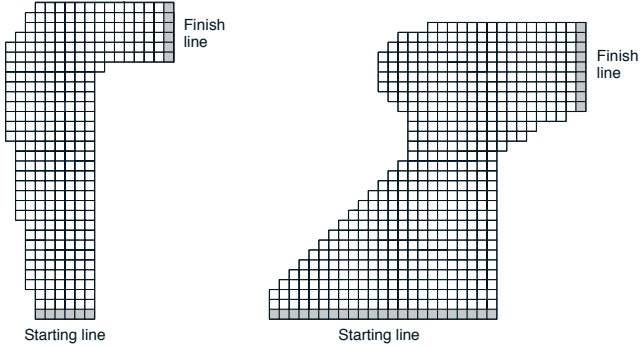

Figure 5.11: A couple of right turns for the racetrack task.

values, given returns generated using  $\mu$?

Exercise 5.4 What is the equation analogous to (5.5) for action values  $Q(s, a)$ instead of state values  $V(s)$?

Exercise 5.5 In learning curves such as those shown in Figure 5.7 error generally decreases with training, as indeed happened for the ordinary importance-sampling method. But for the weighted importance-sampling method error first increased and then decreased. Why do you think this happened?

Exercise 5.6 The results with Example 5.5 and shown in Figure 5.8 used a first-visit MC method. Suppose that instead an every-visit MC method was used on the same problem. Would the variance of the estimator still be infinite? Why or why not?

Exercise 5.7 Modify the algorithm for first-visit MC policy evaluation (Figure 5.1) to use the incremental implementation for sample averages described in Section 2.4.

Exercise 5.8 Derive the weighted-average update rule (5.7) from (5.6). Follow the pattern of the derivation of the unweighted rule (2.3).

Exercise 5.9: Racetrack (programming) Consider driving a race car around a turn like those shown in Figure 5.11. You want to go as fast as possible, but not so fast as to run off the track. In our simplified racetrack, the car is at one of a discrete set of grid positions, the cells in the diagram. The velocity is also discrete, a number of grid cells moved horizontally and vertically per time step. The actions are increments to the velocity components. Each may be changed by +1, -1, or 0 in one step, for a total of nine actions.

---

Both velocity components are restricted to be nonnegative and less than 5, and they cannot both be zero. Each episode begins in one of the randomly selected start states and ends when the car crosses the finish line. The rewards are -1 for each step that stays on the track, and -5 if the agent tries to drive off the track. Actually leaving the track is not allowed, but the position is always advanced by at least one cell along either the horizontal or vertical axes. With these restrictions and considering only right turns, such as shown in the figure, all episodes are guaranteed to terminate, yet the optimal policy is unlikely to be excluded. To make the task more challenging, we assume that on half of the time steps the position is displaced forward or to the right by one additional cell beyond that specified by the velocity. Apply a Monte Carlo control method to this task to compute the optimal policy from each starting state. Exhibit several trajectories following the optimal policy.

*Exercise 5.10 Modify the algorithm for off-policy Monte Carlo control (Figure 5.10) to use the idea of the truncated weighted-average estimator (5.9). Note that you will first need to convert this equation to action values.

---

### Chapter 6

### Temporal-Difference Learning

If one had to identify one idea as central and novel to reinforcement learning, it would undoubtedly be temporal-difference (TD) learning. TD learning is a combination of Monte Carlo ideas and dynamic programming (DP) ideas. Like Monte Carlo methods, TD methods can learn directly from raw experience without a model of the environment's dynamics. Like DP, TD methods update estimates based in part on other learned estimates, without waiting for a final outcome (they bootstrap). The relationship between TD, DP, and Monte Carlo methods is a recurring theme in the theory of reinforcement learning. This chapter is the beginning of our exploration of it. Before we are done, we will see that these ideas and methods blend into each other and can be combined in many ways. In particular, in Chapter 7 we introduce the TD( $\lambda$) algorithm, which seamlessly integrates TD and Monte Carlo methods.

As usual, we start by focusing on the policy evaluation or prediction problem, that of estimating the value function  $v_{\pi}$ for a given policy  $\pi$. For the control problem (finding an optimal policy), DP, TD, and Monte Carlo methods all use some variation of generalized policy iteration (GPI). The differences in the methods are primarily differences in their approaches to the prediction problem.

## 6.1 TD Prediction

Both TD and Monte Carlo methods use experience to solve the prediction problem. Given some experience following a policy  $\pi$, both methods update their estimate  $v$ of  $v_{\pi}$ for the nonterminal states  $S_t$ occurring in that experience. Roughly speaking, Monte Carlo methods wait until the return following the visit is known, then use that return as a target for  $V(S_t)$. A simple every-visit

---

Monte Carlo method suitable for nonstationary environments is

$$
V(S_{t})\leftarrow V(S_{t})+\alpha\Big[G_{t}-V(S_{t})\Big],   \tag*{(6.1)}
$$

where  $G_t$ is the actual return following time  $t$, and  $\alpha$ is a constant step-size parameter (c.f., Equation 2.4). Let us call this method constant- $\alpha$ MC. Whereas Monte Carlo methods must wait until the end of the episode to determine the increment to  $V(S_t)$ (only then is  $G_t$ known), TD methods need wait only until the next time step. At time  $t+1$ they immediately form a target and make a useful update using the observed reward  $R_{t+1}$ and the estimate  $V(S_{t+1})$. The simplest TD method, known as  $TD(\theta)$, is

$$
V(S_{t})\leftarrow V(S_{t})+\alpha\Big[R_{t+1}+\gamma V(S_{t+1})-V(S_{t})\Big].   \tag*{(6.2)}
$$

In effect, the target for the Monte Carlo update is  $G_t$, whereas the target for the TD update is  $R_{t+1} + \gamma V(S_{t+1})$.

Because the TD method bases its update in part on an existing estimate, we say that it is a bootstrapping method, like DP. We know from Chapter 3 that

$$
\begin{array}{r c l}{v_{\pi}(s)}&{=}&{\mathbb{E}_{\pi}[G_{t}\mid S_{t}=s]}\\ {}&{=}&{\mathbb{E}_{\pi}\bigg[\displaystyle\sum_{k=0}^{\infty}\gamma^{k}R_{t+k+1}\bigg\vert S_{t}=s\bigg]}\\ {}&{=}&{\mathbb{E}_{\pi}\bigg[R_{t+1}+\gamma\displaystyle\sum_{k=0}^{\infty}\gamma^{k}R_{t+k+2}\bigg\vert S_{t}=s\bigg]}\\ {}&{=}&{\mathbb{E}_{\pi}[R_{t+1}+\gamma v_{\pi}(S_{t+1})\mid S_{t}=s].}\\ \end{array}   \tag*{(6.3)}
$$

Roughly speaking, Monte Carlo methods use an estimate of (6.3) as a target, whereas DP methods use an estimate of (6.4) as a target. The Monte Carlo target is an estimate because the expected value in (6.3) is not known; a sample return is used in place of the real expected return. The DP target is an estimate not because of the expected values, which are assumed to be completely provided by a model of the environment, but because  $v_{\pi}(S_{t+1})$ is not known and the current estimate,  $V(S_{t+1})$, is used instead. The TD target is an estimate for both reasons: it samples the expected values in (6.4) and it uses the current estimate V instead of the true  $v_{\pi}$. Thus, TD methods combine the sampling of Monte Carlo with the bootstrapping of DP. As we shall see, with care and imagination this can take us a long way toward obtaining the advantages of both Monte Carlo and DP methods.

Figure 6.1 specifies TD(0) completely in procedural form, and Figure 6.2 shows its backup diagram. The value estimate for the state node at the top of

---

Input: the policy  $\pi$ to be evaluated
Initialize  $V(s)$ arbitrarily (e.g.,  $V(s) = 0, \forall s \in S^{+}$)
Repeat (for each episode):
Initialize S
Repeat (for each step of episode):
    A ← action given by  $\pi$ for S
    Take action A; observe reward, R, and next state,  $S'$
     $V(S) \leftarrow V(S) + \alpha [R + \gamma V(S') - V(S)]$
     $S \leftarrow S'$
until S is terminal

Figure 6.1: Tabular TD(0) for estimating  $v_{\pi}$.

Figure 6.2: The backup diagram for TD(0).

the backup diagram is updated on the basis of the one sample transition from it to the immediately following state. We refer to TD and Monte Carlo updates as sample backups because they involve looking ahead to a sample successor state (or state-action pair), using the value of the successor and the reward along the way to compute a backed-up value, and then changing the value of the original state (or state-action pair) accordingly. Sample backups differ from the full backups of DP methods in that they are based on a single sample successor rather than on a complete distribution of all possible successors.

Example 6.1: Driving Home Each day as you drive home from work, you try to predict how long it will take to get home. When you leave your office, you note the time, the day of week, and anything else that might be relevant. Say on this Friday you are leaving at exactly 6 o'clock, and you estimate that it will take 30 minutes to get home. As you reach your car it is 6:05, and you notice it is starting to rain. Traffic is often slower in the rain, so you reestimate that it will take 35 minutes from then, or a total of 40 minutes. Fifteen minutes later you have completed the highway portion of your journey in good time. As you exit onto a secondary road you cut your estimate of total travel time to 35 minutes. Unfortunately, at this point you get stuck behind a slow truck, and the road is too narrow to pass. You end up having to follow the truck until you turn onto the side street where you live at 6:40. Three minutes later you are home. The sequence of states, times, and predictions is

---

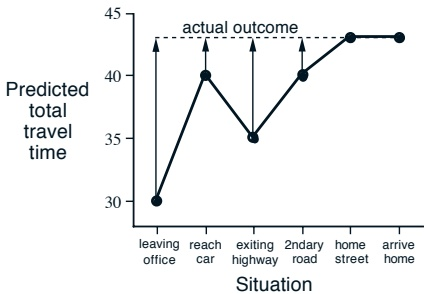

Figure 6.3: Changes recommended by Monte Carlo methods in the driving home example.

thus as follows:

<table border=1 style='margin: auto; word-wrap: break-word;'><tr><td style='text-align: center; word-wrap: break-word;'>State</td><td style='text-align: center; word-wrap: break-word;'>Elapsed Time (minutes)</td><td style='text-align: center; word-wrap: break-word;'>Predicted Time to Go</td><td style='text-align: center; word-wrap: break-word;'>Predicted Total Time</td></tr><tr><td style='text-align: center; word-wrap: break-word;'>leaving office, Friday at 6</td><td style='text-align: center; word-wrap: break-word;'>0</td><td style='text-align: center; word-wrap: break-word;'>30</td><td style='text-align: center; word-wrap: break-word;'>30</td></tr><tr><td style='text-align: center; word-wrap: break-word;'>reach car, raining</td><td style='text-align: center; word-wrap: break-word;'>5</td><td style='text-align: center; word-wrap: break-word;'>35</td><td style='text-align: center; word-wrap: break-word;'>40</td></tr><tr><td style='text-align: center; word-wrap: break-word;'>exiting highway</td><td style='text-align: center; word-wrap: break-word;'>20</td><td style='text-align: center; word-wrap: break-word;'>15</td><td style='text-align: center; word-wrap: break-word;'>35</td></tr><tr><td style='text-align: center; word-wrap: break-word;'>2ndary road, behind truck</td><td style='text-align: center; word-wrap: break-word;'>30</td><td style='text-align: center; word-wrap: break-word;'>10</td><td style='text-align: center; word-wrap: break-word;'>40</td></tr><tr><td style='text-align: center; word-wrap: break-word;'>entering home street</td><td style='text-align: center; word-wrap: break-word;'>40</td><td style='text-align: center; word-wrap: break-word;'>3</td><td style='text-align: center; word-wrap: break-word;'>43</td></tr><tr><td style='text-align: center; word-wrap: break-word;'>arrive home</td><td style='text-align: center; word-wrap: break-word;'>43</td><td style='text-align: center; word-wrap: break-word;'>0</td><td style='text-align: center; word-wrap: break-word;'>43</td></tr></table>

The rewards in this example are the elapsed times on each leg of the journey. $^{1}$ We are not discounting ( $\gamma = 1$), and thus the return for each state is the actual time to go from that state. The value of each state is the expected time to go. The second column of numbers gives the current estimated value for each state encountered.

A simple way to view the operation of Monte Carlo methods is to plot the predicted total time (the last column) over the sequence, as in Figure 6.3. The arrows show the changes in predictions recommended by the constant- $\alpha$ MC method (6.1), for  $\alpha = 1$. These are exactly the errors between the estimated value (predicted time to go) in each state and the actual return (actual time to go). For example, when you exited the highway you thought it would take only 15 minutes more to get home, but in fact it took 23 minutes. Equation 6.1 applies at this point and determines an increment in the estimate of time to go after exiting the highway. The error,  $G_t - V(S_t)$, at this time is eight

---

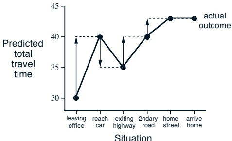

Figure 6.4: Changes recommended by TD methods in the driving home example.

minutes. Suppose the step-size parameter,  $\alpha$, is 1/2. Then the predicted time to go after exiting the highway would be revised upward by four minutes as a result of this experience. This is probably too large a change in this case; the truck was probably just an unlucky break. In any event, the change can only be made off-line, that is, after you have reached home. Only at this point do you know any of the actual returns.

Is it necessary to wait until the final outcome is known before learning can begin? Suppose on another day you again estimate when leaving your office that it will take 30 minutes to drive home, but then you become stuck in a massive traffic jam. Twenty-five minutes after leaving the office you are still bumper-to-bumper on the highway. You now estimate that it will take another 25 minutes to get home, for a total of 50 minutes. As you wait in traffic, you already know that your initial estimate of 30 minutes was too optimistic. Must you wait until you get home before increasing your estimate for the initial state? According to the Monte Carlo approach you must, because you don't yet know the true return.

According to a TD approach, on the other hand, you would learn immediately, shifting your initial estimate from 30 minutes toward 50. In fact, each estimate would be shifted toward the estimate that immediately follows it. Returning to our first day of driving, Figure 6.4 shows the same predictions as Figure 6.3, except with the changes recommended by the TD rule (6.2) (these are the changes made by the rule if  $\alpha = 1$). Each error is proportional to the change over time of the prediction, that is, to the temporal differences in predictions.

Besides giving you something to do while waiting in traffic, there are several computational reasons why it is advantageous to learn based on your current predictions rather than waiting until termination when you know the actual

---

return. We briefly discuss some of these next.

## 6.2 Advantages of TD Prediction Methods

TD methods learn their estimates in part on the basis of other estimates. They learn a guess from a guess—they bootstrap. Is this a good thing to do? What advantages do TD methods have over Monte Carlo and DP methods? Developing and answering such questions will take the rest of this book and more. In this section we briefly anticipate some of the answers.

Obviously, TD methods have an advantage over DP methods in that they do not require a model of the environment, of its reward and next-state probability distributions.

The next most obvious advantage of TD methods over Monte Carlo methods is that they are naturally implemented in an on-line, fully incremental fashion. With Monte Carlo methods one must wait until the end of an episode, because only then is the return known, whereas with TD methods one need wait only one time step. Surprisingly often this turns out to be a critical consideration. Some applications have very long episodes, so that delaying all learning until an episode's end is too slow. Other applications are continuing tasks and have no episodes at all. Finally, as we noted in the previous chapter, some Monte Carlo methods must ignore or discount episodes on which experimental actions are taken, which can greatly slow learning. TD methods are much less susceptible to these problems because they learn from each transition regardless of what subsequent actions are taken.

But are TD methods sound? Certainly it is convenient to learn one guess from the next, without waiting for an actual outcome, but can we still guarantee convergence to the correct answer? Happily, the answer is yes. For any fixed policy  $\pi$, the TD algorithm described above has been proved to converge to  $v_{\pi}$, in the mean for a constant step-size parameter if it is sufficiently small, and with probability 1 if the step-size parameter decreases according to the usual stochastic approximation conditions (2.7). Most convergence proofs apply only to the table-based case of the algorithm presented above (6.2), but some also apply to the case of general linear function approximation. These results are discussed in a more general setting in the next two chapters.

If both TD and Monte Carlo methods converge asymptotically to the correct predictions, then a natural next question is “Which gets there first?” In other words, which method learns faster? Which makes the more efficient use of limited data? At the current time this is an open question in the sense that no one has been able to prove mathematically that one method converges

---

## 6.2. ADVANTAGES OF TD PREDICTION METHODS

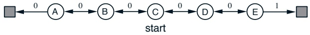

Figure 6.5: A small Markov process for generating random walks.

faster than the other. In fact, it is not even clear what is the most appropriate formal way to phrase this question! In practice, however, TD methods have usually been found to converge faster than constant- $\alpha$ MC methods on stochastic tasks, as illustrated in the following example.

Example 6.2: Random Walk In this example we empirically compare the prediction abilities of TD(0) and constant- $\alpha$ MC applied to the small Markov process shown in Figure 6.5. All episodes start in the center state, C, and proceed either left or right by one state on each step, with equal probability. This behavior is presumably due to the combined effect of a fixed policy and an environment's state-transition probabilities, but we do not care which; we are concerned only with predicting returns however they are generated. Episodes terminate either on the extreme left or the extreme right. When an episode terminates on the right a reward of +1 occurs; all other rewards are zero. For example, a typical walk might consist of the following state-and-reward sequence: C, 0, B, 0, C, 0, D, 0, E, 1. Because this task is undiscounted and episodic, the true value of each state is the probability of terminating on the right if starting from that state. Thus, the true value of the center state is  $v_{\pi}(\mathsf{C}) = 0.5$. The true values of all the states, A through E, are  $\frac{1}{6}, \frac{2}{6}, \frac{3}{6}, \frac{4}{6}$, and  $\frac{5}{6}$. Figure 6.6 shows the values learned by TD(0) approaching the true values as more episodes are experienced. Averaging over many episode sequences, Figure 6.7 shows the average error in the predictions found by TD(0) and constant- $\alpha$ MC, for a variety of values of  $\alpha$, as a function of number of episodes. In all cases the approximate value function was initialized to the intermediate value  $V(s) = 0.5$, for all s. The TD method is consistently better than the MC method on this task over this number of episodes.

---

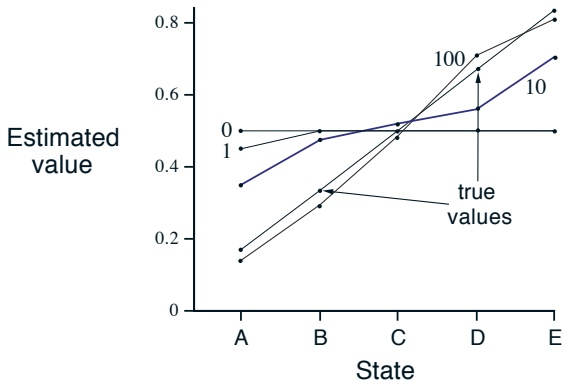

Figure 6.6: Values learned by TD(0) after various numbers of episodes. The final estimate is about as close as the estimates ever get to the true values. With a constant step-size parameter ( $\alpha = 0.1$ in this example), the values fluctuate indefinitely in response to the outcomes of the most recent episodes.

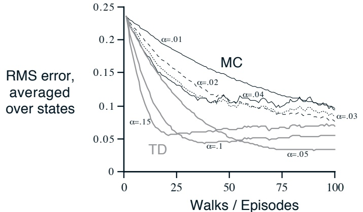

Figure 6.7: Learning curves for TD(0) and constant- $\alpha$ MC methods, for various values of  $\alpha$, on the prediction problem for the random walk. The performance measure shown is the root mean-squared (RMS) error between the value function learned and the true value function, averaged over the five states. These data are averages over 100 different sequences of episodes.

---

## 6.3 Optimality of TD(0)

Suppose there is available only a finite amount of experience, say 10 episodes or 100 time steps. In this case, a common approach with incremental learning methods is to present the experience repeatedly until the method converges upon an answer. Given an approximate value function, V, the increments specified by (6.1) or (6.2) are computed for every time step t at which a nonterminal state is visited, but the value function is changed only once, by the sum of all the increments. Then all the available experience is processed again with the new value function to produce a new overall increment, and so on, until the value function converges. We call this batch updating because updates are made only after processing each complete batch of training data.

Under batch updating, TD(0) converges deterministically to a single answer independent of the step-size parameter,  $\alpha$, as long as  $\alpha$ is chosen to be sufficiently small. The constant- $\alpha$ MC method also converges deterministically under the same conditions, but to a different answer. Understanding these two answers will help us understand the difference between the two methods. Under normal updating the methods do not move all the way to their respective batch answers, but in some sense they take steps in these directions. Before trying to understand the two answers in general, for all possible tasks, we first look at a few examples.

Example 6.3 Random walk under batch updating. Batch-updating versions of TD(0) and constant- $\alpha$ MC were applied as follows to the random walk prediction example (Example 6.2). After each new episode, all episodes seen so far were treated as a batch. They were repeatedly presented to the algorithm, either TD(0) or constant- $\alpha$ MC, with  $\alpha$ sufficiently small that the value function converged. The resulting value function was then compared with  $v_{\pi}$, and the average root mean-squared error across the five states (and across 100 independent repetitions of the whole experiment) was plotted to obtain the learning curves shown in Figure 6.8. Note that the batch TD method was consistently better than the batch Monte Carlo method.

Under batch training, constant- $\alpha$ MC converges to values,  $V(s)$, that are sample averages of the actual returns experienced after visiting each state s. These are optimal estimates in the sense that they minimize the mean-squared error from the actual returns in the training set. In this sense it is surprising that the batch TD method was able to perform better according to the root mean-squared error measure shown in Figure 6.8. How is it that batch TD was able to perform better than this optimal method? The answer is that the Monte Carlo method is optimal only in a limited way, and that TD is optimal in a way that is more relevant to predicting returns. But first let's develop our

---

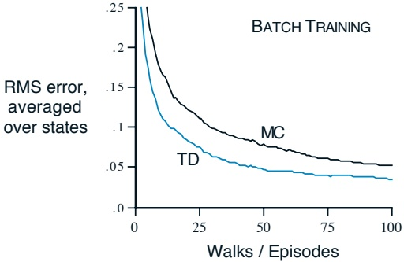

Figure 6.8: Performance of TD(0) and constant- $\alpha$ MC under batch training on the random walk task.

intuitions about different kinds of optimality through another example.

Example 6.4: You are the Predictor Place yourself now in the role of the predictor of returns for an unknown Markov reward process. Suppose you observe the following eight episodes:

A, 0, B, 0          B, 1

B,1 B,1

B,1 B,1

B, 1          B, 0

This means that the first episode started in state A, transitioned to B with a reward of 0, and then terminated from B with a reward of 0. The other seven episodes were even shorter, starting from B and terminating immediately. Given this batch of data, what would you say are the optimal predictions, the best values for the estimates  $V(A)$ and  $V(B)$? Everyone would probably agree that the optimal value for  $V(B)$ is  $\frac{3}{4}$, because six out of the eight times in state B the process terminated immediately with a return of 1, and the other two times in B the process terminated immediately with a return of 0.

But what is the optimal value for the estimate  $V(\mathbf{A})$ given this data? Here there are two reasonable answers. One is to observe that 100% of the times the process was in state A it traversed immediately to B (with a reward of 0); and since we have already decided that B has value  $\frac{3}{4}$, therefore A must have value  $\frac{3}{4}$ as well. One way of viewing this answer is that it is based on first modeling the Markov process, in this case as

---

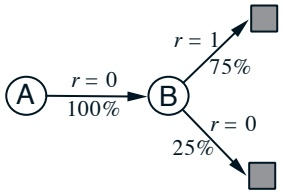

and then computing the correct estimates given the model, which indeed in this case gives  $V(A) = \frac{3}{4}$. This is also the answer that batch TD(0) gives.

The other reasonable answer is simply to observe that we have seen A once and the return that followed it was 0; we therefore estimate  $V(A)$ as 0. This is the answer that batch Monte Carlo methods give. Notice that it is also the answer that gives minimum squared error on the training data. In fact, it gives zero error on the data. But still we expect the first answer to be better. If the process is Markov, we expect that the first answer will produce lower error on future data, even though the Monte Carlo answer is better on the existing data.

The above example illustrates a general difference between the estimates found by batch TD(0) and batch Monte Carlo methods. Batch Monte Carlo methods always find the estimates that minimize mean-squared error on the training set, whereas batch TD(0) always finds the estimates that would be exactly correct for the maximum-likelihood model of the Markov process. In general, the maximum-likelihood estimate of a parameter is the parameter value whose probability of generating the data is greatest. In this case, the maximum-likelihood estimate is the model of the Markov process formed in the obvious way from the observed episodes: the estimated transition probability from i to j is the fraction of observed transitions from i that went to j, and the associated expected reward is the average of the rewards observed on those transitions. Given this model, we can compute the estimate of the value function that would be exactly correct if the model were exactly correct. This is called the certainty-equivalence estimate because it is equivalent to assuming that the estimate of the underlying process was known with certainty rather than being approximated. In general, batch TD(0) converges to the certainty-equivalence estimate.

This helps explain why TD methods converge more quickly than Monte Carlo methods. In batch form, TD(0) is faster than Monte Carlo methods because it computes the true certainty-equivalence estimate. This explains the advantage of TD(0) shown in the batch results on the random walk task (Figure 6.8). The relationship to the certainty-equivalence estimate may also explain in part the speed advantage of nonbatch TD(0) (e.g., Figure 6.7). Although the nonbatch methods do not achieve either the certainty-equivalence

---

or the minimum squared-error estimates, they can be understood as moving roughly in these directions. Nonbatch TD(0) may be faster than constant- $\alpha$ MC because it is moving toward a better estimate, even though it is not getting all the way there. At the current time nothing more definite can be said about the relative efficiency of on-line TD and Monte Carlo methods.

Finally, it is worth noting that although the certainty-equivalence estimate is in some sense an optimal solution, it is almost never feasible to compute it directly. If N is the number of states, then just forming the maximum-likelihood estimate of the process may require  $N^2$ memory, and computing the corresponding value function requires on the order of  $N^3$ computational steps if done conventionally. In these terms it is indeed striking that TD methods can approximate the same solution using memory no more than N and repeated computations over the training set. On tasks with large state spaces, TD methods may be the only feasible way of approximating the certainty-equivalence solution.

## 6.4 Sarsa: On-Policy TD Control

We turn now to the use of TD prediction methods for the control problem. As usual, we follow the pattern of generalized policy iteration (GPI), only this time using TD methods for the evaluation or prediction part. As with Monte Carlo methods, we face the need to trade off exploration and exploitation, and again approaches fall into two main classes: on-policy and off-policy. In this section we present an on-policy TD control method.

The first step is to learn an action-value function rather than a state-value function. In particular, for an on-policy method we must estimate  $q_{\pi}(s,a)$ for the current behavior policy  $\pi$ and for all states s and actions a. This can be done using essentially the same TD method described above for learning  $v_{\pi}$. Recall that an episode consists of an alternating sequence of states and state-action pairs:

 
$$
\cdots\xrightarrow{S_{t}}\underbrace{A_{t}}_{} \quad \bullet \quad \underbrace{R_{t+1}}_{} \quad \underbrace{S_{t+1}}_{} \quad \underbrace{\bullet}_{} \quad \underbrace{R_{t+2}}_{} \quad \underbrace{S_{t+2}}_{} \quad \underbrace{\bullet}_{} \quad \underbrace{R_{t+3}}_{} \quad \underbrace{S_{t+3}}_{} \quad \underbrace{\bullet}_{} \quad \cdots
$$
 

In the previous section we considered transitions from state to state and learned the values of states. Now we consider transitions from state–action pair to state–action pair, and learn the value of state–action pairs. Formally these cases are identical: they are both Markov chains with a reward process. The theorems assuring the convergence of state values under TD(0) also apply.

---

## 6.4. SARSA: ON-POLICY TD CONTROL

Initialize  $Q(s, a), \forall s \in S, a \in A(s)$, arbitrarily, and  $Q(\text{terminal-state}, \cdot) = 0$

Repeat (for each episode):

Initialize S

Choose A from S using policy derived from Q (e.g.,  $\epsilon$-greedy)

Repeat (for each step of episode):

Take action A, observe R,  $S'$

Choose  $A'$ from  $S'$ using policy derived from Q (e.g.,  $\epsilon$-greedy)

 $Q(S, A) \leftarrow Q(S, A) + \alpha [R + \gamma Q(S', A') - Q(S, A)]$

 $S \leftarrow S', A \leftarrow A'$;

until S is terminal

Figure 6.9: Sarsa: An on-policy TD control algorithm.

to the corresponding algorithm for action values:

$$
Q(S_{t},A_{t})\leftarrow Q(S_{t},A_{t})+\alpha\Big[R_{t+1}+\gamma Q(S_{t+1},A_{t+1})-Q(S_{t},A_{t})\Big].   \tag*{(6.5)}
$$

This update is done after every transition from a nonterminal state  $S_t$. If  $S_{t+1}$ is terminal, then  $Q(S_{t+1}, A_{t+1})$ is defined as zero. This rule uses every element of the quintuple of events,  $(S_t, A_t, R_{t+1}, S_{t+1}, A_{t+1})$, that make up a transition from one state–action pair to the next. This quintuple gives rise to the name Sarsa for the algorithm.

It is straightforward to design an on-policy control algorithm based on the Sarsa prediction method. As in all on-policy methods, we continually estimate  $q_{\pi}$ for the behavior policy  $\pi$, and at the same time change  $\pi$ toward greediness with respect to  $q_{\pi}$. The general form of the Sarsa control algorithm is given in Figure 6.9.

The convergence properties of the Sarsa algorithm depend on the nature of the policy's dependence on q. For example, one could use  $\varepsilon$-greedy or  $\varepsilon$-soft policies. According to Satinder Singh (personal communication), Sarsa converges with probability 1 to an optimal policy and action-value function as long as all state-action pairs are visited an infinite number of times and the policy converges in the limit to the greedy policy (which can be arranged, for example, with  $\varepsilon$-greedy policies by setting  $\varepsilon = 1/t$), but this result has not yet been published in the literature.

Example 6.5: Windy Gridworld Figure 6.10 shows a standard gridworld, with start and goal states, but with one difference: there is a crosswind upward through the middle of the grid. The actions are the standard four—up, down, right, and left—but in the middle region the resultant next states are shifted upward by a “wind,” the strength of which varies from column to column. The strength of the wind is given below each column, in number of cells shifted

---

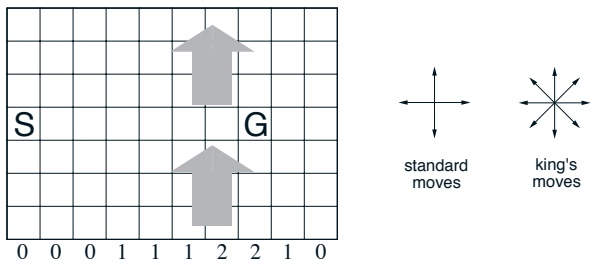

Figure 6.10: Gridworld in which movement is altered by a location-dependent, upward “wind.”

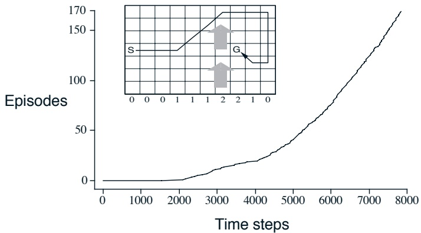

Figure 6.11: Results of Sarsa applied to the windy gridworld.

---

upward. For example, if you are one cell to the right of the goal, then the action left takes you to the cell just above the goal. Let us treat this as an undiscounted episodic task, with constant rewards of -1 until the goal state is reached. Figure 6.11 shows the result of applying  $\varepsilon$-greedy Sarsa to this task, with  $\varepsilon = 0.1$,  $\alpha = 0.5$, and the initial values  $Q(s, a) = 0$ for all  $s, a$. The increasing slope of the graph shows that the goal is reached more and more quickly over time. By 8000 time steps, the greedy policy (shown inset) was long since optimal; continued  $\varepsilon$-greedy exploration kept the average episode length at about 17 steps, two more than the minimum of 15. Note that Monte Carlo methods cannot easily be used on this task because termination is not guaranteed for all policies. If a policy was ever found that caused the agent to stay in the same state, then the next episode would never end. Step-by-step learning methods such as Sarsa do not have this problem because they quickly learn during the episode that such policies are poor, and switch to something else.

## 6.5 Q-Learning: Off-Policy TD Control

One of the most important breakthroughs in reinforcement learning was the development of an off-policy TD control algorithm known as Q-learning (Watkins, 1989). Its simplest form, one-step Q-learning, is defined by

$$
Q(S_{t},A_{t})\leftarrow Q(S_{t},A_{t})+\alpha\Big[R_{t+1}+\gamma\max_{a}Q(S_{t+1},a)-Q(S_{t},A_{t})\Big].   \tag*{(6.6)}
$$

In this case, the learned action-value function, Q, directly approximates  $q_{*}$, the optimal action-value function, independent of the policy being followed. This dramatically simplifies the analysis of the algorithm and enabled early convergence proofs. The policy still has an effect in that it determines which state-action pairs are visited and updated. However, all that is required for correct convergence is that all pairs continue to be updated. As we observed in Chapter 5, this is a minimal requirement in the sense that any method guaranteed to find optimal behavior in the general case must require it. Under this assumption and a variant of the usual stochastic approximation conditions on the sequence of step-size parameters, Q has been shown to converge with probability 1 to  $q_{*}$. The Q-learning algorithm is shown in procedural form in Figure 6.12.

What is the backup diagram for Q-learning? The rule (6.6) updates a state-action pair, so the top node, the root of the backup, must be a small, filled action node. The backup is also from action nodes, maximizing over all those actions possible in the next state. Thus the bottom nodes of the backup diagram should be all these action nodes. Finally, remember that we indicate

---

Initialize  $Q(s, a), \forall s \in \mathcal{S}, a \in \mathcal{A}(s)$, arbitrarily, and  $Q(\text{terminal-state}, \cdot) = 0$

Repeat (for each episode):

Initialize S

Repeat (for each step of episode):

Choose A from S using policy derived from Q (e.g.,  $\epsilon$-greedy)

Take action A, observe R,  $S'$

 $Q(S, A) \leftarrow Q(S, A) + \alpha [R + \gamma \max_a Q(S', a) - Q(S, A)]$

 $S \leftarrow S'$;

until S is terminal

Figure 6.12: Q-learning: An off-policy TD control algorithm.

taking the maximum of these “next action” nodes with an arc across them (Figure 3.7). Can you guess now what the diagram is? If so, please do make a guess before turning to the answer in Figure 6.14.

Example 6.6: Cliff Walking This gridworld example compares Sarsa and Q-learning, highlighting the difference between on-policy (Sarsa) and off-policy (Q-learning) methods. Consider the gridworld shown in the upper part of Figure 6.13. This is a standard undiscounted, episodic task, with start and goal states, and the usual actions causing movement up, down, right, and left. Reward is -1 on all transitions except those into the region marked “The Cliff.” Stepping into this region incurs a reward of -100 and sends the agent instantly back to the start. The lower part of the figure shows the performance of the Sarsa and Q-learning methods with ε-greedy action selection, ε = 0.1. After an initial transient, Q-learning learns values for the optimal policy, that which travels right along the edge of the cliff. Unfortunately, this results in its occasionally falling off the cliff because of the ε-greedy action selection. Sarsa, on the other hand, takes the action selection into account and learns the longer but safer path through the upper part of the grid. Although Q-learning actually learns the values of the optimal policy, its on-line performance is worse than that of Sarsa, which learns the roundabout policy. Of course, if ε were gradually reduced, then both methods would asymptotically converge to the optimal policy.

---

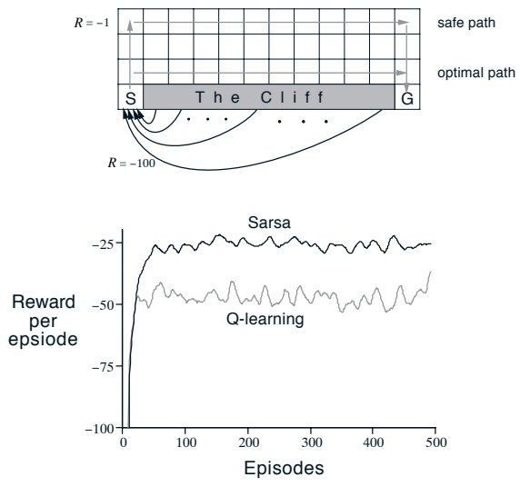

Figure 6.13: The cliff-walking task. The results are from a single run, but smoothed.

Figure 6.14: The backup diagram for Q-learning.

---

## 6.6 Games, Afterstates, and Other Special Cases

In this book we try to present a uniform approach to a wide class of tasks, but of course there are always exceptional tasks that are better treated in a specialized way. For example, our general approach involves learning an action-value function, but in Chapter 1 we presented a TD method for learning to play tic-tac-toe that learned something much more like a state-value function. If we look closely at that example, it becomes apparent that the function learned there is neither an action-value function nor a state-value function in the usual sense. A conventional state-value function evaluates states in which the agent has the option of selecting an action, but the state-value function used in tic-tac-toe evaluates board positions after the agent has made its move. Let us call these afterstates, and value functions over these, afterstate value functions. Afterstates are useful when we have knowledge of an initial part of the environment's dynamics but not necessarily of the full dynamics. For example, in games we typically know the immediate effects of our moves. We know for each possible chess move what the resulting position will be, but not how our opponent will reply. Afterstate value functions are a natural way to take advantage of this kind of knowledge and thereby produce a more efficient learning method.

The reason it is more efficient to design algorithms in terms of afterstates is apparent from the tic-tac-toe example. A conventional action-value function would map from positions and moves to an estimate of the value. But many position-move pairs produce the same resulting position, as in this example:

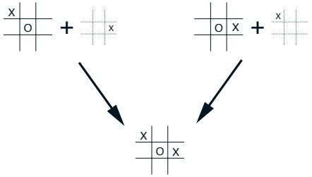

In such cases the position-move pairs are different but produce the same “afterposition,” and thus must have the same value. A conventional action-value function would have to separately assess both pairs, whereas an afterstate value function would immediately assess both equally. Any learning about the position-move pair on the left would immediately transfer to the pair on the right.

Afterstates arise in many tasks, not just games. For example, in queuing

---

tasks there are actions such as assigning customers to servers, rejecting customers, or discarding information. In such cases the actions are in fact defined in terms of their immediate effects, which are completely known. For example, in the access-control queuing example described in the previous section, a more efficient learning method could be obtained by breaking the environment's dynamics into the immediate effect of the action, which is deterministic and completely known, and the unknown random processes having to do with the arrival and departure of customers. The afterstates would be the number of free servers after the action but before the random processes had produced the next conventional state. Learning an afterstate value function over the afterstates would enable all actions that produced the same number of free servers to share experience. This should result in a significant reduction in learning time.

It is impossible to describe all the possible kinds of specialized problems and corresponding specialized learning algorithms. However, the principles developed in this book should apply widely. For example, afterstate methods are still aptly described in terms of generalized policy iteration, with a policy and (afterstate) value function interacting in essentially the same way. In many cases one will still face the choice between on-policy and off-policy methods for managing the need for persistent exploration.

## 6.7 Summary

In this chapter we introduced a new kind of learning method, temporal-difference (TD) learning, and showed how it can be applied to the reinforcement learning problem. As usual, we divided the overall problem into a prediction problem and a control problem. TD methods are alternatives to Monte Carlo methods for solving the prediction problem. In both cases, the extension to the control problem is via the idea of generalized policy iteration (GPI) that we abstracted from dynamic programming. This is the idea that approximate policy and value functions should interact in such a way that they both move toward their optimal values.

One of the two processes making up GPI drives the value function to accurately predict returns for the current policy; this is the prediction problem. The other process drives the policy to improve locally (e.g., to be  $\varepsilon$-greedy) with respect to the current value function. When the first process is based on experience, a complication arises concerning maintaining sufficient exploration. We have grouped the TD control methods according to whether they deal with this complication by using an on-policy or off-policy approach. Sarsa and actor-critic methods are on-policy methods, and Q-learning and R-learning

---

are off-policy methods.

The methods presented in this chapter are today the most widely used reinforcement learning methods. This is probably due to their great simplicity: they can be applied on-line, with a minimal amount of computation, to experience generated from interaction with an environment; they can be expressed nearly completely by single equations that can be implemented with small computer programs. In the next few chapters we extend these algorithms, making them slightly more complicated and significantly more powerful. All the new algorithms will retain the essence of those introduced here: they will be able to process experience on-line, with relatively little computation, and they will be driven by TD errors. The special cases of TD methods introduced in the present chapter should rightly be called one-step, tabular, modelfree TD methods. In the next three chapters we extend them to multistep forms (a link to Monte Carlo methods), forms using function approximation rather than tables (a link to artificial neural networks), and forms that include a model of the environment (a link to planning and dynamic programming).

Finally, in this chapter we have discussed TD methods entirely within the context of reinforcement learning problems, but TD methods are actually more general than this. They are general methods for learning to make long-term predictions about dynamical systems. For example, TD methods may be relevant to predicting financial data, life spans, election outcomes, weather patterns, animal behavior, demands on power stations, or customer purchases. It was only when TD methods were analyzed as pure prediction methods, independent of their use in reinforcement learning, that their theoretical properties first came to be well understood. Even so, these other potential applications of TD learning methods have not yet been extensively explored.

#### Bibliographical and Historical Remarks

As we outlined in Chapter 1, the idea of TD learning has its early roots in animal learning psychology and artificial intelligence, most notably the work of Samuel (1959) and Klopf (1972). Samuel's work is described as a case study in Section 15.2. Also related to TD learning are Holland's (1975, 1976) early ideas about consistency among value predictions. These influenced one of the authors (Barto), who was a graduate student from 1970 to 1975 at the University of Michigan, where Holland was teaching. Holland's ideas led to a number of TD-related systems, including the work of Booker (1982) and the bucket brigade of Holland (1986), which is related to Sarsa as discussed below.

6.1–2 Most of the specific material from these sections is from Sutton (1988),

---

including the TD(0) algorithm, the random walk example, and the term “temporal-difference learning.” The characterization of the relationship to dynamic programming and Monte Carlo methods was influenced by Watkins (1989), Werbos (1987), and others. The use of backup diagrams here and in other chapters is new to this book. Example 6.4 is due to Sutton, but has not been published before.

Tabular TD(0) was proved to converge in the mean by Sutton (1988) and with probability 1 by Dayan (1992), based on the work of Watkins and Dayan (1992). These results were extended and strengthened by Jaakkola, Jordan, and Singh (1994) and Tsitsiklis (1994) by using extensions of the powerful existing theory of stochastic approximation. Other extensions and generalizations are covered in the next two chapters.

6.3 The optimality of the TD algorithm under batch training was established by Sutton (1988). The term certainty equivalence is from the adaptive control literature (e.g., Goodwin and Sin, 1984). Illuminating this result is Barnard's (1993) derivation of the TD algorithm as a combination of one step of an incremental method for learning a model of the Markov chain and one step of a method for computing predictions from the model.

6.4 The Sarsa algorithm was first explored by Rummery and Niranjan (1994), who called it modified Q-learning. The name “Sarsa” was introduced by Sutton (1996). The convergence of one-step tabular Sarsa (the form treated in this chapter) has been proved by Satinder Singh (personal communication). The “windy gridworld” example was suggested by Tom Kalt.

Holland’s (1986) bucket brigade idea evolved into an algorithm closely related to Sarsa. The original idea of the bucket brigade involved chains of rules triggering each other; it focused on passing credit back from the current rule to the rules that triggered it. Over time, the bucket brigade came to be more like TD learning in passing credit back to any temporally preceding rule, not just to the ones that triggered the current rule. The modern form of the bucket brigade, when simplified in various natural ways, is nearly identical to one-step Sarsa, as detailed by Wilson (1994).

6.5 Q-learning was introduced by Watkins (1989), whose outline of a convergence proof was later made rigorous by Watkins and Dayan (1992). More general convergence results were proved by Jaakkola, Jordan, and Singh (1994) and Tsitsiklis (1994).

---

6.6 R-learning is due to Schwartz (1993). Mahadevan (1996), Tadepalli and Ok (1994), and Bertsekas and Tsitsiklis (1996) have studied reinforcement learning for undiscounted continuing tasks. In the literature, the undiscounted continuing case is often called the case of maximizing “average reward per time step” or the “average-reward case.” The name R-learning was probably meant to be the alphabetic successor to Q-learning, but we prefer to think of it as a reference to the learning of relative values. The access-control queuing example was suggested by the work of Carlström and Nordström (1997).

#### Exercises

Exercise 6.1 This is an exercise to help develop your intuition about why TD methods are often more efficient than Monte Carlo methods. Consider the driving home example and how it is addressed by TD and Monte Carlo methods. Can you imagine a scenario in which a TD update would be better on average than an Monte Carlo update? Give an example scenario—a description of past experience and a current state—in which you would expect the TD update to be better. Here's a hint: Suppose you have lots of experience driving home from work. Then you move to a new building and a new parking lot (but you still enter the highway at the same place). Now you are starting to learn predictions for the new building. Can you see why TD updates are likely to be much better, at least initially, in this case? Might the same sort of thing happen in the original task?

Exercise 6.2 From Figure 6.6, it appears that the first episode results in a change in only  $V(A)$. What does this tell you about what happened on the first episode? Why was only the estimate for this one state changed? By exactly how much was it changed?

Exercise 6.3 The specific results shown in Figure 6.7 are dependent on the value of the step-size parameter,  $\alpha$. Do you think the conclusions about which algorithm is better would be affected if a wider range of  $\alpha$ values were used? Is there a different, fixed value of  $\alpha$ at which either algorithm would have performed significantly better than shown? Why or why not?

Exercise 6.4 In Figure 6.7, the RMS error of the TD method seems to go down and then up again, particularly at high  $\alpha$'s. What could have caused this? Do you think this always occurs, or might it be a function of how the approximate value function was initialized?

Exercise 6.5 Above we stated that the true values for the random walk task

---

are  $\frac{1}{6}, \frac{2}{6}, \frac{3}{6}, \frac{4}{6}$, and  $\frac{5}{6}$, for states A through E. Describe at least two different ways that these could have been computed. Which would you guess we actually used? Why?

Exercise 6.6: Windy Gridworld with King’s Moves Re-solve the windy gridworld task assuming eight possible actions, including the diagonal moves, rather than the usual four. How much better can you do with the extra actions? Can you do even better by including a ninth action that causes no movement at all other than that caused by the wind?

Exercise 6.7: Stochastic Wind Resolve the windy gridworld task with King's moves, assuming that the effect of the wind, if there is any, is stochastic, sometimes varying by 1 from the mean values given for each column. That is, a third of the time you move exactly according to these values, as in the previous exercise, but also a third of the time you move one cell above that, and another third of the time you move one cell below that. For example, if you are one cell to the right of the goal and you move left, then one-third of the time you move one cell above the goal, one-third of the time you move two cells above the goal, and one-third of the time you move to the goal.

Exercise 6.8 What is the backup diagram for Sarsa?

Exercise 6.9 Why is Q-learning considered an off-policy control method?

Exercise 6.10 Consider the learning algorithm that is just like Q-learning except that instead of the maximum over next state-action pairs it uses the expected value, taking into account how likely each action is under the current policy. That is, consider the algorithm otherwise like Q-learning except with the update rule

 
$$
\begin{array}{r c l}{Q(S_{t},A_{t})}&{\leftarrow}&{Q(S_{t},A_{t})+\alpha\Big[R_{t+1}+\gamma\mathbb{E}[Q(S_{t+1},A_{t+1})\mid S_{t+1}]-Q(S_{t},A_{t})\Big]}\\ {}&{\leftarrow}&{Q(S_{t},A_{t})+\alpha\Big[R_{t+1}+\gamma\displaystyle\sum_{a}\pi(a|S_{t+1})Q(S_{t+1},a)-Q(S_{t},A_{t})\Big].}\\ \end{array}
$$
 

Is this new method an on-policy or off-policy method? What is the backup diagram for this algorithm? Given the same amount of experience, would you expect this method to work better or worse than Sarsa? What other considerations might impact the comparison of this method with Sarsa?

Exercise 6.11 Describe how the task of Jack's Car Rental (Example 4.2) could be reformulated in terms of afterstates. Why, in terms of this specific task, would such a reformulation be likely to speed convergence?

---

---

### Chapter 7

### Eligibility Traces

Eligibility traces are one of the basic mechanisms of reinforcement learning. For example, in the popular TD( $\lambda$) algorithm, the  $\lambda$ refers to the use of an eligibility trace. Almost any temporal-difference (TD) method, such as Q-learning or Sarsa, can be combined with eligibility traces to obtain a more general method that may learn more efficiently.

There are two ways to view eligibility traces. The more theoretical view, which we emphasize here, is that they are a bridge from TD to Monte Carlo methods. When TD methods are augmented with eligibility traces, they produce a family of methods spanning a spectrum that has Monte Carlo methods at one end and one-step TD methods at the other. In between are intermediate methods that are often better than either extreme method. In this sense eligibility traces unify TD and Monte Carlo methods in a valuable and revealing way.

The other way to view eligibility traces is more mechanistic. From this perspective, an eligibility trace is a temporary record of the occurrence of an event, such as the visiting of a state or the taking of an action. The trace marks the memory parameters associated with the event as eligible for undergoing learning changes. When a TD error occurs, only the eligible states or actions are assigned credit or blame for the error. Thus, eligibility traces help bridge the gap between events and training information. Like TD methods themselves, eligibility traces are a basic mechanism for temporal credit assignment.

For reasons that will become apparent shortly, the more theoretical view of eligibility traces is called the forward view, and the more mechanistic view is called the backward view. The forward view is most useful for understanding what is computed by methods using eligibility traces, whereas the backward view is more appropriate for developing intuition about the algorithms them-

---

selves. In this chapter we present both views and then establish senses in which they are equivalent, that is, in which they describe the same algorithms from two points of view. As usual, we first consider the prediction problem and then the control problem. That is, we first consider how eligibility traces are used to help in predicting returns as a function of state for a fixed policy (i.e., in estimating  $v_{\pi}$). Only after exploring the two views of eligibility traces within this prediction setting do we extend the ideas to action values and control methods.

## 7.1 n-Step TD Prediction

What is the space of methods lying between Monte Carlo and TD methods? Consider estimating  $v_{\pi}$ from sample episodes generated using  $\pi$. Monte Carlo methods perform a backup for each state based on the entire sequence of observed rewards from that state until the end of the episode. The backup of simple TD methods, on the other hand, is based on just the one next reward, using the value of the state one step later as a proxy for the remaining rewards. One kind of intermediate method, then, would perform a backup based on an intermediate number of rewards: more than one, but less than all of them until termination. For example, a two-step backup would be based on the first two rewards and the estimated value of the state two steps later. Similarly, we could have three-step backups, four-step backups, and so on. Figure 7.1 diagrams the spectrum of n-step backups for  $v_{\pi}$, with the one-step, simple TD backup on the left and the up-until-termination Monte Carlo backup on the right.

The methods that use n-step backups are still TD methods because they still change an earlier estimate based on how it differs from a later estimate. Now the later estimate is not one step later, but n steps later. Methods in which the temporal difference extends over n steps are called n-step TD methods. The TD methods introduced in the previous chapter all use one-step backups, and henceforth we call them one-step TD methods.

More formally, consider the backup applied to state  $S_t$ as a result of the state-reward sequence,  $S_t, R_{t+1}, S_{t+1}, R_{t+2}, \ldots, R_T, S_T$ (omitting the actions for simplicity). We know that in Monte Carlo backups the estimate of  $v_\pi(S_t)$ is updated in the direction of the complete return:

 
$$
G_{t}=R_{t+1}+\gamma R_{t+2}+\gamma^{2}R_{t+3}+\cdots+\gamma^{T-t-1}R_{T},
$$
 

where T is the last time step of the episode. Let us call this quantity the target of the backup. Whereas in Monte Carlo backups the target is the return, in

---

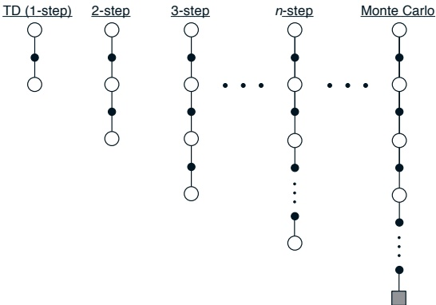

Figure 7.1: The spectrum ranging from the one-step backups of simple TD methods to the up-until-termination backups of Monte Carlo methods. In between are the n-step backups, based on n steps of real rewards and the estimated value of the nth next state, all appropriately discounted.

one-step backups the target is the first reward plus the discounted estimated value of the next state:

 
$$
R_{t+1}+\gamma V_{t}(S_{t+1}),
$$
 

where  $V_t : \mathcal{S} \to \mathbb{R}$ here is the estimate at time  $t$ of  $v_\pi$, in which case it makes sense that  $\gamma V_t(S_{t+1})$ should take the place of the remaining terms  $\gamma R_{t+2} + \gamma^2 R_{t+3} + \cdots + \gamma^{T-t-1} R_T$, as we discussed in the previous chapter. Our point now is that this idea makes just as much sense after two steps as it does after one. The target for a two-step backup might be

 
$$
R_{t+1}+\gamma R_{t+2}+\gamma^{2}V_{t}(S_{t+2}),
$$
 

where now  $\gamma^{2}V_{t}(S_{t+2})$ corrects for the absence of the terms  $\gamma^{2}R_{t+3}+\gamma^{3}R_{t+4}+\cdots+\gamma^{T-t-1}R_{T}$. Similarly, the target for an arbitrary n-step backup might be

$$
R_{t+1}+\gamma R_{t+2}+\gamma^{2}+\cdots+\gamma^{n-1}R_{t+n}+\gamma^{n}V_{t}(S_{t+n}),\quad\forall n\geq1.   \tag*{(7.1)}
$$

All of these can be considered approximate returns, truncated after n steps and then corrected for the remaining missing terms, in the above case by  $V_t(S_{t+n})$. Notationally, it is useful to retain full generality for the correction term. We define the general n-step return as

 
$$
G_{t}^{t+n}(c)=R_{t+1}+\gamma R_{t+2}+\cdots+\gamma^{n-1}R_{h}+\gamma^{n}c,
$$
 

---

for any  $n \geq 1$ and any scalar correction  $c \in \mathbb{R}$. The time  $h = t + n$ is called the horizon of the n-step return.

If the episode ends before the horizon is reached, then the truncation in an n-step return effectively occurs at the episode's end, resulting in the conventional complete return. In other words, if  $h \geq T$, then  $G_t^h(c) = G_t$. Thus, the last  $n$ n-step returns of an episode are always complete returns, and an infinite-step return is always a complete return. This definition enables us to treat Monte Carlo methods as the special case of infinite-step targets. All of this is consistent with the tricks for treating episodic and continuing tasks equivalently that we introduced in Section 3.4. There we chose to treat the terminal state as a state that always transitions to itself with zero reward. Under this trick, all n-step returns that last up to or past termination have the same value as the complete return.

An n-step backup is defined to be a backup toward the n-step return. In the tabular, state-value case, the n-step backup at time t produces the following increment  $\Delta_{t}(S_{t})$ in the estimated value  $V(S_{t})$:

 
$$
\Delta_{t}(S_{t})=\alpha\Big[G_{t}^{t+n}\big(V_{t}(S_{t+n})\big)-V_{t}(S_{t})\Big],
$$
 

where  $\alpha$ is a positive step-size parameter, as usual. The increments to the estimated values of the other states are defined to be zero  $(\Delta_t(s) = 0, \forall s \neq S_t)$.

We define the n-step backup in terms of an increment, rather than as a direct update rule as we did in the previous chapter, in order to allow different ways of making the updates. In on-line updating, the updates are made during the episode, as soon as the increment is computed. In this case we write

$$
V_{t+1}(s)=V_{t}(s)+\Delta_{t}(s),\qquad\forall s\in\mathcal{S}.   \tag*{(7.3)}
$$

On-line updating is what we have implicitly assumed in most of the previous two chapters. In off-line updating, on the other hand, the increments are accumulated “on the side” and are not used to change value estimates until the end of the episode. In this case, the approximate values  $V_t(s), \forall s \in \mathcal{S}$, do not change during an episode and can be denoted simply  $V(s)$. At the end of the episode, the new value (for the next episode) is obtained by summing all the increments during the episode. That is, for an episode starting at time step 0 and terminating at step T, for all  $s \in \mathcal{S}$:

$$
\begin{aligned}&V_{t+1}(s)=V_{t}(s),\qquad\forall t<T,\\&V_{T}(s)=V_{T-1}(s)+\sum_{t=0}^{T-1}\Delta_{t}(s),\\ \end{aligned}   \tag*{(7.4)}
$$

with of course  $V_{0}$ of the next episode being the  $V_{T}$ of this one. You may recall how in Section 6.3 we carried this idea one step further, deferring the

---

increments until they could be summed over a whole set of episodes, in batch updating.

For any value function  $v: \mathcal{S} \to \mathbb{R}$, the expected value of the  $n$-step return using  $v$ is guaranteed to be a better estimate of  $v_\pi$ than  $v$ is, in a worst-state sense. That is, the worst error under the new estimate is guaranteed to be less than or equal to  $\gamma^n$ times the worst error under  $v$:

$$
\begin{array}{r l}{\operatorname*{m a x}_{s}\big|\mathbb{E}_{\pi}\big[G_{t}^{t+n}(v(S_{t+n}))\big|S_{t}=s\big]-v_{\pi}(s)\big|}&{\leq\gamma^{n}\operatorname*{m a x}_{s}|v(s)-v_{\pi}(s)|,}\end{array}   \tag*{(7.5)}
$$

for all  $n \geq 1$. This is called the error reduction property of n-step returns. Because of the error reduction property, one can show formally that on-line and off-line TD prediction methods using n-step backups converge to the correct predictions under appropriate technical conditions. The n-step TD methods thus form a family of valid methods, with one-step TD methods and Monte Carlo methods as extreme members.

Nevertheless, n-step TD methods are rarely used because they are inconvenient to implement. Computing n-step returns requires waiting n steps to observe the resultant rewards and states. For large n, this can become problematic, particularly in control applications. The significance of n-step TD methods is primarily for theory and for understanding related methods that are more conveniently implemented. In the next few sections we use the idea of n-step TD methods to explain and justify eligibility trace methods.

Example 7.1: n-step TD Methods on the Random Walk Consider using n-step TD methods on the random walk task described in Example 6.2 and shown in Figure 6.5. Suppose the first episode progressed directly from the center state, C, to the right, through D and E, and then terminated on the right with a return of 1. Recall that the estimated values of all the states started at an intermediate value,  $V_0(s) = 0.5$. As a result of this experience, a one-step method would change only the estimate for the last state,  $V(\mathsf{E})$, which would be incremented toward 1, the observed return. A two-step method, on the other hand, would increment the values of the two states preceding termination:  $V(\mathsf{D})$ and  $V(\mathsf{E})$ both would be incremented toward 1. A three-step method, or any n-step method for n > 2, would increment the values of all three of the visited states toward 1, all by the same amount. Which n is better? Figure 7.2 shows the results of a simple empirical assessment for a larger random walk process, with 19 states (and with a -1 outcome on the left, all values initialized to 0). Results are shown for on-line and off-line n-step TD methods with a range of values for n and  $\alpha$. The performance measure for each algorithm and parameter setting, shown on the vertical axis, is the square-root of the average squared error between its predictions at the end of the episoden for the 19 states and their true values, then averaged over

---

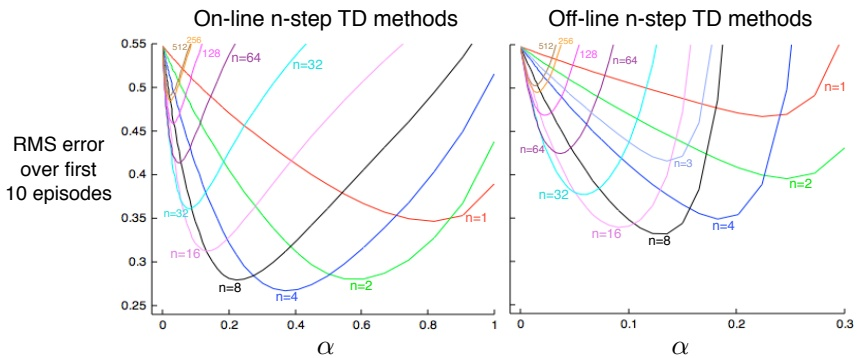

Figure 7.2: Performance of n-step TD methods as a function of  $\alpha$, for various values of n, on a 19-state random walk task (Example 7.1).

the first 10 episodes and 100 repetitions of the whole experiment (the same sets of walks were used for all methods). First note that the on-line methods generally worked best on this task, both reaching lower levels of absolute error and doing so over a larger range of the step-size parameter  $\alpha$ (in fact, all the off-line methods were unstable for  $\alpha$ much above 0.3). Second, note that methods with an intermediate value of n worked best. This illustrates how the generalization of TD and Monte Carlo methods to n-step methods can potentially perform better than either of the two extreme methods.

## 7.2 The Forward View of TD( $\lambda$)

Backups can be done not just toward any n-step return, but toward any average of n-step returns. For example, a backup can be done toward a target that is half of a two-step return and half of a four-step return:  $\frac{1}{2}G_{t}^{t+2}(V_{t}(S_{t+2})) + \frac{1}{2}G_{t}^{t+4}(V_{t}(S_{t+4}))$. Any set of returns can be averaged in this way, even an infinite set, as long as the weights on the component returns are positive and sum to 1. The composite return possesses an error reduction property similar to that of individual n-step returns (7.5) and thus can be used to construct backups with guaranteed convergence properties. Averaging produces a substantial new range of algorithms. For example, one could average one-step and infinite-step returns to obtain another way of interrelating TD and Monte Carlo methods. In principle, one could even average experience-based backups with DP backups to get a simple combination of experience-based and model-based methods (see Chapter 8).

---

A backup that averages simpler component backups is called a complex backup. The backup diagram for a complex backup consists of the backup diagrams for each of the component backups with a horizontal line above them and the weighting fractions below. For example, the complex backup for the case mentioned at the start of this section, mixing half of a two-step backup and half of a four-step backup, has the diagram:

The TD( $\lambda$) algorithm can be understood as one particular way of averaging n-step backups. This average contains all the n-step backups, each weighted proportional to  $\lambda^{n-1}$, where  $\lambda \in [0,1]$, and normalized by a factor of  $1 - \lambda$ to ensure that the weights sum to 1 (see Figure 7.3). The resulting backup is toward a return, called the  $\lambda$-return, defined by

 
$$
L_{t}=(1-\lambda)\sum_{n=1}^{\infty}\lambda^{n-1}G_{t}^{t+n}(V_{t}(S_{t+n})).
$$
 

Figure 7.4 further illustrates the weighting on the sequence of n-step returns in the  $\lambda$-return. The one-step return is given the largest weight,  $1 - \lambda$; the two-step return is given the next largest weight,  $(1 - \lambda)\lambda$; the three-step return is given the weight  $(1 - \lambda)\lambda^2$; and so on. The weight fades by  $\lambda$ with each additional step. After a terminal state has been reached, all subsequent n-step returns are equal to  $G_t$. If we want, we can separate these post-termination terms from the main sum, yielding

$$
\begin{array}{r c l}{L_{t}}&{=}&{(1-\lambda)\displaystyle\sum_{n=1}^{T-t-1}\lambda^{n-1}G_{t}^{t+n}(V_{t}(S_{t+n}))}&{+}&{\lambda^{T-t-1}G_{t},}\\ \end{array}   \tag*{(7.6)}
$$

as indicated in the figures. This equation makes it clearer what happens when  $\lambda = 1$. In this case the main sum goes to zero, and the remaining term reduces to the conventional return,  $G_t$. Thus, for  $\lambda = 1$, backing up according to the

---

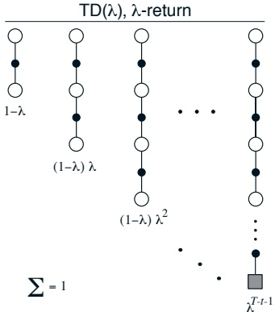

Figure 7.3: The backup diagram for TD( $\lambda$). If  $\lambda = 0$, then the overall backup reduces to its first component, the one-step TD backup, whereas if  $\lambda = 1$, then the overall backup reduces to its last component, the Monte Carlo backup.

λ-return is the same as the Monte Carlo algorithm that we called constant-α MC (6.1) in the previous chapter. On the other hand, if λ = 0, then the λ-return reduces to  $G_t^{t+1}(V_t(S_{t+1}))$, the one-step return. Thus, for λ = 0, backing up according to the λ-return is the same as the one-step TD method, TD(0) from the previous chapter (6.2).

We define the  $\lambda$-return algorithm as the method that performs backups towards the  $\lambda$-return as target. On each step, t, it computes an increment,

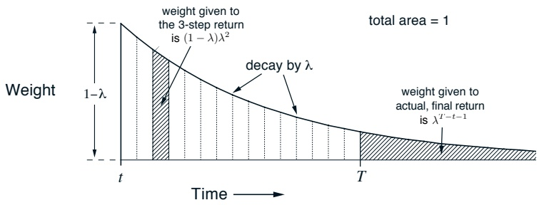

Figure 7.4: Weighting given in the  $\lambda$-return to each of the n-step returns.

---

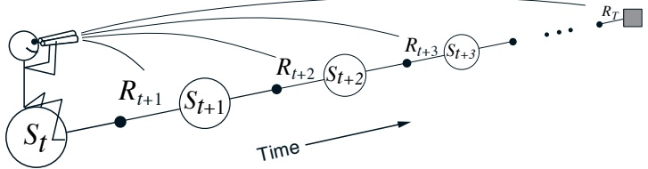

Figure 7.5: The forward or theoretical view. We decide how to update each state by looking forward to future rewards and states.

 $\Delta_{t}(S_{t})$, to the value of the state occurring on that step:

$$
\Delta_{t}(S_{t})=\alpha\Big[L_{t}-V_{t}(S_{t})\Big].   \tag*{(7.7)}
$$

(The increments for other states are of course  $\Delta_t(s) = 0$, for all  $s \neq S_t$). As with n-step TD methods, the updating can be either on-line or off-line. The upper row of Figure 7.6 shows the performance of the on-line and off-line  $\lambda$-return algorithms on the 19-state random walk task (Example 7.1). The experiment was just as in the n-step case (Figure 7.2) except that here we varied  $\lambda$ instead of n. Note that overall performance of the  $\lambda$-return algorithms is comparable to that of the n-step algorithms. In both cases we get best performance with an intermediate value of the truncation parameter,  $n$ or  $\lambda$.

The approach that we have been taking so far is what we call the theoretical, or forward, view of a learning algorithm. For each state visited, we look forward in time to all the future rewards and decide how best to combine them. We might imagine ourselves riding the stream of states, looking forward from each state to determine its update, as suggested by Figure 7.5. After looking forward from and updating one state, we move on to the next and never have to work with the preceding state again. Future states, on the other hand, are viewed and processed repeatedly, once from each vantage point preceding them.

The  $\lambda$-return algorithm is the basis for the forward view of eligibility traces as used in the TD( $\lambda$) method. In fact, we show in a later section that, in the off-line case, the  $\lambda$-return algorithm is the TD( $\lambda$) algorithm. The  $\lambda$-return and TD( $\lambda$) methods use the  $\lambda$ parameter to shift from one-step TD methods to Monte Carlo methods. The specific way this shift is done is interesting, but not obviously better or worse than the way it is done with simple n-step methods by varying n. Ultimately, the most compelling motivation for the  $\lambda$ way of mixing n-step backups is that there in a simple algorithm—TD( $\lambda$)—for achieving it. This is a mechanism issue rather than a theoretical one. In the

---

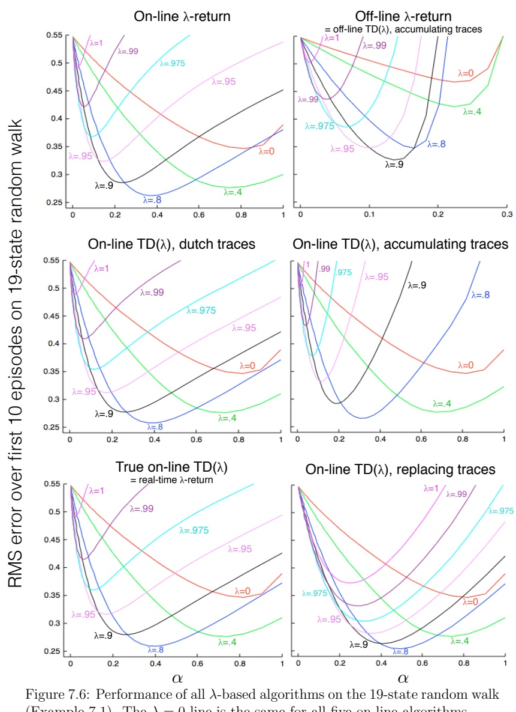

Figure 7.6: Performance of all  $\lambda$-based algorithms on the 19-state random walk (Example 7.1). The  $\lambda = 0$ line is the same for all five on-line algorithms.

---

## 7.3. THE BACKWARD VIEW OF TD( $\lambda$)

next few sections we develop the mechanistic, or backward, view of eligibility traces as used in TD( $\lambda$).

## 7.3 The Backward View of TD( $\lambda$)

In the previous section we presented the forward or theoretical view of the tabular TD( $\lambda$) algorithm as a way of mixing backups that parametrically shifts from a TD method to a Monte Carlo method. In this section we instead define TD( $\lambda$) mechanistically and show that it can closely approximate the forward view. The mechanistic, or backward, view of TD( $\lambda$) is useful because it is simple conceptually and computationally. In particular, the forward view itself is not directly implementable because it is acausal, using at each step knowledge of what will happen many steps later. The backward view provides a causal, incremental mechanism for approximating the forward view and, in the off-line case, for achieving it exactly.

In the backward view of TD( $\lambda$), there is an additional memory variable associated with each state, its eligibility trace. The eligibility trace for state s at time t is a random variable denoted  $E_t(s) \in \mathbb{R}^+$. On each step, the eligibility traces of all non-visited states decay by  $\gamma\lambda$:

$$
E_{t}(s)=\gamma\lambda E_{t-1}(s),\qquad\forall s\in\mathcal{S},s\neq S_{t},   \tag*{(7.8)}
$$

where  $\gamma$ is the discount rate and  $\lambda$ is the parameter introduced in the previous section. Henceforth we refer to  $\lambda$ as the trace-decay parameter. What about the trace for  $S_t$, the one state visited at time  $t$? The classical eligibility trace for  $S_t$ decays just like for any state, but is then incremented by 1:

$$
E_{t}(S_{t})=\gamma\lambda E_{t-1}(S_{t})+1.   \tag*{(7.9)}
$$

This kind of eligibility trace is called an accumulating trace because it accumulates each time the state is visited, then fades away gradually when the state is not visited, as illustrated as illustrated below.

Eligibility traces keep a simple record of which states have recently been visited, where “recently” is defined in terms of  $\gamma\lambda$. The traces are said to indicate the degree to which each state is eligible for undergoing learning changes should a reinforcing event occur. The reinforcing events we are concerned with

---

are the moment-by-moment one-step TD errors. For example, the TD error for state-value prediction is

$$
\delta_{t}=R_{t+1}+\gamma V_{t}(S_{t+1})-V_{t}(S_{t}).   \tag*{(7.10)}
$$

In the backward view of TD( $\lambda$), the global TD error signal triggers proportional updates to all recently visited states, as signaled by their nonzero traces:

$$
\Delta V_{t}(s)=\alpha\delta_{t}E_{t}(s),\qquadfor all s\in\mathcal{S}.   \tag*{(7.11)}
$$

As always, these increments could be done on each step to form an on-line algorithm, or saved until the end of the episode to produce an off-line algorithm. In either case, equations (7.8–7.11) provide the mechanistic definition of the TD( $\lambda$) algorithm. A complete algorithm for on-line TD( $\lambda$) is given in Figure 7.7.

The backward view of TD( $\lambda$) is oriented backward in time. At each moment we look at the current TD error and assign it backward to each prior state according to the state's eligibility trace at that time. We might imagine ourselves riding along the stream of states, computing TD errors, and shouting them back to the previously visited states, as suggested by Figure 7.8. Where the TD error and traces come together, we get the update given by (7.11).

To better understand the backward view, consider what happens at various values of  $\lambda$. If  $\lambda = 0$, then by (7.9) all traces are zero at t except for the trace corresponding to  $S_t$. Thus the TD( $\lambda$) update (7.11) reduces to the simple TD

Initialize $V(s)$arbitrarily (but set to 0 if$s$is terminal)
Repeat (for each episode):
  Initialize$E(s) = 0$, for all $s \in \mathcal{S}$Initialize$S$Repeat (for each step of episode):$A \leftarrow$action given by$\pi$for$S$Take action$A$, observe reward, $R$, and next state, $S'$ $\delta \leftarrow R + \gamma V(S') - V(S)$ $E(S) \leftarrow E(S) + 1$or$E(S) \leftarrow (1 - \alpha)E(S) + 1$or$E(S) \leftarrow 1$For all$s \in \mathcal{S}$:
      $V(s) \leftarrow V(s) + \alpha \delta E(s)$ $E(s) \leftarrow \gamma \lambda E(s)$ $S \leftarrow S'$until$S$is terminal

Figure 7.7: On-line tabular TD($ \lambda $).

---

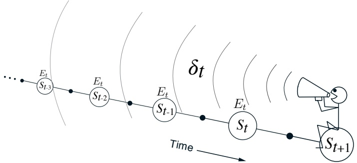

Figure 7.8: The backward or mechanistic view. Each update depends on the current TD error combined with eligibility traces of past events.

rule (6.2), which we henceforth call TD(0). In terms of Figure 7.8, TD(0) is the case in which only the one state preceding the current one is changed by the TD error. For larger values of  $\lambda$, but still  $\lambda < 1$, more of the preceding states are changed, but each more temporally distant state is changed less because its eligibility trace is smaller, as suggested in the figure. We say that the earlier states are given less credit for the TD error.

If  $\lambda = 1$, then the credit given to earlier states falls only by  $\gamma$ per step. This turns out to be just the right thing to do to achieve Monte Carlo behavior. For example, remember that the TD error,  $\delta_t$, includes an undiscounted term of  $R_{t+1}$. In passing this back  $k$ steps it needs to be discounted, like any reward in a return, by  $\gamma^k$, which is just what the falling eligibility trace achieves. If  $\lambda = 1$ and  $\gamma = 1$, then the eligibility traces do not decay at all with time. In this case the method behaves like a Monte Carlo method for an undiscounted, episodic task. If  $\lambda = 1$, the algorithm is also known as TD(1).

TD(1) is a way of implementing Monte Carlo algorithms that is more general than those presented earlier and that significantly increases their range of applicability. Whereas the earlier Monte Carlo methods were limited to episodic tasks, TD(1) can be applied to discounted continuing tasks as well. Moreover, TD(1) can be performed incrementally and on-line. One disadvantage of Monte Carlo methods is that they learn nothing from an episode until it is over. For example, if a Monte Carlo control method does something that produces a very poor reward but does not end the episode, then the agent's tendency to do that will be undiminished during the episode. On-line TD(1), on the other hand, learns in an n-step TD way from the incomplete ongoing episode, where the n steps are all the way up to the current step. If something unusually good or bad happens during an episode, control methods based on

---

TD(1) can learn immediately and alter their behavior on that same episode.

It is revealing to revisit the 19-state random walk example (Example 7.1) to see how well the backward-view TD( $\lambda$) algorithm does in approximating the ideal of the forward-view  $\lambda$-return algorithm. The performances of off-line and on-line TD( $\lambda$) with accumulating traces are shown in the upper-right and middle-right panels of Figure 7.6. In the off-line case it has been proven that the  $\lambda$-return algorithm and TD( $\lambda$) are identical in their overall updates at the end of the episode. Thus, the one set of results in the upper-right panel is sufficient for both of these algorithms. However, recall that the off-line case is not our main focus, as all of its performance levels are generally lower and obtained over a narrower range of parameter values than can be obtained with on-line methods, as we saw earlier for n-step methods in Figure 7.2 and for  $\lambda$-return methods in the upper two panels of Figure 7.6.

In the on-line case, the performances of TD( $\lambda$) with accumulating traces (middle-right panel) are indeed much better and closer to that of the on-line  $\lambda$-return algorithm (upper-left panel). If  $\lambda = 0$, then in fact it is the identical algorithm at all  $\alpha$, and if  $\alpha$ is small, then for all  $\lambda$ it is a close approximation to the  $\lambda$-return algorithm by the end of each episode. However, if both parameters are larger, for example  $\lambda > 0.9$ and  $\alpha > 0.5$, then the algorithms perform substantially differently: the  $\lambda$-return algorithm performs a little less well whereas TD( $\lambda$) is likely to be unstable. This is not a terrible problem, as these parameter values are higher than one would want to use anyway, but it is a weakness of the method.

Two alternative variations of eligibility traces have been proposed to address these limitations of the accumulating trace. On each step, all three trace types decay the traces of the non-visited states in the same way, that is, according to  $(7.8)$, but they differ in how the visited state is incremented. The first trace variation is the replacing trace. Suppose a state is visited and then revisited before the trace due to the first visit has fully decayed to zero. With accumulating traces the revisit causes a further increment in the trace  $(7.9)$, driving it greater than 1, whereas, with replacing traces, the trace is simply reset to 1:

$$
E_{t}(S_{t})=1.   \tag*{(7.12)}
$$

In the special case of  $\lambda = 1$, TD( $\lambda$) with replacing traces is closely related to first-visit Monte Carlo methods. The second trace variation, called the dutch trace, is sort of intermediate between accumulating and replacing traces, depending on the step-size parameter  $\alpha$. Dutch traces are defined by

$$
E_{t}(S_{t})=(1-\alpha)\gamma\lambda E_{t-1}(S_{t})+1.   \tag*{(7.13)}
$$

Note that as  $\alpha$ approaches zero, the dutch trace becomes the accumulating

---

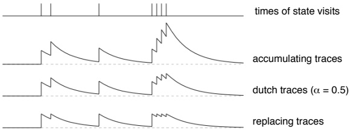

Figure 7.9: The three different kinds of traces. Accumulating traces add up each time a state is visited, whereas replacing traces are reset to one, and dutch traces do something inbetween, depending on  $\alpha$ (here we show them for  $\alpha = 0.5$). In all cases the traces decay at a rate of  $\gamma\lambda$ per step; here we show  $\gamma\lambda = 0.8$ such that the traces have a time constant of approximately 5 steps (the last four visits are on successive steps).

trace, and, if  $\alpha = 1$, the dutch trace becomes the replacing trace. Figure 7.9 contrasts the three kinds of traces, showing the behavior of the dutch trace for  $\alpha = 1/2$. The performances of TD( $\lambda$) with these two kinds of traces are shown as additional panels in (7.6). In both cases, performance is more robust to the parameter values than it is with accumulating traces. The performance with dutch traces in particular achieves our goal of an on-line causal algorithm that closely approximates the  $\lambda$-return algorithm.

## 7.4 Equivalences of Forward and Backward Views

It is sometimes possible to prove that two learning methods originating in different ways are in fact equivalent in the strong sense that the value functions they produce are exactly the same on every time step. A simple case of this is that one-step methods and all  $\lambda$-based methods are equivalent if  $\lambda = 0$. This follows immediately from the fact that their backup targets are all the same. Another easy-to-see example is the equivalence at  $\lambda = 1$ of off-line TD( $\lambda$) and the constant- $\alpha$ MC methods, as noted in the previous section. Of particular interest are equivalences between forward-view algorithms, which are often more intuitive and clearer conceptually, and backward-view algorithms that are efficient and causal. The best example of this that we have encountered so far is the equivalence at all  $\lambda$ of the off-line  $\lambda$-return algorithm (forward view) and off-line TD( $\lambda$) with accumulating traces (backward view). That was an equivalence of value functions at the end of episodes and, because they are offline methods which don't change values within an episode, it is a step-by-step equivalence as well. This equivalence was proved formally in the first edition.

---

of this book, and was verified empirically here on the 19-state random-walk example in producing the upper-left panel of Figure 7.6.

For on-line methods (and  $\lambda > 0$) the first edition of this book established only approximate episode-by-episode equivalences between the  $\lambda$-return algorithm and TD( $\lambda$). In the random-walk problem, at the end of episodes, TD( $\lambda$) with accumulating traces is almost the same as the  $\lambda$-return algorithm, but only for small  $\alpha$ and  $\lambda$. With dutch traces the approximation is closer, but it is still not exact even on an episode-by-episode basis (compare the upper-left and middle left panels of Figure 7.6). Only recently has an interesting exact equivalence been established between a  $\lambda$-based forward view and an efficient backward-view implementation, in particular, between a “real-time”  $\lambda$-return algorithm and the “true online TD( $\lambda$)” algorithm (van Seijen and Sutton, 2014). This is a striking and revealing result, but a little technical. The best way to present it is using the notation of linear function approximation, which we develop in Chapter 9. We postpone development of the real-time  $\lambda$-return algorithm until then and present here only the backward-view algorithm.

True online  $TD(\lambda)$ is defined by the dutch trace (Eqs. 7.13 and 7.8) and the following value function update:

 
$$
V_{t+1}(s)=V_{t}(s)+\alpha\left[\delta_{t}+V_{t}(S_{t})-V_{t-1}(S_{t})\right]E_{t}(s)-\alpha I_{sS_{t}}\left[V_{t}(S_{t})-V_{t-1}(S_{t})\right],
$$
 

for all  $s \in \mathcal{S}$, where  $I_{xy}$ is an identity-indicator function, equal to 1 if  $x = y$ and 0 otherwise. An efficient implementation is given as a boxed algorithm in Figure 7.10.

Results on the 19-state random-walk example for true online TD( $\lambda$) are given in the lower-left panel of Figure 7.6. We see that in this example true on-line TD( $\lambda$) appears to perform slightly better than the on-line  $\lambda$-return algorithm, but not necessarily better than TD( $\lambda$) with dutch traces; most of the performance improvement seems to come from the dutch traces rather than the slightly different or extra terms in the equations above. Of course, this is just one example; benefits of the exact equivalence may appear on other problems. One thing we can say in that these slight differences enable true on-line TD( $\lambda$) with  $\lambda = 1$ to be exactly equivalent by the end of the episode to the constant- $\alpha$ MC method, while making updates on-line and in real-time. The same cannot be said for any of the other methods.

---

Initialize  $V(s)$ arbitrarily (but set to 0 if  $s$ is terminal)
 $V_{\text{old}} \leftarrow 0$
Repeat (for each episode):
Initialize  $E(s) = 0$, for all  $s \in S$
Initialize  $S$
Repeat (for each step of episode):
 $A \leftarrow$ action given by  $\pi$ for  $S$
Take action  $A$, observe reward,  $R$, and next state,  $S'$
 $\Delta \leftarrow V(S) - V_{\text{old}}$
 $V_{\text{old}} \leftarrow V(S')$
 $\delta \leftarrow R + \gamma V(S') - V(S)$
 $E(S) \leftarrow (1 - \alpha)E(S) + 1$
For all  $s \in S$:
 $V(s) \leftarrow V(s) + \alpha(\delta + \Delta)E(s)$
 $E(s) \leftarrow \gamma \lambda E(s)$
 $V(S) \leftarrow V(S) - \alpha \Delta$
 $S \leftarrow S'$
until  $S$ is terminal

Figure 7.10: Tabular true on-line TD(λ).

## 7.5 Sarsa(λ)

How can eligibility traces be used not just for prediction, as in TD( $\lambda$), but for control? As usual, the main idea of one popular approach is simply to learn action values,  $Q_t(s, a)$, rather than state values,  $V_t(s)$. In this section we show how eligibility traces can be combined with Sarsa in a straightforward way to produce an on-policy TD control method. The eligibility trace version of Sarsa we call  $Sarsa(\lambda)$, and the original version presented in the previous chapter we henceforth call one-step Sarsa.

The idea in Sarsa( $\lambda$) is to apply the TD( $\lambda$) prediction method to state-action pairs rather than to states. Obviously, then, we need a trace not just for each state, but for each state-action pair. Let  $E_t(s, a)$ denote the trace for state-action pair s, a. The traces can be any of the three types—accumulating, replace, or dutch—and are updated in essentially the same way as before except of course being triggered by visiting the state-action pair (here given using the identity-indicator notation):

 
$$
E_{t}(s,a)=\gamma\lambda E_{t-1}(s,a)+I_{s S_{t}}I_{a A_{t}}
$$
 

(accumulating)

$$
E_{t}(s,a)=(1-\alpha)\gamma\lambda E_{t-1}(s,a)+I_{s S_{t}}I_{a A_{t}}   \tag*{(dutch)}
$$

$$
E_{t}(s,a)=(1-I_{s S_{t}}I_{a A_{t}})\gamma\lambda E_{t-1}(s,a)+I_{s S_{t}}I_{a A_{t}}   \tag*{(replacing)}
$$

for all s ∈ §, a ∈ A. Otherwise Sarsa(λ) is just like TD(λ), substituting

---

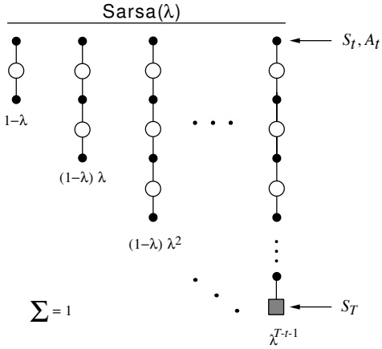

Figure 7.11: Sarsa( $\lambda$)'s backup diagram.

state-action variables for state variables— $Q_{t}(s,a)$ for  $V_{t}(s)$ and  $E_{t}(s,a)$ for  $E_{t}(s)$:

 
$$
Q_{t+1}(s,a)=Q_{t}(s,a)+\alpha\delta_{t}E_{t}(s,a),\qquadfor all s,a
$$
 

where

 
$$
\delta_{t}=R_{t+1}+\gamma Q_{t}(S_{t+1},A_{t+1})-Q_{t}(S_{t},A_{t}).
$$
 

Figure 7.11 shows the backup diagram for Sarsa( $\lambda$). Notice the similarity to the diagram of the TD( $\lambda$) algorithm (Figure 7.3). The first backup looks ahead one full step, to the next state-action pair, the second looks ahead two steps, and so on. A final backup is based on the complete return. The weighting of each backup is just as in TD( $\lambda$) and the  $\lambda$-return algorithm.

One-step Sarsa and Sarsa( $\lambda$) are on-policy algorithms, meaning that they approximate  $q_{\pi}(s,a)$, the action values for the current policy,  $\pi$, then improve the policy gradually based on the approximate values for the current policy. The policy improvement can be done in many different ways, as we have seen throughout this book. For example, the simplest approach is to use the  $\varepsilon$-greedy policy with respect to the current action-value estimates. Figure 7.12 shows the complete Sarsa( $\lambda$) algorithm for this case.

Example 7.2: Traces in Gridworld The use of eligibility traces can substantially increase the efficiency of control algorithms. The reason for this

---

Initialize $Q(s, a)$arbitrarily, for all$s \in \mathcal{S}, a \in \mathcal{A}(s)$Repeat (for each episode):$E(s, a) = 0$, for all $s \in \mathcal{S}, a \in \mathcal{A}(s)$Initialize$S, A$Repeat (for each step of episode):
Take action$A$, observe $R, S'$Choose$A'$from$S'$using policy derived from$Q$(e.g.,$\varepsilon$-greedy)
$\delta \leftarrow R + \gamma Q(S', A') - Q(S, A)$
$E(S, A) \leftarrow E(S, A) + 1$(accumulating traces)
or$E(S, A) \leftarrow (1 - \alpha)E(S, A) + 1$(dutch traces)
or$E(S, A) \leftarrow 1$(replacing traces)
For all$s \in \mathcal{S}, a \in \mathcal{A}(s)$:
$Q(s, a) \leftarrow Q(s, a) + \alpha \delta E(s, a)$
$E(s, a) \leftarrow \gamma \lambda E(s, a)$
$S \leftarrow S'; A \leftarrow A'$until$S$is terminal

Figure 7.12: Tabular Sarsa($ \lambda $).

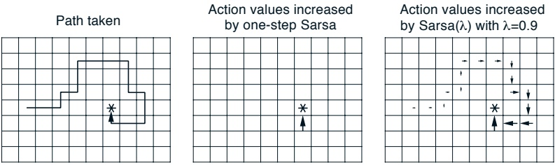

Figure 7.13: Gridworld example of the speedup of policy learning due to the use of eligibility traces.

---

is illustrated by the gridworld example in Figure 7.13. The first panel shows the path taken by an agent in a single episode, ending at a location of high reward, marked by the *. In this example the values were all initially 0, and all rewards were zero except for a positive reward at the * location. The arrows in the other two panels show which action values were strengthened as a result of this path by one-step Sarsa and Sarsa(λ) methods. The one-step method strengthens only the last action of the sequence of actions that led to the high reward, whereas the trace method strengthens many actions of the sequence. The degree of strengthening (indicated by the size of the arrows) falls off (according to γλ or (1 - α)γλ) with steps from the reward. In this example, the fall off is 0.9 per step.

## 7.6 Watkins's Q( $\lambda$)

When Chris Watkins (1989) first proposed Q-learning, he also proposed a simple way to combine it with eligibility traces. Recall that Q-learning is an off-policy method, meaning that the policy learned about need not be the same as the one used to select actions. In particular, Q-learning learns about the greedy policy while it typically follows a policy involving exploratory actions—occasional selections of actions that are suboptimal according to Q. Because of this, special care is required when introducing eligibility traces.

Suppose we are backing up the state–action pair  $S_t$,  $A_t$ at time  $t$. Suppose that on the next two time steps the agent selects the greedy action, but on the third, at time  $t+3$, the agent selects an exploratory, nongreedy action. In learning about the value of the greedy policy at  $S_t$,  $A_t$ we can use subsequent experience only as long as the greedy policy is being followed. Thus, we can use the one-step and two-step returns, but not, in this case, the three-step return. The  $n$-step returns for all  $n \geq 3$ no longer have any necessary relationship to the greedy policy.

Thus, unlike TD(λ) or Sarsa(λ), Watkins's Q(λ) does not look ahead all the way to the end of the episode in its backup. It only looks ahead as far as the next exploratory action. Aside from this difference, however, Watkins's Q(λ) is much like TD(λ) and Sarsa(λ). Their lookahead stops at episode's end, whereas Q(λ)'s lookahead stops at the first exploratory action, or at episode's end if there are no exploratory actions before that. Actually, to be more precise, one-step Q-learning and Watkins's Q(λ) both look one action past the first exploration, using their knowledge of the action values. For example, suppose the first action,  $A_{t+1}$, is exploratory. Watkins's Q(λ) would still do the one-step update of  $Q_t(S_t, A_t)$ toward  $R_{t+1} + \gamma \max_a Q_t(S_{t+1}, a)$. In general,