

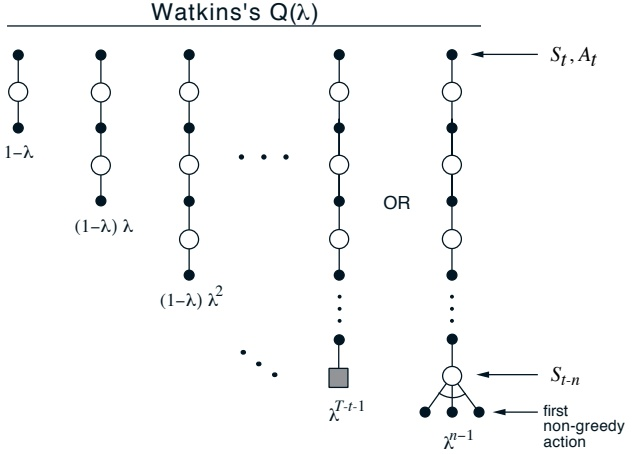

Figure 7.14: The backup diagram for Watkins’s Q( $\lambda$). The series of component backups ends either with the end of the episode or with the first nongreedy action, whichever comes first.

if  $A_{t+n}$ is the first exploratory action, then the longest backup is toward

 
$$
R_{t+1}+\gamma R_{t+2}+\cdots+\gamma^{n-1}R_{t+n}+\gamma^{n}\max_{a}Q_{t}(S_{t+n},a),
$$
 

where we assume off-line updating. The backup diagram in Figure 7.14 illustrates the forward view of Watkins's Q( $\lambda$), showing all the component backups.

The mechanistic or backward view of Watkins’s Q( $\lambda$) is also very simple. Eligibility traces are used just as in Sarsa( $\lambda$), except that they are set to zero whenever an exploratory (nongreedy) action is taken. The trace update is best thought of as occurring in two steps. First, the traces for all state–action pairs are either decayed by  $\gamma\lambda$ or, if an exploratory action was taken, set to 0. Second, the trace corresponding to the current state and action is incremented by 1. The overall result is

 
$$
E_{t}(s,a)=\left\{\begin{array}{ll}\gamma\lambda E_{t-1}(s,a)+I_{s S_{t}}\cdot I_{a A_{t}}&if Q_{t-1}(S_{t},A_{t})=\max_{a}Q_{t-1}(S_{t},a);\\I_{s S_{t}}\cdot I_{a A_{t}}&otherwise.\end{array}\right.
$$
 

One could also use analogous dutch or replacing traces here. The rest of the algorithm is defined by

 
$$
Q_{t+1}(s,a)=Q_{t}(s,a)+\alpha\delta_{t}E_{t}(s,a),\quad\forall s\in\mathcal{S},a\in\mathcal{A}(s)
$$
 

---

Initialize $Q(s, a)$arbitrarily, for all$s \in \mathcal{S}, a \in \mathcal{A}(s)$Repeat (for each episode):$E(s, a) = 0$, for all $s \in \mathcal{S}, a \in \mathcal{A}(s)$Initialize$S, A$Repeat (for each step of episode):
Take action$A$, observe $R, S'$Choose$A'$from$S'$using policy derived from$Q$(e.g.,$\varepsilon$-greedy)
$A^* \leftarrow \arg\max_a Q(S', a)$(if$A'$ties for the max, then$A^* \leftarrow A'$)
$\delta \leftarrow R + \gamma Q(S', A*) - Q(S, A)$
$E(S, A) \leftarrow E(S, A) + 1$(accumulating traces)
or$E(S, A) \leftarrow (1 - \alpha)E(S, A) + 1$(dutch traces)
or$E(S, A) \leftarrow 1$(replacing traces)

For all$s \in \mathcal{S}, a \in \mathcal{A}(s)$:
$Q(s, a) \leftarrow Q(s, a) + \alpha \delta E(s, a)$If$A' = A^*$, then $E(s, a) \leftarrow \gamma \lambda E(s, a)$else$E(s, a) \leftarrow 0$
$S \leftarrow S'; A \leftarrow A'$until$S$is terminal

Figure 7.15: Tabular version of Watkins’s Q($ \lambda $) algorithm.

where

 
$$
\delta_{t}=R_{t+1}+\gamma\max_{a^{\prime}}Q_{t}(S_{t+1},a^{\prime})-Q_{t}(S_{t},A_{t}).
$$
 

Figure 7.15 shows the complete algorithm in pseudocode.

Unfortunately, cutting off traces every time an exploratory action is taken loses much of the advantage of using eligibility traces. If exploratory actions are frequent, as they often are early in learning, then only rarely will backups of more than one or two steps be done, and learning may be little faster than one-step Q-learning.

## 7.7 Off-policy Eligibility Traces using Importance Sampling

The eligibility traces in Watkins's Q( $\lambda$) are a crude way to deal with off-policy training. First, they treat the off-policy aspect as binary; either the target policy is followed and traces continue normally, or it is deviated from and traces are cut off completely; there is nothing inbetween. But the target policy may take different actions with different positive probabilities, as may the behavior policy, in which case following and deviating will be a matter of

---

degree. In Chapter 5 we saw how to use the ratio of the two probabilities of taking the action to more precisely assign credit to a single action, and the product of ratios to assign credit to a sequence.

Second, Watkins’s Q( $\lambda$) confounds bootstrapping and off-policy deviation. Bootstrapping refers to the degree to which an algorithm builds its estimates from other estimates, like TD and DP, or does not, like MC methods. In TD( $\lambda$) and Sarsa( $\lambda$), the  $\lambda$ parameter controls the degree of bootstrapping, with the value  $\lambda = 1$ denoting no bootstrapping, turning these TD methods into MC methods. But the same cannot be said for Q( $\lambda$). As soon as there is a deviation from the target policy Q( $\lambda$) cuts the trace and uses its value estimate rather than waiting for the actual rewards—it bootstraps even if  $\lambda = 1$. Ideally we would like to totally de-couple bootstrapping from the off-policy aspect, to use  $\lambda$ to specify the degree of bootstrapping while using importance sampling to correct independently for the degree of off-policy deviation.

## 7.8 Implementation Issues

It might at first appear that methods using eligibility traces are much more complex than one-step methods. A naive implementation would require every state (or state-action pair) to update both its value estimate and its eligibility trace on every time step. This would not be a problem for implementations on single-instruction, multiple-data parallel computers or in plausible neural implementations, but it is a problem for implementations on conventional serial computers. Fortunately, for typical values of  $\lambda$ and  $\gamma$ the eligibility traces of almost all states are almost always nearly zero; only those that have recently been visited will have traces significantly greater than zero. Only these few states really need to be updated because the updates at the others will have essentially no effect.

In practice, then, implementations on conventional computers keep track of and update only the few states with nonzero traces. Using this trick, the computational expense of using traces is typically a few times that of a one-step method. The exact multiple of course depends on  $\lambda$ and  $\gamma$ and on the expense of the other computations. Cichosz (1995) has demonstrated a further implementation technique that further reduces complexity to a constant independent of  $\lambda$ and  $\gamma$. Finally, it should be noted that the tabular case is in some sense a worst case for the computational complexity of traces. When function approximation is used (Chapter 9), the computational advantages of not using traces generally decrease. For example, if artificial neural networks and backpropagation are used, then traces generally cause only a doubling of the required memory and computation per step.

---

####  $^{*}$7.9 Variable  $\lambda$

The  $\lambda$-return can be significantly generalized beyond what we have described so far by allowing  $\lambda$ to vary from step to step, that is, by redefining the trace update as

 
$$
E_{t}(s)=\left\{\begin{array}{ll}\gamma\lambda_{t}E_{t-1}(s)&if s\neq S_{t};\\ \gamma\lambda_{t}E_{t-1}(s)+1&if s=S_{t},\end{array}\right.
$$
 

where  $\lambda_t$ denotes the value of  $\lambda$ at time  $t$. This is an advanced topic because the added generality has never been used in practical applications, but it is interesting theoretically and may yet prove useful. For example, one idea is to vary  $\lambda$ as a function of state:  $\lambda_t = \lambda(S_t)$. If a state's value estimate is believed to be known with high certainty, then it makes sense to use that estimate fully, ignoring whatever states and rewards are received after it. This corresponds to cutting off all the traces once this state has been reached, that is, to choosing the  $\lambda$ for the certain state to be zero or very small. Similarly, states whose value estimates are highly uncertain, perhaps because even the state estimate is unreliable, can be given  $\lambda_s$ near 1. This causes their estimated values to have little effect on any updates. They are “skipped over” until a state that is known better is encountered. Some of these ideas were explored formally by Sutton and Singh (1994).

The eligibility trace equation above is the backward view of variable  $\lambda$s. The corresponding forward view is a more general definition of the  $\lambda$-return:

 
$$
\begin{array}{r c l}{G_{t}^{\lambda}}&{=}&{\displaystyle\sum_{n=1}^{\infty}G_{t}^{(n)}\big(1-\lambda_{t+n}\big)\prod_{i=t+1}^{t+n-1}\lambda_{i}}\\ {}&{=}&{\displaystyle\sum_{k=t+1}^{T-1}G_{t}^{(k-t)}\big(1-\lambda_{k}\big)\prod_{i=t+1}^{k-1}\lambda_{i}}&{+}&{G_{t}\prod_{i=t+1}^{T-1}\lambda_{i}.}\\ \end{array}
$$
 

## 7.10 Conclusions

Eligibility traces in conjunction with TD errors provide an efficient, incremental way of shifting and choosing between Monte Carlo and TD methods. Traces can be used without TD errors to achieve a similar effect, but only awkwardly. A method such as TD( $\lambda$) enables this to be done from partial experiences and with little memory and little nonmeaningful variation in predictions.

As we mentioned in Chapter 5, Monte Carlo methods may have advantages in non-Markov tasks because they do not bootstrap. Because eligibility

---

traces make TD methods more like Monte Carlo methods, they also can have advantages in these cases. If one wants to use TD methods because of their other advantages, but the task is at least partially non-Markov, then the use of an eligibility trace method is indicated. Eligibility traces are the first line of defense against both long-delayed rewards and non-Markov tasks.

By adjusting  $\lambda$, we can place eligibility trace methods anywhere along a continuum from Monte Carlo to one-step TD methods. Where shall we place them? We do not yet have a good theoretical answer to this question, but a clear empirical answer appears to be emerging. On tasks with many steps per episode, or many steps within the half-life of discounting, it appears significantly better to use eligibility traces than not to (e.g., see Figure 9.12). On the other hand, if the traces are so long as to produce a pure Monte Carlo method, or nearly so, then performance degrades sharply. An intermediate mixture appears to be the best choice. Eligibility traces should be used to bring us toward Monte Carlo methods, but not all the way there. In the future it may be possible to vary the trade-off between TD and Monte Carlo methods more finely by using variable  $\lambda$, but at present it is not clear how this can be done reliably and usefully.

Methods using eligibility traces require more computation than one-step methods, but in return they offer significantly faster learning, particularly when rewards are delayed by many steps. Thus it often makes sense to use eligibility traces when data are scarce and cannot be repeatedly processed, as is often the case in on-line applications. On the other hand, in off-line applications in which data can be generated cheaply, perhaps from an inexpensive simulation, then it often does not pay to use eligibility traces. In these cases the objective is not to get more out of a limited amount of data, but simply to process as much data as possible as quickly as possible. In these cases the speedup per datum due to traces is typically not worth their computational cost, and one-step methods are favored.

#### Bibliographical and Historical Remarks

7.1–2 The forward view of eligibility traces in terms of n-step returns and the  $\lambda$-return is due to Watkins (1989), who also first discussed the error reduction property of n-step returns. Our presentation is based on the slightly modified treatment by Jaakkola, Jordan, and Singh (1994). The results in the random walk examples were made for this text based on work of Sutton (1988) and Singh and Sutton (1996). The use of backup diagrams to describe these and other algorithms in this chapter is new, as are the terms “forward view” and “backward view.”

---

TD(λ) was proved to converge in the mean by Dayan (1992), and with probability 1 by many researchers, including Peng (1993), Dayan and Sejnowski (1994), and Tsitsiklis (1994). Jaakkola, Jordan, and Singh (1994), in addition, first proved convergence of TD(λ) under on-line updating. Gurvits, Lin, and Hanson (1994) proved convergence of a more general class of eligibility trace methods.

7.3 TD(λ) with accumulating traces was introduced by Sutton (1988, 1984). Replacing traces are due to Singh and Sutton (1996). Dutch traces are due to van Seijen and Sutton (2014, in prep).

Eligibility traces came into reinforcement learning via the fecund ideas of Klopf (1972). Our use of eligibility traces was based on Klopf's work (Sutton, 1978a, 1978b, 1978c; Barto and Sutton, 1981a, 1981b; Sutton and Barto, 1981a; Barto, Sutton, and Anderson, 1983; Sutton, 1984). We may have been the first to use the term "eligibility trace" (Sutton and Barto, 1981). The idea that stimuli produce aftereffects in the nervous system that are important for learning is very old. See Section 14.??.

7.4 The episode-by-episode equivalence of forward and backward views, and the relationships to Monte Carlo methods, were proved by Sutton (1988) for undiscounted episodic tasks, then extended to the general case in the first edition of this book (1989). We see these as now superceded by the analyses and step-by-step equivalences in Section 9.??.

7.5 Sarsa( $\lambda$) was first explored as a control method by Rummery and Niranjan (1994; Rummery, 1995). Our presentation of replacing traces omits a subtlety which is sometimes found to be beneficial: clearing (setting to zero) the traces of all the actions not taken in the state that is visited, as suggested by Singh and Sutton (1996). This can also be done in Q( $\lambda$). Nowadays we would recommend just using dutch traces, which generalize better to function approximation.

7.6 Watkins's Q( $\lambda$) is due to Watkins (1989). Peng's Q( $\lambda$) is due to Peng and Williams (Peng, 1993; Peng and Williams, 1994, 1996). Rummery (1995) made extensive comparative studies of these algorithms.

Convergence has still not been proved for any control method for  $0 < \lambda < 1$.

---

7.8-9 The ideas in these two sections were generally known for many years, but beyond what is in the sources cited in the sections themselves, this text may be the first place they have been described. Perhaps the first published discussion of variable  $\lambda$ was by Watkins (1989), who pointed out that the cutting off of the backup sequence (Figure 7.14) in his Q( $\lambda$) when a nongreedy action was selected could be implemented by temporarily setting  $\lambda$ to 0.

#### Exercises

Exercise 7.1 Why do you think a larger random walk task (19 states instead of 5) was used in the examples of this chapter? Would a smaller walk have shifted the advantage to a different value of n? How about the change in left-side outcome from 0 to -1? Would that have made any difference in the best value of n?

Exercise 7.2 Why do you think on-line methods worked better than off-line methods on the example task?

*Exercise 7.3 In the lower part of Figure 7.2, notice that the plot for n = 3 is different from the others, dropping to low performance at a much lower value of  $\alpha$ than similar methods. In fact, the same was observed for n = 5, n = 7, and n = 9. Can you explain why this might have been so? In fact, we are not sure ourselves. See http://www.cs.utexas.edu/~ikarpov/Classes/RL/RandomWalk/ for an attempt at a thorough answer by Igor Karpov.

Exercise 7.4 The parameter  $\lambda$ characterizes how fast the exponential weighting in Figure 7.4 falls off, and thus how far into the future the  $\lambda$-return algorithm looks in determining its backup. But a rate factor such as  $\lambda$ is sometimes an awkward way of characterizing the speed of the decay. For some purposes it is better to specify a time constant, or half-life. What is the equation relating  $\lambda$ and the half-life,  $\tau_{\lambda}$, the time by which the weighting sequence will have fallen to half of its initial value?

Exercise 7.5 (programming) Draw a backup diagram for Sarsa( $\lambda$) with replacing traces.

Exercise 7.6 Write pseudocode for an implementation of TD( $\lambda$) that updates only value estimates for states whose traces are greater than some small positive constant.

Exercise 7.7 Write equations or pseudocode for Sarsa( $\lambda$) and/or Q( $\lambda$) with dutch traces. Do the same for a true-on-line version.

---

---

# Chapter 8

# Planning and Learning with Tabular Methods

In this chapter we develop a unified view of methods that require a model of the environment, such as dynamic programming and heuristic search, and methods that can be used without a model, such as Monte Carlo and temporal-difference methods. We think of the former as planning methods and of the latter as learning methods. Although there are real differences between these two kinds of methods, there are also great similarities. In particular, the heart of both kinds of methods is the computation of value functions. Moreover, all the methods are based on looking ahead to future events, computing a backed-up value, and then using it to update an approximate value function. Earlier in this book we presented Monte Carlo and temporal-difference methods as distinct alternatives, then showed how they can be seamlessly integrated by using eligibility traces such as in TD( $\lambda$). Our goal in this chapter is a similar integration of planning and learning methods. Having established these as distinct in earlier chapters, we now explore the extent to which they can be intermixed.

## 8.1 Models and Planning

By a model of the environment we mean anything that an agent can use to predict how the environment will respond to its actions. Given a state and an action, a model produces a prediction of the resultant next state and next reward. If the model is stochastic, then there are several possible next states and next rewards, each with some probability of occurring. Some models produce a description of all possibilities and their probabilities; these we call distribution models. Other models produce just one of the possibilities, sampled

---

according to the probabilities; these we call sample models. For example, consider modeling the sum of a dozen dice. A distribution model would produce all possible sums and their probabilities of occurring, whereas a sample model would produce an individual sum drawn according to this probability distribution. The kind of model assumed in dynamic programming—estimates of the state transition probabilities and expected rewards,  $p(s' | s, a)$ and  $r(s, a, s')$—is a distribution model. The kind of model used in the blackjack example in Chapter 5 is a sample model. Distribution models are stronger than sample models in that they can always be used to produce samples. However, in surprisingly many applications it is much easier to obtain sample models than distribution models.

Models can be used to mimic or simulate experience. Given a starting state and action, a sample model produces a possible transition, and a distribution model generates all possible transitions weighted by their probabilities of occurring. Given a starting state and a policy, a sample model could produce an entire episode, and a distribution model could generate all possible episodes and their probabilities. In either case, we say the model is used to simulate the environment and produce simulated experience.

The word planning is used in several different ways in different fields. We use the term to refer to any computational process that takes a model as input and produces or improves a policy for interacting with the modeled environment:

 
$$
model\quad\xrightarrow{\quad planning\quad}\quad policy
$$
 

Within artificial intelligence, there are two distinct approaches to planning according to our definition. In state-space planning, which includes the approach we take in this book, planning is viewed primarily as a search through the state space for an optimal policy or path to a goal. Actions cause transitions from state to state, and value functions are computed over states. In what we call plan-space planning, planning is instead viewed as a search through the space of plans. Operators transform one plan into another, and value functions, if any, are defined over the space of plans. Plan-space planning includes evolutionary methods and partial-order planning, a popular kind of planning in artificial intelligence in which the ordering of steps is not completely determined at all stages of planning. Plan-space methods are difficult to apply efficiently to the stochastic optimal control problems that are the focus in reinforcement learning, and we do not consider them further (but see Section 15.6 for one application of reinforcement learning within plan-space planning).

The unified view we present in this chapter is that all state-space planning methods share a common structure, a structure that is also present in the

---

learning methods presented in this book. It takes the rest of the chapter to develop this view, but there are two basic ideas: (1) all state-space planning methods involve computing value functions as a key intermediate step toward improving the policy, and (2) they compute their value functions by backup operations applied to simulated experience. This common structure can be diagrammed as follows:

 
$$
\begin{array}{ccc} \\  model & \longrightarrow &  \longrightarrow  \begin{array}{c}  simulated \\  experience \end{array} & \longrightarrow  \begin{array}{c}  backups \\  \\  values \end{array} & \longrightarrow  \begin{array}{c}  policy \end{array} \\ \end{array}
$$
 

Dynamic programming methods clearly fit this structure: they make sweeps through the space of states, generating for each state the distribution of possible transitions. Each distribution is then used to compute a backed-up value and update the state's estimated value. In this chapter we argue that various other state-space planning methods also fit this structure, with individual methods differing only in the kinds of backups they do, the order in which they do them, and in how long the backed-up information is retained.

Viewing planning methods in this way emphasizes their relationship to the learning methods that we have described in this book. The heart of both learning and planning methods is the estimation of value functions by backup operations. The difference is that whereas planning uses simulated experience generated by a model, learning methods use real experience generated by the environment. Of course this difference leads to a number of other differences, for example, in how performance is assessed and in how flexibly experience can be generated. But the common structure means that many ideas and algorithms can be transferred between planning and learning. In particular, in many cases a learning algorithm can be substituted for the key backup step of a planning method. Learning methods require only experience as input, and in many cases they can be applied to simulated experience just as well as to real experience. Figure 8.1 shows a simple example of a planning method based on one-step tabular Q-learning and on random samples from a sample model. This method, which we call random-sample one-step tabular Q-planning, converges to the optimal policy for the model under the same conditions that one-step tabular Q-learning converges to the optimal policy for the real environment (each state-action pair must be selected an infinite number of times in Step 1, and  $\alpha$ must decrease appropriately over time).

In addition to the unified view of planning and learning methods, a second theme in this chapter is the benefits of planning in small, incremental steps. This enables planning to be interrupted or redirected at any time with little wasted computation, which appears to be a key requirement for efficiently intermixing planning with acting and with learning of the model. More surprisingly, later in this chapter we present evidence that planning in very small

---

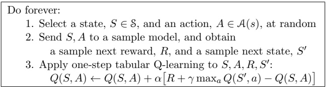

Figure 8.1: Random-sample one-step tabular Q-planning

steps may be the most efficient approach even on pure planning problems if the problem is too large to be solved exactly.

## 8.2 Integrating Planning, Acting, and Learning

When planning is done on-line, while interacting with the environment, a number of interesting issues arise. New information gained from the interaction may change the model and thereby interact with planning. It may be desirable to customize the planning process in some way to the states or decisions currently under consideration, or expected in the near future. If decision-making and model-learning are both computation-intensive processes, then the available computational resources may need to be divided between them. To begin exploring these issues, in this section we present Dyna-Q, a simple architecture integrating the major functions needed in an on-line planning agent. Each function appears in Dyna-Q in a simple, almost trivial, form. In subsequent sections we elaborate some of the alternate ways of achieving each function and the trade-offs between them. For now, we seek merely to illustrate the ideas and stimulate your intuition.

Within a planning agent, there are at least two roles for real experience: it can be used to improve the model (to make it more accurately match the real environment) and it can be used to directly improve the value function and policy using the kinds of reinforcement learning methods we have discussed in previous chapters. The former we call model-learning, and the latter we call direct reinforcement learning (direct RL). The possible relationships between experience, model, values, and policy are summarized in Figure 8.2. Each arrow shows a relationship of influence and presumed improvement. Note how experience can improve value and policy functions either directly or indirectly via the model. It is the latter, which is sometimes called indirect reinforcement learning, that is involved in planning.

---

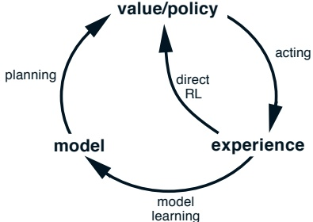

Figure 8.2: Relationships among learning, planning, and acting.

Both direct and indirect methods have advantages and disadvantages. Indirect methods often make fuller use of a limited amount of experience and thus achieve a better policy with fewer environmental interactions. On the other hand, direct methods are much simpler and are not affected by biases in the design of the model. Some have argued that indirect methods are always superior to direct ones, while others have argued that direct methods are responsible for most human and animal learning. Related debates in psychology and AI concern the relative importance of cognition as opposed to trial-and-error learning, and of deliberative planning as opposed to reactive decision-making. Our view is that the contrast between the alternatives in all these debates has been exaggerated, that more insight can be gained by recognizing the similarities between these two sides than by opposing them. For example, in this book we have emphasized the deep similarities between dynamic programming and temporal-difference methods, even though one was designed for planning and the other for model-free learning.

Dyna-Q includes all of the processes shown in Figure 8.2—planning, acting, model-learning, and direct RL—all occurring continually. The planning method is the random-sample one-step tabular Q-planning method given in Figure 8.1. The direct RL method is one-step tabular Q-learning. The model-learning method is also table-based and assumes the world is deterministic. After each transition  $S_t, A_t \leadsto R_{t+1}, S_{t+1}$, the model records in its table entry for  $S_t, A_t$ the prediction that  $R_{t+1}, S_{t+1}$ will deterministically follow. Thus, if the model is queried with a state-action pair that has been experienced before, it simply returns the last-observed next state and next reward as its prediction. During planning, the Q-planning algorithm randomly samples only from state-action pairs that have previously been experienced (in Step 1), so the model is never queried with a pair about which it has no information.

The overall architecture of Dyna agents, of which the Dyna-Q algorithm is

---

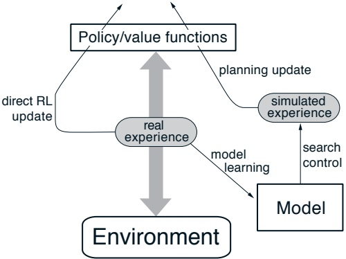

Figure 8.3: The general Dyna Architecture

one example, is shown in Figure 8.3. The central column represents the basic interaction between agent and environment, giving rise to a trajectory of real experience. The arrow on the left of the figure represents direct reinforcement learning operating on real experience to improve the value function and the policy. On the right are model-based processes. The model is learned from real experience and gives rise to simulated experience. We use the term search control to refer to the process that selects the starting states and actions for the simulated experiences generated by the model. Finally, planning is achieved by applying reinforcement learning methods to the simulated experiences just as if they had really happened. Typically, as in Dyna-Q, the same reinforcement learning method is used both for learning from real experience and for planning from simulated experience. The reinforcement learning method is thus the “final common path” for both learning and planning. Learning and planning are deeply integrated in the sense that they share almost all the same machinery, differing only in the source of their experience.

Conceptually, planning, acting, model-learning, and direct RL occur simultaneously and in parallel in Dyna agents. For concreteness and implementation on a serial computer, however, we fully specify the order in which they occur within a time step. In Dyna-Q, the acting, model-learning, and direct RL processes require little computation, and we assume they consume just a fraction of the time. The remaining time in each step can be devoted to the planning process, which is inherently computation-intensive. Let us assume that there is time in each step, after acting, model-learning, and direct RL, to complete n iterations (Steps 1–3) of the Q-planning algorithm. Figure 8.4 shows the complete algorithm for Dyna-Q.

---

Initialize  $Q(s, a)$ and  $Model(s, a)$ for all  $s \in S$ and  $a \in A(s)$
Do forever:
(a)  $S \leftarrow$ current (nonterminal) state
(b)  $A \leftarrow \epsilon$-greedy( $S, Q$)
(c) Execute action A; observe resultant reward, R, and state,  $S'$
(d)  $Q(S, A) \leftarrow Q(S, A) + \alpha [R + \gamma \max_a Q(S', a) - Q(S, A)]$
(e)  $Model(S, A) \leftarrow R, S'$ (assuming deterministic environment)
(f) Repeat n times:
 $S \leftarrow$ random previously observed state
 $A \leftarrow$ random action previously taken in  $S$
 $R, S'$  $\leftarrow$  $Model(S, A)$
 $Q(S, A) \leftarrow Q(S, A) + \alpha [R + \gamma \max_a Q(S', a) - Q(S, A)]$

Figure 8.4: Dyna-Q Algorithm. Model(s, a) denotes the contents of the model (predicted next state and reward) for state-action pair s, a. Direct reinforcement learning, model-learning, and planning are implemented by steps (d), (e), and (f), respectively. If (e) and (f) were omitted, the remaining algorithm would be one-step tabular Q-learning.

Example 8.1: Dyna Maze Consider the simple maze shown inset in Figure 8.5. In each of the 47 states there are four actions, up, down, right, and left, which take the agent deterministically to the corresponding neighboring states, except when movement is blocked by an obstacle or the edge of the maze, in which case the agent remains where it is. Reward is zero on all transitions, except those into the goal state, on which it is +1. After reaching the goal state (G), the agent returns to the start state (S) to begin a new episode. This is a discounted, episodic task with  $\gamma = 0.95$.

The main part of Figure 8.5 shows average learning curves from an experiment in which Dyna-Q agents were applied to the maze task. The initial action values were zero, the step-size parameter was  $\alpha = 0.1$, and the exploration parameter was  $\epsilon = 0.1$. When selecting greedily among actions, ties were broken randomly. The agents varied in the number of planning steps, n, they performed per real step. For each n, the curves show the number of steps taken by the agent in each episode, averaged over 30 repetitions of the experiment. In each repetition, the initial seed for the random number generator was held constant across algorithms. Because of this, the first episode was exactly the same (about 1700 steps) for all values of n, and its data are not shown in the figure. After the first episode, performance improved for all values of n, but much more rapidly for larger values. Recall that the n = 0 agent is a nonplanning agent, utilizing only direct reinforcement learning (one-step tabular Q-learning). This was by far the slowest agent on this problem, despite the fact that the parameter values ( $\alpha$ and  $\varepsilon$) were optimized for it.

---

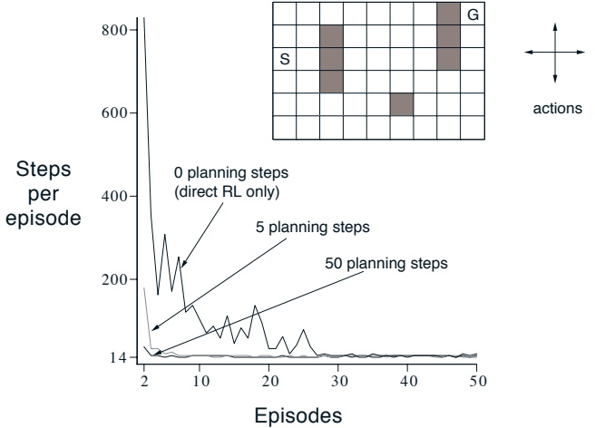

Figure 8.5: A simple maze (inset) and the average learning curves for Dyna-Q agents varying in their number of planning steps  $(n)$ per real step. The task is to travel from S to G as quickly as possible.

nonplanning agent took about 25 episodes to reach ( $\varepsilon$-)optimal performance, whereas the n = 5 agent took about five episodes, and the n = 50 agent took only three episodes.

Figure 8.6 shows why the planning agents found the solution so much faster than the nonplanning agent. Shown are the policies found by the n = 0 and n = 50 agents halfway through the second episode. Without planning (n = 0), each episode adds only one additional step to the policy, and so only one step (the last) has been learned so far. With planning, again only one step is learned during the first episode, but here during the second episode an extensive policy has been developed that by the episode's end will reach almost back to the start state. This policy is built by the planning process while the agent is still wandering near the start state. By the end of the third episode a complete optimal policy will have been found and perfect performance attained.

In Dyna-Q, learning and planning are accomplished by exactly the same algorithm, operating on real experience for learning and on simulated experience for planning. Because planning proceeds incrementally, it is trivial to intermix planning and acting. Both proceed as fast as they can. The agent is always reactive and always deliberative, responding instantly to the latest sensory information and yet always planning in the background. Also ongoing in the

---

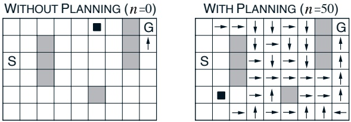

Figure 8.6: Policies found by planning and nonplanning Dyna-Q agents halfway through the second episode. The arrows indicate the greedy action in each state; no arrow is shown for a state if all of its action values are equal. The black square indicates the location of the agent.

background is the model-learning process. As new information is gained, the model is updated to better match reality. As the model changes, the ongoing planning process will gradually compute a different way of behaving to match the new model.

## 8.3 When the Model Is Wrong

In the maze example presented in the previous section, the changes in the model were relatively modest. The model started out empty, and was then filled only with exactly correct information. In general, we cannot expect to be so fortunate. Models may be incorrect because the environment is stochastic and only a limited number of samples have been observed, because the model was learned using function approximation that has generalized imperfectly, or simply because the environment has changed and its new behavior has not yet been observed. When the model is incorrect, the planning process will compute a suboptimal policy.

In some cases, the suboptimal policy computed by planning quickly leads to the discovery and correction of the modeling error. This tends to happen when the model is optimistic in the sense of predicting greater reward or better state transitions than are actually possible. The planned policy attempts to exploit these opportunities and in doing so discovers that they do not exist.

Example 8.2: Blocking Maze A maze example illustrating this relatively minor kind of modeling error and recovery from it is shown in Figure 8.7. Initially, there is a short path from start to goal, to the right of the barrier, as shown in the upper left of the figure. After 1000 time steps, the short path is “blocked,” and a longer path is opened up along the left-hand side of

---

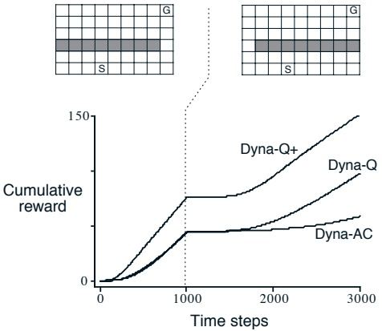

Figure 8.7: Average performance of Dyna agents on a blocking task. The left environment was used for the first 1000 steps, the right environment for the rest. Dyna-Q+ is Dyna-Q with an exploration bonus that encourages exploration. Dyna-AC is a Dyna agent that uses an actor-critic learning method instead of Q-learning.

the barrier, as shown in upper right of the figure. The graph shows average cumulative reward for Dyna-Q and two other Dyna agents. The first part of the graph shows that all three Dyna agents found the short path within 1000 steps. When the environment changed, the graphs become flat, indicating a period during which the agents obtained no reward because they were wandering around behind the barrier. After a while, however, they were able to find the new opening and the new optimal behavior.

Greater difficulties arise when the environment changes to become better than it was before, and yet the formerly correct policy does not reveal the improvement. In these cases the modeling error may not be detected for a long time, if ever, as we see in the next example.

Example 8.3: Shortcut Maze The problem caused by this kind of environmental change is illustrated by the maze example shown in Figure 8.8. Initially, the optimal path is to go around the left side of the barrier (upper left). After 3000 steps, however, a shorter path is opened up along the right side, without disturbing the longer path (upper right). The graph shows that two of the three Dyna agents never switched to the shortcut. In fact, they never realized that it existed. Their models said that there was no shortcut, so the more they planned, the less likely they were to step to the right.

---

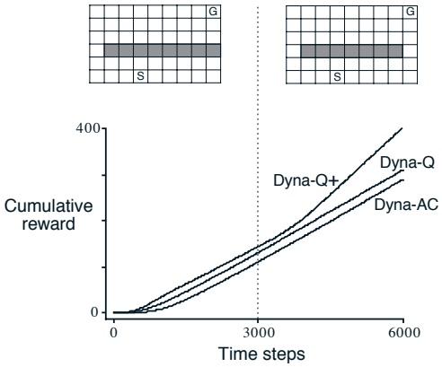

Figure 8.8: Average performance of Dyna agents on a shortcut task. The left environment was used for the first 3000 steps, the right environment for the rest.

and discover it. Even with an  $\varepsilon$-greedy policy, it is very unlikely that an agent will take so many exploratory actions as to discover the shortcut.

The general problem here is another version of the conflict between exploration and exploitation. In a planning context, exploration means trying actions that improve the model, whereas exploitation means behaving in the optimal way given the current model. We want the agent to explore to find changes in the environment, but not so much that performance is greatly degraded. As in the earlier exploration/exploitation conflict, there probably is no solution that is both perfect and practical, but simple heuristics are often effective.

The Dyna-Q+ agent that did solve the shortcut maze uses one such heuristic. This agent keeps track for each state-action pair of how many time steps have elapsed since the pair was last tried in a real interaction with the environment. The more time that has elapsed, the greater (we might presume) the chance that the dynamics of this pair has changed and that the model of it is incorrect. To encourage behavior that tests long-untried actions, a special “bonus reward” is given on simulated experiences involving these actions. In particular, if the modeled reward for a transition is R, and the transition has not been tried in τ time steps, then planning backups are done as if that transition produced a reward of  $R + \kappa \sqrt{\tau}$, for some small  $\kappa$. This encourages the agent to keep testing all accessible state transitions and even to plan

---

long sequences of actions in order to carry out such tests. $^{1}$ Of course all this testing has its cost, but in many cases, as in the shortcut maze, this kind of computational curiosity is well worth the extra exploration.

## 8.4 Prioritized Sweeping

In the Dyna agents presented in the preceding sections, simulated transitions are started in state-action pairs selected uniformly at random from all previously experienced pairs. But a uniform selection is usually not the best; planning can be much more efficient if simulated transitions and backups are focused on particular state-action pairs. For example, consider what happens during the second episode of the first maze task (Figure 8.6). At the beginning of the second episode, only the state-action pair leading directly into the goal has a positive value; the values of all other pairs are still zero. This means that it is pointless to back up along almost all transitions, because they take the agent from one zero-valued state to another, and thus the backups would have no effect. Only a backup along a transition into the state just prior to the goal, or from it into the goal, will change any values. If simulated transitions are generated uniformly, then many wasteful backups will be made before stumbling onto one of the two useful ones. As planning progresses, the region of useful backups grows, but planning is still far less efficient than it would be if focused where it would do the most good. In the much larger problems that are our real objective, the number of states is so large that an unfocused search would be extremely inefficient.

This example suggests that search might be usefully focused by working backward from goal states. Of course, we do not really want to use any methods specific to the idea of “goal state.” We want methods that work for general reward functions. Goal states are just a special case, convenient for stimulating intuition. In general, we want to work back not just from goal states but from any state whose value has changed. Assume that the values are initially correct given the model, as they were in the maze example prior to discovering the goal. Suppose now that the agent discovers a change in the environment and changes its estimated value of one state. Typically, this will imply that the values of many other states should also be changed, but the only useful one-step backups are those of actions that lead directly into the one state whose value has already been changed. If the values of these actions are updated,

---

then the values of the predecessor states may change in turn. If so, then actions leading into them need to be backed up, and then their predecessor states may have changed. In this way one can work backward from arbitrary states that have changed in value, either performing useful backups or terminating the propagation.

As the frontier of useful backups propagates backward, it often grows rapidly, producing many state-action pairs that could usefully be backed up. But not all of these will be equally useful. The values of some states may have changed a lot, whereas others have changed little. The predecessor pairs of those that have changed a lot are more likely to also change a lot. In a stochastic environment, variations in estimated transition probabilities also contribute to variations in the sizes of changes and in the urgency with which pairs need to be backed up. It is natural to prioritize the backups according to a measure of their urgency, and perform them in order of priority. This is the idea behind prioritized sweeping. A queue is maintained of every state-action pair whose estimated value would change nontrivially if backed up, prioritized by the size of the change. When the top pair in the queue is backed up, the effect on each of its predecessor pairs is computed. If the effect is greater than some small threshold, then the pair is inserted in the queue with the new priority (if there is a previous entry of the pair in the queue, then insertion results in only the higher priority entry remaining in the queue). In this way the effects of changes are efficiently propagated backward until quiescence. The full algorithm for the case of deterministic environments is given in Figure 8.9.

Example 8.4: Prioritized Sweeping on Mazes Prioritized sweeping has been found to dramatically increase the speed at which optimal solutions are found in maze tasks, often by a factor of 5 to 10. A typical example is shown in Figure 8.10. These data are for a sequence of maze tasks of exactly the same structure as the one shown in Figure 8.5, except that they vary in the grid resolution. Prioritized sweeping maintained a decisive advantage over unprioritized Dyna-Q. Both systems made at most n = 5 backups per environmental interaction.

Example 8.5: Rod Maneuvering The objective in this task is to maneuver a rod around some awkwardly placed obstacles to a goal position in the fewest number of steps (Figure 8.11). The rod can be translated along its long axis or perpendicular to that axis, or it can be rotated in either direction around its center. The distance of each movement is approximately 1/20 of the work space, and the rotation increment is 10 degrees. Translations are deterministic and quantized to one of  $20 \times 20$ positions. The figure shows the obstacles and the shortest solution from start to goal, found by prioritized sweeping. This problem is still deterministic, but has four actions and 14,400 potential states (some of these are unreachable because of the obstacles). This problem is

---

Initialize  $Q(s, a)$, Model $(s, a)$, for all  $s, a$, and PQueue to empty
Do forever:
(a)  $S \leftarrow$ current (nonterminal) state
(b)  $A \leftarrow policy(S, Q)$
(c) Execute action A; observe resultant reward, R, and state,  $S'$
(d) Model $(S, A) \leftarrow R, S'$
(e)  $P \leftarrow |R + \gamma \max_a Q(S', a) - Q(S, A)|$.
(f) if  $P > \theta$, then insert S, A into PQueue with priority P
(g) Repeat n times, while PQueue is not empty:
 $S, A \leftarrow first(PQueue)$
 $R, S' \leftarrow Model(S, A)$
 $Q(S, A) \leftarrow Q(S, A) + \alpha \left[ R + \gamma \max_a Q(S', a) - Q(S, A) \right]$
Repeat, for all  $\bar{S}, \bar{A}$ predicted to lead to S:
 $\bar{R} \leftarrow$ predicted reward for  $\bar{S}, \bar{A}, S$
 $P \leftarrow |\bar{R} + \gamma \max_a Q(S, a) - Q(\bar{S}, \bar{A})|$.
if  $P > \theta$ then insert  $\bar{S}, \bar{A}$ into PQueue with priority P

Figure 8.9: The prioritized sweeping algorithm for a deterministic environment.

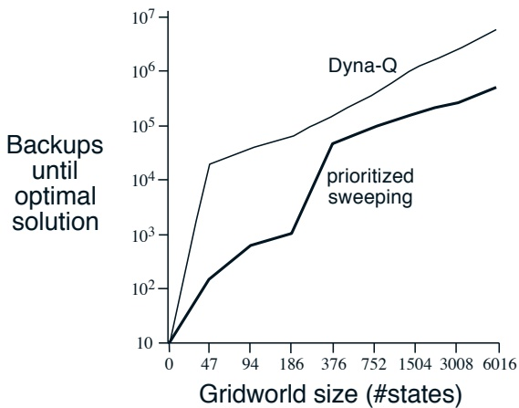

Figure 8.10: Prioritized sweeping significantly shortens learning time on the Dyna maze task for a wide range of grid resolutions. Reprinted from Peng and Williams (1993).

---

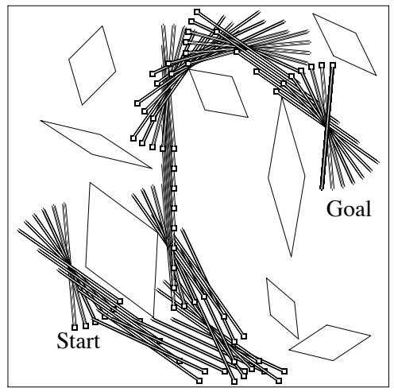

Figure 8.11: A rod-maneuvering task and its solution by prioritized sweeping. Reprinted from Moore and Atkeson (1993).

probably too large to be solved with unprioritized methods.

Prioritized sweeping is clearly a powerful idea, but the algorithms that have been developed so far appear not to extend easily to more interesting cases. The greatest problem is that the algorithms appear to rely on the assumption of discrete states. When a change occurs at one state, these methods perform a computation on all the predecessor states that may have been affected. If function approximation is used to learn the model or the value function, then a single backup could influence a great many other states. It is not apparent how these states could be identified or processed efficiently. On the other hand, the general idea of focusing search on the states believed to have changed in value, and then on their predecessors, seems intuitively to be valid in general. Additional research may produce more general versions of prioritized sweeping.

Extensions of prioritized sweeping to stochastic environments are relatively straightforward. The model is maintained by keeping counts of the number of times each state-action pair has been experienced and of what the next states were. It is natural then to backup each pair not with a sample backup, as we have been using so far, but with a full backup, taking into account all possible next states and their probabilities of occurring.

---

## 8.5 Full vs. Sample Backups

The examples in the previous sections give some idea of the range of possibilities for combining methods of learning and planning. In the rest of this chapter, we analyze some of the component ideas involved, starting with the relative advantages of full and sample backups.

Much of this book has been about different kinds of backups, and we have considered a great many varieties. Focusing for the moment on one-step backups, they vary primarily along three binary dimensions. The first two dimensions are whether they back up state values or action values and whether they estimate the value for the optimal policy or for an arbitrary given policy. These two dimensions give rise to four classes of backups for approximating the four value functions,  $q_{*}$,  $v_{*}$,  $q_{\pi}$, and  $v_{\pi}$. The other binary dimension is whether the backups are full backups, considering all possible events that might happen, or sample backups, considering a single sample of what might happen. These three binary dimensions give rise to eight cases, seven of which correspond to specific algorithms, as shown in Figure 8.12. (The eighth case does not seem to correspond to any useful backup.) Any of these one-step backups can be used in planning methods. The Dyna-Q agents discussed earlier use  $q_{*}$ sample backups, but they could just as well use  $q_{*}$ full backups, or either full or sample  $q_{\pi}$ backups. The Dyna-AC system uses  $v_{\pi}$ sample backups together with a learning policy structure. For stochastic problems, prioritized sweeping is always done using one of the full backups.

When we introduced one-step sample backups in Chapter 6, we presented them as substitutes for full backups. In the absence of a distribution model, full backups are not possible, but sample backups can be done using sample transitions from the environment or a sample model. Implicit in that point of view is that full backups, if possible, are preferable to sample backups. But are they? Full backups certainly yield a better estimate because they are uncorrupted by sampling error, but they also require more computation, and computation is often the limiting resource in planning. To properly assess the relative merits of full and sample backups for planning we must control for their different computational requirements.

For concreteness, consider the full and sample backups for approximating  $q_*$, and the special case of discrete states and actions, a table-lookup representation of the approximate value function, Q, and a model in the form of estimated dynamics,  $\hat{p}(s', r|s, a)$. The full backup for a state-action pair, s, a, is:

$$
Q(s,a)\leftarrow\sum_{s^{\prime},r}\hat{p}(s^{\prime},r|s,a)\Big[r+\gamma\max_{a^{\prime}}Q(s^{\prime},a^{\prime})\Big].   \tag*{(8.1)}
$$

---

Value estimated

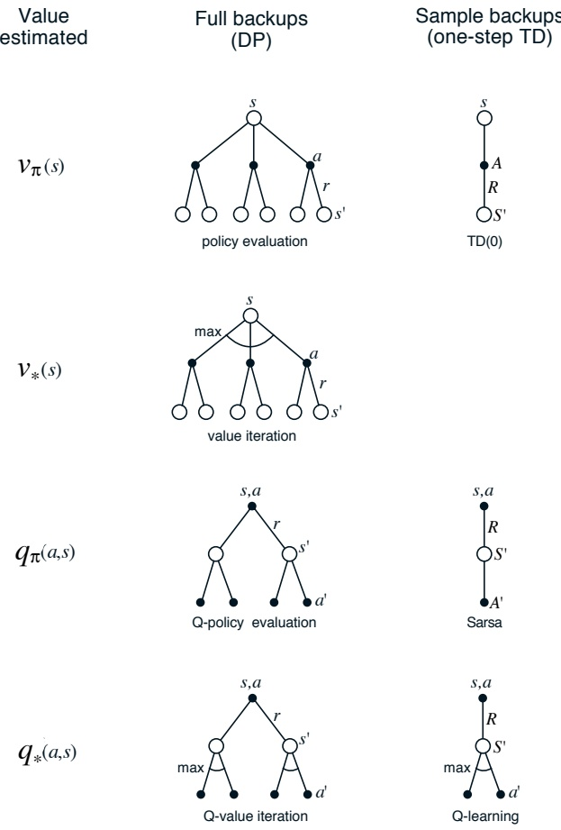

Figure 8.12: The one-step backups.

---

The corresponding sample backup for s, a, given a sample next state and reward,  $S'$ and R (from the model), is the Q-learning-like update:

$$
Q(s,a)\leftarrow Q(s,a)+\alpha\Big[R+\gamma\max_{a^{\prime}}Q(S^{\prime},a^{\prime})-Q(s,a)\Big],   \tag*{(8.2)}
$$

where  $\alpha$ is the usual positive step-size parameter.

The difference between these full and sample backups is significant to the extent that the environment is stochastic, specifically, to the extent that, given a state and action, many possible next states may occur with various probabilities. If only one next state is possible, then the full and sample backups given above are identical (taking  $\alpha = 1$). If there are many possible next states, then there may be significant differences. In favor of the full backup is that it is an exact computation, resulting in a new  $Q(s, a)$ whose correctness is limited only by the correctness of the  $Q(s', a')$ at successor states. The sample backup is in addition affected by sampling error. On the other hand, the sample backup is cheaper computationally because it considers only one next state, not all possible next states. In practice, the computation required by backup operations is usually dominated by the number of state-action pairs at which Q is evaluated. For a particular starting pair, s, a, let b be the branching factor (i.e., the number of possible next states,  $s'$, for which  $\hat{p}(s' | s, a) > 0$). Then a full backup of this pair requires roughly b times as much computation as a sample backup.

If there is enough time to complete a full backup, then the resulting estimate is generally better than that of b sample backups because of the absence of sampling error. But if there is insufficient time to complete a full backup, then sample backups are always preferable because they at least make some improvement in the value estimate with fewer than b backups. In a large problem with many state-action pairs, we are often in the latter situation. With so many state-action pairs, full backups of all of them would take a very long time. Before that we may be much better off with a few sample backups at many state-action pairs than with full backups at a few pairs. Given a unit of computational effort, is it better devoted to a few full backups or to b times as many sample backups?

Figure 8.13 shows the results of an analysis that suggests an answer to this question. It shows the estimation error as a function of computation time for full and sample backups for a variety of branching factors, b. The case considered is that in which all b successor states are equally likely and in which the error in the initial estimate is 1. The values at the next states are assumed correct, so the full backup reduces the error to zero upon its completion. In this case, sample backups reduce the error according to  $\sqrt{\frac{b-1}{bt}}$ where t is the number of sample backups that have been performed (assuming

---

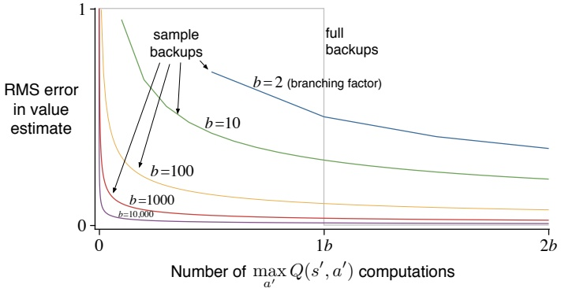

Figure 8.13: Comparison of efficiency of full and sample backups.

sample averages, i.e.,  $\alpha = 1/t$. The key observation is that for moderately large b the error falls dramatically with a tiny fraction of b backups. For these cases, many state-action pairs could have their values improved dramatically, to within a few percent of the effect of a full backup, in the same time that one state-action pair could be backed up fully.

The advantage of sample backups shown in Figure 8.13 is probably an underestimate of the real effect. In a real problem, the values of the successor states would themselves be estimates updated by backups. By causing estimates to be more accurate sooner, sample backups will have a second advantage in that the values backed up from the successor states will be more accurate. These results suggest that sample backups are likely to be superior to full backups on problems with large stochastic branching factors and too many states to be solved exactly.

## 8.6 Trajectory Sampling

In this section we compare two ways of distributing backups. The classical approach, from dynamic programming, is to perform sweeps through the entire state (or state-action) space, backing up each state (or state-action pair) once per sweep. This is problematic on large tasks because there may not be time to complete even one sweep. In many tasks the vast majority of the states are irrelevant because they are visited only under very poor policies or with very low probability. Exhaustive sweeps implicitly devote equal time to all parts

---

of the state space rather than focusing where it is needed. As we discussed in Chapter 4, exhaustive sweeps and the equal treatment of all states that they imply are not necessary properties of dynamic programming. In principle, backups can be distributed any way one likes (to assure convergence, all states or state-action pairs must be visited in the limit an infinite number of times), but in practice exhaustive sweeps are often used.

The second approach is to sample from the state or state-action space according to some distribution. One could sample uniformly, as in the Dyna-Q agent, but this would suffer from some of the same problems as exhaustive sweeps. More appealing is to distribute backups according to the on-policy distribution, that is, according to the distribution observed when following the current policy. One advantage of this distribution is that it is easily generated; one simply interacts with the model, following the current policy. In an episodic task, one starts in the start state (or according to the starting-state distribution) and simulates until the terminal state. In a continuing task, one starts anywhere and just keeps simulating. In either case, sample state transitions and rewards are given by the model, and sample actions are given by the current policy. In other words, one simulates explicit individual trajectories and performs backups at the state or state-action pairs encountered along the way. We call this way of generating experience and backups trajectory sampling.

It is hard to imagine any efficient way of distributing backups according to the on-policy distribution other than by trajectory sampling. If one had an explicit representation of the on-policy distribution, then one could sweep through all states, weighting the backup of each according to the on-policy distribution, but this leaves us again with all the computational costs of exhaustive sweeps. Possibly one could sample and update individual state-action pairs from the distribution, but even if this could be done efficiently, what benefit would this provide over simulating trajectories? Even knowing the on-policy distribution in an explicit form is unlikely. The distribution changes whenever the policy changes, and computing the distribution requires computation comparable to a complete policy evaluation. Consideration of such other possibilities makes trajectory sampling seem both efficient and elegant.

Is the on-policy distribution of backups a good one? Intuitively it seems like a good choice, at least better than the uniform distribution. For example, if you are learning to play chess, you study positions that might arise in real games, not random positions of chess pieces. The latter may be valid states, but to be able to accurately value them is a different skill from evaluating positions in real games. We will also see in Chapter 9 that the on-policy distribution has significant advantages when function approximation is used. Whether or not function approximation is used, one might expect on-policy

---

focusing to significantly improve the speed of planning.

Focusing on the on-policy distribution could be beneficial because it causes vast, uninteresting parts of the space to be ignored, or it could be detrimental because it causes the same old parts of the space to be backed up over and over. We conducted a small experiment to assess the effect empirically. To isolate the effect of the backup distribution, we used entirely one-step full tabular backups, as defined by (8.1). In the uniform case, we cycled through all state-action pairs, backing up each in place, and in the on-policy case we simulated episodes, backing up each state-action pair that occurred under the current  $\epsilon$-greedy policy ( $\epsilon = 0.1$). The tasks were undiscounted episodic tasks, generated randomly as follows. From each of the  $|\mathcal{S}|$ states, two actions were possible, each of which resulted in one of  $b$ next states, all equally likely, with a different random selection of  $b$ states for each state-action pair. The branching factor,  $b$, was the same for all state-action pairs. In addition, on all transitions there was a 0.1 probability of transition to the terminal state, ending the episode. We used episodic tasks to get a clear measure of the quality of the current policy. At any point in the planning process one can stop and exhaustively compute  $v_{\pi}(s_0)$, the true value of the start state under the greedy policy,  $\tilde{\pi}$, given the current action-value function  $Q$, as an indication of how well the agent would do on a new episode on which it acted greedily (all the while assuming the model is correct).

The upper part of Figure 8.14 shows results averaged over 200 sample tasks with 1000 states and branching factors of 1, 3, and 10. The quality of the policies found is plotted as a function of the number of full backups completed. In all cases, sampling according to the on-policy distribution resulted in faster planning initially and retarded planning in the long run. The effect was stronger, and the initial period of faster planning was longer, at smaller branching factors. In other experiments, we found that these effects also became stronger as the number of states increased. For example, the lower part of Figure 8.14 shows results for a branching factor of 1 for tasks with 10,000 states. In this case the advantage of on-policy focusing is large and long-lasting.

All of these results make sense. In the short term, sampling according to the on-policy distribution helps by focusing on states that are near descendants of the start state. If there are many states and a small branching factor, this effect will be large and long-lasting. In the long run, focusing on the on-policy distribution may hurt because the commonly occurring states all already have their correct values. Sampling them is useless, whereas sampling other states may actually perform some useful work. This presumably is why the exhaustive, unfocused approach does better in the long run, at least for small problems. These results are not conclusive because they are only for

---

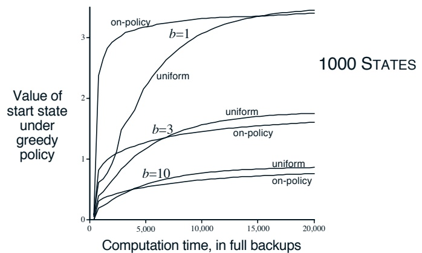

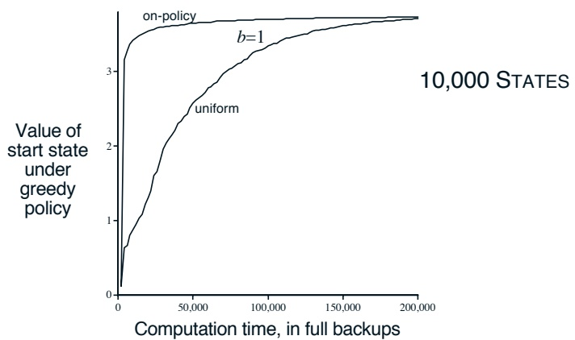

Figure 8.14: Relative efficiency of backups distributed uniformly across the state space versus focused on simulated on-policy trajectories. Results are for randomly generated tasks of two sizes and various branching factors, b.

---

problems generated in a particular, random way, but they do suggest that sampling according to the on-policy distribution can be a great advantage for large problems, in particular for problems in which a small subset of the state-action space is visited under the on-policy distribution.

## 8.7 Heuristic Search

The predominant state-space planning methods in artificial intelligence are collectively known as heuristic search. Although superficially different from the planning methods we have discussed so far in this chapter, heuristic search and some of its component ideas can be combined with these methods in useful ways. Unlike these methods, heuristic search is not concerned with changing the approximate, or “heuristic,” value function, but only with making improved action selections given the current value function. In other words, heuristic search is planning as part of a policy computation.

In heuristic search, for each state encountered, a large tree of possible continuations is considered. The approximate value function is applied to the leaf nodes and then backed up toward the current state at the root. The backing up within the search tree is just the same as in the max-backups (those for  $v_{*}$ and  $q_{*}$) discussed throughout this book. The backing up stops at the state-action nodes for the current state. Once the backed-up values of these nodes are computed, the best of them is chosen as the current action, and then all backed-up values are discarded.

In conventional heuristic search no effort is made to save the backed-up values by changing the approximate value function. In fact, the value function is generally designed by people and never changed as a result of search. However, it is natural to consider allowing the value function to be improved over time, using either the backed-up values computed during heuristic search or any of the other methods presented throughout this book. In a sense we have taken this approach all along. Our greedy and  $\varepsilon$-greedy action-selection methods are not unlike heuristic search, albeit on a smaller scale. For example, to compute the greedy action given a model and a state-value function, we must look ahead from each possible action to each possible next state, backup the rewards and estimated values, and then pick the best action. Just as in conventional heuristic search, this process computes backed-up values of the possible actions, but does not attempt to save them. Thus, heuristic search can be viewed as an extension of the idea of a greedy policy beyond a single step.

The point of searching deeper than one step is to obtain better action

---

selections. If one has a perfect model and an imperfect action-value function, then in fact deeper search will usually yield better policies. $^{2}$ Certainly, if the search is all the way to the end of the episode, then the effect of the imperfect value function is eliminated, and the action determined in this way must be optimal. If the search is of sufficient depth  $k$ such that  $\gamma^k$ is very small, then the actions will be correspondingly near optimal. On the other hand, the deeper the search, the more computation is required, usually resulting in a slower response time. A good example is provided by Tesauro's grandmaster-level backgammon player, TD-Gammon (Section 15.1). This system used TD( $\lambda$) to learn an afterstate value function through many games of self-play, using a form of heuristic search to make its moves. As a model, TD-Gammon used a priori knowledge of the probabilities of dice rolls and the assumption that the opponent always selected the actions that TD-Gammon rated as best for it. Tesauro found that the deeper the heuristic search, the better the moves made by TD-Gammon, but the longer it took to make each move. Backgammon has a large branching factor, yet moves must be made within a few seconds. It was only feasible to search ahead selectively a few steps, but even so the search resulted in significantly better action selections.

So far we have emphasized heuristic search as an action-selection technique, but this may not be its most important aspect. Heuristic search also suggests ways of selectively distributing backups that may lead to better and faster approximation of the optimal value function. A great deal of research on heuristic search has been devoted to making the search as efficient as possible. The search tree is grown selectively, deeper along some lines and shallower along others. For example, the search tree is often deeper for the actions that seem most likely to be best, and shallower for those that the agent will probably not want to take anyway. Can we use a similar idea to improve the distribution of backups? Perhaps it can be done by preferentially updating state-action pairs whose values appear to be close to the maximum available from the state. To our knowledge, this and other possibilities for distributing backups based on ideas borrowed from heuristic search have not yet been explored.

We should not overlook the most obvious way in which heuristic search focuses backups: on the current state. Much of the effectiveness of heuristic search is due to its search tree being tightly focused on the states and actions that might immediately follow the current state. You may spend more of your life playing chess than checkers, but when you play checkers, it pays to think about checkers and about your particular checkers position, your likely next moves, and successor positions. However you select actions, it is these states and actions that are of highest priority for backups and where you

---

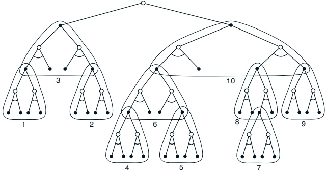

Figure 8.15: The deep backups of heuristic search can be implemented as a sequence of one-step backups (shown here outlined). The ordering shown is for a selective depth-first search.

most urgently want your approximate value function to be accurate. Not only should your computation be preferentially devoted to imminent events, but so should your limited memory resources. In chess, for example, there are far too many possible positions to store distinct value estimates for each of them, but chess programs based on heuristic search can easily store distinct estimates for the millions of positions they encounter looking ahead from a single position. This great focusing of memory and computational resources on the current decision is presumably the reason why heuristic search can be so effective.

The distribution of backups can be altered in similar ways to focus on the current state and its likely successors. As a limiting case we might use exactly the methods of heuristic search to construct a search tree, and then perform the individual, one-step backups from bottom up, as suggested by Figure 8.15. If the backups are ordered in this way and a table-lookup representation is used, then exactly the same backup would be achieved as in heuristic search. Any state-space search can be viewed in this way as the piecing together of a large number of individual one-step backups. Thus, the performance improvement observed with deeper searches is not due to the use of multistep backups as such. Instead, it is due to the focus and concentration of backups on states and actions immediately downstream from the current state. By devoting a large amount of computation specifically relevant to the candidate actions, a much better decision can be made than by relying on unfocused backups.

---

## 8.8 Monte Carlo Tree Search

## 8.9 Summary

We have presented a perspective emphasizing the surprisingly close relationships between planning optimal behavior and learning optimal behavior. Both involve estimating the same value functions, and in both cases it is natural to update the estimates incrementally, in a long series of small backup operations. This makes it straightforward to integrate learning and planning processes simply by allowing both to update the same estimated value function. In addition, any of the learning methods can be converted into planning methods simply by applying them to simulated (model-generated) experience rather than to real experience. In this case learning and planning become even more similar; they are possibly identical algorithms operating on two different sources of experience.

It is straightforward to integrate incremental planning methods with acting and model-learning. Planning, acting, and model-learning interact in a circular fashion (Figure 8.2), each producing what the other needs to improve; no other interaction among them is either required or prohibited. The most natural approach is for all processes to proceed asynchronously and in parallel. If the processes must share computational resources, then the division can be handled almost arbitrarily—by whatever organization is most convenient and efficient for the task at hand.

In this chapter we have touched upon a number of dimensions of variation among state-space planning methods. One of the most important of these is the distribution of backups, that is, of the focus of search. Prioritized sweeping focuses on the predecessors of states whose values have recently changed. Heuristic search applied to reinforcement learning focuses, inter alia, on the successors of the current state. Trajectory sampling is a convenient way of focusing on the on-policy distribution. All of these approaches can significantly speed planning and are current topics of research.

Another interesting dimension of variation is the size of backups. The smaller the backups, the more incremental the planning methods can be. Among the smallest backups are one-step sample backups. We presented one study suggesting that one-step sample backups may be preferable on very large problems. A related issue is the depth of backups. In many cases deep backups can be implemented as sequences of shallow backups.

---

#### Bibliographical and Historical Remarks

8.1 The overall view of planning and learning presented here has developed gradually over a number of years, in part by the authors (Sutton, 1990, 1991a, 1991b; Barto, Bradtke, and Singh, 1991, 1995; Sutton and Pinette, 1985; Sutton and Barto, 1981b); it has been strongly influenced by Agre and Chapman (1990; Agre 1988), Bertsekas and Tsitsiklis (1989), Singh (1993), and others. The authors were also strongly influenced by psychological studies of latent learning (Tolman, 1932) and by psychological views of the nature of thought (e.g., Galanter and Gerstenhaber, 1956; Craik, 1943; Campbell, 1960; Dennett, 1978).

8.2–3 The terms direct and indirect, which we use to describe different kinds of reinforcement learning, are from the adaptive control literature (e.g., Goodwin and Sin, 1984), where they are used to make the same kind of distinction. The term system identification is used in adaptive control for what we call model-learning (e.g., Goodwin and Sin, 1984; Ljung and Söderstrom, 1983; Young, 1984). The Dyna architecture is due to Sutton (1990), and the results in these sections are based on results reported there.

8.4 Prioritized sweeping was developed simultaneously and independently by Moore and Atkeson (1993) and Peng and Williams (1993). The results in Figure 8.10 are due to Peng and Williams (1993). The results in Figure 8.11 are due to Moore and Atkeson.

8.5 This section was strongly influenced by the experiments of Singh (1993).

8.7 For further reading on heuristic search, the reader is encouraged to consult texts and surveys such as those by Russell and Norvig (2009) and Korf (1988). Peng and Williams (1993) explored a forward focusing of backups much as is suggested in this section.

#### Exercises

Exercise 8.1 There is no Exercise 8.1.

Exercise 8.2 Why did the Dyna agent with exploration bonus, Dyna-Q+, perform better in the first phase as well as in the second phase of the blocking and shortcut experiments?

---

Exercise 8.3 Careful inspection of Figure 8.8 reveals that the difference between Dyna-Q+ and Dyna-Q narrowed slightly over the first part of the experiment. What is the reason for this?

Exercise 8.4 (programming) The exploration bonus described above actually changes the estimated values of states and actions. Is this necessary? Suppose the bonus  $\kappa\sqrt{\tau}$ was used not in backups, but solely in action selection. That is, suppose the action selected was always that for which  $Q(S, a) + \kappa\sqrt{\tau_{Sa}}$ was maximal. Carry out a gridworld experiment that tests and illustrates the strengths and weaknesses of this alternate approach.

Exercise 8.5 The analysis above assumed that all of the b possible next states were equally likely to occur. Suppose instead that the distribution was highly skewed, that some of the b states were much more likely to occur than most. Would this strengthen or weaken the case for sample backups over full backups? Support your answer.

Exercise 8.6 Some of the graphs in Figure 8.14 seem to be scalloped in their early portions, particularly the upper graph for b = 1 and the uniform distribution. Why do you think this is? What aspects of the data shown support your hypothesis?

Exercise 8.7 (programming) If you have access to a moderately large computer, try replicating the experiment whose results are shown in the lower part of Figure 8.14. Then try the same experiment but with b = 3. Discuss the meaning of your results.

---

Part II

Approximate Solution Methods

---

---

# Chapter 9

# On-policy Approximation of Action Values

We have so far assumed that our estimates of value functions are represented as a table with one entry for each state or for each state-action pair. This is a particularly clear and instructive case, but of course it is limited to tasks with small numbers of states and actions. The problem is not just the memory needed for large tables, but the time and data needed to fill them accurately. In other words, the key issue is that of generalization. How can experience with a limited subset of the state space be usefully generalized to produce a good approximation over a much larger subset?

This is a severe problem. In many tasks to which we would like to apply reinforcement learning, most states encountered will never have been experienced exactly before. This will almost always be the case when the state or action spaces include continuous variables or complex sensations, such as a visual image. The only way to learn anything at all on these tasks is to generalize from previously experienced states to ones that have never been seen.

Fortunately, generalization from examples has already been extensively studied, and we do not need to invent totally new methods for use in reinforcement learning. To a large extent we need only combine reinforcement learning methods with existing generalization methods. The kind of generalization we require is often called function approximation because it takes examples from a desired function (e.g., a value function) and attempts to generalize from them to construct an approximation of the entire function. Function approximation is an instance of supervised learning, the primary topic studied in machine learning, artificial neural networks, pattern recognition, and statistical curve fitting. In principle, any of the methods studied in these fields can be used in

---

reinforcement learning as described in this chapter.

## 9.1 Value Prediction with Function Approximation

As usual, we begin with the prediction problem of estimating the state-value function  $v_{\pi}$ from experience generated using policy  $\pi$. The novelty in this chapter is that the approximate value function is represented not as a table but as a parameterized functional form with parameter vector  $\mathbf{w} \in \mathbb{R}^n$. We will write  $\hat{v}(s, \mathbf{w}) \approx v_{\pi}(s)$ for the approximated value of state  $s$ given weight vector  $\mathbf{w}$. For example,  $\hat{v}$ might be the function computed by an artificial neural network, with  $\mathbf{w}$ the vector of connection weights. By adjusting the weights, any of a wide range of different functions  $\hat{v}$ can be implemented by the network. Or  $\hat{v}$ might be the function computed by a decision tree, where  $\mathbf{w}$ is all the parameters defining the split points and leaf values of the tree. Typically, the number of parameters  $n$ (the number of components of  $\mathbf{w}$) is much less than the number of states, and changing one parameter changes the estimated value of many states. Consequently, when a single state is backed up, the change generalizes from that state to affect the values of many other states.

All of the prediction methods covered in this book have been described as backups, that is, as updates to an estimated value function that shift its value at particular states toward a “backed-up value” for that state. Let us refer to an individual backup by the notation  $s \mapsto v$, where  $s$ is the state backed up and  $v$ is the backed-up value, or target, that  $s$'s estimated value is shifted toward. For example, the Monte Carlo backup for value prediction is  $S_t \mapsto G_t$, the TD(0) backup is  $S_t \mapsto R_{t+1} + \gamma \hat{v}(S_{t+1}, \mathbf{w}_t)$, and the general TD( $\lambda$) backup is  $S_t \mapsto G_t^\lambda$. In the DP policy evaluation backup  $s \mapsto \mathbb{E}_\pi[R_{t+1} + \gamma \hat{v}(S_{t+1}, \mathbf{w}_t) \mid S_t = s]$, an arbitrary state  $s$ is backed up, whereas in the other cases the state,  $S_t$, encountered in (possibly simulated) experience is backed up.

It is natural to interpret each backup as specifying an example of the desired input–output behavior of the estimated value function. In a sense, the backup  $s \mapsto v$ means that the estimated value for state s should be more like v. Up to now, the actual update implementing the backup has been trivial: the table entry for s's estimated value has simply been shifted a fraction of the way toward v. Now we permit arbitrarily complex and sophisticated function approximation methods to implement the backup. The normal inputs to these methods are examples of the desired input–output behavior of the function

---

they are trying to approximate. We use these methods for value prediction simply by passing to them the  $s \mapsto v$ of each backup as a training example. We then interpret the approximate function they produce as an estimated value function.

Viewing each backup as a conventional training example in this way enables us to use any of a wide range of existing function approximation methods for value prediction. In principle, we can use any method for supervised learning from examples, including artificial neural networks, decision trees, and various kinds of multivariate regression. However, not all function approximation methods are equally well suited for use in reinforcement learning. The most sophisticated neural network and statistical methods all assume a static training set over which multiple passes are made. In reinforcement learning, however, it is important that learning be able to occur on-line, while interacting with the environment or with a model of the environment. To do this requires methods that are able to learn efficiently from incrementally acquired data. In addition, reinforcement learning generally requires function approximation methods able to handle nonstationary target functions (target functions that change over time). For example, in GPI control methods we often seek to learn  $q_{\pi}$ while  $\pi$ changes. Even if the policy remains the same, the target values of training examples are nonstationary if they are generated by bootstrapping methods (DP and TD). Methods that cannot easily handle such nonstationarity are less suitable for reinforcement learning.

What performance measures are appropriate for evaluating function approximation methods? Most supervised learning methods seek to minimize the root-mean-squared error (RMSE) over some distribution over the inputs. In our value prediction problem, the inputs are states and the target function is the true value function  $v_{\pi}$, so RMSE for an approximation  $\hat{v}$, using parameter  $\mathbf{w}$, is

$$
\mathrm{RMSE}(\mathbf{w})=\sqrt{\sum_{s\in\mathcal{S}}d(s)\left[v_{\pi}(s)-\hat{v}(s,\mathbf{w})\right]^{2}},   \tag*{(9.1)}
$$

where  $d : \mathcal{S} \to [0,1]$, such that  $\sum_s d(s) = 1$, is a distribution over the states specifying the relative importance of errors in different states. This distribution is important because it is usually not possible to reduce the error to zero at all states. After all, there are generally far more states than there are components to  $\mathbf{w}$. The flexibility of the function approximator is thus a scarce resource. Better approximation at some states can be gained, generally, only at the expense of worse approximation at other states. The distribution specifies how these trade-offs should be made.

The distribution d is also usually the distribution from which the states in the training examples are drawn, and thus the distribution of states at which

---

backups are done. If we wish to minimize error over a certain distribution of states, then it makes sense to train the function approximator with examples from that same distribution. For example, if you want a uniform level of error over the entire state set, then it makes sense to train with backups distributed uniformly over the entire state set, such as in the exhaustive sweeps of some DP methods. Henceforth, let us assume that the distribution of states at which backups are done and the distribution that weights errors, d, are the same.

A distribution of particular interest is the one describing the frequency with which states are encountered while the agent is interacting with the environment and selecting actions according to  $\pi$, the policy whose value function we are approximating. We call this the on-policy distribution, in part because it is the distribution of backups in on-policy control methods. Minimizing error over the on-policy distribution focuses function approximation resources on the states that actually occur while following the policy, ignoring those that never occur. The on-policy distribution is also the one for which it is easiest to get training examples using Monte Carlo or TD methods. These methods generate backups from sample experience using the policy  $\pi$. Because a backup is generated for each state encountered in the experience, the training examples available are naturally distributed according to the on-policy distribution. Stronger convergence results are available for the on-policy distribution than for other distributions, as we discuss later.

It is not completely clear that we should care about minimizing the RMSE. Our goal in value prediction is potentially different because our ultimate purpose is to use the predictions to aid in finding a better policy. The best predictions for that purpose are not necessarily the best for minimizing RMSE. However, it is not yet clear what a more useful alternative goal for value prediction might be. For now, we continue to focus on RMSE.

An ideal goal in terms of RMSE would be to find a global optimum, a parameter vector  $\mathbf{w}^*$ for which RMSE $(\mathbf{w}^*) \leq \text{RMSE}(\mathbf{w})$ for all possible  $\mathbf{w}$. Reaching this goal is sometimes possible for simple function approximators such as linear ones, but is rarely possible for complex function approximators such as artificial neural networks and decision trees. Short of this, complex function approximators may seek to converge instead to a local optimum, a parameter vector  $\mathbf{w}^*$ for which RMSE $(\mathbf{w}^*) \leq \text{RMSE}(\mathbf{w})$ for all  $\mathbf{w}$ in some neighborhood of  $\mathbf{w}^*$. Although this guarantee is only slightly reassuring, it is typically the best that can be said for nonlinear function approximators. For many cases of interest in reinforcement learning, convergence to an optimum, or even all bound of an optimum may still be achieved with some methods. Other methods may in fact diverge, with their RMSE approaching infinity in the limit.

---

In this section we have outlined a framework for combining a wide range of reinforcement learning methods for value prediction with a wide range of function approximation methods, using the backups of the former to generate training examples for the latter. We have also outlined a range of RMSE performance measures to which these methods may aspire. The range of possible methods is far too large to cover all, and anyway too little is known about most of them to make a reliable evaluation or recommendation. Of necessity, we consider only a few possibilities. In the rest of this chapter we focus on function approximation methods based on gradient principles, and on linear gradient-descent methods in particular. We focus on these methods in part because we consider them to be particularly promising and because they reveal key theoretical issues, but also because they are simple and our space is limited. If we had another chapter devoted to function approximation, we would also cover at least memory-based and decision-tree methods.

## 9.2 Gradient-Descent Methods

We now develop in detail one class of learning methods for function approximation in value prediction, those based on gradient descent. Gradient-descent methods are among the most widely used of all function approximation methods and are particularly well suited to online reinforcement learning.

In gradient-descent methods, the parameter vector is a column vector with a fixed number of real valued components,  $\mathbf{w} = (w_1, w_2, \ldots, w_n)^\top$ (the  $\top$ here denotes transpose), and the approximate value function  $\hat{v}(s, \mathbf{w})$ is a smooth differentiable function of  $\mathbf{w}$ for all  $s \in \mathcal{S}$. We will be updating  $\mathbf{w}$ at each of a series of discrete time steps,  $t = 1, 2, 3, \ldots$, so we will need a notation  $\mathbf{w}_t$ for the weight vector at each step. For now, let us assume that, on each step, we observe a new example  $S_t \mapsto v_\pi(S_t)$ consisting of a (possibly randomly selected) state  $S_t$ and its true value under the policy. These states might be successive states from an interaction with the environment, but for now we do not assume so. Even though we are given the exact, correct values,  $v_\pi(S_t)$ for each  $S_t$, there is still a difficult problem because our function approximator has limited resources and thus limited resolution. In particular, there is generally no  $\mathbf{w}$ that gets all the states, or even all the examples, exactly correct. In addition, we must generalize to all the other states that have not appeared in examples.

We assume that states appear in examples with the same distribution, d, over which we are trying to minimize the RMSE as given by (9.1). A good strategy in this case is to try to minimize error on the observed examples. Gradient-descent methods do this by adjusting the parameter vector after

---

each example by a small amount in the direction that would most reduce the error on that example:

$$
\begin{align*}\mathbf{w}_{t+1}\ &=\ \mathbf{w}_{t}-\frac{1}{2}\alpha\nabla\Big[v_{\pi}(S_{t})-\hat{v}(S_{t},\mathbf{w}_{t})\Big]^{2}\\&=\ \mathbf{w}_{t}+\alpha\Big[v_{\pi}(S_{t})-\hat{v}(S_{t},\mathbf{w}_{t})\Big]\nabla\hat{v}(S_{t},\mathbf{w}_{t}),\end{align*}   \tag*{(9.2)}
$$

where  $\alpha$ is a positive step-size parameter, and  $\nabla f(\mathbf{w}_t)$, for any expression  $f(\mathbf{w}_t)$, denotes the vector of partial derivatives with respect to the components of the weight vector:

 
$$
\left(\frac{\partial f(\mathbf{w}_{t})}{\partial w_{t,1}},\frac{\partial f(\mathbf{w}_{t})}{\partial w_{t,2}},\ldots,\frac{\partial f(\mathbf{w}_{t})}{\partial w_{t,n}}\right)^{\top}.
$$
 

This derivative vector is the gradient of f with respect to  $\mathbf{w}_t$. This kind of method is called gradient descent because the overall step in  $\mathbf{w}_t$ is proportional to the negative gradient of the example's squared error. This is the direction in which the error falls most rapidly.

It may not be immediately apparent why only a small step is taken in the direction of the gradient. Could we not move all the way in this direction and completely eliminate the error on the example? In many cases this could be done, but usually it is not desirable. Remember that we do not seek or expect to find a value function that has zero error on all states, but only an approximation that balances the errors in different states. If we completely corrected each example in one step, then we would not find such a balance. In fact, the convergence results for gradient methods assume that the step-size parameter decreases over time. If it decreases in such a way as to satisfy the standard stochastic approximation conditions (2.7), then the gradient-descent method (9.2) is guaranteed to converge to a local optimum.

We turn now to the case in which the target output,  $V_t$, of the  $t$th training example,  $S_t \mapsto V_t$, is not the true value,  $v_{\pi}(S_t)$, but some, possibly random, approximation of it. For example,  $V_t$ might be a noise-corrupted version of  $v_{\pi}(S_t)$, or it might be one of the backed-up values using  $\hat{v}$ mentioned in the previous section. In such cases we cannot perform the exact update (9.2) because  $v_{\pi}(S_t)$ is unknown, but we can approximate it by substituting  $V_t$ in place of  $v_{\pi}(S_t)$. This yields the general gradient-descent method for state-value prediction:

$$
\mathbf{w}_{t+1}=\mathbf{w}_{t}+\alpha\Big[V_{t}-\hat{v}(S_{t},\mathbf{w}_{t})\Big]\nabla\hat{v}(S_{t},\mathbf{w}_{t}).   \tag*{(9.3)}
$$

If $V_t$is an unbiased estimate, that is, if$\mathbb{E}[V_t] = v_\pi(S_t)$, for each $t$, then $\mathbf{w}_t$is guaranteed to converge to a local optimum under the usual stochastic approximation conditions (2.7) for decreasing the step-size parameter$\alpha$.

---

For example, suppose the states in the examples are the states generated by interaction (or simulated interaction) with the environment using policy  $\pi$. Let  $G_t$ denote the return following each state,  $S_t$. Because the true value of a state is the expected value of the return following it, the Monte Carlo target  $V_t = G_t$ is by definition an unbiased estimate of  $v_{\pi}(S_t)$. With this choice, the general gradient-descent method (9.3) converges to a locally optimal approximation to  $v_{\pi}(S_t)$. Thus, the gradient-descent version of Monte Carlo state-value prediction is guaranteed to find a locally optimal solution.

Similarly, we can use n-step TD returns and their averages for  $V_t$. For example, the gradient-descent form of TD( $\lambda$) uses the  $\lambda$-return,  $V_t = G_t^\lambda$, as its approximation to  $v_\pi(S_t)$, yielding the forward-view update:

$$
\mathbf{w}_{t+1}=\mathbf{w}_{t}+\alpha\Big[G_{t}^{\lambda}-\hat{v}(S_{t},\mathbf{w}_{t})\Big]\nabla\hat{v}(S_{t},\mathbf{w}_{t}).   \tag*{(9.4)}
$$

Unfortunately, for  $\lambda < 1$,  $G_t^\lambda$ is not an unbiased estimate of  $v_\pi(S_t)$, and thus this method does not converge to a local optimum. The situation is the same when DP targets are used such as  $V_t = \mathbb{E}_\pi[R_{t+1} + \gamma \hat{v}(S_{t+1}, \mathbf{w}_t) \mid S_t]$. Nevertheless, such bootstrapping methods can be quite effective, and other performance guarantees are available for important special cases, as we discuss later in this chapter. For now we emphasize the relationship of these methods to the general gradient-descent form (9.3). Although increments as in (9.4) are not themselves gradients, it is useful to view this method as a gradient-descent method (9.3) with a bootstrapping approximation in place of the desired output,  $v_\pi(S_t)$.

As (9.4) provides the forward view of gradient-descent TD( $\lambda$), so the backward view is provided by

$$
\mathbf{w}_{t+1}=\mathbf{w}_{t}+\alpha\delta_{t}\mathbf{e}_{t},   \tag*{(9.5)}
$$

where  $\delta_{t}$ is the usual TD error, now using  $\hat{v}$,

$$
\delta_{t}=R_{t+1}+\gamma\hat{v}(S_{t+1},\mathbf{w}_{t})-\hat{v}(S_{t},\mathbf{w}_{t}),   \tag*{(9.6)}
$$

and  $\mathbf{e}_t = (e_{t,1}, e_{t,2}, \ldots, e_{t,n})^\top$ is a column vector of eligibility traces, one for each component of  $\mathbf{w}_t$, updated by

$$
\begin{array}{r}{\mathbf{e}_{t}=\gamma\lambda\mathbf{e}_{t-1}+\nabla\hat{v}(S_{t},\mathbf{w}_{t}),}\end{array}   \tag*{(9.7)}
$$

with  $\mathbf{e}_0 = \mathbf{0}$. A complete algorithm for on-line gradient-descent TD( $\lambda$) is given in Figure 9.1.

Two methods for gradient-based function approximation have been used widely in reinforcement learning. One is multilayer artificial neural networks using the error backpropagation algorithm. This maps immediately onto the equations and algorithms just given, where the backpropagation process is the way of computing the gradients. The second popular form is the linear form, which we discuss extensively in the next section.

---

Initialize w as appropriate for the problem, e.g., w = 0
Repeat (for each episode):
    e = 0
    S ← initial state of episode
    Repeat (for each step of episode):
        A ← action given by  $\pi$ for S
        Take action A, observe reward, R, and next state,  $S'$
         $\delta \leftarrow R + \gamma \hat{v}(S', \mathbf{w}) - \hat{v}(S, \mathbf{w})$
        e ←  $\gamma \lambda \mathbf{e} + \nabla \hat{v}(S, \mathbf{w})$
         $\mathbf{w} \leftarrow \mathbf{w} + \alpha \delta \mathbf{e}$
         $S' \leftarrow S'$
    until  $S'$ is terminal

Figure 9.1: On-line gradient-descent TD(λ) for estimating vπ.

## 9.3 Linear Methods

One of the most important special cases of gradient-descent function approximation is that in which the approximate function,  $\hat{v}$, is a linear function of the parameter vector,  $\mathbf{w}$. Corresponding to every state  $s$, there is a vector of features  $\mathbf{x}(s) = (x_1(s), x_2(s), \ldots, x_n(s))^\top$, with the same number of components as  $\mathbf{w}$. The features may be constructed from the states in many different ways; we cover a few possibilities below. However the features are constructed, the approximate state-value function is given by

$$
\hat{v}(s,\mathbf{w})=\mathbf{w}^{\top}\mathbf{x}(s)=\sum_{i=1}^{n}w_{i}x_{i}(s).   \tag*{(9.8)}
$$

In this case the approximate value function is said to be linear in the parameters, or simply linear.

It is natural to use gradient-descent updates with linear function approximation. The gradient of the approximate value function with respect to w in this case is

 
$$
\nabla\hat{v}(s,\mathbf{w})=\mathbf{x}(s).
$$
 

Thus, the general gradient-descent update (9.3) reduces to a particularly simple form in the linear case. In addition, in the linear case there is only one optimum  $\mathbf{w}^{*}$ (or, in degenerate cases, one set of equally good optima). Thus, any method guaranteed to converge to or near a local optimum is automatically guaranteed to converge to or near the global optimum. Because it is simple in these ways, the linear, gradient-descent case is one of the most favorable for mathematical analysis. Almost all useful convergence results for

---

learning systems of all kinds are for linear (or simpler) function approximation methods.

In particular, the gradient-descent TD( $\lambda$) algorithm discussed in the previous section (Figure 9.1) has been proved to converge in the linear case if the step-size parameter is reduced over time according to the usual conditions (2.7). Convergence is not to the minimum-error parameter vector,  $w^{*}$, but to a nearby parameter vector,  $w_{\infty}$, whose error is bounded according to

$$
\begin{array}{r c l}{\mathrm{R M S E}(\mathbf{w}_{\infty})}&{\leq}&{\displaystyle\frac{1-\gamma\lambda}{1-\gamma}\mathrm{R M S E}(\mathbf{w}^{*}).}\end{array}   \tag*{(9.9)}
$$

That is, the asymptotic error is no more than  $\frac{1-\gamma\lambda}{1-\gamma}$ times the smallest possible error. As  $\lambda$ approaches 1, the bound approaches the minimum error. An analogous bound applies to other on-policy bootstrapping methods. For example, linear gradient-descent DP backups (9.3), with the on-policy distribution, will converge to the same result as TD(0). Technically, this bound applies only to discounted continuing tasks, but a related result presumably holds for episodic tasks. There are also a few technical conditions on the rewards, features, and decrease in the step-size parameter, which we are omitting here. The full details can be found in the original paper (Tsitsiklis and Van Roy, 1997).

Critical to the above result is that states are backed up according to the on-policy distribution. For other backup distributions, bootstrapping methods using function approximation may actually diverge to infinity. Examples of this and a discussion of possible solution methods are given in Chapter 10.

Beyond these theoretical results, linear learning methods are also of interest because in practice they can be very efficient in terms of both data and computation. Whether or not this is so depends critically on how the states are represented in terms of the features. Choosing features appropriate to the task is an important way of adding prior domain knowledge to reinforcement learning systems. Intuitively, the features should correspond to the natural features of the task, those along which generalization is most appropriate. If we are valuing geometric objects, for example, we might want to have features for each possible shape, color, size, or function. If we are valuing states of a mobile robot, then we might want to have features for locations, degrees of remaining battery power, recent sonar readings, and so on.

In general, we also need features for combinations of these natural qualities. This is because the linear form prohibits the representation of interactions between features, such as the presence of feature i being good only in the absence of feature j. For example, in the pole-balancing task (Example 3.4), a high angular velocity may be either good or bad depending on the angular position. If the angle is high, then high angular velocity means an imminent danger of falling, a bad state, whereas if the angle is low, then high angular

---

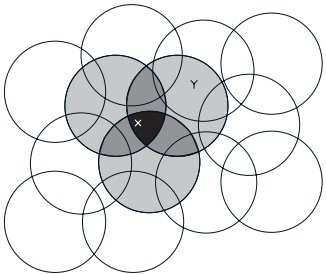

Figure 9.2: Coarse coding. Generalization from state X to state Y depends on the number of their features whose receptive fields (in this case, circles) overlap. These states have one feature in common, so there will be slight generalization between them.

velocity means the pole is righting itself, a good state. In cases with such interactions one needs to introduce features for conjunctions of feature values when using linear function approximation methods. We next consider some general ways of doing this.

#### Coarse Coding

Consider a task in which the state set is continuous and two-dimensional. A state in this case is a point in 2-space, a vector with two real components. One kind of feature for this case is those corresponding to circles in state space, as shown in Figure 9.2. If the state is inside a circle, then the corresponding feature has the value 1 and is said to be present; otherwise the feature is 0 and is said to be absent. This kind of 1-0-valued feature is called a binary feature. Given a state, which binary features are present indicate within which circles the state lies, and thus coarsely code for its location. Representing a state with features that overlap in this way (although they need not be circles or binary) is known as coarse coding.

Assuming linear gradient-descent function approximation, consider the effect of the size and density of the circles. Corresponding to each circle is a single parameter (a component of w) that is affected by learning. If we train at one point (state) X, then the parameters of all circles intersecting X will be affected. Thus, by (9.8), the approximate value function will be affected at all points within the union of the circles, with a greater effect the more circles a point has “in common” with X, as shown in Figure 9.2. If the circles are small, then the generalization will be over a short distance, as in Figure 9.3a, whereas

---

## 9.3. LINEAR METHODS

a) Narrow generalization

b) Broad generalization

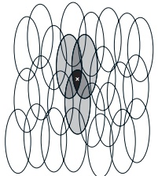

c) Asymmetric generalization

Figure 9.3: Generalization in linear function approximation methods is determined by the sizes and shapes of the features' receptive fields. All three of these cases have roughly the same number and density of features.

if they are large, it will be over a large distance, as in Figure 9.3b. Moreover, the shape of the features will determine the nature of the generalization. For example, if they are not strictly circular, but are elongated in one direction, then generalization will be similarly affected, as in Figure 9.3c.

Features with large receptive fields give broad generalization, but might also seem to limit the learned function to a coarse approximation, unable to make discriminations much finer than the width of the receptive fields. Happily, this is not the case. Initial generalization from one point to another is indeed controlled by the size and shape of the receptive fields, but acuity, the finest discrimination ultimately possible, is controlled more by the total number of features.

Example 9.1: Coarseness of Coarse Coding This example illustrates the effect on learning of the size of the receptive fields in coarse coding. Linear function approximation based on coarse coding and (9.3) was used to learn a one-dimensional square-wave function (shown at the top of Figure 9.4). The values of this function were used as the targets,  $V_t$. With just one dimension, the receptive fields were intervals rather than circles. Learning was repeated with three different sizes of the intervals: narrow, medium, and broad, as shown at the bottom of the figure. All three cases had the same density of features, about 50 over the extent of the function being learned. Training examples were generated uniformly at random over this extent. The step-size parameter was  $\alpha = \frac{0.2}{m}$, where m is the number of features that were present at one time. Figure 9.4 shows the functions learned in all three cases over the course of learning. Note that the width of the features had a strong effect early in learning. With broad features, the generalization tended to be broad; with narrow features, only the close neighbors of each trained point were changed, causing the function learned to be more bumpy. However, the final function

---

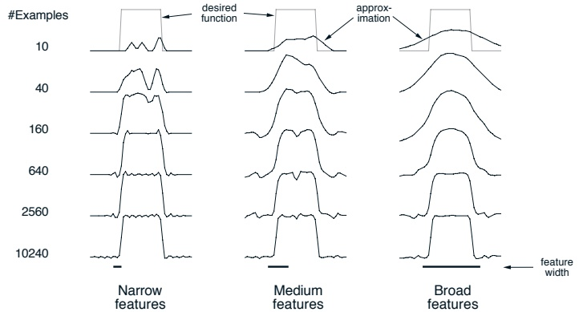

Figure 9.4: Example of feature width's strong effect on initial generalization (first row) and weak effect on asymptotic accuracy (last row).

learned was affected only slightly by the width of the features. Receptive field shape tends to have a strong effect on generalization but little effect on asymptotic solution quality.

#### Tile Coding

Tile coding is a form of coarse coding that is particularly well suited for use on sequential digital computers and for efficient on-line learning. In tile coding the receptive fields of the features are grouped into exhaustive partitions of the input space. Each such partition is called a tiling, and each element of the partition is called a tile. Each tile is the receptive field for one binary feature.

An immediate advantage of tile coding is that the overall number of features that are present at one time is strictly controlled and independent of the input state. Exactly one feature is present in each tiling, so the total number of features present is always the same as the number of tilings. This allows the step-size parameter,  $\alpha$, to be set in an easy, intuitive way. For example, choosing  $\alpha = \frac{1}{m}$, where  $m$ is the number of tilings, results in exact one-trial learning. If the example  $s \mapsto v$ is received, then whatever the prior value,  $\hat{v}(s, \mathbf{w})$, the new value will be  $\hat{v}(s, \mathbf{w}) = v$. Usually one wishes to change more slowly than this, to allow for generalization and stochastic variation in target outputs. For example, one might choose  $\alpha = \frac{1}{10m}$, in which case one would move one-tenth of the way to the target in one update.

Because tile coding uses exclusively binary  $(0-1\text{-valued})$ features, the weighted