

为每个动作 a 维护一个记录，包含选择该动作后获得的所有奖励。当在时刻 t 需要估计动作 a 的价值时，可以根据 (2.1) 式计算，这里我们重复如下：

$$
Q_{t}(a)=\frac{R_{1}+R_{2}+\cdots+R_{N_{t}(a)}}{N_{t}(a)},
$$

其中 $R_{1},\ldots,R_{N_{t}(a)}$ 是游戏 t 之前所有选择动作 a 后获得的奖励。这种直接实现方式的一个问题是，其内存和计算需求随时间增长而无界。也就是说，每次选择动作 a 后获得额外奖励都需要更多内存来存储它，并导致计算 $Q_{t}(a)$ 时需要更多计算量。

正如你可能怀疑的，这实际上并不必要。**很容易设计出增量更新公式，以便用少量恒定计算处理每个新奖励来计算平均值**。对于某个动作，令 $Q_k$ 表示其第 $k$ 个奖励的估计值，即其前 $k - 1$ 个奖励的平均值。给定这个平均值和该动作的第 $k$ 个奖励 $R_k$，那么所有 $k$ 个奖励的平均值可以通过以下公式计算：

$$
\begin{array}{rcl}Q_{k+1}&=&\displaystyle\frac{1}{k}\sum_{i=1}^{k}R_{i}\\&=&\displaystyle\frac{1}{k}\left(R_{k}+\sum_{i=1}^{k-1}R_{i}\right)\\&=&\displaystyle\frac{1}{k}\Big(R_{k}+(k-1)Q_{k}+Q_{k}-Q_{k}\Big)\\&=&\displaystyle\frac{1}{k}\Big(R_{k}+k Q_{k}-Q_{k}\Big)\\&=&\displaystyle Q_{k}+\displaystyle\frac{1}{k}\Big[R_{k}-Q_{k}\Big],\end{array}   \tag*{(2.3)}
$$

该公式甚至对 $k=1$ 也成立，对于任意 $Q_{1}$ 得到 $Q_{2}=R_{1}$。这种实现仅需要为 $Q_{k}$ 和 $k$ 分配内存，并且每个新奖励只需少量计算 (2.3)。

更新规则 $(2.3)$ 是本书中频繁出现的一种形式。其一般形式为：

$$
NewEstimate\leftarrow OldEstimate\;+\;StepSize\left[Target-OldEstimate\right].   \tag*{(2.4)}
$$

表达式 $[Target - OldEstimate]$ 是估计中的误差。通过向“目标”迈进一步来减小该误差。目标被假定为

---

指示一个理想的移动方向，尽管其中可能存在噪声。在上述例子中，目标即是第 k 个奖励。

需要注意的是，上述增量方法中所使用的步长参数（StepSize）会随时间步变化。在处理动作 a 的第 k 个奖励时，该方法使用的步长参数为 $\frac{1}{k}$。在本书中，我们用符号 $\alpha$ 或更一般地用 $\alpha_t(a)$ 表示步长参数。有时我们会使用非正式的简写 $\alpha = \frac{1}{k}$ 来指代这种情况，而隐去 k 对动作的依赖关系。

## 2.4 跟踪非平稳问题

到目前为止讨论的平均方法适用于平稳环境，但如果赌博机问题随时间变化，这些方法就不再适用。正如前面提到的，我们经常遇到本质上是非平稳的强化学习问题。在这种情况下，**赋予近期奖励比远期奖励更高的权重**是合理的。实现这一点的最常用方法之一是使用一个恒定的步长参数。例如，用于更新过去 k-1 个奖励平均值 $Q_k$ 的增量更新规则（2.3）被修改为

$$
Q_{k+1}=Q_{k}+\alpha\Big[R_{k}-Q_{k}\Big],   \tag*{(2.5)}
$$

其中步长参数 $\alpha \in (0,1]^{1}$ 是常数。这使得 $Q_{k+1}$ 成为过去奖励与初始估计 $Q_{1}$ 的加权平均：

$$
\begin{array}{rcl}Q_{k+1}&=&Q_{k}+\alpha\Big[R_{k}-Q_{k}\Big]\\&=&{\alpha}R_{k}+(1-\alpha)Q_{k}\\&=&{\alpha}R_{k}+(1-\alpha)\left[{\alpha}R_{k-1}+(1-\alpha)Q_{k-1}\right]\\&=&{\alpha}R_{k}+(1-\alpha)\alpha R_{k-1}+(1-\alpha)^{2}Q_{k-1}\\&=&{\alpha}R_{k}+(1-\alpha)\alpha R_{k-1}+(1-\alpha)^{2}\alpha R_{k-2}+\\&\quad&\cdots+(1-\alpha)^{k-1}\alpha R_{1}+(1-\alpha)^{k}Q_{1}\\&=&(1-\alpha)^{k}Q_{1}+\displaystyle\sum_{i=1}^{k}\alpha(1-\alpha)^{k-i}R_{i}.\end{array}   \tag*{(2.6)}
$$

我们称之为加权平均，因为权重之和为 $(1-\alpha)^{k}+\sum_{i=1}^{k}\alpha(1-\alpha)^{k-i}=1$，你可以自行验证。注意，赋予奖励 $R_{i}$ 的权重 $\alpha(1-\alpha)^{k-i}$ 取决于它是在多久之前获得的，即 k-i。

---

## 2.5. 乐观初始值

可以观察到，数量 $1 - \alpha$ 小于 1，因此随着介入的奖励数量增加，赋予 $R_i$ 的权重会减少。事实上，权重根据 $1 - \alpha$ 的指数呈**指数衰减**。（如果 $1 - \alpha = 0$，那么根据 $0^0 = 1$ 的约定，所有权重都将归于最后一个奖励 $R_k$。）因此，这有时被称为**指数近因加权平均**。

有时，**逐步骤改变步长参数**会很方便。令 $\alpha_k(a)$ 表示在处理第 $k$ 次选择动作 $a$ 后收到的奖励时使用的步长参数。正如我们已经注意到的，选择 $\alpha_k(a) = \frac{1}{k}$ 会得到样本平均法，根据大数定律，该方法保证能收敛到真实的动作价值。当然，并非所有的序列 $\{\alpha_k(a)\}$ 选择都能保证收敛。随机近似理论中的一个著名结果给出了保证以概率 1 收敛所需的条件：

$$
\sum_{k=1}^{\infty}\alpha_{k}(a)=\infty\qquad 且\qquad\sum_{k=1}^{\infty}\alpha_{k}^{2}(a)<\infty.   \tag*{(2.7)}
$$

第一个条件用于**保证步长足够大**，以最终克服任何初始条件或随机波动。第二个条件则**保证步长最终变得足够小**以确保收敛。

请注意，在样本平均情况 $\alpha_k(a) = \frac{1}{k}$ 下，两个收敛条件都满足，但在恒定步长参数 $\alpha_k(a) = \alpha$ 的情况下则不满足。在后一种情况下，第二个条件不满足，这表明估计值永远不会完全收敛，而是会继续根据最近收到的奖励而变化。正如我们上面提到的，这在非平稳环境中实际上是**可取的**，而**有效非平稳**的问题在强化学习中很常见。此外，满足条件 (2.7) 的步长参数序列通常**收敛非常缓慢**，或者需要大量调整才能获得令人满意的收敛速度。尽管在理论工作中经常使用满足这些收敛条件的步长参数序列，但在应用和实证研究中却很少使用。

## 2.5 乐观初始值

到目前为止我们讨论的所有方法都在一定程度上依赖于初始动作价值估计 $Q_{1}(a)$。用统计学的语言来说，这些方法**受其初始估计的偏差影响**。对于样本平均方法，

---

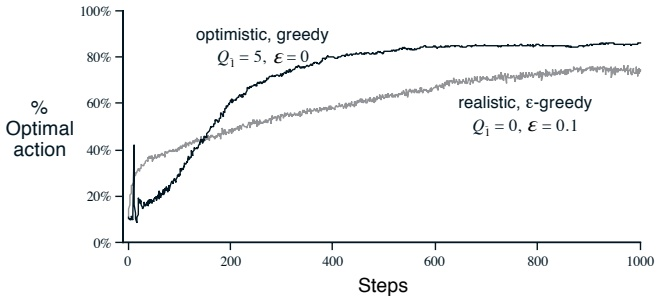

图 2.2：初始动作值乐观估计在 10 臂赌博机测试平台上的效果。两种方法均使用恒定的步长参数 $\alpha = 0.1$。

一旦所有动作都至少被选择过一次，这种偏差就会消失；但对于使用恒定 $\alpha$ 的方法，偏差是永久存在的，尽管会随着时间推移逐渐减小，如 (2.6) 式所示。实际上，这类偏差通常不是问题，有时甚至**非常有用**。其缺点在于，初始估计实际上变成了一组必须由用户选择的参数，哪怕只是将它们全部设为零。其优点则是，它们提供了一种简便的方式来**引入关于预期奖励水平的先验知识**。

初始动作值也可以作为一种鼓励探索的简单方法。假设我们不是像在 10 臂赌博机测试中那样将初始动作值设为零，而是全部设为 +5。回想一下，该问题中的 $q(a)$ 是从均值为 0、方差为 1 的正态分布中选取的。因此，+5 的初始估计是**极其乐观的**。但这种乐观性会鼓励动作值方法进行探索。无论最初选择哪个动作，获得的奖励都低于初始估计值；学习器会转而尝试其他动作，对获得的奖励感到“失望”。结果是，在价值估计收敛之前，所有动作都会被尝试多次。**即使始终选择贪婪动作，系统也会进行相当多的探索**。

图 2.2 展示了一个贪婪方法在 10 臂赌博机测试平台上的性能，其中所有动作的初始值 $Q_{1}(a)$ 均设为 +5。作为对比，图中还展示了一个 $\varepsilon$-贪婪方法，其 $Q_{1}(a)=0$。最初，乐观方法由于探索更多而表现较差，但最终其表现更好，因为它的探索会随时间减少。我们将这种鼓励探索的技术称为**乐观初始值**。我们认为这是一个简单的技巧，在平稳问题上可能非常有效，但它远非一种通用的鼓励探索方法。例如，它并不适合

---

**非平稳问题**，因为其探索驱动力本质上是暂时的。如果任务发生变化，产生了新的探索需求，这种方法就无能为力。事实上，**任何以特殊方式关注初始状态的方法**，都不太可能对一般性的非平稳情况有所帮助。时间的起点只出现一次，因此我们不应过分关注它。这种批评同样适用于样本平均方法，它们也将时间的起点视为特殊事件，对所有后续奖励赋予相等的权重进行平均。尽管如此，所有这些方法都非常简单，其中一种或几种的简单组合在实践中通常就足够用了。在本书的后续部分，我们会频繁使用这些简单的探索技术。

## 2.6 置信度上界动作选择

之所以需要探索，是因为动作价值估计具有不确定性。贪婪动作是那些当前看起来最好的，但其他一些动作实际上可能更好。**ε-贪婪动作选择**会强制尝试非贪婪动作，但它是无差别的，不会对那些接近贪婪或特别不确定的动作有所偏好。**更好的做法**是根据非贪婪动作实际可能成为最优动作的潜力来选择它们，同时考虑它们的估计值接近最大值的程度以及这些估计的不确定性。一种有效的实现方法是按照下式选择动作：

$$
A_{t}=\underset{a}{\arg\max}\left[Q_{t}(a)+c\sqrt{\frac{\ln t}{N_{t}(a)}}\right],   \tag*{(2.8)}
$$

其中 $\ln t$ 表示 $t$ 的自然对数（即 $e \approx 2.71828$ 需要达到的幂次才能等于 $t$），而常数 $c > 0$ 控制着探索的程度。如果 $N_t(a) = 0$，那么 $a$ 被视为一个具有最大值的动作。

这种**置信度上界动作选择**的思想在于，平方根项是对动作 $a$ 价值估计的不确定性或方差的度量。因此，被最大化的这个量，可以看作是动作 $a$ 可能真实价值的一个**上界**，参数 $c$ 决定了置信水平。每当动作 $a$ 被选择一次，其不确定性就会相应降低；$N_t(a)$ 增加，并且由于它出现在不确定性项的分母中，该项的值会减小。另一方面，每当选择了其他动作，$t$ 会增加；由于 $t$ 出现在分子中，不确定性估计值会增加。使用自然对数意味着这种增加会随时间推移而变小，但**没有上限**；所有动作最终都会被选择，但

---

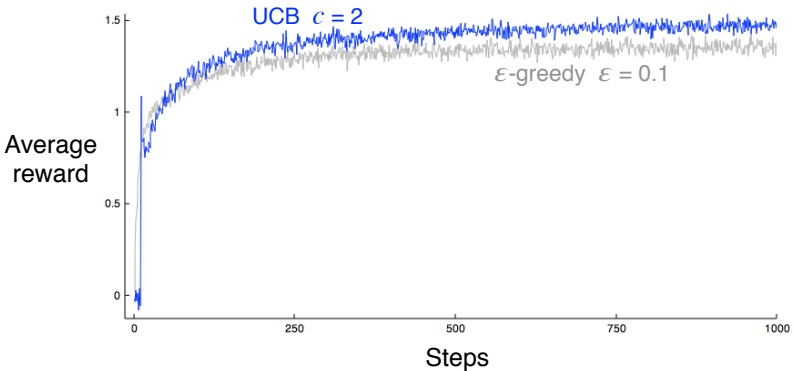

图 2.3：UCB 动作选择在 10 臂赌博机测试平台上的平均性能。如图所示，UCB 通常比 $\varepsilon$-贪心动作选择表现更好，除了在前 n 次尝试中，此时它会在尚未尝试过的动作中随机选择。设置 c = 1 的 UCB 会表现得更好，但不会在第 11 次尝试时显示出明显的性能尖峰。你能想出这个尖峰的解释吗？

随着时间的推移，对于价值估计较低或已被选择更多次的动作，其等待时间会更长，因此被选择的频率会更低。

在 10 臂赌博机测试平台上使用 UCB 的结果如图 2.3 所示。正如这里所示，UCB 通常表现良好，但比 $\varepsilon$-贪心方法更难扩展到本书后续部分考虑的、更一般的强化学习场景中，而不仅仅是赌博机问题。一个难点在于处理**非平稳问题**；这需要比 2.4 节所介绍的方法更复杂的方案。另一个难点是处理**大的状态空间**，特别是本书第三部分将发展的函数逼近方法。在这些更高级的场景中，目前还没有已知的实用方法来利用 UCB 动作选择的思想。

## 2.7 梯度赌博机算法

到目前为止，本章我们考虑的方法是**估计动作价值**并利用这些估计来选择动作。这通常是一个好方法，但它并非唯一可能的方法。在本节中，我们考虑学习每个动作 a 的**数值偏好** $H_{t}(a)$。偏好越大，

---

更常见的情况是采取动作，但这种偏好无法用奖励来解释。**只有动作之间的相对偏好才是重要的**；如果我们给所有偏好值加上 1000，这不会影响动作概率，动作概率是根据 soft-max 分布（即 Gibbs 或 Boltzmann 分布）确定的，如下所示：

$$
\Pr\{A_{t}=a\}=\frac{e^{H_{t}(a))}}{\sum_{b=1}^{n}e^{H_{t}(b)}}=\pi_{t}(a),   \tag*{(2.9)}
$$

这里我们还引入了一个有用的新符号 $\pi_t(a)$，表示在时刻 $t$ 采取动作 $a$ 的概率。**初始时所有偏好都相同**（例如，$H_1(a) = 0, \forall a$），因此所有动作被选中的概率均等。

针对这一设定，存在一种基于随机梯度上升思想的自然学习算法。在每一步中，选定动作 $A_{t}$ 并获得奖励 $R_{t}$ 后，偏好值按如下方式更新：

$$
\begin{align*}H_{t+1}(A_{t})&=H_{t}(A_{t})+\alpha\big(R_{t}-\bar{R}_{t}\big)\big(1-\pi_{t}(A_{t})\big),\quad&and\\H_{t+1}(a)&=H_{t}(a)-\alpha\big(R_{t}-\bar{R}_{t}\big)\pi_{t}(a),\quad&\forall a\neq A_{t},\end{align*}   \tag*{(2.10)}
$$

其中 $\alpha > 0$ 是步长参数，$R_t \in \mathbb{R}$ 是截至时间 $t$ 的所有奖励的平均值（包括 $t$ 时刻），可按第 2.3 节（若问题是非平稳的，则按第 2.4 节）所述的方法递增计算。$\bar{R}_t$ 项作为基准线，奖励将与之比较。**如果奖励高于基准线，则未来采取 $A_t$ 的概率会增加；如果奖励低于基准线，则概率会降低**。未被选中的动作则朝相反方向调整。

图 2.4 展示了梯度赌博算法在 10 臂测试平台的一个变体上的结果，其中真实期望奖励是根据均值为 +4（而非零）的正态分布选择的（方差与之前相同，为单位方差）。**由于奖励基准线项能够即时适应新的奖励水平，所有奖励的整体上移对梯度赌博算法完全没有影响**。但如果省略基准线（即在 (2.10) 中令 $\hat{R}_{t}$ 恒为零），则性能会显著下降，如图所示。

通过将该算法理解为梯度上升的随机近似，我们可以获得更深入的理解。在精确的梯度上升中，每个偏好 $H_{t}(a)$ 的增量将与增量对性能的影响成正比：

$$
H_{t+1}(a)=H_{t}(a)+\alpha\frac{\partial\mathbb{E}\left[R_{t}\right]}{\partial H_{t}(a)},   \tag*{(2.11)}
$$

其中性能的度量是期望奖励：

$$
\mathbb{E}[R_{t}]=\sum_{b}\pi_{t}(b)q(b).
$$

---

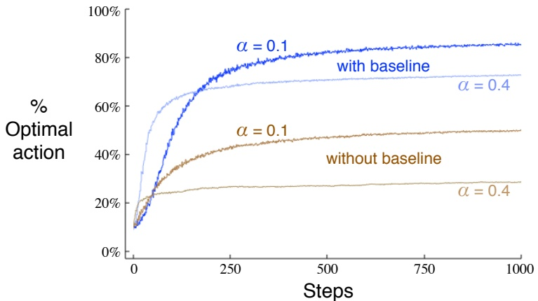

图 2.4：梯度赌博机算法在 10 臂测试平台上的平均性能，其中 $\mathbb{E}[q(a)] = 4$，比较了**是否使用奖励基线**的情况。

当然，在我们的情境下无法精确实现梯度上升，因为根据假设我们并不知道 $q(b)$ 的值。但实际上，我们算法（2.10）的更新在期望值上与（2.11）是相等的，这使得该算法成为随机梯度上升的一个实例。

证明这一点仅需基础的微积分知识，但需要若干步骤。如果你在数学上有所倾向，你将会享受本节剩余部分，我们将逐步推导这些步骤。首先，我们更仔细地审视确切的性能梯度：

$$
\begin{align*}\frac{\partial\mathbb{E}[R_{t}]}{\partial H_{t}(a)}&=\frac{\partial}{\partial H_{t}(a)}\left[\sum_{b}\pi_{t}(b)q(b)\right]\\&=\sum_{b}q(b)\frac{\partial\pi_{t}(b)}{\partial H_{t}(a)}\\&=\sum_{b}\left(q(b)-X_{t}\right)\frac{\partial\pi_{t}(b)}{\partial H_{t}(a)},\end{align*}
$$

其中 $X_t$ 可以是任意不依赖于 $b$ 的标量。我们可以在这里包含它，是因为梯度在所有动作上的和为零，即 $\sum_b \frac{\partial \pi_t(b)}{\partial H_t(a)} = 0$。当 $H_t(a)$ 发生变化时，某些动作的概率上升，某些下降，但**这些变化的和必须为零**，因为概率的总和必须

---

## 2.7. 梯度赌博机

保留一个。

$$
=\sum_{b}\pi_{t}(b)\big(q(b)-X_{t}\big)\frac{\partial\pi_{t}(b)}{\partial H_{t}(a)}/\pi_{t}(b)
$$

该方程现在已写成期望的形式，对随机变量 $A_{t}$ 的所有可能取值 b 求和，然后乘以取这些值的概率。因此：

$$
\begin{aligned}&=\mathbb{E}\left[\left(q(A_{t})-X_{t}\right)\frac{\partial\pi_{t}(A_{t})}{\partial H_{t}(a)}/\pi_{t}(A_{t})\right]\\&=\mathbb{E}\left[\left(R_{t}-\bar{R}_{t}\right)\frac{\partial\pi_{t}(A_{t})}{\partial H_{t}(a)}/\pi_{t}(A_{t})\right],\end{aligned}
$$

这里我们选择了 $X_t = \bar{R}_t$ 并用 $R_t$ 替换了 $q(A_t)$，这是允许的，因为 $\mathbb{E}[R_t] = q(A_t)$ 且所有其他因子都是非随机的。稍后我们将证明 $\frac{\partial \pi_t(b)}{\partial H_t(a)} = \pi_t(b) \left( \mathbb{I}_{a=b} - \pi_t(a) \right)$，其中 $\mathbb{I}_{a=b}$ 定义为：当 $a = b$ 时为 1，否则为 0。暂时假设此式成立，我们有：

$$
\begin{aligned}&=\mathbb{E}\big[\big(R_{t}-\bar{R}_{t}\big)\pi_{t}(A_{t})\big(\mathbb{I}_{a=A_{t}}-\pi_{t}(a)\big)/\pi_{t}(A_{t})\big]\\&=\mathbb{E}\big[\big(R_{t}-\bar{R}_{t}\big)\big(\mathbb{I}_{a=A_{t}}-\pi_{t}(a)\big)\big].\\ \end{aligned}
$$

回想一下，我们的计划一直是将性能梯度写成某种可以在每一步采样的量的期望，正如我们刚刚所做的那样，然后**在每一步按该样本的比例进行更新**。将上述期望的一个样本代入 $(2.11)$ 式中的性能梯度，得到：

$$
H_{t+1}(a)=H_{t}(a)+\alpha\big(R_{t}-\bar{R}_{t}\big)\big(\mathbb{I}_{a=A_{t}}-\pi_{t}(a)\big),\qquad\forall a,
$$

你会认出这等价于我们原始的算法 (2.10)。

因此，只剩下证明我们之前假设的 $\frac{\partial\pi_{t}(b)}{\partial H_{t}(a)} = \pi_{t}(b)\big(\mathbb{I}_{a=b} - \pi_{t}(a)\big)$。回顾导数的标准商法则：

$$
\frac{\partial}{\partial x}\left[\frac{f(x)}{g(x)}\right]=\frac{\frac{\partial f(x)}{\partial x}g(x)-f(x)\frac{\partial g(x)}{\partial x}}{g(x)^{2}}.
$$

---

由此，我们可以写出

 
$$
\begin{aligned}\frac{\partial\pi_{t}(b)}{\partial H_{t}(a)}&=\frac{\partial}{\partial H_{t}(a)}\pi_{t}(b)\\&=\frac{\partial}{\partial H_{t}(a)}\left[\frac{e^{H_{t}(b)}}{\sum_{c=1}^{n}e^{H_{t}(c)}}\right]\\&=\frac{\frac{\partial e^{H_{t}(b)}}{\partial H_{t}(a)}\sum_{c=1}^{n}e^{H_{t}(c)}-e^{H_{t}(b)}\frac{\partial\sum_{c=1}^{n}e^{H_{t}(c)}}{\partial H_{t}(a)}}{(\sum_{c=1}^{n}e^{H_{t}(c)})^{2}}\quad(by the quotient rule)\\&=\frac{\mathbb{I}_{a=b}e^{H_{t}(a)}\sum_{c=1}^{n}e^{H_{t}(c)}-e^{H_{t}(b)}e^{H_{t}(a)}}{(\sum_{c=1}^{n}e^{H_{t}(c)})^{2}}\quad(because\frac{\partial e^{x}}{\partial x}=e^{x})\\&=\frac{\mathbb{I}_{a=b}e^{H_{t}(b)}}{\sum_{c=1}^{n}e^{H_{t}(c)}}-\frac{e^{H_{t}(b)}e^{H_{t}(a)}}{(\sum_{c=1}^{n}e^{H_{t}(c)})^{2}}\\&=\mathbb{I}_{a=b}\pi_{t}(b)-\pi_{t}(b)\pi_{t}(a)\\&=\pi_{t}(b)\big(\mathbb{I}_{a=b}-\pi_{t}(a)\big).Q.E.D.\end{aligned}
$$
 

我们刚刚证明了梯度赌博机算法的**期望更新等于期望奖励的梯度**，因此该算法是随机梯度上升算法的一个实例。这确保了算法具有**稳健的收敛性**。

需要注意的是，我们对奖励基线除了**不依赖于所选动作**之外，没有施加任何要求。例如，我们可以将其设为零，或设为1000，该算法仍将是随机梯度上升的一个实例。基线的选择**不会影响算法的期望更新**，但**确实会影响更新的方差**，从而影响收敛速度（如图2.4所示）。将其选为奖励的平均值可能不是最优的，但它简单且在实践中效果良好。

## 2.8 关联搜索（上下文赌博机）

到目前为止，本章中我们只考虑了**非关联任务**，这些任务中无需将不同的动作与不同的情境关联起来。在这些任务中，学习者要么在任务平稳时尝试寻找单个最佳动作，要么在任务非平稳时尝试随时间变化追踪最佳动作。然而，在一般的强化学习任务中，存在多种情境，目标是学习一个策略：一种**从情境映射到该情境下最佳动作**的规则。为了为

---

为了全面理解该问题，我们简要讨论**非关联任务向关联场景扩展的最简方式**。

举例而言，假设存在多个不同的**n臂老虎机任务**，且每次游戏时你会随机面临其中一种。因此，老虎机任务会随每次游戏随机切换。对你而言，这就像是一个**单一的非平稳n臂老虎机任务**，其真实动作价值随每次游戏随机变化。你可以尝试使用本章介绍的某种**处理非平稳性的方法**，但除非真实动作价值变化缓慢，否则这些方法效果有限。然而，假设当某个老虎机任务被选中时，你会获得关于其身份的**特定线索**（但非其动作价值）。例如，你面对的老虎机可能会在改变动作价值时切换显示屏颜色。此时，你可以学习一种**策略**，将每个任务（通过所见颜色标识）与其最佳操作关联起来——例如，红色时选择臂1，绿色时选择臂2。通过正确的策略，你通常能比在无法区分不同老虎机任务时表现更优。

这就是**关联搜索任务**的一个示例。之所以称为关联搜索，是因为它既包含通过试错学习寻找最佳动作的**搜索过程**，也包含将这些动作与其最优情境相**关联**的过程。$^{2}$ 关联搜索任务介于n臂老虎机问题与完整强化学习问题之间。其与完整强化学习问题的相似之处在于需要学习策略，但与本章所述的n臂老虎机问题相似之处在于每个动作仅影响即时奖励。若允许动作同时影响后续状态与奖励，则构成完整的强化学习问题。我们将在下一章阐述该问题，并在本书后续章节探讨其衍生内容。

## 2.9 本章小结

本章介绍了**平衡探索与利用**的几种简单方法。**ε-贪心方法**以较小概率随机选择动作，而**UCB方法**则通过巧妙偏向当前采样较少的动作实现确定性探索。**梯度老虎机算法**不直接估计动作价值，而是评估动作偏好，并基于soft-max分布以概率化方式分级偏向更受青睐的动作。通过**初始化估计值**的简单策略……

---

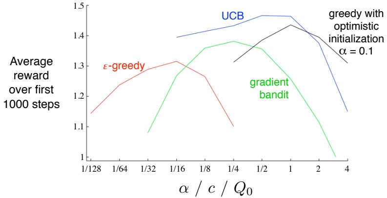

图 2.5：本章介绍的各种老虎机算法的参数研究。每个点表示在特定参数设置下，某个算法在 1000 步内获得的平均奖励。

**乐观地初始化估计值**甚至会使得贪婪方法也进行显著的探索。

很自然地，我们会问这些方法中哪一种是最好的。尽管一般来说这是一个难以回答的问题，但我们当然可以**在本章一直使用的 10 臂老虎机测试平台上运行所有算法**，并比较它们的性能。一个复杂之处在于它们都有一个参数；为了进行有意义的比较，我们需要将它们的性能视为其参数的函数。到目前为止，我们的图表显示了每个算法和参数设置随时间的训练过程，但如果为每个算法和参数值都展示这样的学习曲线，视觉上会显得过于混乱。因此，我们通过算法在 1000 步内的**平均奖励值**来总结完整的学习曲线；该值与之前展示的学习曲线下的面积成正比。图 2.5 展示了本章中各种老虎机算法的这一指标，每个算法的性能都作为其自身参数的函数，参数值以单一尺度呈现在 x 轴上。请注意，参数值以两倍的因子变化，并以对数刻度呈现。同时也要注意每种算法性能特有的**倒 U 形曲线**；所有算法都在其参数的中间值时表现最佳，既不能太大也不能太小。在评估一种方法时，我们不仅应该关注它在最佳参数设置下的表现，还应该关注它对参数值的敏感程度。所有这些算法都相当不敏感，在参数值变化大约一个数量级的范围内都能表现良好。总体而言，在这个问题上，**UCB 算法似乎表现最佳**。

---

尽管这些方法很简单，但我们认为本章介绍的方法完全可以被视为**当前最高水平**。虽然存在更复杂的方法，但它们的复杂性和假设条件使其无法适用于我们真正关注的全强化学习问题。从第5章开始，我们将介绍解决全强化学习问题的学习方法，这些方法部分使用了本章探讨的简单方法。

虽然本章探讨的简单方法可能是我们目前能做到的最佳方案，但它们远非探索与利用平衡问题的**完全令人满意的解决方案**。

在多臂赌博机问题中平衡探索与利用的经典解决方案是计算称为**吉廷斯指数**的特殊函数。这种方法为某种比本文讨论更广义的赌博机问题提供了最优解，但前提是假设可能问题的先验分布已知。遗憾的是，无论是该方法的理论还是计算可行性，似乎都无法推广到本书后续章节将讨论的全强化学习问题。

此外，还存在一种著名算法用于计算平衡探索与利用的**贝叶斯最优方法**。该方法的精确计算在计算上难以处理，但可能存在有效的近似方式。在这种方法中，我们假设已知问题实例的分布，即每个可能动作值真实集合的概率。给定任何动作选择，我们可以计算每个可能即时奖励的概率以及动作值的后验概率分布。这个不断演变的分布成为问题的信息状态。给定一个时间范围（例如1000次尝试），我们可以考虑所有可能的动作、所有可能产生的奖励、所有可能的后续动作、所有后续奖励，依此类推直至1000次尝试结束。在给定假设条件下，每个可能事件链的奖励和概率都可以确定，只需选择最优解即可。但可能性树会**极其迅速地增长**；即使只有两个动作和两种奖励，可能性树也会拥有 $2^{2000}$ 个叶节点。这种方法实际上将赌博机问题转化为全强化学习问题的一个实例。最终，我们或许能够使用强化学习方法来近似这种最优解。但这属于当前研究课题，已超出本书范围。

#### 文献与历史评注

2.1 赌博机问题已在统计学、工程学和心理学领域得到研究。在统计学中，赌博机问题属于“实验序贯设计”范畴，由Thompson（1933，1934）和

---

Robbins（1952）的研究由 Bellman（1956）进一步深化。Berry 和 Fristedt（1985）从统计学角度对赌博机问题进行了广泛探讨。Narendra 和 Thathachar（1989）则从工程学视角处理赌博机问题，**深入剖析了**关注该问题的多种理论传统。在心理学领域，赌博机问题在统计学习理论中发挥了重要作用（例如，Bush 和 Mosteller，1955；Estes，1950）。

**“贪婪”这一术语**在启发式搜索文献中常被使用（例如，Pearl，1984）。探索与利用之间的冲突在控制工程中被称为**识别（或估计）与控制之间的冲突**（例如，Witten，1976）。Feldbaum（1965）将其称为**双重控制问题**，指的是在不确定性下控制系统时，需要同时解决识别和控制这两个问题。在讨论遗传算法的各个方面时，Holland（1975）强调了这一冲突的重要性，将其称为**利用需求与新信息需求之间的冲突**。

2.2 针对我们的 n 臂赌博机问题的动作价值方法最早由 Thathachar 和 Sastry（1985）提出。在学习自动机文献中，这些方法常被称为**估计器算法**。**“动作价值”这一术语**归功于 Watkins（1989）。最早使用 **$\varepsilon$-贪婪方法**的可能也是 Watkins（1989，第 187 页），但这一思想非常简单，更早的使用似乎也有可能。

2.3–4 这部分内容属于**随机迭代算法**的一般范畴，Bertsekas 和 Tsitsiklis（1996）对此进行了充分阐述。

2.5 **乐观初始化**在强化学习中的应用由 Sutton（1996）提出。

2.6 利用**置信上界估计**来选择动作的早期工作由 Lai 和 Robbins（1985）、Kaelbling（1993b）以及 Agarwal（1995）完成。我们在此介绍的 UCB 算法在文献中被称为 UCB1，最早由 Auer、Cesa-Bianchi 和 Fischer（2002）提出。

2.7 **梯度赌博机算法**是 Williams（1992）引入的基于梯度的强化学习算法的一个特例，后来发展为我们将在本书后续章节讨论的**行动者-评论者算法和策略梯度算法**。关于

---

**基线**由Greensmith、Bartlett和Baxter（2001，2004）以及Dick（2015）提供。

用于动作选择规则（2.9）的术语 **softmax** 归功于Bridle（1990）。该规则似乎最早由Luce（1959）提出。

**2.8** 术语 **关联搜索** 及相应问题由Barto、Sutton和Brouwer（1981）提出。术语 **关联强化学习** 也曾用于指代关联搜索（Barto和Anandan，1985），但我们倾向于将该术语保留为完整强化学习问题的同义词（如Sutton，1984所述）。（并且，正如我们所指出的，现代文献也使用术语“上下文赌博机”来指代此问题。）我们注意到，Thorndike的效果定律（在第1章中引用）通过描述情境（状态）与动作之间关联链接的形成来阐述关联搜索。根据操作性或工具性条件反射的术语（例如，Skinner，1938），**辨别刺激** 是一种信号，表明存在特定的强化关联。用我们的术语来说，不同的辨别刺激对应于不同的状态。

**2.9** **Gittins指数方法** 归功于Gittins和Jones（1974）。Duff（1995）展示了如何通过强化学习来学习赌博机问题的Gittins指数。Bellman（1956）首次展示了如何利用动态规划，在问题的贝叶斯框架内计算探索与利用之间的最优平衡。Kumar（1985）的综述很好地讨论了这些问题的贝叶斯和非贝叶斯方法。术语 **信息状态** 源自部分可观测马尔可夫决策过程的相关文献；例如，参见Lovejoy（1991）。

#### 练习

**练习 2.1** 在图2.1所示的比较中，从长期累积奖励和选择最佳动作的累积概率来看，哪种方法表现最好？它会好多少？请定量表达你的答案。

**练习 2.2** 为n臂赌博机问题提供一个完整算法的伪代码。使用贪婪动作选择，并以步长参数 $\alpha = \frac{1}{k}$ 增量计算动作值。假设存在一个函数 $bandit(a)$，它接受一个动作并返回奖励。使用数组和变量；不要……

---

在时间索引 $t$ 处标注所有内容（有关此类伪代码的示例，请参见图 4.1 和 4.3）。说明动作值如何初始化以及每次获得奖励后如何更新。**说明步长参数如何根据每个动作被尝试的次数进行设置**。

练习 2.3 如果步长参数 $\alpha_k$ 不是常数，那么估计值 $Q_k$ 是先前接收到的奖励的加权平均值，其加权方式与 (2.6) 式给出的不同。**在一般情况下，每个先前奖励的加权是什么**（类似于 (2.6) 式），用 $\alpha_k$ 表示？

练习 2.4（编程）设计并进行一个实验，以证明样本平均方法在非平稳问题中遇到的困难。使用一个修改版的 10 臂老虎机测试平台，其中所有 $q(a)$ 初始值相等，然后进行独立的随机游走。为一个使用样本平均的动作值方法（通过 $\alpha = \frac{1}{k}$ 增量计算）以及另一个使用恒定步长参数 $\alpha = 0.1$ 的动作值方法，准备类似于图 2.1 的图表。使用 $\varepsilon = 0.1$，并在必要时进行超过 1000 次游戏的运行。

练习 2.5 图 2.2 所示的结果应该相当可靠，因为它们是 2000 个独立、随机选择的 10 臂老虎机任务的平均值。那么，为什么乐观方法曲线的早期部分会出现振荡和尖峰？**在特定的早期游戏中，什么因素可能导致该方法平均表现特别好或特别差**？

练习 2.6 假设你面对一个二元老虎机任务，其真实动作值在每次游戏中随机变化。具体来说，假设对于任何游戏，动作 1 和 2 的真实值分别以概率 0.5 为 0.1 和 0.2（情况 A），以及以概率 0.5 为 0.9 和 0.8（情况 B）。如果你在每次游戏中无法判断面临哪种情况，你能达到的最佳成功期望是多少？你应该如何行动以实现它？现在假设在每次游戏中，你被告知面临的是情况 A 还是情况 B（尽管你仍然不知道真实的动作值）。这是一个关联搜索任务。**在这个任务中，你能达到的最佳成功期望是多少**？你应该如何行动以实现它？

---

# 第 3 章

# 有限马尔可夫决策过程

本章我们将介绍本书后续部分试图解决的问题。对我们而言，**这个问题定义了强化学习领域**：任何适用于解决该问题的方法，我们都将其视为强化学习的方法。

本章的目标是从广义上描述强化学习问题。我们试图展现能够被构建为强化学习任务的广泛应用场景。同时，我们描述了强化学习问题的数学理想化形式，以便能够进行精确的理论陈述。我们引入了问题数学结构的关键要素，例如价值函数和贝尔曼方程。与人工智能的所有领域一样，这里存在着**应用广度与数学可处理性之间的张力**。本章我们将引入这种张力，并讨论其带来的一些权衡与挑战。

## 3.1 智能体-环境交互接口

强化学习问题旨在**为“通过交互学习以实现目标”这一问题提供一个直接的框架**。学习者和决策者被称为**智能体**。与之交互的、包含智能体之外一切事物的对象被称为**环境**。它们持续交互：智能体选择动作，环境对这些动作做出响应，并向智能体呈现新的状况。$^{1}$ 环境还会……

---

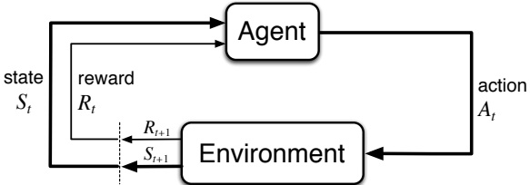

图 3.1：强化学习中的智能体-环境交互。

并产生**奖励**——智能体试图随时间最大化的一种特殊数值。环境的完整定义构成了一项任务，即强化学习问题的一个实例。

更具体地说，智能体与环境在一系列离散的时间步 $t = 0, 1, 2, 3, \ldots^{2}$ 上交互。在每个时间步 $t$，智能体接收到环境状态的某种表示 $S_{t} \in \mathcal{S}$，其中 $\mathcal{S}$ 是可能的状态集合，并基于此选择一个动作 $A_{t} \in \mathcal{A}(S_{t})$，这里 $\mathcal{A}(S_{t})$ 是在状态 $S_{t}$ 下可用的动作集合。一个时间步之后，部分由于其动作的结果，智能体收到一个数值奖励 $R_{t+1} \in \mathcal{R} \subset \mathbb{R}$，并发现自己处于一个新状态 $S_{t+1}.^{3}$ 图 3.1 描绘了智能体-环境的交互过程。

在每个时间步，智能体实现了一个从状态到选择每个可能动作的概率的映射。这个映射被称为智能体的**策略**，记作 $\pi_t$，其中 $\pi_t(a|s)$ 表示当 $S_t = s$ 时 $A_t = a$ 的概率。强化学习方法规定了智能体如何根据其经验改变策略。粗略地说，智能体的目标是**最大化其长期接收到的总奖励量**。

这个框架是抽象且灵活的，可以以多种不同方式应用于许多不同问题。例如，时间步不必指代真实时间的固定间隔；它们可以指代决策和行动的任意连续阶段。动作可以是低层次的控制，例如施加到机器人手臂电机的电压，也可以是高层次的决策，例如是否吃午餐或去读研究生。同样，状态也可以采用多种形式。它们可以完全由低层次的感觉（如直接传感器读数）决定，也可以更为……

---

**高层次且抽象的**，例如对房间中物体的符号化描述。构成状态的部分内容可能基于对过去感知的记忆，甚至完全是心理或主观的。例如，智能体可能处于不确定物体位置的状态，或者处于某种明确定义意义上的刚刚感到惊讶的状态。同样，某些行动可能完全是心理或计算层面的。例如，某些行动可能控制智能体选择思考什么，或者其关注点聚焦于何处。**总的来说，行动可以是任何我们希望学会如何做出的决策，而状态可以是任何我们知晓的、可能对做出这些决策有用的信息。**

**特别值得注意的是，智能体与环境的边界通常并不等同于机器人或动物身体的物理边界。** 通常，这个边界被划得比物理边界更靠近智能体。例如，机器人的电机、机械连杆及其传感硬件通常应被视为环境的一部分，而非智能体的一部分。同样，如果我们将该框架应用于人或动物，肌肉、骨骼和感觉器官也应被视为环境的一部分。奖励也是如此，尽管它们很可能是在自然或人工学习系统的物理体内计算得出的，但仍被视为智能体外部的事物。

**我们遵循的一般规则是：任何智能体无法任意改变的事物都被视为其外部环境的一部分。** 我们并不假设环境中的所有事物对智能体都是未知的。例如，智能体通常相当了解其奖励是如何根据其采取的行动及行动发生的状态来计算的。但我们始终将奖励计算视为智能体外部的事物，因为它定义了智能体面临的任务，因此必须超出其任意改变的能力范围。事实上，在某些情况下，智能体可能完全了解其环境如何运作，却仍然面临一个困难的强化学习任务，就像我们可能完全了解魔方这类谜题的运作机制，却仍然无法解开它一样。**智能体-环境的边界代表了智能体绝对控制能力的极限，而非其知识的极限。**

**出于不同目的，智能体-环境的边界可以位于不同位置。** 在一个复杂的机器人中，可能同时运行着许多不同的智能体，每个智能体都有自己的边界。例如，一个高层智能体可能做出高层决策，这些决策构成了执行这些高层决策的低层智能体所面临的状态的一部分。在实践中，一旦选定了特定的状态、行动和奖励，从而确定了感兴趣的特定决策任务，智能体-环境的边界也就随之确定了。

强化学习框架是对**从交互中进行目标导向学习**这一问题的相当程度的抽象。它提出，无论……

---

**无论感官、记忆和控制装置的细节如何，也无论目标是什么，任何学习目标导向行为的问题都可以简化为智能体与环境之间传递的三个信号：一个信号代表智能体做出的选择（动作），一个信号代表做出选择的基础（状态），以及一个信号定义智能体的目标（奖励）。** 这个框架可能不足以有效表示所有决策学习问题，但它已被证明具有广泛的应用价值。

当然，不同任务中的具体状态和动作差异很大，其表示方式会显著影响性能。在强化学习以及其他类型的学习中，这类表示选择目前更像是艺术而非科学。在本书中，我们提供了一些关于如何良好表示状态和动作的建议与示例，但**我们的主要关注点在于选定表示方式后，学习如何行动的一般性原则**。

**示例 3.1：生物反应器** 假设应用强化学习来确定生物反应器（用于生产有用化学品的大型营养液和细菌容器）的实时温度和搅拌速率。此类应用中的动作可能是传递给底层控制系统的目标温度和目标搅拌速率，这些系统进而直接激活加热元件和电机以达到目标。状态可能来自热电偶和其他传感器的读数（可能经过滤波和延迟处理），加上代表容器内成分和目标化学品的符号输入。奖励可能是生物反应器生产有用化学品的实时速率测量值。注意，这里每个状态都是传感器读数和符号输入的列表或向量，每个动作是由目标温度和搅拌速率组成的向量。**强化学习任务中的状态和动作通常具有这类结构化表示**。而奖励则始终是单个数值。

**示例 3.2：拾放机器人** 考虑使用强化学习来控制机器人手臂在重复性拾放任务中的运动。如果我们希望学习快速且平滑的动作，学习智能体必须直接控制电机，并获取关于机械连杆当前位置和速度的低延迟信息。在这种情况下，动作可能是施加在每个关节电机上的电压，状态可能是关节角度和速度的最新读数。每次成功拾取并放置物体，奖励可能为 +1。**为了鼓励平滑运动，可以在每个时间步根据运动的瞬时“抖动程度”函数给予一个小的负奖励**。

---

**示例 3.3：回收机器人** 一个移动机器人的任务是在办公室环境中收集空饮料罐。它配备了用于探测罐子的传感器，以及一个能够抓取罐子并将其放入车载垃圾箱的机械臂和夹爪；它使用可充电电池供电。机器人的控制系统包含解释感官信息、导航以及控制机械臂和夹爪的组件。关于如何搜寻罐子的高层决策由强化学习智能体根据电池的当前电量水平做出。该智能体必须决定机器人应该：(1) 在一段时间内主动搜寻罐子，(2) 保持静止并等待有人给它带来罐子，或者 (3) 返回其充电基站进行充电。这个决策需要定期做出，或者在特定事件发生时做出，例如找到一个空罐子。因此，该智能体拥有三个动作，其状态由电池的状态决定。奖励在大多数时间可能为零，但当机器人成功获取一个空罐子时变为正数，或者如果电池电量完全耗尽则变为大的负数。在这个例子中，强化学习智能体并非整个机器人。它监测的状态描述的是机器人自身的内部状况，而不是机器人外部环境的状况。因此，智能体的环境包括机器人的其余部分（可能包含其他复杂的决策系统）以及机器人的外部环境。

## 3.2 目标与奖励

在强化学习中，智能体的目的或目标是通过一个从环境传递给智能体的特殊奖励信号来形式化定义的。在每个时间步，奖励是一个简单的数字，$R_t \in \mathbb{R}$。**非正式地说**，智能体的目标是最大化其接收到的奖励总量。这意味着不是最大化即时奖励，而是**最大化长期的累积奖励**。我们可以将这个非正式的想法清晰地表述为**奖励假说**：

**我们所说的目标和目的，都可以很好地理解为对接收到的标量信号（称为奖励）的累积和的期望值的最大化。**

使用奖励信号来形式化目标的概念，是强化学习最显著的特征之一。

尽管用奖励信号来表述目标起初可能显得局限，但在实践中，它已被证明是灵活且广泛适用的。理解这一点最好的方式是考虑它已经或可能如何被应用的例子。例如，为了让机器人学会行走，研究人员提供了奖励

---

在每个时间步，奖励与机器人的前进运动成正比。在让机器人学习如何逃离迷宫时，通常设定为**每经过一个时间步就给予 -1 的奖励**；这促使智能体尽快逃离。要让机器人学习寻找并收集空饮料罐进行回收，大多数时间可以给予零奖励，而**每收集一个罐子则给予 +1 的奖励**。当机器人撞到物体或有人对其吼叫时，可能还需要给予负奖励。对于学习下跳棋或国际象棋的智能体，自然的奖励设定是：获胜时 +1，失败时 -1，平局及所有非终局位置则为 0。

从所有这些例子中可以看出，智能体总是学习如何最大化其奖励。如果我们希望它为我们完成某项任务，就必须以这样的方式提供奖励：**智能体在最大化奖励的同时，也能实现我们的目标**。因此，我们设定的奖励必须真实反映我们希望完成的任务，这一点至关重要。特别是，**奖励信号不应被用来向智能体传授如何实现我们期望它完成的任务的先验知识**。例如，下棋的智能体应该只在真正获胜时获得奖励，而不是在实现诸如吃掉对手棋子或控制棋盘中心等子目标时获得奖励。如果对这些子目标给予奖励，智能体可能会找到一种方法来实现这些子目标，却忽略了真正的目标。例如，它可能会不惜输掉比赛也要吃掉对手的棋子。**奖励信号是你向机器人传达你希望它实现什么目标的方式，而不是你希望它如何实现这个目标**。

强化学习的新手有时会惊讶地发现，**定义学习目标的奖励是在环境中计算的，而不是在智能体内部计算的**。当然，动物的大多数终极目标是由其体内进行的计算来识别的，例如，通过识别食物、饥饿、疼痛和愉悦的传感器。然而，正如我们在上一节所讨论的，我们可以重新划定智能体与环境的边界，使得身体的这些部分被视为智能体外部（从而成为环境的一部分）。例如，如果目标涉及机器人的内部能量储备，那么这些储备被视为环境的一部分；如果目标涉及机器人四肢的位置，那么这些位置也被视为环境的一部分——也就是说，智能体的边界被划定在四肢与其控制系统之间的接口处。这些事物被视为机器人的内部组成部分，但却是学习智能体的外部环境。为了我们的目的，将学习智能体的边界划定在其物理身体的极限之外，而是划定在

---

它的控制。

我们这样做的原因是，**智能体的最终目标应该是它无法完全控制的**：例如，它不应该能够像随意改变自身行为那样，简单地宣布已经获得了奖励。因此，我们将奖励源置于智能体之外。这并不妨碍智能体为自己定义一种内部奖励，或一系列内部奖励。事实上，这正是许多强化学习方法所做的。

## 3.3 回报

到目前为止，我们只是非正式地讨论了学习的目标。我们说过，智能体的目标是**最大化其长期获得的累积奖励**。这该如何正式定义呢？如果用 $R_{t+1}$, $R_{t+2}$, $R_{t+3}$, ... 表示时间步 t 之后收到的奖励序列，那么我们希望最大化这个序列的哪个具体方面呢？一般来说，我们寻求最大化**期望回报**，其中回报 $G_t$ 被定义为奖励序列的某个特定函数。在最简单的情况下，回报是奖励的总和：

$$
G_{t}=R_{t+1}+R_{t+2}+R_{t+3}+\cdots+R_{T},   \tag*{(3.1)}
$$

其中 T 是最终时间步。这种方法适用于存在自然最终时间步概念的应用场景，即当智能体-环境的交互自然地分解为子序列时（我们称之为**片段**），例如一局游戏、一次迷宫穿行，或任何类型的重复交互。每个片段结束于一个称为**终止状态**的特殊状态，随后重置为标准起始状态或从起始状态的标准分布中采样。具有此类片段的任务称为**片段式任务**。在片段式任务中，我们有时需要区分所有非终止状态的集合（记为 S）与所有状态加上终止状态的集合（记为 $S^{+}$）。

另一方面，在许多情况下，智能体-环境的交互并不能自然地分解为可识别的片段，而是**持续不断地进行**。例如，这是表述一个连续过程控制任务，或应用于一个长寿命机器人的自然方式。我们称这些为**持续性任务**。对于持续性任务，回报公式 (3.1) 存在问题，因为最终时间步将是 $T = \infty$，而我们试图最大化的回报本身很容易变成无穷大。（例如，假设智能体在每个时间步都获得 +1 的奖励。）因此，

---

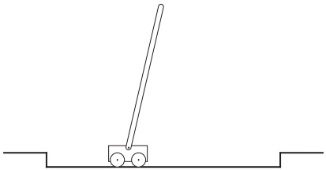

图 3.2: 平衡杆任务。

在本书中，我们通常使用一个在概念上稍复杂但数学上更简单的回报定义。

我们需要的额外概念是**折扣**。根据这种方法，智能体试图选择动作，以使其在未来收到的**折扣奖励之和**最大化。具体来说，它选择 $A_{t}$ 以最大化期望折扣回报：

$$
G_{t}=R_{t+1}+\gamma R_{t+2}+\gamma^{2}R_{t+3}+\cdots=\sum_{k=0}^{\infty}\gamma^{k}R_{t+k+1},   \tag*{(3.2)}
$$

其中 $\gamma$ 是一个参数，$0 \leq \gamma \leq 1$，称为**折扣率**。

折扣率决定了未来奖励的现值：在未来 $k$ 个时间步收到的奖励仅相当于立即收到时的 $\gamma^{k-1}$ 倍。如果 $\gamma < 1$，只要奖励序列 $\{R_k\}$ 有界，无穷级数就有一个有限值。如果 $\gamma = 0$，智能体是“短视的”，只关心最大化即时奖励：在这种情况下，其目标是学习如何选择 $A_t$，以便仅最大化 $R_{t+1}$。如果智能体的每个动作碰巧只影响即时奖励，而不影响未来的奖励，那么一个短视的智能体可以通过分别最大化每个即时奖励来最大化 (3.2)。但**通常**，为最大化即时奖励而采取的行动可能会减少获得未来奖励的机会，从而导致回报实际上可能减少。随着 $\gamma$ 接近 1，目标会**更强烈地**考虑未来奖励：智能体变得更加有远见。

示例 3.4：平衡杆 图 3.2 展示了一个作为强化学习早期例证的任务。这里的**目标**是向沿轨道移动的小车施加力，以使铰接在小车上的杆子保持不倒。如果杆子倾斜超过垂直方向某个给定角度，或者小车跑出轨道，则视为失败。每次失败后，杆子会被重置为垂直状态。这个任务可以视为**片段式**的，其中自然的片段就是反复尝试平衡杆子的过程。在这种任务中的奖励是

---

## 3.4. 分幕式和持续性任务的统一记号 61

这种情况下，**只要失败没有发生，每一步的奖励可以是 +1**，这样每一步的回报就是**直到失败为止的步数**。或者，我们可以将杆平衡视为一个持续性任务，并使用折扣。在这种情况下，每次失败时的奖励为 -1，其他所有时刻的奖励为零。那么，每一步的回报将与 $-\gamma^{K}$ 相关，其中 K 是失败前的时间步数。无论哪种情况，通过尽可能长时间地保持杆的平衡，回报都会被最大化。

## 3.4 分幕式和持续性任务的统一记号

在上一节中，我们描述了两种强化学习任务：一种是智能体与环境的交互自然地分解为一系列独立的分幕（分幕式任务），另一种则不是这样（持续性任务）。前一种情况在数学上更容易处理，因为每个动作只影响在该分幕后续收到的有限数量的奖励。在本书中，我们有时考虑一种问题，有时考虑另一种，但通常两者都会涉及。因此，建立一个能让我们同时精确讨论这两种情况的统一记号是很有用的。

要精确描述分幕式任务需要一些额外的记号。我们不需要考虑一个长的时间步序列，而是需要考虑一系列的分幕，每个分幕由有限个时间步组成。我们将每个分幕的时间步重新从零开始编号。因此，我们不仅需要引用 $S_{t}$（时间 $t$ 的状态表示），还需要引用 $S_{t,i}$（第 $i$ 个分幕中时间 $t$ 的状态表示）（对于 $A_{t,i}$、$R_{t,i}$、$\pi_{t,i}$、$T_{i}$ 等也是如此）。然而，事实证明，当我们讨论分幕式任务时，几乎不需要区分不同的分幕。我们几乎总是在考虑一个特定的单一分幕，或者陈述对所有分幕都成立的内容。因此，在实践中，我们几乎总是会稍微滥用记号，**省略对分幕编号的显式引用**。也就是说，我们会用 $S_{t}$ 来指代 $S_{t,i}$，等等。

我们还需要另一个约定，以获得一个涵盖分幕式和持续性任务的统一记号。在一种情况下，我们将回报定义为有限项的和（3.1），在另一种情况下则定义为无限项的和（3.2）。可以通过考虑将分幕终止视为**进入一个特殊的吸收状态**来统一这两种情况，该状态只能转移到自身，并且只产生零奖励。例如，考虑状态转移

---

示意图

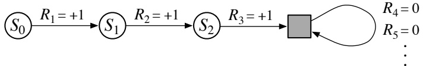

图中实心方块代表一个特殊的吸收状态，对应着**一个回合的结束**。从状态 $S_0$ 出发，我们得到的奖励序列是 $+1,+1,+1,0,0,0,\ldots$。无论我们只对前 T 个奖励求和（此处 T = 3），还是对完整的无限序列求和，得到的**回报**都是相同的。即使引入折扣因子，这一点依然成立。因此，我们可以根据 (3.2) 式来一般性地定义回报，并遵循一个惯例：在不需要时省略回合编号，并且如果求和仍有定义（例如，因为所有回合都会终止），则允许 $\gamma = 1$。或者，我们也可以将回报写为

$$
G_{t}=\sum_{k=0}^{T-t-1}\gamma^{k}R_{t+k+1},   \tag*{(3.3)}
$$

其中允许 $T = \infty$ 或 $\gamma = 1$（但**不允许两者同时成立** $^{6}$）。在本书后续部分，我们将使用这些约定来简化符号，并表达回合式任务与持续性任务之间的**紧密对应关系**。

####  $^{*}$3.5 马尔可夫性质

在强化学习框架中，智能体根据来自环境的某个信号做出决策，这个信号称为**环境的状态**。本节我们将讨论状态信号需要满足什么要求，以及我们期望它应该提供和不提供何种信息。特别地，我们将正式定义环境和其状态信号的一个特别重要的属性，称为**马尔可夫性质**。

在本书中，“状态”指的是智能体可以获得的**所有信息**。我们假设状态是由某个预处理系统给出的，该系统名义上是环境的一部分。本书不讨论构建、修改或学习状态信号的问题。我们采取这种方法，并非认为状态表示不重要，而是

---

为了专注于决策问题。换句话说，我们主要关心的不是设计状态信号，而是根据**任何可用的状态信号**来决定采取什么行动。

当然，状态信号应当包含诸如感官测量等即时感知，但它可以包含更多内容。状态表示可以是原始感知的高度处理版本，也可以是基于感知序列随时间构建的复杂结构。例如，我们可以让眼睛扫视一个场景，尽管在任何时刻只有对应于中央凹的一小块区域能清晰可见，但我们仍能构建出场景的丰富而详细的表示。或者，更显而易见的是，我们可以看着一个物体，然后移开视线，并且知道它仍然在那里。我们可以听到“是”这个词，并根据之前听到、现已不再可闻的问题，认为我们处于完全不同的状态。在更普通的层面上，控制系统可以测量两个不同时刻的位置，从而生成包含速度信息的状态表示。在所有这些情况下，状态都是基于即时感知以及先前的状态或某些对过去感知的记忆来构建和维护的。在本书中，我们不探讨这是如何完成的，但它当然可以并且已经被实现了。没有理由将状态表示限制在即时感知；在典型应用中，我们应当期望状态表示能够为智能体提供比这更多的信息。

另一方面，我们不应期望状态信号告知智能体关于环境的一切，甚至不应期望它告知决策所需的一切有用信息。如果智能体在玩二十一点，我们不应期望它知道牌堆中的下一张牌是什么。如果智能体在接电话，我们不应期望它提前知道来电者是谁。如果智能体是被叫到交通事故现场的急救人员，我们不应期望它立即知道昏迷受害者的内部伤势。在所有这些情况下，环境中都存在隐藏的状态信息，如果智能体知道这些信息将非常有用，但智能体无法知道，因为它从未接收到任何相关的感知。简而言之，我们不会因为智能体不知道某些重要信息而责备它，只会因为它曾经知道某些信息却忘记了而责备它！

理想情况下，我们希望的状态信号是能够**紧凑地总结过去的感知**，同时又保留所有相关信息。这通常需要的不仅仅是即时感知，但也绝不超过所有过去感知的完整历史。成功保留所有相关信息的信号被称为具有马尔可夫性，或拥有马尔可夫性质（我们在下文正式定义）。例如，跳棋的位置——棋盘上所有棋子的当前配置——可以作为马尔可夫状态，因为它总结了关于

---

导致当前状态的一系列位置信息大多已丢失，但**真正影响游戏未来发展的关键信息**得以保留。类似地，炮弹的当前位置和速度决定了其后续飞行轨迹，而**这些状态是如何形成的并不重要**。这种特性有时被称为"路径无关性"，因为**所有关键信息都蕴含在当前状态信号中**；其意义与导致该状态的信号"路径"或历史无关。

现在，我们正式定义强化学习问题中的马尔可夫性质。为简化数学表达，此处假设状态和奖励值数量有限。这使得我们可以使用求和与概率进行计算，而非积分和概率密度函数，但该论证可轻松扩展至连续状态和奖励的情况。考虑环境在$t+1$时刻如何响应$t$时刻采取的动作：在最一般的因果情况下，这种响应可能依赖于之前发生的所有事件。此时动态特性只能通过完整概率分布来定义：

$$
\Pr\{R_{t+1}=r,S_{t+1}=s^{\prime}\mid S_{0},A_{0},R_{1},\ldots,S_{t-1},A_{t-1},R_{t},S_{t},A_{t}\},   \tag*{(3.4)}
$$

其中$r$、$s'$取所有可能值，历史事件$S_0$、$A_0$、$R_1$、...、$S_{t-1}$、$A_{t-1}$、$R_t$、$S_t$、$A_t$也取所有可能值。**若状态信号具有马尔可夫性质**，则环境在$t+1$时刻的响应仅取决于$t$时刻的状态和动作表示，此时环境的动态特性仅需通过下式定义：

$$
p(s^{\prime},r|s,a)=\Pr\{R_{t+1}=r,S_{t+1}=s^{\prime}\mid S_{t},A_{t}\},   \tag*{(3.5)}
$$

对所有$r$、$s'$、$S_{t}$和$A_{t}$成立。换言之，当且仅当对所有$s'$、$r$及历史序列$S_{0}$、$A_{0}$、$R_{1}$、...、$S_{t-1}$、$A_{t-1}$、$R_{t}$、$S_{t}$、$A_{t}$满足(3.5)式等于(3.4)式时，状态信号才具有马尔可夫性质并成为马尔可夫状态。在这种情况下，整个环境和任务也被认为具有马尔可夫性质。

**若环境具备马尔可夫性质**，则其单步动态特性(3.5)使我们能够根据当前状态和动作预测下一状态及期望奖励。可以证明，通过迭代此方程，仅凭当前状态知识就能预测所有未来状态和期望奖励，其效果与掌握截至当前时刻的完整历史信息相当。**由此可得，马尔可夫状态为行动选择提供了最优基础**：即基于马尔可夫状态的行动选择最优策略，与基于完整历史信息的行动选择最优策略具有同等效力。

**即使状态信号不具备马尔可夫性质**，在强化学习中仍可将状态视为马尔可夫状态的近似表示。

---

特别地，我们始终希望状态能成为预测未来奖励和选择动作的良好基础。在学习环境模型的情况下（见第8章），我们还希望状态能成为预测后续状态的良好基础。**马尔可夫状态为完成所有这些任务提供了无与伦比的基础**。状态在这些方面越接近马尔可夫状态的能力，强化学习系统的性能就越好。基于所有这些原因，将每个时间步的状态视为马尔可夫状态的近似是有益的，尽管我们应该记住它可能不完全满足马尔可夫性质。

马尔可夫性质在强化学习中至关重要，因为决策和价值被假定为仅与当前状态有关。为了使这些决策和价值有效且信息丰富，状态表示必须具有信息量。本书提出的所有理论都假设状态信号是马尔可夫的。这意味着并非所有理论都严格适用于马尔可夫性质不完全成立的情况。然而，针对马尔可夫情况发展的理论仍有助于我们理解算法的行为，并且这些算法可以成功应用于许多状态并非严格马尔可夫的任务。**充分理解马尔可夫情况的理论，是将其扩展到更复杂、更现实的非马尔可夫情况的重要基础**。最后，我们注意到，马尔可夫状态表示的假设并非强化学习所独有，在几乎所有其他人工智能方法中也同样存在。

**示例3.5：平衡杆状态** 在之前介绍的平衡杆任务中，如果状态信号能精确指定或能够精确重构小车在轨道上的位置和速度、小车与杆之间的角度以及该角度的变化率（角速度），那么该状态信号就是马尔可夫的。在理想的小车-杆系统中，给定控制器采取的动作，这些信息足以精确预测小车和杆的未来行为。然而在实践中，由于任何真实传感器都会在测量中引入一定的失真和延迟，因此永远不可能精确获知这些信息。此外，在任何真实的小车-杆系统中，总是存在其他因素，如杆的弯曲、轮子和杆轴承的温度以及各种形式的间隙，这些因素会略微影响系统的行为。如果状态信号仅包含小车和杆的位置和速度，这些因素将导致违反马尔可夫性质。

然而，位置和速度通常能很好地作为状态。一些早期关于学习解决平衡杆任务的研究使用了粗糙的状态信号，将小车位置划分为三个区域：右、左和中（并对其他三个内在状态变量进行了类似的粗略量化）。这种明显非马尔可夫的状态足以解决该任务。

---

通过强化学习方法可以轻松学习。事实上，这种粗糙的表示可能通过迫使智能体忽略那些对解决任务无用的细微差别，从而促进了快速学习。

**示例3.6：抽牌扑克** 在抽牌扑克中，每位玩家会获得五张手牌。经过一轮下注后，每位玩家可以用部分手牌交换新牌，然后进行最终下注轮。在每一轮中，每位玩家必须匹配或超过其他玩家的最高下注额，否则退出（弃牌）。第二轮下注后，未弃牌且手牌最佳的玩家获胜并赢得所有赌注。

抽牌扑克中的状态信号对每位玩家而言是不同的。每位玩家知道自己手中的牌，但只能猜测其他玩家手中的牌。一个常见的误解是认为马尔可夫状态信号应包含所有玩家的手牌内容以及牌堆中剩余的牌。然而，在公平游戏中，我们假设玩家原则上无法从过去的观察中确定这些信息。如果玩家确实知道这些，那么她将能够比仅记住所有过去观察更好地预测某些未来事件（例如可以交换的牌）。

除了知道自己手中的牌外，抽牌扑克中的状态还应包括其他玩家的下注额和抽牌数量。例如，如果其他玩家中的一位抽取了三张新牌，你可能会怀疑他保留了一对，并据此调整对他手牌强度的猜测。玩家的下注也会影响你对他们手牌的评估。**实际上，你与这些特定玩家过去的大部分互动历史都是马尔可夫状态的一部分**。艾伦喜欢虚张声势，还是保守行事？她的表情或举止是否透露了她手牌的强弱线索？乔的玩法在深夜或他已经赢了很多钱时会如何变化？

尽管关于其他玩家的一切观察都可能影响他们持有各种手牌的概率，但实际上这些信息太多而无法记忆和分析，且其中大部分对预测和决策没有明显影响。**优秀的扑克玩家擅长记住关键线索，并能快速评估新玩家**，但没有人能记住所有相关信息。因此，人们用于做出扑克决策的状态表示无疑是非马尔可夫的，决策本身也可能不完美。尽管如此，人们在此类任务中仍能做出非常好的决策。我们得出结论：**无法获得完美的马尔可夫状态表示对于强化学习智能体而言可能不是一个严重问题**。

---

## 3.6 马尔可夫决策过程

满足马尔可夫性质的强化学习任务被称为马尔可夫决策过程，简称 MDP。如果状态空间和动作空间是有限的，则称之为有限马尔可夫决策过程。有限 MDP 对强化学习理论尤为重要。本书将广泛探讨它们；**理解了有限 MDP，你就能掌握现代强化学习 90% 的内容**。

一个特定的有限 MDP 由其状态集、动作集以及环境的一步动态特性所定义。给定任意状态 s 和动作 a，下一个状态和奖励的每种可能组合 $s', r$ 的概率表示为

$$
p(s^{\prime},r|s,a)=\Pr\{S_{t+1}=s^{\prime},R_{t+1}=r\mid S_{t}=s,A_{t}=a\}.   \tag*{(3.6)}
$$

这些量完全规定了一个有限 MDP 的动态特性。本书后续章节提出的大多数理论都隐含地假设环境是一个有限 MDP。

给定由 (3.6) 式规定的动态特性，我们可以计算出关于环境的任何其他所需信息，例如状态-动作对的期望奖励，

$$
r(s,a)=\mathbb{E}[R_{t+1}\mid S_{t}=s,A_{t}=a]=\sum_{r\in\mathcal{R}}r\sum_{s^{\prime}\in\mathcal{S}}p(s^{\prime},r|s,a),   \tag*{(3.7)}
$$

状态转移概率，

$$
p(s^{\prime}|s,a)=\Pr\{S_{t+1}=s^{\prime}\mid S_{t}=s,A_{t}=a\}=\sum_{r\in\mathcal{R}}p(s^{\prime},r|s,a),   \tag*{(3.8)}
$$

以及状态-动作-下一状态三元组的期望奖励，

$$
r(s,a,s^{\prime})=\mathbb{E}[R_{t+1}\mid S_{t}=s,A_{t}=a,S_{t+1}=s^{\prime}]=\frac{\sum_{r\in\mathbb{R}}r p(s^{\prime},r|s,a)}{p(s^{\prime}|s,a)}.   \tag*{(3.9)}
$$

在本书的第一版中，动态特性完全用后两个量表示，分别记为 $\mathcal{P}_{ss'}^{a}$ 和 $\mathcal{R}_{ss'}^{a}$。该记法的一个缺点是它仍未完全刻画奖励的动态特性，只给出了其期望值。另一个缺点是下标和上标过多。在本版中，我们将主要使用 (3.6) 式的显式记法，有时会直接引用转移概率 (3.8) 式。

**示例 3.7：回收机器人 MDP** 通过简化回收机器人（示例 3.3）并

---

提供一些更详细的说明。（我们的目标是构建一个简单的示例，而非特别逼真的场景。）回想一下，智能体在由外部事件（或机器人控制系统的其他部分）决定的时间点做出决策。在每个这样的时刻，机器人需要决定它应该（1）主动寻找易拉罐，（2）保持静止并等待有人给它带来易拉罐，还是（3）返回基地充电。假设环境的工作方式如下：寻找易拉罐的最佳方式是主动搜索，但这会消耗机器人的电池，而等待则不会。每当机器人进行搜索时，其电池都有可能耗尽。在这种情况下，机器人必须关闭并等待救援（产生低回报）。

智能体的决策**完全基于电池的能量水平**。它能够区分两种水平：高和低，因此状态集为 $\mathcal{S} = \{high, low\}$。我们将可能的决策——即智能体的动作——称为等待、搜索和充电。当能量水平高时，充电总是愚蠢的行为，因此我们**不将其包含在该状态的动作集中**。智能体的动作集如下：

 
$$
\begin{array}{r l r}{\mathcal{A}(\mathrm{h i g h})}&{=}&{\{\mathrm{s e a r c h,w a i t}\}}\end{array}
$$
 

 
$$
\begin{array}{r l r}{\mathcal{A}(\mathrm{l o w})}&{=}&{\{\mathrm{s e a r c h,w a i t,r e c h a r g e}\}.}\end{array}
$$
 

如果能量水平高，则一段主动搜索的周期总是可以完成，而**没有耗尽电池的风险**。以高能量水平开始的搜索周期，有概率 $\alpha$ 使能量水平保持高，有概率 $1 - \alpha$ 将其降低至 $10w$。另一方面，在能量水平为 $10w$ 时进行的搜索周期，有概率 $\beta$ 使其保持 $10w$，有概率 $1 - \beta$ 耗尽电池。在后一种情况下，机器人必须被救援，之后电池会被重新充至高能量水平。机器人收集的每个易拉罐计为一个单位奖励，而每当机器人需要被救援时，会产生 -3 的奖励。设 $r_{search}$ 和 $r_{wait}$（其中 $r_{search} > r_{wait}$）分别表示机器人在搜索和等待时预期收集的易拉罐数量（即预期奖励）。最后，为了简化起见，假设在返回充电的途中无法收集易拉罐，且在电池耗尽的时间步也无法收集易拉罐。该系统便是一个有限 MDP，我们可以写出其转移概率和预期奖励，如表 3.1 所示。

转移图是总结有限 MDP 动态的一种有用方式。图 3.3 展示了回收机器人示例的转移图。图中包含两种节点：状态节点和动作节点。每个可能的状态都有一个状态节点（一个标有状态名称的大空心圆），每个状态-动作对都有一个动作节点（一个标有动作名称的小实心圆）。

---

| s | s' | a | $p(s' \| s, a)$ | $r(s, a, s')$ |
| :--- | :--- | :--- | :--- | :--- |
| high | high | search | $\alpha$ | $r_{\text{search}}$ |
| high | low | search | $1 - \alpha$ | $r_{\text{search}}$ |
| low | high | search | $1 - \beta$ | $-3$ |
| low | low | search | $\beta$ | $r_{\text{search}}$ |
| high | high | wait | 1 | $r_{\text{wait}}$ |
| high | low | wait | 0 | $r_{\text{wait}}$ |
| low | high | wait | 0 | $r_{\text{wait}}$ |
| low | low | wait | 1 | $r_{\text{wait}}$ |
| low | high | recharge | 1 | 0 |
| low | low | recharge | 0 | 0. |

表 3.1：回收机器人示例中有限 MDP 的转移概率和期望奖励。每一行对应一个可能的组合，包括当前状态 s、下一状态 s' 以及**在当前状态下可能的动作** $a \in \mathcal{A}(s)$。

（通过动作名称标识，并用一条线连接到状态节点）。从状态 $s$ 开始并采取动作 $a$，将使您沿着从状态节点 $s$ 到动作节点 $(s,a)$ 的连线移动。然后，环境通过离开动作节点 $(s,a)$ 的其中一个箭头进行响应，**转移到下一个状态节点**。每个箭头对应一个三元组 $(s,s',a)$，其中 $s'$ 是下一个状态，我们在箭头上标注了转移概率 $p(s'\|s,a)$ 以及该转移的期望奖励 $r(s,a,s')$。请注意，**离开动作节点的箭头所标注的转移概率之和始终为 1**。

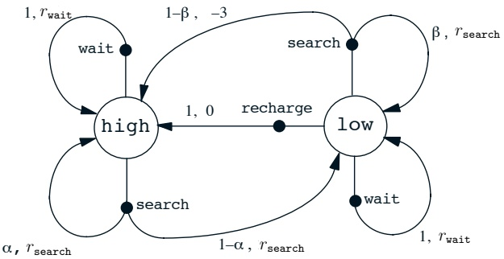

图 3.3：回收机器人示例的转移图。

---

## 3.7 价值函数

几乎所有的强化学习算法都涉及价值函数的估计——这些函数基于状态（或状态-动作对）来评估智能体处于某个特定状态有多好（或在某个特定状态下执行某个特定动作有多好）。这里的“有多好”是根据**未来可预期的奖励**来定义的，或者更准确地说，是根据**预期回报**来定义的。当然，智能体未来预期能获得的奖励取决于它将采取什么行动。因此，价值函数是相对于特定策略定义的。

回想一下，策略 $\pi$ 是从每个状态 $s \in \mathcal{S}$ 和动作 $a \in \mathcal{A}(s)$ 到在状态 $s$ 时采取动作 $a$ 的概率 $\pi(a|s)$ 的映射。非正式地说，在策略 $\pi$ 下状态 $s$ 的价值，记作 $v_{\pi}(s)$，是指从状态 $s$ 开始并随后遵循策略 $\pi$ 所能获得的**预期回报**。对于马尔可夫决策过程，我们可以将 $v_{\pi}(s)$ 正式定义为

$$
v_{\pi}(s)=\mathbb{E}_{\pi}[G_{t}\mid S_{t}=s]=\mathbb{E}_{\pi}\left[\sum_{k=0}^{\infty}\gamma^{k}R_{t+k+1}\middle|S_{t}=s\right],   \tag*{(3.10)}
$$

其中 $\mathbb{E}_{\pi}[\cdot]$ 表示在智能体遵循策略 $\pi$ 的条件下随机变量的期望值，$t$ 是任意时间步。注意，终止状态（如果存在）的价值始终为零。我们称函数 $v_{\pi}$ 为策略 $\pi$ 的**状态价值函数**。

类似地，我们定义在策略 $\pi$ 下，于状态 $s$ 采取动作 $a$ 的价值，记作 $q_{\pi}(s,a)$，为从状态 $s$ 开始，采取动作 $a$，然后遵循策略 $\pi$ 所能获得的预期回报：

$$
q_{\pi}(s,a)=\mathbb{E}_{\pi}[G_{t}\mid S_{t}=s,A_{t}=a]=\mathbb{E}_{\pi}\Biggl[\sum_{k=0}^{\infty}\gamma^{k}R_{t+k+1}\Biggr|\;S_{t}=s,A_{t}=a\Biggr].   \tag*{(3.11)}
$$

我们称 $q_{\pi}$ 为策略 $\pi$ 的**动作价值函数**。

价值函数 $v_{\pi}$ 和 $q_{\pi}$ 可以通过经验来估计。例如，如果一个智能体遵循策略 $\pi$，并对遇到的每个状态维护一个跟随该状态的实际回报的平均值，那么当该状态遇到的次数趋近于无穷时，这个平均值将收敛于该状态的价值 $v_{\pi}(s)$。如果对一个状态下采取的每个动作都分别维护一个平均值，那么这些平均值同样会收敛于动作价值 $q_{\pi}(s,a)$。我们称这类估计方法为**蒙特卡洛方法**，因为它们涉及对实际回报的许多随机样本进行平均。这类方法将在第5章介绍。当然，如果状态非常多，那么为每个状态（或状态-动作对）分别维护一个平均值可能是不切实际的。

---

相反，智能体必须将 $v_{\pi}$ 和 $q_{\pi}$ 作为参数化函数进行维护，并调整参数以更好地匹配观测到的回报。这也能产生准确的估计，尽管很大程度上取决于参数化函数逼近器的性质（第9章）。

贯穿强化学习和动态规划的价值函数的一个基本性质是，它们满足特定的递归关系。对于任何策略 $\pi$ 和任何状态 $s$，以下一致性条件在状态 $s$ 的值与其可能的后继状态的值之间成立：

$$
\begin{align*}v_{\pi}(s)\quad&=\quad\mathbb{E}_{\pi}[G_{t}\quad|S_{t}=s]\\&=\quad\mathbb{E}_{\pi}\Biggl[\sum_{k=0}^{\infty}\gamma^{k}R_{t+k+1}\quad\Biggl|S_{t}=s\Biggr]\\&=\quad\mathbb{E}_{\pi}\Biggl[R_{t+1}+\gamma\sum_{k=0}^{\infty}\gamma^{k}R_{t+k+2}\quad\Biggl|S_{t}=s\Biggr]\\&=\quad\sum_{a}\pi(a|s)\sum_{s^{\prime}}\sum_{r}p(s^{\prime},r|s,a)\Biggl[r+\gamma\mathbb{E}_{\pi}\Biggl[\sum_{k=0}^{\infty}\gamma^{k}R_{t+k+2}\quad\Biggl|S_{t+1}=s^{\prime}\Biggr]\Biggr]\\&=\quad\sum_{a}\pi(a|s)\sum_{s^{\prime},r}p(s^{\prime},r|s,a)\Biggl[r+\gamma v_{\pi}(s^{\prime})\Biggr],\quad(3.12)\end{align*}
$$

其中隐含地假设动作 $a$ 取自集合 $\mathcal{A}(s)$，下一个状态 $s'$ 取自集合 $\mathcal{S}$（或在分幕式问题中取自 $\mathcal{S}^{+}$），奖励 $r$ 取自集合 $\mathcal{R}$。还需注意，在最后一个方程中，**我们将分别对 $s'$ 的所有值和 $r$ 的所有值求和的两个求和式，合并成了一个对两者所有可能值的求和**。我们将经常使用这种合并求和的方式来简化公式。注意，最终的表达式可以非常容易地解读为一个期望值。它实际上是对三个变量 $a$、$s'$ 和 $r$ 的所有值求和。对于每个三元组，我们计算其概率 $\pi(a|s)p(s',r|s,a)$，用该概率对括号内的量进行加权，然后对所有可能性求和以得到期望值。

方程（3.12）是 $v_{\pi}$ 的**贝尔曼方程**。它表达了一个状态的值与其后继状态的值之间的关系。想象一下，如图3.4a所示，从一个状态前瞻其可能的后继状态。每个空心圆代表一个状态，每个实心圆代表一个状态-动作对。从状态 $s$（顶部的根节点）开始，智能体可以采取任意一组动作中的任何一个——图3.4a中展示了三个。对于每个动作，环境都可能以某个后继状态 $s'$ 和奖励 $r$ 作为响应。贝尔曼方程（3.12）对所有可能性进行平均，并根据其发生的概率进行加权。它表明，**状态 $s$ 的值必须等于从 $s$ 出发可能获得的即时奖励，加上后继状态的折扣值的期望**。

---

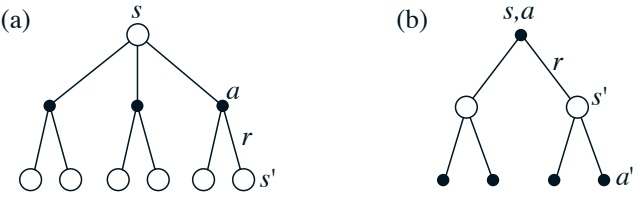

图 3.4: (a)  $v_{\pi}$ 和 (b)  $q_{\pi}$ 的回溯图。

起始状态的值必须等于预期下一个状态的（折扣后）值，加上沿途预期的奖励。

价值函数  $v_{\pi}$ 是其贝尔曼方程的唯一解。在后续章节中，我们将展示这个贝尔曼方程如何构成计算、近似和学习  $v_{\pi}$ 的多种方法的基础。我们称图 3.4 中所示的图为回溯图，因为它们图解了构成强化学习方法核心的更新或回溯操作基础的关系。这些操作将价值信息从其后续状态（或状态-动作对）传递回一个状态（或状态-动作对）。我们在全书中使用回溯图来为我们讨论的算法提供图形化总结。（请注意，与转移图不同，回溯图中的状态节点不一定代表不同的状态；例如，一个状态可能是它自身的后续状态。我们还省略了明确的箭头，因为在回溯图中时间总是向下流动的。）

**示例 3.8：网格世界** 图 3.5a 使用矩形网格来说明一个简单有限 MDP 的价值函数。网格的单元格对应环境的状态。在每个单元格中，有四种可能的动作：北、南、东、西，这些动作会确定性地导致智能体在网格上沿相应方向移动一个单元格。会使智能体移出网格的动作会使其位置保持不变，但也会导致 -1 的奖励。其他动作的奖励为 0，除了那些使智能体离开特殊状态 A 和 B 的动作。从状态 A 出发，所有四个动作都会产生 +10 的奖励，并将智能体带到 A'。从状态 B 出发，所有动作都会产生 +5 的奖励，并将智能体带到 B'。

假设智能体在所有状态下以相等概率选择所有四个动作。图 3.5b 显示了该策略在折扣奖励情况下的价值函数  $v_{\pi}$，其中  $\gamma = 0.9$。该价值函数是通过求解方程组 (3.12) 计算得出的。注意下边缘附近的负值；这些是随机策略下在该处**高概率**撞到网格边缘的结果。在该策略下，状态 A 是**最佳**状态。

---

## 3.7. 价值函数

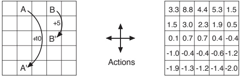

图 3.5：网格示例：(a) 特殊的奖励动态；(b) 等概率随机策略的状态价值函数。

**但它的期望回报小于其即时奖励 10**，因为从状态 A 出发，智能体会被带到 A'，之后它很可能会撞到网格边缘。另一方面，状态 B 的价值则高于其即时奖励 5，因为从 B 出发，智能体会被带到具有正价值的 B'。从 B' 出发，可能撞到边缘的预期惩罚（负奖励）会被可能偶然进入 A 或 B 的预期收益所抵消。

**示例 3.9：高尔夫** 为了将打一个高尔夫球洞表述为强化学习任务，我们在将球击入洞之前，对每一次击球计一个 -1 的惩罚（负奖励）。状态是球的位置。一个状态的价值是**从该位置到球洞所需击球次数的负值**。我们的行动当然包括如何瞄准和挥杆，以及选择哪根球杆。让我们假设前者是给定的，只考虑球杆的选择，我们假设球杆要么是推杆，要么是开球杆。图 3.6 的上半部分显示了一个可能的状态价值函数 $v_{\text{putt}}(s)$，对应始终使用推杆的策略。**球进洞的终止状态价值为 0**。假设我们从果岭上的任何位置都可以推杆进洞；这些状态的价值为 -1。在果岭外，我们无法通过推杆进洞，因此价值更大。如果我们从一个状态通过推杆可以到达果岭，那么该状态的价值必须比果岭的价值少 1，即 -2。为简化起见，假设我们的推杆非常精确且确定，但距离有限。这给我们带来了图中标为 -2 的尖锐等高线；该线与果岭之间的所有位置都需要恰好两杆才能完成进洞。类似地，在 -2 等高线推杆范围内的任何位置，其价值必然为 -3，依此类推，得到图中所示的所有等高线。推杆无法让我们脱离沙坑，因此它们的价值为 -∞。总体而言，**使用推杆从发球台到球洞需要六杆**。

---

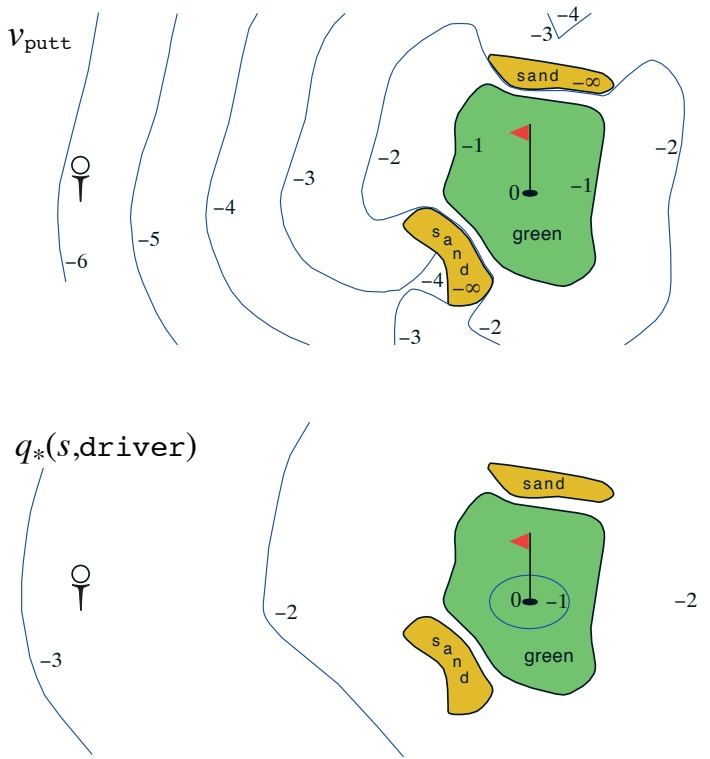

图 3.6：高尔夫示例：**推杆状态价值函数**（上图）与**使用一号木杆的最优动作价值函数**（下图）。

---

## 3.8 最优价值函数

**大致来说，解决一个强化学习任务意味着找到一个能在长期内获得大量奖励的策略。** 对于有限马尔可夫决策过程，我们可以通过以下方式精确定义一个最优策略。价值函数定义了策略之间的偏序关系。如果一个策略 $\pi$ 在所有状态下的期望回报都大于或等于另一个策略 $\pi'$ 的期望回报，则称 $\pi$ 优于或等于 $\pi'$。换言之，当且仅当对于所有 $s \in S$ 都有 $v_{\pi}(s) \geq v_{\pi'}(s)$ 时，$\pi \geq \pi'$。**总是存在至少一个策略，它优于或等于所有其他策略。这就是最优策略。** 尽管最优策略可能不止一个，我们用 $\pi_*$ 来表示所有最优策略。它们共享相同的状态价值函数，称为最优状态价值函数，记作 $v_*$，其定义为

$$
v_{*}(s)=\max_{\pi}v_{\pi}(s),   \tag*{(3.13)}
$$

对于所有 $s \in \mathcal{S}$ 成立。

最优策略也共享相同的最优动作价值函数，记作 $q_{*}$，其定义为

$$
q_{*}(s,a)=\max_{\pi}q_{\pi}(s,a),   \tag*{(3.14)}
$$

对于所有 $s \in \mathcal{S}$ 和 $a \in \mathcal{A}(s)$ 成立。对于状态-动作对 $(s, a)$，这个函数给出了在状态 $s$ 采取动作 $a$，然后遵循一个最优策略所能获得的期望回报。因此，我们可以用 $v_*$ 来表示 $q_*$，如下所示：

$$
q_{*}(s,a)=\mathbb{E}[R_{t+1}+\gamma v_{*}(S_{t+1})\mid S_{t}=s,A_{t}=a].   \tag*{(3.15)}
$$

**示例 3.10：高尔夫的最优价值函数** 图 3.6 的下半部分展示了一个可能的最优动作价值函数 $q_{*}(s,\text{driver})$ 的等高线。这些值表示如果我们先用一号木击球，之后选择一号木或推杆中较好的那个，每个状态的价值。一号木能使球打得更远，但精度较低。我们只有离洞非常近时，才能用一号木一杆进洞；因此，$q_{*}(s,\text{driver})$ 的 -1 等高线只覆盖了果岭的一小部分。然而，如果我们有两杆的机会，那么我们可以从更远的地方到达球洞，如 -2 等高线所示。在这种情况下，我们不需要一杆就打到那个小的 -1 等高线区域内，只需要打到果岭上的任何地方即可；从那里我们可以使用推杆。**最优动作价值函数给出了在决定采用一个特定的初始动作（本例中是使用一号木）之后，但之后采用最优动作时的价值。** -3 等高线离得更远，并且包含了发球台。从发球台出发，最优的动作序列是两次一号木击球加一次推杆，三杆将球击入洞中。

---

由于 $v_{*}$ 是一个策略对应的价值函数，它必须满足状态价值的贝尔曼方程 (3.12) 所给出的自洽条件。然而，由于它是最优价值函数，$v_{*}$ 的自洽条件可以写成一种特殊形式，**而不涉及任何具体策略**。这就是 $v_{*}$ 的贝尔曼方程，或称**贝尔曼最优方程**。直观上，贝尔曼最优方程表达了这样一个事实：在最优策略下，一个状态的价值必须等于从该状态出发执行**最佳行动**所能获得的期望回报：

$$
\begin{array}{r c l}{v_{*}(s)}&{=}&{\displaystyle\operatorname*{m a x}_{a\in\mathcal{A}(s)}q_{\pi_{*}}(s,a)}\\ {}&{=}&{\displaystyle\operatorname*{m a x}_{a}\mathbb{E}_{\pi^{*}}[G_{t}\mid S_{t}=s,A_{t}=a]}\\ {}&{=}&{\displaystyle\operatorname*{m a x}_{a}\mathbb{E}_{\pi^{*}}\left[\sum_{k=0}^{\infty}\gamma^{k}R_{t+k+1}\Bigg\vert S_{t}=s,A_{t}=a\right]}\\ {}&{=}&{\displaystyle\operatorname*{m a x}_{a}\mathbb{E}_{\pi^{*}}\left[R_{t+1}+\gamma\sum_{k=0}^{\infty}\gamma^{k}R_{t+k+2}\Bigg\vert S_{t}=s,A_{t}=a\right]}\\ {}&{=}&{\displaystyle\operatorname*{m a x}_{a}\mathbb{E}[R_{t+1}+\gamma v_{*}(S_{t+1})\mid S_{t}=s,A_{t}=a]}\\ {}&{=}&{\displaystyle\operatorname*{m a x}_{a\in\mathcal{A}(s)}\sum_{s^{\prime},r}p(s^{\prime},r\vert s,a)\big[r+\gamma v_{*}(s^{\prime})\big].}\\ \end{array}   \tag*{(3.16)}
$$

最后两个等式是 $v_{*}$ 的贝尔曼最优方程的两种形式。$q_{*}$ 的贝尔曼最优方程为：

 
$$
\begin{align*}q_{*}(s,a)\ &=\mathbb{E}\Big[R_{t+1}+\gamma\max_{a^{\prime}}q_{*}(S_{t+1},a^{\prime})\ \Big|\ S_{t}=s,A_{t}=a\Big]\\&=\sum_{s^{\prime},r}p(s^{\prime},r|s,a)\Big[r+\gamma\max_{a^{\prime}}q_{*}(s^{\prime},a^{\prime})\Big].\end{align*}
$$
 

图 3.7 中的回溯图直观地展示了在 $v_{*}$ 和 $q_{*}$ 的贝尔曼最优方程中，所考虑的未来状态和行动的覆盖范围。这些图与 $v_{\pi}$ 和 $q_{\pi}$ 的回溯图相同，只是在智能体的选择点上增加了弧线，以表示**对该选择取最大值**，而不是基于某个策略取期望值。图 3.7a 直观地表示了贝尔曼最优方程 (3.17)。

对于有限马尔可夫决策过程，贝尔曼最优方程 (3.17) 具有一个**与策略无关的唯一解**。贝尔曼最优方程实际上是一个方程组，每个状态对应一个方程，因此如果有 $N$ 个状态，就存在包含 $N$ 个未知数的 $N$ 个方程。**如果环境的动态特性已知** $(p(s', r|s, a))$，那么在原则上就可以求解这个方程组。

---

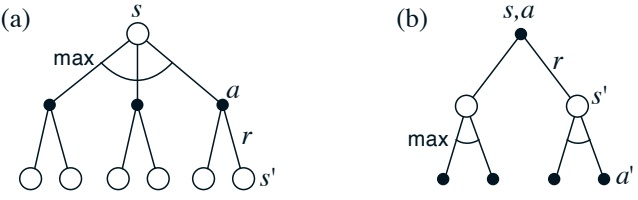

图 3.7: (a) $v_{*}$ 和 (b) $q_{*}$ 的回溯图

我们可以使用多种求解非线性方程组的方法中的任何一种来求解 $v_{*}$。同样，也可以求解一组相关的方程来得到 $q_{*}$。

一旦我们得到了 $v_{*}$，确定一个最优策略就相对容易了。对于每个状态 $s$，在贝尔曼最优性方程中取得最大值的动作可能有一个或多个。**任何只将这些动作赋予非零概率的策略都是最优策略**。你可以将其看作是一步搜索。如果你拥有了最优价值函数 $v_{*}$，那么经过一步搜索后看起来最优的动作就是最优动作。换句话说，**任何相对于最优评估函数 $v_{*}$ 是贪婪的策略都是最优策略**。在计算机科学中，“贪婪”一词用于描述任何仅基于局部或即时考虑来选择替代方案的搜索或决策过程，而不考虑这种选择可能会阻碍未来获得更好替代方案的可能性。因此，它描述的是仅根据动作的短期后果来选择动作的策略。$v_{*}$ 的美妙之处在于，**如果用它来评估动作的短期后果——具体来说，就是一步后果——那么贪婪策略实际上就是我们感兴趣的长期意义上的最优策略**，因为 $v_{*}$ 已经考虑到了所有可能的未来行为所带来的奖励后果。通过 $v_{*}$，最优的期望长期回报被转化为一个对每个状态而言都是局部且立即可用的量。因此，一步前瞻搜索就能产生长期最优的动作。

拥有 $q_{*}$ 使得选择最优动作变得更加容易。有了 $q_{*}$，智能体甚至不需要进行一步前瞻搜索：对于任何状态 $s$，它只需找到能最大化 $q_{*}(s,a)$ 的任何一个动作即可。**动作价值函数有效地缓存了所有一步前瞻搜索的结果**。它为每个“状态-动作”对提供了一个局部且立即可用的值，这个值就是最优的期望长期回报。因此，**以表示一个关于“状态-动作”对的函数（而不仅仅是关于状态的函数）为代价，最优动作价值函数允许我们在无需了解任何可能的后续状态及其价值的情况下选择最优动作**，也就是说，无需了解

---

关于环境动态的任何信息。

**示例 3.11：回收机器人的贝尔曼最优方程** 利用 (3.17) 式，我们可以明确给出回收机器人示例的贝尔曼最优方程。为了更简洁，我们分别用 **h**、**l**、**s**、**w** 和 **re** 来缩写状态 **high** 和 **low**，以及动作 **search**、**wait** 和 **recharge**。由于只有两个状态，贝尔曼最优方程由两个方程组成。**$v_{*}(h)$** 的方程可以写成如下形式：

$$
\begin{array}{r c l}{v_{*}(\mathbf{h})}&{=}&{\operatorname*{m a x}\left\{\begin{array}{l}{p(\mathbf{h}|\mathbf{h},\mathbf{s})[r(\mathbf{h},\mathbf{s},\mathbf{h})+\gamma v_{*}(\mathbf{h})]+p(\mathbf{l}|\mathbf{h},\mathbf{s})[r(\mathbf{h},\mathbf{s},\mathbf{l})+\gamma v_{*}(\mathbf{l})],}\\ {p(\mathbf{h}|\mathbf{h},\mathbf{w})[r(\mathbf{h},\mathbf{w},\mathbf{h})+\gamma v_{*}(\mathbf{h})]+p(\mathbf{l}|\mathbf{h},\mathbf{w})[r(\mathbf{h},\mathbf{w},\mathbf{l})+\gamma v_{*}(\mathbf{l})]}\end{array}\right\}}\\ {}&{=}&{\operatorname*{m a x}\left\{\begin{array}{l}{\alpha[r_{\mathbf{s}}+\gamma v_{*}(\mathbf{h})]+(1-\alpha)[r_{\mathbf{s}}+\gamma v_{*}(\mathbf{l})],}\\ {1[r_{\mathbf{w}}+\gamma v_{*}(\mathbf{h})]+0[r_{\mathbf{w}}+\gamma v_{*}(\mathbf{l})]}\end{array}\right\}}\\ {}&{=}&{\operatorname*{m a x}\left\{\begin{array}{l}{r_{\mathbf{s}}+\gamma[\alpha v_{*}(\mathbf{h})+(1-\alpha)v_{*}(\mathbf{l})],}\\ {r_{\mathbf{w}}+\gamma v_{*}(\mathbf{h})}\end{array}\right\}.}\\ \end{array}
$$

对 **$v_{*}(l)$** 遵循相同的步骤，得到方程：

$$
v_{*}(\mathbf{l})=\max\left\{\begin{array}{l}\beta r_{\mathbf{s}}-3(1-\beta)+\gamma[(1-\beta)v_{*}(\mathbf{h})+\beta v_{*}(\mathbf{l})]\\ r_{\mathbf{w}}+\gamma v_{*}(\mathbf{l}),\\ \gamma v_{*}(\mathbf{h})\end{array}\right\}.
$$

对于 **$r_{\mathbf{s}}$**、**$r_{\mathbf{w}}$**、**$\alpha$**、**$\beta$** 和 **$\gamma$** 的任何选择，只要满足 **$0 \leq \gamma < 1$**、**$0 \leq \alpha, \beta \leq 1$**，则恰好存在一对数 **$v_{*}(\mathbf{h})$** 和 **$v_{*}(l)$**，同时满足这两个非线性方程。

**示例 3.12：求解网格世界** 假设我们为示例 3.8 中介绍并在图 3.8a 中再次展示的简单网格任务，求解 **$v_{*}$** 的贝尔曼方程。回想一下，状态 A 之后会获得 +10 的奖励并转移到状态 **$A'$**，而状态 B 之后会获得 +5 的奖励并转移到状态 **$B'$**。图 3.8b 展示了最优价值函数，图 3.8c 展示了相应的最优策略。在单元格中有多个箭头的地方，任何对应的动作都是最优的。

显式求解贝尔曼最优方程提供了寻找最优策略，从而解决强化学习问题的一条途径。然而，这种解法很少直接有用。它类似于穷举搜索，**前瞻所有可能性**，计算它们发生的概率以及根据期望奖励衡量的合意性。这种解法依赖于在实践中很少成立的至少三个假设：(1) 我们准确知道环境的动态；(2) 我们有足够的计算资源来完成解的求解；(3) 马尔可夫性。对于我们感兴趣的这类任务，通常

---

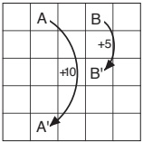

a) 网格世界

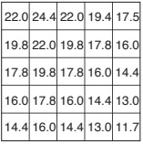

b) V*

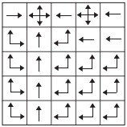

c) $\pi_{*}$

图 3.8：网格世界示例的最优解。

通常，我们**无法精确实现这种解决方案**，因为上述假设的各种组合常常无法满足。例如，尽管第一和第三条假设在西洋双陆棋游戏中不成问题，但第二条假设是一个**主要障碍**。由于该游戏大约有 $10^{20}$ 种状态，即使在当今最快的计算机上，求解 $v_{*}$ 的贝尔曼方程也需要数千年，寻找 $q_{*}$ 亦是如此。在强化学习中，通常**不得不满足于近似解**。

许多不同的决策方法都可以被视为**近似求解贝尔曼最优方程**的方式。例如，启发式搜索方法可以看作是将 (3.17) 式的右侧展开多次，直到一定深度，形成一个可能性的“树”，然后使用启发式评估函数来近似“叶”节点处的 $v_{*}$。（诸如 $A^{*}$ 之类的启发式搜索方法几乎总是基于分幕式情况。）动态规划的方法与贝尔曼最优方程的联系甚至更为紧密。许多强化学习方法可以被清楚地理解为**使用实际经验到的转移来替代对期望转移的知识**，从而近似求解贝尔曼最优方程。我们将在后续章节中探讨多种此类方法。

## 3.9 最优性与近似

我们已经定义了最优值函数和最优策略。显然，一个学习到最优策略的智能体表现得非常出色，但在实践中这种情况**很少发生**。对于我们感兴趣的这类任务，**最优策略只能在极高的计算成本下生成**。一个明确定义的最优性概念，为我们本书中描述的学习方法提供了组织框架，并提供了理解各种学习算法理论特性的途径，但它是一个**理想目标**，智能体只能在不同程度上进行近似。正如我们上面所讨论的，即使我们拥有对环境动态的完整且准确的模型，通常也**不可能简单地**

---

通过求解贝尔曼最优方程来计算最优策略。例如，国际象棋等棋盘游戏仅占人类经验的一小部分，但大型定制计算机仍然无法计算出最优走法。智能体面临问题的一个关键方面始终是**其可用的计算能力**，特别是**它在单个时间步内能够执行的计算量**。

可用内存也是一个重要的限制因素。构建价值函数、策略和模型的近似值通常需要大量内存。在状态集较小且有限的任务中，可以使用数组或表格来构建这些近似值，其中每个状态（或状态-动作对）对应一个条目。这种情况我们称为**表格型情况**，相应的方法称为**表格型方法**。然而，在许多实际应用中，状态数量远超过表格可能容纳的条目数。在这种情况下，必须使用某种更紧凑的参数化函数表示来近似这些函数。

我们对强化学习问题的框架迫使我们**满足于近似解**。然而，这也为我们提供了一些实现有用近似的独特机会。例如，在近似最优行为时，可能存在许多智能体遇到概率极低的状态，以至于为这些状态选择次优动作对智能体获得的奖励量几乎没有影响。以特索罗的双陆棋程序为例，即使它可能对专家对局中从未出现的棋盘配置做出非常糟糕的决策，其棋艺依然异常高超。事实上，TD-Gammon 很可能对游戏中大部分状态集都做出了错误决策。强化学习的**在线特性**使得近似最优策略成为可能，其方式是将更多精力放在学习为频繁遇到的状态做出良好决策上，而减少对不常遇到状态的关注。这是强化学习区别于其他近似求解马尔可夫决策过程方法的关键特性之一。

## 3.10 总结

让我们总结一下本章介绍的强化学习问题的要素。强化学习是关于**通过交互学习如何行为以实现目标**。强化学习智能体与其环境在一系列离散时间步上进行交互。它们接口的规范定义了一个特定任务：动作是智能体做出的选择；状态是做出选择的基础；奖励是评估选择的基础。所有要素共同构成了一个完整的强化学习框架。

---

智能体内部的一切是完全已知且可由智能体控制的；外部的一切则不完全可控，但可能完全已知也可能不完全已知。策略是智能体根据状态选择动作的随机规则，智能体的目标是在长期内最大化所获得的奖励总量。

**回报**是智能体试图最大化的未来奖励函数。根据任务性质以及对延迟奖励是否进行折现的不同考量，回报有几种不同的定义方式。无折现公式适用于**回合式任务**，其中智能体与环境的交互自然地划分为多个回合；折现公式适用于**持续式任务**，其中交互不会自然划分为回合，而是无限持续下去。

如果环境的状态信号能够紧凑地概括过去，并且不降低预测未来的能力，则该环境满足**马尔可夫性质**。这很少完全成立，但通常近似成立；应选择或构建状态信号，使得马尔可夫性质尽可能得到满足。在本书中，我们假设这一工作已经完成，并专注于决策问题：如何根据可用的状态信号来决定该做什么。如果马尔可夫性质确实成立，则环境被称为**马尔可夫决策过程**。有限 MDP 是指状态集和动作集有限的 MDP。当前强化学习的大部分理论都局限于有限 MDP，但其方法和思想具有更广泛的适用性。

策略的**价值函数**为每个状态或状态-动作对分配一个期望回报值，该值表示在智能体使用该策略的条件下，从该状态或状态-动作对出发所能获得的期望回报。**最优价值函数**则为每个状态或状态-动作对分配所有策略中可达到的最大期望回报。价值函数达到最优的策略即为**最优策略**。对于给定的 MDP，状态和状态-动作对的最优价值函数是唯一的，但可能存在多个最优策略。任何相对于最优价值函数是**贪心**的策略必然是最优策略。**贝尔曼最优方程**是最优价值函数必须满足的一种特殊一致性条件，原则上可以从中求解出最优价值函数，进而相对容易地确定最优策略。

强化学习问题可以根据智能体初始知识水平的假设以多种不同方式提出。在**完全知识问题**中，智能体拥有环境动态的完整且准确的模型。如果环境是 MDP，则此类模型包括所有状态及其允许动作的单步转移概率和期望奖励。在**不完全知识问题**中，无法获得环境完整且完美的模型。

---

即便智能体拥有完整且精确的环境模型，它通常也无法在每个时间步内执行足够的计算来充分利用该模型。可用内存也是一个重要的限制因素。建立价值函数、策略和模型的精确近似通常需要内存支持。在大多数实际应用场景中，状态数量往往远超表格所能容纳的条目数量，因此必须采用近似方法。

**明确定义的最优性概念**为我们本书所述的学习方法提供了组织框架，并为理解各类学习算法的理论特性提供了途径，但这是一种理想状态，强化学习智能体只能在不同程度上对其近似。在强化学习中，我们尤其关注那些无法找到最优解、而必须以某种方式寻求近似解的情形。

#### 文献和历史评注

强化学习问题深受最优控制领域中马尔可夫决策过程（MDP）思想的影响。这些历史渊源以及来自心理学的其他重要影响，已在第1章的简史中阐述。强化学习在MDP基础上，**特别强调对现实大规模问题的近似处理与不完全信息**。MDP及强化学习问题与传统人工智能中的学习及决策问题关联较弱。然而，人工智能领域目前正从多种视角积极探索基于MDP的规划与决策框架。相比人工智能早期采用的表述形式，MDP具有更强的一般性，**因为它允许更广泛的目标类型和不确定性**。

我们对强化学习问题的阐述受到Watkins（1989）的影响。

3.1 生物反应器示例基于Ungar（1990）以及Miller和Williams（1992）的研究。回收机器人示例的灵感来源于Jonathan Connell（1989）建造的易拉罐收集机器人。

3.3–4 分幕式任务与持续式任务的术语不同于MDP文献中的常用表述。在该文献中通常区分三类任务：（1）**有限时域任务**，在特定固定时间步后交互终止；（2）**不定时域任务**，交互可持续任意时长但最终必须终止；（3）**无限时域任务**，交互永不终止。我们的分幕式任务与持续式任务

---

类似于不定时域和无限时域任务分别对应，但我们更倾向于强调**交互本质的差异**。这种差异似乎比传统术语所强调的目标函数差异更为根本。通常，**片段式任务使用不定时域目标函数，而持续性任务使用无限时域目标函数**，但我们认为这仅是常见的巧合，而非本质区别。

倒立摆平衡示例源自 Michie 和 Chambers（1968）以及 Barto、Sutton 和 Anderson（1983）的研究。

3.5 关于状态概念的进一步讨论，可参见 Minsky（1967）。

3.6 马尔可夫决策过程理论的相关研究可参考 Bertsekas（1995）、Ross（1983）、White（1969）以及 Whittle（1982, 1983）等著作。该理论也在随机最优控制的框架下进行研究，其中**自适应最优控制方法**与强化学习联系最为紧密（例如 Kumar, 1985; Kumar and Varaiya, 1986）。

马尔可夫决策过程理论的发展源于对不确定性下序列决策问题的探索，其中每个决策可依赖于先前决策及其结果。该理论有时被称为**多阶段决策过程理论**或**序贯决策过程理论**，其根源可追溯到 Thompson（1933, 1934）和 Robbins（1952）关于序贯采样的统计学文献——我们在第 2 章讨论赌博机问题（若表述为多情境问题，则可视为马尔可夫决策过程的原型）时曾引用这些研究。

我们已知最早在强化学习讨论中运用马尔可夫决策过程形式化框架的实例，是 Andreae（1969b）对学习机器统一观点的描述。Witten 和 Corbin（1973）通过实验研究了一个强化学习系统，其后 Witten（1977）使用马尔可夫决策过程框架对其进行了分析。尽管未明确提及马尔可夫决策过程，但 Werbos（1977）提出的随机最优控制问题近似求解方法已与现代强化学习方法相关联（另见 Werbos, 1982, 1987, 1988, 1989, 1992）。尽管 Werbos 的思想在当时未获广泛认可，但其**前瞻性地强调了在包括人工智能在内的多个领域近似求解最优控制问题的重要性**。强化学习与马尔可夫决策过程最具影响力的整合归功于 Watkins（1989），他运用马尔可夫决策过程形式化框架处理强化学习的方法已被广泛采纳。

---

我们对马尔可夫决策过程动态性的描述方式，即 $p(s', r|s, a)$，略有不寻常之处。在 MDP 的相关文献中，更常见的做法是通过状态转移概率 $p(s' | s, a)$ 和期望即时奖励 $r(s, a)$ 来描述动态性。然而，在强化学习中，我们常常需要引用具体的实际奖励或样本奖励（而不仅仅是它们的期望值）。我们的表示法还更清楚地表明 $S_t$ 和 $R_t$ 通常是联合确定的，因此必须具有相同的时间索引。在教学强化学习的过程中，我们发现我们的表示法在概念上更为直接，也更容易理解。

3.7–8 根据长期的好坏来分配价值这一思想源远流长。在控制理论中，将状态映射到代表控制决策长期后果的数值，是最优控制理论的核心部分，该理论于 20 世纪 50 年代通过扩展 19 世纪经典力学的状态函数理论而发展起来（例如，参见 Schultz 和 Melsa，1967）。在描述如何编程计算机下棋时，Shannon（1950）建议使用一个评估函数，该函数考虑了棋局位置的长期优势和劣势。

Watkins（1989）用于估计 $q_{*}$ 的 Q 学习算法（第 6 章）使得动作价值函数成为强化学习的重要组成部分，因此这些函数通常被称为 Q 函数。但动作价值函数的思想远比这更为久远。Shannon（1950）曾建议，一个下棋程序可以使用函数 $h(P, M)$ 来判断在位置 P 下走法 M 是否值得探索。Michie（1961，1963）的 MENACE 系统以及 Michie 和 Chambers（1968）的 BOXES 系统可以被理解为是在估计动作价值函数。在经典物理学中，Hamilton 主函数就是一个动作价值函数；牛顿动力学相对于此函数是贪婪的（例如，Goldstein，1957）。动作价值函数在 Denardo（1967）基于压缩映射的动态规划理论处理中也扮演了核心角色。

我们称之为 $v_{*}$ 的贝尔曼方程最早由 Richard Bellman（1957a）提出，他称其为“基本函数方程”。对应于连续时间和状态问题的贝尔曼最优方程被称为 Hamilton–Jacobi–Bellman 方程（或常简称为 Hamilton–Jacobi 方程），这表明了其在经典物理学中的根源（例如，Schultz 和 Melsa，1967）。

高尔夫球的例子是由 Chris Watkins 提出的。

---

#### 练习题

练习 3.1 设计三个属于你自己的、符合强化学习框架的示例任务，并为每个任务确定其状态、动作和奖励。让这三个示例尽可能彼此不同。该框架是抽象且灵活的，可以通过多种不同方式应用。**在至少一个示例中，尝试以某种方式拓展其边界**。

练习 3.2 强化学习框架是否足以有效地表示所有目标导向的学习任务？你能想到任何明显的例外吗？

练习 3.3 考虑驾驶问题。你可以将动作定义为与油门、方向盘和刹车相关，也就是你的身体与机器接触的部分。或者，你可以定义得更远一些——比如，橡胶与路面接触的地方，将你的动作视为轮胎扭矩。或者，你可以定义得更内在一——比如，你的大脑与身体连接的地方，动作是控制肢体的肌肉抽动。或者，你可以选择一个非常高的层次，说你的动作是你选择驾驶地点的决策。**什么是正确的层次？在何处划定智能体与环境之间的界限是合适的？** 基于什么标准，一个界限位置优于另一个？是否存在根本原因使得某个位置优于另一个，还是这是一个自由选择？

练习 3.4 假设你将杆平衡视为一个分段任务，但也使用了折扣，所有奖励为零，仅在失败时给予-1。那么每个时刻的回报是什么？这个回报与这个任务的折扣连续公式中的回报有何不同？

练习 3.5 想象你正在设计一个跑迷宫的机器人。你决定在它逃出迷宫时给予+1的奖励，其他所有时间给予零奖励。这个任务似乎自然地分解为多个片段——连续通过迷宫的尝试——因此你决定将其视为分段任务，目标是最大化期望总奖励（3.1）。运行学习智能体一段时间后，你发现它在逃出迷宫方面没有显示出任何改进。**问题出在哪里？你是否有效地向智能体传达了你想让它实现的目标？**

练习 3.6：损坏的视觉系统 想象你是一个视觉系统。当你一天首次启动时，图像涌入你的摄像头。你可以看到很多东西，但并非所有东西。你看不到被遮挡的物体，当然也看不到你身后的物体。在看到第一个场景后，**你是否能够访问环境的马尔可夫状态？** 假设那天你的摄像头坏了，你没有接收到任何……

---

整天都在看图像。那时你还能访问马尔可夫状态吗？

练习 3.7 没有练习 3.7。

练习 3.8 动作价值的贝尔曼方程是什么，即关于 $q_{\pi}$ 的方程？它必须根据状态-动作对 $(s,a)$ 的可能后继状态-动作对的动作价值 $q_{\pi}(s',a')$ 来表示动作价值 $q_{\pi}(s,a)$。提示一下，与这个方程对应的备份图在图 3.4b 中给出。展示类似于 (3.12) 的方程序列，但针对动作价值。

练习 3.9 对于图 3.5b 中显示的价值函数 $v_{\pi}$，贝尔曼方程 (3.12) 必须对每个状态都成立。举个例子，用数值证明这个方程对于中心状态（价值为 +0.7）相对于其四个相邻状态（价值分别为 +2.3、+0.4、-0.4 和 +0.7）是成立的。（这些数值仅精确到小数点后一位。）

练习 3.10 在网格世界示例中，奖励对于目标是正的，对于撞到世界边缘是负的，其余时间为零。这些奖励的符号重要吗，还是只有它们之间的间隔重要？使用 (3.2) 证明，将所有奖励加上一个常数 c，会给所有状态的价值加上一个常数 $v_{c}$，因此不会影响任何策略下任何状态的相对价值。用 c 和 $\gamma$ 表示 $v_{c}$ 是什么？

练习 3.11 现在考虑在一个回合式任务中给所有奖励加上一个常数 c，比如迷宫跑。这会产生任何影响吗，还是会像上面的连续任务一样保持不变？为什么？请举例说明。

练习 3.12 一个状态的价值取决于该状态下可能动作的价值，以及每个动作在当前策略下被采取的可能性。我们可以这样想：以一个状态为根的小型备份图，考虑每个可能的动作：

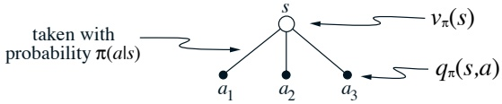

根据这个直觉和图表，给出根节点价值 $v_{\pi}(s)$ 的方程，用给定 $S_{t}=s$ 时期望叶节点价值 $q_{\pi}(s,a)$ 表示。这个期望取决于策略 $\pi$。然后给出第二个方程，其中期望值被明确地写成 $\pi(a|s)$ 的形式，使得方程中不出现期望值符号。

练习 3.13 一个动作的价值 $q_{\pi}(s,a)$ 取决于预期的下一个奖励和预期的剩余奖励之和。我们同样可以……