

构成近似值函数 (9.8) 的求和计算**几乎不费吹灰之力**。无需执行 $n$ 次乘法和加法，只需计算 $m \ll n$ 个**当前激活特征**的索引，然后将参数向量中对应的 $m$ 个分量相加即可。资格迹的计算 (9.7) 同样得以简化，因为梯度 $\nabla \hat{v}(s, \mathbf{w})$ 的分量通常为 0，否则为 1。

如果使用**类网格的平铺**，计算当前特征的索引就**特别容易**。这里的概念和技术最好通过例子来说明。假设我们处理一个具有两个连续状态变量的任务。那么平铺空间的最简单方法是使用一个**均匀的二维网格**：

<table border=1 style='margin: auto; word-wrap: break-word;'><tr><td style='text-align: center; word-wrap: break-word;'></td><td style='text-align: center; word-wrap: break-word;'></td><td style='text-align: center; word-wrap: break-word;'></td><td style='text-align: center; word-wrap: break-word;'></td></tr><tr><td style='text-align: center; word-wrap: break-word;'></td><td style='text-align: center; word-wrap: break-word;'></td><td style='text-align: center; word-wrap: break-word;'></td><td style='text-align: center; word-wrap: break-word;'></td></tr><tr><td style='text-align: center; word-wrap: break-word;'></td><td style='text-align: center; word-wrap: break-word;'></td><td style='text-align: center; word-wrap: break-word;'></td><td style='text-align: center; word-wrap: break-word;'></td></tr><tr><td style='text-align: center; word-wrap: break-word;'></td><td style='text-align: center; word-wrap: break-word;'></td><td style='text-align: center; word-wrap: break-word;'></td><td style='text-align: center; word-wrap: break-word;'></td></tr></table>

给定空间中某点的 x 和 y 坐标，通过计算很容易确定它所在的**网格单元索引**。当使用**多个平铺**时，每个平铺都会有不同的偏移量，从而以不同的方式切割空间。在图 9.5 所示的例子中，网格中增加了一行和一列单元，以确保没有点被遗漏。高亮显示的两个单元是状态 X 所激活的单元。不同的平铺可以通过随机量偏移，也可以通过巧妙设计的确定性策略偏移（已知仅对每个维度使用相同的增量偏移并不是一个好主意）。图 9.3 和 9.4 中说明的对泛化能力和渐近精度的影响在这里同样适用。**网格单元的宽度和形状**应根据预期的合适泛化宽度来选择。**平铺的数量**应选择为能影响网格单元的密度。平铺越密集，所需函数的近似就越精细、越准确，但计算成本也越高。

**重要的是要注意**，平铺可以是任意的，不必是均匀网格。网格单元不仅可以具有奇怪的形状，如图 9.6a 所示，还可以通过特定的形状和分布来提供特定类型的泛化。例如，图 9.6b 中的**条纹平铺**将促进沿垂直维度的泛化和沿水平维度的区分，尤其是在左侧。图 9.6c 中的**对角条纹平铺**将促进沿一个对角线的泛化。在更高维度中，**轴对齐的条纹**对应于在某些平铺中忽略某些维度。

---

也就是说，通过超平面切片的方式。

另一个减少内存需求的重要技巧是**哈希**——将一个大范围的铺砌伪随机地、一致地折叠成一个规模小得多的铺砌集合。哈希产生的铺砌由**非连续、互不相交的区域**组成，这些区域随机散布在整个状态空间中，但仍能构成一个完整的铺砌。例如，一个铺砌可能由如下四个子铺砌组成：

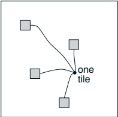

通过哈希，内存需求通常能大幅降低，而性能损失却很小。之所以能做到这一点，是因为**仅在状态空间的一小部分中需要高分辨率**。哈希使我们从维数灾难中解放出来，因为内存需求不必随维数呈指数级增长，而只需满足任务的实际需求即可。优秀的公开领域铺砌编码（包括哈希）实现已被广泛使用。

##### 径向基函数

径向基函数（RBFs）是**粗编码**向连续值特征的自然推广。每个特征不再是非0即1，而是可以取 $[0,1]$ 区间内的任意值，反映了该特征存在的不同程度。一个典型的RBF特征 i 具有高斯（钟形）响应 $x_i(s)$，该响应仅取决于状态 s 与

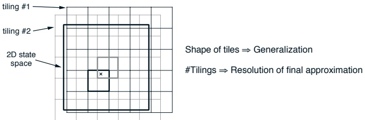

图 9.5：多个重叠的网格铺砌。

---

## 9.3. 线性方法

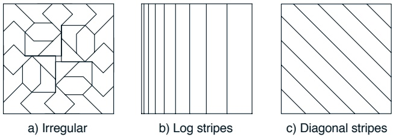

c) 对角条纹

图 9.6: 平铺。

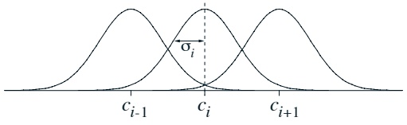

图 9.7: 一维径向基函数。

每个特征的值取决于状态与**该特征的原型或中心状态** $c_{i}$ 的距离，以及相对于**该特征的宽度** $\sigma_{i}$：

 
$$
x_{i}(s)=\exp\left(-\frac{\left|\left|s-c_{i}\right|\right|^{2}}{2\sigma_{i}^{2}}\right).
$$
 

当然，范数或距离度量的选择可以**根据当前状态和任务的需求**，以最合适的方式进行。图 9.7 展示了一个使用欧几里得距离度量的一维示例。

**径向基函数网络**是一种使用径向基函数作为特征的线性函数逼近器。其学习过程由方程 (9.3) 和 (9.8) 定义，与其他线性函数逼近器完全相同。与二元特征相比，径向基函数的主要优势在于它们能产生**平滑且可微的近似函数**。此外，一些针对径向基函数网络的学习方法还会**调整特征的中心和宽度**。这类非线性方法可能能够**更精确地拟合目标函数**。径向基函数网络的缺点，尤其是非线性径向基函数网络，在于**更高的计算复杂度**，并且通常在学习过程变得稳健高效之前需要**更多的手动调参**。

---

# 240第9章 动作值的同策略近似

#### 卡内瓦编码

在维度极高的任务中（例如数百维），**瓦片编码和径向基函数网络将变得不切实际**。如果我们直接采用这两种方法中的任意一种，其计算复杂度会随着维度数量呈指数级增长。虽然存在一些技巧可以减缓这种增长（例如哈希技术），但即使这些技巧在数十个维度后也会变得难以实施。

另一方面，这些方法背后的一些核心思想可能适用于高维任务。特别是，**通过特征列表表示状态，然后将这些特征线性映射到近似值的方法**可能能够很好地扩展到大型任务。关键在于控制特征数量，避免其爆炸式增长。是否有理由认为这可能实现呢？

首先我们需要建立一些现实的预期。粗略来说，**特定复杂度的函数逼近器只能准确逼近具有相当复杂度的目标函数**。但随着维度的增加，状态空间的规模本质上会呈指数级增长。有理由假设，在最坏情况下，目标函数的复杂度会随状态空间的规模同步增长。因此，如果我们关注最坏情况，那么就没有解决方案，无法在不使用与维度呈指数关系的资源的情况下，为高维任务获得良好的近似。

更有用的思考方式是：**将目标函数的复杂度与状态空间的规模和维度分开看待**。状态空间的规模可能给出了复杂度的上限，但在达到该上限之前，复杂度与维度可能并不相关。例如，我们可能有一个1000维的任务，但其中只有一个维度真正重要。给定一定的复杂度水平，我们希望能够准确逼近该复杂度或更低复杂度的任何目标函数。随着目标复杂度水平的增加，我们希望计算资源的增加与之成比例。

从这个角度来看，**问题的真正根源在于目标函数（或其合理近似）的复杂度，而非状态空间的维度**。因此，如果所需近似的复杂度保持不变，向任务中添加维度（例如新的传感器或特征）应该几乎没有影响。如果目标函数可以用新维度简单表达，这些新维度甚至可能使问题更容易解决。遗憾的是，**瓦片编码和径向基函数编码等方法并非如此**。即使目标函数的复杂度没有增加，这些方法的复杂度也会随维度呈指数级增长。对于这些方法，维度本身仍然是一个问题。我们需要复杂度不受维度影响的方法。

---

**仅受限于它们所逼近的复杂性本身**，并且**随着逼近复杂性的增加而能良好扩展**的方法。

一种满足这些标准的简单方法，我们称之为 **Kanerva 编码**，就是选择与特定原型状态相对应的二元特征。为明确起见，我们假设原型是从整个状态空间中随机选取的。这样一个特征的感受野是所有足够接近该原型的状态。Kanerva 编码使用一种不同于瓦片编码和径向基函数（RBF）的距离度量。为明确起见，考虑一个二元状态空间和汉明距离（即两个状态在哪些比特位上不同的数量）。**如果两个状态在足够多的维度上一致，即使在其他维度上完全不同，它们也被认为是相似的**。

Kanerva 编码的**优势**在于，可以学习的函数的复杂性**完全取决于特征的数量**，而这与任务的维度没有必然的联系。特征的数量可以多于或少于维度的数量。**只有在最坏的情况下，特征数量才必须随维度数呈指数级增长**。因此，维度本身不再是问题。复杂的函数仍然是一个问题，这也在情理之中。为了处理更复杂的任务，Kanerva 编码方法**只需要更多的特征**。目前在这类系统上的经验还不算非常丰富，但已有的经验表明，它们的能力与其计算资源成正比地增长。这是一个当前的研究领域，现有方法仍有很大的改进空间。

## 9.4 使用函数近似的控制

我们现在按照广义策略迭代（GPI）的模式，将使用函数近似的价值预测方法扩展到控制方法。首先，我们将状态-价值预测方法扩展到动作-价值预测方法，然后将它们与策略改进和动作选择技术相结合。与往常一样，通过采用**同轨策略**或**离轨策略**方法来解决确保探索的问题。

扩展到动作-价值预测是直接的。在这种情况下，近似动作-价值函数 $\hat{q} \approx q_{\pi}$ 被表示为一个参数化的函数形式，其参数向量为 $\mathbf{w}$。之前我们考虑的是形式为 $S_t \mapsto V_t$ 的随机训练样本，现在我们考虑形式为 $S_t, A_t \mapsto Q_t$ 的样本。目标输出 $Q_t$ 可以是 $q_{\pi}(S_t, A_t)$ 的任何近似值，包括通常的备份值，例如完整的蒙特卡洛回报 $G_t$，或一步 Sarsa 风格的回报 $G_{t+1} + \gamma \hat{q}(S_{t+1}, A_{t+1}, \mathbf{w}_t)$。

---

动作值预测的一般梯度下降更新为

$$
\mathbf{w}_{t+1}=\mathbf{w}_{t}+\alpha\Big[Q_{t}-\hat{q}(S_{t},A_{t},\mathbf{w}_{t})\Big]\nabla\hat{q}(S_{t},A_{t},\mathbf{w}_{t}).
$$

例如，与 TD(λ) 类似的动作值方法的后向视角为

$$
\mathbf{w}_{t+1}=\mathbf{w}_{t}+\alpha\delta_{t}\mathbf{e}_{t},
$$

其中

$$
\delta_{t}=R_{t+1}+\gamma\hat{q}(S_{t+1},A_{t+1},\mathbf{w}_{t})-\hat{q}(S_{t},A_{t},\mathbf{w}_{t}),
$$

且

$$
\mathbf{e}_{t}=\gamma\lambda\mathbf{e}_{t-1}+\nabla\hat{q}(S_{t},A_{t},\mathbf{w}_{t}),
$$

其中 $\mathbf{e}_0 = \mathbf{0}$。我们称此方法为**梯度下降 Sarsa(λ)**，尤其是在其被详细阐述以形成完整控制方法时。对于固定策略，此方法的收敛方式与 $\mathrm{TD}(\lambda)$ 相同，并具有相同类型的误差界（式 9.9）。

为了构建控制方法，我们需要将此类动作值预测方法与策略改进和动作选择技术相结合。适用于连续动作或来自大型离散集合的动作的技术，是当前研究的一个课题，尚未有明确的解决方案。另一方面，如果动作集是离散的且不太大，那么我们可以使用前几章已经开发的技术。也就是说，对于当前状态 $S_t$ 中可用的每个可能动作 $a$，我们可以计算 $\hat{q}(S_t, a, \mathbf{w}_t)$，然后找到贪婪动作 $a_t^* = \arg\max_a \hat{q}(S_t, a, \mathbf{w}_t)$。策略改进是通过将估计策略改为贪婪策略（在离策略方法中）或改为贪婪策略的软近似（如 $\varepsilon$-贪婪策略，在同策略方法中）来实现的。在同策略方法中，动作根据这同一策略选择，而在离策略方法中，则由任意策略选择动作。

图 9.8 和图 9.9 展示了使用函数近似的同策略（Sarsa(λ)）和离策略（Watkins 的 Q(λ)）控制方法的示例。两种方法都使用具有二进制特征的线性梯度下降函数近似，例如在平铺编码和 Kanerva 编码中。两种方法都使用 $\varepsilon$-贪婪策略进行动作选择，而 Sarsa 方法也将其用于广义策略迭代（GPI）。两者都计算对应于当前状态和所有可能动作 $a$ 的当前特征集 $F_a$。如果每个动作的值函数是相同特征的独立线性函数（常见情况），那么每个动作的 $F_a$ 的索引基本上是相同的，这**显著简化了计算**。

---

令 **w** 和 **e** 为向量，每个可能特征对应一个分量。
对于每个可能的动作 **a**，令 $F_a$ 为一个特征索引的集合，初始为空。
将 **w** 初始化为适合问题的值，例如 $\mathbf{w} = \mathbf{0}$。

重复（对每个回合）：
$\mathbf{e} = \mathbf{0}$
$S, A \leftarrow$ 回合的初始状态和动作（例如，采用 $\varepsilon$-贪心策略）
$F_A \leftarrow$ $S, A$ 中存在的特征集合

重复（对回合中的每一步）：
    对所有 $i \in \mathcal{F}_A$：
        $e_i \leftarrow e_i + 1$（累积迹）
        或 $e_i \leftarrow 1$（替换迹）
    执行动作 $A$，观察奖励 $R$ 和下一个状态 $S'$
    $\delta \leftarrow R - \sum_{i \in \mathcal{F}_A} w_i$
    如果 $S'$ 是终止状态，则 $\mathbf{w} \leftarrow \mathbf{w} + \alpha \delta \mathbf{e}$；转到下一个回合
    对所有 $a \in \mathcal{A}(S')$：
        $F_a \leftarrow$ $S', a$ 中存在的特征集合
        $Q_a \leftarrow \sum_{i \in \mathcal{F}_a} w_i$
        $A' \leftarrow$ $S'$ 中的新动作（例如，采用 $\varepsilon$-贪心策略）
    $\delta \leftarrow \delta + \gamma Q_A'$
    $\mathbf{w} \leftarrow \mathbf{w} + \alpha \delta \mathbf{e}$
    $\mathbf{e} \leftarrow \gamma \lambda \mathbf{e}$
    $S \leftarrow S'$
    $A \leftarrow A'$

图 9.8：使用**二进制特征**和 $\varepsilon$-贪心策略的线性梯度下降 Sarsa($ \lambda $) 算法。同时指定了**累积迹**和**替换迹**的更新方式。

---

令 **w** 和 **e** 为向量，每个可能特征对应一个分量  
令 **$F_a$**（对于每个可能动作 **a**）为特征索引的集合，初始为空  
根据问题适当初始化 **w**，例如 **w = 0**  
重复（对每个回合）：  
  **e = 0**  
   **$S \leftarrow$** 回合的初始状态  
  重复（对回合的每一步）：  
    对于所有 **$a \in \mathcal{A}(S)$**：  
      **$F_a \leftarrow$** 在 **S, a** 中出现的特征集合  
      **$Q_a \leftarrow \sum_{i \in \mathcal{F}_a} w_i$**  
    **$A^* \leftarrow \arg\max_a Q_a$**  
    **$A \leftarrow A^*$** 以概率 **$1 - \varepsilon$**，否则随机选择动作 **$\in \mathcal{A}(S)$**  
    如果 **$A \neq A^*$**，则 **e = 0**  
      执行动作 **A**，观察奖励 **R** 和下一状态 **$S'$**  
    **$\delta \leftarrow R - Q_A$**  
    对于所有 **$i \in \mathcal{F}_A$**：  
      **$e_i \leftarrow e_i + 1$**  
      或 **$e_i \leftarrow 1$**  
    如果 **$S'$** 是终止状态，则 **$w \leftarrow w + \alpha \delta e$**；进入下一回合  
    对于所有 **$a \in \mathcal{A}(S')$**：  
      **$F_a \leftarrow$** 在 **$S'$, a** 中出现的特征集合  
      **$Q_a \leftarrow \sum_{i \in \mathcal{F}_a} w_i$**  
    **$\delta \leftarrow \delta + \gamma \max_{a \in \mathcal{A}(S')} Q_a$**  
    **$w \leftarrow w + \alpha \delta e$**  
    **$e \leftarrow \gamma \lambda e$**  
    **$S \leftarrow S'$**

图 9.9：基于线性梯度下降的 Watkins Q($\lambda$) 算法，使用二元特征和 $\varepsilon$-贪婪策略。同时指定了累积迹和替换迹的更新方式。

---

## 9.4. 基于函数近似的控制

我们上面讨论的所有方法都使用了**累积资格迹**。尽管在表格方法中已知**替换迹**（第7.8节）具有优势，但替换迹并不能直接扩展到使用函数近似的情况。回想一下，替换迹的思想是每次访问一个状态时，将该状态的迹重置为1，而不是将其增加1。但是，使用函数近似时，并没有与单个状态对应的单一迹，只有对应于权重向量 **w** 的每个分量的迹，而每个分量又对应着许多状态。一种对于具有**二元特征**的线性梯度下降函数近似方法似乎很有效的方法是：为了替换迹的目的，将特征**视为状态**。也就是说，每次遇到具有特征 i 的状态时，特征 i 的迹被设置为1，而不是像累积迹那样增加1。

当使用状态-动作迹时，**清除**（设置为零）所遇到状态中所有**未被选择动作**的迹也可能有用（见第7.8节）。这个想法也可以扩展到具有二元特征的线性函数近似的情况。对于遇到的每个状态，我们首先清除该状态以及未被选择动作的所有特征的迹，然后将该状态及所选动作的特征的迹设置为1。正如我们在表格情况下所指出的，使用替换迹时，这**可能**是，也可能**不是**最佳的处理方式。图9.8中针对Sarsa算法给出了两种迹（包括对未选择动作的可选清除操作）的程序化规范。

**示例9.2：山地车任务**
考虑驾驶一辆动力不足的汽车上陡峭山路（如图9.10左上角示意图所示）的任务。困难在于**重力比汽车的发动机更强**，即使全油门，汽车也无法在陡坡上加速。唯一的解决方案是首先远离目标，并向左侧相反的山坡移动。然后，通过施加全油门，汽车可以积累足够的惯性，使其能够冲上陡坡，尽管在整个过程中它都在减速。这是一个连续控制任务的简单例子，在这个意义上，事情必须先**变得更糟**（离目标更远），然后才能变得更好。许多控制方法对于这类任务都有很大的困难，除非得到人类设计者的明确帮助。

在这个问题中，在汽车到达山顶目标位置之前的所有时间步，奖励都是-1，到达后情节结束。有三个可能的动作：全油门前进 $(+1)$，全油门倒车 $(-1)$，以及零油门 $(0)$。汽车的运动遵循简化的物理规则。其位置 $p_t$ 和速度 $\dot{p}_t$ 由以下公式更新：

$$
p_{t+1}=bound[p_{t}+\dot{p}_{t+1}]
$$

$$
\dot{p}_{t+1}=b o u n d\big[\dot{p}_{t}+0.001A_{t}-0.0025\operatorname{c o s}(3p_{t})\big],
$$

---

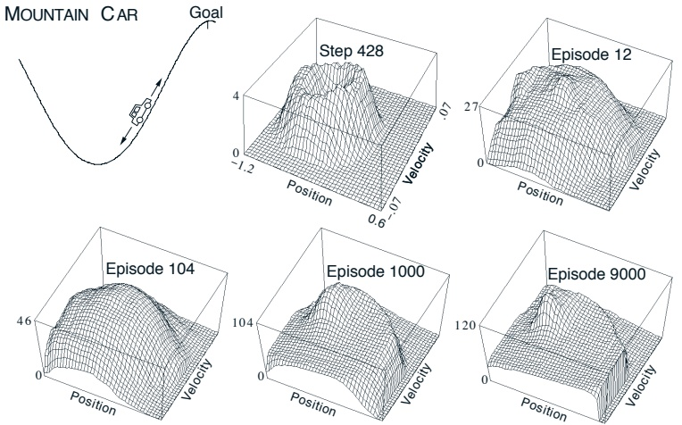

图 9.10：山地车任务（左上图）以及在一次运行中学习到的代价函数 $(-\max_a \hat{q}(s, a, \mathbf{w}))$。

其中边界操作强制满足 $-1.2 \leq p_{t+1} \leq 0.5$ 和 $-0.07 \leq \dot{p}_{t+1} \leq 0.07$。当 $p_{t+1}$ 达到左边界时，$\dot{p}_{t+1}$ 被重置为零。当它达到右边界时，目标达成，回合终止。每个回合从一个随机位置和速度开始，这些值均从上述范围内均匀选择。为了将两个连续状态变量转换为二进制特征，我们使用了如图9.5所示的网格铺盖。我们使用了十个 $9 \times 9$ 的铺盖，每个铺盖偏移了随机比例的网格宽度。

图9.8中的Sarsa算法（使用替换迹和可选的清除操作）轻松解决了这个任务，**在100个回合内学到了接近最优的策略**。图9.10展示了一次运行中学习到的价值函数的负值（即代价函数），使用的参数为 $\lambda = 0.9$、$\varepsilon = 0$ 和 $\alpha = 0.05$（例如 $\frac{0.5}{m}$）。初始动作值全部设为零，这是**乐观的初始设定**（因为在此任务中所有真实值均为负），导致即使探索参数 $\varepsilon$ 为0，也发生了大量的探索行为。这可以在图中标注为“第428步”的中间顶部子图中看到。此时甚至一个完整的回合都未完成，但小车已在山谷中来回振荡，在状态空间中遵循着圆形轨迹。所有频繁访问的状态都被评估得比未探索的状态更差，因为实际获得的奖励比（不切实际的）预期更差。这**持续驱使智能体远离它已访问过的区域，去探索新的状态**，直到找到解决方案。图9.11展示了对该算法的详细研究结果。

---

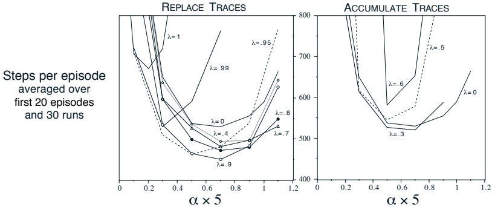

图 9.11：参数 $\alpha$、$\lambda$ 以及迹的类型对山地车任务早期性能的影响。本研究使用了五个 $9 \times 9$ 的瓦片编码。

参数 $\alpha$ 和 $\lambda$，以及迹的类型，对此任务学习速率的影响。

## 9.5 我们是否应该使用自举法？

此时，你可能会疑惑，我们为何要费心使用自举方法。与非自举方法相比，自举方法在函数逼近的适用条件下**更不可靠且范围更窄**。即使备份是根据同策略分布进行的，非自举方法也能达到比自举方法**更低的渐近误差**。通过使用资格迹并设置 $\lambda = 1$，甚至可以在线、以逐步递增的方式实现非自举方法。尽管如此，在实践中，自举方法通常是首选方法。

在经验比较中，自举方法的表现通常远优于非自举方法。进行此类比较的一个便捷方法是使用带资格迹的 TD 方法，并将 $\lambda$ 从 0（纯自举）变化到 1（纯非自举）。图 9.12 汇总了一系列此类结果。在所有情况下，当 $\lambda$ 接近 1（非自举情况）时，性能都会**显著下降**。图中右上角的例子在这方面尤其重要。这是一个策略评估（预测）任务，使用的性能度量是 RMSE（在每一幕结束时计算，并取前 20 幕的平均值）。根据此度量，渐近地看，$\lambda = 1$ 的情况必然是最优的，但在这里，在**远未达到渐近线**的情况下，

---

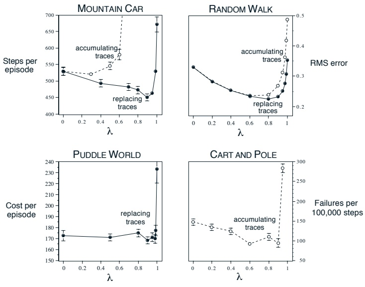

图 9.12：$\lambda$ 对强化学习性能的影响。在所有情况下，**性能越好，曲线越低**。左侧两个图展示了在简单连续状态控制任务中应用 Sarsa( $\lambda$) 算法与瓦片编码的结果，分别使用了**替换迹**或**累积迹**（Sutton, 1996）。右上图显示了在随机游走任务中使用 TD( $\lambda$) 进行策略评估的结果（Singh and Sutton, 1996）。右下图则是早期研究中关于杆平衡任务（示例 3.4）的未发表数据（Sutton, 1984）。

---

我们发现其表现要差得多。

目前尚不清楚为何涉及某种自举的方法比纯非自举方法表现好得多。可能是自举方法学习速度更快，也可能是它们确实学到了比非自举方法更好的内容。现有结果表明，**在降低与真实价值函数之间的均方根误差方面，非自举方法优于自举方法**，但降低均方根误差未必是最重要的目标。例如，若在所有状态-动作对中给真实动作价值函数加上1000，其均方根误差会非常糟糕，但仍能获得最优策略。自举方法虽未出现如此简单的偏差，但它们似乎确实做对了一些事。我们预计随着研究的深入，对这些问题的理解会逐步加深。

## 9.6 小结

若要将强化学习应用于人工智能或大型工程应用，系统必须具备泛化能力。为实现这一点，只需将每次备份视为训练样本，即可采用现有监督学习函数逼近方法中的任意一种。特别是梯度下降法，能够自然扩展到前几章所有技术的函数逼近形式，包括资格迹。线性梯度下降法在理论上极具吸引力，并在配备适当特征时实践中表现良好。**特征选择是向强化学习系统注入先验领域知识的重要途径之一**。线性方法包括径向基函数、瓦片编码与卡内瓦编码。多层神经网络的反向传播方法则属于非线性梯度下降函数逼近方法。

在大多数情况下，将强化学习的预测与控制方法扩展至梯度下降形式，对于同轨策略情形是直接可行的。采用线性梯度下降函数逼近的同轨自举方法能够稳定收敛，其解对应的均方误差不超过最小可能误差的 $\frac{1-\gamma\lambda}{1-\gamma}$ 倍。尽管理论保证有限，**自举方法在强化学习中始终备受关注**，因为实践中它们通常显著优于非自举方法。离轨策略情形则涉及更复杂的微妙问题，将被推迟到后续（未来）章节讨论。

---

# 第9章 动作价值的同策略近似

#### 文献与历史评注

尽管本书将泛化与函数近似的内容安排在靠后部分，但它们始终是强化学习不可或缺的组成部分。**仅仅在最近十年左右**，该领域才开始聚焦于表格化情况，正如我们在前七章所做的那样。Bertsekas与Tsitsiklis（1996）介绍了强化学习中函数近似的研究现状，Boyan、Moore与Sutton（1995）的论文集也颇具参考价值。本节末尾将讨论强化学习中函数近似的一些早期工作。

9.2 监督学习中用于最小化均方误差的梯度下降方法是众所周知的。Widrow与Hoff（1960）提出了最小均方（LMS）算法，这是增量梯度下降算法的原型。该算法及相关算法的细节在许多著作中均有阐述（例如Widrow与Stearns，1985；Bishop，1995；Duda与Hart，1973）。

TD学习的梯度下降分析至少可追溯至Sutton（1988）。在强化学习背景下，**研究者们也探讨了比本节所涵盖的简单梯度下降方法更为复杂的算法**，例如拟牛顿法（Werbos，1990）与递归最小二乘法（Bradtke，1993，1994；Bradtke与Barto，1996；Bradtke、Ydstie与Barto，1994）。Bertsekas与Tsitsiklis（1996）对这些方法进行了很好的讨论。

强化学习中最早使用状态聚合的可能是Michie与Chambers的BOXES系统（1968）。强化学习中状态聚合的理论由Singh、Jaakkola与Jordan（1995）以及Tsitsiklis与Van Roy（1996）发展起来。

9.3 采用线性梯度下降函数近似的TD(λ)最早由Sutton（1984，1988）探索，他证明了在特征向量 $\{\mathbf{x}(s):s\in\mathcal{S}\}$ 线性无关的情况下，TD(0)在均值意义上收敛到最小RMSE解。多位研究者几乎同时证明了**一般λ情况下以概率1收敛**（Peng，1993；Dayan与Sejnowski，1994；Tsitsiklis，1994；Gurvits、Lin与Hanson，1994）。此外，Jaakkola、Jordan与Singh（1994）证明了在线更新下的收敛性。所有这些结果均假设特征向量线性无关，这意味着 $w_t$ 的分量数至少与状态数相同。Dayan（1992）首次证明了线性TD(λ)在更一般的（相关）特征向量情况下的收敛性。这是一项**重要的推广**。

---

Tsitsiklis 和 Van Roy (1997) 证明了对 Dayan 结果的推广和强化。他们证明了第 9.2 节中呈现的主要结果，即 **TD( $\lambda$)** 及其他自助法的**渐近误差界限**。近期，他们又将分析扩展到了无折扣的连续情形 (Tsitsiklis 和 Van Roy, 1999)。

我们对线性函数逼近可能性的阐述基于 Barto (1990) 的工作。**“粗编码”** 这一术语源自 Hinton (1984)，我们的图 9.2 也基于他的一幅图。Waltz 和 Fu (1965) 在强化学习系统中提供了这类函数逼近的早期示例。

**瓦片编码**（包括哈希）由 Albus (1971, 1981) 引入。他根据其 **“小脑模型关节控制器”** （或称 **CMAC**）来描述它，这也是瓦片编码在文献中的已知名称。**“瓦片编码”** 这一术语在本书中是首次出现，尽管用这些术语描述 CMAC 的想法取自 Watkins (1989)。瓦片编码已在许多强化学习系统（例如，Shewchuk 和 Dean, 1990; Lin 和 Kim, 1991; Miller, Scalera, 和 Kim, 1994; Sofge 和 White, 1992; Tham, 1994; Sutton, 1996; Watkins, 1989）以及其他类型的学习控制系统（例如，Kraft 和 Campagna, 1990; Kraft, Miller, 和 Dietz, 1992）中得到应用。

**径向基函数** 的函数逼近方法自 Broomhead 和 Lowe (1988) 将其与神经网络联系起来后，受到了广泛关注。Powell (1987) 回顾了 RBF 的早期应用，而 Poggio 和 Girosi (1989, 1990) 则广泛发展并应用了这种方法。

我们称之为 **“Kanerva 编码”** 的方法由 Kanerva (1988) 引入，作为其更广泛的 **稀疏分布式记忆** 思想的一部分。Kanerva (1993) 提供了关于此及相关记忆模型的优秀综述。Gallant (1993) 以及 Sutton 和 Whitehead (1993) 等人继续推进了这种方法的研究。

**9.4** 带有函数逼近的 **Q( $\lambda$)** 最早由 Watkins (1989) 探索。带有函数逼近的 **Sarsa( $\lambda$)** 则最早由 Rummery 和 Niranjan (1994) 探索。**山地车示例** 基于 Moore (1990) 研究的类似任务。此处呈现的相关结果来自 Sutton (1996) 以及 Singh 和 Sutton (1996)。

本节介绍的 **Sarsa 控制方法的收敛性尚未得到证明**。而 **Q-学习控制方法** 现在已知并不可靠，对于某些问题会发散。对于使用**状态聚合** 及其他特殊类型函数逼近的控制方法，其收敛性结果……

---

# 第9章 动作价值的同策略近似

函数近似的收敛性由 Tsitsiklis 和 Van Roy (1996)、Singh、Jaakkola 和 Jordan (1995) 以及 Gordon (1995) 证明。

强化学习中函数近似的使用可追溯到 Farley 和 Clark (1954; Clark 和 Farley, 1955) 的早期神经网络，他们使用强化学习来调整表示策略的线性阈值函数的参数。我们所知的函数近似方法用于学习价值函数的最早例子是 Samuel 的西洋跳棋程序 (1959, 1967)。Samuel 遵循了 Shannon (1950) 的建议，即价值函数不必精确，就能作为游戏中选择走法的有用指导，并且可以通过特征的线性组合来近似。除了线性函数近似，Samuel 还尝试了查找表和称为签名表的分层查找表 (Griffith, 1966, 1974; Page, 1977; Biermann, Fairfield, 和 Beres, 1982)。

大约在 Samuel 工作的同时，Bellman 和 Dreyfus (1959) 提出了在动态规划中使用函数近似方法。(人们很容易认为 Bellman 和 Samuel 相互影响，但我们没有发现任何一方在著作中提到对方。) 现在有相当广泛的关于函数近似方法和动态规划的文献，例如多重网格方法以及使用样条和正交多项式的方法 (例如，Bellman 和 Dreyfus, 1959; Bellman, Kalaba, 和 Kotkin, 1973; Daniel, 1976; Whitt, 1978; Reetz, 1977; Schweitzer 和 Seidmann, 1985; Chow 和 Tsitsiklis, 1991; Kushner 和 Dupuis, 1992; Rust, 1996)。

Holland (1986) 的分类器系统使用了一种选择性特征匹配技术，在状态-动作对之间泛化评估信息。每个分类器匹配一个状态的子集，该子集对于一部分特征具有指定值，而其余特征具有任意值 ("通配符")。然后，这些子集被用于传统的状态聚合方法中进行函数近似。Holland 的想法是使用遗传算法来演化一组分类器，这些分类器共同实现一个有用的动作价值函数。Holland 的想法影响了作者们早期的强化学习研究，但我们关注的是不同的函数近似方法。作为函数近似器，分类器在几个方面存在限制。首先，它们是状态聚合方法，因此在扩展和高效表示平滑函数方面存在相应的限制。此外，分类器的匹配规则只能实现与特征轴平行的聚合边界。**传统分类器系统最重要的限制可能是分类器是通过遗传算法学习的，这是一种进化方法**。正如我们在第1章中讨论的，在学习过程中，有比进化方法所能利用的**更详细的关于如何学习的信息**。

---

由进化方法所引起。这种观点促使我们转而采用监督学习方法，特别是梯度下降和神经网络方法，并将其应用于强化学习。霍兰德的方法与我们的方法之间存在这些差异并不令人意外，因为霍兰德的理念是在神经网络普遍被认为计算能力太弱而无用的时期发展起来的，而我们的工作则处于**广泛质疑这一传统观念时期的开端**。将这些不同方法的各个方面结合起来，仍然存在许多机会。

之前未涵盖的一些使用函数逼近方法的强化学习研究值得提及。Barto、Sutton 和 Brouwer（1981）以及 Barto 和 Sutton（1981b）将联想记忆网络（例如，Kohonen, 1977; Anderson, Silverstein, Ritz, and Jones, 1977）的思想扩展到了强化学习。Hampson（1983, 1989）是早期倡导使用多层神经网络学习价值函数的学者。Anderson（1986, 1987）将 TD 算法与误差反向传播算法相结合来学习价值函数。Barto 和 Anandan（1985）引入了 Widrow、Gupta 和 Maitra（1973）选择性自举算法的随机版本，他们称之为**关联奖励-惩罚（$A_{R-P}$）算法**。Williams（1986, 1987, 1988, 1992）将这类算法扩展为一般性的 REINFORCE 算法类，证明了它们在期望奖励上执行随机梯度上升。Gullapalli（1990）和 Williams 为连续动作情况设计了学习泛化策略的算法。Phansalkar 和 Thathachar（1995）证明了改进版 REINFORCE 算法的局部和全局收敛定理。Christensen 和 Korf（1986）在象棋游戏中试验了用于修改线性价值函数逼近系数的回归方法。Chapman 和 Kaelbling（1991）以及 Tan（1991）采用了决策树方法来学习价值函数。基于解释的学习方法也被用于学习价值函数，从而产生了紧凑的表示（Yee, Saxena, Utgoff, and Barto, 1990; Dietterich and Flann, 1995）。

#### 练习

练习 9.1 证明查表 TD( $\lambda$) 是方程 (9.5–9.7) 给出的通用 TD( $\lambda$) 的一个特例。

练习 9.2 状态聚合是一种简单的泛化函数逼近形式，其中状态被分组，每个组使用一个表条目（价值估计）。每当遇到组中的状态时，就使用该组的条目来确定状态的价值，并在状态更新时，

---

**过时**时，该组的条目会被更新。证明这种状态聚合是梯度方法（如 $(9.4)$）的一个特例。

**练习 9.3** 本节给出的方程是梯度下降 TD(λ) 的在线版本。离线版本的方程是什么？请完整描述，用该回合中使用的权重向量 w 来表示回合结束时的新权重向量 w'。可以从修改 TD(λ) 的前向视图方程（例如 (9.4)）开始。

**练习 9.4** 对于离线更新，证明方程 (9.5–9.7) 产生的更新与 (9.4) 完全相同。

**练习 9.5** 我们如何在线性框架内重现表格化的情况？

**练习 9.6** 我们如何在线性框架内重现状态聚合的情况（参见练习 8.4）？

**练习 9.7** 假设我们相信两个状态维度中的一个比另一个更可能对价值函数产生影响，并且泛化应主要沿着这个维度进行，而不是沿着另一个维度。**可以利用哪些类型的瓦片来利用这种先验知识？**

---

第 10 章

基于离策略的动作值近似

---

第10章：动作值的离策略近似

## 10.1 离策略半梯度控制

在本章中，我们开始考虑离策略学习方法。回想一下，离策略学习的独特之处在于，我们试图学习一个目标策略 $\pi$ 的值函数，而行为策略 $b$ 用于生成经验。通常，$\pi$ 是当前动作值函数的贪心策略，而 $b$ 则更具探索性，例如 $\epsilon$-贪心策略。为了使用从 $b$ 生成的数据，我们必须利用两者之间的关系，通常通过重要性采样比率来实现：

$$\rho_{t:t} \doteq \frac{\pi(A_t|S_t)}{b(A_t|S_t)} \quad \text{和} \quad \rho_{t:h} \doteq \prod_{k=t}^{\min(h,T-1)} \frac{\pi(A_k|S_k)}{b(A_k|S_k)}.$$

我们首先将半梯度 Sarsa(0) 算法（第 9.3 节）扩展到离策略学习。在表格情况下，带重要性采样的离策略半梯度单步 Sarsa 算法的权重更新为：

$$\mathbf{w}_{t+1} \doteq \mathbf{w}_t + \alpha \rho_t \delta_t \nabla \hat{q}(S_t, A_t, \mathbf{w}_t), \tag{10.1}$$

其中 $\delta_t$ 的定义与半梯度 Sarsa(0) 相同：

$$\delta_t \doteq R_{t+1} + \gamma \hat{q}(S_{t+1}, A_{t+1}, \mathbf{w}_t) - \hat{q}(S_t, A_t, \mathbf{w}_t). \tag{10.2}$$

该算法的完整伪代码见方框 10.1。

**方框 10.1：离策略半梯度 Sarsa 用于估计 $\hat{q} \approx q_*$**

输入：可微参数化动作值函数 $\hat{q} : \mathcal{S} \times \mathcal{A} \times \mathbb{R}^d \rightarrow \mathbb{R}$
算法参数：步长 $\alpha > 0$，小 $\epsilon > 0$
任意初始化动作值函数权重 $\mathbf{w} \in \mathbb{R}^d$（例如，$\mathbf{w} = \mathbf{0}$）

对每个回合循环：
    初始化 $S$
    选择 $A \sim b(\cdot|S)$
    回合未结束时循环：
        采取动作 $A$，观察 $R, S'$
        选择 $A' \sim b(\cdot|S')$
        $\mathbf{w} \leftarrow \mathbf{w} + \alpha \rho \delta \nabla \hat{q}(S, A, \mathbf{w})$，其中
            $\rho \doteq \frac{\pi(A|S)}{b(A|S)}$
            $\delta \doteq R + \gamma \hat{q}(S', A', \mathbf{w}) - \hat{q}(S, A, \mathbf{w})$
        $\pi \leftarrow \epsilon$-贪心策略基于 $\hat{q}(\cdot, \cdot, \mathbf{w})$
        $S \leftarrow S'$
        $A \leftarrow A'$

该算法的一个潜在问题是，更新依赖于下一个状态-动作对 $S'$ 和 $A'$，但这些值在更新后用于计算后续更新中的 $\delta$。为了改进这一点，我们可以使用期望 Sarsa 的离策略版本。期望 Sarsa 使用所有可能动作的期望值，而不是样本值。其离策略版本在更新中使用期望近似动作值，从而避免了对 $A'$ 的依赖。期望 Sarsa 的离策略半梯度版本更新为：

$$\mathbf{w}_{t+1} \doteq \mathbf{w}_t + \alpha \rho_t \delta_t \nabla \hat{q}(S_t, A_t, \mathbf{w}_t),$$

其中 $\delta_t$ 现在定义为：

$$\delta_t \doteq R_{t+1} + \gamma \mathbb{E}_{\pi}[\hat{q}(S_{t+1}, a, \mathbf{w}_t)] - \hat{q}(S_t, A_t, \mathbf{w}_t).$$

期望值 $\mathbb{E}_{\pi}[\hat{q}(S_{t+1}, a, \mathbf{w}_t)]$ 是在 $\pi(\cdot|S_{t+1})$ 下对 $a$ 的求和。该算法通常比半梯度 Sarsa(0) 更稳定，因为它减少了对样本动作的依赖。

离策略半梯度 Sarsa 和期望 Sarsa 都可以扩展到多步形式，但这需要更复杂的重要性采样处理。对于 $n$ 步方法，我们需要使用 $n$ 步重要性采样比率 $\rho_{t:t+n-1}$。例如，离策略 $n$ 步半梯度 Sarsa 的更新为：

$$\mathbf{w}_{t+n} \doteq \mathbf{w}_{t+n-1} + \alpha \rho_{t:t+n-1} \delta_{t:t+n-1} \nabla \hat{q}(S_t, A_t, \mathbf{w}_{t+n-1}),$$

其中 $\delta_{t:t+n-1}$ 是 $n$ 步 TD 误差：

$$\delta_{t:t+n-1} \doteq G_{t:t+n} - \hat{q}(S_t, A_t, \mathbf{w}_{t+n-1}),$$

而 $G_{t:t+n}$ 是 $n$ 步回报，根据行为策略进行重要性采样调整。

**离策略发散示例**

离策略半梯度 Sarsa 可能在某些情况下发散，如 Baird 反例所示。Baird 反例是一个精心设计的 MDP，其中离策略半梯度方法会发散到无穷大。该反例突显了离策略学习与函数近似的结合所带来的挑战。Baird 反例中的关键问题是**目标策略与行为策略的不匹配**，以及函数近似的线性架构，这可能导致不稳定的更新。

Baird 反例是一个七状态、两动作的 MDP。行为策略以等概率选择两个动作，而目标策略总是选择第二个动作。线性函数近似用于表示动作值，权重为 $\mathbf{w} \in \mathbb{R}^8$。在此设置下，离策略半梯度 Sarsa 的权重会发散到无穷大，即使问题有明确的最优解。该反例表明，离策略学习与函数近似的结合需要仔细设计算法以确保稳定性。

## 10.2 离策略学习的死亡三角

离策略学习的挑战通常被概括为“死亡三角”，即三个要素的结合：函数近似、自举（bootstrapping）和离策略学习。当这三个要素同时存在时，可能导致不稳定或发散。死亡三角强调了在离策略设置中设计稳定算法的困难。

**死亡三角的三个要素：**

1.  **函数近似**：使用参数化函数（如线性函数或神经网络）来近似值函数。
2.  **自举**：使用当前估计值来更新目标，如 TD 方法中的情况。
3.  **离策略学习**：从与目标策略不同的行为策略生成的数据中学习。

当这三个要素同时存在时，如离策略半梯度 Sarsa，可能出现不稳定性。死亡三角并不意味着不可能实现稳定的离策略学习，而是强调了需要特殊算法（如梯度 TD 方法）来确保收敛。

## 10.3 梯度 TD 方法

为了解决离策略学习的不稳定性，研究人员开发了梯度 TD 方法。这些方法通过最小化投影贝尔曼误差（Projected Bellman Error, PBE）的均方来确保收敛。梯度 TD 方法有两种主要变体：GTD（梯度 TD）和 GTD2，以及带有梯度修正的 TDC（TD with gradient correction）。

**GTD 方法**

GTD 方法通过引入第二个权重向量 $\mathbf{v} \in \mathbb{R}^d$ 来估计梯度，从而稳定学习过程。GTD 的更新为：

$$\mathbf{w}_{t+1} \doteq \mathbf{w}_t + \alpha \rho_t (\delta_t \mathbf{x}_t - \gamma \mathbf{x}_{t+1} (\mathbf{x}_t^\top \mathbf{v}_t)),$$

$$\mathbf{v}_{t+1} \doteq \mathbf{v}_t + \beta \rho_t (\delta_t - \mathbf{x}_t^\top \mathbf{v}_t) \mathbf{x}_t,$$

其中 $\mathbf{x}_t \doteq \nabla \hat{q}(S_t, A_t, \mathbf{w}_t)$ 是特征向量，$\delta_t$ 是 TD 误差，$\rho_t$ 是重要性采样比率。GTD 确保在离策略设置下收敛到局部最优解，但通常比半梯度方法更慢。

**TDC 方法**

TDC 方法通过添加梯度修正项来改进 GTD，其更新为：

$$\mathbf{w}_{t+1} \doteq \mathbf{w}_t + \alpha \rho_t (\delta_t \mathbf{x}_t - \gamma \mathbf{x}_{t+1} (\mathbf{x}_t^\top \mathbf{v}_t)),$$

$$\mathbf{v}_{t+1} \doteq \mathbf{v}_t + \beta \rho_t (\delta_t - \mathbf{x}_t^\top \mathbf{v}_t) \mathbf{x}_t.$$

TDC 通常比 GTD 收敛更快，同时保持稳定性。这些梯度 TD 方法为离策略学习提供了理论保证，但计算复杂度更高。

## 10.4 离策略学习的收敛保证

离策略学习的收敛性分析依赖于随机近似理论。对于线性函数近似，梯度 TD 方法在离策略设置下能收敛到投影贝尔曼方程的解。投影贝尔曼方程定义为：

$$\mathbf{w}^* = \arg\min_{\mathbf{w}} \| \Pi \mathcal{T}^\pi \hat{q}(\cdot, \cdot, \mathbf{w}) - \hat{q}(\cdot, \cdot, \mathbf{w}) \|_\mu^2,$$

其中 $\Pi$ 是投影算子，$\mu$ 是状态分布，$\mathcal{T}^\pi$ 是贝尔曼算子。梯度 TD 方法最小化投影贝尔曼误差，从而确保收敛。

对于非线性函数近似（如神经网络），离策略学习的收敛性更难保证。然而，经验表明，结合重要性采样和梯度修正的方法（如 V-trace 或 Retrace）可以在实践中有效。

## 10.5 实现考虑

在实现离策略算法时，需要考虑几个实际问题：

1.  **重要性采样比率**：比率 $\rho_t$ 可能非常大或非常小，导致高方差。裁剪比率（如限制在 $[0, c]$ 范围内）可以减少方差，但会引入偏差。
2.  **步长选择**：离策略学习通常需要更小的步长以确保稳定性。自适应步长方法（如 AdaGrad 或 Adam）可能有所帮助。
3.  **探索与利用**：行为策略 $b$ 必须充分探索，以覆盖目标策略 $\pi$ 支持的所有状态-动作对。否则，重要性采样比率可能为零，导致无法学习。

**离策略深度 Q 学习（DQN）**

离策略学习的一个成功应用是深度 Q 网络（DQN）。DQN 使用经验回放和固定目标网络来稳定学习。由于 DQN 从回放缓冲区中采样经验，这些经验可能来自旧策略，因此 DQN 本质上是离策略的。DQN 通过使用目标网络和裁剪误差来避免发散，但没有显式的重要性采样。

## 10.6 总结

离策略学习允许从与目标策略不同的行为策略生成的数据中学习。这对于探索和利用的平衡至关重要。然而，离策略学习与函数近似的结合可能导致不稳定，如死亡三角所述。梯度 TD 方法通过最小化投影贝尔曼误差来解决这一问题，并提供收敛保证。在实践中，离策略算法（如 DQN）已成功应用于许多领域，但需要仔细调整以确保稳定性。

**关键点：**

- 离策略学习使用重要性采样来关联行为策略和目标策略。
- 半梯度 Sarsa 可以扩展到离策略设置，但可能发散。
- 死亡三角突出了函数近似、自举和离策略学习结合时的挑战。
- 梯度 TD 方法（如 GTD 和 TDC）提供稳定的离策略学习。
- 实现考虑包括重要性采样比率裁剪、步长选择和充分的探索。

在下一章中，我们将讨论策略梯度方法，这些方法直接优化策略参数，并可以用于离策略学习。

---

### 第 11 章

### 策略近似

迄今为止，我们在本书中讨论的所有方法都学习了状态或状态-动作对的价值。为了将它们用于控制，我们学习了状态-动作对的价值，然后直接利用这些动作价值来实施策略（例如 $\varepsilon$-贪婪策略）并选择动作。所有这类方法都可以称为**动作价值方法**。

在本章中，我们将探讨一些不属于动作价值方法的方法。这些方法可能仍然会计算动作（或状态）价值，但**不直接使用这些价值来选择动作**。相反，策略是直接表示的，其自身拥有独立于任何价值函数的权重。

## 11.1 演员-评论家方法

演员-评论家方法是一种 TD 方法，它拥有独立的内存结构来显式地表示独立于价值函数的策略。策略结构被称为**演员**，因为它用于选择动作；而估计的价值函数被称为**评论家**，因为它对演员选择的动作进行评价。学习始终是**同策略**的：评论家必须学习并评价演员当前正在遵循的策略。评价以 TD 误差的形式呈现。如图 11.1 所示，这个标量信号是评论家的唯一输出，并驱动演员和评论家的所有学习过程。

演员-评论家方法是梯度赌博机方法（第 2.7 节）思想在 TD 学习以及完整强化学习问题中的自然延伸。通常，评论家是一个**状态价值函数**。在每次动作选择之后，评论家评估新的状态，以判断情况是否比预期更好或更糟。这种评估就是 TD 误差：

---

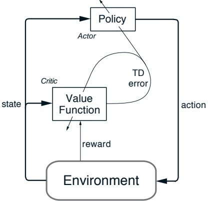

图 11.1：演员-评论家架构。

 
$$
\delta_{t}=R_{t+1}+\gamma V_{t}(S_{t+1})-V(S_{t}),
$$
 

其中 $V_{t}$ 是评论家在时间 $t$ 实现的价值函数。这个时序差分误差可以用来评估刚刚选择的动作，即在状态 $S_{t}$ 中采取的动作 $A_{t}$。如果时序差分误差为正，则表明未来应**加强**选择 $A_{t}$ 的倾向；而如果时序差分误差为负，则表明应**减弱**该倾向。假设动作是通过吉布斯 softmax 方法生成的：

 
$$
\pi_{t}(a|s)=\Pr\{A_{t}=a\mid S_{t}=s\}=\frac{e^{H_{t}(s,a)}}{\sum_{b}e^{H_{t}(s,b)}},
$$
 

其中 $H_t(s, a)$ 是演员在时间 $t$ 时的可修改策略参数值，表示在时间 $t$ 处于每个状态 $s$ 时选择每个动作 $a$ 的倾向（偏好）。那么，上述的加强或减弱可以通过增加或减少 $H_t(S_t, A_t)$ 来实现，例如：

 
$$
H_{t+1}(S_{t},A_{t})=H_{t}(S_{t},A_{t})+\beta\delta_{t},
$$
 

其中 $\beta$ 是另一个正的步长参数。

这只是演员-评论家方法的一个示例。其他变体以不同的方式选择动作，或使用资格迹，例如在...

---

下一章。另一个常见的变体维度，正如在强化比较方法中那样，是引入**额外因子**来调整分配给所采取行动 $A_{t}$ 的信用量。例如，最常见的这类因子之一与选择 $A_{t}$ 的概率成反比，从而得到以下更新规则：

$$
H_{t}(S_{t},A_{t})=H_{t}(S_{t},A_{t})+\beta\delta_{t}\Big[1-\pi_{t}(A_{t}|S_{t})\Big].
$$

这些问题在早期已得到探索，主要针对即时奖励情况（Sutton, 1984; Williams, 1992），但尚未完全更新至最新进展。

许多最早使用 TD 方法的强化学习系统都是行动者-评论家方法（Witten, 1977; Barto, Sutton, and Anderson, 1983）。此后，更多关注点转向了学习动作价值函数并完全从估计值中确定策略的方法（例如 Sarsa 和 Q-learning）。这种分化可能只是历史偶然。例如，可以设想一种中间架构，其中同时学习动作价值函数和独立策略。无论如何，行动者-评论家方法可能仍会保持当前的研究热度，因为它具有两个显著的明显优势：

- **它们在选择动作时仅需极少的计算量**。考虑存在无限可能动作的情况——例如连续值动作。任何仅学习动作价值的方法都必须遍历这个无限集合才能选择动作。如果策略被显式存储，则每次动作选择可能无需这种大量计算。
- **它们可以学习显式的随机策略**；即能够学习选择不同动作的最优概率。这种能力在竞争性和非马尔可夫场景中特别有用（例如参见 Singh, Jaakkola, and Jordan, 1994）。

此外，行动者-评论家方法中独立的行动者模块使其在某些方面更符合心理学和生物学模型的需求。在某些情况下，这也便于在允许的策略集合上施加特定领域的约束条件。

## 11.2 行动者-评论家方法的资格迹

本节我们将阐述如何将 11.1 节介绍的行动者-评论家方法扩展至使用资格迹。这相对直接明了。

---

在演员-评论员方法中，**评论员部分**本质上是对 $v_{\pi}$ 的在线学习。TD($\lambda$)算法可以用于此目的，其中每个状态对应一个资格迹。而**演员部分**则需要为每个状态-动作对使用一个资格迹。因此，演员-评论员方法需要两组迹：一组对应每个状态，另一组对应每个状态-动作对。

回顾一步演员-评论员方法，它通过以下方式更新演员：

$$
H_{t+1}(s,a)=\left\{\begin{array}{ll}H_{t}(s,a)+\alpha\delta_{t}&if a=A_{t}and s=S_{t}\\H_{t}(s,a)&otherwise,\end{array}\right.
$$

其中 $\delta_{t}$ 是 TD($\lambda$)误差（式7.10），而 $H_{t}(s,a)$ 是在状态 s 下于时刻 t 采取动作 a 的偏好。这些偏好通过例如 softmax 方法（第2.3节）来确定策略。我们将上述方程推广到使用资格迹，如下所示：

$$
H_{t+1}(s,a)=H_{t}(s,a)+\alpha\delta_{t}E_{t}(s,a),   \tag*{(11.1)}
$$

其中 $E_t(s,a)$ 表示在时刻 $t$ 对于状态-动作对 $s,a$ 的迹。对于上述最简单的情况，迹的更新方式可以与 Sarsa($\lambda$) 相同。

在第11.1节中，我们还讨论了一种更复杂的演员-评论员方法，它使用以下更新：

$$
H_{t+1}(s,a)=\left\{\begin{array}{ll}H_{t}(s,a)+\alpha\delta_{t}[1-\pi_{t}(a|s)]&if a=A_{t}and s=S_{t}\\H_{t}(s,a)&otherwise.\end{array}\right.
$$

为了将此方程推广到资格迹，我们可以使用相同的更新式（11.1），但采用略有不同的迹。与每次状态-动作对出现时将其迹增加 1 不同，这里通过 $1 - \pi_t(S_t, A_t)$ 来更新：

$$
E_{t}(s,a)=\left\{\begin{array}{ll}\gamma\lambda E_{t-1}(s,a)+1-\pi_{t}(S_{t},A_{t})&if s=S_{t}and a=A_{t};\\\gamma\lambda E_{t-1}(s,a)&otherwise,\end{array}\right.   \tag*{(11.2)}
$$

对所有 s, a 成立。

## 11.3 R-学习与平均奖励设定

当策略是近似时，我们通常**必须放弃**迄今为止所依赖的折扣奖励设定，而代之以平均奖励设定，这将在本节中讨论。

R-学习是一种用于强化学习问题高级版本的离轨控制方法，在该版本中，既不进行折扣也不进行划分。

---

将经验划分为具有有限回报的独立片段。在这种平均奖励设定下，目标是**最大化每个时间步的平均奖励**。策略 $\pi$ 的价值函数是相对于该策略下**每步平均期望奖励** $\bar{r}(\pi)$ 定义的：

$$
\bar{r}(\pi)=\lim_{n\to\infty}\frac{1}{n}\sum_{t=1}^{n}\mathbb{E}_{\pi}[R_{t}].
$$

如果我们假设过程是遍历的（在任何策略下从任一状态到达其他任一状态的概率均非零），则此平均奖励是明确定义的，因此 $\bar{r}(\pi)$ 不依赖于起始状态。从任何状态出发，长期来看平均奖励是相同的，但存在一个**暂态过程**。从某些状态开始，会在一段时间内获得高于平均的奖励，而从另一些状态开始则会获得低于平均的奖励。**正是这种暂态定义了状态的价值**：

$$
v_{\pi}(s)=\sum_{k=1}^{\infty}\mathbb{E}_{\pi}[R_{t+k}-\bar{r}(\pi)\mid S_{t}=s],
$$

类似地，状态-行动对的价值是当从该状态开始并采取该行动时，奖励的暂态差异：

$$
q_{\pi}(s,a)=\sum_{k=1}^{\infty}\mathbb{E}_{\pi}[R_{t+k}-\bar{r}(\pi)\mid S_{t}=s,A_{t}=a].
$$

我们称这些为**相对价值**，因为它们是相对于当前策略下的平均奖励而言的。

在无折扣的持续情况下，需要在不同类型的最优性之间进行细致的区分。然而，对于大多数实际目的而言，简单地根据每个时间步的平均奖励（即根据 $\bar{r}(\pi)$）对策略进行排序可能就足够了。目前，让我们将所有达到 $\bar{r}(\pi)$ 最大值的策略视为最优策略。

除了使用相对价值外，R-学习是一种基于离策略广义策略迭代的标准时序差分控制方法，与 Q-学习非常相似。它维护两个策略：**行为策略**和**估计策略**，外加一个行动价值函数和一个估计的平均奖励。行为策略用于生成经验；它可能是相对于行动价值函数的 $\varepsilon$-贪心策略。估计策略是广义策略迭代中涉及的那个策略，通常是对行动价值函数的贪心策略。如果 $\pi$ 是估计策略，那么行动价值函数 Q 是对 $q_{\pi}$ 的近似，而平均奖励 $\bar{R}$ 是对 $\bar{r}(\pi)$ 的近似。完整的算法如图 11.2 所示。

---

**初始化** $\bar{R}$ 和 $Q(s,a)$，对于所有 $s,a$，**可任意设定**  
**重复执行以下步骤**：  
$S\leftarrow$ 当前状态  
根据行为策略（例如 $\epsilon$-贪婪策略）在状态 $S$ 中选择动作 $A$  
执行动作 $A$，观察奖励 $R$ 与下一状态 $S'$  
$\delta\leftarrow R-\bar{R}+\max_{a}Q(S',a)-Q(S,A)$  
$Q(S,A)\leftarrow Q(S,A)+\alpha\delta$  
**如果** $Q(S,A)=\max_{a}Q(S,a)$，**则**：  
$\bar{R}\leftarrow\bar{R}+\beta\delta$  

图 11.2：R-学习算法：一种用于无折扣连续任务的离策略时序差分控制算法。标量参数 $\alpha$ 和 $\beta$ 为步长参数。

**示例 11.1：访问控制队列任务**  
这是一个涉及对一组 $n$ 台服务器进行访问控制的决策任务。四种不同优先级的客户抵达一个单一队列。如果获准访问服务器，客户将根据其优先级支付奖励 1、2、4 或 8，优先级越高的客户支付越多。在每个时间步，队列头部的客户要么被接受（分配到一台服务器），要么被拒绝（从队列中移除）。无论哪种情况，在下一个时间步都会考虑队列中的下一个客户。队列**永远不会为空**，且队列中高优先级客户（随机分布）的比例为 $h$。当然，**只有在有空闲服务器时客户才能被服务**。每台繁忙的服务器在每个时间步以概率 $p$ 变为空闲。尽管我们为了明确性刚刚描述了这些设定，但**假设到达与离开的统计特性是未知的**。任务是在每一步中，根据下一个客户的优先级和空闲服务器的数量，决定是接受还是拒绝该客户，以**最大化长期奖励**（无折扣）。图 11.3 展示了 R-学习为此任务找到的解，其中参数为 $n=10$，$h=0.5$，$p=0.06$。R-学习算法的参数为 $\alpha=0.01$，$\beta=0.01$，以及 $\epsilon=0.1$。初始动作值与 $\bar{R}$ 均设为零。

#### 练习

*练习 11.1* 为无折扣连续任务设计一种同策略方法。

---

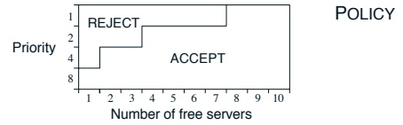

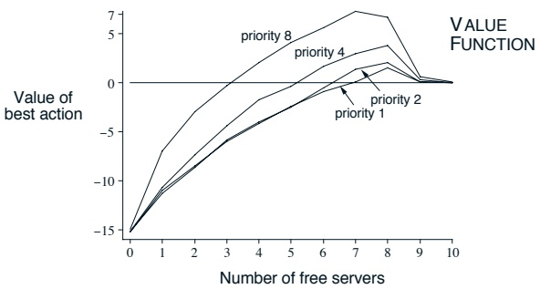

图 11.3: **R-learning 算法在访问控制队列任务中经过 200 万步训练后找到的策略与价值函数**。图中右侧的下降很可能是由于**数据不足**造成的；许多这类状态从未被实际经历过。学习到的 $\bar{R}$ 值约为 2.73。

---

# 神经排序模型综述

## 摘要

神经排序模型利用深度神经网络来学习查询和文档之间的相关性。与传统的排序模型相比，神经排序模型能够自动学习查询和文档的表示，并捕获它们之间复杂的交互模式。本文对神经排序模型进行了全面的综述。我们首先介绍了神经排序的背景，并讨论了基本概念。然后，我们回顾了神经排序模型的最新进展，包括表示学习模型和交互学习模型。此外，我们还探讨了神经排序模型的一些潜在研究方向。最后，我们总结了本次综述。

**关键词：** 神经排序，信息检索，深度学习

## 1. 引言

信息检索（IR）旨在从大规模文档集合中检索出与用户查询相关的文档。排序是信息检索的核心任务，其目标是根据查询与文档之间的相关性对文档进行排序。传统的排序模型，如 BM25 [1] 和语言模型 [2]，依赖于人工设计的特征和浅层机器学习模型。这些模型虽然有效，但通常难以捕获查询和文档之间的复杂语义关系。

近年来，深度学习在计算机视觉 [3]、自然语言处理 [4] 和语音识别 [5] 等领域取得了巨大成功。受此启发，研究人员开始将深度学习技术应用于信息检索，特别是排序任务，从而催生了神经排序模型。神经排序模型利用深度神经网络来学习查询和文档的表示，并建模它们之间的交互。与传统的排序模型相比，神经排序模型具有更强的表示能力和更高的灵活性。

本文旨在对神经排序模型进行全面的综述。我们首先介绍了神经排序的背景和基本概念。然后，我们回顾了神经排序模型的最新进展，包括表示学习模型和交互学习模型。此外，我们还探讨了神经排序模型的一些潜在研究方向。最后，我们总结了本次综述。

## 2. 背景

在本节中，我们介绍了神经排序的背景和基本概念。我们首先定义了排序问题，然后讨论了传统的排序模型。最后，我们介绍了深度学习的基本概念。

### 2.1 排序问题

排序问题可以形式化地定义如下：给定一个查询 $q$ 和一个文档集合 $D = \{d_1, d_2, ..., d_n\}$，排序的目标是学习一个排序函数 $f(q, d)$，该函数能够根据查询 $q$ 与文档 $d$ 之间的相关性对文档进行排序。排序函数 $f(q, d)$ 的输出是一个实数值，表示查询 $q$ 与文档 $d$ 之间的相关性得分。根据相关性得分，文档可以按降序排列，排名靠前的文档被认为与查询更相关。

### 2.2 传统排序模型

传统的排序模型可以分为两类：基于特征的模型和基于学习的模型。基于特征的模型，如 BM25 [1] 和语言模型 [2]，依赖于人工设计的特征来计算查询和文档之间的相关性得分。基于学习的模型，如 RankNet [6] 和 LambdaMART [7]，使用机器学习算法从训练数据中学习排序函数。这些模型虽然有效，但通常难以捕获查询和文档之间的复杂语义关系。

### 2.3 深度学习

深度学习是机器学习的一个分支，它使用深度神经网络来学习数据的表示。深度神经网络由多个层组成，每一层都对输入数据进行非线性变换。通过堆叠多个层，深度神经网络可以学习数据的层次化表示。深度学习在计算机视觉 [3]、自然语言处理 [4] 和语音识别 [5] 等领域取得了巨大成功。

## 3. 神经排序模型

在本节中，我们回顾了神经排序模型的最新进展。根据建模方式的不同，神经排序模型可以分为两类：表示学习模型和交互学习模型。表示学习模型学习查询和文档的表示，然后使用简单的相似度函数（如余弦相似度）来计算相关性得分。交互学习模型则直接建模查询和文档之间的交互，然后使用深度神经网络来计算相关性得分。

### 3.1 表示学习模型

表示学习模型旨在学习查询和文档的分布式表示。这些模型通常使用深度神经网络（如卷积神经网络或循环神经网络）来学习查询和文档的表示。学习到的表示可以捕获查询和文档的语义信息。然后，使用简单的相似度函数（如余弦相似度）来计算查询表示和文档表示之间的相似度，作为相关性得分。

**DSSM** [8] 是一个经典的表示学习模型。它使用深度神经网络将查询和文档映射到一个低维语义空间。在语义空间中，查询和文档的相似度通过余弦相似度计算。DSSM 通过最大化相关查询-文档对的相似度并最小化不相关查询-文档对的相似度来进行训练。

**CDSSM** [9] 是 DSSM 的扩展，它使用卷积神经网络来学习查询和文档的表示。与 DSSM 相比，CDSSM 能够捕获查询和文档中的局部语义信息。

**ARC-I** [10] 是另一个表示学习模型，它使用卷积神经网络来学习查询和文档的表示。与 DSSM 和 CDSSM 不同，ARC-I 使用多层感知机来计算查询表示和文档表示之间的相似度。

### 3.2 交互学习模型

交互学习模型直接建模查询和文档之间的交互。这些模型通常首先构建查询和文档的交互矩阵，然后使用深度神经网络（如卷积神经网络或循环神经网络）从交互矩阵中提取特征，最后使用多层感知机来计算相关性得分。

**ARC-II** [10] 是一个经典的交互学习模型。它首先构建查询和文档的交互矩阵，然后使用卷积神经网络从交互矩阵中提取特征。最后，使用多层感知机来计算相关性得分。

**MatchPyramid** [11] 是另一个交互学习模型，它使用卷积神经网络从交互矩阵中提取特征。与 ARC-II 不同，MatchPyramid 使用金字塔结构的卷积神经网络来捕获不同粒度的交互模式。

**DRMM** [12] 是一个交互学习模型，它使用直方图来表示查询和文档之间的交互。DRMM 首先计算查询项和文档项之间的相似度，然后使用直方图来聚合这些相似度。最后，使用多层感知机来计算相关性得分。

**KNRM** [13] 是一个交互学习模型，它使用核函数来建模查询和文档之间的交互。KNRM 首先计算查询项和文档项之间的相似度，然后使用核函数将这些相似度映射到高维空间。最后，使用多层感知机来计算相关性得分。

## 4. 未来研究方向

在本节中，我们探讨了神经排序模型的一些潜在研究方向。

### 4.1 预训练语言模型

预训练语言模型，如 BERT [14] 和 GPT [15]，在自然语言处理任务中取得了巨大成功。这些模型在大规模文本语料库上进行预训练，可以捕获丰富的语义信息。将预训练语言模型应用于神经排序是一个有前景的研究方向。

### 4.2 多模态排序

随着多媒体数据的快速增长，多模态排序变得越来越重要。多模态排序旨在根据多模态查询（如文本和图像）对多模态文档（如文本、图像和视频）进行排序。将神经排序模型扩展到多模态场景是一个有挑战性的研究方向。

### 4.3 可解释性

神经排序模型通常被认为是黑盒模型，难以解释其决策过程。**提高神经排序模型的可解释性**对于建立用户信任和调试模型至关重要。开发可解释的神经排序模型是一个重要的研究方向。

### 4.4 效率

神经排序模型通常计算成本高昂，难以应用于大规模实时排序场景。**提高神经排序模型的效率**对于实际应用至关重要。开发高效的神经排序模型是一个重要的研究方向。

## 5. 结论

本文对神经排序模型进行了全面的综述。我们首先介绍了神经排序的背景和基本概念。然后，我们回顾了神经排序模型的最新进展，包括表示学习模型和交互学习模型。此外，我们还探讨了神经排序模型的一些潜在研究方向，包括预训练语言模型、多模态排序、可解释性和效率。我们希望本次综述能够为神经排序领域的研究人员和实践者提供有用的参考。

---

第三部分

前沿

---

## 摘要

本文介绍了**基于深度学习的新型图像分割方法**，旨在提高复杂场景下目标边界的精度。该方法结合了**多尺度特征融合**与**注意力机制**，通过**自适应权重调整**增强关键区域的特征表达。实验结果表明，在多个公开数据集上，该方法在分割精度和计算效率方面均优于现有主流方法，**为医学影像分析和自动驾驶等领域提供了有效的技术解决方案**。

## 引言

图像分割是计算机视觉领域的核心任务之一，其目标是将图像划分为具有相似属性的区域或对象。随着深度学习技术的发展，尤其是卷积神经网络（CNN）的广泛应用，图像分割的性能得到了显著提升。然而，**在复杂背景、目标尺度多变以及边界模糊的情况下**，现有方法仍面临挑战。例如，在医学影像中，精确分割器官或病变区域对诊断至关重要；在自动驾驶中，准确识别道路、车辆和行人等元素是确保安全的基础。

**近年来，研究者们提出了多种改进策略**，如U-Net及其变体通过编码器-解码器结构捕获上下文信息；DeepLab系列利用空洞卷积扩大感受野；而注意力机制则被引入以聚焦于重要特征。尽管这些方法取得了进展，但**如何更有效地整合多尺度信息并减少无关背景的干扰**，仍是亟待解决的问题。本文提出的方法旨在通过**创新的网络架构设计**，同时优化特征提取和边界细化过程，以应对上述挑战。

## 方法

我们的方法主要包括三个核心模块：**多尺度特征提取网络**、**自适应注意力模块**和**边界优化层**。首先，我们采用**改进的ResNet作为骨干网络**，以提取不同层级的特征图。这些特征图随后被送入多尺度融合模块，该模块**利用金字塔结构整合来自不同分辨率的特征**，从而增强对大小不一目标的感知能力。

其次，我们设计了**自适应注意力模块**，该模块根据特征图的语义内容动态调整权重。具体而言，我们通过**通道注意力和空间注意力的双重机制**，分别关注重要特征通道和关键空间位置。这种设计**允许网络自动聚焦于目标区域**，同时抑制背景噪声。

最后，**边界优化层被引入以细化分割结果**。该层利用**高阶特征和低级边缘信息**，通过轻量级卷积操作修正边界处的预测误差。整个网络以端到端的方式进行训练，**损失函数结合了交叉熵损失和Dice损失**，以平衡类别不平衡问题并提升边界准确性。

## 实验

我们在三个公开数据集上评估了所提出方法的性能：**医学影像领域的ISIC 2018皮肤病变分割数据集**、**城市景观数据集（Cityscapes）用于自动驾驶场景**，以及**PASCAL VOC 2012用于通用对象分割**。实验环境基于PyTorch框架，使用NVIDIA Tesla V100 GPU进行训练和测试。

**与现有方法相比**，我们的方法在所有数据集上均取得了更高的分割精度。具体而言，在ISIC 2018数据集上，我们的方法在Dice系数上达到了0.92，比基准模型提高了3%；在Cityscapes数据集上，平均交并比（mIoU）达到了78.5%，**显示出在复杂街景中的优越性**；在PASCAL VOC 2012上，mIoU为85.2%，**验证了其通用性**。此外，**消融实验证实了各模块的有效性**：移除注意力模块导致精度下降2%，而去除边界优化层则使边界误差增加15%。

**在计算效率方面**，我们的方法在推理速度上与传统方法相当，但**由于模块化设计，更易于部署到实际应用中**。可视化结果进一步表明，我们的方法能够**更精确地捕捉目标边界**，尤其是在细节丰富的区域。

## 结论

本文提出了一种**结合多尺度特征融合与注意力机制的图像分割方法**，通过自适应权重调整和边界优化，显著提升了复杂场景下的分割性能。实验证明，该方法在多个数据集上优于现有方法，**具有较高的实用价值**。未来工作将探索**更轻量级的网络设计**，以进一步优化计算效率，并将其扩展到视频分割等动态场景中。

---

**在本书的最后部分，我们将探讨强化学习研究的一些前沿领域，包括其与神经科学及动物学习行为的关系、强化学习应用案例的简要介绍，以及强化学习未来的发展前景。**

---

# 引言

随着人工智能（AI）领域的迅速发展，**构建高效且可解释的AI系统已成为研究的关键目标之一**。传统的深度学习模型，虽然在许多任务中表现出色，但其内部工作机制往往被视为“黑箱”，这限制了它们在需要高可靠性和透明度的场景（如医疗诊断和自动驾驶）中的应用。因此，**可解释人工智能（XAI）** 应运而生，旨在提供对模型决策过程的洞察，增强人类对AI系统的信任和理解。

# 相关工作

在可解释人工智能的研究中，**多种方法已被提出以增强模型的透明性**。这些方法大致可分为两类：**事后解释方法**和**内在可解释模型**。事后解释方法，如LIME和SHAP，通过分析已训练模型的输入输出来生成解释。而内在可解释模型，如决策树和线性模型，其结构本身就更易于理解。然而，**这两类方法各有其局限性**：事后解释可能无法完全捕捉模型的复杂行为，而内在可解释模型可能在性能上不如更复杂的黑箱模型。因此，**如何平衡模型的性能和可解释性**，是当前研究的一个重要挑战。

# 方法

本文提出了一种新颖的混合框架，**旨在同时优化模型的预测性能和可解释性**。该框架结合了深度神经网络（DNN）的强大表示能力和决策树的可解释结构。具体而言，我们设计了一个两阶段训练流程：首先，利用DNN从原始数据中学习高级特征表示；然后，**将这些特征作为输入，训练一个可解释的决策树模型**。此外，我们引入了一种正则化技术，以**确保决策树在保持高精度的同时，其结构尽可能简洁**，从而便于人类理解。通过这种方式，我们的方法**试图在模型复杂度和可解释性之间找到一个有效的平衡点**。

# 实验

为了评估所提出框架的有效性，我们在三个公开数据集上进行了实验：**MNIST（手写数字识别）、CIFAR-10（图像分类）和UCI Adult（收入预测）**。我们将我们的混合模型与几种基线模型进行了比较，包括标准的深度神经网络、随机森林以及纯粹的决策树模型。评估指标不仅包括分类准确率，还包括可解释性度量，如**决策树的深度和节点数**。实验结果表明，**我们的混合框架在保持与深度神经网络相当的分类性能的同时，显著提升了模型的可解释性**。具体来说，在UCI Adult数据集上，我们的模型在准确率上仅比最佳性能的DNN低0.5%，但其决策树结构比纯粹的决策树模型小了近40%，从而**大大降低了人类理解的认知负担**。

# 结论

本文提出并验证了一种**结合深度学习和决策树的混合框架**，以应对AI系统中性能与可解释性之间的权衡问题。实验证明，该方法能够**在不显著牺牲预测准确率的前提下，提供高度可解释的模型决策过程**。未来的工作将探索将该框架扩展到更复杂的任务和模型结构中，并进一步**研究如何量化不同应用场景下对可解释性的具体需求**。我们相信，**推动可解释AI的发展对于AI技术在关键领域的负责任部署至关重要**。

---

第十二章

心理学

---

**摘要**：我们提出了一个基于**transformer**架构的简单网络，用于视频实例分割。与之前依赖**目标检测**或**添加新分支**以获取**目标分数**的方法不同，我们的方法名为**MaskFreeVIS**，它**无需任何掩码标注**即可实现**高精度**的视频实例分割。我们的核心思想是，**视频中的时间对应关系**本身就为学习**高质量实例掩码**提供了强大的**监督信号**。具体来说，我们引入了三个关键组件：
1) 一个**时间KNN匹配器**，它为每个**查询**在连续帧中分配**时间上的正负样本**；
2) 一种**时间一致性损失**，它在**特征级**和**输出级**上强制要求**稳定的掩码预测**；
3) 一个**几何感知的查询增强模块**，它通过**查询间的关系**来改善**空间上的判别性**。在**无需任何掩码标注**的情况下，**MaskFreeVIS**在**YouTube-VIS 2019**、**2021**和**Occluded VIS (OVIS)** 数据集上，分别仅使用**边界框标注**就达到了**与全监督方法相当甚至更优的性能**。特别是，在**OVIS**这个具有挑战性的数据集上，我们的方法显著超越了之前的最佳**弱监督方法**，**绝对提升了+6.6 AP**。我们希望我们简单而有效的方法能够激发视频实例分割领域对**弱监督学习**的进一步探索。**代码将开源**。

---

第十三章

神经科学

---

文本类别：论文，文本领域：人工智能
你需要：
将下面 Markdown 文本中的英文自然语言翻译成中文。翻译后逻辑严密，语言通顺，行文流畅，符合中文语序
输出格式：只输出翻译结果，保持原有换行和 Markdown 结构。
优化：给你认为能够优化阅读体验的字句加粗。
你禁止：
翻译处自然语言外的任何东西如：参考文献格式的文本，人名，专业词汇，引用的文献等
输出任何与翻译无关的内容如：重复提示词，思考过程

---

# 第十四章

# 应用与案例研究

在这最后的章节中，我们呈现几个强化学习的案例研究。其中一些案例具有潜在的经济意义，是重要的实际应用。塞缪尔的跳棋程序主要具有历史意义。我们的介绍旨在说明实际应用中出现的权衡与问题。例如，我们强调如何将领域知识融入问题的构建与求解过程。同时，我们重点探讨那些对成功应用至关重要的表征问题。某些案例研究中使用的算法比本书其他部分介绍的算法复杂得多。强化学习的应用远非例行公事，通常既需要艺术也需要科学。**使应用变得更简单、更直接**是当前强化学习研究的目标之一。

## 14.1 TD-Gammon

迄今为止，强化学习最令人印象深刻的应用之一是由杰里·特索罗为西洋双陆棋游戏开发的程序（Tesauro, 1992, 1994, 1995）。特索罗的程序TD-Gammon几乎不需要双陆棋知识，却学会了极高的水平，接近世界顶尖大师的水平。TD-Gammon中的学习算法是TD( $\lambda$)算法与非线性函数逼近的简单结合，后者使用通过反向传播TD误差训练的多层神经网络。

双陆棋是一项重要的游戏，它在世界各地都有玩家，举办众多锦标赛和定期的世界冠军赛。它部分依赖于运气，也是**投注巨额资金**的流行载体。职业双陆棋选手可能比我们想象的更多。

---

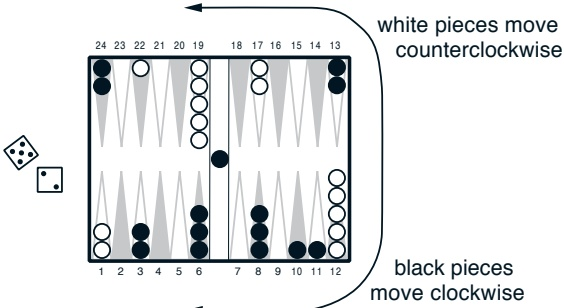

图14.1：一个西洋双陆棋局势

**西洋双陆棋**的专业玩家数量甚至超过国际象棋。游戏使用15枚白色棋子和15枚黑色棋子在棋盘上的24个位置（称为“点位”）进行。图14.1展示了对局早期从白方视角看到的典型局势。

在此图中，白方刚刚掷出骰子，得到了5点和2点。这意味着他可以移动一枚棋子5步，再移动一枚（可以是同一枚棋子）2步。例如，他可以将12点上的两枚棋子分别移至17点和14点。白方的目标是**将所有棋子推进至最后一个象限（19–24点）**，然后移出棋盘。首先移走所有棋子的玩家获胜。一个复杂之处在于，当棋子朝不同方向交错经过时会产生交互。例如，如果在图14.1中轮到黑方走棋，他可以利用掷出的2点，将24点上的一枚棋子移至22点，“击中”该位置的白子。被击中的棋子会被放置在棋盘中央的“横栏”上（图中已有一枚先前被击中的黑子），并从起点重新进入比赛。然而，**如果一个点位上已有两枚棋子，对手就无法移动到该点**；这些棋子受到保护，不会被击中。因此，白方无法使用5–2的骰子点数移动1点上的任意一枚棋子，因为它们可能到达的点位均被黑方棋子群占据。**形成连续的被占点位以阻挡对手**是游戏的基本策略之一。

西洋双陆棋还涉及其他复杂规则，但以上描述已阐明其基本概念。考虑到30枚棋子和24个可能位置（若计入横栏和棋盘外则为26个），显然可能的西洋双陆棋局势数量极其庞大，远超任何物理可实现计算机的内存单元数量。每个局势可能的走法也很多。**一次典型的骰子投掷可能产生约20种不同的走法**。在考虑未来走棋时，例如

---

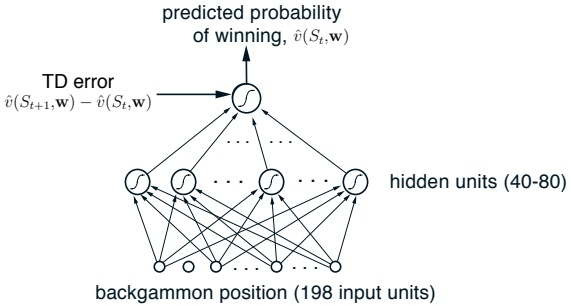

Figure 14.2: The neural network used in TD-Gammon

要评估对手的回应，还必须考虑可能的骰子投掷结果。这导致游戏树的有效分支因子约为400。这个数字太大，使得在象棋和跳棋等游戏中被证明非常有效的传统启发式搜索方法难以有效应用。

另一方面，该游戏非常契合**时序差分（TD）学习方法**的能力。虽然游戏具有高度随机性，但游戏状态在任何时候都可以被完整描述。游戏在一系列走法和局面中逐步演变，直到最终以一方获胜而结束。这一结果可被解释为待预测的最终奖励。然而，我们目前所描述的理论成果无法直接有效应用于此任务。状态数量如此庞大，以至于无法使用查找表，而对手则是不确定性和时间变化的来源。

TD-Gammon采用了**非线性形式的TD(λ)算法**。任何状态（棋盘位置）s的估计值$\hat{v}(s)$旨在估计从状态s开始获胜的概率。为此，除获胜时刻外，所有时间步的奖励均被定义为零。为实现价值函数，TD-Gammon使用了标准的**多层神经网络**，大致如图14.2所示。（实际网络中，其最终层还有两个额外单元，用于以特殊方式“gammon”或“backgammon”估计每位玩家的获胜概率。）该网络由输入层、隐藏层和最终输出单元组成。网络的输入是双陆棋局面的表示，输出则是该局面价值的估计值。

在TD-Gammon的第一个版本TD-Gammon 0.0中，双陆棋局面以一种相对直接且**几乎不依赖双陆棋专业知识**的方式呈现给网络。然而，它确实包含了大量知识

---

关于神经网络如何工作以及如何向它们最佳地呈现信息，Tesauro 选择的**具体表示方式**颇具启发性。网络总共包含 198 个输入单元。对于双陆棋盘上的每个点，**四个单元**表示该点上白色棋子的数量。如果没有白色棋子，则所有四个单元的值为零。如果有一个棋子，则第一个单元的值为 1。如果有两个棋子，则第一个和第二个单元都为 1。如果该点上有三个或更多棋子，则前三个单元全部为 1。如果棋子超过三个，第四个单元也会激活，其值表示超出三个的额外棋子数量。设 n 表示该点上的棋子总数，如果 n > 3，则第四个单元的取值为 $(n-3)/2$。每个点有四个白色单元和四个黑色单元，24 个点总共构成 192 个单元。另外两个单元编码了在“囚牢”中的白色和黑色棋子数量（每个取值为 n/2，其中 n 是囚牢中的棋子数），还有两个单元编码了已成功从棋盘上移除的黑色和白色棋子数量（这些取值为 n/15，其中 n 是已移除的棋子数）。最后，两个单元以二进制方式指示当前是白色还是黑色方走棋。**这些选择背后的总体逻辑应该是清晰的**。基本上，Tesauro 试图以一种直接的方式表示棋盘位置，**几乎没有尝试最小化单元数量**。他为每个在概念上不同且似乎可能相关的可能性提供了一个单元，并将它们的值缩放到大致相同的范围，本例中在 0 到 1 之间。

给定一个双陆棋位置的表示，网络以标准方式计算其估计值。每个从输入单元到隐藏单元的连接都对应一个实值权重。来自每个输入单元的信号乘以其对应的权重，并在隐藏单元处求和。隐藏单元 j 的输出 $h(j)$ 是加权和的非线性 S 形函数：

$$
h(j)=\sigma\left(\sum_{i}w_{i j}x_{i}\right)=\frac{1}{1+e^{-\sum_{i}w_{i j}x_{i}}},
$$

其中 $x_{i}$ 是第 i 个输入单元的值，$w_{ij}$ 是其连接到第 j 个隐藏单元的权重。S 形函数的输出始终在 0 和 1 之间，并且可以自然地解释为基于证据总和的概率。从隐藏单元到输出单元的计算完全类似。每个从隐藏单元到输出单元的连接都有一个独立的权重。输出单元形成加权和，然后将其通过相同的 S 形非线性函数。

TD-Gammon 使用了 9.2 节中描述的 TD($\lambda$) 算法的梯度下降形式，梯度通过误差反向传播计算。

---

聚合算法（Rumelhart，Hinton和Williams，1986）。回顾这种情况下的通用更新规则是

$$
\mathbf{w}_{t+1}=\mathbf{w}_{t}+\alpha\Big[R_{t+1}+\gamma\hat{v}(S_{t+1},\mathbf{w}_{t})-\hat{v}(S_{t},\mathbf{w}_{t})\Big]\mathbf{e}_{t},   \tag*{(14.1)}
$$

其中 $\mathbf{w}_{t}$ 是所有可修改参数的向量（在本例中为网络的权重），而 $\mathbf{w}_{t}$ 的每个分量都有一个资格迹，$\mathbf{e}_{t}$ 是这些资格迹的向量，其更新方式为

 
$$
\begin{array}{r}{\mathbf{e}_{t}=\gamma\lambda\mathbf{e}_{t-1}+\nabla\hat{v}(S_{t},\mathbf{w}_{t}),}\end{array}
$$
 

其中 $\mathbf{e}_0 = \mathbf{0}$。该方程中的梯度可以通过反向传播过程高效计算。对于西洋双陆棋应用，其中 $\gamma = 1$ 且除了获胜时奖励总是零，学习规则的TD误差部分通常只是 $\hat{v}(S_{t+1}, \mathbf{w}) - \hat{v}(S_t, \mathbf{w})$，如图14.2所示。

为了应用学习规则，我们需要一个西洋双陆棋游戏的来源。Tesauro通过让他的学习型西洋双陆棋程序与自己对战，获得了源源不断的游戏序列。为了选择走法，TD-Gammon考虑了其骰子点数可以产生的约20种走法方式以及相应的结果位置。这些结果位置是第6.6节讨论的后状态。网络被用来估计每个位置的价值。然后选择能够导致具有最高估计价值位置的走法。通过这种方式继续，由TD-Gammon为双方走棋，可以轻松生成大量的西洋双陆棋游戏。每个游戏被视为一个回合，位置序列充当状态，$S_0, S_1, S_2, \ldots$。Tesauro以完全增量的方式应用非线性TD规则（14.1），即在每个单独的走法之后。

网络的权重最初被设置为小的随机值。因此，初始评估完全是任意的。由于走法是根据这些评估选择的，**初始走法不可避免地很差**，初始游戏通常持续数百或数千步，直到一方几乎偶然获胜。然而，在几十个游戏之后，性能迅速提高。

在与自己对战约300,000个游戏后，上述描述的TD-Gammon 0.0学会了玩得与之前最好的西洋双陆棋计算机程序大致相当。这是一个引人注目的结果，因为所有先前的高性能计算机程序都使用了大量的西洋双陆棋知识。例如，当时的卫冕冠军程序可以说是Neurogammon，这是Tesauro编写的另一个程序，它使用了神经网络但没有使用TD学习。Neurogammon的网络是在由西洋双陆棋专家提供的大量示范走法训练语料库上进行训练的，并且此外，**还从一组专门设计的特征开始**。

---

<table border=1 style='margin: auto; word-wrap: break-word;'><tr><td style='text-align: center; word-wrap: break-word;'>程序</td><td style='text-align: center; word-wrap: break-word;'>隐藏单元</td><td style='text-align: center; word-wrap: break-word;'>训练局数</td><td style='text-align: center; word-wrap: break-word;'>对手</td><td style='text-align: center; word-wrap: break-word;'>结果</td></tr><tr><td style='text-align: center; word-wrap: break-word;'>TD-Gam 0.0</td><td style='text-align: center; word-wrap: break-word;'>40</td><td style='text-align: center; word-wrap: break-word;'>300,000</td><td style='text-align: center; word-wrap: break-word;'>其他程序</td><td style='text-align: center; word-wrap: break-word;'>并列最佳</td></tr><tr><td style='text-align: center; word-wrap: break-word;'>TD-Gam 1.0</td><td style='text-align: center; word-wrap: break-word;'>80</td><td style='text-align: center; word-wrap: break-word;'>300,000</td><td style='text-align: center; word-wrap: break-word;'>Robertie, Magriel, ...</td><td style='text-align: center; word-wrap: break-word;'>$-13$ 分 /  $51$ 局</td></tr><tr><td style='text-align: center; word-wrap: break-word;'>TD-Gam 2.0</td><td style='text-align: center; word-wrap: break-word;'>40</td><td style='text-align: center; word-wrap: break-word;'>800,000</td><td style='text-align: center; word-wrap: break-word;'>多位特级大师</td><td style='text-align: center; word-wrap: break-word;'>$-7$ 分 /  $38$ 局</td></tr><tr><td style='text-align: center; word-wrap: break-word;'>TD-Gam 2.1</td><td style='text-align: center; word-wrap: break-word;'>80</td><td style='text-align: center; word-wrap: break-word;'>1,500,000</td><td style='text-align: center; word-wrap: break-word;'>Robertie</td><td style='text-align: center; word-wrap: break-word;'>$-1$ 分 /  $40$ 局</td></tr><tr><td style='text-align: center; word-wrap: break-word;'>TD-Gam 3.0</td><td style='text-align: center; word-wrap: break-word;'>80</td><td style='text-align: center; word-wrap: break-word;'>1,500,000</td><td style='text-align: center; word-wrap: break-word;'>Kazaros</td><td style='text-align: center; word-wrap: break-word;'>$+6$ 分 /  $20$ 局</td></tr></table>

表 14.1: TD-Gammon 结果汇总

十五子棋。Neurogammon 是一个高度调优、性能卓越的十五子棋程序，曾在 1989 年世界十五子棋奥林匹克竞赛中**大获全胜**。相比之下，TD-Gammon 0.0 在构建时**几乎没有融入任何十五子棋专业知识**。它能够与 Neurogammon 以及其他所有方法**表现相当**，这**有力地证明了**自对弈学习方法的潜力。

TD-Gammon 0.0 在**缺乏专业知识**的情况下于比赛中取得成功，这暗示了一个**显而易见的改进方向**：**添加专门的十五子棋特征**，但保留自对弈 TD 学习方法。由此产生了 TD-Gammon 1.0。TD-Gammon 1.0 **明显优于**之前所有的十五子棋程序，**仅**在人类专家中遇到了**真正的挑战**。该程序的后续版本，TD-Gammon 2.0（40 个隐藏单元）和 TD-Gammon 2.1（80 个隐藏单元），**增加**了**选择性两阶段搜索过程**。为了选择走法，这些程序不仅前瞻到立即产生的位置，还考虑到对手可能的骰子投掷和走法。**假设对手总是选择对他而言当前看来最优的走法**，程序会计算每个候选走法的期望值并选择最佳者。为了节省计算时间，第二阶段的搜索**仅针对**在第一阶段后**排名较高**的候选走法进行，平均大约四到五步。两阶段搜索**仅影响**走法的选择；学习过程**完全照旧**进行。该程序的最新版本 TD-Gammon 3.0 使用了 160 个隐藏单元和**选择性三阶段搜索**。TD-Gammon 展示了**学习到的价值函数**与**决策时搜索**的结合，正如启发式搜索方法那样。在更近期的研究中，Tesauro 和 Galperin (1997) 已开始探索**轨迹采样方法**作为搜索的替代方案。

Tesauro 能够让他的程序与世界级人类玩家进行**大量**对局。结果汇总见表 14.1。基于这些结果以及十五子棋特级大师们的分析 (Robertie, 1992; 参见 Tesauro, 1995)，TD-Gammon 3.0 **似乎已经达到，或非常接近**世界上最佳人类玩家的棋力。它可能**已经**是世界冠军。这些程序已经改变了

---

顶尖人类玩家玩游戏的方式。例如，TD-Gammon 学会了以不同于人类顶尖玩家传统套路的方式处理某些开局局面。基于 TD-Gammon 的成功及后续分析，如今人类顶尖玩家在处理这些局面时已采用与 TD-Gammon 相同的方式（Tesauro, 1995）。

## 14.2 塞缪尔的西洋跳棋程序

Tesauro 的 TD-Gammon 的一个重要先驱是 Arthur Samuel（1959, 1967）在构建学习玩西洋跳棋的程序方面所做的开创性工作。塞缪尔是最早有效利用启发式搜索方法以及我们现在称为时间差分学习技术的研究者之一。他的西洋跳棋程序除了具有历史意义外，还是富有启发性的案例研究。我们重点强调塞缪尔的方法与现代强化学习方法之间的关系，并试图传达塞缪尔使用这些方法的一些动机。

塞缪尔于 1952 年为 IBM 701 编写了第一个西洋跳棋程序。他的第一个学习程序于 1955 年完成，并于 1956 年在电视上进行了演示。该程序的后续版本达到了良好但非专家级的对弈水平。塞缪尔之所以被游戏对弈领域吸引来研究机器学习，是因为相较于“来自现实生活”的问题，游戏复杂性较低，同时仍能富有成效地研究启发式程序与学习如何结合使用。他选择研究西洋跳棋而非国际象棋，是因为其相对简单性使得能够更集中地专注于学习。

塞缪尔的程序通过对每个当前位置进行前瞻搜索来进行对弈。它们使用了我们现在称为启发式搜索方法的技术来确定如何扩展搜索树以及何时停止搜索。每次搜索的终端棋盘位置通过一个价值函数（或称“评分多项式”）进行评估或“打分”，该函数采用线性函数逼近。在这方面以及其他方面，塞缪尔的工作似乎受到了香农（1950）建议的启发。特别是，塞缪尔的程序基于香农的极小化极大算法来寻找当前位置的最佳走法。通过从已打分的终端位置反向遍历搜索树，每个位置被赋予假设机器总是试图最大化分数、而对手总是试图最小化分数时，最佳走法所导致的位置的分数。塞缪尔将此称为该位置的**回溯分数**。当极小化极大算法到达搜索树的根节点——即当前位置时，它在假设对手使用相同评估标准的前提下，给出了最佳走法。

---

转向了它的视角。塞缪尔程序的某些版本采用了复杂的搜索控制方法，类似于所谓的"α-β"剪枝技术（例如可参考 Pearl，1984）。

塞缪尔使用了两种主要的学习方法，其中最简单的一种他称为**机械记忆学习**。这种方法简单地保存游戏过程中遇到的每个棋盘局面的描述，以及通过极小极大过程确定的反向传播值。这样一来，如果先前遇到过的局面再次作为搜索树的终端节点出现，由于该局面存储的值缓存了先前一次或多次搜索的结果，搜索深度实际上得到了扩展。最初的一个问题是程序缺乏向胜利最直接路径前进的动力。塞缪尔通过**在极小极大分析中，每当一个局面的值反向传播一层（称为一回合）时，就将其值略微减小**，从而赋予了程序"方向感"。"如果程序现在面临多个棋盘局面的选择，而这些局面的分数仅因回合数不同而有所差异，它将自动做出最有利的选择：若处于优势则选择低回合数方案，若处于劣势则选择高回合数方案"（Samuel, 1959, p. 80）。塞缪尔发现这种类似折扣的技术对成功学习至关重要。机械记忆学习产生了缓慢但持续的改进，对开局和残局阶段最为有效。通过与自己进行多局对弈、与各类人类对手较量，以及在监督学习模式下学习棋谱，他的程序成为了"优于普通新手的棋手"。

机械记忆学习以及塞缪尔工作的其他方面，强烈暗示了**时间差分学习的核心理念——某个状态的价值应等于后续可能状态的价值**。塞缪尔在其第二种学习方法——用于修正价值函数参数的"泛化学习"过程中，最接近这一理念。塞缪尔的方法在概念上与后来特索罗在TD-Gammon中使用的技术相同。他让程序与自身的另一个版本进行多次对弈，并在每次走子后执行反向传播操作。图14.3中的示意图展示了塞缪尔反向传播的基本思想。每个空心圆代表程序下一步走子的位置（即主动走子位置），每个实心圆代表对手下一步走子的位置。在双方各走一步产生第二个主动走子位置后，会对每个主动走子位置的值进行反向传播。传播方向指向从第二个主动走子位置发起搜索所得的极小极大值。因此，总体效果如图14.3所示：反向传播包含实际事件的一个完整回合，然后是对可能事件的搜索。出于计算复杂度考虑，塞缪尔的实际算法比这复杂得多，但这是其基本思想。

塞缪尔没有引入显式的奖励机制。相反，他**固定了最重要特征——棋子优势特征（用于衡量棋子数量差异）的权重**。

---

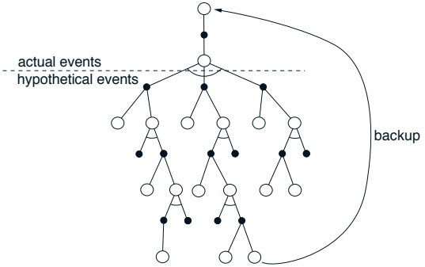

图 14.3：塞缪尔跳棋程序的回溯图。

程序相对于对手的棋子数量，给予王棋更高的权重，并加入了一些优化，使得在优势时交换棋子比在劣势时更有利。因此，塞缪尔程序的目标是**提升其棋子优势**，而这在跳棋中与获胜高度相关。

然而，塞缪尔的学习方法可能遗漏了**稳健时序差分算法的一个关键部分**。时序差分学习可视为使价值函数**自身保持一致**的一种方式，这在塞缪尔的方法中清晰可见。但同样需要的是将价值函数与状态的**真实价值**联系起来。我们通过奖励、折扣或为终止状态赋予固定值来强制实现这一点。但塞缪尔的方法既未包含奖励，也未对游戏的终止位置进行特殊处理。正如塞缪尔本人指出的，他的价值函数可能仅仅通过为所有位置赋予一个常数值而达到一致。他希望通过赋予棋子优势项一个**大且不可修改的权重**来避免这类解决方案。但尽管这可能降低找到无用评估函数的可能性，却无法完全禁止。例如，仍可通过设置可修改的权重来抵消不可修改权重的影响，从而得到一个常数函数。

由于塞缪尔的学习过程**并未被约束以寻找有用的评估函数**，因此**有可能随着经验积累而变得更差**。事实上，塞缪尔报告称在大量自我对弈训练中观察到了这一现象。为使程序重新改进，塞缪尔不得不进行干预，将绝对值最大的权重重置为零。他的解释是，这种**剧烈干预**将程序从局部最优中拉出，但另一种可能是，它让程序**脱离了评估的轨道**。

---

尽管存在这些潜在问题，塞缪尔采用泛化学习方法的跳棋程序仍达到了 **“优于平均水平”** 的表现。相当不错的业余棋手评价它 **“狡猾但可被击败”**（塞缪尔，1959）。与死记硬背学习版本相比，这个版本能够发展出良好的中局策略，但在开局和残局方面仍然较弱。该程序还具备搜索特征集的能力，以找出对构建价值函数最有用的特征。后续版本（塞缪尔，1967）对其搜索过程进行了改进，例如采用α-β剪枝、广泛使用名为 **“书本学习”** 的监督学习模式，以及使用称为签名表（格里菲斯，1966）的分层查找表来代替线性函数逼近来表示价值函数。这个版本学会了比1959年程序好得多的棋艺，尽管仍未达到大师水平。塞缪尔的跳棋程序被广泛认为是人工智能和机器学习领域的一项重大成就。

## 14.3 杂技机器人

强化学习已被广泛应用于各种物理控制任务（例如，关于机器人应用的合集，参见康奈尔和马哈德万，1993）。其中一项任务是杂技机器人，这是一个双连杆、欠驱动的机器人，大致类似于在高杠上摆荡的体操运动员（图14.4）。第一个关节（对应体操运动员握杠的双手）无法施加扭矩，但第二个关节（对应体操运动员在腰部弯曲）可以。该系统有四个连续状态变量：两个关节位置和两个关节速度。运动方程见图14.5。这个系统已被控制工程师（例如，斯庞，1994）和机器学习研究人员（例如，德容和斯庞，1994；布恩，1997）广泛研究。

控制杂技机器人的一个目标是在最短时间内将末端（“脚”）摆动到高于第一个关节的位置，高度等于其中一个连杆的长度。在这个任务中，施加在第二个关节上的扭矩被限制为三种选择：固定大小的正向扭矩、相同大小的负向扭矩或无扭矩。在达到目标之前的所有时间步都会给予-1的奖励，达到目标则结束一个片段。不使用折扣（$\gamma = 1$）。因此，任何状态s的最优价值$v_{*}(s)$是从s开始达到目标所需的最短时间（以整数步计）。

萨顿（1996）在一个在线、无模型的背景下处理了杂技机器人摆起任务。虽然杂技机器人是模拟的，但模拟器并不可用

---

目标：将顶端提升至水平线以上

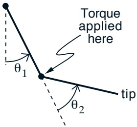

图 14.4：杂技机器人模型

$$
\begin{array}{r l r}{\ddot{\theta}_{1}}&{=}&{-d_{1}^{-1}(d_{2}\ddot{\theta}_{2}+\phi_{1})}\end{array}
$$

$$
\begin{array}{r l r}{\ddot{\theta}_{2}}&{=}&{\left(m_{2}l_{c2}^{2}+I_{2}-\frac{d_{2}^{2}}{d_{1}}\right)^{-1}\left(\tau+\frac{d_{2}}{d_{1}}\phi_{1}-m_{2}l_{1}l_{c2}\dot{\theta}_{1}^{2}\sin\theta_{2}-\phi_{2}\right)}\end{array}
$$

$$
\begin{array}{r l r}{d_{1}}&{=}&{m_{1}l_{c1}^{2}+m_{2}(l_{1}^{2}+l_{c2}^{2}+2l_{1}l_{c2}\cos\theta_{2})+I_{1}+I_{2}}\end{array}
$$

$$
\begin{array}{r l r}{d_{2}}&{=}&{m_{2}(l_{c2}^{2}+l_{1}l_{c2}\cos\theta_{2})+I_{2}}\end{array}
$$

$$
\begin{array}{r l r}{\phi_{1}}&{=}&{-m_{2}l_{1}l_{c2}\dot{\theta}_{2}^{2}\sin\theta_{2}-2m_{2}l_{1}l_{c2}\dot{\theta}_{2}\dot{\theta}_{1}\sin\theta_{2}}\end{array}
$$

$$
\begin{array}{r l}{+}&{{}(m_{1}l_{c1}+m_{2}l_{1})g\cos(\theta_{1}-\pi/2)+\phi_{2}}\end{array}
$$

$$
\begin{array}{r l r}{\phi_{2}}&{=}&{m_{2}l_{c2}g\cos(\theta_{1}+\theta_{2}-\pi/2)}\end{array}
$$

图 14.5：模拟杂技机器人的运动方程。仿真中采用的时间步长为 **0.05秒**，**每四个时间步选择一次动作**。作用于第二关节的扭矩记为 $\tau \in \{+1, -1, 0\}$。关节位置无约束，但角速度限制为 $\dot{\theta}_1 \in [-4\pi, 4\pi]$ 和 $\dot{\theta}_2 \in [-9\pi, 9\pi]$。常数值为 $m_1 = m_2 = 1$（连杆质量），$l_1 = l_2 = 1$（连杆长度），$l_{c1} = l_{c2} = 0.5$（连杆质心位置），$I_1 = I_2 = 1$（连杆转动惯量），以及 $g = 9.8$（重力加速度）。

---

可供智能体/控制器以任意方式使用。训练与交互过程完全**如同使用真实的物理倒立摆系统**。每个回合开始时，倒立摆的两段摆杆均垂直向下静止。强化学习智能体持续施加力矩直至达成目标——这一结果最终总会实现。随后倒立摆将重置至初始静止状态，新的回合随即开始。

采用的**学习算法**是结合线性函数逼近、瓦片编码与替代迹的 Sarsa(λ) 算法（如图 9.8 所示）。由于动作集规模小且离散，很自然地**为每个动作单独配置一组瓦片**。接下来的关键选择是如何用连续变量表示状态。**精巧的设计方案**可能会选择以质心与第二段摆杆的角位置、角速度作为状态表示，这或许能使求解更简洁并支持更广泛的泛化。但由于这仅是一个测试问题，此处采用了更朴素直接的表示方式：直接使用两段摆杆的位置与速度——即 θ₁、θ̇₁、θ₂ 与 θ̇₂。根据倒立摆的物理特性（见图 14.5），两个角度被限制在有限范围内，并自然限定在 [0, 2π] 区间。因此，本任务中的状态空间是四维空间中的一个有界矩形区域。

随之而来的问题是**应使用何种瓦片划分方案**。如第 9 章所述，存在多种可能性。一种方案是采用完整网格，沿所有维度切割四维空间，从而生成大量小型四维瓦片。另一种方案是仅沿单个维度切割，形成超平面条纹。此时需要选择沿哪个维度进行切割。当然，无论采用哪种方案，都必须确定切割宽度、各类瓦片的数量，以及当存在多组瓦片时如何设置偏移量。还可以沿维度对或三元组进行切割以获得其他瓦片构型。例如，若预期两段摆杆的速度在影响价值函数时存在强交互作用，则可能需要创建多组同时沿这两个维度切割的瓦片。若认为零速度附近区域尤为关键，则可在该区域设置更密集的切割间隔。

萨顿采用了**多种简单切割方式组合的瓦片方案**。四个维度各被**等分为六个区间**。角速度维度额外增加第七个区间，以便所有维度的瓦片都能按随机分数区间进行偏移（参见第 9 章“瓦片编码”小节）。在总计 48 组瓦片中，12 组采用前述四维全切割方案，每组将空间划分为 6×7×6×7 = 1764 个瓦片；另有 12 组沿三个维度切割（四个三维组合各含 3 组随机偏移瓦片）；还有 12 组沿两个维度切割（六个二维组合各含 2 组瓦片）；最后 12 组瓦片仅依赖单个维度（四个维度各含 3 组瓦片）。

---

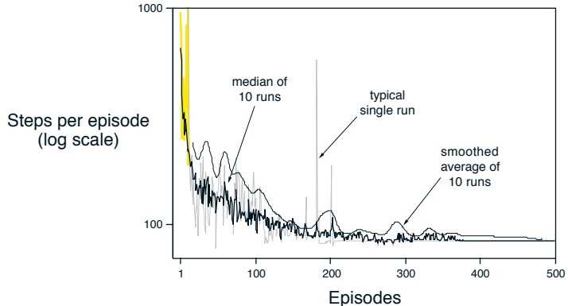

图 14.6：Acrobot 任务上 Sarsa( $\lambda$) 的学习曲线。

每个动作对应的总瓦片数大约为 25,000 个。这个数量足够小，因此不需要使用哈希技术。所有瓦片都在相关维度上以一个随机的小区间偏移量进行偏移。

学习算法的其余参数为 $\alpha = 0.2/48$、$\lambda = 0.9$、$\epsilon = 0$ 以及 $\mathbf{w}_0 = 0$。在此任务中，**使用贪婪策略**（$\varepsilon = 0$）似乎更合适，因为要取得良好表现需要一连串正确的动作。一个探索性动作就可能破坏一整串好的动作序列。相反，通过将动作值的初始值**乐观地设置为较低的值 0** 来确保探索性。正如第 2.7 节和例 9.2 所讨论的，这会使智能体对其最初获得的任何奖励持续感到失望，从而促使它不断尝试新事物。

图 14.6 显示了 Acrobot 任务及上述学习算法的学习曲线。从单次运行的曲线可以看出，**单个回合有时会非常长**。在这些回合中，Acrobot 通常会在第二个关节处反复旋转，而第一个关节仅从垂直向下位置发生轻微变化。尽管这种情况经常持续很多时间步，但随着动作值被压低，它最终总会结束。所有运行最终都得到了解决问题的有效策略，通常持续约 75 步。一个典型的最终解决方案如图 14.7 所示。首先，Acrobot 对称地来回摆动几次，第二个连杆始终向下。然后，一旦系统积累了足够的能量，第二个连杆就会被向上摆动并**迅速达到目标高度**。

---

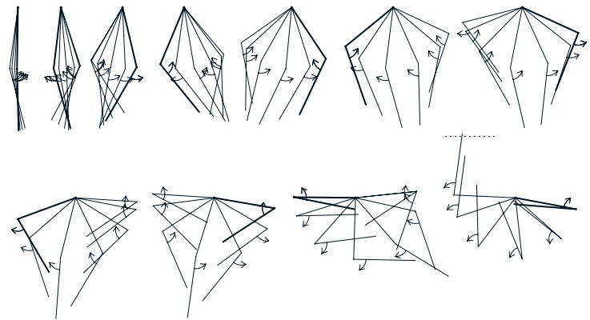

图 14.7：杂技机器人一种典型的学习行为。每组图像是一系列连续位置，较粗的线表示起始位置。箭头表示施加在第二个关节上的扭矩。

## 14.4 电梯调度

等待电梯是我们都熟悉的场景。我们按下按钮，然后等待一部朝正确方向运行的电梯到来。如果乘客太多或电梯数量不足，我们可能需要等待很长时间。我们等待的时间长短，**很大程度上**取决于电梯所采用的调度策略，即如何决定前往何处。例如，如果多个楼层都有乘客请求搭乘，应该优先服务哪一个？如果没有接送请求，电梯应如何分布以等待下一个请求？电梯调度是一个具有重要经济价值的随机最优控制问题的典型案例，其规模之大，已超出经典方法（如动态规划）所能解决的范围。

Crites 和 Barto（1996；Crites，1996）研究了强化学习技术在图 14.8 所示的四部电梯、十层楼系统中的应用。图的右侧显示了接送请求以及每个请求已等待的时间。每部电梯都有其位置、方向、速度，以及一组表示乘客目的楼层的按钮。通过对连续变量进行粗略量化，Crites 和 Barto 估计该系统拥有超过 $10^{22}$ 个状态。如此庞大的状态集排除了使用经典动态规划方法（如价值迭代）的可能性。**即使**每微秒能完成一个状态的备份，也需要超过 1000 年才能完成对整个状态空间的一次遍历。