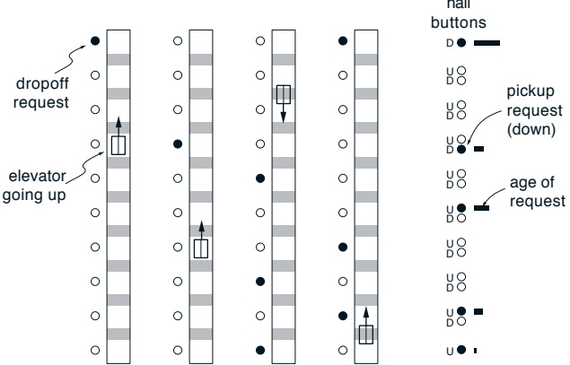
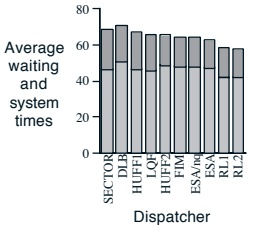
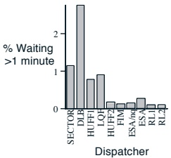
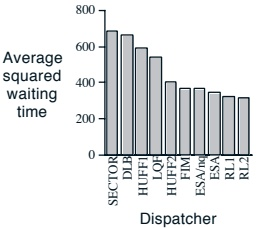
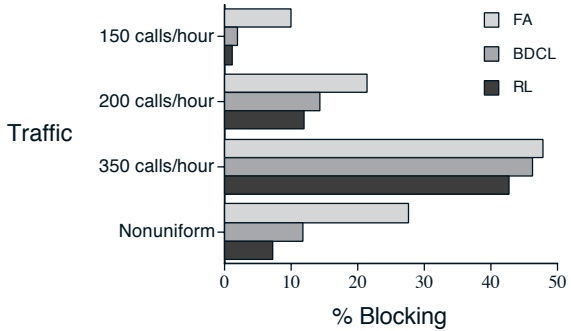
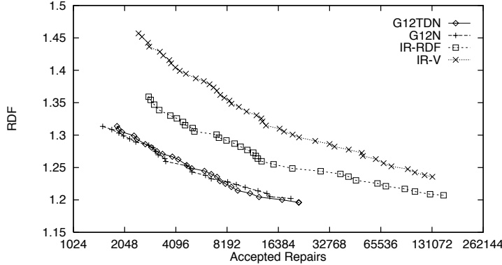
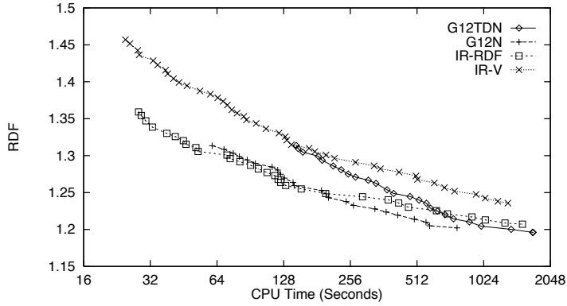
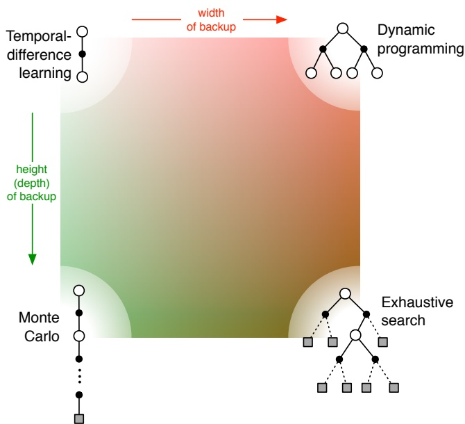

图 14.8：一栋十层楼内的四部电梯。

在实践中，现代电梯调度器的设计基于启发式方法，并在模拟建筑中进行评估。这些模拟器相当复杂且细致入微。每部电梯轿厢的物理特性通过连续时间和连续状态变量进行建模。乘客到达被建模为离散的随机事件，其到达率在模拟的一天中频繁变化。**毫不意外的是**，交通最繁忙、对调度算法构成最大挑战的时间段是早高峰和晚高峰。调度器的设计通常主要针对这些困难时段。

电梯调度器的性能通过几种不同的方式进行衡量，均以进入系统的平均乘客为基准。平均等待时间是指乘客在登上电梯前等待的时间，而平均系统时间则是乘客在被送达目标楼层前等待的总时长。另一个经常遇到的统计数据是等待时间超过 60 秒的乘客百分比。Crites 和 Barto 关注的目标是平均等待时间的平方。这一目标之所以常用，是因为它既能保持较低的等待时间，又能鼓励对所有乘客服务的公平性。

Crites 和 Barto 应用了一种经过多方面增强的单步 Q 学习版本，以利用该问题的特殊特性。其中最重要的方面涉及动作的设定。首先，每部电梯独立做出自己的决策，与其他电梯无关。其次，对决策施加了若干约束。**正在载客的电梯**不得在经过某楼层时忽略需要下车的乘客，也

---

电梯能否**反向行驶**，直到所有希望朝当前方向前进的乘客都到达目标楼层？此外，除非有乘客需要在该楼层上下，否则电梯不允许停靠；若已有其他电梯停靠某楼层，则后续电梯不得在该楼层接载乘客。最后，当面临上行或下行的选择时，电梯被强制要求始终**优先向上运行**（否则晚高峰时段的客流可能导致所有电梯都集中下行至大堂）。**最后这三项约束条件被明确纳入设计，旨在提供先验知识并简化问题复杂度**。所有这些约束的综合效果是，每部电梯只需做出少量且简单的决策：唯一需要决定的是，当接近有乘客等待的楼层时是否停靠。除此之外，所有操作均无需选择。

由于每部电梯极少需要做出决策，这促成了问题的第二次简化。对学习智能体而言，系统仅会在需要决策的时间点之间进行离散跳跃。**当连续时间决策问题以这种方式被视作离散时间系统时，它被称为半马尔可夫决策过程**。在很大程度上，此类过程可通过将每个离散转移的奖励视为对应连续时间区间内奖励的积分，从而像处理普通马尔可夫决策过程一样处理。**回报的概念很自然地从未来奖励的折现和推广为未来奖励的折现积分**：

$$
G_{t}=\sum_{k=0}^{\infty}\gamma^{k}R_{t+k+1}\qquad\begin{aligned}&\quad 转化为\quad G_{t}=\int_{0}^{\infty}e^{-\beta\tau}R_{t+\tau}d\tau,\\ \end{aligned}
$$

其中左侧的 $R_t$ 是离散时间下的常规即时奖励，而右侧的 $R_{t+\tau}$ 是连续时间 $t + \tau$ 下的瞬时奖励。在电梯问题中，连续时间奖励是所有等待乘客等待时间平方和的负值。参数 $\beta > 0$ 的作用类似于折扣率参数 $\gamma \in [0, 1)$。

现在可以阐述将 Q 学习扩展到半马尔可夫决策问题的基本思路。假设系统在时间 $t_{1}$ 处于状态 S 并采取动作 A，随后在时间 $t_{2}$ 于状态 $S'$ 需要做出下一个决策。在此离散事件转移后，针对表格型动作值函数 Q 的半马尔可夫 Q 学习更新规则为：

$$
Q(S,A)\leftarrow Q(S,A)+\alpha\left[\int_{t_{1}}^{t_{2}}e^{-\beta(\tau-t_{1})}R_{\tau}d\tau+e^{-\beta(t_{2}-t_{1})}\min_{a}Q(S^{\prime},a)-Q(S,A)\right].
$$

注意 $e^{-\beta(t_{2}-t_{1})}$ 如何作为**取决于事件间隔时长的可变折扣因子**发挥作用。该方法由 Bradtke 和 Duff（1995）提出。

---

一个复杂之处在于，所定义的奖励——即等待时间的平方和的负值——在实际电梯运行过程中通常是无从得知的。这是因为在真实的电梯系统中，我们无法知晓有多少人在某楼层等待，**只能知道该楼层请求接载的按钮被按下后经过了多长时间**。当然，在模拟器中这些信息是已知的，克里特斯和巴托正是利用这些信息获得了他们的最佳结果。他们还尝试了另一种方法，该方法仅使用在真实电梯组在线学习情境中可获得的信息。在这种情况下，可以利用每个按钮被按下后的时长以及到达率的估计值，来计算每个楼层的预期等待时间平方和。事实证明，将此作为奖励度量，其效果几乎与使用实际等待时间平方和相当。

在函数逼近方面，他们采用反向传播训练的非线性神经网络来表示动作价值函数。克里特斯和巴托尝试了多种向网络呈现状态信息的方式。经过大量探索，他们发现使用具有47个输入单元、20个隐藏单元和两个输出单元（每个动作对应一个输出）的网络结构能获得最佳效果。**输入单元对状态的编码方式对学习效果至关重要**。这47个输入单元的具体构成如下：

● 18个单元：其中两组单元对九个下行接载请求的厅堂按钮信息进行编码。若按钮已被按下，则一个实值单元记录经过的时间；若按钮未被按下，则一个二进制单元处于激活状态。

- 16个单元：每个单元对应决策电梯可能的位置和方向组合。在任何给定时刻，这些单元中恰好有一个处于激活状态。

- 10个单元：呈现其他电梯在10个楼层上的叠加位置分布。每部电梯都有一个取决于其方向和速度的“影响范围”。例如，停靠的电梯仅会激活其当前楼层对应的单元，而移动中的电梯会激活多个对应其即将到达楼层的单元，**距离最近的楼层对应单元的激活程度最高**。系统不提供具体哪部电梯位于特定位置的信息。

- 1个单元：若决策电梯位于有乘客等待的最高楼层，则该单元激活。

● 1个单元：若决策电梯位于等待时间最长的乘客所在楼层，则该单元激活。

---

图 14.9: 电梯调度器的性能比较。SECTOR调度器与许多实际电梯系统中所采用的方案类似。RL1和RL2调度器则是通过强化学习构建的。

• 1个单位：偏置单元始终处于激活状态。

研究中采用了两种架构。在RL1中，每部电梯都拥有自己的动作-价值函数和独立的神经网络。而在RL2中，则只使用一个网络和一个动作-价值函数，所有四部电梯的经验都用于这一个网络的学习。在这两种情况下，每部电梯都独立于其他电梯做出决策，但**与它们共享同一个奖励信号**。从单部电梯的角度来看，这引入了额外的随机性，因为其奖励部分取决于其他电梯它无法控制的动作。在每部电梯拥有各自动作-价值函数的架构中，不同的电梯有可能学习到不同的专门化策略（尽管实际上它们往往倾向于学习相同的策略）。另一方面，采用**公共动作-价值函数的架构学习速度更快**，因为它能同时从所有电梯的经验中学习。尽管系统是在模拟环境中训练的，但训练时间仍然是一个问题。强化学习方法在一颗100 MIPS的处理器上进行了约四天的计算机时间训练（对应于大约60,000小时的模拟时间）。虽然这是一个相当大的计算量，但**与任何传统的动态规划算法所需的时间相比，这几乎可以忽略不计**。

网络的训练过程是：在模拟大量晚高峰时段的同时，使用正在开发、学习中的动作-价值函数来做出调度决策。Crites和Barto使用了第2.3节中描述的吉布斯softmax程序来选择动作，并在训练过程中逐渐降低“温度”。在用于评估已学习调度器性能的测试运行中，温度被设置为零。

图14.9展示了在模拟的晚高峰时段（研究人员称之为下行高峰交通）中，几种调度器的性能表现。这些调度器

---

包含行业内常用的类似方法、多种启发式方法、**在线反复运行复杂优化算法的**先进研究算法（Bao等人，1994年），以及通过两种强化学习架构习得的调度器。从所有性能指标来看，强化学习调度器均优于其他方法。虽然该问题的最优策略尚不明确，且由于商业调度策略的细节属于专有技术，行业最新进展难以确切界定，但这些习得的调度器表现出色。

## 14.5 动态信道分配

蜂窝电话系统运营中的一个重要问题是如何高效利用可用带宽，为尽可能多的用户提供优质服务。随着蜂窝电话使用的快速增长，这一问题变得至关重要。在此我们介绍Singh和Bertsekas（1997年）的一项研究，他们将强化学习应用于此问题。

移动电话系统利用了这样一个事实：如果多个呼叫者之间的物理距离足够远，使其呼叫互不干扰，则一个通信信道（频带）可以同时被多个呼叫者使用。**不发生干扰的最小距离称为信道复用约束**。在蜂窝电话系统中，服务区域被划分为多个称为小区（cell）的区域。每个小区设有一个基站，负责处理该小区内的所有呼叫。总可用带宽被永久划分为若干信道。随后必须在不违反信道复用约束的前提下，将信道分配给各小区及小区内的呼叫。实现方式多种多样，其中一些方法在为新呼叫或呼叫者跨越小区边界时"切换"到另一小区的呼叫提供信道的可靠性方面优于其他方法。如果新呼叫或切换呼叫没有可用信道，呼叫将丢失或被阻塞。Singh和Bertsekas研究了如何分配信道以最小化阻塞呼叫数量的问题。

一个简单的例子有助于理解该问题的本质。假设有三个小区共享两个信道，且三个小区呈线性排列，根据信道复用约束，任何相邻小区不能使用同一信道。如下图所示左侧场景，当左侧小区正在使用信道1服务呼叫，右侧小区正在使用信道2服务另一呼叫时，**任何到达中间小区的新呼叫都必须被阻塞**。

---

显然，让左侧和右侧的小区都使用信道1进行通话会更好。这样，中间小区的新呼叫就可以像右图所示那样被分配信道2，而不会违反信道复用约束。这种交互作用和可能的优化是信道分配问题的典型特征。在更大、更现实的场景中，涉及许多小区、信道和呼叫，并且新呼叫何时何地到达或现有呼叫何时必须进行切换都存在不确定性，此时**分配信道以最小化阻塞的问题会变得极其复杂**。

最简单的方法是**永久地将信道分配给各个小区**，使得即使所有小区的所有信道同时使用，也永远不会违反信道复用约束。这被称为**固定分配方法**。相反，在**动态分配方法**中，所有信道都潜在地对所有小区可用，并在呼叫到达时动态地分配给小区。如果操作得当，这种方法可以利用呼叫在空间和时间分布上的临时变化来为更多用户提供服务。例如，当呼叫集中在少数几个小区时，这些小区可以被分配更多信道，而不会增加使用率较低的小区的阻塞率。

信道分配问题可以**表述为一个半马尔可夫决策过程**，就像上一节中的电梯调度问题一样。在半MDP表述中，一个状态包含两个组成部分。**第一个是整个蜂窝系统的配置**，它为每个小区给出该小区每个信道的使用状态（占用或空闲）。一个典型的拥有49个小区和70个信道的蜂窝系统，其配置数量高达 $70^{49}$ 种，这排除了使用传统动态规划方法的可能性。另一个状态组成部分是**指示导致状态转换的事件类型**：到达、离开或切换。这个状态组成部分决定了可能采取的行动类型。当呼叫到达时，可能的行动是分配一个空闲信道给它，或者在没有可用信道时将其阻塞。当呼叫离开时，即当呼叫者挂断时，系统被允许重新分配该小区中正在使用的信道，以尝试创建更好的配置。在时间t，即时奖励 $R_{t}$ 是当时正在进行的呼叫数量，而回报是

$$
G_{t}=\int_{0}^{\infty}e^{-\beta\tau}R_{t+\tau}d\tau,
$$

其中 $\beta > 0$ 扮演的角色类似于折扣率参数 $\gamma$。最大化该回报的期望值，等同于在无限时域上最小化被阻塞呼叫的期望（折现）数量。

---

**如果采用后状态（第6.6节）的视角来处理，这个问题将得到极大简化**。对于每个状态和动作，其直接结果是一个新的配置，即一个后状态。价值函数仅在这些配置上进行学习。为了在可能的动作中进行选择，需要确定并评估每个动作将产生的配置。随后选择那个能带来最高估计价值配置的动作。例如，当一个新的呼叫到达某个小区时，如果有空闲信道，它可以被分配给任何一个空闲信道；否则，该呼叫必须被阻塞。由每次分配产生的新配置很容易计算，因为它始终是分配行为的一个简单确定性结果。当一个呼叫结束时，新释放的信道变得可用，可以重新分配给当前正在进行的任何一个呼叫。在这种情况下，系统会考虑将小区内每个进行中的呼叫重新分配给这个新释放信道的动作。然后，选择能带来最高估计价值配置的那个动作。

价值函数采用了线性函数逼近：一个配置的估计价值是其特征的加权和。配置由两组特征表示：**每个小区的可用性特征**和**每个小区-信道对的紧凑性特征**。对于任意配置，一个小区的可用性特征给出了，**如果其他小区在当前配置下保持不变，该小区还能在不产生冲突的情况下接受多少额外呼叫**。对于任意给定配置，一个小区-信道对的紧凑性特征给出了，在该配置下，该信道在该小区四格半径范围内被使用的次数。所有这些特征都被归一化到-1到1之间。使用了线性TD(0)的半马尔可夫版本来更新权重。

Singh和Bertsekas在模拟一个 $7 \times 7$ 蜂窝阵列（拥有70个信道）的情况下，比较了三种信道分配方法。信道复用约束是：使用同一信道的呼叫必须间隔3个小区。呼叫根据泊松分布随机到达各小区（不同小区的均值可能不同），呼叫持续时间则由一个均值为三分钟的指数分布随机决定。所比较的方法包括：固定分配方法、一种称为“带定向信道锁定的借用”的动态分配方法，以及强化学习方法。BDCL是他们从文献中找到的最好的动态信道分配方法。它是一种启发式方法，像FA一样为小区分配信道，但在需要时可以从相邻小区借用信道。它为每个小区内的信道排序，并使用这个顺序来决定借用哪些信道以及如何在小区内动态地为呼叫重新分配信道。

图14.10展示了这些方法在平均到达率为150、200和350次呼叫/小时，以及在一个...

---

图 14.10：在不同平均呼叫到达率下，FA、BDCL 和 RL 信道分配方法的性能。

不同的小区具有不同的平均到达率。强化学习方法是在线学习的。图中显示的是其渐近性能，但实际上学习过程非常迅速。**对于所有到达率，RL 方法阻塞呼叫的频率都低于其他方法，并且在开始学习后不久就达到了这种性能**。值得注意的是，随着呼叫到达率的增加，不同方法之间的性能差异逐渐减小。这是可以预料的，因为随着系统呼叫趋于饱和，动态分配方法建立有利使用模式的机会也随之减少。然而，在实践中，**非饱和系统的性能才是最重要的**。出于市场考量，蜂窝电话系统的容量通常设计得足够大，以至于超过 10% 的阻塞率是很少见的。

Nie 和 Haykin (1996) 也研究了强化学习在动态信道分配中的应用。他们对该问题的表述方式与 Singh 和 Bertsekas 有所不同。他们的系统并非直接试图最小化呼叫阻塞的概率，而是试图最小化一个更间接的系统性能度量。**成本是根据使用相同信道的呼叫之间的距离来分配给信道使用模式的**。与信道共享呼叫距离较远的使用模式相比，**那些由多个彼此靠近的呼叫共享信道的使用模式更受青睐**。Nie 和 Haykin 将他们的系统与一种名为 MAXAVAIL 的方法进行了比较，后者被认为是当时最好的动态信道分配方法之一。对于每个新呼叫，MAXAVAIL 会选择能使整个系统中可用信道总数最大化的信道。Nie 和 Haykin 在一个包含 49 个小区、70 个信道的模拟环境中，通过多种条件测试表明，他们的强化学习系统所达到的阻塞概率与 MAXAVAIL 的性能非常接近。

---

**关键点**在于，强化学习生成的分配策略可以在线执行的效率远高于MAXAVAIL算法，后者需要大量的在线计算，以至于在大型系统中不可行。

我们在本节中描述的这些研究非常新近，它们引发的许多问题尚未得到解答。然而，我们可以看出，将强化学习应用于同一个现实世界问题可能存在多种不同方式。在不久的将来，我们预计会看到这些应用的许多改进，以及强化学习在通信系统问题上的许多新应用。

## 14.6 作业车间调度

工业及其他领域的许多工作需要在满足时间和资源约束的同时完成一系列任务。时间约束要求某些任务必须在其他任务开始之前完成；资源约束要求需要相同资源的两个任务不能同时进行（例如，同一台机器不能同时执行两项任务）。目标是创建一个时间表，规定每项任务的开始时间及其将使用的资源，在满足所有约束的同时，**尽可能缩短整体时间**。这就是作业车间调度问题。其一般形式是NP完全问题，这意味着可能没有有效的方法来精确找到该问题任意实例的最短调度方案。作业车间调度通常使用启发式算法完成，这些算法利用了每个特定实例的特殊属性。

张和迪特里希（1995, 1996; 张, 1996）之所以将强化学习应用于作业车间调度，是因为设计特定领域的启发式算法可能成本高昂且耗时。他们的目标是展示如何利用强化学习来学习在特定领域中快速找到满足约束的短期调度方案，从而减少所需的人工工程设计量。他们研究了NASA航天飞机有效载荷处理问题（SSPP），该问题需要对航天飞机货舱有效载荷的安装和测试所需任务进行调度。一个SSPP通常需要为两到六次航天飞机任务进行调度，每次任务需要34到164项任务。任务的一个例子是MISSION-SEQUENCE-TEST，其持续时间为7200个时间单位，需要以下资源：两名质量控制官员、两名技术人员、一台ATE、一台SPCDS和一台HITS。某些资源被划分为资源池，如果一项任务需要多个特定类型的资源，这些资源必须属于同一个池，并且该池必须是合适的池。

---

例如，如果某项任务需要两名质量控制员，那么这两人都必须来自**同一地点、同一班次**的质量控制员资源池中。为一项任务找到一个无冲突的排程方案——即满足所有时间和资源约束——并不太难，但我们的目标是**找到总耗时最短的无冲突排程方案**，这就要困难得多。

如何运用强化学习实现这一目标呢？车间调度问题通常被形式化为在排程空间中的搜索，也就是所谓的离散优化或组合优化问题。典型的解决方法会**依次生成排程方案**，并尝试在约束违反程度和总时长方面不断改进（即采用爬山法或局部搜索法）。你可以将其视为我们在第二章讨论过的那种非关联式强化学习问题，但**可能的动作数量极其庞大**：所有可能的排程方案！然而，除了动作数量过多的问题外，通过这种方式获得的任何解决方案都只是针对单一任务实例的单个排程方案。相比之下，Zhang和Dietterich希望他们的学习系统最终能够获得一个**适用于任何SSPP问题**的策略，能够快速找到优质排程方案。他们希望系统能**在这一特定领域掌握车间调度的技能**。

为了寻找实现这一目标的方法线索，他们参考了当时NASA实际使用的SSPP优化方法：Zweben和Daun（1994）提出的**迭代修复法**。搜索的起点是关键路径排程——一种满足时间约束但忽略资源约束的排程方案。这种排程可以通过以下方式高效构建：在发射前，将每个任务安排在时间约束允许的最晚时间；在着陆后，将每个任务安排在时间约束允许的最早时间。资源池则随机分配。修改排程时使用两类操作符，它们可应用于任何违反资源约束的任务。**REASSIGN-POOL操作符**会更改分配给任务某个资源的资源池，该操作仅当能通过重新分配资源池来满足资源需求时适用。**MOVE操作符**则将任务移动到更早或更晚的、能满足其资源需求的第一个时间点，并利用关键路径法重新调度该任务的所有时间相关依赖项。

在迭代修复搜索的每一步中，会根据以下规则选择一个操作符应用于当前排程：首先找到**最早出现资源约束违反的任务**，如果可能则对其应用REASSIGN-POOL操作符。如果存在多个可选操作（即多种不同的资源池重新分配方案），则随机选择其一。如果无法应用REASSIGN-POOL操作符，则根据**优先选择短距离移动任务的启发式规则**，随机选择一个MOVE操作符。

---

其中任务具有**极少的时间依赖性**，且资源需求接近于任务的**总体分配**。应用操作符后，会确定生成调度方案的**约束违反次数**。采用模拟退火过程来决定是否接受这一新调度方案。若用 $\Delta V$ 表示修复操作所消除的约束违反次数，则新调度方案以概率 $\exp(-\Delta V/T)$ 被接受，其中 T 是当前计算温度，在搜索过程中逐渐降低。若被接受，新调度方案将成为下一次迭代的当前调度方案；否则，算法将尝试再次修复旧调度方案——由于涉及随机决策，这通常会产生不同结果。当所有约束均被满足时，搜索停止。通过多次运行算法并选择所得无冲突调度方案中最短者，可获得较短的调度方案。

Zhang 和 Dietterich 将完整调度方案视为强化学习意义上的状态。动作为适用的 REASSIGN-POOL 和 MOVE 操作符，通常数量约为 20 个。该问题被视作**分段式任务**，每段均以迭代修复算法相同的**关键路径调度方案**开始，并在找到不违反任何约束的调度方案时结束。初始状态——即关键路径调度方案——记为 $S_0$。奖励机制旨在促进快速构建**持续时间短的无冲突调度方案**。系统在每一步若得到的调度方案仍存在约束违反，则会获得一个较小的负奖励 $(-0.001)$。这激励智能体快速找到无冲突调度方案，即对 $S_0$ 进行少量修复即可。鼓励系统寻找较短调度方案则更为困难，因为调度方案的“短”取决于具体 SSPP 实例的特定情况。具有大量任务和约束的复杂实例的最短调度方案，必然比简单实例的最短调度方案更长。Zhang 和 Dietterich 设计了一个**资源膨胀系数（RDF）公式**，旨在成为与实例无关的调度方案持续时间度量指标。为考虑实例的**内在难度**，该公式利用了 $S_0$ 的**资源过度分配度量值**。由于较长的调度方案往往产生较大的 RDF，每个分段结束时将最终无冲突调度方案的 RDF 负值作为奖励。在此奖励函数下，若从调度方案 s 出发经过 N 次修复得到最终无冲突调度方案 $S_f$，则从 s 获得的回报为 $-RDF(S_f) - 0.001(N - 1)$。

该奖励函数旨在使系统学会实现两个目标：**寻找持续时间短的无冲突调度方案**，以及**快速找到无冲突调度方案**。但强化学习系统实际上只有一个目标——**最大化期望回报**——因此具体的奖励值决定了学习系统如何在这两个目标之间进行权衡取舍。

---

将立即奖励设置为较小的值-0.001意味着学习系统会将调度过程中的**一次修复或一步操作**视为价值0.001单位的RDF。例如，若某个调度方案可通过一次或两次修复生成无冲突调度，最优策略仅在额外修复能**承诺最终RDF减少超过0.001时**才会采取额外步骤。

Zhang与Dietterich采用TD(λ)算法学习价值函数，通过反向传播TD误差的多层神经网络进行函数逼近。动作选择采用ε-贪婪策略，其中ε值在训练过程中递减。他们使用单步前瞻搜索寻找贪婪动作，凭借对问题的理解能够轻松预测每次修复操作将产生的调度结果。为提升性能，他们对基础流程进行了多项改进：其一是**在每轮训练后反向运行TD(λ)算法**，使资格迹指向未来状态而非过去状态。实验表明这种方法比前向学习更精确高效。在更新网络权重时，当TD误差较大时他们有时会执行多重权重更新，这本质上等同于在训练中根据误差动态调整步长参数。

他们还尝试了Lin（1992）提出的经验回放技术：智能体在训练过程中始终记忆截至当前的最佳训练轮次，每完成四轮训练就回放该记忆轮次并像处理新数据般从中学习。训练初期，他们允许系统向优秀调度器生成的训练轮次学习，这些数据也可在后续训练中回放。针对**分支因子约20的大规模问题**，为加速前瞻搜索，他们采用随机采样贪婪搜索变体：仅通过动作随机采样估计贪婪动作，并持续增加样本量直至达到预设置信度——确保样本中的贪婪动作即真实贪婪动作。最后，他们发现调度过程中的过度循环会严重拖慢学习速度，遂使系统显式检测循环并在发现循环时调整动作选择。尽管这些技术都能提升学习效率，但各自对系统成功的**关键程度尚不明确**。

Zhang与Dietterich尝试了两种不同网络架构。在系统初版中，每个调度方案通过20个人工设计特征表示。为定义这些特征，他们通过研究小型调度问题寻找能预测RDF的特征。例如，小型问题经验表明仅有四个资源池易引发分配问题，其特征的均值与标准差被纳入设计。

---

**计算了每个资源池在整个调度过程中未使用部分的比例**，最终得到 10 个实值特征。另外两个特征是当前调度的 RDF 值，以及其**在违反资源约束的时间占总时长的百分比**。该网络包含 20 个输入单元（每个特征对应一个）、一个包含 40 个 sigmoid 单元的隐藏层，以及一个包含 8 个 sigmoid 单元的**输出层**。输出单元通过一种编码方式表示调度的价值，大致上，**在 8 个单元上活动峰值的分布位置代表了其价值**。使用适当的 TD 误差，通过网络的反向传播算法更新权重，并采用了前面提到的**多重权重更新技术**。

系统的第二个版本（Zhang and Dietterich, 1996）使用了一个**更复杂的时间延迟神经网络**，该方法借鉴自语音识别领域（Lang, Waibel, and Hinton, 1990）。这个版本将每个调度划分为一系列**区块**（任务和资源分配保持不变的最大时间间隔），并用一组与第一个程序类似的特征表示每个区块。然后，它通过一组“核”网络扫描这些区块，以生成一组更抽象的特征。由于不同调度包含的区块数量不同，另一层网络会对**每个三分之一的区块内的抽象特征进行平均**。最后，一个包含 8 个 sigmoid 输出单元的层使用与系统第一个版本相同的编码方式来表示调度的价值。总的来说，这个网络拥有 1123 个可调权重。

他们构建了 100 个人工调度问题，并将其划分为用于训练、确定何时停止训练（验证集）以及最终测试的子集。在训练过程中，他们每完成 100 个训练周期就在验证集上测试系统，并在验证集上的性能不再变化时停止训练，这通常需要大约 10,000 个训练周期。他们使用不同的 $\lambda$ 值（0.2 和 0.7）以及三个不同的训练集来训练网络，并保存了最终的权重集以及在验证集上表现最佳的权重集。将每组权重视为一个不同的网络，这产生了 12 个网络，每个网络对应一个不同的调度算法。

图 14.11 显示了 12 个 TDNN 网络的平均性能（标记为 G12TDN）与 Zweben 和 Daun 的两种迭代修复算法版本的性能比较，其中一个版本使用**约束违反次数作为模拟退火要最小化的函数**，另一个版本使用 RDF 度量。图中还显示了他们系统中未使用 TDNN 的第一个版本的性能。图中绘制了通过**重复运行算法找到的最佳调度的平均 RDF 值与调度修复总次数**的关系。这些结果表明，学习系统生成的调度算法**在寻找无冲突调度时所需的修复次数要少得多**。

---

图 14.11：已接受调度修复的对比。经 Zhang 和 Dietterich（1996）许可转载。

这些解的质量与迭代修复算法找到的解质量相同。图 14.12 比较了每种调度算法在寻找不同 RDF 调度时所需的计算时间。根据这一性能指标，**非 TDNN 算法（G12N）在计算时间与调度质量之间取得了最佳平衡**。TDNN 算法（G12TDN）由于需要应用核扫描过程而耗时较多，但 Zhang 和 Dietterich 指出，有许多方法可以使其运行得更快。

这些结果并未明确证实强化学习在作业车间调度或其他困难搜索问题中的实用性。但它们确实表明，**利用强化学习方法学习如何提升搜索效率是可能的**。Zhang 和 Dietterich 的作业车间调度系统是第一个我们已知的成功案例，其中强化学习被应用于**规划空间**——即状态为完整规划（在本例中为作业车间调度），动作为规划修改。这是强化学习一种比我们通常所想的更为抽象的应用。请注意，在此应用中，系统学会的不仅仅是高效创建一个优质调度（这项技能本身可能并不特别有用）；**它学会的是如何为一类相关的调度问题快速找到优质调度**。显然，Zhang 和 Dietterich 在开发这个示例的过程中也经历了大量的试错学习。但请记住，这是对强化学习新领域的开创性探索。我们预计，随着经验的积累，此类复杂应用在未来将变得更加常规化。

---

图14.12：CPU运行时间对比。**经Zhang和Dietterich（1996）许可转载。**

---

# 引言

## 1.1 研究背景

随着深度学习（DL）在计算机视觉、自然语言处理和语音识别等领域取得巨大成功，人们对深度学习模型在医疗保健领域的应用也越来越感兴趣。医学影像分析是深度学习应用中最有前景的领域之一。**深度学习模型**，尤其是卷积神经网络（CNN），在图像分类、目标检测和分割等任务中表现出色。然而，**深度学习模型的成功很大程度上依赖于大规模、高质量和标注良好的数据集**。在医学影像领域，获取大规模标注数据集通常很困难，因为标注过程需要专业知识且耗时。此外，医学影像数据往往存在类间不平衡问题，即某些类别的样本数量远多于其他类别。这可能导致模型在训练过程中偏向多数类，从而在少数类上表现不佳。

为了解决数据稀缺和类不平衡问题，研究人员提出了多种数据增强技术。**数据增强**是指通过对现有训练数据进行各种变换来生成新的训练样本的技术。常见的数据增强方法包括旋转、缩放、翻转和裁剪等几何变换，以及调整亮度、对比度和颜色等光度变换。这些方法可以有效增加训练数据的多样性，提高模型的泛化能力。然而，传统的基于几何和光度变换的数据增强方法通常局限于对现有样本的简单变换，可能无法生成足够多样化的新样本。

**生成对抗网络（GAN）** 是一种强大的生成模型，能够学习真实数据的分布并生成新的、逼真的样本。GAN由两个神经网络组成：生成器（Generator）和判别器（Discriminator）。生成器试图生成逼真的假样本以欺骗判别器，而判别器则试图区分真实样本和生成样本。通过这种对抗训练过程，生成器可以学习生成与真实数据分布高度相似的样本。在医学影像领域，GAN已被用于数据增强，以生成合成医学图像来扩充训练数据集。这有助于缓解数据稀缺和类不平衡问题，从而提高深度学习模型的性能。

尽管GAN在数据增强方面显示出巨大潜力，但其训练过程往往不稳定且难以收敛。此外，生成的样本质量可能不足以欺骗判别器，导致训练失败。为了解决这些问题，研究人员提出了各种GAN的变体，如Wasserstein GAN（WGAN）、条件GAN（cGAN）和CycleGAN等。这些变体通过改进损失函数、网络结构或训练策略，提高了GAN的稳定性和生成样本的质量。

## 1.2 研究问题

尽管GAN及其变体在医学影像数据增强方面取得了一定进展，但仍存在一些挑战和未解决的问题：

1.  **生成样本的质量和多样性**：生成的医学图像需要具有足够的真实感和多样性，才能有效提升下游任务的性能。**如何评估生成样本的质量和多样性**，并确保其符合真实医学图像的分布，是一个关键问题。
2.  **针对特定任务的增强**：大多数现有的数据增强方法（包括基于GAN的方法）是通用的，并未针对特定的下游任务（如分类、分割）进行优化。**如何设计数据增强策略，使其能够针对性地提升特定任务的性能**，是一个值得研究的方向。
3.  **小样本和极端类不平衡场景**：在医学影像中，某些罕见疾病或特定解剖结构的样本可能非常少，导致极端类不平衡。**如何在极少数样本的情况下，利用GAN生成高质量且多样化的样本**，以有效平衡数据集，是一个具有挑战性的问题。
4.  **多模态数据增强**：医学诊断往往依赖于多种成像模态（如CT、MRI、X光）的信息。**如何利用GAN进行多模态医学影像的数据增强**，生成跨模态的合成图像，以提供更全面的训练数据，是一个前沿课题。
5.  **可解释性与可控性**：GAN通常被视为“黑盒”模型，其生成过程难以解释。在医疗领域，**模型的可解释性至关重要**。如何使GAN的生成过程更可控、更可解释，例如控制生成图像的特定病变特征或解剖结构，是实际应用中的一个重要考量。

## 1.3 研究目标

本研究旨在探索和开发基于生成对抗网络（GAN）的先进数据增强方法，以解决医学影像分析中面临的数据稀缺和类不平衡问题。具体研究目标如下：

1.  系统回顾和分析现有的基于GAN的医学影像数据增强方法，总结其优势、局限性及适用场景。
2.  提出一种改进的GAN框架或训练策略，**专注于提升生成医学图像的质量、多样性和可控性**，特别是在小样本和类不平衡条件下。
3.  设计针对特定下游任务（如病变分类或器官分割）的**任务导向型数据增强方案**，探索如何使生成的数据最大程度地有益于目标任务的性能提升。
4.  在公开的医学影像数据集上对所提出的方法进行实验验证，**使用多种定量和定性指标评估生成图像的质量及其对下游模型性能的提升效果**。
5.  探讨所提出方法的局限性、潜在风险（如模式崩溃、生成伪影）及未来改进方向，为医学影像分析中数据增强的进一步研究提供参考。

## 1.4 研究意义

本研究的理论和实践意义主要体现在以下几个方面：

*   **理论意义**：本研究将深化对生成对抗网络在数据稀缺领域，特别是医学影像分析中应用的理解。通过探索提升生成质量、多样性和任务相关性的新方法，可以推动生成模型理论的发展，并为解决小样本学习、领域自适应等更广泛的机器学习问题提供新思路。
*   **实践意义**：
    *   **辅助诊断**：通过生成高质量、多样化的医学图像来扩充训练集，可以**显著提升深度学习辅助诊断模型（如疾病分类、检测模型）的准确性和鲁棒性**，降低对大规模标注数据的依赖，使先进AI技术更易于在资源有限的医疗环境中部署。
    *   **医学教育**：生成的合成医学图像可以用于医学教育和培训，为医学生和住院医师提供丰富的、涵盖各种病例（包括罕见病例）的学习材料，而无需担心患者隐私问题。
    *   **研究工具**：合成数据可以作为**保护隐私的研究工具**，允许研究人员在符合数据保护法规（如GDPR、HIPAA）的前提下共享和协作，加速医学影像算法研究。
    *   **解决数据偏见**：通过有目的地生成少数类样本，可以有效缓解数据集中存在的类不平衡和潜在偏见，**促进开发更加公平、普惠的医疗AI系统**。

## 1.5 论文结构

本论文的其余部分结构如下：

*   **第二章：相关工作**。本章将综述医学影像分析中深度学习的应用、传统数据增强技术、生成对抗网络（GAN）的基本原理及其变体，并重点回顾GAN在医学影像数据增强中的现有工作。
*   **第三章：方法论**。本章将详细介绍本研究提出的基于GAN的医学影像数据增强框架。包括网络架构设计、损失函数、训练策略，以及针对特定任务或小样本场景的优化方案。
*   **第四章：实验与结果**。本章将描述实验设置，包括使用的数据集、评估指标、基线方法和实施细节。随后，展示并分析生成图像的质量评估结果，以及使用增强数据训练的下游任务模型的性能对比。
*   **第五章：讨论**。本章将深入讨论实验结果的启示、所提方法的优势与局限性、在实际临床应用中面临的挑战（如伦理、验证），以及未来的研究方向。
*   **第六章：结论**。总结本研究的主要贡献、研究发现，并给出最终结论。

---

### 第十五章

### 展望

在本书中，我们尝试呈现的强化学习并非一系列孤立的方法，而是一套贯穿不同方法的、连贯统一的思想体系。每种思想都可被视为方法差异的一个维度。这些维度的集合构成了一个广阔的可能方法空间。通过在维度层面探索这一空间，我们期望获得最广泛且最持久的理解。本章中，我们将运用方法空间中的维度概念，来概括本书所建立的强化学习观点，并指出我们在该领域覆盖中的一些重要空白。

## 15.1 统一观点

我们在本书中探讨的所有强化学习方法都共享三个核心理念。**首先**，它们的目标都是对价值函数进行估计。**其次**，它们都通过沿着实际或可能的状态轨迹进行价值回溯来运作。**再次**，它们都遵循广义策略迭代（GPI）的总体策略，即保持一个近似的价值函数和一个近似的策略，并持续尝试基于其中一个来改进另一个。这些方法共有的三个核心理念界定了本书所涵盖的主题。我们认为，价值函数、回溯和GPI是强大的组织原则，可能适用于任何智能模型。

方法之间差异的两个最重要维度如图15.1所示。这些维度与用于改进价值函数的回溯类型有关。**水平维度**区分了它们是样本回溯（基于一个样本轨迹）还是完全回溯（基于

---

图 15.1：强化学习方法空间的一个切片。

在可能轨迹的分布上）。**完全备份**自然需要一个模型，而**采样备份**则可以在有模型或无模型的情况下进行（这是另一个变化维度）。垂直维度对应备份的深度，即自举的程度。在空间的四个角落中的三个，是估计价值的三种主要方法：动态规划、时序差分和蒙特卡洛方法。沿空间左边缘的是采样备份方法，范围从一步时序差分备份到完整回报的蒙特卡洛备份。在这些方法之间是一个连续谱，包括基于 n 步备份的方法以及 n 步备份的混合方法，例如由资格迹实现的 $\lambda$ 备份。

动态规划方法显示在空间的**最右上角**，因为它们涉及一步完全备份。**右下角**则是完全备份的极端情况，其深度如此之大，以至于它们一直运行到终止状态（或者，在持续任务中，直到折扣使得任何进一步奖励的贡献降低到可忽略的水平）。这是**穷举搜索**的情况。中

---

沿着这一维度的方法包括启发式搜索及其相关方法，这些方法**在有限深度内进行搜索和回溯**，有时会进行选择性处理。此外，还有一些方法处于水平维度的中间状态。这些方法包括**结合完整备份与采样备份的技术**，以及**在单次备份中混合采样与分布处理的可能性**。方框内部被填充以代表所有这类中间方法的集合空间。

第三个重要维度是函数近似。函数近似可被视为一个正交的可能性谱系，从一端的表格方法，经过状态聚合、多种线性方法，再到一系列非线性方法。这第三个维度可以想象为垂直于图15.1页面的方向。

我们在本书中重点强调的另一个维度是**同策略与异策略方法的二元区分**。在前者中，智能体学习其当前遵循策略的价值函数；而在后者中，智能体学习其当前认为最优策略的价值函数。由于探索的需要，这两种策略通常不同。该维度与第9章讨论的自举和函数近似维度之间的相互作用，说明了**按维度分析方法空间的优势**。尽管这确实涉及三个维度之间的相互作用，但许多其他维度被证明无关紧要，从而**大大简化了分析并提升了其意义**。

除了刚刚讨论的四个维度，我们在全书还识别了其他多个维度：

**收益的定义**：任务是分幕式还是持续式？是否使用折扣？

**动作价值 vs. 状态价值 vs. 后状态价值**：应该估计哪种价值？如果仅估计状态价值，则动作选择需要模型或独立策略（如演员-评论家方法）。

**动作选择/探索**：如何选择动作以确保探索与利用之间的适当平衡？我们仅考虑了最简单的方式：ε-贪婪和柔性最大化动作选择，以及价值的乐观初始化。

**同步 vs. 异步**：所有状态的备份是同时执行还是按某种顺序逐一执行？

---

**替换式与累积式迹** 如果使用资格迹，哪种类型最为合适？

**真实与模拟经验** 应该对真实经验还是模拟经验进行回溯更新？若两者兼顾，各自的比例应如何分配？

**回溯更新的位置** 哪些状态或状态-动作对应关系应当被回溯更新？无模型方法只能从实际遇到的状态和状态-动作对中进行选择，但基于模型的方法可以任意选择。这里存在许多强大的可能性。

**回溯更新的时机** 回溯更新应作为动作选择过程的一部分进行，还是仅在动作选择之后执行？

**回溯更新的存储** 回溯更新的值应保留多久？应该永久保留，还是仅在计算动作选择时暂时保留（如启发式搜索中那样）？

当然，这些维度既非详尽无遗，也非互斥。各个算法还在许多其他方面存在差异，且许多算法在多个维度上具有不同的定位。例如，Dyna方法同时使用真实和模拟经验来影响同一个价值函数。同样，维护以不同方式计算或基于不同状态与动作表示的多重价值函数也完全合理。然而，这些维度确实构成了一套连贯的思想体系，可用于描述和探索广阔的可能方法空间。

## 15.2 状态估计

## 15.3 时间抽象

## 15.4 预测表示

## 15.5 其他前沿维度

在强化学习方法这一领域内，仍有许多研究工作有待完成。例如，即使在表格型情况下，**尚未有任何使用多步回溯更新的控制方法被证明能收敛至最优策略**。在规划方法中，诸如轨迹采样和聚焦样本回溯等基本思路几乎尚未得到探索。仔细观察会发现，部分……

---

强化学习的方法空间无疑比目前所呈现的更为复杂，内部结构也更为丰富。此外，强化学习还可以沿着其他维度进行扩展，这些我们尚未提及的维度将引向一个更为庞大的方法空间。在此，我们识别出其中一些维度，并指出在前几章中未涉及的开放性问题与研究前沿。

**超越本书所涵盖内容，强化学习最重要的扩展之一，是消除状态表示必须具备马尔可夫性质的要求。** 针对非马尔可夫情形，已有多种有趣的研究路径。大多数方法致力于从给定的状态信号及其历史值中，构造出一个新的、具有马尔可夫性或更接近马尔可夫性的信号。例如，一种方法基于部分可观测马尔可夫决策过程（POMDPs）的理论。POMDPs 是一种有限马尔可夫决策过程，其中状态不可直接观测，但可以观测到另一个与状态存在随机关系的“感知”信号。对于完全已知 POMDP 动态特性的情况，其理论已得到深入研究。在此情况下，可以采用贝叶斯方法，在每个时间步计算环境处于底层 MDP 各个状态的概率。然后，这个概率分布可以作为原始问题的新状态信号使用。**贝叶斯 POMDP 方法的缺点在于其计算成本高昂，且严重依赖于完整的环境模型。** 近期一些沿此方向的研究工作包括 Littman、Cassandra 和 Kaelbling（1995），Parr 和 Russell（1995），以及 Chrisman（1992）。如果我们不愿假设拥有 POMDP 动态特性的完整模型，那么现有理论似乎难以提供太多指导。尽管如此，人们仍可尝试从感知序列中构造马尔可夫状态信号。沿着这一思路，已探索了各种统计方法和启发式方法（例如，Chrisman, 1992; McCallum, 1993, 1995; Lin and Mitchell, 1992; Chapman and Kaelbling, 1991; Moore, 1994; Rivest and Schapire, 1987; Colombetti and Dorigo, 1994; Whitehead and Ballard, 1991; Hochreiter and Schmidhuber, 1997）。

上述所有方法都涉及从环境提供的非马尔可夫表示中构造一个改进的状态表示。另一种方法是保持状态表示不变，而使用那些受非马尔可夫性不利影响较小的技术（例如，Singh, Jaakkola, and Jordan, 1994, 1995; Jaakkola, Singh and Jordan, 1995）。事实上，大多数函数逼近方法都可以从这个角度来理解。例如，用于函数逼近的状态聚合方法，实际上等效于一种非马尔可夫表示，其中将一组状态的所有成员映射到一个共同的感知上。函数逼近问题与非马尔可夫表示问题之间还存在其他相似之处。在这两种情况下，整体问题都可以分为两个部分：一是构造一个改进的表示，二是

---

**凑合使用当前的表示方法**。在这两种情况下，“凑合”的部分相对容易理解，而**构建性部分则尚不明确且充满可能性**。目前我们只能推测这些相似之处是否暗示着两个问题存在共同的解决方法。

另一个将强化学习扩展到本书涵盖范围之外的重要方向，是融入模块化和层次化的思想。入门级强化学习主要关注学习价值函数和环境动态的一步模型。但人类学习的许多内容似乎并不完全属于这两类范畴。例如，思考我们如何学会系鞋带、打电话或前往伦敦。学会这些技能后，我们就能在它们之间进行选择，并像处理原始动作一样进行规划。**为此所习得的内容并非传统的价值函数或一步模型**。我们能够在不同层次上进行规划和学习，并灵活地建立它们之间的联系。**我们的许多学习似乎并非直接学习价值，而是为快速应对新情境或新信息时估算价值做准备**。大量强化学习研究致力于捕捉这种能力（例如Watkins, 1989; Dayan and Hinton, 1993等）。

研究人员还探索了利用特定任务结构优势的方法。例如，许多问题的状态表示天然是变量列表（如多个传感器的读数），动作也可以是组合动作的列表。**某些变量相对于其他变量的独立性或近似独立性，有时可用于获得更高效的强化学习算法特殊形式**。有时甚至可能将问题分解为多个独立的子问题，由不同的学习智能体分别解决。强化学习问题通常能以多种不同方式构建结构，部分反映问题的自然特征（例如物理传感器的存在），另一些则源于将问题显式分解为更简单子问题的尝试。许多研究者已对强化学习及相关规划问题中利用结构的可能性展开研究（例如Boutilier, Dearden和Goldszmidt, 1995等）。同时存在多智能体或分布式强化学习的相关研究（例如Littman, 1994等）。

最后需要强调的是，**强化学习本质上是一种通过交互进行学习的通用方法**。其通用性既体现在无需专用教师和领域知识，也体现在能够充分利用这些资源（若其存在）。例如，通过向智能体提供建议或提示，往往能加速强化学习过程。

---

## 15.5. 其他前沿维度

（Clouse 和 Utgoff，1992；Maclin 和 Shavlik，1994）或通过展示具有指导意义的行为轨迹（Lin，1992）。另一种简化学习的方法，与心理学中的“塑造”相关，是**向学习智能体提供一系列相对简单的问题，逐步构建起最终关注的更困难问题**（例如，Selfridge、Sutton 和 Barto，1985）。这些方法以及其他尚未开发的技术，**有望赋予机器学习领域的“训练”和“教学”以新的含义，使其更贴近动物和人类学习中的相应概念**。

---

本文介绍了一种**新颖的**多模态情感分析方法。该方法**创造性地**融合了视觉、听觉和文本信息，以提升情感识别的准确率。我们提出的模型**显著优于**现有基准模型，在多个公开数据集上取得了**令人印象深刻的**结果。实验结果表明，**有效整合**不同模态的信息对于理解复杂的人类情感至关重要。未来的工作将探索更高效的跨模态交互机制。

---

## 参考文献

Agrawal, R. (1995). Sample mean based index policies with  $O(\log n)$ regret for the multi-armed bandit problem. Advances in Applied Probability, 27:1054–1078.

Agre, P. E. (1988). The Dynamic Structure of Everyday Life. Ph.D. thesis, Massachusetts Institute of Technology. AI-TR 1085, MIT Artificial Intelligence Laboratory.

Agre, P. E., Chapman, D. (1990). What are plans for? Robotics and Autonomous Systems, 6:17–34.

Albus, J. S. (1971). A theory of cerebellar function. Mathematical Biosciences, 10:25–61.

Albus, J. S. (1981). Brain, Behavior, and Robotics. Byte Books, Peterborough, NH.

Anderson, C. W. (1986). Learning and Problem Solving with Multilayer Connectionist Systems. Ph.D. thesis, University of Massachusetts, Amherst.

Anderson, C. W. (1987). Strategy learning with multilayer connectionist representations. Proceedings of the Fourth International Workshop on Machine Learning, pp. 103–114. Morgan Kaufmann, San Mateo, CA.

Anderson, J. A., Silverstein, J. W., Ritz, S. A., Jones, R. S. (1977). Distinctive features, categorical perception, and probability learning: Some applications of a neural model. Psychological Review, 84:413–451.

Andreae, J. H. (1963). STELLA: A scheme for a learning machine. In Proceedings of the 2nd IFAC Congress, Basle, pp. 497–502. Butterworths, London.

Andreae, J. H. (1969a). A learning machine with monologue. International Journal of Man-Machine Studies, 1:1–20.

Andreae, J. H. (1969b). Learning machines—a unified view. In A. R. Meetham and R. A. Hudson (eds.), Encyclopedia of Information, Linguistics, and Control, pp. 261–270. Pergamon, Oxford.

---

安德烈, J. H. (1977). 使用可教学机器进行思考. 学术出版社, 伦敦.

阿瑟, W. B. (1991). 设计像人类主体一样行动的经济主体: 有限理性的行为方法. 美国经济评论 81(2):353-359.

奥尔, P., 塞萨-比安奇, N., 菲舍尔, P. (2002). 多臂赌博机问题的有限时间分析. 机器学习, 47(2-3):235–256.

贝尔德, L. C. (1995). 残差算法: 基于函数逼近的强化学习. 第十二届国际机器学习会议论文集, 第30–37页. 摩根考夫曼出版社, 旧金山.

鲍, G., 卡桑德拉斯, C. G., 贾费里斯, T. E., 甘地, A. D., 卢兹, D. P. (1994). 用于下行高峰交通的电梯调度器. 技术报告. 马萨诸塞大学阿默斯特分校电气与计算机工程系.

巴纳德, E. (1993). 时间差分方法与马尔可夫模型. 系统、人与控制论汇刊, 23:357–365.

巴托, A. G. (1985). 通过自利神经元式计算单元的统计合作进行学习. 人类神经生物学, 4:229–256.

巴托, A. G. (1986). 自利单元网络中的博弈论合作性. 载于 J. S. 登克 (编), 计算的神经网络, 第41–46页. 美国物理学会, 纽约.

巴托, A. G. (1990). 用于控制的连接主义学习: 概述. 载于 T. 米勒, R. S. 萨顿, 和 P. J. 韦尔博斯 (编), 用于控制的神经网络, 第5–58页. 麻省理工学院出版社, 剑桥, 马萨诸塞州.

巴托, A. G. (1991). 从控制视角看的一些学习任务. 载于 L. 纳德尔 和 D. L. 斯坦 (编), 1990年复杂系统讲座, 第195–223页. 艾迪生-韦斯利出版社, 红木城, 加利福尼亚州.

巴托, A. G. (1992). 强化学习与自适应评判方法. 载于 D. A. 怀特 和 D. A. 索夫奇 (编), 智能控制手册: 神经、模糊和自适应方法, 第469–491页. 范诺斯特兰德莱因霍尔德出版社, 纽约.

巴托, A. G. (1995a). 自适应评判器与基底神经节. 载于 J. C. 霍克, J. L. 戴维斯, 和 D. G. 贝泽 (编), 基底神经节信息处理模型, 第215–232页. 麻省理工学院出版社, 剑桥, 马萨诸塞州.

巴托, A. G. (1995b). 强化学习. 载于 M. A. 阿比布 (编), 脑理论与神经网络手册, 第804–809页. 麻省理工学院出版社, 剑桥, 马萨诸塞州.

巴托, A. G., 阿南丹, P. (1985). 模式识别随机学习.

---

automata. IEEE Transactions on Systems, Man, and Cybernetics, 15:360–375.

Barto, A. G., Anderson, C. W. (1985). Structural learning in connectionist systems. In Program of the Seventh Annual Conference of the Cognitive Science Society, pp. 43–54.

Barto, A. G., Anderson, C. W., Sutton, R. S. (1982). Synthesis of nonlinear control surfaces by a layered associative search network. Biological Cybernetics, 43:175–185.

Barto, A. G., Bradtke, S. J., Singh, S. P. (1991). Real-time learning and control using asynchronous dynamic programming. Technical Report 91-57. Department of Computer and Information Science, University of Massachusetts, Amherst.

Barto, A. G., Bradtke, S. J., Singh, S. P. (1995). Learning to act using real-time dynamic programming. Artificial Intelligence, 72:81–138.

Barto, A. G., Duff, M. (1994). Monte Carlo matrix inversion and reinforcement learning. In J. D. Cohen, G. Tesauro, and J. Alspector (eds.), Advances in Neural Information Processing Systems: Proceedings of the 1993 Conference, pp. 687–694. Morgan Kaufmann, San Francisco.

Barto, A. G., Jordan, M. I. (1987). Gradient following without back-propagation in layered networks. In M. Caudill and C. Butler (eds.), Proceedings of the IEEE First Annual Conference on Neural Networks, pp. II629–II636. SOS Printing, San Diego, CA.

Barto, A. G., Sutton, R. S. (1981a). Goal seeking components for adaptive intelligence: An initial assessment. Technical Report AFWAL-TR-81-1070. Air Force Wright Aeronautical Laboratories/Avionics Laboratory, Wright-Patterson AFB, OH.

Barto, A. G., Sutton, R. S. (1981b). Landmark learning: An illustration of associative search. Biological Cybernetics, 42:1–8.

Barto, A. G., Sutton, R. S. (1982). Simulation of anticipatory responses in classical conditioning by a neuron-like adaptive element. Behavioural Brain Research, 4:221–235.

Barto, A. G., Sutton, R. S., Anderson, C. W. (1983). Neuronlike elements that can solve difficult learning control problems. IEEE Transactions on Systems, Man, and Cybernetics, 13:835–846. Reprinted in J. A. Anderson and E. Rosenfeld (eds.), Neurocomputing: Foundations of Research, pp. 535–549. MIT Press, Cambridge, MA, 1988.

Barto, A. G., Sutton, R. S., Brouwer, P. S. (1981). Associative search net-

---

**工作：** 一种强化学习联想记忆。生物控制论，40：201–211。

贝尔曼，R. E. (1956)。实验顺序设计中的一个问题。Sankhya，16：221–229。

贝尔曼，R. E. (1957a)。动态规划。普林斯顿大学出版社，普林斯顿。

贝尔曼，R. E. (1957b)。马尔可夫决策过程。数学力学杂志，6：679–684。

贝尔曼，R. E.，德雷福斯，S. E. (1959)。函数逼近与动态规划。数学表格及其他计算辅助工具，13：247–251。

贝尔曼，R. E.，卡拉巴，R.，科特金，B. (1973)。多项式逼近——动态规划中的一种新计算技术：分配过程。数学计算，17：155–161。

贝里，D. A.，弗里斯特德，B. (1985)。多臂赌博机问题。查普曼和霍尔出版社，伦敦。

贝尔塞克斯，D. P. (1982)。分布式动态规划。IEEE 自动控制汇刊，27：610–616。

贝尔塞克斯，D. P. (1983)。不动点的分布式异步计算。数学规划，27：107–120。

贝尔塞克斯，D. P. (1987)。动态规划：确定性与随机模型。普伦蒂斯-霍尔出版社，恩格尔伍德克利夫斯，新泽西州。

贝尔塞克斯，D. P. (1995)。动态规划与最优控制。雅典娜科学出版社，贝尔蒙特，马萨诸塞州。

贝尔塞克斯，D. P.，齐特西克利斯，J. N. (1989)。并行与分布式计算：数值方法。普伦蒂斯-霍尔出版社，恩格尔伍德克利夫斯，新泽西州。

贝尔塞克斯，D. P.，齐特西克利斯，J. N. (1996)。神经动态规划。雅典娜科学出版社，贝尔蒙特，马萨诸塞州。

比尔曼，A. W.，费尔菲尔德，J. R. C.，贝雷斯，T. R. (1982)。签名表系统与学习。IEEE 系统、人与控制论汇刊，12：635–648。

布克，L. B. (1982)。智能行为作为对任务环境的适应。博士论文，密歇根大学，安娜堡。

毕晓普，C. M. (1995)。用于模式识别的神经网络。克拉伦登出版社，牛津。

---

Boone, G. (1997). 倒立摆的最小时间控制。载于 1997 年机器人与自动化国际会议，第 3281–3287 页。IEEE 机器人与自动化学会。

Boutilier, C., Dearden, R., Goldszmidt, M. (1995). 在策略构建中利用结构。载于第十四届国际人工智能联合会议论文集，第 1104–1111 页。Morgan Kaufmann。

Boyan, J. A., Moore, A. W. (1995). 强化学习中的泛化：安全地逼近价值函数。载于 G. Tesauro, D. S. Touretzky, 和 T. Leen (编)，神经信息处理系统进展：1994 年会议论文集，第 369–376 页。MIT Press，剑桥，马萨诸塞州。

Boyan, J. A., Moore, A. W., Sutton, R. S. (编). (1995). 价值函数逼近研讨会论文集。1995 年机器学习会议。技术报告 CMU-CS-95-206。卡内基梅隆大学计算机科学学院，匹兹堡，宾夕法尼亚州。

Bradtke, S. J. (1993). 应用于线性二次型调节的强化学习。载于 S. J. Hanson, J. D. Cowan, 和 C. L. Giles (编)，神经信息处理系统进展：1992 年会议论文集，第 295–302 页。Morgan Kaufmann，圣马特奥，加利福尼亚州。

Bradtke, S. J. (1994). 用于在线自适应最优控制的增量动态规划。博士论文，马萨诸塞大学阿默斯特分校。作为 CMPSCI 技术报告 94-62 发表。

Bradtke, S. J., Barto, A. G. (1996). 时序差分学习的线性最小二乘算法。机器学习，22:33–57。

Bradtke, S. J., Ydstie, B. E., Barto, A. G. (1994). 使用策略迭代的自适应线性二次型控制。载于美国控制会议论文集，第 3475–3479 页。美国自动控制委员会，埃文斯顿，伊利诺伊州。

Bradtke, S. J., Duff, M. O. (1995). 连续时间马尔可夫决策问题的强化学习方法。载于 G. Tesauro, D. Touretzky, 和 T. Leen (编)，神经信息处理系统进展：1994 年会议论文集，第 393–400 页。MIT Press，剑桥，马萨诸塞州。

Bridle, J. S. (1990). 将随机模型识别算法作为网络训练可以得到参数的最大互信息估计。载于 D. S. Touretzky (编)，神经信息处理系统进展：1989 年会议论文集，第 211–217 页。Morgan Kaufmann，圣马特奥，加利福尼亚州。

---

Broomhead, D. S., Lowe, D. (1988). Multivariable functional interpolation and adaptive networks. Complex Systems, 2:321–355.

Bryson, A. E., Jr. (1996). Optimal control—1950 to 1985. IEEE Control Systems, 13(3):26–33.

Bush, R. R., Mosteller, F. (1955). Stochastic Models for Learning. Wiley, New York.

Byrne, J. H., Gingrich, K. J., Baxter, D. A. (1990). Computational capabilities of single neurons: Relationship to simple forms of associative and nonassociative learning in aplysia. In R. D. Hawkins and G. H. Bower (eds.), Computational Models of Learning, pp. 31–63. Academic Press, New York.

Camerer, C. (2003). Behavioral game theory: Experiments in strategic interaction. Princeton University Press.

Campbell, D. T. (1960). Blind variation and selective survival as a general strategy in knowledge-processes. In M. C. Yovits and S. Cameron (eds.), Self-Organizing Systems, pp. 205–231. Pergamon, New York.

Carlström, J., Nordström, E. (1997). Control of self-similar ATM call traffic by reinforcement learning. In Proceedings of the International Workshop on Applications of Neural Networks to Telecommunications 3, pp. 54–62. Erlbaum, Hillsdale, NJ.

Chapman, D., Kaelbling, L. P. (1991). Input generalization in delayed reinforcement learning: An algorithm and performance comparisons. In Proceedings of the Twelfth International Conference on Artificial Intelligence, pp. 726–731. Morgan Kaufmann, San Mateo, CA.

Chow, C.-S., Tsitsiklis, J. N. (1991). An optimal one-way multigrid algorithm for discrete-time stochastic control. IEEE Transactions on Automatic Control, 36:898–914.

Chrisman, L. (1992). Reinforcement learning with perceptual aliasing: The perceptual distinctions approach. In Proceedings of the Tenth National Conference on Artificial Intelligence, pp. 183–188. AAAI/MIT Press, Menlo Park, CA.

Christensen, J., Korf, R. E. (1986). A unified theory of heuristic evaluation functions and its application to learning. In Proceedings of the Fifth National Conference on Artificial Intelligence, pp. 148–152. Morgan Kaufmann, San Mateo, CA.

Cichosz, P. (1995). Truncating temporal differences: On the efficient implementation of TD( $\lambda$) for reinforcement learning. Journal of Artificial

---

Intelligence Research, 2:287–318.

Clark, W. A., Farley, B. G. (1955). 自组织系统中模式识别的泛化。In Proceedings of the 1955 Western Joint Computer Conference, pp. 86–91.

Clouse, J. (1996). 关于整合学徒学习与强化学习 TITLE2. Ph.D. thesis, University of Massachusetts, Amherst. Appeared as CMPSCI Technical Report 96-026.

Clouse, J., Utgoff, P. (1992). 强化学习系统的一种教学方法。In Proceedings of the Ninth International Machine Learning Conference, pp. 92–101. Morgan Kaufmann, San Mateo, CA.

Colombetti, M., Dorigo, M. (1994). 训练智能体执行序列行为。Adaptive Behavior, 2(3):247–275.

Connell, J. (1989). 人工生物体的群体架构。Technical Report AI-TR-1151. MIT Artificial Intelligence Laboratory, Cambridge, MA.

Connell, J., Mahadevan, S. (1993). 机器人学习。Kluwer Academic, Boston.

Craik, K. J. W. (1943). 解释的本质。Cambridge University Press, Cambridge.

Crites, R. H. (1996). 使用强化学习智能体团队进行大规模动态优化。Ph.D. thesis, University of Massachusetts, Amherst.

Crites, R. H., Barto, A. G. (1996). 使用强化学习提升电梯性能。In D. S. Touretzky, M. C. Mozer, and M. E. Hasselmo (eds.), Advances in Neural Information Processing Systems: Proceedings of the 1995 Conference, pp. 1017–1023. MIT Press, Cambridge, MA.

Cross, J. G. (1973). 经济行为的随机学习模型。The Quarterly Journal of Economics 87(2):239-266.

Curtiss, J. H. (1954). 计算线性代数方程组解的一个分量时两种经典方法与一种蒙特卡罗方法效率的理论比较。In H. A. Meyer (ed.), Symposium on Monte Carlo Methods, pp. 191–233. Wiley, New York.

Cziko, G. (1995). 无奇迹：普遍选择理论与第二次达尔文革命。MIT Press, Cambridge, MA.

Daniel, J. W. (1976). 动态规划中的样条与效率。Journal of Mathematical Analysis and Applications, 54:402–407.

---

Dayan, P. (1991). 强化比较。载于 D. S. Touretzky, J. L. Elman, T. J. Sejnowski, 和 G. E. Hinton (编), *连接主义模型：1990年暑期学校会议录*, 第45–51页。Morgan Kaufmann, San Mateo, CA。

Dayan, P. (1992). TD( $\lambda$) 对于一般 $\lambda$ 的收敛性。*机器学习*, 8:341–362。

Dayan, P., Hinton, G. E. (1993). 封建式强化学习。载于 S. J. Hanson, J. D. Cohen, 和 C. L. Giles (编), *神经信息处理系统进展：1992年会议录*, 第271–278页。Morgan Kaufmann, San Mateo, CA。

Dayan, P., Sejnowski, T. (1994). TD( $\lambda$) 以概率1收敛。*机器学习*, 14:295–301。

Dean, T., Lin, S.-H. (1995). 随机域规划中的分解技术。载于 *第十四届国际人工智能联合会议会议录*, 第1121–1127页。Morgan Kaufmann。另见技术报告 CS-95-10, 布朗大学计算机科学系, 1995。

DeJong, G., Spong, M. W. (1994). 摇起Acrobot：智能控制的一个示例。载于 *美国控制会议会议录*, 第2158–2162页。美国自动控制理事会, Evanston, IL。

Denardo, E. V. (1967). 动态规划理论基础中的压缩映射。*SIAM评论*, 9:165–177。

Dennett, D. C. (1978). *脑风暴*, 第71–89页。Bradford/MIT出版社, Cambridge, MA。

Dick, T. (2015). 强化学习策略梯度方法的遗憾视角。硕士论文, 阿尔伯塔大学。

Dietterich, T. G., Flann, N. S. (1995). 基于解释的学习与强化学习：一个统一的观点。载于 A. Prieditis 和 S. Russell (编), *第十二届国际机器学习会议会议录*, 第176–184页。Morgan Kaufmann, 旧金山。

Doya, K. (1996). 连续时间和空间中的时序差分学习。载于 D. S. Touretzky, M. C. Mozer, 和 M. E. Hasselmo (编), *神经信息处理系统进展：1995年会议录*, 第1073–1079页。MIT出版社, Cambridge, MA。

Doyle, P. G., Snell, J. L. (1984). *随机游走与电网路*。美国数学协会。Carus数学专题丛书 22。

---

Dreyfus, S. E., Law, A. M. (1977). The Art and Theory of Dynamic Programming. Academic Press, New York.

Duda, R. O., Hart, P. E. (1973). Pattern Classification and Scene Analysis. Wiley, New York.

Duff, M. O. (1995). Q-learning for bandit problems. In A. Prieditis and S. Russell (eds.), Proceedings of the Twelfth International Conference on Machine Learning, pp. 209–217. Morgan Kaufmann, San Francisco.

Estes, W. K. (1950). Toward a statistical theory of learning. Psychological Review, 57:94–107.

Farley, B. G., Clark, W. A. (1954). Simulation of self-organizing systems by digital computer. IRE Transactions on Information Theory, 4:76–84.

Feldbaum, A. A. (1965). Optimal Control Systems. Academic Press, New York.

Fogel, L. J., Owens, A. J., Walsh, M. J. (1966). Artificial intelligence through simulated evolution. John Wiley and Sons.

Friston, K. J., Tononi, G., Reeke, G. N., Sporns, O., Edelman, G. M. (1994). Value-dependent selection in the brain: Simulation in a synthetic neural model. Neuroscience, 59:229–243.

Fu, K. S. (1970). Learning control systems—Review and outlook. IEEE Transactions on Automatic Control, 15:210–221.

Galanter, E., Gerstenhaber, M. (1956). On thought: The extrinsic theory. Psychological Review, 63:218–227.

Gallant, S. I. (1993). Neural Network Learning and Expert Systems. MIT Press, Cambridge, MA.

Gallistel, C. R. (2005). Deconstructing the law of effect. Games and Economic Behavior 52(2), 410-423.

Gällmo, O., Asplund, L. (1995). Reinforcement learning by construction of hypothetical targets. In J. Alspector, R. Goodman, and T. X. Brown (eds.), Proceedings of the International Workshop on Applications of Neural Networks to Telecommunications 2, pp. 300–307. Erlbaum, Hillsdale, NJ.

Gardner, M. (1973). Mathematical games. Scientific American, 228(1):108–115.

Gelperin, A., Hopfield, J. J., Tank, D. W. (1985). The logic of limax learning. In A. Selverston (ed.), Model Neural Networks and Behavior, pp. 247–261. Plenum Press, New York.

Gittins, J. C., Jones, D. M. (1974). A dynamic allocation index for the

---

顺序实验设计。载于 J. Gani, K. Sarkadi, 和 I. Vincze（编），《统计学进展》，第 241–266 页。北荷兰出版社，阿姆斯特丹–伦敦。

Goldberg, D. E. (1989). 《搜索、优化和机器学习中的遗传算法》。艾迪生-韦斯利出版社，雷丁，马萨诸塞州。

Goldstein, H. (1957). 《经典力学》。艾迪生-韦斯利出版社，雷丁，马萨诸塞州。

Goodwin, G. C., Sin, K. S. (1984). 《自适应滤波、预测与控制》。普伦蒂斯-霍尔出版社，恩格尔伍德克利夫斯，新泽西州。

Gordon, G. J. (1995). 动态规划中的稳定函数逼近。载于 A. Prieditis 和 S. Russell（编），《第十二届国际机器学习会议论文集》，第 261–268 页。摩根考夫曼出版社，旧金山。扩展版以技术报告 CMU-CS-95-103 出版。卡内基梅隆大学，匹兹堡，宾夕法尼亚州，1995年。

Gordon, G. J. (1996). SARSA( $\lambda$) 中的抖动现象。CMU学习实验室内部报告。

Gordon, G. J. (1996). 稳定的拟合强化学习。载于 D. S. Touretzky, M. C. Mozer, M. E. Hasselmo（编），《神经信息处理系统进展：1995年会议论文集》，第 1052–1058 页。麻省理工学院出版社，剑桥，马萨诸塞州。

Gordon, G. J. (2001). 使用函数逼近的强化学习收敛到一个区域。神经信息处理系统进展。

Greensmith, E., Bartlett, P. L., Baxter, J. (2001). 强化学习中梯度估计的方差缩减技术。载于《神经信息处理系统进展：2000年会议论文集》，第 1507–1514 页。

Greensmith, E., Bartlett, P. L., Baxter, J. (2004). 强化学习中梯度估计的方差缩减技术。机器学习研究杂志 5, 1471-1530。

Griffith, A. K. (1966). 一种应用于跳棋游戏的新机器学习技术。技术报告项目 MAC，人工智能备忘录 94。麻省理工学院，剑桥，马萨诸塞州。

Griffith, A. K. (1974). 三种机器学习程序在跳棋游戏中的应用比较与评估。人工智能，5:137–148。

Gullapalli, V. (1990). 一种用于学习实值函数的随机强化算法。神经网络，3:671–692。

Gurvits, L., Lin, L.-J., Hanson, S. J. (1994). 评估函数的增量学习。

---

吸收马尔可夫链的终止函数：新方法与定理。预印本。

Hampson, S. E. (1983). 一种自适应行为的神经模型。博士论文，加州大学欧文分校。

Hampson, S. E. (1989). 连接主义问题解决：生物学习的计算方面。Birkhauser，波士顿。

Hawkins, R. D., Kandel, E. R. (1984). 是否存在简单学习形式的细胞生物学字母表？心理学评论，91:375–391。

Herrnstein, R. J. (1970). 论效果律。实验行为分析杂志，13(2), 243-266。

Hersh, R., Griego, R. J. (1969). 布朗运动与势论。科学美国人，220:66–74。

Hesterberg, T. C. (1988), 重要性采样的进展，博士论文，斯坦福大学统计系。

Hilgard, E. R., Bower, G. H. (1975). 学习理论。Prentice-Hall，恩格尔伍德克利夫斯，新泽西州。

Hinton, G. E. (1984). 分布式表示。技术报告 CMU-CS-84-157。卡内基-梅隆大学计算机科学系，匹兹堡，宾夕法尼亚州。

Hochreiter, S., Schmidhuber, J. (1997). **LTSM 能够解决困难的时间滞后问题**。载于《神经信息处理系统进展：1996 年会议论文集》，第 473–479 页。麻省理工学院出版社，剑桥，马萨诸塞州。

Holland, J. H. (1975). 自然与人工系统中的适应。密歇根大学出版社，安娜堡。

Holland, J. H. (1976). 适应。载于 R. Rosen 和 F. M. Snell（编），《理论生物学进展》，第 4 卷，第 263–293 页。学术出版社，纽约。

Holland, J. H. (1986). **摆脱脆弱性：通用学习算法应用于基于规则系统的可能性**。载于 R. S. Michalski, J. G. Carbonell 和 T. M. Mitchell（编），《机器学习：人工智能方法》，第 2 卷，第 593–623 页。Morgan Kaufmann，圣马特奥，加利福尼亚州。

Houk, J. C., Adams, J. L., Barto, A. G. (1995). **一个关于基底神经节如何生成和使用预测强化的神经信号的模型**。载于 J. C. Houk, J. L. Davis 和 D. G. Beiser（编），《基底神经节信息处理模型》，第 249–270 页。麻省理工学院出版社，剑桥，马萨诸塞州。

---

霍华德，R.（1960）。《动态规划与马尔可夫过程》。麻省理工学院出版社，马萨诸塞州剑桥。

赫尔，C. L.（1943）。《行为原理》。阿普尔顿-世纪出版社，纽约。

赫尔，C. L.（1952）。《行为系统》。威利出版社，纽约。

亚科拉，T.，乔丹，M. I.，辛格，S. P.（1994）。关于**随机迭代动态规划算法的收敛性**。《神经计算》，6：1185–1201。

亚科拉，T.，辛格，S. P.，乔丹，M. I.（1995）。用于部分可观测马尔可夫决策问题的**强化学习算法**。载于G. 特索罗，D. S. 图雷茨基，T. 林（编），《神经信息处理系统进展：1994年会议论文集》，第345–352页。麻省理工学院出版社，马萨诸塞州剑桥。

凯布林，L. P.（1993a）。随机领域中的**分层学习：初步结果**。载于《第十届国际机器学习会议论文集》，第167–173页。摩根考夫曼出版社，加利福尼亚州圣马特奥。

凯布林，L. P.（1993b）。《嵌入式系统中的学习》。麻省理工学院出版社，马萨诸塞州剑桥。

凯布林，L. P.（编）。（1996）。《机器学习》杂志关于强化学习的特刊，22。

凯布林，L. P.，利特曼，M. L.，摩尔，A. W.（1996）。**强化学习：综述**。《人工智能研究杂志》，4：237–285。

角谷静夫（1945）。**马尔可夫过程与狄利克雷问题**。《日本学院院报》，21：227–233。

卡洛斯，M. H.，惠特洛克，P. A.（1986）。《蒙特卡洛方法》。威利出版社，纽约。

卡内尔瓦，P.（1988）。《稀疏分布式记忆》。麻省理工学院出版社，马萨诸塞州剑桥。

卡内尔瓦，P.（1993）。**稀疏分布式记忆及相关模型**。载于M. H. 哈松（编），《联想神经记忆：理论与实现》，第50–76页。牛津大学出版社，纽约。

卡夏普，R. L.，布莱登，C. C.，傅京孙（1970）。**随机逼近**。载于J. M. 门德尔和傅京孙（编），《自适应、学习与模式识别系统：理论与应用》，第329–355页。学术出版社，纽约。

基尔蒂，S. S.，拉温德兰，B.（1997）。**强化学习**。载于E. 菲斯勒和R. 比尔（编），《神经计算手册》，C3。牛津大学出版社，纽约。

---

Kimble, G. A. (1961). Hilgard and Marquis' Conditioning and Learning. Appleton-Century-Crofts, New York.

Kimble, G. A. (1967). Foundations of Conditioning and Learning. Appleton-Century-Crofts, New York.

Klopf, A. H. (1972). Brain function and adaptive systems—A heterostatic theory. Technical Report AFCRL-72-0164, Air Force Cambridge Research Laboratories, Bedford, MA. A summary appears in Proceedings of the International Conference on Systems, Man, and Cybernetics. IEEE Systems, Man, and Cybernetics Society, Dallas, TX, 1974.

Klopf, A. H. (1975). A comparison of natural and artificial intelligence. SIGART Newsletter, 53:11–13.

Klopf, A. H. (1982). The Hedonistic Neuron: A Theory of Memory, Learning, and Intelligence. Hemisphere, Washington, DC.

Klopf, A. H. (1988). A neuronal model of classical conditioning. Psychobiology, 16:85–125.

Kohonen, T. (1977). Associative Memory: A System Theoretic Approach. Springer-Verlag, Berlin.

Koller, D., Friedman, N. (2009). Probabilistic Graphical Models: Principles and Techniques. MIT Press, 2009.

Korf, R. E. (1988). Optimal path finding algorithms. In L. N. Kanal and V. Kumar (eds.), Search in Artificial Intelligence, pp. 223–267. Springer Verlag, Berlin.

Koza, J. R. (1992). Genetic programming: On the programming of computers by means of natural selection (Vol. 1). MIT press.

Kraft, L. G., Campagna, D. P. (1990). A summary comparison of CMAC neural network and traditional adaptive control systems. In T. Miller, R. S. Sutton, and P. J. Werbos (eds.), Neural Networks for Control, pp. 143–169. MIT Press, Cambridge, MA.

Kraft, L. G., Miller, W. T., Dietz, D. (1992). Development and application of CMAC neural network-based control. In D. A. White and D. A. Sofge (eds.), Handbook of Intelligent Control: Neural, Fuzzy, and Adaptive Approaches, pp. 215–232. Van Nostrand Reinhold, New York.

Kumar, P. R., Varaiya, P. (1986). Stochastic Systems: Estimation, Identification, and Adaptive Control. Prentice-Hall, Englewood Cliffs, NJ.

Kumar, P. R. (1985). A survey of some results in stochastic adaptive control. SIAM Journal of Control and Optimization, 23:329–380.

---

Kumar, V., Kanal, L. N. (1988). CDP：一种统一启发式搜索、动态规划和分支定界的表述。收录于 L. N. Kanal 和 V. Kumar 主编的《人工智能中的搜索》，第 1–37 页。Springer-Verlag，柏林。

Kushner, H. J., Dupuis, P. (1992). 连续时间随机控制问题的数值方法。Springer-Verlag，纽约。

Lai, T. L., Robbins, H. (1985). 渐近有效的自适应分配规则。应用数学进展，6(1):4–22。

Lang, K. J., Waibel, A. H., Hinton, G. E. (1990). 一种用于孤立词识别的时间延迟神经网络架构。神经网络，3:33–43。

Lin, C.-S., Kim, H. (1991). 基于 CMAC 的自适应评判器自学习控制。IEEE 神经网络汇刊，2:530–533。

Lin, L.-J. (1992). 基于强化学习、规划和教学的自我改进反应式智能体。机器学习，8:293–321。

Lin, L.-J., Mitchell, T. (1992). 具有隐藏状态的强化学习。收录于《第二届自适应行为模拟国际会议论文集：从动物到动物》，第 271–280 页。MIT Press，剑桥，马萨诸塞州。

Littman, M. L. (1994). 作为多智能体强化学习框架的马尔可夫博弈。收录于《第十一届机器学习国际会议论文集》，第 157–163 页。Morgan Kaufmann，旧金山。

Littman, M. L., Cassandra, A. R., Kaelbling, L. P. (1995). 学习部分可观测环境的策略：扩展。收录于 A. Prieditis 和 S. Russell 主编的《第十二届机器学习国际会议论文集》，第 362–370 页。Morgan Kaufmann，旧金山。

Littman, M. L., Dean, T. L., Kaelbling, L. P. (1995). 论求解马尔可夫决策问题的复杂性。收录于《第十一届人工智能不确定性年度会议论文集》，第 394–402 页。

Liu, J. S. (2001). 科学计算中的蒙特卡洛策略。柏林，Springer-Verlag。

Ljung, L., Söderstrom, T. (1983). 递归辨识的理论与实践。MIT Press，剑桥，马萨诸塞州。

Lovejoy, W. S. (1991). 部分可观测马尔可夫决策过程的算法方法综述。运筹学年鉴，28:47–66。

Luce, D. (1959). 个体选择行为。Wiley，纽约。

---

Maclin, R., Shavlik, J. W. (1994). 将建议融入从强化中学习的智能体。载于《第十二届美国人工智能国家会议论文集》，第694–699页。AAAI Press，门洛帕克，加利福尼亚州。

Mahadevan, S. (1996). 平均奖励强化学习：基础、算法与实证结果。《机器学习》，22:159–196。

Markey, K. L. (1994). 使用准独立Q智能体高效学习多自由度控制问题。载于M. C. Mozer, P. Smolensky, D. S. Touretzky, J. L. Elman, 和 A. S. Weigend（编），《1990年连接主义模型暑期学校论文集》。Erlbaum，希尔斯代尔，新泽西州。

Mazur, J. E. (1994). 《学习与行为》，第三版。Prentice-Hall，恩格尔伍德克利夫斯，新泽西州。

McCallum, A. K. (1993). 通过实用区分记忆克服不完全感知。载于《第十届国际机器学习会议论文集》，第190–196页。Morgan Kaufmann，圣马特奥，加利福尼亚州。

McCallum, A. K. (1995). 《具有选择性感知和隐藏状态的强化学习》。博士论文，罗彻斯特大学，罗彻斯特，纽约州。

Mendel, J. M. (1966). 学习控制系统综述。《ISA Transactions》，5:297–303。

Mendel, J. M., McLaren, R. W. (1970). 强化学习控制与模式识别系统。载于J. M. Mendel和K. S. Fu（编），《自适应、学习与模式识别系统：理论与应用》，第287–318页。Academic Press，纽约。

Michie, D. (1961). 试错法。载于S. A. Barnett和A. McLaren（编），《科学综述，第二部分》，第129–145页。Penguin，哈蒙兹沃斯。

Michie, D. (1963). 游戏学习机械化的实验。1. 模型及其参数的特征化。《计算机杂志》，1:232–263。

Michie, D. (1974). 《论机器智能》。爱丁堡大学出版社，爱丁堡。

Michie, D., Chambers, R. A. (1968). BOXES：自适应控制中的一项实验。载于E. Dale和D. Michie（编），《机器智能2》，第137–152页。Oliver and Boyd，爱丁堡。

Miller, S., Williams, R. J. (1992). 使用神经网络Dyna-Q系统学习控制生物反应器。载于《第七届耶鲁自适应与学习系统研讨会论文集》，第167–172页。系统科学中心，邓纳姆实验室，耶鲁大学，纽黑文。

Miller, W. T., Scalera, S. M., Kim, A. (1994). 神经网络控制

---

双足步行机器人的动态平衡。收录于《第八届耶鲁自适应与学习系统研讨会论文集》，第156–161页。系统科学中心，邓纳姆实验室，耶鲁大学，纽黑文。

Minsky, M. L. (1954)。神经类比强化系统理论及其在脑模型问题中的应用。博士论文，普林斯顿大学。

Minsky, M. L. (1961)。迈向人工智能的步骤。《无线电工程师学会会刊》，49:8–30。重印于E. A. Feigenbaum和J. Feldman（编），《计算机与思维》，第406–450页。麦格劳-希尔出版社，纽约，1963年。

Minsky, M. L. (1967)。计算：有限与无限机器。普伦蒂斯-霍尔出版社，恩格尔伍德克利夫斯，新泽西州。

Montague, P. R., Dayan, P., Sejnowski, T. J. (1996)。基于预测性赫布学习的中脑多巴胺系统框架。《神经科学杂志》，16:1936–1947。

Moore, A. W. (1990)。机器人控制的高效基于记忆学习。博士论文，剑桥大学。

Moore, A. W. (1994)。用于多维空间中可变分辨率强化学习的parti-game算法。收录于J. D. Cohen、G. Tesauro和J. Alspector（编），《神经信息处理系统进展：1993年会议论文集》，第711–718页。摩根·考夫曼出版社，旧金山。

Moore, A. W., Atkeson, C. G. (1993)。优先扫描：使用更少数据和更少实时时间的强化学习。《机器学习》，13:103–130。

Moore, J. W., Desmond, J. E., Berthier, N. E., Blazis, E. J., Sutton, R. S., and Barto, A. G. (1986)。通过类神经元自适应元素模拟经典条件化瞬膜反应：I. 反应地形、神经元放电和刺激间间隔。《行为脑研究》，21:143–154。

Narendra, K. S., Thathachar, M. A. L. (1974)。学习自动机——综述。《IEEE系统、人与控制论汇刊》，4:323–334。

Narendra, K. S., Thathachar, M. A. L. (1989)。学习自动机：导论。普伦蒂斯-霍尔出版社，恩格尔伍德克利夫斯，新泽西州。

Narendra, K. S., Wheeler, R. M. (1986)。有限马尔可夫链中的分散学习。《IEEE自动控制汇刊》，AC31(6):519–526。

Nie, J., Haykin, S. (1996)。一种通过...的动态信道分配策略。

---

Q-learning. CRL Report 334. Communications Research Laboratory, McMaster University, Hamilton, Ontario.

Nowé, A., Vrancx, P., De Hauwere, Y. M. (2012). 博弈论与多智能体强化学习. 收录于《强化学习》（第441-470页）. Springer Berlin Heidelberg.

Page, C. V. (1977). 签名表分析作为一种模式识别技术的启发式方法. IEEE Transactions on Systems, Man, and Cybernetics, 7:77–86.

Parr, R., Russell, S. (1995). 部分可观测随机域中近似最优策略. 收录于《第十四届国际人工智能联合会议论文集》，第1088–1094页. Morgan Kaufmann.

Pavlov, P. I. (1927). 条件反射. Oxford University Press, London.

Pearl, J. (1984). 启发式：计算机问题求解的智能搜索策略. Addison-Wesley, Reading, MA.

Pearl, J. (1995). 实证研究中的因果图. Biometrika, 82(4), 669-688.

Balke, A., Pearl, J. (1994). 反事实概率：计算方法、界限与应用. 收录于《第十届人工智能不确定性国际会议论文集》（第46-54页）. Morgan Kaufmann.

Peng, J. (1993). 基于高效动态规划的控制器学习. 博士学位论文，东北大学，波士顿.

Peng, J., Williams, R. J. (1993). Dyna框架内的高效学习与规划. Adaptive Behavior, 1(4):437–454.

Peng, J., Williams, R. J. (1994). 增量式多步Q-learning. 收录于 W. W. Cohen 和 H. Hirsh（编），《第十一届国际机器学习会议论文集》，第226–232页. Morgan Kaufmann, San Francisco.

Peng, J., Williams, R. J. (1996). 增量式多步Q-learning. Machine Learning, 22:283–290.

Phansalkar, V. V., Thathachar, M. A. L. (1995). 广义学习自动机的局部与全局优化算法. Neural Computation, 7:950–973.

Poggio, T., Girosi, F. (1989). 用于逼近与学习的网络理论. A.I. Memo 1140. Artificial Intelligence Laboratory, Massachusetts Institute of Technology, Cambridge, MA.

---

Poggio, T., Girosi, F. (1990). Regularization algorithms for learning that are equivalent to multilayer networks. Science, 247:978–982.

Powell, M. J. D. (1987). Radial basis functions for multivariate interpolation: A review. In J. C. Mason and M. G. Cox (eds.), Algorithms for Approximation, pp. 143–167. Clarendon Press, Oxford.

Powell, W. B. (2011). Approximate Dynamic Programming: Solving the Curses of Dimensionality, Second edition. John Wiley and Sons.

Precup, D., Sutton, R. S., Dasgupta, S. (2001). Off-policy temporal-difference learning with function approximation. In Proceedings of the 18th International Conference on Machine Learning.

Precup, D., Sutton, R. S., Singh, S. (2000). Eligibility traces for off-policy policy evaluation. In Proceedings of the 17th International Conference on Machine Learning, pp. 759–766. Morgan Kaufmann.

Puterman, M. L. (1994). Markov Decision Problems. Wiley, New York.

Puterman, M. L., Shin, M. C. (1978). Modified policy iteration algorithms for discounted Markov decision problems. Management Science, 24:1127–1137.

Reetz, D. (1977). Approximate solutions of a discounted Markovian decision process. Bonner Mathematische Schriften, 98:77–92.

Ring, M. B. (1994). Continual Learning in Reinforcement Environments. Ph.D. thesis, University of Texas, Austin.

Rivest, R. L., Schapire, R. E. (1987). Diversity-based inference of finite automata. In Proceedings of the Twenty-Eighth Annual Symposium on Foundations of Computer Science, pp. 78–87. Computer Society Press of the IEEE, Washington, DC.

Robbins, H. (1952). Some aspects of the sequential design of experiments. Bulletin of the American Mathematical Society, 58:527–535.

Robertie, B. (1992). Carbon versus silicon: Matching wits with TD-Gammon. Inside Backgammon, 2:14–22.

Rosenblatt, F. (1962). Principles of Neurodynamics: Perceptrons and the Theory of Brain Mechanisms. Spartan Books, Washington, DC.

Ross, S. (1983). Introduction to Stochastic Dynamic Programming. Academic Press, New York.

Rubinstein, R. Y. (1981). Simulation and the Monte Carlo Method. Wiley, New York.

Rumelhart, D. E., Hinton, G. E., Williams, R. J. (1986). Learning internal

---

通过误差传播学习内部表示。见于 D. E. Rumelhart 和 J. L. McClelland (编)，《并行分布式处理：认知微结构探索》，第一卷，基础篇。Bradford/MIT 出版社，马萨诸塞州剑桥。

Rummery, G. A. (1995)。**强化学习问题求解**。博士论文，剑桥大学。

Rummery, G. A., Niranjan, M. (1994)。**在线 Q-学习在联结主义系统中的实现**。技术报告 CUED/F-INFENG/TR 166。剑桥大学工程系。

Russell, S., Norvig, P. (2009)。**人工智能：一种现代方法**。Prentice-Hall 出版社，新泽西州恩格伍德克利夫斯。

Rust, J. (1996)。经济学中的数值动态规划。见于 H. Amman, D. Kendrick, 和 J. Rust (编)，《计算经济学手册》，第 614–722 页。Elsevier 出版社，阿姆斯特丹。

Samuel, A. L. (1959)。**利用跳棋游戏进行的一些机器学习研究**。《IBM 研究与开发期刊》，3:211–229。重印于 E. A. Feigenbaum 和 J. Feldman (编)，《计算机与思维》，第 71–105 页。McGraw-Hill 出版社，纽约，1963。

Samuel, A. L. (1967)。**利用跳棋游戏进行的一些机器学习研究。II——最新进展**。《IBM 研究与开发期刊》，11:601–617。

Schultz, D. G., Melsa, J. L. (1967)。**状态函数与线性控制系统**。McGraw-Hill 出版社，纽约。

Schultz, W., Dayan, P., Montague, P. R. (1997)。**预测与奖励的神经基础**。《科学》，275:1593–1598。

Schwartz, A. (1993)。**一种最大化非折扣奖励的强化学习方法**。见于《第十届国际机器学习会议论文集》，第 298–305 页。Morgan Kaufmann 出版社，加利福尼亚州圣马特奥。

Schweitzer, P. J., Seidmann, A. (1985)。**马尔可夫决策过程中的广义多项式逼近**。《数学分析与应用期刊》，110:568–582。

Selfridge, O. J., Sutton, R. S., Barto, A. G. (1985)。**机器人学中的训练与追踪**。见于 A. Joshi (编)，《第九届国际人工智能联合会议论文集》，第 670–672 页。Morgan Kaufmann 出版社，加利福尼亚州圣马特奥。

Shannon, C. E. (1950)。**计算机下棋编程**。《哲学杂志》，41:256–275。

---

谢尔顿, C. R. (2001). 用于多目标强化学习的重要性采样. 博士论文, 麻省理工学院.

舒克, J., 迪恩, T. (1990). 面向学习具有高输入维度时变函数的研究. 发表于第五届IEEE智能控制国际研讨会论文集, 第383–388页. IEEE计算机学会出版社, 洛斯阿拉米托斯, 加利福尼亚州.

斯, J., 巴托, A., 鲍威尔, W., 温施, D. (编). (2004). 学习与近似动态规划手册. 约翰·威利父子出版社.

辛格, S. P. (1992a). 使用抽象模型层次结构的强化学习. 发表于第十届全国人工智能会议论文集, 第202–207页. AAAI/MIT出版社, 门洛帕克, 加利福尼亚州.

辛格, S. P. (1992b). 通过学习可变时间分辨率模型来扩展强化学习算法. 发表于第九届国际机器学习会议论文集, 第406–415页. 摩根考夫曼出版社, 圣马特奥, 加利福尼亚州.

辛格, S. P. (1993). 学习求解马尔可夫决策过程. 博士论文, 马萨诸塞大学阿默斯特分校. 以CMPSCI技术报告93-77的形式发表.

辛格, S. P., 贝尔特塞卡斯, D. (1997). 用于蜂窝电话系统动态信道分配的强化学习. 发表于神经信息处理系统进展: 1996年会议论文集, 第974–980页. MIT出版社, 剑桥, 马萨诸塞州.

辛格, S. P., 贾科拉, T., 乔丹, M. I. (1994). 在部分可观测马尔可夫决策问题中无需状态估计的学习. 载于 W. W. 科恩 和 H. 赫希 (编), 第十一届国际机器学习会议论文集, 第284–292页. 摩根考夫曼出版社, 旧金山.

辛格, S. P., 贾科拉, T., 乔丹, M. I. (1995). 使用软状态聚合的强化学习. 载于 G. 特索罗, D. S. 图雷茨基, T. 林 (编), 神经信息处理系统进展: 1994年会议论文集, 第359–368页. MIT出版社, 剑桥, 马萨诸塞州.

辛格, S. P., 萨顿, R. S. (1996). 使用替换资格迹的强化学习. 机器学习, 22:123–158.

西瓦拉詹, K. N., 麦克埃利斯, R. J., 凯彻姆, J. W. (1990). 蜂窝无线电中的动态信道分配. 发表于第40届车载技术会议论文集, 第631–637页.

斯金纳, B. F. (1938). 有机体的行为: 一项实验分析.

---

Appleton-Century，纽约。

Sofge, D. A., White, D. A. (1992). 应用学习：制造业的最优控制。收录于 D. A. White 和 D. A. Sofge (编)，《智能控制手册：神经网络、模糊与自适应方法》，第 259–281 页。Van Nostrand Reinhold，纽约。

Spong, M. W. (1994). 倒立摆的摆起控制。收录于《1994年IEEE机器人与自动化会议论文集》，第 2356-2361 页。IEEE计算机学会出版社，洛斯阿拉米托斯，加利福尼亚州。

Staddon, J. E. R. (1983). 适应性行为与学习。剑桥大学出版社，剑桥。

Sutton, R. S. (1978a). 学习理论对大脑单通道理论的支持。未发表报告。

Sutton, R. S. (1978b). 单通道理论：一种神经元学习理论。《大脑理论通讯》，第4卷：第72–75页。马萨诸塞大学系统神经科学中心，阿默斯特，马萨诸塞州。

Sutton, R. S. (1978c). 经典条件反射与操作性条件反射中预期的统一理论。学士学位论文，斯坦福大学。

Sutton, R. S. (1984). 强化学习中的时序信用分配。博士学位论文，马萨诸塞大学，阿默斯特。

Sutton, R. S. (1988). 通过时序差分方法进行预测学习。《机器学习》，第3卷：第9–44页。

Sutton, R. S. (1990). 基于近似动态规划的集成架构，用于学习、规划与反应。收录于《第七届国际机器学习会议论文集》，第 216–224 页。Morgan Kaufmann，圣马特奥，加利福尼亚州。

Sutton, R. S. (1991a). Dyna：一种用于学习、规划与反应的集成架构。《SIGART通报》，第2卷：第160–163页。ACM出版社。

Sutton, R. S. (1991b). 通过增量动态规划进行规划。收录于 L. A. Birnbaum 和 G. C. Collins (编)，《第八届国际机器学习研讨会论文集》，第 353–357 页。Morgan Kaufmann，圣马特奥，加利福尼亚州。

Sutton, R. S. (1995). TD模型：以混合时间尺度对世界进行建模。收录于 A. Prieditis 和 S. Russell (编)，《第十二届国际机器学习会议论文集》，第 531–539 页。Morgan Kaufmann，旧金山。

Sutton, R. S. (1996). 强化学习中的泛化：使用稀疏粗编码的成功示例。收录于 D. S. Touretzky, M. C. Mozer

---

Sutton, R. S. (ed.). (1992). 强化学习机器学习特刊，第8期。亦以《强化学习》为题出版。Kluwer Academic, Boston, 1992。

Sutton, R. S., Barto, A. G. (1981a)。迈向现代自适应网络理论：期望与预测。心理评论，88:135–170。

Sutton, R. S., Barto, A. G. (1981b)。一种构建并使用其世界内部模型的自适应网络。认知与大脑理论，3:217–246。

Sutton, R. S., Barto, A. G. (1987)。经典条件反射的时间差分模型。见《第九届认知科学学会年会论文集》，第355-378页。Erlbaum, Hillsdale, NJ。

Sutton, R. S., Barto, A. G. (1990)。巴甫洛夫强化的时间导数模型。见M. Gabriel与J. Moore（编），《学习与计算神经科学：自适应网络的基础》，第497–537页。MIT Press, Cambridge, MA。

Sutton, R. S., Mahmood, A. R., Precup, D., van Hasselt, H. (2014)。一种具有**临时前向视角**和**蒙特卡洛等价性**的新Q(λ)算法。见《第31届国际机器学习会议论文集》，中国北京。

Sutton, R. S., Pinette, B. (1985)。连接主义网络对世界模型的学习。见《第七届认知科学学会年会论文集》，第54–64页。

Sutton, R. S., Singh, S. (1994)。时间差分学习中的偏差与步长问题。见《第八届耶鲁自适应与学习系统研讨会论文集》，第91–96页。Center for Systems Science, Dunham Laboratory, Yale University, New Haven。

Sutton, R. S., Whitehead, D. S. (1993)。基于随机表示的在线学习。见《第十届国际机器学习会议论文集》，第314–321页。Morgan Kaufmann, San Mateo, CA。

Szepesvri, C. (2010)。强化学习算法。人工智能与机器学习综合讲座，4(1), 1–103。

Szita, I. (2012)。游戏中的强化学习。见《强化学习》（第539-577页）。Springer Berlin Heidelberg。

Tadepalli, P., Ok, D. (1994)。H学习：一种强化学习方法，用于

---

**优化无折扣平均奖励**。技术报告 94-30-01。俄勒冈州立大学，计算机科学系，科瓦利斯。

Tan, M. (1991). 学习用于强化学习的成本敏感内部表示。收录于 L. A. Birnbaum 和 G. C. Collins (编)，第八届机器学习国际研讨会论文集，第 358–362 页。Morgan Kaufmann，圣马特奥，加利福尼亚州。

Tan, M. (1993). 多智能体强化学习：独立智能体与协作智能体。收录于第十届机器学习国际会议论文集，第 330–337 页。Morgan Kaufmann，圣马特奥，加利福尼亚州。

Tesauro, G. J. (1986). 经典条件反射的简单神经模型。生物控制论，55:187–200。

Tesauro, G. J. (1992). 时间差分学习中的实际问题。机器学习，8:257–277。

Tesauro, G. J. (1994). TD-Gammon，一个自学的西洋双陆棋程序，达到了大师级水平。神经计算，6(2):215–219。

Tesauro, G. J. (1995). 时间差分学习与 TD-Gammon。ACM 通讯，38:58–68。

Tesauro, G. J., Galperin, G. R. (1997). 使用蒙特卡洛搜索进行在线策略改进。收录于神经信息处理系统进展：1996 年会议论文集，第 1068–1074 页。麻省理工学院出版社，剑桥，马萨诸塞州。

Tham, C. K. (1994). 用于扩展强化学习的模块化在线函数逼近。博士论文，剑桥大学。

Thathachar, M. A. L. 和 Sastry, P. S. (1985). 学习自动机强化方案设计的新方法。IEEE 系统、人与控制论汇刊，15:168–175。

Thompson, W. R. (1933). 基于两个样本证据，一个未知概率超过另一个的可能性。生物计量学，25:285–294。

Thompson, W. R. (1934). 关于分配理论。美国数学杂志，57:450–457。

Thorndike, E. L. (1911). 动物智力。Hafner，达里恩，康涅狄格州。

Thorp, E. O. (1966). 战胜庄家：二十一点游戏的致胜策略。兰登书屋，纽约。

Tolman, E. C. (1932). 动物和人类的目的性行为。世纪出版社，纽约。

---

Tsetlin, M. L. (1973). 自动机理论与生物系统建模。学术出版社，纽约。

Tsitsiklis, J. N. (1994). 异步随机逼近与Q学习。机器学习，16:185–202。

Tsitsiklis, J. N. (2002). 论乐观策略迭代的收敛性。机器学习研究杂志，3:59–72。

Tsitsiklis, J. N. 和 Van Roy, B. (1996). 基于特征的大规模动态规划方法。机器学习，22:59–94。

Tsitsiklis, J. N., Van Roy, B. (1997). 带函数逼近的时差学习分析。IEEE自动控制汇刊，42:674–690。

Tsitsiklis, J. N., Van Roy, B. (1999). 平均成本时差学习。自动化，35:1799–1808。另见：技术报告 LIDS-P-2390。信息与决策系统实验室，麻省理工学院，剑桥，马萨诸塞州，1997。

Turing, A. M. (1950). 计算机器与智能。心智 433–460。

Turing, A. M. (1948). 智能机器，一个异端理论。图灵测试：言语行为作为智能的标志，105。

Ungar, L. H. (1990). 用于自适应网络过程控制的生物反应器基准。载于 W. T. Miller, R. S. Sutton, 和 P. J. Werbos（编），《用于控制的神经网络》，第387–402页。MIT出版社，剑桥，马萨诸塞州。

Urbanowicz, R. J., Moore, J. H. (2009). 学习分类器系统：一个完整的介绍、综述与路线图。人工进化与应用杂志。

Waltz, M. D., Fu, K. S. (1965). 强化学习控制系统的启发式方法。IEEE自动控制汇刊，10:390–398。

Watkins, C. J. C. H. (1989). 从延迟奖励中学习。博士论文，剑桥大学。

Watkins, C. J. C. H., Dayan, P. (1992). Q学习。机器学习，8:279–292。

Wiering, M., Van Otterlo, M. (2012). 强化学习。Springer Berlin Heidelberg。

Werbos, P. J. (1977). 用于全球危机预警和智能模型的高级预测方法。一般系统年鉴，22:25–38。

Werbos, P. J. (1982). 非线性灵敏度分析进展的应用。载于 R. F. Drenick 和 F. Kozin（编），系统建模与优

---

tion, pp. 762–770. Springer-Verlag, Berlin.

Werbos, P. J. (1987). 构建与理解自适应系统：一种面向工厂自动化与大脑研究的统计/数值方法。IEEE Transactions on Systems, Man, and Cybernetics, 17:7–20.

Werbos, P. J. (1988). 反向传播的推广及其在循环天然气市场模型中的应用。Neural Networks, 1:339–356.

Werbos, P. J. (1989). 用于控制与系统识别的神经网络。In Proceedings of the 28th Conference on Decision and Control, pp. 260–265. IEEE Control Systems Society.

Werbos, P. J. (1990). HDP应用于简单强化学习问题的一致性。Neural Networks, 3:179–189.

Werbos, P. J. (1992). 实时控制与神经建模的近似动态规划。In D. A. White and D. A. Sofge (eds.), Handbook of Intelligent Control: Neural, Fuzzy, and Adaptive Approaches, pp. 493–525. Van Nostrand Reinhold, New York.

White, D. J. (1969). 动态规划。Holden-Day, San Francisco.

White, D. J. (1985). 马尔可夫决策过程的实际应用。Interfaces, 15:73–83.

White, D. J. (1988). 马尔可夫决策过程的进一步实际应用。Interfaces, 18:55–61.

White, D. J. (1993). 马尔可夫决策过程应用综述。Journal of the Operational Research Society, 44:1073–1096.

Whitehead, S. D., Ballard, D. H. (1991). 通过试错学习感知与行动。Machine Learning, 7:45–83.

Whitt, W. (1978). 动态规划的近似 I。Mathematics of Operations Research, 3:231–243.

Whittle, P. (1982). 时间上的优化，卷 1。Wiley, New York.

Whittle, P. (1983). 时间上的优化，卷 2。Wiley, New York.

Widrow, B., Gupta, N. K., Maitra, S. (1973). 惩罚/奖励：自适应阈值系统中的批评者学习。IEEE Transactions on Systems, Man, and Cybernetics, 3:455–465.

Widrow, B., Hoff, M. E. (1960). 自适应开关电路。In 1960 WESCON Convention Record Part IV, pp. 96–104. Institute of Radio Engineers, New York. Reprinted in J. A. Anderson and E. Rosenfeld, Neurocomputing: Foundations of Research, pp. 126–134. MIT Press, Cambridge, MA, 1988.

---

Widrow, B., Smith, F. W. (1964). 模式识别控制系统。见 J. T. Tou 和 R. H. Wilcox（编），《计算机与信息科学》，第 288–317 页。斯巴达出版社，华盛顿特区。

Widrow, B., Stearns, S. D. (1985). 自适应信号处理。普伦蒂斯-霍尔出版社，新泽西州恩格尔伍德克利夫斯。

Williams, R. J. (1986). 连接主义网络中的强化学习：数学分析。技术报告 ICS 8605。加州大学圣地亚哥分校认知科学研究所，拉霍亚。

Williams, R. J. (1987). 强化学习连接主义系统。技术报告 NU-CCS-87-3。东北大学计算机科学学院，波士顿。

Williams, R. J. (1988). 关于在联想强化学习中使用反向传播。见《IEEE 国际神经网络会议论文集》，第 I263–I270 页。IEEE 圣地亚哥分会及 IEEE TAB 神经网络委员会。

Williams, R. J. (1992). 连接主义强化学习的简单统计梯度跟踪算法。《机器学习》，8:229–256。

Williams, R. J., Baird, L. C. (1990). 通过增量动态规划学习最优控制的行动者-评论家架构的数学分析。见《第六届耶鲁自适应与学习系统研讨会论文集》，第 96–101 页。耶鲁大学邓纳姆实验室系统科学中心，纽黑文。

Wilson, S. W. (1994). ZCS：零阶分类器系统。《进化计算》，2:1–18。

Witten, I. H. (1976). 估计与控制之间的表面冲突——双臂问题的综述。《富兰克林研究所杂志》，301:161–189。

Witten, I. H. (1977). 离散时间马尔可夫环境的自适应最优控制器。《信息与控制》，34:286–295。

Witten, I. H., Corbin, M. J. (1973). 人类操作员与自动自适应控制器：特定控制任务的比较研究。《国际人机研究杂志》，5:75–104。

Woodworth, R. S., Schlosberg, H. (1938). 实验心理学。纽约：亨利·霍尔特公司。

Yee, R. C., Saxena, S., Utgoff, P. E., Barto, A. G. (1990). 解释时间差分以创建用于评估状态的有用概念。见《第八届全国人工智能会议论文集》，第 882–888 页。