

See Figure 14.5 for a visualization of this process.

We can think of 2d convolution as `template matching`, since the output at a point  $(i, j)$ will be large if the corresponding image patch centered on  $(i, j)$ is similar to W. If the template W corresponds to an oriented edge, then convolving with it will cause the output `heat` map to “light up” in regions that contain edges that match that orientation, as shown in Figure 14.6. More generally, we can think of convolution as a form of feature detection. The resulting output  $\mathbf{Y} = \mathbf{W} \otimes \mathbf{X}$ is therefore called a feature map.

##### 14.2.1.3 Convolution as matrix-vector multiplication

Since convolution is a linear operator, we can represent it by matrix multiplication. For example, consider Equation (14.7). We can rewrite this as matrix-vector multiplication by flattening the 2d matrix X into a 1d vector x, and multiplying by a Toeplitz-like matrix C derived from the kernel W, as follows:

$$
\begin{aligned}\boldsymbol{y}&=\mathbf{C}\boldsymbol{x}=\left(\begin{array}{ccc|ccc|ccc}{{{w_{1}}}}&{{{w_{2}}}}&{{{0}}}&{{{w_{3}}}}&{{{w_{4}}}}&{{{0}}}&{{{0}}}&{{{0}}}&{{{0}}} \\{{{0}}}&{{{w_{1}}}}&{{{w_{2}}}}&{{{0}}}&{{{w_{3}}}}&{{{w_{4}}}}&{{{0}}}&{{{0}}}&{{{0}}} \\{{{0}}}&{{{0}}}&{{{0}}}&{{{w_{1}}}}&{{{w_{2}}}}&{{{0}}}&{{{w_{3}}}}&{{{w_{4}}}}&{{{0}}} \\{{{0}}}&{{{0}}}&{{{0}}}&{{{0}}}&{{{w_{1}}}}&{{{w_{2}}}}&{{{0}}}&{{{w_{3}}}}&{{{w_{4}}}}\end{array}\right)\left(\begin{aligned}{{{x_{1}}}} \\{{{x_{2}}}} \\{{{x_{3}}}} \\{{{x_{4}}}} \\{{{x_{5}}}} \\{{{x_{6}}}} \\{{{x_{7}}}} \\{{{x_{8}}}} \\{{{x_{9}}}}\end{aligned}\right)\\&=\left(\begin{aligned}{{{w_{1}x_{1}+w_{2}x_{2}+w_{3}x_{4}+w_{4}x_{5}}}} \\{{{w_{1}x_{2}+w_{2}x_{3}+w_{3}x_{5}+w_{4}x_{6}}}} \\{{{w_{1}x_{4}+w_{2}x_{5}+w_{3}x_{7}+w_{4}x_{8}}}} \\{{{w_{1}x_{5}+w_{2}x_{6}+w_{3}x_{8}+w_{4}x_{9}}}}\end{aligned}\right)\end{aligned}   \tag*{(14.8)}
$$

We can recover the  $2 \times 2$ output by reshaping the  $4 \times 1$ vector  $\boldsymbol{y}$ back to  $\mathbf{Y}$. $^{1}$

Thus we see that CNNs are like MLPs where the weight matrices have a special sparse structure, and the elements are tied across spatial locations. This implements the idea of translation invariance, and massively reduces the number of parameters compared to a weight matrix in a standard fully connected or dense layer, as used in MLPs.

##### 14.2.1.4 Boundary conditions and padding

In Equation (14.7), we saw that convolving a  $3 \times 3$ image with a  $2 \times 2$ filter resulted in a  $2 \times 2$ output. In general, convolving a  $f_h \times f_w$ filter over an image of size  $x_h \times x_w$ produces an output of size  $(x_h - f_h + 1) \times (x_w - f_w + 1)$; this is called  $\text{valid} \text{convolution}$, since we only apply the filter to "valid" parts of the input, i.e., we don't let it "slide off the ends". If we want the output to have the same size as the input, we can use  $\text{zero-padding}$, which means we add a border of 0s to the image, as illustrated in Figure 14.7. This is called same convolution.

---

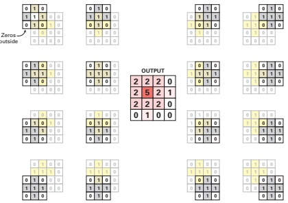

Figure 14.7: Same-convolution (using zero-padding) ensures the output is the same size as the input. Adapted from Figure 8.3 of [SAV20].

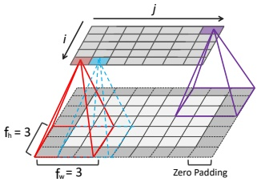

 $(a)$

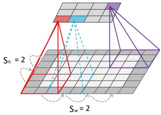

(b)

Figure 14.8: Illustration of padding and strides in 2d convolution. (a) We apply “same convolution” to a  $5 \times 7$ input (with zero padding) using a  $3 \times 3$ filter to create a  $5 \times 7$ output. (b) Now we use a stride of 2, so the output has size  $3 \times 4$. Adapted from Figures 14.3–14.4 of [Gér19].

In general, if the input has size  $x_h \times x_w$, we use a kernel of size  $f_h \times f_w$, we use zero padding on each side of size  $p_h$ and  $p_w$, then the output has the following size [DV16]:

$$
\left(x_{h}+2p_{h}-f_{h}+1\right)\times\left(x_{w}+2p_{w}-f_{w}+1\right)   \tag*{(14.10)}
$$

For example, consider Figure 14.8a. We have $p = 1$, $f = 3$, $x_{h} = 5$and$x_{w} = 7$, so the output has size

$$
\left(5+2-3+1\right)\times\left(7+2-3+1\right)=5\times7   \tag*{(14.11)}
$$

If we set 2p = f - 1, then the output will have the same size as the input.

---

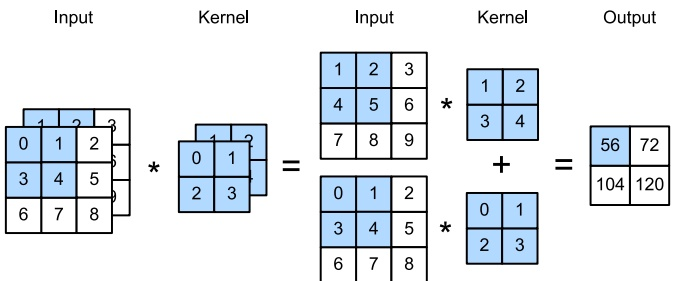

Figure 14.9: Illustration of 2d convolution applied to an input with 2 channels. Generated by conv2d_jax.ipynb. Adapted from Figure 6.4.1 of  $[Zha+20]$.

##### 14.2.1.5 Strided convolution

Since each output pixel is generated by a weighted combination of inputs in its receptive field (based on the size of the filter), neighboring outputs will be very similar in value, since their inputs are overlapping. We can reduce this redundancy (and speedup computation) by skipping every s'th input. This is called strided convolution. This is illustrated in Figure 14.8b, where we convolve a  $5 \times 7$ image with a  $3 \times 3$ filter with stride 2 to get a  $3 \times 4$ output.

In general, if the input has size  $x_h \times x_w$, we use a kernel of size  $f_h \times f_w$, we use zero padding on each side of size  $p_h$ and  $p_w$, and we use strides of size  $s_h$ and  $s_w$, then the output has the following size [DV16]:

$$
\left\lfloor\frac{x_{h}+2p_{h}-f_{h}+s_{h}}{s_{h}}\right\rfloor\times\left\lfloor\frac{x_{w}+2p_{w}-f_{w}+s_{w}}{s_{w}}\right\rfloor   \tag*{(14.12)}
$$

For example, consider Figure 14.8b, where we set the stride to s = 2. Now the output is smaller than the input, and has size

$$
\left\lfloor\frac{5+2-3+2}{2}\right\rfloor\times\left\lfloor\frac{7+2-3+2}{2}\right\rfloor=\left\lfloor\frac{6}{2}\right\rfloor\times\left\lfloor\frac{4}{1}\right\rfloor=3\times4   \tag*{(14.13)}
$$

##### 14.2.1.6 Multiple input and output channels

In Figure 14.6, the input was a gray-scale image. In general, the input will have multiple channels (e.g., RGB, or hyper-spectral bands for satellite images). We can extend the definition of convolution to this case by defining a kernel for each input channel; thus now  $\mathbf{W}$ is a 3d weight matrix or tensor. We compute the output by convolving channel  $c$ of the input with kernel  $\mathbf{W}_{:,c}$, and then summing over channels:

$$
z_{i,j}=b+\sum_{u=0}^{H-1}\sum_{v=0}^{W-1}\sum_{c=0}^{C-1}x_{si+u,sj+v,c}w_{u,v,c}   \tag*{(14.14)}
$$

Author: Kevin P. Murphy. (C) MIT Press. CC-BY-NC-ND license

---

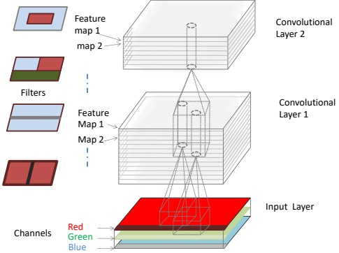

Figure 14.10: Illustration of a CNN with 2 convolutional layers. The input has 3 color channels. The feature maps at internal layers have multiple channels. The cylinders correspond to hypercolumns, which are feature vectors at a certain location. Adapted from Figure 14.6 of [Gér19].

where s is the stride (which we assume is the same for both height and width, for simplicity), and b is the bias term. This is illustrated in Figure 14.9.

Each weight matrix can detect a single kind of feature. We typically want to detect multiple kinds of features, as illustrated in Figure 14.2. We can do this by making $\mathbf{W}$into a$4d$weight matrix. The filter to detect feature type$d$in input channel$c$is stored in$\mathbf{W}_{:,:,c,d}$. We extend the definition of convolution to this case as follows:

$$
z_{i,j,d}=b_{d}+\sum_{u=0}^{H-1}\sum_{v=0}^{W-1}\sum_{c=0}^{C-1}x_{si+u,sj+v,c}w_{u,v,c,d}   \tag*{(14.15)}
$$

This is illustrated in Figure 14.10. Each vertical cylindrical column denotes the set of output features at a given location,  $z_{i,j,1:D}$; this is sometimes called a hypercolumn. Each element is a different weighted combination of the C features in the receptive field of each of the feature maps in the layer below. $^{2}$

##### 14.2.1.7  $1 \times 1$ (pointwise) convolution

Sometimes we just want to take a weighted combination of the features at a given location, rather than across locations. This can be done using 1x1 convolution, also called pointwise convolution.

---

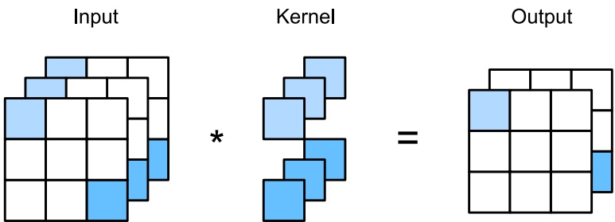

Figure 14.11: Mapping 3 channels to 2 using convolution with a filter of size  $1 \times 1 \times 3 \times 2$. Adapted from Figure 6.4.2 of [Zha+20].

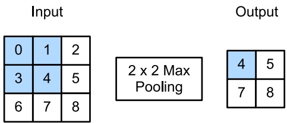

Figure 14.12: Illustration of marpooling with a 2x2 filter and a stride of 1. Adapted from Figure 6.5.1 of  $[Zha+20]$.

This changes the number of channels from C to D, without changing the spatial dimensionality:

$$
z_{i,j,d}=b_{d}+\sum_{c=0}^{C-1}x_{i,j,c}w_{0,0,c,d}   \tag*{(14.16)}
$$

This can be thought of as a single layer MLP applied to each feature column in parallel.

#### 14.2.2 Pooling layers

Convolution will preserve information about the location of input features (modulo reduced resolution), a property known as equivariance. In some case we want to be invariant to the location. For example, when performing image classification, we may just want to know if an object of interest (e.g., a face) is present anywhere in the image.

One simple way to achieve this is called max pooling, which just computes the maximum over its incoming values, as illustrated in Figure 14.12. An alternative is to use average pooling, which replaces the max by the mean. In either case, the output neuron has the same response no matter

---

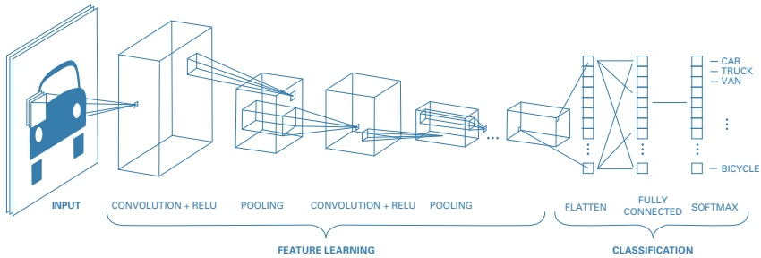

Figure 14.13: A simple CNN for classifying images. Adapted from https://blog.floydhub.com/building-your-first-convnet/.

where the input pattern occurs within its receptive field. (Note that we apply pooling to each feature channel independently.)

If we average over all the locations in a feature map, the method is called global average pooling. Thus we can convert a  $H \times W \times D$ feature map into a  $1 \times 1 \times D$ dimensional feature map; this can be reshaped to a D-dimensional vector, which can be passed into a fully connected layer to map it to a C-dimensional vector before passing into a softmax output. The use of global average pooling means we can apply the classifier to an image of any size, since the final feature map will always be converted to a fixed D-dimensional vector before being mapped to a distribution over the C classes.

#### 14.2.3 Putting it all together

A common design pattern is to create a CNN by alternating convolutional layers with max pooling layers, followed by a final linear classification layer at the end. This is illustrated in Figure 14.13. (We omit normalization layers in this example, since the model is quite shallow.) This design pattern first appeared in Fukushima's neocognitron [Fuk75], and was inspired by Hubel and Wiesel's model of simple and complex cells in the human visual cortex [HW62]. In 1998 Yann LeCun used a similar design in his eponymous LeNet model [LeC+98], which used backpropagation and SGD to estimate the parameters. This design pattern continues to be popular in neurally-inspired models of visual object recognition [RP99], as well as various practical applications (see Section 14.3 and Section 14.5).

#### 14.2.4 Normalization layers

The basic design in Figure 14.13 works well for shallow CNNs, but it can be difficult to scale it to deeper models, due to problems with vanishing or exploding gradients, as explained in Section 13.4.2. A common solution to this problem is to add extra layers to the model, to standardize the statistics of the hidden units (i.e., to ensure they are zero mean and unit variance), just like we do to the inputs of many models. We discuss various kinds of normalization layers below.

---

##### 14.2.4.1 Batch normalization

The most popular normalization layer is called batch normalization (BN) [IS15]. This ensures the distribution of the activations within a layer has zero mean and unit variance, when averaged across the samples in a minibatch. More precisely, we replace the activation vector  $z_n$ (or sometimes the pre-activation vector  $a_n$) for example  $n$ (in some layer) with  $\tilde{z}_n$, which is computed as follows:

$$
\tilde{z}_{n}=\gamma\odot\hat{z}_{n}+\beta   \tag*{(14.17)}
$$

$$
\hat{z}_{n}=\frac{z_{n}-\mu_{\mathcal{B}}}{\sqrt{\sigma_{\mathcal{B}}^{2}+\epsilon}}   \tag*{(14.18)}
$$

$$
\mu_{B}=\frac{1}{\left|\mathcal{B}\right|}\sum_{z\in\mathcal{B}}z   \tag*{(14.19)}
$$

$$
\sigma_{B}^{2}=\frac{1}{|\mathcal{B}|}\sum_{z\in\mathcal{B}}(z-\mu_{B})^{2}   \tag*{(14.20)}
$$

where  $\mathcal{B}$ is the minibatch containing example  $n$,  $\mu_B$ is the mean of the activations for this batch $^3$,  $\sigma_B^2$ is the corresponding variance,  $\hat{z}_n$ is the standardized activation vector,  $\hat{z}_n$ is the shifted and scaled version (the output of the BN layer),  $\beta$ and  $\gamma$ are learnable parameters for this layer, and  $\epsilon > 0$ is a small constant. Since this transformation is differentiable, we can easily pass gradients back to the input of the layer and to the BN parameters  $\beta$ and  $\gamma$.

When applied to the input layer, batch normalization is equivalent to the usual standardization procedure we discussed in Section 10.2.8. Note that the mean and variance for the input layer can be computed once, since the data is static. However, the empirical means and variances of the internal layers keep changing, as the parameters adapt. (This is sometimes called “internal covariate shift.”) This is why we need to recompute  $\mu$ and  $\sigma^{2}$ on each minibatch.

At test time, we may have a single input, so we cannot compute batch statistics. The standard solution to this is as follows: after training, compute  $\mu_l$ and  $\sigma_l^2$ for layer  $l$ across all the examples in the training set (i.e. using the full batch), and then “freeze” these parameters, and add them to the list of other parameters for the layer, namely  $\beta_l$ and  $\gamma_l$. At test time, we then use these frozen training values for  $\mu_l$ and  $\sigma_l^2$, rather than computing statistics from the test batch. Thus when using a model with BN, we need to specify if we are using it for inference or training. (See batchnorm_jax.ipynb for some sample code.)

For speed, we can combine a frozen batch norm layer with the previous layer. In particular suppose the previous layer computes  $\mathbf{X}\mathbf{W} + b$; combining this with BN gives  $\gamma\odot(\mathbf{X}\mathbf{W} + b - \mu)/\sigma + \beta$. If we define  $\mathbf{W}' = \gamma\odot\mathbf{W}/\sigma$ and  $b' = \gamma\odot(b - \mu)/\sigma + \beta$, then we can write the combined layers as  $\mathbf{X}\mathbf{W}' + b'$. This is called fused batchnorm. Similar tricks can be developed to speed up BN during training [Jun+19].

The benefits of batch normalization (in terms of training speed and stability) can be quite dramatic, especially for deep CNNs. The exact reasons for this are still unclear, but BN seems to make the optimization landscape significantly smoother [San+18b]. It also reduces the sensitivity to the learning rate [ALL18]. In addition to computational advantages, it has statistical advantages. In

---

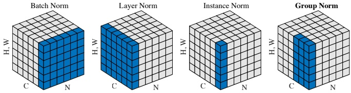

Figure 14.14: Illustration of different activation normalization methods for a CNN. Each subplot shows a feature map tensor, with N as the batch axis, C as the channel axis, and (H, W) as the spatial axes. The pixels in blue are normalized by the same mean and variance, computed by aggregating the values of these pixels. Left to right: batch norm, layer norm, instance norm, and group norm (with 2 groups of 3 channels). From Figure 2 of [WH18]. Used with kind permission of Kaiming He.

particular, BN acts like a regularizer; indeed it can be shown to be equivalent to a form of approximate Bayesian inference [TAS18; Luo+19].

However, the reliance on a minibatch of data causes several problems. In particular, it can result in unstable estimates of the parameters when training with small batch sizes, although a more recent version of the method, known as batch renormalization [Iof17], partially addresses this. We discuss some other alternatives to batch norm below.

##### 14.2.4.2 Other kinds of normalization layer

In Section 14.2.4.1 we discussed batch normalization, which standardizes all the activations within a given feature channel to be zero mean and unit variance. This can significantly help with training, and allow for a larger learning rate. (See batchnorm_jax.ipynb for some sample code.)

Although batch normalization works well, it struggles when the batch size is small, since the estimated mean and variance parameters can be unreliable. One solution is to compute the mean and variance by pooling statistics across other dimensions of the tensor, but not across examples in the batch. More precisely, let  $z_i$ refer to the  $i$'th element of a tensor; in the case of 2d images, the index  $i$ has 4 components, indicating batch, height, width and channel,  $i = (i_N, i_H, i_W, i_C)$. We compute the mean and standard deviation for each index  $z_i$ as follows:

$$
\mu_{i}=\frac{1}{\left|\mathcal{S}_{i}\right|}\sum_{k\in\mathcal{S}_{i}}z_{k},\sigma_{i}=\sqrt{\frac{1}{\left|\mathcal{S}_{i}\right|}\sum_{k\in\mathcal{S}_{i}}(z_{k}-\mu_{i})^{2}+\epsilon}   \tag*{(14.21)}
$$

where $S_i$is the set of elements we average over. We then compute$\hat{z}_i = (z_i - \mu_i)/\sigma_i$and$\tilde{z}_i = \gamma_c\hat{z}_i + \beta_c$, where $c$is the channel corresponding to index$i$.

In batch norm, we pool over batch, height, width, so  $S_i$ is the set of all locations in the tensor that match the channel index of i. To avoid problems with small batches, we can instead pool over channel, height and width, but match on the batch index. This is known as layer normalization [BKH16]. (See layer_norm_jax.ipynb for some sample code.) Alternatively, we can have separate normalization parameters for each example in the batch and for each channel. This is known as instance normalization [UVL16].

---

A natural generalization of the above methods is known as group normalization  $[WH18]$, where we pool over all locations whose channel is in the same group as i's. This is illustrated in Figure 14.14. Layer normalization is a special case in which there is a single group, containing all the channels. Instance normalization is a special case in which there are C groups, one per channel. In  $[WH18]$, they show experimentally that it can be better (in terms of training speed, as well as training and test accuracies) to use groups that are larger than individual channels, but smaller than all the channels.

More recently, [SK20] proposed filter response normalization which is an alternative to batch norm that works well even with a minibatch size of 1. The idea is to define each group as all locations with a single channel and batch sample (as in instance normalization), but then to just divide by the mean squared norm instead of standardizing. That is, if the input (for a given channel and batch entry) is  $z = \mathbf{Z}_{b,\ldots,c} \in \mathbb{R}^N$, we compute  $\hat{z} = z / \sqrt{\nu^2 + \epsilon}$, where  $\nu^2 = \sum_{ij} z_{b_{ijc}}^2 / N$, and then  $\hat{z} = \gamma_c \hat{z} + \beta_c$. Since there is no mean centering, the activations can drift away from 0, which can have detrimental effects, especially with ReLU activations. To compensate for this, the authors propose to add a thresholded linear unit at the output. This has the form  $y = \max(\boldsymbol{x}, \tau)$, where  $\tau$ is a learnable offset. The combination of FRN and TLU results in good performance on image classification and object detection even with a batch size of 1.

##### 14.2.4.3 Normalizer-free networks

Recently, [Bro+21] have proposed a method called normalizer-free networks, which is a way to train deep residual networks without using batchnorm or any other form of normalization layer. The key is to replace it with adaptive gradient clipping, as an alternative way to avoid training instabilities. That is, we use Equation (13.70), but adapt the clipping strength dynamically. The resulting model is faster to train, and more accurate, than other competitive models trained with batchnorm.

### 14.3 Common architectures for image classification

It is common to use CNNs to perform image classification, which is the task of estimating the function  $f : \mathbb{R}^{H \times W \times K} \to \{0,1\}^C$, where  $K$ is the number of input channels (e.g.,  $K = 3$ for RGB images), and  $C$ is the number of class labels.

In this section, we briefly review various CNNs that have been developed over the years to solve image classification tasks. See e.g., [Kha+20] for a more extensive review of CNNs, and e.g., https://github.com/rwightman/pytorch-image-models for an up-to-date repository of code and models (in PyTorch).

#### 14.3.1 LeNet

One of the earliest CNNs, created in 1998, is known as LeNet [LeC+98], named after its creator, Yann LeCun. It was designed to classify images of handwritten digits, and was trained on the MNIST dataset introduced in Section 3.5.2. The model is shown in Figure 14.15. (See also Figure 14.16a for a more compact representation of the model.) Some predictions of this model are shown in Figure 14.17. After just 1 epoch, the test accuracy is already 98.8%. By contrast, the MLP in Section 13.2.4.2 had an accuracy of 95.9% after 1 epoch. More rounds of training can further increase accuracy to a point where performance is indistinguishable from label noise. (See lenet_jax.ipynb for some sample code.)

Author: Kevin P. Murphy. (C) MIT Press. CC-BY-NC-ND license

---

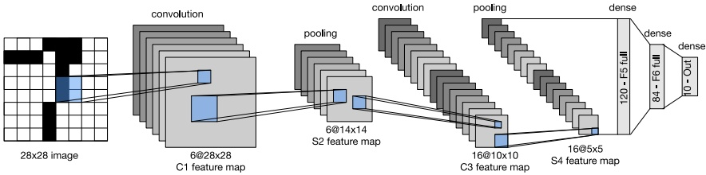

Figure 14.15: LeNet5, a convolutional neural net for classifying handwritten digits. From Figure 6.6.1 of  $[Zha+20]$. Used with kind permission of Aston Zhang.

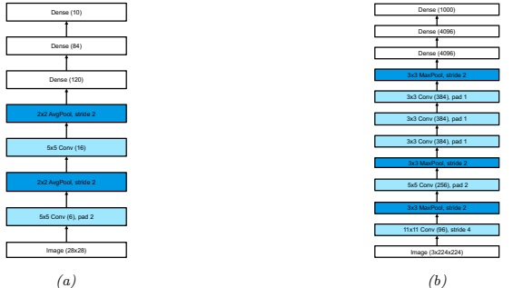

Figure 14.16: (a) LeNet5. We assume the input has size  $1 \times 28 \times 28$, as is the case for MNIST. From Figure 6.6.2 of [Zha+20]. Used with kind permission of Aston Zhang. (b) AlexNet. We assume the input has size  $3 \times 224 \times 224$, as is the case for (cropped and rescaled) images from ImageNet. From Figure 7.1.2 of [Zha+20]. Used with kind permission of Aston Zhang.

---

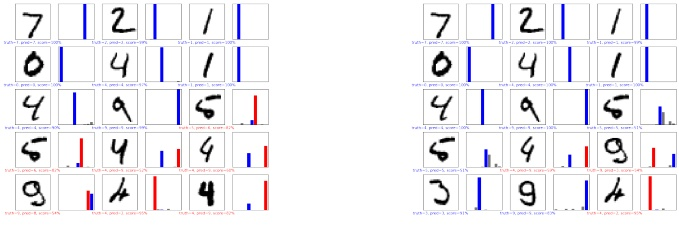

 $(a)$

(b)

Figure 14.17: Results of applying a CNN to some MNIST images (cherry picked to include some errors). Red is incorrect, blue is correct. (a) After 1 epoch of training. (b) After 2 epochs. Generated by cnn_mnist_tf.ipynb.

Of course, classifying isolated digits is of limited applicability: in the real world, people usually write strings of digits or other letters. This requires both segmentation and classification. LeCun and colleagues devised a way to combine convolutional neural networks with a model similar to a conditional random field to solve this problem. The system was deployed by the US postal service. See [LeC+98] for a more detailed account of the system.

#### 14.3.2 AlexNet

Although CNNs have been around for many years, it was not until the paper of [KSH12] in 2012 that mainstream computer vision researchers paid attention to them. In that paper, the authors showed how to reduce the (top 5) error rate on the ImageNet challenge (Section 1.5.1.2) from the previous best of 26% to 15%, which was a dramatic improvement. This model became known as AlexNet model, named after its creator, Alex Krizhevsky.

Figure 14.16b(b) shows the architecture. It is very similar to LeNet, shown in Figure 14.16a, with the following differences: it is deeper (8 layers of adjustable parameters (i.e., excluding the pooling layers) instead of 5); it uses ReLU nonlinearities instead of tanh (see Section 13.2.3 for why this is important); it uses dropout (Section 13.5.4) for regularization instead of weight decay; and it stacks several convolutional layers on top of each other, rather than strictly alternating between convolution and pooling. Stacking multiple convolutional layers together has the advantage that the receptive fields become larger as the output of one layer is fed into another (for example, three  $3 \times 3$ filters in a row will have a receptive field size of  $7 \times 7$). This is better than using a single layer with a larger receptive field, since the multiple layers also have nonlinearities in between. Also, three  $3 \times 3$ filters have fewer parameters than one  $7 \times 7$.

Note that AlexNet has 60M free parameters (which is much more than the 1M labeled examples), mostly due to the three fully connected layers at the output. Fitting this model relied on using two GPUs (due to limited memory of GPUs at that time), and is widely considered an engineering tour de force. $^{4}$ Figure 1.14a shows some predictions made by the model on some images from ImageNet.

---

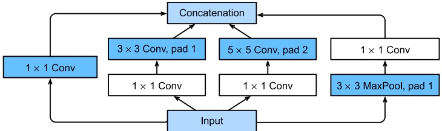

Figure 14.18: Inception module. The  $1 \times 1$ convolutional layers reduce the number of channels, keeping the spatial dimensions the same. The parallel pathways through convolutions of different sizes allows the model to learn which filter size to use for each layer. The final depth concatenation block combines the outputs of all the different pathways (which all have the same spatial size). From Figure 7.4.1 of [Zha+20]. Used with kind permission of Aston Zhang.

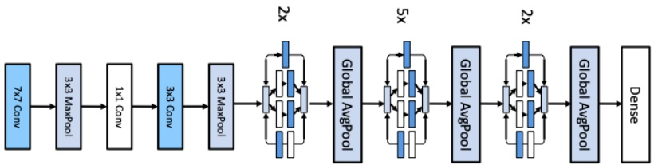

Figure 14.19: GoogLeNet (slightly simplified from the original). Input is on the left. From Figure 7.4.2 of [Zha+20]. Used with kind permission of Aston Zhang.

#### 14.3.3 GoogLeNet (Inception)

Google who developed a model known as GoogLeNet [Sze+15a]. (The name is a pun on Google and LeNet.) The main difference from earlier models is that GoogLeNet used a new kind of block, known as an inception block $^{5}$, that employs multiple parallel pathways, each of which has a convolutional filter of a different size. See Figure 14.18 for an illustration. This lets the model learn what the optimal filter size should be at each level. The overall model consists of 9 inception blocks followed by global average pooling. See Figure 14.19 for an illustration. Since this model first came out, various extensions were proposed; details can be found in [IS15; Sze+15b; SIV17].

---

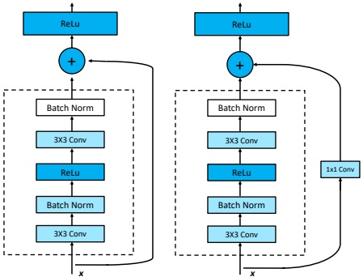

Figure 14.20: A residual block for a CNN. Left: standard version. Right: version with 1x1 convolution, to allow a change in the number of channels between the input to the block and the output. From Figure 7.6.3 of [Zha+20]. Used with kind permission of Aston Zhang.

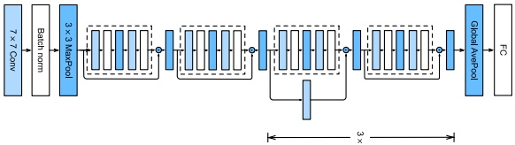

Figure 14.21: The ResNet-18 architecture. Each dotted module is a residual block shown in Figure 14.20. From Figure 7.6.4 of  $[Zha+20]$. Used with kind permission of Aston Zhang.

#### 14.3.4 ResNet

The winner of the 2015 ImageNet classification challenge was a team at Microsoft, who proposed a model known as ResNet [He+16a]. The key idea is to replace  $\boldsymbol{x}_{l+1} = \mathcal{F}_l(\boldsymbol{x}_l)$ with

$$
\boldsymbol{x}_{l+1}=\varphi(\boldsymbol{x}_{l}+\mathcal{F}_{l}(\boldsymbol{x}_{l}))   \tag*{(14.22)}
$$

This is known as a residual block, since  $F_l$ only needs to learn the residual, or difference, between input and output of this layer, which is a simpler task. In  $[He+16a]$,  $\mathcal{F}$ has the form conv-BN-relu-conv-BN, where conv is a convolutional layer, and BN is a batch norm layer (Section 14.2.4.1). See Figure 14.20(left) for an illustration.

---

We can ensure the spatial dimensions of the output  $\mathcal{F}_l(\boldsymbol{x}_l)$ of the convolutional layer match those of the input  $\boldsymbol{x}_l$ by using padding. However, if we want to allow for the output of the convolutional layer to have a different number of channels, we need to add  $1 \times 1$ convolution to the skip connection on  $\boldsymbol{x}_l$. See Figure 14.20(right) for an illustration.

The use of residual blocks allows us to train very deep models. The reason this is possible is that gradient can flow directly from the output to earlier layers, via the skip connections, for reasons explained in Section 13.4.4.

In [He+16a] they trained a 152 layer ResNet on ImageNet. However, it is common to use shallower models. For example, Figure 14.21 shows the ResNet-18 architecture, which has 18 trainable layers: there are 2 3x3 conv layers in each residual block, and there are 8 such blocks, with an initial 7x7 conv (stride 2) and a final fully connected layer. Symbolically, we can define the model as follows:

 
$$
\left(\mathrm{Conv}\quad:\mathrm{BN}\quad:\mathrm{Max}\right)\quad:\left(\mathrm{R}\quad:\mathrm{R}\right)\quad:\left(\mathrm{R}^{\prime}\quad:\mathrm{R}\right)\quad:\left(\mathrm{R}^{\prime}\quad:\mathrm{R}\right)\quad:\left(\mathrm{R}^{\prime}\quad:\mathrm{R}\right)\quad:\mathrm{Avg}\quad:\mathrm{FC}
$$
 

where R is a residual block, R' is a residual block with skip connection (due to the change in the number of channels) with stride 2, FC is fully connected (dense) layer, and : denotes concatenation. Note that the input size gets reduced spatially by a factor of  $2^5 = 32$ (factor of 2 for each R' block, plus the initial Conv-7x7(2) and Max-pool), so a 224x224 images becomes a 7x7 image before going into the global average pooling layer.

Some code to fit these models can be found online. $^{6}$

In  $[He+16b]$, they showed how a small modification of the above scheme allows us to train models with up to 1001 layers. The key insight is that the signal on the skip connections is still being attenuated due to the use of the nonlinear activation function after the addition step,  $\boldsymbol{x}_{l+1} = \varphi(\boldsymbol{x}_l + \mathcal{F}(\boldsymbol{x}_l))$. They showed that it is better to use

$$
\boldsymbol{x}_{l+1}=\boldsymbol{x}_{l}+\varphi(\mathcal{F}_{l}(\boldsymbol{x}_{l}))   \tag*{(14.23)}
$$

This is called a preactivation resnet or PreResnet for short. Now it is very easy for the network to learn the identity function at a given layer: if we use ReLU activations, we just need to ensure that  $\mathcal{F}_l(\boldsymbol{x}_l) = \mathbf{0}$, which we can do by setting the weights and biases to 0.

An alternative to using a very deep model is to use a very “wide” model, with lots of feature channels per layer. This is the idea behind the wide resnet model [ZK16], which is quite popular.

#### 14.3.5 DenseNet

In a residual net, we add the output of each function to its input. An alternative approach would be to concatenate the output with the input, as illustrated in Figure 14.22a. If we stack a series of such blocks, we can get an architecture similar to Figure 14.22b. This is known as a DenseNets [Hua+17a], since each layer densely depends on all previous layers. Thus the overall model is computing a function of the form

$$
\boldsymbol{x}\rightarrow\left[\boldsymbol{x},f_{1}(\boldsymbol{x}),f_{2}(\boldsymbol{x},f_{1}(\boldsymbol{x})),f_{3}(\boldsymbol{x},f_{1}(\boldsymbol{x}),f_{2}(\boldsymbol{x},f_{1}(\boldsymbol{x}))),\cdots\right]   \tag*{(14.24)}
$$

---

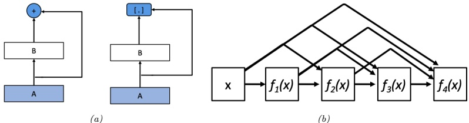

Figure 14.22: (a) Left: a residual block adds the output to the input. Right: a densenet block concatenates the output with the input. (b) Illustration of a densenet. From Figures 7.7.1–7.7.2 of [Zha+20]. Used with kind permission of Aston Zhang.

The dense connectivity increases the number of parameters, since the channels get stacked depthwise. We can compensate for this by adding  $1 \times 1$ convolution layers in between. We can also add pooling layers with a stride of 2 to reduce the spatial resolution. (See densenet_jax.ipynb for some sample code.)

DenseNets can perform better than ResNets, since all previously computed features are directly accessible to the output layer. However, they can be more computationally expensive.

#### 14.3.6 Neural architecture search

We have seen how many CNNs are fairly similar in their design, and simply rearrange various building blocks (such as convolutional or pooling layers) in different topologies, and adjust various parameter settings (e.g., stride, number of channels, or learning rate). Indeed, the recent ConvNeXt model of  $[Liu+22]$ — which, at the time of writing (April 2022) is considered the state of the art CNN architecture for a wide variety of vision tasks — was created by combining multiple such small improvements on top of a standard ResNet architecture.

We can automate this design process using blackbox (derivative free) optimization methods to find architectures that minimize the validation loss. This is called AutoML (see e.g., [HKV19]). In the context of neural nets, it is called neural architecture search or NAS [EMH19].

When performing NAS, we can optimize for multiple objectives at the same time, such as accuracy, model size, training or inference speed, etc (this is how EfficientNetv2 is created [TL21]). The main challenge arises due to the expense of computing the objective (since it requires training each candidate point in model space). One way to reduce the number of calls to the objective function is to use Bayesian optimization (see e.g., [WNS19]). Another approach is to create differentiable approximations to the loss (see e.g., [LSY19; Wan+21]), or to convert the architecture into a kernel function (using the neural tangent kernel method, Section 17.2.8), and then to analyze properties of its eigenvalues, which can predict performance without actually training the model [CGW21]. The field of NAS is very large and still growing. See [EMH19] for a more thorough review.

Author: Kevin P. Murphy. (C) MIT Press. CC-BY-NC-ND license

---

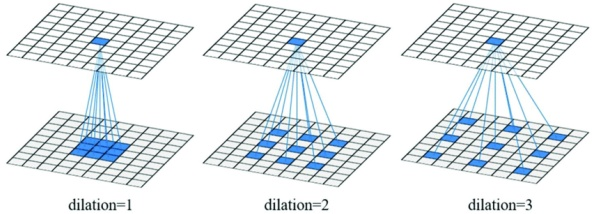

Figure 14.23: Dilated convolution with a 3x3 filter using rate 1, 2 and 3. From Figure 1 of [Cui+19]. Used with kind permission of Ximin Cui.

### 14.4 Other forms of convolution  $*$

We discussed the basics of convolution in Section 14.2. In this section, we discuss some extensions, which are needed for applications such as image segmentation and image generation.

#### 14.4.1 Dilated convolution

Convolution is an operation that combines the pixel values in a local neighborhood. By using striding, and stacking many layers of convolution together, we can enlarge the receptive field of each neuron, which is the region of input space that each neuron responds to. However, we would need many layers to give each neuron enough context to cover the entire image (unless we used very large filters, which would be slow and require too many parameters).

As an alternative, we can use convolution with holes [Mal99], sometimes known by the French term à trous algorithm, and recently renamed dilated convolution [YK16]. This method simply takes every  $r'$th input element when performing convolution, where  $r$ is known as the rate or dilation factor. For example, in 1d, convolving with filter  $\pmb{w}$ using rate  $r = 2$ is equivalent to regular convolution using the filter  $\tilde{\pmb{w}} = [w_1, 0, w_2, 0, w_3]$, where we have inserted 0s to expand the receptive field (hence the term “convolution with holes”). This allows us to get the benefit of increased receptive fields without increasing the number of parameters or the amount of compute. See Figure 14.23 for an illustration.

More precisely, dilated convolution in 2d is defined as follows:

$$
z_{i,j,d}=b_{d}+\sum_{u=0}^{H-1}\sum_{v=0}^{W-1}\sum_{c=0}^{C-1}x_{i+r u,j+r v,c}w_{u,v,c,d}   \tag*{(14.25)}
$$

where we assume the same rate r for both height and width, for simplicity. Compare this to Equation (14.15), where the stride parameter uses  $x_{si+u,sj+v,c}$.

#### 14.4.2 Transposed convolution

In convolution, we reduce from a large input X to a small output Y by taking a weighted combination of the input pixels and the convolutional kernel K. This is easiest to explain in code:

---

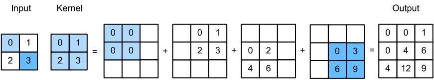

Figure 14.24: Transposed convolution with 2x2 kernel. From Figure 13.10.1 of  $[Zha+20]$. Used with kind permission of Aston Zhang.

def conv(X, K):
    h, w = K.shape
    Y = zeros((X.shape[0] - h + 1, X.shape[1] - w + 1))
    for i in range(Y.shape[0]):
        for j in range(Y.shape[1]):
            Y[i, j] = (X[i:i + h, j:j + w] * K).sum()
    return Y

In transposed convolution, we do the opposite, in order to produce a larger output from a smaller input:

def trans_conv(X, K):
    h, w = K.shape
    Y = zeros((X.shape[0] + h - 1, X.shape[1] + w - 1))
    for i in range(X.shape[0]):
        for j in range(X.shape[1]):
            Y[i:i + h, j:j + w] += X[i, j] * K
    return Y

This is equivalent to padding the input image with  $(h - 1, w - 1)$ 0s (on the bottom right), where  $(h, w)$ is the kernel size, then placing a weighted copy of the kernel on each one of the input locations, where the weight is the corresponding pixel value, and then adding up. This process is illustrated in Figure 14.24. We can think of the kernel as a “stencil” that is used to generate the output, modulated by the weights in the input.

The term “transposed convolution” comes from the interpretation of convolution as matrix multiplication, which we discussed in Section 14.2.1.3. If $\mathbf{W}$is the matrix derived from kernel$\mathbf{K}$using the process illustrated in Equation (14.9), then one can show that$\mathbf{Y} = \text{transposed-conv}(\mathbf{X}, \mathbf{K})$is equivalent to$\mathbf{Y} = \text{reshape}(\mathbf{W}^{\mathsf{T}} \text{vec}(\mathbf{X}))$. See \textit{transposed\_conv\_jax.ipynb} for a demo.

Note that transposed convolution is also sometimes called deconvolution, but this is an incorrect usage of the term: deconvolution is the process of “undoing” the effect of convolution with a known filter, such as a blur filter, to recover the original input, as illustrated in Figure 14.25.

Author: Kevin P. Murphy. (C) MIT Press. CC-BY-NC-ND license

---

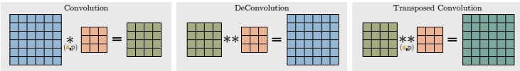

Figure 14.25: Convolution, deconvolution and transposed convolution. Here s is the stride and p is the padding. From https://tinyurl.com/ynxcxsut. Used with kind permission of Aqeel Anwar.

#### 14.4.3 Depthwise separable convolution

Standard convolution uses a filter of size  $H \times W \times C \times D$, which requires a lot of data to learn and a lot of time to compute with. A simplification, known as depthwise separable convolution, first involves each input channel by a corresponding 2d filter  $\pmb{w}$, and then maps these C channels to D channels using  $1 \times 1$ convolution  $\pmb{w}'$:

$$
z_{i,j,d}=b_{d}+\sum_{c=0}^{C-1}w_{c,d}^{\prime}\left(\sum_{u=0}^{H-1}\sum_{v=0}^{W-1}x_{i+u,j+v,c}w_{u,v}\right)   \tag*{(14.26)}
$$

See Figure 14.26 for an illustration.

To see the advantage of this, let us consider a simple numerical example. $^{7}$ Regular convolution of a  $12 \times 12 \times 3$ input with a  $5 \times 5 \times 3 \times 256$ filter gives a  $8 \times 8 \times 256$ output (assuming valid convolution:  $12-5+1=8$), as illustrated in Figure 14.13. With separable convolution, we start with  $12 \times 12 \times 3$ input, convolve with a  $5 \times 5 \times 1 \times 1$ filter (across space but not channels) to get  $8 \times 8 \times 3$, then pointwise convolve (across channels but not space) with a  $1 \times 1 \times 3 \times 256$ filter to get a  $8 \times 8 \times 256$ output. So the output has the same size as before, but we used many fewer parameters to define the layer, and used much less compute. For this reason, separable convolution is often used in lightweight CNN models, such as the MobileNet model [How+17; San+18a] and other edge devices.

### 14.5 Solving other discriminative vision tasks with CNNs *

In this section, we briefly discuss how to tackle various other vision tasks using CNNs. Each task also introduces a new architectural innovation to the library of basic building blocks we have already seen. More details on CNNs for computer vision can be found in e.g., [Bro19].

#### 14.5.1 Image tagging

Image classification associates a single label with the whole image, i.e., the outputs are assumed to be mutually exclusive. In many problems, there may be multiple objects present, and we want to label all of them. This is known as image tagging, and is an application of multi-label prediction. In this case, we define the output space as  $\mathcal{Y} = \{0, 1\}^C$, where  $C$ is the number of tag types. Since the output bits are independent (given the image), we should replace the final softmax with a set of  $C$ logistic units.

---

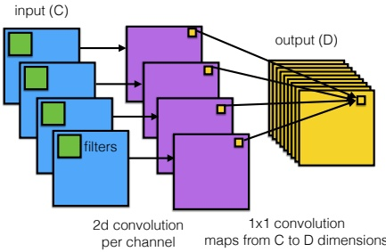

Figure 14.26: Depthwise separable convolutions: each of the C input channels undergoes a 2d convolution to produce C output channels, which get combined pointwise (via 1x1 convolution) to produce D output channels. From https://bit.ly/2L9fm2o. Used with kind permission of Eugenio Culurciello.

Users of social media sites like Instagram often create hashtags for their images; this therefore provides a “free” way of creating large supervised datasets. Of course, many tags may be quite sparsely used, and their meaning may not be well-defined visually. (For example, someone may take a photo of themselves after they get a COVID test and tag the image “#covid”; however, visually it just looks like any other image of a person.) Thus this kind of user-generated labeling is usually considered quite noisy. However, it can be useful for “pre-training”, as discussed in [Mah+18].

Finally, it is worth noting that image tagging is often a much more sensible objective than image classification, since many images have multiple objects in them, and it can be hard to know which one we should be labeling. Indeed, Andrej Karpathy, who created the “human performance benchmark” on ImageNet, noted the following: $^{8}$

Both [CNNs] and humans struggle with images that contain multiple ImageNet classes (usually many more than five), with little indication of which object is the focus of the image. This error is only present in the classification setting, since every image is constrained to have exactly one correct label. In total, we attribute 16% of human errors to this category.

#### 14.5.2 Object detection

In some cases, we want to produce a variable number of outputs, corresponding to a variable number of objects of interest that may be present in the image. (This is an example of an open world problem, with an unknown number of objects.)

A canonical example of this is object detection, in which we must return a set of bounding boxes representing the locations of objects of interest, together with their class labels. A special case of this is face detection, where there is only one class of interest. This is illustrated in Figure 14.27a. $^{9}$

---

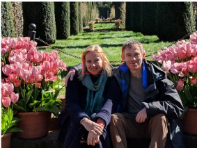

 $(a)$

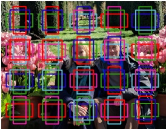

(b)

Figure 14.27: (a) Illustration of face detection, a special case of object detection. (Photo of author and his wife Margaret, taken at Filoli in California in February, 2018. Image processed by Jonathan Huang using SSD face model.) (b) Illustration of anchor boxes. Adapted from [Zha+20, Sec 12.5].

The simplest way to tackle such detection problems is to convert it into a closed world problem, in which there is a finite number of possible locations (and orientations) any object can be in. These candidate locations are known as anchor boxes. We can create boxes at multiple locations, scales and aspect ratios, as illustrated in Figure 14.27b. For each box, we train the system to predict what category of object it contains (if any); we can also perform regression to predict the offset of the object location from the center of the anchor. (These residual regression terms allow sub-grid spatial localization.)

Abstractly, we are learning a function of the form

$$
f_{\theta}:\mathbb{R}^{H\times W\times K}\to[0,1]^{A\times A}\times\{1,\ldots,C\}^{A\times A}\times(\mathbb{R}^{4})^{A\times A}   \tag*{(14.27)}
$$

where $K$is the number of input channels,$A$is the number of anchor boxes in each dimension, and$C$is the number of object types (class labels). For each box location$(i,j)$, we predict three outputs: an object presence probability, $p_{ij} \in [0,1]$, an object category, $y_{ij} \in \{1,\ldots,C\}$, and two 2d offset vectors, $\delta_{ij} \in \mathbb{R}^4$, which can be added to the centroid of the box to get the top left and bottom right corners.

Several models of this type have been proposed, including the single shot detector model of  $[Liu+16]$, and the YOLO (you only look once) model of  $[Red+16]$. Many other methods for object detection have been proposed over the years. These models make different tradeoffs between speed, accuracy, simplicity, etc. See  $[Hua+17b]$ for an empirical comparison, and  $[Zha+18]$ for a more recent review.

#### 14.5.3 Instance segmentation

In object detection, we predict a label and bounding box for each object. In instance segmentation, the goal is to predict the label and 2d shape mask of each object instance in the image, as illustrated in Figure 14.28. This can be done by applying a semantic segmentation model to each detected box,

---

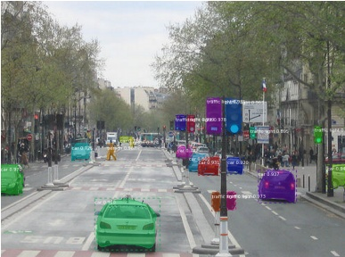

Figure 14.28: Illustration of object detection and instance segmentation using Mask R-CNN. From https://github.com/matterport/Mask_RCNN. Used with kind permission of Waleed Abdulla.

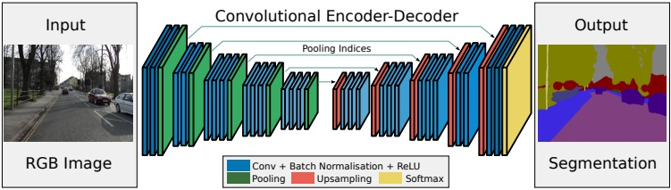

Figure 14.29: Illustration of an encoder-decoder (aka U-net) CNN for semantic segmentation. The encoder uses convolution (which downsamples), and the decoder uses transposed convolution (which upsamples). From Figure 1 of [BKC17]. Used with kind permission of Alex Kendall.

which has to label each pixel as foreground or background. (See Section 14.5.4 for more details on semantic segmentation.)

#### 14.5.4 Semantic segmentation

In semantic segmentation, we have to predict a class label  $y_i \in \{1, \ldots, C\}$ for each pixel, where the classes may represent things like sky, road, car, etc. In contrast to instance segmentation, which we discussed in Section 14.5.3, all car pixels get the same label, so semantic segmentation does not differentiate between objects. We can combine semantic segmentation of “stuff” (like sky, road) and instance segmentation of “things” (like car, person) into a coherent framework called “panoptic segmentation” [Kir+19].

A common way to tackle semantic segmentation is to use an encoder-decoder architecture, as illustrated in Figure 14.29. The encoder uses standard convolution to map the input into a small 2d bottleneck, which captures high level properties of the input at a coarse spatial resolution. (This typically uses a technique called dilated convolution that we explain in Section 14.4.1, to capture a

---

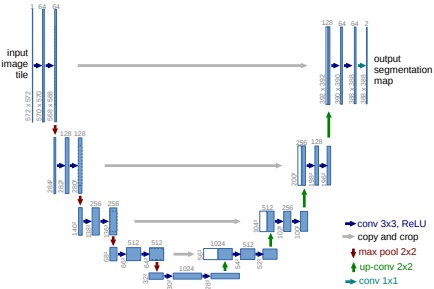

Figure 14.30: Illustration of the U-Net model for semantic segmentation. Each blue box corresponds to a multi-channel feature map. The number of channels is shown on the top of the box, and the height/width is shown in the bottom left. White boxes denote copied feature maps. The different colored arrows correspond to different operations. From Figure 1 from [RFB15]. Used with kind permission of Olaf Ronenberg.

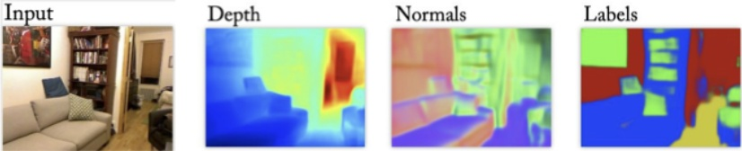

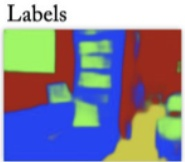

Figure 14.31: Illustration of a multi-task dense prediction problem. From Figure 1 of [EF15]. Used with kind permission of Rob Fergus.

large field of view, i.e., more context.) The decoder maps the small 2d bottleneck back to a full-sized output image using a technique called transposed convolution that we explain in Section 14.4.2. Since the bottleneck loses information, we can also add skip connections from input layers to output layers. We can redraw this model as shown in Figure 14.30. Since the overall structure resembles the letter U, this is also known as a U-net [RFB15].

A similar encoder-decoder architecture can be used for other dense prediction or image-to-image tasks, such as depth prediction (predict the distance from the camera,  $z_i \in \mathbb{R}$, for each pixel  $i$), surface normal prediction (predict the orientation of the surface,  $z_i \in \mathbb{R}^3$, at each image patch), etc. We can of course train one model to solve all of these tasks simultaneously, using multiple output heads, as illustrated in Figure 14.31. (See e.g., [Kok17] for details.)

#### 14.5.5 Human pose estimation

We can train an object detector to detect people, and to predict their 2d shape, as represented by a mask. However, we can also train the model to predict the location of a fixed set of skeletal keypoints,

---

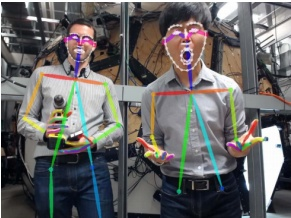

Figure 14.32: Illustration of keypoint detection for body, hands and face using the OpenPose system. From Figure 8 of  $[Cao+18]$. Used with kind permission of Yaser Sheikh.

e.g., the location of the head or hands. This is called human pose estimation. See Figure 14.32 for an example. There are several techniques for this, e.g., PersonLab [Pap+18] and OpenPose [Cao+18]. See [Bab19] for a recent review.

We can also predict 3d properties of each detected object. The main limitation is the ability to collect enough labeled training data, since it is difficult for human annotators to label things in 3d. However, we can use  $\underline{\text{computer graphics}}$ engines to create simulated images with infinite ground truth 3d annotations (see e.g.,  $[GNK18]$).

### 14.6 Generating images by inverting CNNs  $^{*}$

A UNN trained for image classification is a discriminative model of the form  $p(y|\pmb{x})$, which takes as input an image, and returns as output a probability distribution over C class labels. In this section we discuss how to “invert” this model, by converting it into a (conditional) generative image model of the form  $p(\pmb{x}|y)$. This will allow us to generate images that belong to a specific class. (We discuss more principled approaches to creating generative models for images in the sequel to this book, [Mur23].)

#### 14.6.1 Converting a trained classifier into a generative model

We can define a joint distribution over images and labels using  $p(\boldsymbol{x}, y) = p(\boldsymbol{x}) p(y|\boldsymbol{x})$, where  $p(y|\boldsymbol{x})$ is the CNN classifier, and  $p(\boldsymbol{x})$ is some prior over images. If we then clamp the class label to a specific value, we can create a conditional generative model using  $p(\boldsymbol{x}|y) \propto p(\boldsymbol{x}) p(y|\boldsymbol{x})$. Note that the discriminative classifier  $p(y|\boldsymbol{x})$ was trained to “throw away” information, so  $p(y|\boldsymbol{x})$ is not an invertible function. Thus the prior term  $p(\boldsymbol{x})$ will play an important role in regularizing this process, as we see in Section 14.6.2.

One way to sample from this model is to use the Metropolis Hastings algorithm (Section 4.6.8.4), treating  $\mathcal{E}_c(\boldsymbol{x}) = \log p(y = c|\boldsymbol{x}) + \log p(\boldsymbol{x})$ as the energy function. Since gradient information is available, we can use a proposal of the form  $q(\boldsymbol{x}'|\boldsymbol{x}) = \mathcal{N}(\boldsymbol{\mu}(\boldsymbol{x}), \boldsymbol{\epsilon})$, where  $\boldsymbol{\mu}(\boldsymbol{x}) = \boldsymbol{x} + \frac{\epsilon}{2} \nabla \log \mathcal{E}_c(\boldsymbol{x})$. This is called the Metropolis-adjusted Langevin algorithm (MALA). As an approximation, we can ignore the rejection step, and accept every proposal. This is called the unadjusted Langevin algorithm, and was used in [Ngu+17] for conditional image generation. In addition, we can scale

---

the gradient of the log prior and log likelihood independently. Thus we get an update over the space of images that looks like a noisy version of SGD, except we take derivatives wrt the input pixels (using Equation (13.50)), instead of the parameters:

$$
\boldsymbol{x}_{t+1}=\boldsymbol{x}_{t}+\epsilon_{1}\frac{\partial\log p(\boldsymbol{x}_{t})}{\partial\boldsymbol{x}_{t}}+\epsilon_{2}\frac{\partial\log p(y=c|\boldsymbol{x}_{t})}{\partial\boldsymbol{x}_{t}}+\mathcal{N}(\mathbf{0},\epsilon_{3}^{2}\mathbf{I})   \tag*{(14.28)}
$$

We can interpret each term in this equation as follows: the  $\epsilon_1$ term ensures the image is plausible under the prior, the  $\epsilon_2$ term ensures the image is plausible under the likelihood, and the  $\epsilon_3$ term is a noise term, in order to generate diverse samples. If we set  $\epsilon_3 = 0$, the method becomes a deterministic algorithm to (approximately) generate the “most likely image” for this class.

#### 14.6.2 Image priors

In this section, we discuss various kinds of image priors that we can use to regularize the ill-posed problem of inverting a classifier. These priors, together with the image that we start the optimization from, will determine the kinds of outputs that we generate.

##### 14.6.2.1 Gaussian prior

Just specifying the class label is not enough information to specify the kind of images we want. We also need a prior  $p(\boldsymbol{x})$ over what constitutes a “plausible” image. The prior can have a large effect on the quality of the resulting image, as we show below.

Arguably the simplest prior is  $p(\boldsymbol{x}) = \mathcal{N}(\boldsymbol{x}|\mathbf{0}, \mathbf{I})$, as suggested in [SVZ14]. (This assumes the image pixels have been centered.) This can prevent pixels from taking on extreme values. In this case, the update due to the prior term has the form

$$
\nabla_{\mathbf{x}}\log p(\mathbf{x}_{t})=\nabla_{\mathbf{x}}\left[-\frac{1}{2}||\mathbf{x}_{t}-\mathbf{0}||_{2}^{2}\right]=-\mathbf{x}_{t}   \tag*{(14.29)}
$$

Thus the overall update (assuming  $\epsilon_{2}=1$ and  $\epsilon_{3}=0$) has the form

 
$$
\boldsymbol{x}_{t+1}=(1-\epsilon_{1})\boldsymbol{x}_{t}+\frac{\partial\log p(y=c|\boldsymbol{x}_{t})}{\partial\boldsymbol{x}_{t}}
$$
 

See Figure 14.33 for some samples generated by this method.

##### 14.6.2.2 Total variation (TV) prior

We can generate slightly more realistic looking images if we use additional regularizers. [MV15; MV16] suggested computing the total variation or TV norm of the image. This is equal to the integral of the per-pixel gradients, which can be approximated as follows:

 
$$
\mathrm{TV}(\boldsymbol{x})=\sum_{ijk}(x_{ijk}-x_{i+1,j,k})^{2}+(x_{ijk}-x_{i,j+1,k})^{2}
$$
 

where  $x_{ijk}$ is the pixel value in row i, column j and channel k (for RGB images). We can rewrite this in terms of the horizontal and vertical Sobel edge detector applied to each channel:

$$
\mathrm{TV}(\boldsymbol{x})=\sum_{k}||\mathbf{H}(\boldsymbol{x}_{:,:,k})||_{F}^{2}+||\mathbf{V}(\boldsymbol{x}_{:,:,k})||_{F}^{2}   \tag*{(14.32)}
$$

---

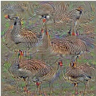

goose

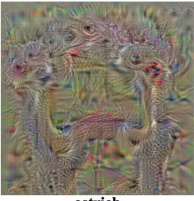

ostrich

Figure 14.33: Images that maximize the probability of ImageNet classes “goose” and “ostrich” under a simple Gaussian prior. From http://yosinski.com/deepvis. Used with kind permission of Jeff Clune.

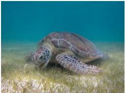

(a)

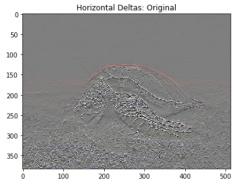

(b)

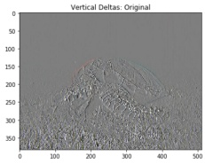

(c)

Figure 14.34: Illustration of total variation norm. (a) Input image: a green sea turtle (Used with kind permission of Wikimedia author P. Lindgren). (b) Horizontal deltas. (c) Vertical deltas. Adapted from https://www.tensorflow.org/tutorials/generative/style_transfer.

See Figure 14.34 for an illustration of these edge detectors. Using  $p(\boldsymbol{x}) \propto \exp(-\mathrm{TV}(\boldsymbol{x}))$ discourages images from having high frequency artefacts. In [Yos+15], they use Gaussian blur instead of TV norm, but this has a similar effect.

In Figure 14.35 we show some results of optimizing  $\log p(y = c, \boldsymbol{x})$ using a TV prior and a CNN likelihood for different class labels c starting from random noise.

#### 14.6.3 Visualizing the features learned by a CNN

It is interesting to ask what the “neurons” in a CNN are learning. One way to do this is to start with a random image, and then to optimize the input pixels so as to maximize the average activation of a particular neuron. This is called “activation” (AM), and uses the same technique as in Section 14.6.1 but fixes an internal node to a specific value, rather than clamping the output class label.

Figure 14.36 illustrates the output of this method (with the TV prior) when applied to the AlexNet CNN trained on Imagenet classification. We see that, as the depth increases, neurons are learning to recognize simple edges/blobs, then texture patterns, then object parts, and finally whole objects. This is believed to be roughly similar to the hierarchical structure of the visual cortex (see e.g., [Kan+12]).

Author: Kevin P. Murphy. (C) MIT Press. CC-BY-NC-ND license

---

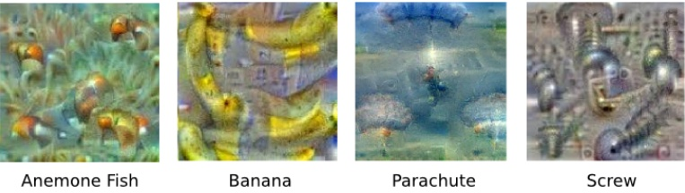

Figure 14.35: Images that maximize the probability of certain ImageNet classes under a TV prior. From https://research.googleblog.com/2015/06/inceptionism-going-deeper-into-neural.html. Used with kind permission of Alexander Mordvintsev.

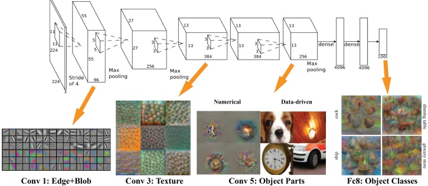

Figure 14.36: We visualize “optimal stimuli” for neurons in layers Conv 1, 3, 5 and fc8 in the AlexNet architecture, trained on the ImageNet dataset. For Conv5, we also show retrieved real images (under the column “data driven”) that produce similar activations. Based on the method in [MV16]. Used with kind permission of Donglai Wei.

An alternative to optimizing in pixel space is to search the training set for images that maximally activate a given neuron. This is illustrated in Figure 14.36 for the Conv5 layer.

For more information on feature visualization see e.g., [OMS17].

#### 14.6.4 Deep Dream

So far we have focused on generating images which maximize the class label or some other neuron of interest. In this section we tackle a more artistic application, in which we want to generate versions of an input image that emphasize certain features.

To do this, we view our pre-trained image classifier as a feature extractor. Based on the results in Section 14.6.3, we know the activity of neurons in different layers correspond to different kinds

---

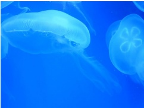

(a)

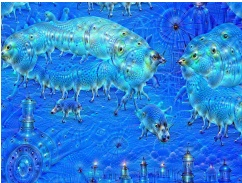

(b)

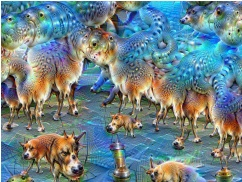

(c)

Figure 14.37: Illustration of DeepDream. The CNN is an Inception classifier trained on ImageNet. (a) Starting image of an Aurelia aurita (also called moon jelly). (b) Image generated after 10 iterations. (c) Image generated after 50 iterations. From https://en.wikipedia.org/wiki/DeepDream. Used with kind permission of Wikipedia author Martin Thoma.

of features in the image. Suppose we are interested in “amplifying” features from layers  $l \in \mathcal{L}$. We can do this by defining an energy or loss function of the form  $\mathcal{L}(\boldsymbol{x}) = \sum_{l \in \mathcal{L}} \overline{\phi}_l(\boldsymbol{x})$, where  $\overline{\phi}_l = \frac{1}{HWC} \sum_{hwc} \phi_{lhwc}(\boldsymbol{x})$ is the feature vector for layer  $l$. We can now use gradient descent to optimize this energy. The resulting process is called DeepDream [MOT15], since the model amplifies features that were only hinted at in the original image and then creates images with more and more of them. $^{10}$

Figure 14.37 shows an example. We start with an image of a jellyfish, which we pass into a CNN that was trained to classify ImageNet images. After several iterations, we generate some image which is a hybrid of the input and the kinds of “hallucinations” we saw in Figure 14.33; these hallucinations involve dog parts, since ImageNet has so many kinds of dogs in its label set. See [Tho16] for details, and https://deepdreamgenerator.com for a fun web-based demo.

#### 14.6.5 Neural style transfer

The DeepDream system in Figure 14.37 shows one way that CNNs can be used to create “art”. However, it is rather creepy. In this section, we discuss a related approach that gives the user more control. In particular, the user has to specify a reference “style image”  $\mathbf{x}_s$ and “content image”  $\mathbf{x}_c$. The system will then try to generate a new image  $\mathbf{x}$ that “re-renders”  $\mathbf{x}_c$ in the style of  $\mathbf{x}_s$. This is called neural style transfer, and is illustrated in Figure 14.38 and Figure 14.39. This technique was first proposed in [GEB16], and there are now many papers on this topic; see [Jin+17] for a recent review.

##### 14.6.5.1 How it works

Style transfer works by optimizing the following energy function:

$$
\mathcal{L}(\boldsymbol{x}|\boldsymbol{x}_{s},\boldsymbol{x}_{c})=\lambda_{T V}\mathcal{L}_{\mathrm{T V}}(\boldsymbol{x})+\lambda_{c}\mathcal{L}_{\mathrm{c o n t e n t}}(\boldsymbol{x},\boldsymbol{x}_{c})+\lambda_{s}\mathcal{L}_{\mathrm{s t y l e}}(\boldsymbol{x},\boldsymbol{x}_{s})   \tag*{(14.33)}
$$

See Figure 14.40 for a high level illustration.

---

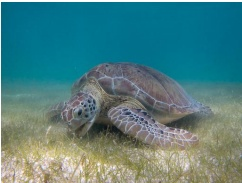

(a)

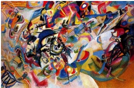

(b)

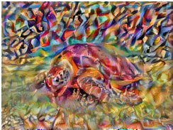

(c)

Figure 14.38: Example output from a neural style transfer system. (a) Content image: a green sea turtle (Used with kind permission of Wikimedia author P. Lindgren). (b) Style image: a painting by Wassily Kandinsky called “Composition 7”. (c) Output of neural style generation. Adapted from https://www.tensorflow.org/tutorials/generative/style_transfer.

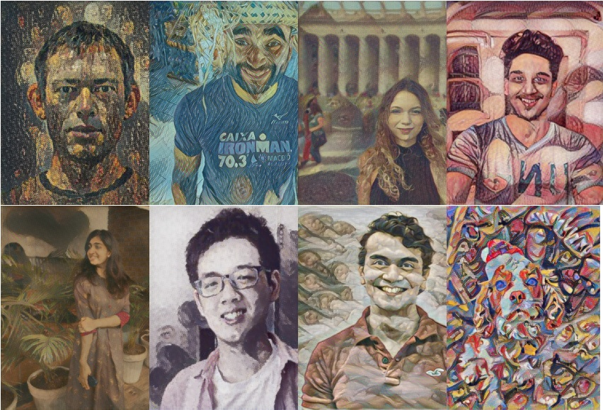

Figure 14.39: Neural style transfer applied to photos of the “production team”, who helped create code and demos for this book and its sequel. From top to bottom, left to right: Kevin Murphy (the author), Mahmoud Soliman, Aleyna Kara, Srikar Jilugu, Drishti Patel, Ming Liang Ang, Gerardo Durán-Martín, Coco (the team dog). Each content photo used a different artistic style. Adapted from https://www.tensorflow.org/tutorials/generative/style_transfer.

---

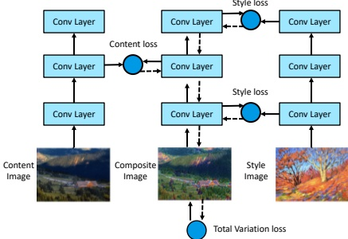

Figure 14.40: Illustration of how neural style transfer works. Adapted from Figure 12.12.2 of [Zha+20].

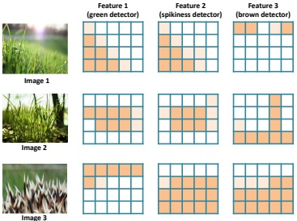

Figure 14.41: Schematic representation of 3 kinds of feature maps for 3 different input images. Adapted from Figure 5.16 of [Fos19].

The first term in Equation (14.33) is the total variation prior discussed in Section 14.6.2.2. The second term measures how similar  $\boldsymbol{x}$ is to  $\boldsymbol{x}_{c}$ by comparing feature maps of a pre-trained CNN  $\phi(\boldsymbol{x})$ in the relevant “content layer” l:

$$
\mathcal{L}_{\mathrm{content}}(\boldsymbol{x},\boldsymbol{x}_{c})=\frac{1}{C_{\ell}H_{\ell}W_{\ell}}||\boldsymbol{\phi}_{\ell}(\boldsymbol{x})-\boldsymbol{\phi}_{\ell}(\boldsymbol{x}_{c})||_{2}^{2}   \tag*{(14.34)}
$$

Finally we have to define the style term. We can interpret visual style as the statistical distribution of certain kinds of image features. The location of these features in the image may not matter, but their co-occurrence does. This is illustrated in Figure 14.41. It is clear (to a human) that image 1 is more similar in style to image 2 than to image 3. Intuitively this is because both image 1 and image 2 have spiky green patches in them, whereas image 3 has spiky things that are not green.

---

To capture the co-occurrence statistics we compute the Gram matrix for an image using feature maps from a specific layer  $\ell$:

$$
G_{\ell}(\boldsymbol{x})_{c,d}=\frac{1}{H_{\ell}W_{\ell}}\sum_{h=1}^{H_{\ell}}\sum_{w=1}^{W_{\ell}}\phi_{\ell}(\boldsymbol{x})_{h,w,c}\phi_{\ell}(\boldsymbol{x})_{h,w,d}   \tag*{(14.35)}
$$

The Gram matrix is a  $C_\ell \times C_\ell$ matrix which is proportional to the uncentered covariance of the  $C_\ell$-dimensional feature vectors sampled over each of the  $H_\ell W_\ell$ locations.

Given this, we define the style loss for layer  $\ell$ as follows:

$$
\mathcal{L}_{\mathrm{s t y l e}}^{\ell}(\boldsymbol{x},\boldsymbol{x}_{s})=||\mathbf{G}_{\ell}(\boldsymbol{x})-\mathbf{G}_{\ell}(\boldsymbol{x}_{s})||_{F}^{2}   \tag*{(14.36)}
$$

Finally, we define the overall style loss as a sum over the losses for a set S of layers:

$$
\mathcal{L}_{\mathrm{style}}(\boldsymbol{x},\boldsymbol{x}_{s})=\sum_{\ell\in\mathcal{S}}\mathcal{L}_{\mathrm{style}}^{\ell}(\boldsymbol{x},\boldsymbol{x}_{s})   \tag*{(14.37)}
$$

For example, in Figure 14.40, we compute the style loss at layers 1 and 3. (Lower layers will capture visual texture, and higher layers will capture object layout.)

##### 14.6.5.2 Speeding up the method

In [GEB16], they used L-BFGS (Section 8.3.2) to optimize Equation (14.33), starting from white noise. We can get faster results if we use an optimizer such as Adam instead of BFGS, and initialize from the content image instead of white noise. Nevertheless, running an optimizer for every new style and content image is slow. Several papers (see e.g., [JAFF16; Uly+16; UVL16; LW16]) have proposed to train a neural network to directly predict the outcome of this optimization, rather than solving it for each new image pair. (This can be viewed as a form of amortized optimization.) In particular, for every style image  $\boldsymbol{x}_s$, we fit a model  $f_s$ such that  $f_s(\boldsymbol{x}_c) = \arg\min_{\boldsymbol{x}} \mathcal{L}(\boldsymbol{x}|\boldsymbol{x}_s, \boldsymbol{x}_c)$. We can then apply this model to new content images without having to reoptimize.

More recently, [DSK16] has shown how it is possible to train a single network that takes as input both the content and a discrete representation s of the style, and then produces  $f(\boldsymbol{x}_c, s) = \arg\min_{\boldsymbol{x}} \mathcal{L}(\boldsymbol{x}|s, \boldsymbol{x}_c)$ as the output. This avoids the need to train a separate network for every style image. The key idea is to standardize the features at a given layer using scale and shift parameters that are style specific. In particular, we use the following conditional instance normalization transformation:

$$
\mathrm{C I N}(\phi(\boldsymbol{x}_{c}),s)=\gamma_{s}\left(\frac{\phi(\boldsymbol{x}_{c})-\mu(\phi(\boldsymbol{x}_{c}))}{\sigma(\phi(\boldsymbol{x}_{c}))}\right)+\beta_{s}   \tag*{(14.38)}
$$

where  $\mu(\phi(\boldsymbol{x}_{c}))$ is the mean of the features in a given layer,  $\sigma(\phi(\boldsymbol{x}_{c}))$ is the standard deviation, and  $\beta_{s}$ and  $\gamma_{s}$ are parameters for style type s. (See Section 14.2.4.2 for more details on instance normalization.) Surprisingly, this simple trick is enough to capture many kinds of styles.

The drawback of the above technique is that it only works for a fixed number of discrete styles. [HB17] proposed to generalize this by replacing the constants  $\beta_s$ and  $\gamma_s$ by the output of another CNN, which takes an arbitrary style image  $\boldsymbol{x}_s$ as input. That is, in Equation (14.38), we set  $\beta_s = f_{\beta}(\phi(\boldsymbol{x}_s))$

---

and  $\gamma_s = f_\gamma(\phi(\boldsymbol{x}_s))$, and we learn the parameters  $\beta$ and  $\gamma$ along with all the other parameters. The model becomes

$$
\mathrm{A I N}(\phi(\boldsymbol{x}_{c}),\phi(\boldsymbol{x}_{s}))=f_{\gamma}(\phi(\boldsymbol{x}_{s}))\left(\frac{\phi(\boldsymbol{x}_{c})-\mu(\phi(\boldsymbol{x}_{c}))}{\sigma(\phi(\boldsymbol{x}_{c}))}\right)+f_{\beta}(\phi(\boldsymbol{x}_{s}))   \tag*{(14.39)}
$$

They call their method adaptive instance normalization.

---

---

## 15 Neural Networks for Sequences

### 15.1 Introduction

In this chapter, we discuss various kinds of neural networks for sequences. We will consider the case where the input is a sequence, the output is a sequence, or both are sequences. Such models have many applications, such as machine translation, speech recognition, text classification, image captioning, etc. Our presentation borrows from parts of  $[Zha+20]$, which should be consulted for more details.

### 15.2 Recurrent neural networks (RNNs)

A recurrent neural network or RNN is a neural network which maps from an input space of sequences to an output space of sequences in a stateful way. That is, the prediction of output  $\pmb{y}_{t}$ depends not only on the input  $\pmb{x}_{t}$, but also on the hidden state of the system,  $\pmb{h}_{t}$, which gets updated over time, as the sequence is processed. Such models can be used for sequence generation, sequence classification, and sequence translation, as we explain below. $^{1}$

#### 15.2.1 Vec2Seq (sequence generation)

In this section, we discuss how to learn functions of the form  $f_{\theta} : \mathbb{R}^D \to \mathbb{R}^{N_\infty C}$, where  $D$ is the size of the input vector, and the output is an arbitrary-length sequence of vectors, each of size  $C$. (Note that words are discrete tokens, but can be converted to real-valued vectors as we discuss in Section 1.5.4.) We call these  $\text{vec2seq}$ models, since they map a vector to a sequence.

The output sequence  $\mathbf{y}_{1:T}$ is generated one token at a time. At each step we sample  $\tilde{y}_t$ from the hidden state  $\mathbf{h}_t$ of the model, and then “feed it back in” to the model to get the new state  $\mathbf{h}_{t+1}$ (which also depends on the input  $\mathbf{x}$). See Figure 15.1 for an illustration. In this way the model defines a conditional generative model of the form  $p(\mathbf{y}_{1:T}|\mathbf{x})$, which captures dependencies between the output tokens. We explain this in more detail below.

---

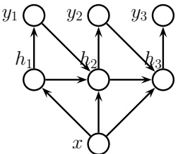

Figure 15.1: Recurrent neural network (RNN) for generating a variable length output sequence  $\mathbf{y}_{1:T}$ given an optional fixed length input vector  $\mathbf{x}$.

##### 15.2.1.1 Models

For notational simplicity, let T be the length of the output (with the understanding that this is chosen dynamically). The RNN then corresponds to the following conditional generative model:

$$
p(\boldsymbol{y}_{1:T}|\boldsymbol{x})=\sum_{h_{1:T}}p(\boldsymbol{y}_{1:T},\boldsymbol{h}_{1:T}|\boldsymbol{x})=\sum_{h_{1:T}}\prod_{t=1}^{T}p(\boldsymbol{y}_{t}|\boldsymbol{h}_{t})p(\boldsymbol{h}_{t}|\boldsymbol{h}_{t-1},\boldsymbol{y}_{t-1},\boldsymbol{x})   \tag*{(15.1)}
$$

where  $\boldsymbol{h}_t$ is the hidden state, and where we define  $p(\boldsymbol{h}_1|\boldsymbol{h}_0,\boldsymbol{y}_0,\boldsymbol{x}) = p(\boldsymbol{h}_1|\boldsymbol{x})$ as the initial hidden state distribution (often deterministic).

The output distribution is usually given by

$$
p(\boldsymbol{y}_{t}|\boldsymbol{h}_{t})=Cat(\boldsymbol{y}_{t}|softmax(\boldsymbol{W}_{hy}\boldsymbol{h}_{t}+\boldsymbol{b}_{y}))   \tag*{(15.2)}
$$

where  $\mathbf{W}_{hy}$ are the hidden-to-output weights, and  $\mathbf{b}_{y}$ is the bias term. However, for real-valued outputs, we can use

$$
p(\boldsymbol{y}_{t}|\boldsymbol{h}_{t})=\mathcal{N}(\boldsymbol{y}_{t}|\mathbf{W}_{h y}\boldsymbol{h}_{t}+\boldsymbol{b}_{y},\sigma^{2}\mathbf{I})   \tag*{(15.3)}
$$

We assume the hidden state is computed deterministically as follows:

$$
p(h_{t}|h_{t-1},y_{t-1},x)=\mathbb{I}(h_{t}=f(h_{t-1},y_{t-1},x))   \tag*{(15.4)}
$$

for some deterministic function f. The update function f is usually given by

$$
\boldsymbol{h}_{t}=\varphi(\mathbf{W}_{x h}[\boldsymbol{x};\boldsymbol{y}_{t-1}]+\mathbf{W}_{h h}\boldsymbol{h}_{t-1}+\boldsymbol{b}_{h})   \tag*{(15.5)}
$$

where  $\mathbf{W}_{hh}$ are the hidden-to-hidden weights,  $\mathbf{W}_{xh}$ are the input-to-hidden weights, and  $\mathbf{b}_{h}$ are the bias terms. See Figure 15.1 for an illustration, and  $\text{rnn\_jax.ipynb}$ for some code.

Note that  $y_t$ depends on  $h_t$, which depends on  $y_{t-1}$, which depends on  $h_{t-1}$, and so on. Thus  $y_t$ implicitly depends on all past observations (as well as the optional fixed input  $\mathbf{x}$). Thus an RNN overcomes the limitations of standard Markov models, in that they can have unbounded memory. This makes RNNs theoretically as powerful as a Turing machine [SS95; PMB19]. In practice,

---

the githa some thong the time traveller held in his hand was a glitteringmetallic framework scarcely larger than a small clock and verydelicately made there was ivory in it and the latter than s bettyre tat howhong s ie time thave ler

simk you a dimensions le ghat dionthat shall travel indifferently in any direction of space and timeas the driver determinesfilby contented himself with laughterbut i have experimental verification said the time travellerit would be remarkably convenient for the histo

Figure 15.2: Example output of length 500 generated from a character level RNN when given the prefix "the". We use greedy decoding, in which the most likely character at each step is computed, and then fed back into the model. The model is trained on the book The Time Machine by H. G. Wells. Generated by rnn_jax.ipynb.

however, the memory length is determined by the size of the latent state and the strength of the parameters; see Section 15.2.7 for further discussion of this point.

When we generate from an RNN, we sample from  $\tilde{y}_t \sim p(y_t | h_t)$, and then “feed in” the sampled value into the hidden state, to deterministically compute  $h_{t+1} = f(h_t, \tilde{y}_t, \mathbf{x})$, from which we sample  $\tilde{y}_{t+1} \sim p(y_{t+1} | h_{t+1})$, etc. Thus the only stochasticity in the system comes from the noise in the observation (output) model, which is fed back to the system in each step. (However, there is a variant, known as a \textit{variational RNN} [Chu+15], that adds stochasticity to the dynamics of  $h_t$ independent of the observation noise.)

##### 15.2.1.2 Applications

RNNs can be used to generate sequences unconditionally (by setting  $\boldsymbol{x} = \emptyset$) or conditionally on  $\boldsymbol{x}$. Unconditional sequence generation is often called language modeling; this refers to learning joint probability distributions over sequences of discrete tokens, i.e., models of the form  $p(y_1, \ldots, y_T)$. (See also Section 3.6.1.2, where we discuss using Markov chains for language modeling.)

Figure 15.2 shows a sequence generated from a simple RNN trained on the book The Time Machine by H. G. Wells. (This is a short science fiction book, with just 32,000 words and 170k characters.) We see that the generated sequence looks plausible, even though it is not very meaningful. By using more sophisticated RNN models (such as those that we discuss in Section 15.2.7.1 and Section 15.2.7.2), and by training on more data, we can create RNNs that give state-of-the-art performance on the language modeling task [CNB17]. (In the language modeling community, performance is usually measured by perplexity, which is just the exponential of the average per-token negative log likelihood; see Section 6.1.5 for more information.)

We can also make the generated sequence depend on some kind of input vector x. For example, consider the task of image captioning: in this case, x is some embedding of the image computed by a CNN, as illustrated in Figure 15.3. See e.g., [Hos+19; LXW19] for a review of image captioning methods, and https://bit.ly/2Wvs1GK for a tutorial with code.

It is also possible to use RNNs to generate sequences of real-valued feature vectors, such as pen strokes for hand-written characters [Gra13] and hand-drawn shapes [HE18]. This can also be useful for time series forecasting real-value sequences.

#### 15.2.2 Seq2Vec (sequence classification)

In this section, we assume we have a single fixed-length output vector  $\mathbf{y}$ we want to predict, given a variable length sequence as input. Thus we want to learn a function of the form  $f_{\theta} : \mathbb{R}^{TD} \to \mathbb{R}^C$. We

---

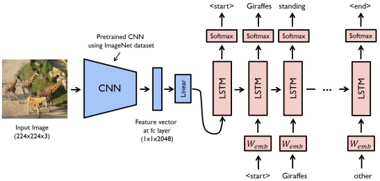

Figure 15.3: Illustration of a CNN-RNN model for image captioning. The pink boxes labeled “LSTM” refer to a specific kind of RNN that we discuss in Section 15.2.7.2. The pink boxes labeled  $W_{emb}$ refer to embedding matrices for the (sampled) one-hot tokens, so that the input to the model is a real-valued vector. From https://bit.ly/2FKmqHm. Used with kind permission of Yunjey Choi.

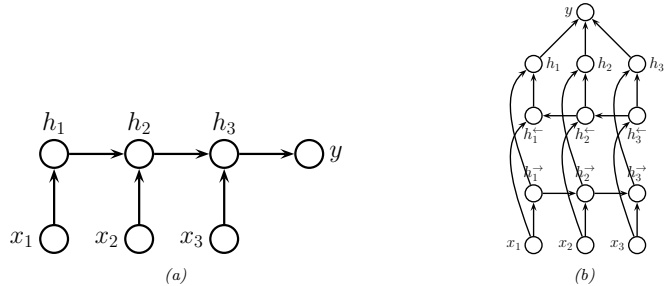

Figure 15.4: (a) RNN for sequence classification. (b) Bi-directional RNN for sequence classification.

call this a  $\text{seq2vec}$ model. We will focus on the case where the output is a class label,  $y \in \{1, \ldots, C\}$ for notational simplicity.

The simplest approach is to use the final state of the RNN as input to the classifier:

$$
p(y|\boldsymbol{x}_{1:T})=Cat(y|softmax(\mathbf{W}\boldsymbol{h}_{T}))   \tag*{(15.6)}
$$

See Figure 15.4a for an illustration.

We can often get better results if we let the hidden states of the RNN depend on the past and future context. To do this, we create two RNNs, one which recursively computes hidden states in the forwards direction, and one which recursively computes hidden states in the backwards direction. This is called a bidirectional RNN [SP97].

---

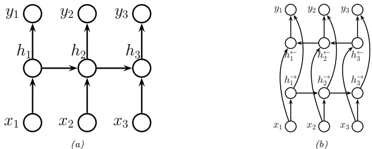

(a)

(b)

Figure 15.5: (a) RNN for transforming a sequence to another, aligned sequence. (b) Bi-directional RNN for the same task.

More precisely, the model is defined as follows:

$$
\boldsymbol{h}_{t}^{\rightarrow}=\varphi(\mathbf{W}_{x h}^{\rightarrow}\boldsymbol{x}_{t}+\mathbf{W}_{h h}^{\rightarrow}\boldsymbol{h}_{t-1}^{\rightarrow}+\boldsymbol{b}_{h}^{\rightarrow})   \tag*{(15.7)}
$$

$$
\boldsymbol{h}_{t}^{\leftarrow}=\varphi(\mathbf{W}_{x h}^{\leftarrow}\boldsymbol{x}_{t}+\mathbf{W}_{h h}^{\leftarrow}\boldsymbol{h}_{t+1}^{\leftarrow}+\boldsymbol{b}_{h}^{\leftarrow})   \tag*{(15.8)}
$$

We can then define  $\boldsymbol{h}_t = [\boldsymbol{h}_t^\rightarrow, \boldsymbol{h}_t^\leftarrow]$ to be the representation of the state at time  $t$, taking into account past and future information. Finally we average pool over these hidden states to get the final classifier:

$$
p(y|\pmb{x}_{1:T})=\mathrm{Cat}(y|\mathrm{softmax}(\pmb{W}\overline{h}))   \tag*{(15.9)}
$$

$$
\overline{h}=\frac{1}{T}\sum_{t=1}^{T}h_{t}   \tag*{(15.10)}
$$

See Figure 15.4b for an illustration, and rnn_sentiment_jax.ipynb for some code. (This is similar to the 1d CNN text classifier1 in Section 15.3.1.)

#### 15.2.3 Seq2Seq (sequence translation)

In this section, we consider learning functions of the form  $f_{\theta} : \mathbb{R}^{TD} \to \mathbb{R}^{T'C}$. We consider two cases: one in which  $T' = T$, so the input and output sequences have the same length (and hence are aligned), and one in which  $T' \neq T$, so the input and output sequences have different lengths. This is called a seq2seq problem.

##### 15.2.3.1 Aligned case

In this section, we consider the case where the input and output sequences are aligned. We can also think of it as dense sequence labeling, since we predict one label per location. It is straightforward to modify an RNN to solve this task, as shown in Figure 15.5a. This corresponds to

$$
p(\boldsymbol{y}_{1:T}|\boldsymbol{x}_{1:T})=\sum_{\boldsymbol{h}_{1:T}}\prod_{t=1}^{T}p(\boldsymbol{y}_{t}|\boldsymbol{h}_{t})\mathbb{I}\left(\boldsymbol{h}_{t}=f(\boldsymbol{h}_{t-1},\boldsymbol{x}_{t})\right)   \tag*{(15.11)}
$$

Author: Kevin P. Murphy. (C) MIT Press. CC-BY-NC-ND license

---

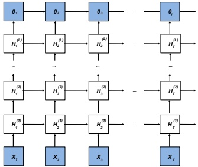

Figure 15.6: Illustration of a deep RNN. Adapted from Figure 9.3.1 of  $[Zha+20]$.

Figure 15.7: Encoder-decoder RNN architecture for mapping sequence x1:T to sequence y1:T'

where we define  $\boldsymbol{h}_{1}=f(\boldsymbol{h}_{0},\boldsymbol{x}_{1})=f_{0}(\boldsymbol{x}_{1})$ to be the initial state.

Note that  $y_t$ depends on  $h_t$ which only depends on the past inputs,  $x_{1:t}$. We can get better results if we let the decoder look into the “future” of  $x$ as well as the past, by using a bidirectional RNN, as shown in Figure 15.5b.

We can create more expressive models by stacking multiple hidden chains on top of each other, as shown in Figure 15.6. The hidden units for layer l at time t are computed using

$$
\boldsymbol{h}_{t}^{l}=\varphi_{l}(\mathbf{W}_{x h}^{l}\boldsymbol{h}_{t}^{l-1}+\mathbf{W}_{h h}^{l}\boldsymbol{h}_{t-1}^{l}+\boldsymbol{b}_{h}^{l})   \tag*{(15.12)}
$$

The output is given by

$$
\boldsymbol{o}_{t}=\mathbf{W}_{h o}\boldsymbol{h}_{t}^{L}+\boldsymbol{b}_{o}   \tag*{(15.13)}
$$

##### 15.2.3.2 Unaligned case

In this section, we discuss how to learn a mapping from one sequence of length T to another of length  $T'$. We first encode the input sequence to get the context vector  $\mathbf{c} = f_e(\mathbf{x}_{1:T})$, using the last state of an RNN (or average pooling over a biRNN). We then generate the output sequence using an RNN

---

 $(a)$

(b)

Figure 15.8: (a) Illustration of a seq2seq model for translating English to French. The - character represents the end of a sentence. From Figure 2.4 of [Luo16]. Used with kind permission of Minh-Thang Luong. (b) Illustration of greedy decoding. The most likely French word at each step is highlighted in green, and then fed in as input to the next step of the decoder. From Figure 2.5 of [Luo16]. Used with kind permission of Minh-Thang Luong.

decoder  $\mathbf{y}_{1:T'} = f_d(\mathbf{c})$. This is called an encoder-decoder architecture [SVL14; Cho+14a]. See Figure 15.7 for an illustration.

An important application of this is machine translation. When this is tackled using RNNs, it is called neural machine translation (as opposed to the older approach called statistical machine translation, that did not use neural networks). See Figure 15.8a for the basic idea, and nmt_jax.ipynb for some code which has more details. For a review of the NMT literature, see [Luo16; Neu17].

#### 15.2.4 Teacher forcing

When training a language model, the likelihood of a sequence of words w1, w2, …, wT, is given by

$$
p(\boldsymbol{w}_{1:T})=\prod_{t=1}^{T}p(w_{t}|\boldsymbol{w}_{1:t-1})   \tag*{(15.14)}
$$

In an RNN, we therefore set the input to  $x_t = w_{t-1}$ and the output to  $y_t = w_t$. Note that we condition on the ground truth labels from the past,  $\boldsymbol{w}_{1:t-1}$, not labels generated from the model. This is called teacher forcing, since the teacher's values are “force fed” into the model as input at each step (i.e.,  $x_t$ is set to  $w_{t-1}$).

Unfortunately, teacher forcing can sometimes result in models that perform poorly at test time. The reason is that the model has only ever been trained on inputs that are “correct”, so it may not know what to do if, at test time, it encounters an input sequence  $\pmb{w}_{1:t-1}$ generated from the previous step that deviates from what it saw in training.

Author: Kevin P. Murphy. (C) MIT Press. CC-BY-NC-ND license

---

Figure 15.9: An RNN unrolled (vertically) for 3 time steps, with the target output sequence and loss node shown explicitly. From Figure 8.7.2 of  $[Zha+20]$. Used with kind permission of Aston Zhang.

A common solution to this is known as scheduled sampling [Ben+15a]. This starts off using teacher forcing, but at random time steps, feeds in samples from the model instead; the fraction of time this happens is gradually increased.

An alternative solution is to use other kinds of models where MLE training works better, such as 1d CNNs (Section 15.3) and transformers (Section 15.5).

#### 15.2.5 Backpropagation through time

We can compute the maximum likelihood estimate of the parameters for an RNN by solving  $\boldsymbol{\theta}^* = \arg\max_{\boldsymbol{\theta}} p(\boldsymbol{y}_{1:T} | \boldsymbol{x}_{1:T}, \boldsymbol{\theta})$, where we have assumed a single training sequence for notational simplicity. To compute the MLE, we have to compute gradients of the loss wrt the parameters. To do this, we can unroll the computation graph, as shown in Figure 15.9, and then apply the backpropagation algorithm. This is called backpropagation through time (BPTT) [Wer90].

More precisely, consider the following model:

$$
\boldsymbol{h}_{t}=\mathbf{W}_{h x}\boldsymbol{x}_{t}+\mathbf{W}_{h h}\boldsymbol{h}_{t-1}   \tag*{(15.15)}
$$

$$
\boldsymbol{o}_{t}=\mathbf{W}_{h o}\boldsymbol{h}_{t}   \tag*{(15.16)}
$$

where  $o_t$ are the output logits, and where we drop the bias terms for notational simplicity. We assume  $y_y$ are the true target labels for each time step, so we define the loss to be

$$
L=\frac{1}{T}\sum_{t=1}^{T}\ell(y_{t},\boldsymbol{o}_{t})   \tag*{(15.17)}
$$

We need to compute the derivatives  $\frac{\partial L}{\partial \mathbf{W}_{hx}}$,  $\frac{\partial L}{\partial \mathbf{W}_{hh}}$, and  $\frac{\partial L}{\partial \mathbf{W}_{ho}}$. The latter term is easy, since it is local to each time step. However, the first two terms depend on the hidden state, and thus require working backwards in time.

---

We simplify the notation by defining

$$
\boldsymbol{h}_{t}=f(\boldsymbol{x}_{t},\boldsymbol{h}_{t-1},\boldsymbol{w}_{h})   \tag*{(15.18)}
$$

$$
\boldsymbol{o}_{t}=g(\boldsymbol{h}_{t},\boldsymbol{w}_{o})   \tag*{(15.19)}
$$

where  $\boldsymbol{w}_{h}$ is the flattened version of  $\mathbf{W}_{hh}$ and  $\mathbf{W}_{hx}$ stacked together. We focus on computing  $\frac{\partial L}{\partial \boldsymbol{w}_{h}}$ By the chain rule, we have

$$
\frac{\partial L}{\partial\boldsymbol{w}_{h}}=\frac{1}{T}\sum_{t=1}^{T}\frac{\partial\ell(y_{t},\boldsymbol{o}_{t})}{\partial\boldsymbol{w}_{h}}=\frac{1}{T}\sum_{t=1}^{T}\frac{\partial\ell(y_{t},\boldsymbol{o}_{t})}{\partial\boldsymbol{o}_{t}}\frac{\partial g(\boldsymbol{h}_{t},\boldsymbol{w}_{o})}{\partial\boldsymbol{h}_{t}}\frac{\partial\boldsymbol{h}_{t}}{\partial\boldsymbol{w}_{h}}   \tag*{(15.20)}
$$

We can expand the last term as follows:

$$
\frac{\partial\boldsymbol{h}_{t}}{\partial\boldsymbol{w}_{h}}=\frac{\partial f(\boldsymbol{x}_{t},\boldsymbol{h}_{t-1},\boldsymbol{w}_{h})}{\partial\boldsymbol{w}_{h}}+\frac{\partial f(\boldsymbol{x}_{t},\boldsymbol{h}_{t-1},\boldsymbol{w}_{h})}{\partial\boldsymbol{h}_{t-1}}\frac{\partial\boldsymbol{h}_{t-1}}{\partial\boldsymbol{w}_{h}}   \tag*{(15.21)}
$$

If we expand this recursively, we find the following result (see the derivation in [Zha+20, Sec 8.7]):

$$
\frac{\partial\boldsymbol{h}_{t}}{\partial\boldsymbol{w}_{h}}=\frac{\partial f(\boldsymbol{x}_{t},\boldsymbol{h}_{t-1},\boldsymbol{w}_{h})}{\partial\boldsymbol{w}_{h}}+\sum_{i=1}^{t-1}\left(\prod_{j=i+1}^{t}\frac{\partial f(\boldsymbol{x}_{j},\boldsymbol{h}_{j-1},\boldsymbol{w}_{h})}{\partial\boldsymbol{h}_{j-1}}\right)\frac{\partial f(\boldsymbol{x}_{i},\boldsymbol{h}_{i-1},\boldsymbol{w}_{h})}{\partial\boldsymbol{w}_{h}}   \tag*{(15.22)}
$$

Unfortunately, this takes  $O(T)$ time to compute per time step, for a total of  $O(T^2)$ overall. It is therefore standard to truncate the sum to the most recent  $K$ terms. It is possible to adaptively pick a suitable truncation parameter  $K$ [AFF19]; however, it is usually set equal to the length of the subsequence in the current minibatch.

When using truncated BPTT, we can train the model with batches of short sequences, usually created by extracting non-overlapping subsequences (windows) from the original sequence. If the previous subsequence ends at time t - 1, and the current subsequence starts at time t, we can “carry over” the hidden state of the RNN across batch updates during training. However, if the subsequences are not ordered, we need to reset the hidden state. See rnn_jax.ipynb for some sample code that illustrates these details.

#### 15.2.6 Vanishing and exploding gradients

Unfortunately, the activations in an RNN can decay or explode as we go forwards in time, since we multiply by the weight matrix  $\mathbf{W}_{hh}$ at each time step. Similarly, the gradients in an RNN can decay or explode as we go backwards in time, since we multiply the Jacobians at each time step (see Section 13.4.2 for details). A simple heuristic is to use gradient clipping (Equation (13.70)). More sophisticated methods attempt to control the spectral radius  $\lambda$ of the forward mapping,  $\mathbf{W}_{hh}$, as well as the backwards mapping, given by the Jacobian  $\mathbf{J}_{hh}$.

The simplest way to control the spectral radius is to randomly initialize  $\mathbf{W}_{hh}$ in such a way as to ensure  $\lambda \approx 1$, and then keep it fixed (i.e., we do not learn  $\mathbf{W}_{hh}$). In this case, only the output matrix  $\mathbf{W}_{ho}$ needs to be learned, resulting in a convex optimization problem. This is called an echo state network [JH04]. A closely related approach, known as a liquid state machine [MNM02], uses binary-valued (spiking) neurons instead of real-valued neurons. A generic term for both ESNs

Author: Kevin P. Murphy. (C) MIT Press. CC-BY-NC-ND license

---

Figure 15.10: Illustration of a GRU. Adapted from Figure 9.1.3 of  $[Zha+20]$.

and LSMs is reservoir computing [LJ09]. Another approach to this problem is use constrained optimization to ensure the  $W_{hh}$ matrix remains orthogonal [Vor+17].

An alternative to explicitly controlling the spectral radius is to modify the RNN architecture itself, to use additive rather than multiplicative updates to the hidden states, as we discuss in Section 15.2.7. This significantly improves training stability.

#### 15.2.7 Gating and long term memory

RNNs with enough hidden units can in principle remember inputs from long in the past. However, in practice “vanilla” RNNs fail to do this because of the vanishing gradient problem (Section 13.4.2). In this section we give a solution to this in which we update the hidden state in an additive way, similar to a residual net (Section 14.3.4).

##### 15.2.7.1 Gated recurrent units (GRU)

In this section, we discuss models which use gated recurrent units (GRU), as proposed in [Cho+14a]. The key idea is to learn when to update the hidden state, by using a gating unit. This can be used to selectively “remember” important pieces of information when they are first seen. The model can also learn when to reset the hidden state, and thus forget things that are no longer useful.

To explain the model in more detail, we present it in two steps, following the presentation of  $[\mathrm{Zha}+20, \mathrm{Sec} \, 8.8]$. We assume  $\mathbf{X}_t$ is a  $N \times D$ matrix, where  $N$ is the batch size, and  $D$ is the vocabulary size. Similarly,  $\mathbf{H}_t$ is a  $N \times H$ matrix, where  $H$ is the number of hidden units at time  $t$.

---

The reset gate  $\mathbf{R}_t \in \mathbb{R}^{N \times H}$ and update gate  $\mathbf{Z}_t \in \mathbb{R}^{N \times H}$ are computed using

$$
\mathbf{R}_{t}=\sigma(\mathbf{X}_{t}\mathbf{W}_{x r}+\mathbf{H}_{t-1}\mathbf{W}_{h r}+\mathbf{b}_{r})   \tag*{(15.23)}
$$

$$
\mathbf{Z}_{t}=\sigma(\mathbf{X}_{t}\mathbf{W}_{xz}+\mathbf{H}_{t-1}\mathbf{W}_{hz}+\mathbf{b}_{z})   \tag*{(15.24)}
$$

Note that each element of  $\mathbf{R}_t$ and  $\mathbf{Z}_t$ is in  $[0,1]$, because of the sigmoid function. Given this, we define a “candidate” next state vector using

$$
\tilde{\mathbf{H}}_{t}=\tanh(\mathbf{X}_{t}\mathbf{W}_{x h}+(\mathbf{R}_{t}\odot\mathbf{H}_{t-1})\mathbf{W}_{h h}+\mathbf{b}_{h})   \tag*{(15.25)}
$$

This combines the old memories that are not reset (computed using  $\mathbf{R}_t \odot \mathbf{H}_{t-1}$) with the new inputs  $\mathbf{X}_t$. We pass the resulting linear combination through a tanh function to ensure the hidden units remain in the interval  $(-1, 1)$. If the entries of the reset gate  $\mathbf{R}_t$ are close to 1, we recover the standard RNN update rule. If the entries are close to 0, the model acts more like an MLP applied to  $\mathbf{X}_t$. Thus the reset gate can capture new, short-term information.

Once we have computed the candidate new state, the model computes the actual new state by using the dimensions from the candidate state  $\tilde{H}_t$ chosen by the update gate,  $1 - \mathbf{Z}_t$, and keeping the remaining dimensions at their old values of  $\mathbf{H}_{t-1}$:

$$
\mathbf{H}_{t}=\mathbf{Z}_{t}\odot\mathbf{H}_{t-1}+\left(1-\mathbf{Z}_{t}\right)\odot\tilde{\mathbf{H}}_{t}   \tag*{(15.26)}
$$

When  $Z_{td} = 1$, we pass  $H_{t-1,d}$ through unchanged, and ignore  $X_t$. Thus the update gate can capture long-term dependencies.

See Figure 15.10 for an illustration of the overall architecture, and gru_jax.ipynb for some sample code.

##### 15.2.7.2 Long short term memory (LSTM)

In this section, we discuss the long short term memory (LSTM) model of [HS97b], which is a more sophisticated version of the GRU (and pre-dates it by almost 20 years). For a more detailed introduction, see https://colah.github.io/posts/2015-08-Understanding-LSTMs.

The basic idea is to augment the hidden state  $h_t$ with a memory cell  $c_t$. We need three gates to control this cell: the output gate  $O_t$ determines what gets read out; the input gate  $I_t$ determines what gets read in; and the forget gate  $F_t$ determines when we should reset the cell. These gates are computed as follows:

$$
\mathbf{O}_{t}=\sigma(\mathbf{X}_{t}\mathbf{W}_{x o}+\mathbf{H}_{t-1}\mathbf{W}_{h o}+\mathbf{b}_{o})   \tag*{(15.27)}
$$

$$
\mathbf{I}_{t}=\sigma(\mathbf{X}_{t}\mathbf{W}_{x i}+\mathbf{H}_{t-1}\mathbf{W}_{h i}+\mathbf{b}_{i})   \tag*{(15.28)}
$$

$$
\mathbf{F}_{t}=\sigma(\mathbf{X}_{t}\mathbf{W}_{x f}+\mathbf{H}_{t-1}\mathbf{W}_{h f}+\mathbf{b}_{f})   \tag*{(15.29)}
$$

We then compute a candidate cell state:

$$
\mathbf{\tilde{C}}_{t}=\tanh(\mathbf{X}_{t}\mathbf{W}_{xc}+\mathbf{H}_{t-1}\mathbf{W}_{hc}+\mathbf{b}_{c})   \tag*{(15.30)}
$$

The actual update to the cell is either the candidate cell (if the input gate is on) or the old cell (if the not-forget gate is on):

$$
\mathbf{C}_{t}=\mathbf{F}_{t}\odot\mathbf{C}_{t-1}+\mathbf{I}_{t}\odot\tilde{\mathbf{C}}_{t}   \tag*{(15.31)}
$$

Author: Kevin P. Murphy. (C) MIT Press. CC-BY-NC-ND license

---

Figure 15.11: Illustration of an LSTM. Adapted from Figure 9.2.4 of  $[Zha+20]$.

If  $\mathbf{F}_t = 1$ and  $\mathbf{I}_t = 0$, this can remember long term memories. $^{2}$

Finally, we compute the hidden state to be a transformed version of the cell, provided the output gate is on:

$$
\mathbf{H}_{t}=\mathbf{O}_{t}\odot\tanh(\mathbf{C}_{t})   \tag*{(15.32)}
$$

Note that  $\mathbf{H}_t$ is used as the output of the unit as well as the hidden state for the next time step. This lets the model remember what it has just output (short-term memory), whereas the cell  $\mathbf{C}_t$ acts as a long-term memory. See Figure 15.11 for an illustration of the overall model, and lstm_jax.ipynb for some sample code.

Sometimes we add peephole connections, where we pass the cell state as an additional input to the gates. Many other variants have been proposed. In fact, [JZS15] used genetic algorithms to test over 10,000 different architectures. Some of these worked better than LSTMs or GRUs, but in general, LSTMs seemed to do consistently well across most tasks. Similar conclusions were reached in [Gre+17]. More recently, [ZL17] used an RNN controller to generate strings which specify RNN architectures, and then trained the controller using reinforcement learning. This resulted in a novel cell structure that outperformed LSTM. However, it is rather complex and has not been adopted by the community.

---

Figure 15.12: Conditional probabilities of generating each token at each step for two different sequences. From Figures 9.8.1–9.8.2 of  $[Zha+20]$. Used with kind permission of Aston Zhang.

#### 15.2.8 Beam search

The simplest way to generate from an RNN is to use greedy decoding, in which we compute  $\hat{y}_t = \arg\max_y p(y_t = y|\hat{\mathbf{y}}_{1:t}, \mathbf{x})$ at each step. We can repeat this process until we generate the end-of-sentence token. See Figure 15.8b for an illustration of this method applied to NMT.

Unfortunately greedy decoding will not generate the MAP sequence, which is defined by  $\mathbf{y}_{1:T}^{*}=\operatorname{argmax}_{\mathbf{y}_{1:T}}p(\mathbf{y}_{1:T}|\mathbf{x})$. The reason is that the locally optimal symbol at step  $t$ might not be on the globally optimal path.

As an example, consider Figure 15.12a. We greedily pick the MAP symbol at step 1, which is A. Conditional on this, suppose we have  $p(y_2|y_1 = A) = [0.1, 0.4, 0.3, 0.2]$, as shown. We greedily pick the MAP symbol from this, which is B. Conditional on this, suppose we have  $p(y_3|y_1 = A, y_2 = B) = [0.2, 0.2, 0.4, 0.2]$, as shown. We greedily pick the MAP symbol from this, which is C. Conditional on this, suppose we have  $p(y_4|y_1 = A, y_2 = B, y_3 = C) = [0.0, 0.2, 0.2, 0.6]$, as shown. We greedily pick the MAP symbol from this, which is eos (end of sentence), so we stop generating. The overall probability of the generated sequence is  $0.5 \times 0.4 \times 0.4 \times 0.6 = 0.048$.

Now consider Figure 15.12b. At step 2, suppose we pick the second most probable token, namely C. Conditional on this, suppose we have  $p(y_3|y_1 = A, y_2 = C) = [0.1, 0.6, 0.2, 0.1]$, as shown. We greedily pick the MAP symbol from this, which is B. Conditional on this, suppose we have  $p(y_4|y_1 = A, y_2 = C, y_3 = B) = [0.1, 0.2, 0.1, 0.6]$, as shown. We greedily pick the MAP symbol from this, which is eos (end of sentence), so we stop generating. The overall probability of the generated sequence is  $0.5 \times 0.3 \times 0.6 \times 0.6 = 0.054$. So by being less greedy, we found a sequence with overall higher likelihood.

For hidden Markov models, we can use an algorithm called Viterbi decoding (which is an example of dynamic programming) to compute the globally optimal sequence in  $O(TV^2)$ time, where V is the number of words in the vocabulary. (See [Mur23] for details.) But for RNNs, computing the global optimum takes  $O(V^T)$, since the hidden state is not a sufficient statistic for the data.

Beam search is a much faster heuristic method. In this approach, we compute the top K candidate outputs at each step; we then expand each one in all V possible ways, to generate VK candidates, from which we pick the top K again. This process is illustrated in Figure 15.13.

It is also possible to extend the algorithm to sample the top K sequences without replacement

---

Figure 15.13: Illustration of beam search using a beam of size K = 2. The vocabulary is  $\mathcal{Y} = \{A, B, C, D, E\}$, with size V = 5. We assume the top 2 symbols at step 1 are A, C. At step 2, we evaluate  $p(y_1 = A, y_2 = y)$ and  $p(y_1 = C, y_2 = y)$ for each  $y \in \mathcal{Y}$. This takes  $O(KV)$ time. We then pick the top 2 partial paths, which are  $(y_1 = A, y_2 = B)$ and  $(y_1 = C, y_2 = E)$, and continue in the obvious way. Adapted from Figure 9.8.3 of  $[Zha + 20]$.

(i.e., pick the top one, renormalize, pick the new top one, etc.), using a method called stochastic beam search. This perturbs the model's partial probabilities at each step with Gumbel noise. See [KHW19] for details. and [SBS20] for a sequential alternative. These sampling methods can improve diversity of the outputs. (See also the deterministic diverse beam search method of [Vij+18].)

### 15.3 1d CNNs

Convolutional neural networks (Chapter 14) compute a function of some local neighborhood for each input using tied weights, and return an output. They are usually used for 2d inputs, but can also be applied in the 1d case, as we discuss below. They are an interesting alternative to RNNs that are much easier to train, because they don't have to maintain long term hidden state.

#### 15.3.1 1d CNNs for sequence classification

In this section, we discuss the use of 1d CNNs for learning a mapping from variable-length sequences to a fixed length output, i.e., a function of the form  $f_{\theta} : \mathbb{R}^{DT} \to \mathbb{R}^C$, where  $T$ is the length of the input,  $D$ is the number of features per input, and  $C$ is the size of the output vector (e.g., class logits).

A basic 1d convolution operation applied to a 1d sequence is shown in Figure 14.4. Typically the input sequence will have $D > 1$input channels (feature dimensions). In this case, we can convolve each channel separately and add up the result, using a different 1d filter (kernel) for each input channel to get$z_i = \sum_d \mathbf{x}_{i-k:i+k,d}^\top \mathbf{w}_d$, where $k$is size of the 1d receptive field, and$\mathbf{w}_d$is the filter for input channel$d$. This produces a 1d vector $\mathbf{z} \in \mathbb{R}^T$encoding the input (ignoring boundary effects). We can create a vector representation for each location using a different weight vector for each output channel$c$to get$z_{ic} = \sum_d \mathbf{x}_{i-k:i+k,d}^\top \mathbf{w}_{d,c}$. This implements a mapping from $TD$to$TC$. To reduce this to a fixed sized vector, $z \in \mathbb{R}^C$, we can use max-pooling over time to get $z_c = \max_i z_{ic}$. We can

---

Figure 15.14: Illustration of the TextCNN model for binary sentiment classification. Adapted from Figure 15.3.5 of  $[Zha+20]$.

then pass this into a softmax layer.

In [Kim14], they applied this model to sequence classification. The idea is to embed each word using an embedding layer, and then to compute various features using 1d kernels of different widths, to capture patterns of different length scales. We then apply max pooling over time, and concatenate the results, and pass to a fully connected layer. See Figure 15.14 for an illustration, and cnn1d_sentiment_jax.ipynb for some code.

#### 15.3.2 Causal 1d CNNs for sequence generation

To use 1d CNNs in a generative setting, we must convert them to a causal CNN, in which each output variable only depends on previously generated variables. (This is also called a convolutional Markov model.) In particular, we define the model as follows:

$$
p(\boldsymbol{y})=\prod_{t=1}^{T}p(y_{t}|\boldsymbol{y}_{1:t-1})=\prod_{t=1}^{T}Cat(y_{t}|softmax(\varphi(\sum_{\tau=1}^{t-k}\boldsymbol{w}^{\mathsf{T}}\boldsymbol{y}_{\tau:\tau+k})))   \tag*{(15.33)}
$$

where w is the convolutional filter of size k, and we have assumed a single nonlinearity  $\varphi$ and categorical output, for notational simplicity. This is like regular 1d convolution except we “mask out” future inputs, so that  $y_t$ only depends on the past values, rather than past and future values. This is

---

Figure 15.15: Illustration of the wavenet model using dilated (atrous) convolutions, with dilation factors of 1, 2, 4 and 8. From Figure 3 of [Oor+16]. Used with kind permission of Aaron van den Oord.

called causal convolution. We can of course use deeper models, and we can condition on input features x.

In order to capture long-range dependencies, we can use dilated convolution (Section 14.4.1), as illustrated in Figure 15.15. This model has been successfully used to create a state of the art text to speech (TTS) synthesis system known as wavenet [Oor+16]. In particular, they stack 10 causal 1d convolutional layers with dilation rates 1, 2, 4, ..., 256, 512 to get a convolutional block with an effective receptive field of 1024. (They left-padded the input sequences with a number of zeros equal to the dilation rate before every layer, so that every layer has the same length.) They then repeat this block 3 times to compute deeper features.

In wavenet, the conditioning information x is a set of linguistic features derived from an input sequence of words; the model then generates raw audio using the above model. It is also possible to create a fully end-to-end approach, which starts with raw words rather than linguistic features (see [Wan+17]).

Although wavenet produces high quality speech, it is too slow for use in production systems. However, it can be “distilled” into a parallel generative model [Oor+18]. We discuss these kinds of parallel generative models in the sequel to this book, [Mur23].

### 15.4 Attention

In all of the neural networks we have considered so far, the hidden activations are a linear combination of the input activations, followed by a nonlinearity:  $\mathbf{Z} = \varphi(\mathbf{X}\mathbf{W})$, where  $\mathbf{X} \in \mathbb{R}^{m \times v}$ are the hidden feature vectors, and  $\mathbf{W} \in \mathbb{R}^{v \times v'}$ are a fixed set of weights that are learned on a training set to produce  $\mathbf{Z} \in \mathbb{R}^{m \times v'}$ outputs.

However, we can imagine a more flexible model in which the weights depend on the inputs, i.e.,  $\mathbf{Z} = \varphi(\mathbf{X}\mathbf{W}(\mathbf{X}))$. This kind of multiplicative interaction is called attention. More generally, we can write  $\mathbf{Z} = \varphi(\mathbf{V}\mathbf{W}(\mathbf{Q},\mathbf{K}))$, where  $\mathbf{Q} \in \mathbb{R}^{m \times q}$ are a set of queries (derived from  $\mathbf{X}$) used to describe what each input is “looking for”,  $\mathbf{K} \in \mathbb{R}^{m \times q}$ are a set of keys (derived from  $\mathbf{X}$) used to describe what each input vector contains, and  $\mathbf{V} \in \mathbb{R}^{m \times v}$ are a set of values  $\mathbf{V} \in \mathbb{R}^{m \times v}$ (derived from  $\mathbf{X}$) used to describe how each input should be transmitted to the output. (We usually compute these quantities using linear projections of the input,  $\mathbf{Q} = \mathbf{W}_q\mathbf{X}$,  $\mathbf{K} = \mathbf{W}_k\mathbf{X}$, and  $\mathbf{V} = \mathbf{W}_v\mathbf{X}$.)

---

Figure 15.16: Attention computes a weighted average of a set of values, where the weights are derived by comparing the query vector to a set of keys. From Figure 10.3.1 of  $[Zha+20]$. Used with kind permission of Aston Zhang.

When using attention to compute output  $z_j$, we use its corresponding query  $q_j$ and compare it to each key  $\mathbf{k}_i$ to get a similarity score,  $0 \leq \alpha_{ij} \leq 1$, where  $\sum_i \alpha_{ij} = 1$; we then set  $z_j = \sum_i \alpha_{ij} \mathbf{v}_i$. (We assume  $\varphi(u) = u$ is the identity function.) For example, suppose  $\mathbf{V} = \mathbf{X}$, and query  $q_j$ equally matches keys 1 and 2, so  $\alpha_{1j} = \alpha_{2j} = 0.5$; then we have  $z_j = 0.5\mathbf{x}_1 + 0.5\mathbf{x}_2$. Thus the outputs become a dynamic weighted combination of the inputs, rather than a fixed weighted combination. And rather than learning the weight matrix, we learn the projection matrices  $\mathbf{W}_q$,  $\mathbf{W}_k$ and  $\mathbf{W}_v$. We explain this in more detail below.

Note that attention was originally developed for natural language sequence models. However, nowadays it is applied to a variety of models, including vision models. Our presentation in the following sections is based on  $[Zha+20, Chap 10.]$.

#### 15.4.1 Attention as soft dictionary lookup

We will focus on a single output vector, with corresponding query vector  $\boldsymbol{q}$. We can think of attention as a dictionary lookup, in which we compare the query  $\boldsymbol{q}$ to each key  $\boldsymbol{k}_{i}$, and then retrieve the corresponding value  $\boldsymbol{v}_{i}$. To make this lookup operation differentiable, instead of retrieving a single value  $\boldsymbol{v}_{i}$, we compute a convex combination of the values, as follows:

$$
\mathrm{Attn}(\boldsymbol{q},(\boldsymbol{k}_{1},\boldsymbol{v}_{1}),\ldots,(\boldsymbol{k}_{m},\boldsymbol{v}_{m}))=\mathrm{Attn}(\boldsymbol{q},(\boldsymbol{k}_{1:m},\boldsymbol{v}_{1:m}))=\sum_{i=1}^{m}\alpha_{i}(\boldsymbol{q},\boldsymbol{k}_{1:m})\boldsymbol{v}_{i}\in\mathbb{R}^{v}   \tag*{(15.34)}
$$

where  $\alpha_i(q, k_{1:m})$ is the  $i$th attention weight; these weights satisfy  $0 \leq \alpha_i(q, k_{1:m}) \leq 1$ for each  $i$ and  $\sum_i \alpha_i(q, k_{1:m}) = 1$.

The attention weights can be computed from an \textit{attention} \textbf{score} function  $a(q, k_i) \in \mathbb{R}$, that computes the similarity of query  $q$ to key  $k_i$. We will discuss several such score function below. Given the scores, we can compute the attention weights using the softmax function:

$$
\alpha_{i}(\boldsymbol{q},\boldsymbol{k}_{1:m})=softmax_{i}([a(\boldsymbol{q},\boldsymbol{k}_{1}),\cdots,a(\boldsymbol{q},\boldsymbol{k}_{m})])=\frac{\exp(a(\boldsymbol{q},\boldsymbol{k}_{i}))}{\sum_{j=1}^{m}\exp(a(\boldsymbol{q},\boldsymbol{k}_{j}))}   \tag*{(15.35)}
$$

Author: Kevin P. Murphy. (C) MIT Press. CC-BY-NC-ND license

---

See Figure 15.16 for an illustration.

In some cases, we want to restrict attention to a subset of the dictionary, corresponding to valid entries. For example, we might want to pad sequences to a fixed length (for efficient minibatching), in which case we should “mask out” the padded locations. This is called “masked attention”. We can implement this efficiently by setting the attention score for the masked entries to a large negative number, such as  $-10^{6}$, so that the corresponding softmax weights will be 0. (This is analogous to causal convolution, discussed in Section 15.3.2.)

#### 15.4.2 Kernel regression as non-parametric attention

We can interpret attention in terms of kernel regression, which is a nonparametric model which we discuss in Section 16.3.5. In brief this a model where the predicted output at query point x is a weighted combination of all the target labels  $y_i$, where the weights depend on the similarity of query point x to each training point  $x_i$:

$$
f(\boldsymbol{x})=\sum_{i=1}^{n}\alpha_{i}(\boldsymbol{x},\boldsymbol{x}_{1:n})y_{i}   \tag*{(15.36)}
$$

where  $\alpha_i(\boldsymbol{x}, \boldsymbol{x}_{1:n}) \geq 0$ measures the normalized similarity of test input  $\boldsymbol{x}$ to training input  $\boldsymbol{x}_i$. This similarity measure is usually computed by defining the attention score in terms of a density kernel, such as the Gaussian:

$$
\mathcal{K}_{\sigma}(u)=\frac{1}{\sqrt{2\pi\sigma^{2}}}e^{-\frac{1}{2\sigma^{2}}u^{2}}   \tag*{(15.37)}
$$

where  $\sigma$ is called the bandwidth. We then define  $a(x, x_i) = K_\sigma(x - x_i)$.

Because the scores are normalized, we can drop the  $\frac{1}{\sqrt{2\pi\sigma^2}}$ term. In addition, we rewrite the kernel in terms of  $\beta^2 = 1/\sigma^2$ to get

$$
\mathcal{K}(u;\beta)=\exp(-\frac{\beta^{2}}{2}u^{2})   \tag*{(15.38)}
$$

Plugging this in to Equation  $(15.36)$, we get

$$
f(\boldsymbol{x})=\sum_{i=1}^{n}\alpha_{i}(\boldsymbol{x},\boldsymbol{x}_{1:n})y_{i}   \tag*{(15.39)}
$$

$$
=\sum_{i=1}^{n}\frac{\exp[-\frac{1}{2}((\boldsymbol{x}-\boldsymbol{x}_{i})\boldsymbol{\beta})^{2}]}{\sum_{j=1}^{n}\exp[-\frac{1}{2}((\boldsymbol{x}-\boldsymbol{x}_{j})\boldsymbol{\beta})^{2}]}y_{i}   \tag*{(15.40)}
$$

$$
=\sum_{i=1}^{n}\mathrm{softmax}_{i}\left[-\frac{1}{2}((\boldsymbol{x}-\boldsymbol{x}_{1})\boldsymbol{\beta})^{2},\cdots,-\frac{1}{2}((\boldsymbol{x}-\boldsymbol{x}_{n})\boldsymbol{\beta})^{2}\right]y_{i}   \tag*{(15.41)}
$$

We can interpret this as a form of nonparametric attention, where the queries are the test points  $\boldsymbol{x}$, the keys are the training inputs  $\boldsymbol{x}_i$, and the values are the training labels  $y_i$. If we set  $\beta = 1$, the resulting attention matrix  $A_{ji} = \alpha_i(\boldsymbol{x}_j, \boldsymbol{x}_{1:n})$ for test input  $j$ is shown in Figure 15.17a. The resulting predicted curve is shown in Figure 15.17b.

The size of the diagonal band in Figure 15.17a, and hence the sparsity of the attention mechanism, depends on the parameter  $\beta$. If we increase  $\beta$, corresponding to reducing the kernel bandwidth, the band will get narrower, but the model will start to overfit.