

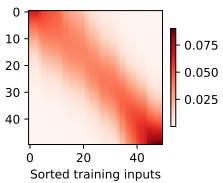

 $(a)$

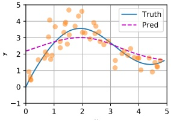

(b)

Figure 15.17: Kernel regression in 1d. (a) Kernel weight matrix. (b) Resulting predictions on a dense grid of test points. Generated by kernel regression attention. ipynb.

#### 15.4.3 Parametric attention

In Section 15.4.2, we defined the attention score in terms of the Gaussian kernel, comparing a query (test point) to each of the values in the training set. However, non-parametric methods do not scale well to large training sets, or high-dimensional inputs. We will therefore turn our attention (no pun intended) to parametric models, where we have a fixed set of keys and values, and where we compare queries and keys in a learned embedding space.

There are several ways to do this. In the general case, the query  $q \in \mathbb{R}^q$ and the key  $k \in \mathbb{R}^k$ may have different sizes. To compare them, we can map them to a common embedding space of size  $h$ by computing  $\mathbf{W}_q q$ and  $\mathbf{W}_k k$. where  $\mathbf{W}_q \in \mathbb{R}^{h \times q}$ and  $\mathbf{W}_k \in \mathbb{R}^{h \times k}$. We can then pass these into an MLP to get the following additive attention scoring function:

$$
a(\boldsymbol{q},\boldsymbol{k})=\boldsymbol{w}_{v}^{\mathsf{T}}\operatorname{t a n h}(\mathbf{W}_{q}\boldsymbol{q}+\mathbf{W}_{k}\boldsymbol{k})\in\mathbb{R}   \tag*{(15.42)}
$$

A more computationally efficient approach is to assume the queries and keys both have length $d$, so we can compute $q^\top k$directly. If we assume these are independent random variables with 0 mean and unit variance, the mean of their inner product is 0, and the variance is$d$. (This follows from Equation (2.34) and Equation (2.39).) To ensure the variance of the inner product remains 1 regardless of the size of the inputs, it is standard to divide by $\sqrt{d}$. This gives rise to the scaled dot-product attention:

$$
a(\boldsymbol{q},\boldsymbol{k})=\boldsymbol{q}^{\top}\boldsymbol{k}/\sqrt{d}\in\mathbb{R}   \tag*{(15.43)}
$$

In practice, we usually deal with minibatches of $n$vectors at a time. Let the corresponding matrices of queries, keys and values be denoted by$\mathbf{Q} \in \mathbb{R}^{n \times d}$, $\mathbf{K} \in \mathbb{R}^{m \times d}$, $\mathbf{V} \in \mathbb{R}^{m \times v}$. Then we can compute the attention-weighted outputs as follows:

$$
\mathrm{Attn}(\mathbf{Q},\mathbf{K},\mathbf{V})=\mathrm{softmax}(\frac{\mathbf{Q}\mathbf{K}^{\top}}{\sqrt{d}})\mathbf{V}\in\mathbb{R}^{n\times v}   \tag*{(15.44)}
$$

where the softmax function softmax is applied row-wise. See attention_jax.ipynb for some sample code.

Author: Kevin P. Murphy. (C) MIT Press. CC-BY-NC-ND license

---

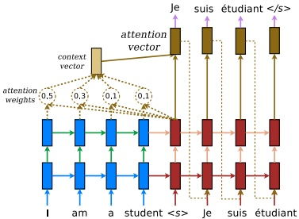

Figure 15.18: Illustration of seq2seq with attention for English to French translation. Used with kind permission of Minh-Thang Luong.

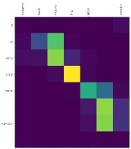

 $(a)$

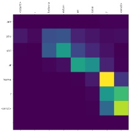

(b)

Figure 15.19: Illustration of the attention heatmaps generated while translating two sentences from Spanish to English. (a) Input is “hace mucho frio aqui.”, output is “it is very cold here.” (b) Input is “¿todavia estan en casa?”, output is “are you still at home?”. Note that when generating the output token “home”, the model should attend to the input token “casa”, but in fact it seems to attend to the input token “?”. Adapted from https://www.tensorflow.org/tutorials/text/nmt_with_attention.

#### 15.4.4 Seq2Seq with attention

Recall the seq2seq model from Section 15.2.3. This uses an RNN decoder of the form  $\boldsymbol{h}_t^d = f_d(\boldsymbol{h}_{t-1}^d, \boldsymbol{y}_{t-1}, \boldsymbol{c})$, where  $\boldsymbol{c}$ is a fixed-length context vector, representing the encoding of the input  $\boldsymbol{x}_{1:T}$. Usually we set  $\boldsymbol{c} = \boldsymbol{h}_T^e$, which is the final state of the encoder RNN (or we use a bidirectional RNN with average pooling). However, for tasks such as machine translation, this can result in poor performance, since the output does not have access to the input words themselves. We can avoid this bottleneck by allowing the output words to directly “look at” the input words. But which inputs should it look at? After all, word order is not always preserved across languages (e.g., German often puts verbs at the end of a sentence), so we need to infer the alignment between source and target.

We can solve this problem (in a differentiable way) by using (soft) \textbf{attention}, as first proposed in  $[BCB15; LPM15]$. In particular, we can replace the fixed context vector  $\boldsymbol{c}$ in the decoder with a

---

dynamic context vector  $\pmb{c}_{t}$ computed as follows:

$$
\boldsymbol{c}_{t}=\sum_{i=1}^{T}\alpha_{i}(\boldsymbol{h}_{t-1}^{d},\boldsymbol{h}_{1:T}^{e})\boldsymbol{h}_{i}^{e}   \tag*{(15.45)}
$$

This uses attention where the query is the hidden state of the decoder at the previous step,  $h_{t-1}^{d}$, the keys are all the hidden states from the encoder, and the values are also the hidden states from the encoder. (When the RNN has multiple hidden layers, we usually take the top layer from the encoder, as the keys and values, and the top layer of the decoder as the query.) This context vector is concatenated with the input vector of the decoder,  $y_{t-1}$, and fed into the decoder, along with the previous hidden state  $h_{t-1}^{d}$, to create  $h_{t}^{d}$. See Figure 15.18 for an illustration of the overall model.

We can train this model in the usual way on sentence pairs, and then use it to perform machine translation. (See nmt_attention_jax.ipynb for some sample code.) We can also visualize the attention weights computed at each step of decoding, to get an idea of which parts of the input the model thinks are most relevant for generating the corresponding output. Some examples are shown in Figure 15.19.

#### 15.4.5 Seq2vec with attention (text classification)

We can also use attention with sequence classifiers. For example [Raj+18] apply an RNN classifier to the problem of predicting if a patient will die or not. The input is a set of electronic health records, which is a time series containing structured data, as well as unstructured text (clinical notes). Attention is useful for identifying “relevant” parts of the input, as illustrated in Figure 15.20.

#### 15.4.6 Seq+Seq2Vec with attention (text pair classification)

Suppose we see the sentence “A person on a horse jumps over a log” (call this the premise) and then we later read “A person is outdoors on a horse” (call this the hypothesis). We may reasonably say that the premise entails the hypothesis, meaning that the hypothesis is more likely given the premise. $^{3}$ Now suppose the hypothesis is “A person is at a diner ordering an omelette”. In this case, we would say that the premise contradicts the hypothesis, since the hypothesis is less likely given the premise. Finally, suppose the hypothesis is “A person is training his horse for a competition”. In this case, we see that the relationship between premise and hypothesis is neutral, since the hypothesis may or may not follow from the premise. The task of classifying a sentence pair into these three categories is known as textual entailment or “natural language inference”. A standard benchmark in this area is the Stanford Natural Language Inference or SNLI corpus [Bow+15]. This consists of 550,000 labeled sentence pairs.

An interesting solution to this classification problem was presented in [Par+16a]; at the time, it was the state of the art on the SNLI dataset. The overall approach is sketched in Figure 15.21. Let  $\mathbf{A} = (\mathbf{a}_1, \ldots, \mathbf{a}_m)$ be the premise and  $\mathbf{B} = (\mathbf{b}_1, \ldots, \mathbf{b}_n)$ be the hypothesis, where  $\mathbf{a}_i, \mathbf{b}_j \in \mathbb{R}^E$ are embedding vectors for the words. The model has 3 steps. First, each word in the premise,  $\mathbf{a}_i$, attends

---

Patient Timeline

Figure 15.20: Example of an electronic health record. In this example, 24h after admission to the hospital, the RNN classifier predicts the risk of death as 19.9%; the patient ultimately died 10 days after admission. The “relevant” keywords from the input clinical notes are shown in red, as identified by an attention mechanism. From Figure 3 of [Raj+18]. Used with kind permission of Alvin Rajkomar.

to each word in the hypothesis,  $\pmb{b}_{j}$, to compute an attention weight

$$
e_{ij}=f(\boldsymbol{a}_{i})^{\top}f(\boldsymbol{b}_{j})   \tag*{(15.46)}
$$

where  $f : \mathbb{R}^E \to \mathbb{R}^D$ is an MLP; we then compute a weighted average of the matching words in the hypothesis,

$$
\beta_{i}=\sum_{j=1}^{n}\frac{\exp(e_{ij})}{\sum_{k=1}^{n}\exp(e_{ik})}b_{j}   \tag*{(15.47)}
$$

Next, we compare  $a_i$ with  $\beta_i$ by mapping their concatenation to a hidden space using an MLP  $g : \mathbb{R}^{2E} \to \mathbb{R}^H$:

$$
\boldsymbol{v}_{A,i}=g([\boldsymbol{a}_{i},\boldsymbol{\beta}_{i}]),i=1,\ldots,m   \tag*{(15.48)}
$$

“Probabilistic Machine Learning: An Introduction”. Online version. November 23, 2024

---

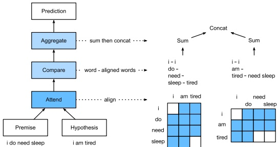

Figure 15.21: Illustration of sentence pair entailment classification using an MLP with attention to align the premise (“I do need sleep”) with the hypothesis (“I am tired”). White squares denote active attention weights, blue squares are inactive. (We are assuming hard 0/1 attention for simplicity.) From Figure 15.5.2 of  $[Zha+20]$. Used with kind permission of Aston Zhang.

Finally, we aggregate over the comparisons to get an overall similarity of premise to hypothesis:

$$
v_{A}=\sum_{i=1}^{m}v_{A,i}   \tag*{(15.49)}
$$

We can similarly compare the hypothesis to the premise using

$$
\alpha_{j}=\sum_{i=1}^{m}\frac{\exp(e_{ij})}{\sum_{k=1}^{m}\exp(e_{kj})}a_{i}   \tag*{(15.50)}
$$

$$
\boldsymbol{v}_{B,j}=g([\boldsymbol{b}_{j},\boldsymbol{\alpha}_{j}]),j=1,\ldots,n   \tag*{(15.51)}
$$

$$
\boldsymbol{v}_{B}=\sum_{j=1}^{n}\boldsymbol{v}_{B,j}   \tag*{(15.52)}
$$

At the end, we classify the output using another MLP  $h : \mathbb{R}^{2H} \to \mathbb{R}^3$:

$$
\hat{y}=h([\boldsymbol{v}_{A},\boldsymbol{v}_{B}])   \tag*{(15.53)}
$$

See  $\underline{\text{entailment}}$  $\underline{\text{attention}}$  $\underline{\text{mlp}}$  $\underline{\text{jax.ipynb}}$ for some sample code.

We can modify this model to learn other kinds of mappings from sentence pairs to output labels. For example, in the semantic \textbf{textual similarity} task, the goal is to predict how semantically related two input sentences are. A standard dataset for this is the STS \textbf{Benchmark} \textbf{[Cer+17]}, where relatedness ranges from 0 (meaning unrelated) to 5 (meaning maximally related).

#### 15.4.7 Soft vs hard attention

If we force the attention heatmap to be sparse, so that each output can only attend to one input location instead of a weighted combination of all of them, the method is called hard attention. We

---

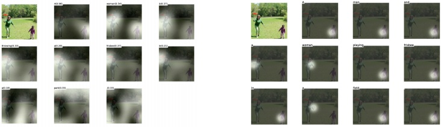

 $(a)$

(b)

Figure 15.22: Image captioning using attention. (a) Soft attention. Generates “a woman is throwing a frisbee in a park”. (b) Hard attention. Generates “a man and a woman playing frisbee in a field”. From Figure 6 of [Xu+15]. Used with kind permission of Kelvin Xu.

compare these two approaches for an image captioning problem in Figure 15.22. Unfortunately, hard attention results in a nondifferentiable training objective, and requires methods such as reinforcement learning to fit the model. See [Xu+15] for the details.

It seems from the above examples that these attention heatmaps can “explain” why the model generates a given output. However, the interpretability of attention is controversial (see e.g., [JW19; WP19; SS19; Bru+19] for discussion).

### 15.5 Transformers

The transformer model  $[Vas+17]$ is a seq2seq model which uses attention in the encoder as well as the decoder, thus eliminating the need for RNNs, as we explain below. Transformers have been used for many (conditional) sequence generation tasks, such as machine translation  $[Vas+17]$, constituency parsing  $[Vas+17]$, music generation  $[Hua+18]$, protein sequence generation  $[Mad+20$; Cho+20b], abstractive text summarization  $[Zha+19a]$, image generation  $[Par+18]$ (treating the image as a rasterized 1d sequence), etc.

The transformer is a rather complex model that uses several new kinds of building blocks or layers. We introduce these new blocks below, and then discuss how to put them all together. $^{4}$

#### 15.5.1 Self-attention

In Section 15.4.4 we showed how the decoder of an RNN could use attention to the input sequence in order to capture contextual embeddings of each input. However, rather than the decoder attending to the encoder, we can modify the model so the encoder attends to itself. This is called self attention [CDL16; Par+16b].

In more detail, given a sequence of input tokens  $\mathbf{x}_1, \ldots, \mathbf{x}_n$, where  $\mathbf{x}_i \in \mathbb{R}^d$, self-attention can generate a sequence of outputs of the same size using

$$
y_{i}=\mathrm{Attn}(x_{i},(x_{1},x_{1}),\ldots,(x_{n},x_{n}))   \tag*{(15.54)}
$$

---

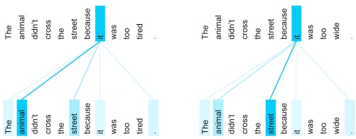

Figure 15.23: Illustration of how encoder self-attention for the word "it" differs depending on the input context. From https://ai.googleblog.com/2017/08/transformer-novel-neural-network.html. Used with kind permission of Jakob Uszkoreit.

where the query is x, and the keys and values are all the (valid) inputs x1, …, xn.

To use this in a decoder, we can set  $\boldsymbol{x}_{i} = \boldsymbol{y}_{i-1}$, and  $n = i - 1$, so all the previously generated outputs are available. At training time, all the outputs are already known, so we can evaluate the above function in parallel, overcoming the sequential bottleneck of using RNNs.

In addition to improved speed, self-attention can give improved representations of context. As an example, consider translating the English sentences “The animal didn’t cross the street because it was too tired” and “The animal didn’t cross the street because it was too wide” into French. To generate a pronoun of the correct gender in French, we need to know what “it” refers to (this is called coreference resolution). In the first case, the word “it” refers to the animal. In the second case, the word “it” now refers to the street.

Figure 15.23 illustrates how self attention applied to the English sentence is able to resolve this ambiguity. In the first sentence, the representation for “it” depends on the earlier representations of “animal”, whereas in the latter, it depends on the earlier representations of “street”.

#### 15.5.2 Multi-headed attention

If we think of an attention matrix as like a kernel matrix (as discussed in Section 15.4.2), it is natural to want to use multiple attention matrices, to capture different notions of similarity. This is the basic idea behind multi-headed attention (MHA). In more detail, given a query  $q \in \mathbb{R}^{d_q}$, keys  $\boldsymbol{k}_j \in \mathbb{R}^{d_k}$, and values  $\boldsymbol{v}_j \in \mathbb{R}^{d_v}$, we define the  $i$th attention head to be

$$
\boldsymbol{h}_{i}=\operatorname{A t t n}(\mathbf{W}_{i}^{(q)}\boldsymbol{q},\{\mathbf{W}_{i}^{(k)}\boldsymbol{k}_{j},\mathbf{W}_{i}^{(v)}\boldsymbol{v}_{j}\})\in\mathbb{R}^{p_{v}}   \tag*{(15.55)}
$$

where  $\mathbf{W}_i^{(q)} \in \mathbb{R}^{p_q \times d_q}$,  $\mathbf{W}_i^{(k)} \in \mathbb{R}^{p_k \times d_k}$, and  $\mathbf{W}_i^{(v)} \in \mathbb{R}^{p_v \times d_v}$ are projection matrices. We then stack the  $h$ heads together, and project to  $\mathbb{R}^{p_o}$ using

$$
\boldsymbol{h}=\mathrm{MHA}(\boldsymbol{q},\{\boldsymbol{k}_{j},\boldsymbol{v}_{j}\})=\boldsymbol{W}_{o}\begin{pmatrix}\boldsymbol{h}_{1}\\ \vdots\\ \boldsymbol{h}_{h}\end{pmatrix}\in\mathbb{R}^{p_{o}}   \tag*{(15.56)}
$$

where  $\boldsymbol{h}_i$ is defined in Equation (15.55), and  $\mathbf{W}_o \in \mathbb{R}^{p_o \times h_{p_v}}$. If we set  $p_q h = p_k h = p_v h = p_o$, we can compute all the output heads in parallel. See multi_head_attention_jax.ipynb for some sample

Author: Kevin P. Murphy. (C) MIT Press. CC-BY-NC-ND license

---

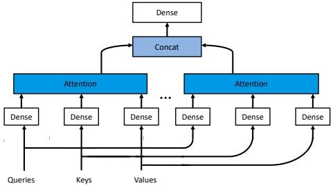

Figure 15.24: Multi-head attention. Adapted from Figure 9.3.3 of [Zha+20].

code.

#### 15.5.3 Positional encoding

The performance of “vanilla” self-attention can be low, since attention is permutation invariant, and hence ignores the input word ordering. To overcome this, we can concatenate the word embeddings with a positional embedding, so that the model knows what order the words occur in.

One way to do this is to represent each position by an integer. However, neural networks cannot natively handle integers. To overcome this, we can encode the integer in binary form. For example, if we assume the sequence length is n = 3, we get the following sequence of d = 3-dimensional bit vectors for each location: 000, 001, 010, 011, 100, 101, 110, 111. We see that the right most index toggles the fastest (has highest frequency), whereas the left most index (most significant bit) toggles the slowest. (We could of course change this, so that the left most bit toggles fastest.) We can represent this as a position matrix  $\mathbf{P} \in \mathbb{R}^{n \times d}$.

We can think of the above representation as using a set of basis functions (corresponding to powers of 2), where the coefficients are 0 or 1. We can obtain a more compact code by using a different set of basis functions, and real-valued weights. [Vas+17] propose to use a sinusoidal basis, as follows:

$$
p_{i,2j}=\sin\left(\frac{i}{C^{2j/d}}\right),p_{i,2j+1}=\cos\left(\frac{i}{C^{2j/d}}\right),   \tag*{(15.57)}
$$

where $C = 10,000$corresponds to some maximum sequence length. For example, if$d = 4$, the $i$'th row is

$$
p_{i}=[\sin(\frac{i}{C^{0/4}}),\cos(\frac{i}{C^{0/4}}),\sin(\frac{i}{C^{2/4}}),\cos(\frac{i}{C^{2/4}})]   \tag*{(15.58)}
$$

Figure 15.25a shows the corresponding position matrix for n = 60 and d = 32. In this case, the left-most columns toggle fastest. We see that each row has a real-valued “fingerprint” representing its location in the sequence. Figure 15.25b shows some of the basis functions (column vectors) for dimensions 6 to 9.

---

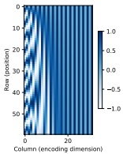

(a)

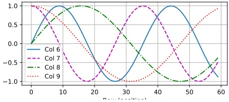

(b)

Figure 15.25: (a) Positional encoding matrix for a sequence of length n = 60 and an embedding dimension of size d = 32. (b) Basis functions for columns 6 to 9. Generated by positional_encoding_jax.ipymb.

The advantage of this representation is two-fold. First, it can be computed for arbitrary length inputs (up to  $T \leq C$), unlike a learned mapping from integers to vectors. Second, the representation of one location is linearly predictable from any other, given knowledge of their relative distance. In particular, we have  $\boldsymbol{p}_{t+\phi} = f(\boldsymbol{p}_t)$, where  $f$ is a linear transformation. To see this, note that

$$
\begin{pmatrix}\sin(\omega_{k}(t+\phi))\\\cos(\omega_{k}(t+\phi))\end{pmatrix}=\begin{pmatrix}\sin(\omega_{k}t)\cos(\omega_{k}\phi)+\cos(\omega_{k}t)\sin(\omega_{k}\phi)\\\cos(\omega_{k}t)\cos(\omega_{k}\phi)-\sin(\omega_{k}t)\sin(\omega_{k}\phi)\end{pmatrix}   \tag*{(15.59)}
$$

 
$$
\left\langle\cos(\omega_{k}(t+\phi))\right\rangle=\left\langle\cos(\omega_{k}t)\cos(\omega_{k}\phi)-\sin(\omega t)\sin(\omega_{k}\phi)\right\rangle
$$
 

$$
\begin{aligned}=\begin{pmatrix}\cos(\omega_{k}\phi)&\sin(\omega_{k}\phi)\\-\sin(\omega_{k}\phi)&\cos(\omega_{k}\phi)\end{pmatrix}\begin{pmatrix}\sin(\omega_{k}t)\\\cos(\omega_{k}t)\end{pmatrix}\end{aligned}   \tag*{(15.60)}
$$

So if  $\phi$ is small, then  $p_{t+\phi} \approx p_{t}$. This provides a useful form of inductive bias.

Once we have computed the positional embeddings  $\mathbf{P}$, we need to combine them with the original word embeddings  $\mathbf{X}$ using the following: $^{5}$

$$
POS(Embed(\mathbf{X}))=\mathbf{X}+\mathbf{P}.   \tag*{(15.61)}
$$

#### 15.5.4 Putting it all together

A transformer is a seq2seq model that uses self-attention for the encoder and decoder rather than an RNN. The encoder uses a series of encoder blocks, each of which uses multi-headed attention (Section 15.5.2), residual connections (Section 13.4.4), feedforward layers (Section 13.2), and layer normalization (Section 14.2.4.2). More precisely, the encoder block can be defined as follows:

def EncoderBlock(X):
    Z = LayerNorm(MultiHeadAttn(Q=X, K=X, V=X) + X)
    E = LayerNorm(FeedForward(Z) + Z)
    return E

---

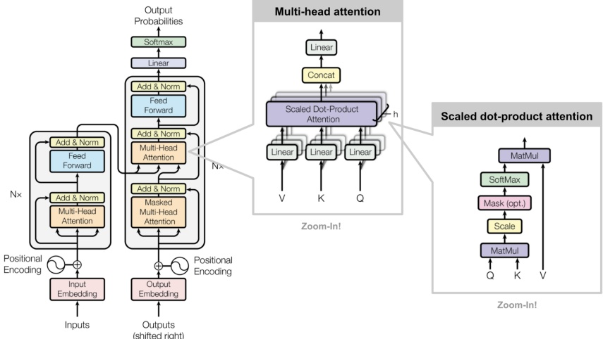

Figure 15.26: The transformer. From [Wen18]. Used with kind permission of Lilian Weng. Adapted from Figures 1–2 of [Vas+17].

Note that the MHA layer combines information across the sequence, and the feedforward layer combines information across the dimensions at each location in parallel. (Most of the parameters of large transformer models are stored inside these MLPs, and it has been conjectured that this is where most of the “world knowledge” lives [Men+22].) The layer norm can either be applied after the module (i.e.,  $z = \text{LN}(\text{module}(\boldsymbol{x}) + \boldsymbol{x}))$ or before (i.e.,  $z = \text{module}(\text{LN}(\boldsymbol{x}) + \boldsymbol{x}))$; these are known as post-norm and pre-norm.

The overall encoder is defined by applying positional encoding to the embedding of the input sequence, following by N copies of the encoder block, where N controls the depth of the block:

def Encoder(X, N):

E = POS(Embed(X))

for n in range(N):

E = EncoderBlock(E)

return E

See the LHS of Figure 15.26 for an illustration.

The decoder has a somewhat more complex structure. It is given access to the encoder via another multi-head attention block. But it is also given access to previously generated outputs: these are shifted, and then combined with a positional embedding, and then fed into a masked (causal) multi-head attention model. Finally the output distribution over tokens at each location is computed

---

<table border=1 style='margin: auto; word-wrap: break-word;'><tr><td style='text-align: center; word-wrap: break-word;'>Layer type</td><td style='text-align: center; word-wrap: break-word;'>Complexity</td><td style='text-align: center; word-wrap: break-word;'>Sequential ops.</td><td style='text-align: center; word-wrap: break-word;'>Max. path length</td></tr><tr><td style='text-align: center; word-wrap: break-word;'>Self-attention</td><td style='text-align: center; word-wrap: break-word;'>$O(n^{2}d)$</td><td style='text-align: center; word-wrap: break-word;'>$O(1)$</td><td style='text-align: center; word-wrap: break-word;'>$O(1)$</td></tr><tr><td style='text-align: center; word-wrap: break-word;'>Recurrent</td><td style='text-align: center; word-wrap: break-word;'>$O(nd^{2})$</td><td style='text-align: center; word-wrap: break-word;'>$O(n)$</td><td style='text-align: center; word-wrap: break-word;'>$O(n)$</td></tr><tr><td style='text-align: center; word-wrap: break-word;'>Convolutional</td><td style='text-align: center; word-wrap: break-word;'>$O(knd^{2})$</td><td style='text-align: center; word-wrap: break-word;'>$O(1)$</td><td style='text-align: center; word-wrap: break-word;'>$O(\log_{k} n)$</td></tr></table>

Table 15.1: Comparison of the transformer with other neural sequential generative models. n is the sequence length, d is the dimensionality of the input features, and k is the kernel size for convolution. Based on Table 1 of [Vas+17].

in parallel.

In more detail, the decoder block is defined as follows:

def DecoderBlock(Y, E):
    Z = LayerNorm(MultiHeadAttn(Q=Y, K=Y, V=Y) + Y)
    Z' = LayerNorm(MultiHeadAttn(Q=Z, K=E, V=E) + Z)
    D = LayerNorm(FeedForward(Z') + Z')
    return D

The overall decoder is defined by N copies of the decoder block:

def Decoder(Y, E, N):
    D = POS(Embed(Y))
    for n in range(N):
        D = DecoderBlock(D, E)
    return D

See the RHS of Figure 15.26 for an illustration.

During training time, all the inputs Y to the decoder are known in advance, since they are derived from embedding the lagged target output sequence. During inference (test) time, we need to decode sequentially, and use masked attention, where we feed the generated output into the embedding layer, and add it to the set of keys/values that can be attended to. (We initialize by feeding in the start-of-sequence token.) See transformers_jax.ipynb for some sample code, and [Rus18; Ala18] for a detailed tutorial on this model.

#### 15.5.5 Comparing transformers, CNNs and RNNs

In Figure 15.27, we visually compare three different architectures for mapping a sequence  $\pmb{x}_{1:n}$ to another sequence  $\pmb{y}_{1:n}$: a 1d CNN, an RNN, and an attention-based model. Each model makes different tradeoffs in terms of speed and expressive power, where the latter can be quantified in terms of the maximum path length between any two inputs. See Table 15.1 for a summary.

For a 1d CNN with kernel size k and d feature channels, the time to compute the output is  $O(knd^{2})$, which can be done in parallel. We need a stack of n/k layers, or  $\log_{k}(n)$ if we use dilated convolution, to ensure all pairs can communicate. For example, in Figure 15.27, we see that  $x_{1}$ and  $x_{5}$ are initially 5 apart, and then 3 apart in layer 1, and then connected in layer 2.

For an RNN, the computational complexity is  $O(nd^{2})$, for a hidden state of size d, since we have to perform matrix-vector multiplication at each step. This is an inherently sequential operation. The maximum path length is  $O(n)$.

Author: Kevin P. Murphy. (C) MIT Press. CC-BY-NC-ND license

---

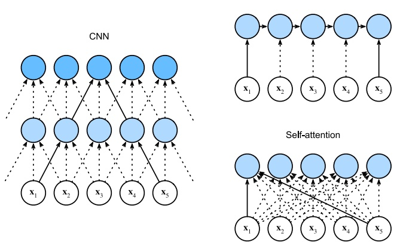

Figure 15.27: Comparison of  $(1d)$ CNNs, RNNs and self-attention models. From Figure 10.6.1 of  $[Zha+20]$. Used with kind permission of Aston Zhang.

Finally, for self-attention models, every output is directly connected to every input, so the maximum path length is  $O(1)$. However, the computational cost is  $O(n^2d)$. For short sequences, we typically have  $n \ll d$, so this is fine. For longer sequences, we discuss various fast versions of attention in Section 15.6.

#### 15.5.6 Transformers for images *

CNNs (Chapter 14) are the most common model type for processing image data, since they have useful built-in inductive bias, such as locality (due to small kernels), equivariance (due to weight tying), and invariance (due to pooling). Suprisingly, it has been found that transformers can also do well at image classification [Rag+21], at least if trained on enough data. (They need a lot of data to overcome their lack of relevant inductive bias.)

The first model of this kind, known as ViT (vision transformer) [Dos+21], chops the input up into 16x16 patches, projects each patch into an embedding space, and then passes this set of embeddings  $x_{1:T}$ to a transformer, analogous to the way word embeddings are passed to a transformer. The input is also prepended with a special [CLASS] embedding,  $x_0$. The output of the transformer is a set of encodings  $e_0:T$; the model maps  $e_0$ to the target class label  $y$, and is trained in a supervised way. See Figure 15.28 for an illustration.

After supervised pretraining, the model is fine-tuned on various downstream classification tasks, an approach known as transfer learning (see Section 19.2 for more details). When trained on “small” datasets such as ImageNet (which has 1k classes and 1.3M images), they find that they cannot outperform a pretrained CNN ResNet model (Section 14.3.4) known as BiT (big transfer) [Kol+20].

---

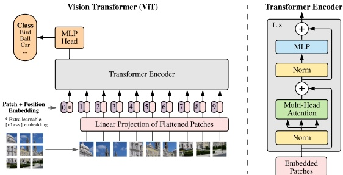

Figure 15.28: The Vision Transformer (ViT) model. This treats an image as a set of input patches. The input is prepended with the special CLASS embedding vector (denoted by *) in location 0. The class label for the image is derived by applying softmax to the final output encoding at location 0. From Figure 1 of [Dos+21]. Used with kind permission of Alexey Dosovitskiy

However, when trained on larger datasets, such as ImageNet-21k (with 21k classes and 14M images), or the Google-internal JFT dataset (with 18k classes and 303M images), they find that ViT does better than BiT at transfer learning. $^{6}$ ViT is also cheaper to train than ResNet at this scale. (However, training is still expensive: the large ViT model on ImageNet-21k takes 30 days on a Google Cloud TPUv3 with 8 cores!)

#### 15.5.7 Other transformer variants  $*$

Many extensions of transformers have been published in the last few years. For example, the Gshard paper [Lep+21] shows how to scale up transformers to even more parameters by replacing some of the feed forward dense layers with a mixture of experts (Section 13.6.2) regression module. This allows for sparse conditional computation, in which only a subset of the model capacity (chosen by the gating network) is used for any given input.

As another example, the conformer paper [Gul+20] showed how to add convolutional layers inside the transformer architecture, which was shown to be helpful for various speech recognition tasks.

### 15.6 Efficient transformers  $*$

This section is written by Krzysztof Choromanski.

Regular transformers take  $O(N^2)$ time and space complexity, for a sequence of length  $N$, which makes them impractical to apply to long sequences. In the past few years, researchers have proposed several more efficient variants of transformers to bypass this difficulty. In this section, we give a

---

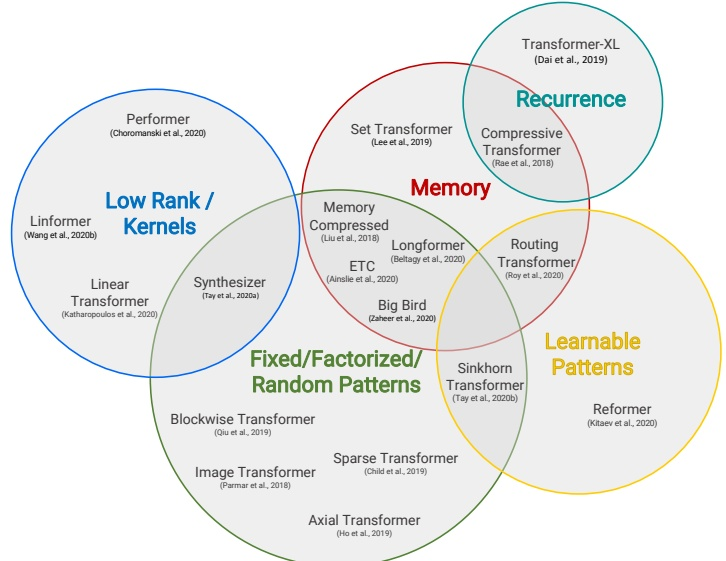

Figure 15.29: Venn diagram presenting the taxonomy of different efficient transformer architectures. From  $[Tay+20b]$. Used with kind permission of Yi Tay.

brief survey of some of these methods (see Figure 15.29 for a summary). For more details, see e.g., [Tay+20b; Tay+20a; Lin+21].

#### 15.6.1 Fixed non-learnable localized attention patterns

The simplest modification of the attention mechanism is to constrain it to a fixed non-learnable localized window, in other words restrict each token to attend only to a pre-selected set of other tokens. If for instance, each sequence is chunked into  $K$ blocks, each of length  $\frac{N}{K}$, and attention is conducted only within a block, then space/time complexity is reduced from  $O(N^2)$ to  $\frac{N^2}{K}$. For  $K \gg 1$ this constitutes substantial overall computational improvements. Such an approach is applied in particular in [Qiu+19b; Par+18]. The attention patterns do not need to be in the form of blocks. Other approaches involve strided / dilated windows, or hybrid patterns, where several fixed attention patterns are combined together [Chi+19b; BPC20].

---

#### 15.6.2 Learnable sparse attention patterns

A natural extension of the above approach is to allow the above compact patterns to be learned. The attention is still restricted to pairs of tokens within a single partition of some partitioning of the set of all the tokens, but now those partitionings are trained. In this class of methods we can distinguish two main approaches: based on hashing and clustering. In the hashing scenario all tokens are hashed and thus different partitions correspond to different hashing-buckets. This is the case for instance for the Reformer architecture [KKL20], where locality sensitive hashing (LSH) is applied. That leads to time complexity  $O(NM^{2}\log(M))$ of the attention module, where M stands for the dimensionality of tokens' embeddings.

Hashing approaches require the set of queries to be identical to the set of keys. Furthermore, the number of hashes needed for precise partitioning (which in the above expression is treated as a constant) can be a large constant. In the clustering approach, tokens are clustered using standard clustering algorithms such as K-means (Section 21.3); this is known as the “clustering transformer” [Roy+20]. As in the block-case, if K equal-size clusters are used then space complexity of the attention module is reduced to  $O(\frac{N^2}{K})$. In practice K is often taken to be of order  $K = \Theta(\sqrt{N})$, yet imposing that the clusters be similar in size is in practice difficult.

#### 15.6.3 Memory and recurrence methods

In some approaches, a side memory module can access several tokens simultaneously. This method is often instantiated in the form of a global memory algorithm as used in  $[Lee+19; Zah+20]$.

Another approach is to connect different local blocks via recurrence. A flagship example of this approach is the class of Transformer-XL methods  $[Dai+19]$.

#### 15.6.4 Low-rank and kernel methods

In this section, we discuss methods that approximate attention using low rank matrices. In [She+18; Kat+20] they approximate the attention matrix A directly by a low rank matrix, so that

 
$$
A_{i j}=\phi(\boldsymbol{q}_{i})^{\top}\phi(\boldsymbol{k}_{j})
$$
 

where  $\phi(\boldsymbol{x}) \in \mathbb{R}^M$ is some finite-dimensional vector with  $M < D$. One can leverage this structure to compute  $\mathbf{A}\mathbf{V}$ in  $O(N)$ time. Unfortunately, for softmax attention, the  $\mathbf{A}$ is not low rank.

In Linformer [Wan+20a], they instead transform the keys and values via random Gaussian projections. They then apply the theory of the Johnson-Lindenstrauss Transform [AL13] to approximate softmax attention in this lower dimensional space.

In Performer [Cho+20a; Cho+20b], they show that the attention matrix can be computed using a (positive definite) kernel function. We define kernel functions in Section 17.1, but the basic idea is that  $\mathcal{K}(q, k) \geq 0$ is some measure of similarity between  $q \in \mathbb{R}^D$ and  $k \in \mathbb{R}^D$. For example, the Gaussian kernel, also called the radial basis function kernel, has the form

 
$$
\mathcal{K}_{\mathrm{gauss}}(\boldsymbol{q},\boldsymbol{k})=\exp\left(-\frac{1}{2\sigma^{2}}||\boldsymbol{q}-\boldsymbol{k}||_{2}^{2}\right)
$$
 

To see how this can be used to compute an attention matrix, note that [Cho+20a] show the following:

Author: Kevin P. Murphy. (C) MIT Press. CC-BY-NC-ND license

---

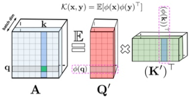

Figure 15.30: Attention matrix  $\mathbf{A}$ rewritten as a product of two lower rank matrices  $\mathbf{Q}'$ and  $(\mathbf{K}')^\top$ with random feature maps  $\phi(\mathbf{q}_i) \in \mathbb{R}^M$ and  $\phi(\mathbf{v}_k) \in \mathbb{R}^M$ for the corresponding queries/keys stored in the rows/columns. Used with kind permission of Krzysztof Choromanski.

$$
A_{i,j}=\exp(\frac{\boldsymbol{q}_{i}^{\top}\boldsymbol{k}_{j}}{\sqrt{D}})=\exp(\frac{-\|\boldsymbol{q}_{i}-\boldsymbol{k}_{j}\|_{2}^{2}}{2\sqrt{D}})\times\exp(\frac{\|\boldsymbol{q}_{i}\|_{2}^{2}}{2\sqrt{D}})\times\exp(\frac{\|\boldsymbol{k}_{j}\|_{2}^{2}}{2\sqrt{D}}).   \tag*{(15.64)}
$$

The first term in the above expression is equal to  $\mathcal{K}_{\mathrm{gauss}}(\boldsymbol{q}_i D^{-1/4}, \boldsymbol{k}_j D^{-1/4})$ with  $\sigma = 1$, and the other two terms are just independent scaling factors.

So far we have not gained anything computationally. However, we will show in Section 17.2.9.3 that the Gaussian kernel can be written as the expectation of a set of random features:

$$
\mathcal{K}_{\mathrm{g a u s s}}(\boldsymbol{x},\boldsymbol{y})=\mathbb{E}\left[\boldsymbol{\eta}(\boldsymbol{x})^{\top}\boldsymbol{\eta}(\boldsymbol{y})\right]   \tag*{(15.65)}
$$

where  $\eta(\boldsymbol{x}) \in \mathbb{R}^M$ is a random feature vector derived from  $\boldsymbol{x}$, either based on trigonometric functions Equation (17.60) or exponential functions Equation (17.61). (The latter has the advantage that all the features are positive, which gives much better results [Cho+20b].) Therefore for the regular softmax attention,  $A_{i,j}$ can be rewritten as

$$
A_{i,j}=\mathbb{E}[\phi(\boldsymbol{q}_{i})^{\top}\phi(\boldsymbol{k}_{j})]   \tag*{(15.66)}
$$

where  $\phi$ is defined as:

$$
\phi(\boldsymbol{x})\triangleq\exp\left(\frac{\|\boldsymbol{x}\|_{2}^{2}}{2\sqrt{D}}\right)\eta\left(\frac{\boldsymbol{x}}{D^{\frac{1}{4}}}\right).   \tag*{(15.67)}
$$

We can write the full attention matrix as follows

$$
\mathbf{A}=\mathbb{E}[\mathbf{Q}^{\prime}(\mathbf{K}^{\prime})^{\mathsf{T}}]   \tag*{(15.68)}
$$

where  $\mathbf{Q}', \mathbf{K}' \in \mathbb{R}^{N \times M}$ have rows encoding random feature maps corresponding to the queries and keys. (Note that we can get better performance if we ensure these random features are orthogonal, see [Cho+20a] for the details.) See Figure 15.30 for an illustration.

---

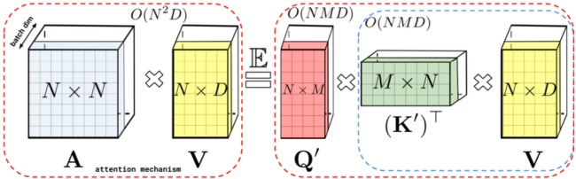

Figure 15.31: Decomposition of the attention matrix A can be leveraged to improve attention computations via matrix associativity property. To compute AV, we first calculate  $\mathbf{G} = (\mathbf{k}')^\top \mathbf{V}$ and then  $\mathbf{q}'\mathbf{G}$, resulting in linear in N space and time complexity. Used with kind permission of Krzysztof Choromanski.

We can create an approximation to  $\mathbf{A}$ by using a single sample of the random features  $\phi(\boldsymbol{q}_i)$ and  $\phi(\boldsymbol{k}_j)$, and using a small value of  $M$, say  $M = O(D \log(D))$. We can then approximate the entire attention operator in  $O(N)$ time using

$$
\widehat{\mathrm{attention}}(\mathbf{Q},\mathbf{K},\mathbf{V})=\mathrm{diag}^{-1}(\mathbf{Q}^{\prime}((\mathbf{K}^{\prime})^{\top}\mathbf{1}_{N}))(\mathbf{Q}^{\prime}((\mathbf{K}^{\prime})^{\top}\mathbf{V}))   \tag*{(15.69)}
$$

This can be shown to be an unbiased approximation to the exact softmax attention operator. See Figure 15.31 for an illustration. (For details on how to generalize this to masked (causal) attention, see [Cho+20a].)

### 15.7 Language models and unsupervised representation learning

We have discussed how RNNs and autoregressive (decoder-only) transformers can be used as language models, which are generative sequence models of the form  $p(x_1, \ldots, x_T) = \prod_{t=1}^T p(x_t | \boldsymbol{x}_{1:t-1})$, where each  $x_t$ is a discrete token, such as a word or wordpiece. (See Section 1.5.4 for a discussion of text preprocessing methods.) The latent state of these models can then be used as a continuous vector representation of the text. That is, instead of using the one-hot vector  $\boldsymbol{x}_t$, or a learned embedding of it (such as those discussed in Section 20.5), we use the hidden state  $\boldsymbol{h}_t$, which depends on all the previous words in the sentence. These vectors can then be used as contextual word embeddings, for purposes such as text classification or seq2seq tasks (see e.g. [LKB20] for a review). The advantage of this approach is that we can pre-train the language model in an unsupervised way, on a large corpus of text, and then we can fine-tune the model in a supervised way on a small labeled task-specific dataset. (This general approach is called transfer learning, see Section 19.2 for details.)

If our primary goal is to compute useful representations for transfer learning, as opposed to generating text, we can replace the generative sequence model with non-causal models that can compute a representation of a sentence, but cannot generate it. These models have the advantage that now the hidden state  $\pmb{h}_{t}$ can depend on the past,  $\pmb{y}_{1:t-1}$, present  $\pmb{y}_{t}$, and future,  $\pmb{y}_{t+1:T}$. This can sometimes result in better representations, since it takes into account more context.

In the sections below, we briefly discuss some unsupervised models for representation learning on text, using both causal and non-causal models.

Author: Kevin P. Murphy. (C) MIT Press. CC-BY-NC-ND license

---

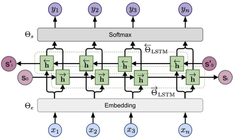

Figure 15.32: Illustration of ELMo bidirectional language model. Here  $y_t = x_{t+1}$ when acting as the target for the forwards LSTM, and  $y_t = x_{t-1}$ for the backwards LSTM. (We add bos and eos sentinels to handle the edge cases.) From [Wen19]. Used with kind permission of Lilian Weng.

#### 15.7.1 ELMo

In  $[\text{Pet}+18]$, they present a method called  $\text{ELMo}$, which is short for “Embeddings from Language Model”. The basic idea is to fit two RNN language models, one left-to-right, and one right-to-left, and then to combine their hidden state representations to come up with an embedding for each word. Unlike a biRNN (Section 15.2.2), which needs an input-output pair,  $\text{ELMo}$ is trained in an unsupervised way, to minimize the negative log likelihood of the input sentence  $\mathbf{x}_{1:T}$:

$$
\mathcal{L}(\boldsymbol{\theta})=-\sum_{t=1}^{T}[\log p(x_{t}|\boldsymbol{x}_{1:t-1};\boldsymbol{\theta}_{e},\boldsymbol{\theta}^{\rightarrow},\boldsymbol{\theta}_{s})+\log p(x_{t}|\boldsymbol{x}_{t+1:T};\boldsymbol{\theta}_{e},\boldsymbol{\theta}^{\leftarrow},\boldsymbol{\theta}_{s})]   \tag*{(15.70)}
$$

where  $\theta_e$ are the shared parameters of the embedding layer,  $\theta_s$ are the shared parameters of the softmax output layer, and  $\theta^\leftarrow$ and  $\theta^\leftarrow$ are the parameters of the two RNN models. (They use LSTM RNNs, described in Section 15.2.7.2.) See Figure 15.32 for an illustration.

After training, we define the contextual representation  $r_t = [e_t, h_{t:L}^-, h_{t:L}^-,]$, where  $L$ is the number of layers in the LSTM. We then learn a task-specific set of linear weights to map this to the final context-specific embedding of each token:  $r_t^j = r_t^T w^j$, where  $j$ is the task id. If we are performing a syntactic task like part-of-speech (POS) tagging (i.e., labeling each word as a noun, verb, adjective, etc), then the task will learn to put more weight on lower layers. If we are performing a semantic task like word sense disambiguation (WSD), then the task will learn to put more weight on higher layers. In both cases, we only need a small amount of task-specific labeled data, since we are just learning a single weight vector, to map from  $r_{1:T}$ to the target labels  $\mathbf{y}_{1:T}$.

#### 15.7.2 BERT

In this section, we describe the BERT model (Bidirectional Encoder Representations from Transformers) of [Dev+19]. Like ELMo, this is a non-causal model, that can be used to create representations of text, but not to generate text. In particular, it uses a transformer model to map a modified version

---

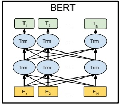

 $(a)$

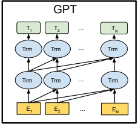

(b)

Figure 15.33: Illustration of (a)  $BERT$ and (b)  $GPT$.  $E_{t}$ is the embedding vector for the input token at location t, and  $T_{t}$ is the output target to be predicted. From Figure 3 of [Dev+19]. Used with kind permission of Ming-Wei Chang.

of a sequence back to the unmodified form. The modified input at location t omits all words except for the  $t'$th, and the task is to predict the missing word. This is called the fill-in-the-blank or cloze task.

##### 15.7.2.1 Masked language model task

More precisely, the model is trained to minimize the negative log pseudo-likelihood:

$$
\mathcal{L}=\mathbb{E}_{x\sim\mathcal{D}}\mathbb{E}_{m}\sum_{i\in m}-\log p(x_{i}|\boldsymbol{x}_{-m})   \tag*{(15.71)}
$$

where m is a random binary mask. For example, if we train the model on transcripts from cooking videos, we might create a training sentence of the form

Let's make [MASK] chicken! [SEP] It [MASK] great with orange sauce.

where [SEP] is a separator token inserted between two sentences. The desired target labels for the masked words are “some” and “tastes”. (This example is from [Sun+19a].)

The conditional probability is given by applying a softmax to the final layer hidden vector at location i:

$$
p(x_{i}|\hat{\boldsymbol{x}})=\frac{\exp(\boldsymbol{h}(\hat{\boldsymbol{x}})_{i}^{\top}\boldsymbol{e}(x_{i}))}{\sum_{x^{\prime}}\exp(\boldsymbol{h}(\hat{\boldsymbol{x}})_{i}^{\top}\boldsymbol{e}(x^{\prime}))}   \tag*{(15.72)}
$$

where  $\hat{x} = x_{-m}$ is the masked input sentence, and  $e(x)$ is the embedding for token  $x$. This is used to compute the loss at the masked locations; this is therefore called a masked language model. (This is similar to a denoising autoencoder, Section 20.3.2). See Figure 15.33a for an illustration of the model.

##### 15.7.2.2 Next sentence prediction task

In addition to the masked language model objective, the original BERT paper added an additional objective, in which the model is trained to classify if one sentence follows another. More precisely,

Author: Kevin P. Murphy. (C) MIT Press. CC-BY-NC-ND license

---

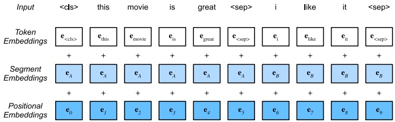

Figure 15.34: Illustration of how a pair of input sequences, denoted A and B, are encoded before feeding to BERT. From Figure 14.8.2 of  $[Zha+20]$. Used with kind permission of Aston Zhang.

the model is fed as input

$$
CLS A_{1}A_{2};\cdots A_{m};SEP B_{1}B_{2};\cdots;B_{n}SEP   \tag*{(15.73)}
$$

where SEP is a special separator token, and CLS is a special token marking the class. If sentence B follows A in the original text, we set the target label to y = 1, but if B is a randomly chosen sentence, we set the target label to y = 0. This is called the next sentence prediction task. This kind of pre-training can be useful for sentence-pair classification tasks, such as textual entailment or textual similarity, which we discussed in Section 15.4.6. (Note that this kind of pre-training is considered unsupervised, or self-supervised, since the target labels are automatically generated.)

When performing next sentence prediction, the input to the model is specified using 3 different embeddings: one per token, one for each segment label (sentence A or B), and one per location (using a learned positional embedding). These are then added. See Figure 15.34 for an illustration. BERT then uses a transformer encoder to learn a mapping from this input embedding sequence to an output embedding sequence, which gets decoded into word labels (for the masked locations) or a class label (for the CLS location).

##### 15.7.2.3 Fine-tuning BERT for NLP applications

After pre-training BERT in an unsupervised way, we can use it for various downstream tasks by performing supervised fine-tuning. (See Section 19.2 for more background on such transfer learning methods.) Figure 15.35 illustrates how we can modify a BERT model to perform different tasks, by simply adding one or more new output heads to the final hidden layer. See bert_jax.ipynb for some sample code.

In Figure 15.35(a), we show how we can tackle single sentence classification (e.g., sentiment analysis): we simply take the feature vector associated with the dummy CLS token and feed it into an MLP. Since each output attends to all inputs, this hidden vector will summarize the entire sentence. The MLP then learns to map this to the desired label space.

In Figure 15.35(b), we show how we can tackle sentence-pair classification (e.g., textual entailment, as discussed in Section 15.4.6): we just feed in the two input sentences, formatted as in Equation (15.73), and then classify the CLS token.

In Figure 15.35(c), we show how we can tackle single sentence tagging, in which we associate a

---

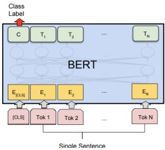

 $(a)$

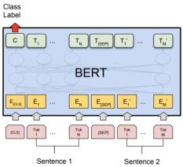

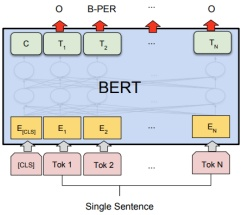

(b)

(c)

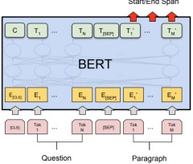

(d)

Figure 15.35: Illustration of how BERT can be used for different kinds of supervised NLP tasks. (a) Single sentence classification (e.g., sentiment analysis); (b) Sentence-pair classification (e.g., textual entailment); (c) Single sentence tagging (e.g., shallow parsing); (d) Question answering. From Figure 4 of [Dev+19]. Used with kind permission of Ming-Wei Chang.

label or tag with each word, instead of just the entire sentence. A common application of this is part of speech tagging, in which we annotate each words a noun, verb, adjective, etc. Another application of this is noun phrase chunking, also called shallow parsing, in which we must annotate the span of each noun phrase. The span is encoded using the BIO notation, in which B is the beginning of an entity, I-x is for inside, and O is for outside any entity. For example, consider the following sentence:

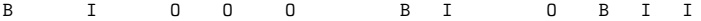

##### British Airways rose after announcing its withdrawal from the UAI deal

We see that there are 3 noun phrases, “British Airways”, “its withdrawal” and “the UAI deal”. (We require that the B, I and O labels occur in order, so this a prior constraint that can be included in the model.)

We can also associate types with each noun phrase, for example distinguishing person, location, organization, and other. Thus the label space becomes {B-Per, I-Per, B-Loc, I-Loc, B-Org, I-Org, Outside}. This is called named entity recognition, and is a key step in information extraction. For example, consider the following sentence:

##### BP IP 0 0 0 BL IL BP 0 0 0 0

Mrs Green spoke today in New York. Green chairs the finance committee.

Author: Kevin P. Murphy. (C) MIT Press. CC-BY-NC-ND license

---

From this, we infer that the first sentence has two named entities, namely “Mrs Green” (of type Person) and “New York” (of type Location). The second sentence mentions another person, “Green”, that most likely is the same as the first person, although this across-sentence entity resolution is not part of the basic NER task.

Finally, in Figure 15.35(d), we show how we can tackle question answering. Here the first input sentence is the question, the second is the background text, and the output is required to specify the start and end locations of the relevant part of the background that contains the answer (see Table 1.4). The start location s and end location e are computed by applying 2 different MLPs to a pooled version of the output encodings for the background text; the output of the MLPs is a softmax over all locations. At test time, we can extract the span  $(i,j)$ which maximizes the sum of scores  $s_i + e_j$ for  $i \leq j$.

BERT achieves state-of-the-art performance on many NLP tasks. Interestingly, [TDP19] shows that BERT implicitly rediscovers the standard NLP pipeline, in which different layers perform tasks such as part of speech (POS) tagging, parsing, named entity relationship (NER) detection, semantic role labeling (SRL), coreference resolution, etc. More details on NLP can be found in [JM20].

#### 15.7.3 GPT

In [Rad+18], they propose a model called GPT, which is short for “Generative Pre-training Transformer”. This is a causal (generative) model, that uses a masked transformer as the decoder. See Figure 15.33b for an illustration.

In the original GPT paper, they jointly optimize on a large unlabeled dataset, and a small labeled dataset. In the classification setting, the loss is given by  $\mathcal{L} = \mathcal{L}_{\mathrm{cls}} + \lambda \mathcal{L}_{\mathrm{LM}}$, where  $\mathcal{L}_{\mathrm{cls}} = -\sum_{(\boldsymbol{x}, y) \in \mathcal{D}_L} \log p(y|\boldsymbol{x})$ is the classification loss on the labeled data, and  $\mathcal{L}_{\mathrm{LM}} = -\sum_{\boldsymbol{x} \in \mathcal{D}_U} \sum_t \log p(x_t | \boldsymbol{x}_{1:t-1})$ is the language modeling loss on the unlabeled data.

In  $[\text{Rad}+19]$, they propose GPT-2, which is a larger version of GPT, trained on a large web corpus called WebText. They also eliminate any task-specific training, and instead just train it as a language model. The GPT-3  $[\text{Bro}+20]$ and GPT-4  $[\text{Ope23}]$ models are even larger version of GPT-2, but based on the same principles. More recently, OpenAI released ChatGPT  $[\text{Ope}]$, which is an improved version of GPT-3 which has been trained to have interactive dialogs by using a technique called reinforcement learning from human feedback or RLHF, a technique first introduced in the InstructGPT paper  $[\text{Ouy}+22]$. This uses reinforcement learning techniques to fine tune the model so that it generates responses that are more “aligned” with human intent, as estimated by a ranking model, which is pre-trained on supervised data.

##### 15.7.3.1 Applications of GPT

GPT can generate text given an initial input prompt. The prompt can specify a task; if the generated response fulfills the task “out of the box”, we say the model is performing zero-shot task transfer (see Section 19.6 for details). For example, to perform abstractive summarization of some input text  $x_{1:T}$ (as opposed to extractive summarization, which just selects a subset of the input words), we sample from  $p(\mathbf{x}_{T+1:T+100}|\mathbf{x}_{1:T};\mathrm{TL};\mathrm{DR})$, where  $\mathrm{TL};\mathrm{DR}$ is a special token added to the end of the input text, which tells the system the user wants a summary. TL;DR stands for “too long; didn’t read” and frequently occurs in webtext followed by a human-created summary. By adding this token to the input, the user hopes to “trigger” the transformer decoder into a state in

---

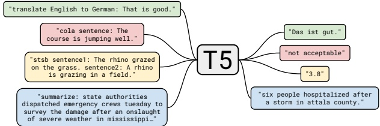

Figure 15.36: Illustration of how the T5 model (“Text-to-text Transfer Transformer”) can be used to perform multiple NLP tasks, such as translating English to German; determining if a sentence is linguistic valid or not (CoLA stands for “Corpus of Linguistic Acceptability”); determining the degree of semantic similarity (STSB stands for “Semantic Textual Similarity Benchmark”); and abstractive summarization. From Figure 1 of [Raf+20]. Used with kind permission of Colin Raffel.

which it enters summarization mode. (This is an example of “prompt engineering”.) However, an arguably better way to tell the model what task to perform is to train it on input-output pairs, as discussed in Section 15.7.4.

GPT can also be used to create chatbots, such as ChatGPT [Ope], and for code generation (see e.g., [HBK23]).

#### 15.7.4 T5

Many models are trained in an unsupervised way, and then fine-tuned on specific tasks. It is also possible to train a single model to perform multiple tasks, by telling the system what task to perform as part of the input sentence, and then training it as a seq2seq model, as illustrated in Figure 15.36. This is the approach used in T5 [Raf+20], which stands for “Text-to-text Transfer Transformer”. The model is a standard seq2seq transformer, that is pretrained on unsupervised  $(x', x'')$ pairs, where  $x'$ is a masked version of  $x$ and  $x''$ are the missing tokens that need to be predicted, and then fine-tuned on multiple supervised  $(x, y)$ pairs.

The unsupervised data comes from C4, or the “Colossal Clean Crawled Corpus”, a 750GB corpus of web text. This is used for pretraining using a BERT-like denoising objective. For example, the sentence x = “Thank you for inviting me to your party last week” may get converted to the input x′ = “Thank you <X> me to your party <Y> week” and the output (target) x′′ = “<X> for inviting <Y> last <EOS>”, where <X> and <Y> are tokens that are unique to this example.

The supervised datasets are manually created, and are taken from the literature. Recently the FLAN-T5 model [Chu+22] was released, which uses instruction fine-tuning on over 1800 such tasks, including language translation, text classification, and question answering. The resulting model is currently the state-of-the-art on many NLP tasks.

#### 15.7.5 Discussion

Large language models or LLMs, such as BERT and GPT-3, have recently generated a lot of

Author: Kevin P. Murphy. (C) MIT Press. CC-BY-NC-ND license

---

interest, and have even made their way into the mainstream media. $^{7}$ However, there is some doubt about whether such systems “understand” language in any meaningful way, beyond just rearranging word patterns seen in their massive training sets. For example, [NK19] show that the ability of BERT to perform almost as well as humans on the Argument Reasoning Comprehension Task is “entirely accounted for by exploitation of spurious statistical cues in the dataset”. By slightly tweaking the dataset, performance can be reduced to chance levels. For other criticisms of such models, see e.g., [BK20; Mar20; Dzi+23; Mah+23].

---

PART IV

Nonparametric Models

---

---

# 16 Exemplar-based Methods

So far in this book, we have mostly focused on parametric models, either unconditional  $p(\boldsymbol{y}|\boldsymbol{\theta})$ or conditional  $p(\boldsymbol{y}|\boldsymbol{x},\boldsymbol{\theta})$, where  $\boldsymbol{\theta}$ is a fixed-dimensional vector of parameters. The parameters are estimated from a variable-sized dataset,  $\mathcal{D}=\{(\boldsymbol{x}_{n},\boldsymbol{y}_{n}):n=1:N\}$, but after model fitting, the data is thrown away.

In this section we consider various kinds of nonparametric models, that keep the training data around. Thus the effective number of parameters of the model can grow with  $|\mathcal{D}|$. We focus on models that can be defined in terms of the similarity between a test input, x, and each of the training inputs,  $x_n$. Alternatively, we can define the models in terms of a dissimilarity or distance function  $d(\mathbf{x}, \mathbf{x}_n)$. Since the models keep the training examples around at test time, we call them exemplar-based models. (This approach is also called instance-based learning [AKA91], or memory-based learning.)

### 16.1 K nearest neighbor (KNN) classification

In this section, we discuss one of the simplest kind of classifier, known as the K nearest neighbor (KNN) classifier. The idea is as follows: to classify a new input x, we find the K closest examples to x in the training set, denoted  $N_K(\boldsymbol{x}, \mathcal{D})$, and then look at their labels, to derive a distribution over the outputs for the local region around x. More precisely, we compute

$$
p(y=c|\boldsymbol{x},\mathcal{D})=\frac{1}{K}\sum_{n\in N_{K}(\boldsymbol{x},\mathcal{D})}\mathbb{I}(y_{n}=c)   \tag*{(16.1)}
$$

We can then return this distribution, or the majority label.

The two main parameters in the model are the size of the neighborhood, K, and the distance metric  $d(\boldsymbol{x}, \boldsymbol{x}')$. For the latter, it is common to use the Mahalanobis distance

$$
d_{\mathbf{M}}(\boldsymbol{x},\boldsymbol{\mu})=\sqrt{(\boldsymbol{x}-\boldsymbol{\mu})^{\mathsf{T}}\mathbf{M}(\boldsymbol{x}-\boldsymbol{\mu})}   \tag*{(16.2)}
$$

where M is a positive definite matrix. If  $\mathbf{M} = \mathbf{I}$, this reduces to Euclidean distance. We discuss how to learn the distance metric in Section 16.2.

Despite the simplicity of KNN classifiers, it can be shown that this approach gets within a factor of 2 of the Bayes error (which measures the performance of the best possible classifier) as  $N \to \infty$ [CH67; CD14]. (Of course the convergence rate to this optimal performance may be poor in practice, for reasons we discuss in Section 16.1.2.)

---

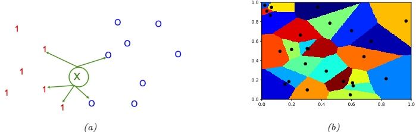

(b)

Figure 16.1: (a) Illustration of a K-nearest neighbors classifier in 2d for K = 5. The nearest neighbors of test point x have labels  $\{1,1,1,0,0\}$, so we predict  $p(y = 1|\boldsymbol{x},\mathcal{D}) = 3/5$. (b) Illustration of the Voronoi tessellation induced by 1-NN. Adapted from Figure 4.13 of [DHS01]. Generated by knn_voronoi_plot.ipynb.

#### 16.1.1 Example

We illustrate the KNN classifier in 2d in Figure 16.1(a) for $K = 5$. The test point is marked as an “x”. 3 of the 5 nearest neighbors have label 1, and 2 of the 5 have label 0. Hence we predict $p(y = 1|\boldsymbol{x},\mathcal{D}) = 3/5 = 0.6$.

If we use $K = 1$, we just return the label of the nearest neighbor, so the predictive distribution becomes a delta function. A KNN classifier with $K = 1$induces a Voronoi tessellation of the points (see Figure 16.1(b)). This is a partition of space which associates a region$V(\boldsymbol{x}_n)$with each point$\boldsymbol{x}_n$in such a way that all points in$V(\boldsymbol{x}_n)$are closer to$\boldsymbol{x}_n$than to any other point. Within each cell, the predicted label is the label of the corresponding training point. Thus the training error will be 0 when$K = 1$. However, such a model is usually overfitting the training set, as we show below.

Figure 16.2 gives an example of KNN applied to a 2d dataset, in which we have three classes. We see how, with K = 1, the method makes zero errors on the training set. As K increases, the decision boundaries become smoother (since we are averaging over larger neighborhoods), so the training error increases, as we start to underfit. This is shown in Figure 16.2(d). The test error shows the usual U-shaped curve.

#### 16.1.2 The curse of dimensionality

The main statistical problem with KNN classifiers is that they do not work well with high dimensional inputs, due to the curse of dimensionality.

The basic problem is that the volume of space grows exponentially fast with dimension, so you might have to look quite far away in space to find your nearest neighbor. To make this more precise, consider this example from [HTF09, p22]. Suppose we apply a KNN classifier to data where the inputs are uniformly distributed in the D-dimensional unit cube. Suppose we estimate the density of class labels around a test point x by “growing” a hyper-cube around x until it contains a desired fraction p of the data points. The expected edge length of this cube will be  $e_D(s) \triangleq p^{1/D}$; this function is plotted in Figure 16.3(b). If  $D = 10$, and we want to base our estimate on 10% of the

---

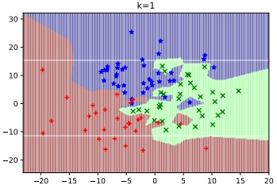

 $(a)$

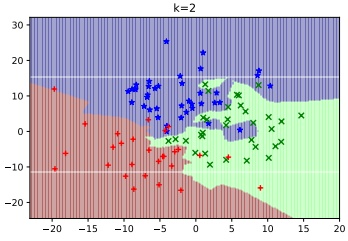

(b)

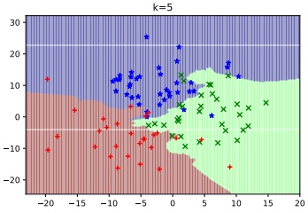

(c)

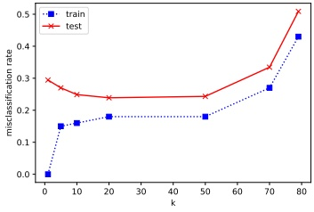

(d)

Figure 16.2: Decision boundaries induced by a KNN classifier. (a) K = 1. (b) K = 2. (c) K = 5. (d) Train and test error vs K. Generated by knn_classify_demo.ipynb.

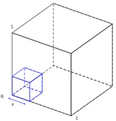

 $(a)$

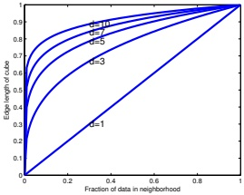

(b)

Figure 16.3: Illustration of the curse of dimensionality. (a) We embed a small cube of side s inside a larger unit cube. (b) We plot the edge length of a cube needed to cover a given volume of the unit cube as a function of the number of dimensions. Adapted from Figure 2.6 from [HTF09]. Generated by curse_dimensionality_plot.ipynb.

---

data, we have  $e_{10}(0.1) = 0.8$, so we need to extend the cube 80% along each dimension around x. Even if we only use 1% of the data, we find  $e_{10}(0.01) = 0.63$. Since the range of the data is only 0 to 1 along each dimension, we see that the method is no longer very local, despite the name “nearest neighbor”. The trouble with looking at neighbors that are so far away is that they may not be good predictors about the behavior of the function at a given point.

There are two main solutions to the curse: make some assumptions about the form of the function (i.e., use a parametric model), and/or use a metric that only cares about a subset of the dimensions (see Section 16.2).

#### 16.1.3 Reducing the speed and memory requirements

KNN classifiers store all the training data. This is obviously very wasteful of space. Various heuristic pruning techniques have been proposed to remove points that do not affect the decision boundaries, see e.g., [WM00]. In Section 17.4, we discuss a more principled approach based on a sparsity promoting prior; the resulting method is called a sparse kernel machine, and only keeps a subset of the most useful exemplars.

In terms of running time, the challenge is to find the  $K$ nearest neighbors in less than  $O(N)$ time, where  $N$ is the size of the training set. Finding exact nearest neighbors is computationally intractable when the dimensionality of the space goes above about 10 dimensions, so most methods focus on finding the approximate nearest neighbors. There are two main classes of techniques, based on partitioning space into regions, or using hashing.

For partitioning methods, one can either use some kind of k-d tree, which divides space into axis-parallel regions, or some kind of clustering method, which uses anchor points. For hashing methods, locality sensitive hashing (LSH) [GIM99] is widely used, although more recent methods learn the hashing function from data (see e.g., [Wan+15]). See [LRU14] for a good introduction to hashing methods.

An open-source library called FAISS, for efficient exact and approximate nearest neighbor search (and K-means clustering) of dense vectors, is available at https://github.com/facebookresearch/faiss, and described in [JDJ17].

#### 16.1.4 Open set recognition

Ask not what this is called, ask what this is like. — Moshe Bar.[Bar09]

In all of the classification problems we have considered so far, we have assumed that the set of classes C is fixed. (This is an example of the closed world assumption, which assumes there is a fixed number of (types of) things.) However, many real world problems involve test samples that come from new categories. This is called open set recognition, as we discuss below.

##### 16.1.4.1 Online learning, OOD detection and open set recognition

For example, suppose we train a face recognition system to predict the identity of a person from a fixed set or  $\mathbf{gallery}$ of face images. Let  $\mathcal{D}_t = \{(\mathbf{x}_n, y_n) : \mathbf{x}_n \in \mathcal{X}, y_n \in \mathcal{C}_t, n = 1 : N_t\}$ be the labeled dataset at time  $t$, where  $\mathcal{X}$ is the set of (face) images, and  $\mathcal{C}_t = \{1, \ldots, C_t\}$ is the set of people known to the system at time  $t$ (where  $C_t \leq t$). At test time, the system may encounter a new person that it has not seen before. Let  $\mathbf{x}_{t+1}$ be this new image, and  $y_{t+1} = C_{t+1}$ be its new label. The system

---

needs to recognize that the input is from a new category, and not accidentally classify it with a label from  $C_t$. This is called novelty detection. In this case, the input is being generated from the distribution  $p(\boldsymbol{x}|y = C_{t+1})$, where  $C_{t+1} \notin C_t$ is the new “class label”. Detecting that  $\boldsymbol{x}_{t+1}$ is from a novel class may be hard if the appearance of this new image is similar to the appearance of any of the existing images in  $D_t$.

If the system is successful at detecting that  $\boldsymbol{x}_{t+1}$ is novel, then it may ask for the id of this new instance, call it  $C_{t+1}$. It can then add the labeled pair  $(\boldsymbol{x}_{t+1}, C_{t+1})$ to the dataset to create  $\mathcal{D}_{t+1}$, and can grow the set of unique classes by adding  $C_{t+1}$ to  $\mathcal{C}_t$ (c.f., [JK13]). This is called incremental learning, online learning, life-long learning, or continual learning. At future time points, the system may encounter an image sampled from  $p(\boldsymbol{x}|y=c)$, where  $c$ is an existing class, or where  $c$ is a new class, or the image may be sampled from some entirely different kind of distribution  $p'(\boldsymbol{x})$ unrelated to faces (e.g., someone uploads a photo of their dog). (Detecting this latter kind of event is called out-of-distribution or OOD detection.)

In this online setting, we often only get a few (sometimes just one) example of each class. Prediction in this setting is known as few-shot classification, and is discussed in more detail in Section 19.6. KNN classifiers are well-suited to this task. For example, we can just store all the instances of each class in a gallery of examples, as we explained above. At time  $t+1$, when we get input  $x_{t+1}$, rather than predicting a label for  $x_{t+1}$ by comparing it to some parametric model for each class, we just find the example in the gallery that is nearest (most similar) to  $x_{t+1}$, call it  $x'$. We then need to determine if  $x'$ and  $x_{t+1}$ are sufficiently similar to constitute a match. (In the context of person classification, this is known as person re-identification or face verification, see e.g., [WSH16]). If there is no match, we can declare the input to be novel or OOD.

The key ingredient for all of the above problems is the (dis)similarity metric between inputs. We discuss ways to learn this in Section 16.2.

##### 16.1.4.2 Other open world problems

The problem of open-set recognition, and incremental learning, are just examples of problems that require the open world assumption c.f., [Rus15]. There are many other examples of such problems.

For example, consider the problem of  $\underline{\text{entity resolution}}$, called  $\underline{\text{entity linking}}$. In this problem, we need to determine if different strings (e.g., "John Smith" and "Jon Smith") refer to the same entity or not. See e.g. [SHF15] for details.

Another important application is in multi-object tracking. For example, when a radar system detects a new “blip”, is it due to an existing missile that is being tracked, or is it a new objective that has entered the airspace? An elegant mathematical framework for dealing with such problems, known as random finite sets, is described in [Mah07; Mah13; Vo+15].

### 16.2 Learning distance metrics

Being able to compute the “semantic distance” between a pair of points,  $d(\boldsymbol{x}, \boldsymbol{x}') \in \mathbb{R}^{+}$ for  $\boldsymbol{x}, \boldsymbol{x}' \in \mathcal{X}$, or equivalently their similarity  $s(\boldsymbol{x}, \boldsymbol{x}') \in \mathbb{R}^{+}$, is of crucial importance to tasks such as nearest neighbor classification (Section 16.1), self-supervised learning (Section 19.2.4.4), similarity-based clustering (Section 21.5), content-based retrieval, visual tracking, etc.

Author: Kevin P. Murphy. (C) MIT Press. CC-BY-NC-ND license

---

When the input space is  $\mathcal{X} = \mathbb{R}^D$, the most common distance metric is the Mahalanobis distance

$$
d_{\mathbf{M}}(\mathbf{x},\mathbf{x}^{\prime})=\sqrt{(\mathbf{x}-\mathbf{x}^{\prime})^{\mathsf{T}}\mathbf{M}(\mathbf{x}-\mathbf{x}^{\prime})}   \tag*{(16.3)}
$$

We discuss some methods to learn the matrix M in Section 16.2.1. For high dimensional inputs, or structured inputs, it is better to first learn an embedding  $e = f(\boldsymbol{x})$, and then to compute distances in embedding space. When f is a DNN, this is called deep metric learning; we discuss this in Section 16.2.2.

#### 16.2.1 Linear and convex methods

In this section, we discuss some methods that try to learn the Mahalanobis distance matrix M, either directly (as a convex problem), or indirectly via a linear projection. For other approaches to metric learning, see e.g., [Kul13; Kim19] for more details.

##### 16.2.1.1 Large margin nearest neighbors

In [WS09], they propose to learn the Mahalanobis matrix M so that the resulting distance metric works well when used by a nearest neighbor classifier. The resulting method is called large margin nearest neighbor or LMNN.

This works as follows. For each example data point  $i$, let  $N_i$ be a set of target neighbors; these are usually chosen to be the set of  $K$ points with the same class label that are closest in Euclidean distance. We now optimize  $M$ so that we minimize the distance between each point  $i$ and all of its target neighbors  $j \in N_i$:

$$
\mathcal{L}_{\mathrm{p u l l}}(\mathbf{M})=\sum_{i=1}^{N}\sum_{j\in N_{i}}d_{\mathbf{M}}(\boldsymbol{x}_{i},\boldsymbol{x}_{j})^{2}   \tag*{(16.4)}
$$

We also want to ensure that examples with incorrect labels are far away. To do this, we ensure that each example $i$is closer (by some margin$m \geq 0$) to its target neighbors $j$than to other points$l$ with different labels (so-called impostors). We can do this by minimizing

$$
\mathcal{L}_{\mathrm{p u s h}}(\mathbf{M})=\sum_{i=1}^{N}\sum_{j\in N_{i}}\sum_{l=1}^{N}\mathbb{I}\left(y_{i}\neq y_{l}\right)\left[m+d_{\mathbf{M}}(\boldsymbol{x}_{i},\boldsymbol{x}_{j})^{2}-d_{\mathbf{M}}(\boldsymbol{x}_{i},\boldsymbol{x}_{l})^{2}\right]_{+}   \tag*{(16.5)}
$$

where  $[z]_{+} = \max(z, 0)$ is the hinge loss function (Section 4.3.2). The overall objective is  $\mathcal{L}(\mathbf{M}) = (1 - \lambda) \mathcal{L}_{\text{pull}}(\mathbf{M}) + \lambda \mathcal{L}_{\text{push}}(\mathbf{M})$, where  $0 < \lambda < 1$. This is a convex function defined over a convex set, which can be minimized using semidefinite programming. Alternatively, we can parameterize the problem using  $\mathbf{M} = \mathbf{W}^{\mathrm{T}} \mathbf{W}$, and then minimize wrt  $\mathbf{W}$ using unconstrained gradient methods. This is no longer convex, but allows us to use a low-dimensional mapping  $\mathbf{W}$.

For large datasets, we need to tackle the  $O(N^{3})$ cost of computing Equation (16.5). We discuss some speedup tricks in Section 16.2.5.

##### 16.2.1.2 Neighborhood components analysis

Another way to learn a linear mapping W such that  $\mathbf{M} = \mathbf{W}^\top \mathbf{W}$ is known as neighborhood components analysis or NCA [Gol+05]. This defines the probability that sample  $\boldsymbol{x}_i$ has  $\boldsymbol{x}_j$ as its

---

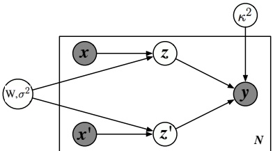

Figure 16.4: Illustration of latent coincidence analysis (LCA) as a directed graphical model. The inputs  $\mathbf{x}, \mathbf{x}' \in \mathbb{R}^D$ are mapped into Gaussian latent variables  $\mathbf{z}, \mathbf{z}' \in \mathbb{R}^L$ via a linear mapping  $\mathbf{W}$. If the two latent points coincide (within length scale  $\kappa$) then we set the similarity label to  $y = 1$, otherwise we set it to  $y = 0$. From Figure 1 of [DS12]. Used with kind permission of Lawrence Saul.

nearest neighbor using the linear softmax function

$$
p_{ij}^{\mathbf{W}}=\frac{\exp(-||\mathbf{W}\boldsymbol{x}_{i}-\mathbf{W}\boldsymbol{x}_{j}||_{2}^{2})}{\sum_{l\neq i}\exp(-||\mathbf{W}\boldsymbol{x}_{i}-\mathbf{W}\boldsymbol{x}_{l}||_{2}^{2})}   \tag*{(16.6)}
$$

(This is a supervised version of stochastic neighborhood embeddings discussed in Section 20.4.10.1.) The expected number of correctly classified examples according for a 1NN classifier using distance  $\mathbf{W}$ is given by  $J(\mathbf{W}) = \sum_{i=1}^{N} \sum_{j \neq i:y_{j}=y_i} p_{ij}^{\mathbf{W}}$. Let  $\mathcal{L}(\mathbf{W}) = 1 - J(\mathbf{W})/N$ be the leave one out error. We can minimize  $\mathcal{L}$ wrt  $\mathbf{W}$ using gradient methods.

##### 16.2.1.3 Latent coincidence analysis

Yet another way to learn a linear mapping W such that  $\mathbf{M} = \mathbf{W}^\top \mathbf{W}$ is known as latent coincidence analysis or LCA [DS12]. This defines a conditional latent variable model for mapping a pair of inputs,  $\mathbf{x}$ and  $\mathbf{x}'$, to a label  $y \in \{0,1\}$, which specifies if the inputs are similar (e.g., have same class label) or dissimilar. Each input  $\mathbf{x} \in \mathbb{R}^D$ is mapped to a low dimensional latent point  $z \in \mathbb{R}^L$ using a stochastic mapping  $p(z | \mathbf{x}) = \mathcal{N}(z | \mathbf{W} \mathbf{x}, \sigma^2 \mathbf{I})$, and  $p(z' | \mathbf{x}') = \mathcal{N}(z' | \mathbf{W} \mathbf{x}', \sigma^2 \mathbf{I})$. (Compare this to factor analysis, discussed in Section 20.2.) We then define the probability that the two inputs are similar using  $p(y = 1 | \mathbf{z}, \mathbf{z}') = \exp(-\frac{1}{2\kappa \tau} || \mathbf{z} - \mathbf{z}'||)$. See Figure 16.4 for an illustration of the modeling assumptions.

We can maximize the log marginal likelihood  $\ell(\mathbf{W}, \sigma^2, \kappa^2) = \sum_n \log p(y_n | \boldsymbol{x}_n, \boldsymbol{x}'_n)$ using the EM algorithm (Section 8.7.2). (We can set  $\kappa = 1$ WLOG, since it just changes the scale of  $\mathbf{W}$.) More precisely, in the E step, we compute the posterior  $p(\mathbf{z}, \mathbf{z}' | \mathbf{x}, \mathbf{x}', y)$ (which can be done in closed form), and in the M step, we solve a weighted least squares problem (c.f., Section 13.6.2). EM will monotonically increase the objective, and does not need step size adjustment, unlike the gradient based methods used in NCA (Section 16.2.1.2). (It is also possible to use variational Bayes (Section 4.6.8.3) to fit this model, as well as various sparse and nonlinear extensions, as discussed in [ZMY19].)

---

#### 16.2.2 Deep metric learning

When measuring the distance between high-dimensional or structured inputs, it is very useful to first learn an embedding to a lower dimensional “semantic” space, where distances are more meaningful, and less subject to the curse of dimensionality (Section 16.1.2). Let  $e = f(\boldsymbol{x}; \boldsymbol{\theta}) \in \mathbb{R}^L$ be an embedding of the input that preserves the “relevant” semantic aspects of the input, and let  $\hat{e} = e / ||e||_2$ be the  $\ell_2$-normalized version. This ensures that all points lie on a hyper-sphere. We can then measure the distance between two points using the normalized Euclidean distance

$$
d(\boldsymbol{x}_{i},\boldsymbol{x}_{j};\boldsymbol{\theta})=||\hat{\boldsymbol{e}}_{i}-\hat{\boldsymbol{e}}_{j}||_{2}^{2}   \tag*{(16.7)}
$$

where smaller values means more similar, or the cosine similarity

$$
d(\boldsymbol{x}_{i},\boldsymbol{x}_{j};\boldsymbol{\theta})=\hat{\boldsymbol{e}}_{i}^{\top}\hat{\boldsymbol{e}}_{j}   \tag*{(16.8)}
$$

where larger values means more similar. (Cosine similarity measures the angle between the two vectors, as illustrated in Figure 20.43.) These quantities are related via

$$
\begin{array}{r}{||\hat{\boldsymbol{e}}_{i}-\hat{\boldsymbol{e}}_{j}||_{2}^{2}=(\hat{\boldsymbol{e}}_{i}-\hat{\boldsymbol{e}}_{j})^{\mathsf{T}}(\hat{\boldsymbol{e}}_{i}-\hat{\boldsymbol{e}}_{j})=2-2\hat{\boldsymbol{e}}_{i}^{\mathsf{T}}\hat{\boldsymbol{e}}_{j}}\end{array}   \tag*{(16.9)}
$$

This overall approach is called deep metric learning or DML.

The basic idea in DML is to learn the embedding function such that similar examples are closer than dissimilar examples. More precisely, we assume we have a labeled dataset,  $\mathcal{D} = \{(\boldsymbol{x}_i, y_i) : i = 1 : N\}$, from which we can derive a set of similar pairs,  $\mathcal{S} = \{(i, j) : y_i = y_j\}$. If  $(i, j) \in \mathcal{S}$ but  $(k, i) \notin \mathcal{S}$, then we assume that  $\boldsymbol{x}_i$ and  $\boldsymbol{x}_j$ should be close in embedding space, whereas  $\boldsymbol{x}_i$ and  $\boldsymbol{x}_k$ should be far. We discuss various ways to enforce this property below. Note that these methods also work when we do not have class labels, provided we have some other way of defining similar pairs. For example, in Section 19.2.4.3, we discuss self-supervised approaches to representation learning, that automatically create semantically similar pairs, and learn embeddings to force these pairs to be closer than unrelated pairs.

Before discussing DML in more detail, it is worth mentioning that many recent approaches to DML are not as good as they claim to be, as pointed out in [MBL20; Rot+20]. (The claims in some of these papers are often invalid due to improper experimental comparisons, a common flaw in contemporary ML research, as discussed in e.g., [BLV19; LS19b].) We therefore focus on (slightly) older and simpler methods, that tend to be more robust.

#### 16.2.3 Classification losses

Suppose we have labeled data with C classes. Then we can fit a classification model in  $O(NC)$ time, and then reuse the hidden features as an embedding function. (It is common to use the second-to-last layer, since it generalizes better to new classes than the final layer.) This approach is simple and scalable. However, it only learns to embed examples on the correct side of a decision boundary, which does not necessarily result in similar examples being placed close together and dissimilar examples being placed far apart. In addition, this method cannot be used if we do not have labeled training data.

---

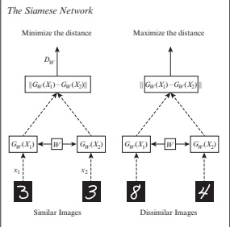

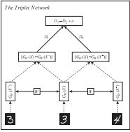

(a)

(b)

Figure 16.5: Networks for deep metric learning. (a) Siamese network. (b) Triplet network. Adapted from Figure 5 of [KB19].

#### 16.2.4 Ranking losses

In this section, we consider minimizing ranking loss, to ensure that similar examples are closer than dissimilar examples. Most of these methods do not need class labels (although we sometimes assume that labels exist as a notationally simple way to define similarity).

##### 16.2.4.1 Pairwise (contrastive) loss and Siamese networks

One of the earliest approaches to representation learning from similar/dissimilar pairs was based on minimizing the following contrastive loss [CHL05]:

$$
\mathcal{L}(\boldsymbol{\theta};\boldsymbol{x}_{i},\boldsymbol{x}_{j})=\mathbb{I}(y_{i}=y_{j})d(\boldsymbol{x}_{i},\boldsymbol{x}_{j})^{2}+\mathbb{I}(y_{i}\neq y_{j})\left[m-d(\boldsymbol{x}_{i},\boldsymbol{x}_{j})\right]_{+}^{2}   \tag*{(16.10)}
$$

where  $[z]_{+} = \max(0, z)$ is the hinge loss and  $m > 0$ is a margin parameter. Intuitively, we want to force positive pairs (with the same label) to be close, and negative pairs (with different labels) to be further apart than some minimal safety margin. We minimize this loss over all pairs of data. Naively this takes  $O(N^{2})$ time; see Section 16.2.5 for some speedups.

Note that we use the same feature extractor  $\mathbf{f}(\cdot;\boldsymbol{\theta})$ for both inputs,  $\mathbf{x}_{i}$ and  $\mathbf{x}_{j}$. when computing the distance, as illustrated in Figure 16.5a. The resulting network is therefore called a Siamese network (named after Siamese twins).

##### 16.2.4.2 Triplet loss

One disadvantage of pairwise losses is that the optimization of the positive pairs is independent of the negative pairs, which can make their magnitudes incomparable. A solution to this is to use the triplet loss [SKP15]. This is defined as follows. For each example  $i$ (known as an anchor), we find a similar (positive) example  $\mathbf{x}_i^\dagger$ and a dissimilar (negative) example  $\mathbf{x}_i^-$. We then minimize the following loss, averaged overall all triples:

$$
\mathcal{L}(\boldsymbol{\theta};\boldsymbol{x}_{i},\boldsymbol{x}_{i}^{+},\boldsymbol{x}_{i}^{-})=[d_{\boldsymbol{\theta}}(\boldsymbol{x}_{i},\boldsymbol{x}_{i}^{+})^{2}-d_{\boldsymbol{\theta}}(\boldsymbol{x}_{i},\boldsymbol{x}_{i}^{-})^{2}+m]_{+}   \tag*{(16.11)}
$$

Author: Kevin P. Murphy. (C) MIT Press. CC-BY-NC-ND license

---

Intuitively this says we want the distance from the anchor to the positive to be less (by some safety margin m) than the distance from the anchor to the negative. We can compute the triplet loss using a triplet network as shown in Figure 16.5b.

Naively minimizing triplet loss takes  $O(N^{3})$ time. In practice we compute the loss on a minibatch (chosen so that there is at least one similar and one dissimilar example for the anchor point, often taken to be the first entry in the minibatch). Nevertheless the method can be slow. We discuss some speedups in Section 16.2.5.

##### 16.2.4.3 N-pairs loss

One problem with the triplet loss is that each anchor is only compared to one negative example at a time. This might not provide a strong enough learning signal. One solution to this is to create a multi-class classification problem in which we create a set of $N-1$ negatives and 1 positive for every anchor. This is called the N-pairs loss [Soh16]. More precisely, we define the following loss for each set:

$$
\mathcal{L}(\boldsymbol{\theta};\boldsymbol{x},\boldsymbol{x}^{+},\{\boldsymbol{x}_{k}^{-}\}_{k=1}^{N-1})=\log\left(1+\sum_{k=1}^{N-1}\exp\left[\hat{\boldsymbol{e}}_{\boldsymbol{\theta}}(\boldsymbol{x})^{\mathsf{T}}\hat{\boldsymbol{e}}_{\boldsymbol{\theta}}(\boldsymbol{x}_{k}^{-})-\hat{\boldsymbol{e}}_{\boldsymbol{\theta}}(\boldsymbol{x})^{\mathsf{T}}\hat{\boldsymbol{e}}_{\boldsymbol{\theta}}(\boldsymbol{x}^{+})\right]\right)   \tag*{(16.12)}
$$

$$
\begin{aligned}=-\log\frac{\exp(\hat{\boldsymbol{e}}_{\theta}(\boldsymbol{x})^{\top}\hat{\boldsymbol{e}}_{\theta}(\boldsymbol{x}^{+}))}{\exp(\hat{\boldsymbol{e}}_{\theta}(\boldsymbol{x})^{\top}\hat{\boldsymbol{e}}_{\theta}(\boldsymbol{x}^{+}))+\sum_{k=1}^{N-1}\exp(\hat{\boldsymbol{e}}_{\theta}(\boldsymbol{x})^{\top}\hat{\boldsymbol{e}}_{\theta}(\boldsymbol{x}_{k}^{-}))}\end{aligned}   \tag*{(16.13)}
$$

Note that the N-pairs loss is the same as the InfoNCE loss used in the CPC paper [OLV18]. In [Che+20a], they propose a version where they scale the similarities by a temperature term; they call this the NT-Xent (normalized temperature-scaled cross-entropy) loss. We can view the temperature parameter as scaling the radius of the hypersphere on which the data lives.

When N = 2, the loss reduces to the logistic loss

$$
\mathcal{L}(\boldsymbol{\theta};\boldsymbol{x},\boldsymbol{x}^{+},\boldsymbol{x}^{-})=\log\left(1+\exp(\hat{\boldsymbol{e}}_{\boldsymbol{\theta}}(\boldsymbol{x})^{\top}\hat{\boldsymbol{e}}_{\boldsymbol{\theta}}(\boldsymbol{x}^{-})-\hat{\boldsymbol{e}}_{\boldsymbol{\theta}}(\boldsymbol{x})^{\top}\hat{\boldsymbol{e}}_{\boldsymbol{\theta}}(\boldsymbol{x}^{+}))\right)   \tag*{(16.14)}
$$

Compare this to the margin loss used by triplet learning (when m = 1):

$$
\mathcal{L}(\boldsymbol{\theta};\boldsymbol{x},\boldsymbol{x}^{+},\boldsymbol{x}^{-})=\max\left(0,\hat{\boldsymbol{e}}(\boldsymbol{x})^{\top}\hat{\boldsymbol{e}}(\boldsymbol{x}^{-})-\hat{\boldsymbol{e}}(\boldsymbol{x})^{\top}\hat{\boldsymbol{e}}(\boldsymbol{x}^{+})+1\right)   \tag*{(16.15)}
$$

See Figure 4.2 for a comparison of these two functions.

#### 16.2.5 Speeding up ranking loss optimization

The main disadvantage of ranking loss is the  $O(N^{2})$ or  $O(N^{3})$ cost of computing the loss function, due to the need to compare all pairs or triples of examples. In this section, we discuss various speedup tricks.

##### 16.2.5.1 Mining techniques

A key insight is that we don’t need to consider all negative examples for each anchor, since most will be uninformative (i.e., will incur zero loss). Instead we can focus attention on negative examples which are closer to the anchor than its nearest positive example. These are called hard negatives, and are particularly useful for speeding up triplet loss.

---

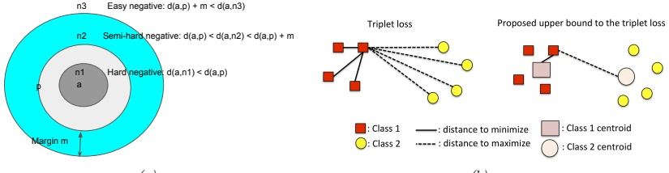

 $(a)$

(b)

Figure 16.b: Speeding up triplet loss minimization. (a) Illustration of hard vs easy negatives. Here a is the anchor point, p is a positive point, and  $n_i$ are negative points. Adapted from Figure 4 of [KB19]. (b) Standard triplet loss would take  $8 \times 3 \times 4 = 96$ calculations, whereas using a proxy loss (with one proxy per class) takes  $8 \times 2 = 16$ calculations. From Figure 1 of [Do+19]. Used with kind permission of Gustavo Cerneiro.

More precisely, if $a$is an anchor and$p$is its nearest positive example, we say that$n$is a hard negative (for$a$) if $d(\boldsymbol{x}_{a}, \boldsymbol{x}_{n}) < d(\boldsymbol{x}_{a}, \boldsymbol{x}_{p})$and$y_{n} \neq y_{a}$. Sometimes an anchor may not have any hard negatives. We can therefore increase the pool of candidates by considering semi-hard negatives, for which

$$
d(\boldsymbol{x}_{a},\boldsymbol{x}_{p})<d(\boldsymbol{x}_{a},\boldsymbol{x}_{n})<d(\boldsymbol{x}_{a},\boldsymbol{x}_{p})+m   \tag*{(16.16)}
$$

where m > 0 is a margin parameter. See Figure 16.6a for an illustration. This is the technique used by Google's FaceNet model [SKP15], which learns an embedding function for faces, so it can cluster similar looking faces together, to which the user can attach a name.

In practice, the hard negatives are usually chosen from within the minibatch. This therefore requires large batch sizes to ensure sufficient diversity. Alternatively, we can have a separate process that continually updates the set of candidate hard negatives, as the distance measure evolves during training.

##### 16.2.5.2 Proxy methods

Triplet loss minimization is expensive even with hard negative mining (Section 16.2.5.1). Ideally we can find a method that is  $O(N)$ time, just like classification loss.

One such method, proposed in  $[MA+17]$, measures the distance between each anchor and a set of  $P$ proxies that represent each class, rather than directly measuring distance between examples. These proxies need to be updated online as the distance metric evolves during learning. The overall procedure takes  $O(NP^2)$ time, where  $P \sim C$.

More recently, [Qia+19] proposed to represent each class with multiple prototypes, while still achieving linear time complexity, using a soft triple loss.

##### 16.2.5.3 Optimizing an upper bound

[Do+19] proposed a simple and fast method for optimizing the triplet loss. The key idea is to define one fixed proxy or centroid per class, and then to use distance to the proxy as an upper bound on

---

the triplet loss.

More precisely, consider a simplified form of the triplet loss, without the margin term:

$$
\ell_{t}(\boldsymbol{x}_{i},\boldsymbol{x}_{j},\boldsymbol{x}_{k})=||\hat{\boldsymbol{e}}_{i}-\hat{\boldsymbol{e}}_{j}||-||\hat{\boldsymbol{e}}_{i}-\hat{\boldsymbol{e}}_{k}||   \tag*{(16.17)}
$$

where  $\hat{e}_i = \hat{e}_\theta(\boldsymbol{x}_i)$, etc. Using the triangle inequality we have

$$
\left|\left|\hat{\boldsymbol{e}}_{i}-\hat{\boldsymbol{e}}_{j}\right|\right|\leq\left|\left|\hat{\boldsymbol{e}}_{i}-\boldsymbol{c}_{y_{i}}\right|\right|+\left|\left|\hat{\boldsymbol{e}}_{j}-\boldsymbol{c}_{y_{i}}\right|\right|   \tag*{(16.18)}
$$

$$
\left|\hat{\boldsymbol{e}}_{i}-\hat{\boldsymbol{e}}_{k}\right|\geq\left|\hat{\boldsymbol{e}}_{i}-\boldsymbol{c}_{y_{k}}\right|-\left|\hat{\boldsymbol{e}}_{k}-\boldsymbol{c}_{y_{k}}\right|   \tag*{(16.19)}
$$

Hence

$$
\ell_{t}(\boldsymbol{x}_{i},\boldsymbol{x}_{j},\boldsymbol{x}_{k})\leq\ell_{u}(\boldsymbol{x}_{i},\boldsymbol{x}_{j},\boldsymbol{x}_{k})\triangleq||\hat{\boldsymbol{e}}_{i}-\boldsymbol{c}_{y_{i}}||-||\hat{\boldsymbol{e}}_{i}-\boldsymbol{c}_{y_{k}}||+||\hat{\boldsymbol{e}}_{j}-\boldsymbol{c}_{y_{i}}||+||\hat{\boldsymbol{e}}_{k}-\boldsymbol{c}_{y_{k}}||   \tag*{(16.20)}
$$

We can use this to derive a tractable upper bound on the triplet loss as follows:

$$
\mathcal{L}_{t}(\mathcal{D},\mathcal{S})=\sum_{(i,j)\in\mathcal{S},(i,k)\notin\mathcal{S},i,j,k\in\{1,\ldots,N\}}\ell_{t}(\boldsymbol{x}_{i},\boldsymbol{x}_{j},\boldsymbol{x}_{k})\leq\sum_{(i,j)\in\mathcal{S},(i,k)\notin\mathcal{S},i,j,k\in\{1,\ldots,N\}}\ell_{u}(\boldsymbol{x}_{i},\boldsymbol{x}_{j},\boldsymbol{x}_{k})   \tag*{(16.21)}
$$

$$
=C^{\prime}\sum_{i=1}^{N}\left(\left|\left|\boldsymbol{x}_{i}-\boldsymbol{c}_{y_{i}}\right|\right|-\frac{1}{3(C-1)}\sum_{m=1,m\neq y_{i}}^{C}\left|\left|\boldsymbol{x}_{i}-\boldsymbol{c}_{m}\right|\right|\right)\triangleq\mathcal{L}_{u}(\mathcal{D},\mathcal{S})   \tag*{(16.22)}
$$

where  $C' = 3(C - 1)\left(\frac{N}{C} - 1\right)\frac{N}{C}$ is a constant, and we assume that  $\sum_{i=1}^{N} \mathbb{I}(y_i = c) = N/C$ for each c. It is clear that  $L_u$ can be computed in  $O(NC)$ time. See Figure 16.6b for an illustration.

In  $[Do+19]$, they show that  $0 \leq \mathcal{L}_t - \mathcal{L}_u \leq \frac{N}{C^2} K$, where  $K$ is some constant that depends on the spread of the centroids. To ensure the bound is tight, the centroids should be as far from each other as possible, and the distances between them should be as similar as possible. An easy way to ensure is to define the  $\mathbf{c}_m$ vectors to be one-hot vectors, one per class. These vectors already have unit norm, and are orthogonal to each other. The distance between each pair of centroids is  $\sqrt{2}$, which ensures the upper bound is fairly tight.

The downside of this approach is that it assumes the embedding layer is $L = C$dimensional. There are two solutions to this. First, after training, we can add a linear projection layer to map from$C$to$L \neq C$, or we can take the second-to-last layer of the embedding network. The second approach is to sample a large number of points on the $L$-dimensional unit hyper-sphere (which we can do by sampling from the standard normal, and then normalizing [Mar72]), and then running $K$-means clustering (Section 21.3) with $K = C$. In the experiments reported in [Do+19], these two approaches give similar results.

Interestingly, in  $[Rot+20]$, they show that increasing  $\pi_{intra}/\pi_{inter}$ results in improved downstream performance on various retrieval tasks, where

$$
\pi_{intra}=\frac{1}{Z_{intra}}\sum_{c=1}^{C}\sum_{i\neq j:y_{i}=y_{j}=c}d(\boldsymbol{x}_{i},\boldsymbol{x}_{j})   \tag*{(16.23)}
$$

is the average intra-class distance, and

$$
\pi_{inter}=\frac{1}{Z_{inter}}\sum_{c=1}^{C}\sum_{c^{\prime}=1}^{C}d(\boldsymbol{\mu}_{c},\boldsymbol{\mu}_{c^{\prime}})   \tag*{(16.24)}
$$

---

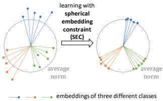

Figure 16.7: Adding spherical embedding constraint to a deep metric learning method. Used with kind permission of Dingyi Zhang.

is the average inter-class distance, where  $\mu_c = \frac{1}{Z_c} \sum_{i:y_i=c} \hat{e}_i$ is the mean embedding for examples from class  $c$. This suggests that we should not only keep the centroids far apart (in order to maximize the numerator), but we should also prevent examples from getting too close to their centroids (in order to minimize the denominator); this latter term is not captured in the method of [Do+19].

#### 16.2.6 Other training tricks for DML

Besides the speedup tricks in Section 16.2.5, there are a lot of other details that are important to get right in order to ensure good DML performance. Many of these details are discussed in [MBL20; Rot+20]. Here we just briefly mention a few.

One important issue is how the minibatches are created. In classification problems (at least with balanced classes), selecting examples at random from the training set is usually sufficient. However, for DML, we need to ensure that each example has some other examples in the minibatch that are similar to it, as well as some others that are dissimilar to it. One approach is to use hard mining techniques (Section 16.2.5.1). Another idea is to use coreset methods applied to previously learned embeddings to select a diverse minibatch at each step [Sin+20]. However, [Rot+20] show that the following simple strategy also works well for creating each batch: pick B/n classes, and then pick  $N_c$ examples randomly from each class, where B is the batch size, and  $N_c = 2$ is a tuning parameter.

Another important issue is avoiding overfitting. Since most datasets used in the DML literature are small, it is standard to use an image classifier, such as GoogLeNet (Section 14.3.3) or ResNet (Section 14.3.4), which has been pre-trained on ImageNet, and then to fine-tune the model using the DML loss. (See Section 19.2 for more details on this kind of transfer learning.) In addition, it is standard to use data augmentation (see Section 19.1). (Indeed, with some self-supervised learning methods, data aug is the only way to create similar pairs.)

In [ZLZ20], they propose to add a spherical embedding constraint (SEC), which is an additional batchwise regularization term, which encourages all the examples to have the same norm. That is, the regularizer is just the empirical variance of the norms of the (unnormalized) embeddings in that batch. See Figure 16.7 for an illustration. This regularizer can be added to any of the existing DML losses to modestly improve training speed and stability, as well as final performance, analogously to how batchnorm (Section 14.2.4.1) is used.

Author: Kevin P. Murphy. (C) MIT Press. CC-BY-NC-ND license

---

### 16.3 Kernel density estimation (KDE)

In this section, we consider a form of non-parametric density estimation known as kernel density estimation or KDE. This is a form of generative model, since it defines a probability distribution  $p(\boldsymbol{x})$ that can be evaluated pointwise, and which can be sampled from to generate new data.

#### 16.3.1 Density kernels

Before explaining KDE, we must define what we mean by a “kernel”. This term has several different meanings in machine learning and statistics. $^{1}$ In this section, we use a specific kind of kernel which we refer to as a density kernel. This is a function  $\mathcal{K} : \mathbb{R} \to \mathbb{R}_+$ such that  $\int \mathcal{K}(x) dx = 1$ and  $\mathcal{K}(-x) = \mathcal{K}(x)$. This latter symmetry property implies the  $\int x \mathcal{K}(x) dx = 0$, and hence

$$
\int x\mathcal{K}(x-x_{n})d x=x_{n}   \tag*{(16.25)}
$$

A simple example of such a kernel is the boxcar kernel, which is the uniform distribution within the unit interval around the origin:

$$
\mathcal{K}(x)\triangleq0.5\mathbb{I}\left(\left|x\right|\leq1\right)   \tag*{(16.26)}
$$

Another example is the Gaussian kernel:

$$
\mathcal{K}(x)=\frac{1}{\left(2\pi\right)^{\frac{1}{2}}}e^{-x^{2}/2}   \tag*{(16.27)}
$$

We can control the width of the kernel by introducing a bandwidth parameter h:

$$
\mathcal{K}_{h}(x)\triangleq\frac{1}{h}\mathcal{K}(\frac{x}{h})   \tag*{(16.28)}
$$

We can generalize to vector valued inputs by defining a radial basis function or RBF kernel:

$$
\mathcal{K}_{h}(\boldsymbol{x})\propto\mathcal{K}_{h}(||\boldsymbol{x}||)   \tag*{(16.29)}
$$

In the case of the Gaussian kernel, this becomes

$$
\mathcal{K}_{h}(\boldsymbol{x})=\frac{1}{h^{D}(2\pi)^{D/2}}\prod_{d=1}^{D}\exp(-\frac{1}{2h^{2}}x_{d}^{2})   \tag*{(16.30)}
$$

Although Gaussian kernels are popular, they have unbounded support. Some alternative kernels, which have compact support (which can be computationally faster), are listed in Table 16.1. See Figure 16.8 for a plot of these kernel functions.

---

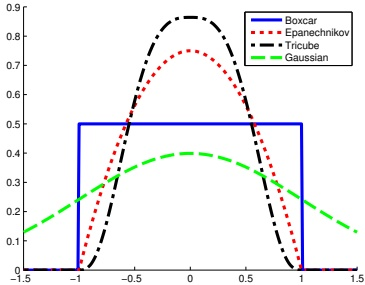

Figure 16.8: A comparison of some popular normalized kernels. Generated by smoothingKernelPlot.ipynb.

<table border=1 style='margin: auto; word-wrap: break-word;'><tr><td style='text-align: center; word-wrap: break-word;'>Name</td><td style='text-align: center; word-wrap: break-word;'>Definition</td><td style='text-align: center; word-wrap: break-word;'>Compact</td><td style='text-align: center; word-wrap: break-word;'>Smooth</td><td style='text-align: center; word-wrap: break-word;'>Boundaries</td></tr><tr><td style='text-align: center; word-wrap: break-word;'>Gaussian</td><td style='text-align: center; word-wrap: break-word;'>$\mathcal{K}(x)=(2\pi)^{-\frac{1}{2}}e^{-x^{2}/2}$</td><td style='text-align: center; word-wrap: break-word;'>0</td><td style='text-align: center; word-wrap: break-word;'>1</td><td style='text-align: center; word-wrap: break-word;'>1</td></tr><tr><td style='text-align: center; word-wrap: break-word;'>Boxcar</td><td style='text-align: center; word-wrap: break-word;'>$\mathcal{K}(x)=\frac{1}{2}\mathbb{I}(|x|\leq1)$</td><td style='text-align: center; word-wrap: break-word;'>1</td><td style='text-align: center; word-wrap: break-word;'>0</td><td style='text-align: center; word-wrap: break-word;'>0</td></tr><tr><td style='text-align: center; word-wrap: break-word;'>Epanechnikov kernel</td><td style='text-align: center; word-wrap: break-word;'>$\mathcal{K}(x)=\frac{3}{4}(1-x^{2})\mathbb{I}(|x|\leq1)$</td><td style='text-align: center; word-wrap: break-word;'>1</td><td style='text-align: center; word-wrap: break-word;'>1</td><td style='text-align: center; word-wrap: break-word;'>0</td></tr><tr><td style='text-align: center; word-wrap: break-word;'>Tri-cube kernel</td><td style='text-align: center; word-wrap: break-word;'>$\mathcal{K}(x)=\frac{70}{81}(1-|x|^{3})^{3}\mathbb{I}(|x|\leq1)$</td><td style='text-align: center; word-wrap: break-word;'>1</td><td style='text-align: center; word-wrap: break-word;'>1</td><td style='text-align: center; word-wrap: break-word;'>1</td></tr></table>

Table 16.1: List of some popular normalized kernels in 1d. Compact=1 means the function is non-zero for a finite range of inputs. Smooth=1 means the function is differentiable over the range of its support. Boundaries=1 means the function is also differentiable at the boundaries of its support.

#### 16.3.2 Parzen window density estimator

To explain how to use kernels to define a nonparametric density estimate, recall the form of the Gaussian mixture model from Section 3.5.1. If we assume a fixed spherical Gaussian covariance and uniform mixture weights, we get

$$
p(\boldsymbol{x}|\boldsymbol{\theta})=\frac{1}{K}\sum_{k=1}^{K}\mathcal{N}(\boldsymbol{x}|\boldsymbol{\mu}_{k},\sigma^{2}\mathbf{I})   \tag*{(16.31)}
$$

One problem with this model is that it requires specifying the number K of clusters, as well as their locations  $\mu_{k}$. An alternative to estimating these parameters is to allocate one cluster center per data point. In this case, the model becomes

$$
p(\boldsymbol{x}|\boldsymbol{\theta})=\frac{1}{N}\sum_{n=1}^{N}\mathcal{N}(\boldsymbol{x}|\boldsymbol{x}_{n},\sigma^{2}\mathbf{I})   \tag*{(16.32)}
$$

We can generalize Equation (16.32) by writing

$$
p(\boldsymbol{x}|\mathcal{D})=\frac{1}{N}\sum_{n=1}^{N}\mathcal{K}_{h}\left(\boldsymbol{x}-\boldsymbol{x}_{n}\right)   \tag*{(16.33)}
$$

Author: Kevin P. Murphy. (C) MIT Press. CC-BY-NC-ND license

---

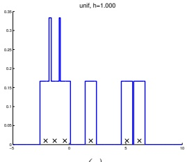

 $(a)$

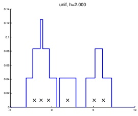

(b)

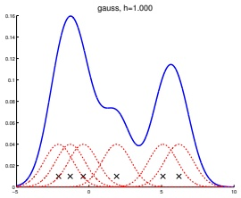

(c)

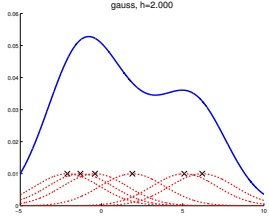

(d)

Figure 16.9: A nonparametric (Parzen) density estimator in 1d estimated from 6 data points, denoted by x. Top row: uniform kernel. Bottom row: Gaussian kernel. Left column: bandwidth parameter h = 1. Right column: bandwidth parameter h = 2. Adapted from http://en.wikipedia.org/wiki/Kernel_density_estimation. Generated by parzen_window_demo2.ipynb.

where  $\mathcal{K}_{h}$ is a density kernel. This is called a Parzen window density estimator, or kernel density estimator (KDE).

The advantage over a parametric model is that no model fitting is required (except for choosing h, discussed in Section 16.3.3), and there is no need to pick the number of cluster centers. The disadvantage is that the model takes a lot of memory (you need to store all the data) and a lot of time to evaluate.

Figure 16.9 illustrates KDE in 1d for two kinds of kernel. On the top, we use a boxcar kernel; the resulting model just counts how many data points land within an interval of size h around each  $x_{n}$ to get a piecewise constant density. On the bottom, we use a Gaussian kernel, which results in a smoother density.

#### 16.3.3 How to choose the bandwidth parameter

We see from Figure 16.9 that the bandwidth parameter h has a large effect on the learned distribution. We can view this as controlling the complexity of the model.

In the case of 1d data, where the “true” data generating distribution is assumed to be a Gaussian, one can show [BA97a] that the optimal bandwidth for a Gaussian kernel (from the point of view of

---

minimizing frequentist risk) is given by  $h = \sigma\left(\frac{4}{3N}\right)^{1/3}$. We can compute a robust approximation to the standard deviation by first computing the median absolute deviation, median( $|x - \text{median}(x)|$), and then using  $\hat{\sigma} = 1.4826$ MAD. If we have  $D$ dimensions, we can estimate  $h_d$ separately for each dimension, and then set  $h = (\prod_{d=1}^D h_d)^{1/D}$.

#### 16.3.4 From KDE to KNN classification

In Section 16.1, we discussed the K nearest neighbor classifier as a heuristic approach to classification. Interestingly, we can derive it as a generative classifier in which the class conditional densities  $p(\boldsymbol{x}|y=c)$ are modeled using KDE. Rather than using a fixed bandwidth and counting how many data points fall within the hyper-cube centered on a datapoint, we will allow the bandwidth or volume to be different for each data point. Specifically, we will “grow” a volume around x until we encounter K data points, regardless of their class label. This is called a balloon kernel density estimator [TS92]. Let the resulting volume have size  $V(\boldsymbol{x})$ (this was previously  $h^D$), and let there be  $N_c(\boldsymbol{x})$ examples from class c in this volume. Then we can estimate the class conditional density as follows:

$$
p(\boldsymbol{x}|y=c,\mathcal{D})=\frac{N_{c}(\boldsymbol{x})}{N_{c}V(\boldsymbol{x})}   \tag*{(16.34)}
$$

where  $N_{c}$ is the total number of examples in class c in the whole data set. If we take the class prior to be  $p(y = c) = N_{c}/N$, then the class posterior is given by

$$
p(y=c|\boldsymbol{x},\mathcal{D})=\frac{\frac{N_{c}(\boldsymbol{x})}{N_{c}V(\boldsymbol{x})}\frac{N_{c}}{N}}{\sum_{c^{\prime}}\frac{N_{c^{\prime}}(\boldsymbol{x})}{N_{c^{\prime}}V(\boldsymbol{x})}\frac{N_{c^{\prime}}}{N}}=\frac{N_{c}(\boldsymbol{x})}{\sum_{c^{\prime}}N_{c^{\prime}}(\boldsymbol{x})}=\frac{N_{c}(\boldsymbol{x})}{K}=\frac{1}{K}\sum_{n\in N_{K}(\boldsymbol{x},\mathcal{D})}\mathbb{I}(y_{n}=c)   \tag*{(16.35)}
$$

where we used the fact that  $\sum_c N_c(\boldsymbol{x}) = K$, since we choose a total of  $K$ points (regardless of class) around every point. This matches Equation (16.1).

#### 16.3.5 Kernel regression

Just as KDE can be used for generative classifiers (see Section 16.1), it can also be used for generative models for regression, as we discuss below.

##### 16.3.5.1 Nadaraya-Watson estimator for the mean

In regression, our goal is to compute the conditional expectation

$$
\mathbb{E}\left[y|\boldsymbol{x},\mathcal{D}\right]=\int y p(y|\boldsymbol{x},\mathcal{D})d y=\frac{\int y p(\boldsymbol{x},y|\mathcal{D})d y}{\int p(\boldsymbol{x},y|\mathcal{D})d y}   \tag*{(16.36)}
$$

If we use an MVN for  $p(y, \boldsymbol{x}|\mathcal{D})$, we derive a result which is equivalent to linear regression, as we showed in Section 11.2.3.5. However, the assumption that  $p(y, \boldsymbol{x}|\mathcal{D})$ is Gaussian is rather limiting. We can use KDE to more accurately approximate the joint density  $p(\boldsymbol{x}, y|\mathcal{D})$ as follows:

$$
p(y,\boldsymbol{x}|\mathcal{D})\approx\frac{1}{N}\sum_{n=1}^{N}\mathcal{K}_{h}(\boldsymbol{x}-\boldsymbol{x}_{n})\mathcal{K}_{h}(y-y_{n})   \tag*{(16.37)}
$$

Author: Kevin P. Murphy. (C) MIT Press. CC-BY-NC-ND license

---

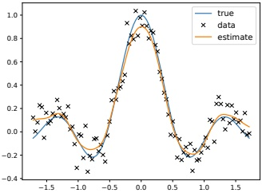

Figure 16.10: An example of kernel regression in 1d using a Gaussian kernel. Generated by kernelRegressionDemo.ipymb.

Hence

$$
\mathbb{E}\left[y|\boldsymbol{x},\mathcal{D}\right]=\frac{\frac{1}{N}\sum_{n=1}^{N}\mathcal{K}_{h}(\boldsymbol{x}-\boldsymbol{x}_{n})\int y\mathcal{K}_{h}(y-y_{n})d y}{\frac{1}{N}\sum_{n^{\prime}=1}^{N}\mathcal{K}_{h}(\boldsymbol{x}-\boldsymbol{x}_{n^{\prime}})\int\mathcal{K}_{h}(y-y_{n^{\prime}})d y}   \tag*{(16.38)}
$$

We can simplify the numerator using the fact that  $\int y \mathcal{K}_h(y - y_n) dy = y_n$ (from Equation (16.25)). We can simplify the denominator using the fact that density kernels integrate to one, i.e.,  $\int \mathcal{K}_h(y - y_n) dy = 1$. Thus

$$
\mathbb{E}\left[y|\boldsymbol{x},\mathcal{D}\right]=\frac{\sum_{n=1}^{N}\mathcal{K}_{h}(\boldsymbol{x}-\boldsymbol{x}_{n})y_{n}}{\sum_{n^{\prime}=1}^{N}\mathcal{K}_{h}(\boldsymbol{x}-\boldsymbol{x}_{n^{\prime}})}=\sum_{n=1}^{N}y_{n}w_{n}(\boldsymbol{x})   \tag*{(16.39)}
$$

$$
w_{n}(\boldsymbol{x})\triangleq\frac{\mathcal{K}_{h}(\boldsymbol{x}-\boldsymbol{x}_{n})}{\sum_{n^{\prime}=1}^{N}\mathcal{K}_{h}(\boldsymbol{x}-\boldsymbol{x}_{n^{\prime}})}   \tag*{(16.40)}
$$

We see that the prediction is just a weighted sum of the outputs at the training points, where the weights depend on how similar x is to the stored training points. This method is called kernel regression, kernel smoothing, or the Nadaraya-Watson (N-W) model. See Figure 16.10 for an example, where we use a Gaussian kernel.

In Section 17.2.3, we discuss the connection between kernel regression and Gaussian process regression.

##### 16.3.5.2 Estimator for the variance

Sometimes it is useful to compute the predictive variance, as well as the predictive mean. We can do this by noting that

$$
\mathbb{V}\left[y|\boldsymbol{x},\mathcal{D}\right]=\mathbb{E}\left[y^{2}|\boldsymbol{x},\mathcal{D}\right]-\mu(\boldsymbol{x})^{2}   \tag*{(16.41)}
$$

---

where  $\mu(\boldsymbol{x}) = \mathbb{E}\left[y|\boldsymbol{x},\mathcal{D}\right]$ is the N-W estimate. If we use a Gaussian kernel with variance  $\sigma^2$, we can compute  $\mathbb{E}\left[y^2|\boldsymbol{x},\mathcal{D}\right]$ as follows:

$$
\begin{aligned}\mathbb{E}\left[y^{2}|\boldsymbol{x},\mathcal{D}\right]&=\frac{\sum_{n=1}^{N}\mathcal{K}_{h}(\boldsymbol{x}-\boldsymbol{x}_{n})\int y^{2}\mathcal{K}_{h}(y-y_{n})dy}{\sum_{n^{\prime}=1}^{N}\mathcal{K}_{h}(\boldsymbol{x}-\boldsymbol{x}_{n^{\prime}})\int\mathcal{K}_{h}(y-y_{n^{\prime}})dy}\\&=\frac{\sum_{n=1}^{N}\mathcal{K}_{h}(\boldsymbol{x}-\boldsymbol{x}_{n})(\sigma^{2}+y_{n}^{2})}{\sum_{n^{\prime}=1}^{N}\mathcal{K}_{h}(\boldsymbol{x}-\boldsymbol{x}_{n^{\prime}})}\end{aligned}   \tag*{(16.42)}
$$

where we used the fact that

$$
\int y^{2}\mathcal{N}(y|y_{n},\sigma^{2})d y=\sigma^{2}+y_{n}^{2}   \tag*{(16.44)}
$$

Combining Equation (16.43) with Equation (16.41) gives

$$
\mathbb{V}\left[y|\boldsymbol{x},\mathcal{D}\right]=\sigma^{2}+\sum_{n=1}^{N}w_{n}(\boldsymbol{x})y_{n}^{2}-\mu(\boldsymbol{x})^{2}   \tag*{(16.45)}
$$

This matches Eqn. 8 of [BA10] (modulo the initial  $\sigma^{2}$ term).

##### 16.3.5.3 Locally weighted regression

We can drop the normalization term from Equation (16.39) to get

$$
\mu(\boldsymbol{x})=\sum_{n=1}^{N}y_{n}\mathcal{K}_{h}(\boldsymbol{x}-\boldsymbol{x}_{n})   \tag*{(16.46)}
$$

This is just a weighted sum of the observed responses, where the weights depend on how similar the test input x is to the training points  $x_{n}$.

Rather than just interpolating the stored responses  $y_{n}$, we can fit a locally linear model around each training point:

$$
\mu(\boldsymbol{x})=\min_{\boldsymbol{\beta}}\sum_{n=1}^{N}[y_{n}-\boldsymbol{\beta}^{\mathrm{T}}\boldsymbol{\phi}(\boldsymbol{x}_{n})]^{2}\mathcal{K}_{h}(\boldsymbol{x}-\boldsymbol{x}_{n})   \tag*{(16.47)}
$$

where  $\phi(\boldsymbol{x})=[1,\boldsymbol{x}]$. This is called locally linear regression (LRR) or locally-weighted scatter-plot smoothing, and is commonly known by the acronym LOWESS or LOESS [CD88]. This is often used when annotating scatter plots with local trend lines.

---

---

In this chapter, we consider nonparametric methods for regression and classification. Such methods do not assume a fixed parametric form for the prediction function, but instead try to estimate the function itself (rather than the parameters) directly from data. The key idea is that we observe the function value at a fixed set of $N$points, namely$y_n = f(\boldsymbol{x}_n)$for$n = 1 : N$, where $f$is the unknown function, so to predict the function value at a new point, say$\boldsymbol{x}_*,$we just have to compare how “similar”$\boldsymbol{x}_*$is to each of the$N$training points,$\{x_n\}$, and then we can predict that $f(\boldsymbol{x}_*)$is some weighted combination of the$\{f(\boldsymbol{x}_n)\}$values. Thus we may need to “remember” the entire training set,$\mathcal{D} = \{(\boldsymbol{x}_n, y_n)\}$, in order to make predictions at test time — we cannot “compress” $\mathcal{D}$into a fixed-sized parameter vector.

The weights that are used for prediction are determined by the similarity between$ \mathbf{x}_* $and each$ \mathbf{x}_n $, which is computed using a special kind of function known as kernel function,  $\mathcal{K}(\mathbf{x}_n, \mathbf{x}_*) \geq 0$, which we explain in Section 17.1. This approach is similar to RBF networks (Section 13.6.1), except we use the datapoints  $\{\mathbf{x}_*\}$ themselves as the “anchors”. rather than learning the RBF centroids  $\{\mathbf{u}_n\}$.

In Section 17.2, we discuss an approach called Gaussian processes, which allows us to use the kernel to define a prior over functions, which we can update given data to get a posterior over functions. Alternatively we can use the same kernel with a method called Support Vector Machines to compute a MAP estimate of the function, as we explain in Section 17.3.

### 17.1 Mercer kernels

The key to nonparametric methods is that we need a way to encode prior knowledge about the similarity of two input vectors. If we know that  $\boldsymbol{x}_{i}$ is similar to  $\boldsymbol{x}_{j}$, then we can encourage the model to make the predicted output at both locations (i.e.,  $f(\boldsymbol{x}_{i})$ and  $f(\boldsymbol{x}_{j})$) to be similar.

To define similarity, we introduce the notion of a kernel function. The word “kernel” has many different meanings in mathematics, including density kernels (Section 16.3.1), transition kernels of a Markov chain (Section 3.6.1.2), and convolutional kernels (Section 14.1). Here we consider a Mercer kernel, also called a positive definite kernel. This is any symmetric function  $\mathcal{K} : \mathcal{X} \times \mathcal{X} \to \mathbb{R}^+$ such that

$$
\sum_{i=1}^{N}\sum_{j=1}^{N}\mathcal{K}(\boldsymbol{x}_{i},\boldsymbol{x}_{j})c_{i}c_{j}\geq0   \tag*{(17.1)}
$$

for any set of $N$(unique) points$\mathbf{x}_i \in \mathcal{X}$, and any choice of numbers $c_i \in \mathbb{R}$. (We assume $\mathcal{K}(\mathbf{x}_i, \mathbf{x}_j) > 0$, so that we can only achieve equality in the above equation if $c_i = 0$for all$i$.)

---

Another way to understand this condition is the following. Given a set of $N$datapoints, let us define the Gram matrix as the following$N \times N$ similarity matrix:

$$
\mathbf{K}=\begin{pmatrix}\mathcal{K}(\mathbf{x}_{1},\mathbf{x}_{1})&\cdots&\mathcal{K}(\mathbf{x}_{1},\mathbf{x}_{N})\\&\vdots&\\ \mathcal{K}(\mathbf{x}_{N},\mathbf{x}_{1})&\cdots&\mathcal{K}(\mathbf{x}_{N},\mathbf{x}_{N})\end{pmatrix}   \tag*{(17.2)}
$$

We say that $K$is a Mercer kernel iff the Gram matrix is positive definite for any set of (distinct) inputs$\{x_i\}_{i=1}^N$.

The most widely used kernel for real-valued inputs is the squared exponential kernel (SE), also called the exponentiated quadratic kernel (EQ), Gaussian kernel, or RBF kernel. It is defined by

$$
\mathcal{K}(\boldsymbol{x},\boldsymbol{x}^{\prime})=\exp\left(-\frac{\left|\left|\boldsymbol{x}-\boldsymbol{x}^{\prime}\right|\right|^{2}}{2\ell^{2}}\right)   \tag*{(17.3)}
$$

Here  $\ell$ corresponds to the length scale of the kernel, i.e., the distance over which we expect differences to matter. This is known as the  $\text{bandwidth}$ parameter. The RBF kernel measures similarity between two vectors in  $\mathbb{R}^D$ using (scaled) Euclidean distance. In Section 17.1.2, we will discuss several other kinds of kernel.

In Section 17.2, we show how to use kernels to define priors and posteriors over functions. The basic idea is this: if  $\mathcal{K}(\boldsymbol{x}, \boldsymbol{x}')$ is large, meaning the inputs are similar, then we expect the output of the function to be similar as well, so  $f(\boldsymbol{x}) \approx f(\boldsymbol{x}')$. More precisely, information we learn about  $f(\boldsymbol{x})$ will help us predict  $f(\boldsymbol{x}')$ for all  $\boldsymbol{x}'$ which are correlated with  $\boldsymbol{x}$, and hence for which  $\mathcal{K}(\boldsymbol{x}, \boldsymbol{x}')$ is large.

In Section 17.3, we show how to use kernels to generalize from Euclidean distance to a more general notion of distance, so that we can use geometric methods such as linear discriminant analysis in an implicit feature space instead of input space.

#### 17.1.1 Mercer’s theorem

Recall from Section 7.4 that any positive definite matrix  $\mathbf{K}$ can be represented using an eigendecomposition of the form  $\mathbf{K} = \mathbf{U}^\top \mathbf{\Lambda} \mathbf{U}$, where  $\mathbf{\Lambda}$ is a diagonal matrix of eigenvalues  $\lambda_i > 0$, and  $\mathbf{U}$ is a matrix containing the eigenvectors. Now consider element  $(i, j)$ of  $\mathbf{K}$:

$$
k_{i j}=(\mathbf{\Lambda}^{\frac{1}{2}}\mathbf{U}_{:i})^{\mathsf{T}}(\mathbf{\Lambda}^{\frac{1}{2}}\mathbf{U}_{:j})   \tag*{(17.4)}
$$

where  $\mathbf{U}_{:i}$ is the  $i'$th column of  $\mathbf{U}$. If we define  $\phi(\boldsymbol{x}_i) = \boldsymbol{\Lambda}^{\frac{1}{2}} \mathbf{U}_{:i}$, then we can write

$$
k_{ij}=\phi(\boldsymbol{x}_{i})^{\top}\phi(\boldsymbol{x}_{j})=\sum_{m}\phi_{m}(\boldsymbol{x}_{i})\phi_{m}(\boldsymbol{x}_{j})   \tag*{(17.5)}
$$

Thus we see that the entries in the kernel matrix can be computed by performing an inner product of some feature vectors that are implicitly defined by the eigenvectors of the kernel matrix. This idea can be generalized to apply to kernel functions, not just kernel matrices; this result is known as Mercer's theorem.

For example, consider the quadratic kernel  $\mathcal{K}(\boldsymbol{x}, \boldsymbol{x}') = \langle \boldsymbol{x}, \boldsymbol{x}' \rangle^2$. In 2d, we have

$$
\mathcal{K}(\boldsymbol{x},\boldsymbol{x}^{\prime})=(x_{1}x_{1}^{\prime}+x_{2}x_{2}^{\prime})^{2}=x_{1}^{2}(x_{1}^{\prime})^{2}+2x_{1}x_{2}x_{1}^{\prime}x_{2}^{\prime}+x_{2}^{2}(x_{2}^{\prime})^{2}   \tag*{(17.6)}
$$

---

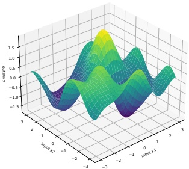

 $(a)$

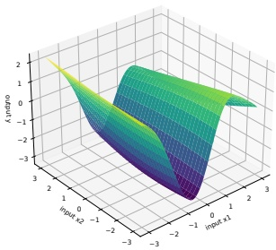

(b)

Figure 17.1: Function samples from a GP with an ARD kernel. (a)  $\ell_1 = \ell_2 = 1$. Both dimensions contribute to the response. (b)  $\ell_1 = 1$,  $\ell_2 = 5$. The second dimension is essentially ignored. Adapted from Figure 5.1 of [RW06]. Generated by gprDemoArd.ipynb.

We can write this as  $\mathcal{K}(\boldsymbol{x}, \boldsymbol{x}') = \phi(\boldsymbol{x})^\top \phi(\boldsymbol{x})$ if we define  $\phi(x_1, x_2) = [x_1^2, \sqrt{2}x_1x_2, x_2^2] \in \mathbb{R}^3$. So we embed the 2d inputs  $x$ into a 3d feature space  $\phi(\boldsymbol{x})$.

Now consider the RBF kernel. In this case, the corresponding feature representation is infinite dimensional (see Section 17.2.9.3 for details). However, by working with kernel functions, we can avoid having to deal with infinite dimensional vectors.

#### 17.1.2 Some popular Mercer kernels

In the sections below, we describe some popular Mercer kernels. More details can be found at [Will14] and https://www.cs.toronto.edu/~duvenaud/cookbook/.

##### 17.1.2.1 Stationary kernels for real-valued vectors

For real-valued inputs,  $\mathcal{X} = \mathbb{R}^D$, it is common to use stationary kernels, which are functions of the form  $\mathcal{K}(\boldsymbol{x}, \boldsymbol{x}') = \mathcal{K}(||\boldsymbol{x} - \boldsymbol{x}'||)$; thus the value only depends on the elementwise difference between the inputs. The RBF kernel is a stationary kernel. We give some other examples below.

##### ARD kernel

We can generalize the RBF kernel by replacing Euclidean distance with Mahalanobis distance, as follows:

$$
\mathcal{K}(\boldsymbol{r})=\sigma^{2}\exp\left(-\frac{1}{2}\boldsymbol{r}^{\mathsf{T}}\boldsymbol{\Sigma}^{-1}\boldsymbol{r}\right)   \tag*{(17.7)}
$$

Author: Kevin P. Murphy. (C) MIT Press. CC-BY-NC-ND license

---

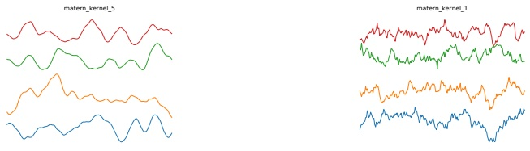

(a)

(b)

Figure 17.2: Functions sampled from a GP with a Matern kernel. (a)  $\nu = 5/2$. (b)  $\nu = 1/2$. Generated by gpKernelPlot.ipynb.

where  $\boldsymbol{r} = \boldsymbol{x} - \boldsymbol{x}'$. If  $\Sigma$ is diagonal, this can be written as

$$
\mathcal{K}(\boldsymbol{r};\boldsymbol{\ell},\sigma^{2})=\sigma^{2}\exp\left(-\frac{1}{2}\sum_{d=1}^{D}\frac{1}{\ell_{d}^{2}}r_{d}^{2}\right)=\prod_{d=1}^{D}\mathcal{K}(r_{d};\ell_{d},\sigma^{2/D})   \tag*{(17.8)}
$$

where

$$
\mathcal{K}(r;\ell,\tau^{2})=\tau^{2}\exp\left(-\frac{1}{2}\frac{1}{\ell^{2}}r^{2}\right)   \tag*{(17.9)}
$$

We can interpret  $\sigma^2$ as the overall variance, and  $\ell_d$ as defining the characteristic length scale of dimension  $d$. If  $d$ is an irrelevant input dimension, we can set  $\ell_d = \infty$, so the corresponding dimension will be ignored. This is known as automatic relevancy determination or ARD (Section 11.7.7). Hence the corresponding kernel is called the ARD kernel. See Figure 17.1 for an illustration of some 2d functions sampled from a GP using this prior.

##### Matern kernels

The SE kernel gives rise to functions that are infinitely differentiable, and therefore are very smooth. For many applications, it is better to use the  $\mathbf{Matern}$ kernel, which gives rise to “rougher” functions, which can better model local “wiggles” without having to make the overall length scale very small.

The Matern kernel has the following form:

$$
\mathcal{K}(r;\nu,\ell)=\frac{2^{1-\nu}}{\Gamma(\nu)}\left(\frac{\sqrt{2\nu}r}{\ell}\right)^{\nu}K_{\nu}\left(\frac{\sqrt{2\nu}r}{\ell}\right)   \tag*{(17.10)}
$$

where  $K_\nu$ is a modified Bessel function and  $\ell$ is the length scale. Functions sampled from this GP are k-times differentiable iff  $\nu > k$. As  $\nu \to \infty$, this approaches the SE kernel.