

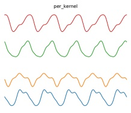

(a) Periodic kernel.

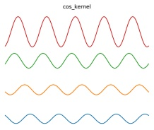

(b) Cosine kernel.

Figure 17.3: Functions sampled from a GP using various stationary periodic kernels. Generated by gpKernelPlot.ipynb.

For values  $\nu \in \{\frac{1}{2}, \frac{3}{2}, \frac{5}{2}\}$, the function simplifies as follows:

$$
\mathcal{K}(r;\frac{1}{2},\ell)=\exp(-\frac{r}{\ell})   \tag*{(17.11)}
$$

$$
\mathcal{K}(r;\frac{3}{2},\ell)=\left(1+\frac{\sqrt{3}r}{\ell}\right)\exp\left(-\frac{\sqrt{3}r}{\ell}\right)   \tag*{(17.12)}
$$

$$
\mathcal{K}(r;\frac{5}{2},\ell)=\left(1+\frac{\sqrt{5}r}{\ell}+\frac{5r^{2}}{3\ell^{2}}\right)\exp\left(-\frac{\sqrt{5}r}{\ell}\right)   \tag*{(17.13)}
$$

The value  $\nu = \frac{1}{2}$ corresponds to the Ornstein-Uhlenbeck process, which describes the velocity of a particle undergoing Brownian motion. The corresponding function is continuous but not differentiable, and hence is very “jagged”. See Figure 17.2b for an illustration.

##### Periodic kernels

The periodic kernel captures repeating structure, and has the form

$$
\mathcal{K}_{\mathrm{p e r}}(r;\ell,p)=\exp\left(-\frac{2}{\ell^{2}}\sin^{2}(\pi\frac{r}{p})\right)   \tag*{(17.14)}
$$

where p is the period. See Figure 17.3a for an illustration.

A related kernel is the cosine kernel:

$$
\mathcal{K}(r;p)=\cos\left(2\pi\frac{r}{p}\right)   \tag*{(17.15)}
$$

See Figure 17.3b for an illustration.

Author: Kevin P. Murphy. (C) MIT Press. CC-BY-NC-ND license

---

##### 17.1.2.2 Making new kernels from old

Given two valid kernels  $\mathcal{K}_1(\boldsymbol{x}, \boldsymbol{x}')$ and  $\mathcal{K}_2(\boldsymbol{x}, \boldsymbol{x}')$, we can create a new kernel using any of the following methods:

$$
\mathcal{K}(\boldsymbol{x},\boldsymbol{x}^{\prime})=c\mathcal{K}_{1}(\boldsymbol{x},\boldsymbol{x}^{\prime}),\mathrm{f o r a n y c o n s t a n t}c>0   \tag*{(17.16)}
$$

$$
\mathcal{K}(\boldsymbol{x},\boldsymbol{x}^{\prime})=f(\boldsymbol{x})\mathcal{K}_{1}(\boldsymbol{x},\boldsymbol{x}^{\prime})f(\boldsymbol{x}^{\prime}),for any function f   \tag*{(17.17)}
$$

$$
\mathcal{K}(\boldsymbol{x},\boldsymbol{x}^{\prime})=q(\mathcal{K}_{1}(\boldsymbol{x},\boldsymbol{x}^{\prime}))for any function polynomial q with nonneg. coef.   \tag*{(17.18)}
$$

$$
\mathcal{K}(\boldsymbol{x},\boldsymbol{x}^{\prime})=\exp(\mathcal{K}_{1}(\boldsymbol{x},\boldsymbol{x}^{\prime}))   \tag*{(17.19)}
$$

$$
\mathcal{K}(\boldsymbol{x},\boldsymbol{x}^{\prime})=\boldsymbol{x}^{\top}\mathbf{A}\boldsymbol{x}^{\prime},\mathrm{f o r a n y}\mathrm{p s d}\mathrm{m a t r i x}\mathbf{A}   \tag*{(17.20)}
$$

For example, suppose we start with the linear kernel  $\mathcal{K}(\boldsymbol{x}, \boldsymbol{x}') = \boldsymbol{x}^\top \boldsymbol{x}'$. We know this is a valid Mercer kernel, since the corresponding Gram matrix is just the (scaled) covariance matrix of the data. From the above rules, we can see that the polynomial kernel  $\mathcal{K}(\boldsymbol{x}, \boldsymbol{x}') = (\boldsymbol{x}^\top \boldsymbol{x}')^M$ is a valid Mercer kernel. This contains all monomials of order  $M$. For example, if  $M = 2$ and the inputs are 2d, we have

$$
(\boldsymbol{x}^{\top}\boldsymbol{x}^{\prime})^{2}=(x_{1}x_{1}^{\prime}+x_{2}x_{2}^{\prime})^{2}=(x_{1}x_{1}^{\prime})^{2}+(x_{2}x_{2})^{2}+2(x_{1}x_{1}^{\prime})(x_{2}x_{2}^{\prime})   \tag*{(17.21)}
$$

We can generalize this to contain all terms up to degree $M$by using the kernel$\mathcal{K}(\boldsymbol{x}, \boldsymbol{x}') = (\boldsymbol{x}^\top \boldsymbol{x}' + c)^M$. For example, if $M = 2$and the inputs are$2d$, we have

$$
\begin{aligned}(\boldsymbol{x}^{\top}\boldsymbol{x}^{\prime}+1)^{2}&=(x_{1}x_{1}^{\prime})^{2}+(x_{1}x_{1}^{\prime})(x_{2}x_{2}^{\prime})+(x_{1}x_{1}^{\prime})\\&+(x_{2}x_{2})(x_{1}x_{1}^{\prime})+(x_{2}x_{2}^{\prime})^{2}+(x_{2}x_{2}^{\prime})\\&+(x_{1}x_{1}^{\prime})+(x_{2}x_{2}^{\prime})+1\end{aligned}   \tag*{(17.22)}
$$

We can also use the above rules to establish that the Gaussian kernel is a valid kernel. To see this, note that

$$
\left|\boldsymbol{x}-\boldsymbol{x}^{\prime}\right|^{2}=\boldsymbol{x}^{\top}\boldsymbol{x}+(\boldsymbol{x}^{\prime})^{\top}\boldsymbol{x}^{\prime}-2\boldsymbol{x}^{\top}\boldsymbol{x}^{\prime}   \tag*{(17.23)}
$$

and hence

$$
\mathcal{K}(\boldsymbol{x},\boldsymbol{x}^{\prime})=\exp(-||\boldsymbol{x}-\boldsymbol{x}^{\prime}||^{2}/2\sigma^{2})=\exp(-\boldsymbol{x}^{\top}\boldsymbol{x}/2\sigma^{2})\exp(\boldsymbol{x}^{\top}\boldsymbol{x}^{\prime}/\sigma^{2})\exp(-(\boldsymbol{x}^{\prime})^{\top}\boldsymbol{x}^{\prime}/2\sigma^{2})   \tag*{(17.24)}
$$

is a valid kernel.

##### 17.1.2.3 Combining kernels by addition and multiplication

We can also combine kernels using addition or multiplication:

$$
\mathcal{K}(\boldsymbol{x},\boldsymbol{x}^{\prime})=\mathcal{K}_{1}(\boldsymbol{x},\boldsymbol{x}^{\prime})+\mathcal{K}_{2}(\boldsymbol{x},\boldsymbol{x}^{\prime})   \tag*{(17.25)}
$$

$$
\mathcal{K}(\boldsymbol{x},\boldsymbol{x}^{\prime})=\mathcal{K}_{1}(\boldsymbol{x},\boldsymbol{x}^{\prime})\times\mathcal{K}_{2}(\boldsymbol{x},\boldsymbol{x}^{\prime})   \tag*{(17.26)}
$$

Multiplying two positive-definite kernels together always results in another positive definite kernel. This is a way to get a conjunction of the individual properties of each kernel, as illustrated in Figure 17.4.

In addition, adding two positive-definite kernels together always results in another positive definite kernel. This is a way to get a disjunction of the individual properties of each kernel, as illustrated in Figure 17.5.

---

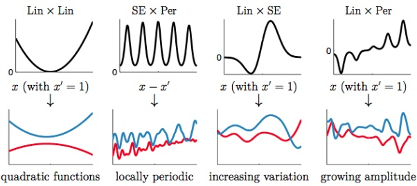

Figure 17.4: Examples of 1d structures obtained by multiplying elementary kernels. Top row shows  $\mathcal{K}(x, x' = 1)$. Bottom row shows some functions sampled from  $GP(f|0, \mathcal{K})$. From Figure 2.2 of [Duv14]. Used with kind permission of David Duvenaud.

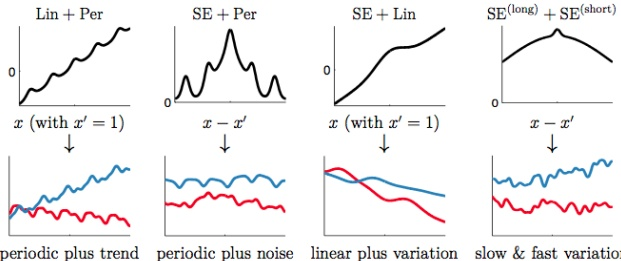

Figure 17.5: Examples of 1d structures obtained by adding elementary kernels. Here SE $^{\text{(short)}}$ and SE $^{\text{(long)}}$ are two SE kernels with different length scales. From Figure 2.4 of [Duv14]. Used with kind permission of David Duvenaud.

##### 17.1.2.4 Kernels for structured inputs

Kernels are particularly useful when the inputs are structured objects, such as strings and graphs, since it is often hard to “featurize” variable-sized inputs. For example, we can define a string kernel which compares strings in terms of the number of n-grams they have in common  $[Lod+02; BC17]$.

We can also define kernels on graphs [KJM19]. For example, the random walk kernel conceptually performs random walks on two graphs simultaneously, and then counts the number of paths that were produced by both walks. This can be computed efficiently as discussed in [Vis+10]. For more details on graph kernels, see [KJM19].

For a review of kernels on structured objects, see e.g., [Gär03].

Author: Kevin P. Murphy. (C) MIT Press. CC-BY-NC-ND license

---

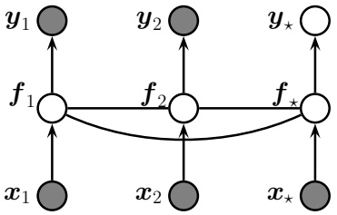

Figure 17.6: A Gaussian process for 2 training points,  $\mathbf{x}_1$ and  $\mathbf{x}_2$, and 1 testing point,  $\mathbf{x}_*$, represented as a graphical model representing  $p(\mathbf{y}, \mathbf{f}_X | \mathbf{X}) = \mathcal{N}(\mathbf{f}_X | m(\mathbf{X}), \mathcal{K}(\mathbf{X})) \prod_i p(y_i | f_i)$. The hidden nodes  $f_i = f(\mathbf{x}_i)$ represent the value of the function at each of the data points. These hidden nodes are fully interconnected by undirected edges, forming a Gaussian graphical model; the edge strengths represent the covariance terms  $\Sigma_{ij} = \mathcal{K}(\mathbf{x}_i, \mathbf{x}_j)$. If the test point  $\mathbf{x}_*$ is similar to the training points  $\mathbf{x}_1$ and  $\mathbf{x}_2$, then the value of the hidden function  $f_*$ will be similar to  $f_1$ and  $f_2$, and hence the predicted output  $y_*$ will be similar to the training values  $y_1$ and  $y_2$.

### 17.2 Gaussian processes

In this section, we discuss Gaussian processes, which is a way to define distributions over functions of the form  $f : \mathcal{X} \to \mathbb{R}$, where  $\mathcal{X}$ is any domain. The key assumption is that the function values at a set of  $M > 0$ inputs,  $\boldsymbol{f} = [f(\boldsymbol{x}_1), \ldots, f(\boldsymbol{x}_M)]$, is jointly Gaussian, with mean  $(\boldsymbol{\mu} = m(\boldsymbol{x}_1), \ldots, m(\boldsymbol{x}_M))$ and covariance  $\boldsymbol{\Sigma}_{ij} = \mathcal{K}(\boldsymbol{x}_i, \boldsymbol{x}_j)$, where  $m$ is a mean function and  $\mathcal{K}$ is a positive definite (Mercer) kernel. Since we assume this holds for any  $M > 0$, this includes the case where  $M = N + 1$, containing  $N$ training points  $\boldsymbol{x}_n$ and 1 test point  $\boldsymbol{x}_*$. Thus we can infer  $f(\boldsymbol{x}_*)$ from knowledge of  $f(\boldsymbol{x}_1), \ldots, f(\boldsymbol{x}_n)$ by manipulating the joint Gaussian distribution  $p(f(\boldsymbol{x}_1), \ldots, f(\boldsymbol{x}_N), f(\boldsymbol{x}_*))$, as we explain below. We can also extend this to work with the case where we observe noisy functions of  $f(\boldsymbol{x}_n)$, such as in regression or classification problems.

#### 17.2.1 Noise-free observations

Suppose we observe a training set  $\mathcal{D} = \{(\boldsymbol{x}_n, y_n) : n = 1 : N\}$, where  $y_n = f(\boldsymbol{x}_n)$ is the noise-free observation of the function evaluated at  $\boldsymbol{x}_n$. If we ask the GP to predict  $f(\boldsymbol{x})$ for a value of  $\boldsymbol{x}$ that it has already seen, we want the GP to return the answer  $f(\boldsymbol{x})$ with no uncertainty. In other words, it should act as an interpolator of the training data.

Now we consider the case of predicting the outputs for new inputs that may not be in $\mathcal{D}$. Specifically, given a test set $\mathbf{X}_*$of size$N_*\times D$, we want to predict the function outputs $\mathbf{f}_*=[f(\mathbf{x}_{*1}),\ldots,f(\mathbf{x}_{*N_*})]$. By definition of the GP, the joint distribution $p(\mathbf{f}_X,\mathbf{f}_*|\mathbf{X},\mathbf{X}_*)$ has the following form

$$
\begin{pmatrix}\boldsymbol{f}_{X}\\ \boldsymbol{f}_{*}\end{pmatrix}\sim\mathcal{N}\left(\begin{pmatrix}\boldsymbol{\mu}_{X}\\ \boldsymbol{\mu}_{*}\end{pmatrix},\begin{pmatrix}\mathbf{K}_{X,X}&\mathbf{K}_{X,*}\\ \mathbf{K}_{X,*}^{\top}&\mathbf{K}_{*,*}\end{pmatrix}\right)   \tag*{(17.27)}
$$

---

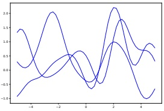

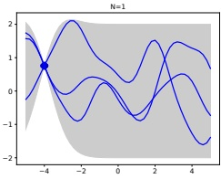

 $(a)$

(b)

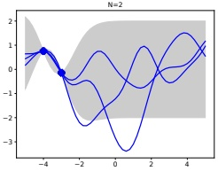

(c)

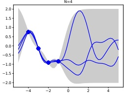

(d)

Figure 17.7: (a) some functions sampled from a GP prior with squared exponential kernel. (b-d) : some samples from a GP posterior, after conditioning on 1,2, and 4 noise-free observations. The shaded area represents  $\mathbb{E}\left[f(\mathbf{x})\right] \pm 2\mathrm{std}\left[f(\mathbf{x})\right]$. Adapted from Figure 2.2 of [RW06]. Generated by gprDemoNoiseFree.ipymb.

where  $\boldsymbol{\mu}_{X} = [m(\boldsymbol{x}_{1}), \ldots, m(\boldsymbol{x}_{N})]$,  $\boldsymbol{\mu}_{*} = [m(\boldsymbol{x}_{1}^{*}), \ldots, m(\boldsymbol{x}_{N_{*}}^{*})]$,  $\mathbf{K}_{X,X} = \mathcal{K}(\mathbf{X}, \mathbf{X})$ is  $N \times N$,  $\mathbf{K}_{X,*} = \mathcal{K}(\mathbf{X}, \mathbf{X}_{*})$ is  $N \times N_{*}$, and  $\mathbf{K}_{*,*} = \mathcal{K}(\mathbf{X}_{*}, \mathbf{X}_{*})$ is  $N_{*} \times N_{*}$. See Figure 17.6 for an illustration. By the standard rules for conditioning Gaussians (Section 3.2.3), the posterior has the following form

$$
p(f_{*}|\mathbf{X}_{*},\mathcal{D})=\mathcal{N}(f_{*}|\boldsymbol{\mu}_{*},\boldsymbol{\Sigma}_{*})   \tag*{(17.28)}
$$

$$
\boldsymbol{\mu}_{*}=m(\mathbf{X}_{*})+\mathbf{K}_{X,*}^{\top}\mathbf{K}_{X,X}^{-1}(\boldsymbol{f}_{X}-m(\mathbf{X}))   \tag*{(17.29)}
$$

$$
\mathbf{\Sigma}_{*}=\mathbf{K}_{*,*}-\mathbf{K}_{X,*}^{\intercal}\mathbf{K}_{X,X}^{-1}\mathbf{K}_{X,*}   \tag*{(17.30)}
$$

This process is illustrated in Figure 17.7. On the left we show some samples from the prior,  $p(f)$, where we use an RBF kernel (Section 17.1) and a zero mean function. On the right, we show samples from the posterior,  $p(f|\mathcal{D})$. We see that the model perfectly interpolates the training data, and that the predictive uncertainty increases as we move further away from the observed data.

#### 17.2.2 Noisy observations

Now let us consider the case where what we observe is a noisy version of the underlying function,  $y_n = f(\boldsymbol{x}_n) + \epsilon_n$, where  $\epsilon_n \sim \mathcal{N}(0, \sigma_y^2)$. In this case, the model is not required to interpolate the data,

Author: Kevin P. Murphy. (C) MIT Press. CC-BY-NC-ND license

---

but it must come “close” to the observed data. The covariance of the observed noisy responses is

$$
\mathrm{Cov}\left[y_{i},y_{j}\right]=\mathrm{Cov}\left[f_{i},f_{j}\right]+\mathrm{Cov}\left[\epsilon_{i},\epsilon_{j}\right]=\mathcal{K}(\boldsymbol{x}_{i},\boldsymbol{x}_{j})+\sigma_{y}^{2}\delta_{ij}   \tag*{(17.31)}
$$

where  $\delta_{ij} = \mathbb{I}(i = j)$. In other words

$$
\mathrm{C o v}\left[\mathbf{y}|\mathbf{X}\right]=\mathbf{K}_{X,X}+\sigma_{y}^{2}\mathbf{I}_{N}\triangleq\mathbf{K}_{\sigma}   \tag*{(17.32)}
$$

The joint density of the observed data and the latent, noise-free function on the test points is given by

$$
\begin{pmatrix}\boldsymbol{y}\\ \boldsymbol{f}_{*}\end{pmatrix}\sim\mathcal{N}\left(\begin{pmatrix}\boldsymbol{\mu}_{X}\\ \boldsymbol{\mu}_{*}\end{pmatrix},\begin{pmatrix}\mathbf{K}_{\sigma}&\mathbf{K}_{X,*}\\ \mathbf{K}_{X,*}^{\top}&\mathbf{K}_{*,*}\end{pmatrix}\right)   \tag*{(17.33)}
$$

Hence the posterior predictive density at a set of test points  $X_{*}$ is

$$
p(f_{*}|\mathcal{D},\mathbf{X}_{*})=\mathcal{N}(f_{*}|\boldsymbol{\mu}_{*|X},\boldsymbol{\Sigma}_{*|X})   \tag*{(17.34)}
$$

$$
\boldsymbol{\mu}_{*|X}=\boldsymbol{\mu}_{*}+\mathbf{K}_{X,*}^{\top}\mathbf{K}_{\sigma}^{-1}(\boldsymbol{y}-\boldsymbol{\mu}_{X})   \tag*{(17.35)}
$$

$$
\mathbf{\Sigma}_{*|X}=\mathbf{K}_{*,*}-\mathbf{K}_{X,*}^{\top}\mathbf{K}_{\sigma}^{-1}\mathbf{K}_{X,*}   \tag*{(17.36)}
$$

In the case of a single test input, this simplifies as follows

$$
p(f_{*}|\mathcal{D},\boldsymbol{x}_{*})=\mathcal{N}(f_{*}|m_{*}+\boldsymbol{k}_{*}^{\top}\mathbf{K}_{\sigma}^{-1}(\boldsymbol{y}-\boldsymbol{\mu}_{X}),\;k_{**}-\boldsymbol{k}_{*}^{\top}\mathbf{K}_{\sigma}^{-1}\boldsymbol{k}_{*})   \tag*{(17.37)}
$$

where  $\boldsymbol{k}_* = [\mathcal{K}(\boldsymbol{x}_*, \boldsymbol{x}_1), \ldots, \mathcal{K}(\boldsymbol{x}_*, \boldsymbol{x}_N)]$ and  $k_{**} = \mathcal{K}(\boldsymbol{x}_*, \boldsymbol{x}_*)$. If the mean function is zero, we can write the posterior mean as follows:

$$
\mu_{*|X}=\boldsymbol{k}_{*}^{\mathsf{T}}(\mathbf{K}_{\sigma}^{-1}\boldsymbol{y})\triangleq\boldsymbol{k}_{*}^{\mathsf{T}}\boldsymbol{\alpha}=\sum_{n=1}^{N}\mathcal{K}(\boldsymbol{x}_{*},\boldsymbol{x}_{n})\boldsymbol{\alpha}_{n}   \tag*{(17.38)}
$$

This is identical to the predictions from kernel ridge regression in Equation  $(17.108)$.

#### 17.2.3 Comparison to kernel regression

In Section 16.3.5, we discussed kernel regression, which is a generative approach to regression in which we approximate  $p(y, \boldsymbol{x})$ using kernel density estimation. In particular, Equation (16.39) gives us

$$
\mathbb{E}\left[y|\boldsymbol{x},\mathcal{D}\right]=\frac{\sum_{n=1}^{N}\mathcal{K}_{h}(\boldsymbol{x}-\boldsymbol{x}_{n})y_{n}}{\sum_{n^{\prime}=1}^{N}\mathcal{K}_{h}(\boldsymbol{x}-\boldsymbol{x}_{n^{\prime}})}=\sum_{n=1}^{N}y_{n}w_{n}(\boldsymbol{x})   \tag*{(17.39)}
$$

$$
w_{n}(\boldsymbol{x})\triangleq\frac{\mathcal{K}_{h}(\boldsymbol{x}-\boldsymbol{x}_{n})}{\sum_{n^{\prime}=1}^{N}\mathcal{K}_{h}(\boldsymbol{x}-\boldsymbol{x}_{n^{\prime}})}   \tag*{(17.40)}
$$

This is very similar to Equation (17.38). However, there are a few important differences. Firstly, in a GP, we use a positive definite (Mercer) kernel instead of a density kernel; Mercer kernels can be defined on structured objects, such as strings and graphs, which is harder to do for density kernels.

---

Second, a GP is an interpolator (at least when  $\sigma^2 = 0$), so  $\mathbb{E}[y|\boldsymbol{x}_n, \mathcal{D}] = y_n$. By contrast, kernel regression is not an interpolator (although it can be made into one by iteratively fitting the residuals, as in [KJ16]). Third, a GP is a Bayesian method, which means we can estimate hyperparameters (of the kernel) by maximizing the marginal likelihood; by contrast, in kernel regression we must use cross-validation to estimate the kernel parameters, such as the bandwidth. Fourth, computing the weights  $w_n$ for kernel regression takes  $O(N)$ time, where  $N = |\mathcal{D}|$, whereas computing the weights  $\alpha_n$ for GP regression takes  $O(N^3)$ time (although there are approximation methods that can reduce this to  $O(NM^2)$, as we discuss in Section 17.2.9).

#### 17.2.4 Weight space vs function space

In this section, we show how Bayesian linear regression is a special case of a GP.

Consider the linear regression model  $y = f(\boldsymbol{x}) + \epsilon$, where  $f(\boldsymbol{x}) = \boldsymbol{w}^\top \phi(\boldsymbol{x})$ and  $\epsilon \sim \mathcal{N}(0, \sigma_y^2)$. If we use a Gaussian prior  $p(\boldsymbol{w}) = \mathcal{N}(\boldsymbol{w} | \boldsymbol{0}, \boldsymbol{\Sigma}_w)$, then the posterior is as follows (see Section 11.7.2 for the derivation):

$$
p(\boldsymbol{w}|\mathcal{D})=\mathcal{N}(\boldsymbol{w}|\frac{1}{\sigma_{y}^{2}}\mathbf{A}^{-1}\boldsymbol{\Phi}^{T}\boldsymbol{y},\mathbf{A}^{-1})   \tag*{(17.41)}
$$

where  $\Phi$ is the  $N \times D$ design matrix, and

$$
\mathbf{A}=\sigma_{y}^{-2}\boldsymbol{\Phi}^{\mathsf{T}}\boldsymbol{\Phi}+\boldsymbol{\Sigma}_{w}^{-1}   \tag*{(17.42)}
$$

The posterior predictive distribution for  $f_{*} = f(\boldsymbol{x}_{*})$ is therefore

$$
p(f_{*}|\mathcal{D},\boldsymbol{x}_{*})=\mathcal{N}(f_{*}|\frac{1}{\sigma_{y}^{2}}\boldsymbol{\phi}_{*}^{\mathsf{T}}\mathbf{A}^{-1}\boldsymbol{\Phi}^{\mathsf{T}}\boldsymbol{y},\boldsymbol{\phi}_{*}^{\mathsf{T}}\mathbf{A}^{-1}\boldsymbol{\phi}_{*})   \tag*{(17.43)}
$$

where  $\phi_{*}=\phi(\boldsymbol{x}_{*})$. This views the problem of inference and prediction in weight space.

We now show that this is equivalent to the predictions made by a GP using a kernel of the form  $\mathcal{K}(\boldsymbol{x}, \boldsymbol{x}') = \phi(\boldsymbol{x})^\top \boldsymbol{\Sigma}_w \phi(\boldsymbol{x}')$. To see this, let  $\mathbf{K} = \boldsymbol{\Phi} \boldsymbol{\Sigma}_w \boldsymbol{\Phi}^\top$,  $\boldsymbol{k}_* = \boldsymbol{\Phi} \boldsymbol{\Sigma}_w \boldsymbol{\phi}_*$, and  $k_{**} = \phi_*\mathbf{T} \boldsymbol{\Sigma}_w \boldsymbol{\phi}_*$. Using this notation, and the matrix inversion lemma, we can rewrite Equation (17.43) as follows

$$
p(f_{*}|\mathcal{D},\pmb{x}_{*})=\mathcal{N}(f_{*}|\pmb{\mu}_{*|X},\pmb{\Sigma}_{*|X})   \tag*{(17.44)}
$$

$$
\boldsymbol{\mu}_{*|X}=\boldsymbol{\phi}_{*}^{\top}\boldsymbol{\Sigma}_{w}\boldsymbol{\Phi}^{\top}(\mathbf{K}+\sigma_{y}^{2}\mathbf{I})^{-1}\boldsymbol{y}=\boldsymbol{k}_{*}^{\top}\mathbf{K}_{\sigma}^{-1}\boldsymbol{y}   \tag*{(17.45)}
$$

$$
\mathbf{\Sigma}_{*}|_{X}=\boldsymbol{\phi}_{*}^{\intercal}\mathbf{\Sigma}_{w}\boldsymbol{\phi}_{*}-\boldsymbol{\phi}_{*}^{\intercal}\mathbf{\Sigma}_{w}\mathbf{\Phi}^{\intercal}(\mathbf{K}+\sigma_{y}^{2}\mathbf{I})^{-1}\mathbf{\Phi}\mathbf{\Sigma}_{w}\boldsymbol{\phi}_{*}=k_{**}-\boldsymbol{k}_{*}^{\intercal}\mathbf{K}_{\sigma}^{-1}\boldsymbol{k}_{*}   \tag*{(17.46)}
$$

which matches the results in Equation (17.37), assuming  $m(\boldsymbol{x}) = 0$. (Non-zero mean can be captured by adding a constant feature with value 1 to  $\phi(\boldsymbol{x})$.)

Thus we can derive a GP from Bayesian linear regression. Note, however, that linear regression assumes  $\phi(\boldsymbol{x})$ is a finite length vector, whereas a GP allows us to work directly in terms of kernels, which may correspond to infinite length feature vectors (see Section 17.1.1). That is, a GP works in function space.

#### 17.2.5 Numerical issues

In this section, we discuss computational and numerical issues which arise when implementing the above equations. For notational simplicity, we assume the prior mean is zero,  $m(\boldsymbol{x}) = 0$.

Author: Kevin P. Murphy. (C) MIT Press. CC-BY-NC-ND license

---

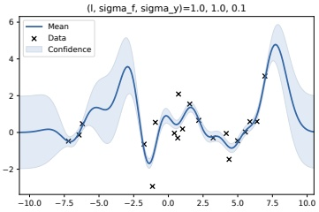

 $(a)$

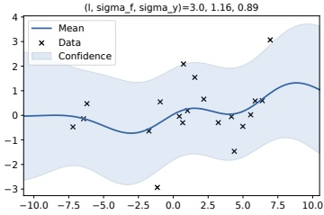

(b)

Figure 17.8: Some 1d GPs with SE kernels but different hyper-parameters fit to 20 noisy observations. The hyper-parameters ( $\ell$,  $\sigma_f$,  $\sigma_y$) are as follows: (a)  $(1,1,0.1)$ (b)  $(3.0, 1.16, 0.89)$. Adapted from Figure 2.5 of [RW06]. Generated by gprDemoChangeHparams.ipynb.

The posterior predictive mean is given by  $\mu_*\mathbf{k}_*\mathbf{K}_\sigma^{-1}\mathbf{y}$. For reasons of numerical stability, it is unwise to directly invert  $\mathbf{K}_\sigma$. A more robust alternative is to compute a Cholesky decomposition,  $\mathbf{K}_\sigma = \mathbf{L}\mathbf{L}^\top$, which takes  $O(N^3)$ time. Then we compute  $\mathbf{\alpha} = \mathbf{L}^\top \setminus (\mathbf{L} \setminus \mathbf{y})$, where we have used the backslash operator to represent backsubstitution (Section 7.7.1). Given this, we can compute the posterior mean for each test case in  $O(N)$ time using

$$
\boldsymbol{\mu}_{*}=\boldsymbol{k}_{*}^{\top}\mathbf{K}_{\sigma}^{-1}\boldsymbol{y}=\boldsymbol{k}_{*}^{\top}\mathbf{L}^{-\top}(\mathbf{L}^{-1}\boldsymbol{y})=\boldsymbol{k}_{*}^{\top}\boldsymbol{\alpha}   \tag*{(17.47)}
$$

We can compute the variance in  $O(N^{2})$ time for each test case using

$$
\sigma_{*}^{2}=k_{**}-k_{*}^{\top}\mathbf{L}^{-T}\mathbf{L}^{-1}k_{*}=k_{**}-v^{\top}v   \tag*{(17.48)}
$$

where v = L \ k*.

Finally, the log marginal likelihood (needed for kernel learning, Section 17.2.6) can be computed using

$$
\log p(\boldsymbol{y}|\mathbf{X})=-\frac{1}{2}\boldsymbol{y}^{\top}\boldsymbol{\alpha}-\sum_{n=1}^{N}\log L_{n n}-\frac{N}{2}\log(2\pi)   \tag*{(17.49)}
$$

#### 17.2.6 Estimating the kernel

Most kernels have some free parameters, which can have a large effect on the predictions from the model. For example, suppose we are performing 1d regression using a GP with an RBF kernel of the form

$$
\mathcal{K}(x_{p},x_{q})=\sigma_{f}^{2}\exp(-\frac{1}{2\ell^{2}}(x_{p}-x_{q})^{2})   \tag*{(17.50)}
$$

Here  $\ell$ is the horizontal scale over which the function changes,  $\sigma_{f}^{2}$ controls the vertical scale of the function. We assume observation noise with variance  $\sigma_{y}^{2}$.

---

We sampled 20 observations from an MVN with a covariance given by  $\mathbf{\Sigma} = \mathcal{K}(x_i, x_j)$ for a grid of points  $\{x_i\}$, and added observation noise of value  $\sigma_y$. We then fit this data using a GP with the same kernel, but with a range of hyperparrameters. Figure 17.8 illustrates the effects of changing these parameters. In Figure 17.8(a), we use  $(\ell, \sigma_f, \sigma_y) = (1, 1, 0.1)$, and the result is a good fit. In Figure 17.8(b), we increase the length scale to  $\ell = 3$; now the function looks overly smooth.

##### 17.2.6.1 Empirical Bayes

To estimate the kernel parameters  $\theta$ (sometimes called hyperparameters), we could use exhaustive search over a discrete grid of values, with validation loss as an objective, but this can be quite slow. (This is the approach used by nonprobabilistic methods, such as SVMs (Section 17.3) to tune kernels.) Here we consider an empirical Bayes approach (Section 4.6.5.3), which will allow us to use gradient-based optimization methods, which are much faster. In particular, we will maximize the marginal likelihood

$$
p(\boldsymbol{y}|\mathbf{X},\boldsymbol{\theta})=\int p(\boldsymbol{y}|\boldsymbol{f},\mathbf{X})p(\boldsymbol{f}|\mathbf{X},\boldsymbol{\theta})d\boldsymbol{f}   \tag*{(17.51)}
$$

(The reason it is called the marginal likelihood, rather than just likelihood, is because we have marginalized out the latent Gaussian vector  $\mathbf{f}$.)

For notational simplicity, we assume the mean function is 0. Since  $p(f|\mathbf{X}) = \mathcal{N}(f|\mathbf{0}, \mathbf{K})$, and  $p(y|\mathbf{f}) = \prod_{n=1}^{N} \mathcal{N}(y_n | f_n, \sigma_y^2)$, the marginal likelihood is given by

$$
\log p(\boldsymbol{y}|\mathbf{X},\boldsymbol{\theta})=\log\mathcal{N}(\boldsymbol{y}|\mathbf{0},\mathbf{K}_{\sigma})=-\frac{1}{2}\boldsymbol{y}^{\top}\mathbf{K}_{\sigma}^{-1}\boldsymbol{y}-\frac{1}{2}\log|\mathbf{K}_{\sigma}|-\frac{N}{2}\log(2\pi)   \tag*{(17.52)}
$$

where the dependence of  $\mathbf{K}_\sigma = \mathbf{K}_{X,X} + \sigma_2^2 \mathbf{I}_N$ on  $\theta$ is implicit. The first term is a data fit term, the second term is a model complexity term, and the third term is just a constant. To understand the tradeoff between the first two terms, consider a SE kernel in 1D, as we vary the length scale  $\ell$ and hold  $\sigma_y^2$ fixed. For short length scales, the fit will be good, so  $\mathbf{y}^\top \mathbf{K}_\sigma^{-1} \mathbf{y}$ will be small. However, the model complexity will be high:  $\mathbf{K}$ will be almost diagonal, (as in Figure 13.22, top right), since most points will not be considered “near” any others, so the  $\log |\mathbf{K}_\sigma|$ term will be large. For long length scales, the fit will be poor but the model complexity will be low:  $\mathbf{K}$ will be almost all 1's, (as in Figure 13.22, bottom right), so  $\log |\mathbf{K}_\sigma|$ will be small.

We now discuss how to maximize the marginal likelihood. One can show that

$$
\begin{aligned}\frac{\partial}{\partial\theta_{j}}\log p(\boldsymbol{y}|\mathbf{X},\boldsymbol{\theta})&=\frac{1}{2}\boldsymbol{y}^{\top}\mathbf{K}_{\sigma}^{-1}\frac{\partial\mathbf{K}_{\sigma}}{\partial\theta_{j}}\mathbf{K}_{\sigma}^{-1}\boldsymbol{y}-\frac{1}{2}\mathrm{tr}(\mathbf{K}_{\sigma}^{-1}\frac{\partial\mathbf{K}_{\sigma}}{\partial\theta_{j}})\\&=\frac{1}{2}\mathrm{tr}\left((\boldsymbol{\alpha}\boldsymbol{\alpha}^{\top}-\mathbf{K}_{\sigma}^{-1})\frac{\partial\mathbf{K}_{\sigma}}{\partial\theta_{j}}\right)\end{aligned}   \tag*{(17.53)}
$$

where  $\alpha = K_{\sigma}^{-1}y$. It takes  $O(N^{3})$ time to compute  $K_{\sigma}^{-1}$, and then  $O(N^{2})$ time per hyper-parameter to compute the gradient.

The form of  $\frac{\partial \mathbf{K}_{\sigma}}{\partial \theta_j}$ depends on the form of the kernel, and which parameter we are taking derivatives with respect to. Often we have constraints on the hyper-parameters, such as  $\sigma_y^2 \geq 0$. In this case, we can define  $\theta = \log(\sigma_y^2)$, and then use the chain rule.

Author: Kevin P. Murphy. (C) MIT Press. CC-BY-NC-ND license

---

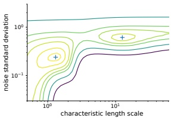

(a)

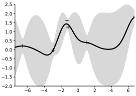

(b)

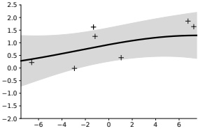

(c)

Figure 17.9: Illustration of local minima in the marginal likelihood surface. (a) We plot the log marginal likelihood vs kernel length scale  $\ell$ and observation noise  $\sigma_y$, for fixed signal level  $\sigma_f = 1$, using the 7 data points shown in panels b and c. (b) The function corresponding to the lower left local minimum,  $(\ell, \sigma_y) \approx (1, 0.2)$. This is quite “wiggly” and has low noise. (c) The function corresponding to the top right local minimum,  $(\ell, \sigma_y) \approx (10, 0.8)$. This is quite smooth and has high noise. The data was generated using  $(\ell, \sigma_f, \sigma_y) = (1, 1, 0.1)$. Adapted from Figure 5.5 of [RW06]. Generated by gpr_demo_marglik.ipynb.

Given an expression for the log marginal likelihood and its derivative, we can estimate the kernel parameters using any standard gradient-based optimizer. However, since the objective is not convex, local minima can be a problem, as we illustrate below, so we may need to use multiple restarts.

As an example, consider the RBF in Equation (17.50) with  $\sigma_f^2 = 1$. In Figure 17.9(a), we plot  $\log p(y|\mathbf{X}, \ell, \sigma_y^2)$ (where  $\mathbf{X}$ and  $\mathbf{y}$ are the 7 data points shown in panels b and c) as we vary  $\ell$ and  $\sigma_y^2$. The two local optima are indicated by +. The bottom left optimum corresponds to a low-noise, short-length scale solution (shown in panel b). The top right optimum corresponds to a high-noise, long-length scale solution (shown in panel c). With only 7 data points, there is not enough evidence to confidently decide which is more reasonable, although the more complex model (panel b) has a marginal likelihood that is about 60% higher than the simpler model (panel c). With more data, the more complex model would become even more preferred.

Figure 17.9 illustrates some other interesting (and typical) features. The region where  $\sigma_y^2 \approx 1$ (top of panel a) corresponds to the case where the noise is very high; in this regime, the marginal likelihood is insensitive to the length scale (indicated by the horizontal contours), since all the data is explained as noise. The region where  $\ell \approx 0.5$ (left hand side of panel a) corresponds to the case where the length scale is very short; in this regime, the marginal likelihood is insensitive to the noise level (indicated by the vertical contours), since the data is perfectly interpolated. Neither of these regions would be chosen by a good optimizer.

##### 17.2.6.2 Bayesian inference

When we have a small number of datapoints (e.g., when using GPs for Bayesian optimization), using a point estimate of the kernel parameters can give poor results [Bul11; WF14]. In such cases, we may wish to approximate the posterior over the kernel parameters. Several methods can be used. For example, [MA10] shows how to use slice sampling, [Hen+15] shows how to use Hamiltonian Monte Carlo, and [BBV11] shows how to use sequential Monte Carlo.

---

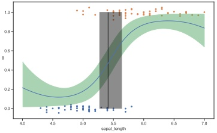

 $(a)$

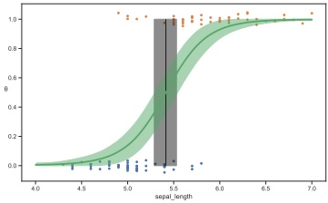

(b)

Figure 17.10: GP classifier for a binary classification problem on Iris flowers (Setosa vs Versicolor) using a single input feature (sepal length). The fat vertical line is the credible interval for the decision boundary. (a) SE kernel. (b) SE plus linear kernel. Adapted from Figures 7.11–7.12 of [Mar18]. Generated by gp_classify_iris_1d_pymc3.ipynb.

#### 17.2.7 GPs for classification

So far, we have focused on GPs for regression using Gaussian likelihoods. In this case, the posterior is also a GP, and all computation can be performed analytically. However, if the likelihood is non-Gaussian, such as the Bernoulli likelihood for binary classification, we can no longer compute the posterior exactly.

There are various approximations we can make, some of which we discuss in the sequel to this book, [Mur23]. In this section, we use the Hamiltonian Monte Carlo method (Section 4.6.8.4), both for the latent Gaussian function f as well as the kernel hyperparameters  $\theta$. The basic idea is to specify the negative log joint

$$
-\mathcal{E}(\boldsymbol{f},\boldsymbol{\theta})=\log p(\boldsymbol{f},\boldsymbol{\theta}|\mathbf{X},\boldsymbol{y})=\log\mathcal{N}(\boldsymbol{f}|\mathbf{0},\mathbf{K}(\mathbf{X},\mathbf{X}))+\sum_{n=1}^{N}\log\operatorname{Ber}(y_{n}|f_{n}(\boldsymbol{x}_{n}))+\log p(\boldsymbol{\theta})   \tag*{(17.55)}
$$

We then use autograd to compute  $\nabla_f \mathcal{E}(f, \theta)$ and  $\nabla_\theta \mathcal{E}(f, \theta)$, and use these gradients as inputs to a Gaussian proposal distribution.

Let us consider a 1d example from [Mar18]. This is similar to the Bayesian logistic regression example from Figure 4.20, where the goal is to classify iris flowers as being Setosa or Versicolor,  $y_n \in \{0,1\}$, given information about the sepal length,  $x_n$. We will use an SE kernel with length scale  $\ell$. We put a Ga(2,0.5) prior on  $\ell$.

Figure 17.10a shows the results using the SE kernel. This is similar to the results of linear logistic regression (see Figure 4.20), except that at the edges (away from the data), the probability curves towards 0.5. This is because the prior mean function is  $m(x) = 0$, and  $\sigma(0) = 0.5$. We can eliminate this artefact by using a more flexible kernel, which encodes the prior knowledge that we expect the output to be monotonically increasing or decreasing in the input. We can do this using a linear kernel,

$$
\mathcal{K}(x,x^{\prime})=(x-c)(x^{\prime}-c)   \tag*{(17.56)}
$$

Author: Kevin P. Murphy. (C) MIT Press. CC-BY-NC-ND license

---

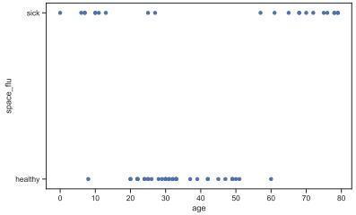

(a)

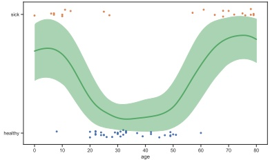

(b)

Figure 17.11: (a) Fictitious “space flu” binary classification problem. (b) Fit from a GP with SE kernel. Adapted from Figures 7.13–7.14 of [Mar18]. Generated by gp_classify_spaceflu_1d_pymc3.ipynb.

We can scale and add this to the SE kernel to get

$$
\mathcal{K}(x,x^{\prime})=\tau(x-c)(x^{\prime}-c)+\exp\left[-\frac{(x-x^{\prime})^{2}}{2\ell^{2}}\right]   \tag*{(17.57)}
$$

The results are shown in Figure 17.10b, and look more reasonable.

One might wonder why we bothered to use a GP, when the results are no better than a simple linear logistic regression model. The reason is that the GP is much more flexible, and makes fewer a priori assumptions, beyond smoothness. For example, suppose the data looked like Figure 17.11a. In this case, a linear logistic regression model could not fit the data. We could in principle use a neural network, but it may not work well since we only have 60 data points. However, GPs are well designed to handle the small sample setting. In Figure 17.11b, we show the results of fitting a GP with an SE kernel to this data. The results look reasonable.

#### 17.2.8 Connections with deep learning

It turns out that there are many interesting connections and similarities between GPs and deep neural networks. For example, one can show that a neural network with a single, infinitely wide layer of RBF units is equivalent to a GP with an RBF kernel. (This follows from the fact that the RBF kernel can be expressed as the inner product of an infinite number of features.) In fact, many kinds of DNNs (in the infinite limit) can be converted to an equivalent GP using a specific kind of kernel known as the neural tangent kernel [JGH18]. See the sequel to this book, [Mur23], for details.

#### 17.2.9 Scaling GPs to large datasets

The main disadvantage of GPs (and other kernel methods, such as SVMs, which we discuss in Section 17.3) is that inverting the  $N \times N$ kernel matrix takes  $O(N^3)$ time, making the method too

---

slow for big datasets. Many different approximate schemes have been proposed to speedup GPs (see e.g., [Liu+18a] for a review). In this section, we briefly mention some of them. For more details, see the sequel to this book, [Mur23].

##### 17.2.9.1 Sparse (inducing-point) approximations

A simple approach to speeding up GP inference is to use less data. A better approach is to try to “summarize” the $N$training points$\mathbf{X}$into$M \ll N$inducing points or pseudo inputs$\mathbf{Z}$. This lets us replace $p(\mathbf{f} | \mathbf{f}_X)$with$p(\mathbf{f} | \mathbf{f}_Z)$, where $\mathbf{f}_X = \{f(\mathbf{x}) : \mathbf{x} \in \mathbf{Z}\}$is the vector of observed function values at the training points, and$\mathbf{f}_Z = \{f(\mathbf{x}) : \mathbf{x} \in \mathbf{Z}\}$is the vector of estimated function values at the inducing points. By optimizing$(\mathbf{Z}, \mathbf{f}_Z)$we can learn to “compress” the training data$(\mathbf{X}, \mathbf{f}_X)$into a “bottleneck”$(\mathbf{Z}, \mathbf{f}_Z)$, thus speeding up computation from $O(N^3)$to$O(M^3)$. This is called a sparse GP. This whole process can be made rigorous using the framework of variational inference. For details, see the sequel to this book, [Mur23].

##### 17.2.9.2 Exploiting parallelization and kernel matrix structure

It takes  $O(N^3)$ time to compute the Cholesky decomposition of  $\mathbf{K}_{X,X}$, which is needed to solve the linear system  $\mathbf{K}_\sigma \boldsymbol{\alpha} = \boldsymbol{y}$ and to compute  $|\mathbf{K}_{X,X}|$, where  $\mathbf{K}_\sigma = \mathbf{K}_{X,X} + \sigma^2 \mathbf{I}_N$. An alternative to Cholesky decomposition is to use linear algebra methods, often called Krylov subspace methods, which are based just on matrix vector multiplication or MVM. These approaches are often much faster, since they can naturally exploit structure in the kernel matrix. Moreover, even if the kernel matrix does not have special structure, matrix multiplies are trivial to parallelize, and can thus be greatly accelerated by GPUs, unlike Cholesky based methods which are largely sequential. This is the basis of the popular GPyTorch package [Gar+18]. For more details, see the sequel to this book, [Mur23].

##### 17.2.9.3 Random feature approximation

Although the power of kernels resides in the ability to avoid working with featurized representations of the inputs, such kernelized methods take  $O(N^3)$ time, in order to invert the Gram matrix  $\mathbf{K}$. This can make it difficult to use such methods on large scale data. Fortunately, we can approximate the feature map for many (shift invariant) kernels using a randomly chosen finite set of  $M$ basis functions, thus reducing the cost to  $O(NM + M^3)$. We briefly discuss this idea below. For more details, see e.g.,  $[Liu+20]$.

##### Random features for RBF kernel

We will focus on the case of the Gaussian RBF kernel. One can show that

$$
\mathcal{K}(\boldsymbol{x},\boldsymbol{x}^{\prime})\approx\phi(\boldsymbol{x})^{\top}\phi(\boldsymbol{x}^{\prime})   \tag*{(17.58)}
$$

where the (real-valued) feature vector is given by

$$
\phi(\boldsymbol{x})\triangleq\frac{1}{\sqrt{T}}[(\sin(\boldsymbol{\omega}_{1}^{\mathsf{T}}\boldsymbol{x}),...,\sin(\boldsymbol{\omega}_{T}^{\mathsf{T}}\boldsymbol{x}),\cos(\boldsymbol{\omega}_{1}^{\mathsf{T}}\boldsymbol{x}),...,\cos(\boldsymbol{\omega}_{T}^{\mathsf{T}}\boldsymbol{x}))]   \tag*{(17.59)}
$$

$$
=\frac{1}{\sqrt{T}}\left[\sin(\Omega x),\cos(\Omega x)\right]   \tag*{(17.60)}
$$

Author: Kevin P. Murphy. (C) MIT Press. CC-BY-NC-ND license

---

where  $T = M/2$, and  $\Omega \in \mathbb{R}^{T \times D}$ is a random Gaussian matrix, where the entries are sampled iid from  $\mathcal{N}(0,1/\sigma^2)$, where  $\sigma$ is the kernel bandwidth. The bias of the approximation decreases as we increase  $M$. In practice, we use a finite  $M$, and compute a single sample Monte Carlo approximation to the expectation by drawing a single random matrix. The features in Equation (17.60) are called random Fourier features (RFF) [RR08] or “weighted sums of random kitchen sinks” [RR09].

We can also use positive random features, rather than trigonometric random features, which can be preferable in some applications, such as models which use attention (see Section 15.6.4). In particular, we can use

$$
\phi(\boldsymbol{x})\triangleq e^{-||\boldsymbol{x}||^{2}/2}\frac{1}{\sqrt{M}}\left[(\exp(\boldsymbol{\omega}_{1}^{\mathsf{T}}\boldsymbol{x}),\cdots,(\exp(\boldsymbol{\omega}_{M}^{\mathsf{T}}\boldsymbol{x}))\right.   \tag*{(17.61)}
$$

where  $\omega_{m}$ are sampled as before. For details, see [Cho+20b].

Regardless of whether we use trigonometric or positive features, we can obtain a lower variance estimate by ensuring that the rows of  $\Omega$ are random but orthogonal; these are called orthogonal random features. Such sampling can be conducted efficiently via Gram-Schmidt orthogonalization of the unstructured Gaussian matrices [Yu+16], or several approximations that are even faster (see [CRW17; Cho+19]).

##### Fastfood approximation

Unfortunately, storing the random matrix  $\Omega$ takes  $O(DM)$ space, and computing  $\Omega \times \text{takes } O(DM)$ time, where  $D$ is the input dimensionality, and  $M$ is the number of random features. This can be prohibitive if  $M \gg D$, which it may need to be in order to get any benefits over using the original set of features. Fortunately, we can use the fast  $\text{Hadamard transform}$ to reduce the memory from  $O(MD)$ to  $O(M)$, and reduce the time from  $O(MD)$ to  $O(M \log D)$. This approach has been called  $\text{fastfood [LSS13]}$, a reference to the original term “kitchen sinks”.

##### Extreme learning machines

We can use the random features approximation to the kernel to convert a GP into a linear model of the form

$$
f(x;\boldsymbol{\theta})=\mathbf{W}\boldsymbol{\phi}(x)=\mathbf{W}h(\boldsymbol{\Omega}x)   \tag*{(17.62)}
$$

where  $h(a) = \sqrt{1/M}[\sin(a), \cos(a)]$ for RBF kernels. This is equivalent to a one-layer MLP with random (and fixed) input-to-hidden weights. When  $M > N$, this corresponds to an over-parameterized model, which can perfectly interpolate the training data.

In [Cur+17], they apply this method to fit a logistic regression model of the form  $f(\boldsymbol{x};\boldsymbol{\theta}) = \boldsymbol{W}^{\top}h(\hat{\Omega}\boldsymbol{x}) + \boldsymbol{b}$ using SGD; they call the resulting method “McKernel”. We can also optimize  $\Omega$ as well as  $\mathbf{W}$, as discussed in [Alb+17], although now the problem is no longer convex.

Alternatively, we can use $M < N$, but stack many such random nonlinear layers together, and just optimize the output weights. This has been called an extreme learning machine or ELM (see e.g., [Hua14]), although this work is controversial.$^{1}$

---

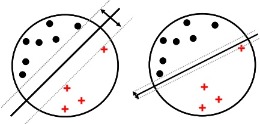

Figure 17.12: Illustration of the large margin principle. Left: a separating hyper-plane with large margin. Right: a separating hyper-plane with small margin.

### 17.3 Support vector machines (SVMs)

In this section, we discuss a form of (non-probabilistic) predictors for classification and regression problems which have the form

$$
f(\boldsymbol{x})=\sum_{i=1}^{N}\alpha_{i}\mathcal{K}(\boldsymbol{x},\boldsymbol{x}_{i})   \tag*{(17.63)}
$$

By adding suitable constraints, we can ensure that many of the  $\alpha_{i}$ coefficients are 0, so that predictions at test time only depend on a subset of the training points, known as “support vectors”. Hence the resulting model is called a support vector machine or SVM. We give a brief summary below. More details, can be found in e.g., [VGS97; SS01].

#### 17.3.1 Large margin classifiers

Consider a binary classifier of the form  $h(\boldsymbol{x}) = \mathrm{sign}(f(\boldsymbol{x}))$, where the decision boundary is given by the following linear function:

$$
f(\boldsymbol{x})=\boldsymbol{w}^{\top}\boldsymbol{x}+w_{0}   \tag*{(17.64)}
$$

(In the SVM literature, it is common to assume the class labels are -1 and +1, rather than 0 and 1. To avoid confusion, we denote such target labels by  $\bar{y}$ rather than y.) There may be many lines that separate the data. However, intuitively we would like to pick the one that has maximum  $\text{margin}$, which is the distance of the closest point to the decision boundary, since this will give us the most robust solution. This idea is illustrated in Figure 17.12: the solution on the left has larger margin than the one on the right, so it will be less sensitive to perturbations of the data.

How can we compute such a large margin classifier? First we need to derive an expression for the distance of a point to the decision boundary. Referring to Figure 17.13(a), we see that

$$
x=x_{\perp}+r\frac{w}{\left\|\boldsymbol{w}\right\|}   \tag*{(17.65)}
$$

where $r$is the distance of$\boldsymbol{x}$from the decision boundary whose normal vector is$\boldsymbol{w}$, and $\boldsymbol{x}_{\perp}$is the orthogonal projection of$\boldsymbol{x}$ onto this boundary.

Author: Kevin P. Murphy. (C) MIT Press. CC-BY-NC-ND license

---

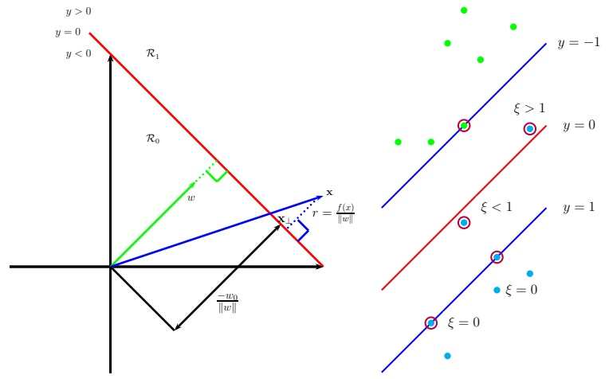

 $(a)$

(b)

Figure 17.13: (a) Illustration of the geometry of a linear decision boundary in 2d. A point x is classified as belonging in decision region  $R_1$ if  $f(\mathbf{x}) > 0$, otherwise it belongs in decision region  $R_0$; w is a vector which is perpendicular to the decision boundary. The term  $w_0$ controls the distance of the decision boundary from the origin.  $x_{\perp}$ is the orthogonal projection of x onto the boundary. The signed distance of x from the boundary is given by  $f(\mathbf{x}) / ||\mathbf{w}||$. Adapted from Figure 4.1 of [Bis06]. (b) Points with circles around them are support vectors, and have dual variables  $\alpha_n > 0$. In the soft margin case, we associate a slack variable  $\xi_n$ with each example. If  $0 < \xi_n < 1$, the point is inside the margin, but on the correct side of the decision boundary. If  $\xi_n > 1$, the point is on the wrong side of the boundary. Adapted from Figure 7.3 of [Bis06].

We would like to maximize r, so we need to express it as a function of w. First, note that

$$
f(\boldsymbol{x})=\boldsymbol{w}^{\mathsf{T}}\boldsymbol{x}+w_{0}=(\boldsymbol{w}^{\mathsf{T}}\boldsymbol{x}_{\perp}+w_{0})+r\frac{\boldsymbol{w}^{\mathsf{T}}\boldsymbol{w}}{||\boldsymbol{w}||}=(\boldsymbol{w}^{\mathsf{T}}\boldsymbol{x}_{\perp}+w_{0})+r||\boldsymbol{w}||   \tag*{(17.66)}
$$

Since  $0 = f(\boldsymbol{x}_{\perp}) = \boldsymbol{w}^{\mathrm{T}}\boldsymbol{x}_{\perp} + w_{0}$, we have  $f(\boldsymbol{x}) = r||\boldsymbol{w}||$ and hence  $r = \frac{f(\boldsymbol{x})}{||\boldsymbol{w}||}$.

Since we want to ensure each point is on the correct side of the boundary, we also require  $f(\boldsymbol{x}_n)\tilde{y}_n > 0$. We want to maximize the distance of the closest point, so our final objective becomes

$$
\max_{\boldsymbol{w},w_{0}}\frac{1}{\left|\left|\boldsymbol{w}\right|\right|}\min_{n=1}^{N}\left[\tilde{y}_{n}(\boldsymbol{w}^{\mathsf{T}}\boldsymbol{x}_{n}+w_{0})\right]   \tag*{(17.67)}
$$

Note that by rescaling the parameters using  $\boldsymbol{w} \to k\boldsymbol{w}$ and  $w_0 \to k w_0$, we do not change the distance of any point to the boundary, since the  $k$ factor cancels out when we divide by  $\|\boldsymbol{w}\|$. Therefore let us define the scale factor such that  $\tilde{y}_n f_n = 1$ for the point that is closest to the decision boundary.

---

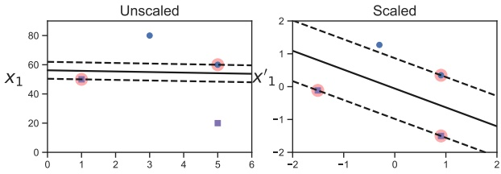

Figure 17.14: Illustration of the benefits of scaling the input features before computing a max margin classifier. Adapted from Figure 5.2 of [Gér19]. Generated by svm_classifier_feature_scaling.ipynb.

Hence we require  $\tilde{y}_n f_n \geq 1$ for all  $n$. Finally, note that maximizing  $1/||\mathbf{w}||$ is equivalent to minimizing  $||\mathbf{w}||^2$. Thus we get the new objective

$$
\min_{\boldsymbol{w},w_{0}}\frac{1}{2}||\boldsymbol{w}||^{2}\text{s.t.}\tilde{y}_{n}(\boldsymbol{w}^{\mathsf{T}}\boldsymbol{x}_{n}+w_{0})\geq1,n=1:N   \tag*{(17.68)}
$$

(The factor of  $\frac{1}{2}$ is added for convenience and doesn't affect the optimal parameters.) The constraint says that we want all points to be on the correct side of the decision boundary with a margin of at least 1.

Note that it is important to scale the input variables before using an SVM, otherwise the margin measures distance of a point to the boundary using all input dimensions equally. See Figure 17.14 for an illustration.

#### 17.3.2 The dual problem

The objective in Equation (17.68) is a standard quadratic programming problem (Section 8.5.4), since we have a quadratic objective subject to linear constraints. This has  $N + D + 1$ variables subject to N constraints, and is known as a primal problem.

In convex optimization, for every primal problem we can derive a dual problem. Let  $\alpha \in \mathbb{R}^N$ be the dual variables, corresponding to Lagrange multipliers that enforce the  $N$ inequality constraints. The generalized Lagrangian is given below (see Section 8.5.2 for relevant background information on constrained optimization):

$$
\mathcal{L}(\boldsymbol{w},w_{0},\boldsymbol{\alpha})=\frac{1}{2}\boldsymbol{w}^{\top}\boldsymbol{w}-\sum_{n=1}^{N}\alpha_{n}(\tilde{y}_{n}(\boldsymbol{w}^{\top}\boldsymbol{x}_{n}+w_{0})-1)   \tag*{(17.69)}
$$

To optimize this, we must find a stationary point that satisfies

$$
(\hat{\boldsymbol{w}},\hat{w}_{0},\hat{\boldsymbol{\alpha}})=\min_{\boldsymbol{w},w_{0}}\max_{\boldsymbol{\alpha}}\mathcal{L}(\boldsymbol{w},w_{0},\boldsymbol{\alpha})   \tag*{(17.70)}
$$

Author: Kevin P. Murphy. (C) MIT Press. CC-BY-NC-ND license

---

We can do this by computing the partial derivatives wrt w and w0 and setting to zero. We have

$$
\nabla_{\boldsymbol{w}}\mathcal{L}(\boldsymbol{w},w_{0},\boldsymbol{\alpha})=\boldsymbol{w}-\sum_{n=1}^{N}\alpha_{n}\tilde{y}_{n}\boldsymbol{x}_{n}   \tag*{(17.71)}
$$

$$
\frac{\partial}{\partial w_{0}}\mathcal{L}(\boldsymbol{w},w_{0},\boldsymbol{\alpha})=-\sum_{n=1}^{N}\alpha_{n}\tilde{y}_{n}   \tag*{(17.72)}
$$

and hence

$$
\hat{\boldsymbol{w}}=\sum_{n=1}^{N}\hat{\alpha}_{n}\tilde{y}_{n}\boldsymbol{x}_{n}   \tag*{(17.73)}
$$

$$
0=\sum_{n=1}^{N}\hat{\alpha}_{n}\tilde{y}_{n}   \tag*{(17.74)}
$$

Plugging these into the Lagrangian yields the following

$$
\mathcal{L}(\hat{\boldsymbol{w}},\hat{w}_{0},\boldsymbol{\alpha})=\frac{1}{2}\hat{\boldsymbol{w}}^{\top}\hat{\boldsymbol{w}}-\sum_{n=1}^{N}\alpha_{n}\tilde{y}_{n}\hat{\boldsymbol{w}}^{\top}\boldsymbol{x}_{n}-\sum_{n=1}^{N}\alpha_{n}\tilde{y}_{n}w_{0}+\sum_{n=1}^{N}\alpha_{n}   \tag*{(17.75)}
$$

$$
=\frac{1}{2}\hat{\boldsymbol{w}}^{\mathsf{T}}\hat{\boldsymbol{w}}-\hat{\boldsymbol{w}}^{\mathsf{T}}\hat{\boldsymbol{w}}-0+\sum_{n=1}^{N}\alpha_{n}   \tag*{(17.76)}
$$

$$
=-\frac{1}{2}\sum_{i=1}^{N}\sum_{j=1}^{N}\alpha_{i}\alpha_{j}\tilde{y}_{i}\tilde{y}_{j}\boldsymbol{x}_{i}^{\mathsf{T}}\boldsymbol{x}_{j}+\sum_{n=1}^{N}\alpha_{n}   \tag*{(17.77)}
$$

This is called the dual form of the objective. We want to maximize this wrt  $\alpha$ subject to the constraints that  $\sum_{n=1}^{N} \alpha_n \tilde{y}_n = 0$ and  $0 \leq \alpha_n$ for  $n = 1 : N$.

The above objective is a quadratic problem in N variables. Standard QP solvers take  $O(N^{3})$ time. However, specialized algorithms, which avoid the use of generic QP solvers, have been developed for this problem, such as the sequential minimal optimization or SMO algorithm [Pla98], which takes  $O(N)$ to  $O(N^{2})$ time.

Since this is a convex objective, the solution must satisfy the KKT conditions (Section 8.5.2), which tell us that the following properties hold:

$$
\alpha_{n}\geq0   \tag*{(17.78)}
$$

$$
\tilde{y}_{n}f(\boldsymbol{x}_{n})-1\geq0   \tag*{(17.79)}
$$

$$
\alpha_{n}(\tilde{y}_{n}f(\boldsymbol{x}_{n})-1)=0   \tag*{(17.80)}
$$

Hence either  $\alpha_n = 0$ (in which case example  $n$ is ignored when computing  $\hat{w}$) or the constraint  $\tilde{y}_n(\hat{\mathbf{w}}^\top \mathbf{x}_n + \hat{w}_0) = 1$ is active. This latter condition means that example  $n$ lies on the decision boundary; these points are known as the support vectors, as shown in Figure 17.13(b). We denote the set of support vectors by  $\mathcal{S}$.

---

To perform prediction, we use

$$
f(\boldsymbol{x};\hat{\boldsymbol{w}},\hat{w}_{0})=\hat{\boldsymbol{w}}^{\top}\boldsymbol{x}+\hat{w}_{0}=\sum_{n\in\mathcal{S}}\alpha_{n}\tilde{y}_{n}\boldsymbol{x}_{n}^{\top}\boldsymbol{x}+\hat{w}_{0}   \tag*{(17.81)}
$$

To solve for  $\hat{w}_0$ we can use the fact that for any support vector, we have  $\tilde{y}_n f(\boldsymbol{x}; \hat{\boldsymbol{w}}, \hat{w}_0) = 1$. Multiplying both sides by  $\tilde{y}_n$, and exploiting the fact that  $\tilde{y}_n^2 = 1$, we get  $\hat{w}_0 = \tilde{y}_n - \hat{\boldsymbol{w}}^\top \boldsymbol{x}_n$. In practice we get better results by averaging over all the support vectors to get

$$
\hat{w}_{0}=\frac{1}{|\mathcal{S}|}\sum_{n\in\mathcal{S}}\big(\tilde{y}_{n}-\hat{\boldsymbol{w}}^{\mathsf{T}}\boldsymbol{x}_{n}\big)=\frac{1}{|\mathcal{S}|}\sum_{n\in\mathcal{S}}\big(\tilde{y}_{n}-\sum_{m\in\mathcal{S}}\alpha_{m}\tilde{y}_{m}\boldsymbol{x}_{m}^{\mathsf{T}}\boldsymbol{x}_{n}\big)   \tag*{(17.82)}
$$

#### 17.3.3 Soft margin classifiers

If the data is not linearly separable, there will be no feasible solution in which  $\tilde{y}_n f_n \geq 1$ for all  $n$. We therefore introduce slack variables  $\xi_n \geq 0$ and replace the hard constraints that  $\tilde{y}_n f_n \geq 0$ with the soft margin constraints that  $\tilde{y}_n f_n \geq 1 - \xi_n$. The new objective becomes

$$
\min_{\boldsymbol{w},w_{0},\boldsymbol{\xi}}\frac{1}{2}||\boldsymbol{w}||^{2}+C\sum_{n=1}^{N}\xi_{n}\text{s.t.}\xi_{n}\geq0,\tilde{y}_{n}(\boldsymbol{x}_{n}^{\mathsf{T}}\boldsymbol{w}+w_{0})\geq1-\xi_{n}   \tag*{(17.83)}
$$

where  $C \geq 0$ is a hyper parameter controlling how many points we allow to violate the margin constraint. (If  $C = \infty$, we recover the unregularized, hard-margin classifier.)

The corresponding Lagrangian for the soft margin classifier becomes

$$
\mathcal{L}(\boldsymbol{w},w_{0},\boldsymbol{\alpha},\boldsymbol{\xi},\boldsymbol{\mu})=\frac{1}{2}\boldsymbol{w}^{\top}\boldsymbol{w}+C\sum_{n=1}^{N}\xi_{n}-\sum_{n=1}^{N}\alpha_{n}(\tilde{y}_{n}(\boldsymbol{w}^{\top}\boldsymbol{x}_{n}+w_{0})-1+\xi_{n})-\sum_{n=1}^{N}\mu_{n}\xi_{n}   \tag*{(17.84)}
$$

where  $\alpha_n \geq 0$ and  $\mu_n \geq 0$ are the Lagrange multipliers. Optimizing out  $\boldsymbol{w}$,  $w_0$ and  $\boldsymbol{\xi}$ gives the dual form

$$
\mathcal{L}(\boldsymbol{\alpha})=\sum_{i=1}^{N}\alpha_{i}-\frac{1}{2}\sum_{i=1}^{N}\sum_{j=1}^{N}\alpha_{i}\alpha_{j}\tilde{y}_{i}\tilde{y}_{j}\boldsymbol{x}_{i}^{\top}\boldsymbol{x}_{j}   \tag*{(17.85)}
$$

This is identical to the hard margin case; however, the constraints are different. In particular, the KKT conditions imply

$$
0\leq\alpha_{n}\leq C   \tag*{(17.86)}
$$

$$
\sum_{n=1}^{N}\alpha_{n}\tilde{y}_{n}=0   \tag*{(17.87)}
$$

If  $\alpha_n = 0$, the point is ignored. If  $0 < \alpha_n < C$ then  $\xi_n = 0$, so the point lies on the margin. If  $\alpha_n = C$, the point can lie inside the margin, and can either be correctly classified if  $\xi_n \leq 1$, or misclassified if  $\xi_n > 1$. See Figure 17.13(b) for an illustration. Hence  $\sum_n \xi_n$ is an upper bound on the number of misclassified points.

Author: Kevin P. Murphy. (C) MIT Press. CC-BY-NC-ND license

---

As before, the bias term can be computed using

$$
\hat{w}_{0}=\frac{1}{|\mathcal{M}|}\sum_{n\in\mathcal{M}}\left(\tilde{y}_{n}-\sum_{m\in\mathcal{S}}\alpha_{m}\tilde{y}_{m}\boldsymbol{x}_{m}^{\mathsf{T}}\boldsymbol{x}_{n}\right)   \tag*{(17.88)}
$$

where M is the set of points having  $0 < \alpha_{n} < C$.

There is an alternative formulation of the soft margin SVM known as the  $\nu$-SVM classifier [Sch+00]. This involves maximizing

$$
\mathcal{L}(\boldsymbol{\alpha})=-\frac{1}{2}\sum_{i=1}^{N}\sum_{j=1}^{N}\alpha_{i}\alpha_{j}\tilde{y}_{i}\tilde{y}_{j}\boldsymbol{x}_{i}^{\top}\boldsymbol{x}_{j}   \tag*{(17.89)}
$$

subject to the constraints that

$$
0\leq\alpha_{n}\leq1/N   \tag*{(17.90)}
$$

$$
\sum_{n=1}^{N}\alpha_{n}\tilde{y}_{n}=0   \tag*{(17.91)}
$$

$$
\sum_{n=1}^{M}\alpha_{n}\geq\nu   \tag*{(17.92)}
$$

This has the advantage that the parameter  $\nu$, which replaces  $C$, can be interpreted as an upper bound on the fraction of  $\text{margin errors}$ (points for which  $\xi_n > 0$), as well as a lower bound on the number of support vectors.

#### 17.3.4 The kernel trick

So far we have converted the large margin binary classification problem into a dual problem in $N$ unknowns ($\mathbf{a}$) which (in general) takes $O(N^{3})$time to solve, which can be slow. However, the principal benefit of the dual problem is that we can replace all inner product operations$\mathbf{x}^{\top}\mathbf{x}^{\prime}$with a call to a positive definite (Mercer) kernel function,$\mathcal{K}(\mathbf{x},\mathbf{x}^{\prime})$. This is called the kernel trick.

In particular, we can rewrite the prediction function in Equation  $(17.81)$ as follows:

$$
f(\boldsymbol{x})=\hat{\boldsymbol{w}}^{\top}\boldsymbol{x}+\hat{w}_{0}=\sum_{n\in\mathcal{S}}\alpha_{n}\tilde{y}_{n}\boldsymbol{x}_{n}^{\top}\boldsymbol{x}+\hat{w}_{0}=\sum_{n\in\mathcal{S}}\alpha_{n}\tilde{y}_{n}\mathcal{K}(\boldsymbol{x}_{n},\boldsymbol{x})+\hat{w}_{0}   \tag*{(17.93)}
$$

We also need to kernelize the bias term. This can be done by kernelizing Equation (17.82) as follows:

$$
\hat{w}_{0}=\frac{1}{|\mathcal{S}|}\sum_{i\in\mathcal{S}}\left(\tilde{y}_{i}-(\sum_{j\in\mathcal{S}}\hat{\alpha}_{j}\tilde{y}_{j}\boldsymbol{x}_{j})^{\top}\boldsymbol{x}_{i}\right)=\frac{1}{|\mathcal{S}|}\sum_{i\in\mathcal{S}}\left(\tilde{y}_{i}-\sum_{j\in\mathcal{S}}\hat{\alpha}_{j}\tilde{y}_{j}\mathcal{K}(\boldsymbol{x}_{j},\boldsymbol{x}_{i})\right)   \tag*{(17.94)}
$$

The kernel trick allows us to avoid having to deal with an explicit feature representation of our data, and allows us to easily apply classifiers to structured objects, such as strings and graphs.

---

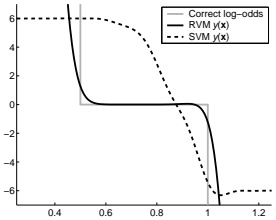

Figure 17.15: Log-odds vs x for 3 different methods. Adapted from Figure 10 of [Tip01]. Used with kind permission of Mike Tipping.

#### 17.3.5 Converting SVM outputs into probabilities

An SVM classifier produces a hard-labeling,  $\hat{y}(\boldsymbol{x}) = \text{sign}(f(\boldsymbol{x}))$. However, we often want a measure of confidence in our prediction. One heuristic approach is to interpret  $f(\boldsymbol{x})$ as the log-odds ratio,  $\log \frac{p(y=1|\boldsymbol{x})}{p(y=0|\boldsymbol{x})}$. We can then convert the output of an SVM to a probability using

$$
p(y=1|\boldsymbol{x},\boldsymbol{\theta})=\sigma(af(\boldsymbol{x})+b)   \tag*{(17.95)}
$$

where a, b can be estimated by maximum likelihood on a separate validation set. (Using the training set to estimate a and b leads to severe overfitting.) This technique was first proposed in [Pla00], and is known as Platt scaling.

However, the resulting probabilities are not particularly well calibrated, since there is nothing in the SVM training procedure that justifies interpreting  $f(\boldsymbol{x})$ as a log-odds ratio. To illustrate this, consider an example from [Tip01]. Suppose we have 1d data where  $p(x|y=0) = \text{Unif}(0,1)$ and  $p(x|y=1) = \text{Unif}(0.5,1.5)$. Since the class-conditional distributions overlap in the [0.5,1] range, the log-odds of class 1 over class 0 should be zero in this region, and infinite outside this region. We sampled 1000 points from the model, and then fit a probabilistic kernel classifier (an RVM, described in Section 17.4.1) and an SVM with a Gaussian kernel of width 0.1. Both models can perfectly capture the decision boundary, and achieve a generalization error of 25%, which is Bayes optimal in this problem. The probabilistic output from the RVM is a good approximation to the true log-odds, but this is not the case for the SVM, as shown in Figure 17.15.

#### 17.3.6 Connection with logistic regression

We have seen that data points that are on the correct side of the decision boundary have  $\xi_n = 0$; for the others, we have  $\xi_n = 1 - \tilde{y}_n f(\boldsymbol{x}_n)$. Therefore we can rewrite the objective in Equation (17.83) as follows:

$$
\mathcal{L}(\boldsymbol{w})=\sum_{n=1}^{N}\ell_{\mathrm{hinge}}(\tilde{y}_{n},f(\boldsymbol{x}_{n})))+\lambda|\boldsymbol{w}||^{2}   \tag*{(17.96)}
$$

where  $\lambda = (2C)^{-1}$ and  $\ell_{\mathrm{hinge}}(y, \eta)$ is the hinge loss function defined by

$$
\ell_{\mathrm{h i n g e}}(\tilde{y},\eta)=\max(0,1-\tilde{y}\eta)   \tag*{(17.97)}
$$

Author: Kevin P. Murphy. (C) MIT Press. CC-BY-NC-ND license

---

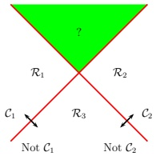

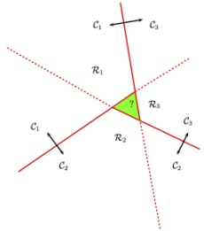

(a)

(b)

Figure 17.16: (a) The one-versus-rest approach. The green region is predicted to be both class 1 and class 2. (b) The one-versus-one approach. The label of the green region is ambiguous. Adapted from Figure 4.2 of [Bis06].

As we see from Figure 4.2, this is a convex, piecewise differentiable upper bound to the 0-1 loss, that has the shape of a partially open door hinge.

By contrast, (penalized) logistic regression optimizes

$$
\mathcal{L}(\boldsymbol{w})=\sum_{n=1}^{N}\ell_{l l}(\tilde{y}_{n},f(\boldsymbol{x}_{n})))+\lambda|\boldsymbol{w}||^{2}   \tag*{(17.98)}
$$

where the log loss is given by

$$
\ell_{l l}(\tilde{y},\eta)=-\log p(y|\eta)=\log(1+e^{-\tilde{y}\eta})   \tag*{(17.99)}
$$

This is also plotted in Figure 4.2. We see that it is similar to the hinge loss, but with two important differences. First the hinge loss is piecewise linear, so we cannot use regular gradient methods to optimize it. (We can, however, compute the subgradient at  $\tilde{y}\eta = 1$.) Second, the hinge loss has a region where it is strictly 0; this results in sparse estimates.

We see that both functions are convex upper bounds on the 0-1 loss, which is given by

$$
\ell_{01}(\tilde{y},\hat{y})=\mathbb{I}\left(\tilde{y}\neq\hat{y}\right)=\mathbb{I}\left(\tilde{y}\hat{y}<0\right)   \tag*{(17.100)}
$$

These upper bounds are easier to optimize and can be viewed as surrogates for the 0-1 loss. See Section 4.3.2 for details.

#### 17.3.7 Multi-class classification with SVMs

SVMs are inherently a binary classifier. One way to convert them to a multi-class classification model is to train $C$binary classifiers, where the data from class$c$is treated as positive, and the data from all the other classes is treated as negative. We then use the rule$\hat{y}(\boldsymbol{x}) = \arg\max_{c} f_{c}(\boldsymbol{x})$ to

---

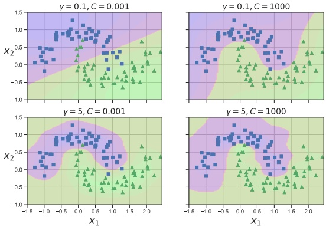

Figure 17.17: SVM classifier with RBF kernel with precision  $\gamma$ and regularizer C applied to two moons data. Adapted from Figure 5.9 of [Gér19]. Generated by svm_classifier_2d.ipynb.

predict the final label, where  $f_c(\boldsymbol{x}) = \log \frac{p(c=1|\boldsymbol{x})}{p(c=0|\boldsymbol{x})}$ is the score given by classifier c. This is known as the one-versus-the-rest approach (also called one-vs-all).

Unfortunately, this approach has several problems. First, it can result in regions of input space which are ambiguously labeled. For example, the green region at the top of Figure 17.16(a) is predicted to be both class 2 and class 1. A second problem is that the magnitude of the  $f_c$'s scores are not calibrated with each other, so it is hard to compare them. Finally, each binary subproblem is likely to suffer from the class imbalance problem (Section 10.3.8.2). For example, suppose we have 10 equally represented classes. When training  $f_1$, we will have 10% positive examples and 90% negative examples, which can hurt performance.

Another approach is to use the one-versus-one or OVO approach, also called all pairs, in which we train  $C(C-1)/2$ classifiers to discriminate all pairs  $f_{c,c'}$. We then classify a point into the class which has the highest number of votes. However, this can also result in ambiguities, as shown in Figure 17.16(b). Also, this requires fitting  $O(C^2)$ models.

#### 17.3.8 How to choose the regularizer C

SVMs require that you specify the kernel function and the parameter C. Typically C is chosen by cross-validation. Note, however, that C interacts quite strongly with the kernel parameters. For example, suppose we are using an RBF kernel with precision  $\gamma = \frac{1}{2\sigma^2}$. If  $\gamma$ is large, corresponding to narrow kernels, we may need heavy regularization, and hence small C. If  $\gamma$ is small, a larger value of C should be used. So we see that  $\gamma$ and C are tightly coupled, as illustrated in Figure 17.17.

The authors of libsvm [HCL03] recommend using CV over a 2d grid with values C ∈ {2−5, 2−3, …, 215}

Author: Kevin P. Murphy. (C) MIT Press. CC-BY-NC-ND license

---

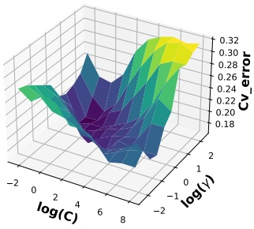

 $(a)$

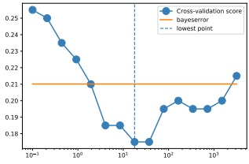

(b)

Figure 17.18: (a) A cross validation estimate of the 0-1 error for an SVM classifier with RBF kernel with different precisions  $\gamma = 1/(2\sigma^2)$ and different regularizer  $\lambda = 1/C$, applied to a synthetic data set drawn from a mixture of 2 Gaussians. (b) A slice through this surface for  $\gamma = 5$ The red dotted line is the Bayes optimal error, computed using Bayes rule applied to the model used to generate the data. Adapted from Figure 12.6 of [HTF09]. Generated by svmCgammaDemo.ipynb.

and  $\gamma \in \{2^{-15}, 2^{-13}, \ldots, 2^3\}$. See Figure 17.18 which shows the CV estimate of the 0-1 risk as a function of  $C$ and  $\gamma$.

To choose $C$efficiently, one can develop a path following algorithm in the spirit of Lars (Section 11.4.4). The basic idea is to start with$C$small, so that the margin is wide, and hence all points are inside of it and have$\alpha_i = 1$. By slowly increasing $C$, a small set of points will move from inside the margin to outside, and their $\alpha_i$values will change from 1 to 0, as they cease to be support vectors. When$C$ is maximal, the margin becomes empty, and no support vectors remain. See [Has+04] for the details.

#### 17.3.9 Kernel ridge regression

Recall the equation for ridge regression from Equation (11.55):

$$
\hat{\boldsymbol{w}}_{\mathrm{map}}=(\mathbf{X}^{\top}\mathbf{X}+\lambda\mathbf{I}_{D})^{-1}\mathbf{X}^{\top}\boldsymbol{y}=(\sum_{n}\boldsymbol{x}_{n}\boldsymbol{x}_{n}^{\top}+\lambda\mathbf{I}_{D})^{-1}(\sum_{n}\tilde{y}_{n}\boldsymbol{x}_{n})   \tag*{(17.101)}
$$

Using the matrix inversion lemma (Section 7.3.3), we can rewrite the ridge estimate as follows

$$
\boldsymbol{w}=\mathbf{X}^{\top}(\mathbf{X}\mathbf{X}^{\top}+\lambda\mathbf{I}_{N})^{-1}\boldsymbol{y}=\sum_{n}\boldsymbol{x}_{n}((\sum_{n}\boldsymbol{x}_{n}^{\top}\boldsymbol{x}_{n}+\lambda\mathbf{I}_{N})^{-1}\boldsymbol{y})_{n}   \tag*{(17.102)}
$$

Let us define the following dual variables:

$$
\boldsymbol{\alpha}\triangleq(\mathbf{X}\mathbf{X}^{\mathsf{T}}+\lambda\mathbf{I}_{N})^{-1}\boldsymbol{y}=(\sum_{n}\boldsymbol{x}_{n}^{\mathsf{T}}\boldsymbol{x}_{n}+\lambda\mathbf{I}_{N})^{-1}\boldsymbol{y}   \tag*{(17.103)}
$$

“Probabilistic Machine Learning: An Introduction”. Online version. November 23, 2024

---

Then we can rewrite the primal variables as follows

$$
\boldsymbol{w}=\boldsymbol{X}^{\top}\boldsymbol{\alpha}=\sum_{n=1}^{N}\alpha_{n}\boldsymbol{x}_{n}   \tag*{(17.104)}
$$

This tells us that the solution vector is just a linear sum of the N training vectors. When we plug this in at test time to compute the predictive mean, we get

$$
f(\boldsymbol{x};\boldsymbol{w})=\boldsymbol{w}^{\top}\boldsymbol{x}=\sum_{n=1}^{N}\alpha_{n}\boldsymbol{x}_{n}^{\top}\boldsymbol{x}   \tag*{(17.105)}
$$

We can then use the kernel trick to rewrite this as

$$
f(\boldsymbol{x};\boldsymbol{w})=\sum_{n=1}^{N}\alpha_{n}\mathcal{K}(\boldsymbol{x}_{n},\boldsymbol{x})   \tag*{(17.106)}
$$

where

$$
\boldsymbol{\alpha}=(\mathbf{K}+\lambda\mathbf{I}_{N})^{-1}\boldsymbol{y}   \tag*{(17.107)}
$$

In other words,

$$
f(\boldsymbol{x};\boldsymbol{w})=\boldsymbol{k}^{\mathrm{T}}(\mathbf{K}+\lambda\mathbf{I}_{N})^{-1}\boldsymbol{y}   \tag*{(17.108)}
$$

where  $k = [\mathcal{K}(x, x_1), \ldots, \mathcal{K}(x, x_N)]$. This is called kernel ridge regression.

The trouble with the above approach is that the solution vector  $\alpha$ is not sparse, so predictions at test time will take  $O(N)$ time. We discuss a solution to this in Section 17.3.10.

#### 17.3.10 SVMs for regression

Consider the following  $\ell_{2}$-regularized ERM problem:

$$
J(\boldsymbol{w},\lambda)=\lambda||\boldsymbol{w}||^{2}+\sum_{n=1}^{N}\ell(\tilde{y}_{n},\hat{y}_{n})   \tag*{(17.109)}
$$

where  $\hat{y}_n = \boldsymbol{w}^\top \boldsymbol{x}_n + w_0$. If we use the quadratic loss,  $\ell(y, \hat{y}) = (y - \hat{y})^2$, where  $y, \hat{y} \in \mathbb{R}$, we recover ridge regression (Section 11.3). If we then apply the kernel trick, we recover kernel ridge regression (Section 17.3.9).

The problem with kernel ridge regression is that the solution depends on all N training points, which makes it computationally intractable. However, by changing the loss function, we can make the optimal set of basis function coefficients,  $\alpha^{*}$, be sparse, as we show below.

In particular, consider the following variant of the Huber loss function (Section 5.1.5.3) called the epsilon insensitive loss function:

$$
L_{\epsilon}(y,\hat{y})\triangleq\begin{cases}{\begin{array}{c c}{0}&{\mathrm{i f~}|y-\hat{y}|<\epsilon}\\ {|y-\hat{y}|-\epsilon}&{\mathrm{o t h e r w i s e}}\\ \end{array}}\\ \end{cases}   \tag*{(17.110)}
$$

Author: Kevin P. Murphy. (C) MIT Press. CC-BY-NC-ND license

---

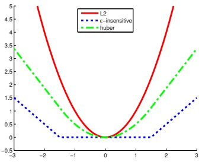

 $y(x)$

 $(a)$

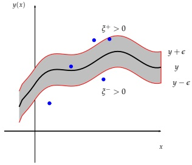

(b)

Figure 17.19: (a) Illustration of $\ell_2$, Huber and $\epsilon$-insensitive loss functions, where $\epsilon = 1.5$. Generated by huberLossPlot.ipynb. (b) Illustration of the $\epsilon$-tube used in SVM regression. Points above the tube have $\xi_i^+ > 0$and$\xi_i^- = 0$. Points below the tube have $\xi_i^+ = 0$and$\xi_i^- > 0$. Points inside the tube have $\xi_i^+ = \xi_i^- = 0$. Adapted from Figure 7.7 of [Bis06].

This means that any point lying inside an  $\epsilon$-tube around the prediction is not penalized, as in Figure 17.19.

The corresponding objective function is usually written in the following form

$$
J=\frac{1}{2}||\boldsymbol{w}||^{2}+C\sum_{n=1}^{N}L_{\epsilon}(\tilde{y}_{n},\hat{y}_{n})   \tag*{(17.111)}
$$

where  $\hat{y}_n = f(\boldsymbol{x}_n) = \boldsymbol{w}^\top \boldsymbol{x}_n + w_0$ and  $C = 1/\lambda$ is a regularization constant. This objective is convex and unconstrained, but not differentiable, because of the absolute value function in the loss term. As in Section 11.4.9, where we discussed the lasso problem, there are several possible algorithms we could use. One popular approach is to formulate the problem as a constrained optimization problem. In particular, we introduce slack variables to represent the degree to which each point lies outside the tube:

$$
\tilde{y}_{n}\leq f(\boldsymbol{x}_{n})+\epsilon+\xi_{n}^{+}   \tag*{(17.112)}
$$

$$
\tilde{y}_{n}\geq f(\boldsymbol{x}_{n})-\epsilon-\xi_{n}^{-}   \tag*{(17.113)}
$$

Given this, we can rewrite the objective as follows:

$$
J=\frac{1}{2}||\boldsymbol{w}||^{2}+C\sum_{n=1}^{N}(\xi_{n}^{+}+\xi_{n}^{-})   \tag*{(17.114)}
$$

This is a quadratic function of  $\boldsymbol{w}$, and must be minimized subject to the linear constraints in Equations 17.112-17.113, as well as the positivity constraints  $\xi_n^+ \geq 0$ and  $\xi_n^- \geq 0$. This is a standard quadratic program in  $2N + D + 1$ variables.

---

By forming the Lagrangian and optimizing, as we did above, one can show that the optimal solution has the following form

$$
\hat{w}=\sum_{n}\alpha_{n}x_{n}   \tag*{(17.115)}
$$

where  $\alpha_n \geq 0$ are the dual variables. (See e.g., [SS02] for details.) Fortunately, the  $\alpha$ vector is sparse, meaning that many of its entries are equal to 0. This is because the loss doesn't care about errors which are smaller than  $\epsilon$. The degree of sparsity is controlled by  $C$ and  $\epsilon$.

The  $\mathbf{x}_n$ for which  $\alpha_n > 0$ are called the support vectors; these are points for which the errors lie on or outside the  $\epsilon$ tube. These are the only training examples we need to keep for prediction at test time, since

$$
f(\boldsymbol{x})=\hat{w}_{0}+\hat{\boldsymbol{w}}^{\mathrm{T}}\boldsymbol{x}=\hat{w}_{0}+\sum_{n:\alpha_{n}>0}\alpha_{n}\boldsymbol{x}_{n}^{\mathrm{T}}\boldsymbol{x}   \tag*{(17.116)}
$$

Finally, we can use the kernel trick to get

$$
f(\boldsymbol{x})=\hat{w}_{0}+\sum_{n:\alpha_{n}>0}\alpha_{n}\mathcal{K}(\boldsymbol{x}_{n},\boldsymbol{x})   \tag*{(17.117)}
$$

This overall technique is called support vector machine regression or SVM regression for short, and was first proposed in [VGS97].

In Figure 17.20, we give an example where we use an RBF kernel with  $\gamma = 1$. When C is small, the model is heavily regularized; when C is large, the model is less regularized and can fit the data better. We also see that when  $\epsilon$ is small, the tube is smaller, so there are more support vectors.

### 17.4 Sparse vector machines

GPs are very flexible models, but incur an  $O(N)$ time cost at prediction time, which can be prohibitive. SVMs solve that problem by estimating a sparse weight vector. However, SVMs do not give calibrated probabilistic outputs.

We can get the best of both worlds by using parametric models, where the feature vector is defined using basis functions centered on each of the training points, as follows:

$$
\phi(\boldsymbol{x})=[\mathcal{K}(\boldsymbol{x},\boldsymbol{x}_{1}),\ldots,\mathcal{K}(\boldsymbol{x},\boldsymbol{x}_{N})]   \tag*{(17.118)}
$$

where  $\mathcal{K}$ is any similarity kernel, not necessarily a Mercer kernel. Equation (17.118) maps  $\boldsymbol{x} \in \mathcal{X}$ into  $\phi(\boldsymbol{x}) \in \mathbb{R}^N$. We can plug this new feature vector into any discriminative model, such as logistic regression. Since we have  $D = N$ parameters, we need to use some kind of regularization, to prevent overfitting. If we fit such a model using  $\ell_2$ regularization (which we will call L2VM, for  $\ell_2$-vector machine), the result often has good predictive performance, but the weight vector  $\boldsymbol{w}$ will be dense, and will depend on all  $N$ training points. A natural solution is to impose a sparsity-promoting prior on  $\boldsymbol{w}$, so that not all the exemplars need to be kept. We call such methods sparse vector machines.

Author: Kevin P. Murphy. (C) MIT Press. CC-BY-NC-ND license

---

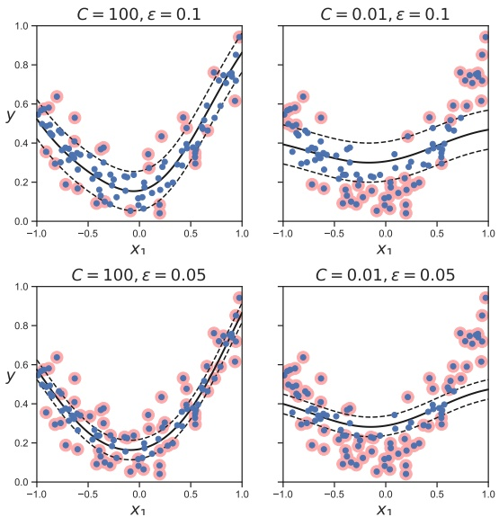

Figure 17.20: Illustration of support vector regression. Adapted from Figure 5.11 of [Gér19]. Generated by svm_regression_1d.ipynb.

#### 17.4.1 Relevance vector machines (RVMs)

The simplest way to ensure w is sparse is to use  $\ell_{1}$ regularization, as in Section 11.4. We call this L1VM or Laplace vector machine, since this approach is equivalent to using MAP estimation with a Laplace prior for w.

However, sometimes  $\ell_1$ regularization does not result in a sufficient level of sparsity for a given level of accuracy. An alternative approach is based on the use of ARD or automatic relevancy determination, which uses type II maximum likelihood (aka empirical Bayes) to estimate a sparse weight vector [Mac95; Nea96]. If we apply this technique to a feature vector defined in terms of kernels, as in Equation (17.118), we get a method called the relevance vector machine or RVM [Tip01; TF03].

#### 17.4.2 Comparison of sparse and dense kernel methods

In Figure 17.21, we compare L2VM, L1VM, RVM and an SVM using an RBF kernel on a binary classification problem in 2d. We use cross validation to pick  $C = 1/\lambda$ for the SVM (see Section 17.3.8).

---

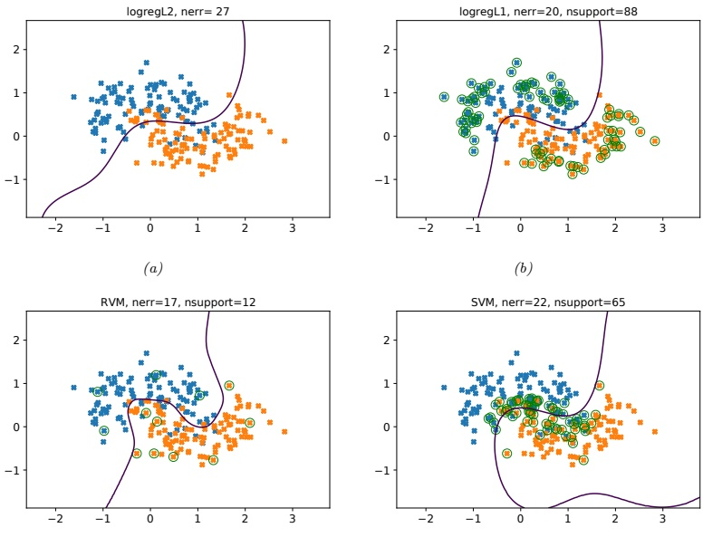

(c)

 $(d)$

Figure 17.21: Example of non-linear binary classification using an RBF kernel with bandwidth  $\sigma = 0.3$. (a) L2VM. (b) L1VM. (c) RVM. (d) SVM. Green circles denote the support vectors. Generated by kernelBinaryClassifDemo.ipynb.

and then use the same value of the regularizer for L2VM and L1VM. We see that all the methods give similar predictive performance. However, we see that the RVM is the sparsest model, so it will be the fastest at run time.

In Figure 17.22, we compare L2VM, L1VM, RVM and an SVM using an RBF kernel on a 1d regression problem. Again, we see that predictions are quite similar, but RVM is the sparsest, then L1VM, then SVM. This is further illustrated in Figure 17.23.

Beyond these small empirical examples, we provide a more general summary of the different methods in Table 17.1. The columns of this table have the following meaning:

- Optimize  $w$: a key question is whether the objective  $\mathcal{L}(\boldsymbol{w}) = -\log p(\mathcal{D}|\boldsymbol{w}) - \log p(\boldsymbol{w})$ is convex or not. L2VM, L1VM and SVMs have convex objectives. RVMs do not. GPs are Bayesian methods that integrate out the weights  $w$.

Author: Kevin P. Murphy. (C) MIT Press. CC-BY-NC-ND license

---

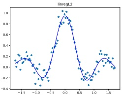

 $(a)$

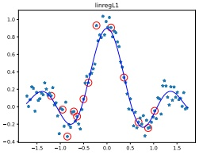

RVM

(b)

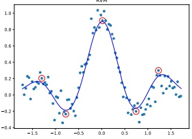

(c)

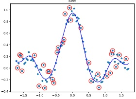

 $(d)$

Figure 17.22: Model fits for kernel based regression on the noisy sinc function using an RBF kernel with bandwidth  $\sigma = 0.3$. (a) L2VM with  $\lambda = 0.5$. (b) L1VM with  $\lambda = 0.5$. (c) RVM. (d) SVM regression with  $C = 1/\lambda$. chosen by cross validation. Red circles denote the retained training exemplars. Generated by rum_regression_1d.ipynb.

- Optimize kernel: all the methods require that we “tune” the kernel parameters, such as the bandwidth of the RBF kernel, as well as the level of regularization. For methods based on Gaussian priors, including L2VM, RVMs and GPs, we can use efficient gradient based optimizers to maximize the marginal likelihood. For SVMs and L1VMs, we must use cross validation, which is slower (see Section 17.3.8).

• Sparse: L1VM, RVMs and SVMs are sparse kernel methods, in that they only use a subset of the training examples. GPs and L2VM are not sparse: they use all the training examples. The principle advantage of sparsity is that prediction at test time is usually faster. However, this usually results in overconfidence in the predictions.

- Probabilistic: All the methods except for SVMs produce probabilistic output of the form  $p(y|\boldsymbol{x})$. SVMs produce a “confidence” value that can be converted to a probability, but such probabilities are usually very poorly calibrated (see Section 17.3.5).

• Multiclass: All the methods except for SVMs naturally work in the multiclass setting, by using a categorical distribution instead of a Bernoulli. The SVM can be made into a multiclass classifier, but there are various difficulties with this approach, as discussed in Section 17.3.7.

---

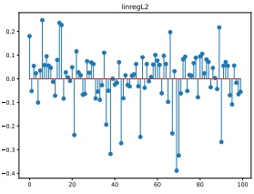

 $(a)$

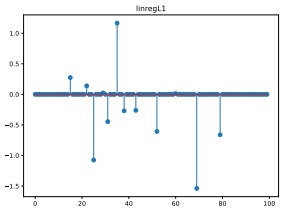

RVM

(b)

SVM

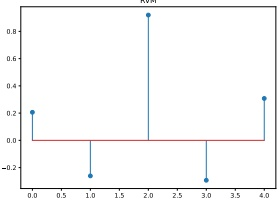

(c)

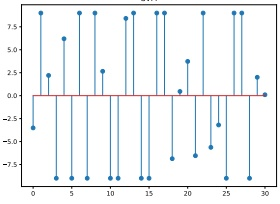

(d)

Figure 17.23: Estimated coefficients for the models in Figure 17.22. Generated by rvm_regression_1d.ipynb.

<table border=1 style='margin: auto; word-wrap: break-word;'><tr><td style='text-align: center; word-wrap: break-word;'>Method</td><td style='text-align: center; word-wrap: break-word;'>Opt. w</td><td style='text-align: center; word-wrap: break-word;'>Opt. kernel</td><td style='text-align: center; word-wrap: break-word;'>Sparse</td><td style='text-align: center; word-wrap: break-word;'>Prob.</td><td style='text-align: center; word-wrap: break-word;'>Multiclass</td><td style='text-align: center; word-wrap: break-word;'>Non-Mercer</td><td style='text-align: center; word-wrap: break-word;'>Section</td></tr><tr><td style='text-align: center; word-wrap: break-word;'>SVM</td><td style='text-align: center; word-wrap: break-word;'>Convex</td><td style='text-align: center; word-wrap: break-word;'>CV</td><td style='text-align: center; word-wrap: break-word;'>Yes</td><td style='text-align: center; word-wrap: break-word;'>No</td><td style='text-align: center; word-wrap: break-word;'>Indirectly</td><td style='text-align: center; word-wrap: break-word;'>No</td><td style='text-align: center; word-wrap: break-word;'>17.3</td></tr><tr><td style='text-align: center; word-wrap: break-word;'>L2VM</td><td style='text-align: center; word-wrap: break-word;'>Convex</td><td style='text-align: center; word-wrap: break-word;'>EB</td><td style='text-align: center; word-wrap: break-word;'>No</td><td style='text-align: center; word-wrap: break-word;'>Yes</td><td style='text-align: center; word-wrap: break-word;'>Yes</td><td style='text-align: center; word-wrap: break-word;'>Yes</td><td style='text-align: center; word-wrap: break-word;'>17.4.1</td></tr><tr><td style='text-align: center; word-wrap: break-word;'>L1VM</td><td style='text-align: center; word-wrap: break-word;'>Convex</td><td style='text-align: center; word-wrap: break-word;'>CV</td><td style='text-align: center; word-wrap: break-word;'>Yes</td><td style='text-align: center; word-wrap: break-word;'>Yes</td><td style='text-align: center; word-wrap: break-word;'>Yes</td><td style='text-align: center; word-wrap: break-word;'>Yes</td><td style='text-align: center; word-wrap: break-word;'>17.4.1</td></tr><tr><td style='text-align: center; word-wrap: break-word;'>RVM</td><td style='text-align: center; word-wrap: break-word;'>Not convex</td><td style='text-align: center; word-wrap: break-word;'>EB</td><td style='text-align: center; word-wrap: break-word;'>Yes</td><td style='text-align: center; word-wrap: break-word;'>Yes</td><td style='text-align: center; word-wrap: break-word;'>Yes</td><td style='text-align: center; word-wrap: break-word;'>Yes</td><td style='text-align: center; word-wrap: break-word;'>17.4.1</td></tr><tr><td style='text-align: center; word-wrap: break-word;'>GP</td><td style='text-align: center; word-wrap: break-word;'>N/A</td><td style='text-align: center; word-wrap: break-word;'>EB</td><td style='text-align: center; word-wrap: break-word;'>No</td><td style='text-align: center; word-wrap: break-word;'>Yes</td><td style='text-align: center; word-wrap: break-word;'>Yes</td><td style='text-align: center; word-wrap: break-word;'>No</td><td style='text-align: center; word-wrap: break-word;'>17.2.7</td></tr></table>

Table 17.1: Comparison of various kernel based classifiers. EB = empirical Bayes, CV = cross validation. See text for details.

● Mercer kernel: SVMs and GPs require that the kernel is positive definite; the other techniques do not, since the kernel function in Equation (17.118) can be an arbitrary function of two inputs.

### 17.5 Exercises

Exercise 17.1 [Fitting an SVM classifier by hand †]

(Source: Jaakkola.) Consider a dataset with 2 points in 1d:  $x_1 = 0$ with label  $y_1 = -1$ and  $x_2 = \sqrt{2}$ with label  $y_2 = 1$. Consider mapping each point to 3d using the feature vector  $\phi(x) = [1, \sqrt{2}x, x^2]^T$. (This is

Author: Kevin P. Murphy. (C) MIT Press. CC-BY-NC-ND license

---

equivalent to using a second order polynomial kernel.) The max margin classifier has the form

$$
\min||\boldsymbol{w}||^{2}\text{s.t.}   \tag*{(17.119)}
$$

$$
y_{1}(\boldsymbol{w}^{T}\phi(\boldsymbol{x}_{1})+w_{0})\geq1   \tag*{(17.120)}
$$

$$
y_{2}(\boldsymbol{w}^{T}\phi(\boldsymbol{x}_{2})+w_{0})\geq1   \tag*{(17.121)}
$$

a. Write down a vector that is parallel to the optimal vector w. Hint: recall from Figure 17.12(a) that w is perpendicular to the decision boundary between the two points in the 3d feature space.

b. What is the value of the margin that is achieved by this w? Hint: recall that the margin is the distance from each support vector to the decision boundary. Hint 2: think about the geometry of 2 points in space, with a line separating one from the other.

c. Solve for w, using the fact that the margin is equal to 1/||w||.

d. Solve for  $w_{0}$ using your value for w and Equations 17.119 to 17.121. Hint: the points will be on the decision boundary, so the inequalities will be tight.

e. Write down the form of the discriminant function  $f(x) = w_0 + \boldsymbol{w}^T \phi(x)$ as an explicit function of  $x$.

---

### 18.1 Classification and regression trees (CART)

Classification and regression trees or CART models [BFO84], also called decision trees [Qui86; Qui93], are defined by recursively partitioning the input space, and defining a local model in each resulting region of input space. The overall model can be represented by a tree, with one leaf per region, as we explain below.

#### 18.1.1 Model definition

We start by considering regression trees, where all inputs are real-valued. The tree consists of a set of nested decision rules. At each node  $i$, the feature dimension  $d_i$ of the input vector  $\boldsymbol{x}$ is compared to a threshold value  $t_i$, and the input is then passed down to the left or right branch, depending on whether it is above or below threshold. At the leaves of the tree, the model specifies the predicted output for any input that falls into that part of the input space.

For example, consider the regression tree in Figure 18.1(a). The first node asks if  $x_{1}$ is less than some threshold  $t_{1}$. If yes, we then ask if  $x_{2}$ is less than some other threshold  $t_{2}$. If yes, we enter the bottom left leaf node. This corresponds to the region of space defined by

$$
R_{1}=\left\{\boldsymbol{x}:x_{1}\leq t_{1},x_{2}\leq t_{2}\right\}   \tag*{(18.1)}
$$

We can associate this region with the predicted output, say y = 2. In a similar way, we can partition the entire input space into 5 regions using axis parallel splits, as shown in Figure 18.1(b). $^{1}$

Formally, a regression tree can be defined by

$$
f(\boldsymbol{x};\boldsymbol{\theta})=\sum_{j=1}^{J}w_{j}\mathbb{I}\left(\boldsymbol{x}\in R_{j}\right)   \tag*{(18.2)}
$$

where  $R_{j}$ is the region specified by the j'th leaf node,  $w_{j}$ is the predicted output for that node,

$$
w_{j}=\frac{\sum_{n=1}^{N}y_{n}\mathbb{I}\left(\boldsymbol{x}_{n}\in R_{j}\right)}{\sum_{n=1}^{N}\mathbb{I}\left(\boldsymbol{x}_{n}\in R_{j}\right)}   \tag*{(18.3)}
$$

---

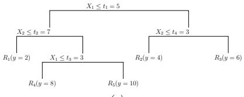

 $(a)$

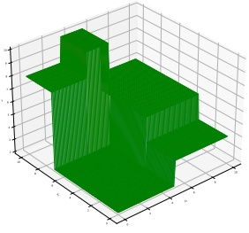

(b)

Figure 18.1: (a) A regression tree on two inputs. (b) Corresponding piecewise constant surface, where the regions have heights 2, 4, 6, 8 and 10. Adapted from Figure 9.2 of [HTF09]. Generated by regtreeSurfaceDemo.ipynb.

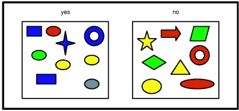

 $(a)$

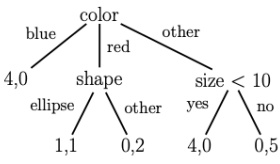

(b)

Figure 18.2: (a) A set of shapes with corresponding binary labels. The features are: color (values “blue”, “red”, “other”), shape (values “ellipse”, “other”), and size (real-valued). (b) A hypothetical classification tree fitted to this data. A leaf labeled as  $(n_1, n_0)$ means that there are  $n_1$ positive examples that fall into this partition, and  $n_0$ negative examples.

and  $\boldsymbol{\theta}=\{(R_j,w_j):j=1:J\}$, where  $J$ is the number of nodes. The regions themselves are defined by the feature dimensions that are used in each split, and the corresponding thresholds, on the path from the root to the leaf. For example, in Figure 18.1(a), we have  $R_1=[(x_1\leq t_1),(x_2\leq t_2)]$,  $R_4=[(x_1\leq t_1),(x_2>t_2),(x_3\leq t_3)]$, etc. (For categorical inputs, we can define the splits based on comparing feature  $x_i$ to each of the possible values for that feature, rather than comparing to a numeric threshold.) We discuss how to learn these regions in Section 18.1.2.

For classification problems, the leaves contain a distribution over the class labels, rather than just the mean response. See Figure 18.2 for an example of a classification tree.

---

#### 18.1.2 Model fitting

To fit the model, we need to minimize the following loss:

$$
\mathcal{L}(\boldsymbol{\theta})=\sum_{n=1}^{N}\ell(y_{n},f(\boldsymbol{x}_{n};\boldsymbol{\theta}))=\sum_{j=1}^{J}\sum_{\boldsymbol{x}_{n}\in R_{j}}\ell(y_{n},w_{j})   \tag*{(18.4)}
$$

Unfortunately, this is not differentiable, because of the need to learn the discrete tree structure. Indeed, finding the optimal partitioning of the data is NP-complete [HR76]. The standard practice is to use a greedy procedure, in which we iteratively grow the tree one node at a time. This approach is used by CART [BF084], C4.5 [Qui93], and ID3 [Qui86], which are three popular implementations of the method.

The idea is as follows. Suppose we are at node  $i$; let  $\mathcal{D}_i = \{(\boldsymbol{x}_n, y_n) \in N_i\}$ be the set of examples that reach this node. We will consider how to split this node into a left branch and right branch so as to minimize the error in each child subtree.

If the $j$th feature is a real-valued scalar, we can partition the data at node $i$by comparing to a threshold$t$. The set of possible thresholds $\mathcal{T}_j$for feature$j$can be obtained by sorting the unique values of$\{x_{nj}\}$. For example, if feature 1 has the values $\{4.5, -12, 72, -12\}$, then we set $\mathcal{T}_1 = \{-12, 4.5, 72\}$. For each possible threshold, we define the left and right splits, $\mathcal{D}_i^L(j, t) = \{(\boldsymbol{x}_n, y_n) \in N_i : x_{n,j} \leq t\}$and$\mathcal{D}_i^R(j, t) = \{(\boldsymbol{x}_n, y_n) \in N_i : x_{n,j} > t\}$.

If the $j$th feature is categorical, with $K_j$possible values, then we check if the feature is equal to each of those values or not. This defines a set of$K_j$possible binary splits:$\mathcal{D}_i^L(j,t) = \{(\mathbf{x}_n,y_n) \in N_i \mid x_{n,j} = t\}$and$\mathcal{D}_i^R(j,t) = \{(\mathbf{x}_n,y_n) \in N_i : x_{n,j} \neq t\}\).) (Alternatively, we could allow for a multi-way split, as in Figure 18.2(b)). However, this may cause data fragmentation, in which too little data might “fall” into each subtree, resulting in overfitting. Therefore it is more common to use binary splits.)

Once we have computed  $\mathcal{D}_i^L(j,t)$ and  $\mathcal{D}_i^R(j,t)$ for each  $j$ and  $t$ at node  $i$, we choose the best feature  $j_i$ to split on, and the best value for that feature,  $t_i$, as follows:

 
$$
\left(j_{i},t_{i}\right)=\arg\min_{j\in\{1,\ldots,D\}}\min_{t\in\mathcal{T}_{j}}\frac{\left|\mathcal{D}_{i}^{L}(j,t)\right|}{\left|\mathcal{D}_{i}\right|}c(\mathcal{D}_{i}^{L}(j,t))+\frac{\left|\mathcal{D}_{i}^{R}(j,t)\right|}{\left|\mathcal{D}_{i}\right|}c(\mathcal{D}_{i}^{R}(j,t))
$$
 

We now discuss the cost function  $c(\mathcal{D}_i)$ which is used to evaluate the cost of node  $i$. For regression, we can use the mean squared error

$$
\mathrm{cost}(\mathcal{D}_{i})=\frac{1}{|\mathcal{D}|}\sum_{n\in\mathcal{D}_{i}}(y_{n}-\overline{y})^{2}   \tag*{(18.6)}
$$

where  $\overline{y} = \frac{1}{|\mathcal{D}|} \sum_{n \in \mathcal{D}_i} y_n$ is the mean of the response variable for examples reaching node  $i$.

For classification, we first compute the empirical distribution over class labels for this node:

$$
\hat{\pi}_{i c}=\frac{1}{\left|\mathcal{D}_{i}\right|}\sum_{n\in\mathcal{D}_{i}}\mathbb{I}\left(y_{n}=c\right)   \tag*{(18.7)}
$$

Given this, we can then compute the Gini index

$$
G_{i}=\sum_{c=1}^{C}\hat{\pi}_{ic}(1-\hat{\pi}_{ic})=\sum_{c}\hat{\pi}_{ic}-\sum_{c}\hat{\pi}_{ic}^{2}=1-\sum_{c}\hat{\pi}_{ic}^{2}   \tag*{(18.8)}
$$

Author: Kevin P. Murphy. (C) MIT Press. CC-BY-NC-ND license

---

This is the expected error rate. To see this, note that  $\hat{\pi}_{ic}$ is the probability a random entry in the leaf belongs to class  $c$, and  $1 - \hat{\pi}_{ic}$ is the probability it would be misclassified.

Alternatively we can define cost as the entropy or deviance of the node:

$$
H_{i}=\mathbb{H}(\hat{\boldsymbol{\pi}}_{i})=-\sum_{c=1}^{C}\hat{\pi}_{ic}\log\hat{\pi}_{ic}   \tag*{(18.9)}
$$

A node that is  $\underline{\text{pure}}$ (i.e., only has examples of one class) will have 0 entropy.

Given one of the above cost functions, we can use Equation (18.5) to pick the best feature, and best threshold at each node. We then partition the data, and call the fitting algorithm recursively on each subset of the data.

In [SL99], they propose to soften the hard split decision at each node by using a binary logistic regression model. This is called a differentiable decision tree or soft decision tree. For a fixed tree structure, this allows them to fit the model by gradient-based optimization methods.

#### 18.1.3 Regularization

If we let the tree become deep enough, it can achieve 0 error on the training set (assuming no label noise), by partitioning the input space into sufficiently small regions where the output is constant. However, this will typically result in overfitting. To prevent this, there are two main approaches. The first is to stop the tree growing process according to some heuristic, such as having too few examples at a node, or reaching a maximum depth. The second approach is to grow the tree to its maximum depth, where no more splits are possible, and then to prune it back, by merging split subtrees back into their parent (see e.g., [BA97b]). This can partially overcome the greedy nature of top-down tree growing. (For example, consider applying the top-down approach to the xor data in Figure 13.1: the algorithm would never make any splits, since each feature on its own has no predictive power.) However, forward growing and backward pruning is slower than the greedy top-down approach.

#### 18.1.4 Handling missing input features

In general, it is hard for discriminative models, such as neural networks, to handle missing input features, as we discussed in Section 1.5.5. However, for trees, there are some simple heuristics that can work well.

The standard heuristic for handling missing inputs in decision trees is to look for a series of “backup” variables, which can induce a similar partition to the chosen variable at any given split; these can be used in case the chosen variable is unobserved at test time. These are called surrogate splits. This method finds highly correlated features, and can be thought of as learning a local joint model of the input. This has the advantage over a generative model of not modeling the entire joint distribution of inputs, but it has the disadvantage of being entirely ad hoc. A simpler approach, applicable to categorical variables, is to code “missing” as a new value, and then to treat the data as fully observed.

#### 18.1.5 Pros and cons

Tree models are popular for several reasons:

• They are easy to interpret.

---

### 18.1. Classification and regression trees (CART)

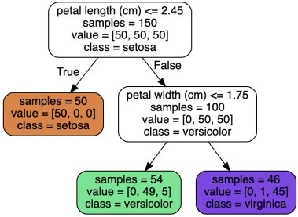

 $(a)$

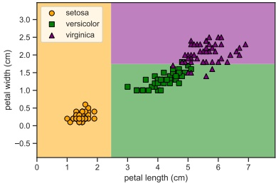

(b)

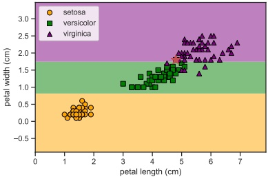

(c)

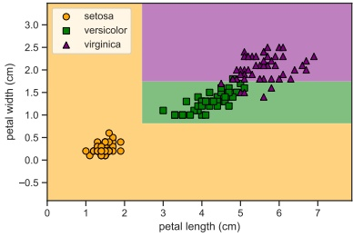

(d)

Figure 18.3: (a) A decision tree of depth 2 fit to the iris data, using just the petal length and petal width features. Leaf nodes are color coded according to the majority class. The number of training samples that pass from the root to each node is shown inside each box, as well as how many of these values fall into each class. This can be normalized to get a distribution over class labels for each node. (b) Decision surface induced by (a). (c) Fit to data where we omit a single data point (shown by red star). (d) Ensemble of the two models in (b) and (c). Generated by dtree_sensitivity.ipynb.

• They can easily handle mixed discrete and continuous inputs.

- They are insensitive to monotone transformations of the inputs (because the split points are based on ranking the data points), so there is no need to standardize the data.

• They perform automatic variable selection.

• They are relatively robust to outliers.

• They are fast to fit, and scale well to large data sets.

• They can handle missing input features.

Author: Kevin P. Murphy. (C) MIT Press. CC-BY-NC-ND license

---

However, tree models also have some disadvantages. The primary one is that they do not predict very accurately compared to other kinds of model. This is in part due to the greedy nature of the tree construction algorithm.

A related problem is that trees are unstable: small changes to the input data can have large effects on the structure of the tree, due to the hierarchical nature of the tree-growing process, causing errors at the top to affect the rest of the tree. For example, consider the tree in Figure 18.3b. Omitting even a single data point from the training set can result in a dramatically different decision surface, as shown in Figure 18.3c, due to the use of axis parallel splits. (Omitting features can also cause instability.) In Section 18.3 and Section 18.4, we will turn this instability into a virtue.

### 18.2 Ensemble learning

In Section 18.1, we saw that decision trees can be quite unstable, in the sense that their predictions might vary a lot if the training data is perturbed. In other words, decision trees are a high variance estimator. A simple way to reduce variance is to average multiple models. This is called ensemble learning. The result model has the form

$$
f(y|\boldsymbol{x})=\frac{1}{|\mathcal{M}|}\sum_{m\in\mathcal{M}}f_{m}(y|\boldsymbol{x})   \tag*{(18.10)}
$$

where  $f_{m}$ is the  $m'$th base model. The ensemble will have similar bias to the base models, but lower variance, generally resulting in improved overall performance (see Section 4.7.6.3 for details on the bias-variance tradeoff).

Averaging is a sensible way to combine predictions from regression models. For classifiers, it can sometimes be better to take a majority vote of the outputs. (This is sometimes called a  $\text{committee method}$.) To see why this can help, suppose each base model is a binary classifier with an accuracy of  $\theta$, and suppose class 1 is the correct class. Let  $Y_m \in \{0,1\}$ be the prediction for the  $m$'th model, and let  $S = \sum_{m=1}^M Y_m$ be the number of votes for class 1. We define the final predictor to be the majority vote, i.e., class 1 if  $S > M/2$ and class 0 otherwise. The probability that the ensemble will pick class 1 is

$$
p=\Pr(S>M/2)=1-B(M/2,M,\theta)   \tag*{(18.11)}
$$

where  $B(x, M, \theta)$ is the cdf of the binomial distribution with parameters M and  $\theta$ evaluated at x. For  $\theta = 0.51$ and M = 1000, we get p = 0.73 and with M = 10,000 we get p = 0.97.

The performance of the voting approach is dramatically improved, because we assumed each predictor made independent errors. In practice, their mistakes may be correlated, but as long as we ensemble sufficiently diverse models, we can still come out ahead.

#### 18.2.1 Stacking

An alternative to using an unweighted average or majority vote is to learn how to combine the base models, by using

$$
f(y|\boldsymbol{x})=\sum_{m\in\mathcal{M}}w_{m}f_{m}(y|\boldsymbol{x})   \tag*{(18.12)}
$$

---

This is called \textbf{stacking}, which stands for “stacked generalization” [Wol92]. Note that the combination weights used by stacking need to be trained on a separate dataset, otherwise they would put all their mass on the best performing base model.

#### 18.2.2 Ensembling is not Bayes model averaging

It is worth noting that an ensemble of models is not the same as using Bayes model averaging over models (Section 4.6), as pointed out in [Min00]. An ensemble considers a larger hypothesis class of the form

$$
p(y|\boldsymbol{x},\boldsymbol{w},\boldsymbol{\theta})=\sum_{m\in\mathcal{M}}w_{m}p(y|\boldsymbol{x},\boldsymbol{\theta}_{m})   \tag*{(18.13)}
$$

whereas BMA uses

$$
p(y|\boldsymbol{x},\mathcal{D})=\sum_{m\in\mathcal{M}}p(m|\mathcal{D})p(y|\boldsymbol{x},m,\mathcal{D})   \tag*{(18.14)}
$$

The key difference is that in the case of BMA, the weights  $p(m|\mathcal{D})$ sum to one, and in the limit of infinite data, only a single model will be chosen (namely the MAP model). By contrast, the ensemble weights  $w_m$ are arbitrary, and don't collapse in this way to a single model.

### 18.3 Bagging

In this section, we discuss bagging [Bre96], which stands for “bootstrap aggregating”. This is a simple form of ensemble learning in which we fit M different base models to different randomly sampled versions of the data; this encourages the different models to make diverse predictions. The datasets are sampled with replacement (a technique known as bootstrap sampling, Section 4.7.3), so a given example may appear multiple times, until we have a total of N examples per model (where N is the number of original data points).

The disadvantage of bootstrap is that each base model only sees, on average, 63% of the unique input examples. To see why, note that the chance that a single item will not be selected from a set of size N in any of N draws is  $(1 - 1/N)^N$. In the limit of large N, this becomes  $e^{-1} \approx 0.37$, which means only  $1 - 0.37 = 0.63$ of the data points will be selected.

The 37% of the training instances that are not used by a given base model are called out-of-bag instances (oob). We can use the predicted performance of the base model on these oob instances as an estimate of test set performance. This provides a useful alternative to cross validation.

The main advantage of bootstrap is that it prevents the ensemble from relying too much on any individual training example, which enhances robustness and generalization [Gra04]. For example, comparing Figure 18.3b and Figure 18.3c, we see that omitting a single example from the training set can have a large impact on the decision tree that we learn (even though the tree growing algorithm is otherwise deterministic). By averaging the predictions from both of these models, we get the more reasonable prediction model in Figure 18.3d. This advantage generally increases with the size of the ensemble, as shown in Figure 18.4. (Of course, larger ensembles take more memory and more time.)

Bagging does not always improve performance. In particular, it relies on the base models being unstable estimators, so that omitting some of the data significantly changes the resulting model fit.

---

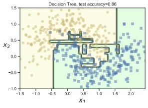

 $(a)$

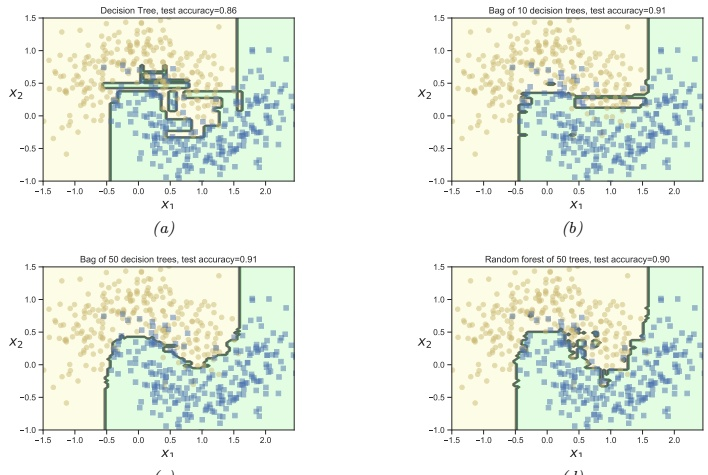

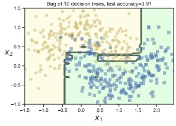

(b)

(c)

(d)

Figure 18.4: (a) A single decision tree. (b-c) Bagging ensemble of 10 and 50 trees. (d) Random forest of 50 trees. Adapted from Figure 7.5 of [Gér19]. Generated by bagging_trees.ipynb and rf_demo_2d.ipynb.

This is the case for decision trees, but not for other models, such as nearest neighbor classifiers. For neural networks, the story is more mixed. They can be unstable wrt their training set. On the other hand, deep networks will underperform if they only see 63% of the data, so bagged DNNs do not usually work well [NTL20].

### 18.4 Random forests

Bagging relies on the assumption that re-running the same learning algorithm on different subsets of the data will result in sufficiently diverse base models. The technique known as random forests [Bre01] tries to decorrelate the base learners even further by learning trees based on a randomly chosen subset of input variables (at each node of the tree), as well as a randomly chosen subset of data cases. It does this by modifying Equation (18.5) so the feature split dimension j is optimized over a random subset of the features,  $S_i \subset \{1, \ldots, D\}$.

For example, consider the email spam dataset [HTF09, p301]. This dataset contains 4601 email messages, each of which is classified as spam (1) or non-spam (0). The data was open sourced by George Forman from Hewlett-Packard (HP) Labs.

There are 57 quantitative (real-valued) features, as follows:

- 48 features corresponding to the percentage of words in the email that match a given word, such as “remove” or “labs”.

---

Figure 18.5: Preditive accuracy vs size of tree ensemble for bagging, random forests and gradient boosting with log loss. Adapted from Figure 15.1 of [HTF09]. Generated by spam_tree_ensemble_compare.ipynb.

• 6 features corresponding to the percentage of characters in the email that match a given character, namely ; . [ ! $ #

- 3 features corresponding to the average length, max length, and sum of lengths of uninterrupted sequences of capital letters. (These features are called CAPAVE, CAPMAX and CAPTOT.)

Figure 18.5 shows that random forests work much better than bagged decision trees, because many input features are irrelevant. (We also see that a method called “boosting”, discussed in Section 18.5, works even better; however, this requires sequentially fitting trees, whereas random forests can be fit in parallel.)

### 18.5 Boosting

Ensembles of trees, whether fit by bagging or the random forest algorithm, corresponding to a model of the form

$$
f(\boldsymbol{x};\boldsymbol{\theta})=\sum_{m=1}^{M}\beta_{m}F_{m}(\boldsymbol{x};\boldsymbol{\theta}_{m})   \tag*{(18.15)}
$$

where  $F_m$ is the  $m'$th tree, and  $\beta_m$ is the corresponding weight, often set to  $\beta_m = 1/M$. We can generalize this by allowing the  $F_m$ functions to be general function approximators, such as neural networks, not just trees. The result is called an additive model [HTF09]. We can think of this as a linear model with adaptive basis functions. The goal, as usual, is to minimize the empirical loss (with an optional regularizer):

$$
\mathcal{L}(f)=\sum_{i=1}^{N}\ell(y_{i},f(\boldsymbol{x}_{i}))   \tag*{(18.16)}
$$

Boosting [Sch90; FS96] is an algorithm for sequentially fitting additive models where each  $F_m$ is a binary classifier that returns  $F_m \in \{-1, +1\}$. In particular, we first fit  $F_1$ on the original data,

Author: Kevin P. Murphy. (C) MIT Press. CC-BY-NC-ND license

---

and then we weight the data samples by the errors made by  $F_{1}$, so misclassified examples get more weight. Next we fit  $F_{2}$ to this weighted data set. We keep repeating this process until we have fit the desired number M of components. (M is a hyper-parameter that controls the complexity of the overall model, and can be chosen by monitoring performance on a validation set, and using early stopping.)

It can be shown that, as long as each  $F_{m}$ has an accuracy that is better than chance (even on the weighted dataset), then the final ensemble of classifiers will have higher accuracy than any given component. That is, if  $F_{m}$ is a weak learner (so its accuracy is only slightly better than 50%), then we can boost its performance using the above procedure so that the final f becomes a strong learner. (See e.g., [SF12] for more details on the learning theory approach to boosting.)

Note that boosting reduces the bias of the strong learner, by fitting trees that depend on each other, whereas bagging and RF reduce the variance by fitting independent trees. In many cases, boosting can work better. See Figure 18.5 for an example.

The original boosting algorithm focused on binary classification with a particular loss function that we will explain in Section 18.5.3, and was derived from the PAC learning theory framework (see Section 5.4.4). In the rest of this section, we focus on a more statistical version of boosting, due to [FHT00; Fri01], which works with arbitrary loss functions, making the method suitable for regression, multi-class classification, ranking, etc. Our presentation is based on [HTF09, ch10] and [BH07], which should be consulted for further details.

#### 18.5.1 Forward stagewise additive modeling

In this section, we discuss forward stagewise additive modeling, in which we sequentially optimize the objective in Equation (18.16) for general (differentiable) loss functions, where f is an additive model as in Equation 18.15. That is, at iteration m, we compute

$$
(\beta_{m},\boldsymbol{\theta}_{m})=\underset{\beta,\boldsymbol{\theta}}{\mathrm{a r g m i n}}\sum_{i=1}^{N}\ell(y_{i},f_{m-1}(\boldsymbol{x}_{i})+\beta F(\boldsymbol{x}_{i};\boldsymbol{\theta}))   \tag*{(18.17)}
$$

We then set

$$
f_{m}(\boldsymbol{x})=f_{m-1}(\boldsymbol{x})+\beta_{m}F(\boldsymbol{x};\boldsymbol{\theta}_{m})=f_{m-1}(\boldsymbol{x})+\beta_{m}F_{m}(\boldsymbol{x})   \tag*{(18.18)}
$$

(Note that we do not adjust the parameters of previously added models.) The details on how to perform this optimization step depend on the loss function that we choose, and (in some cases) on the form of the weak learner F, as we discuss below.

#### 18.5.2 Quadratic loss and least squares boosting

Suppose we use squared error loss,  $\ell(y, \hat{y}) = (y - \hat{y})^2$. In this case, the  $i'$th term in the objective at step  $m$ becomes

$$
\ell(y_{i},f_{m-1}(\boldsymbol{x}_{i})+\beta F(\boldsymbol{x}_{i};\boldsymbol{\theta}))=(y_{i}-f_{m-1}(\boldsymbol{x}_{i})-\beta F(\boldsymbol{x}_{i};\boldsymbol{\theta}))^{2}=(r_{i m}-\beta F(\boldsymbol{x}_{i};\boldsymbol{\theta}))^{2}   \tag*{(18.19)}
$$

where  $r_{im} = y_i - f_{m-1}(\boldsymbol{x}_i)$ is the residual of the current model on the  $i'$th observation. We can minimize the above objective by simply setting  $\beta = 1$, and fitting  $F$ to the residual errors. This is called least squares boosting [BY03].

---

Figure 18.6: Illustration of boosting using a regression tree of depth 2 applied to a 1d dataset. Adapted from Figure 7.9 of [Gér19]. Generated by boosted_regr_trees.ipynb.

We give an example of this process in Figure 18.6, where we use a regression tree of depth 2 as the weak learner. On the left, we show the result of fitting the weak learner to the residuals, and on the right, we show the current strong learner. We see how each new weak learner that is added to the ensemble corrects the errors made by earlier versions of the model.

#### 18.5.3 Exponential loss and AdaBoost

Suppose we are interested in binary classification, i.e., predicting  $\tilde{y}_i \in \{-1, +1\}$. Let us assume the weak learner computes

$$
p(y=1|\boldsymbol{x})=\frac{e^{F(\boldsymbol{x})}}{e^{-F(\boldsymbol{x})}+e^{F(\boldsymbol{x})}}=\frac{1}{1+e^{-2F(\boldsymbol{x})}}   \tag*{(18.20)}
$$

so  $F(\boldsymbol{x})$ returns half the log odds. We know from Equation (10.13) that the negative log likelihood is given by

$$
\ell(\tilde{y},F(\pmb{x}))=\log(1+e^{-2\tilde{y}F(\pmb{x})})   \tag*{(18.21)}
$$

Author: Kevin P. Murphy. (C) MIT Press. CC-BY-NC-ND license

---

Figure 18.7: Illustration of various loss functions for binary classification. The horizontal axis is the margin  $m(\mathbf{x}) = \tilde{y}F(\mathbf{x})$, the vertical axis is the loss. The log loss uses log base 2. Generated by hinge_loss_plot.ipynb.

We can minimize this by ensuring that the  $\mathbf{margin} m(\boldsymbol{x}) = \tilde{y} F(\boldsymbol{x})$ is as large as possible. We see from Figure 18.7 that the log loss is a smooth upper bound on the 0-1 loss. We also see that it penalizes negative margins more heavily than positive ones, as desired (since positive margins are already correctly classified).

However, we can also use other loss functions. In this section, we consider the exponential loss

$$
\ell(\tilde{y},F(\pmb{x}))=\exp(-\tilde{y}F(\pmb{x}))   \tag*{(18.22)}
$$

We see from Figure 18.7 that this is also a smooth upper bound on the 0-1 loss. In the population setting (with infinite sample size), the optimal solution to the exponential loss is the same as for log loss. To see this, we can just set the derivative of the expected loss (for each  $\mathbf{x}$) to zero:

$$
\frac{\partial}{\partial F(\boldsymbol{x})}\mathbb{E}\left[e^{-\tilde{y}f(\boldsymbol{x})}|\boldsymbol{x}\right]=\frac{\partial}{\partial F(\boldsymbol{x})}[p(\tilde{y}=1|\boldsymbol{x})e^{-F(\boldsymbol{x})}+p(\tilde{y}=-1|\boldsymbol{x})e^{F(\boldsymbol{x})}]   \tag*{(18.23)}
$$

$$
=-p(\tilde{y}=1|\boldsymbol{x})e^{-F(\boldsymbol{x})}+p(\tilde{y}=-1|\boldsymbol{x})e^{F(\boldsymbol{x})}   \tag*{(18.24)}
$$

$$
=0\Rightarrow\frac{p(\tilde{y}=1|\boldsymbol{x})}{p(\tilde{y}=-1|\boldsymbol{x})}=e^{2F(\boldsymbol{x})}   \tag*{(18.25)}
$$

However, it turns out that the exponential loss is easier to optimize in the boosting setting, as we show below. (We consider the log loss case in Section 18.5.4.)

We now discuss how to solve for the  $m'$th weak learner,  $F_m$, when we use exponential loss. We will assume that the base classifier  $F_m$ returns a binary class label; the resulting algorithm is called discrete AdaBoost [FHT00]. If  $F_m$ returns a probability instead, a modified algorithm, known as real AdaBoost, can be used [FHT00].

At step m we have to minimize

$$
L_{m}(F)=\sum_{i=1}^{N}\exp[-\tilde{y}_{i}(f_{m-1}(\boldsymbol{x}_{i})+\beta F(\boldsymbol{x}_{i}))]=\sum_{i=1}^{N}\omega_{i,m}\exp(-\beta\tilde{y}_{i}F(\boldsymbol{x}_{i}))   \tag*{(18.26)}
$$

---

where  $\omega_{i,m} \triangleq \exp(-\tilde{y}_i f_{m-1}(\boldsymbol{x}_i))$ is a weight applied to datacase  $i$, and  $\tilde{y}_i \in \{-1, +1\}$. We can rewrite this objective as follows:

$$
\begin{align*}L_{m}&=e^{-\beta}\sum_{\tilde{y}_{i}=F(\boldsymbol{x}_{i})}\omega_{i,m}+e^{\beta}\sum_{\tilde{y}_{i}\neq F(\boldsymbol{x}_{i})}\omega_{i,m}\\&=(e^{\beta}-e^{-\beta})\sum_{i=1}^{N}\omega_{i,m}\mathbb{I}\left(\tilde{y}_{i}\neq F(\boldsymbol{x}_{i})\right)+e^{-\beta}\sum_{i=1}^{N}\omega_{i,m}\end{align*}   \tag*{(18.28)}
$$

Consequently the optimal function to add is

$$
F_{m}=\underset{F}{\mathrm{a r g m i n}}\sum_{i=1}^{N}\omega_{i,m}\mathbb{I}\left(\tilde{y}_{i}\neq F(\boldsymbol{x}_{i})\right)   \tag*{(18.29)}
$$

This can be found by applying the weak learner to a weighted version of the dataset, with weights  $\omega_{i,m}$.

All that remains is to solve for the size of the update,  $\beta$. Subsituing  $F_{m}$ into  $L_{m}$ and solving for  $\beta$ we find

$$
\beta_{m}=\frac{1}{2}\log\frac{1-\mathrm{err}_{m}}{\mathrm{err}_{m}}   \tag*{(18.30)}
$$

where

$$
\mathrm{err}_{m}=\frac{\sum_{i=1}^{N}\omega_{i,m}\mathbb{I}\left(\tilde{y}_{i}\neq F_{m}(\boldsymbol{x}_{i})\right)}{\sum_{i=1}^{N}\omega_{i,m}}   \tag*{(18.31)}
$$

Therefore overall update becomes

$$
f_{m}(\boldsymbol{x})=f_{m-1}(\boldsymbol{x})+\beta_{m}F_{m}(\boldsymbol{x})   \tag*{(18.32)}
$$

After updating the strong learner, we need to recompute the weights for the next iteration, as follows:

$$
\omega_{i,m+1}=e^{-\tilde{y}_{i}f_{m}(\boldsymbol{x}_{i})}=e^{-\tilde{y}_{i}f_{m-1}(\boldsymbol{x}_{i})-\tilde{y}_{i}\beta_{m}F_{m}(\boldsymbol{x}_{i})}=\omega_{i,m}e^{-\tilde{y}_{i}\beta_{m}F_{m}(\boldsymbol{x}_{i})}   \tag*{(18.33)}
$$

If  $\tilde{y}_i = F_m(\boldsymbol{x}_i)$, then  $\tilde{y}_i F_m(\boldsymbol{x}_i) = 1$, and if  $\tilde{y}_i \neq F_m(\boldsymbol{x}_i)$, then  $\tilde{y}_i F_m(\boldsymbol{x}_i) = -1$. Hence  $-\tilde{y}_i F_m(\boldsymbol{x}_i) = 2\mathbb{I}(\tilde{y}_i \neq F_m(\boldsymbol{x}_o)) - 1$, so the update becomes

$$
\omega_{i,m+1}=\omega_{i,m}e^{\beta_{m}\left(2\mathbb{I}(\bar{y}_{i}\neq F_{m}(\boldsymbol{x}_{i}))-1\right)}=\omega_{i,m}e^{2\beta_{m}\mathbb{I}(\bar{y}_{i}\neq F_{m}(\boldsymbol{x}_{i}))}e^{-\beta_{m}}   \tag*{(18.34)}
$$

Since the  $e^{-\beta_m}$ is constant across all examples, it can be dropped. If we then define  $\alpha_m = 2\beta_m$, the update becomes

$$
\omega_{i,m+1}=\begin{cases}\omega_{i,m}e^{\alpha_{m}}&if\tilde{y}_{i}\neq F_{m}(\boldsymbol{x}_{i})\\\omega_{i,m}&otherwise\end{cases}   \tag*{(18.35)}
$$

Thus we see that we exponentially increase weights of misclassified examples. The resulting algorithm shown in Algorithm 18.1, and is known as Adaboost.M1 [FS96].

A multiclass generalization of exponential loss, and an adaboost-like algorithm to minimize it, known as SAMME (stagewise additive modeling using a multiclass exponential loss function), is described in [Has+09]. This is implemented in scikit learn (the AdaBoostClassifier class).

Author: Kevin P. Murphy. (C) MIT Press. CC-BY-NC-ND license

---

Algorithm 18.1: Adaboost.M1, for binary classification with exponential loss

1 \omega_{i}=1/N

2 for m=1:M do

3  $\begin{cases} \text{Fit a classifier } F_{m}(\boldsymbol{x}) \text{ to the training set using weights } \boldsymbol{w} \\ \text{Compute } \text{err}_{m}=\frac{\sum_{i=1}^{N} \omega_{i,m} \mathbb{I}(\tilde{y}_{i} \neq F_{m}(\boldsymbol{x}_{i}))}{\sum_{i=1}^{N} \omega_{i,m}} \\ \text{Compute } \alpha_{m}=\log[(1-\text{err}_{m})/\text{err}_{m}] \\ \text{Set } \omega_{i} \leftarrow \omega_{i} \exp[\alpha_{m} \mathbb{I}(\tilde{y}_{i} \neq F_{m}(\boldsymbol{x}_{i}))] \end{cases}$

7 Return f(\boldsymbol{x})=\text{sgn}\left[\sum_{m=1}^{M} \alpha_{m} F_{m}(\boldsymbol{x})\right]

#### 18.5.4 LogitBoost

The trouble with exponential loss is that it puts a lot of weight on misclassified examples, as is apparent from the exponential blowup on the left hand side of Figure 18.7. This makes the method very sensitive to outliers (mislabeled examples). In addition,  $e^{-\tilde{y}f}$ is not the logarithm of any pmf for binary variables  $\tilde{y} \in \{-1, +1\}$; consequently we cannot recover probability estimates from  $f(\mathbf{x})$.

A natural alternative is to use log loss, as we discussed in Section 18.5.3. This only punishes mistakes linearly, as is clear from Figure 18.7. Furthermore, it means that we will be able to extract probabilities from the final learned function, using

$$
p(y=1|\boldsymbol{x})=\frac{e^{f(\boldsymbol{x})}}{e^{-f(\boldsymbol{x})}+e^{f(\boldsymbol{x})}}=\frac{1}{1+e^{-2f(\boldsymbol{x})}}   \tag*{(18.36)}
$$

The goal is to minimize the expected log-loss, given by

$$
L_{m}(F)=\sum_{i=1}^{N}\log\left[1+\exp\left(-2\tilde{y}_{i}(f_{m-1}(\boldsymbol{x})+F(\boldsymbol{x}_{i}))\right)\right]   \tag*{(18.37)}
$$

By performing a Newton update on this objective (similar to IRLS), one can derive the algorithm shown in Algorithm 18.2. This is known as  $\text{logitBoost}$ [FHT00]. The key subroutine is the ability of the weak learner F to solve a weighted least squares problem. This method can be generalized to the multi-class setting, as explained in [FHT00].

#### 18.5.5 Gradient boosting

Rather than deriving new versions of boosting for every different loss function, it is possible to derive a generic version, known as gradient boosting [Fri01; Mas+00]. To explain this, imagine solving  $\hat{f} = \argmin_f \mathcal{L}(f)$ by performing gradient descent in the space of functions. Since functions are infinite dimensional objects, we will represent them by their values on the training set,  $\boldsymbol{f} = (f(\boldsymbol{x}_1), \ldots, f(\boldsymbol{x}_N))$. At step  $m$, let  $g_m$ be the gradient of  $\mathcal{L}(f)$ evaluated at  $\boldsymbol{f} = \boldsymbol{f}_{m-1}$:

$$
g_{i m}=\left[\frac{\partial\ell(y_{i},f(\boldsymbol{x}_{i}))}{\partial f(\boldsymbol{x}_{i})}\right]_{f=f_{m-1}}   \tag*{(18.38)}
$$

---

Algorithm 18.2: LogitBoost, for binary classification with log-loss

1  $\omega_i = 1/N$,  $\pi_i = 1/2$

2 for  $m = 1:M$ do

3  $\begin{cases} \text{Compute the working response } z_i = \frac{y_i^* - \pi_i}{\pi_i(1 - \pi_i)} \\ \text{Compute the weights } \omega_i = \pi_i(1 - \pi_i) \\ F_m = \arg\min_F \sum_{i=1}^N \omega_i(z_i - F(\boldsymbol{x}_i))^2 \\ \text{Update } f(\boldsymbol{x}) \leftarrow f(\boldsymbol{x}) + \frac{1}{2}F_m(\boldsymbol{x}) \\ \text{Compute } \pi_i = 1/(1 + \exp(-2f(\boldsymbol{x}_i))); \end{cases}$

4  $\begin{cases} \text{Update } f(\boldsymbol{x}) \leftarrow f(\boldsymbol{x}) + \frac{1}{2}F_m(\boldsymbol{x}) \\ \text{Compute } \pi_i = 1/(1 + \exp(-2f(\boldsymbol{x}_i))); \end{cases}$

5  $\begin{cases} \text{Return } f(\boldsymbol{x}) = \text{sgn} \left[\sum_{m=1}^M F_m(\boldsymbol{x})\right] \\ \text{Name} \quad \text{Loss} \quad -\partial\ell(y_i, f(\boldsymbol{x}_i))/ \partial f(\boldsymbol{x}_i) \\ \text{Squared error} \quad \frac{1}{2}(y_i - f(\boldsymbol{x}_i))^2 \quad y_i - f(\boldsymbol{x}_i) \\ \text{Absolute error} \quad |y_i - f(\boldsymbol{x}_i)| \quad \text{sgn}(y_i - f(\boldsymbol{x}_i)) \\ \text{Exponential loss} \quad \exp(-\tilde{y}_i f(\boldsymbol{x}_i)) \quad -\tilde{y}_i \exp(-\tilde{y}_i f(\boldsymbol{x}_i)) \\ \text{Binary Logloss} \quad \log(1 + e^{-\tilde{y}_i f_i}) \quad y_i - \pi_i \\ \text{Multiclass logloss} \quad -\sum_c y_ic \log \pi_{ic} \quad y_{ic} - \pi_{ic} \end{cases}$

Table 18.1: Some commonly used loss functions and their gradients. For binary classification problems, we assume  $\tilde{y}_i \in \{-1, +1\}$, and  $\pi_i = \sigma(2f(\mathbf{x}_i))$. For regression problems, we assume  $y_i \in \mathbb{R}$. Adapted from [HTF09, p360] and [BH07, p483].

Gradients of some common loss functions are given in Table 18.1. We then make the update

$$
f_{m}=f_{m-1}-\beta_{m}g_{m}   \tag*{(18.39)}
$$

where  $\beta_{m}$ is the step length, chosen by

$$
\beta_{m}=\underset{\beta}{\mathrm{a r g m i n}}\mathcal{L}(\boldsymbol{f}_{m-1}-\beta\boldsymbol{g}_{m})   \tag*{(18.40)}
$$

In its current form, this is not much use, since it only optimizes f at a fixed set of N points, so we do not learn a function that can generalize. However, we can modify the algorithm by fitting a weak learner to approximate the negative gradient signal. That is, we use this update

$$
F_{m}=\underset{F}{\arg\min}\sum_{i=1}^{N}(-g_{i m}-F(\boldsymbol{x}_{i}))^{2}   \tag*{(18.41)}
$$

The overall algorithm is summarized in Algorithm 18.3. We have omitted the line search step for  $\beta_m$, which is not strictly necessary, as argued in [BH07]. However, we have introduced a learning rate or shrinkage factor  $0 < \nu \leq 1$, to control the size of the updates, for regularization purposes.

If we apply this algorithm using squared loss, we recover L2Boosting, since  $-g_{im} = y_i - f_{m-1}(\boldsymbol{x}_i)$ is just the residual error. We can also apply this algorithm to other loss functions, such as absolute loss or Huber loss (Section 5.1.5.3), which is useful for robust regression problems.

---

Algorithm 18.3: Gradient boosting

1 Initialize  $f_0(\boldsymbol{x}) = \argmin_F \sum_{i=1}^N L(y_i, F(\boldsymbol{x}_i))$

2 for  $m = 1 : M$ do

3  $\begin{cases} \text{Compute the gradient residual using } r_{im} = -\left[\frac{\partial L(y_i, f(\boldsymbol{x}_i))}{\partial f(\boldsymbol{x}_i)}\right]_{f(\boldsymbol{x}_i) = f_{m-1}(\boldsymbol{x}_i)} \\ \text{Use the weak learner to compute } F_m = \argmin_F \sum_{i=1}^N (r_{im} - F(\boldsymbol{x}_i))^2 \\ \text{Update } f_m(\boldsymbol{x}) = f_{m-1}(\boldsymbol{x}) + \nu F_m(\boldsymbol{x}) \end{cases}$

4  $\begin{cases} \text{Update } f_m(\boldsymbol{x}) = f_{m-1}(\boldsymbol{x}) + \nu F_m(\boldsymbol{x}) \\ \end{cases}$

5  $\begin{cases} \text{Return } f(\boldsymbol{x}) = f_M(\boldsymbol{x}) \end{cases}$

For classification, we can use log-loss. In this case, we get an algorithm known as BinomialBoost [BH07]. The advantage of this over LogitBoost is that it does not need to be able to do weighted fitting: it just applies any black-box regression model to the gradient vector. To apply this to multi-class classification, we can fit C separate regression trees, using the pseudo residual of the form

$$
-g_{i c m}=\frac{\partial\ell(y_{i},f_{1m}(\boldsymbol{x}_{i}),\ldots,f_{C m}(\boldsymbol{x}_{i}))}{\partial f_{c m}(\boldsymbol{x}_{i})}=\mathbb{I}\left(y_{i}=c\right)-\pi_{i c}   \tag*{(18.42)}
$$

Although the trees are fit separately, their predictions are combined via a softmax transform

$$
p(y=c|\boldsymbol{x})=\frac{e^{f_{c}(\boldsymbol{x})}}{\sum_{c^{\prime}=1}^{C}e^{f_{c^{\prime}}(\boldsymbol{x})}}   \tag*{(18.43)}
$$

When we have large datasets, we can use a stochastic variant in which we subsample (without replacement) a random fraction of the data to pass to the regression tree at each iteration. This is called stochastic gradient boosting [Fri99]. Not only is it faster, but it can also generalize better, because subsampling the data is a form of regularization.

##### 18.5.5.1 Gradient tree boosting

In practice, gradient boosting nearly always assumes that the weak learner is a regression tree, which is a model of the form

$$
F_{m}(\boldsymbol{x})=\sum_{j=1}^{J_{m}}w_{jm}\mathbb{I}\left(\boldsymbol{x}\in R_{jm}\right)   \tag*{(18.44)}
$$

where  $w_{jm}$ is the predicted output for region  $R_{jm}$. (In general,  $w_{jm}$ could be a vector.) This combination is called gradient boosted regression trees, or gradient tree boosting. (A related version is known as MART, which stands for “multivariate additive regression trees” [FM03].)

To use this in gradient boosting, we first find good regions  $R_{jm}$ for tree m using standard regression tree learning (see Section 18.1) on the residuals; we then (re)solve for the weights of each leaf by solving

$$
\hat{w}_{jm}=\underset{w}{\arg\min}\sum_{\substack{\boldsymbol{x}_{i}\in R_{jm}}}\ell(y_{i},f_{m-1}(\boldsymbol{x}_{i})+w)   \tag*{(18.45)}
$$

---

For squared error (as used by gradient boosting), the optimal weight  $\hat{w}_{jm}$ is the just the mean of the residuals in that leaf.

##### 18.5.5.2 XGBoost

XGBoost (https://github.com/dmlc/xgboost), which stands for “extreme gradient boosting”, is a very efficient and widely used implementation of gradient boosted trees, that adds a few more improvements beyond the description in Section 18.5.5.1. The details can be found in [CG16], but in brief, the extensions are as follows: it adds a regularizer on the tree complexity, it uses a second order approximation of the loss (from [FHT00]) instead of just a linear approximation, it samples features at internal nodes (as in random forests), and it uses various computer science methods (such as handling out-of-core computation for large datasets) to ensure scalability. $^{2}$

In more detail, XGBoost optimizes the following regularized objective

$$
\mathcal{L}(f)=\sum_{i=1}^{N}\ell(y_{i},f(\boldsymbol{x}_{i}))+\Omega(f)   \tag*{(18.46)}
$$

where

$$
\Omega(f)=\gamma J+\frac{1}{2}\lambda\sum_{j=1}^{J}w_{j}^{2}   \tag*{(18.47)}
$$

is the regularizer, where $J$is the number of leaves, and$\gamma \geq 0$and$\lambda \geq 0$are regularization coefficients. At the$m$'th step, the loss is given by

$$
\mathcal{L}_{m}(F_{m})=\sum_{i=1}^{N}\ell(y_{i},f_{m-1}(\boldsymbol{x}_{i})+F_{m}(\boldsymbol{x}_{i}))+\Omega(F_{m})+\mathrm{c o n s t}   \tag*{(18.48)}
$$

We can compute a second order Taylor expansion of this as follows:

$$
\mathcal{L}_{m}(F_{m})\approx\sum_{i=1}^{N}\left[\ell(y_{i},f_{m-1}(\boldsymbol{x}_{i}))+g_{i m}F_{m}(\boldsymbol{x}_{i})+\frac{1}{2}h_{i m}F_{m}^{2}(\boldsymbol{x}_{i})\right]+\Omega(F_{m})+const   \tag*{(18.49)}
$$

where  $h_{im}$ is the Hessian

$$
h_{i m}=\left[\frac{\partial^{2}\ell(y_{i},f(\boldsymbol{x}_{i}))}{\partial f(\boldsymbol{x}_{i})^{2}}\right]_{f=f_{m-1}}   \tag*{(18.50)}
$$

In the case of regression trees, we have  $F(\boldsymbol{x}) = w_q(\boldsymbol{x})$, where  $q : \mathbb{R}^D \to \{1, \ldots, J\}$ specifies which leaf node  $\boldsymbol{x}$ belongs to, and  $\boldsymbol{w} \in \mathbb{R}^J$ are the leaf weights. Hence we can rewrite Equation (18.49) as

---

follows, dropping terms that are independent of Fm:

$$
\begin{align*}\mathcal{L}_{m}(q,\boldsymbol{w})&\approx\sum_{i=1}^{N}\left[g_{im}F_{m}(\boldsymbol{x}_{i})+\frac{1}{2}h_{im}F_{m}^{2}(\boldsymbol{x}_{i})\right]+\gamma J+\frac{1}{2}\lambda\sum_{j=1}^{J}w_{j}^{2}\\&=\sum_{j=1}^{J}\left[(\sum_{i\in I_{j}}g_{im})w_{j}+\frac{1}{2}(\sum_{i\in I_{j}}h_{i}+\lambda)w_{j}^{2}\right]+\gamma J\end{align*}   \tag*{(18.51)}
$$

where  $I_j = \{i : q(\boldsymbol{x}_i) = j\}$ is the set of indices of data points assigned to the  $j$'th leaf.

Let us define  $G_{jm} = \sum_{i \in I_i} g_{im}$ and  $H_{jm} = \sum_{i \in I_i} h_{im}$. Then the above simplifies to

$$
\mathcal{L}_{m}(q,\boldsymbol{w})=\sum_{j=1}^{J}\left[G_{j m}w_{j}+\frac{1}{2}(H_{j m}+\lambda)w_{j}^{2}\right]+\gamma J   \tag*{(18.53)}
$$

This is a quadratic in each  $w_{j}$, so the optimal weights are given by

$$
w_{j}^{*}=-\frac{G_{jm}}{H_{jm}+\lambda}   \tag*{(18.54)}
$$

The loss for evaluating different tree structures q then becomes

$$
\mathcal{L}_{m}(q,\boldsymbol{w}^{*})=-\frac{1}{2}\sum_{j=1}^{J}\frac{G_{j m}^{2}}{H_{j m}+\lambda}+\gamma J   \tag*{(18.55)}
$$

We can greedily optimize this using a recursive node splitting procedure, as in Section 18.1. Specifically, for a given leaf j, we consider splitting it into a left and right half,  $I = I_L \cup I_R$. We can compute the gain (reduction in loss) of such a split as follows:

$$
\mathrm{gain}=\frac{1}{2}\left[\frac{G_{L}^{2}}{H_{L}+\lambda}+\frac{G_{R}^{2}}{H_{R}+\lambda}-\frac{(G_{L}+G_{R})^{2}}{(H_{L}+H_{R})+\lambda}\right]-\gamma   \tag*{(18.56)}
$$

where  $G_L = \sum_{i \in I_L} g_{im}$,  $G_R = \sum_{i \in I_R} g_{im}$,  $H_L = \sum_{i \in I_L} h_{im}$, and  $H_R = \sum_{i \in I_R} h_{im}$. Thus we see that it is not worth splitting a node if the gain is negative (i.e., the first term is less than  $\gamma$).

A fast approximation for evaluating this objective, that does not require sorting the features (for choosing the optimal threshold to split on), is described in [CG16].

### 18.6 Interpreting tree ensembles

Trees are popular because they are interpretable. Unfortunately, ensembles of trees (whether in the form of bagging, random forests, or boosting) lose that property. Fortunately, there are some simple methods we can use to interpret what function has been learned.