

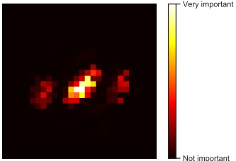

Figure 18.8: Feature importance of a random forest classifier trained to distinguish MNIST digits from classes 0 and 8. Adapted from Figure 7.6 of [Gér19]. Generated by rf_feature_importance_mnist.ipynb.

#### 18.6.1 Feature importance

For a single decision tree T, [BFO84] proposed the following measure for feature importance of feature k:

$$
R_{k}(T)=\sum_{j=1}^{J-1}G_{j}\mathbb{I}\left(v_{j}=k\right)   \tag*{(18.57)}
$$

where the sum is over all non-leaf (internal) nodes,  $G_j$ is the gain in accuracy (reduction in cost) at node  $j$, and  $v_j = k$ if node  $j$ uses feature  $k$. We can get a more reliable estimate by averaging over all trees in the ensemble:

$$
R_{k}=\frac{1}{M}\sum_{m=1}^{M}R_{k}(T_{m})   \tag*{(18.58)}
$$

After computing these scores, we can normalize them so the largest value is 100%. We give some examples below.

Figure 18.8 gives an example of estimating feature importance for a classifier trained to distinguish MNIST digits from classes 0 and 8. We see that it focuses on the parts of the image that differ between these classes.

In Figure 18.9, we plot the relative importance of each of the features for the spam dataset (Section 18.4). Not surprisingly, we find that the most important features are the words “george” (the name of the recipient) and “hp” (the company he worked for), as well as the characters ! and $. (Note it can be the presence or absence of these features that is informative.)

Author: Kevin P. Murphy. (C) MIT Press. CC-BY-NC-ND license

---

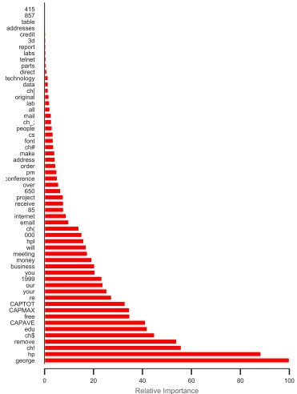

Figure 18.9: Feature importance of a gradient boosted classifier trained to distinguish spam from non-spam email. The dataset has X training examples with Y features, corresponding to token frequency. Adapted from Figure 10.6 of [HTF09]. Generated by spam_tree_ensemble_interpret.ipynb.

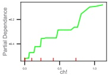

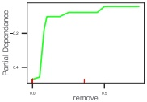

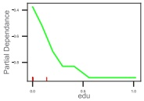

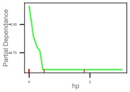

 $(a)$

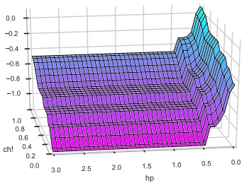

(b)

Figure 18.10: (a) Partial dependence of log-odds of the spam class for 4 important predictors. The red ticks at the base of the plot are deciles of the empirical distribution for this feature. (b) Joint partial dependence of log-odds on the features hp and !. Adapted from Figure 10.6–10.8 of [HTF09]. Generated by spam_tree_ensemble_interpret.ipynb.

---

#### 18.6.2 Partial dependency plots

After we have identified the most relevant input features, we can try to assess the impact they have on the output. A partial dependency plot for feature k is a plot of

$$
\overline{f}_{k}(x_{k})=\frac{1}{N}\sum_{n=1}^{N}f(\boldsymbol{x}_{n,-k},x_{k})   \tag*{(18.59)}
$$

vs  $x_k$. Thus we marginalize out all features except  $k$. In the case of a binary classifier, we can convert this to log odds,  $\log p(y = 1|x_k)/p(y = 0|x_k)$, before plotting. We illustrate this for our spam example in Figure 18.10a for 4 different features. We see that as the frequency of ! and "remove" increases, so does the probability of spam. Conversely, as the frequency of "edu" or "hp" increases, the probability of spam decreases.

We can also try to capture interaction effects between features j and k by computing

$$
\overline{f}_{jk}(x_{j},x_{k})=\frac{1}{N}\sum_{n=1}^{N}f(\boldsymbol{x}_{n,-jk},x_{j},x_{k})   \tag*{(18.60)}
$$

We illustrate this for our spam example in Figure 18.10b for hp and !. We see that higher frequency of ! makes it more likely to be spam, but much more so if the word “hp” is missing.

---

---

PART V

Beyond Supervised Learning

---

---

# 19 Learning with Fewer Labeled Examples

Many ML models, especially neural networks, often have many more parameters than we have labeled training examples. For example, a ResNet CNN (Section 14.3.4) with 50 layers has 23 million parameters. Transformer models (Section 15.5) can be even bigger. Of course these parameters are highly correlated, so they are not independent “degrees of freedom”. Nevertheless, such big models are slow to train and, more importantly, they may easily overfit. This is particularly a problem when you do not have a large labeled training set. In this chapter, we discuss some ways to tackle this issue, beyond the generic regularization techniques we discussed in Section 13.5 such as early stopping, weight decay and dropout.

### 19.1 Data augmentation

Suppose we just have a single small labeled dataset. In some cases, we may be able to create artificially modified versions of the input vectors, which capture the kinds of variations we expect to see at test time, while keeping the original labels unchanged. This is called data augmentation. $^{1}$ We give some examples below, and then discuss why this approach works.

#### 19.1.1 Examples

For image classification tasks, standard data augmentation methods include random crops, zooms, and mirror image flips, as illustrated in Figure 19.1. [GVZ16] gives a more sophisticated example, where they render text characters onto an image in a realistic way, thereby creating a very large dataset of text “in the wild”. They used this to train a state of the art visual text localization and reading system. Other examples of data augmentation include artificially adding background noise to clean speech signals, and artificially replacing characters or words at random in text documents.

If we afford to train and test the model many times using different versions of the data, we can learn which augmentations work best, using blackbox optimization methods such as RL (see e.g., [Cub+19]) or Bayesian optimization (see e.g., [Lim+19]); this is called AutoAugment. We can also learn to combine multiple augmentations together; this is called AutoAugment [Cub+19].

For some examples of augmentation in NLP, see e.g., [Fen+21].

---

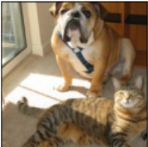

Figure 19.1: Illustration of random crops and zooms of the image on the left. Generated by image_augmentation_jax.ipynb.

#### 19.1.2 Theoretical justification

Data augmentation often significantly improves performance (predictive accuracy, robustness, etc). At first this might seem like we are getting something for nothing, since we have not provided additional data. However, the data augmentation mechanism can be viewed as a way to algorithmically inject prior knowledge.

To see this, recall that in standard ERM training, we minimize the empirical risk

$$
R(f)=\int\ell(f(\boldsymbol{x}),\boldsymbol{y})p^{*}(\boldsymbol{x},\boldsymbol{y})d\boldsymbol{x}d\boldsymbol{y}   \tag*{(19.1)}
$$

where we approximate  $p^{*}(\boldsymbol{x},\boldsymbol{y})$ by the empirical distribution

$$
p_{\mathcal{D}}(\boldsymbol{x},\boldsymbol{y})=\frac{1}{N}\sum_{n=1}^{N}\delta(\boldsymbol{x}-\boldsymbol{x}_{n})\delta(\boldsymbol{y}-\boldsymbol{y}_{n})   \tag*{(19.2)}
$$

We can think of data augmentation as replacing the empirical distribution with the following algorithmically smoothed distribution

$$
p_{\mathcal{D}}(\boldsymbol{x},\boldsymbol{y}|A)=\frac{1}{N}\sum_{n=1}^{N}p(\boldsymbol{x}|\boldsymbol{x}_{n},A)\delta(\boldsymbol{y}-\boldsymbol{y}_{n})   \tag*{(19.3)}
$$

where  $A$ is the data augmentation algorithm, which generates a sample  $\boldsymbol{x}$ from a training point  $\boldsymbol{x}_n$, such that the label (“semantics”) is not changed. (A very simple example would be a Gaussian kernel,  $p(\boldsymbol{x}|\boldsymbol{x}_n, A) = \mathcal{N}(\boldsymbol{x}|\boldsymbol{x}_n, \sigma^2 \mathbf{I})$.) This has been called vicinal risk minimization [Cha+01], since we are minimizing the risk in the vicinity of each training point  $\boldsymbol{x}$. For more details on this perspective, see [Zha+17b; CDL19; Dao+19].

### 19.2 Transfer learning

This section is coauthored with Colin Raffel.

---

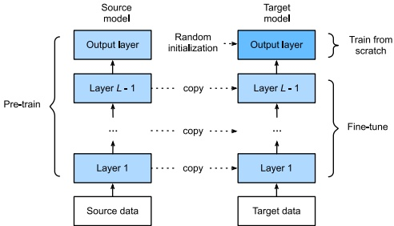

Figure 19.2: Illustration of fine-tuning a model on a new dataset. The final output layer is trained from scratch, since it might correspond to a different label set. The other layers are initialized at their previous parameters, and then optionally updated using a small learning rate. From Figure 13.2.1 of  $[Zha+20]$. Used with kind permission of Aston Zhang.

Many data-poor tasks have some high-level structural similarity to other data-rich tasks. For example, consider the task of fine-grained visual classification of endangered bird species. Given that endangered birds are by definition rare, it is unlikely that a large quantity of diverse labeled images of these birds exist. However, birds bear many structural similarities across species - for example, most birds have wings, feathers, beaks, claws, etc. We therefore might expect that first training a model on a large dataset of non-endangered bird species and then continuing to train it on a small dataset of endangered species could produce better performance than training on the small dataset alone.

This is called transfer learning, since we are transferring information from one dataset to another, via a shared set of parameters. More precisely, we first perform a pre-training phase, in which we train a model with parameters  $\theta$ on a large source dataset  $D_p$; this may be labeled or unlabeled. We then perform a second fine-tuning phase on the small labeled target dataset  $D_q$ of interest. We discuss these two phases in more detail below, but for more information, see e.g.,  $[\text{Tan}+18$; Zhu+21] for recent surveys.

#### 19.2.1 Fine-tuning

Suppose, for now, that we already have a pretrained classifier,  $p(y|\boldsymbol{x},\boldsymbol{\theta}_{p})$, such as a CNN, that works well for inputs  $\boldsymbol{x} \in \mathcal{X}_p$ (e.g. natural images) and outputs  $y \in \mathcal{Y}_p$ (e.g., ImageNet labels), where the data comes from a distribution  $p(\boldsymbol{x}, y)$ similar to the one used in training. Now we want to create a new model  $q(y|\boldsymbol{x}, \boldsymbol{\theta}_q)$ that works well for inputs  $\boldsymbol{x} \in \mathcal{X}_q$ (e.g. bird images) and outputs  $y \in \mathcal{Y}_q$ (e.g., fine-grained bird labels), where the data comes from a distribution  $q(\boldsymbol{x}, y)$ which may be different from  $p$.

We will assume that the set of possible inputs is the same, so  $\mathcal{X}_q \approx \mathcal{X}_p$ (e.g., both are RGB images), or that we can easily transform inputs from domain  $p$ to domain  $q$ (e.g., we can convert an RGB image to grayscale by dropping the chrominance channels and just keeping luminance). (If this is not

---

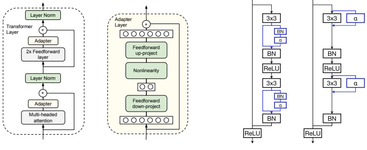

Figure 19.3: (a) Adding adapter layers to a transformer. From Figure 2 of [Hou+19]. Used with kind permission of Neil Houlsby. (b) Adding adapter layers to a resnet. From Figure 2 of [RBV18]. Used with kind permission of Sylvestre-Alvise Rebuffi.

the case, then we may need to use a method called domain adaptation, that modifies models to map between modalities, as discussed in Section 19.2.5.)

However, the output domains are usually different, i.e.,  $\mathcal{Y}_q \neq \mathcal{Y}_p$. For example,  $\mathcal{Y}_p$ might be Imagenet labels and  $\mathcal{Y}_q$ might be medical labels (e.g., types of diabetic retinopathy [Arc+19]). In this case, we need to “translate” the output of the pre-trained model to the new domain. This is easy to do with neural networks: we simply “chop off” the final layer of the original model, and add a new “head” to model the new class labels, as illustrated in Figure 19.2. For example, suppose  $p(y|\boldsymbol{x}, \boldsymbol{\theta}_p) = \text{softmax}(y|\mathbf{W}_2\boldsymbol{h}(\boldsymbol{x}; \boldsymbol{\theta}_1) + \boldsymbol{b}_2)$, where  $\boldsymbol{\theta}_p = (\mathbf{W}_2, \boldsymbol{b}_2, \boldsymbol{\theta}_1)$. Then we can construct  $q(y|\boldsymbol{\theta}_q) = \text{softmax}(y|\mathbf{W}_3\boldsymbol{h}(\boldsymbol{x}; \boldsymbol{\theta}_1) + \boldsymbol{b}_3)$, where  $\boldsymbol{\theta}_q = (\mathbf{W}_3, \boldsymbol{b}_3, \boldsymbol{\theta}_1)$ and  $\boldsymbol{h}(\boldsymbol{x}; \boldsymbol{\theta}_1)$ is the shared nonlinear feature extractor.

After performing this “model surgery”, we can fine-tune the new model with parameters  $\boldsymbol{\theta}_q = (\boldsymbol{\theta}_1, \boldsymbol{\theta}_3)$, where  $\boldsymbol{\theta}_1$ parameterizes the feature extractor, and  $\boldsymbol{\theta}_3$ parameterizes the final linear layer that maps features to the new set of labels. If we treat  $\boldsymbol{\theta}_1$ as “frozen parameters”, then the resulting model  $q(y|\boldsymbol{x}, \boldsymbol{\theta}_q)$ is linear in its parameters, so we have a convex optimization problem for which many simple and efficient fitting methods exist (see Part II). This is particularly helpful in the long-tail setting, where some classes are very rare [Kan+20]. However, a linear “decoder” may be too limiting, so we can also allow  $\boldsymbol{\theta}_1$ to be fine-tuned as well, but using a lower learning rate, to prevent the values moving too far from the values estimated on  $\mathcal{D}_p$.

#### 19.2.2 Adapters

One disadvantage of fine-tuning all the model parameters of a pre-trained model is that it can be slow, since there are often many parameters, and we may need to use a small learning rate to prevent the low-level feature extractors from diverging too far from their prior values. In addition, every new task requires a new model to be trained, making task sharing hard. An alternative approach is to keep the pre-trained model untouched, but to add new parameters to modify its internal behavior to

---

Customize the feature extraction process for each task. This idea is called adapters, and has been explored in several papers (e.g., [RBV17; RBV18; Hou+19]).

Figure 19.3a illustrates adapters for transformer networks (Section 15.5), as proposed in [Hou+19]. The basic idea is to insert two shallow bottleneck MLPs inside each transformer layer, one after the multi-head attention and once after the feed-forward layers. Note that these MLPs have skip connections, so that they can be initialized to implement the identity mapping. If the transformer layer has features of dimensionality D, and the adapter uses a bottleneck of size M, this introduces  $O(DM)$ new parameters per layer. These adapter MLPs, as well as the layer norm parameters and final output head, are trained for each new task, but the all remaining parameters are frozen. Empirically on several NLP benchmarks, this is found to give better performance than fine tuning, while only needing about 1-10% of the original parameters.

Figure 19.3b illustrates adapters for residual networks (Section 14.3.4), as proposed in [RBV17; RBV18]. The basic idea is to add a 1x1 convolution layer  $\alpha$, which is analogous to the MLP adapter in the transformer case, to the internal layers of the CNN. This can be added in series or in parallel, as shown in the diagram. If we denote the adapter layer by  $\rho(\boldsymbol{x})$, we can define the series adapter to be

$$
\rho(\boldsymbol{x})=\boldsymbol{x}+\mathrm{diag}_{1}(\boldsymbol{\alpha})\circledast\boldsymbol{x}=\mathrm{diag}_{1}(\mathbf{I}+\boldsymbol{\alpha})\circledast\boldsymbol{x}   \tag*{(19.4)}
$$

where  $\text{diag}_1(\boldsymbol{\alpha}) \in \mathbb{R}^{1 \times 1 \times C \times D}$ reshapes a matrix  $\boldsymbol{\alpha} \in \mathbb{R}^{C \times D}$ into a matrix that can be applied to each spatial location in parallel. (We have omitted batch normalization for simplicity.) If we insert this after a regular convolution layer  $\boldsymbol{f} \otimes \boldsymbol{x}$ we get

$$
\boldsymbol{y}=\rho(\boldsymbol{f}\circledast\boldsymbol{x})=(\operatorname{diag}_{1}(\mathbf{I}+\boldsymbol{\alpha})\circledast\boldsymbol{f})\circledast\boldsymbol{x}   \tag*{(19.5)}
$$

This can be interpreted as a low-rank multiplicative perturbation to the original filter f. The parallel adapter can be defined by

$$
y=f\circledast x+\mathrm{diag}_{1}(\boldsymbol{\alpha})\circledast x=(f+\mathrm{diag}_{L}(\boldsymbol{\alpha}))\circledast x   \tag*{(19.6)}
$$

This can be interpreted as a low-rank additive perturbation to the original filter  $\mathbf{f}$. In both cases, setting  $\boldsymbol{\alpha} = \mathbf{0}$ ensures the adapter layers can be initialized to the identity transformation. In addition, both methods required  $O(C^2)$ parameters per layer.

#### 19.2.3 Supervised pre-training

The pre-training task may be supervised or unsupervised; the main requirements are that it can teach the model basic structure about the problem domain and that it is sufficiently similar to the downstream fine-tuning task. The notion of task similarity is not rigorously defined, but in practice the domain of the pre-training task is often more broad than that of the fine-tuning task (e.g., pre-train on all bird species and fine-tune on endangered ones).

The most straightforward form of transfer learning is the case where a large labeled dataset is suitable for pre-training. For example, it is very common to use the ImageNet dataset (Section 1.5.1.2) to pretrain CNNs, which can then be used for a variety of downstream tasks and datasets (see e.g., [Kol+19]). Imagenet has 1.28 million natural images, each associated with a label from one of 1,000 classes. The classes constitute a wide variety of different concepts, including animals, foods, buildings, musical instruments, clothing, and so on. The images themselves are diverse in the sense

---

that they contain objects from many angles and in many sizes with a wide variety of backgrounds. This diversity and scale may partially explain why it has become a de-facto pre-training task for transfer learning in computer vision. (See finetune_cnn_jax.ipynb for some example code.)

However, Imagenet pre-training has been shown to be less helpful when the domain of the fine-tuning task is quite different from natural images (e.g. medical images [Rag+19]). And in some cases where it is helpful (e.g., training object detection systems), it seems to be more of a speedup trick (by warm-starting optimization at a good point) rather than something that is essential, in the sense that one can achieve comparable performance on the downstream task when training from scratch, if done for long enough [HGD19].

Supervised pre-training is somewhat less common in non-vision applications. One notable exception is to pre-train on natural language inference data (i.e. whether a sentence implies or contradicts another) to learn vector representations of sentences [Con+17], though this approach has largely been supplanted by unsupervised methods (Section 19.2.4). Another non-vision application of transfer learning is to pre-train a speech recognition on a large English-labeled corpus before fine-tuning on low-resource languages [Ard+20].

#### 19.2.4 Unsupervised pre-training (self-supervised learning)

It is increasingly common to use unsupervised pre-training, because unlabeled data is often easy to acquire, e.g., unlabeled images or text documents from the web.

For a short period of time it was common to pre-train deep neural networks using an unsupervised objective (e.g., reconstruction error, as discussed in Section 20.3) over the labeled dataset (i.e. ignoring the labels) before proceeding with standard supervised training [HOT06; Vin+10b; Erh+10]. While this technique is also called unsupervised pre-training, it differs from the form of pre-training for transfer learning we discuss in this section, which uses a (large) unlabeled dataset for pre-training before fine-tuning on a different (smaller) labeled dataset.

Pre-training tasks that use unlabeled data are often called self-supervised rather than unsupervised. This term is used because the labels are created by the algorithm, rather than being provided externally by a human, as in standard supervised learning. Both supervised and self-supervised learning are discriminative tasks, since they require predicting outputs given inputs. By contrast, other unsupervised approaches, such as some of those discussed in Chapter 20, are generative, since they predict outputs unconditionally.

There are many different self-supervised learning heuristics that have been tried (see e.g., [GR18; JT19; Ren19] for a review, and https://github.com/jason718/awesome-self-supervised-learning for an extensive list of papers). We can identify at least three main broad groups, which we discuss below.

##### 19.2.4.1 Imputation tasks

One approach to self-supervised learning is to solve \textit{imputation} tasks. In this approach, we partition the input vector  $\boldsymbol{x}$ into two parts,  $\boldsymbol{x} = (\boldsymbol{x}_h, \boldsymbol{x}_v)$, and then try to predict the hidden part  $\boldsymbol{x}_h$ given the remaining visible part,  $\boldsymbol{x}_v$, using a model of the form  $\hat{\boldsymbol{x}}_h = f(\boldsymbol{x}_v, \boldsymbol{x}_h = \boldsymbol{0})$. We can think of this as a "fill-in-the-blank" task; in the NLP community, this is called a \textit{cloze} task. See Figure 19.4 for some visual examples, and Section 15.7.2 for some NLP examples.

---

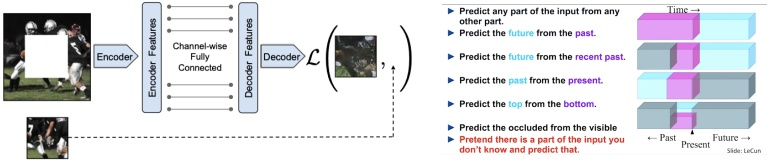

(a)

(b)

Figure 19.4: (a) Context encoder for self-supervised learning. From  $[Pat+16]$. Used with kind permission of Deepak Pathak. (b) Some other proxy tasks for self-supervised learning. From  $[LeC18]$. Used with kind permission of Yann LeCun.

##### 19.2.4.2 Proxy tasks

Another approach to SSL is to solve proxy tasks, also called pretext tasks. In this setup, we create pairs of inputs,  $(x_1, x_2)$, and then train a Siamese network classifier (Figure 16.5a) of the form  $p(y|x_1, x_2) = p(y|r[f(x_1), f(x_2)])$, where  $f(x)$ is some function that performs “representation learning” [BCV13], and  $y$ is some label that captures the relationship between  $x_1$ and  $x_2$, which is predicted by  $r(f_1, f_2)$. For example, suppose  $x_1$ is an image patch, and  $x_2 = t(x_1)$ is some transformation of  $x_1$ that we control, such as a random rotation; then we define  $y$ to be the rotation angle that we used [GSK18].

##### 19.2.4.3 Contrastive tasks

The currently most popular approach to self-supervised learning is to use various kinds of contrastive tasks. The basic idea is to create pairs of examples that are semantically similar to each other, using data augmentation methods (Section 19.1), and then to ensure that the distance between their representations is closer (in embedding space) than the distance between two unrelated examples. This is exactly the same idea that is used in deep metric learning (Section 16.2.2) — the only difference is that the algorithm creates its own similar pairs, rather than relying on an externally provided measure of similarity, such as labels. We give some examples of this in Section 19.2.4.4 and Section 19.2.4.5.

##### 19.2.4.4 SimCLR

In this section, we discuss SimCLR, which stands for “Simple contrastive learning of visual representations” [Che+20b; Che+20c]. This has shown state of the art performance on transfer learning and semi-supervised learning. The basic idea is as follows. Each input  $\boldsymbol{x} \in \mathbb{R}^D$ is converted to two augmented “views”  $\boldsymbol{x}_1 = t_1(\boldsymbol{x})$,  $\boldsymbol{x}_2 = t_2(\boldsymbol{x})$, which are “semantically equivalent” versions of the input generated by some transformations  $t_1, t_2$. For example, if  $\boldsymbol{x}$ is an image, these could be small perturbations to the image, such as random crops, as discussed in Section 19.1. In addition, we sample “negative” examples  $\boldsymbol{x}_1^-$, ...,  $\boldsymbol{x}_n^-\in N(\boldsymbol{x})$ from the dataset which represent “semantically different” images (in practice, these are the other examples in the minibatch). Next we define some feature mapping  $F : \mathbb{R}^D \to \mathbb{R}^E$, where  $D$ is the size of the input, and  $E$ is the size of the embedding.

---

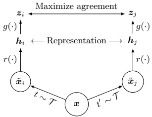

 $(a)$

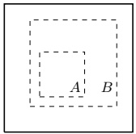

(b)

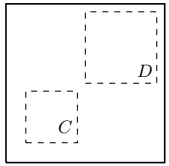

(c)

Figure 19.5: (a) Illustration of SimCLR training. T is a set of stochastic semantics-preserving transformations (data augmentations). (b-c) Illustration of the benefit of random crops. Solid rectangles represent the original image, dashed rectangles are random crops. In (b), the model is forced to predict the local view A from the global view B (and vice versa). In (c), the model is forced to predict the appearance of adjacent views (C,D). From Figures 2–3 of [Che+20b]. Used with kind permission of Ting Chen.

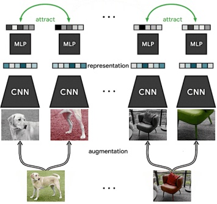

 $(a)$

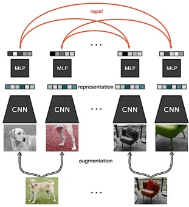

(b)

Figure 19.6: Visualization of SimCLR training. Each input image in the minibatch is randomly modified in two different ways (using cropping (followed by resize), flipping, and color distortion), and then fed into a Siamese network. The embeddings (final layer) for each pair derived from the same image is forced to be close, whereas the embeddings for all other pairs are forced to be far. From https://ai.googleblog.com/2020/04/advancing-self-supervised-and-semi.html. Used with kind permission of Ting Chen.

---

We then try to maximize the similarity of the similar views, while minimizing the similarity of the different views, for each input x:

$$
J=F(t_{1}(\boldsymbol{x}))^{\top}F(t_{2}(\boldsymbol{x}))-\log\sum_{\boldsymbol{x}_{i}^{-}\in N(\boldsymbol{x})}\exp\left[F(\boldsymbol{x}_{i}^{-})^{\top}F(t_{1}(\boldsymbol{x}))\right]   \tag*{(19.7)}
$$

In practice, we use cosine similarity, so we  $\ell_2$-normalize the representations produced by  $F$ before taking inner products, but this is omitted in the above equation. See Figure 19.5a for an illustration. (In this figure, we assume  $F(\boldsymbol{x}) = g(r(\boldsymbol{x}))$, where the intermediate representation  $\boldsymbol{h} = r(\boldsymbol{x})$ is the one that will be later used for fine-tuning, and  $g$ is an additional transformation applied during training.)

Interestingly, we can interpret this as a form of conditional energy based model of the form

$$
p(\boldsymbol{x}_{2}|\boldsymbol{x}_{1})=\frac{\exp[-\mathcal{E}(\boldsymbol{x}_{2}|\boldsymbol{x}_{1})]}{Z(\boldsymbol{x}_{1})}   \tag*{(19.8)}
$$

where  $\mathcal{E}(\boldsymbol{x}_2|\boldsymbol{x}_1) = -F(\boldsymbol{x}_2)^\top F(\boldsymbol{x}_1)$ is the energy, and

$$
Z(\boldsymbol{x})=\int\exp[-\mathcal{E}(\boldsymbol{x}^{-}|\boldsymbol{x})]d\boldsymbol{x}^{-}=\int\exp[F(\boldsymbol{x}^{-})^{\top}F(\boldsymbol{x})]d\boldsymbol{x}^{-}   \tag*{(19.9)}
$$

is the normalization constant, known as the partition function. The conditional log likelihood under this model has the form

$$
\log p(\boldsymbol{x}_{2}|\boldsymbol{x}_{1})=F(\boldsymbol{x}_{2})^{\top}F(\boldsymbol{x}_{1})-\log\int\exp[F(\boldsymbol{x}^{-})^{\top}F(\boldsymbol{x}_{1})]d\boldsymbol{x}^{-}   \tag*{(19.10)}
$$

The only difference from Equation (19.7) is that we replace the integral with a Monte Carlo upper bound derived from the negative samples. Thus we can think of contrastive learning as approximate maximum likelihood estimation of a conditional energy based generative model [Gra+20]. More details on such models can be found in the sequel to this book, [Mur23].

A critical ingredient to the success of SimCLR is the choice of data augmentation methods. By using random cropping, they can force the model to predict local views from global views, as well as to predict adjacent views of the same image (see Figure 19.5). After cropping, all images are resized back to the same size. In addition, they randomly flip the image some fraction of the time. $^{2}$

SimCLR relies on large batch training, in order to ensure a sufficiently diverse set of negatives. When this is not possible, we can use a memory bank of past (negative) embeddings, which can be updated using exponential moving averaging (Section 4.4.2.2). This is known as momentum contrastive learning or MoCo [He+20].

##### 19.2.4.5 CLIP

In this section, we describe CLIP, which stands for “Contrastive Language-Image Pre-training” [Rad+]. This is a contrastive approach to representation learning which uses a massive corpus of

---

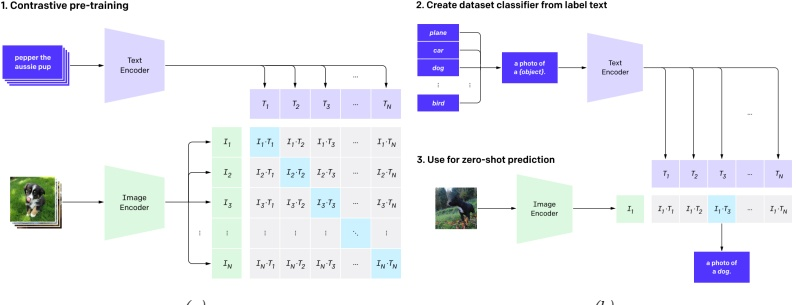

(b)

Figure 19.7: Illustration of the CLIP model. From Figure 1 of  $[Rad^{+}]$. Used with kind permission of Alec Radford.

400M (image, text) pairs extracted from the web. Let  $\pmb{x}_{i}$ be the  $i^{\prime}$th image and  $\pmb{y}_{i}$ be its matching text. Rather than trying to predict the exact words associated with the image, it is simpler to just determine if  $\pmb{y}_{i}$ is more likely to be the correct text compared to  $\pmb{y}_{j}$, for some other text string  $j$ in the minibatch. Similarly, the model can try to determine if image  $\pmb{x}_{i}$ is more likely to be matched than  $\pmb{x}_{j}$ to a given text  $\pmb{y}_{i}$.

More precisely, let  $\mathbf{f}_I(\mathbf{x}_i)$ be the embedding of the image,  $\mathbf{f}_T(\mathbf{y}_j)$ be the embedding of the text,  $\mathbf{I}_i = \mathbf{f}_I(\mathbf{x}_i)/||\mathbf{f}_I(\mathbf{x}_i)||_2$ be the unit-norm version of the image embedding, and  $\mathbf{T}_j = \mathbf{f}_T(\mathbf{y}_j)/||\mathbf{f}_T(\mathbf{y}_j)||_2$ be the unit-norm version of the text embedding. Define the vector of pairwise logits (similarity scores) to be

$$
L_{i j}=\mathbf{I}_{i}^{\mathsf{T}}\mathbf{T}_{j}   \tag*{(19.11)}
$$

We now train the parameters of the two embedding functions  $f_I$ and  $f_T$ to minimize the following loss, averaged over minibatches of size  $N$:

$$
J=\frac{1}{2}\left[\sum_{i=1}^{N}CE(\mathbf{L}_{i,:},\mathbf{1}_{i})+\sum_{j=1}^{N}CE(\mathbf{L}_{:,j},\mathbf{1}_{j})\right]   \tag*{(19.12)}
$$

where CE is the cross entropy loss

$$
\mathrm{CE}(\boldsymbol{p},\boldsymbol{q})=-\sum_{k=1}^{K}p_{k}\log q_{k}   \tag*{(19.13)}
$$

and  $1_{i}$ is a one-hot encoding of label i. See Figure 19.7a for an illustration. (In practice, the normalized embeddings are scaled by a temperature parameter which is also learned; this controls the sharpness of the softmax.)

---

In their paper, they considered using a ResNet (Section 14.3.4) and a vision transformer (Section 15.5.6) for the function  $f_I$, and a text transformer (Section 15.5) for  $f_T$. They used a very large minibatch of  $N \sim 32k$, and trained for many days on 100s of GPUs.

After the model is trained, it can be used for zero-shot classification of an image x as follows. First each of the K possible class labels for a given dataset is converted into a text string  $y_k$ that might occur on the web. For example, “dog” becomes “a photo of a dog”. Second, we compute the normalized embeddings  $\mathbf{I} \propto f_I(\mathbf{x})$ and  $\mathbf{T}_k \propto f_T(\mathbf{y}_k)$. Third, we compute the softmax probabilities

$$
p(y=k|\boldsymbol{x})=\operatorname{softmax}([\mathbf{I}^{\mathsf{T}}\mathbf{T}_{1},\dots,\mathbf{I}^{\mathsf{T}}\mathbf{T}_{k}])_{k}   \tag*{(19.14)}
$$

See Figure 19.7b for an illustration. (A similar approach was adopted in the visual n-grams paper [Li+17].)

Remarkably, this approach can perform as well as standard supervised learning on tasks such as ImageNet classification, without ever being explicitly trained on specific labeled datasets. Of course, the images in ImageNet come from the web, and were found using text-based web-search, so the model has seen similar data before. Nevertheless, its generalization to new tasks, and robustness to distribution shift, are quite impressive (see the paper for examples).

One drawback of the approach, however, is that it is sensitive to how class labels are converted to textual form. For example, to make the model work on food classification, it is necessary to use text strings of the form “a photo of guacamole, a type of food”, “a photo of ceviche, a type of food”, etc. Disambiguating phrases such as “a type of food” are currently added by hand, on a per-dataset basis. This is called prompt engineering, and is needed since the raw class names can be ambiguous across (and sometimes within) a dataset.

#### 19.2.5 Domain adaptation

Consider a problem in which we have inputs from different domains, such as a source domain  $\mathcal{X}_s$ and target domain  $\mathcal{X}_t$, but a common set of output labels,  $\mathcal{Y}$. (This is the “dual” of transfer learning, since the input domains are different, but the output domains the same.) For example, the domains might be images from a computer graphics system and real images, or product reviews and movie reviews. We assume we do not have labeled examples from the target domain. Our goal is to fit the model on the source domain, and then modify its parameters so it works on the target domain. This is called (unsupervised) domain adaptation (see e.g., [KL21] for a review).

A common approach to this problem is to train the source classifier in such a way that it cannot distinguish whether the input is coming from the source or target distribution; in this case, it will only be able to use features that are common to both domains. This is called domain adversarial learning [Gan+16]. More formally, let  $d_n \in \{s, t\}$ be a label that specifies if the data example  $n$ comes from domain  $s$ or  $t$. We want to optimize

$$
\min_{\phi}\max_{\boldsymbol{\theta}}\frac{1}{N_{s}+N_{t}}\sum_{n\in\mathcal{D}_{s},\mathcal{D}_{t}}\ell(d_{n},f_{\boldsymbol{\theta}}(\boldsymbol{x}_{n}))+\frac{1}{N_{s}}\sum_{m\in\mathcal{D}_{s}}\ell(y_{m},g_{\phi}(f_{\boldsymbol{\theta}}(\boldsymbol{x}_{m})))   \tag*{(19.15)}
$$

where  $N_s = |\mathcal{D}_s|$,  $N_t = |\mathcal{D}_t|$,  $f$ maps  $\mathcal{X}_s \cup \mathcal{X}_t \to \mathcal{H}$, and  $g$ maps  $\mathcal{H} \to \mathcal{Y}_t$. The objective in Equation (19.15) minimizes the loss on the desired task of classifying  $y$, but maximizes the loss on the auxiliary task of classifying the source domain  $d$. This can be implemented by the gradient sign reversal trick, and is related to GANs (generative adversarial networks). See e.g., [Csu17; Wu+19] for some other approaches to domain adaptation.

Author: Kevin P. Murphy. (C) MIT Press. CC-BY-NC-ND license

---

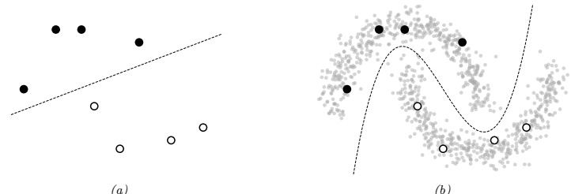

(a)

(b)

Figure 19.8: Illustration of the benefits of semi-supervised learning for a binary classification problem. Labeled points from each class are shown as black and white circles respectively. (a) Decision boundary we might learn given only labeled data. (b) Decision boundary we might learn if we also had a lot of unlabeled data points, shown as smaller grey circles.

### 19.3 Semi-supervised learning

##### This section is co-authored with Colin Raffel.

Many recent successful applications of machine learning are in the supervised learning setting, where a large dataset of labeled examples are available for training a model. However, in many practical applications it is expensive to obtain this labeled data. Consider the case of automatic speech recognition: Modern datasets contain thousands of hours of audio recordings [Pan+15; Ard+20]. The process of annotating the words spoken in a recording is many times slower than real-time, potentially resulting in a long (and costly) annotation process. To make matters worse, in some applications data must be labeled by an expert (such as a doctor in medical applications) which can further increase costs.

Semi-supervised learning can alleviate the need for labeled data by taking advantage of unlabeled data. The general goal of semi-supervised learning is to allow the model to learn the high-level structure of the data distribution from unlabeled data and only rely on the labeled data for learning the fine-grained details of a given task. Whereas in standard supervised learning we assume that we have access to samples from the joint distribution of data and labels  $\boldsymbol{x}, y \sim p(\boldsymbol{x}, y)$, semi-supervised learning assumes that we additionally have access to samples from the marginal distribution of  $\boldsymbol{x}$, namely  $\boldsymbol{x} \sim p(\boldsymbol{x})$, as illustrated in Figure 19.8. Further, it is generally assumed that we have many more of these unlabeled samples since they are typically cheaper to obtain. Continuing the example of automatic speech recognition, it is often much cheaper to simply record people talking (which would produce unlabeled data) than it is to transcribe recorded speech. Semi-supervised learning is a good fit for the scenario where a large amount of unlabeled data has been collected and the practitioner would like to avoid having to label all of it.

#### 19.3.1 Self-training and pseudo-labeling

An early and straightforward approach to semi-supervised learning is self-training [Scu65; Agr70; McL75]. The basic idea behind self-training is to use the model itself to infer predictions on unlabeled

---

data, and then treat these predictions as labels for subsequent training. Self-training has endured as a semi-supervised learning method because of its simplicity and general applicability; i.e. it is applicable to any model that can generate predictions for the unlabeled data. Recently, it has become common to refer to this approach as “pseudo-labeling” [Lee13] because the inferred labels for unlabeled data are only “pseudo-correct” in comparison with the true, ground-truth targets used in supervised learning.

Algorithmically, self-training typically follows one of the following two procedures. In the first approach, pseudo-labels are first predicted for the entire collection of unlabeled data and the model is re-trained (possibly from scratch) to convergence on the combination of the labeled and (pseudo-labeled) unlabeled data. Then, the unlabeled data is re-labeled by the model and the process repeats itself until a suitable solution is found. The second approach instead continually generates predictions on randomly-chosen batches of unlabeled data and immediately trains the model against these pseudo-labels. Both approaches are currently common in practice; the first "offline" variant has been shown to be particularly successful when leveraging giant collections of unlabeled data [Yal+19; Xie+20] whereas the "online" approach is often used as one component of more sophisticated semi-supervised learning methods [Soh+20]. Neither variant is fundamentally better than the other. Offline self-training can result in training the model on "stale" pseudo-labels, since they are only updated each time the model converges. However, online pseudo-labeling can incur larger computational costs since it involves constantly "re-labeling" unlabeled data.

Self-training can suffer from an obvious problem: If the model generates incorrect predictions for unlabeled data and then is re-trained on these incorrect predictions, it can become progressively worse and worse at the intended classification task until it eventually learns a totally invalid solution. This issue has been dubbed confirmation bias [TV17] because the model is continually confirming its own (incorrect) bias about the decision rule.

A common way to mitigate confirmation bias is to use a “selection metric” [RHS05] which heuristically tries to only retain pseudo-labels that are correct. For example, assuming that a model outputs probabilities for each possible class, a frequently-used selection metric is to only retain pseudo-labels whose largest class probability is above a threshold [Yar95; RHS05]. If the model’s class probability estimates are well-calibrated, then this selection metric will only retain labels that are highly likely to be correct (according to the model, at least). More sophisticated selection metrics can be designed according to the problem domain.

#### 19.3.2 Entropy minimization

Self-training has the implicit effect of encouraging the model to output low-entropy (i.e. high-confidence) predictions. This effect is most apparent in the online setting with a cross-entropy loss, where the model minimizes the following loss function L on unlabeled data:

$$
\mathcal{L}=-\max_{c}\log p_{\theta}(y=c|\boldsymbol{x})   \tag*{(19.16)}
$$

where  $p_{\theta}(y|\boldsymbol{x})$ is the model's class probability distribution given input  $\boldsymbol{x}$. This function is minimized when the model assigns all of its class probability to a single class  $c^{*}$, i.e.  $p(y = c^{*} | \boldsymbol{x}) = 1$ and  $p(y \neq c^{*} | \boldsymbol{x}) = 0$.

A closely-related semi-supervised learning method is entropy minimization [GB05], which

---

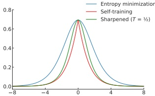

Figure 19.9: Comparison of the entropy minimization, self-training, and “sharpened” entropy minimization loss functions for a binary classification problem.

minimizes the following loss function:

$$
\mathcal{L}=-\sum_{c=1}^{C}p_{\theta}(y=c|\boldsymbol{x})\log p_{\theta}(y=c|\boldsymbol{x})   \tag*{(19.17)}
$$

Note that this function is also minimized when the model assigns all of its class probability to a single class. We can make the entropy-minimization loss in Equation (19.17) equivalent to the online self-training loss in Equation (19.16) by replacing the first  $p_{\theta}(y = c|\mathbf{x})$ term with a “one-hot” vector that assigns a probability of 1 for the class that was assigned the highest probability. In other words, online self-training minimizes the cross-entropy between the model’s output and the “hard” target  $\arg\max p_{\theta}(y|\mathbf{x})$, whereas entropy minimization uses the “soft” target  $p_{\theta}(y|\mathbf{x})$. One way to trade off between these two extremes is to adjust the “temperature” of the target distribution by raising each probability to the power of 1/T and renormalizing; this is the basis of the mixmatch method of [Ber+19b; Ber+19a; Xie+19]. At T = 1, this is equivalent to entropy minimization; as  $T \to 0$, it becomes hard online self-training. A comparison of these loss functions is shown in Figure 19.9.

##### 19.3.2.1 The cluster assumption

Why is entropy minimization a good idea? A basic assumption of many semi-supervised learning methods is that the decision boundary between classes should fall in a low-density region of the data manifold. This effectively assumes that the data corresponding to different classes are clustered together. A good decision boundary, therefore, should not pass through clusters; it should simply separate them. Semi-supervised learning methods that make the “cluster assumption” can be thought of as using unlabeled data to estimate the shape of the data manifold and moving the decision boundary away from it.

Entropy minimization is one such method. To see why, first assume that the decision boundary between two classes is “smooth”, i.e. the model does not abruptly change its class prediction anywhere in its domain. This is true in practice for simple and/or regularized models. In this case, if the decision boundary passes through a high-density region of data, it will by necessity produce high-entropy predictions for some samples from the data distribution. Entropy minimization will therefore encourage the model to place its decision boundary in low-density regions of the input space to

---

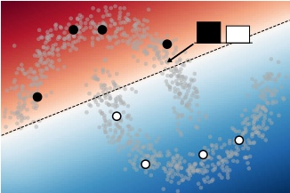

 $(a)$

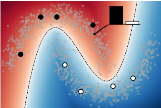

(b)

Figure 19.10: Visualization demonstrating how entropy minimization enforces the cluster assumption. The classifier assigns a higher probability to class 1 (black dots) or 2 (white dots) in red or blue regions respectively. The predicted class probabilities for one particular unlabeled datapoint is shown in the bar plot. In (a), the decision boundary passes through high-density regions of data, so the classifier is forced to output high-entropy predictions. In (b), the classifier avoids high-density regions and is able to assign low-entropy predictions to most of the unlabeled data.

avoid transitioning from one class to another in a region of space where data may be sampled. A visualization of this behavior is shown in Figure 19.10.

##### 19.3.2.2 Input-output mutual information

An alternative justification for the entropy minimization objective was proposed by Bridle, Heading, and MacKay [BHM92], where it was shown that it naturally arises from maximizing the mutual information (Section 6.3) between the data and the label (i.e. the input and output of a model). Denoting x as the input and y as the target, the input-output mutual information can be written as

$$
\mathcal{I}(y;\boldsymbol{x})=\iint p(y,\boldsymbol{x})\log\frac{p(y,\boldsymbol{x})}{p(y)p(\boldsymbol{x})}d y d\boldsymbol{x}   \tag*{(19.18)}
$$

$$
=\iint p(y|\boldsymbol{x})p(\boldsymbol{x})\log\frac{p(y,\boldsymbol{x})}{p(y)p(\boldsymbol{x})}dyd\boldsymbol{x}   \tag*{(19.19)}
$$

$$
=\int p(\boldsymbol{x})\int p(y|\boldsymbol{x})\log\frac{p(y|\boldsymbol{x})}{p(y)}dyd\boldsymbol{x}   \tag*{(19.20)}
$$

$$
=\int p(\boldsymbol{x})\int p(y|\boldsymbol{x})\log\frac{p(y|\boldsymbol{x})}{\int p(\boldsymbol{x})p(y|\boldsymbol{x})d\boldsymbol{x}}d y d\boldsymbol{x}   \tag*{(19.21)}
$$

Author: Kevin P. Murphy. (C) MIT Press. CC-BY-NC-ND license

---

Note that the first integral is equivalent to taking an expectation over x, and the second integral is equivalent to summing over all possible values of the class y. Using these relations, we obtain

$$
\mathcal{I}(y;\boldsymbol{x})=\mathbb{E}_{\boldsymbol{x}}\left[\sum_{i=1}^{L}p(y_{i}|\boldsymbol{x})\log\frac{p(y_{i}|\boldsymbol{x})}{\mathbb{E}_{\boldsymbol{x}}[p(y_{i}|\boldsymbol{x})]}\right]   \tag*{(19.22)}
$$

$$
=\mathbb{E}_{\boldsymbol{x}}\left[\sum_{i=1}^{L}p(y_{i}|\boldsymbol{x})\log p(y_{i}|\boldsymbol{x})\right]-\mathbb{E}_{\boldsymbol{x}}\left[\sum_{i=1}^{L}p(y_{i}|\boldsymbol{x})\log\mathbb{E}_{\boldsymbol{x}}[p(y_{i}|\boldsymbol{x})]\right]   \tag*{(19.23)}
$$

$$
=\mathbb{E}_{\mathbf{x}}\left[\sum_{i=1}^{L}p(y_{i}|\mathbf{x})\log p(y_{i}|\mathbf{x})\right]-\sum_{i=1}^{L}\mathbb{E}_{\mathbf{x}}[p(y_{i}|\mathbf{x})\log\mathbb{E}_{\mathbf{x}}[p(y_{i}|\mathbf{x})]]   \tag*{(19.24)}
$$

Since we had initially sought to maximize the mutual information, and we typically minimize loss functions, we can convert this to a suitable loss function by negating it:

$$
\mathcal{L}(y;\boldsymbol{x})=-\mathbb{E}_{\boldsymbol{x}}\left[\sum_{i=1}^{L}p(y_{i}|\boldsymbol{x})\log p(y_{i}|\boldsymbol{x})\right]+\sum_{i=1}^{L}\mathbb{E}_{\boldsymbol{x}}[p(y_{i}|\boldsymbol{x})\log\mathbb{E}_{\boldsymbol{x}}[p(y_{i}|\boldsymbol{x})]]   \tag*{(19.25)}
$$

The first term is exactly the entropy minimization objective in expectation. The second term specifies that we should maximize the entropy of the expected class prediction, i.e. the average class prediction over our training set. This encourages the model to predict each possible class with equal probability, which is only appropriate when we know a priori that all classes are equally likely.

#### 19.3.3 Co-training

Co-training [BM98] is also similar to self-training, but makes an additional assumption that there are two complementary “views” (i.e. independent sets of features) of the data, both of which can be used separately to train a reasonable model. After training two models separately on each view, unlabeled data is classified by each model to obtain candidate pseudo-labels. If a particular pseudo-label receives a low-entropy prediction (indicating high confidence) from one model and a high-entropy prediction (indicating low confidence) from the other, then that pseudo-labeled datapoint is added to the training set for the low-confidence model. Then, the process is repeated with the new, larger training datasets. The procedure of only retaining pseudo-labels when one of the models is confident ideally builds up the training sets with correctly-labeled data.

Co-training makes the strong assumption that there are two informative-but-independent views of the data, which may not be true for many problems. The Tri-Training algorithm [ZL05] circumvents this issue by instead using three models that are first trained on independently-sampled (with replacement) subsets of the labeled data. Ideally, initially training on different collections of labeled data results in models that do not always agree on their predictions. Then, pseudo-labels are generated for the unlabeled data independently by each of the three models. For a given unlabeled datapoint, if two of the models agree on the pseudo-label, it is added to the training set for the third model. This can be seen as a selection metric, because it only retains pseudo-labels where two (differently initialized) models agree on the correct label. The models are then re-trained on the combination of the labeled data and the new pseudo-labels, and the whole process is repeated iteratively.

---

#### 19.3.4 Label propagation on graphs

If two datapoints are “similar” in some meaningful way, we might expect that they share a label. This idea has been referred to as the manifold assumption. Label propagation is a semi-supervised learning technique that leverages the manifold assumption to assign labels to unlabeled data. Label propagation first constructs a graph where the nodes are the data examples and the edge weights represent the degree of similarity. The node labels are known for nodes corresponding to labeled data but are unknown for unlabeled data. Label propagation then propagates the known labels across edges of the graph in such a way that there is minimal disagreement in the labels of a given node’s neighbors. This provides label guesses for the unlabeled data, which can then be used in the usual way for supervised training of a model.

More specifically, the basic label propagation algorithm [ZG02] proceeds as follows: First, let  $w_{i,j}$ denote a non-negative edge weight between  $\mathbf{x}_i$ and  $\mathbf{x}_j$ that provides a measure of similarity for the two (labeled or unlabeled) datapoints. Assuming that we have  $M$ labeled datapoints and  $N$ unlabeled datapoints, define the  $(M + N) \times (M + N)$ transition matrix  $\mathbf{T}$ as having entries

$$
\mathbf{T}_{i,j}=\frac{w_{i,j}}{\sum_{k}w_{k,j}}   \tag*{(19.26)}
$$

 $T_{i,j}$ represents the probability of propagating the label for node  $j$ to node  $i$. Further, define the  $(M+N) \times C$ label matrix  $\mathbf{Y}$, where  $C$ is the number of possible classes. The  $i$th row of  $\mathbf{Y}$ represents the class probability distribution of datapoint  $i$. Then, repeat the following steps until the values in  $\mathbf{Y}$ do not change significantly: First, use the transition matrix  $\mathbf{T}$ to propagate labels in  $\mathbf{Y}$ by setting  $\mathbf{Y} \leftarrow \mathbf{T}\mathbf{Y}$. Then, re-normalize the rows of  $\mathbf{Y}$ by setting  $\mathbf{Y}_{i,c} \leftarrow \mathbf{Y}_{i,c} / \sum_k \mathbf{Y}_{i,k}$. Finally, replace the rows of  $\mathbf{Y}$ corresponding to labeled datapoints with their one-hot representation (i.e.  $\mathbf{Y}_{i,c} = 1$ if datapoint  $i$ has ground-truth label  $c$ and  $0$ otherwise). After convergence, guessed labels are chosen based on the highest class probability for each datapoint in  $\mathbf{Y}$.

This algorithm iteratively uses the similarity of datapoints (encoded in the weights used to construct the transition matrix) to propagate information from the (fixed) labels onto the unlabeled data. At each iteration, the label distribution for a given datapoint is computed as the weighted average of the label distributions for all of its connected datapoints, where the weighting corresponds to the edge weights in T. It can be shown that this procedure converges to a single fixed point, whose computational cost mainly involves the inversion of the matrix of unlabeled-to-unlabeled transition probabilities [ZG02].

The overall approach can be seen as a form of transductive learning, since it is learning to predict labels for a fixed unlabeled dataset, rather than learning a model that generalizes. However, given the induced labeling, we can perform inductive learning in the usual way.

The success of label propagation depends heavily on the notion of similarity used to construct the weights between different nodes (datapoints). For simple data, measuring the Euclidean distance between datapoints can be sufficient. However, for complex and high-dimensional data the Euclidean distance might not meaningfully reflect the likelihood that two datapoints share the same class. The similarity weights can also be set arbitrarily according to problem-specific knowledge. For a few examples of different ways of constructing the similarity graph, see Zhu [Zhu05, chapter 3]. For some recent papers that use this approach in conjunction with deep learning, see e.g., [BRR18; Isc+19].

Author: Kevin P. Murphy. (C) MIT Press. CC-BY-NC-ND license

---

#### 19.3.5 Consistency regularization

Consistency regularization leverages the simple idea that perturbing a given datapoint (or the model itself) should not cause the model's output to change dramatically. Since measuring consistency in this way only makes use of the model's outputs (and not ground-truth labels), it is readily applicable to unlabeled data and therefore can be used to create appropriate loss functions for semi-supervised learning. This idea was first proposed under the framework of "learning with pseudo-ensembles" [BAP14], with similar variants following soon thereafter [LA16; SJT16].

In its most general form, both the model  $p_{\theta}(y|\boldsymbol{x})$ and the transformations applied to the input can be stochastic. For example, in computer vision problems we may transform the input by using data augmentation like randomly rotating or adding noise the input image, and the network may include stochastic components like dropout (Section 13.5.4) or weight noise [Gra11]. A common and simple form of consistency regularization first samples  $\boldsymbol{x}^{\prime} \sim q(\boldsymbol{x}^{\prime}|\boldsymbol{x})$ (where  $q(\boldsymbol{x}^{\prime}|\boldsymbol{x})$ is the distribution induced by the stochastic input transformations) and then minimizes the loss  $\|p_{\theta}(y|\boldsymbol{x}) - p_{\theta}(y|\boldsymbol{x}^{\prime})\|^2$. In practice, the first term  $p_{\theta}(y|\boldsymbol{x})$ is typically treated as fixed (i.e. gradients are not propagated through it). In the semi-supervised setting, the combined loss function over a batch of labeled data  $(\boldsymbol{x}_1, y_1), (\boldsymbol{x}_2, y_2), \ldots, (\boldsymbol{x}_M, y_M)$ and unlabeled data  $\boldsymbol{x}_1, \boldsymbol{x}_2, \ldots, \boldsymbol{x}_N$ is

$$
\mathcal{L}(\boldsymbol{\theta})=-\sum_{i=1}^{M}\log p_{\theta}(y=y_{i}|\boldsymbol{x}_{i})+\lambda\sum_{j=1}^{N}\|p_{\theta}(y|\boldsymbol{x}_{j})-p_{\theta}(y|\boldsymbol{x}_{j}^{\prime})\|^{2}   \tag*{(19.27)}
$$

where  $\lambda$ is a scalar hyperparameter that balances the importance of the loss on unlabeled data and, for simplicity, we write  $\boldsymbol{x}_j'$ to denote a sample drawn from  $q(\boldsymbol{x}'|\boldsymbol{x}_j)$.

The basic form of consistency regularization in Equation (19.27) reveals many design choices that impact the success of this semi-supervised learning approach. First, the value chosen for the  $\lambda$ hyperparameter is important. If it is too large, then the model may not give enough weight to learning the supervised task and will instead start to reinforce its own bad predictions (as with confirmation bias in self-training). Since the model is often poor at the start of training before it has been trained on much labeled data, it is common in practice to initially set  $\lambda$ to zero and increase its value over the course of training.

A second important consideration are the random transformations applied to the input, i.e.,  $q(\boldsymbol{x}| \boldsymbol{x})$. Generally speaking, these transformations should be designed so that they do not change the label of  $\boldsymbol{x}$. As mentioned above, a common choice is to use domain-specific data augmentations. It has recently been shown that using strong data augmentations that heavily corrupt the input (but, arguably, still do not change the label) can produce particularly strong results  $[X_{ie}+19; \text{Ber}+19a; \text{Soh}+20]$.

The use of data augmentation requires expert knowledge to determine what kinds of transformations are label-preserving and appropriate for a given problem. An alternative technique, called  $\text{virtual}$ adversarial training (VAT), instead transforms the input using an analytically-found perturbation designed to maximally change the model's output. Specifically, VAT computes a perturbation  $\delta$ that approximates  $\delta = \arg\max_{\delta} D_{\mathbb{K}\mathbb{L}} (p_{\theta}(y|\mathbf{x}) \parallel p_{\theta}(y|\mathbf{x} + \delta))$. The approximation is done by sampling  $\mathbf{d}$ from a multivariate Gaussian distribution, initializing  $\delta = \mathbf{d}$, and then setting

$$
\delta\leftarrow\nabla_{\delta}D_{\mathbb{K L}}\left(p_{\theta}(y|\boldsymbol{x})\parallel p_{\theta}(y|\boldsymbol{x}+\boldsymbol{\delta})\right)|\delta=\xi\boldsymbol{d}   \tag*{(19.28)}
$$

---

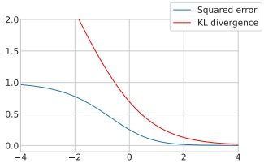

Figure 19.11: Comparison of the squared error and KL divergence losses for a consistency regularization. This visualization is for a binary classification problem where it is assumed that the model's output for the unperturbed input is 1. The figure plots the loss incurred for a particular value of the logit (i.e. the pre-activation fed into the output sigmoid nonlinearity) for the perturbed input. As the logit grows towards infinity, the model predicts a class label of 1 (in agreement with the prediction for the unperturbed input); as it grows towards negative infinity, the model predicts class 0. The squared error loss saturates (and has zero gradients) when the model predicts one class or the other with high probability, but the KL divergence grows without bound as the model predicts class 0 with more and more confidence.

where  $\xi$ is a small constant, typically  $10^{-6}$. VAT then sets

$$
\boldsymbol{x}^{\prime}=\boldsymbol{x}+\epsilon\frac{\delta}{\left\|\boldsymbol{\delta}\right\|_{2}}   \tag*{(19.29)}
$$

and proceeds as usual with consistency regularization (as in Equation (19.27)), where  $\epsilon$ is a scalar hyperparameter that sets the L2-norm of the perturbation applied to x.

Consistency regularization can also profoundly affect the geometry properties of the training objective, and the trajectory of SGD, such that performance can particularly benefit from non-standard training procedures. For example, the Euclidean distances between weights at different training epochs is significantly larger for objectives that use consistency regularization. Athiwaratkun et al. [Ath+19] show that a variant of stochastic weight averaging (SWA) [Izm+18] can achieve state-of-the-art performance on semi-supervised learning tasks by exploiting the geometric properties of consistency regularization.

A final consideration when using consistency regularization is the function used to measure the difference between the network's output with and without perturbations. Equation (19.27) uses the squared L2 distance (also referred to as the Brier score), which is a common choice [SJT16; TV17; LA16; Ber+19b]. It is also common to use the KL divergence  $D_{\mathbb{K}\mathbb{L}}(p_{\theta}(y|\boldsymbol{x}) \parallel p_{\theta}(y|\boldsymbol{x}')$ in analogy with the cross-entropy loss (i.e. KL divergence between ground-truth label and prediction) used for labeled examples [Miy+18; Ber+19a; Xie+19]. The gradient of the squared-error loss approaches zero as the model's predictions on the perturbed and unperturbed input differ more and more, assuming the model uses a softmax nonlinearity on its output. Using the squared-error loss therefore has a possible advantage that the model is not updated when its predictions are very unstable. However, the KL divergence has the same scale as the cross-entropy loss used for labeled data, which makes for more intuitive tuning of the unlabeled loss hyperparameter  $\lambda$. A comparison of the two loss functions is shown in Figure 19.11.

Author: Kevin P. Murphy. (C) MIT Press. CC-BY-NC-ND license

---

#### 19.3.6 Deep generative models *

Generative models provide a natural way of making use of unlabeled data through learning a model of the marginal distribution by minimizing  $\mathcal{L}_{U} = -\sum_{n} \log p_{\theta}(\boldsymbol{x}_{n})$. Various approaches have leveraged generative models for semi-supervised learning by developing ways to use the model of  $p_{\theta}(\boldsymbol{x}_{n})$ to help produce a better supervised model.

##### 19.3.6.1 Variational autoencoders

In Section 20.3.5, we describe the variational autoencoder (VAE), which defines a probabilistic model of the joint distribution of data  $\boldsymbol{x}$ and latent variables  $\boldsymbol{z}$. Data is assumed to be generated by first sampling  $\boldsymbol{z} \sim p(\boldsymbol{z})$ and then sampling  $\boldsymbol{x} \sim p(\boldsymbol{x}|\boldsymbol{z})$. For learning, the VAE uses an encoder  $\boldsymbol{q}_{\lambda}(\boldsymbol{z}|\boldsymbol{x})$ to approximate the posterior and a decoder  $p_{\theta}(\boldsymbol{x}|\boldsymbol{z})$ to approximate the likelihood. The encoder and decoder are typically deep neural networks. The parameters of the encoder and decoder can be jointly trained by maximizing the evidence lower bound (ELBO) of data.

The marginal distribution of latent variables  $p(z)$ is often chosen to be a simple distribution like a diagonal-covariance Gaussian. In practice, this can make the latent variables z more amenable to downstream classification thanks to the facts that z is typically lower-dimensional than x, that z is constructed via cascaded nonlinear transformations, and that the dimensions of the latent variables are designed to be independent. In other words, the latent variables can provide a (learned) representation where data may be more easily separable. In [Kin+14], this approach is called M1 and it is indeed shown that the latent variables can be used to train stronger models when labels are scarce. (The general idea of unsupervised learning of representations to help with downstream classification tasks is described further in Section 19.2.4.)

An alternative approach to leveraging VAEs, also proposed in [Kin+14] and called M2, has the form

$$
p_{\theta}(\boldsymbol{x},y)=p_{\theta}(y)p_{\theta}(\boldsymbol{x}|y)=p_{\theta}(y)\int p_{\theta}(\boldsymbol{x}|y,\boldsymbol{z})p_{\theta}(\boldsymbol{z})d\boldsymbol{z}   \tag*{(19.30)}
$$

where $z$is a latent variable,$p_{\theta}(z) = \mathcal{N}(z|\mu_{\theta}, \Sigma_{\theta})$is the latent prior (typically we fix$\mu_{\theta} = 0$and$\Sigma_{\theta} = \mathbf{I}$, $p_{\theta}(y) = \mathrm{Cat}(y|\pi_{\theta})$the label prior, and$p_{\theta}(x|y, z) = p(x|f_{\theta}(y, z))$is the likelihood, such as a Gaussian, with parameters computed by$f$(a deep neural network). The main innovation of this approach is to assume that data is generated according to both a latent class variable$y$as well as the continuous latent variable$z$. The class variable $y$is observed for labeled data and unobserved for unlabeled data.

To compute the likelihood for the labeled data,$ p_{\theta}(\boldsymbol{x}, y) $, we need to marginalize over z, which we can do by using an inference network of the form

$$
q_{\phi}(z|y,\boldsymbol{x})=\mathcal{N}(z|\boldsymbol{\mu}_{\phi}(y,\boldsymbol{x}),\mathrm{d i a g}(\sigma_{\phi}^{2}(\boldsymbol{x}))   \tag*{(19.31)}
$$

We then use the following variational lower bound

$$
\log p_{\theta}(\boldsymbol{x},y)\geq\mathbb{E}_{q_{\phi}(z|\boldsymbol{x},y)}\left[\log p_{\theta}(\boldsymbol{x}|y,z)+\log p_{\theta}(y)+\log p_{\theta}(z)-\log q_{\phi}(z|\boldsymbol{x},y)\right]=-\mathcal{L}(\boldsymbol{x},y)   \tag*{(19.32)}
$$

as is standard for VAEs (see Section 20.3.5). The only difference is that we observe two kinds of data: x and y.

---

To compute the likelihood for the unlabeled data,  $p_{\theta}(\boldsymbol{x})$, we need to marginalize over z and y, which we can do by using an inference network of the form

$$
q_{\phi}(z,y|\boldsymbol{x})=q_{\phi}(z|\boldsymbol{x})q_{\phi}(y|\boldsymbol{x})   \tag*{(19.33)}
$$

$$
q_{\phi}(z|\boldsymbol{x})=\mathcal{N}(z|\boldsymbol{\mu}_{\phi}(\boldsymbol{x}),\mathrm{d i a g}(\sigma_{\phi}^{2}(\boldsymbol{x}))   \tag*{(19.34)}
$$

$$
q_{\phi}(y|\boldsymbol{x})=\mathrm{Cat}(y|\boldsymbol{\pi}_{\phi}(\boldsymbol{x}))   \tag*{(19.35)}
$$

Note that  $q_{\phi}(y|\pmb{x})$ acts like a discriminative classifier, that imputes the missing labels. We then use the following variational lower bound:

$$
\log p_{\theta}(\boldsymbol{x})\geq\mathbb{E}_{q_{\phi}(\boldsymbol{z},y|\boldsymbol{x})}\left[\log p_{\theta}(\boldsymbol{x}|y,\boldsymbol{z})+\log p_{\theta}(y)+\log p_{\theta}(\boldsymbol{z})-\log q_{\phi}(\boldsymbol{z},y|\boldsymbol{x})\right]   \tag*{(19.36)}
$$

$$
=-\sum_{y}q_{\phi}(y|\boldsymbol{x})\mathcal{L}(\boldsymbol{x},y)+\mathbb{H}\left(q_{\phi}(y|\boldsymbol{x})\right)=-\mathcal{U}(\boldsymbol{x})   \tag*{(19.37)}
$$

Note that the discriminative classifier  $q_{\phi}(y|\boldsymbol{x})$ is only used to compute the log-likelihood of the unlabeled data, which is undesirable. We can therefore add an extra classification loss on the supervised data, to get the following overall objective function:

$$
\mathcal{L}(\boldsymbol{\theta})=\mathbb{E}_{(\boldsymbol{x},y)\sim\mathcal{D}_{L}}\left[\mathcal{L}(\boldsymbol{x},y)\right]+\mathbb{E}_{\boldsymbol{x}\sim\mathcal{D}_{U}}\left[\mathcal{U}(\boldsymbol{x})\right]+\alpha\mathbb{E}_{(\boldsymbol{x},y)\sim\mathcal{D}_{L}}\left[-\log q_{\phi}(y|\boldsymbol{x})\right]   \tag*{(19.38)}
$$

where  $\alpha$ is a hyperparameter that controls the relative weight of generative and discriminative learning.

Of course, the probabilistic model used in M2 is just one of many ways to decompose the dependencies between the observed data, the class labels, and the continuous latent variables. There are also many ways other than variational inference to perform approximate inference. The best technique will be problem dependent, but overall the main advantage of the generative approach is that we can incorporate domain knowledge. For example, we can model the missing data mechanism, since the absence of a label may be informative about the underlying data (e.g., people may be reluctant to answer a survey question about their health if they are unwell).

##### 19.3.6.2 Generative adversarial networks

Generative adversarial networks (GANs) (described in more detail in the sequel to this book, [Mur23]) are a popular class of generative models that learn an implicit model of the data distribution. They consist of a generator network, which maps samples from a simple latent distribution to the data space, and a critic network, which attempts to distinguish between the outputs of the generator and samples from the true data distribution. The generator is trained to generate samples that the critic classifies as “real”.

Since standard GANs do not produce a learned latent representation of a given datapoint and do not learn an explicit model of the data distribution, we cannot use the same approaches as were used for VAEs. Instead, semi-supervised learning with GANs is typically done by modifying the critic so that it outputs either a class label or “fake” instead of simply classifying real vs. fake  $\left|Sal+16\right;$ Ode16]. For labeled real data, the critic is trained to output the appropriate class label, and for unlabeled real data, it is trained to raise the probability of any of the class labels. As with standard GAN training, the critic is trained to classify outputs from the generator as fake and the generator is trained to fool the critic.

Author: Kevin P. Murphy. (C) MIT Press. CC-BY-NC-ND license

---

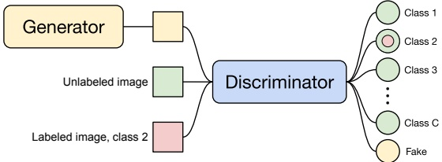

Figure 19.12: Diagram of the semi-supervised GAN framework. The discriminator is trained to output the class of labeled datapoints (red), a “fake” label for outputs from the generator (yellow), and any label for unlabeled data (green).

In more detail, let  $p_{\theta}(y|\boldsymbol{x})$ denote the critic with  $C+1$ outputs corresponding to C classes plus a “fake” class, and let  $G(z)$ denote the generator which takes as input samples from the prior distribution  $p(z)$. Let us assume that we are using the standard cross-entropy GAN loss as originally proposed in [Goo+14]. Then the critic’s loss is

$$
-\mathbb{E}_{\boldsymbol{x},y\sim p(\boldsymbol{x},y)}\log p_{\theta}(y|\boldsymbol{x})-\mathbb{E}_{\boldsymbol{x}\sim p(\boldsymbol{x})}\log[1-p_{\theta}(y=C+1|\boldsymbol{x})]-\mathbb{E}_{\boldsymbol{z}\sim p(\boldsymbol{z})}\log p_{\theta}(y=C+1|G(\boldsymbol{z}))   \tag*{(19.39)}
$$

This tries to maximize the probability of the correct class for the labeled examples, to minimize the probability of the fake class for real unlabeled examples, and to maximize the probability of the fake class for generated examples. The generator's loss is simpler, namely

$$
\mathbb{E}_{z\sim p(z)}\log p_{\theta}(y=C+1|G(z))   \tag*{(19.40)}
$$

A diagram visualizing the semi-supervised GAN framework is shown in Figure 19.12.

##### 19.3.6.3 Normalizing flows

Normalizing flows (described in more detail in the sequel to this book, [Mur23]) are a tractable way to define deep generative models. More precisely, they define an invertible mapping  $f_{\theta} : \mathcal{X} \to \mathcal{Z}$, with parameters  $\theta$, from the data space  $\mathcal{X}$ to the latent space  $\mathcal{Z}$. The density in data space can be written starting from the density in the latent space using the change of variables formula:

$$
p(x)=p(f(x))\cdot\left|\det\left(\frac{\partial f}{\partial x}\right)\right|.   \tag*{(19.41)}
$$

We can extend this to semi-supervised learning, as proposed in [Izm+20]. For class labels  $y \in \{1 \ldots \mathcal{C}\}$, we can specify the latent distribution, conditioned on a label  $k$, as Gaussian with mean  $\mu_k$ and covariance  $\Sigma_k$:  $p(z|y = k) = \mathcal{N}(z|\mu_k, \Sigma_k)$. The marginal distribution of  $z$ is then a Gaussian mixture. The likelihood for labeled data is then

$$
p_{\mathcal{X}}(x|y=k)=\mathcal{N}\left(f(x)|\mu_{k},\Sigma_{k}\right)\cdot\left|\det\left(\frac{\partial f}{\partial x}\right)\right|,   \tag*{(19.42)}
$$

“Probabilistic Machine Learning: An Introduction”. Online version. November 23, 2024

---

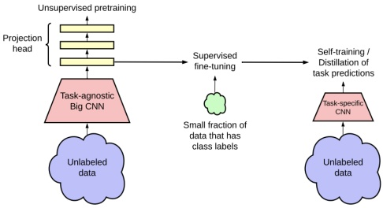

Figure 19.13: Combining self-supervised learning on unlabeled data (left), supervised fine-tuning (middle), and self-training on pseudo-labeled data (right). From Figure 3 of [Che+20c]. Used with kind permission of Ting Chen.

and the likelihood for data with unknown label is  $p(x) = \sum_{k} p(x|y = k)p(y = k)$.

For semi-supervised learning we can then maximize the joint likelihood of the labeled  $D_{\ell}$ and unlabeled data  $D_{u}$:

$$
p(\mathcal{D}_{\ell},\mathcal{D}_{u}|\theta)=\prod_{(x_{i},y_{i})\in\mathcal{D}_{\ell}}p(x_{i},y_{i})\prod_{x_{j}\in\mathcal{D}_{u}}p(x_{j}),   \tag*{(19.43)}
$$

over the parameters  $\theta$ of the bijective function f, which learns a density model for a Bayes classifier. Given a test point x, the model predictive distribution is given by

$$
p_{X}(y=c|x)=\frac{p(x|y=c)p(y=c)}{p(x)}=\frac{p(x|y=c)p(y=c)}{\sum_{k=1}^{C}p(x|y=k)p(y=k)}=\frac{\mathcal{N}(f(x)|\mu_{c},\Sigma_{c})}{\sum_{k=1}^{C}\mathcal{N}(f(x)|\mu_{k},\Sigma_{k})},   \tag*{(19.44)}
$$

where we have assumed  $p(y = c) = 1/C$. We can make predictions for a test point  $x$ with the Bayes decision rule  $y = \arg\max_{c \in \{1, \ldots, C\}} p(y = c|x)$.

#### 19.3.7 Combining self-supervised and semi-supervised learning

It is possible to combine self-supervised and semi-supervised learning. For example, [Che+20c] use SimCLR (Section 19.2.4.4) to perform self-supervised representation learning on the unlabeled data, they then fine-tune this representation on a small labeled dataset (as in transfer learning, Section 19.2), and finally, they apply the trained model back to the original unlabeled dataset, and distill the predictions from this teacher model T into a student model S. (Knowledge distillation is the name given to the approach of training one model on the predictions of another, as originally proposed in [HVD14].) That is, after fine-tuning T, they train S by minimizing

$$
\mathcal{L}(T)=-\sum_{\boldsymbol{x}_{i}\in\mathcal{D}}\left[\sum_{y}p^{T}(y|\boldsymbol{x}_{i};\tau)\log p^{S}(y|\boldsymbol{x}_{i};\tau)\right]   \tag*{(19.45)}
$$

Author: Kevin P. Murphy. (C) MIT Press. CC-BY-NC-ND license

---

where  $\tau > 0$ is a temperature parameter applied to the softmax output, which is used to perform label smoothing. If  $S$ has the same form as  $T$, this is known as self-training, as discussed in Section 19.3.1. However, normally the student  $S$ is smaller than the teacher  $T$. (For example,  $T$ might be a high capacity model, and  $S$ is a lightweight version that runs on a phone.) See Figure 19.13 for an illustration of the overall approach.

### 19.4 Active learning

In active learning, the goal is to identify the true predictive mapping  $y = f(\boldsymbol{x})$ by querying as few  $(\boldsymbol{x}, y)$ points as possible. There are three main variants. In query synthesis, the algorithm gets to choose any input  $\boldsymbol{x}$, and can ask for its corresponding output  $y = f(\boldsymbol{x})$. In pool-based active learning, there is a large, but fixed, set of unlabeled data points, and the algorithm gets to ask for a label for one or more of these points. Finally, in stream-based active learning, the incoming data is arriving continuously, and the algorithm must choose whether it wants to request a label for the current input or not.

There are various closely related problems. In Bayesian optimization the goal is to estimate the location of the global optimum  $\boldsymbol{x}^* = \arg\min_{\boldsymbol{x}} f(\boldsymbol{x})$ in as few queries as possible; typically we fit a surrogate (response surface) model to the intermediate  $(\boldsymbol{x}, y)$ queries, to decide which question to ask next. In experiment design, the goal is to infer a parameter vector of some model, using carefully chosen data samples  $\mathcal{D} = \{\boldsymbol{x}_1, \ldots, \boldsymbol{x}_N\}$, i.e. we want to estimate  $p(\boldsymbol{\theta}|\mathcal{D})$ using as little data as possible. (This can be thought of as an unsupervised, or generalized, form of active learning.)

In this section, we give a brief review of the pool based approach to active learning. For more details, see e.g., [Set12] for a review.

#### 19.4.1 Decision-theoretic approach

In the decision theoretic approach to active learning, proposed in [KHB07; RM01], we define the utility of querying x in terms of the value of information. In particular, we define the utility of issuing query x as

$$
U(\boldsymbol{x})\triangleq\mathbb{E}_{p(y|\boldsymbol{x},\mathcal{D})}\left[\min_{a}\left(\rho(a|\mathcal{D})-\rho(a|\mathcal{D},(\boldsymbol{x},y))\right)\right]   \tag*{(19.46)}
$$

where  $\rho(a|\mathcal{D}) = \mathbb{E}_{p(\theta|\mathcal{D})}[\ell(\theta,a)]$ is the posterior expected loss of taking some future action a given the data  $\mathcal{D}$ observed so far. Unfortunately, evaluating  $U(\boldsymbol{x})$ for each  $\boldsymbol{x}$ is quite expensive, since for each possible response y we might observe, we have to update our beliefs given  $(\boldsymbol{x}, y)$ to see what effect it might have on our future decisions (similar to look ahead search technique applied to belief states).

#### 19.4.2 Information-theoretic approach

In the information theoretic approach to active supervised learning, we avoid using task-specific loss functions, and instead focus on learning our model as well as we can. In particular, [Lin56] proposed to define the utility of querying x in terms of information gain about the parameters  $\theta$, i.e., the reduction in entropy:

$$
U(\pmb{x})\triangleq\mathbb{H}\left(p(\pmb{\theta}|\mathcal{D})\right)-\mathbb{E}_{p(y|\pmb{x},\mathcal{D})}\left[\mathbb{H}\left(p(\pmb{\theta}|\mathcal{D},\pmb{x},y)\right)\right]   \tag*{(19.47)}
$$

---

(Note that the first term is a constant wrt x, but we include it for later convenience.) Exercise 19.1 asks you to show that this objective is identical to the expected change in the posterior over the parameters which is given by

$$
U^{\prime}(\pmb{x})\triangleq\mathbb{E}_{p(y|\pmb{x},\mathcal{D})}\left[D_{\mathbb{K L}}\left(p(\pmb{\theta}|\mathcal{D},\pmb{x},y)\parallel p(\pmb{\theta}|\mathcal{D})\right)\right]   \tag*{(19.48)}
$$

Using symmetry of the mutual information, we can rewrite Equation (19.47) as follows:

$$
U(\boldsymbol{x})=\mathbb{H}\left(p(\boldsymbol{\theta}|\mathcal{D})\right)-\mathbb{E}_{p(y|\boldsymbol{x},\mathcal{D})}\left[\mathbb{H}\left(p(\boldsymbol{\theta}|\mathcal{D},\boldsymbol{x},y)\right)\right]   \tag*{(19.49)}
$$

$$
=\mathbb{I}(\boldsymbol{\theta},y|\mathcal{D},\boldsymbol{x})   \tag*{(19.50)}
$$

$$
=\mathbb{H}\left(p(y|\pmb{x},\mathcal{D})\right)-\mathbb{E}_{p(\pmb{\theta}|\mathcal{D})}\left[\mathbb{H}\left(p(y|\pmb{x},\pmb{\theta})\right)\right]   \tag*{(19.51)}
$$

The advantage of this approach is that we now only have to reason about the uncertainty of the predictive distribution over outputs y, not over the parameters  $\theta$.

Equation (19.51) has an interesting interpretation. The first term prefers examples x for which there is uncertainty in the predicted label. Just using this as a selection criterion is called maximum entropy sampling [SW87]. However, this can have problems with examples which are inherently ambiguous or mislabeled. The second term in Equation (19.51) will discourage such behavior, since it prefers examples x for which the predicted label is fairly certain once we know  $\theta$; this will avoid picking inherently hard-to-predict examples. In other words, Equation (19.51) will select examples x for which the model makes confident predictions which are highly diverse. This approach has therefore been called Bayesian active learning by disagreement or BALD [Hou+12].

This method can be used to train classifiers for other domains where expert labels are hard to acquire, such as medical images or astronomical images  $[Wal+20]$.

#### 19.4.3 Batch active learning

So far, we have assumed a greedy or myopic strategy, in which we select a single example $\mathbf{x}$, as if it were the last datapoint to be selected. But sometimes we have a budget to collect a set of $B$samples, call them$(\mathbf{X}, \mathbf{Y})$. In this case, the information gain criterion becomes $U(\mathbf{x}) = \mathbb{H}(p(\boldsymbol{\theta}|\mathcal{D})) - \mathbb{E}_{p(\mathbf{Y}|\mathbf{x}, \mathcal{D})} [\mathbb{H}(p(\boldsymbol{\theta}|\mathbf{Y}, \mathbf{x}, \mathcal{D}))]$. Unfortunately, optimizing this is NP-hard in the horizon length $B$[KLQ95; KG05].

Fortunately, under certain conditions, the greedy strategy is near-optimal, as we now explain. Let us fix query$\boldsymbol{x}$and define$f(\boldsymbol{y}) \triangleq \mathbb{H}(p(\boldsymbol{\theta} \mid \mathcal{D})) - \mathbb{H}(p(\boldsymbol{\theta} \mid \mathbf{Y}, \boldsymbol{x}, \mathcal{D}))$as the information gain function, so$U(\boldsymbol{x}) = \mathbb{E}_{\boldsymbol{y}} [f(\boldsymbol{y}, \boldsymbol{x})]$. It is clear that $f(\boldsymbol{\theta}) = 0$, and that $f$is non-decreasing, meaning$f(Y^{\text{large}}) \geq f(Y^{\text{small}})$, due to the “more information never hurts” principle. Furthermore, [KG05] proved that $f$is submodular. As a consequence, a sequential greedy approach is within a constant factor of optimal. If we combine this greedy technique with the BALD objective, we get a method called BatchBALD [KAG19].

### 19.5 Meta-learning

We can think of a learning algorithm as a function$ A $that maps data to a parameter estimate,$ \theta = A(\mathcal{D}) $. The function  $A$ usually has its own parameter — call them  $\phi$ — such as the initial values for  $\theta$, or the learning rate, etc. We denote this by  $\theta = A(\mathcal{D}; \phi)$. We can imagine learning  $\phi$ itself,

---

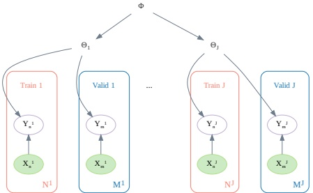

Figure 19.14: Illustration of a hierarchical Bayesian model for meta-learning. Generated by hbayes_maml.ipynb.

given a collection of datasets  $\mathcal{D}_{1:J}$ and some meta-learning algorithm  $M$, i.e.,  $\phi = M(\mathcal{D}_{1:J})$. We can then apply  $A(\cdot;\phi)$ to learn the parameters  $\theta_{J+1}$ on some new dataset  $\mathcal{D}_{J+1}$. There are many techniques for meta-learning — see e.g., [Van18; HRP21] for recent reviews. Below we discuss one particularly popular method. (Note that meta-learning is also called learning to learn [TP97].)

#### 19.5.1 Model-agnostic meta-learning (MAML)

A natural approach to meta learning is to use a hierarchical Bayesian model, as illustrated in Figure 19.14. The parameters for each task  $\theta_j$ are assumed to come from a common prior,  $p(\theta_j|\xi)$, which can be used to help pool statistical strength from multiple data-poor problems. Meta-learning becomes equivalent to learning the prior  $\phi$. Rather than performing full Bayesian inference in this model, a more efficient approach is to use the following empirical Bayes (Section 4.6.5.3) approximation:

$$
\boldsymbol{\xi}^{*}=\underset{\boldsymbol{\xi}}{\operatorname{argmax}}\frac{1}{J}\sum_{j=1}^{J}\log p(\mathcal{D}_{valid}^{j}|\hat{\boldsymbol{\theta}}_{j}(\boldsymbol{\xi},\mathcal{D}_{train}^{j}))   \tag*{(19.52)}
$$

where  $\hat{\boldsymbol{\theta}}_j = \hat{\boldsymbol{\theta}}(\boldsymbol{\xi}, \mathcal{D}_{\mathrm{train}}^j)$ is a point estimate of the parameters for task  $j$ based on  $\mathcal{D}_{\mathrm{train}}^j$ and prior  $\boldsymbol{\xi}$, and where we use a cross-validation approximation to the marginal likelihood (Section 5.2.4).

To compute the point estimate of the parameters for the target task  $\theta_{J+1}$, we use  $K$ steps of a gradient ascent procedure starting at  $\xi$ with a learning rate of  $\eta$. This is known as model-agnostic meta-learning or MAML [FAL17]. This can be shown to be equivalent to an approximate MAP estimate using a Gaussian prior centered at  $\xi$, where the strength of the prior is controlled by the number of gradient steps [San96; Gra+18]. (This is an example of fast adaptation of the task specific weights starting from the shared prior  $\xi$.)

---

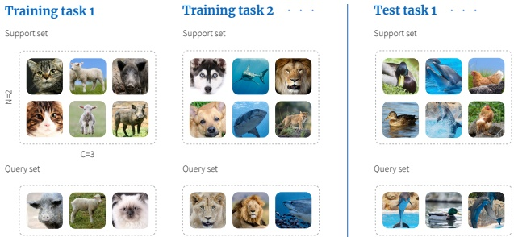

Figure 19.15: Illustration of meta-learning for few-shot learning. Here, each task is a 3-way-2-shot classification problem because each training task contains a support set with three classes, each with two examples. From https://bit.ly/3rrvSjw. Copyright (2019) Borealis AI. Used with kind permission of Simon Prince and April Cooper.

### 19.6 Few-shot learning

People can learn to predict from very few labeled examples. This is called few-shot learning. In the extreme in which the person or system learns from a single example of each class, this is called one-shot learning, and if no labeled examples are given, it is called zero-shot learning.

A common way to evaluate methods for FSL is to use C-way N-shot classification, in which the system is expected to learn to classify C classes using just N training examples of each class. Typically N and C are very small, e.g., Figure 19.15 illustrates the case where we have C = 3 classes, each with N = 2 examples. Since the amount of data from the new domain (here, ducks, dolphins and hens) is so small, we cannot expect to learn from scratch. Therefore we turn to meta-learning.

During training, the meta-algorithm M trains on a labeled support set from group j, returns a predictor  $f^j$, which is then evaluated on a disjoint query set also from group j. We optimize M over all J groups. Finally we can apply M to our new labeled support set to get  $f^{\text{test}}$, which is applied to the query set from the test domain. This is illustrated in Figure 19.15. We see that there is no overlap between the classes in the two training tasks ( $\{\text{cat}, \text{lamb}, \text{pig}\}$ and  $\{\text{dog}, \text{shark}, \text{lion}\}$) and those in the test task ( $\{\text{duck}, \text{dolphin}, \text{hen}\}$). Thus the algorithm M must learn to predict image classes in general rather than any particular set of labels.

There are many approaches to few-shot learning. We discuss one such method in Section 19.6.1. For more methods, see e.g., [Wan+20b].

#### 19.6.1 Matching networks

One approach to few shot learning is to learn a distance metric on some other dataset, and then to use  $d_{\theta}(\boldsymbol{x},\boldsymbol{x}^{\prime})$ inside of a nearest neighbor classifier. Essentially this defines a semi-parametric model of the form  $p_{\theta}(\boldsymbol{y}|\boldsymbol{x},\boldsymbol{S})$, where  $\mathcal{S}$ is the small labeled dataset (known as the support set), and  $\theta$ are the parameters of the distance function. This approach is widely used for fine-grained classification.

---

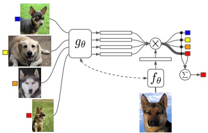

Figure 19.16: Illustration of a matching network for one-shot learning. From Figure 1 of [Vin+16]. Used with kind permission of Oriol Vinyals.

tasks, where there are many different visually similar categories, such as face images from a gallery, or product images from a catalog.

An extension of this approach is to learn a function of the form

$$
p_{\theta}(y|\boldsymbol{x},\mathcal{S})=\mathbb{I}\left(y=\sum_{n\in\mathcal{S}}a_{\theta}(\boldsymbol{x},\boldsymbol{x}_{n};\mathcal{S})y_{n}\right)   \tag*{(19.53)}
$$

where  $a_{\theta}(\boldsymbol{x},\boldsymbol{x}_{n};\mathcal{S}) \in \mathbb{R}^{+}$ is some kind of adaptive similarity kernel. For example, we can use an attention kernel of the form

$$
a(\boldsymbol{x},\boldsymbol{x}_{n};\mathcal{S})=\frac{\exp(c(f(\boldsymbol{x}),g(\boldsymbol{x}_{n})))}{\sum_{n^{\prime}=1}^{N}\exp(c(f(\boldsymbol{x}),g(\boldsymbol{x}_{n^{\prime}})))}   \tag*{(19.54)}
$$

where  $c(\boldsymbol{u}, \boldsymbol{v})$ is the cosine distance. (We can make f and g be the same function if we want.) Intuitively, the attention kernel will compare  $\boldsymbol{x}$ to  $\boldsymbol{x}_n$ in the context of all the labeled examples, which provides an implicit signal about which feature dimensions are relevant. (We discuss attention mechanisms in more detail in Section 15.4.) This is called a matching network [Vin+16]. See Figure 19.16 for an illustration.

We can train the $f$and$g$functions using multiple small datasets, as in meta-learning (Section 19.5). More precisely, let$\mathcal{D}$be a large labeled dataset (e.g., ImageNet), and let$p(\mathcal{L})$be a distribution over its labels. We create a task by sampling a small set of labels (say 25),$\mathcal{L} \sim p(\mathcal{L})$, and then sampling a small support set of examples from $\mathcal{D}$with those labels,$\mathcal{S} \sim \mathcal{L}$, and finally sampling a small test set with those same labels, $\mathcal{T} \sim \mathcal{L}$. We then train the model to predict the test labels given the support set, i.e., we optimize the following objective:

$$
\mathcal{L}(\boldsymbol{\theta};\mathcal{D})=\mathbb{E}_{\mathcal{L}\sim p(\mathcal{L})}\left[\mathbb{E}_{\mathcal{S}\sim\mathcal{L},\mathcal{T}\sim\mathcal{L}}\left[\sum_{(\boldsymbol{x},y)\in\mathcal{T}}\log p_{\boldsymbol{\theta}}(y|\boldsymbol{x},\mathcal{S})\right]\right]   \tag*{(19.55)}
$$

After training, we freeze  $\theta$, and apply Equation (19.53) to a test support set S.

---

### 19.7 Weakly supervised learning

The term weakly supervised learning refers to scenarios where we do not have an exact label associated with every feature vector in the training set.

One scenario is when we have a distribution over labels for each case, rather than a single label. Fortunately, we can still do maximum likelihood training: we just have to minimize the cross entropy,

$$
\mathcal{L}(\boldsymbol{\theta})=-\sum_{n}\sum_{y}p(y|\boldsymbol{x}_{n})\log q_{\boldsymbol{\theta}}(y|\boldsymbol{x}_{n})   \tag*{(19.56)}
$$

where  $p(y|\pmb{x}_{n})$ is the label distribution for case  $n$, and  $q_{\theta}(y|\pmb{x}_{n})$ is the predicted distribution. Indeed, it is often useful to artificially replace exact labels with a “soft” version, in which we replace the delta function with a distribution that puts, say, 90% of its mass on the observed label, and spreads the remaining mass uniformly over the other choices. This is called label smoothing, and is a useful form of regularization (see e.g., [MKH19]).

Another scenario is when we have a set, or bag, of instances,  $\mathbf{x}_n = \{\mathbf{x}_{n,1}, \ldots, \mathbf{x}_{n,B}\}$, but we only have a label for the entire bag,  $y_n$, not for the members of the bag,  $y_{nb}$. We often assume that if any member of the bag is positive, the whole bag is labeled positive, so  $y_n = \sqrt[B]{b=1}$, but we do not know which member “caused” the positive outcome. However, if all the members are negative, the entire bag is negative. This is known as multi-instance learning [DLLP97]. (For a recent example of this in the context of COVID-19 risk score learning, see [MKS21].) Various algorithms can be used to solve the MIL problem, depending on what assumptions we make about the correlation between the labels in each bag, and the fraction of positive members we expect to see (see e.g., [KF05]).

Yet another scenario is known as distant supervision [Min+09], which is often used to train information extraction systems. The idea is that we have some fact, such as “Married(B,M)”, that we know to be true (since it is stored in a database). We use this to label every sentence (in our unlabeled training corpus) in which the entities B and M are mentioned as being a positive example of the “Married” relation. For example, the sentence “B and M invited 100 people to their wedding” will be labeled positive. But this heuristic may include false positives, for example “B and M went out to dinner” will also be labeled positive. Thus the resulting labels will be noisy. We discuss some ways to handle label noise in Section 10.4.

### 19.8 Exercises

Exercise 19.1 [Information gain equations]

Consider the following two objectives for evaluating the utility of querying a datapoint x in an active learning setting:

$$
U(\pmb{x})\triangleq\mathbb{H}\left(p(\pmb{\theta}|\mathcal{D})\right)-\mathbb{E}_{p(y|\pmb{x},\mathcal{D})}\left[\mathbb{H}\left(p(\pmb{\theta}|\mathcal{D},\pmb{x},y)\right)\right]   \tag*{(19.57)}
$$

$$
U^{\prime}(\boldsymbol{x})\triangleq\mathbb{E}_{p(y|\boldsymbol{x},\mathcal{D})}\left[D_{\mathbb{K L}}\left(p(\boldsymbol{\theta}|\mathcal{D},\boldsymbol{x},y)\parallel p(\boldsymbol{\theta}|\mathcal{D})\right)\right]   \tag*{(19.58)}
$$

Prove that these are equal.

---

---

## 20 Dimensionality Reduction

A common form of unsupervised learning is dimensionality reduction, in which we learn a mapping from the high-dimensional visible space,  $\boldsymbol{x} \in \mathbb{R}^D$, to a low-dimensional latent space,  $\boldsymbol{z} \in \mathbb{R}^L$. This mapping can either be a parametric model  $\boldsymbol{z} = f(\boldsymbol{x}; \boldsymbol{\theta})$ which can be applied to any input, or it can be a nonparametric mapping where we compute an embedding  $\boldsymbol{z}_n$ for each input  $\boldsymbol{x}_n$ in the data set, but not for any other points. This latter approach is mostly used for data visualization, whereas the former approach can also be used as a preprocessing step for other kinds of learning algorithms. For example, we might first reduce the dimensionality by learning a mapping from  $\boldsymbol{x}$ to  $\boldsymbol{z}$, and then learn a simple linear classifier on this embedding, by mapping  $\boldsymbol{z}$ to  $\boldsymbol{y}$.

### 20.1 Principal components analysis (PCA)

The simplest and most widely used form of dimensionality reduction is principal components analysis or PCA. The basic idea is to find a linear and orthogonal projection of the high dimensional data  $\boldsymbol{x} \in \mathbb{R}^D$ to a low dimensional subspace  $\boldsymbol{z} \in \mathbb{R}^L$, such that the low dimensional representation is a “good approximation” to the original data, in the following sense: if we project or encode  $\boldsymbol{x}$ to get  $\boldsymbol{z} = \boldsymbol{W}^T \boldsymbol{x}$, and then unproject or decode  $\boldsymbol{z}$ to get  $\hat{\boldsymbol{x}} = \boldsymbol{W} \boldsymbol{z}$, then we want  $\hat{\boldsymbol{x}}$ to be close to  $\boldsymbol{x}$ in  $\ell_2$ distance. In particular, we can define the following reconstruction error or distortion:

$$
\mathcal{L}(\mathbf{W})\triangleq\frac{1}{N}\sum_{n=1}^{N}||\boldsymbol{x}_{n}-\mathrm{d e c o d e}(\mathrm{e n c o d e}(\boldsymbol{x}_{n};\mathbf{W});\mathbf{W})||_{2}^{2}   \tag*{(20.1)}
$$

where the encode and decoding stages are both linear maps, as we explain below.

In Section 20.1.2, we show that we can minimize this objective by setting  $\hat{\mathbf{W}} = \mathbf{U}_L$, where  $\mathbf{U}_L$ contains the  $L$ eigenvectors with largest eigenvalues of the empirical covariance matrix

$$
\hat{\mathbf{\Sigma}}=\frac{1}{N}\sum_{n=1}^{N}(\mathbf{x}_{n}-\overline{\mathbf{x}})(\mathbf{x}_{n}-\overline{\mathbf{x}})^{\mathsf{T}}=\frac{1}{N}\mathbf{X}_{c}^{\mathsf{T}}\mathbf{X}_{c}   \tag*{(20.2)}
$$

where  $\mathbf{X}_{c}$ is a centered version of the  $N \times D$ design matrix. In Section 20.2.2, we show that this is equivalent to maximizing the likelihood of a latent linear Gaussian model known as probabilistic PCA.

#### 20.1.1 Examples

Before giving the details, we start by showing some examples.

---

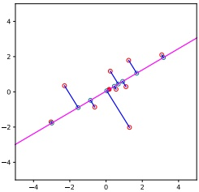

Figure 20.1: An illustration of PCA where we project from 2d to 1d. Red circles are the original data points, blue circles are the reconstructions. The red dot is the data mean. Generated by pcaDemo2d.ipynb.

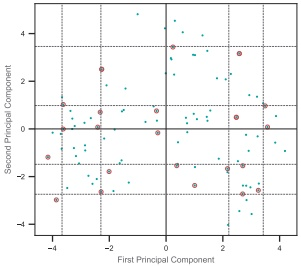

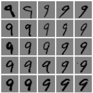

Figure 20.2: An illustration of PCA applied to MNIST digits from class 9. Grid points are at the 5, 25, 50, 75, 95 % quantiles of the data distribution along each dimension. The circled points are the closest projected images to the vertices of the grid. Adapted from Figure 14.23 of [HTF09]. Generated by pca digits. ipynb.

Figure 20.1 shows a very simple example, where we project 2d data to a 1d line. This direction captures most of the variation in the data.

In Figure 20.2, we show what happens when we project some MNIST images of the digit 9 down to 2d. Although the inputs are high dimensional (specifically  $28 \times 28 = 784$ dimensional), the number of “effective degrees of freedom” is much less, since the pixels are correlated, and many digits look similar. Therefore we can represent each image as a point in a low dimensional linear space.

In general, it can be hard to interpret the latent dimensions to which the data is projected. However, by looking at several projected points along a given direction, and the examples from which they are derived, we see that the first principal component (horizontal direction) seems to capture the orientation of the digit, and the second component (vertical direction) seems to capture line thickness.

In Figure 20.3, we show PCA applied to another image dataset, known as the Olivetti face dataset,

---

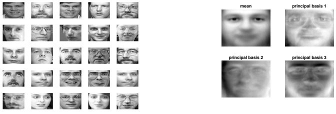

 $(a)$

(b)

Figure 20.3: a) Some randomly chosen  $64 \times 64$ pixel images from the Olivetti face database. (b) The mean and the first three PCA components represented as images. Generated by pcaImageDemo.ipynb.

which is a set of  $64 \times 64$ grayscale images. We project these to a 3d subspace. The resulting basis vectors (columns of the projection matrix  $\mathbf{W}$) are shown as images in Figure 20.3b; these are known as eigenfaces [Tur13], for reasons that will be explained in Section 20.1.2. We see that the main modes of variation in the data are related to overall lighting, and then differences in the eyebrow region of the face. If we use enough dimensions (but fewer than the 4096 we started with), we can use the representation  $\mathbf{z} = \mathbf{W}^\top \mathbf{x}$ as input to a nearest-neighbor classifier to perform face recognition; this is faster and more reliable than working in pixel space [MWP98].

#### 20.1.2 Derivation of the algorithm

Suppose we have an (unlabeled) dataset $\mathcal{D} = \{\boldsymbol{x}_n : n = 1 : N\}$, where $\boldsymbol{x}_n \in \mathbb{R}^D$. We can represent this as an $N \times D$data matrix$\mathbf{X}$. We will assume $\overline{\boldsymbol{x}} = \frac{1}{N} \sum_{n=1}^N \boldsymbol{x}_n = \mathbf{0}$, which we can ensure by centering the data.

We would like to approximate each  $x_n$ by a low dimensional representation,  $z_n \in \mathbb{R}^L$. We assume that each  $x_n$ can be “explained” in terms of a weighted combination of basis functions  $w_1, \ldots, w_L$, where each  $w_k \in \mathbb{R}^D$, and where the weights are given by  $z_n \in \mathbb{R}^L$, i.e., we assume  $x_n \approx \sum_{k=1}^{L} z_{nk} w_k$. The vector  $z_n$ is the low dimensional representation of  $x_n$, and is known as the latent vector, since it consists of latent or “hidden” values that are not observed in the data. The collection of these latent variables are called the latent factors.

We can measure the error produced by this approximation as follows:

$$
\mathcal{L}(\mathbf{W},\mathbf{Z})=\frac{1}{N}||\mathbf{X}-\mathbf{Z}\mathbf{W}^{\mathsf{T}}||_{F}^{2}=\frac{1}{N}||\mathbf{X}^{\mathsf{T}}-\mathbf{W}\mathbf{Z}^{\mathsf{T}}||_{F}^{2}=\frac{1}{N}\sum_{n=1}^{N}||\mathbf{x}_{n}-\mathbf{W}\mathbf{z}_{n}||^{2}   \tag*{(20.3)}
$$

where the rows of Z contain the low dimension versions of the rows of X. This is known as the (average) reconstruction error, since we are approximating each  $\boldsymbol{x}_n$ by  $\hat{\boldsymbol{x}}_n = \boldsymbol{W}\boldsymbol{z}_n$.

We want to minimize this subject to the constraint that  $\mathbf{W}$ is an orthogonal matrix. Below we show that the optimal solution is obtained by setting  $\hat{\mathbf{W}} = \mathbf{U}_L$, where  $\mathbf{U}_L$ contains the  $L$ eigenvectors with largest eigenvalues of the empirical covariance matrix.

---

##### 20.1.2.1 Base case

Let us start by estimating the best 1d solution,  $\boldsymbol{w}_1 \in \mathbb{R}^D$. We will find the remaining basis vectors  $\boldsymbol{w}_2$,  $\boldsymbol{w}_3$, etc. later.

Let the coefficients for each of the data points associated with the first basis vector be denoted by  $\tilde{\mathbf{z}}_1 = [z_{11}, \ldots, z_{N1}] \in \mathbb{R}^N$. The reconstruction error is given by

$$
\mathcal{L}(\boldsymbol{w}_{1},\tilde{\boldsymbol{z}}_{1})=\frac{1}{N}\sum_{n=1}^{N}||\boldsymbol{x}_{n}-z_{n1}\boldsymbol{w}_{1}||^{2}=\frac{1}{N}\sum_{n=1}^{N}(\boldsymbol{x}_{n}-z_{n1}\boldsymbol{w}_{1})^{\top}(\boldsymbol{x}_{n}-z_{n1}\boldsymbol{w}_{1})   \tag*{(20.4)}
$$

$$
=\frac{1}{N}\sum_{n=1}^{N}[\boldsymbol{x}_{n}^{\mathsf{T}}\boldsymbol{x}_{n}-2z_{n1}\boldsymbol{w}_{1}^{\mathsf{T}}\boldsymbol{x}_{n}+z_{n1}^{2}\boldsymbol{w}_{1}^{\mathsf{T}}\boldsymbol{w}_{1}]   \tag*{(20.5)}
$$

$$
=\frac{1}{N}\sum_{n=1}^{N}[\boldsymbol{x}_{n}^{\mathsf{T}}\boldsymbol{x}_{n}-2z_{n1}\boldsymbol{w}_{1}^{\mathsf{T}}\boldsymbol{x}_{n}+z_{n1}^{2}]   \tag*{(20.6)}
$$

since  $\boldsymbol{w}_1^\top \boldsymbol{w}_1 = 1$ (by the orthonormality assumption). Taking derivatives wrt  $z_{n1}$ and equating to zero gives

$$
\frac{\partial}{\partial\cdot}\mathbf{r}^{\prime}\quad\mathbf{\nabla}-w_{1}^{\mathsf{T}}\mathbf{x}_{n}   \tag*{(20.7)}
$$

So the optimal embedding is obtained by orthogonally projecting the data onto  $\boldsymbol{w}_{1}$ (see Figure 20.1). Plugging this back in gives the loss for the weights:

$$
\mathcal{L}(\boldsymbol{w}_{1})=\mathcal{L}(\boldsymbol{w}_{1},\tilde{\boldsymbol{z}}_{1}^{*}(\boldsymbol{w}_{1}))=\frac{1}{N}\sum_{n=1}^{N}[\boldsymbol{x}_{n}^{\top}\boldsymbol{x}_{n}-z_{n1}^{2}]=\mathrm{c o n s t}-\frac{1}{N}\sum_{n=1}^{N}z_{n1}^{2}   \tag*{(20.8)}
$$

To solve for  $w_{1}$, note that

$$
\mathcal{L}(\boldsymbol{w}_{1})=-\frac{1}{N}\sum_{n=1}^{N}\boldsymbol{z}_{n1}^{2}=-\frac{1}{N}\sum_{n=1}^{N}\boldsymbol{w}_{1}^{\mathsf{T}}\boldsymbol{x}_{n}\boldsymbol{x}_{n}^{\mathsf{T}}\boldsymbol{w}_{1}=-\boldsymbol{w}_{1}^{\mathsf{T}}\hat{\boldsymbol{\Sigma}}\boldsymbol{w}_{1}   \tag*{(20.9)}
$$

where  $\Sigma$ is the empirical covariance matrix (since we assumed the data is centered). We can trivially optimize this by letting  $\|\mathbf{w}_1\| \to \infty$, so we impose the constraint  $\|\mathbf{w}_1\| = 1$ and instead optimize

$$
\tilde{\mathcal{L}}(\boldsymbol{w}_{1})=\boldsymbol{w}_{1}^{\top}\hat{\boldsymbol{\Sigma}}\boldsymbol{w}_{1}-\lambda_{1}(\boldsymbol{w}_{1}^{\top}\boldsymbol{w}_{1}-1)   \tag*{(20.10)}
$$

where  $\lambda_{1}$ is a Lagrange multiplier (see Section 8.5.1). Taking derivatives and equating to zero we have

$$
\frac{\partial}{\partial\boldsymbol{w}_{1}}\tilde{\mathcal{L}}(\boldsymbol{w}_{1})=2\hat{\boldsymbol{\Sigma}}\boldsymbol{w}_{1}-2\lambda_{1}\boldsymbol{w}_{1}=0   \tag*{(20.11)}
$$

$$
\hat{\Sigma}w_{1}=\lambda_{1}w_{1}   \tag*{(20.12)}
$$

Hence the optimal direction onto which we should project the data is an eigenvector of the covariance matrix. Left multiplying by  $\boldsymbol{w}_1^\top$ (and using  $\boldsymbol{w}_1^\top \boldsymbol{w}_1 = 1$) we find

$$
\boldsymbol{w}_{1}^{\top}\hat{\boldsymbol{\Sigma}}\boldsymbol{w}_{1}=\lambda_{1}   \tag*{(20.13)}
$$

Since we want to maximize this quantity (minimize the loss), we pick the eigenvector which corresponds to the largest eigenvalue.

---

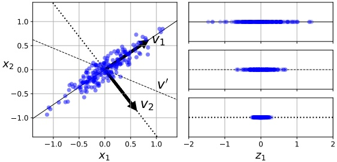

Figure 20.4: Illustration of the variance of the points projected onto different 1d vectors.  $v_1$ is the first principal component, which maximizes the variance of the projection.  $v_2$ is the second principal component which is direction orthogonal to  $v_1$. Finally  $v'$ is some other vector in between  $v_1$ and  $v_2$. Adapted from Figure 8.7 of [Gér19]. Generated by pca_projected_variance.ipynb

##### 20.1.2.2 Optimal weight vector maximizes the variance of the projected data

Before continuing, we make an interesting observation. Since the data has been centered, we have

$$
\mathbb{E}\left[z_{n1}\right]=\mathbb{E}\left[\boldsymbol{x}_{n}^{\mathsf{T}}\boldsymbol{w}_{1}\right]=\mathbb{E}\left[\boldsymbol{x}_{n}\right]^{\mathsf{T}}\boldsymbol{w}_{1}=0   \tag*{(20.14)}
$$

Hence variance of the projected data is given by

$$
\mathbb{V}\left[\tilde{\mathbf{z}}_{1}\right]=\mathbb{E}\left[\tilde{\mathbf{z}}_{1}^{2}\right]-\left(\mathbb{E}\left[\tilde{\mathbf{z}}_{1}\right]\right)^{2}=\frac{1}{N}\sum_{n=1}^{N}z_{n1}^{2}-0=-\mathcal{L}(\boldsymbol{w}_{1})+\mathrm{c o n s t}   \tag*{(20.15)}
$$

From this, we see that minimizing the reconstruction error is equivalent to maximizing the variance of the projected data:

$$
\arg\min_{\boldsymbol{w}_{1}}\mathcal{L}(\boldsymbol{w}_{1})=\arg\max_{\boldsymbol{w}_{1}}\mathbb{V}\left[\tilde{\mathbf{z}}_{1}(\boldsymbol{w}_{1})\right]   \tag*{(20.16)}
$$

This is why it is often said that PCA finds the directions of maximal variance. (See Figure 20.4 for an illustration.) However, the minimum error formulation is easier to understand and is more general.

##### 20.1.2.3 Induction step

Now let us find another direction  $w_2$ to further minimize the reconstruction error, subject to  $w_1^\top w_2 = 0$ and  $w_2^\top w_2 = 1$. The error is

$$
\mathcal{L}(\boldsymbol{w}_{1},\tilde{\boldsymbol{z}}_{1},\boldsymbol{w}_{2},\tilde{\boldsymbol{z}}_{2})=\frac{1}{N}\sum_{n=1}^{N}||\boldsymbol{x}_{n}-z_{n1}\boldsymbol{w}_{1}-z_{n2}\boldsymbol{w}_{2}||^{2}   \tag*{(20.17)}
$$

Author: Kevin P. Murphy. (C) MIT Press. CC-BY-NC-ND license

---

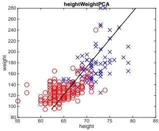

 $(a)$

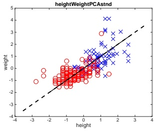

(b)

Figure 20.5: Effect of standardization on PCA applied to the height/weight dataset. (Red=female, blue=male.) Left: PCA of raw data. Right: PCA of standardized data. Generated by pcaStandardization.ipynb.

Optimizing wrt  $w_1$ and  $z_1$ gives the same solution as before. Exercise 20.3 asks you to show that  $\frac{\partial \mathcal{L}}{\partial \mathbf{z}_2} = 0$ yields  $z_{n2} = \mathbf{w}_2^\top \mathbf{x}_n$. Substituting in yields

$$
\mathcal{L}(\boldsymbol{w}_{2})=\frac{1}{N}\sum_{n=1}^{N}[\boldsymbol{x}_{n}^{\top}\boldsymbol{x}_{n}-\boldsymbol{w}_{1}^{\top}\boldsymbol{x}_{n}\boldsymbol{x}_{n}^{\top}\boldsymbol{w}_{1}-\boldsymbol{w}_{2}^{\top}\boldsymbol{x}_{n}\boldsymbol{x}_{n}^{\top}\boldsymbol{w}_{2}]=\mathrm{c o n s t}-\boldsymbol{w}_{2}^{\top}\hat{\boldsymbol{\Sigma}}\boldsymbol{w}_{2}   \tag*{(20.18)}
$$

Dropping the constant term, plugging in the optimal w1 and adding the constraints yields

$$
\tilde{\mathcal{L}}(\boldsymbol{w}_{2})=-\boldsymbol{w}_{2}^{\top}\hat{\boldsymbol{\Sigma}}\boldsymbol{w}_{2}+\lambda_{2}(\boldsymbol{w}_{2}^{\top}\boldsymbol{w}_{2}-1)+\lambda_{12}(\boldsymbol{w}_{2}^{\top}\boldsymbol{w}_{1}-0)   \tag*{(20.19)}
$$

Exercise 20.3 asks you to show that the solution is given by the eigenvector with the second largest eigenvalue:

$$
\hat{\Sigma}w_{2}=\lambda_{2}w_{2}   \tag*{(20.20)}
$$

The proof continues in this way to show that  $\hat{\mathbf{W}} = \mathbf{U}_L$.

#### 20.1.3 Computational issues

In this section, we discuss various practical issues related to using PCA.

##### 20.1.3.1 Covariance matrix vs correlation matrix

We have been working with the eigendecomposition of the covariance matrix. However, it is better to use the correlation matrix instead. The reason is that otherwise PCA can be “misled” by directions in which the variance is high merely because of the measurement scale. Figure 20.5 shows an example of this. On the left, we see that the vertical axis uses a larger range than the horizontal axis. This results in a first principal component that looks somewhat “unnatural”. On the right, we show the results of PCA after standardizing the data (which is equivalent to using the correlation matrix instead of the covariance matrix); the results look much better.

---

##### 20.1.3.2 Dealing with high-dimensional data

We have presented PCA as the problem of finding the eigenvectors of the  $D \times D$ covariance matrix  $\mathbf{X}^\top \mathbf{X}$. If  $D > N$, it is faster to work with the  $N \times N$ Gram matrix  $\mathbf{X} \mathbf{X}^\top$. We now show how to do this.

First, let $\mathbf{U}$be an orthonormal matrix containing the eigenvectors of$\mathbf{XX}^{\top}$with corresponding eigenvalues in$\mathbf{\Lambda}$. By definition we have $(\mathbf{XX}^{\top})\mathbf{U}=\mathbf{U}\mathbf{\Lambda}$. Pre-multiplying by $\mathbf{X}^{\top}$ gives

$$
(\mathbf{X}^{\mathsf{T}}\mathbf{X})(\mathbf{X}^{\mathsf{T}}\mathbf{U})=(\mathbf{X}^{\mathsf{T}}\mathbf{U})\mathbf{\Lambda}   \tag*{(20.21)}
$$

from which we see that the eigenvectors of  $\mathbf{X}^\top \mathbf{X}$ are  $\mathbf{V} = \mathbf{X}^\top \mathbf{U}$, with eigenvalues given by  $\Lambda$ as before. However, these eigenvectors are not normalized, since  $\|\mathbf{v}_j\|^2 = \mathbf{u}_j^\top \mathbf{X} \mathbf{X}^\top \mathbf{u}_j = \lambda_j \mathbf{u}_j^\top \mathbf{u}_j = \lambda_j$. The normalized eigenvectors are given by

$$
\mathbf{V}=\mathbf{X}^{\mathsf{T}}\mathbf{U}\mathbf{\Lambda}^{-\frac{1}{2}}   \tag*{(20.22)}
$$

This provides an alternative way to compute the PCA basis. It also allows us to use the kernel trick, as we discuss in Section 20.4.6.

##### 20.1.3.3 Computing PCA using SVD

In this section, we show the equivalence between PCA as computed using eigenvector methods (Section 20.1) and the truncated SVD. $^{1}$

Let $\mathbf{U}_{\Sigma} \mathbf{\Lambda}_{\Sigma} \mathbf{U}_{\Sigma}^{\mathrm{T}}$be the top$L$eigendecomposition of the covariance matrix$\mathbf{\Sigma} \propto \mathbf{X}^{\mathrm{T}} \mathbf{X}$(we assume$\mathbf{X}$is centered). Recall from Section 20.1.2 that the optimal estimate of the projection weights$\mathbf{W}$is given by the top$L$eigenvalues, so$\mathbf{W} = \mathbf{U}_{\Sigma}$.

Now let  $\mathbf{U}_X \mathbf{S}_X \mathbf{V}_X^\top \approx \mathbf{X}$ be the  $L$-truncated SVD approximation to the data matrix  $\mathbf{X}$. From Equation (7.184), we know that the right singular vectors of  $\mathbf{X}$ are the eigenvectors of  $\mathbf{X}^\top \mathbf{X}$, so  $\mathbf{V}_X = \mathbf{U}_\Sigma = \mathbf{W}$. (In addition, the eigenvalues of the covariance matrix are related to the singular values of the data matrix via  $\lambda_k = s_k^2 / N$.)

Now suppose we are interested in the projected points (also called the principal components or PC scores), rather than the projection matrix. We have

$$
\mathbf{Z}=\mathbf{X}\mathbf{W}=\mathbf{U}_{X}\mathbf{S}_{X}\mathbf{V}_{X}^{\top}\mathbf{V}_{X}=\mathbf{U}_{X}\mathbf{S}_{X}   \tag*{(20.23)}
$$

Finally, if we want to approximately reconstruct the data, we have

$$
\hat{\mathbf{X}}=\mathbf{Z}\mathbf{W}^{\mathsf{T}}=\mathbf{U}_{X}\mathbf{S}_{X}\mathbf{V}_{X}^{\mathsf{T}}   \tag*{(20.24)}
$$

This is precisely the same as a truncated SVD approximation (Section 7.5.5).

Thus we see that we can perform PCA either using an eigendecomposition of  $\Sigma$ or an SVD decomposition of  $\mathbf{X}$. The latter is often preferable, for computational reasons. For very high dimensional problems, we can use a randomized SVD algorithm, see e.g., [HMT11; SKT14; DM16]. For example, the randomized solver used by sklearn takes  $O(NL^2) + O(L^3)$ time for  $N$ examples and  $L$ principal components, whereas exact SVD takes  $O(ND^2) + O(D^3)$ time.

---

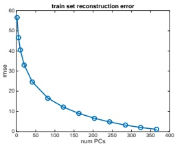

 $(a)$

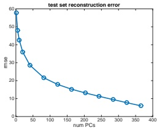

(b)

Figure 20.6: Reconstruction error on MNIST vs number of latent dimensions used by PCA. (a) Training set. (b) Test set. Generated by pcaOverfitDemo.ipynb.

#### 20.1.4 Choosing the number of latent dimensions

In this section, we discuss how to choose the number of latent dimensions L for PCA.

##### 20.1.4.1 Reconstruction error

Let us define the reconstruction error on some dataset D incurred by the model when using L dimensions:

$$
\mathcal{L}_{L}=\frac{1}{|\mathcal{D}|}\sum_{n\in\mathcal{D}}||\boldsymbol{x}_{n}-\hat{\boldsymbol{x}}_{n}||^{2}   \tag*{(20.25)}
$$

where the reconstruction is given by  $\hat{\mathbf{x}}_n = \mathbf{W}\mathbf{z}_n + \boldsymbol{\mu}$, where  $\mathbf{z}_n = \mathbf{W}^\top(\mathbf{x}_n - \boldsymbol{\mu})$ and  $\boldsymbol{\mu}$ is the empirical mean, and  $\mathbf{W}$ is estimated as above. Figure 20.6(a) plots  $\mathcal{L}_L$ vs  $L$ on the MNIST training data. We see that it drops off quite quickly, indicating that we can capture most of the empirical correlation of the pixels with a small number of factors.

Of course, if we use  $L = \text{rank}(\mathbf{X})$, we get zero reconstruction error on the training set. To avoid overfitting, it is natural to plot reconstruction error on the test set. This is shown in Figure 20.6(b). Here we see that the error continues to go down even as the model becomes more complex! Thus we do not get the usual U-shaped curve that we typically expect to see in supervised learning. The problem is that PCA is not a proper generative model of the data: If you give it more latent dimensions, it will be able to approximate the test data more accurately. (A similar problem arises if we plot reconstruction error on the test set using K-means clustering, as discussed in Section 21.3.7.) We discuss some solutions to this below.

##### 20.1.4.2 Scree plots

A common alternative to plotting reconstruction error vs L is to use something called a scree plot, which is a plot of the eigenvalues  $\lambda_{j}$ vs j in order of decreasing magnitude. One can show

---

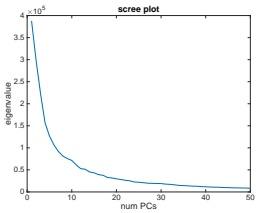

 $(a)$

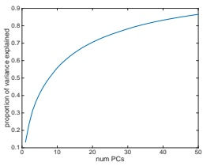

(b)

Figure 20.7: (a) Scree plot for training set, corresponding to Figure 20.6(a). (b) Fraction of variance explained. Generated by pcaOverfitDemo.ipynb.

(Exercise 20.4) that

$$
\mathcal{L}_{L}=\sum_{j=L+1}^{D}\lambda_{j}   \tag*{(20.26)}
$$

Thus as the number of dimensions increases, the eigenvalues get smaller, and so does the reconstruction error, as shown in Figure 20.7a. $^{2}$ A related quantity is the fraction of variance explained, defined as

$$
F_{L}=\frac{\sum_{j=1}^{L}\lambda_{j}}{\sum_{j^{\prime}=1}^{L^{\max}}\lambda_{j^{\prime}}}   \tag*{(20.27)}
$$

This captures the same information as the scree plot, but goes up with L (see Figure 20.7b).

##### 20.1.4.3 Profile likelihood

Although there is no U-shape in the reconstruction error plot, there is sometimes a “knee” or “elbow” in the curve, where the error suddenly changes from relatively large errors to relatively small. The idea is that for  $L < L^*$, where  $L^*$ is the “true” latent dimensionality (or number of clusters), the rate of decrease in the error function will be high, whereas for  $L > L^*$, the gains will be smaller, since the model is already sufficiently complex to capture the true distribution.

One way to automate the detection of this change in the gradient of the curve is to compute the profile likelihood, as proposed in [ZG06]. The idea is this. Let $\lambda_L$be some measure of the error incurred by a model of size$L$, such that $\lambda_1 \geq \lambda_2 \geq \cdots \geq \lambda_{L^{\max}}$. In PCA, these are the eigenvalues, but the method can also be applied to the reconstruction error from K-means clustering (see Section 21.3.7). Now consider partitioning these values into two groups, depending on whether $k < L$or$k > L$, where $L$is some threshold which we will determine. To measure the quality of$L$,

---

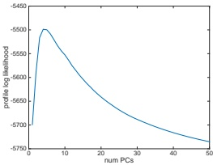

Figure 20.8: Profile likelihood corresponding to PCA model in Figure 20.6(a). Generated by pcaOverfit-Demo.ipynb.

we will use a simple change-point model, where  $\lambda_k \sim \mathcal{N}(\mu_1, \sigma^2)$ if  $k \leq L$, and  $\lambda_k \sim \mathcal{N}(\mu_2, \sigma^2)$ if  $k > L$. (It is important that  $\sigma^2$ be the same in both models, to prevent overfitting in the case where one regime has less data than the other.) Within each of the two regimes, we assume the  $\lambda_k$ are iid, which is obviously incorrect, but is adequate for our present purposes. We can fit this model for each  $L = 1 : L^{\max}$ by partitioning the data and computing the MLEs, using a pooled estimate of the variance:

$$
\mu_{1}(L)=\frac{\sum_{k\leq L}\lambda_{k}}{L}   \tag*{(20.28)}
$$

$$
\mu_{2}(L)=\frac{\sum_{k>L}\lambda_{k}}{L^{\max}-L}   \tag*{(20.29)}
$$

$$
\sigma^{2}(L)=\frac{\sum_{k\leq L}(\lambda_{k}-\mu_{1}(L))^{2}+\sum_{k>L}(\lambda_{k}-\mu_{2}(L))^{2}}{L^{\max}}   \tag*{(20.30)}
$$

We can then evaluate the profile log likelihood

$$
\ell(L)=\sum_{k=1}^{L}\log\mathcal{N}(\lambda_{k}|\mu_{1}(L),\sigma^{2}(L))+\sum_{k=L+1}^{L^{\max}}\log\mathcal{N}(\lambda_{k}|\mu_{2}(L),\sigma^{2}(L))   \tag*{(20.31)}
$$

This is illustrated in Figure 20.8. We see that the peak  $L^{*}=\arg\max\ell(L)$ is well determined.

### 20.2 Factor analysis *

PCA is a simple method for computing a linear low-dimensional representation of data. In this section, we present a generalization of PCA known as factor analysis. This is based on a probabilistic model, which means we can treat it as a building block for more complex models, such as the mixture of FA models in Section 20.2.6, or the nonlinear FA model in Section 20.3.5. We can recover PCA as a special limiting case of FA, as we discuss in Section 20.2.2.

---

#### 20.2.1 Generative model

Factor analysis corresponds to the following linear-Gaussian latent variable generative model:

$$
p(z)=\mathcal{N}(z|\mu_{0},\Sigma_{0})   \tag*{(20.32)}
$$

$$
p(x|z,\theta)=\mathcal{N}(x|\mathbf{W}z+\mu,\Psi)   \tag*{(20.33)}
$$

where  $\mathbf{W}$ is a  $D \times L$ matrix, known as the factor loading matrix, and  $\Psi$ is a diagonal  $D \times D$ covariance matrix.

FA can be thought of as a low-rank version of a Gaussian distribution. To see this, note that the induced marginal distribution  $p(\boldsymbol{x}|\boldsymbol{\theta})$ is a Gaussian (see Equation (3.38) for the derivation):

$$
\begin{align*}p(\boldsymbol{x}|\boldsymbol{\theta})&=\int\mathcal{N}(\boldsymbol{x}|\mathbf{W}\boldsymbol{z}+\boldsymbol{\mu},\boldsymbol{\Psi})\mathcal{N}(z|\boldsymbol{\mu}_{0},\boldsymbol{\Sigma}_{0})dz\\&=\mathcal{N}(\boldsymbol{x}|\mathbf{W}\boldsymbol{\mu}_{0}+\boldsymbol{\mu},\boldsymbol{\Psi}+\mathbf{W}\boldsymbol{\Sigma}_{0}\mathbf{W}^{\top})\end{align*}   \tag*{(20.34)}
$$

Hence  $\mathbb{E}[\boldsymbol{x}] = \mathbf{W}\boldsymbol{\mu}_{0} + \boldsymbol{\mu}$ and  $\operatorname{Cov}[\boldsymbol{x}] = \mathbf{W}\operatorname{Cov}[\boldsymbol{z}] \mathbf{W}^{\top} + \boldsymbol{\Psi} = \mathbf{W}\boldsymbol{\Sigma}_{0} \mathbf{W}^{\top} + \boldsymbol{\Psi}$. From this, we see that we can set  $\boldsymbol{\mu}_{0} = \mathbf{0}$ without loss of generality, since we can always absorb  $\mathbf{W}\boldsymbol{\mu}_{0}$ into  $\boldsymbol{\mu}$. Similarly, we can set  $\boldsymbol{\Sigma}_{0} = \mathbf{I}$ without loss of generality, since we can always absorb a correlated prior by using a new weight matrix,  $\tilde{\mathbf{W}} = \mathbf{W}\boldsymbol{\Sigma}_{0}^{-\frac{1}{2}}$. After these simplifications we have

$$
p(\boldsymbol{z})=\mathcal{N}(\boldsymbol{z}|\mathbf{0},\mathbf{I})   \tag*{(20.36)}
$$

$$
p(\boldsymbol{x}|\boldsymbol{z})=\mathcal{N}(\boldsymbol{x}|\mathbf{W}\boldsymbol{z}+\boldsymbol{\mu},\boldsymbol{\Psi})   \tag*{(20.37)}
$$

$$
p(\boldsymbol{x})=\mathcal{N}(\boldsymbol{x}|\boldsymbol{\mu},\mathbf{W}\mathbf{W}^{\mathrm{T}}+\boldsymbol{\Psi})   \tag*{(20.38)}
$$

For example, suppose where $L = 1$, $D = 2$and$\Psi = \sigma^2\mathbf{I}$. We illustrate the generative process in this case in Figure 20.9. We can think of this as taking an isotropic Gaussian “spray can”, representing the likelihood $p(\mathbf{x}|\mathbf{z})$, and “sliding it along” the 1d line defined by $\mathbf{w}z + \mu$as we vary the 1d latent prior$z$. This induces an elongated (and hence correlated) Gaussian in 2d. That is, the induced distribution has the form $v(\mathbf{x}) = \mathcal{N}(\mathbf{x}|\mathbf{u}. \mathbf{w}\mathbf{w}^\top + \sigma^2\mathbf{I})$.

In general, FA approximates the covariance matrix of the visible vector using a low-rank decomposition:

$$
\mathbf{C}=\mathrm{Cov}\left[\mathbf{x}\right]=\mathbf{W}\mathbf{W}^{\top}+\boldsymbol{\Psi}   \tag*{(20.39)}
$$

This only uses  $O(LD)$ parameters, which allows a flexible compromise between a full covariance Gaussian, with  $O(D^{2})$ parameters, and a diagonal covariance, with  $O(D)$ parameters.

From Equation (20.39), we see that we should restrict  $\Psi$ to be diagonal, otherwise we could set  $\mathbf{W} = \mathbf{0}$, thus ignoring the latent factors, while still being able to model any covariance. The marginal variance of each visible variable is given by  $\mathbb{V}[x_d] = \sum_{k=1}^L w_d^2 + \psi_d$, where the first term is the variance due to the common factors, and the second  $\psi_d$ term is called the uniqueness, and is the variance term that is specific to that dimension.

We can estimate the parameters of an FA model using EM (see Section 20.2.3). Once we have fit the model, we can compute probabilistic latent embeddings using  $p(z|\pmb{x})$. Using Bayes rule for Gaussians we have

$$
p(z|\boldsymbol{x})=\mathcal{N}(z|\mathbf{W}^{\mathsf{T}}\mathbf{C}^{-1}(\boldsymbol{x}-\boldsymbol{\mu}),\mathbf{I}-\mathbf{W}^{\mathsf{T}}\mathbf{C}^{-1}\mathbf{W})   \tag*{(20.40)}
$$

where C is defined in Equation (20.39).

Author: Kevin P. Murphy. (C) MIT Press. CC-BY-NC-ND license

---

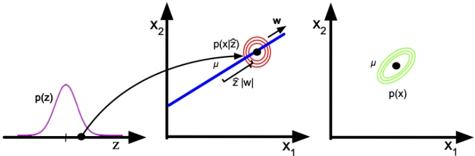

Figure 20.9: Illustration of the FA generative process, where we have $L = 1$latent dimension generating$D = 2$observed dimensions; we assume$\Psi = \sigma^2 \mathbf{I}$. The latent factor has value $z \in \mathbb{R}$, sampled from $p(z)$; this gets mapped to a $2d$offset$\delta = zw$, where $\mathbf{w} \in \mathbb{R}^2$, which gets added to $\mu$to define a Gaussian$p(\mathbf{x}|z) = \mathcal{N}(\mathbf{x}|\boldsymbol{\mu} + \delta, \sigma^2 \mathbf{I})$. By integrating over $z$, we “slide” this circular Gaussian “spray can” along the principal component axis $\mathbf{w}$, which induces elliptical Gaussian contours in $\mathbf{x}$space centered on$\boldsymbol{\mu}$. Adapted from Figure 12.9 of [Bis06].

#### 20.2.2 Probabilistic PCA

In this section, we consider a special case of the factor analysis model in which  $\mathbf{W}$ has orthonormal columns, and  $\mathbf{\Psi} = \sigma^2 \mathbf{I}$. This model is called probabilistic principal components analysis (PPCA) [TB99], or sensible PCA [Row97]. The marginal distribution on the visible variables has the form

$$
p(\boldsymbol{x}|\boldsymbol{\theta})=\int\mathcal{N}(\boldsymbol{x}|\mathbf{W}\boldsymbol{z},\sigma^{2}\mathbf{I})\mathcal{N}(\boldsymbol{z}|\mathbf{0},\mathbf{I})d\boldsymbol{z}=\mathcal{N}(\boldsymbol{x}|\boldsymbol{\mu},\mathbf{C})   \tag*{(20.41)}
$$

where

$$
\mathbf{C}=\mathbf{W}\mathbf{W}^{\mathsf{T}}+\sigma^{2}\mathbf{I}   \tag*{(20.42)}
$$

The log likelihood for PPCA is given by

$$
\log p(\mathbf{X}|\boldsymbol{\mu},\mathbf{W},\sigma^{2})=-\frac{N D}{2}\log(2\pi)-\frac{N}{2}\log|\mathbf{C}|-\frac{1}{2}\sum_{n=1}^{N}(\boldsymbol{x}_{n}-\boldsymbol{\mu})^{\mathsf{T}}\mathbf{C}^{-1}(\boldsymbol{x}_{n}-\boldsymbol{\mu})   \tag*{(20.43)}
$$

The MLE for  $\mu$ is  $\overline{x}$. Plugging in gives

$$
\log p(\mathbf{X}|\boldsymbol{\mu},\mathbf{W},\sigma^{2})=-\frac{N}{2}\left[D\log(2\pi)+\log|\mathbf{C}|+\mathrm{tr}(\mathbf{C}^{-1}\mathbf{S})\right]   \tag*{(20.44)}
$$

where  $\mathbf{S} = \frac{1}{N} \sum_{n=1}^{N} (\boldsymbol{x}_{n} - \overline{\boldsymbol{x}}) (\boldsymbol{x}_{n} - \overline{\boldsymbol{x}})^{\top}$ is the empirical covariance matrix.

In [TB99; Row97] they show that the maximum of this objective must satisfy

$$
\mathbf{W}=\mathbf{U}_{L}(\mathbf{L}_{L}-\sigma^{2}\mathbf{I})^{\frac{1}{2}}\mathbf{R}   \tag*{(20.45)}
$$

---

where $\mathbf{U}_L$is a$D \times L$matrix whose columns are given by the$L$eigenvectors of$\mathbf{S}$with largest eigenvalues,$\mathbf{L}_L$is the$L \times L$diagonal matrix of eigenvalues, and$\mathbf{R}$is an arbitrary$L \times L$ orthogonal matrix, which ($WLOG$) we can take to be $\mathbf{R} = \mathbf{I}$. In the noise-free limit, where $\sigma^2 = 0$, we see that $\mathbf{W}_{\text{mle}} = \mathbf{U}_L \mathbf{L}_L^{\frac{1}{2}}$, which is proportional to the PCA solution.

The MLE for the observation variance is

$$
\sigma^{2}=\frac{1}{D-L}\sum_{i=L+1}^{D}\lambda_{i}   \tag*{(20.46)}
$$

which is the average distortion associated with the discarded dimensions. If L = D, then the estimated noise is 0, since the model collapses to z = x.

To compute the likelihood  $p(\mathbf{X}|\boldsymbol{\mu},\mathbf{W},\sigma^2)$, we need to evaluate  $\mathbf{C}^{-1}$ and  $\log|\mathbf{C}|$, where  $\mathbf{C}$ is a  $D \times D$ matrix. To do this efficiently, we can use the matrix inversion lemma to write

$$
\mathbf{C}^{-1}=\sigma^{-2}\left[\mathbf{I}-\mathbf{W}\mathbf{M}^{-1}\mathbf{W}^{\mathsf{T}}\right]   \tag*{(20.47)}
$$

where the  $L \times L$ dimensional matrix M is given by

$$
\mathbf{M}=\mathbf{W}^{\mathsf{T}}\mathbf{W}+\sigma^{2}\mathbf{I}   \tag*{(20.48)}
$$

When we plug in the MLE for W from Equation (20.45) (using  $\mathbf{R} = \mathbf{I}$) we find

$$
\mathbf{M}=\mathbf{U}_{L}(\mathbf{L}_{L}-\sigma^{2}\mathbf{I})\mathbf{U}_{L}^{\top}+\sigma^{2}\mathbf{I}   \tag*{(20.49)}
$$

and hence

$$
\mathbf{C}^{-1}=\sigma^{-2}\left[\mathbf{I}-\mathbf{U}_{L}(\mathbf{L}_{L}-\sigma^{2}\mathbf{I})\boldsymbol{\Lambda}_{L}^{-1}\mathbf{U}_{L}^{\mathsf{T}}\right]   \tag*{(20.50)}
$$

$$
\log\left|\mathbf{C}\right|=\left(D-L\right)\log\sigma^{2}+\sum_{j=1}^{L}\log\lambda_{j}   \tag*{(20.51)}
$$

Thus we can avoid all matrix inversions (since  $\Lambda_L^{-1} = \mathrm{diag}(1/\lambda_j)$).

To use PPCA as an alternative to PCA, we need to compute the posterior mean  $\mathbb{E}[z|\boldsymbol{x}]$, which is the equivalent of the encoder model. Using Bayes rule for Gaussians we have

$$
p(z|\boldsymbol{x})=\mathcal{N}(z|\mathbf{M}^{-1}\mathbf{W}^{\mathsf{T}}(\boldsymbol{x}-\boldsymbol{\mu}),\sigma^{2}\mathbf{M}^{-1})   \tag*{(20.52)}
$$

where M is defined in Equation (20.48). In the  $\sigma^{2}=0$ limit, the posterior mean using the MLE parameters becomes

$$
\mathbb{E}\left[z|x\right]=\left(\mathbf{W}^{\mathsf{T}}\mathbf{W}\right)^{-1}\mathbf{W}^{\mathsf{T}}(x-\overline{x})   \tag*{(20.53)}
$$

which is the orthogonal projection of the data into the latent space, as in standard PCA.

#### 20.2.3 EM algorithm for FA/PPCA

In this section, we describe one method for computing the MLE for the FA model using the EM algorithm, based on [RT82; GH96].

Author: Kevin P. Murphy. (C) MIT Press. CC-BY-NC-ND license

---

##### 20.2.3.1 EM for FA

In the E step, we compute the posterior embeddings

$$
p(z_{i}|\boldsymbol{x}_{i},\boldsymbol{\theta})=\mathcal{N}(z_{i}|\boldsymbol{m}_{i},\boldsymbol{\Sigma}_{i})   \tag*{(20.54)}
$$

$$
\mathbf{\Sigma}_{i}\triangleq(\mathbf{I}_{L}+\mathbf{W}^{\mathsf{T}}\mathbf{\Psi}^{-1}\mathbf{W})^{-1}   \tag*{(20.55)}
$$

$$
m_{i}\triangleq\Sigma_{i}(\mathbf{W}^{\mathsf{T}}\mathbf{\Psi}^{-1}(\mathbf{x}_{i}-\mathbf{\mu}))   \tag*{(20.56)}
$$

In the M step, it is easiest to estimate  $\mu$ and  $\mathbf{W}$ at the same time, by defining  $\tilde{\mathbf{W}} = (\mathbf{W}, \boldsymbol{\mu})$,  $\tilde{\mathbf{z}} = (\mathbf{z}, 1)$, Also, define

$$
b_{i}\triangleq\mathbb{E}\left[\tilde{\mathbf{z}}|\mathbf{x}_{i}\right]=[m_{i};1]   \tag*{(20.57)}
$$

$$
\mathbf{C}_{i}\triangleq\mathbb{E}\left[\tilde{\mathbf{z}}\tilde{\mathbf{z}}^{T}|\mathbf{x}_{i},\right]=\begin{pmatrix}\mathbb{E}\left[\mathbf{z}\mathbf{z}^{T}|\mathbf{x}_{i}\right]&\mathbb{E}\left[\mathbf{z}|\mathbf{x}_{i}\right]\\\mathbb{E}\left[\mathbf{z}|\mathbf{x}_{i}\right]^{T}&1\end{pmatrix}   \tag*{(20.58)}
$$

Then the M step is as follows:

$$
\hat{\tilde{\mathbf{W}}}=\left[\sum_{i}\boldsymbol{x}_{i}\boldsymbol{b}_{i}^{\top}\right]\left[\sum_{i}\mathbf{C}_{i}\right]^{-1}   \tag*{(20.59)}
$$

$$
\hat{\boldsymbol{\Psi}}=\frac{1}{N}\mathrm{diag}\left\{\sum_{i}\left(\boldsymbol{x}_{i}-\hat{\tilde{\boldsymbol{W}}}\boldsymbol{b}_{i}\right)\boldsymbol{x}_{i}^{T}\right\}   \tag*{(20.60)}
$$

Note that these updates are for “vanilla” EM. A much faster version of this algorithm, based on ECM, is described in [ZY08].

##### 20.2.3.2 EM for (P)PCA

We can also use EM to fit the PPCA model, which provides a useful alternative to eigenvector methods. This relies on the probabilistic formulation of PCA. However the algorithm continues to work in the zero noise limit,  $\sigma^2 = 0$, as shown by [Row97].

In particular, let  $\mathbf{Z} = \mathbf{Z}^\top$ be a  $L \times N$ matrix storing the posterior means (low-dimensional representations) along its columns. Similarly, let  $\tilde{\mathbf{X}} = \mathbf{X}^\top$ store the original data along its columns. From Equation (20.52), when  $\sigma^2 = 0$, we have

$$
\tilde{\mathbf{Z}}=(\mathbf{W}^{T}\mathbf{W})^{-1}\mathbf{W}^{T}\tilde{\mathbf{X}}   \tag*{(20.61)}
$$

This constitutes the E step. Notice that this is just an orthogonal projection of the data.

From Equation 20.59, the M step is given by

$$
\hat{\mathbf{W}}=\left[\sum_{i}\mathbf{x}_{i}\mathbb{E}\left[\mathbf{z}_{i}\right]^{T}\right]\left[\sum_{i}\mathbb{E}\left[\mathbf{z}_{i}\right]\mathbb{E}\left[\mathbf{z}_{i}\right]^{T}\right]^{-1}   \tag*{(20.62)}
$$

where we exploited the fact that  $\Sigma = \mathrm{Cov}\left[z_i | x_i, \theta\right] = 0$ when  $\sigma^2 = 0$.

It is worth comparing this expression to the MLE for multi-output linear regression (Equation 11.2), which has the form  $\mathbf{W} = (\sum_i \mathbf{y}_i \mathbf{x}_i^T)(\sum_i \mathbf{x}_i \mathbf{x}_i^T)^{-1}$. Thus we see that the M step is like linear regression where we replace the observed inputs by the expected values of the latent variables.