

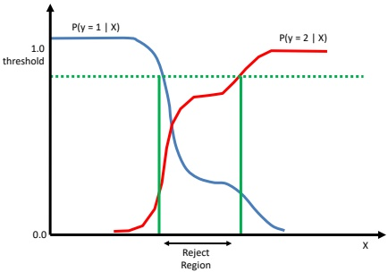

Figure 5.1: For some regions of input space, where the class posteriors are uncertain, we may prefer not to choose class 1 or 2; instead we may prefer the reject option. Adapted from Figure 1.26 of [Bis06].

<table border=1 style='margin: auto; word-wrap: break-word;'><tr><td rowspan="2"></td><td colspan="2">Estimate</td><td rowspan="2">Row sum</td></tr><tr><td style='text-align: center; word-wrap: break-word;'>0</td><td style='text-align: center; word-wrap: break-word;'>1</td></tr><tr><td rowspan="2">Truth</td><td style='text-align: center; word-wrap: break-word;'>0</td><td style='text-align: center; word-wrap: break-word;'>TN</td><td style='text-align: center; word-wrap: break-word;'>FP</td></tr><tr><td style='text-align: center; word-wrap: break-word;'>1</td><td style='text-align: center; word-wrap: break-word;'>FN</td><td style='text-align: center; word-wrap: break-word;'>TP</td></tr><tr><td style='text-align: center; word-wrap: break-word;'>Col. sum</td><td style='text-align: center; word-wrap: break-word;'>$\hat{N}$</td><td style='text-align: center; word-wrap: break-word;'>$\hat{P}$</td><td style='text-align: center; word-wrap: break-word;'></td></tr></table>

Table 5.3: Class confusion matrix for a binary classification problem. TP is the number of true positives, FP is the number of false positives, TN is the number of true negatives, FN is the number of false negatives, P is the true number of positives, P is the predicted number of positives, N is the true number of negatives,  $\hat{N}$ is the predicted number of negatives.

which beat the top human Jeopardy champion. Watson uses a variety of interesting techniques [Fer+10], but the most pertinent one for our present discussion is that it contains a module that estimates how confident it is of its answer. The system only chooses to “buzz in” its answer if sufficiently confident it is correct.

For some other methods and applications, see e.g., [RTA18; GEY19; Nar+23].

#### 5.1.3 ROC curves

In Section 5.1.2.2, we showed that we can pick the optimal label in a binary classification problem by thresholding the probability using a value  $\tau$, derived from the relative cost of a false positive and false negative. Instead of picking a single threshold, we can consider using a set of different thresholds, and comparing the resulting performance, as we discuss below.

---

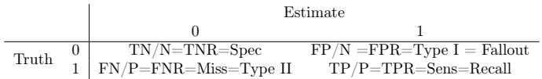

Table 5.4: Class confusion matrix for a binary classification problem normalized per row to get  $p(\hat{y}|y)$. Abbreviations:  $TNR = true$ negative rate,  $Spec = specificity$,  $FPR = false$ positive rate,  $FNR = false$ negative rate,  $Miss = miss$ rate,  $TPR = true$ positive rate,  $Sens = sensitivity$. Note  $FNR=1-TPR$ and  $FPR=1-TNR$.

<table border=1 style='margin: auto; word-wrap: break-word;'><tr><td colspan="2"></td><td colspan="2">Estimate</td></tr><tr><td style='text-align: center; word-wrap: break-word;'></td><td style='text-align: center; word-wrap: break-word;'></td><td style='text-align: center; word-wrap: break-word;'>0</td><td style='text-align: center; word-wrap: break-word;'>1</td></tr><tr><td rowspan="2">Truth</td><td style='text-align: center; word-wrap: break-word;'>0</td><td style='text-align: center; word-wrap: break-word;'>$TN/\hat{N}=NPV$</td><td style='text-align: center; word-wrap: break-word;'>$FP/\hat{P}=FDR$</td></tr><tr><td style='text-align: center; word-wrap: break-word;'>1</td><td style='text-align: center; word-wrap: break-word;'>$FN/\hat{N}=FOR$</td><td style='text-align: center; word-wrap: break-word;'>$TP/\hat{P}=Prec=PPV$</td></tr></table>

Table 5.5: Class confusion matrix for a binary classification problem normalized per column to get  $p(y|\hat{y})$. Abbreviations: NPV = negative predictive value, FDR = false discovery rate, FOR = false omission rate, PPV = positive predictive value, Prec = precision. Note that FOR=1-NPV and FDR=1-PPV.

##### 5.1.3.1 Class confusion matrices

For any fixed threshold  $\tau$, we consider the following decision rule:

$$
\hat{y}_{\tau}(\boldsymbol{x})=\mathbb{I}\left(p(y=1|\boldsymbol{x})\geq1-\tau\right)   \tag*{(5.16)}
$$

We can compute the empirical number of false positives (FP) that arise from using this policy on a set of N labeled examples as follows:

$$
F P_{\tau}=\sum_{n=1}^{N}\mathbb{I}\left(\hat{y}_{\tau}(\boldsymbol{x}_{n})=1,y_{n}=0\right)   \tag*{(5.17)}
$$

Similarly, we can compute the empirical number of false negatives (FN), true positives (TP), and true negatives (TN). We can store these results in a  $2 \times 2$ class confusion matrix  $C$, where  $C_{ij}$ is the number of times an item with true class label i was (mis)classified as having label j. In the case of binary classification problems, the resulting matrix will look like Table 5.3.

From this table, we can compute  $p(\hat{y}|y)$ or  $p(y|\hat{y})$, depending on whether we normalize across the rows or columns. We can derive various summary statistics from these distributions, as summarized in Table 5.4 and Table 5.5. For example, the true positive rate (TPR), also known as the sensitivity, recall or hit rate, is defined as

$$
T P R_{\tau}=p(\hat{y}=1|y=1,\tau)=\frac{T P_{\tau}}{T P_{\tau}+F N_{\tau}}   \tag*{(5.18)}
$$

and the false positive rate (FPR), also called the false alarm rate, or the type I error rate, is defined as

$$
F P R_{\tau}=p(\hat{y}=1|y=0,\tau)=\frac{F P_{\tau}}{F P_{\tau}+T N_{\tau}}   \tag*{(5.19)}
$$

---

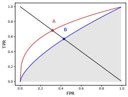

 $(a)$

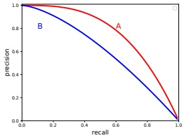

(b)

Figure 5.2: (a) ROC curves for two hypothetical classification systems. The red curve for system A is better than the blue curve for system B. We plot the true positive rate (TPR) vs the false positive rate (FPR) as we vary the threshold  $\tau$. We also indicate the equal error rate (EER) with the red and blue dots, and the area under the curve (AUC) for classifier B by the shaded area. Generated by roc_plot.ipynb. (b) A precision-recall curve for two hypothetical classification systems. The red curve for system A is better than the blue curve for system B. Generated by pr_plot.ipynb.

We can now plot the TPR vs FPR as an implicit function of  $\tau$. This is called a receiver operating characteristic or ROC curve. See Figure 5.2(a) for an example.

##### 5.1.3.2 Summarizing ROC curves as a scalar

The quality of a ROC curve is often summarized as a single number using the area under the curve or AUC. Higher AUC scores are better; the maximum is obviously 1. Another summary statistic that is used is the equal error rate or EER, also called the cross-over rate, defined as the value which satisfies FPR = FNR. Since FNR=1-TPR, we can compute the EER by drawing a line from the top left to the bottom right and seeing where it intersects the ROC curve (see points A and B in Figure 5.2(a)). Lower EER scores are better; the minimum is obviously 0 (corresponding to the top left corner).

##### 5.1.3.3 Class imbalance

In some problems, there is severe class imbalance. For example, in information retrieval, the set of negatives (irrelevant items) is usually much larger than the set of positives (relevant items). The ROC curve is unaffected by class imbalance, as the TPR and FPR are fractions within the positives and negatives, respectively. However, the usefulness of an ROC curve may be reduced in such cases, since a large change in the absolute number of false positives will not change the false positive rate very much, since FPR is divided by FP+TN (see e.g., [SR15] for discussion). Thus all the “action” happens in the extreme left part of the curve. In such cases, we may choose to use other ways of summarizing the class confusion matrix, such as precision-recall curves, which we discuss in Section 5.1.4.

Author: Kevin P. Murphy. (C) MIT Press. CC-BY-NC-ND license

---

#### 5.1.4 Precision-recall curves

In some problems, the notion of a “negative” is not well-defined. For example, consider detecting objects in images: if the detector works by classifying patches, then the number of patches examined — and hence the number of true negatives — is a parameter of the algorithm, not part of the problem definition. Similarly, information retrieval systems usually get to choose the initial set of candidate items, which are then ranked for relevance; by specifying a cutoff, we can partition this into a positive and negative set, but note that the size of the negative set depends on the total number of items retrieved, which is an algorithm parameter, not part of the problem specification.

In these kinds of situations, we may choose to use a precision-recall curve to summarize the performance of our system, as we explain below. (See [DG06] for a more detailed discussion of the connection between ROC curves and PR curves.)

##### 5.1.4.1 Computing precision and recall

The key idea is to replace the FPR with a quantity that is computed just from positives, namely the precision:

$$
\mathcal{P}(\tau)\triangleq p(y=1|\hat{y}=1,\tau)=\frac{T P_{\tau}}{T P_{\tau}+F P_{\tau}}   \tag*{(5.20)}
$$

The precision measures what fraction of our detections are actually positive. We can compare this to the  $\text{recall}$ (which is the same as the TPR), which measures what fraction of the positives we actually detected:

$$
\mathcal{R}(\tau)\triangleq p(\hat{y}=1|y=1,\tau)=\frac{T P_{\tau}}{T P_{\tau}+F N_{\tau}}   \tag*{(5.21)}
$$

If  $\hat{y}_n \in \{0,1\}$ is the predicted label, and  $y_n \in \{0,1\}$ is the true label, we can estimate precision and recall using

$$
\mathcal{P}(\tau)=\frac{\sum_{n}y_{n}\hat{y}_{n}}{\sum_{n}\hat{y}_{n}}   \tag*{(5.22)}
$$

$$
\mathcal{R}(\tau)=\frac{\sum_{n}y_{n}\hat{y}_{n}}{\sum_{n}y_{n}}   \tag*{(5.23)}
$$

We can now plot the precision vs recall as we vary the threshold  $\tau$. See Figure 5.2(b). Hugging the top right is the best one can do.

##### 5.1.4.2 Summarizing PR curves as a scalar

The PR curve can be summarized as a single number in several ways. First, we can quote the precision for a fixed recall level, such as the precision of the first  $K = 10$ entities recalled. This is called the precision at K score. Alternatively, we can compute the area under the PR curve. However, it is possible that the precision does not drop monotonically with recall. For example, suppose a classifier has 90% precision at 10% recall, and 96% precision at 20% recall. In this case, rather than measuring the precision at a recall of 10%, we should measure the maximum precision we can achieve with at least a recall of 10% (which would be 96%). This is called the interpolated

---

precision. The average of the interpolated precisions is called the average precision; it is equal to the area under the interpolated PR curve, but may not be equal to the area under the raw PR curve. $^{1}$ The mean average precision or mAP is the mean of the AP over a set of different PR curves.

##### 5.1.4.3 F-scores

For a fixed threshold, corresponding to a single point on the PR curve, we can compute a single precision and recall value, which we will denote by  $\mathcal{P}$ and  $\mathcal{R}$. These are often combined into a single statistic called the  $F_{\beta}$, defined as follows: $^{2}$

$$
\frac{1}{F_{\beta}}=\frac{1}{1+\beta^{2}}\frac{1}{\mathcal{P}}+\frac{\beta^{2}}{1+\beta^{2}}\frac{1}{\mathcal{R}}   \tag*{(5.24)}
$$

or equivalently

$$
F_{\beta}\triangleq(1+\beta^{2})\frac{\mathcal{P}\cdot\mathcal{R}}{\beta^{2}\mathcal{P}+\mathcal{R}}=\frac{(1+\beta^{2})T P}{(1+\beta^{2})T P+\beta^{2}F N+F P}   \tag*{(5.25)}
$$

If we set  $\beta = 1$, we get the harmonic mean of precision and recall:

$$
\frac{1}{F_{1}}=\frac{1}{2}\left(\frac{1}{\mathcal{P}}+\frac{1}{\mathcal{R}}\right)   \tag*{(5.26)}
$$

$$
F_{1}=\frac{2}{1/\mathcal{R}+1/\mathcal{P}}=2\frac{\mathcal{P}\cdot\mathcal{R}}{\mathcal{P}+\mathcal{R}}=\frac{T P}{T P+\frac{1}{2}(F P+F N)}   \tag*{(5.27)}
$$

To understand why we use the harmonic mean instead of the arithmetic mean,  $(\mathcal{P} + \mathcal{R})/2$, consider the following scenario. Suppose we recall all entries, so  $\hat{y}_n = 1$ for all  $n$, and  $\mathcal{R} = 1$. In this case, the precision  $\mathcal{P}$ will be given by the  $\text{prevalence}$,  $p(y = 1) = \frac{\sum_n I(y_n = 1)}{N}$. Suppose the prevalence is low, say  $p(y = 1) = 10^{-4}$. The arithmetic mean of  $\mathcal{P}$ and  $\mathcal{R}$ is given by  $(\mathcal{P} + \mathcal{R})/2 = (10^{-4} + 1)/2 \approx 50\%$. By contrast, the harmonic mean of this strategy is only  $\frac{2 \times 10^{-4} \times 1}{1 + 10^{-4}} \approx 0.02\%$. In general, the harmonic mean is more conservative, and requires both precision and recall to be high.

Using  $F_{1}$ score weights precision and recall equally. However, if recall is more important, we may use  $\beta = 2$, and if precision is more important, we may use  $\beta = 0.5$.

##### 5.1.4.4 Class imbalance

ROC curves are insensitive to class imbalance, but PR curves are not, as noted in [Wil20]. To see this, let the fraction of positives in the dataset be  $\pi = P/(P + N)$, and define the ratio  $r = P/N = \pi/(1 - \pi)$. Let  $n = P + N$ be the population size. ROC curves are not affected by changes in  $r$, since the TPR is defined as a ratio within the positive examples, and FPR is defined as a ratio within the negative examples. This means it does not matter which class we define as positive, and which we define as negative.

Now consider PR curves. The precision can be written as

$$
\mathrm{Prec}=\frac{TP}{TP+FP}=\frac{P\cdot TPR}{P\cdot TPR+N\cdot FPR}=\frac{TPR}{TPR+\frac{1}{r}FPR}   \tag*{(5.28)}
$$

---

Thus Prec → 1 as  $\pi \to 1$ and  $r \to \infty$, and Prec → 0 as  $\pi \to 0$ and  $r \to 0$. For example, if we change from a balanced problem where  $r = 0.5$ to an imbalanced problem where  $r = 0.1$ (so positives are rarer), the precision at each threshold will drop, and the recall (aka TPR) will stay the same, so the overall PR curve will be lower. Thus if we have multiple binary problems with different prevalences (e.g., object detection of common or rare objects), we should be careful when averaging their precisions [HCD12].

The F-score is also affected by class imbalance. To see this, note that we can rewrite the F-score as follows:

$$
\begin{aligned}\frac{1}{F_{\beta}}&=\frac{1}{1+\beta^{2}}\frac{1}{\mathcal{P}}+\frac{\beta^{2}}{1+\beta^{2}}\frac{1}{\mathcal{R}}\\&=\frac{1}{1+\beta^{2}}\frac{TPR+\frac{N}{P}FPR}{TPR}+\frac{\beta^{2}}{1+\beta^{2}}\frac{1}{TPR}\end{aligned}   \tag*{(5.30)}
$$

$$
F_{\beta}=\frac{(1+\beta^{2})TPR}{TPR+\frac{1}{r}FPR+\beta^{2}}   \tag*{(5.31)}
$$

#### 5.1.5 Regression problems

So far, we have considered the case where there are a finite number of actions A and states of nature H. In this section, we consider the case where the set of actions and states are both equal to the real line,  $\mathcal{A} = \mathcal{H} = \mathbb{R}$. We will specify various commonly used loss functions for this case (which can be extended to  $\mathbb{R}^D$ by computing the loss elementwise.) The resulting decision rules can be used to compute the optimal parameters for an estimator to return, or the optimal action for a robot to take, etc.

##### 5.1.5.1 L2 loss

The most common loss for continuous states and actions is the  $\ell_{2}$ loss, also called squared error or quadratic loss, which is defined as follows:

$$
\ell_{2}(h,a)=(h-a)^{2}   \tag*{(5.32)}
$$

In this case, the risk is given by

$$
\rho(a|\boldsymbol{x})=\mathbb{E}\left[(h-a)^{2}|\boldsymbol{x}\right]=\mathbb{E}\left[h^{2}|\boldsymbol{x}\right]-2a\mathbb{E}\left[h|\boldsymbol{x}\right]+a^{2}   \tag*{(5.33)}
$$

The optimal action must satisfy the condition that the derivative of the risk (at that point) is zero (as explained in Chapter 8). Hence the optimal action is to pick the posterior mean:

$$
\frac{\partial}{\partial a}\rho(a|\boldsymbol{x})=-2\mathbb{E}\left[h|\boldsymbol{x}\right]+2a=0\Rightarrow\pi(\boldsymbol{x})=\mathbb{E}\left[h|\boldsymbol{x}\right]=\int h p(h|\boldsymbol{x})d h   \tag*{(5.34)}
$$

This is often called the minimum mean squared error estimate or MMSE estimate.

##### 5.1.5.2 L1 loss

The  $\ell_{2}$ loss penalizes deviations from the truth quadratically, and thus is sensitive to outliers. A more robust alternative is the absolute or  $\ell_{1}$ loss

$$
\ell_{1}(h,a)=|h-a|   \tag*{(5.35)}
$$

---

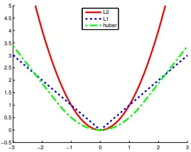

Figure 5.3: Illustration of  $\ell_{2}$,  $\ell_{1}$, and Huber loss functions with  $\delta = 1.5$. Generated by huberLossPlot.ipynb.

This is sketched in Figure 5.3. Exercise 5.4 asks you to show that the optimal estimate is the posterior median, i.e., a value $a$such that$\Pr(h < a|\boldsymbol{x}) = \Pr(h \geq a|\boldsymbol{x}) = 0.5$. We can use this for robust regression as discussed in Section 11.6.1.

##### 5.1.5.3 Huber loss

Another robust loss function is the Huber loss [Hub64], defined as follows:

$$
\ell_{\delta}(h,a)=\begin{cases}r^{2}/2&if|r|\leq\delta\\\delta|r|-\delta^{2}/2&if|r|>\delta\end{cases}   \tag*{(5.36)}
$$

where  $r = h - a$. This is equivalent to  $\ell_2$ for errors that are smaller than  $\delta$, and is equivalent to  $\ell_1$ for larger errors. See Figure 5.3 for a plot. We can use this for robust regression as discussed in Section 11.6.3.

#### 5.1.6 Probabilistic prediction problems

In Section 5.1.2, we assumed the set of possible actions was to pick a single class label (or possibly the “reject” or “do not know” action). In Section 5.1.5, we assumed the set of possible actions was to pick a real valued scalar. In this section, we assume the set of possible actions is to pick a probability distribution over some value of interest. That is, we want to perform probabilistic prediction or probabilistic forecasting, rather than predicting a specific value. More precisely, we assume the true “state of nature” is a distribution,  $h = p(Y|\boldsymbol{x})$, the action is another distribution,  $a = q(Y|\boldsymbol{x})$, and we want to pick q to minimize  $\mathbb{E}[\ell(p,q)]$ for each given  $\boldsymbol{x}$. We discuss various possible loss functions below. We drop the conditioning on  $\boldsymbol{x}$ for brevity.

##### 5.1.6.1 KL, cross-entropy and log-loss

A common form of loss functions for comparing two distributions is the Kullback Leibler divergence, or KL divergence, which is defined as follows:

$$
D_{\mathbb{K L}}\left(p\parallel q\right)\triangleq\sum_{y\in\mathcal{Y}}p(y)\log\frac{p(y)}{q(y)}   \tag*{(5.37)}
$$

Author: Kevin P. Murphy. (C) MIT Press. CC-BY-NC-ND license

---

(We have assumed the variable $y$is discrete, for notational simplicity, but this can be generalized to real-valued variables.) In Section 6.2, we show that the KL divergence satisfies the following properties:$D_{\mathbb{K}\mathbb{L}}(p \parallel q) \geq 0$with equality iff$p = q$. Note that it is an asymmetric function of its arguments.

We can expand the KL as follows:

$$
D_{\mathbb{K L}}\left(p\parallel q\right)=\sum_{y\in\mathcal{Y}}p(y)\log p(y)-\sum_{y\in\mathcal{Y}}p(y)\log q(y)   \tag*{(5.38)}
$$

$$
=-\mathbb{H}(p)+\mathbb{H}_{c e}(p,q)   \tag*{(5.39)}
$$

$$
\mathbb{H}(p)\triangleq-\sum_{y}p(y)\log p(y)   \tag*{(5.40)}
$$

$$
\mathbb{H}_{c e}(p,q)\triangleq-\sum_{y}p(y)\log q(y)   \tag*{(5.41)}
$$

The  $\mathbb{H}(p)$ term is known as the entropy. This is a measure of uncertainty or variance of p; it is maximal if p is uniform, and is 0 if p is a degenerate or deterministic delta function. Entropy is often used in the field of information theory, which is concerned with optimal ways of compressing and communicating data (see Chapter 6). The optimal coding scheme will allocate fewer bits to more frequent symbols (i.e., values of Y for which  $p(y)$ is large), and more bits to less frequent symbols. A key result states that the number of bits needed to compress a dataset generated by a distribution p is at least  $\mathbb{H}(p)$; the entropy therefore provides a lower bound on the degree to which we can compress data without losing information. The  $\mathbb{H}_{ce}(p, q)$ term is known as the cross-entropy. This measures the expected number of bits we need to use to compress a dataset coming from distribution p if we design our code using distribution q. Thus the KL is the extra number of bits we need to use to compress the data due to using the incorrect distribution q. If the KL is zero, it means that we can correctly predict the probabilities of all possible future events, and thus we have learned to predict the future as well as an “oracle” that has access to the true distribution p.

To find the optimal distribution to use when predicting future data, we can minimize  $D_{\mathbb{K}\mathbb{L}}(p \parallel q)$. Since  $\mathbb{H}(p)$ is a constant wrt q, it can be ignored, and thus we can equivalently minimize the cross-entropy:

$$
q^{*}(Y)=\underset{q}{\operatorname{argmin}}\mathbb{H}_{ce}(p(Y),q(Y))   \tag*{(5.42)}
$$

Now consider the special case in which the true state of nature is a degenerate distribution, which puts all its mass on a single outcome, say c, i.e.,  $h = p(Y) = \mathbb{I}(Y = c)$. This is often called a “one-hot” distribution, since it turns “on” the  $c^{th}$ element of the vector, and leaves the other elements “off”, as shown in Figure 2.1. In this case, the cross entropy becomes

$$
\mathbb{H}_{c e}(\delta(Y=c),q)=-\sum_{y\in\mathcal{Y}}\delta(y=c)\log q(y)=-\log q(c)   \tag*{(5.43)}
$$

This is known as the log loss of the predictive distribution q when given target label c.

##### 5.1.6.2 Proper scoring rules

Cross-entropy loss is a very common choice for probabilistic forecasting, but is not the only possible metric. The key property we desire is that the loss function is minimized if the decision maker picks

---

the distribution $q$that matches the true distribution$p$, i.e., $\ell(p,p) \leq \ell(p,q)$, with equality iff $p = q$. Such a loss function $\ell$is called a proper scoring rule [GR07]. We can show that cross-entropy loss is a proper scoring rule by virtue of the fact that$0 = D_{\mathbb{K}\mathbb{L}} (p \parallel p) \leq D_{\mathbb{K}\mathbb{L}} (p \parallel q)$.

##### 5.1.6.3 Brier score

The  $\log[p(y)/q(y)]$ term in the KL loss can be quite sensitive to errors for low probability events  $[QC+06]$. A common alternative is to use the  $\text{Brier score}$ [Bri50], which is another proper scoring rule, originally invented in the context of weather forecasting. This is defined for the special case that the true distribution  $p$ is a set of  $N$ delta functions,  $\boldsymbol{p}_n(\mathbf{Y}_n) = \delta(\mathbf{Y}_n - \mathbf{y}_n)$, where  $\boldsymbol{y}_n$ is the observed outcome in one-hot form, so  $y_{nc} = 1$ if the  $n$'th observed outcome is class  $c$. The corresponding predictive distribution is assumed to be a set of  $N$ distributions  $\boldsymbol{q}_n(\mathbf{Y}_n)$, which can of course be conditioned on covariates  $\boldsymbol{x}_n$. The Brier score can now be defined as follows:

$$
\mathrm{BS}(\boldsymbol{p},\boldsymbol{q})\triangleq\frac{1}{N}\sum_{n=1}^{N}\sum_{c=1}^{C}(q_{nc}-p_{nc})^{2}=\frac{1}{N}\sum_{n=1}^{N}\sum_{c=1}^{C}(q_{nc}-y_{nc})^{2}   \tag*{(5.44)}
$$

This is just the mean squared error of the predictive distributions compared to the true distributions, when viewed as vectors. Since it is based on squared error, the Brier score is less sensitive to extremely rare or extremely common classes.

In the special case of binary classification, where we use class labels  $c = 0$ and  $c = 1$, we define  $y_n = y_{n1}$, and  $q_n = q(Y_{n1})$, so the summand becomes  $(q_n - y_n)^2 + (1 - q_n - (1 - y_n))^2 = 2(q_n - y_n)^2$. Consequently, in the binary cases, we often divide the multi-class definition by 2, to get the binary Brier Score,  $\mathrm{BS}(\boldsymbol{p}, \boldsymbol{q}) = \frac{1}{N} \sum_{n=1}^N (q_n - y_n)^2$, which has values in the range  $[0, 1]$, with the optimal loss being 0.

Since it can be hard to interpret absolute Brier score values, a relative performance measure, known as the Brier Skill Score, is sometimes used. This is defined as  $BSS = 1 - \frac{BS}{BS_{ref}}$, where  $BS_{ref}$ is the BS of a reference model. The range of this score is  $[-1, 1]$, with 1 being the best, 0 meaning no improvement over the baseline. and -1 being the worst. In the case of binary predictors, a common reference model is the baseline empirical probability  $\overline{q} = \frac{1}{N} \sum_{n=1}^{N} y_n$. In the metereological community, this is called the “in-sample climatology” prediction, where “in-sample” means based on the observed data, and “climatology” refers to the long run average behavior. However, the reference model could be a sophisticated numerical weather prediction model, and the target model (which is being evaluated) could be an ML model (see e.g., [Pri+23]).

### 5.2 Choosing the “right” model

In this section, we consider the setting in which we have several candidate (parametric) models (e.g., neural networks with different numbers of layers), and we want to choose the “right” one. This can be tackled using tools from Bayesian decision theory.

#### 5.2.1 Bayesian hypothesis testing

Suppose we have two hypotheses or models, commonly called the null hypothesis,  $M_{0}$, and the alternative hypothesis,  $M_{1}$, and we want to know which one is more likely to be true. This is called hypothesis testing.

Author: Kevin P. Murphy. (C) MIT Press. CC-BY-NC-ND license

---

<table border=1 style='margin: auto; word-wrap: break-word;'><tr><td style='text-align: center; word-wrap: break-word;'>Bayes factor  $BF(1,0)$</td><td style='text-align: center; word-wrap: break-word;'>Interpretation</td></tr><tr><td style='text-align: center; word-wrap: break-word;'>$BF &lt; \frac{1}{100}$</td><td style='text-align: center; word-wrap: break-word;'>Decisive evidence for  $M_{0}$</td></tr><tr><td style='text-align: center; word-wrap: break-word;'>$BF &lt; \frac{1}{10}$</td><td style='text-align: center; word-wrap: break-word;'>Strong evidence for  $M_{0}$</td></tr><tr><td style='text-align: center; word-wrap: break-word;'>$\frac{1}{10} &lt; BF &lt; \frac{1}{3}$</td><td style='text-align: center; word-wrap: break-word;'>Moderate evidence for  $M_{0}$</td></tr><tr><td style='text-align: center; word-wrap: break-word;'>$\frac{1}{3} &lt; BF &lt; 1$</td><td style='text-align: center; word-wrap: break-word;'>Weak evidence for  $M_{0}$</td></tr><tr><td style='text-align: center; word-wrap: break-word;'>$1 &lt; BF &lt; 3$</td><td style='text-align: center; word-wrap: break-word;'>Weak evidence for  $M_{1}$</td></tr><tr><td style='text-align: center; word-wrap: break-word;'>$3 &lt; BF &lt; 10$</td><td style='text-align: center; word-wrap: break-word;'>Moderate evidence for  $M_{1}$</td></tr><tr><td style='text-align: center; word-wrap: break-word;'>$BF &gt; 10$</td><td style='text-align: center; word-wrap: break-word;'>Strong evidence for  $M_{1}$</td></tr><tr><td style='text-align: center; word-wrap: break-word;'>$BF &gt; 100$</td><td style='text-align: center; word-wrap: break-word;'>Decisive evidence for  $M_{1}$</td></tr></table>

Table 5.6: Jeffreys scale of evidence for interpreting Bayes factors.

If we use 0-1 loss, the optimal decision is to pick the alternative hypothesis iff  $p(M_1|\mathcal{D}) > p(M_0|\mathcal{D})$, or equivalently, if  $p(M_1|\mathcal{D})/p(M_0|\mathcal{D}) > 1$. If we use a uniform prior,  $p(M_0) = p(M_1) = 0.5$, the decision rule becomes: select  $M_1$ iff  $p(\mathcal{D}|M_1)/p(\mathcal{D}|M_0) > 1$. This quantity, which is the ratio of marginal likelihoods of the two models, is known as the Bayes factor:

$$
B_{1,0}\triangleq\frac{p(\mathcal{D}|M_{1})}{p(\mathcal{D}|M_{0})}   \tag*{(5.45)}
$$

This is like a likelihood ratio, except we integrate out the parameters, which allows us to compare models of different complexity, due to the Bayesian Occam's razor effect explained in Section 5.2.3.

It  $B_{1,0} > 1$ then we prefer model 1, otherwise we prefer model 0. Of course, it might be that  $B_{1,0}$ is only slightly greater than 1. In that case, we are not very confident that model 1 is better. Jeffreys [Jef61] proposed a scale of evidence for interpreting the magnitude of a Bayes factor, which is shown in Table 5.6. This is a Bayesian alternative to the frequentist concept of a p-value (see Section 5.5.3).

We give a worked example of how to compute Bayes factors in Section 5.2.1.1.

##### 5.2.1.1 Example: Testing if a coin is fair

As an example, suppose we observe some coin tosses, and want to decide if the data was generated by a fair coin,  $\theta = 0.5$, or a potentially biased coin, where  $\theta$ could be any value in [0, 1]. Let us denote the first model by  $M_0$ and the second model by  $M_1$. The marginal likelihood under  $M_0$ is simply

$$
p(\mathcal{D}|M_{0})=\left(\frac{1}{2}\right)^{N}   \tag*{(5.46)}
$$

where N is the number of coin tosses. From Equation (4.143), the marginal likelihood under  $M_{1}$, using a Beta prior, is

$$
p(\mathcal{D}|M_{1})=\int p(\mathcal{D}|\theta)p(\theta)d\theta=\frac{B(\alpha_{1}+N_{1},\alpha_{0}+N_{0})}{B(\alpha_{1},\alpha_{0})}   \tag*{(5.47)}
$$

We plot  $\log p(\mathcal{D}|M_1)$ vs the number of heads  $N_1$ in Figure 5.4(a), assuming  $N = 5$ and a uniform prior,  $\alpha_1 = \alpha_0 = 1$. (The shape of the curve is not very sensitive to  $\alpha_1$ and  $\alpha_0$, as long as the prior is symmetric, so  $\alpha_0 = \alpha_1$.) If we observe 2 or 3 heads, the unbiased coin hypothesis  $M_0$

---

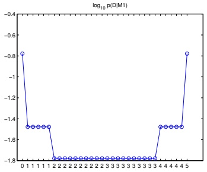

 $(a)$

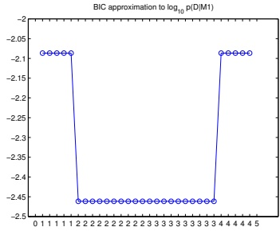

(b)

Figure 5.4: (a) Log marginal likelihood vs number of heads for the coin tossing example. (b) BIC approximation. (The vertical scale is arbitrary, since we are holding N fixed.) Generated by coins_model_sel_demo.ipynb.

is more likely than  $M_1$, since  $M_0$ is a simpler model (it has no free parameters) — it would be a suspicious coincidence if the coin were biased but happened to produce almost exactly 50/50 heads/tails. However, as the counts become more extreme, we favor the biased coin hypothesis. Note that, if we plot the log Bayes factor,  $\log B_{1,0}$, it will have exactly the same shape, since  $\log p(\mathcal{D}|M_0)$ is a constant.

#### 5.2.2 Bayesian model selection

Now suppose we have a set $\mathcal{M}$of more than 2 models, and we want to pick the most likely. This is called model selection. We can view this as a decision theory problem, where the action space requires choosing one model,$m \in \mathcal{M}$. If we have a 0-1 loss, the optimal action is to pick the most probable model:

$$
\hat{m}=\underset{m\in\mathcal{M}}{\operatorname{argmax}}p(m|\mathcal{D})   \tag*{(5.48)}
$$

where

$$
p(m|\mathcal{D})=\frac{p(\mathcal{D}|m)p(m)}{\sum_{m\in\mathcal{M}}p(\mathcal{D}|m)p(m)}   \tag*{(5.49)}
$$

is the posterior over models. If the prior over models is uniform,  $p(m) = 1/|\mathcal{M}|$, then the MAP model is given by

$$
\hat{m}=\underset{m\in\mathcal{M}}{\operatorname{argmax}}p(\mathcal{D}|m)   \tag*{(5.50)}
$$

The quantity  $p(\mathcal{D}|m)$ is given by

$$
p(\mathcal{D}|m)=\int p(\mathcal{D}|\boldsymbol{\theta},m)p(\boldsymbol{\theta}|m)d\boldsymbol{\theta}   \tag*{(5.51)}
$$

Author: Kevin P. Murphy. (C) MIT Press. CC-BY-NC-ND license

---

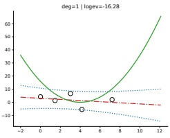

 $(a)$

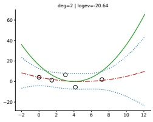

(b)

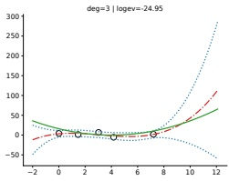

(c)

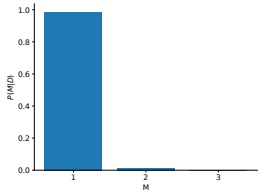

 $(d)$

Figure 5.5: Illustration of Bayesian model selection for polynomial regression. (a-c) We fit polynomials of degrees 1, 2 and 3 fit to N = 5 data points. The solid green curve is the true function, the dashed red curve is the prediction (dotted blue lines represent  $\pm 2\sigma$ around the mean). (d) We plot the posterior over models,  $p(m|D)$, assuming a uniform prior  $p(m) \propto 1$. Generated by  $\text{linreg\_eb\_modelsel\_vs\_n.ipymb}$.

This is known as the marginal likelihood, or the evidence for model m. Intuitively, it is the likelihood of the data averaged over all possible parameter values, weighted by the prior  $p(\boldsymbol{\theta}|m)$. If all settings of  $\boldsymbol{\theta}$ assign high probability to the data, then this is probably a good model.

##### 5.2.2.1 Example: polynomial regression

As an example of Bayesian model selection, we will consider polynomial regression in 1d. Figure 5.5 shows the posterior over three different models, corresponding to polynomials of degrees 1, 2 and 3 fit to N = 5 data points. We use a uniform prior over models, and use empirical Bayes to estimate the prior over the regression weights (see Section 11.7.7). We then compute the evidence for each model (see Section 11.7 for details on how to do this). We see that there is not enough data to justify a complex model, so the MAP model is m = 1. Figure 5.6 shows the analogous plot for N = 30 data points. Now we see that the MAP model is m = 2; the larger sample size means we can safely pick a more complex model.

---

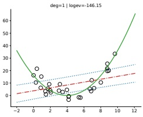

 $(a)$

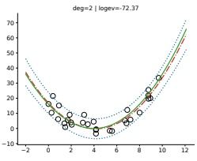

(b)

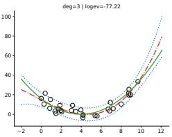

(c)

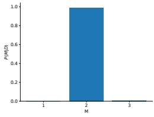

 $(d)$

Figure 5.6: Same as Figure 5.5 except now N = 30. Generated by linreg_eb_modelsel_vs_n.ipynb.

#### 5.2.3 Occam's razor

Consider two models, a simple one,  $m_1$, and a more complex one,  $m_2$. Suppose that both can explain the data by suitably optimizing their parameters, i.e., for which  $p(\mathcal{D}|\pmb{\theta}_1, m_1)$ and  $p(\mathcal{D}|\pmb{\theta}_2, m_2)$ are both large. Intuitively we should prefer  $m_1$, since it is simpler and just as good as  $m_2$. This principle is known as Occam's razor.

Let us now see how ranking models based on their marginal likelihood, which involves averaging the likelihood wrt the prior, will give rise to this behavior. The complex model will put less prior probability on the “good” parameters that explain the data,  $\hat{\theta}_2$, since the prior must integrate to 1.0 over the entire parameter space. Thus it will take averages in parts of parameter space with low likelihood. By contrast, the simpler model has fewer parameters, so the prior is concentrated over a smaller volume; thus its averages will mostly be in the good part of parameter space, near  $\hat{\theta}_1$. Hence we see that the marginal likelihood will prefer the simpler model. This is called the Bayesian Occam’s razor effect [Mac95; MG05].

Another way to understand the Bayesian Occam’s razor effect is to compare the relative predictive abilities of simple and complex models. Since probabilities must sum to one, we have  $\sum_{\mathcal{D}^{\prime}} p(\mathcal{D}^{\prime}|m) = 1$, where the sum is over all possible datasets. Complex models, which can predict many things, must spread their predicted probability mass thinly, and hence will not obtain as large a probability for any given data set as simpler models. This is sometimes called the conservation of probability mass principle, and is illustrated in Figure 5.7. On the horizontal axis we plot all possible data sets in order of increasing complexity (measured in some abstract sense). On the vertical axis we plot the

---

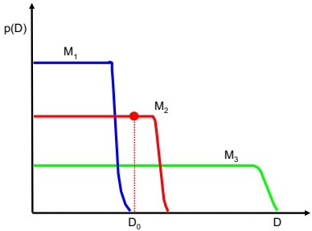

Figure 5.7: A schematic illustration of the Bayesian Occam's razor. The broad (green) curve corresponds to a complex model, the narrow (blue) curve to a simple model, and the middle (red) curve is just right. Adapted from Figure 3.13 of [Bis06]. See also [MG05, Figure 2] for a similar plot produced on real data.

predictions of 3 possible models: a simple one,  $M_1$; a medium one,  $M_2$; and a complex one,  $M_3$. We also indicate the actually observed data  $\mathcal{D}_0$ by a vertical line. Model 1 is too simple and assigns low probability to  $\mathcal{D}_0$. Model 3 also assigns  $\mathcal{D}_0$ relatively low probability, because it can predict many data sets, and hence it spreads its probability quite widely and thinly. Model 2 is “just right”: it predicts the observed data with a reasonable degree of confidence, but does not predict too many other things. Hence model 2 is the most probable model.

#### 5.2.4 Connection between cross validation and marginal likelihood

We have seen how the marginal likelihood helps us choose models of the “right” complexity. In non-Bayesian approaches to model selection, it is standard to use cross validation (Section 4.5.5) for this purpose.

It turns out that the marginal likelihood is closely related to the leave-one-out cross-validation (LOO-CV) estimate, as we now show. We start with the marginal likelihood for model m, which we write in sequential form as follows:

$$
p(\mathcal{D}|m)=\prod_{n=1}^{N}p(y_{n}|y_{1:n-1},\boldsymbol{x}_{1:N},m)=\prod_{n=1}^{N}p(y_{n}|\boldsymbol{x}_{n},\mathcal{D}_{1:n-1},m)   \tag*{(5.52)}
$$

where

$$
p(y|\boldsymbol{x},\mathcal{D}_{1:n-1},m)=\int p(y|\boldsymbol{x},\boldsymbol{\theta})p(\boldsymbol{\theta}|\mathcal{D}_{1:n-1},m)d\boldsymbol{\theta}   \tag*{(5.53)}
$$

Suppose we use a plugin approximation to the above distribution to get

$$
p(y|\boldsymbol{x},\mathcal{D}_{1:n-1},m)\approx\int p(y|\boldsymbol{x},\boldsymbol{\theta})\delta(\boldsymbol{\theta}-\hat{\boldsymbol{\theta}}_{m}(\mathcal{D}_{1:n-1}))d\boldsymbol{\theta}=p(y|\boldsymbol{x},\hat{\boldsymbol{\theta}}_{m}(\mathcal{D}_{1:n-1}))   \tag*{(5.54)}
$$

“Probabilistic Machine Learning: An Introduction”. Online version. November 23, 2024

---

Then we get

$$
\log p(\mathcal{D}|m)\approx\sum_{n=1}^{N}\log p(y_{n}|\boldsymbol{x}_{n},\hat{\boldsymbol{\theta}}_{m}(\mathcal{D}_{1:n-1}))   \tag*{(5.55)}
$$

This is similar to a leave-one-out cross-validation estimate of the likelihood, which has the form  $\frac{1}{N}\sum_{n=1}^{N}\log p(y_n|\boldsymbol{x}_n,\hat{\boldsymbol{\theta}}_n(\mathcal{D}_{1:n-1,n+1:N}))$, except we ignore the  $\mathcal{D}_{n+1:N}$ part. The intuition behind the connection is this: an overly complex model will overfit the “early” examples and will then predict the remaining ones poorly, and thus will also get a low cross-validation score. See [FH20] for a more detailed discussion of the connection between these performance metrics.

#### 5.2.5 Information criteria

The marginal likelihood,  $p(\mathcal{D}|m) = \int p(\mathcal{D}|\boldsymbol{\theta}, m)p(\boldsymbol{\theta})d\boldsymbol{\theta}$, which is needed for Bayesian model selection discussed in Section 5.2.2, can be difficult to compute, since it requires marginalizing over the entire parameter space. Furthermore, the result can be quite sensitive to the choice of prior. In this section, we discuss some other related metrics for model selection known as information criteria. These have the following form:  $\mathcal{L}(m) = -\log p(\mathcal{D}|\boldsymbol{\theta}, m) + C(m)$, where  $C(m)$ is a complexity penalty term added to the negative log likelihood (NLL). Different methods use different complexity terms  $C(m)$, as we discuss below. See e.g., [GHV14] for further details.

A note on notation: it is conventional, when working with information criteria, to scale the NLL by -2 to get the  $\text{deviance}$,  $\text{deviance}(m) = -2 \log p(\mathcal{D}|\hat{\theta}, m)$. This makes the math “prettier” for certain Gaussian models.

##### 5.2.5.1 The Bayesian information criterion (BIC)

The Bayesian information criterion or BIC [Sch78] can be thought of as a simple approximation to the log marginal likelihood. In particular, if we make a Gaussian approximation to the posterior, as discussed in Section 4.6.8.2, we get (from Equation (4.215)) the following:

$$
\log p(\mathcal{D}|m)\approx\log p(\mathcal{D}|\hat{\boldsymbol{\theta}}_{\mathrm{map}})+\log p(\hat{\boldsymbol{\theta}}_{\mathrm{map}})-\frac{1}{2}\log|\mathbf{H}|   \tag*{(5.56)}
$$

where  $\mathbf{H}$ is the Hessian of the negative log joint,  $-\log p(\mathcal{D}, \boldsymbol{\theta})$, evaluated at the MAP estimate  $\hat{\boldsymbol{\theta}}_{\text{map}}$. We see that Equation (5.56) is the log likelihood plus some penalty terms. If we have a uniform prior,  $p(\boldsymbol{\theta}) \propto 1$, we can drop the prior term, and replace the MAP estimate with the MLE,  $\hat{\boldsymbol{\theta}}$, yielding

$$
\log p(\mathcal{D}|m)\approx\log p(\mathcal{D}|\hat{\boldsymbol{\theta}})-\frac{1}{2}\log|\mathbf{H}|   \tag*{(5.57)}
$$

We now focus on approximating the log  $|\mathbf{H}|$ term, which is sometimes called the Occam factor, since it is a measure of model complexity (volume of the posterior distribution). We have  $\mathbf{H} = \sum_{i=1}^{N} \mathbf{H}_i$, where  $\mathbf{H}_i = \nabla \nabla \log p(\mathbf{y}_i | \boldsymbol{\theta})$ is the empirical Fisher information matrix (Section 4.7.2). Let us approximate each  $\mathbf{H}_i$ by a fixed matrix  $\hat{\mathbf{H}}$. Then we have

$$
\log|\mathbf{H}|=\log|N\hat{\mathbf{H}}|=\log(N^{D_{m}}|\hat{\mathbf{H}}|)=D_{m}\log N+\log|\hat{\mathbf{H}}|   \tag*{(5.58)}
$$

Author: Kevin P. Murphy. (C) MIT Press. CC-BY-NC-ND license

---

where  $D_m = \dim(\boldsymbol{\theta})$ and we have assumed  $\mathbf{H}$ is full rank. We can drop the log  $|\hat{\mathbf{H}}|$ term, since it is independent of  $N$, and thus will get overwhelmed by the likelihood. Putting all the pieces together, we get the BIC score that we want to maximize:

$$
J_{\mathrm{B I C}}(m)=\log p(\mathcal{D}|m)\approx\log p(\mathcal{D}|\hat{\boldsymbol{\theta}},m)-\frac{D_{m}}{2}\log N   \tag*{(5.59)}
$$

We can also define the BIC loss, that we want to minimize, by multiplying by -2:

$$
\mathcal{L}_{\mathrm{B I C}}(m)=-2\log p(\mathcal{D}|\hat{\boldsymbol{\theta}},m)+D_{m}\log N   \tag*{(5.60)}
$$

(The use of 2 as a scale factor is chosen to simplify the expression when using a model with a Gaussian likelihood.)

##### 5.2.5.2 Akaike information criterion

The Akaike information criterion [Aka74] is closely related to the BIC. It has the form

$$
\mathcal{L}_{\mathrm{A I C}}(m)=-2\log p(\mathcal{D}|\hat{\boldsymbol{\theta}},m)+2D_{m}   \tag*{(5.61)}
$$

This penalizes complex models less heavily than BIC, since the regularization term is independent of N. This estimator can be derived from a frequentist perspective.

##### 5.2.5.3 Minimum description length (MDL)

We can think about the problem of scoring different models by using tools from information theory (Chapter 6). In particular, suppose we want to choose a model so that the sender can send some data to the receiver using the fewest number of bits. Choosing models this way is known as the minimum description length or MDL principle (see e.g., [HY01b; Gru07; GR19] for details, and see [Wal05] for the closely related minimum message length criterion).

We now derive an approximation to the MDL objective. First, the sender needs to specify which model to use. Let  $\hat{\theta} \in \mathbb{R}^{D_m}$ be the parameters estimated using  $N$ data samples. Since we can only reliably estimate each parameter to an accuracy of  $O(1/\sqrt{N})$ (see Section 4.6.4.1), we only need to use  $\log_2(1/\sqrt{N}) = \frac{1}{2} \log_2(N)$ bits to encode each parameter. Second, the sender needs to use this model to encode the data, which takes  $-\log p(\mathcal{D}|\hat{\theta}, m) = -\sum_n \log p(y_n|\hat{\theta}, m)$ bits. The total cost is

$$
\mathcal{L}_{\mathrm{M D L}}(m)=-\log p(\mathcal{D}|\hat{\boldsymbol{\theta}},m)+\frac{D_{m}}{2}\log N   \tag*{(5.62)}
$$

We see that this two-part code has the same basic form as BIC.

##### 5.2.5.4 Widely applicable information criterion (WAIC)

The main problem with BIC, AIC and MDL is that it can be hard to compute the degrees of a freedom of a model, needed to define the complexity term, since most parameters are highly correlated and not uniquely identifiable from the likelihood. In particular, if the mapping from parameters to the likelihood is not one-to-one, then the model known as a singular statistical model, since the corresponding Fisher information matrix (Section 4.7.2), and hence the Hessian H above, may be

---

singular. (Similar problems arise in over-parameterized models [Dwi+23].) An alternative criterion that works even in the singular case is known as the widely applicable information criterion (WAIC), also known as the Watanabe–Akaike information criterion [Wat10; Wat13].

The WAIC replaces the plug-in approximation to the marginal log likelihood,  $\ell(m) = \sum_n \log p(y_n | \hat{\theta}, m$ with the expected log pointwise predictive density or ELPD, defined as  $\text{ELPD}(m) = \sum_{n=1}^N \log p(y_n | \mathcal{D}, m) = \sum_{n=1}^N \log \mathbb{E}_{\theta \mid \mathcal{D}, m} [p(y_n | \hat{\theta}, m)]$, which is usually approximated by Monte Carlo. In addition, the complexity term is defined by  $C(m) = \sum_{n=1}^N \log \mathbb{V}_{\theta \mid \mathcal{D}, m} [p(y_n | \hat{\theta}, m)]$, which again is usually approximated by Monte Carlo. (The intuition for this is as follows: if, for a given datapoint  $y_n$, the different posterior samples  $\theta_s$ make very different predictions, then the model is uncertain, and likely too flexible. The complexity term essentially counts how often this occurs.) The WAIC loss we want to minimize is defined as  $\mathcal{L}_{\text{WAIC}}(m) = -2 \text{LPPD}(m) + 2C(m)$.

Note that the WAIC evaluates the expected log likelihood using the posterior of the parameters. By contrast, the marginal likelihood averages the log likelihood wrt the prior. This makes the ML more sensitive to the prior. It is therefore generally better to use WAIC for model selection. Efficient Monte Carlo approximations are discussed in [VGG17].

#### 5.2.6 Posterior inference over effect sizes and Bayesian significance testing

The approach to hypothesis testing discussed in Section 5.2.1 relies on computing the Bayes factors for the null vs the alternative model,  $p(\mathcal{D}|H_0)/p(\mathcal{D}|H_1)$. Unfortunately, computing the necessary marginal likelihoods can be computationally difficult, and the results can be sensitive to the choice of prior. Furthermore, we are often more interested in estimating an effect size, which is the difference in magnitude between two parameters, rather than in deciding if an effect size is 0 (null hypothesis) or not (alternative hypothesis) — the latter is called a point null hypothesis, and is often regarded as an irrelevant “straw man” (see e.g., [Mak+19] and references therein).

For example, suppose we have two classifiers,  $m_1$ and  $m_2$, and we want to know which one is better. That is, we want to perform a comparison of classifiers. Let  $\mu_1$ and  $\mu_2$ be their average accuracies, and let  $\Delta = \mu_1 - \mu_2$ be the difference in their accuracies. The probability that model 1 is more accurate, on average, than model 2 is given by  $p(\Delta > 0|\mathcal{D})$. However, even if this probability is large, the improvement may be not be practically significant. So it is better to compute a probability such as  $p(\Delta > \epsilon|\mathcal{D})$ or  $p(|\Delta| > \epsilon|\mathcal{D})$, where  $\epsilon$ represents the minimal magnitude of effect size that is meaningful for the problem at hand. This is called a one-sided test or two-sided test.

More generally, let  $R = [-\epsilon, \epsilon]$ represent a region of practical equivalence or ROPE [Kru15; KL17]. We can define 3 events of interest: the null hypothesis  $H_0 : \Delta \in R$, which says both methods are practically the same (which is a more realistic assumption than  $H_0 : \Delta = 0$);  $H_A : \Delta > \epsilon$, which says  $m_1$ is better than  $m_2$; and  $H_B : \Delta < -\epsilon$, which says  $m_2$ is better than  $m_1$. To choose amongst these 3 hypotheses, we just have to compute  $p(\Delta | \mathcal{D})$, which avoids the need to compute Bayes factors. In the sections below, we discuss how to compute this quantity using two different kinds of model.

##### 5.2.6.1 Bayesian t-test for difference in means

Suppose we have two classifiers,  $m_1$ and  $m_2$, which are evaluated on the same set of  $N$ test examples. Let  $e_i^m$ be the error of method  $m$ on test example  $i$. (Or this could be the conditional log likelihood,  $e_i^m = \log p^m(y_i | \boldsymbol{x}_i)$.) Since the classifiers are applied to the same data, we can use a paired test for comparing them, which is more sensitive than looking at average performance, since the factors that

---

make one example easy or hard to classify (e.g., due to label noise) will be shared by both methods. Thus we will work with the differences,  $d_i = e_i^1 - e_i^2$. We assume  $d_i \sim \mathcal{N}(\Delta, \sigma^2)$. We are interested in  $p(\Delta | \boldsymbol{d})$, where  $\boldsymbol{d} = (d_1, \ldots, d_N)$.

If we use an uninformative prior for the unknown parameters  $(\Delta,\sigma)$, one can show that the posterior marginal for the mean is given by a Student distribution:

 
$$
p(\Delta|\boldsymbol{d})=\mathcal{T}_{N-1}(\Delta|\mu,s^{2}/N)
$$
 

where  $\mu = \frac{1}{N} \sum_{i=1}^{N} d_i$ is the sample mean, and  $s^2 = \frac{1}{N-1} \sum_{i=1}^{N} (d_i - \mu)^2$ is an unbiased estimate of the variance. Hence we can easily compute  $p(|\Delta| > \epsilon|\boldsymbol{d})$, with a ROPE of  $\epsilon = 0.01$ (say). This is known as a Bayesian t-test [Ben+17]. (See also [Rou+09] for Bayesian t-test based on Bayes factors, and [Die98] for a non-Bayesian approach to comparing classifiers.)

An alternative to a formal test is to just plot the posterior  $p(\Delta|\boldsymbol{d})$. If this distribution is tightly centered on 0, we can conclude that there is no significant difference between the methods. (In fact, an even simpler approach is to just make a boxplot of the data,  $\{d_i\}$, which avoids the need for any formal statistical analysis.)

Note that this kind of problem arises in many applications, not just evaluating classifiers. For example, suppose we have a set of $N$people, each of whom is exposed two drugs; let$e_i^m$be the outcome (e.g., sickness level) when person$i$is exposed to drug$m$, and let $d_i^m = e_i^1 - e_i^2$be the difference in response. We can then analyse the effect of the drug by computing$p(\Delta|\mathbf{d})$as we discussed above.

##### 5.2.6.2 Bayesian$ \chi^{2} $-test for difference in rates

Now suppose we have two classifiers which are evaluated on different test sets. Let  $y_m$ be the number of correct examples from method  $m \in \{1,2\}$ out of  $N_m$ trials, so the accuracy rate is  $y_m/N_m$. We assume  $y_m \sim \text{Bin}(N_m, \theta_m)$, so we are interested in  $p(\Delta|\mathcal{D})$, where  $\Delta = \theta_1 - \theta_2$, and  $\mathcal{D} = (y_1, N_1, y_2, N_2)$ is all the data.

If we use a uniform prior for  $\theta_1$ and  $\theta_2$ (i.e.,  $p(\theta_j) = \text{Beta}(\theta_j | 1, 1)$), the posterior is given by

 
$$
p(\theta_{1},\theta_{2}|\mathcal{D})=\mathrm{Beta}(\theta_{1}|y_{1}+1,N_{1}-y_{1}+1)\mathrm{Beta}(\theta_{2}|y_{2}+1,N_{2}-y_{2}+1)
$$
 

The posterior for  $\Delta$ is given by

 
$$
\begin{align*}p(\Delta|\mathcal{D})&=\int_{0}^{1}\int_{0}^{1}\mathbb{I}(\Delta=\theta_{1}-\theta_{2})p(\theta_{1}|\mathcal{D}_{1})p(\theta_{2}|\mathcal{D}_{2})\\&=\int_{0}^{1}\mathrm{Beta}(\theta_{1}|y_{1}+1,N_{1}-y_{1}+1)\mathrm{Beta}(\theta_{1}-\Delta|y_{2}+1,N_{2}-y_{2}+1)d\theta_{1}\end{align*}
$$
 

We can then evaluate this for any value of  $\Delta$ that we choose. For example, we can compute

$$
p(\Delta>\epsilon|\mathcal{D})=\int_{\epsilon}^{\infty}p(\Delta|\mathcal{D})d\Delta   \tag*{(5.63)}
$$

(We can compute this using 1 dimensional numerical integration or analytically [Coo05].) This is called a Bayesian  $\chi^{2}$-test.

---

<table border=1 style='margin: auto; word-wrap: break-word;'><tr><td style='text-align: center; word-wrap: break-word;'></td><td style='text-align: center; word-wrap: break-word;'>LH</td><td style='text-align: center; word-wrap: break-word;'>RH</td><td style='text-align: center; word-wrap: break-word;'></td></tr><tr><td style='text-align: center; word-wrap: break-word;'>Male</td><td style='text-align: center; word-wrap: break-word;'>9</td><td style='text-align: center; word-wrap: break-word;'>43</td><td style='text-align: center; word-wrap: break-word;'>$N_{1}=52$</td></tr><tr><td style='text-align: center; word-wrap: break-word;'>Female</td><td style='text-align: center; word-wrap: break-word;'>4</td><td style='text-align: center; word-wrap: break-word;'>44</td><td style='text-align: center; word-wrap: break-word;'>$N_{2}=48$</td></tr><tr><td style='text-align: center; word-wrap: break-word;'>Totals</td><td style='text-align: center; word-wrap: break-word;'>13</td><td style='text-align: center; word-wrap: break-word;'>87</td><td style='text-align: center; word-wrap: break-word;'>100</td></tr></table>

Table 5.7: A  $2 \times 2$ contingency table from http://en.wikipedia.org/wiki/Contingency_table. The MLEs for the left handedness rate in males and females are  $\hat{\theta}_1 = 9/52 = 0.1731$ and  $\hat{\theta}_2 = 4/48 = 0.0417$.

Note that this kind of problem arises in many applications, not just evaluating classifiers. For example, suppose the two groups are different companies selling the same product on Amazon, and  $y_m$ is the number of positive reviews for merchant  $m$. Or suppose the two groups correspond to men and women, and  $y_m$ is the number of people in group  $m$ who are left handed, and  $N_m - y_m$ to be the number who are right handed. $^3$ We can represent the data as a  $2 \times 2$ contingency table of counts, as shown in Table 5.7.

The MLEs for the left handedness rate in males and females are  $\hat{\theta}_1 = 9/52 = 0.1731$ and  $\hat{\theta}_2 = 4/48 = 0.0417$. It seems that there is a difference, but the sample size is low, so we cannot be sure. Hence we will represent our uncertainty by computing  $p(\Delta|\mathcal{D})$, where  $\Delta = \theta_1 - \theta_2$ and  $\mathcal{D}$ is the table of counts. We find  $p(\theta_1 > \theta_2|\mathcal{D}) = \int_0^\infty p(\Delta|\mathcal{D}) = 0.901$, which suggests that left handedness is more common in males, consistent with other studies [PP+20].

### 5.3 Frequentist decision theory

In this section, we discuss frequentist decision theory. In this approach, we treat the unknown state of nature (often denoted by  $\theta$ instead of h) as a fixed but unknown quantity, and we treat the data x as random. Thus instead of conditioning on x, we average over it, to compute the loss we expect to incur if we apply our decision procedure (estimator) to many different datasets. We give the details below.

#### 5.3.1 Computing the risk of an estimator

We define the frequentist risk of an estimator  $\delta$ given an unknown state of nature  $\theta$ to be the expected loss when applying that estimator to data  $\boldsymbol{x}$, where the expectation is over the data, sampled from  $p(\boldsymbol{x}|\boldsymbol{\theta})$:

$$
R(\boldsymbol{\theta},\boldsymbol{\delta})\triangleq\mathbb{E}_{p(\boldsymbol{x}|\boldsymbol{\theta})}\left[\ell(\boldsymbol{\theta},\delta(\boldsymbol{x}))\right]   \tag*{(5.64)}
$$

We give an example of this in Section 5.3.1.1.

##### 5.3.1.1 Example

In this section, we consider the problem of estimating the mean of a Gaussian. We assume the data is sampled from  $x_n \sim \mathcal{N}(\theta^*, \sigma^2 = 1)$, and we let  $\boldsymbol{x} = (x_1, \ldots, x_N)$. If we use quadratic loss,  $\ell_2(\theta, \hat{\theta}) = (\theta - \hat{\theta})^2$, the corresponding risk function is the MSE.

---

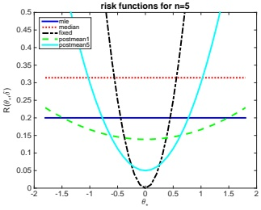

 $(a)$

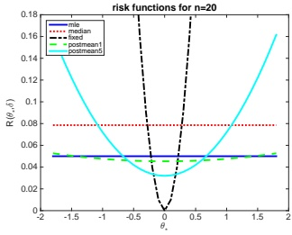

(b)

Figure 5.8: Risk functions for estimating the mean of a Gaussian. Each curve represents  $R(\theta_i(\cdot), \theta^*)$ plotted vs  $\theta^*$, where  $i$ indexes the estimator. Each estimator is applied to  $N$ samples from  $\mathcal{N}(\theta^*, \sigma^2 = 1)$. The dark blue horizontal line is the sample mean (MLE); the red line horizontal line is the sample median; the black curved line is the estimator  $\hat{\theta} = \theta_0 = 0$; the green curved line is the posterior mean when  $\kappa = 1$; the light blue curved line is the posterior mean when  $\kappa = 5$. (a)  $N = 5$ samples. (b)  $N = 20$ samples. Adapted from Figure B.1 of [BS94]. Generated by riskFnGauss.ipynb.

We now consider 5 different estimators for computing  $\theta$:

•  $\delta_1(x) = \overline{x}$, the sample mean.

•  $\delta_2(\boldsymbol{x}) = \text{median}(\boldsymbol{x})$, the sample median.

$\bullet \quad \delta_{3}(\mathbf{x})=\theta_{0}, \text{ a fixed value}$-$ \delta_{\kappa}(\boldsymbol{x}) $, the posterior mean under a  $\mathcal{N}(\theta|\theta_0, \sigma^2/\kappa)$ prior:

$$
\delta_{\kappa}(\boldsymbol{x})=\frac{N}{N+\kappa}\overline{x}+\frac{\kappa}{N+\kappa}\theta_{0}=w\overline{x}+(1-w)\theta_{0}   \tag*{(5.65)}
$$

For  $\delta_{\kappa}$, we use  $\theta_{0}=0$, and consider a weak prior,  $\kappa=1$, and a stronger prior,  $\kappa=5$.

Let  $\hat{\theta} = \hat{\theta}(\boldsymbol{x}) = \delta(\boldsymbol{x})$ be the estimated parameter. The risk of this estimator is given by the MSE. In Section 4.7.6.3, we show that the MSE can be decomposed into squared bias plus variance:

$$
\mathrm{MSE}(\hat{\theta}|\theta^{*})=\mathbb{V}\left[\hat{\theta}\right]+\mathrm{bias}^{2}(\hat{\theta})   \tag*{(5.66)}
$$

where the bias is defined as  $\text{bias}(\hat{\theta}) = \mathbb{E}\left[\hat{\theta} - \theta^*\right]$. We now use this expression to derive the risk for each estimator.

 $\delta_{1}$ is the sample mean. This is unbiased, so its risk is

$$
\mathrm{MSE}(\delta_{1}|\theta^{*})=\mathbb{V}\left[\overline{x}\right]=\frac{\sigma^{2}}{N}   \tag*{(5.67)}
$$

“Probabilistic Machine Learning: An Introduction”. Online version. November 23, 2024

---

 $\delta_2$ is the sample median. This is also unbiased. Furthermore, one can show that its variance is approximately  $\pi/(2N)$ (where  $\pi = 3.14$) so the risk is

$$
\mathrm{MSE}(\delta_{2}|\theta^{*})=\frac{\pi}{2N}   \tag*{(5.68)}
$$

 $\delta_3$ returns the constant  $\theta_0$, so its bias is  $(\theta^* - \theta_0)$ and its variance is zero. Hence the risk is

$$
\mathrm{MSE}(\delta_{3}|\theta^{*})=(\theta^{*}-\theta_{0})^{2}   \tag*{(5.69)}
$$

Finally,  $\delta_{4}$ is the posterior mean under a Gaussian prior. We can derive its MSE as follows:

$$
\mathrm{MSE}(\delta_{\kappa}|\theta^{*})=\mathbb{E}\left[(w\overline{x}+(1-w)\theta_{0}-\theta^{*})^{2}\right]   \tag*{(5.70)}
$$

 
$$
=\mathbb{E}\left[\left(w(\overline{x}-\theta^{*})+(1-w)(\theta_{0}-\theta^{*})\right)^{2}\right]
$$
 

$$
=w^{2}\frac{\sigma^{2}}{N}+(1-w)^{2}(\theta_{0}-\theta^{*})^{2}   \tag*{(5.72)}
$$

$$
=\frac{1}{(N+\kappa)^{2}}\left(N\sigma^{2}+\kappa^{2}(\theta_{0}-\theta^{*})^{2}\right)   \tag*{(5.73)}
$$

These functions are plotted in Figure 5.8 for  $N \in \{5, 20\}$. We see that in general, the best estimator depends on the value of  $\theta^*$, which is unknown. If  $\theta^*$ is very close to  $\theta_0$, then  $\delta_3$ (which just predicts  $\theta_0$) is best. If  $\theta^*$ is within some reasonable range around  $\theta_0$, then the posterior mean, which combines the prior guess of  $\theta_0$ with the actual data, is best. If  $\theta^*$ is far from  $\theta_0$, the MLE is best.

##### 5.3.1.2 Bayes risk

In general, the true state of nature  $\theta$ that generates the data x is unknown, so we cannot compute the risk given in Equation (5.64). One solution to this is to assume a prior  $\pi_0$ for  $\theta$, and then average it out. This gives us the Bayes risk, also called the integrated risk:

$$
R_{\pi_{0}}(\delta)\triangleq\mathbb{E}_{\pi_{0}(\boldsymbol{\theta})}\left[R(\boldsymbol{\theta},\delta)\right]=\int d\boldsymbol{\theta}\;d\boldsymbol{x}\;\pi_{0}(\boldsymbol{\theta})p(\boldsymbol{x}|\boldsymbol{\theta})\ell(\boldsymbol{\theta},\delta(\boldsymbol{x}))   \tag*{(5.74)}
$$

A decision rule that minimizes the Bayes risk is known as a Bayes estimator. This is equivalent to the optimal policy recommended by Bayesian decision theory in Equation  $(5.2)$ since

$$
\delta(\boldsymbol{x})=\underset{a}{\arg\min}\int d\boldsymbol{\theta}\pi_{0}(\boldsymbol{\theta})p(\boldsymbol{x}|\boldsymbol{\theta})\ell(\boldsymbol{\theta},a)=\underset{a}{\arg\min}\int d\boldsymbol{\theta}p(\boldsymbol{\theta}|\boldsymbol{x})\ell(\boldsymbol{\theta},a)   \tag*{(5.75)}
$$

Hence we see that picking the optimal action on a case-by-case basis (as in the Bayesian approach) is optimal on average (as in the frequentist approach). In other words, the Bayesian approach provides a good way of achieving frequentist goals. See [BS94, p448] for further discussion of this point.

##### 5.3.1.3 Maximum risk

Of course the use of a prior might seem undesirable in the context of frequentist statistics. We can therefore define the maximum risk as follows:

$$
R_{\mathrm{m a x}}(\delta)\triangleq\operatorname*{s u p}_{\theta}R(\pmb{\theta},\delta)   \tag*{(5.76)}
$$

Author: Kevin P. Murphy. (C) MIT Press. CC-BY-NC-ND license

---

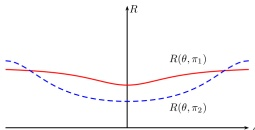

Figure 5.9: Risk functions for two decision procedures,  $\delta_{1}$ and  $\delta_{2}$. Since  $\delta_{1}$ has lower worst case risk, it is the minimax estimator, even though  $\delta_{2}$ has lower risk for most values of  $\theta$. Thus minimax estimators are overly conservative.

A decision rule that minimizes the maximum risk is called a  $\text{minimax}$ estimator, and is denoted  $\delta_{MM}$. For example, in Figure 5.9, we see that  $\delta_1$ has lower worst-case risk than  $\delta_2$, ranging over all possible values of  $\theta$, so it is the minimax estimator.

Minimax estimators have a certain appeal. However, computing them can be hard. And furthermore, they are very pessimistic. In fact, one can show that all minimax estimators are equivalent to Bayes estimators under a least favorable prior. In most statistical situations (excluding game theoretic ones), assuming nature is an adversary is not a reasonable assumption.

#### 5.3.2 Consistent estimators

Suppose we have a dataset  $\boldsymbol{x} = \{\boldsymbol{x}_n : n = 1 : N\}$ where the samples  $\boldsymbol{x}_n \in \mathcal{X}$ are generated iid from a distribution  $p(\boldsymbol{x}|\boldsymbol{\theta}^*)$, where  $\boldsymbol{\theta}^* \in \Theta$ is the true parameter. Furthermore, suppose the parameters are  $\text{identifiable}$, meaning that  $p(\boldsymbol{x}|\boldsymbol{\theta}) = p(\boldsymbol{x}|\boldsymbol{\theta}')$ iff  $\boldsymbol{\theta} = \boldsymbol{\theta}'$ for any dataset  $\boldsymbol{x}$. Then we say that an estimator  $\delta : \mathcal{X}^N \to \Theta$ is a  $\text{consistent}$ estimator if  $\hat{\boldsymbol{\theta}}(\boldsymbol{x}) \to \boldsymbol{\theta}^*$ as  $N \to \infty$ (where the arrow denotes convergence in probability). In other words, the procedure  $\delta$ recovers the true parameter (or a subset of it) in the limit of infinite data. This is equivalent to minimizing the 0-1 loss,  $\mathcal{L}(\boldsymbol{\theta}^*, \hat{\boldsymbol{\theta}}) = \mathbb{I}\left(\boldsymbol{\theta}^* \neq \hat{\boldsymbol{\theta}}\right)$. An example of a consistent estimator is the maximum likelihood estimator (MLE).

Note that an estimator can be unbiased but not consistent. For example, consider the estimator  $\delta(\boldsymbol{x}) = \delta(\{\boldsymbol{x}_1, \ldots, \boldsymbol{x}_N\}) = \boldsymbol{x}_N$. This is an unbiased estimator of the true mean  $\boldsymbol{\mu}$, since  $\mathbb{E}[\delta(\boldsymbol{x})] = \mathbb{E}[\boldsymbol{x}_N] = \boldsymbol{\mu}$. But the sampling distribution of  $\delta(\boldsymbol{x})$ does not converge to a fixed value, so it cannot converge to the point  $\boldsymbol{\theta}^*$.

Although consistency is a desirable property, it is of somewhat limited usefulness in practice since most real datasets do not come from our chosen model family (i.e., there is no  $\theta^*$ such that  $p(\cdot|\theta^*)$ generates the observed data  $\mathbf{x}$). In practice, it is more useful to find estimators that minimize some discrepancy measure between the empirical distribution and the estimated distribution. If we use KL divergence as our discrepancy measure, our estimate becomes the MLE.

#### 5.3.3 Admissible estimators

We say that $\delta_1$dominates$\delta_2$if$R(\boldsymbol{\theta}, \delta_1) \leq R(\boldsymbol{\theta}, \delta_2)$for all$\boldsymbol{\theta}$. The domination is said to be strict if the inequality is strict for some $\boldsymbol{\theta}^*$. An estimator is said to be admissible if it is not strictly dominated by any other estimator. Interestingly, [Wal47] proved that all admissible decision rules are equivalent to some kind of Bayesian decision rule, under some technical conditions. (See [DR21]

---

for a more general version of this result.)

For example, in Figure 5.8, we see that the sample median (dotted red line) always has higher risk than the sample mean (solid blue line). Therefore the sample median is not an admissible estimator for the mean. More surprisingly, one can show that the sample mean is not always an admissible estimator either, even under a Gaussian likelihood model with squared error loss (this is known as Stein's paradox [Ste56]).

However, the concept of admissibility is of somewhat limited value. For example, let  $X \sim \mathcal{N}(\theta, 1)$ and consider estimating  $\theta$ under squared loss. Consider the estimator  $\delta_1(x) = \theta_0$, where  $\theta_0$ is a constant independent of the data. We now show that this is an admissible estimator.

To see this, suppose it were not true. Then there would be some other estimator  $\delta_2$ with smaller risk, so  $R(\theta^*, \delta_2) \leq R(\theta^*, \delta_1)$, where the inequality must be strict for some  $\theta^*$. Consider the risk at  $\theta^* = \theta_0$. We have  $R(\theta_0, \delta_1) = 0$, and

$$
R(\theta_{0},\delta_{2})=\int(\delta_{2}(x)-\theta_{0})^{2}p(x|\theta_{0})d x   \tag*{(5.77)}
$$

Since  $0 \leq R(\theta^{*},\delta_{2}) \leq R(\theta^{*},\delta_{1})$ for all  $\theta^{*}$, and  $R(\theta_{0},\delta_{1}) = 0$, we have  $R(\theta_{0},\delta_{2}) = 0$ and hence  $\delta_{2}(x) = \theta_{0} = \delta_{1}(x)$. Thus the only way  $\delta_{2}$ can avoid having higher risk than  $\delta_{1}$ at  $\theta_{0}$ is by being equal to  $\delta_{1}$. Hence there is no other estimator  $\delta_{2}$ with strictly lower risk, so  $\delta_{2}$ is admissible.

Thus we see that the estimator  $\delta_1(x) = \theta_0$ is admissible, even though it ignores the data, so is useless as an estimator. Conversely, it is possible to construct useful estimators that are not admissible (see e.g., [Jay03, Sec 13.7]).

### 5.4 Empirical risk minimization

In this section, we consider how to apply frequentist decision theory in the context of supervised learning.

#### 5.4.1 Empirical risk

In standard accounts of frequentist decision theory used in statistics textbooks, there is a single unknown “state of nature”, corresponding to the unknown parameters  $\theta^*$ of some model, and we define the risk as in Equation (5.64), namely  $R(\delta, \theta^*) = \mathbb{E}_{p(\mathcal{D} | \theta^*)} [\ell(\theta^*, \delta(\mathcal{D}))]$.

In supervised learning, we have a different unknown state of nature (namely the output y) for each input x, and our estimator  $\delta$ is a prediction function  $\hat{y} = f(\boldsymbol{x})$, and the state of nature is the true distribution  $p^{*}(\boldsymbol{x}, \boldsymbol{y})$. Thus the risk of an estimator is as follows:

$$
R(f,p^{*})=R(f)\triangleq\mathbb{E}_{p^{*}(\pmb{x})p^{*}(\pmb{y}|\pmb{x})}\left[\ell(\pmb{y},f(\pmb{x})\right]   \tag*{(5.78)}
$$

This is called the population risk, since the expectations are taken wrt the true joint distribution  $p^{*}(\mathbf{x}, \mathbf{y})$. Of course,  $p^{*}$ is unknown, but we can approximate it using the empirical distribution with N samples:

$$
p_{\mathcal{D}}(\boldsymbol{x},\boldsymbol{y}|\mathcal{D})\triangleq\frac{1}{|\mathcal{D}|}\sum_{(\boldsymbol{x}_{n},\boldsymbol{y}_{n})\in\mathcal{D}}\delta(\boldsymbol{x}-\boldsymbol{x}_{n})\delta(\boldsymbol{y}-\boldsymbol{y}_{n})   \tag*{(5.79)}
$$

Author: Kevin P. Murphy. (C) MIT Press. CC-BY-NC-ND license

---

where  $p_{\mathcal{D}}(\boldsymbol{x}, \boldsymbol{y}) = p_{\mathrm{tr}}(\boldsymbol{x}, \boldsymbol{y})$. Plugging this in gives us the empirical risk:

$$
R(f,\mathcal{D})\triangleq\mathbb{E}_{p_{\mathcal{D}}(\boldsymbol{x},\boldsymbol{y})}\left[\ell(\boldsymbol{y},f(\boldsymbol{x})\right]=\frac{1}{N}\sum_{n=1}^{N}\ell(\boldsymbol{y}_{n},f(\boldsymbol{x}_{n}))   \tag*{(5.80)}
$$

Note that  $R(f,\mathcal{D})$ is a random variable, since it depends on the training set.

A natural way to choose the predictor is to use

$$
\hat{f}_{\mathrm{E R M}}=\underset{f\in\mathcal{H}}{\mathrm{a r g m i n}}R(f,\mathcal{D})=\underset{f\in\mathcal{H}}{\mathrm{a r g m i n}}\frac{1}{N}\sum_{n=1}^{N}\ell(\boldsymbol{y}_{n},f(\boldsymbol{x}_{n}))   \tag*{(5.81)}
$$

where we optimize over a specific hypothesis space H of functions. This is called empirical risk minimization (ERM).

##### 5.4.1.1 Approximation error vs estimation error

In this section, we analyze the theoretical performance of functions that are fit using the ERM principle. Let  $f^{**} = \argmin_f R(f)$ be the function that achieves the minimal possible population risk, where we optimize over all possible functions. Of course, we cannot consider all possible functions, so let us also define  $f^*_\mathcal{H} = \argmin_f \in \mathcal{H} R(f)$ to be the best function in our hypothesis space,  $\mathcal{H}$. Unfortunately we cannot compute  $f^*_\mathcal{H}$, since we cannot compute the population risk, so let us finally define the prediction function that minimizes the empirical risk in our hypothesis space, given a fixed training set  $\mathcal{D}$:

$$
f_{\mathcal{D}}^{*}=\underset{f\in\mathcal{H}}{\operatorname{argmin}}R(f,\mathcal{D})   \tag*{(5.82)}
$$

This is a random function, since  $D \sim p^*$ is random.

By adding and subtracting terms, we can show that the expected risk of our chosen predictor compared to the best possible predictor can be decomposed into two terms, as follows:

$$
\mathbb{E}_{\mathcal{D}\sim p^{*}}\left[R(f_{\mathcal{D}}^{*})-R(f^{**})\right]=\underbrace{R(f_{\mathcal{H}}^{*})-R(f^{**})}_{\mathcal{E}_{\mathrm{app}}(\mathcal{H})}+\underbrace{\mathbb{E}_{\mathcal{D}\sim p^{*}}\left[R(f_{\mathcal{D}}^{*})-R(f_{\mathcal{H}}^{*})\right]}_{\mathcal{E}_{\mathrm{est}}(\mathcal{H},N)}   \tag*{(5.83)}
$$

The first term,  $\mathcal{E}_{\mathrm{app}}(\mathcal{H})$, is the approximation error, which measures how closely  $f_{\mathcal{H}}^{*}$ can model the true optimal function  $f^{**}$. The second term,  $\mathcal{E}_{\mathrm{est}}(\mathcal{H}, N)$, is the estimation error, which measures the error in finding the best function in the class, due to having a finite training set of size N to evaluate performance. (One can also study the extra error introduced by the training process [BB08].)

We can decrease the approximation error by using a more expressive family of functions H. However, this usually increases overfitting, which increases the estimation error. We can quantify the degree of overfitting of any model f by computing the generalization gap, defined as follows:

$$
\mathrm{GenGap}(f)=R(f)-R(f,\mathcal{D}_{\mathrm{train}})\approx R(f,\mathcal{D}_{\mathrm{test}})-R(f,\mathcal{D}_{\mathrm{train}})   \tag*{(5.84)}
$$

Thus we need to find models that tradeoff approximation error and estimation error. We discuss solutions to this tradeoff below.

---

##### 5.4.1.2 Regularized risk

To avoid the chance of overfitting, it is common to add a complexity penalty to the objective function, giving us the regularized empirical risk:

$$
R_{\lambda}(f,\mathcal{D})=R(f,\mathcal{D})+\lambda C(f)   \tag*{(5.85)}
$$

where $C(f)$measures the complexity of the prediction function$f(\boldsymbol{x};\boldsymbol{\theta})$, and $\lambda\geq0$, which is known as a hyperparameter, controls the strength of the complexity penalty. (We discuss how to pick $\lambda$ in Section 5.4.2.)

In practice, we usually work with parametric functions, and apply the regularizer to the parameters themselves. This yields the following form of the objective:

$$
R_{\lambda}(\boldsymbol{\theta},\mathcal{D})=R(\boldsymbol{\theta},\mathcal{D})+\lambda C(\boldsymbol{\theta})   \tag*{(5.86)}
$$

Note that, if the loss function is  $\log$ loss, and the regularizer is a negative log prior, the regularized risk is given by

$$
R_{\lambda}(\boldsymbol{\theta},\mathcal{D})=-\frac{1}{N}\sum_{n=1}^{N}\log p(\boldsymbol{y}_{n}|\boldsymbol{x}_{n},\boldsymbol{\theta})-\lambda\log p(\boldsymbol{\theta})   \tag*{(5.87)}
$$

Minimizing this is equivalent to MAP estimation.

#### 5.4.2 Structural risk

A natural way to estimate the hyperparameters is to minimize for the lowest achievable empirical risk:

$$
\hat{\lambda}=\underset{\lambda}{\operatorname{a r g m i n}}\underset{\theta}{\operatorname{m i n}}R_{\lambda}(\boldsymbol{\theta},\mathcal{D})   \tag*{(5.88)}
$$

(This is an example of bilevel optimization, also called nested optimization.) Unfortunately, this technique will not work, since it will always pick the least amount of regularization, i.e.,  $\hat{\lambda} = 0$. To see this, note that

$$
\underset{\lambda}{\operatorname{argmin}}\underset{\theta}{\min}R_{\lambda}(\boldsymbol{\theta},\mathcal{D})=\underset{\lambda}{\operatorname{argmin}}\underset{\theta}{\min}R(\boldsymbol{\theta},\mathcal{D})+\lambda C(\boldsymbol{\theta})   \tag*{(5.89)}
$$

which is minimized by setting  $\lambda = 0$. The problem is that the empirical risk underestimates the population risk, resulting in overfitting when we choose  $\lambda$. This is called optimism of the training error.

If we knew the regularized population risk  $R_{\lambda}(\boldsymbol{\theta})$, instead of the regularized empirical risk  $R_{\lambda}(\boldsymbol{\theta},\mathcal{D})$, we could use it to pick a model of the right complexity (e.g., value of  $\lambda$). This is known as structural risk minimization [Vap98]. There are two main ways to estimate the population risk for a given model (value of  $\lambda$), namely cross-validation (Section 5.4.3), and statistical learning theory (Section 5.4.4), which we discuss below.

Author: Kevin P. Murphy. (C) MIT Press. CC-BY-NC-ND license

---

#### 5.4.3 Cross-validation

In this section, we discuss a simple way to estimate the population risk for a supervised learning setup. We simply partition the dataset into two, the part used for training the model, and a second part, called the validation set or holdout set, used for assessing the risk. We can fit the model on the training set, and use its performance on the validation set as an approximation to the population risk.

To explain the method in more detail, we need some notation. First we make the dependence of the empirical risk on the dataset more explicit as follows:

$$
R_{\lambda}(\boldsymbol{\theta},\mathcal{D})=\frac{1}{|\mathcal{D}|}\sum_{(\mathbf{x},\mathbf{y})\in\mathcal{D}}\ell(\mathbf{y},f(\mathbf{x};\boldsymbol{\theta}))+\lambda C(\boldsymbol{\theta})   \tag*{(5.90)}
$$

Let us also define  $\hat{\boldsymbol{\theta}}_{\lambda}(\mathcal{D}) = \argmin_{\boldsymbol{\theta}} R_{\lambda}(\mathcal{D}, \boldsymbol{\theta})$. Finally, let  $\mathcal{D}_{\text{train}}$ and  $\mathcal{D}_{\text{valid}}$ be a partition of  $\mathcal{D}$. (Often we use about 80% of the data for the training set, and 20% for the validation set.)

For each model  $\lambda$, we fit it to the training set to get  $\boldsymbol{\theta}_{\lambda}(\mathcal{D}_{\mathrm{train}})$. We then use the unregularized empirical risk on the validation set as an estimate of the population risk. This is known as the validation risk:

$$
R_{\lambda}^{\mathrm{v a l}}\triangleq R_{0}(\hat{\pmb{\theta}}_{\lambda}(\mathcal{D}_{\mathrm{t r a i n}}),\mathcal{D}_{\mathrm{v a l i d}})   \tag*{(5.91)}
$$

Note that we use different data to train and evaluate the model.

The above technique can work very well. However, if the number of training cases is small, this technique runs into problems, because the model won't have enough data to train on, and we won't have enough data to make a reliable estimate of the future performance.

A simple but popular solution to this is to use cross validation (CV). The idea is as follows: we split the training data into $K$folds; then, for each fold$k \in \{1, \ldots, K\}$, we train on all the folds but the $k$'th, and test on the $k$'th, in a round-robin fashion, as sketched in Figure 4.6. Formally, we have

$$
R_{\lambda}^{\mathrm{c v}}\triangleq\frac{1}{K}\sum_{k=1}^{K}R_{0}(\hat{\boldsymbol{\theta}}_{\lambda}(\mathcal{D}_{-k}),\mathcal{D}_{k})   \tag*{(5.92)}
$$

where  $\mathcal{D}_k$ is the data in the  $k'$th fold, and  $\mathcal{D}_{-k}$ is all the other data. This is called the cross-validated risk. Figure 4.6 illustrates this procedure for  $K = 5$. If we set  $K = N$, we get a method known as leave-one-out cross-validation, since we always train on  $N - 1$ items and test on the remaining one.

We can use the CV estimate as an objective inside of an optimization routine to pick the optimal hyperparameter,  $\hat{\lambda} = \argmin_{\lambda} R_{\lambda}^{cv}$. Finally we combine all the available data (training and validation), and re-estimate the model parameters using  $\hat{\pmb{\theta}} = \argmin_{\pmb{\theta}} R_{\hat{\lambda}}(\pmb{\theta}, \pmb{\mathcal{D}})$.

#### 5.4.4 Statistical learning theory *

The principal problem with cross validation is that it is slow, since we have to fit the model multiple times. This motivates the desire to compute analytic approximations or bounds on the population risk. This is studied in the field of statistical learning theory (SLT) (see e.g., [Vap98]).

---

More precisely, the goal of SLT is to upper bound the generalization error with a certain probability. If the bound is satisfied, then we can be confident that a hypothesis that is chosen by minimizing the empirical risk will have low population risk. In the case of binary classifiers, this means the hypothesis will make the correct predictions; in this case we say it is probably approximately correct, and that the hypothesis class is PAC learnable (see e.g., [KV94] for details).

##### 5.4.4.1 Bounding the generalization error

In this section, we establish conditions under which we can prove that a hypothesis class is PAC learnable. Let us initially consider the case where the hypothesis space is finite, with size  $\dim(\mathcal{H}) = |\mathcal{H}|$. In other words, we are selecting a hypothesis from a finite list, rather than optimizing real-valued parameters. In this case, we can prove the following.

Theorem 5.4.1. For any data distribution  $p^{*}$, and any dataset D of size N drawn from  $p^{*}$, the probability that the generalization error of a binary classifier will be more than  $\epsilon$, in the worst case, is upper bounded as follows:

$$
P\left(\max_{h\in\mathcal{H}}|R(h)-R(h,\mathcal{D})|>\epsilon\right)\leq2\dim(\mathcal{H})e^{-2N\epsilon^{2}}   \tag*{(5.93)}
$$

where  $R(h,\mathcal{D}) = \frac{1}{N} \sum_{i=1}^{N} \mathbb{I}(f(\boldsymbol{x}_i) \neq y_i)$ is the empirical risk, and  $R(h) = \mathbb{E} \left[ \mathbb{I}(f(\boldsymbol{x}) \neq y^*) \right]$ is the population risk.

Proof. Before we prove this, we introduce two useful results. First,  $\text{Hoeffding's inequality}$, which states that if  $E_1, \ldots, E_N \sim \text{Ber}(\theta)$, then, for any  $\epsilon > 0$,

$$
P(|\overline{E}-\theta|>\epsilon)\leq2e^{-2N\epsilon^{2}}   \tag*{(5.94)}
$$

where  $E = \frac{1}{N} \sum_{i=1}^{N} E_i$ is the empirical error rate, and  $\theta$ is the true error rate. Second, the union bound, which says that if  $A_1, \ldots, A_d$ are a set of events, then  $P(\bigcup_{i=1}^{d} A_i) \leq \sum_{i=1}^{d} P(A_i)$. Using these results, we have

$$
P\left(\max_{h\in\mathcal{H}}|R(h)-R(h,\mathcal{D})|>\epsilon\right)=P\left(\bigcup_{h\in\mathcal{H}}|R(h)-R(h,\mathcal{D})|>\epsilon\right)   \tag*{(5.95)}
$$

$$
\leq\sum_{h\in\mathcal{H}}P\left(\left|R(h)-R(h,\mathcal{D})\right|>\epsilon\right)   \tag*{(5.96)}
$$

$$
\leq\sum_{h\in\mathcal{H}}2e^{-2N\epsilon^{2}}=2\dim(\mathcal{H})e^{-2N\epsilon^{2}}   \tag*{(5.97)}
$$

This bound tells us that the optimism of the training error increases with  $\dim(\mathcal{H})$ but decreases with  $N = |\mathcal{D}|$, as is to be expected.

Author: Kevin P. Murphy. (C) MIT Press. CC-BY-NC-ND license

---

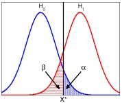

 $(a)$

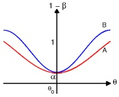

(b)

Figure 5.10: (a) Illustration of the Neyman-Pearson hypothesis testing paradigm. Generated by neyman-Pearson2.ipynb. (b) Two hypothetical two-sided power curves. B dominates A. Adapted from Figure 6.3.5 of [LM86]. Generated by twoPowerCurves.ipynb.

##### 5.4.4.2 VC dimension

If the hypothesis space  $\mathcal{H}$ is infinite (e.g., we have real-valued parameters), we cannot use  $\dim(\mathcal{H}) = |\mathcal{H}|$. Instead, we can use a quantity called the  $\mathbf{VC}$ dimension of the hypothesis class, named after Vapnik and Chervonenkis; this measures the degrees of freedom (effective number of parameters) of the hypothesis class. See e.g., [Vap98] for the details.

Unfortunately, it is hard to compute the VC dimension for many interesting models, and the upper bounds are usually very loose, making this approach of limited practical value. However, various other, more practical, estimates of generalization error have recently been devised, especially for DNNs, such as  $[Jia+20]$.

### 5.5 Frequentist hypothesis testing *

In this section, we discuss ways to determining if a hypothesis (model) is plausible or not, in the light of data D.

#### 5.5.1 Likelihood ratio test

When deciding if a model is a good description of some data or not, it is always useful to ask “relative to what”. To make this concrete, suppose we have two hypotheses, known as the null hypothesis  $H_0$ and an alternative hypothesis  $H_1$, and we want to choose the one we think is more likely. We can think of this as a binary classification problem, where  $H \in \{0, 1\}$ represents the identity of the “true” model. A natural approach is to use Bayesian model selection, as we discussed in Section 5.2.1, to compute  $p(H|\mathcal{D})$, and then to pick the most probable model. Here we discuss a frequentist approach.

Suppose we have a uniform prior, so  $p(H=0)=p(H=1)=0.5$, and that we use 0-1 loss. Then the optimal decision rule is to accept  $H_0$ iff  $\frac{p(\mathcal{D}|H_0)}{p(\mathcal{D}|H_1)}>1$. This is called the likelihood ratio test. We give some examples of this below.

##### 5.5.1.1 Example: comparing Gaussian means

Suppose we are interested in testing whether some data comes from a Gaussian with mean  $\mu_0$ or from a Gaussian with mean  $\mu_1$. (We assume a known shared variance  $\sigma^2$). This is illustrated in

---

Figure 5.10a, where we plot p(x|H0) and p(x|H1). We can derive the likelihood ratio as follows:

$$
\underline{p(\mathcal{D}|H_{0})}\underline{\quad}=\frac{\exp\left(-\frac{1}{2\sigma^{2}}\sum_{n=1}^{N}(x_{n}-\mu_{0})^{2}\right)}{}   \tag*{(5.98)}
$$

 
$$
p(\mathcal{D}|H_{1})\quad\overline{\quad}\exp\left(-\frac{1}{2\sigma^{2}}\sum_{n=1}^{N}(x_{n}-\mu_{1})^{2}\right)
$$
 

$$
=\exp\left(\frac{1}{2\sigma^{2}}(2N\overline{x}(\mu_{0}-\mu_{1})+N\mu_{1}^{2}-N\mu_{0}^{2})\right)   \tag*{(5.99)}
$$

We see that this ratio only depends on the observed data via its mean,  $\overline{x}$. From Figure 5.10a, we can see that  $\frac{p(\mathcal{D}|H_0)}{p(\mathcal{D}|H_1)} > 1$ iff  $\overline{x} < x^*$, where  $x^*$ is the point where the two pdf's intersect (we are assuming this point is unique).

##### 5.5.1.2 Simple vs compound hypotheses

In Section 5.5.1.1, the parameters for the null and alternative hypotheses were either fully specified ( $\mu_0$ and  $\mu_1$) or shared ( $\sigma^2$). This is called a simple hypothesis test. In general, a hypothesis might not fully specify all the parameters; this is called a compound hypothesis. In this case, we could integrate out these unknown parameters, as in the Bayesian approach, since a hypothesis with more parameters will always have higher likelihood. However, this can be computationally difficult, and is prone to problems caused by prior misspecification. As an alternative approach, we can “maximize out” the parameters, which gives us the maximum likelihood ratio test:

$$
\frac{p(H_{0}|\mathcal{D})}{p(H_{1}|\mathcal{D})}=\frac{\int_{\boldsymbol{\theta}\in H_{0}}p(\boldsymbol{\theta})p_{\boldsymbol{\theta}}(\mathcal{D})}{\int_{\boldsymbol{\theta}\in H_{1}}p(\boldsymbol{\theta})p_{\boldsymbol{\theta}}(\mathcal{D})}\approx\frac{\max_{\boldsymbol{\theta}\in H_{0}}p_{\boldsymbol{\theta}}(\mathcal{D})}{\max_{\boldsymbol{\theta}\in H_{1}}p_{\boldsymbol{\theta}}(\mathcal{D})}   \tag*{(5.100)}
$$

#### 5.5.2 Type I vs type II errors and the Neyman-Pearson lemma

Hypothesis testing is a kind of binary classification problem. As we discussed in Section 5.1.3, there are two kinds of error we can make, known as a false positive or type I error, which corresponds to accidentally accepting the alternative when the null is true (i.e.,  $p(\hat{H}=1|H=0)$), and a false negative or type II error, which corresponds to accidentally accepting the null when the alternative is true (i.e.,  $p(\hat{H}=0|H=1)$). The type I error rate  $\alpha$ is called the significance of the test. In our Gaussian mean example, we see from Figure 5.10a that the type I error rate is the vertical shaded blue area:

$$
\alpha(\mu_{0})=p(type\ I\ error)=p(reject\ H_{0}|H_{0}\ is\ true)   \tag*{(5.101)}
$$

$$
=p(\overline{X}(\tilde{\mathcal{D}})>x^{*}|\tilde{\mathcal{D}}\sim H_{0})   \tag*{(5.102)}
$$

$$
=p\left(\frac{\overline{X}-\mu_{0}}{\sigma/\sqrt{N}}>\frac{x^{*}-\mu_{0}}{\sigma/\sqrt{N}}\right)   \tag*{(5.103)}
$$

Hence  $x^* = z_\alpha \sigma / \sqrt{N} + \mu_0$, where  $z_\alpha$ is the upper  $\alpha$ quantile of the standard Normal. The type II error rate is denoted by  $\beta$, and is given by

$$
\beta(\mu_{1})=p(type\ II\ error)=p(accept\ H_{0}|H_{1}\ is\ true)=p(\overline{X}(\tilde{\mathcal{D}})<x^{*}|\tilde{\mathcal{D}}\sim H_{1})   \tag*{(5.104)}
$$

This is shown by the horizontal shaded red area in Figure 5.10a.

Author: Kevin P. Murphy. (C) MIT Press. CC-BY-NC-ND license

---

We define the power of a test as  $1 - \beta(\mu_1)$; this is the probability that we reject  $H_0$ given that  $H_1$ is true (i.e.,  $p(\hat{H} = 1|H = 1)$, which is the true positive rate). In other words, it is the ability to correctly recognize that the null hypothesis is wrong. Clearly the least power occurs if  $\mu_1 = \mu_0$ (so the curves overlap); in this case, we have  $1 - \beta(\mu_1) = \alpha(\mu_0)$. As  $\mu_1$ and  $\mu_0$ become further apart, the power approaches 1 (because the shaded red area gets smaller,  $\beta \to 0$). If we have two tests,  $A$ and  $B$, where power( $B) \geq power(A)$ for the same type I error rate, we say  $B$ dominates  $A$. See Figure 5.10b. A test with highest power under  $H_1$ amongst all tests with significance level  $\alpha$ is called a most powerful test. It turns out that the likelihood ratio test is a most powerful test, a result known as the Neyman-Pearson lemma.

#### 5.5.3 Null hypothesis significance testing (NHST) and p-values

In the above decision-theoretic (or Neyman-Pearson) approach to hypothesis testing, we had to specify a null hypothesis  $H_0$ as well as an alternative hypothesis  $H_1$ so that we can compute  $p(\mathcal{D}|H_0)$ and  $p(\mathcal{D}|H_1)$. In some cases, it is difficult to define an alternative hypothesis, and we just want to test if a simple null hypothesis is “plausible” given some data. To do this, we can define a test statistic test( $\mathcal{D}$), and then we can compare its observed value to the value we would expect if the data came from the null hypothesis, test( $\mathcal{D}$) where  $\mathcal{D} \sim H_0$. If the observed value is unexpected given  $H_0$, we reject the null hypothesis. To quantify this, we compute the probability of seeing a test value that is as large or larger than the observed value (assuming that larger values make  $H_1$ more likely). More precisely, we define the p-value to be the probability, under the null hypothesis, of observing a test statistic that is as large or larger than that actually observed:

$$
\operatorname{pval}\triangleq\operatorname{Pr}(\operatorname{test}(\tilde{\mathcal{D}})\geq\operatorname{test}(\mathcal{D})|\tilde{\mathcal{D}}\sim H_{0})   \tag*{(5.105)}
$$

In other words, pval ≃ Pr(test_null ≥ test_obs), where test_obs = test(ℛ) and test_null = test(ℛ), where ℛ ~ H₀ is hypothetical future data. Smaller values correspond to stronger evidence against H₀.

Traditionally we reject the null hypothesis if the p-value is less than  $\alpha = 0.05$; this is called the significance level of the test, and the whole approach is called null hypothesis significance testing or NHST. By construction, such a test will have a type I error rate (accidently rejecting the null when it is true) of value  $\alpha$. Note that this decision rule corresponds to picking decision threshold  $t^*$ such that  $\Pr(\text{test}(\widehat{\mathcal{D}}) \geq t^* | H_0) = \alpha$. If we set  $t^* = \text{test}(\mathcal{D})$, then  $\alpha$ will be equal to the observed p-value. Thus the p-value is the smallest value of  $\alpha$ for which we can reject  $H_0$.

We can compute the p-value using pval = 1 - Φ(test(D)), where Φ is the cdf of the sampling distribution of the test statistic. This is called a one-sided p-value. In some case it can be more appropriate to use a two-sided p-value of the form pval = Pr(test(D) ≥ test(D) | D ~ H₀) + Pr(test(D) ≤ -test(D) | D ~ H₀), where we have assumed test(D) ≥ 0. For example, suppose we use test(D) = (θ̂(D) - θ₀) / sθ̂(D), where θ₀ is the value for θ* given H₀, and θ̂ is the MLE; this is known as the Wald statistic. Based on the asymptotic normality of the MLE discussed in Section 4.7.2, we have that pval = Pr(|test(D)| > |test(D)| | H₀) ≈ Pr(|Z| > |test(D)|) = 2Φ(|test(D)|), where Z ∼ N(0, 1).

We see that, to compute the p-value, we need to compute the sampling distribution of the test statistic under the null hypothesis. Suppose we want to compare an empirical distribution or outcome to an expected (theoretical) distribution or outcome. In some cases we can use a large sample (Gaussian approximation) to the sampling distribution, as we illustrated above. If not, we can use a non-parametric bootstrap approximation. Another important case arises when we want to compare

---

two empirical distributions to test if they are the same; for this we can use the non-parametric permutation test, which makes no assumptions about the distribution. For example, suppose we have $m$samples$X_i$from$P_X$and$n$samples$Y_i$from$P_y$and the null hypothesis is$P_x = P_y$. Define the test statistic $\text{test}(X_1, \ldots, X_m, Y_1, \ldots, Y_n) = |\overline{X} - \overline{Y}|$. If we permute the order of the samples, then, under $H_0$, this statistic should not change. So we can sample random permutations to approximate $p(\text{test}(\overline{D})|\overline{D} \sim H_0)$, from which we can compute the tail probability of test($\overline{D}$) computed using the unshuffled data. For more details, see e.g. [Was04, p162].

Note that a p-value of 0.05 does not mean that the alternative hypothesis  $H_1$ is true with probability 0.95. Indeed, even most scientists misinterpret p-values. $^4$ The quantity that most people want to compute is the Bayesian posterior  $p(H|\mathcal{D})$. For more on this important distinction, see Section 5.5.4.

#### 5.5.4 p-values considered harmful

A p-value is often interpreted as the likelihood of the data under the null hypothesis, so small values are interpreted to mean that  $H_{0}$ is unlikely, and therefore that  $H_{1}$ is likely. The reasoning is roughly as follows:

If  $H_{0}$ is true, then this test statistic would probably not occur. This statistic did occur. Therefore  $H_{0}$ is probably false.

However, this is invalid reasoning. To see why, consider the following example (from [Coh94]):

If a person is an American, then he is probably not a member of Congress. This person is a member of Congress. Therefore he is probably not an American.

This is obviously fallacious reasoning. By contrast, the following logical argument is valid reasoning:

If a person is a Martian, then he is not a member of Congress. This person is a member of Congress. Therefore he is not a Martian.

The difference between these two cases is that the Martian example is using \textit{deduction}, that is, reasoning forward from logical definitions to their consequences. More precisely, this example uses a rule from logic called \textit{modus tollens}, in which we start out with a definition of the form  $P \Rightarrow Q$; when we observe  $\neg Q$, we can conclude  $\neg P$. By contrast, the American example concerns induction, that is, reasoning backwards from observed evidence to probable (but not necessarily true) causes using statistical regularities, not logical definitions.

To perform induction, we need to use probabilistic inference (as explained in detail in  $[Jay03]$). In particular, to compute the probability of the null hypothesis, we should use Bayes rule, as follows:

$$
p(H_{0}|\mathcal{D})=\frac{p(\mathcal{D}|H_{0})p(H_{0})}{p(\mathcal{D}|H_{0})p(H_{0})+p(\mathcal{D}|H_{1})p(H_{1})}   \tag*{(5.106)}
$$

If the prior is uniform, so  $p(H_0) = p(H_1) = 0.5$, this can be rewritten in terms of the likelihood ratio  $LR = p(\mathcal{D}|H_0)/p(\mathcal{D}|H_1)$ as follows:

$$
p(H_{0}|\mathcal{D})=\frac{LR}{LR+1}   \tag*{(5.107)}
$$

---

<table border=1 style='margin: auto; word-wrap: break-word;'><tr><td style='text-align: center; word-wrap: break-word;'></td><td style='text-align: center; word-wrap: break-word;'>Ineffective</td><td style='text-align: center; word-wrap: break-word;'>Effective</td><td style='text-align: center; word-wrap: break-word;'></td></tr><tr><td style='text-align: center; word-wrap: break-word;'>“Not significant”</td><td style='text-align: center; word-wrap: break-word;'>171</td><td style='text-align: center; word-wrap: break-word;'>4</td><td style='text-align: center; word-wrap: break-word;'>175</td></tr><tr><td style='text-align: center; word-wrap: break-word;'>“Significant”</td><td style='text-align: center; word-wrap: break-word;'>9</td><td style='text-align: center; word-wrap: break-word;'>16</td><td style='text-align: center; word-wrap: break-word;'>25</td></tr><tr><td style='text-align: center; word-wrap: break-word;'></td><td style='text-align: center; word-wrap: break-word;'>180</td><td style='text-align: center; word-wrap: break-word;'>20</td><td style='text-align: center; word-wrap: break-word;'>200</td></tr></table>

Table 5.8: Some statistics of a hypothetical clinical trial. Source: [SAM04, p74].

In the American Congress example, $\mathcal{D}$is the observation that the person is a member of Congress. The null hypothesis$H_0$is that the person is American, and the alternative hypothesis$H_1$is that the person is not American. We assume that$p(\mathcal{D}|H_0)$is low, since most Americans are not members of Congress. However,$p(\mathcal{D}|H_1)$is also low — in fact, in this example, it is 0, since only Americans can be members of Congress. Hence$LR = \infty$, so $p(H_0|D) = 1.0$, as intuition suggests. Note, however, that NHST ignores $p(\mathcal{D}|H_1)$as well as the prior$p(H_0)$, so it gives the wrong results — not just in this problem, but in many problems.

In general there can be huge differences between p-values and  $p(H_0|\mathcal{D})$. In particular, [SBB01] show that even if the p-value is as low as 0.05, the posterior probability of  $H_0$ can be as high as 30% or more, even with a uniform prior.

Consider this concrete example from [SAM04, p74]. Suppose 200 clinical trials are carried out for some drug, and we get the data in Table 5.8. Suppose we perform a statistical test of whether the drug has a significant effect or not. The test has a type I error rate of  $\alpha = 9/180 = 0.05$ and a type II error rate of  $\beta = 4/20 = 0.2$.

We can compute the probability that the drug is not effective, given that the result is supposedly “significant”, as follows:

$$
p(H_{0}|^{\prime}significant^{\prime})=\frac{p(^{\prime}significant^{\prime}|H_{0})p(H_{0})}{p(^{\prime}significant^{\prime}|H_{0})p(H_{0})+p(^{\prime}significant^{\prime}|H_{1})p(H_{1})}   \tag*{(5.108)}
$$

$$
\underline{{\phantom{x}}}\qquad\qquad p(\mathrm{t y p e~I~e r r o r})p(H_{0})   \tag*{(5.109)}
$$

 
$$
p(\mathrm{type~I~error})p(H_{0})+(1-p(\mathrm{type~II~error}))p(H_{1})
$$
 

$$
=\frac{\alpha p(H_{0})}{\alpha p(H_{0})+(1-\beta)p(H_{1})}   \tag*{(5.110)}
$$

If we have prior knowledge, based on past experience, that most (say 90%) drugs are ineffective, then we find  $p(H_0|\text{significant}) = 0.36$, which is much more than the 5% probability people usually associate with a p-value of  $\alpha = 0.05$.

Thus we should distrust claims of statistical significance if they violate our prior knowledge.

#### 5.5.5 Why isn't everyone a Bayesian?

In Section 4.7.5 and Section 5.5.4, we have seen that inference based on frequentist principles can exhibit various forms of counter-intuitive behavior that can sometimes contradict common sense reason, as has been pointed out in multiple articles (see e.g., [Mat98; MS11; Kru13; Gel16; Hoe14; Lyu15; Cha16b; Cla21]).

The fundamental reason for these problems is that frequentist inference violates the likelihood principle [BW88], which says that inference should be based on the likelihood of the observed data,

---

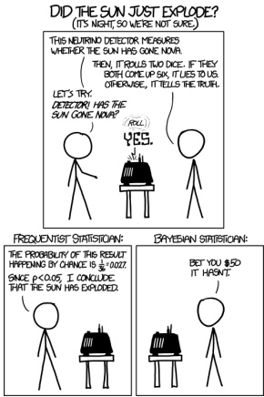

Figure 5.11: Cartoon illustrating the difference between frequentists and Bayesians. (The p < 0.05 comment is explained in Section 5.5.4. The betting comment is a reference to the Dutch book theorem, which essentially proves that the Bayesian approach to gambling (and other decision theory problems) is optimal, as explained in e.g., [Háj08].) From https://zkcd.com/1132/. Used with kind permission of Rundall Munroe (author of xkcd).

not on hypothetical future data that you have not observed. Bayes obviously satisfies the likelihood principle, and consequently does not suffer from these pathologies.

Given these fundamental flaws of frequentist statistics, and the fact that Bayesian methods do not have such flaws, an obvious question to ask is: “Why isn’t everyone a Bayesian?” The (frequentist) statistician Bradley Efron wrote a paper with exactly this title [Efr86]. His short paper is well worth reading for anyone interested in this topic. Below we quote his opening section:

The title is a reasonable question to ask on at least two counts. First of all, everyone used to be a Bayesian. Laplace wholeheartedly endorsed Bayes's formulation of the inference problem, and most 19th-century scientists followed suit. This included Gauss, whose statistical work is usually presented in frequentist terms.

A second and more important point is the cogency of the Bayesian argument. Modern statisticians, following the lead of Savage and de Finetti, have advanced powerful theoretical arguments for preferring Bayesian inference. A byproduct of this work is a disturbing catalogue of inconsistencies in the frequentist point of view.

Nevertheless, everyone is not a Bayesian. The current era (1986) is the first century in which statistics has been widely used for scientific reporting, and in fact, 20th-century statistics is mainly non-Bayesian. However, Lindley (1975) predicts a change for the 21st century.

Time will tell whether Lindley was right. However, the trends seem to be going in this direction.

Author: Kevin P. Murphy. (C) MIT Press. CC-BY-NC-ND license

---

For example, some journals have banned p-values [TM15; AGM19], and the journal The American Statistician (produced by the American Statistical Association) published a whole special issue warning about the use of p-values and NHST [WSL19].

Traditionally, computation has been a barrier to using Bayesian methods, but this is less of an issue these days, due to faster computers and better algorithms (which we will discuss in the sequel to this book, [Mur23]). Another, more fundamental, concern is that the Bayesian approach is only as correct as its modeling assumptions. However, this criticism also applies to frequentist methods, since the sampling distribution of an estimator must be derived using assumptions about the data generating mechanism. (In fact [BT73] show that the sampling distributions for the MLE for common models are identical to the posterior distributions under a noninformative prior.) Fortunately, we can check modeling assumptions empirically using cross validation (Section 4.5.5), calibration, and Bayesian model checking. We discuss these topics in the sequel to this book, [Mur23].

To summarize, it is worth quoting Donald Rubin, who wrote a paper [Rub84] called “Bayesianly Justifiable and Relevant Frequency Calculations for the Applied Statistician”. In it, he writes

The applied statistician should be Bayesian in principle and calibrated to the real world in practice. [They] should attempt to use specifications that lead to approximately calibrated procedures under reasonable deviations from [their assumptions]. [They] should avoid models that are contradicted by observed data in relevant ways — frequency calculations for hypothetical replications can model a model's adequacy and help to suggest more appropriate models.

### 5.6 Exercises

##### Exercise 5.1 [Reject option in classifiers]

(Source: [DHS01, Q2.13].) In many classification problems one has the option either of assigning x to class j or, if you are too uncertain, of choosing the reject option. If the cost for rejects is less than the cost of falsely classifying the object, it may be the optimal action. Let  $\alpha_i$ mean you choose action i, for  $i = 1 : C + 1$, where C is the number of classes and  $C + 1$ is the reject action. Let Y = j be the true (but unknown) state of nature. Define the loss function as follows

$$
\lambda(\alpha_{i}|Y=j)=\left\{\begin{array}{cc}0&\text{if}i=j\text{and}i,j\in\{1,\ldots,C\}\\ \lambda_{r}&\text{if}i=C+1\\ \lambda_{s}&\text{otherwise}\end{array}\right.   \tag*{(5.111)}
$$

In other words, you incur 0 loss if you correctly classify, you incur  $\lambda_{r}$ loss (cost) if you choose the reject option, and you incur  $\lambda_{s}$ loss (cost) if you make a substitution error (misclassification).

a. Show that the minimum risk is obtained if we decide  $Y = j$ if  $p(Y = j | \boldsymbol{x}) \geq p(Y = k | \boldsymbol{x})$ for all  $k$ (i.e.,  $j$ is the most probable class) and if  $p(Y = j | \boldsymbol{x}) \geq 1 - \frac{\lambda_r}{\lambda_s}$; otherwise we decide to reject.

b. Describe qualitatively what happens as  $\lambda_{r}/\lambda_{s}$ is increased from 0 to 1 (i.e., the relative cost of rejection increases).

##### Exercise 5.2 [Newsvendor problem  $\dagger$]

Consider the following classic problem in decision theory / economics. Suppose you are trying to decide how much quantity Q of some product (e.g., newspapers) to buy to maximize your profits. The optimal amount will depend on how much demand D you think there is for your product, as well as its cost to you C and its selling price P. Suppose D is unknown but has pdf  $f(D)$ and cdf  $F(D)$. We can evaluate the expected profit by considering two cases: if D > Q, then we sell all Q items, and make profit  $\pi = (P - C)Q$; but if D < Q,

---

we only sell D items, at profit  $(P - C)D$, but have wasted  $C(Q - D)$ on the unsold items. So the expected profit if we buy quantity Q is

$$
E\pi(Q)=\int_{Q}^{\infty}(P-C)Qf(D)dD+\int_{0}^{Q}(P-C)Df(D)dD-\int_{0}^{Q}C(Q-D)f(D)dD   \tag*{(5.112)}
$$

Simplify this expression, and then take derivatives wrt Q to show that the optimal quantity  $Q^{*}$ (which maximizes the expected profit) satisfies

$$
F(Q^{*})=\frac{P-C}{P}   \tag*{(5.113)}
$$

Exercise 5.3 [Bayes factors and ROC curves †]

Let  $B = p(D|H_1)/p(D|H_0)$ be the Bayes factor in favor of model 1. Suppose we plot two ROC curves, one computed by thresholding  $B$, and the other computed by thresholding  $p(H_1|D)$. Will they be the same or different? Explain why.

Exercise 5.4 [Posterior median is optimal estimate under L1 loss]

Prove that the posterior median is the optimal estimate under L1 loss.

---

---

## 6 Information Theory

In this chapter, we introduce a few basic concepts from the field of information theory. More details can be found in other books such as [Mac03; CT06], as well as the sequel to this book, [Mur23].

### 6.1 Entropy

The entropy of a probability distribution can be interpreted as a measure of uncertainty, or lack of predictability, associated with a random variable drawn from a given distribution, as we explain below.

We can also use entropy to define the information content of a data source. For example, suppose we observe a sequence of symbols  $X_n \sim p$ generated from distribution p. If p has high entropy, it will be hard to predict the value of each observation  $X_n$. Hence we say that the dataset  $\mathcal{D} = (X_1, \ldots, X_n)$ has high information content. By contrast, if p is a degenerate distribution with 0 entropy (the minimal value), then every  $X_n$ will be the same, so  $\mathcal{D}$ does not contain much information. (All of this can be formalized in terms of data compression, as we discuss in the sequel to this book.)

#### 6.1.1 Entropy for discrete random variables

The entropy of a discrete random variable X with distribution p over K states is defined by

$$
\mathbb{H}\left(X\right)\triangleq-\sum_{k=1}^{K}p(X=k)\log_{2}p(X=k)=-\mathbb{E}_{X}\left[\log p(X)\right]   \tag*{(6.1)}
$$

(Note that we use the notation  $\mathbb{H}(X)$ to denote the entropy of the rv with distribution  $p$, just as people write  $\mathbb{V}[X]$ to mean the variance of the distribution associated with  $X$; we could alternatively write  $\mathbb{H}(p)$.) Usually we use log base 2, in which case the units are called  $\text{bits}$ (short for binary digits). For example, if  $X \in \{1, \ldots, 5\}$ with histogram distribution  $p = [0.25, 0.25, 0.2, 0.15, 0.15]$, we find  $H = 2.29$ bits. If we use log base  $e$, the units are called  $\text{nats}$.

The discrete distribution with maximum entropy is the uniform distribution. Hence for a K-ary random variable, the entropy is maximized if  $p(x = k) = 1/K$; in this case,  $\mathbb{H}(X) = \log_2 K$. To see this, note that

$$
\mathbb{H}\left(X\right)=-\sum_{k=1}^{K}\frac{1}{K}\log(1/K)=-\log(1/K)=\log(K)   \tag*{(6.2)}
$$

---

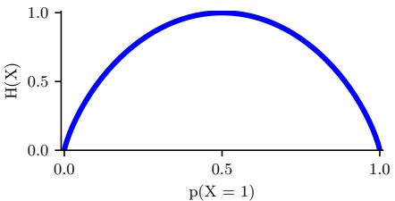

Figure 6.1: Entropy of a Bernoulli random variable as a function of  $\theta$. The maximum entropy is  $\log_{2}2=1$. Generated by bernoulli_entropy_fig.ipynb.

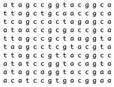

 $(a)$

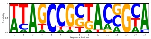

(b)

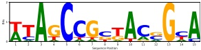

(c)

Figure 6.2: (a) Some aligned DNA sequences. Each row is a sequence, each column is a location within the sequence. (b) The corresponding position weight matrix, visualized as a sequence of histograms. Each column represents a probability distribution over the alphabet  $\{A, C, G, T\}$ for the corresponding location in the sequence. The size of the letter is proportional to the probability. (c) A sequence logo. See text for details. Generated by seq_logo_demo.ipynb.

Conversely, the distribution with minimum entropy (which is zero) is any delta-function that puts all its mass on one state. Such a distribution has no uncertainty.

For the special case of binary random variables,  $X \in \{0,1\}$, we can write  $p(X = 1) = \theta$ and  $p(X = 0) = 1 - \theta$. Hence the entropy becomes

$$
\begin{aligned}\mathbb{H}\left(X\right)&=-\left[p(X=1)\log_{2}p(X=1)+p(X=0)\log_{2}p(X=0)\right]\\&=-\left[\theta\log_{2}\theta+(1-\theta)\log_{2}(1-\theta)\right]\end{aligned}   \tag*{(6.3)}
$$

This is called the binary entropy function, and is also written  $\mathbb{H}(\theta)$. We plot this in Figure 6.1. We see that the maximum value of 1 bit occurs when the distribution is uniform,  $\theta = 0.5$. A fair coin requires a single yes/no question to determine its state.

## 6. $^{1}$

As an interesting application of entropy, consider the problem of representing DNA sequence motifs, which is a distribution over short DNA strings. We can estimate this distribution by aligning a set of DNA sequences (e.g., from different species), and then estimating the empirical distribution of each possible nucleotide from the 4 letter alphabet  $X \sim \{A, C, G, T\}$ at each location t in the ith

---

sequence as follows:

$$
\mathbf{N}_{t}=\left(\sum_{i=1}^{N}\mathbb{I}\left(X_{it}=A\right),\sum_{i=1}^{N}\mathbb{I}\left(X_{it}=C\right),\sum_{i=1}^{N}\mathbb{I}\left(X_{it}=G\right),\sum_{i=1}^{N}\mathbb{I}\left(X_{it}=T\right)\right)   \tag*{(6.5)}
$$

$$
\hat{\boldsymbol{\theta}}_{t}=\mathbf{N}_{t}/N,   \tag*{(6.6)}
$$

This  $N_t$ is a length four vector counting the number of times each letter appears at each location amongst the set of sequences. This  $\hat{\theta}_t$ distribution is known as a position weight matrix or a sequence motif. We can visualize this as shown in Figure 6.2b. Here we plot the letters A, C, G and T, where the size of letter  $k$ at location  $t$ is proportional to the empirical frequency  $\theta_{tk}$.

An alternative visualization, known as a sequence logo, is shown in Figure 6.2c. Each column is scaled by  $R_t = 2 - H_t$, where  $H_t$ is the entropy of  $\hat{\theta}_t$, and  $2 = \log_2(4)$ is the maximum possible entropy for a distribution over 4 letters. Thus a deterministic distribution, which has entropy 0 and thus maximal information content, has height 2. Such informative locations are highly conserved by evolution, often because they are part of a gene coding region. We can also just compute the most probable letter in each location, regardless of the uncertainty; this is called the consensus sequence.

##### 6.1.1.2 Estimating entropy

Estimating the entropy of a random variable with many possible states requires estimating its distribution, which can require a lot of data. For example, imagine if X represents the identity of a word in an English document. Since there is a long tail of rare words, and since new words are invented all the time, it can be difficult to reliably estimate  $p(X)$ and hence  $\mathbb{H}(X)$. For one possible solution to this problem, see [VV13].

#### 6.1.2 Cross entropy

The cross entropy between distribution p and q is defined by

$$
\mathbb{H}_{c e}(p,q)\triangleq-\sum_{k=1}^{K}p_{k}\log q_{k}   \tag*{(6.7)}
$$

One can show that the cross entropy is the expected number of bits needed to compress some data samples drawn from distribution p using a code based on distribution q. This can be minimized by setting $q = p$, in which case the expected number of bits of the optimal code is $\mathbb{H}_{ce}(p, p) = \mathbb{H}(p)$ — this is known as Shannon's source coding theorem (see e.g., [CT06]).

#### 6.1.3 Joint entropy

The joint entropy of two random variables X and Y is defined as

$$
\mathbb{H}\left(X,Y\right)=-\sum_{x,y}p(x,y)\log_{2}p(x,y)   \tag*{(6.8)}
$$

Author: Kevin P. Murphy. (C) MIT Press. CC-BY-NC-ND license

---

For example, consider choosing an integer from 1 to 8,  $n \in \{1, \ldots, 8\}$. Let  $X(n) = 1$ if n is even, and  $Y(n) = 1$ if n is prime:

<table border=1 style='margin: auto; word-wrap: break-word;'><tr><td style='text-align: center; word-wrap: break-word;'>n</td><td style='text-align: center; word-wrap: break-word;'>1</td><td style='text-align: center; word-wrap: break-word;'>2</td><td style='text-align: center; word-wrap: break-word;'>3</td><td style='text-align: center; word-wrap: break-word;'>4</td><td style='text-align: center; word-wrap: break-word;'>5</td><td style='text-align: center; word-wrap: break-word;'>6</td><td style='text-align: center; word-wrap: break-word;'>7</td><td style='text-align: center; word-wrap: break-word;'>8</td></tr><tr><td style='text-align: center; word-wrap: break-word;'>X</td><td style='text-align: center; word-wrap: break-word;'>0</td><td style='text-align: center; word-wrap: break-word;'>1</td><td style='text-align: center; word-wrap: break-word;'>0</td><td style='text-align: center; word-wrap: break-word;'>1</td><td style='text-align: center; word-wrap: break-word;'>0</td><td style='text-align: center; word-wrap: break-word;'>1</td><td style='text-align: center; word-wrap: break-word;'>0</td><td style='text-align: center; word-wrap: break-word;'>1</td></tr><tr><td style='text-align: center; word-wrap: break-word;'>Y</td><td style='text-align: center; word-wrap: break-word;'>0</td><td style='text-align: center; word-wrap: break-word;'>1</td><td style='text-align: center; word-wrap: break-word;'>1</td><td style='text-align: center; word-wrap: break-word;'>0</td><td style='text-align: center; word-wrap: break-word;'>1</td><td style='text-align: center; word-wrap: break-word;'>0</td><td style='text-align: center; word-wrap: break-word;'>1</td><td style='text-align: center; word-wrap: break-word;'>0</td></tr></table>

The joint distribution is

<table border=1 style='margin: auto; word-wrap: break-word;'><tr><td style='text-align: center; word-wrap: break-word;'>p(X,Y)</td><td style='text-align: center; word-wrap: break-word;'>Y=0</td><td style='text-align: center; word-wrap: break-word;'>Y=1</td></tr><tr><td style='text-align: center; word-wrap: break-word;'>X=0</td><td style='text-align: center; word-wrap: break-word;'>1/8</td><td style='text-align: center; word-wrap: break-word;'>3/8</td></tr><tr><td style='text-align: center; word-wrap: break-word;'>X=1</td><td style='text-align: center; word-wrap: break-word;'>3/8</td><td style='text-align: center; word-wrap: break-word;'>1/8</td></tr></table>

so the joint entropy is given by

$$
\mathbb{H}\left(X,Y\right)=-\left[\frac{1}{8}\log_{2}\frac{1}{8}+\frac{3}{8}\log_{2}\frac{3}{8}+\frac{3}{8}\log_{2}\frac{3}{8}+\frac{1}{8}\log_{2}\frac{1}{8}\right]=1.81bits   \tag*{(6.9)}
$$

Clearly the marginal probabilities are uniform:  $p(X = 1) = p(X = 0) = p(Y = 0) = p(Y = 1) = 0.5$, so  $\mathbb{H}(X) = \mathbb{H}(Y) = 1$. Hence  $\mathbb{H}(X, Y) = 1.81$ bits  $< \mathbb{H}(X) + \mathbb{H}(Y) = 2$ bits. In fact, this upper bound on the joint entropy holds in general. If X and Y are independent, then  $\mathbb{H}(X, Y) = \mathbb{H}(X) + \mathbb{H}(Y)$, so the bound is tight. This makes intuitive sense: when the parts are correlated in some way, it reduces the “degrees of freedom” of the system, and hence reduces the overall entropy.

What is the lower bound on  $\mathbb{H}(X,Y)$? If  $Y$ is a deterministic function of  $X$, then  $\mathbb{H}(X,Y) = \mathbb{H}(X)$. So

$$
\mathbb{H}\left(X,Y\right)\geq\max\left\{\mathbb{H}\left(X\right),\mathbb{H}\left(Y\right)\right\}\geq0   \tag*{(6.10)}
$$

Intuitively this says combining variables together does not make the entropy go down: you cannot reduce uncertainty merely by adding more unknowns to the problem, you need to observe some data, a topic we discuss in Section 6.1.4.

We can extend the definition of joint entropy from two variables to n in the obvious way.

#### 6.1.4 Conditional entropy

The conditional entropy of Y given X is the uncertainty we have in Y after seeing X, averaged over possible values for X:

$$
\mathbb{H}\left(Y|X\right)\triangleq\mathbb{E}_{p(X)}\left[\mathbb{H}\left(p(Y|X)\right)\right]   \tag*{(6.11)}
$$

$$
=\sum_{x}p(x)\mathbb{H}\left(p(Y|X=x)\right)=-\sum_{x}p(x)\sum_{y}p(y|x)\log p(y|x)   \tag*{(6.12)}
$$

$$
=-\sum_{x,y}p(x,y)\log p(y|x)=-\sum_{x,y}p(x,y)\log\frac{p(x,y)}{p(x)}   \tag*{(6.13)}
$$

$$
=-\sum_{x,y}p(x,y)\log p(x,y)+\sum_{x}p(x)\log p(x)   \tag*{(6.14)}
$$

$$
=\mathbb{H}\left(X,Y\right)-\mathbb{H}\left(X\right)   \tag*{(6.15)}
$$

If Y is a deterministic function of X, then knowing X completely determines Y, so  $\mathbb{H}(Y|X)=0$. If X and Y are independent, knowing X tells us nothing about Y and  $\mathbb{H}(Y|X)=\mathbb{H}(Y)$. Since

---

 $\mathbb{H}(X,Y) \leq \mathbb{H}(Y) + \mathbb{H}(X)$, we have

$$
\mathbb{H}\left(Y|X\right)\leq\mathbb{H}\left(Y\right)   \tag*{(6.16)}
$$

with equality iff X and Y are independent. This shows that, on average, conditioning on data never increases one's uncertainty. The caveat “on average” is necessary because for any particular observation (value of X), one may get more “confused” (i.e.,  $\mathbb{H}(Y|x) > \mathbb{H}(Y)$). However, in expectation, looking at the data is a good thing to do. (See also Section 6.3.8.)

We can rewrite Equation (6.15) as follows:

$$
\mathbb{H}\left(X_{1},X_{2}\right)=\mathbb{H}\left(X_{1}\right)+\mathbb{H}\left(X_{2}|X_{1}\right)   \tag*{(6.17)}
$$

This can be generalized to get the chain rule for entropy:

$$
\mathbb{H}\left(X_{1},X_{2},\cdots,X_{n}\right)=\sum_{i=1}^{n}\mathbb{H}\left(X_{i}|X_{1},\cdots,X_{i-1}\right)   \tag*{(6.18)}
$$

#### 6.1.5 Perplexity

The perplexity of a discrete probability distribution p is defined as

$$
\mathrm{p e r p l e x i t y}(p)\triangleq2^{\mathbb{H}(p)}   \tag*{(6.19)}
$$

This is often interpreted as a measure of predictability. For example, suppose p is a uniform distribution over K states. In this case, the perplexity is K. Obviously the lower bound on perplexity is  $2^{0} = 1$, which will be achieved if the distribution can perfectly predict outcomes.

Now suppose we have an empirical distribution based on data D:

$$
p_{\mathcal{D}}(x|\mathcal{D})=\frac{1}{N}\sum_{n=1}^{N}\delta(x-x_{n})   \tag*{(6.20)}
$$

We can measure how well p predicts D by computing

$$
\mathrm{p e r p l e x i t y}(p_{\mathcal{D}},p)\triangleq2^{\mathbb{H}_{c e}(p_{\mathcal{D}},p)}   \tag*{(6.21)}
$$

Perplexity is often used to evaluate the quality of statistical language models, which is a generative model for sequences of tokens. Suppose the data is a single long document x of length N, and suppose p is a simple unigram model. In this case, the cross entropy term is given by

$$
H=-\frac{1}{N}\sum_{n=1}^{N}\log p(x_{n})   \tag*{(6.22)}
$$

and hence the perplexity is given by

$$
perplexity(p_{\mathcal{D}},p)=2^{H}=2^{-\frac{1}{N}\log(\prod_{n=1}^{N}p(x_{n}))}=\sqrt[N]{\prod_{n=1}^{N}\frac{1}{p(x_{n})}}   \tag*{(6.23)}
$$

Author: Kevin P. Murphy. (C) MIT Press. CC-BY-NC-ND license

---

This is sometimes called the exponentiated cross entropy. We see that this is the geometric mean of the inverse predictive probabilities.

In the case of language models, we usually condition on previous words when predicting the next word. For example, in a bigram model, we use a first order Markov model of the form  $p(x_i | x_{i-1})$. We define the branching factor of a language model as the number of possible words that can follow any given word. We can thus interpret the perplexity as the weighted average branching factor. For example, suppose the model predicts that each word is equally likely, regardless of context, so  $p(x_i | x_{i-1}) = 1/K$. Then the perplexity is  $(1/(K)^N)^{-1/N} = K$. If some symbols are more likely than others, and the model correctly reflects this, its perplexity will be lower than  $K$. However, as we show in Section 6.2, we have  $\mathbb{H}(p^*) \leq \mathbb{H}_{ce}(p^*, p)$, so we can never reduce the perplexity below the entropy of the underlying stochastic process  $p^*$.

See [JM08, p96] for further discussion of perplexity and its uses in language models.

#### 6.1.6 Differential entropy for continuous random variables *

If X is a continuous random variable with pdf p(x), we define the differential entropy as

$$
h(X)\triangleq-\int_{\mathcal{X}}p(x)\log p(x)dx   \tag*{(6.24)}
$$

assuming this integral exists. For example, suppose  $X \sim U(0, a)$. Then

$$
h(X)=-\int_{0}^{a}dx\frac{1}{a}\log\frac{1}{a}=\log a   \tag*{(6.25)}
$$

Note that, unlike the discrete case, differential entropy can be negative. This is because pdf’s can be bigger than 1. For example if  $X \sim U(0,1/8)$, we have  $h(X) = \log_2(1/8) = -3$.

One way to understand differential entropy is to realize that all real-valued quantities can only be represented to finite precision. It can be shown  $[CT91, p228]$ that the entropy of an  $n$-bit quantization of a continuous random variable  $X$ is approximately  $h(X) + n$. For example, suppose  $X \sim U(0, \frac{1}{8})$. Then in a binary representation of  $X$, the first 3 bits to the right of the binary point must be 0 (since the number is  $\leq 1/8$). So to describe  $X$ to  $n$ bits of accuracy only requires  $n - 3$ bits, which agrees with  $h(X) = -3$ calculated above.

##### 6.1.6.1 Example: Entropy of a Gaussian

The entropy of a d-dimensional Gaussian is

$$
h(\mathcal{N}(\boldsymbol{\mu},\boldsymbol{\Sigma}))=\frac{1}{2}\ln|2\pi e\boldsymbol{\Sigma}|=\frac{1}{2}\ln[(2\pi e)^{d}|\boldsymbol{\Sigma}|]=\frac{d}{2}+\frac{d}{2}\ln(2\pi)+\frac{1}{2}\ln|\boldsymbol{\Sigma}|   \tag*{(6.26)}
$$

In the 1d case, this becomes

$$
h(\mathcal{N}(\mu,\sigma^{2}))=\frac{1}{2}\ln\left[2\pi e\sigma^{2}\right]   \tag*{(6.27)}
$$

---

##### 6.1.6.2 Connection with variance

The entropy of a Gaussian increases monotonically as the variance increases. However, this is not always the case. For example, consider a mixture of two 1d Gaussians centered at -1 and +1. As we move the means further apart, say to -10 and +10, the variance increases (since the average distance from the overall mean gets larger). However, the entropy remains more or less the same, since we are still uncertain about where a sample might fall, even if we know that it will be near -10 or +10. (The exact entropy of a GMM is hard to compute, but a method to compute upper and lower bounds is presented in [Hub+08].)

##### 6.1.6.3 Discretization

In general, computing the differential entropy for a continuous random variable can be difficult. A simple approximation is to discretize or quantize the variables. There are various methods for this (see e.g., [DKS95; KK06] for a summary), but a simple approach is to bin the distribution based on its empirical quantiles. The critical question is how many bins to use [LM04]. Scott [Sco79] suggested the following heuristic:

$$
B=N^{1/3}\frac{\max(\mathcal{D})-\min(\mathcal{D})}{3.5\sigma(\mathcal{D})}   \tag*{(6.28)}
$$

where  $\sigma(\mathcal{D})$ is the empirical standard deviation of the data, and  $N = |\mathcal{D}|$ is the number of datapoints in the empirical distribution. However, the technique of discretization does not scale well if X is a multi-dimensional random vector, due to the curse of dimensionality.

### 6.2 Relative entropy (KL divergence)  $^{*}$

Given two distributions  $p$ and  $q$, it is often useful to define a distance metric to measure how “close” or “similar” they are. In fact, we will be more general and consider a divergence measure  $D(p, q)$ which quantifies how far  $q$ is from  $p$, without requiring that  $D$ be a metric. More precisely, we say that  $D$ is a divergence if  $D(p, q) \geq 0$ with equality iff  $p = q$, whereas a metric also requires that  $D$ be symmetric and satisfy the triangle inequality,  $D(p, r) \leq D(p, q) + D(q, r)$. There are many possible divergence measures we can use. In this section, we focus on the Kullback-Leibler divergence or KL divergence, also known as the information gain or relative entropy, between two distributions  $p$ and  $q$.

#### 6.2.1 Definition

For discrete distributions, the KL divergence is defined as follows:

$$
D_{\mathbb{K L}}\left(p\parallel q\right)\triangleq\sum_{k=1}^{K}p_{k}\log\frac{p_{k}}{q_{k}}   \tag*{(6.29)}
$$

This naturally extends to continuous distributions as well:

$$
D_{\mathbb{K L}}\left(p\parallel q\right)\triangleq\int d x p(x)\log\frac{p(x)}{q(x)}   \tag*{(6.30)}
$$

Author: Kevin P. Murphy. (C) MIT Press. CC-BY-NC-ND license

---

#### 6.2.2 Interpretation

We can rewrite the KL as follows:

$$
D_{\mathbb{K L}}\left(p\parallel q\right)=\underbrace{\sum_{k=1}^{K}p_{k}\log p_{k}}_{-\mathbb{H}(p)}\underbrace{-\sum_{k=1}^{K}p_{k}\log q_{k}}_{\mathbb{H}_{c e}(p,q)}   \tag*{(6.31)}
$$

We recognize the first term as the negative entropy, and the second term as the cross entropy. It can be shown that the cross entropy  $\mathbb{H}_{ce}(p,q)$ is a lower bound on the number of bits needed to compress data coming from distribution p if your code is designed based on distribution q; thus we can interpret the KL divergence as the “extra number of bits” you need to pay when compressing data samples if you use the incorrect distribution q as the basis of your coding scheme compared to the true distribution p.

There are various other interpretations of KL divergence. See the sequel to this book, [Mur23], for more information.

#### 6.2.3 Example: KL divergence between two Gaussians

For example, one can show that the KL divergence between two multivariate Gaussian distributions is given by

$$
\begin{aligned}&D_{\mathbb{K L}}\left(\mathcal{N}(\boldsymbol{x}|\boldsymbol{\mu}_{1},\boldsymbol{\Sigma}_{1})\parallel\mathcal{N}(\boldsymbol{x}|\boldsymbol{\mu}_{2},\boldsymbol{\Sigma}_{2})\right)\\&=\frac{1}{2}\left[\mathrm{t r}(\boldsymbol{\Sigma}_{2}^{-1}\boldsymbol{\Sigma}_{1})+(\boldsymbol{\mu}_{2}-\boldsymbol{\mu}_{1})^{\mathsf{T}}\boldsymbol{\Sigma}_{2}^{-1}(\boldsymbol{\mu}_{2}-\boldsymbol{\mu}_{1})-D+\log\left(\frac{\operatorname{d e t}(\boldsymbol{\Sigma}_{2})}{\operatorname{d e t}(\boldsymbol{\Sigma}_{1})}\right)\right]\\ \end{aligned}   \tag*{(6.32)}
$$

In the scalar case, this becomes

$$
D_{\mathbb{K L}}\left(\mathcal{N}(x|\mu_{1},\sigma_{1})\parallel\mathcal{N}(x|\mu_{2},\sigma_{2})\right)=\log\frac{\sigma_{2}}{\sigma_{1}}+\frac{\sigma_{1}^{2}+\left(\mu_{1}-\mu_{2}\right)^{2}}{2\sigma_{2}^{2}}-\frac{1}{2}   \tag*{(6.33)}
$$

#### 6.2.4 Non-negativity of KL

In this section, we prove that the KL divergence is always non-negative.

To do this, we use Jensen's inequality. This states that, for any convex function f, we have that

$$
f(\sum_{i=1}^{n}\lambda_{i}\boldsymbol{x}_{i})\leq\sum_{i=1}^{n}\lambda_{i} f(\boldsymbol{x}_{i})   \tag*{(6.34)}
$$

where  $\lambda_i \geq 0$ and  $\sum_{i=1}^n \lambda_i = 1$. In words, this result says that  $f$ of the average is less than the average of the  $f$'s. This is clearly true for  $n = 2$, since a convex function curves up above a straight line connecting the two end points (see Section 8.1.3). To prove for general  $n$, we can use induction.

For example, if  $f(x) = \log(x)$, which is a concave function, we have

$$
\log(\mathbb{E}_{x}g(x))\geq\mathbb{E}_{x}\log(g(x))   \tag*{(6.35)}
$$

We use this result below.

---

##### Theorem 6.2.1. (Information inequality)  $D_{\mathbb{K}\mathbb{L}}\left(p\parallel q\right)\geq0$ with equality iff  $p=q$.

Proof. We now prove the theorem following [CT06, p28]. Let  $A = \{x : p(x) > 0\}$ be the support of  $p(x)$. Using the concavity of the log function and Jensen's inequality (Section 6.2.4), we have that

$$
-D_{\mathbb{K L}}\left(p\parallel q\right)=-\sum_{x\in A}p(x)\log\frac{p(x)}{q(x)}=\sum_{x\in A}p(x)\log\frac{q(x)}{p(x)}   \tag*{(6.36)}
$$

$$
\leq\log\sum_{x\in A}p(x)\frac{q(x)}{p(x)}=\log\sum_{x\in A}q(x)   \tag*{(6.37)}
$$

$$
\leq\log\sum_{x\in\mathcal{X}}q(x)=\log1=0   \tag*{(6.38)}
$$

Since  $\log(x)$ is a strictly concave function  $(-\log(x)$ is convex), we have equality in Equation (6.37) iff  $p(x) = cq(x)$ for some  $c$ that tracks the fraction of the whole space  $X$ contained in  $A$. We have equality in Equation (6.38) iff  $\sum_{x \in A} q(x) = \sum_{x \in X} q(x) = 1$, which implies  $c = 1$. Hence  $D_{\mathbb{K}L}(p \parallel q) = 0$ iff  $p(x) = q(x)$ for all  $x$.

This theorem has many important implications, as we will see throughout the book. For example, we can show that the uniform distribution is the one that maximizes the entropy:

Corollary 6.2.1. (Uniform distribution maximizes the entropy)  $\mathbb{H}(X) \leq \log|\mathcal{X}|$, where  $|\mathcal{X}|$ is the number of states for  $X$, with equality iff  $p(x)$ is uniform.

Proof. Let  $u(x) = 1/|\mathcal{X}|$. Then

$$
0\leq D_{\mathbb{K L}}\left(p\parallel u\right)=\sum_{x}p(x)\log\frac{p(x)}{u(x)}=\log|\mathcal{X}|-\mathbb{H}\left(X\right)   \tag*{(6.39)}
$$

#### 6.2.5 KL divergence and MLE

Suppose we want to find the distribution q that is as close as possible to p, as measured by KL divergence:

$$
q^{*}=\arg\min_{q}D_{\mathbb{K L}}\left(p\parallel q\right)=\arg\min_{q}\int p(x)\log p(x)d x-\int p(x)\log q(x)d x   \tag*{(6.40)}
$$

Now suppose p is the empirical distribution, which puts a probability atom on the observed training data and zero mass everywhere else:

$$
p_{\mathcal{D}}(x)=\frac{1}{N}\sum_{n=1}^{N}\delta(x-x_{n})   \tag*{(6.41)}
$$

Author: Kevin P. Murphy. (C) MIT Press. CC-BY-NC-ND license

---

Using the sifting property of delta functions we get

$$
D_{\mathbb{K L}}\left(p_{\mathcal{D}}\parallel q\right)=-\int p_{\mathcal{D}}(x)\log q(x)d x+C   \tag*{(6.42)}
$$

$$
=-\int\left[\frac{1}{N}\sum_{n}\delta(x-x_{n})\right]\log q(x)dx+C   \tag*{(6.43)}
$$

$$
=-\frac{1}{N}\sum_{n}\log q(x_{n})+C   \tag*{(6.44)}
$$

where  $C = \int p(x) \log p(x) \, dx$ is a constant independent of q. This is called the cross entropy objective, and is equal to the average negative log likelihood of q on the training set. Thus we see that minimizing KL divergence to the empirical distribution is equivalent to maximizing likelihood.

This perspective points out the flaw with likelihood-based training, namely that it puts too much weight on the training set. In most applications, we do not really believe that the empirical distribution is a good representation of the true distribution, since it just puts “spikes” on a finite set of points, and zero density everywhere else. Even if the dataset is large (say 1M images), the universe from which the data is sampled is usually even larger (e.g., the set of “all natural images” is much larger than 1M). We could smooth the empirical distribution using kernel density estimation (Section 16.3), but that would require a similar kernel on the space of images. An alternative, algorithmic approach is to use data augmentation, which is a way of perturbing the observed data samples in way that we believe reflects plausible “natural variation”. Applying MLE on this augmented dataset often yields superior results, especially when fitting models with many parameters (see Section 19.1).

#### 6.2.6 Forward vs reverse KL

Suppose we want to approximate a distribution $p$using a simpler distribution$q$. We can do this by minimizing $D_{\mathbb{K}\mathbb{L}}(q \parallel p)$or$D_{\mathbb{K}\mathbb{L}}(p \parallel q)$. This gives rise to different behavior, as we discuss below.

First we consider the forwards KL, also called the inclusive KL, defined by

$$
D_{\mathbb{K L}}\left(p\parallel q\right)=\int p(x)\log\frac{p(x)}{q(x)}d x   \tag*{(6.45)}
$$

Minimizing this wrt q is known as an M-projection or moment projection.

We can gain an understanding of the optimal $q$by considering inputs$x$for which$p(x) > 0$but$q(x) = 0$. In this case, the term $\log p(x)/q(x)$will be infinite. Thus minimizing the KL will force$q$to include all the areas of space for which$p$has non-zero probability. Put another way,$q$will be zero-avoiding or mode-covering, and will typically over-estimate the support of$p$. Figure 6.3(a) illustrates mode covering where $p$is a bimodal distribution but$q$ is unimodal.

Now consider the reverse KL, also called the exclusive KL:

$$
D_{\mathbb{K L}}\left(q\parallel p\right)=\int q(x)\log\frac{q(x)}{p(x)}d x   \tag*{(6.46)}
$$

Minimizing this wrt q is known as an I-projection or information projection.

---

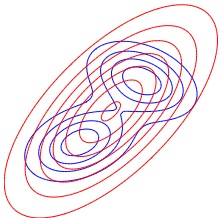

(a)

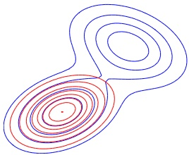

(b)

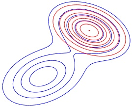

(c)

Figure 6.3: Illustrating forwards vs reverse KL on a bimodal distribution. The blue curves are the contours of the true distribution p. The red curves are the contours of the unimodal approximation q. (a) Minimizing forwards KL,  $D_{\text{KL}}(p \parallel q)$, wrt q causes q to “cover” p. (b-c) Minimizing reverse KL,  $D_{\text{KL}}(q \parallel p)$ wrt q causes q to “lock onto” one of the two modes of p. Adapted from Figure 10.3 of [Bis06]. Generated by KLfwdReverseMixGauss.ipynb.

We can gain an understanding of the optimal $q$by consider inputs$x$for which$p(x) = 0$but$q(x) > 0$. In this case, the term $\log q(x)/p(x)$will be infinite. Thus minimizing the exclusive KL will force$q$to exclude all the areas of space for which$p$has zero probability. One way to do this is for$q$to put probability mass in very few parts of space; this is called zero-forcing or mode-seeking behavior. In this case,$q$will typically under-estimate the support of$p$. We illustrate mode seeking when $p$is bimodal but$q$ is unimodal in Figure 6.3(b-c).

### 6.3 Mutual information *

The KL divergence gave us a way to measure how similar two distributions were. How should we measure how dependant two random variables are? One thing we could do is turn the question of measuring the dependence of two random variables into a question about the similarity of their distributions. This gives rise to the notion of mutual information (MI) between two random variables, which we define below.

#### 6.3.1 Definition

The mutual information between rv's X and Y is defined as follows:

$$
\mathbb{I}\left(X;Y\right)\triangleq D_{\mathbb{K L}}\left(p(x,y)\parallel p(x)p(y)\right)=\sum_{y\in Y}\sum_{x\in X}p(x,y)\log\frac{p(x,y)}{p(x)p(y)}   \tag*{(6.47)}
$$

(We write  $\mathbb{I}(X;Y)$ instead of  $\mathbb{I}(X,Y)$, in case X and/or Y represent sets of variables; for example, we can write  $\mathbb{I}(X;Y,Z)$ to represent the MI between X and  $(Y,Z)$.) For continuous random variables, we just replace sums with integrals.

It is easy to see that MI is always non-negative, even for continuous random variables, since

$$
\mathbb{I}\left(X;Y\right)=D_{\mathbb{K L}}\left(p(x,y)\parallel p(x)p(y)\right)\geq0   \tag*{(6.48)}
$$

Author: Kevin P. Murphy. (C) MIT Press. CC-BY-NC-ND license

---

We achieve the bound of 0 iff  $p(x,y)=p(x)p(y)$.

#### 6.3.2 Interpretation

Knowing that the mutual information is a KL divergence between the joint and factored marginal distributions tells us that the MI measures the information gain if we update from a model that treats the two variables as independent  $p(x)p(y)$ to one that models their true joint density  $p(x,y)$.

To gain further insight into the meaning of MI, it helps to re-express it in terms of joint and conditional entropies, as follows:

$$
\mathbb{I}\left(X;Y\right)=\mathbb{H}\left(X\right)-\mathbb{H}\left(X|Y\right)=\mathbb{H}\left(Y\right)-\mathbb{H}\left(Y|X\right)   \tag*{(6.49)}
$$

Thus we can interpret the MI between X and Y as the reduction in uncertainty about X after observing Y, or, by symmetry, the reduction in uncertainty about Y after observing X. Incidentally, this result gives an alternative proof that conditioning, on average, reduces entropy. In particular, we have  $0 \leq \mathbb{I}(X; Y) = \mathbb{H}(X) - \mathbb{H}(X|Y)$, and hence  $\mathbb{H}(X|Y) \leq \mathbb{H}(X)$.

We can also obtain a different interpretation. One can show that

$$
\mathbb{I}\left(X;Y\right)=\mathbb{H}\left(X,Y\right)-\mathbb{H}\left(X|Y\right)-\mathbb{H}\left(Y|X\right)   \tag*{(6.50)}
$$

Finally, one can show that

$$
\mathbb{I}\left(X;Y\right)=\mathbb{H}\left(X\right)+\mathbb{H}\left(Y\right)-\mathbb{H}\left(X,Y\right)   \tag*{(6.51)}
$$

See Figure 6.4 for a summary of these equations in terms of an information diagram. (Formally, this is a signed measure mapping set expressions to their information-theoretic counterparts [Yeu91].)

#### 6.3.3 Example

As an example, let us reconsider the example concerning prime and even numbers from Section 6.1.3. Recall that  $\mathbb{H}(X) = \mathbb{H}(Y) = 1$. The conditional distribution  $p(Y|X)$ is given by normalizing each row:

 
$$
\begin{array}{c|cc}{{{Y=0}}}&{{{Y=1}}} \\{{{\hline X=0}}}&{{{\frac{1}{4}}}}&{{{\frac{3}{4}}}} \\{{{X=1}}}&{{{\frac{3}{4}}}}&{{{\frac{1}{4}}}} \\\end{array}
$$
 

Hence the conditional entropy is

$$
\mathbb{H}\left(Y|X\right)=-\left[\frac{1}{8}\log_{2}\frac{1}{4}+\frac{3}{8}\log_{2}\frac{3}{4}+\frac{3}{8}\log_{2}\frac{3}{4}+\frac{1}{8}\log_{2}\frac{1}{4}\right]=0.81bits   \tag*{(6.52)}
$$

and the mutual information is

$$
\mathbb{I}\left(X;Y\right)=\mathbb{H}\left(Y\right)-\mathbb{H}\left(Y|X\right)=\left(1-0.81\right)bits=0.19bits   \tag*{(6.53)}
$$

You can easily verify that

$$
\begin{aligned}\mathbb{H}\left(X,Y\right)&=\mathbb{H}\left(X|Y\right)+\mathbb{I}\left(X;Y\right)+\mathbb{H}\left(Y|X\right)\\&=\left(0.81+0.19+0.81\right)bits=1.81bit\end{aligned}   \tag*{(6.54)}
$$

“Probabilistic Machine Learning: An Introduction”. Online version. November 23, 2024

---

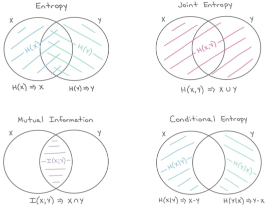

Figure 6.4: The marginal entropy, joint entropy, conditional entropy and mutual information represented as information diagrams. Used with kind permission of Katie Everett.

#### 6.3.4 Conditional mutual information

We can define the conditional mutual information in the obvious way

$$
\mathbb{I}\left(X;Y|Z\right)\triangleq\mathbb{E}_{p(Z)}\left[\mathbb{I}(X;Y)|Z\right]   \tag*{(6.56)}
$$

$$
=\mathbb{E}_{p(x,y,z)}\left[\log\frac{p(x,y|z)}{p(x|z)p(y|z)}\right]   \tag*{(6.57)}
$$

$$
=\mathbb{H}\left(X|Z\right)+\mathbb{H}\left(Y|Z\right)-\mathbb{H}\left(X,Y|Z\right)   \tag*{(6.58)}
$$

$$
=\mathbb{H}\left(X|Z\right)-\mathbb{H}\left(X|Y,Z\right)=\mathbb{H}\left(Y|Z\right)-\mathbb{H}\left(Y|X,Z\right)   \tag*{(6.59)}
$$

$$
=\mathbb{H}\left(X,Z\right)+\mathbb{H}\left(Y,Z\right)-\mathbb{H}\left(Z\right)-\mathbb{H}\left(X,Y,Z\right)   \tag*{(6.60)}
$$

$$
=\mathbb{I}(Y;X,Z)-\mathbb{I}(Y;Z)   \tag*{(6.61)}
$$

The last equation tells us that the conditional MI is the extra (residual) information that X tells us about Y, excluding what we already knew about Y given Z alone.

We can rewrite Equation (6.61) as follows:

$$
\mathbb{I}(Z,Y;X)=\mathbb{I}(Z;X)+\mathbb{I}(Y;X|Z)   \tag*{(6.62)}
$$

Generalizing to N variables, we get the chain rule for mutual information:

$$
\mathbb{I}\left(Z_{1},\cdots,Z_{N};X\right)=\sum_{n=1}^{N}\mathbb{I}\left(Z_{n};X|Z_{1},\cdots,Z_{n-1}\right)   \tag*{(6.63)}
$$

Author: Kevin P. Murphy. (C) MIT Press. CC-BY-NC-ND license

---

#### 6.3.5 MI as a “generalized correlation coefficient”

Suppose that  $(x, y)$ are jointly Gaussian:

$$
\begin{pmatrix}x\\ y\end{pmatrix}\sim\mathcal{N}\left(\mathbf{0},\begin{pmatrix}\sigma^{2}&\rho\sigma^{2}\\ \rho\sigma^{2}&\sigma^{2}\end{pmatrix}\right)   \tag*{(6.64)}
$$

We now show how to compute the mutual information between X and Y. Using Equation (6.26), we find that the entropy is

$$
h(X,Y)=\frac{1}{2}\log\left[(2\pi e)^{2}\det\Sigma\right]=\frac{1}{2}\log\left[(2\pi e)^{2}\sigma^{4}(1-\rho^{2})\right]   \tag*{(6.65)}
$$

Since X and Y are individually normal with variance  $\sigma^{2}$, we have

$$
h(X)=h(Y)=\frac{1}{2}\log\left[2\pi e\sigma^{2}\right]   \tag*{(6.66)}
$$

Hence

$$
I(X,Y)=h(X)+h(Y)-h(X,Y)   \tag*{(6.67)}
$$

$$
=\log[2\pi e\sigma^{2}]-\frac{1}{2}\log[(2\pi e)^{2}\sigma^{4}(1-\rho^{2})]   \tag*{(6.68)}
$$

$$
=\frac{1}{2}\log[(2\pi e\sigma^{2})^{2}]-\frac{1}{2}\log[(2\pi e\sigma^{2})^{2}(1-\rho^{2})]   \tag*{(6.69)}
$$

$$
=\frac{1}{2}\log\frac{1}{1-\rho^{2}}=-\frac{1}{2}\log[1-\rho^{2}]   \tag*{(6.70)}
$$

We now discuss some interesting special cases.

1.  $\rho = 1$. In this case, X = Y, and  $I(X, Y) = \infty$, which makes sense. Observing Y tells us an infinite amount of information about X (as we know its real value exactly).

2.  $\rho = 0$. In this case, X and Y are independent, and  $I(X, Y) = 0$, which makes sense. Observing Y tells us nothing about X.

3.  $\rho = -1$. In this case, X = -Y, and  $I(X, Y) = \infty$, which again makes sense. Observing Y allows us to predict X to infinite precision.

Now consider the case where X and Y are scalar, but not jointly Gaussian. In general it can be difficult to compute the mutual information between continuous random variables, because we have to estimate the joint density  $p(X,Y)$. For scalar variables, a simple approximation is to discretize or quantize them, by dividing the ranges of each variable into bins, and computing how many values fall in each histogram bin [Sco79]. We can then easily compute the MI using the empirical pmf.

Unfortunately, the number of bins used, and the location of the bin boundaries, can have a significant effect on the results. One way to avoid this is to use K-nearest neighbor distances to estimate densities in a non-parametric, adaptive way. This is the basis of the KSG estimator for MI proposed in [KSG04]. This is implemented in the sklearn.feature_selection.mutual_info_regression function. For papers related to this estimator, see [GOV18; HN19].