

We can approximate this numerically using 2 function calls to f, regardless of n. By contrast, a numerical approximation to the standard gradient vector takes  $n + 1$ calls (or 2n if using central differences).

Note that the directional derivative along v is the scalar product of the gradient g and the vector v:

$$
D_{v}f(\boldsymbol{x})=\nabla f(\boldsymbol{x})\cdot\boldsymbol{v}   \tag*{(7.246)}
$$

#### 7.8.4 Total derivative  $*$

Suppose that some of the arguments to the function depend on each other. Concretely, suppose the function has the form  $f(t, x(t), y(t))$. We define the total derivative of  $f$ wrt  $t$ as follows:

$$
\frac{df}{dt}=\frac{\partial f}{\partial t}+\frac{\partial f}{\partial x}\frac{dx}{dt}+\frac{\partial f}{\partial y}\frac{dy}{dt}   \tag*{(7.247)}
$$

If we multiply both sides by the differential dt, we get the total differential

$$
d f=\frac{\partial f}{\partial t}d t+\frac{\partial f}{\partial x}d x+\frac{\partial f}{\partial y}d y   \tag*{(7.248)}
$$

This measures how much f changes when we change t, both via the direct effect of t on f, but also indirectly, via the effects of t on x and y.

#### 7.8.5 Jacobian

Consider a function that maps a vector to another vector,  $f : \mathbb{R}^n \to \mathbb{R}^m$. The Jacobian matrix of this function is an  $m \times n$ matrix of partial derivatives:

$$
\mathbf{J}_{f}(\boldsymbol{x})=\frac{\partial\boldsymbol{f}}{\partial\boldsymbol{x}^{\top}}\triangleq\begin{pmatrix}\frac{\partial f_{1}}{\partial x_{1}}&\cdots&\frac{\partial f_{1}}{\partial x_{n}}\\ \vdots&\ddots&\vdots\\ \frac{\partial f_{m}}{\partial x_{1}}&\cdots&\frac{\partial f_{m}}{\partial x_{n}}\end{pmatrix}=\begin{pmatrix}\nabla f_{1}(\boldsymbol{x})^{\top}\\ \vdots\\ \nabla f_{m}(\boldsymbol{x})^{\top}\end{pmatrix}   \tag*{(7.249)}
$$

Note that we lay out the results in the same orientation as the output $f$; this is sometimes called numerator layout or the Jacobian formulation.$^{5}$##### 7.8.5.1 Multiplying Jacobians and vectors

The Jacobian vector product or JVP is defined to be the operation that corresponds to right-multiplying the Jacobian matrix$  \mathbf{J} \in \mathbb{R}^{m \times n}  $by a vector$  \mathbf{v} \in \mathbb{R}^n  $:

$$
\mathbf{J}_{f}(\boldsymbol{x})\boldsymbol{v}=\begin{pmatrix}\nabla f_{1}(\boldsymbol{x})^{\top}\\ \vdots\\ \nabla f_{m}(\boldsymbol{x})^{\top}\end{pmatrix}\boldsymbol{v}=\begin{pmatrix}\nabla f_{1}(\boldsymbol{x})^{\top}\boldsymbol{v}\\ \vdots\\ \nabla f_{m}(\boldsymbol{x})^{\top}\boldsymbol{v}\end{pmatrix}   \tag*{(7.250)}
$$

---

So we can see that we can approximate this numerically using just 2 calls to f.

The vector Jacobian product or VJP is defined to be the operation that corresponds to left-multiplying the Jacobian matrix  $\mathbf{J} \in \mathbb{R}^{m \times n}$ by a vector  $\mathbf{u} \in \mathbb{R}^m$:

$$
\boldsymbol{u}^{\mathsf{T}}\boldsymbol{J}_{f}(\boldsymbol{x})=\boldsymbol{u}^{\mathsf{T}}\left(\frac{\partial f}{\partial x_{1}},\cdots,\frac{\partial f}{\partial x_{n}}\right)=\left(\boldsymbol{u}\cdot\frac{\partial f}{\partial x_{1}},\cdots,\boldsymbol{u}\cdot\frac{\partial f}{\partial x_{n}}\right)   \tag*{(7.251)}
$$

The JVP is more efficient if  $m \geq n$, and the VJP is more efficient if  $m \leq n$. See Section 13.3 for details on how this can be used to perform automatic differentiation in a computation graph such as a DNN.

##### 7.8.5.2 Jacobian of a composition

Sometimes it is useful to take the Jacobian of the composition of two functions. Let  $h(\boldsymbol{x}) = g(f(\boldsymbol{x}))$. By the chain rule of calculus, we have

$$
\mathbf{J}_{h}(\boldsymbol{x})=\mathbf{J}_{g}(f(\boldsymbol{x}))\mathbf{J}_{f}(\boldsymbol{x})   \tag*{(7.252)}
$$

For example, suppose  $f : \mathbb{R} \to \mathbb{R}^2$ and  $g : \mathbb{R}^2 \to \mathbb{R}^2$. We have

$$
\frac{\partial\boldsymbol{g}}{\partial x}=\begin{pmatrix}\frac{\partial}{\partial x}g_{1}(f_{1}(x),f_{2}(x))\\ \frac{\partial}{\partial x}g_{2}(f_{1}(x),f_{2}(x))\end{pmatrix}=\begin{pmatrix}\frac{\partial g_{1}}{\partial f_{1}}\frac{\partial f_{1}}{\partial x}+\frac{\partial g_{1}}{\partial f_{2}}\frac{\partial f_{2}}{\partial x}\\ \frac{\partial g_{2}}{\partial f_{1}}\frac{\partial f_{1}}{\partial x}+\frac{\partial g_{2}}{\partial f_{2}}\frac{\partial f_{2}}{\partial x}\end{pmatrix}   \tag*{(7.253)}
$$

$$
=\frac{\partial\boldsymbol{g}}{\partial\boldsymbol{f}^{\mathrm{T}}}\frac{\partial\boldsymbol{f}}{\partial x}=\begin{pmatrix}\frac{\partial g_{1}}{\partial f_{1}}&\frac{\partial g_{1}}{\partial f_{2}}\\\frac{\partial g_{2}}{\partial f_{1}}&\frac{\partial g_{2}}{\partial f_{2}}\end{pmatrix}\begin{pmatrix}\frac{\partial f_{1}}{\partial x}\\\frac{\partial f_{2}}{\partial x}\end{pmatrix}   \tag*{(7.254)}
$$

#### 7.8.6 Hessian

For a function  $f : \mathbb{R}^n \to \mathbb{R}$ that is twice differentiable, we define the Hessian matrix as the (symmetric)  $n \times n$ matrix of second partial derivatives:

$$
\mathbf{H}_{f}=\frac{\partial^{2}f}{\partial\boldsymbol{x}^{2}}=\nabla^{2}f=\begin{pmatrix}\frac{\partial^{2}f}{\partial x_{1}^{2}}&\cdots&\frac{\partial^{2}f}{\partial x_{1}\partial x_{n}}\\ &\vdots&\\ \frac{\partial^{2}f}{\partial x_{n}\partial x_{1}}&\cdots&\frac{\partial^{2}f}{\partial x_{n}^{2}}\end{pmatrix}   \tag*{(7.255)}
$$

We see that the Hessian is the Jacobian of the gradient.

#### 7.8.7 Gradients of commonly used functions

In this section, we list without proof the gradients of certain widely used functions.

##### 7.8.7.1 Functions that map scalars to scalars

Consider a differentiable function  $f: \mathbb{R} \to \mathbb{R}$. Here are some useful identities from scalar calculus, which you should already be familiar with.

---

$$
\frac{d}{dx}cx^{n}=cnx^{n-1}   \tag*{(7.256)}
$$

$$
\frac{d}{dx}\log(x)=1/x   \tag*{(7.257)}
$$

$$
\frac{d}{dx}\exp(x)=\exp(x)   \tag*{(7.258)}
$$

$$
\frac{d}{dx}\left[f(x)+g(x)\right]=\frac{df(x)}{dx}+\frac{dg(x)}{dx}   \tag*{(7.259)}
$$

$$
\frac{d}{dx}\left[f(x)g(x)\right]=f(x)\frac{dg(x)}{dx}+g(x)\frac{df(x)}{dx}   \tag*{(7.260)}
$$

$$
\frac{d}{dx}f(u(x))=\frac{du}{dx}\frac{df(u)}{du}   \tag*{(7.261)}
$$

Equation (7.261) is known as the chain rule of calculus.

##### 7.8.7.2 Functions that map vectors to scalars

Consider a differentiable function  $f : \mathbb{R}^n \to \mathbb{R}$. Here are some useful identities: $^6$

$$
\frac{\partial(\boldsymbol{a}^{\top}\boldsymbol{x})}{\partial\boldsymbol{x}}=\boldsymbol{a}   \tag*{(7.262)}
$$

$$
\frac{\partial(\boldsymbol{b}^{\top}\mathbf{A}\boldsymbol{x})}{\partial\boldsymbol{x}}=\mathbf{A}^{\top}\boldsymbol{b}   \tag*{(7.263)}
$$

$$
\frac{\partial(\boldsymbol{x}^{\top}\mathbf{A}\boldsymbol{x})}{\partial\boldsymbol{x}}=(\mathbf{A}+\mathbf{A}^{\top})\boldsymbol{x}   \tag*{(7.264)}
$$

It is fairly easy to prove these identities by expanding out the quadratic form, and applying scalar calculus.

##### 7.8.7.3 Functions that map matrices to scalars

Consider a function  $f : \mathbb{R}^{m \times n} \to \mathbb{R}$ which maps a matrix to a scalar. We are using the following natural layout for the derivative matrix:

$$
\frac{\partial f}{\partial\mathbf{X}}=\begin{pmatrix}\frac{\partial f}{\partial x_{11}}&\cdots&\frac{\partial f}{\partial x_{1n}}\\ &\vdots&\\ \frac{\partial f}{\partial x_{m1}}&\cdots&\frac{\partial f}{\partial x_{mn}}\end{pmatrix}   \tag*{(7.265)}
$$

Below are some useful identities.

---

##### Identities involving quadratic forms

One can show the following results.

$$
\frac{\partial}{\partial\mathbf{X}}(\boldsymbol{a}^{\top}\mathbf{X}\boldsymbol{b})=\boldsymbol{a}\boldsymbol{b}^{\top}   \tag*{(7.266)}
$$

$$
\frac{\partial}{\partial\mathbf{X}}(\boldsymbol{a}^{\top}\mathbf{X}^{\top}\boldsymbol{b})=\boldsymbol{b}\boldsymbol{a}^{\top}   \tag*{(7.267)}
$$

##### Identities involving matrix trace

One can show the following results.

$$
\frac{\partial}{\partial\mathbf{X}}\mathrm{tr}(\mathbf{A}\mathbf{X}\mathbf{B})=\mathbf{A}^{\top}\mathbf{B}^{\top}   \tag*{(7.268)}
$$

$$
\frac{\partial}{\partial\mathbf{X}}\mathrm{tr}(\mathbf{X}^{\top}\mathbf{A})=\mathbf{A}   \tag*{(7.269)}
$$

$$
\frac{\partial}{\partial\mathbf{X}}\mathrm{tr}(\mathbf{X}^{-1}\mathbf{A})=-\mathbf{X}^{-\top}\mathbf{A}^{\top}\mathbf{X}^{-\top}   \tag*{(7.270)}
$$

$$
\frac{\partial}{\partial\mathbf{X}}\mathrm{tr}(\mathbf{X}^{\mathsf{T}}\mathbf{A}\mathbf{X})=(\mathbf{A}+\mathbf{A}^{\mathsf{T}})\mathbf{X}   \tag*{(7.271)}
$$

##### Identities involving matrix determinant

One can show the following results.

$$
\frac{\partial}{\partial\mathbf{X}}\det(\mathbf{A}\mathbf{X}\mathbf{B})=\det(\mathbf{A}\mathbf{X}\mathbf{B})\mathbf{X}^{-\top}   \tag*{(7.272)}
$$

$$
\frac{\partial}{\partial\mathbf{X}}\log(\det(\mathbf{X}))=\mathbf{X}^{-\mathsf{T}}   \tag*{(7.273)}
$$

### 7.9 Exercises

##### Exercise 7.1 [Orthogonal matrices]

a. A rotation in 3d by angle  $\alpha$ about the z axis is given by the following matrix:

$$
\mathbf{R}(\alpha)=\begin{pmatrix}{{{\cos(\alpha)}}}&{{{-\sin(\alpha)}}}&{{{0}}} \\{{{\sin(\alpha)}}}&{{{\cos(\alpha)}}}&{{{0}}} \\{{{0}}}&{{{0}}}&{{{1}}}\end{pmatrix}   \tag*{(7.274)}
$$

Prove that  $\mathbf{R}$ is an orthogonal matrix, i.e.,  $\mathbf{R}^T\mathbf{R} = \mathbf{I}$, for any  $\alpha$.

b. What is the only eigenvector  $\boldsymbol{v}$ of  $\mathbf{R}$ with an eigenvalue of 1.0 and of unit norm (i.e.,  $\|\boldsymbol{v}\|^2 = 1$?) (Your answer should be the same for any  $\alpha$.) Hint: think about the geometrical interpretation of eigenvectors.

##### Exercise 7.2 [Eigenvectors by hand †]

Find the eigenvalues and eigenvectors of the following matrix

$$
\boldsymbol{A}=\begin{pmatrix}{{{2}}}&{{{0}}} \\{{{0}}}&{{{3}}}\end{pmatrix}   \tag*{(7.275)}
$$

Compute your result by hand and check it with Python.

---

## 8 Optimization

Parts of this chapter were written by Frederik Kunstner, Si Yi Meng, Aaron Mishkin, Sharan Vaswani, and Mark Schmidt.

### 8.1 Introduction

We saw in Chapter 4 that the core problem in machine learning is parameter estimation (aka model fitting). This requires solving an optimization problem, where we try to find the values for a set of variables  $\theta \in \Theta$, that minimize a scalar-valued loss function or cost function  $\mathcal{L} : \Theta \to \mathbb{R}$:

$$
\theta^{*}\in\operatorname{argmin}_{\theta\in\Theta}\mathcal{L}(\theta)   \tag*{(8.1)}
$$

We will assume that the parameter space is given by  $\Theta \subseteq \mathbb{R}^D$, where  $D$ is the number of variables being optimized over. Thus we are focusing on continuous optimization, rather than discrete optimization.

If we want to maximize a score function or reward function  $R(\theta)$, we can equivalently minimize  $\mathcal{L}(\theta) = -R(\theta)$. We will use the term objective function to refer generically to a function we want to maximize or minimize. An algorithm that can find an optimum of an objective function is often called a solver.

In the rest of this chapter, we discuss different kinds of solvers for different kinds of objective functions, with a focus on methods used in the machine learning community. For more details on optimization, please consult some of the many excellent textbooks, such as [KW19b; BV04; NW06; Ber15; Ber16] as well as various review articles, such as [BCN18; Sun+19b; PPS18; Pey20]. A visualization of the taxonomy of optimization algorithms can be found at https://neos-guide.org/guide/types.

#### 8.1.1 Local vs global optimization

A point that satisfies Equation (8.1) is called a global optimum. Finding such a point is called global optimization.

In general, finding global optima is computationally intractable [Neu04]. In such cases, we will just try to find a local optimum. For continuous problems, this is defined to be a point  $\theta^{*}$ which has lower (or equal) cost than “nearby” points. Formally, we say  $\theta^{*}$ is a local minimum if

$$
\exists\delta>0,\forall\theta\in\Theta\text{s.t.}\left|\left|\theta-\theta^{*}\right|<\delta,\mathcal{L}(\theta^{*})\leq\mathcal{L}(\theta)   \tag*{(8.2)}
$$

---

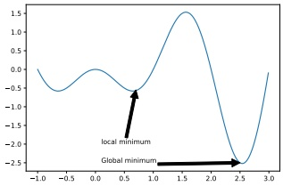

 $(a)$

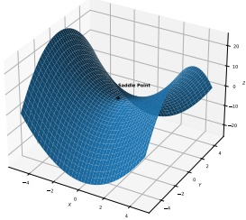

(b)

Figure 8.1: (a) Illustration of local and global minimum in 1d. Generated by extrema_fig_1d.ipynb. (b) Illustration of a saddle point in 2d. Generated by saddle.ipynb.

A local minimum could be surrounded by other local minima with the same objective value; this is known as a flat local minimum. A point is said to be a strict local minimum if its cost is strictly lower than those of neighboring points:

$$
\exists\delta>0,\forall\theta\in\Theta,\theta\neq\theta^{*}:||\theta-\theta^{*}||<\delta,\mathcal{L}(\theta^{*})<\mathcal{L}(\theta)   \tag*{(8.3)}
$$

We can define a (strict) local maximum analogously. See Figure 8.1a for an illustration.

A final note on terminology; if an algorithm is guaranteed to converge to a stationary point from any starting point, it is called globally convergent. However, this does not mean (rather confusingly) that it will converge to a global optimum; instead, it just means it will converge to some stationary point.

##### 8.1.1.1 Optimality conditions for local vs global optima

For continuous, twice differentiable functions, we can precisely characterize the points which correspond to local minima. Let  $g(\theta) = \nabla \mathcal{L}(\theta)$ be the gradient vector, and  $\mathbf{H}(\theta) = \nabla^2 \mathcal{L}(\theta)$ be the Hessian matrix. (See Section 7.8 for a refresher on these concepts, if necessary.) Consider a point  $\theta^* \in \mathbb{R}^D$, and let  $g^* = g(\theta) |_{\theta^*}$ be the gradient at that point, and  $\mathbf{H}^* = \mathbf{H}(\theta) |_{\theta^*}$ be the corresponding Hessian. One can show that the following conditions characterize every local minimum:

- Necessary condition: If  $\theta^*$ is a local minimum, then we must have  $g^* = 0$ (i.e.,  $\theta^*$ must be a stationary point), and  $H^*$ must be positive semi-definite.

• Sufficient condition: If  $g^* = 0$ and  $H^*$ is positive definite, then  $\theta^*$ is a local optimum.

To see why the first condition is necessary, suppose we were at a point  $\theta^*$ at which the gradient is non-zero: at such a point, we could decrease the function by following the negative gradient a small distance, so this would not be optimal. So the gradient must be zero. (In the case of nonsmooth

---

functions, the necessary condition is that the zero is a local subgradient at the minimum.) To see why a zero gradient is not sufficient, note that the stationary point could be a local minimum, maximum or saddle point, which is a point where some directions point downhill, and some uphill (see Figure 8.1b). More precisely, at a saddle point, the eigenvalues of the Hessian will be both positive and negative. However, if the Hessian at a point is positive semi-definite, then some directions may point uphill, while others are flat. Moreover, if the Hessian is strictly positive definite, then we are at the bottom of a “bowl”, and all directions point uphill, which is sufficient for this to be a minimum.

#### 8.1.2 Constrained vs unconstrained optimization

In unconstrained optimization, we define the optimization task as finding any value in the parameter space $\Theta$that minimizes the loss. However, we often have a set of constraints on the allowable values. It is standard to partition the set of constraints$\mathcal{C}$into inequality constraints,$g_j(\boldsymbol{\theta}) \leq 0$for$j \in \mathcal{I}$and equality constraints,$h_k(\boldsymbol{\theta}) = 0$for$k \in \mathcal{E}$. For example, we can represent a sum-to-one constraint as an equality constraint $h(\boldsymbol{\theta}) = (1 - \sum_{i=1}^D \theta_i) = 0$, and we can represent a nonnegativity constraint on the parameters by using $D$inequality constraints of the form$g_i(\boldsymbol{\theta}) = -\theta_i \leq 0$.

We define the feasible set as the subset of the parameter space that satisfies the constraints:

$$
\mathcal{C}=\left\{\boldsymbol{\varTheta}:g_{j}(\boldsymbol{\varTheta})\leq0:j\in\mathcal{I},h_{k}(\boldsymbol{\varTheta})=0:k\in\mathcal{E}\right\}\subseteq\mathbb{R}^{D}   \tag*{(8.4)}
$$

Our constrained optimization problem now becomes

$$
\theta^{*}\in\operatorname{argmin}_{\theta\in\mathcal{C}}\mathcal{L}(\theta)   \tag*{(8.5)}
$$

If  $C = \mathbb{R}^D$, it is called unconstrained optimization.

The addition of constraints can change the number of optima of a function. For example, a function that was previously unbounded (and hence had no well-defined global maximum or minimum) can “acquire” multiple maxima or minima when we add constraints, as illustrated in Figure 8.2. However, if we add too many constraints, we may find that the feasible set becomes empty. The task of finding any point (regardless of its cost) in the feasible set is called a feasibility problem; this can be a hard subproblem in itself.

A common strategy for solving constrained problems is to create penalty terms that measure how much we violate each constraint. We then add these terms to the objective and solve an unconstrained optimization problem. The Lagrangian is a special case of such a combined objective (see Section 8.5 for details).

#### 8.1.3 Convex vs nonconvex optimization

In convex optimization, we require the objective to be a convex function defined over a convex set (we define these terms below). In such problems, every local minimum is also a global minimum. Thus many models are designed so that their training objectives are convex.

##### 8.1.3.1 Convex sets

We say S is a convex set if, for any  $x, x' \in S$, we have

$$
\lambda\boldsymbol{x}+(1-\lambda)\boldsymbol{x}^{\prime}\in\mathcal{S},\forall\lambda\in[0,1]   \tag*{(8.6)}
$$

Author: Kevin P. Murphy. (C) MIT Press. CC-BY-NC-ND license

---

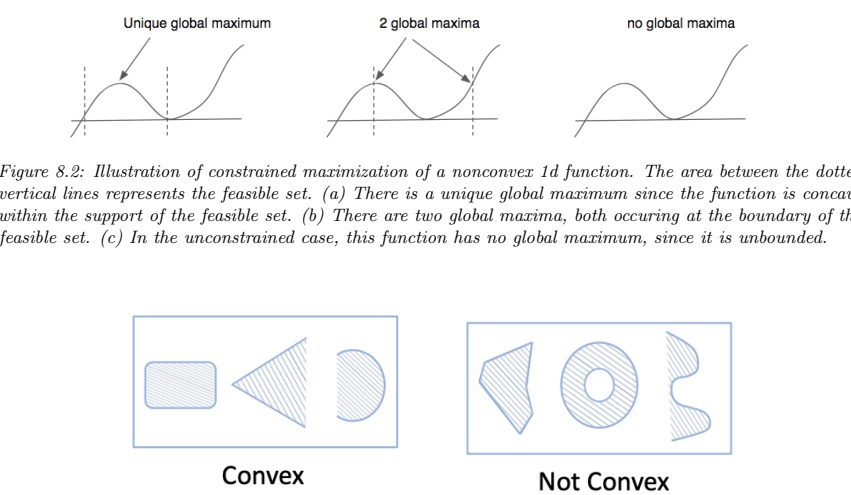

Figure 8.2: Illustration of constrained maximization of a nonconvex 1d function. The area between the dotted vertical lines represents the feasible set. (a) There is a unique global maximum since the function is concave within the support of the feasible set. (b) There are two global maxima, both occurring at the boundary of the feasible set. (c) In the unconstrained case, this function has no global maximum, since it is unbounded.

Figure 8.3: Illustration of some convex and non-convex sets.

That is, if we draw a line from x to  $x'$, all points on the line lie inside the set. See Figure 8.3 for some illustrations of convex and non-convex sets.

##### 8.1.3.2 Convex functions

We say $f$is a convex function if its epigraph (the set of points above the function, illustrated in Figure 8.4a) defines a convex set. Equivalently, a function$f(\boldsymbol{x})$is called convex if it is defined on a convex set and if, for any$\boldsymbol{x}, \boldsymbol{y} \in \mathcal{S}$, and for any $0 \leq \lambda \leq 1$, we have

$$
f(\lambda\boldsymbol{x}+(1-\lambda)\boldsymbol{y})\leq\lambda f(\boldsymbol{x})+(1-\lambda)f(\boldsymbol{y})   \tag*{(8.7)}
$$

See Figure 8.5(a) for a 1d example of a convex function. A function is called strictly convex if the inequality is strict. A function $f(\boldsymbol{x})$is$\mathbf{concave}$if$-f(\boldsymbol{x})$is convex, and strictly$\mathbf{concave}$if$-f(\boldsymbol{x})$ is strictly convex. See Figure 8.5(b) for a 1d example of a function that is neither convex nor concave.

---

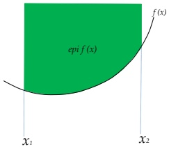

(a)

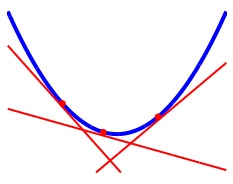

(b)

Figure 8.4: (a) Illustration of the epigraph of a function. (b) For a convex function  $f(x)$, its epigraph can be represented as the intersection of half-spaces defined by linear lower bounds derived from the conjugate function  $f^{*}(\lambda) = \max_{x} \lambda x - f(x)$.

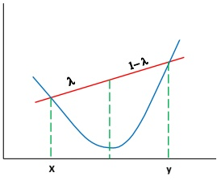

(a)

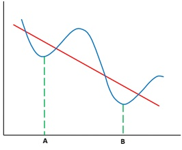

(b)

Figure 8.5: (a) Illustration of a convex function. We see that the chord joining  $(x, f(x))$ to  $(y, f(y))$ lies above the function. (b) A function that is neither convex nor concave. A is a local minimum, B is a global minimum.

Here are some examples of 1d convex functions:

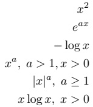

 
$$
|x|^{a},a\geq1
$$
 

##### 8.1.3.3 Characterization of convex functions

Intuitively, a convex function is shaped like a bowl. Formally, one can prove the following important result:

Author: Kevin P. Murphy. (C) MIT Press. CC-BY-NC-ND license

---

(a)

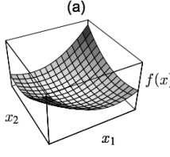

(b)

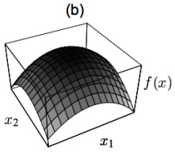

(c)

(d)

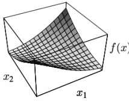

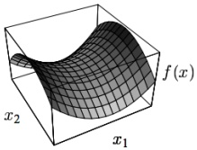

Figure 8.6: The quadratic form  $f(\mathbf{x}) = \mathbf{x}^{\top} \mathbf{A} \mathbf{x}$ in 2d. (a) A is positive definite, so f is convex. (b) A is negative definite, so f is concave. (c) A is positive semidefinite but singular, so f is convex, but not strictly. Notice the valley of constant height in the middle. (d) A is indefinite, so f is neither convex nor concave. The stationary point in the middle of the surface is a saddle point. From Figure 5 of [She94].

Theorem 8.1.1. Suppose  $f : \mathbb{R}^n \to \mathbb{R}$ is twice differentiable over its domain. Then  $f$ is convex iff  $\mathbf{H} = \nabla^2 f(\mathbf{x})$ is positive semi definite (Section 7.1.5.3) for all  $\mathbf{x} \in \operatorname{dom}(f)$. Furthermore,  $f$ is strictly convex if  $\mathbf{H}$ is positive definite.

For example, consider the quadratic form

$$
f(\boldsymbol{x})=\boldsymbol{x}^{\top}\mathbf{A}\boldsymbol{x}   \tag*{(8.8)}
$$

This is convex if  $\mathbf{A}$ is positive semi definite, and is strictly convex if  $\mathbf{A}$ is positive definite. It is neither convex nor concave if  $\mathbf{A}$ has eigenvalues of mixed sign. See Figure 8.6.

##### 8.1.3.4 Strongly convex functions

We say a function  $f$ is strongly convex with parameter  $m > 0$ if the following holds for all  $\boldsymbol{x}, \boldsymbol{y}$ in  $f'$s domain:

$$
(\nabla f(\boldsymbol{x})-\nabla f(\boldsymbol{y}))^{\top}(\boldsymbol{x}-\boldsymbol{y})\geq m||\boldsymbol{x}-\boldsymbol{y}||_{2}^{2}   \tag*{(8.9)}
$$

A strongly convex function is also strictly convex, but not vice versa.

If the function $f$is twice continuously differentiable, then it is strongly convex with parameter$m$if and only if$\nabla^2 f(\boldsymbol{x}) \succeq m \mathbf{I}$for all$\boldsymbol{x}$in the domain, where$\mathbf{I}$is the identity and$\nabla^2 f$is the Hessian matrix, and the inequality$\succeq$means that$\nabla^2 f(\boldsymbol{x}) - m \mathbf{I}$ is positive semi-definite. This is equivalent

---

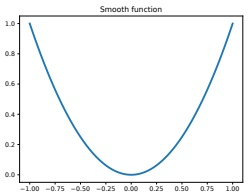

 $(a)$

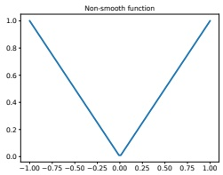

(b)

Figure 8.7: (a) Smooth 1d function. (b) Non-smooth 1d function. (There is a discontinuity at the origin.) Generated by smooth-vs-nonsmooth-1d.ipynb.

to requiring that the minimum eigenvalue of  $\nabla^2 f(\boldsymbol{x})$ be at least  $m$ for all  $\boldsymbol{x}$. If the domain is just the real line, then  $\nabla^2 f(x)$ is just the second derivative  $f''(x)$, so the condition becomes  $f''(x) \geq m$. If  $m = 0$, then this means the Hessian is positive semidefinite (or if the domain is the real line, it means that  $f''(x) \geq 0$), which implies the function is convex, and perhaps strictly convex, but not strongly convex.

The distinction between convex, strictly convex, and strongly convex is rather subtle. To better understand this, consider the case where f is twice continuously differentiable and the domain is the real line. Then we can characterize the differences as follows:

• f is convex if and only if  $f''(x) \geq 0$ for all x.

• f is strictly convex if  $f''(x) > 0$ for all x (note: this is sufficient, but not necessary).

• f is strongly convex if and only if  $f''(x) \geq m > 0$ for all x.

Note that it can be shown that a function f is strongly convex with parameter m iff the function

$$
J(\boldsymbol{x})=f(\boldsymbol{x})-\frac{m}{2}||\boldsymbol{x}||^{2}   \tag*{(8.10)}
$$

is convex.

#### 8.1.4 Smooth vs nonsmooth optimization

In smooth optimization, the objective and constraints are continuously differentiable functions. For smooth functions, we can quantify the degree of smoothness using the Lipschitz constant. In the 1d case, this is defined as any constant  $L \geq 0$ such that, for all real  $x_1$ and  $x_2$, we have

$$
|f(x_{1})-f(x_{2})|\leq L|x_{1}-x_{2}|   \tag*{(8.11)}
$$

This is illustrated in Figure 8.8: for a given constant L, the function output cannot change by more than L if we change the function input by 1 unit. This can be generalized to vector inputs using a suitable norm.

In nonsmooth optimization, there are at least some points where the gradient of the objective function or the constraints is not well-defined. See Figure 8.7 for an example. In some optimization

Author: Kevin P. Murphy. (C) MIT Press. CC-BY-NC-ND license

---

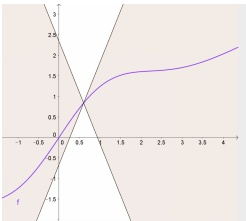

Figure 8.8: For a Lipschitz continuous function f, there exists a double cone (white) whose origin can be moved along the graph of f so that the whole graph always stays outside the double cone. From https://en.wikipedia.org/wiki/Lipschitz_continuity. Used with kind permission of Wikipedia author Taschee.

problems, we can partition the objective into a part that only contains smooth terms, and a part that contains the nonsmooth terms:

$$
\mathcal{L}(\boldsymbol{\theta})=\mathcal{L}_{s}(\boldsymbol{\theta})+\mathcal{L}_{r}(\boldsymbol{\theta})   \tag*{(8.12)}
$$

where  $\mathcal{L}_s$ is smooth (differentiable), and  $\mathcal{L}_r$ is nonsmooth (“rough”). This is often referred to as a composite objective. In machine learning applications,  $\mathcal{L}_s$ is usually the training set loss, and  $\mathcal{L}_r$ is a regularizer, such as the  $\ell_1$ norm of  $\theta$. This composite structure can be exploited by various algorithms.

##### 8.1.4.1 Subgradients

In this section, we generalize the notion of a derivative to work with functions which have local discontinuities. In particular, for a convex function of several variables,  $f : \mathbb{R}^n \to \mathbb{R}$, we say that  $g \in \mathbb{R}^n$ is a subgradient of  $f$ at  $x \in \text{dom}(f)$ if for all  $z \in \text{dom}(f)$,

$$
f(z)\geq f(x)+g^{\top}(z-x)   \tag*{(8.13)}
$$

Note that a subgradient can exist even when $f$is not differentiable at a point, as shown in Figure 8.9. A function$f$is called subdifferentiable at$\boldsymbol{x}$if there is at least one subgradient at$\boldsymbol{x}$. The set of such subgradients is called the subdifferential of $f$at$\boldsymbol{x}$, and is denoted $\partial f(\boldsymbol{x})$.

For example, consider the absolute value function  $f(x) = |x|$. Its subdifferential is given by

$$
\partial f(x)=\left\{\begin{array}{ll}\left\{-1\right\}&\text{if}x<0\\ \left[-1,1\right]&\text{if}x=0\\ \left\{+1\right\}&\text{if}x>0\end{array}\right.   \tag*{(8.14)}
$$

where the notation  $[-1,1]$ means any value between -1 and 1 inclusive. See Figure 8.10 for an illustration.

### 8.2 First-order methods

In this section, we consider iterative optimization methods that leverage first-order derivatives of the objective function, i.e., they compute which directions point “downhill”, but they ignore curvature

---

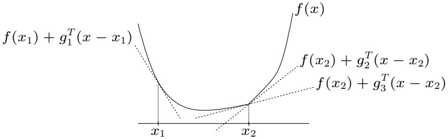

Figure 8.9: Illustration of subgradients. At  $\mathbf{x}_{1}$, the convex function  $f$ is differentiable, and  $\mathbf{g}_{1}$ (which is the derivative of  $f$ at  $\mathbf{x}_{1}$) is the unique subgradient at  $\mathbf{x}_{1}$. At the point  $\mathbf{x}_{2}$,  $f$ is not differentiable, because of the “kink”. However, there are many subgradients at this point, of which two are shown. From https://web.stanford.edu/class/ee364b/lectures/subgradients_slides.pdf. Used with kind permission of Stephen Boyd.

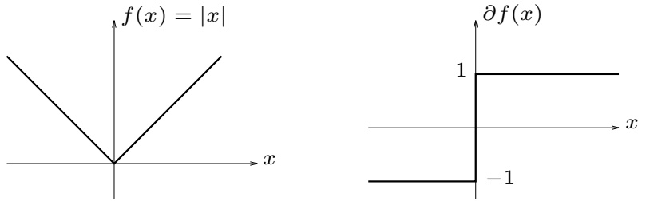

Figure 8.10: The absolute value function (left) and its subdifferential (right). From https://web.stanford.edu/class/ee364b/lectures/subgradients_slides.pdf. Used with kind permission of Stephen Boyd.

information. All of these algorithms require that the user specify a starting point  $\theta_0$. Then at each iteration  $t$, they perform an update of the following form:

$$
\boldsymbol{\theta}_{t+1}=\boldsymbol{\theta}_{t}+\boldsymbol{\eta}_{t}\boldsymbol{d}_{t}   \tag*{(8.15)}
$$

where  $\eta_t$ is known as the step size or learning rate, and  $d_t$ is a descent direction, such as the negative of the gradient, given by  $g_t = \nabla_\theta \mathcal{L}(\theta) |_{\theta_t}$. These update steps are continued until the method reaches a stationary point, where the gradient is zero.

Author: Kevin P. Murphy. (C) MIT Press. CC-BY-NC-ND license

---

#### 8.2.1 Descent direction

We say that a direction $d$is a descent direction if there is a small enough (but nonzero) amount$\eta$we can move in direction$d$and be guaranteed to decrease the function value. Formally, we require that there exists an$\eta_{\max} > 0$ such that

$$
\mathcal{L}(\boldsymbol{\theta}+\eta\boldsymbol{d})<\mathcal{L}(\boldsymbol{\theta})   \tag*{(8.16)}
$$

for all  $0 < \eta < \eta_{\max}$. The gradient at the current iterate,  $\theta_t$, is given by

$$
g_{t}\triangleq\nabla\mathcal{L}(\boldsymbol{\theta})|_{\boldsymbol{\theta}_{t}}=\nabla\mathcal{L}(\boldsymbol{\theta}_{t})=g(\boldsymbol{\theta}_{t})   \tag*{(8.17)}
$$

This points in the direction of maximal increase in $f$, so the negative gradient is a descent direction. It can be shown that any direction $d$is also a descent direction if the angle$\theta$between$d$and$-g_t$ is less than 90 degrees and satisfies

$$
\boldsymbol{d}^{\top}\boldsymbol{g}_{t}=||\boldsymbol{d}||~||\boldsymbol{g}_{t}||~\cos(\theta)<0   \tag*{(8.18)}
$$

It seems that the best choice would be to pick  $d_t = -g_t$. This is known as the direction of steepest descent. However, this can be quite slow. We consider faster versions later.

#### 8.2.2 Step size (learning rate)

In machine learning, the sequence of step sizes  $\{\eta_t\}$ is called the learning rate schedule. There are several widely used methods for picking this, some of which we discuss below. (See also Section 8.4.3, where we discuss schedules for stochastic optimization.)

##### 8.2.2.1 Constant step size

The simplest method is to use a constant step size,  $\eta_t = \eta$. However, if it is too large, the method may fail to converge, and if it is too small, the method will converge but very slowly.

For example, consider the convex function

$$
\mathcal{L}(\boldsymbol{\theta})=0.5(\theta_{1}^{2}-\theta_{2})^{2}+0.5(\theta_{1}-1)^{2}   \tag*{(8.19)}
$$

Let us pick as our descent direction  $\boldsymbol{d}_t = -\boldsymbol{g}_t$. Figure 8.11 shows what happens if we use this descent direction with a fixed step size, starting from  $(0,0)$. In Figure 8.11(a), we use a small step size of  $\eta = 0.1$; we see that the iterates move slowly along the valley. In Figure 8.11(b), we use a larger step size  $\eta = 0.6$; we see that the iterates start oscillating up and down the sides of the valley and never converge to the optimum, even though this is a convex problem.

In some cases, we can derive a theoretical upper bound on the maximum step size we can use. For example, consider a quadratic objective,  $\mathcal{L}(\boldsymbol{\theta}) = \frac{1}{2} \boldsymbol{\theta}^{\mathrm{T}} \boldsymbol{A} \boldsymbol{\theta} + \boldsymbol{b}^{\mathrm{T}} \boldsymbol{\theta} + c$ with  $\mathbf{A} \succeq \mathbf{0}$. One can show that steepest descent will have global convergence iff the step size satisfies

$$
\eta<\frac{2}{\lambda_{max}(\mathbf{A})}   \tag*{(8.20)}
$$

where  $\lambda_{\max}(\mathbf{A})$ is the largest eigenvalue of  $\mathbf{A}$. The intuitive reason for this can be understood by thinking of a ball rolling down a valley. We want to make sure it doesn't take a step that is larger than the slope of the steepest direction, which is what the largest eigenvalue measures (see Section 3.2.2).

---

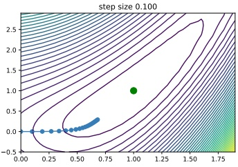

 $(a)$

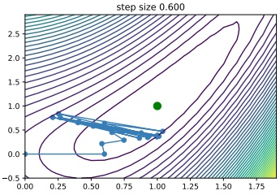

(b)

Figure 8.11: Steepest descent on a simple convex function, starting from  $(0,0)$, for 20 steps, using a fixed step size. The global minimum is at  $(1,1)$.  $(a)$  $\eta = 0.1$.  $(b)$  $\eta = 0.6$. Generated by steepestDescentDemo.ipynb.

More generally, setting  $\eta < 2/L$, where  $L$ is the Lipschitz constant of the gradient (Section 8.1.4), ensures convergence. Since this constant is generally unknown, we usually need to adapt the step size, as we discuss below.

##### 8.2.2.2 Line search

The optimal step size can be found by finding the value that maximally decreases the objective along the chosen direction by solving the 1d minimization problem

$$
\eta_{t}=\underset{\eta>0}{\operatorname{argmin}}\phi_{t}(\eta)=\underset{\eta>0}{\operatorname{argmin}}\mathcal{L}(\boldsymbol{\theta}_{t}+\eta\boldsymbol{d}_{t})   \tag*{(8.21)}
$$

This is known as line search, since we are searching along the line defined by d.

If the loss is convex, this subproblem is also convex, because  $\phi_t(\eta) = \mathcal{L}(\pmb{\theta}_t + \eta \pmb{d}_t)$ is a convex function of an affine function of  $\eta$, for fixed  $\pmb{\theta}_t$ and  $\pmb{d}_t$. For example, consider the quadratic loss

$$
\mathcal{L}(\boldsymbol{\theta})=\frac{1}{2}\boldsymbol{\theta}^{\mathrm{T}}\mathbf{A}\boldsymbol{\theta}+\boldsymbol{b}^{\mathrm{T}}\boldsymbol{\theta}+c   \tag*{(8.22)}
$$

Computing the derivative of  $\phi$ gives

$$
\frac{d\phi(\eta)}{d\eta}=\frac{d}{d\eta}\left[\frac{1}{2}(\boldsymbol{\theta}+\eta\boldsymbol{d})^{\top}\mathbf{A}(\boldsymbol{\theta}+\eta\boldsymbol{d})+\boldsymbol{b}^{\top}(\boldsymbol{\theta}+\eta\boldsymbol{d})+c\right]   \tag*{(8.23)}
$$

$$
\begin{aligned}&=d^{\intercal}\mathbf{A}(\boldsymbol{\theta}+\boldsymbol{\eta}d)+d^{\intercal}\mathbf{b}\\&=d^{\intercal}(\mathbf{A}\boldsymbol{\theta}+\mathbf{b})+\boldsymbol{\eta}d^{\intercal}\mathbf{A}d\end{aligned}   \tag*{(8.24)}
$$

Solving for  $\frac{d\phi(\eta)}{d\eta}=0$ gives

$$
\eta=-\frac{d^{\mathrm{T}}(\mathbf{A}\boldsymbol{\theta}+\mathbf{b})}{d^{\mathrm{T}}\mathbf{A}d}   \tag*{(8.26)}
$$

Author: Kevin P. Murphy. (C) MIT Press. CC-BY-NC-ND license

---

Using the optimal step size is known as exact line search. However, it is not usually necessary to be so precise. There are several methods, such as the Armijo backtracking method, that try to ensure sufficient reduction in the objective function without spending too much time trying to solve Equation (8.21). In particular, we can start with the current stepsize (or some maximum value), and then reduce it by a factor 0 < c < 1 at each step until we satisfy the following condition, known as the Armijo-Goldstein test:

$$
\mathcal{L}(\boldsymbol{\theta}_{t}+\eta\boldsymbol{d}_{t})\leq\mathcal{L}(\boldsymbol{\theta}_{t})+c\eta\boldsymbol{d}_{t}^{\intercal}\nabla\mathcal{L}(\boldsymbol{\theta}_{t})   \tag*{(8.27)}
$$

where  $c \in [0,1]$ is a constant, typically  $c = 10^{-4}$. In practice, the initialization of the line-search and how to backtrack can significantly affect performance. See [NW06, Sec 3.1] for details.

#### 8.2.3 Convergence rates

We want to find optimization algorithms that converge quickly to a (local) optimum. For certain convex problems, with a gradient with bounded Lipschitz constant, one can show that gradient descent converges at a linear rate. This means that there exists a number  $0 < \mu < 1$ such that

$$
|\mathcal{L}(\boldsymbol{\theta}_{t+1})-\mathcal{L}(\boldsymbol{\theta}_{*})|\leq\mu|\mathcal{L}(\boldsymbol{\theta}_{t})-\mathcal{L}(\boldsymbol{\theta}_{*})|   \tag*{(8.28)}
$$

Here  $\mu$ is called the rate of convergence.

For some simple problems, we can derive the convergence rate explicitly. For example, consider a quadratic objective  $\mathcal{L}(\boldsymbol{\theta}) = \frac{1}{2} \boldsymbol{\theta}^{\mathrm{T}} \boldsymbol{A} \boldsymbol{\theta} + \boldsymbol{b}^{\mathrm{T}} \boldsymbol{\theta} + c$ with  $\mathbf{A} \succ 0$. Suppose we use steepest descent with exact line search. One can show (see e.g., [Ber15]) that the convergence rate is given by

$$
\mu=\left(\frac{\lambda_{\max}-\lambda_{\min}}{\lambda_{\max}+\lambda_{\min}}\right)^{2}   \tag*{(8.29)}
$$

where  $\lambda_{\max}$ is the largest eigenvalue of  $\mathbf{A}$ and  $\lambda_{\min}$ is the smallest eigenvalue. We can rewrite this as  $\mu = \left(\frac{\kappa-1}{\kappa+1}\right)^2$, where  $\kappa = \frac{\lambda_{\max}}{\lambda_{\min}}$ is the condition number of  $\mathbf{A}$. Intuitively, the condition number measures how “skewed” the space is, in the sense of being far from a symmetrical “bowl”. (See Section 7.1.4.4 for more information on condition numbers.)

Figure 8.12 illustrates the effect of the condition number on the convergence rate. On the left we show an example where  $\mathbf{A} = [20, 5; 5, 2]$,  $\mathbf{b} = [-14; -6]$ and  $c = 10$, so  $\kappa(\mathbf{A}) = 30.234$. On the right we show an example where  $\mathbf{A} = [20, 5; 5, 16]$,  $\mathbf{b} = [-14; -6]$ and  $c = 10$, so  $\kappa(\mathbf{A}) = 1.8541$. We see that steepest descent converges much more quickly for the problem with the smaller condition number.

In the more general case of non-quadratic functions, the objective will often be locally quadratic around a local optimum. Hence the convergence rate depends on the condition number of the Hessian,  $\kappa(\mathbf{H})$, at that point. We can often improve the convergence speed by optimizing a surrogate objective (or model) at each step which has a Hessian that is close to the Hessian of the objective function as we discuss in Section 8.3.

Although line search works well, we see from Figure 8.12 that the path of steepest descent with an exact line-search exhibits a characteristic zig-zag behavior, which is inefficient. This problem can be overcome using a method called conjugate gradient descent (see e.g., [She94]).

---

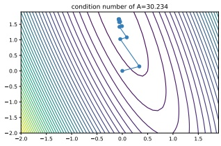

 $(a)$

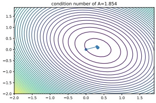

(b)

Figure 8.12: Illustration of the effect of condition number  $\kappa$ on the convergence speed of steepest descent with exact line searches. (a) Large  $\kappa$. (b) Small  $\kappa$. Generated by lineSearchConditionNum.ipynb.

#### 8.2.4 Momentum methods

Gradient descent can move very slowly along flat regions of the loss landscape, as we illustrated in Figure 8.11. We discuss some solutions to this below.

##### 8.2.4.1 Momentum

One simple heuristic, known as the heavy ball or momentum method [Ber99], is to move faster along directions that were previously good, and to slow down along directions where the gradient has suddenly changed, just like a ball rolling downhill. This can be implemented as follows:

$$
\boldsymbol{m}_{t}=\beta\boldsymbol{m}_{t-1}+\boldsymbol{g}_{t-1}   \tag*{(8.30)}
$$

$$
\boldsymbol{\theta}_{t}=\boldsymbol{\theta}_{t-1}-\boldsymbol{\eta}_{t}\boldsymbol{m}_{t}   \tag*{(8.31)}
$$

where  $m_t$ is the momentum (mass times velocity) and  $0 < \beta < 1$. A typical value of  $\beta$ is 0.9. For  $\beta = 0$, the method reduces to gradient descent.

We see that  $m_{t}$ is like an exponentially weighted moving average of the past gradients (see Section 4.4.2.2):

$$
\boldsymbol{m}_{t}=\beta\boldsymbol{m}_{t-1}+\boldsymbol{g}_{t-1}=\beta^{2}\boldsymbol{m}_{t-2}+\beta\boldsymbol{g}_{t-2}+\boldsymbol{g}_{t-1}=\cdots=\sum_{\tau=0}^{t-1}\beta^{\tau}\boldsymbol{g}_{t-\tau-1}   \tag*{(8.32)}
$$

If all the past gradients are a constant, say g, this simplifies to

$$
m_{t}=g\sum_{\tau=0}^{t-1}\beta^{\tau}   \tag*{(8.33)}
$$

The scaling factor is a geometric series, whose infinite sum is given by

$$
1+\beta+\beta^{2}+\cdots=\sum_{i=0}^{\infty}\beta^{i}=\frac{1}{1-\beta}   \tag*{(8.34)}
$$

Author: Kevin P. Murphy. (C) MIT Press. CC-BY-NC-ND license

---

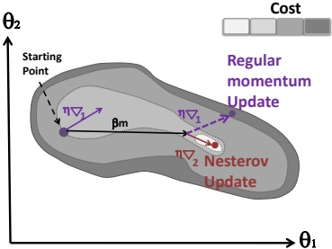

Figure 8.13: Illustration of the Nesterov update. Adapted from Figure 11.6 of [Gér19].

Thus in the limit, we multiply the gradient by  $1/(1-\beta)$. For example, if  $\beta = 0.9$, we scale the gradient up by 10.

Since we update the parameters using the gradient average  $\pmb{m}_{t-1}$, rather than just the most recent gradient,  $\pmb{g}_{t-1}$, we see that past gradients can exhibit some influence on the present. Furthermore, when momentum is combined with SGD, discussed in Section 8.4, we will see that it can simulate the effects of a larger minibatch, without the computational cost.

##### 8.2.4.2 Nesterov momentum

One problem with the standard momentum method is that it may not slow down enough at the bottom of a valley, causing oscillation. The Nesterov accelerated gradient method of [Nes04] instead modifies the gradient descent to include an extrapolation step, as follows:

$$
\tilde{\boldsymbol{\theta}}_{t+1}=\boldsymbol{\theta}_{t}+\boldsymbol{\beta}(\boldsymbol{\theta}_{t}-\boldsymbol{\theta}_{t-1})   \tag*{(8.35)}
$$

$$
\boldsymbol{\theta}_{t+1}=\tilde{\boldsymbol{\theta}}_{t+1}-\boldsymbol{\eta}_{t}\nabla\mathcal{L}(\tilde{\boldsymbol{\theta}}_{t+1})   \tag*{(8.36)}
$$

This is essentially a form of one-step “look ahead”, that can reduce the amount of oscillation, as illustrated in Figure 8.13.

Nesterov accelerated gradient can also be rewritten in the same format as standard momentum. In this case, the momentum term is updated using the gradient at the predicted new location,

$$
\pmb{m}_{t+1}=\beta\pmb{m}_{t}-\eta_{t}\nabla\mathcal{L}(\pmb{\theta}_{t}+\beta\pmb{m}_{t})   \tag*{(8.37)}
$$

$$
\theta_{t+1}=\theta_{t}+m_{t+1}   \tag*{(8.38)}
$$

This explains why the Nesterov accelerated gradient method is sometimes called Nesterov momentum. It also shows how this method can be faster than standard momentum: the momentum vector is already roughly pointing in the right direction, so measuring the gradient at the new location,  $\boldsymbol{\theta}_{t} + \beta \boldsymbol{m}_{t}$, rather than the current location,  $\boldsymbol{\theta}_{t}$, can be more accurate.

The Nesterov accelerated gradient method is provably faster than steepest descent for convex functions when  $\beta$ and  $\eta_{t}$ are chosen appropriately. It is called “accelerated” because of this improved

---

convergence rate, which is optimal for gradient-based methods using only first-order information when the objective function is convex and has Lipschitz-continuous gradients. In practice, however, using Nesterov momentum can be slower than steepest descent, and can even unstable if  $\beta$ or  $\eta_{t}$ are misspecified.

### 8.3 Second-order methods

Optimization algorithms that only use the gradient are called first-order methods. They have the advantage that the gradient is cheap to compute and to store, but they do not model the curvature of the space, and hence they can be slow to converge, as we have seen in Figure 8.12. Second-order optimization methods incorporate curvature in various ways (e.g., via the Hessian), which may yield faster convergence. We discuss some of these methods below.

#### 8.3.1 Newton's method

The classic second-order method is Newton's method. This consists of updates of the form

$$
\boldsymbol{\theta}_{t+1}=\boldsymbol{\theta}_{t}-\boldsymbol{\eta}_{t}\mathbf{H}_{t}^{-1}\boldsymbol{g}_{t}   \tag*{(8.39)}
$$

where

$$
\mathbf{H}_{t}\triangleq\nabla^{2}\mathcal{L}(\boldsymbol{\theta})|_{\boldsymbol{\theta}_{t}}=\nabla^{2}\mathcal{L}(\boldsymbol{\theta}_{t})=\mathbf{H}(\boldsymbol{\theta}_{t})   \tag*{(8.40)}
$$

is assumed to be positive-definite to ensure the update is well-defined. The pseudo-code for Newton's method is given in Algorithm 8.1. The intuition for why this is faster than gradient descent is that the matrix inverse  $\mathbf{H}^{-1}$ “undoes” any skew in the local curvature, converting a topology like Figure 8.12a to one like Figure 8.12b.

Algorithm 8.1: Newton's method for minimizing a function

1 Initialize  $\theta_0$

2 for  $t = 0, 1, 2, \ldots$ until convergence do

3  $\left\{\begin{array}{l} \text{Evaluate } g_t = \nabla \mathcal{L}(\theta_t) \\ \text{Evaluate } \mathbf{H}_t = \nabla^2 \mathcal{L}(\theta_t) \\ \text{Solve } \mathbf{H}_t \mathbf{d}_t = -\mathbf{g}_t \text{ for } \mathbf{d}_t \\ \text{Use line search to find stepsize } \eta_t \text{ along } \mathbf{d}_t \\ \theta_{t+1} = \theta_t + \eta_t \mathbf{d}_t\end{array}\right.$

This algorithm can be derived as follows. Consider making a second-order Taylor series approximation of  $\mathcal{L}(\boldsymbol{\theta})$ around  $\boldsymbol{\theta}_{t}$:

$$
\mathcal{L}_{\mathrm{quad}}(\boldsymbol{\theta})=\mathcal{L}(\boldsymbol{\theta}_{t})+\boldsymbol{g}_{t}^{\mathrm{T}}(\boldsymbol{\theta}-\boldsymbol{\theta}_{t})+\frac{1}{2}(\boldsymbol{\theta}-\boldsymbol{\theta}_{t})^{\mathrm{T}}\mathbf{H}_{t}(\boldsymbol{\theta}-\boldsymbol{\theta}_{t})   \tag*{(8.41)}
$$

The minimum of  $L_{quad}$ is at

$$
\boldsymbol{\theta}=\boldsymbol{\theta}_{t}-\mathbf{H}_{t}^{-1}\boldsymbol{g}_{t}   \tag*{(8.42)}
$$

Author: Kevin P. Murphy. (C) MIT Press. CC-BY-NC-ND license

---

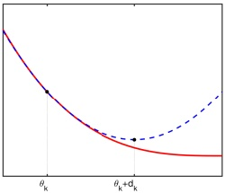

 $(a)$

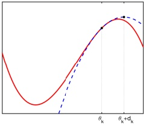

(b)

Figure 8.14: Illustration of Newton's method for minimizing a 1d function. (a) The solid curve is the function  $\mathcal{L}(x)$. The dotted line  $\mathcal{L}_{\text{quad}}(\theta)$ is its second order approximation at  $\theta_t$. The Newton step  $d_t$ is what must be added to  $\theta_t$ to get to the minimum of  $\mathcal{L}_{\text{quad}}(\theta)$. Adapted from Figure 13.4 of [Van06]. Generated by newtonsMethodMinQuad.ipynb. (b) Illustration of Newton's method applied to a nonconvex function. We fit a quadratic function around the current point  $\theta_t$ and move to its stationary point,  $\theta_{t+1} = \theta_t + d_t$. Unfortunately, this takes us near a local maximum of  $f$, not minimum. This means we need to be careful about the extent of our quadratic approximation. Adapted from Figure 13.11 of [Van06]. Generated by newtonsMethodNonConvex.ipynb.

So if the quadratic approximation is a good one, we should pick  $\mathbf{d}_t = -\mathbf{H}_t^{-1} \mathbf{g}_t$ as our descent direction. See Figure 8.14(a) for an illustration. Note that, in a “pure” Newton method, we use  $\eta_t = 1$ as our stepsize. However, we can also use linesearch to find the best stepsize; this tends to be more robust as using  $\eta_t = 1$ may not always converge globally.

If we apply this method to linear regression, we get to the optimum in one step, since (as we show in Section 11.2.2.1) we have  $\mathbf{H} = \mathbf{X}^\top \mathbf{X}$ and  $g = \mathbf{X}^\top \mathbf{X} w - \mathbf{X}^\top y$, so the Newton update becomes

$$
w_{1}=w_{0}-\mathbf{H}^{-1}\boldsymbol{g}=w_{0}-(\mathbf{X}^{\top}\mathbf{X})^{-1}(\mathbf{X}^{\top}\mathbf{X}w_{0}-\mathbf{X}^{\top}\boldsymbol{y})=w_{0}-w_{0}+(\mathbf{X}^{\top}\mathbf{X})^{-1}\mathbf{X}^{\top}\boldsymbol{y}   \tag*{(8.43)}
$$

which is the OLS estimate. However, when we apply this method to logistic regression, it may take multiple iterations to converge to the global optimum, as we discuss in Section 10.2.6.

#### 8.3.2 BFGS and other quasi-Newton methods

Quasi-Newton methods, sometimes called variable metric methods, iteratively build up an approximation to the Hessian using information gleaned from the gradient vector at each step. The most common method is called BFGS (named after its simultaneous inventors, Broyden, Fletcher, Goldfarb and Shanno), which updates the approximation to the Hessian  $\mathbf{B}_t \approx \mathbf{H}_t$ as follows:

$$
\mathbf{B}_{t+1}=\mathbf{B}_{t}+\frac{\boldsymbol{y}_{t}\boldsymbol{y}_{t}^{\top}}{\boldsymbol{y}_{t}^{\top}\boldsymbol{s}_{t}}-\frac{(\mathbf{B}_{t}\boldsymbol{s}_{t})(\mathbf{B}_{t}\boldsymbol{s}_{t})^{\top}}{\boldsymbol{s}_{t}^{\top}\mathbf{B}_{t}\boldsymbol{s}_{t}}   \tag*{(8.44)}
$$

$$
s_{t}=\theta_{t}-\theta_{t-1}   \tag*{(8.45)}
$$

$$
y_{t}=g_{t}-g_{t-1}   \tag*{(8.46)}
$$

This is a rank-two update to the matrix. If  $\mathbf{B}_0$ is positive-definite, and the step size  $\eta$ is chosen via line search satisfying both the Armijo condition in Equation (8.27) and the following curvature

---

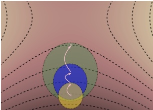

Figure 8.15: Illustration of the trust region approach. The dashed lines represents contours of the original nonconvex objective. The circles represent successive quadratic approximations. From Figure 4.2 of [Pas14]. Used with kind permission of Razvan Pascanu.

condition

$$
\nabla\mathcal{L}(\boldsymbol{\theta}_{t}+\eta\boldsymbol{d}_{t})\geq c_{2}\eta\boldsymbol{d}_{t}^{\intercal}\nabla\mathcal{L}(\boldsymbol{\theta}_{t})   \tag*{(8.47)}
$$

then  $\mathbf{B}_{t+1}$ will remain positive definite. The constant  $c_2$ is chosen within  $(c,1)$ where  $c$ is the tunable parameter in Equation (8.27). The two step size conditions are together known as the Wolfe conditions. We typically start with a diagonal approximation,  $\mathbf{B}_0 = \mathbf{I}$. Thus BFGS can be thought of as a “diagonal plus low-rank” approximation to the Hessian.

Alternatively, BFGS can iteratively update an approximation to the inverse Hessian,  $\mathbf{C}_t \approx \mathbf{H}_t^{-1}$, as follows:

$$
\mathbf{C}_{t+1}=\left(\mathbf{I}-\frac{\boldsymbol{s}_{t}\boldsymbol{y}_{t}^{\top}}{\boldsymbol{y}_{t}^{\top}\boldsymbol{s}_{t}}\right)\mathbf{C}_{t}\left(\mathbf{I}-\frac{\boldsymbol{y}_{t}\boldsymbol{s}_{t}^{\top}}{\boldsymbol{y}_{t}^{\top}\boldsymbol{s}_{t}}\right)+\frac{\boldsymbol{s}_{t}\boldsymbol{s}_{t}^{\top}}{\boldsymbol{y}_{t}^{\top}\boldsymbol{s}_{t}}   \tag*{(8.48)}
$$

Since storing the Hessian approximation still takes  $O(D^2)$ space, for very large problems, one can use limited memory BFGS, or L-BFGS, where we control the rank of the approximation by only using the  $M$ most recent  $(s_t, y_t)$ pairs while ignoring older information. Rather than storing  $\mathbf{B}_t$ explicitly, we just store these vectors in memory, and then approximate  $\mathbf{H}_t^{-1} \mathbf{g}_t$ by performing a sequence of inner products with the stored  $s_t$ and  $y_t$ vectors. The storage requirements are therefore  $O(MD)$. Typically choosing  $M$ to be between 5–20 suffices for good performance [NW06, p177].

Note that sklearn uses LBFGS as its default solver for logistic regression. $^{1}$

#### 8.3.3 Trust region methods

If the objective function is nonconvex, then the Hessian  $\mathbf{H}_t$ may not be positive definite, so  $\mathbf{d}_t = -\mathbf{H}_t^{-1} \mathbf{g}_t$ may not be a descent direction. This is illustrated in 1d in Figure 8.14(b), which shows that Newton's method can end up in a local maximum rather than a local minimum.

In general, any time the quadratic approximation made by Newton's method becomes invalid, we are in trouble. However, there is usually a local region around the current iterate where we can safely

---

approximate the objective by a quadratic. Let us call this region  $\mathcal{R}_t$, and let us call  $M(\boldsymbol{\delta})$ the model (or approximation) to the objective, where  $\boldsymbol{\delta} = \boldsymbol{\theta} - \boldsymbol{\theta}_t$. Then at each step we can solve

$$
\delta^{*}=\underset{\delta\in\mathcal{R}_{t}}{\operatorname{argmin}}M_{t}(\delta)   \tag*{(8.49)}
$$

This is called trust-region optimization. (This can be seen as the “opposite” of line search, in the sense that we pick a distance we want to travel, determined by  $\mathcal{R}_{t}$, and then solve for the optimal direction, rather than picking the direction and then solving for the optimal distance.)

We usually assume that  $M_{t}(\boldsymbol{\delta})$ is a quadratic approximation:

$$
M_{t}(\boldsymbol{\delta})=\mathcal{L}(\boldsymbol{\theta}_{t})+\boldsymbol{g}_{t}^{\top}\boldsymbol{\delta}+\frac{1}{2}\boldsymbol{\delta}^{\top}\mathbf{H}_{t}\boldsymbol{\delta}   \tag*{(8.50)}
$$

where  $\boldsymbol{g}_t = \nabla_{\boldsymbol{\theta}} \mathcal{L}(\boldsymbol{\theta})|_{\boldsymbol{\theta}_t}$ is the gradient, and  $\mathbf{H}_t = \nabla_{\boldsymbol{\theta}}^2 \mathcal{L}(\boldsymbol{\theta})|_{\boldsymbol{\theta}_t}$ is the Hessian. Furthermore, it is common to assume that  $\mathcal{R}_t$ is a ball of radius  $r$, i.e.,  $\mathcal{R}_t = \{\boldsymbol{\delta} : ||\boldsymbol{\delta}||_2 \leq r\}$. Using this, we can convert the constrained problem into an unconstrained one as follows:

$$
\boldsymbol{\delta}^{*}=\underset{\delta}{\arg\min}M(\boldsymbol{\delta})+\lambda||\boldsymbol{\delta}||_{2}^{2}=\underset{\delta}{\arg\min}\boldsymbol{g}^{\mathrm{T}}\boldsymbol{\delta}+\frac{1}{2}\boldsymbol{\delta}^{\mathrm{T}}(\mathbf{H}+\lambda\mathbf{I})\boldsymbol{\delta}   \tag*{(8.51)}
$$

for some Lagrange multiplier  $\lambda > 0$ which depends on the radius  $r$ (see Section 8.5.1 for a discussion of Lagrange multipliers). We can solve this using

$$
\delta=-(\mathbf{H}+\lambda\mathbf{I})^{-1}g   \tag*{(8.52)}
$$

This is called Tikhonov damping or Tikhonov regularization. See Figure 8.15 for an illustration.

Note that adding a sufficiently large  $\lambda I$ to H ensures the resulting matrix is always positive definite. As  $\lambda \to 0$, this trust method reduces to Newton's method, but for  $\lambda$ large enough, it will make all the negative eigenvalues positive (and all the 0 eigenvalues become equal to  $\lambda$).

### 8.4 Stochastic gradient descent

In this section, we consider stochastic optimization, where the goal is to minimize the average value of a function:

$$
\mathcal{L}(\boldsymbol{\theta})=\mathbb{E}_{q(z)}\left[\mathcal{L}(\boldsymbol{\theta},z)\right]   \tag*{(8.53)}
$$

where z is a random input to the objective. This could be a “noise” term, coming from the environment, or it could be a training example drawn randomly from the training set, as we explain below.

At each iteration, we assume we observe  $\mathcal{L}_t(\boldsymbol{\theta}) = \mathcal{L}(\boldsymbol{\theta}, \boldsymbol{z}_t)$, where  $\boldsymbol{z}_t \sim q$. We also assume a way to compute an unbiased estimate of the gradient of  $\mathcal{L}$. If the distribution  $q(z)$ is independent of the parameters we are optimizing, we can use  $\boldsymbol{g}_t = \nabla_{\boldsymbol{\theta}} \mathcal{L}_t(\boldsymbol{\theta}_t)$. In this case, the resulting algorithm can be written as follows:

$$
\theta_{t+1}=\theta_{t}-\eta_{t}\nabla\mathcal{L}(\theta_{t},z_{t})=\theta_{t}-\eta_{t}g_{t}   \tag*{(8.54)}
$$

This method is known as stochastic gradient descent or SGD. As long as the gradient estimate is unbiased, then this method will converge to a stationary point, providing we decay the step size  $\eta_{t}$ at a certain rate, as we discuss in Section 8.4.3.

---

#### 8.4.1 Application to finite sum problems

SGD is very widely used in machine learning. To see why, recall from Section 4.3 that many model fitting procedures are based on empirical risk minimization, which involve minimizing the following loss:

$$
\mathcal{L}(\boldsymbol{\theta}_{t})=\frac{1}{N}\sum_{n=1}^{N}\ell(\boldsymbol{y}_{n},f(\boldsymbol{x}_{n};\boldsymbol{\theta}_{t}))=\frac{1}{N}\sum_{n=1}^{N}\mathcal{L}_{n}(\boldsymbol{\theta}_{t})   \tag*{(8.55)}
$$

This is called a finite sum problem. The gradient of this objective has the form

$$
\boldsymbol{g}_{t}=\frac{1}{N}\sum_{n=1}^{N}\nabla_{\theta}\mathcal{L}_{n}(\boldsymbol{\theta}_{t})=\frac{1}{N}\sum_{n=1}^{N}\nabla_{\theta}\ell(\boldsymbol{y}_{n},f(\boldsymbol{x}_{n};\boldsymbol{\theta}_{t}))   \tag*{(8.56)}
$$

This requires summing over all $N$training examples, and thus can be slow if$N$is large. Fortunately we can approximate this by sampling a minibatch of$B \ll N$ samples to get

$$
\boldsymbol{g}_{t}\approx\frac{1}{\left|\mathcal{B}_{t}\right|}\sum_{n\in\mathcal{B}_{t}}\nabla_{\theta}\mathcal{L}_{n}(\boldsymbol{\theta}_{t})=\frac{1}{\left|\mathcal{B}_{t}\right|}\sum_{n\in\mathcal{B}_{t}}\nabla_{\theta}\ell(\boldsymbol{y}_{n},f(\boldsymbol{x}_{n};\boldsymbol{\theta}_{t}))   \tag*{(8.57)}
$$

where  $\mathcal{B}_{t}$ is a set of randomly chosen examples to use at iteration  $t$. $^{2}$ This is an unbiased approximation to the empirical average in Equation (8.56). Hence we can safely use this with SGD.

Although the theoretical rate of convergence of SGD is slower than batch GD (in particular, SGD has a sublinear convergence rate), in practice SGD is often faster, since the per-step time is much lower [BB08; BB11]. To see why SGD can make faster progress than full batch GD, suppose we have a dataset consisting of a single example duplicated K times. Batch training will be (at least) K times slower than SGD, since it will waste time computing the gradient for the repeated examples. Even if there are no duplicates, batch training can be wasteful, since early on in training the parameters are not well estimated, so it is not worth carefully evaluating the gradient.

#### 8.4.2 Example: SGD for fitting linear regression

In this section, we show how to use SGD to fit a linear regression model. Recall from Section 4.2.7 that the objective has the form

$$
\mathcal{L}(\boldsymbol{\theta})=\frac{1}{2N}\sum_{n=1}^{N}(\boldsymbol{x}_{n}^{\top}\boldsymbol{\theta}-y_{n})^{2}=\frac{1}{2N}||\mathbf{X}\boldsymbol{\theta}-\boldsymbol{y}||_{2}^{2}   \tag*{(8.58)}
$$

The gradient is

$$
\boldsymbol{g}_{t}=\frac{1}{N}\sum_{n=1}^{N}(\boldsymbol{\theta}_{t}^{\mathsf{T}}\boldsymbol{x}_{n}-y_{n})\boldsymbol{x}_{n}   \tag*{(8.59)}
$$

---

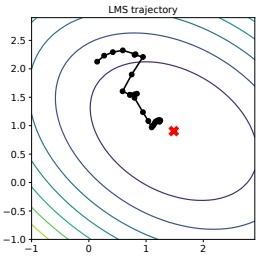

(a)

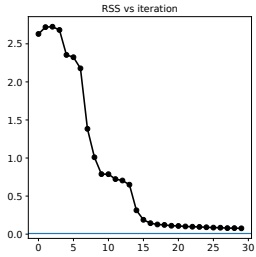

(b)

Figure 8.16: Illustration of the LMS algorithm. Left: we start from  $\pmb{\theta}=(-0.5,2)$ and slowly converging to the least squares solution of  $\hat{\pmb{\theta}}=(1.45,0.93)$ (red cross). Right: plot of objective function over time. Note that it does not decrease monotonically. Generated by lms_demo.ipynb.

Now consider using SGD with a minibatch size of B = 1. The update becomes

$$
\boldsymbol{\theta}_{t+1}=\boldsymbol{\theta}_{t}-\boldsymbol{\eta}_{t}(\boldsymbol{\theta}_{t}^{\intercal}\boldsymbol{x}_{n}-y_{n})\boldsymbol{x}_{n}   \tag*{(8.60)}
$$

where  $n = n(t)$ is the index of the example chosen at iteration t. The overall algorithm is called the least mean squares (LMS) algorithm, and is also known as the delta rule, or the Widrow-Hoff rule.

Figure 8.16 shows the results of applying this algorithm to the data shown in Figure 11.2. We start at  $\boldsymbol{\theta} = (-0.5, 2)$ and converge (in the sense that  $\|\boldsymbol{\theta}_t - \boldsymbol{\theta}_{t-1}\|_2^2$ drops below a threshold of  $10^{-2}$) in about 26 iterations. Note that SGD (and hence LMS) may require multiple passes through the data to find the optimum.

#### 8.4.3 Choosing the step size (learning rate)

When using SGD, we need to be careful in how we choose the learning rate in order to achieve convergence. For example, in Figure 8.17 we plot the loss vs the learning rate when we apply SGD to a deep neural network classifier (see Chapter 13 for details). We see a U-shaped curve, where an overly small learning rate results in underfitting, and overly large learning rate results in instability of the model (c.f., Figure 8.11(b)); in both cases, we fail to converge to a local optimum.

One heuristic for choosing a good learning rate, proposed in [Smi18], is to start with a small learning rate and gradually increase it, evaluating performance using a small number of minibatches. We then make a plot like the one in Figure 8.17, and pick the learning rate with the lowest loss. (In practice, it is better to pick a rate that is slightly smaller than (i.e., to the left of) the one with the lowest loss, to ensure stability.)

Rather than choosing a single constant learning rate, we can use a learning rate schedule, in which we adjust the step size over time. Theoretically, a sufficient condition for SGD to achieve

---

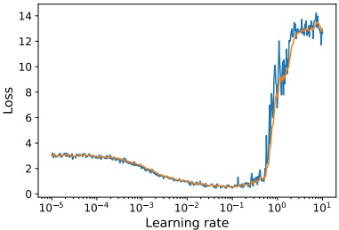

Figure 8.17: Loss vs learning rate (horizontal axis). Training loss vs learning rate for a small MLP fit to FashionMNIST using vanilla SGD. (Raw loss in blue, EWMA smoothed version in orange). Generated by lrschedule_tf.ipynb.

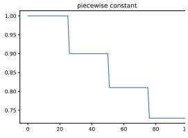

(a)

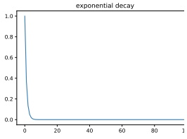

(b)

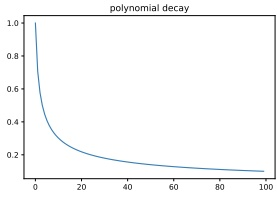

(c)

Figure 8.18: Illustration of some common learning rate schedules. (a) Piecewise constant. (b) Exponential decay. (c) Polynomial decay. Generated by learning_rate_plot.ipynb.

convergence is if the learning rate schedule satisfies the Robbins-Monro conditions:

$$
\eta_{t}\to0,\frac{\sum_{t=1}^{\infty}\eta_{t}^{2}}{\sum_{t=1}^{\infty}\eta_{t}}\to0   \tag*{(8.61)}
$$

Some common examples of learning rate schedules are listed below:

$$
\eta_{t}=\eta_{i}\mathrm{~i f~}t_{i}\leq t\leq t_{i+1}\quad\mathrm{p i e c e w i s e~c o n s t a n t}   \tag*{(8.62)}
$$

$$
\eta_{t}=\eta_{0}e^{-\lambda t}\mathrm{e x p o n e n t i a l}\mathrm{d e c a y}   \tag*{(8.63)}
$$

$$
\eta_{t}=\eta_{0}(\beta t+1)^{-\alpha}polynomial decay   \tag*{(8.64)}
$$

In the piecewise constant schedule, $t_i$are a set of time points at which we adjust the learning rate to a specified value. For example, we may set$\eta_i = \eta_0 \gamma^i$, which reduces the initial learning rate by a factor of $\gamma$for each threshold (or milestone) that we pass. Figure 8.18a illustrates this for$\eta_0 = 1$.

Author: Kevin P. Murphy. (C) MIT Press. CC-BY-NC-ND license

---

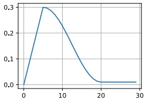

 $(a)$

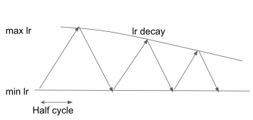

(b)

Figure 8.19: (a) Linear warm-up followed by cosine cool-down. (b) Cyclical learning rate schedule.

and  $\gamma = 0.9$. This is called step decay. Sometimes the threshold times are computed adaptively, by estimating when the train or validation loss has plateaued; this is called reduce-on-plateau. Exponential decay is typically too fast, as illustrated in Figure 8.18b. A common choice is polynomial decay, with  $\alpha = 0.5$ and  $\beta = 1$, as illustrated in Figure 8.18c; this corresponds to a square-root schedule,  $\eta_t = \eta_0 \frac{1}{\sqrt{t+1}}$.

In the deep learning community, another common schedule is to quickly increase the learning rate and then gradually decrease it again, as shown in Figure 8.19a. This is called learning rate warmup, or the one-cycle learning rate schedule [Smi18]. The motivation for this is the following: initially the parameters may be in a part of the loss landscape that is poorly conditioned, so a large step size will "bounce around" too much (c.f., Figure 8.11(b)) and fail to make progress downhill. However, with a slow learning rate, the algorithm can discover flatter regions of space, where a larger step size can be used. Once there, fast progress can be made. However, to ensure convergence to a point, we must reduce the learning rate to 0. See [Got+19; Gil+21] for more details.

It is also possible to increase and decrease the learning rate multiple times, in a cyclical fashion. This is called a cyclical learning rate [Smi18], and was popularized by the fast.ai course. See Figure 8.19b for an illustration using triangular shapes. The motivation behind this approach is to escape local minima. The minimum and maximum learning rates can be found based on the initial "dry run" described above, and the half-cycle can be chosen based on how many restarts you want to do with your training budget. A related approach, known as stochastic gradient descent with warm restarts, was proposed in [LH17]; they proposed storing all the checkpoints visited after each cool down, and using all of them as members of a model ensemble. (See Section 18.2 for a discussion of ensemble learning.)

An alternative to using heuristics for estimating the learning rate is to use line search (Section 8.2.2.2). This is tricky when using SGD, because the noisy gradients make the computation of the Armijo condition difficult [CS20]. However, [Vas+19] show that it can be made to work if the variance of the gradient noise goes to zero over time. This can happen if the model is sufficiently flexible that it can perfectly interpolate the training set.

---

#### 8.4.4 Iterate averaging

The parameter estimates produced by SGD can be very unstable over time. To reduce the variance of the estimate, we can compute the average using

$$
\overline{{\boldsymbol{\theta}}}_{t}=\frac{1}{t}\sum_{i=1}^{t}\boldsymbol{\theta}_{i}=\frac{1}{t}\boldsymbol{\theta}_{t}+\frac{t-1}{t}\overline{{\boldsymbol{\theta}}}_{t-1}   \tag*{(8.65)}
$$

where  $\theta_{t}$ are the usual SGD iterates. This is called iterate averaging or Polyak-Ruppert averaging [Rup88].

In [PJ92], they prove that the estimate  $\overline{\theta}_{t}$ achieves the best possible asymptotic convergence rate among SGD algorithms, matching that of variants using second-order information, such as Hessians.

This averaging can also have statistical benefits. For example, in [NR18], they prove that, in the case of linear regression, this method is equivalent to  $\ell_{2}$ regularization (i.e., ridge regression).

Rather than an exponential moving average of SGD iterates, Stochastic Weight Averaging (SWA) [Izm+18] uses an equal average in conjunction with a modified learning rate schedule. In contrast to standard Polyak-Ruppert averaging, which was motivated for faster convergence rates, SWA exploits the flatness in objectives used to train deep neural networks, to find solutions which provide better generalization.

#### 8.4.5 Variance reduction  $*$

In this section, we discuss various ways to reduce the variance in SGD. In some cases, this can improve the theoretical convergence rate from sublinear to linear (i.e., the same as full-batch gradient descent) [SLRB17; JZ13; DBLJ14]. These methods reduce the variance of the gradients, rather than the parameters themselves and are designed to work for finite sum problems.

##### 8.4.5.1 SVRG

The basic idea of stochastic variance reduced gradient (SVRG) [JZ13] is to use a control variate, in which we estimate a baseline value of the gradient based on the full batch, which we then use to compare the stochastic gradients to.

More precisely, ever so often (e.g., once per epoch), we compute the full gradient at a “snapshot” of the model parameters  $\hat{\theta}$; the corresponding “exact” gradient is therefore  $\nabla\mathcal{L}(\hat{\theta})$. At step  $t$, we compute the usual stochastic gradient at the current parameters,  $\nabla\mathcal{L}_t(\theta_t)$, but also at the snapshot parameters,  $\nabla\mathcal{L}_t(\hat{\theta})$, which we use as a baseline. We can then use the following improved gradient estimate

$$
\boldsymbol{g}_{t}=\nabla\mathcal{L}_{t}(\boldsymbol{\theta}_{t})-\nabla\mathcal{L}_{t}(\tilde{\boldsymbol{\theta}})+\nabla\mathcal{L}(\tilde{\boldsymbol{\theta}})   \tag*{(8.66)}
$$

to compute  $\boldsymbol{\theta}_{t+1}$. This is unbiased because  $\mathbb{E}\left[\nabla\mathcal{L}_{t}(\tilde{\boldsymbol{\theta}})\right] = \nabla\mathcal{L}(\tilde{\boldsymbol{\theta}})$. Furthermore, the update only involves two gradient computations, since we can compute  $\nabla\mathcal{L}(\tilde{\boldsymbol{\theta}})$ once per epoch. At the end of the epoch, we update the snapshot parameters,  $\tilde{\boldsymbol{\theta}}$, based on the most recent value of  $\boldsymbol{\theta}_{t}$, or a running average of the iterates, and update the expected baseline. (We can compute snapshots less often, but then the baseline will not be correlated with the objective and can hurt performance, as shown in [DB18].)

Author: Kevin P. Murphy. (C) MIT Press. CC-BY-NC-ND license

---

Iterations of SVRG are computationally faster than those of full-batch GD, but SVRG can still match the theoretical convergence rate of GD.

##### 8.4.5.2 SAGA

In this section, we describe the stochastic averaged gradient accelerated (SAGA) algorithm of [DBLJ14]. Unlike SVRG, it only requires one full batch gradient computation, at the start of the algorithm. However, it "pays" for this saving in time by using more memory. In particular, it must store N gradient vectors. This enables the method to maintain an approximation of the global gradient by removing the old local gradient from the overall sum and replacing it with the new local gradient. This is called an aggregated gradient method.

More precisely, we first initialize by computing  $g_{n}^{\text{local}} = \nabla \mathcal{L}_{n}(\boldsymbol{\theta}_{0})$ for all  $n$, and the average,  $g^{\text{avg}} = \frac{1}{N} \sum_{n=1}^{N} g_{n}^{\text{local}}$. Then, at iteration  $t$, we use the gradient estimate

$$
\boldsymbol{g}_{t}=\nabla\mathcal{L}_{n}(\boldsymbol{\theta}_{t})-\boldsymbol{g}_{n}^{\mathrm{l o c a l}}+\boldsymbol{g}^{\mathrm{a v g}}   \tag*{(8.67)}
$$

where  $n \sim \text{Unif}\{1, \ldots, N\}$ is the example index sampled at iteration  $t$. We then update  $g_n^{\text{local}} = \nabla \mathcal{L}_n(\boldsymbol{\theta}_t)$ and  $g^{\text{avg}}$ by replacing the old  $g_n^{\text{local}}$ by its new value.

This has an advantage over SVRG since it only has to do one full batch sweep at the start. (In fact, the initial sweep is not necessary, since we can compute  $g^{avg}$ “lazily”, by only incorporating gradients we have seen so far.) The downside is the large extra memory cost. However, if the features (and hence gradients) are sparse, the memory cost can be reasonable. Indeed, the SAGA algorithm is recommended for use in the sklearn logistic regression code when N is large and x is sparse. $^{3}$

##### 8.4.5.3 Application to deep learning

Variance reduction methods are widely used for fitting ML models with convex objectives, such as linear models. However, there are various difficulties associated with using SVRG with conventional deep learning training practices. For example, the use of batch normalization (Section 14.2.4.1), data augmentation (Section 19.1) and dropout (Section 13.5.4) all break the assumptions of the method, since the loss will differ randomly in ways that depend not just on the parameters and the data index n. For more details, see e.g., [DB18; Arn+19].

#### 8.4.6 Preconditioned SGD

In this section, we consider preconditioned SGD, which involves the following update:

$$
\boldsymbol{\theta}_{t+1}=\boldsymbol{\theta}_{t}-\boldsymbol{\eta}_{t}\mathbf{M}_{t}^{-1}\boldsymbol{g}_{t},   \tag*{(8.68)}
$$

where  $M_t$ is a preconditioning matrix, or simply the preconditioner, typically chosen to be positive-definite. Unfortunately the noise in the gradient estimates make it difficult to reliably estimate the Hessian, which makes it difficult to use the methods from Section 8.3. In addition, it is expensive to solve for the update direction with a full preconditioning matrix. Therefore most practitioners use a diagonal preconditioner  $M_t$. Such preconditioners do not necessarily use second-order information, but often result in speedups compared to vanilla SGD. See also [Roo+21]

---

for a probabilistic interpretation of these heuristics, and sgd_comparison.ipynb for an empirical comparison on some simple datasets.

##### 8.4.6.1 ADAGRAD

The ADAGRAD (short for “adaptive gradient”) method of [DHS11] was originally designed for optimizing convex objectives where many elements of the gradient vector are zero; these might correspond to features that are rarely present in the input, such as rare words. The update has the following form

$$
\theta_{t+1,d}=\theta_{t,d}-\eta_{t}\frac{1}{\sqrt{s_{t,d}+\epsilon}}g_{t,d}   \tag*{(8.69)}
$$

where  $d = 1 : D$ indexes the dimensions of the parameter vector, and

$$
s_{t,d}=\sum_{i=1}^{t}g_{i,d}^{2}   \tag*{(8.70)}
$$

is the sum of the squared gradients and  $\epsilon > 0$ is a small term to avoid dividing by zero. Equivalently we can write the update in vector form as follows:

$$
\Delta\theta_{t}=-\eta_{t}\frac{1}{\sqrt{s_{t}+\epsilon}}g_{t}   \tag*{(8.71)}
$$

where the square root and division is performed elementwise. Viewed as preconditioned SGD, this is equivalent to taking  $\mathbf{M}_t = \mathrm{diag}(\mathbf{s}_t + \boldsymbol{\epsilon})^{1/2}$. This is an example of an adaptive learning rate; the overall stepsize  $\eta_t$ still needs to be chosen, but the results are less sensitive to it compared to vanilla GD. In particular, we usually fix  $\eta_t = \eta_0$.

##### 8.4.6.2 RMSProp and AdaDelta

A defining feature of ADAGRAD is that the term in the denominator gets larger over time, so the effective learning rate drops. While it is necessary to ensure convergence, it might hurt performance as the denominator gets large too fast.

An alternative is to use an exponentially weighted moving average (EWMA, Section 4.4.2.2) of the past squared gradients, rather than their sum:

$$
s_{t+1,d}=\beta s_{t,d}+(1-\beta)g_{t,d}^{2}   \tag*{(8.72)}
$$

In practice we usually use  $\beta\sim0.9$, which puts more weight on recent examples. In this case,

$$
\sqrt{s_{t,d}}\approx RMS(\boldsymbol{g}_{1:t,d})=\sqrt{\frac{1}{t}\sum_{\tau=1}^{t}g_{\tau,d}^{2}}   \tag*{(8.73)}
$$

where RMS stands for “root mean squared”. Hence this method, (which is based on the earlier RPROP method of [RB93]) is known as RMSProp [Hin14]. The overall update of RMSProp is

$$
\Delta\theta_{t}=-\eta_{t}\frac{1}{\sqrt{s_{t}+\epsilon}}g_{t}.   \tag*{(8.74)}
$$

Author: Kevin P. Murphy. (C) MIT Press. CC-BY-NC-ND license

---

The ADADELTA method was independently introduced in [Zei12], and is similar to RMSprop. However, in addition to accumulating an EWMA of the gradients in  $\hat{s}$, it also keeps an EWMA of the updates  $\delta_{t}$ to obtain an update of the form

$$
\Delta\theta_{t}=-\eta_{t}\frac{\sqrt{\delta_{t-1}+\epsilon}}{\sqrt{s_{t}+\epsilon}}g_{t}   \tag*{(8.75)}
$$

where

$$
\boldsymbol{\delta}_{t}=\beta\boldsymbol{\delta}_{t-1}+(1-\beta)(\Delta\boldsymbol{\theta}_{t})^{2}   \tag*{(8.76)}
$$

and $s_t$is the same as in RMSPROP. This has the advantage that the “units” of the numerator and denominator cancel, so we are just elementwise-multiplying the gradient by a scalar. This eliminates the need to tune the learning rate$\eta_t$, which means one can simply set $\eta_t = 1$, although popular implementations of ADADELTA still keep $\eta_t$as a tunable hyperparameter. However, since these adaptive learning rates need not decrease with time (unless we choose$\eta_t$ to explicitly do so), these methods are not guaranteed to converge to a solution.

##### 8.4.6.3 ADAM

It is possible to combine RMSPROP with momentum. In particular, let us compute an EWMA of the gradients (as in momentum) and squared gradients (as in RMSPROP)

$$
\boldsymbol{m}_{t}=\beta_{1}\boldsymbol{m}_{t-1}+(1-\beta_{1})\boldsymbol{g}_{t}   \tag*{(8.77)}
$$

$$
\boldsymbol{s}_{t}=\beta_{2}\boldsymbol{s}_{t-1}+(1-\beta_{2})\boldsymbol{g}_{t}^{2}   \tag*{(8.78)}
$$

We then perform the following update:

$$
\theta_{t}=\theta_{t}-\eta_{t}\frac{m_{t}}{\sqrt{s_{t}}+\epsilon}   \tag*{(8.79)}
$$

The resulting method is known as ADAM, which stands for “adaptive moment estimation” [KB15].

The standard values for the various constants are  $\beta_1 = 0.9$,  $\beta_2 = 0.999$ and  $\epsilon = 10^{-6}$. (If we set  $\beta_1 = 0$ and no bias-correction, we recover RMSPROP, which does not use momentum.) For the overall learning rate, it is common to use a fixed value such as  $\eta_t = 0.001$. Again, as the adaptive learning rate may not decrease over time, convergence is not guaranteed (see Section 8.4.6.4).

If we initialize with  $\boldsymbol{m}_{0} = \boldsymbol{s}_{0} = \mathbf{0}$, then initial estimates will be biased towards small values. The authors therefore recommend using the bias-corrected moments, which increase the values early in the optimization process. These estimates are given by

$$
\hat{\boldsymbol{m}}_{t}=\boldsymbol{m}_{t}/(1-\beta_{1}^{t})   \tag*{(8.80)}
$$

$$
\hat{\boldsymbol{s}}_{t}=\boldsymbol{s}_{t}/(1-\beta_{2}^{t})   \tag*{(8.81)}
$$

The advantage of bias-correction is shown in Figure 4.3.

---

##### 8.4.6.4 Issues with adaptive learning rates

When using diagonal scaling methods, the overall learning rate is determined by  $\eta_0M_t^{-1}$, which changes with time. Hence these methods are often called adaptive learning rate methods. However, they still require setting the base learning rate  $\eta_0$.

Since the EWMA methods are typically used in the stochastic setting where the gradient estimates are noisy, their learning rate adaptation can result in non-convergence even on convex problems [RKK18]. In  $[Zha+22]$ they show experimentally that vanilla Adam can be made to converge provided the  $\beta_1$ and  $\beta_2$ parameters are tuned on a per-dataset basis, but it is better to find an automatic, robust method. Various solutions to this problem have been proposed, including AMSGRAD [RKK18], PADAM [CG18; Zho+18], and YOGI [Zah+18]. For example, the YOGI update modifies ADAM by replacing

$$
\boldsymbol{s}_{t}=\beta_{2}\boldsymbol{s}_{t-1}+(1-\beta_{2})\boldsymbol{g}_{t}^{2}=\boldsymbol{s}_{t-1}+(1-\beta_{2})(\boldsymbol{g}_{t}^{2}-\boldsymbol{s}_{t-1})   \tag*{(8.82)}
$$

with

$$
\boldsymbol{s}_{t}=\boldsymbol{s}_{t-1}+(1-\beta_{2})\boldsymbol{g}_{t}^{2}\odot\operatorname{sgn}(\boldsymbol{g}_{t}^{2}-\boldsymbol{s}_{t-1})   \tag*{(8.83)}
$$

More recently,  $[\tan+24]$ proposed ADOPT, which not only results in provable convergence, but also seems to work better in practice. The basic idea is to normalize (precondition) the gradient before computing the momentum update, i.e., we use  $m_t = \beta_1 m_{t-1} + (1 - \beta_1) \frac{g_t}{\sqrt{s_{t-1} + \epsilon}}$ instead of  $m_t = \beta_1 m_{t-1} + (1 - \beta_1) g_t$. We also now update the parameters using  $\theta_t = \theta_t - \eta_t m_t$ instead of  $\theta_t = \theta_t - \eta_t \frac{m_t}{\sqrt{s_{t} + \epsilon}}$.

##### 8.4.6.5 Non-diagonal preconditioning matrices

Although the methods we have discussed above can adapt the learning rate of each parameter, they do not solve the more fundamental problem of ill-conditioning due to correlation of the parameters, and hence do not always provide as much of a speed boost over vanilla SGD as one may hope.

One way to get faster convergence is to use the following preconditioning matrix, known as full-matrix Adagrad [DHS11]:

$$
\mathbf{M}_{t}=[(\mathbf{G}_{t}\mathbf{G}_{t}^{\mathsf{T}})^{\frac{1}{2}}+\epsilon\mathbf{I}_{D}]^{-1}   \tag*{(8.84)}
$$

where

$$
\mathbf{G}_{t}=[g_{t},\ldots,g_{1}]   \tag*{(8.85)}
$$

Here  $g_i = \nabla_{\psi} c(\psi_i)$ is the D-dimensional gradient vector computed at step  $i$. Unfortunately,  $M_t$ is a  $D \times D$ matrix, which is expensive to store and invert.

The Shampoo algorithm [GKS18] makes a block diagonal approximation to M, one per layer of the model, and then exploits Kronecker product structure to efficiently invert it. (It is called “shampoo” because it uses a conditioner.) Recently, [Ani+20] scaled this method up to fit very large deep models in record time.

Author: Kevin P. Murphy. (C) MIT Press. CC-BY-NC-ND license

---

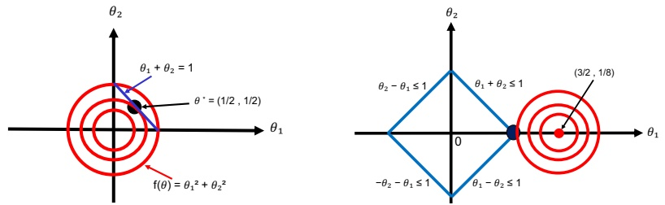

Figure 8.20: Illustration of some constrained optimization problems. Red contours are the level sets of the objective function  $\mathcal{L}(\boldsymbol{\theta})$. Optimal constrained solution is the black dot, (a) Blue line is the equality constraint  $h(\boldsymbol{\theta}) = 0$. (b) Blue lines denote the inequality constraints  $|\theta_1| + |\theta_2| \leq 1$. (Compare to Figure 11.8 (left).)

### 8.5 Constrained optimization

In this section, we consider the following constrained optimization problem:

$$
\theta^{*}=\arg\min_{\theta\in\mathcal{C}}\mathcal{L}(\theta)   \tag*{(8.86)}
$$

where the feasible set, or constraint set, is

$$
\mathcal{C}=\{\boldsymbol{\theta}\in\mathbb{R}^{D}:h_{i}(\boldsymbol{\theta})=0,i\in\mathcal{E},g_{j}(\boldsymbol{\theta})\leq0,j\in\mathcal{I}\}   \tag*{(8.87)}
$$

where  $\mathcal{E}$ is the set of equality constraints, and  $\mathcal{I}$ is the set of inequality constraints.

ror example, suppose we have a quadratic objective,  $\mathcal{L}(\boldsymbol{\theta}) = \theta_1^2 + \theta_2^2$, subject to a linear equality constraint,  $h(\boldsymbol{\theta}) = 1 - \theta_1 - \theta_2 = 0$. Figure 8.20(a) plots the level sets of  $\mathcal{L}$, as well as the constraint surface. What we are trying to do is find the point  $\boldsymbol{\theta}^*$ that lives on the line, but which is closest to the origin. It is clear from the geometry that the optimal solution is  $\boldsymbol{\theta} = (0.5, 0.5)$, indicated by the solid black dot.

In the following sections, we briefly describe some of the theory and algorithms underlying constrained optimization. More details can be found in other books, such as [BV04; NW06; Ber15; Ber16].

#### 8.5.1 Lagrange multipliers

In this section, we discuss how to solve equality constrained optimization problems. We initially assume that we have just one equality constraint,  $h(\boldsymbol{\theta}) = 0$.

First note that for any point on the constraint surface,  $\nabla h(\boldsymbol{\theta})$ will be orthogonal to the constraint surface. To see why, consider another point nearby,  $\boldsymbol{\theta} + \boldsymbol{\epsilon}$, that also lies on the surface. If we make a first-order Taylor expansion around  $\boldsymbol{\theta}$ we have

$$
h(\boldsymbol{\theta}+\boldsymbol{\epsilon})\approx h(\boldsymbol{\theta})+\boldsymbol{\epsilon}^{\mathsf{T}}\nabla h(\boldsymbol{\theta})   \tag*{(8.88)}
$$

---

Since both  $\theta$ and  $\theta + \epsilon$ are on the constraint surface, we must have  $h(\theta) = h(\theta + \epsilon)$ and hence  $\epsilon^\top \nabla h(\theta) \approx 0$. Since  $\epsilon$ is parallel to the constraint surface,  $\nabla h(\theta)$ must be perpendicular to it.

We seek a point $\boldsymbol{\theta}^*$on the constraint surface such that$\mathcal{L}(\boldsymbol{\theta})$is minimized. We just showed that it must satisfy the condition that$\nabla h(\boldsymbol{\theta}^*)$is orthogonal to the constraint surface. In addition, such a point must have the property that$\nabla \mathcal{L}(\boldsymbol{\theta})$is also orthogonal to the constraint surface, as otherwise we could decrease$\mathcal{L}(\boldsymbol{\theta})$by moving a short distance along the constraint surface. Since both$\nabla h(\boldsymbol{\theta})$and$\nabla \mathcal{L}(\boldsymbol{\theta})$are orthogonal to the constraint surface at$\boldsymbol{\theta}^*$, they must be parallel (or anti-parallel) to each other. Hence there must exist a constant $\lambda^* \in \mathbb{R}$ such that

$$
\nabla\mathcal{L}(\boldsymbol{\theta}^{*})=\lambda^{*}\nabla h(\boldsymbol{\theta}^{*})   \tag*{(8.89)}
$$

(We cannot just equate the gradient vectors, since they may have different magnitudes.) The constant  $\lambda^*$ is called a Lagrange multiplier, and can be positive, negative, or zero. This latter case occurs when  $\nabla\mathcal{L}(\theta^*) = 0$.

We can convert Equation (8.89) into an objective, known as the Lagrangian, that we should find a stationary point of the following:

$$
L(\boldsymbol{\theta},\lambda)\triangleq\mathcal{L}(\boldsymbol{\theta})+\lambda h(\boldsymbol{\theta})   \tag*{(8.90)}
$$

At a stationary point of the Lagrangian, we have

$$
\nabla_{\theta,\lambda}L(\theta,\lambda)=\mathbf{0}\iff\lambda\nabla_{\theta}h(\theta)=\nabla\mathcal{L}(\theta),h(\theta)=0   \tag*{(8.91)}
$$

This is called a \textit{critical point}, and satisfies the original constraint  $h(\boldsymbol{\theta}) = 0$ and Equation (8.89). If we have m > 1 constraints, we can form a new constraint function by addition, as follows:

$$
L(\boldsymbol{\theta},\boldsymbol{\lambda})=\mathcal{L}(\boldsymbol{\theta})+\sum_{j=1}^{m}\lambda_{j}h_{j}(\boldsymbol{\theta})   \tag*{(8.92)}
$$

We now have  $D+m$ equations in  $D+m$ unknowns and we can use standard unconstrained optimization methods to find a stationary point. We give some examples below.

##### 8.5.1.1 Example: 2d Quadratic objective with one linear equality constraint

Consider minimizing  $\mathcal{L}(\boldsymbol{\theta}) = \theta_1^2 + \theta_2^2$ subject to the constraint that  $\theta_1 + \theta_2 = 1$. (This is the problem illustrated in Figure 8.20(a).) The Lagrangian is

$$
L(\theta_{1},\theta_{2},\lambda)=\theta_{1}^{2}+\theta_{2}^{2}+\lambda(\theta_{1}+\theta_{2}-1)   \tag*{(8.93)}
$$

We have the following conditions for a stationary point:

$$
\frac{\partial}{\partial\theta_{1}}L(\theta_{1},\theta_{2},\lambda)=2\theta_{1}+\lambda=0   \tag*{(8.94)}
$$

$$
\frac{\partial}{\partial\theta_{2}}L(\theta_{1},\theta_{2},\lambda)=2\theta_{2}+\lambda=0   \tag*{(8.95)}
$$

$$
\frac{\partial}{\partial\lambda}L(\theta_{1},\theta_{2},\lambda)=\theta_{1}+\theta_{2}-1=0   \tag*{(8.96)}
$$

From Equations 8.94 and 8.95 we find  $2\theta_1 = -\lambda = 2\theta_2$, so  $\theta_1 = \theta_2$. Also, from Equation (8.96), we find  $2\theta_1 = 1$. So  $\theta^* = (0.5, 0.5)$, as we claimed earlier. Furthermore, this is the global minimum since the objective is convex and the constraint is affine.

Author: Kevin P. Murphy. (C) MIT Press. CC-BY-NC-ND license

---

#### 8.5.2 The KKT conditions

In this section, we generalize the concept of Lagrange multipliers to additionally handle inequality constraints.

First consider the case where we have a single inequality constraint  $g(\boldsymbol{\theta}) \leq 0$. To find the optimum, one approach would be to consider an unconstrained problem where we add the penalty as an infinite step function:

$$
\hat{\mathcal{L}}(\boldsymbol{\theta})=\mathcal{L}(\boldsymbol{\theta})+\infty\mathbb{I}\left(g(\boldsymbol{\theta})>0\right)   \tag*{(8.97)}
$$

However, this is a discontinuous function that is hard to optimize.

Instead, we create a lower bound of the form  $\mu g(\boldsymbol{\theta})$, where  $\mu \geq 0$. This gives us the following Lagrangian:

$$
L(\boldsymbol{\theta},\mu)=\mathcal{L}(\boldsymbol{\theta})+\mu g(\boldsymbol{\theta})   \tag*{(8.98)}
$$

Note that the step function can be recovered using

$$
\hat{\mathcal{L}}(\boldsymbol{\theta})=\max_{\mu\geq0}L(\boldsymbol{\theta},\mu)=\begin{cases}\infty&if g(\boldsymbol{\theta})>0,\\ \mathcal{L}(\boldsymbol{\theta})&otherwise\end{cases}   \tag*{(8.99)}
$$

Thus our optimization problem becomes

$$
\min_{\boldsymbol{\theta}}\max_{\mu\geq0}L(\boldsymbol{\theta},\mu)   \tag*{(8.100)}
$$

Now consider the general case where we have multiple inequality constraints,  $g(\theta) \leq 0$, and multiple equality constraints,  $h(\theta) = 0$. The generalized Lagrangian becomes

$$
L(\boldsymbol{\theta},\boldsymbol{\mu},\boldsymbol{\lambda})=\mathcal{L}(\boldsymbol{\theta})+\sum_{i}\mu_{i}g_{i}(\boldsymbol{\theta})+\sum_{j}\lambda_{j}h_{j}(\boldsymbol{\theta})   \tag*{(8.101)}
$$

(We are free to change  $-\lambda_j h_j$ to  $+ \lambda_j h_j$ since the sign is arbitrary.) Our optimization problem becomes

$$
\min_{\theta}\max_{\mu\geq0,\lambda}L(\theta,\mu,\lambda)   \tag*{(8.102)}
$$

When L and g are convex, then all critical points of this problem must satisfy the following criteria (under some conditions [BV04, Sec.5.2.3]):

• All constraints are satisfied (this is called feasibility):

$$
g(\theta)\leq0,h(\theta)=0   \tag*{(8.103)}
$$

• The solution is a stationary point:

$$
\nabla\mathcal{L}(\boldsymbol{\theta}^{*})+\sum_{i}\mu_{i}\nabla g_{i}(\boldsymbol{\theta}^{*})+\sum_{j}\lambda_{j}\nabla h_{j}(\boldsymbol{\theta}^{*})=\mathbf{0}   \tag*{(8.104)}
$$

“Probabilistic Machine Learning: An Introduction”. Online version. November 23, 2024

---

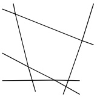

(a)

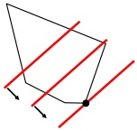

(b)

Figure 8.21: (a) A convex polytope in 2d defined by the intersection of linear constraints. (b) Depiction of the feasible set as well as the linear objective function. The red line is a level set of the objective, and the arrow indicates the direction in which it is improving. We see that the optimal solution lies at a vertex of the polytope.

- The penalty for the inequality constraint points in the right direction (this is called dual feasibility):

$$
\mu\geq0   \tag*{(8.105)}
$$

- The Lagrange multipliers pick up any slack in the inactive constraints, i.e., either  $\mu_i = 0$ or  $g_i(\boldsymbol{\theta}^*) = 0$, so

$$
\mu\odot g=0   \tag*{(8.106)}
$$

This is called complementary slackness.

To see why the last condition holds, consider (for simplicity) the case of a single inequality constraint,  $g(\boldsymbol{\theta}) \leq 0$. Either it is  $\textbf{active}$, meaning  $g(\boldsymbol{\theta}) = 0$, or it is inactive, meaning  $g(\boldsymbol{\theta}) < 0$. In the active case, the solution lies on the constraint boundary, and  $g(\boldsymbol{\theta}) = 0$ becomes an equality constraint; then we have  $\nabla \mathcal{L} = \mu \nabla g$ for some constant  $\mu \neq 0$, because of Equation (8.89). In the inactive case, the solution is not on the constraint boundary; we still have  $\nabla \mathcal{L} = \mu \nabla g$, but now  $\mu = 0$.

These are called the Karush-Kuhn-Tucker (KKT) conditions. If L is a convex function, and the constraints define a convex set, the KKT conditions are sufficient for (global) optimality, as well as necessary.

#### 8.5.3 Linear programming

Consider optimizing a linear function subject to linear constraints. When written in standard form, this can be represented as

$$
\min_{\boldsymbol{\theta}}\boldsymbol{c}^{\mathrm{T}}\boldsymbol{\theta}\qquad\mathrm{s.t.}\quad\mathbf{A}\boldsymbol{\theta}\leq\boldsymbol{b},\boldsymbol{\theta}\geq0   \tag*{(8.107)}
$$

The feasible set defines a convex polytope, which is a convex set defined as the intersection of half spaces. See Figure 8.21(a) for a 2d example. Figure 8.21(b) shows a linear cost function that

Author: Kevin P. Murphy. (C) MIT Press. CC-BY-NC-ND license

---

decreases as we move to the bottom right. We see that the lowest point that is in the feasible set is a vertex. In fact, it can be proved that the optimum point always occurs at a vertex of the polytope, assuming the solution is unique. If there are multiple solutions, the line will be parallel to a face. There may also be no optima inside the feasible set; in this case, the problem is said to be infeasible.

##### 8.5.3.1 The simplex algorithm

It can be shown that the optima of an LP occur at vertices of the polytope defining the feasible set (see Figure 8.21(b) for an example). The simplex algorithm solves LPs by moving from vertex to vertex, each time seeking the edge which most improves the objective.

In the worst-case scenario, the simplex algorithm can take time exponential in D, although in practice it is usually very efficient. There are also various polynomial-time algorithms, such as the interior point method, although these are often slower in practice.

##### 8.5.3.2 Applications

There are many applications of linear programming in science, engineering and business. It is also useful in some machine learning problems. For example, Section 11.6.1.1 shows how to use it to solve robust linear regression. It is also useful for state estimation in graphical models (see e.g., [SGJ11]).

#### 8.5.4 Quadratic programming

Consider minimizing a quadratic objective subject to linear equality and inequality constraints. This kind of problem is known as a quadratic program or QP, and can be written as follows:

$$
\min_{\boldsymbol{\theta}}\frac{1}{2}\boldsymbol{\theta}^{\mathrm{T}}\mathbf{H}\boldsymbol{\theta}+\boldsymbol{c}^{\mathrm{T}}\boldsymbol{\theta}\qquad\mathrm{s.t.}\quad\mathbf{A}\boldsymbol{\theta}\leq\boldsymbol{b},\mathbf{C}\boldsymbol{\theta}=\boldsymbol{d}   \tag*{(8.108)}
$$

If H is positive semidefinite, then this is a convex optimization problem.

##### 8.5.4.1 Example: 2d quadratic objective with linear inequality constraints

As a concrete example, suppose we want to minimize

$$
\mathcal{L}(\boldsymbol{\theta})=(\theta_{1}-\frac{3}{2})^{2}+(\theta_{2}-\frac{1}{8})^{2}=\frac{1}{2}\boldsymbol{\theta}^{\mathrm{T}}\mathbf{H}\boldsymbol{\theta}+\boldsymbol{c}^{\mathrm{T}}\boldsymbol{\theta}+\mathrm{c o n s t}   \tag*{(8.109)}
$$

where  $\mathbf{H}=2\mathbf{I}$ and  $\mathbf{c}=-(3,1/4)$, subject to

$$
\left|\theta_{1}\right|+\left|\theta_{2}\right|\leq1   \tag*{(8.110)}
$$

See Figure 8.20(b) for an illustration.

We can rewrite the constraints as

$$
\theta_{1}+\theta_{2}\leq1,\ \theta_{1}-\theta_{2}\leq1,\ -\theta_{1}+\theta_{2}\leq1,\ -\theta_{1}-\theta_{2}\leq1   \tag*{(8.111)}
$$

which we can write more compactly as

$$
\mathbf{A}\theta\leq b   \tag*{(8.112)}
$$

---

where b = 1 and

$$
\mathbf{A}=\begin{pmatrix}{{{1}}}&{{{1}}} \\{{{1}}}&{{{-1}}} \\{{{-1}}}&{{{1}}} \\{{{-1}}}&{{{-1}}}\end{pmatrix}   \tag*{(8.113)}
$$

This is now in the standard QP form.

From the geometry of the problem, shown in Figure 8.20(b), we see that the constraints corresponding to the two left faces of the diamond are inactive (since we are trying to get as close to the center of the circle as possible, which is outside of, and to the right of, the constrained feasible region). Denoting  $g_i(\boldsymbol{\theta})$ as the inequality constraint corresponding to row  $i$ of  $\mathbf{A}$, this means  $g_3(\boldsymbol{\theta}^*) > 0$ and  $g_4(\boldsymbol{\theta}^*) > 0$, and hence, by complementarity,  $\mu_3^* = \mu_4^* = 0$. We can therefore remove these inactive constraints.

From the KKT conditions we know that

$$
\mathbf{H}\boldsymbol{\theta}+\boldsymbol{c}+\mathbf{A}^{\mathrm{T}}\boldsymbol{\mu}=\mathbf{0}   \tag*{(8.114)}
$$

Using these for the actively constrained subproblem, we get

$$
\begin{pmatrix}{{{2}}}&{{{0}}}&{{{1}}}&{{{1}}} \\{{{0}}}&{{{2}}}&{{{1}}}&{{{-1}}} \\{{{1}}}&{{{1}}}&{{{0}}}&{{{0}}} \\{{{1}}}&{{{-1}}}&{{{0}}}&{{{0}}}\end{pmatrix}\begin{pmatrix}{{{\theta_{1}}}} \\{{{\theta_{2}}}} \\{{{\mu_{1}}}} \\{{{\mu_{2}}}}\end{pmatrix}=\begin{pmatrix}{{{3}}} \\{{{1/4}}} \\{{{1}}} \\{{{1}}}\end{pmatrix}   \tag*{(8.115)}
$$

Hence the solution is

$$
\boldsymbol{\theta}_{*}=\left(1,0\right)^{\mathrm{T}},\boldsymbol{\mu}_{*}=\left(0.625,0.375,0,0\right)^{\mathrm{T}}   \tag*{(8.116)}
$$

Notice that the optimal value of θ occurs at one of the vertices of the ℓ1 "ball" (the diamond shape).

##### 8.5.4.2 Applications

There are several applications of quadratic programming in ML. For example, in Section 11.4, we discuss the lasso method for sparse linear regression, which amounts to optimizing  $\mathcal{L}(\mathbf{w}) = ||\mathbf{X}\mathbf{w} - \mathbf{y}||_2^2 + \lambda||\mathbf{w}||_1$, which can be reformulated into a QP. And in Section 17.3, we show how to use QP for SVMs (support vector machines).

#### 8.5.5 Mixed integer linear programming  $*$

Integer linear programming or ILP corresponds to minimizing a linear objective, subject to linear constraints, where the optimization variables are discrete integers instead of reals. In standard form, the problem is as follows:

$$
\min_{\boldsymbol{\theta}}\boldsymbol{c}^{\top}\boldsymbol{\theta}\qquad s.t.\quad\mathbf{A}\boldsymbol{\theta}\leq\boldsymbol{b},\boldsymbol{\theta}\geq0,\boldsymbol{\theta}\in\mathbb{Z}^{D}   \tag*{(8.117)}
$$

where Z is the set of integers. If some of the optimization variables are real-valued, it is called a mixed ILP, often called a MIP for short. (If all of the variables are real-valued, it becomes a standard LP.)

Author: Kevin P. Murphy. (C) MIT Press. CC-BY-NC-ND license

---

MIPs have a large number of applications, such as in vehicle routing, scheduling and packing. They are also useful for some ML applications, such as formally verifying the behavior of certain kinds of deep neural networks [And+18], and proving robustness properties of DNNs to adversarial (worst-case) perturbations [TXT19].

### 8.6 Proximal gradient method *

We are often interested in optimizing an objective of the form

$$
\mathcal{L}(\boldsymbol{\theta})=\mathcal{L}_{s}(\boldsymbol{\theta})+\mathcal{L}_{r}(\boldsymbol{\theta})   \tag*{(8.118)}
$$

where  $\mathcal{L}_s$ is differentiable (smooth), and  $\mathcal{L}_r$ is convex but not necessarily differentiable (i.e., it may be non-smooth or “rough”). For example,  $\mathcal{L}_s$ might be the negative log likelihood (NLL), and  $\mathcal{L}_r$ might be an indicator function that is infinite if a constraint is violated (see Section 8.6.1), or  $\mathcal{L}_r$ might be the  $\ell_1$ norm of some parameters (see Section 8.6.2), or  $\mathcal{L}_r$ might measure how far the parameters are from a set of allowed quantized values (see Section 8.6.3).

One way to tackle such problems is to use the proximal gradient method (see e.g., [PB+14; PSW15]). Roughly speaking, this takes a step of size  $\eta$ in the direction of the gradient, and then projects the resulting parameter update into a space that respects  $L_r$. More precisely, the update is as follows

$$
\theta_{t+1}=\operatorname{p r o x}_{\eta_{t}\mathcal{L}_{r}}(\boldsymbol{\theta}_{t}-\boldsymbol{\eta}_{t}\nabla\mathcal{L}_{s}(\boldsymbol{\theta}_{t}))   \tag*{(8.119)}
$$

where  $\text{prox}_{\eta\mathcal{L}_{r}}(\boldsymbol{\theta})$ is the proximal operator of  $\mathcal{L}_{r}$ (scaled by  $\eta$) evaluated at  $\boldsymbol{\theta}$:

$$
\mathrm{prox}_{\eta\mathcal{L}_{r}}(\boldsymbol{\theta})\triangleq\underset{z}{\arg\min}\left(\mathcal{L}_{r}(z)+\frac{1}{2\eta}||z-\boldsymbol{\theta}||_{2}^{2}\right)   \tag*{(8.120)}
$$

(‘The factor of  $\frac{1}{2}$ is an arbitrary convention.’) We can rewrite the proximal operator as solving a constrained optimization problem, as follows:

$$
\operatorname{prox}_{\eta\mathcal{L}_{r}}(\boldsymbol{\theta})=\underset{z}{\operatorname{argmin}}\mathcal{L}_{r}(z)\text{s.t.}\||z-\boldsymbol{\theta}||_{2}\leq\rho   \tag*{(8.121)}
$$

where the bound  $\rho$ depends on the scaling factor  $\eta$. Thus we see that the proximal projection minimizes the function while staying close to (i.e., proximal to) the current iterate. We give some examples below.

#### 8.6.1 Projected gradient descent

Suppose we want to solve the problem

$$
\underset{\boldsymbol{\theta}}{\operatorname{a r g m i n}}\mathcal{L}_{s}(\boldsymbol{\theta})\quad s.t.\quad\boldsymbol{\theta}\in\mathcal{C}   \tag*{(8.122)}
$$

where $\mathcal{C}$is a convex set. For example, we may have the box constraints$\mathcal{C} = \{\theta : l \leq \theta \leq u\}$ where we specify lower and upper bounds on each element. These bounds can be infinite for certain

---

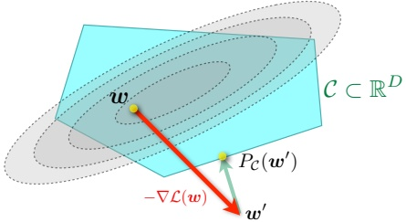

Figure 8.22: Illustration of projected gradient descent. w is the current parameter estimate, w' is the update after a gradient step, and  $P_C(\mathbf{w}')$ projects this onto the constraint set C. From https://bit.ly/3eJ3BhZ Used with kind permission of Martin Jaggi.

elements if we don’t want to constrain values along that dimension. For example, if we just want to ensure the parameters are non-negative, we set  $l_d = 0$ and  $u_d = \infty$ for each dimension  $d$.

We can convert the constrained optimization problem into an unconstrained one by adding a penalty term to the original objective:

$$
\mathcal{L}(\boldsymbol{\theta})=\mathcal{L}_{s}(\boldsymbol{\theta})+\mathcal{L}_{r}(\boldsymbol{\theta})   \tag*{(8.123)}
$$

where  $\mathcal{L}_{r}(\boldsymbol{\theta})$ is the indicator function for the convex set  $\mathcal{C}$, i.e.,

$$
\mathcal{L}_{r}(\boldsymbol{\theta})=I_{\mathcal{C}}(\boldsymbol{\theta})=\begin{cases}0&if\boldsymbol{\theta}\in\mathcal{C}\\\infty&if\boldsymbol{\theta}\notin\mathcal{C}\end{cases}   \tag*{(8.124)}
$$

We can use proximal gradient descent to solve Equation (8.123). The proximal operator for the indicator function is equivalent to projection onto the set C:

$$
\operatorname{proj}_{\mathcal{C}}(\boldsymbol{\theta})=\underset{\boldsymbol{\theta}^{\prime}\in\mathcal{C}}{\operatorname{argmin}}||\boldsymbol{\theta}^{\prime}-\boldsymbol{\theta}||_{2}   \tag*{(8.125)}
$$

This method is known as projected gradient descent. See Figure 8.22 for an illustration.

For example, consider the box constraints  $\mathcal{C} = \{\theta : l \leq \theta \leq \boldsymbol{u}\}$. The projection operator in this case can be computed elementwise by simply thresholding at the boundaries:

$$
\mathrm{proj}_{\mathcal{C}}(\boldsymbol{\theta})_{d}=\begin{cases}l_{d}&\text{if}\theta_{d}\leq l_{d}\\\theta_{d}&\text{if}l_{d}\leq\theta_{d}\leq u_{d}\\u_{d}&\text{if}\theta_{d}\geq u_{d}\end{cases}   \tag*{(8.126)}
$$

For example, if we want to ensure all elements are non-negative, we can use

$$
\mathrm{proj}_{\mathcal{C}}(\boldsymbol{\theta})=\boldsymbol{\theta}_{+}=[\max(\theta_{1},0),\ldots,\max(\theta_{D},0)]   \tag*{(8.127)}
$$

See Section 11.4.9.2 for an application of this method to sparse linear regression.

Author: Kevin P. Murphy. (C) MIT Press. CC-BY-NC-ND license

---

#### 8.6.2 Proximal operator for  $\ell_{1}$-norm regularizer

Consider a linear predictor of the form  $f(\boldsymbol{x}; \boldsymbol{\theta}) = \sum_{d=1}^{D} \theta_d x_d$. If we have  $\theta_d = 0$ for any dimension  $d$, we ignore the corresponding feature  $x_d$. This is a form of feature selection, which can be useful both as a way to reduce overfitting as well as way to improve model interpretability. We can encourage weights to be zero (and not just small) by penalizing the  $\ell_1$ norm,

$$
\left|\left|\boldsymbol{\theta}\right|\right|_{1}=\sum_{d=1}^{D}\left|\boldsymbol{\theta}_{d}\right|   \tag*{(8.128)}
$$

This is called a sparsity inducing regularizer.

To see why this induces sparsity, consider two possible parameter vectors, one which is sparse,  $\boldsymbol{\theta} = (1, 0)$, and one which is non-sparse,  $\boldsymbol{\theta}' = (1/\sqrt{2}, 1/\sqrt{2})$. Both have the same  $\ell_2$ norm

$$
\left|\left|(1,0)\right|\right|_{2}^{2}=\left|\left|(1/\sqrt{2},1/\sqrt{2})\right|\right|_{2}^{2}=1   \tag*{(8.129)}
$$

Hence  $\ell_{2}$ regularization (Section 4.5.3) will not favor the sparse solution over the dense solution. However, when using  $\ell_{1}$ regularization, the sparse solution is cheaper, since

$$
\left|\left|(1,0)\right|\right|_{1}=1<\left|\left|(1/\sqrt{2},1/\sqrt{2})\right|\right|_{1}=\sqrt{2}   \tag*{(8.130)}
$$

See Section 11.4 for more details on sparse regression.

If we combine this regularizer with our smooth loss, we get

$$
\mathcal{L}(\boldsymbol{\theta})=\mathrm{N L L}(\boldsymbol{\theta})+\lambda||\boldsymbol{\theta}||_{1}   \tag*{(8.131)}
$$

We can optimize this objective using proximal gradient descent. The key question is how to compute the prox operator for the function  $f(\boldsymbol{\theta}) = ||\boldsymbol{\theta}||_1$. Since this function decomposes over dimensions  $d$, the proximal projection can be computed componentwise. From Equation (8.120), with  $\eta = 1$, we have

$$
\mathrm{prox}_{\lambda f}(\theta)=\underset{z}{\arg\min}|z|+\frac{1}{2\lambda}(z-\theta)^{2}=\underset{z}{\arg\min}\lambda|z|+\frac{1}{2}(z-\theta)^{2}   \tag*{(8.132)}
$$

In Section 11.4.3, we show that the solution to this is given by

$$
\mathrm{prox}_{\lambda f}(\theta)=\begin{cases}\theta-\lambda&if\theta\geq\lambda\\0&if|\theta|\leq\lambda\\\theta+\lambda&if\theta\leq-\lambda\end{cases}   \tag*{(8.133)}
$$

This is known as the soft thresholding operator, since values less than  $\lambda$ in absolute value are set to 0 (thresholded), but in a continuous way. Note that soft thresholding can be written more compactly as

$$
SoftThreshold(\theta,\lambda)=sign(\theta)\left(|\theta|-\lambda\right)_{+}   \tag*{(8.134)}
$$

where  $\theta_{+} = \max(\theta, 0)$ is the positive part of  $\theta$. In the vector case, we perform this elementwise:

 
$$
SoftThreshold(\boldsymbol{\theta},\lambda)=sign(\boldsymbol{\theta})\odot(|\boldsymbol{\theta}|-\lambda)_{+}
$$
 

See Section 11.4.9.3 for an application of this method to sparse linear regression.

---

#### 8.6.3 Proximal operator for quantization

In some applications (e.g., when training deep neural networks to run on memory-limited edge devices, such as mobile phones) we want to ensure that the parameters are quantized. For example, in the extreme case where each parameter can only be -1 or +1, the state space becomes  $C = \{-1, +1\}^D$.

Let us define a regularizer that measures distance to the nearest quantized version of the parameter vector:

$$
\mathcal{L}_{r}(\boldsymbol{\theta})=\inf_{\boldsymbol{\theta}_{0}\in\mathcal{C}}||\boldsymbol{\theta}-\boldsymbol{\theta}_{0}||_{1}   \tag*{(8.136)}
$$

(We could also use the  $\ell_2$ norm.) In the case of  $\mathcal{C} = \{-1, +1\}^D$, this becomes

$$
\mathcal{L}_{r}(\boldsymbol{\theta})=\sum_{d=1}^{D}\inf_{[\theta_{0}]_{d}\in\{\pm1\}}|\theta_{d}-[\theta_{0}]_{d}|=\sum_{d=1}^{D}\min\{|\theta_{d}-1|,|\theta_{d}+1|\}=||\boldsymbol{\theta}-\mathrm{sign}(\boldsymbol{\theta})||_{1}   \tag*{(8.137)}
$$

Let us define the corresponding quantization operator to be

$$
q(\boldsymbol{\theta})=\operatorname{proj}_{\mathcal{C}}(\boldsymbol{\theta})=\operatorname{argmin}\mathcal{L}_{r}(\boldsymbol{\theta})=\operatorname{sign}(\boldsymbol{\theta})   \tag*{(8.138)}
$$

The core difficulty with quantized learning is that quantization is not a differentiable operation. A popular solution to this is to use the  $\text{straight-through estimator}$, which uses the approximation  $\frac{\partial \mathcal{L}}{\partial q(\theta)} \approx \frac{\partial \mathcal{L}}{\partial \theta}$ (see e.g., [Yin+19]). The corresponding update can be done in two steps: first compute the gradient vector at the quantized version of the current parameters, and then update the unconstrained parameters using this approximate gradient:

$$
\tilde{\boldsymbol{\theta}}_{t}=\operatorname{proj}_{\mathcal{C}}(\boldsymbol{\theta}_{t})=q(\boldsymbol{\theta}_{t})   \tag*{(8.139)}
$$

$$
\boldsymbol{\theta}_{t+1}=\boldsymbol{\theta}_{t}-\boldsymbol{\eta}_{t}\nabla\mathcal{L}_{s}(\tilde{\boldsymbol{\theta}}_{t})   \tag*{(8.140)}
$$

When applied to  $C = \{-1, +1\}^D$, this is known as the binary connect method [CBD15].

We can get better results using proximal gradient descent, in which we treat quantization as a regularizer, rather than a hard constraint; this is known as ProxQuant [BWL19]. The update becomes

$$
\tilde{\theta}_{t}=\mathrm{p r o x}_{\lambda\mathcal{L}_{r}}\left(\boldsymbol{\theta}_{t}-\boldsymbol{\eta}_{t}\nabla\mathcal{L}_{s}(\boldsymbol{\theta}_{t})\right)   \tag*{(8.141)}
$$

In the case that  $\mathcal{C} = \{-1, +1\}^D$, one can show that the proximal operator is a generalization of the soft thresholding operator in Equation (8.135):

$$
\begin{aligned}\mathrm{prox}_{\lambda\mathcal{L}_{r}}(\boldsymbol{\theta})&=SoftThreshold(\boldsymbol{\theta},\lambda,\mathrm{sign}(\boldsymbol{\theta}))\\&=\mathrm{sign}(\boldsymbol{\theta})+\mathrm{sign}(\boldsymbol{\theta}-\mathrm{sign}(\boldsymbol{\theta}))\odot(|\boldsymbol{\theta}-\mathrm{sign}(\boldsymbol{\theta})|-\lambda)_{+}\end{aligned}   \tag*{(8.142)}
$$

This can be generalized to other forms of quantization; see [Yin+19] for details.

#### 8.6.4 Incremental (online) proximal methods

Many ML problems have an objective function which is a sum of losses, one per example. Such problems can be solved incrementally; this is a special case of online learning. It is possible to extend proximal methods to this setting. For a probabilistic perspective on such methods (in terms of Kalman filtering), see [AEM18; Aky+19].

Author: Kevin P. Murphy. (C) MIT Press. CC-BY-NC-ND license

---

### 8.7 Bound optimization *

In this section, we consider a class of algorithms known as bound optimization or MM algorithms. In the context of minimization, MM stands for majorize-minimize. In the context of maximization, MM stands for minorize-maximize. We will discuss a special case of MM, known as expectation maximization or EM, in Section 8.7.2.

#### 8.7.1 The general algorithm

In this section, we give a brief outline of MM methods. (More details can be found in e.g., [HL04; Mai15; SBP17; Nad+19].) To be consistent with the literature, we assume our goal is to maximize some function  $\ell(\boldsymbol{\theta})$, such as the log likelihood, wrt its parameters  $\boldsymbol{\theta}$. The basic approach in MM algorithms is to construct a surrogate function  $Q(\boldsymbol{\theta}, \boldsymbol{\theta}^t)$ which is a tight lowerbound to  $\ell(\boldsymbol{\theta})$ such that  $Q(\boldsymbol{\theta}, \boldsymbol{\theta}^t) \leq \ell(\boldsymbol{\theta})$ and  $Q(\boldsymbol{\theta}^t, \boldsymbol{\theta}^t) = \ell(\boldsymbol{\theta}^t)$. If these conditions are met, we say that  $Q$ minorizes  $\ell$. We then perform the following update at each step:

$$
\theta^{t+1}=\underset{\theta}{\operatorname{argmax}}Q(\theta,\theta^{t})   \tag*{(8.144)}
$$

This guarantees us monotonic increases in the original objective:

$$
\ell(\boldsymbol{\theta}^{t+1})\geq Q(\boldsymbol{\theta}^{t+1},\boldsymbol{\theta}^{t})\geq Q(\boldsymbol{\theta}^{t},\boldsymbol{\theta}^{t})=\ell(\boldsymbol{\theta}^{t})   \tag*{(8.145)}
$$

where the first inequality follows since  $Q(\pmb{\theta}^{t+1}, \pmb{\theta}^{\prime})$ is a lower bound on  $\ell(\pmb{\theta}^{t+1})$ for any  $\pmb{\theta}^{\prime}$; the second inequality follows from Equation (8.144); and the final equality follows the tightness property. As a consequence of this result, if you do not observe monotonic increase of the objective, you must have an error in your math and/or code. This is a surprisingly powerful debugging tool.

This process is sketched in Figure 8.23. The dashed red curve is the original function (e.g., the log-likelihood of the observed data). The solid blue curve is the lower bound, evaluated at  $\theta^t$; this touches the objective function at  $\theta^t$. We then set  $\theta^{t+1}$ to the maximum of the lower bound (blue curve), and fit a new bound at that point (dotted green curve). The maximum of this new bound becomes  $\theta^{t+2}$, etc.

If Q is a quadratic lower bound, the overall method is similar to Newton's method, which repeatedly fits and then optimizes a quadratic approximation, as shown in Figure 8.14(a). The difference is that optimizing Q is guaranteed to lead to an improvement in the objective, even if it is not convex, whereas Newton's method may overshoot or lead to a decrease in the objective, as shown in Figure 8.24, since it is a quadratic approximation and not a bound.

#### 8.7.2 The EM algorithm

In this section, we discuss the expectation maximization (EM) algorithm [DLR77; MK97], which is a bound optimization algorithm designed to compute the MLE or MAP parameter estimate for probability models that have missing data and/or hidden variables. We let  $y_n$ be the visible data for example  $n$, and  $z_n$ be the hidden data.

The basic idea behind EM is to alternate between estimating the hidden variables (or missing values) during the E step (expectation step), and then using the fully observed data to compute the MLE during the M step (maximization step). Of course, we need to iterate this process, since the expected values depend on the parameters, but the parameters depend on the expected values.

---

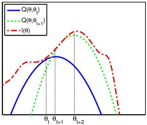

Figure 8.23: Illustration of a bound optimization algorithm. Adapted from Figure 9.14 of [Bis06]. Generated by emLogLikelihoodMax.ipynb.

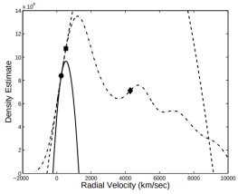

(a) Overshooting.

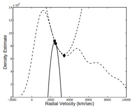

(b) Seeking the wrong root.

Figure 8.24: The quadratic lower bound of an MM algorithm (solid) and the quadratic approximation of Newton's method (dashed) superimposed on an empirical density esitmate (dotted). The starting point of both algorithms is the circle. The square denotes the outcome of one MM update. The diamond denotes the outcome of one Newton update. (a) Newton's method overshoots the global maximum. (b) Newton's method results in a reduction of the objective. From Figure 4 of [FT05]. Used with kind permission of Carlo Tomasi.

In Section 8.7.2.1, we show that EM is an MM algorithm, which implies that this iterative procedure will converge to a local maximum of the log likelihood. The speed of convergence depends on the amount of missing data, which affects the tightness of the bound [XJ96; MD97; SRG03; KKS20].

##### 8.7.2.1 Lower bound

The goal of EM is to maximize the log likelihood of the observed data:

$$
\ell(\boldsymbol{\theta})=\sum_{n=1}^{N}\log p(\boldsymbol{y}_{n}|\boldsymbol{\theta})=\sum_{n=1}^{N}\log\left[\sum_{\boldsymbol{z}_{n}}p(\boldsymbol{y}_{n},\boldsymbol{z}_{n}|\boldsymbol{\theta})\right]   \tag*{(8.146)}
$$

where  $y_{n}$ are the visible variables and  $z_{n}$ are the hidden variables. Unfortunately this is hard to optimize, since the log cannot be pushed inside the sum.

Author: Kevin P. Murphy. (C) MIT Press. CC-BY-NC-ND license

---

EM gets around this problem as follows. First, consider a set of arbitrary distributions  $q_n(z_n)$ over each hidden variable  $z_n$. The observed data log likelihood can be written as follows:

$$
\ell(\boldsymbol{\theta})=\sum_{n=1}^{N}\log\left[\sum_{z_{n}}q_{n}(z_{n})\frac{p(\boldsymbol{y}_{n},z_{n}|\boldsymbol{\theta})}{q_{n}(z_{n})}\right]   \tag*{(8.147)}
$$

Using Jensen’s inequality (Equation (6.34)), we can push the log (which is a concave function) inside the expectation to get the following lower bound on the log likelihood:

$$
\ell(\boldsymbol{\theta})\geq\sum_{n}\sum_{\boldsymbol{z}_{n}}q_{n}(\boldsymbol{z}_{n})\log\frac{p(\boldsymbol{y}_{n},\boldsymbol{z}_{n}|\boldsymbol{\theta})}{q_{n}(\boldsymbol{z}_{n})}   \tag*{(8.148)}
$$

$$
=\sum_{n}\underbrace{\mathbb{E}_{q_{n}}\left[\log p(\boldsymbol{y}_{n},\boldsymbol{z}_{n}|\boldsymbol{\theta})\right]+\mathbb{H}(q_{n})}_{\boldsymbol{\Sigma}(\boldsymbol{\theta},q_{n})}   \tag*{(8.149)}
$$

$$
=\sum_{n}\mathbb{L}(\boldsymbol{\theta},q_{n})\triangleq\mathbb{L}(\boldsymbol{\theta},\{q_{n}\})=\mathbb{L}(\boldsymbol{\theta},q_{1:N})   \tag*{(8.150)}
$$

where  $\mathbb{H}(q)$ is the entropy of probability distribution  $q$, and  $\mathbb{L}(\boldsymbol{\theta},\{q_n\})$ is called the evidence lower bound or ELBO, since it is a lower bound on the log marginal likelihood,  $\log p(\boldsymbol{y}_{1:N}|\boldsymbol{\theta})$, also called the evidence. Optimizing this bound is the basis of variational inference, which we discuss in Section 4.6.8.3.

##### 8.7.2.2 E step

We see that the lower bound is a sum of N terms, each of which has the following form:

$$
\mathrm{E}(\boldsymbol{\theta},q_{n})=\sum_{z_{n}}q_{n}(z_{n})\log\frac{p(\boldsymbol{y}_{n},z_{n}|\boldsymbol{\theta})}{q_{n}(z_{n})}   \tag*{(8.151)}
$$

$$
=\sum_{z_{n}}q_{n}(z_{n})\log\frac{p(z_{n}|\boldsymbol{y}_{n},\boldsymbol{\theta})p(\boldsymbol{y}_{n}|\boldsymbol{\theta})}{q_{n}(z_{n})}   \tag*{(8.152)}
$$

$$
=\sum_{z_{n}}q_{n}(z_{n})\log\frac{p(z_{n}|\boldsymbol{y}_{n},\boldsymbol{\theta})}{q_{n}(z_{n})}+\sum_{z_{n}}q_{n}(z_{n})\log p(\boldsymbol{y}_{n}|\boldsymbol{\theta})   \tag*{(8.153)}
$$

$$
=-D_{\mathbb{K L}}\left(q_{n}(z_{n})\mid p(z_{n}|\boldsymbol{y}_{n},\boldsymbol{\theta})\right)+\log p(\boldsymbol{y}_{n}|\boldsymbol{\theta})   \tag*{(8.154)}
$$

where  $D_{\mathbb{K}\mathbb{L}}(q \parallel p) \triangleq \sum_z q(z) \log \frac{q(z)}{p(z)}$ is the Kullback-Leibler divergence (or KL divergence for short) between probability distributions  $q$ and  $p$. We discuss this in more detail in Section 6.2, but the key property we need here is that  $D_{\mathbb{K}\mathbb{L}}(q \parallel p) \geq 0$ and  $D_{\mathbb{K}\mathbb{L}}(q \parallel p) = 0$ iff  $q = p$. Hence we can maximize the lower bound  $\mathbf{L}(\boldsymbol{\theta}, \{q_n\})$ wrt  $\{q_n\}$ by setting each one to  $q_n^* = p(\mathbf{z}_n|\mathbf{y}_n, \boldsymbol{\theta})$. This is called the  $\mathbf{E}$ step. This ensures the ELBO is a tight lower bound:

$$
\mathbb{L}(\boldsymbol{\theta},\{q_{n}^{*}\})=\sum_{n}\log p(\boldsymbol{y}_{n}|\boldsymbol{\theta})=\ell(\boldsymbol{\theta})   \tag*{(8.155)}
$$

To see how this connects to bound optimization, let us define

$$
Q(\boldsymbol{\theta},\boldsymbol{\theta}^{t})=\operatorname{L}(\boldsymbol{\theta},\{p(z_{n}|\boldsymbol{y}_{n};\boldsymbol{\theta}^{t})\})   \tag*{(8.156)}
$$

---

Then we have  $Q(\boldsymbol{\theta}, \boldsymbol{\theta}^t) \leq \ell(\boldsymbol{\theta})$ and  $Q(\boldsymbol{\theta}^t, \boldsymbol{\theta}^t) = \ell(\boldsymbol{\theta}^t)$, as required.

However, if we cannot compute the posteriors $p(z_n|y_n;\theta^t)$exactly, we can still use an approximate distribution$q(z_n|y_n;\theta^t)$; this will yield a non-tight lower-bound on the log-likelihood. This generalized version of EM is known as variational EM [NH98]. See the sequel to this book, [Mur23], for details.

##### 8.7.2.3 M step

In the M step, we need to maximize  $\mathcal{L}(\boldsymbol{\theta},\{q_n^t\})$ wrt  $\boldsymbol{\theta}$, where the  $q_n^t$ are the distributions computed in the E step at iteration t. Since the entropy terms  $\mathbb{H}(q_n)$ are constant wrt  $\boldsymbol{\theta}$, so we can drop them in the M step. We are left with

$$
\ell^{t}(\boldsymbol{\theta})=\sum_{n}\mathbb{E}_{q_{n}^{t}(\boldsymbol{z}_{n})}\left[\log p(\boldsymbol{y}_{n},\boldsymbol{z}_{n}|\boldsymbol{\theta})\right]   \tag*{(8.157)}
$$

This is called the expected complete data log likelihood. If the joint probability is in the exponential family (Section 3.4), we can rewrite this as

$$
\ell^{t}(\boldsymbol{\theta})=\sum_{n}\mathbb{E}\left[\mathcal{T}(\boldsymbol{y}_{n},\boldsymbol{z}_{n})^{\mathsf{T}}\boldsymbol{\theta}-A(\boldsymbol{\theta})\right]=\sum_{n}(\mathbb{E}\left[\mathcal{T}(\boldsymbol{y}_{n},\boldsymbol{z}_{n})\right]^{\mathsf{T}}\boldsymbol{\theta}-A(\boldsymbol{\theta}))   \tag*{(8.158)}
$$

where  $\mathbb{E}\left[\mathcal{T}(y_n, z_n)\right]$ are called the expected sufficient statistics.

In the M step, we maximize the expected complete data log likelihood to get

$$
\theta^{t+1}=\arg\max_{\theta}\sum_{n}\mathbb{E}_{q_{n}^{t}}\left[\log p(\boldsymbol{y}_{n},\boldsymbol{z}_{n}|\boldsymbol{\theta})\right]   \tag*{(8.159)}
$$

In the case of the exponential family, the maximization can be solved in closed-form by matching the moments of the expected sufficient statistics.

We see from the above that the E step does not in fact need to return the full set of posterior distributions  $\{q(z_n)\}$, but can instead just return the sum of the expected sufficient statistics,  $\sum_n \mathbb{E}_{q(z_n)} [\mathcal{T}(y_n, z_n)]$. This will become clearer in the examples below.

#### 8.7.3 Example: EM for a GMM

In this section, we show how to use the EM algorithm to compute MLE and MAP estimates of the parameters for a Gaussian mixture model (GMM).

##### 8.7.3.1 E step

The E step simply computes the responsibility of cluster k for generating data point n, as estimated using the current parameter estimates  $\boldsymbol{\theta}^{(t)}$:

$$
r_{n k}^{(t)}=p^{*}(z_{n}=k|\boldsymbol{y}_{n},\boldsymbol{\theta}^{(t)})=\frac{\pi_{k}^{(t)}p(\boldsymbol{y}_{n}|\boldsymbol{\theta}_{k}^{(t)})}{\sum_{k^{\prime}}\pi_{k^{\prime}}^{(t)}p(\boldsymbol{y}_{n}|\boldsymbol{\theta}_{k^{\prime}}^{(t)})}   \tag*{(8.160)}
$$

Author: Kevin P. Murphy. (C) MIT Press. CC-BY-NC-ND license

---

##### 8.7.3.2 M step

The M step maximizes the expected complete data log likelihood, given by

$$
\ell^{t}(\boldsymbol{\theta})=\mathbb{E}\left[\sum_{n}\log p(z_{n}|\boldsymbol{\pi})+\sum_{n}\log p(\boldsymbol{y}_{n}|z_{n},\boldsymbol{\theta})\right]   \tag*{(8.161)}
$$

$$
=\mathbb{E}\left[\sum_{n}\log\left(\prod_{k}\pi_{k}^{z_{nk}}\right)+\sum_{n}\log\left(\prod_{k}\mathcal{N}(\boldsymbol{y}_{n}|\boldsymbol{\mu}_{k},\boldsymbol{\Sigma}_{k})^{z_{nk}}\right)\right]   \tag*{(8.162)}
$$

$$
=\sum_{n}\sum_{k}\mathbb{E}\left[z_{nk}\right]\log\pi_{k}+\sum_{n}\sum_{k}\mathbb{E}\left[z_{nk}\right]\log\mathcal{N}(\boldsymbol{y}_{n}|\boldsymbol{\mu}_{k},\boldsymbol{\Sigma}_{k})   \tag*{(8.163)}
$$

$$
=\sum_{n}\sum_{k}r_{nk}^{(t)}\log(\pi_{k})-\frac{1}{2}\sum_{n}\sum_{k}r_{nk}^{(t)}\left[\log\left|\boldsymbol{\Sigma}_{k}\right|+(\boldsymbol{y}_{n}-\boldsymbol{\mu}_{k})^{\mathsf{T}}\boldsymbol{\Sigma}_{k}^{-1}(\boldsymbol{y}_{n}-\boldsymbol{\mu}_{k})\right]+\mathrm{const}   \tag*{(8.164)}
$$

where  $z_{nk} = \mathbb{I}(z_n = k)$ is a one-hot encoding of the categorical value  $z_n$. This objective is just a weighted version of the standard problem of computing the MLEs of an MVN (see Section 4.2.6). One can show that the new parameter estimates are given by

$$
\begin{aligned}\boldsymbol{\mu}_{k}^{(t+1)}&=\frac{\sum_{n}r_{nk}^{(t)}\boldsymbol{y}_{n}}{r_{k}^{(t)}}\\ \boldsymbol{\Sigma}_{k}^{(t+1)}&=\frac{\sum_{n}r_{nk}^{(t)}(\boldsymbol{y}_{n}-\boldsymbol{\mu}_{k}^{(t+1)})(\boldsymbol{y}_{n}-\boldsymbol{\mu}_{k}^{(t+1)})^{\mathsf{T}}}{r_{k}^{(t)}}\\ &=\frac{\sum_{n}r_{nk}^{(t)}\boldsymbol{y}_{n}\boldsymbol{y}_{n}^{\mathsf{T}}}{r_{k}^{(t)}}-\boldsymbol{\mu}_{k}^{(t+1)}(\boldsymbol{\mu}_{k}^{(t+1)})^{\mathsf{T}}\end{aligned}   \tag*{(8.166)}
$$

where  $r_k^{(t)} \triangleq \sum_n r_{nk}^{(t)}$ is the weighted number of points assigned to cluster  $k$. The mean of cluster  $k$ is just the weighted average of all points assigned to cluster  $k$, and the covariance is proportional to the weighted empirical scatter matrix.

The M step for the mixture weights is simply a weighted form of the usual MLE:

$$
\pi_{k}^{(t+1)}=\frac{1}{N}\sum_{n}r_{nk}^{(t)}=\frac{r_{k}^{(t)}}{N}   \tag*{(8.167)}
$$

##### 8.7.3.3 Example

An example of the algorithm in action is shown in Figure 8.25 where we fit some 2d data with a 2 component GMM. The data set, from [Bis06], is derived from measurements of the Old Faithful geyser in Yellowstone National Park. In particular, we plot the time to next eruption in minutes versus the duration of the eruption in minutes. The data was standardized, by removing the mean and dividing by the standard deviation, before processing; this often helps convergence. We start with  $\boldsymbol{\mu}_1 = (-1,1)$,  $\boldsymbol{\Sigma}_1 = \mathbf{I}$,  $\boldsymbol{\mu}_2 = (1,-1)$,  $\boldsymbol{\Sigma}_2 = \mathbf{I}$. We then show the cluster assignments, and corresponding mixture components, at various iterations.

For more details on applying GMMs for clustering, see Section 21.4.1.

---

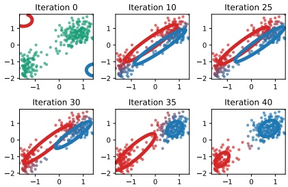

Figure 8.25: Illustration of the EM for a GMM applied to the Old Faithful data. The degree of redness indicates the degree to which the point belongs to the red cluster, and similarly for blue; thus purple points have a roughly 50/50 split in their responsibilities to the two clusters. Adapted from [Bis06] Figure 9.8. Generated by mix_gauss_demo_faithful.ipynb.

##### 8.7.3.4 MAP estimation

Computing the MLE of a GMM often suffers from numerical problems and overfitting. To see why, suppose for simplicity that  $\boldsymbol{\Sigma}_k = \sigma_k^2 \mathbf{I}$ for all  $k$. It is possible to get an infinite likelihood by assigning one of the centers, say  $\boldsymbol{\mu}_k$, to a single data point, say  $\boldsymbol{y}_n$, since then the likelihood of that data point is given by

$$
\mathcal{N}(\boldsymbol{y}_{n}|\boldsymbol{\mu}_{k}=\boldsymbol{y}_{n},\sigma_{k}^{2}\mathbf{I})=\frac{1}{\sqrt{2\pi\sigma_{k}^{2}}}e^{0}   \tag*{(8.168)}
$$

Hence we can drive this term to infinity by letting  $\sigma_k \to 0$, as shown in Figure 8.26(a). We call this the “collapsing variance problem”.

An easy solution to this is to perform MAP estimation. Fortunately, we can still use EM to find this MAP estimate. Our goal is now to maximize the expected complete data log-likelihood plus the log prior:

$$
\ell^{t}(\boldsymbol{\theta})=\left[\sum_{n}\sum_{k}r_{nk}^{(t)}\log\pi_{nk}+\sum_{n}\sum_{k}r_{nk}^{(t)}\log p(\boldsymbol{y}_{n}|\boldsymbol{\theta}_{k})\right]+\log p(\boldsymbol{\pi})+\sum_{k}\log p(\boldsymbol{\theta}_{k})   \tag*{(8.169)}
$$

Note that the E step remains unchanged, but the M step needs to be modified, as we now explain. For the prior on the mixture weights, it is natural to use a Dirichlet prior (Section 4.6.3.2),  $\pi \sim \text{Dir}(\alpha)$, since this is conjugate to the categorical distribution. The MAP estimate is given by

$$
\tilde{\pi}_{k}^{(t+1)}=\frac{r_{k}^{(t)}+\alpha_{k}-1}{N+\sum_{k}\alpha_{k}-K}   \tag*{(8.170)}
$$

If we use a uniform prior,  $\alpha_{k}=1$, this reduces to the MLE.

Author: Kevin P. Murphy. (C) MIT Press. CC-BY-NC-ND license

---

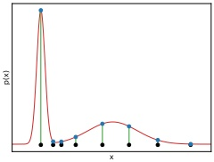

 $(a)$

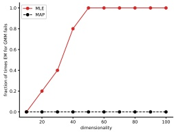

(b)

Figure 8.26: (a) Illustration of how singularities can arise in the likelihood function of GMMs. Here K = 2, but the first mixture component is a narrow spike (with  $\sigma_1 \approx 0$) centered on a single data point  $x_1$. Adapted from Figure 9.7 of [Bis06]. Generated by mix_gauss_singularity.ipynb. (b) Illustration of the benefit of MAP estimation vs ML estimation when fitting a Gaussian mixture model. We plot the fraction of times (out of 5 random trials) each method encounters numerical problems vs the dimensionality of the problem, for N = 100 samples. Solid red (upper curve): MLE. Dotted black (lower curve): MAP. Generated by mix_gauss_mle_vs_map.ipynb.

For the prior on the mixture components, let us consider a conjugate prior of the form

$$
p(\boldsymbol{\mu}_{k},\boldsymbol{\Sigma}_{k})=\mathrm{NIW}(\boldsymbol{\mu}_{k},\boldsymbol{\Sigma}_{k}|\breve{m},\breve{\kappa},\breve{\nu},\breve{\mathbf{S}})   \tag*{(8.171)}
$$

This is called the Normal-Inverse-Wishart distribution (see the sequel to this book, [Mur23], for details.) Suppose we set the hyper-parameters for  $\mu$ to be  $\tilde{\kappa}=0$, so that the  $\mu_k$ are unregularized; thus the prior will only influence our estimate of  $\Sigma_k$. In this case, the MAP estimates are given by

$$
\tilde{\mu}_{k}^{(t+1)}=\hat{\mu}_{k}^{(t+1)}   \tag*{(8.172)}
$$

$$
\tilde{\mathbf{\Sigma}}_{k}^{(t+1)}=\frac{\mathbf{\check{S}}+\hat{\mathbf{\Sigma}}_{k}^{(t+1)}}{\breve{\nu}+r_{k}^{(t)}+D+2}   \tag*{(8.173)}
$$

where  $\hat{\mu}_k$ is the MLE for  $\mu_k$ from Equation (8.165), and  $\tilde{\Sigma}_k$ is the MLE for  $\Sigma_k$ from Equation (8.166). Now we discuss how to set the prior covariance,  $\check{S}$. One possibility (suggested in [FR07, p163]) is to use

$$
\breve{\mathbf{S}}=\frac{1}{K^{2/D}}\mathrm{diag}(s_{1}^{2},\ldots,s_{D}^{2})   \tag*{(8.174)}
$$

where  $s_d^2 = (1/N) \sum_{n=1}^N (x_{nd} - \overline{x}_d)^2$ is the pooled variance for dimension  $d$. The parameter  $\breve{\nu}$ controls how strongly we believe this prior. The weakest prior we can use, while still being proper, is to set  $\breve{\nu} = D + 2$, so this is a common choice.

We now illustrate the benefits of using MAP estimation instead of ML estimation in the context of GMMs. We apply EM to some synthetic data with  $N = 100$ samples in D dimensions, using either ML or MAP estimation. We count the trial as a “failure” if there are numerical issues involving singular matrices. For each dimensionality, we conduct 5 random trials. The results are illustrated in Figure 8.26(b). We see that as soon as D becomes even moderately large, ML estimation crashes and burns, whereas MAP with an appropriate prior estimation rarely encounters numerical problems.

---

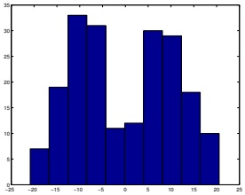

 $(a)$

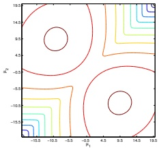

(b)

Figure 8.27: Left: N = 200 data points sampled from a mixture of 2 Gaussians in 1d, with  $\pi_k = 0.5$,  $\sigma_k = 5$,  $\mu_1 = -10$ and  $\mu_2 = 10$. Right: Likelihood surface  $p(\mathcal{D}|\mu_1, \mu_2)$, with all other parameters set to their true values. We see the two symmetric modes, reflecting the unidentifiability of the parameters. Generated by qmm lik surface plot.ipynb.

##### 8.7.3.5 Nonconvexity of the NLL

The likelihood for a mixture model is given by

$$
\ell(\boldsymbol{\theta})=\sum_{n=1}^{N}\log\left[\sum_{z_{n}=1}^{K}p(\boldsymbol{y}_{n},z_{n}|\boldsymbol{\theta})\right]   \tag*{(8.175)}
$$

In general, this will have multiple modes, and hence there will not be a unique global optimum.

Figure 8.27 illustrates this for a mixture of 2 Gaussians in 1d. We see that there are two equally good global optima, corresponding to two different labelings of the clusters, one in which the left peak corresponds to z = 1, and one in which the left peak corresponds to z = 2. This is called the label switching problem; see Section 21.4.1.2 for more details.

The question of how many modes there are in the likelihood function is hard to answer. There are  $K!$ possible labelings, but some of the peaks might get merged, depending on how far apart the  $\mu_k$ are. Nevertheless, there can be an exponential number of modes. Consequently, finding any global optimum is NP-hard [Alo+09; Dri+04]. We will therefore have to be satisfied with finding a local optimum. To find a good local optimum, we can use  $K\text{means++}$ (Section 21.3.4) to initialize EM.

### 8.8 Blackbox and derivative free optimization

In some optimization problems, the objective function is a blackbox, meaning that its functional form is unknown. This means we cannot use gradient-based methods to optimize it. Instead, solving such problems requires blackbox optimization (BBO) methods, also called derivative free optimization (DFO).

In ML, this kind of problem often arises when performing model selection. For example, suppose we have some hyper-parameters,  $\boldsymbol{\lambda} \in \boldsymbol{\Lambda}$, which control the type or complexity of a model. We often define the objective function  $\mathcal{L}(\boldsymbol{\lambda})$ to be the loss on a validation set (see Section 4.5.4). Since the validation loss depends on the optimal model parameters, which are computed using a complex

---

algorithm, this objective function is effectively a blackbox. $^{4}$

A simple approach to such problems is to use grid search, where we evaluate each point in the parameter space, and pick the one with the lowest loss. Unfortunately, this does not scale to high dimensions, because of the curse of dimensionality. In addition, even in low dimensions this can be expensive if evaluating the blackbox objective is expensive (e.g., if it first requires training the model before computing the validation loss). Various solutions to this problem have been proposed. See the sequel to this book, [Mur23], for details.

### 8.9 Exercises

Exercise 8.1 [Subderivative of the hinge loss function  $\dagger$]

Let  $f(x) = (1 - x)_{+}$ be the hinge loss function, where  $(z)_{+} = \max(0, z)$. What are  $\partial f(0)$,  $\partial f(1)$, and  $\partial f(2)$?

Exercise 8.2 [EM for the Student distribution]

Derive the EM equations for computing the MLE for a multivariate Student distribution. Consider the case where the dof parameter is known and unknown separately. Hint: write the Student distribution as a scale mixture of Gaussians.