

以下是翻译后的 Markdown 文本：

简而言之，整个算法如下：

$$  \tilde{\mathbf{Z}}=(\mathbf{W}^{T}\mathbf{W})^{-1}\mathbf{W}^{T}\tilde{\mathbf{X}}\ (E step)   \tag*{(20.63)}$$

$$  \mathbf{W}=\tilde{\mathbf{X}}\tilde{\mathbf{Z}}^{T}(\tilde{\mathbf{Z}}\tilde{\mathbf{Z}}^{T})^{-1}(\mathrm{M step})   \tag*{(20.64)}$$

[TB99] 表明，EM 算法唯一稳定的固定点是全局最优解。也就是说，EM 算法收敛到的解中，$ \mathbf{W} $ 张成的线性子空间与前 $ L $ 个特征向量所定义的子空间相同。然而，如果我们希望 $ \mathbf{W} $ 正交，并且按特征值降序包含特征向量，则必须对结果矩阵进行正交化（这一过程计算成本很低）。另一种方法是直接修改 EM 算法以得到主基 [AO03]。

在 $D = 2$ 且 $L = 1$ 的情况下，该算法有一个简单的物理类比 [Row97]。考虑 $\mathbb{R}^2$ 中的一些点，它们通过弹簧连接到一个刚性杆上，杆的方向由向量 $\mathbf{w}$ 定义。令 $z_i$ 为第 $i$ 个弹簧连接到杆上的位置。在 E 步中，我们固定杆，让连接点滑动以最小化弹簧能量（该能量与残差平方和成正比）。在 M 步中，我们固定连接点，让杆旋转以最小化弹簧能量。具体如图 20.10 所示。

##### 20.2.3.3 优势

EM 用于 PCA 相比特征向量方法具有以下优势：

- EM 可以更快。具体来说，假设 $ N, D \gg L $，EM 的主要计算开销在于 E 步中的投影操作，因此总时间复杂度为 $ O(TLND) $，其中 T 为迭代次数。[Row97] 通过实验表明，无论 N 或 D 大小如何，迭代次数通常很少（平均为 3.6）。（该结果取决于经验协方差矩阵的特征值之比。）这远快于简单特征向量方法所需的 $ O(\min(ND^2, DN^2)) $ 时间，尽管更复杂的特征向量方法（如 Lanczos 算法）的运行时间可与 EM 相媲美。

- EM 可以在线实现，即我们可以随着数据流的输入更新对 W 的估计。

• EM 可以简单处理缺失数据（例如参见 [IR10; DJ15]）。

• EM 可以扩展以处理 PPCA/FA 模型的混合（见第 20.2.6 节）。

- EM 可以修改为变分 EM 或变分贝叶斯 EM，以拟合更复杂的模型（例如参见第 20.2.7 节）。

#### 20.2.4 参数的可辨识性问题

FA 模型的参数是不可辨识的。为了说明这一点，考虑一个权重矩阵为 W、观测协方差为 $ \Psi $ 的模型。我们有

$$  \mathrm{Cov}\left[\boldsymbol{x}\right]=\mathbf{W}\mathbb{E}\left[\boldsymbol{z}\boldsymbol{z}^{\mathrm{T}}\right]\mathbf{W}^{\mathrm{T}}+\mathbb{E}\left[\boldsymbol{\epsilon}\boldsymbol{\epsilon}^{\mathrm{T}}\right]=\mathbf{W}\mathbf{W}^{\mathrm{T}}+\boldsymbol{\Psi}   \tag*{(20.65)}$$

作者：Kevin P. Murphy。 (C) MIT Press。CC-BY-NC-ND 许可协议。

---

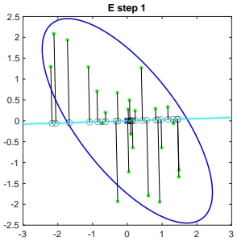

 $ (a) $

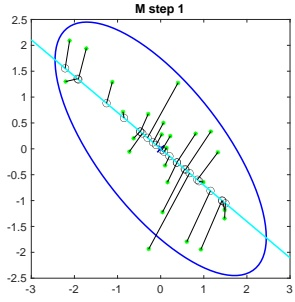

(b)

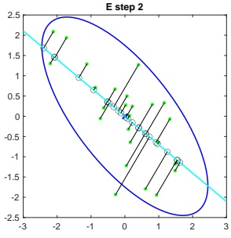

(c)

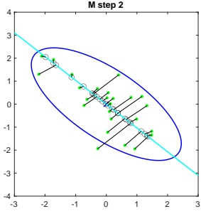

(d)

图20.10：当 $D=2$ 且 $L=1$ 时 PCA 的 EM 算法示意图。绿色星形为原始数据点，黑色圆点为重建数据点。权重向量 $\mathbf{w}$ 由蓝色线段表示。(a) 我们以随机的初始猜测 $\mathbf{w}$ 开始。E 步由正交投影表示。(b) 在 M 步中更新杆 $\mathbf{w}$，同时保持投影到杆上的点（黑色圆点）固定。(c) 另一个 E 步。黑色圆点可以沿杆“滑动”，但杆保持固定。(d) 另一个 M 步。改编自 [Bis06] 的图12.12。由 pcaEmStepByStep.ipynb 生成。

现在考虑一个具有不同权重的模型：$ \mathbf{W} = \mathbf{W}\mathbf{R} $，其中 $ \mathbf{R} $ 是任意正交旋转矩阵，满足 $ \mathbf{R}\mathbf{R}^{\top} = \mathbf{I} $。该模型具有相同的似然，因为

$$  \mathrm{Cov}\left[\boldsymbol{x}\right]=\tilde{\mathrm{W}}\mathbb{E}\left[\boldsymbol{z}\boldsymbol{z}^{\mathrm{T}}\right]\tilde{\mathrm{W}}^{\mathrm{T}}+\mathbb{E}\left[\boldsymbol{\epsilon}\boldsymbol{\epsilon}^{\mathrm{T}}\right]=\mathrm{WRR}^{\mathrm{T}}\mathrm{W}^{\mathrm{T}}+\boldsymbol{\Psi}=\mathrm{WW}^{\mathrm{T}}+\boldsymbol{\Psi}   \tag*{(20.66)}$$

从几何角度看，将 W 乘以正交矩阵相当于在生成 x 之前旋转 z；但由于 z 是从各向同性的高斯分布中抽取的，这对似然没有影响。因此，我们无法唯一地识别 W，从而也无法唯一地识别潜在因子。

---

为了打破这种对称性，可以使用几种解决方案，如下所述。

• **强制W具有标准正交列**。解决可识别性问题的最简单方法之一是强制W具有标准正交列。这是PCA所采用的方法。由此得到的后验估计将是唯一的，仅潜变量维度的排列顺序不确定。（在PCA中，通过按W的特征值降序排列各维度来解决这种顺序歧义。）

• **强制W为下三角矩阵**。贝叶斯领域常用的一种解决排列不可识别性的方法（例如，$ [LW04c] $）是确保第一个可见特征仅由第一个潜因子生成，第二个可见特征仅由前两个潜因子生成，以此类推。例如，若L=3且D=4，对应的因子载荷矩阵为

$$  \mathbf{W}=\begin{pmatrix}{{{w_{11}}}}&{{{0}}}&{{{0}}} \\{{{w_{21}}}}&{{{w_{22}}}}&{{{0}}} \\{{{w_{31}}}}&{{{w_{32}}}}&{{{w_{33}}}} \\{{{w_{41}}}}&{{{w_{42}}}}&{{{w_{43}}}}\end{pmatrix}   \tag*{(20.67)}$$

我们还要求当 $ k = 1 : L $ 时，$ w_{kk} > 0 $。这个约束矩阵中的总参数数量为 $ D + DL - L(L - 1)/2 $，等于FA中唯一可识别参数的数量。$ ^{3} $ 这种方法的缺点在于前L个可见变量（称为创始变量）会影响潜因子的解释，因此必须谨慎选择。

• **权重的稀疏化先验**。我们不必预先指定W中的哪些元素为零，而是可以采用 $ \ell_1 $ 正则化 [ZHT06]、ARD [Bis99; AB08] 或尖峰-平板先验 [Rat+09] 来鼓励元素为零。这被称为稀疏因子分析。这并不一定能保证MAP估计的唯一性，但确实能鼓励可解释的解。

• **选择信息性旋转矩阵**。存在多种启发式方法，旨在寻找旋转矩阵 $ \mathbf{R} $，用于修改 $ \mathbf{W} $（从而修改潜因子），以增加可解释性，通常通过鼓励它们（近似）稀疏来实现。一种流行的方法是 varimax [Kai58]。

• **对潜因子使用非高斯先验**。如果我们将潜变量的先验 $ p(z) $ 替换为非高斯分布，有时可以唯一地识别W以及潜因子。详情参见例如 [KKH20]。

#### 20.2.5 非线性因子分析

FA模型假设观测数据可以建模为来自低维高斯因子集合的线性映射。放松这一假设的一种方法是让从z到x的映射成为非线性模型，例如神经网络。即，模型变为

$$  p(\boldsymbol{x})=\int\mathcal{N}(\boldsymbol{x}|f(\boldsymbol{z};\boldsymbol{\theta}),\boldsymbol{\Psi})\mathcal{N}(\boldsymbol{z}|\mathbf{0},\mathbf{I})d\boldsymbol{z}   \tag*{(20.68)}$$

---

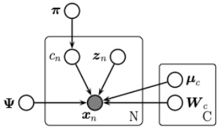

图 20.11: 作为 PGM 的因子分析混合模型。

这被称为非线性因子分析。遗憾的是，我们无法再精确计算后验或最大似然估计，因此需要使用近似方法。在第20.3.5节中，我们讨论变分自编码器，这是近似非线性 FA 模型最常用的方法。

#### 20.2.6 因子分析混合模型

因子分析模型（第20.2节）假设观测数据是由低维高斯因子集合通过线性映射产生的。放松这一假设的一种方法是假设模型仅局部线性，从而整体模型成为 FA 模型的（加权）组合；这被称为因子分析混合模型。数据的整体模型是线性流形的混合，可用于近似整体弯曲流形。

更精确地说，令潜在指示变量 $ m_n \in \{1, \ldots, K\} $ 指定我们应使用哪个子空间（簇）来生成数据点 $ n $。如果 $ m_n = k $，我们从高斯先验中采样 $ z_n $，然后通过矩阵 $ \mathbf{W}_k $ 并添加噪声，其中 $ \mathbf{W}_k $ 从 $ L $ 维子空间映射到 $ D $ 维可见空间。$ ^4 $ 更精确地说，模型如下：

$$  p(\boldsymbol{x}_{n}|\boldsymbol{z}_{n},m_{n}=k,\boldsymbol{\theta})=\mathcal{N}(\boldsymbol{x}_{n}|\boldsymbol{\mu}_{k}+\mathbf{W}_{k}\boldsymbol{z}_{n},\boldsymbol{\Psi}_{k})   \tag*{(20.69)}$$

$$  p(z_{n}|\boldsymbol{\theta})=\mathcal{N}(z_{n}|\mathbf{0},\mathbf{I})   \tag*{(20.70)}$$

$$  p(m_{n}|\boldsymbol{\theta})=\mathrm{Cat}(m_{n}|\boldsymbol{\pi})   \tag*{(20.71)}$$

这被称为因子分析混合模型（MFA）[GH96]。可见空间中的相应分布由下式给出

$$  p(\boldsymbol{x}|\boldsymbol{\theta})=\sum_{k}p(c=k)\int d\boldsymbol{z}p(\boldsymbol{z}|c)p(\boldsymbol{x}|\boldsymbol{z},c)=\sum_{k}\pi_{k}\int d\boldsymbol{z}\mathcal{N}(\boldsymbol{z}|\boldsymbol{\mu}_{k},\mathbf{I})\mathcal{N}(\boldsymbol{x}|\mathbf{W}\boldsymbol{z},\sigma^{2}\mathbf{I})   \tag*{(20.72)}$$

在特殊情况下 $ \mathbf{\Psi}_k = \sigma^2 \mathbf{I} $，我们得到 PPCA 模型的混合（尽管在这种情况下难以保证 $ \mathbf{W}_k $ 的正交性）。参见图 20.12 中该方法应用于一些二维数据的示例。

我们可以将其视为高斯混合模型的低秩版本。具体而言，该模型需要 $ O(KLD) $ 个参数，而不是全协方差高斯混合所需的 $ O(KD^{2}) $ 个参数。这可以减少过拟合。

---

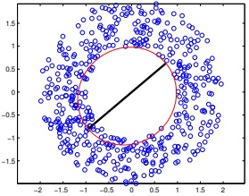

 $ (a) $

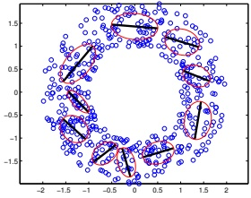

(b)

图 20.12：使用 L = 1 个潜在维度对二维数据集拟合的 PPCA 模型混合。(a) K = 1 个混合分量。(b) K = 10 个混合分量。由 mixPpcaDemo.ipynb 生成。

#### 20.2.7 指数族因子分析

到目前为止，我们假设观测数据是实值的，即 $ \boldsymbol{x}_n \in \mathbb{R}^D $。如果我们希望建模其他类型的数据（例如二值或分类数据），只需将高斯输出分布替换为指数族中的合适成员，其中自然参数由 $ z_n $ 的线性函数给出。即，我们使用

$$  p(\boldsymbol{x}_{n}|\boldsymbol{z}_{n})=\exp(\mathcal{T}(\boldsymbol{x})^{\top}\boldsymbol{\theta}+h(\boldsymbol{x})-g(\boldsymbol{\theta}))   \tag*{(20.73)}$$

其中 $ N \times D $ 的自然参数矩阵假设由低秩分解 $ \Theta = \mathbf{Z} \mathbf{W} $ 给出，这里 $ \mathbf{Z} $ 是 $ N \times L $ 矩阵，$ \mathbf{W} $ 是 $ L \times D $ 矩阵。得到的模型称为**指数族因子分析**。

与线性-高斯 FA 不同，由于指数族似然与高斯先验之间缺乏共轭性，我们无法计算精确的后验 $ p(z_n|\boldsymbol{x}_n, \mathbf{W}) $。此外，我们也无法计算精确的边际似然，这阻碍了我们寻找最优的 MLE。

[CDS02] 针对该模型的一个确定性变体提出了一种坐标上升法，称为**指数族 PCA**。该方法在计算 $ z_n $ 和 W 的点估计之间交替进行。这可以视为变分 EM 的一种退化版本，其中 E 步使用 $ z_n $ 的 delta 函数后验。[GS08] 提出了一种改进算法，能够找到全局最优解，而 [Ude+16] 将其推广为**广义低秩模型**，涵盖了多种不同的损失函数。

然而，通常更可取的做法是使用模型的概率版本，而不是计算潜在因子的点估计。在这种情况下，我们必须使用非退化分布来表示后验以避免过拟合，因为潜在变量的数量与数据案例数量成正比 [WCS08]。幸运的是，我们可以通过优化变分下界来使用非退化后验（例如高斯后验）。下面我们给出一些例子。

##### 20.2.7.1 示例：二值 PCA

考虑因子化的伯努利似然：

$$  p(\boldsymbol{x}|\boldsymbol{z})=\prod_{d}\mathrm{B e r}(\boldsymbol{x}_{d}|\sigma(\boldsymbol{w}_{d}^{\mathsf{T}}\boldsymbol{z}))   \tag*{(20.74)}$$

作者：Kevin P. Murphy。 (C) MIT 出版社。CC-BY-NC-ND 许可协议。

---

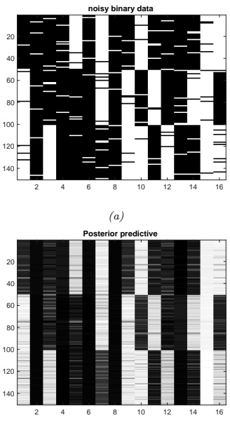

(a)

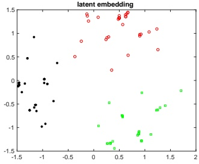

(b)

(c)

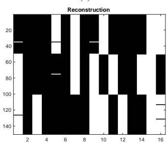

(d)

图20.13: (a) 150个合成的16维比特向量。(b) 使用变分EM拟合的二元主成分分析（binary PCA）所学习的二维嵌入。我们根据生成它们的真实"原型"身份对点进行颜色编码。(c) 预测的开启概率。(d) 阈值化预测。由 binary_fa_demo.ipynb 生成。

假设我们观测到 $N = 150$ 个长度为 $D = 16$ 的比特向量。每个样本通过从三个二元原型向量中选择一个，然后随机翻转比特位生成。数据如图20.13(a)所示。我们可以使用变分期望最大化（variational EM）算法进行拟合（详见[Tip98]）。为了可视化潜在空间，我们使用 $L = 2$ 个潜在维度。在图20.13(b)中，我们绘制了 $\mathbb{E}\left[z_n|\mathbf{x}_n, \hat{\mathbf{W}}\right]$。可以看到投影点自然地聚成三个不同的簇。在图20.13(c)中，我们绘制了数据的重构版本，其计算方式如下：

$$  p(\hat{x}_{n d}=1|\boldsymbol{x}_{n})=\int d\boldsymbol{z}_{n}\;p(\boldsymbol{z}_{n}|\boldsymbol{x}_{n})p(\hat{x}_{n d}|\boldsymbol{z}_{n})   \tag*{(20.75)}$$

如果将这些概率以0.5为阈值（对应最大后验估计），则得到图20.13(d)中数据的"去噪"版本。

---

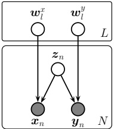

 $ (a) $

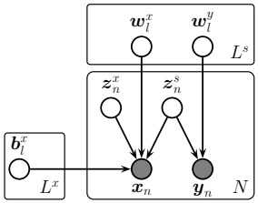

(b)

图20.14: 配对数据的高斯潜在因子模型。(a) 监督PCA。(b) 偏最小二乘。

##### 20.2.7.2 示例：分类PCA

 $$ p(\boldsymbol{x}|\boldsymbol{z})=\prod_{d}Cat(x_{d}|softmax(\mathbf{W}_{d}\boldsymbol{z})) $$ 

我们可以将20.2.7.1节中的模型进行推广，以处理分类数据，使用以下似然函数：

我们称之为分类PCA（CatPCA）。[Kha+10]中描述了一种用于拟合该模型的变分EM算法。

#### 20.2.8 配对数据的因子分析模型

在本节中，我们讨论两类观测变量（成对出现）的线性-高斯因子分析模型，其中 $ \boldsymbol{x} \in \mathbb{R}^{D_x} $ 和 $ \boldsymbol{y} \in \mathbb{R}^{D_y} $。这些变量通常对应不同的传感器或模态（例如图像和声音）。我们遵循[Vir10]的表述。

##### 20.2.8.1 监督PCA

在监督PCA [Yu+06]中，我们使用共享的低维表示来对联合分布 $ p(x, y) $ 进行建模，采用以下线性高斯模型：

$$  p(\boldsymbol{z}_{n})=\mathcal{N}(\boldsymbol{z}_{n}|\mathbf{0},\mathbf{I}_{L})   \tag*{(20.77)}$$

$$  p(\boldsymbol{x}_{n}|\boldsymbol{z}_{n},\boldsymbol{\theta})=\mathcal{N}(\boldsymbol{x}_{n}|\mathbf{W}_{x}\boldsymbol{z}_{n},\sigma_{x}^{2}\mathbf{I}_{D_{x}})   \tag*{(20.78)}$$

$$  p(\boldsymbol{y}_{n}|\boldsymbol{z}_{n},\boldsymbol{\theta})=\mathcal{N}(\boldsymbol{y}_{n}|\mathbf{W}_{y}\boldsymbol{z}_{n},\sigma_{y}^{2}\mathbf{I}_{D_{y}})   \tag*{(20.79)}$$

其图形模型如图20.14a所示。直觉上， $ z_n $ 是一个共享的潜在子空间，捕捉了 $ x_n $ 和 $ y_n $ 的共同特征。方差项 $ \sigma_x $ 和 $ \sigma_y $ 控制模型对两种不同信号的关注程度。如果在参数 $ \theta = (W_x, W_y, \sigma_x, \sigma_y) $ 上放置先验，我们就得到了[Wes03]中的贝叶斯因子回归模型。

作者：Kevin P. Murphy。(C) MIT出版社。CC-BY-NC-ND许可协议。

---

我们可以对 $z_n$ 进行边缘化，得到 $p(\boldsymbol{y}_n|\boldsymbol{x}_n)$。如果 $y_n$ 是标量，则变为：

$$ p(y_{n}|\boldsymbol{x}_{n},\boldsymbol{\theta})=\mathcal{N}(y_{n}|\boldsymbol{x}_{n}^{\top}\boldsymbol{v},\boldsymbol{w}_{y}^{\top}\mathbf{C}\boldsymbol{w}_{y}+\sigma_{y}^{2})   \tag*{(20.80)} $$

$$ \mathbf{C}=(\mathbf{I}+\sigma_{x}^{-2}\mathbf{W}_{x}^{\mathsf{T}}\mathbf{W}_{x})^{-1}   \tag*{(20.81)} $$

$$ \boldsymbol{v}=\sigma_{x}^{-2}\mathbf{W}_{x}\mathbf{C}\boldsymbol{w}_{y}   \tag*{(20.82)} $$

要将此方法应用于分类场景，我们可以使用**监督ePCA**[Guo09]，该方法将高斯分布 $p(\mathbf{y}|\mathbf{z})$ 替换为逻辑回归模型。

该模型在 $x$ 和 $y$ 上完全对称。如果我们的目标是通过潜在瓶颈 $z$ 从 $x$ 预测 $y$，那么我们可以如 [Ris+08] 所提出的那样，提高 $y$ 的似然项的权重。这给出了：

$$ p(\mathbf{X},\mathbf{Y},\mathbf{Z}|\boldsymbol{\theta})=p(\mathbf{Y}|\mathbf{Z},\mathbf{W}_{y})p(\mathbf{X}|\mathbf{Z},\mathbf{W}_{x})^{\alpha}p(\mathbf{Z})   \tag*{(20.83)} $$

其中 $\alpha \leq 1$ 控制两个源建模的相对重要性。$\alpha$ 的值可通过交叉验证选择。

##### 20.2.8.2 偏最小二乘

提高监督任务预测性能的另一种方法是允许输入 $x$ 拥有其自身的“私有”噪声源，该噪声源与目标变量独立，因为 $x$ 中的并非所有变异都与预测目的相关。我们可以通过引入一个仅针对输入的额外潜在变量 $z_n^x$ 来实现这一点，该变量与 $z_n^s$（即 $x_n$ 和 $y_n$ 之间的共享瓶颈）不同。在高斯情形下，整体模型的形式为：

$$ p(\boldsymbol{z}_{n})=\mathcal{N}(\boldsymbol{z}_{n}^{s}|\mathbf{0},\mathbf{I})\mathcal{N}(\boldsymbol{z}_{n}^{x}|\mathbf{0},\mathbf{I})   \tag*{(20.84)} $$

$$ p(\boldsymbol{x}_{n}|\boldsymbol{z}_{n},\boldsymbol{\theta})=\mathcal{N}(\boldsymbol{x}_{n}|\mathbf{W}_{x}\boldsymbol{z}_{n}^{s}+\mathbf{B}_{x}\boldsymbol{z}_{n}^{x},\sigma_{x}^{2}\mathbf{I})   \tag*{(20.85)} $$

$$ p(\boldsymbol{y}_{n}|\boldsymbol{z}_{n},\boldsymbol{\theta})=\mathcal{N}(\boldsymbol{y}_{n}|\mathbf{W}_{y}\boldsymbol{z}_{n}^{s},\sigma_{y}^{2}\mathbf{I})   \tag*{(20.86)} $$

参见图20.14b。该模型中 $\theta$ 的MLE等同于**偏最小二乘** (PLS) 技术 [Gus01; Nou+02; Sun+09]。

##### 20.2.8.3 典型相关分析

在某些情况下，我们希望使用完全对称的模型，以便捕获 $\boldsymbol{x}$ 和 $\boldsymbol{y}$ 之间的依赖关系，同时允许特定领域或“私有”的噪声源。我们可以通过引入一个仅针对 $\boldsymbol{x}_n$ 的潜在变量 $z_n^x$、一个仅针对 $\boldsymbol{y}_n$ 的潜在变量 $z_n^y$，以及一个共享潜在变量 $z_n^s$ 来实现。在高斯情形下，整体模型的形式为：

$$ p(z_{n})=\mathcal{N}(z_{n}^{s}|\mathbf{0},\mathbf{I})\mathcal{N}(z_{n}^{x}|\mathbf{0},\mathbf{I})\mathcal{N}(z_{n}^{y}|\mathbf{0},\mathbf{I})   \tag*{(20.87)} $$

$$ p(\boldsymbol{x}_{n}|\boldsymbol{z}_{n},\boldsymbol{\theta})=\mathcal{N}(\boldsymbol{x}_{n}|\mathbf{W}_{x}\boldsymbol{z}_{n}^{s}+\mathbf{B}_{x}\boldsymbol{z}_{n}^{x},\sigma_{x}^{2}\mathbf{I})   \tag*{(20.89)} $$

$$ p(\boldsymbol{y}_{n}|\boldsymbol{z}_{n},\boldsymbol{\theta})=\mathcal{N}(\boldsymbol{y}_{n}|\mathbf{W}_{y}\boldsymbol{z}_{n}^{s}+\mathbf{B}_{y}\boldsymbol{z}_{n}^{y},\sigma_{y}^{2}\mathbf{I})   \tag*{(20.90)} $$

其中 $\mathbf{W}_x$ 和 $\mathbf{W}_y$ 的维度为 $L^s \times D$，$\mathbf{B}_x$ 的维度为 $L^x \times D$，$\mathbf{B}_y$ 的维度为 $L^y \times D$。概率图模型见图20.15。

---

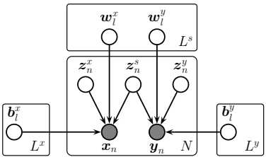

图 20.15: 作为概率图模型的典型相关分析。

如果我们对所有潜变量进行边缘化，则得到如下关于可观测变量的分布（其中假设 $\sigma_x = \sigma_y = \sigma$）：

$$ p(\boldsymbol{x}_{n},\boldsymbol{y}_{n})=\int d\boldsymbol{z}_{n}p(\boldsymbol{z}_{n})p(\boldsymbol{x}_{n},\boldsymbol{y}_{n}|\boldsymbol{z}_{n})=\mathcal{N}(\boldsymbol{x}_{n},\boldsymbol{y}_{n}|\boldsymbol{\mu},\mathbf{W}\mathbf{W}^{\top}+\sigma^{2}\mathbf{I}) \tag*{(20.91)}$$

其中 $\boldsymbol{\mu} = (\boldsymbol{\mu}_{x}; \boldsymbol{\mu}_{y})$，且 $\mathbf{W} = [\mathbf{W}_{x}; \mathbf{W}_{y}]$。因此诱导的协方差矩阵为如下低秩矩阵：

$$ \mathbf{W}\mathbf{W}^{\mathsf{T}}=\begin{pmatrix}\mathbf{W}_{x}\mathbf{W}_{x}^{\mathsf{T}}+\mathbf{B}_{x}\mathbf{B}_{x}^{\mathsf{T}}&\mathbf{W}_{x}\mathbf{W}_{y}^{\mathsf{T}}\\\mathbf{W}_{y}\mathbf{W}_{x}^{\mathsf{T}}&\mathbf{W}_{y}\mathbf{W}_{y}^{\mathsf{T}}+\mathbf{B}_{y}\mathbf{B}_{y}^{\mathsf{T}}\end{pmatrix} \tag*{(20.92)}$$

[BJ05]的研究表明该模型的极大似然估计等价于一种经典的统计方法——典型相关分析（CCA）[Hot36]。然而，概率图模型视角使我们能够轻松地推广到多种观测类型（这被称为广义CCA [Hor61]），或非线性模型（即深度CCA [WLL16; SNM16]），或指数族CCA [KVK10]。关于CCA及其扩展的更详细讨论参见[Uur+17]。

### 20.3 自编码器

我们可以将PCA（第20.1节）和因子分析（第20.2节）视为学习一个从 $\boldsymbol{x} \to \boldsymbol{z}$ 的（线性）映射，称为**编码器** $f_e$，并学习另一个从 $\boldsymbol{z} \to \boldsymbol{x}$ 的（线性）映射，称为**解码器** $f_d$。整体重构函数形式为 $r(\boldsymbol{x}) = f_d(f_e(\boldsymbol{x}))$。模型通过最小化 $\mathcal{L}(\boldsymbol{\theta}) = \|r(\boldsymbol{x}) - \boldsymbol{x}\|^2$ 进行训练。更一般地，我们可以使用 $\mathcal{L}(\boldsymbol{\theta}) = -\log p(\boldsymbol{x} | r(\boldsymbol{x}))$。

本节考虑编码器和解码器均为神经网络实现的非线性映射的情况，这称为**自编码器**。如果我们使用具有一个隐藏层的MLP，则得到如图20.16所示的模型。我们可以将中间的隐藏单元视为输入与其重建之间的低维瓶颈。

当然，如果隐藏层足够宽，这个模型无法避免学习恒等函数。为防止这种退化解，我们必须以某种方式限制模型。最简单的方法是使用狭窄的瓶颈层，即 $ L \ll D $，这称为**欠完备表示**。另一种方法是使用 $ L \gg D $，称为**过完备表示**，但需要施加其他类型的正则化，例如向输入添加噪声。

作者：Kevin P. Murphy. (C) MIT Press. CC-BY-NC-ND 许可协议

---

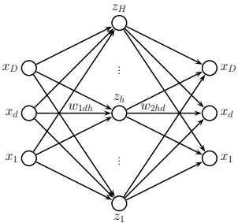

图 20.16：具有一个隐藏层的自编码器。

强制隐藏单元的激活值保持稀疏，或对隐藏单元的导数施加惩罚。下面我们将更详细地讨论这些选项。

#### 20.3.1 瓶颈自编码器

我们首先考虑线性自编码器的特殊情况。该自编码器有一个隐藏层，隐藏单元的计算使用 \( z = W_1 x \)，输出使用 \( \hat{x} = W_2 z \) 重构，其中 \( W_1 \) 为 \( L \times D \) 矩阵，\( W_2 \) 为 \( D \times L \) 矩阵，且 \( L < D \)。因此，模型的输出为 \( \hat{x} = W_2 W_1 x = W_2 x \)。如果用平方重构误差训练该模型，即 \( \mathcal{L}(\mathbf{W}) = \sum_{n=1}^N \| \mathbf{x}_n - \mathbf{W} \mathbf{x}_n \|_2^2 \)，可以证明 [BH89; KJ95] \( \hat{W} \) 是数据经验协方差矩阵的前 \( L \) 个特征向量上的正交投影。因此，该模型等价于 PCA。

如果我们在自编码器中引入非线性，如 [JHG00] 中所证明的，得到的模型将严格强于 PCA。这类方法可以学习非常有用的低维数据表示。

考虑在 Fashion MNIST 数据集上拟合自编码器。我们采用两种架构：多层感知机（MLP）架构（2层，瓶颈大小为30）和基于卷积神经网络（CNN）的架构（3层，64通道的3维瓶颈）。使用伯努利似然模型和二值交叉熵作为损失函数。图 20.17 展示了一些测试图像及其重构结果。可以看出，CNN 模型的重构图像比 MLP 模型更精确。不过，两个模型都很小，且仅训练了 5 个 epoch；使用更大的模型和更长的训练时间可以改善结果。

图 20.18 可视化了由 MLP 自编码器产生的 30 个潜在维度中的前两个维度。更准确地说，我们绘制了按类别标签着色的 t-SNE 嵌入（参见第 20.4.10 节）。同时，我们还展示了数据集中对应的一些图像，这些嵌入正是从这些图像中导出的。可以看出，该方法以完全无监督的方式很好地分离了不同类别。我们还注意到，MLP 和 CNN 模型的潜在空间非常相似（至少在这二维投影中观察是如此）。

---

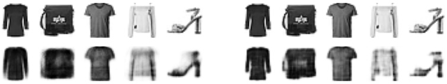

(a)

(b)

图 20.17：将自编码器应用于 Fashion MNIST 数据的结果。第一行是验证集的前 5 张图像。第二行是重建结果。(a) MLP 模型（训练了 20 个 epoch）。编码器是一个架构为 784-100-30 的 MLP。解码器是它的镜像。(b) CNN 模型（训练了 5 个 epoch）。编码器的 CNN 架构为 Conv2D(16, 3 × 3, same, selu)、MaxPool2D(2x2)、Conv2D(32, 3 × 3, same, selu)、MaxPool2D(2 × 2)、Conv2D(64, 3 × 3, same, selu)、MaxPool2D(2 × 2)。解码器是它的镜像，使用转置卷积且无最大池化层。改编自 [Gér19] 的图 17.4。由 ae_mnist_tf.ipynb 生成。

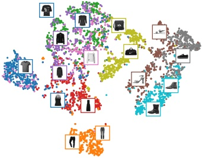

(a)

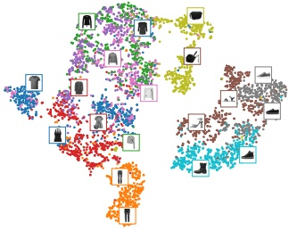

(b)

图 20.18：使用自编码器对 Fashion MNIST 验证集前两个潜在维度的 tSNE 图。(a) MLP。(b) CNN。改编自 [Gér19] 的图 17.5。由 ae_mnist_tf.ipynb 生成。

#### 20.3.2 去噪自编码器

控制自编码器容量的一种有效方法是在其输入中添加噪声，然后训练模型重建原始输入的干净（未损坏）版本。这称为**去噪自编码器** $[\mathrm{Vin}+10\mathrm{a}]$。

我们可以通过添加高斯噪声或使用 Bernoulli dropout 来实现这一点。图 20.19 展示了使用 DAE 对损坏图像进行重建的一些结果。我们可以看到，模型能够“幻想”出输入中缺失的细节，因为它之前见过类似的图像，并且可以将这些信息存储在模型的参数中。

假设我们使用高斯损坏和平方误差重建来训练一个 DAE，即使用 $p_c(\tilde{\mathbf{x}}|\mathbf{x}) = \mathcal{N}(\tilde{\mathbf{x}}|\mathbf{x}, \sigma^2\mathbf{I})$ 和 $\ell(\mathbf{x}, r(\tilde{\mathbf{x}})) = ||\mathbf{e}||_2^2$，其中 $\mathbf{e}(\mathbf{x}) = r(\tilde{\mathbf{x}}) - \mathbf{x}$ 是样本的残差误差。

作者：Kevin P. Murphy。 (C) MIT Press。 CC-BY-NC-ND 许可证。

---

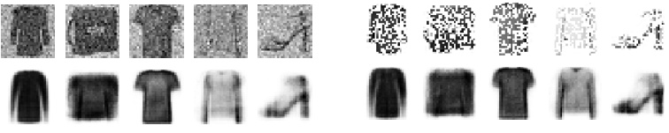

 $ (a) $

(b)

图 20.19：去噪自编码器（MLP 架构）应用于验证集中部分带噪声的 Fashion MNIST 图像。(a) 高斯噪声。(b) 伯努利 Dropout 噪声。首行：输入。末行：输出。改编自 [Gér19] 的图 17.9。由 ae_mnist_tf.ipynb 生成。

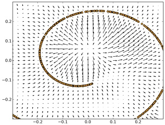

图 20.20：DAE 的残差误差 $ \mathbf{e}(\mathbf{x}) = r(\tilde{\mathbf{x}}) - \mathbf{x} $ 可以学习一个对应得分函数的向量场。箭头指向概率密度更高的区域。箭头长度与 $ \|\mathbf{e}(\mathbf{x})\| $ 成正比，因此靠近一维数据流形（以曲线表示）的点具有较小的箭头。出自 [AB14] 的图 5。经 Guillaume Alain 许可使用。

x。接着，我们可以证明 [AB14] 一个显著的结果：当 $ \sigma \to 0 $（且模型足够强大、数据足够多）时，残差近似于 **得分函数**，即数据的对数概率，即 $ \mathbf{e}(\mathbf{x}) \approx \nabla_{\mathbf{x}} \log p(\mathbf{x}) $。也就是说，DAE 学习了一个 **向量场**，对应于对数数据密度的梯度。因此，靠近数据流形的点将通过采样过程被投影到流形上。参见图 20.20 的说明。

#### 20.3.3 收缩自编码器

正则化自编码器的另一种方法是在重构损失中添加惩罚项

$$  \Omega(z,\boldsymbol{x})=\lambda||\frac{\partial f_{e}(\boldsymbol{x})}{\partial\boldsymbol{x}}||_{F}^{2}=\lambda\sum_{k}||\nabla_{\boldsymbol{x}}h_{k}(\boldsymbol{x})||_{2}^{2}   \tag*{(20.93)}$$

其中 $ h_{k} $ 是第 $ k $ 个隐藏嵌入单元的值。即，我们惩罚编码器雅可比矩阵的 Frobenius 范数。这被称为 **收缩自编码器**。

---

[Rif+11]. （如果对于所有单位范数的输入 x，有 $ \|Jx\|\leq 1 $，则称雅可比矩阵为 J 的线性算子为压缩算子。）

为了理解其有用性，请考虑图 20.20。我们可以通过一系列局部线性流形来近似弯曲的低维流形。这些线性近似可以使用编码器在每个点的雅可比矩阵计算。通过鼓励这些雅可比矩阵具有压缩性，我们确保模型将偏离流形的输入“推”回流形。

另一种理解 CAE 的方式如下。为了最小化惩罚项，模型希望编码器是一个常数函数。然而，如果编码器完全是常数，它将忽略其输入，从而产生较高的重构代价。因此，这两项共同鼓励模型学习一种表示，其中只有少数单元响应输入中最显著的变化。

一个可能的退化解是编码器简单地将输入乘以一个小常数 $ \epsilon $（这会缩小雅可比矩阵），然后解码器除以 $ \epsilon $（从而完美重构）。为了避免这种情况，我们可以捆绑编码器和解码器的权重，即设置 $ f_d $ 的第 $ \ell $ 层权重矩阵为 $ f_e $ 的第 $ \ell $ 层权重矩阵的转置，但使用未捆绑的偏置项。不幸的是，CAE 训练缓慢，因为计算雅可比矩阵的开销很大。

#### 20.3.4 稀疏自编码器

另一种正则化自编码器的方法是在潜在激活上添加稀疏惩罚，形式为 $ \Omega(z) = \lambda||z||_1 $（这称为活动正则化）。

另一种实现稀疏性的方法（通常效果更好）是使用逻辑单元，然后计算每个单元 $k$ 在一个小批量中激活的期望比例（记为 $q_k$），并确保其接近期望的目标值 $p$，如 [GBB11] 中所述。具体地，我们使用正则化项 $\Omega(z_{1:L,1:N}) = \lambda \sum_k D_{\mathbb{K}L} (\boldsymbol{p} \parallel \boldsymbol{q}_k)$，其中 $1:L$ 为潜在维度，$1:N$ 为样本数，$\boldsymbol{p} = (p, 1-p)$ 是期望的目标分布，$\boldsymbol{q}_k = (q_k, 1-q_k)$ 是单元 $k$ 的经验分布，通过 $q_k = \frac{1}{\sqrt{N}} \sum_{n=1}^N \mathbb{I}(z_{n,k} = 1)$ 计算。

图 20.21 展示了在 Fashion MNIST 上拟合 AE-MLP（300 个隐藏单元）的结果。如果我们设置 $ \lambda = 0 $（即不施加稀疏惩罚），可以看到平均激活值约为 0.4，大多数神经元大部分时间处于部分激活状态。使用 $ \ell_1 $ 惩罚时，我们看到大多数单元始终关闭，这意味着它们根本没有被使用。使用 KL 惩罚时，我们看到平均约 70% 的神经元关闭，但与 $ \ell_1 $ 情况不同，我们未看到单元永久关闭（平均激活水平为 0.1）。后一种稀疏放电模式类似于生物大脑中观察到的模式（例如，参见 [Bey+19]）。

#### 20.3.5 变分自编码器

在本节中，我们讨论变分自编码器（VAE）[KW14; RMW14; KW19a]，它可以看作是确定性自编码器（第 20.3 节）的概率版本。其主要优势在于 VAE 是一种能生成新样本的生成模型，而自编码器仅计算输入向量的嵌入。

我们将在此书续篇 [Mur23] 中详细讨论 VAE。但简而言之，VAE 结合了两个关键思想。首先，我们创建了因子分析生成模型的非线性扩展，即

---

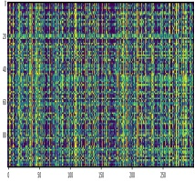

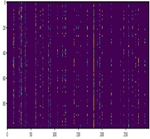

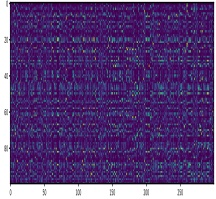

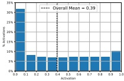

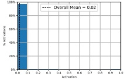

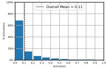

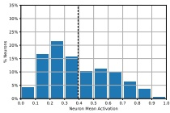

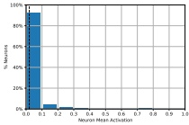

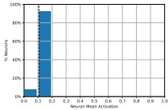

图 20.21：应用于 Fashion MNIST 的自编码器中（瓶颈层）的神经元活动。我们展示了三种模型的结果，分别具有不同类型的稀疏性惩罚：无惩罚（左列）、$\ell_1$ 惩罚（中列）、KL 惩罚（右列）。第一行：300 个神经元激活（列）在 100 个样本（行）上的热图。第二行：基于该热图的激活水平直方图。第三行：每个神经元平均激活（在验证集所有样本上取平均）的直方图。改编自 [Gér19] 的图 17.11。由 ae_mnist_tf.ipynb 生成。

将 $p(\boldsymbol{x}|\boldsymbol{z}) = \mathcal{N}(\boldsymbol{x}|\mathbf{W}\boldsymbol{z}, \sigma^{2}\mathbf{I})$ 替换为

$$ p_{\theta}(\boldsymbol{x}|\boldsymbol{z})=\mathcal{N}(\boldsymbol{x}|f_{d}(\boldsymbol{z};\boldsymbol{\theta}),\sigma^{2}\mathbf{I}) \tag*{(20.94)}$$

其中 $f_{d}$ 是解码器。对于二值观测，应使用伯努利似然：

$$ p(\boldsymbol{x}|\boldsymbol{z},\boldsymbol{\theta})=\prod_{i=1}^{D}\mathrm{B e r}(x_{i}|f_{d}(\boldsymbol{z};\boldsymbol{\theta}),\sigma^{2}\mathbf{I}) \tag*{(20.95)}$$

其次，我们创建另一个模型 $q(z|\boldsymbol{x})$，称为识别网络或推理网络，它与生成模型同时训练以进行近似后验推断。假设后验为高斯分布且具有对角协方差，则有

$$ q_{\phi}(z|\boldsymbol{x})=\mathcal{N}(z|f_{e,\mu}(\boldsymbol{x};\boldsymbol{\phi}),\mathrm{d i a g}(f_{e,\sigma}(\boldsymbol{x};\boldsymbol{\phi}))) \tag*{(20.96)}$$

“概率机器学习：导论”。在线版本。2024 年 11 月 23 日

---

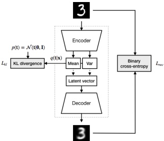

图 20.22：变分自编码器（VAE）的示意图。该图来自 http://krasserm.github.io/2018/07/27/dfc-vae/。经 Martin Krasser 友好许可使用。

其中 \( f_{e} \) 是编码器。参见 Figure 20.22 的示意图。

训练一个推理网络来“逆向”生成网络，而不是运行优化算法来推断潜在编码，这一思想称为**摊销推断**。该思想最早在赫尔姆霍兹机（Helmholtz machine）中提出 [Day+95]。然而，那篇论文没有为推断和生成提出一个统一的优化目标，而是采用了一种称为“醒睡算法”的方法进行训练，即在优化生成模型和推理模型之间交替进行。相比之下，变分自编码器（VAE）优化的是对数似然的变分下界，这种方法更有理论依据，因为它是一个单一的优化目标。

##### 20.3.5.1 变分自编码器（VAE）的训练

我们无法计算用于最大似然估计（MLE）训练所需的精确边际似然 \( p(\boldsymbol{x}|\boldsymbol{\theta}) \)，因为在非线性因子分析（FA）模型中进行后验推断是难以处理的。然而，我们可以使用推理网络计算近似后验 \( q(z|\boldsymbol{x}) \)，然后利用它来计算证据下界（ELBO）。对于单个样本 \( \boldsymbol{x} \)，其表达式为：

$$  \begin{align*}\mathbb{L}(\boldsymbol{\theta},\boldsymbol{\phi}|\boldsymbol{x})&=\mathbb{E}_{q_{\phi}(z|\boldsymbol{x})}\left[\log p_{\boldsymbol{\theta}}(\boldsymbol{x},z)-\log q_{\phi}(z|\boldsymbol{x})\right]\\&=\mathbb{E}_{q(z|\boldsymbol{x},\boldsymbol{\phi})}\left[\log p(\boldsymbol{x}|z,\boldsymbol{\theta})\right]-D_{\mathbb{K L}}\left(q(z|\boldsymbol{x},\boldsymbol{\phi})\parallel p(z)\right)\end{align*}   \tag*{(20.98)}$$

这可以解释为期望对数似然加上一个正则化项，该正则化项惩罚后验分布偏离先验分布过远（这与第 20.3.4 节的方法不同，后者在每个小批次中对聚合后验应用 KL 惩罚）。

ELBO 是对数边际似然（也称为证据）的一个下界，这可以由 Jensen 不等式看出：

$$  \begin{align*}\mathrm{L}(\boldsymbol{\theta},\boldsymbol{\phi}|\boldsymbol{x})&=\int q_{\phi}(z|\boldsymbol{x})\log\frac{p_{\boldsymbol{\theta}}(\boldsymbol{x},z)}{q_{\phi}(z|\boldsymbol{x})}dz\\&\leq\log\int q_{\phi}(z|\boldsymbol{x})\frac{p_{\boldsymbol{\theta}}(\boldsymbol{x},z)}{q_{\phi}(z|\boldsymbol{x})}dz=\log p_{\boldsymbol{\theta}}(\boldsymbol{x})\end{align*}   \tag*{(20.99)}$$

作者：Kevin P. Murphy。 (C) MIT Press。 CC-BY-NC-ND 许可证。

---

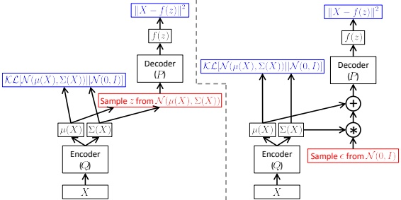

图 20.23: 变分自编码器的计算图。其中 $p(z) = \mathcal{N}(z|\mathbf{0},\mathbf{I})$，$p(\mathbf{x}|z,\boldsymbol{\theta}) = \mathcal{N}(\mathbf{x}|f(z),\sigma^{2}\mathbf{I})$，$q(z|\mathbf{x},\phi) = \mathcal{N}(z|\mu(\mathbf{x}),\Sigma(\mathbf{x}))$。红色方框表示不可微的采样操作。蓝色方框表示损失层（我们假设高斯似然和先验）。（左）未使用重参数化技巧。（右）使用重参数化技巧。梯度可以从输出损失反向传播，经过解码器并进入编码器。来自 [Doe16] 的图 4。经 Carl Doersch 许可使用。

因此，对于固定的推理网络参数 $\phi$，增加 ELBO 应能增加数据的对数似然，类似于 EM 算法（8.7.2 节）。

##### 20.3.5.2 重参数化技巧

在本节中，我们讨论如何计算 ELBO 及其梯度。为简单起见，假设推理网络估计高斯后验的参数。由于 $q_{\phi}(z|\boldsymbol{x})$ 是高斯分布，我们可以写成

$$ z = f_{e,\mu}(x;\phi) + f_{e,\sigma}(x;\phi) \odot \epsilon \tag*{(20.101)} $$

其中 $\epsilon \sim \mathcal{N}(\mathbf{0}, \mathbf{I})$。因此

$$ \begin{array}{r}{\mathbb{L}(\boldsymbol{\theta},\boldsymbol{\phi}|\boldsymbol{x}) = \mathbb{E}_{\boldsymbol{\epsilon}\sim\mathcal{N}(\mathbf{0},\mathbf{I})}\left[\log p_{\boldsymbol{\theta}}(\boldsymbol{x}|\boldsymbol{z}=\mu_{\phi}(\boldsymbol{x})+\sigma_{\phi}(\boldsymbol{x})\odot\boldsymbol{\epsilon})\right] - D_{\mathbb{K L}}\left(q_{\phi}(\boldsymbol{z}|\boldsymbol{x})\parallel p(\boldsymbol{z})\right)}\end{array} \tag*{(20.102)} $$

现在期望值与模型参数无关，因此我们可以安全地将梯度推入内部，并通过最小化关于 $\boldsymbol{\theta}$ 和 $\boldsymbol{\phi}$ 的 $-\mathbb{E}_{\mathbf{x} \sim \mathcal{D}}[\mathcal{L}(\boldsymbol{\theta}, \boldsymbol{\phi} | \mathbf{x})]$ 来以常规方式使用反向传播进行训练。这被称为**重参数化技巧**。参见图 20.23 的说明。

ELBO 中的第一项可以通过采样 $\epsilon$，经推理网络的输出缩放得到 $z$，然后使用解码器网络评估 $\log p(\boldsymbol{x}|\boldsymbol{z})$ 来近似。

ELBO 中的第二项是两个高斯分布之间的 KL 散度，具有闭式解。具体来说，将 $p(z) = \mathcal{N}(z|\mathbf{0}, \mathbf{I})$ 和 $q(z) = \mathcal{N}(z|\boldsymbol{\mu}, \mathrm{diag}(\boldsymbol{\sigma}))$ 代入式 (6.33)，可得

$$ D_{\mathbb{K L}}\left(q\parallel p\right) = \sum_{k=1}^{K}\left[\log\left(\frac{1}{\sigma_{k}}\right) + \frac{\sigma_{k}^{2} + (\mu_{k}-0)^{2}}{2\cdot 1} - \frac{1}{2}\right] = -\frac{1}{2}\sum_{k=1}^{K}\left[\log\sigma_{k}^{2} - \sigma_{k}^{2} - \mu_{k}^{2} + 1\right] \tag*{(20.103)} $$

---

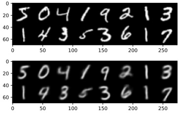

 $ (a) $

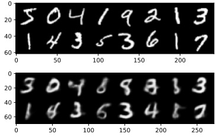

(b)

图 20.24：使用 20 维潜空间重建 MNIST 数字。顶行：输入图像。底行：重建结果。(a) VAE。由 vae_mnist_conv_lightning.ipynb 生成。(b) 确定性 AE。由 ae_mnist_conv.ipynb 生成。

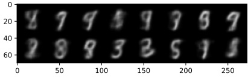

 $ (a) $

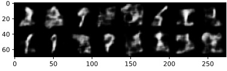

(b)

图 20.25：使用 20 维潜空间采样 MNIST 数字。(a) VAE。由 vae_mnist_conv_lightning.ipynb 生成。(b) 确定性 AE。由 ae_mnist_conv.ipynb 生成。

##### 20.3.5.3 VAE 与自编码器的比较

VAE 与自编码器非常相似。具体而言，生成模型 $ p_{\theta}(\boldsymbol{x}|\boldsymbol{z}) $ 充当解码器，而推理网络 $ q_{\phi}(\boldsymbol{z}|\boldsymbol{x}) $ 充当编码器。两种模型的重建能力相似，如图 20.24a 与图 20.24b 的比较所示。

VAE 的主要优势在于它可以利用随机噪声生成新数据。具体来说，我们从高斯先验 $\mathcal{N}(z|\mathbf{0},\mathbf{I})$ 中采样 $z$，然后将其输入解码器得到 $\mathbb{E}[\mathbf{x}|\mathbf{z}] = f_d(\mathbf{z};\boldsymbol{\theta})$。VAE 的解码器经过训练，能够将嵌入空间中的随机点（通过扰动输入编码生成）转换为合理的输出。相比之下，确定性自编码器的解码器仅接收训练集的精确编码作为输入，因此对于训练集之外的随机输入，它不知道如何处理。因此，标准自编码器无法创建新样本。这种差异可以从图 20.25a 与图 20.25b 的对比中看出。

VAE 在采样方面表现更好的原因在于，它将图像嵌入为潜空间中的高斯分布，而 AE 则将图像嵌入为点，这些点类似于 delta 函数。使用

作者：Kevin P. Murphy。 (C) MIT 出版社。CC-BY-NC-ND 许可协议。

---

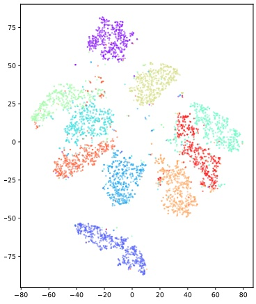

 $ (a) $

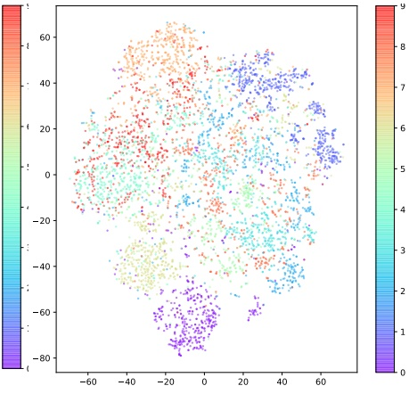

(b)

图20.26：20维潜在空间的tSNE投影。(a) VAE。由vae_mnist_conv_lightning.ipynb生成。(b) 确定性AE。由ae_mnist_conv.ipynb生成。

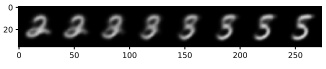

 $ (a) $

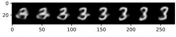

(b)

图20.27：在20维潜在空间中左右图像之间的线性插值。(a) VAE。(b) 确定性AE。由vae_mnist_conv_lightning.ipynb生成。

潜在分布的一个特性是它鼓励局部平滑性，因为给定图像可能映射到多个邻近位置，这取决于随机采样。相比之下，在AE中，潜在空间通常不平滑，因此不同类别的图像经常彼此相邻。这一差异可以通过比较图20.26a和图20.26b看出。

我们可以利用潜在空间的平滑性进行图像插值。不是在像素空间操作，而是在模型的潜在空间中操作。具体来说，设 $ x_1 $ 和 $ x_2 $ 为两幅图像，设 $ z_1 = \mathbb{E}_q(z | x_1) $ 和 $ z_2 = \mathbb{E}_q(z | x_2) $ 为它们的编码。我们可以通过计算 $ z = \lambda z_1 + (1 - \lambda)z_2 $（其中 $ 0 \leq \lambda \leq 1 $）生成插值于这两个锚点之间的新图像，然后通过计算 $ \mathbb{E} [x | z] $ 进行解码。这称为潜在空间插值。（采用线性插值的理由在于，学习到的流形曲率近似为零，如文献[SKTF18]所示。）对于潜在空间插值，VAE比AE更有用，因为其潜在空间更平滑，而且该模型可以从潜在空间中几乎任意一点生成图像。这一差异可以通过比较图20.27a和图20.27b看出。

---

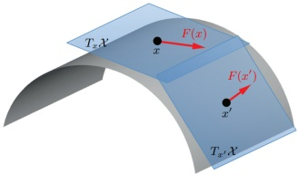

图 20.28：二维弯曲流形上两个不同点处的切空间与切向量示意。摘自 $ [Bro+17a] $ 的图 1，经 Michael Bronstein 许可使用。

### 20.4 流形学习 *

本节讨论从高维数据中恢复潜在低维结构的问题。该结构通常假设为弯曲流形（详见第 20.4.1 节），因此称为**流形学习**或非线性降维。与自编码器（第 20.3 节）等方法的本质区别在于，本文将重点放在非参数方法上：针对训练集中每个点计算嵌入，而非学习一个能嵌入任意输入向量的通用模型。换言之，本文讨论的方法难以（直接）支持样本外泛化，但更易拟合且灵活性较强。这类方法可用于无监督学习（知识发现）、数据可视化，以及作为监督学习的预处理步骤。该领域的最新综述可参见 [AAB21]。

#### 20.4.1 什么是流形？

粗略地讲，**流形**（$\underline{\text{manifold}}$）是一种局部欧几里得的拓扑空间。最简单的例子是地球表面——一个嵌入三维空间的弯曲二维曲面。在地表每个局部点，地面看似平坦。

更正式地，一个 $d$ 维流形 $\mathcal{X}$ 满足：每个点 $x \in \mathcal{X}$ 都存在一个邻域，该邻域与 $d$ 维欧几里得空间（称为切空间，记为 $\mathcal{T}_x = T_x \mathcal{X}$）拓扑同胚。如图 20.28 所示。

**黎曼流形**是一种可微流形，它在每个点 $x$ 处关联一个切空间上的内积算子，并假设该内积光滑地依赖于位置 $x$。内积诱导出距离、角度和体积的概念。这些内积的汇集称为**黎曼度量**。可以证明，任何足够光滑的黎曼流形都能嵌入到某个可能更高维的欧几里得空间中；此时该点的黎曼内积即为切空间中的欧几里得内积。

#### 20.4.2 流形假设

大多数“自然出现”的高维数据集位于低维流形上，这称为**流形假设** [FMN16]。以图像为例，图 20.29a 展示了一个

作者：Kevin P. Murphy. (C) MIT Press. CC-BY-NC-ND 许可证

---

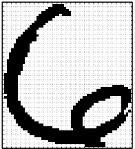

(a)

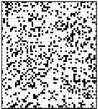

(b)

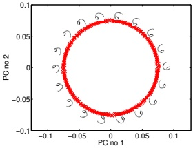

(c)

图 20.29：图像流形的示意图。(a) 来自 USPS 数据集的数字 6 的图像，尺寸为 $64 \times 57 = 3,648$。(b) 从空间 $\{0,1\}^{3648}$ 中随机抽取的一个样本，重塑为图像。(c) 通过将原始图像每次旋转 1 度、共旋转 360 次创建的数据集。我们将此数据投影到其前两个主成分上，以揭示底层的二维圆形流形。来自 [Law12] 的图 1。经 Neil Lawrence 许可使用。

单个图像尺寸为 $64 \times 57$。它是 3,648 维空间中的一个向量，每个维度对应一个像素强度。假设我们尝试通过在该空间中绘制一个随机点来生成图像；如图 20.29b 所示，该图像不太可能看起来像数字图像。然而，像素之间并非相互独立，因为它们是由某种低维结构（即数字 6 的形状）生成的。

当我们改变形状时，会生成不同的图像。我们通常可以使用低维流形来表征形状变化的空间。这在图 20.29c 中得到了说明，我们应用 PCA（第 20.1 节）将包含 360 幅图像的数据集（每幅图像都是数字 6 略微旋转后的版本）投影到二维空间中。我们看到，数据中的大部分变化都被一个底层弯曲的二维流形所捕获。我们说数据的**内在维度** $d$ 为 2，即使**环境维度** $D$ 为 3,648。

#### 20.4.3 流形学习方法

在本节的其余部分，我们将讨论从数据中学习流形的方法。目前已提出了许多不同的算法，它们对流形的性质做出了不同的假设，并具有不同的计算特性。在后续小节中，我们将讨论其中几种方法。更多细节参见例如 [Bur10]。

这些方法可以按表 20.1 进行分类。"非参数"一词指的是那些为每个数据点 $x_i$ 学习一个低维嵌入 $z_i$，但不学习可应用于样本外数据点的映射函数的方法。（然而，[Ben+04b] 讨论了如何通过核学习将其中许多方法扩展到训练集之外。）

在下面的小节中，我们将使用两个不同的数据集来比较其中一些方法：从二维"瑞士卷"流形中采样的 1000 个三维点集，以及从 UCI 数字数据集中采样的 1797 个 64 维点集。参见图 20.30 中的数据图示。我们将学习一个二维流形，以便能够对数据进行可视化。

---

<table border=1 style='margin: auto; word-wrap: break-word;'><tr><td style='text-align: center; word-wrap: break-word;'>方法</td><td style='text-align: center; word-wrap: break-word;'>参数化</td><td style='text-align: center; word-wrap: break-word;'>凸性</td><td style='text-align: center; word-wrap: break-word;'>章节</td></tr><tr><td style='text-align: center; word-wrap: break-word;'>PCA / classical MDS</td><td style='text-align: center; word-wrap: break-word;'>N</td><td style='text-align: center; word-wrap: break-word;'>Y (密集)</td><td style='text-align: center; word-wrap: break-word;'>Section 20.1</td></tr><tr><td style='text-align: center; word-wrap: break-word;'>Kernel PCA</td><td style='text-align: center; word-wrap: break-word;'>N</td><td style='text-align: center; word-wrap: break-word;'>Y (密集)</td><td style='text-align: center; word-wrap: break-word;'>Section 20.4.6</td></tr><tr><td style='text-align: center; word-wrap: break-word;'>Isomap</td><td style='text-align: center; word-wrap: break-word;'>N</td><td style='text-align: center; word-wrap: break-word;'>Y (密集)</td><td style='text-align: center; word-wrap: break-word;'>Section 20.4.5</td></tr><tr><td style='text-align: center; word-wrap: break-word;'>LLE</td><td style='text-align: center; word-wrap: break-word;'>N</td><td style='text-align: center; word-wrap: break-word;'>Y (稀疏)</td><td style='text-align: center; word-wrap: break-word;'>Section 20.4.8</td></tr><tr><td style='text-align: center; word-wrap: break-word;'>Laplacian Eigenmaps</td><td style='text-align: center; word-wrap: break-word;'>N</td><td style='text-align: center; word-wrap: break-word;'>Y (稀疏)</td><td style='text-align: center; word-wrap: break-word;'>Section 20.4.9</td></tr><tr><td style='text-align: center; word-wrap: break-word;'>tSNE</td><td style='text-align: center; word-wrap: break-word;'>N</td><td style='text-align: center; word-wrap: break-word;'>N</td><td style='text-align: center; word-wrap: break-word;'>Section 20.4.10</td></tr><tr><td style='text-align: center; word-wrap: break-word;'>Autoencoder</td><td style='text-align: center; word-wrap: break-word;'>Y</td><td style='text-align: center; word-wrap: break-word;'>N</td><td style='text-align: center; word-wrap: break-word;'>Section 20.3</td></tr></table>

表 20.1：部分降维方法列表。如果某方法是凸的，我们在括号中说明它需要求解稀疏还是密集特征值问题。

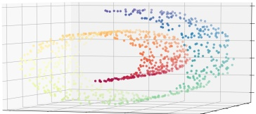

 $ (a) $

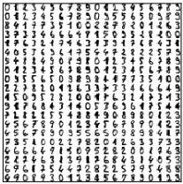

(b)

图 20.30：从低维流形生成的若干数据示意图。(a) 嵌入到3维空间中的2维瑞士卷流形。由 manifold_swiss_sklearn.ipynb 生成。(b) 一些 UCI 手写数字样本，尺寸为 $ 8 \times 8 = 64 $。由 manifold_digits_sklearn.ipynb 生成。

#### 20.4.4 多维缩放（MDS）

流形学习最简单的方法是**多维缩放（MDS）**。该方法尝试寻找一组低维向量 $\{z_i \in \mathbb{R}^L : i = 1 : N\}$，使得这些向量之间的两两距离与用户提供的相异度矩阵 $\mathbf{D} = \{d_{ij}\}$ 尽可能相似。MDS 有若干变体，其中一种等价于 PCA，下文将进行讨论。

##### 20.4.4.1 经典MDS

假设我们有一个 $N \times D$ 的数据矩阵 $\mathbf{X}$，其行向量为 $\boldsymbol{x}_i$。定义中心化的 Gram（相似度）矩阵如下：

$$  \tilde{K}_{i j}=\left\langle\boldsymbol{x}_{i}-\overline{\boldsymbol{x}},\boldsymbol{x}_{j}-\overline{\boldsymbol{x}}\right\rangle   \tag*{(20.104)}$$

用矩阵符号表示为 $\tilde{\mathbf{K}} = \tilde{\mathbf{X}}\tilde{\mathbf{X}}^{\top}$，其中 $\tilde{\mathbf{X}} = \mathbf{C}_{N}\mathbf{X}$，而 $\mathbf{C}_{N} = \mathbf{I}_{N} - \frac{1}{N}\mathbf{1}_{N}\mathbf{1}_{N}^{\top}$ 是中心化矩阵。

作者：Kevin P. Murphy。 (C) MIT Press。CC-BY-NC-ND 许可证。

---

现在，我们定义一组嵌入的应变如下：

$$  \mathcal{L}_{\mathrm{strain}}(\mathbf{Z})=\sum_{i,j}(\tilde{K}_{ij}-\langle\tilde{z}_{i},\tilde{z}_{j}\rangle)^{2}=||\tilde{\mathbf{K}}-\tilde{\mathbf{Z}}\tilde{\mathbf{Z}}^{\top}||_{F}^{2}   \tag*{(20.105)}$$

其中 $ \tilde{z}_i = z_i - \overline{z} $ 是中心化的嵌入向量。直观上，该度量衡量了高维数据空间中的相似性 $ \tilde{K}_{ij} $ 与低维嵌入空间中的相似性 $ \langle \tilde{z}_i, \tilde{z}_j \rangle $ 的匹配程度。最小化该损失被称为经典度量多维缩放（classical MDS）。

从第7.5节可知，矩阵的最佳秩 $L$ 近似是其截断SVD表示 $\tilde{\mathbf{K}} = \mathbf{USV}^\top$。由于 $\tilde{\mathbf{K}}$ 是半正定的，我们有 $\mathbf{V} = \mathbf{U}$。因此，最优嵌入满足

$$  \tilde{\mathbf{Z}}\tilde{\mathbf{Z}}^{\top}=\mathbf{U}\mathbf{S}\mathbf{U}^{\top}=(\mathbf{U}\mathbf{S}^{\frac{1}{2}})(\mathbf{S}^{\frac{1}{2}}\mathbf{U}^{\top})   \tag*{(20.106)}$$

因此，我们可以将嵌入向量设置为 $ \tilde{\mathbf{Z}} = \mathbf{U}\mathbf{S}^{\frac{1}{2}} $ 的行。

现在我们描述如何将经典MDS应用于仅有欧几里得距离而无原始特征的数据集。首先计算一个平方欧几里得距离矩阵 $ \mathbf{D}^{(2)} = \mathbf{D} \odot \mathbf{D} $，其元素如下：

$$  \begin{align*}D_{ij}^{(2)}=||\boldsymbol{x}_{i}-\boldsymbol{x}_{j}||^{2}=||\boldsymbol{x}_{i}-\overline{\boldsymbol{x}}||^{2}+||\boldsymbol{x}_{j}-\overline{\boldsymbol{x}}||^{2}-2\langle\boldsymbol{x}_{i}-\overline{\boldsymbol{x}},\boldsymbol{x}_{j}-\overline{\boldsymbol{x}}\rangle\\=||\boldsymbol{x}_{i}-\overline{\boldsymbol{x}}||^{2}+||\boldsymbol{x}_{j}-\overline{\boldsymbol{x}}||^{2}-2\tilde{K}_{ij}\end{align*}   \tag*{(20.107)}$$

我们看到 $ \mathbf{D}^{(2)} $ 与 $ \tilde{\mathbf{K}} $ 仅相差一些行和列常数（以及一个因子 -2）。因此，我们可以通过对 $ \mathbf{D}^{(2)} $ 进行双重中心化（double centering），使用公式 (7.89) 得到 $ \tilde{\mathbf{K}} = -\frac{1}{2}\mathbf{C}_{N}\mathbf{D}^{(2)}\mathbf{C}_{N} $。换句话说，

$$  \tilde{K}_{i j}=-\frac{1}{2}\left(d_{i j}^{2}-\frac{1}{N}\sum_{l=1}^{N}d_{i l}^{2}-\frac{1}{N}\sum_{l=1}^{N}d_{j l}^{2}+\frac{1}{N^{2}}\sum_{l=1}^{N}\sum_{m=1}^{N}d_{l m}^{2}\right)   \tag*{(20.109)}$$

然后我们可以像之前一样计算嵌入。

事实证明，经典MDS等价于PCA（第20.1节）。为说明这一点，令 $ \mathbf{\tilde{K}} = \mathbf{U}_L \mathbf{S}_L \mathbf{U}_L^\top $ 为中心化核矩阵的秩 $ L $ 截断SVD。MDS嵌入由 $ \mathbf{Z}_{\text{MDS}} = \mathbf{U}_L \mathbf{S}_L^{\frac{1}{2}} $ 给出。现在考虑中心化数据矩阵的秩 $ L $ SVD，$ \mathbf{\tilde{X}} = \mathbf{U}_X \mathbf{S}_X \mathbf{V}_X^\top $。PCA嵌入为 $ \mathbf{Z}_{\text{PCA}} = \mathbf{U}_X \mathbf{S}_X $。于是

$$  \tilde{\mathbf{K}}=\tilde{\mathbf{X}}\tilde{\mathbf{X}}^{\mathsf{T}}=\mathbf{U}_{X}\mathbf{S}_{X}\mathbf{V}_{X}^{\mathsf{T}}\mathbf{V}_{X}\mathbf{S}_{X}\mathbf{U}_{X}^{\mathsf{T}}=\mathbf{U}_{X}\mathbf{S}_{X}^{2}\mathbf{U}_{X}^{\mathsf{T}}=\mathbf{U}_{L}\mathbf{S}_{L}\mathbf{U}_{L}^{\mathsf{T}}   \tag*{(20.110)}$$

因此 $  \mathbf{U}_X = \mathbf{U}_L  $ 且 $  \mathbf{S}_X = \mathbf{S}_L^2  $，从而 $  \mathbf{Z}_{\text{PCA}} = \mathbf{Z}_{\text{MDS}}  $。

##### 20.4.4.2 度量MDS

经典MDS假设欧几里得距离。我们可以通过定义应力函数（stress function）将其推广到允许任意不相似性度量：

$$  \mathcal{L}_{stress}(\mathbf{Z})=\sqrt{\frac{\sum_{i<j}(d_{ij}-\hat{d}_{ij})^{2}}{\sum_{ij}d_{ij}^{2}}}   \tag*{(20.111)}$$

---

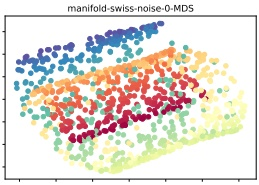

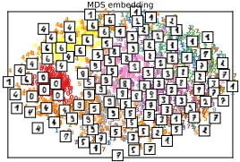

(a)

(b)

图20.31: 度量MDS应用于(a)瑞士卷。由manifold_swiss_sklearn.ipynb生成。(b) UCI数字。由manifold_digits_sklearn.ipynb生成。

其中 $ \hat{d}_{ij} = ||z_i - z_j|| $。这被称为度量MDS。注意，这与经典MDS使用的目标函数不同，因此即使 $ d_{ij} $ 是欧几里得距离，结果也会不同。

我们可以使用梯度下降来求解该优化问题。然而，使用一种称为SMACOF[Lee77]的边界优化算法（第8.7节）会更好，SMACOF代表“通过主导化一个复杂函数进行缩放”。（这是scikit-learn中实现的方法。）将此方法应用于我们当前示例的结果见图20.31。

##### 20.4.4.3 非度量MDS

我们不再试图匹配点之间的距离，而是仅尝试匹配点之间相似度的排序。为此，令 $ f(d) $ 为从距离到排序的单调变换。现在定义损失

$$  \mathcal{L}_{\mathrm{N M}}(\mathbf{Z})=\sqrt{\frac{\sum_{i<j}(f(d_{i j})-\hat{d}_{i j})^{2}}{\sum_{i j}\hat{d}_{i j}^{2}}}   \tag*{(20.112)}$$

其中 $ \hat{d}_{ij} = ||z_i - z_j|| $。（注意分母中是 $ \hat{d}_{ij}^2 $，而不是 $ d_{ij}^2 $。）最小化该目标被称为非度量MDS。

该目标可以迭代优化。首先，在给定Z的情况下，使用保序回归优化函数f；这找到输入距离的最优单调变换，以匹配当前嵌入距离。然后，在给定f的情况下，使用梯度下降优化嵌入Z，并重复该过程。

##### 20.4.4.4 Sammon映射

度量MDS试图最小化距离的平方和，因此它最注重大的距离。然而，对于许多嵌入方法，小的距离更为重要，因为它们捕捉局部结构。一种捕捉这一点的方法是将损失的每一项除以 $ d_{ij} $，因此小距离

---

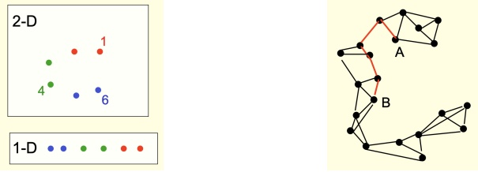

(a)

(b)

图 20.32: (a) 如果沿流形测量距离，我们会发现 $ d(1,6) > d(1,4) $，而如果在环境空间中测量，则 $ d(1,6) < d(1,4) $。底部图显示了底层的一维流形。(b) 某些数据点的 K 近邻图；红色路径是该图上 A 与 B 之间的最短距离。摘自 [Hin13]。经 Geoff Hinton 许可使用。

获得更大的权重：

$$  \mathcal{L}_{\mathrm{s a m m o n}}(\mathbf{Z})=\left(\frac{1}{\sum_{i<j}d_{i j}}\right)\sum_{i\neq j}\frac{(\hat{d}_{i j}-d_{i j})^{2}}{d_{i j}}   \tag*{(20.113)}$$

（注意分母中是 $ d_{ij} $，而不是 $ d_{ij}^{2} $。）最小化该函数将得到 Sammon 映射。（总和前的系数仅为简化损失梯度。）不幸的是，这是一个非凸目标，并且可以说它过于强调将非常小的距离精确拟合。我们将在后续讨论捕捉局部结构的更好方法。

#### 20.4.5 Isomap

如果高维数据位于或接近弯曲流形（例如瑞士卷示例），则 MDS 可能会认为两个点很近，即使它们沿流形的距离很大。这一点如图 20.32a 所示。

一种捕捉这一性质的方法是构建数据点之间的 $ K $ 近邻图 $ ^{5} $，然后通过该图上的最短距离来近似一对点之间的流形距离；这可以使用 Dijkstra 最短路径算法高效计算。如图 20.32b 所示。一旦计算了这种新距离度量，就可以应用经典 MDS（即 PCA）。这是一种在避免局部最优的同时捕捉局部结构的方法。整体方法称为 Isomap [TSL00]。

图 20.33 展示了该方法在我们的运行示例上的结果。我们看到这些结果相当合理。然而，如果数据存在噪声，近邻图中可能出现“虚假”边，从而导致“短路”，显著扭曲嵌入，如图 20.34 所示。这个问题称为 **拓扑不稳定性** [BS02]。选择非常小的邻域并不能解决该问题，因为这可能将流形分割成大量不连通的区域。已提出了其他各种解决方案，例如 [CC07]。

---

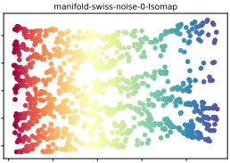

(a)

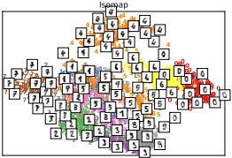

(b)

图 20.33：Isomap 应用于 (a) Swiss roll。由 manifold_swiss_sklearn.ipynb 生成。(b) UCI 手写数字数据集。由 manifold_digits_sklearn.ipynb 生成。

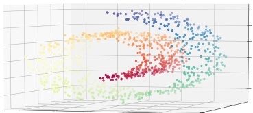

(a)

(b)

图 20.34：(a) 带噪声的 Swiss roll 数据。我们对每个点添加了 $ \mathcal{N}(0,0.5^2) $ 噪声。(b) Isomap 应用于该数据的结果。由 manifold_swiss_sklearn.ipynb 生成。

#### 20.4.6 核 PCA

PCA（以及经典 MDS）寻找数据的最佳线性投影，以保留所有点之间的成对相似性。在本节中，我们考虑非线性投影。关键思想是如第 20.1.3.2 节所述，通过求解内积（Gram）矩阵 $ \mathbf{K} = \mathbf{X}\mathbf{X}^{\top} $ 的特征向量来求解 PCA，然后利用核技巧（第 17.3.4 节），该技巧允许我们使用核函数 $ K_{ij} = \mathcal{K}(\boldsymbol{x}_{i}, \boldsymbol{x}_{k}) $ 替换内积（如 $ \boldsymbol{x}_{i}^{\top} \boldsymbol{x}_{j} $）。这被称为核 PCA [SSM98]。

回顾 Mercer 定理，使用核意味着存在某个隐含的特征空间，因此我们隐式地将 $ \mathbf{x}_i $ 替换为 $ \phi(\mathbf{x}_i) = \phi_i $。令 $ \mathbf{\Phi} $ 为对应的（名义上的）设计矩阵，$ \mathbf{K} = \mathbf{X}\mathbf{X}^\top $ 为 Gram 矩阵。最后，令 $ \mathbf{S}_\phi = \frac{1}{N} \sum_i \phi_i \phi_i^\top $ 为特征空间中的协方差矩阵。（我们暂时假设特征是中心化的。）根据公式 (20.22)，$ \mathbf{S} $ 的归一化特征向量由 $ \mathbf{V}_{\text{kPCA}} = \mathbf{\Phi}^\top \mathbf{U} \mathbf{\Lambda}^{-}\frac{1}{2} $ 给出，其中 $ \mathbf{U} $ 和 $ \mathbf{\Lambda} $ 包含 $ \mathbf{K} $ 的特征向量和特征值。当然，由于 $ \phi_i $ 可能是无限维的，我们实际上无法计算 $ \mathbf{V}_{\text{kPCA}} $。然而，我们可以将测试向量 $ \mathbf{x}_* $ 投影到特征空间中，计算方式为

---

图 20.35：从某些二维数据计算出的前 8 个核主成分基函数的可视化。我们使用了一个 RBF 核，其中  $ \sigma^2 = 0.1 $。由 kpcaScholkopf.ipynb 生成。

如下所示：

$$  \boldsymbol{\phi}_{*}^{\mathsf{T}}\mathbf{V}_{\mathrm{k P C A}}=\boldsymbol{\phi}_{*}^{\mathsf{T}}\boldsymbol{\Phi}^{\mathsf{T}}\mathbf{U}\boldsymbol{\Lambda}^{-\frac{1}{2}}=\boldsymbol{k}_{*}^{\mathsf{T}}\mathbf{U}\boldsymbol{\Lambda}^{-\frac{1}{2}}   \tag*{(20.114)}$$

其中  $ k_{*} = [\mathcal{K}(x_{*}, x_{1}), \ldots, \mathcal{K}(x_{*}, x_{N})] $。

还有一个细节需要注意。协方差矩阵仅在特征均值为零时才由  $ \mathbf{S} = \boldsymbol{\Phi}^\top \boldsymbol{\Phi} $ 给出。因此，只有在  $ \mathbb{E} \left[ \phi_i \right] = \mathbf{0} $ 时，我们才能使用 Gram 矩阵  $ \mathbf{K} = \boldsymbol{\Phi} \boldsymbol{\Phi}^\top $。遗憾的是，我们无法简单地减去特征空间中的均值，因为它可能是无限维的。不过，我们可以使用一个小技巧。将中心化后的特征向量定义为  $ \tilde{\phi}_i = \phi(\mathbf{x}_i) - \frac{1}{N} \sum_{j=1}^N \phi(\mathbf{x}_j) $。中心化特征向量的 Gram 矩阵由  $ \tilde{K}_{ij} = \tilde{\phi}_i^\top \tilde{\phi}_j $ 给出。利用方程 (7.89) 中的双重中心化技巧，我们可以将其写为矩阵形式  $ \tilde{\mathbf{K}} = \mathbf{C}_N \mathbf{K} \mathbf{C}_N $，其中  $ \mathbf{C}_N \triangleq \mathbf{I}_N - \frac{1}{N} \mathbf{1}_N \mathbf{I}_N^\top $ 是中心化矩阵。

如果我们使用线性核应用核主成分分析（kPCA），则恢复为常规 PCA（经典 MDS）。这限于使用  $ L \leq D $ 的嵌入维度。如果使用非退化核，则可以使用最多 N 个分量，因为  $ \Phi $ 的大小为  $ N \times D^* $，其中  $ D^* $ 是嵌入特征向量的（可能为无穷）维数。图 20.35 给出了该方法应用于某些  $ D = 2 $ 维数据（使用 RBF 核）的示例。我们将单位网格上的点投影到前 8 个分量上，并使用等高线图可视化相应的曲面。我们看到前两个分量分离了三个簇，后续分量则进一步分割这些簇。

参见图 20.36 中在我们运行的示例上应用核主成分分析（kPCA）（使用 RBF 核）的部分结果。在这种情况下，结果可以说并不十分有用。实际上，可以证明，使用 RBF 核的 kPCA 扩展了特征空间而不是缩减它 [WSS04]，正如我们在图 20.35 中看到的那样。

---

(a)

(b)

图20.36：核PCA应用于 (a) Swiss roll。（由 manifold_swiss_sklearn.ipynb 生成。）(b) UCI 手写数字。（由 manifold_digits_sklearn.ipynb 生成。）

这使其作为降维方法不太有用。我们在Section 20.4.7中讨论了对此的解决方案。

#### 20.4.7 最大方差展开 (MVU)

如Section 20.4.6所讨论的，使用某些核函数（如RBF，径向基函数）的kPCA可能不会产生低维嵌入。这一观察结果导致了半正定嵌入算法[WSS04]的发展，该算法也称为最大方差展开，旨在学习一个嵌入 $ \{z_i\} $，满足

$$  \max\sum_{ij}||z_{i}-z_{j}||_{2}^{2}\text{s.t.}||z_{i}-z_{j}||_{2}^{2}=||\boldsymbol{x}_{i}-\boldsymbol{x}_{j}||_{2}^{2}for all(i,j)\in G   \tag*{(20.115)}$$

其中G是最近邻图（如Isomap中使用的）。该方法明确尝试在尊重最近邻约束的同时“展开”数据流形。

这可以通过定义核矩阵 $ \mathbf{K} = \mathbf{Z}\mathbf{Z}^{\top} $ 并优化下述问题重新表述为半正定规划问题：

$$  \max tr(\mathbf{K})\text{s.t.}\left||z_{i}-z_{j}|\right|_{2}^{2}=\left|\left|\mathbf{x}_{i}-\mathbf{x}_{j}\right|\right|_{2}^{2},\sum_{ij}K_{ij}=0,\mathbf{K}\succ0   \tag*{(20.116)}$$

得到的核随后被传递给kPCA，而得到的特征向量给出了低维嵌入。

#### 20.4.8 局部线性嵌入 (LLE)

到目前为止讨论的技术都依赖于对成对相似性全矩阵的特征分解，无论是在原始空间（PCA）、特征空间（kPCA）还是沿KNN图（Isomap）中。在本节中，我们讨论局部线性嵌入（LLE）[RS00]，这是一种解决稀疏特征问题的方法，因此更关注数据的局部结构。

作者：Kevin P. Murphy. (C) MIT Press. CC-BY-NC-ND 许可证.

---

(a)

(b)

图 20.37：LLE 应用于 (a) 瑞士卷。由 manifold_swiss_sklearn.ipynb 生成。(b) UCI 手写数字。由 manifold_digits_sklearn.ipynb 生成。

LLE 假设每个点  $ \pmb{x}_{i} $ 周围的数据流形是局部线性的。可以通过将 $ \pmb{x}_{i} $ 表示为它的 K 个最近邻的线性组合，并使用重构权重  $ \pmb{w}_{i} $ 来找到最佳线性近似。这可以通过求解以下问题得到：

$$  \hat{\mathbf{W}}=\min_{\mathbf{W}}\sum_{i=1}^{N}(\mathbf{x}_{i}-\sum_{j=1}^{N}w_{ij}\mathbf{x}_{j})^{2}   \tag*{(20.117)}$$

$$  \begin{aligned}subject to\begin{cases}w_{ij}=0&if\boldsymbol{x}_{j}\notin nbr(\boldsymbol{x}_{i},K)\\\sum_{j=1}^{N}w_{ij}=1&for i=1:N\end{cases}\end{aligned}   \tag*{(20.118)}$$

注意，我们需要权重的和为 1 的约束，以防止平凡解 $ \mathbf{W} = \mathbf{0} $。得到的权重向量 $ \boldsymbol{w}_{i,:} $ 构成了 $ \boldsymbol{x}_{i} $ 的重心坐标。

该超平面到低维空间的任何线性映射都会保持重构权重，从而保持局部几何结构。因此，我们可以通过求解以下问题来获得每个点的低维嵌入：

$$  \hat{\mathbf{Z}}=\underset{\mathbf{Z}}{\operatorname{argmin}}\sum_{i}||\mathbf{z}_{i}-\sum_{j=1}^{N}\hat{w}_{ij}\mathbf{z}_{j}||_{2}^{2}   \tag*{(20.119)}$$

其中，如果 $ j $ 不是 $ i $ 的 $ K $ 个最近邻之一，则 $ \hat{w}_{ij} = 0 $。我们可以将此损失重写为：

$$  \mathcal{L}(\mathbf{Z})=||\mathbf{Z}-\mathbf{W}\mathbf{Z}||^{2}=\mathbf{Z}^{\top}(\mathbf{I}-\mathbf{W})^{\top}(\mathbf{I}-\mathbf{W})\mathbf{Z}   \tag*{(20.120)}$$

因此，解由 $ (\mathbf{I}-\mathbf{W})^\mathsf{T}(\mathbf{I}-\mathbf{W}) $ 的最小非零特征值对应的特征向量给出，如第 7.4.8 节所示。

对于我们的运行示例，LLE 的一些结果见图 20.37。在本例中，结果似乎不如 Isomap 产生的那么好。然而，该方法对短路（噪声）的敏感度往往较低。

---

 $ (a) $

(b)

图20.38：拉普拉斯特征映射应用于 (a) Swiss roll。由 manifold_swiss_sklearn.ipynb 生成。 (b) UCI 手写数字。由 manifold_digits_sklearn.ipynb 生成。

#### 20.4.9 拉普拉斯特征映射

本节介绍拉普拉斯特征映射或谱嵌入 [BN01]。其思想是计算数据的低维表示，使得数据点与其K个最近邻之间的加权距离最小化。我们对第一个最近邻居赋予比第二个更大的权重，以此类推。下面给出详细说明。

##### 20.4.9.1 利用图拉普拉斯特征向量计算嵌入

我们希望找到最小化下式的嵌入：

$$  \mathcal{L}(\mathbf{Z})=\sum_{(i,j)\in E}W_{i,j}||z_{i}-z_{j}||_{2}^{2}   \tag*{(20.121)}$$

其中，若 $i$ 和 $j$ 在KNN图中互为邻居，则 $ W_{ij} = \exp(-\frac{1}{2\sigma^2}||\boldsymbol{x}_i - \boldsymbol{x}_j||_2^2) $，否则为 $0$。为避免退化解 $\mathbf{Z} = \mathbf{0}$，我们添加约束 $\mathbf{Z}^\top \mathbf{D}\mathbf{Z} = \mathbf{I}$，其中 $\mathbf{D}$ 为存储每个节点度的对角权重矩阵，即 $ D_{ii} = \sum_j W_{i,j} $。

可将上述目标函数重写如下：

$$  \mathcal{L}(\mathbf{Z})=\sum_{i j}W_{i j}(||z_{i}||^{2}+||z_{j}||^{2}-2z_{i}^{\mathsf{T}}z_{j})   \tag*{(20.122)}$$

$$  =\sum_{i}D_{ii}||z_{i}||^{2}+\sum_{j}D_{jj}||z_{j}||^{2}-2\sum_{ij}W_{ij}z_{i}z_{j}^{\top}   \tag*{(20.123)}$$

$$  =2\mathrm{tr}(\mathbf{Z}^{\mathsf{T}}\mathbf{D}\mathbf{Z})-2\mathrm{tr}(\mathbf{Z}^{\mathsf{T}}\mathbf{W}\mathbf{Z})=2\mathrm{tr}(\mathbf{Z}^{\mathsf{T}}\mathbf{L}\mathbf{Z})   \tag*{(20.124)}$$

其中 $\mathbf{L} = \mathbf{D} - \mathbf{W}$ 为图拉普拉斯矩阵（见第20.4.9.2节）。可以证明，最小化该目标等价于求解L个最小非零特征值对应的（广义）特征值问题 $\mathbf{L}z_i = \lambda_i \mathbf{D}z_i$。

图20.38展示了将该方法（使用RBF核）应用于运行示例的结果。

作者：Kevin P. Murphy。 (C) MIT Press。 CC-BY-NC-ND 许可协议。

---

<table border=1 style='margin: auto; word-wrap: break-word;'><tr><td style='text-align: center; word-wrap: break-word;'>带标记的图</td><td colspan="6">度矩阵</td><td colspan="6">邻接矩阵</td><td colspan="6">拉普拉斯矩阵</td></tr><tr><td style='text-align: center; word-wrap: break-word;'>6</td><td style='text-align: center; word-wrap: break-word;'>0</td><td style='text-align: center; word-wrap: break-word;'>0</td><td style='text-align: center; word-wrap: break-word;'>0</td><td style='text-align: center; word-wrap: break-word;'>0</td><td style='text-align: center; word-wrap: break-word;'>0</td><td style='text-align: center; word-wrap: break-word;'>0</td><td style='text-align: center; word-wrap: break-word;'>0</td><td style='text-align: center; word-wrap: break-word;'>1</td><td style='text-align: center; word-wrap: break-word;'>0</td><td style='text-align: center; word-wrap: break-word;'>0</td><td style='text-align: center; word-wrap: break-word;'>1</td><td style='text-align: center; word-wrap: break-word;'>0</td><td style='text-align: center; word-wrap: break-word;'>0</td><td style='text-align: center; word-wrap: break-word;'>-1</td><td style='text-align: center; word-wrap: break-word;'>0</td><td style='text-align: center; word-wrap: break-word;'>-1</td><td style='text-align: center; word-wrap: break-word;'>0</td><td style='text-align: center; word-wrap: break-word;'>0</td></tr><tr><td style='text-align: center; word-wrap: break-word;'>4</td><td style='text-align: center; word-wrap: break-word;'>5</td><td style='text-align: center; word-wrap: break-word;'>1</td><td style='text-align: center; word-wrap: break-word;'>0</td><td style='text-align: center; word-wrap: break-word;'>0</td><td style='text-align: center; word-wrap: break-word;'>2</td><td style='text-align: center; word-wrap: break-word;'>0</td><td style='text-align: center; word-wrap: break-word;'>0</td><td style='text-align: center; word-wrap: break-word;'>0</td><td style='text-align: center; word-wrap: break-word;'>1</td><td style='text-align: center; word-wrap: break-word;'>0</td><td style='text-align: center; word-wrap: break-word;'>1</td><td style='text-align: center; word-wrap: break-word;'>0</td><td style='text-align: center; word-wrap: break-word;'>1</td><td style='text-align: center; word-wrap: break-word;'>0</td><td style='text-align: center; word-wrap: break-word;'>-1</td><td style='text-align: center; word-wrap: break-word;'>0</td><td style='text-align: center; word-wrap: break-word;'>-1</td><td style='text-align: center; word-wrap: break-word;'>0</td></tr><tr><td style='text-align: center; word-wrap: break-word;'>3</td><td style='text-align: center; word-wrap: break-word;'>2</td><td style='text-align: center; word-wrap: break-word;'>0</td><td style='text-align: center; word-wrap: break-word;'>0</td><td style='text-align: center; word-wrap: break-word;'>0</td><td style='text-align: center; word-wrap: break-word;'>0</td><td style='text-align: center; word-wrap: break-word;'>3</td><td style='text-align: center; word-wrap: break-word;'>0</td><td style='text-align: center; word-wrap: break-word;'>0</td><td style='text-align: center; word-wrap: break-word;'>0</td><td style='text-align: center; word-wrap: break-word;'>0</td><td style='text-align: center; word-wrap: break-word;'>1</td><td style='text-align: center; word-wrap: break-word;'>0</td><td style='text-align: center; word-wrap: break-word;'>0</td><td style='text-align: center; word-wrap: break-word;'>0</td><td style='text-align: center; word-wrap: break-word;'>-1</td><td style='text-align: center; word-wrap: break-word;'>2</td><td style='text-align: center; word-wrap: break-word;'>-1</td><td style='text-align: center; word-wrap: break-word;'>0</td></tr><tr><td style='text-align: center; word-wrap: break-word;'>3</td><td style='text-align: center; word-wrap: break-word;'>2</td><td style='text-align: center; word-wrap: break-word;'>0</td><td style='text-align: center; word-wrap: break-word;'>0</td><td style='text-align: center; word-wrap: break-word;'>0</td><td style='text-align: center; word-wrap: break-word;'>0</td><td style='text-align: center; word-wrap: break-word;'>3</td><td style='text-align: center; word-wrap: break-word;'>0</td><td style='text-align: center; word-wrap: break-word;'>0</td><td style='text-align: center; word-wrap: break-word;'>0</td><td style='text-align: center; word-wrap: break-word;'>1</td><td style='text-align: center; word-wrap: break-word;'>0</td><td style='text-align: center; word-wrap: break-word;'>1</td><td style='text-align: center; word-wrap: break-word;'>0</td><td style='text-align: center; word-wrap: break-word;'>0</td><td style='text-align: center; word-wrap: break-word;'>-1</td><td style='text-align: center; word-wrap: break-word;'>3</td><td style='text-align: center; word-wrap: break-word;'>-1</td><td style='text-align: center; word-wrap: break-word;'>-1</td></tr><tr><td style='text-align: center; word-wrap: break-word;'>3</td><td style='text-align: center; word-wrap: break-word;'>2</td><td style='text-align: center; word-wrap: break-word;'>0</td><td style='text-align: center; word-wrap: break-word;'>0</td><td style='text-align: center; word-wrap: break-word;'>0</td><td style='text-align: center; word-wrap: break-word;'>0</td><td style='text-align: center; word-wrap: break-word;'>0</td><td style='text-align: center; word-wrap: break-word;'>1</td><td style='text-align: center; word-wrap: break-word;'>0</td><td style='text-align: center; word-wrap: break-word;'>0</td><td style='text-align: center; word-wrap: break-word;'>0</td><td style='text-align: center; word-wrap: break-word;'>1</td><td style='text-align: center; word-wrap: break-word;'>0</td><td style='text-align: center; word-wrap: break-word;'>0</td><td style='text-align: center; word-wrap: break-word;'>0</td><td style='text-align: center; word-wrap: break-word;'>-1</td><td style='text-align: center; word-wrap: break-word;'>0</td><td style='text-align: center; word-wrap: break-word;'>-1</td><td style='text-align: center; word-wrap: break-word;'>0</td></tr></table>

图20.39: 从无向图导出的拉普拉斯矩阵示意图。来自 https://en.wikipedia.org/wiki/Laplacian_matrix。经Wikipedia作者AzaToth许可使用。

图20.40: 在图上定义的（正）函数示意图。来自[Shu+13]的图1。经Pascal Frossard许可使用。

##### 20.4.9.2 什么是图拉普拉斯矩阵？

我们在前面已经看到，可以计算图拉普拉斯矩阵的特征向量，从而学习高维点的一个良好嵌入。在本节中，我们将给出一些关于这为何有效的直觉。

令 $\mathbf{W}$ 是一个图的对称权重矩阵，其中 $W_{ij} = W_{ji} \geq 0$。令 $\mathbf{D} = \mathrm{diag}(d_i)$ 是一个对角矩阵，包含每个节点的加权度数，$d_i = \sum_j w_{ij}$。我们将图拉普拉斯矩阵定义如下：

$$  \mathbf{L}\triangleq\mathbf{D}-\mathbf{W}   \tag*{(20.125)}$$

因此，$\mathbf{L}$ 的元素由下式给出：

$$  L_{ij}=\begin{cases}d_{i}&如果 i=j\\-w_{ij}&如果 i\neq j 且 w_{ij}\neq0\\0&否则\end{cases}   \tag*{(20.126)}$$

计算示例参见图20.39。

假设我们将一个值 $ f_i \in \mathbb{R} $ 与图中的每个节点 $ i $ 相关联（例如见图20.40）。那么我们可以将图拉普拉斯矩阵作为一个差分算子，用来计算离散导数：

---

函数在一点处的定义：

$$  (\mathbf{L}\mathbf{f})(i)=\sum_{j\in\mathbf{nbr}_{i}}W_{ij}[f(i)-f(j)]   \tag*{(20.127)}$$

其中 $ nbr_{i} $ 是节点 $ i $ 的邻居集合。我们还可以通过计算函数 $ f $ 的**狄利克雷能量**（Dirichlet energy）来获得其整体平滑性度量：

$$  \begin{aligned}\boldsymbol{f}^{T}\mathbf{L}\boldsymbol{f}&=\boldsymbol{f}^{T}\mathbf{D}\boldsymbol{f}-\boldsymbol{f}^{T}\mathbf{W}\boldsymbol{f}=\sum_{i}d_{i}f_{i}^{2}-\sum_{i,j}f_{i}f_{j}w_{i j}\\&=\frac{1}{2}\left(\sum_{i}d_{i}f_{i}^{2}-2\sum_{i,j}f_{i}f_{j}w_{i j}+\sum_{j}d_{j}f_{j}^{2}\right)=\frac{1}{2}\sum_{i,j}w_{i j}(f_{i}-f_{j})^{2}\end{aligned}   \tag*{(20.129)}$$

通过研究**拉普拉斯矩阵**的特征值和特征向量，我们可以确定函数的各种有用性质。（应用线性代数研究图的邻接矩阵或相关矩阵，称为谱图理论 [Chu97]。）例如，从假设 $ w_{ij} \geq 0 $ 出发，由式 (20.129) 可得，对于所有 $ \mathbf{f} \in \mathbb{R}^N $ 均有 $ \mathbf{f}^T\mathbf{L}\mathbf{f} \geq 0 $，因此 $ \mathbf{L} $ 是对称且半正定的。进而 $ \mathbf{L} $ 有 $ N $ 个非负实特征值，满足 $ 0 \leq \lambda_1 \leq \lambda_2 \leq \ldots \leq \lambda_N $。对应的特征向量构成定义在图上的函数 $ f $ 的一组正交基，且按平滑性递减排列。

在第 20.4.9.1 节中，我们讨论了拉普拉斯特征映射（Laplacian eigenmaps），这是一种从高维数据向量学习低维嵌入的方法。该方法令 $ z_{id} = f_i^d $ 为输入 $ i $ 的第 $ d $ 个嵌入维度，然后寻找在图结构上变化平缓的这组函数的基（即点的嵌入），从而保持点在原空间中的距离。

图拉普拉斯矩阵在机器学习中还有许多其他应用。例如，在第 21.5.1 节中，我们讨论了归一化割（normalized cuts），这是一种基于成对相似性学习高维数据向量聚类的方法；[WTN19] 则讨论了如何利用状态转移矩阵的特征向量为强化学习（RL）学习表示。

#### 20.4.10 t-SNE

在本节中，我们将介绍一种非常流行的非凸低维嵌入学习方法——t-SNE [MH08]。该方法是对早期随机邻域嵌入方法 [HR03] 的扩展，因此我们先描述 SNE，再介绍 t-SNE 扩展。

##### 20.4.10.1 随机邻域嵌入（SNE）

SNE 的基本思想是将高维欧氏距离转换为表示相似性的条件概率。具体来说，我们定义 $ p_{j|i} $ 为：如果邻居的选择概率正比于以 $ \boldsymbol{x}_i $ 为中心的高斯分布密度，则点 $ i $ 选择点 $ j $ 作为邻居的概率：

$$  p_{j|i}=\frac{\exp(-\frac{1}{2\sigma_{i}^{2}}||\boldsymbol{x}_{i}-\boldsymbol{x}_{j}||^{2})}{\sum_{k\neq i}\exp(-\frac{1}{2\sigma_{i}^{2}}||\boldsymbol{x}_{i}-\boldsymbol{x}_{k}||^{2})}   \tag*{(20.130)}$$

作者：Kevin P. Murphy. (C) MIT Press. CC-BY-NC-ND 许可证

---

这里 $ \sigma_{i}^{2} $ 是数据点 $ i $ 的方差，可用于“放大”输入空间稠密区域中点的尺度，并在稀疏区域缩小尺度。（我们稍后将讨论如何估计长度尺度 $ \sigma_{i}^{2} $。）

令 $ z_{i} $ 为表示 $ x_{i} $ 的低维嵌入。我们以类似的方式定义低维空间中的相似度：

$$  q_{j|i}=\frac{\exp(-||z_{i}-z_{j}||^{2})}{\sum_{k\neq i}\exp(-||z_{i}-z_{k}||^{2})}   \tag*{(20.131)}$$

此时，方差被固定为常数；改变它只会重新缩放学习到的映射，而不会改变其拓扑结构。

如果嵌入是好的，那么 $ q_{j|i} $ 应与 $ p_{j|i} $ 匹配。因此，SNE 定义目标函数为

$$  \mathcal{L}=\sum_{i}D_{\mathbb{K L}}\left(P_{i}\parallel Q_{i}\right)=\sum_{i}\sum_{j}p_{j|i}\log\frac{p_{j|i}}{q_{j|i}}   \tag*{(20.132)}$$

其中 $ P_i $ 是在给定 $ \mathbf{x}_i $ 下所有其他数据点的条件分布， $ Q_i $ 是在给定 $ \mathbf{z}_i $ 下所有其他潜在点的条件分布， $ D_{\text{KL}}(P_i \parallel Q_i) $ 是分布间的 **KL 散度**（第 6.2 节）。

注意，这是一个非对称的目标函数。特别地，当用较小的 $ q_{j|i} $ 来建模较大的 $ p_{j|i} $ 时，会产生较大的代价。该目标函数更倾向于将远处的点拉近，而不是将近处的点推远。通过查看每个嵌入向量的梯度，我们可以更好地理解其几何特性，梯度为

$$  \nabla_{z_{i}}\mathcal{L}(\mathbf{Z})=2\sum_{j}(z_{i}-z_{j})(p_{j|i}-q_{j|i}+p_{i|j}-q_{i|j})   \tag*{(20.133)}$$

因此，如果 $ p' $ 大于 $ q' $，则点会被相互拉近；反之，如果 $ q' $ 大于 $ p' $，则会被推远。

尽管这是一个直觉上合理的目标函数，但它并非凸函数。不过，可以使用 SGD 进行最小化。在实践中，向嵌入点添加高斯噪声，并逐渐降低噪声量是有帮助的。 [Hin13] 建议在降低噪声之前，“在噪声水平上花费很长时间，以使全局结构从映射点的热等离子体中开始形成”。 $^{6} $

##### 20.4.10.2 对称 SNE

有一个稍微简化的 SNE 版本，它最小化高维空间联合分布 $ P $ 与低维空间联合分布 $ Q $ 之间的单个 **KL 散度**：

$$  \mathcal{L}=D_{\mathbb{K L}}\left(P\parallel Q\right)=\sum_{i<j}p_{i j}\log\frac{p_{i j}}{q_{i j}}   \tag*{(20.134)}$$

这被称为对称 SNE。

---

定义 $ p_{ij} $ 的直观方式是使用

$$  p_{ij}=\frac{\exp(-\frac{1}{2\sigma^{2}}||\boldsymbol{x}_{i}-\boldsymbol{x}_{j}||^{2})}{\sum_{k\neq l}\exp(-\frac{1}{2\sigma^{2}}||\boldsymbol{x}_{k}-\boldsymbol{x}_{l}||^{2})}   \tag*{(20.135)}$$

我们可以类似地定义 $ q_{ij} $。

相应的梯度变为

$$  \nabla_{\mathbf{z}_{i}}\mathcal{L}(\mathbf{Z})=4\sum_{j}(\mathbf{z}_{i}-\mathbf{z}_{j})(p_{i j}-q_{i j})   \tag*{(20.136)}$$

与之前一样，当 $ p' $s 大于 $ q' $s 时，点相互吸引；当 $ q' $s 大于 $ p' $s 时，点相互排斥。

尽管对称 SNE 实现起来稍简单，但它失去了常规 SNE 的一个优良特性：若嵌入维度 L 设置为与原始维度 D 相等，则数据本身即为最优嵌入。然而在实际数据集（其中 $ L \ll D $）上，该方法似乎能得到与常规 SNE 相似的结果。

##### 20.4.10.3 t 分布 SNE

SNE 及许多其他嵌入技术的一个基本问题是，它们倾向于将高维空间中相对较远的点压缩到低维（通常为二维）嵌入空间中的邻近位置；这被称为 **拥挤问题**，其产生原因在于使用了平方误差（或高斯概率）。

一种解决方法是在隐空间中采用具有更厚尾部的概率分布，从而消除高维空间中相对较远点之间不必要的吸引力。一个明显的选择是 **Student-t 分布**（第 2.7.1 节）。在 t-SNE 中，他们将自由度参数设为 $ \nu = 1 $，因此该分布等价于柯西分布：

$$  q_{ij}=\frac{(1+||\boldsymbol{z}_{i}-\boldsymbol{z}_{j}||^{2})^{-1}}{\sum_{k<l}(1+||\boldsymbol{z}_{k}-\boldsymbol{z}_{l}||^{2})^{-1}}   \tag*{(20.137)}$$

我们可以使用与公式 (20.134) 相同的全局 KL 目标函数。对于 t-SNE，梯度计算为

$$  \nabla z_{i}\mathcal{L}=4\sum_{j}(p_{ij}-q_{ij})(z_{i}-z_{j})(1+||z_{i}-z_{j}||^{2})^{-1}   \tag*{(20.138)}$$

对称（高斯）SNE 的梯度与之相同，但缺少 $ (1 + \|z_i - z_j\|^2)^{-1} $ 项。该项之所以有用，是因为 $ (1 + \|z_i - z_j\|^2)^{-1} $ 类似于平方反比定律。这意味着嵌入空间中的点像恒星和星系一样，形成许多分离良好的星团（星系），每个星团内部紧密包裹着众多恒星。这有助于以无监督方式分离不同类别的数据（示例见图 20.41）。

作者：Kevin P. Murphy。 (C) MIT Press. CC-BY-NC-ND 许可证。

---

(a)

(b)

图20.41：tSNE应用于(a)瑞士卷。由manifold_swiss_sklearn.ipynb生成。(b)UCI数字。由manifold_digits_sklearn.ipynb生成。

图20.42：将t-SNE应用于某些二维数据时，改变困惑度参数效果的示意图。来自[WVJ16]。参见http://distill.pub/2016/misread-tsne以获取这些图形的动画版本。经Martin Wattenberg友好许可使用。

##### 20.4.10.4 选择长度尺度

t-SNE中的一个重要参数是局部带宽 $ \sigma_i^2 $。通常，选择该参数使得 $ P_i $ 具有用户设定的困惑度 $ ^7 $。这可以解释为有效邻居数量的平滑度量。

不幸的是，t-SNE的结果对困惑度参数相当敏感，因此建议使用多个不同的值运行算法。图20.42对此进行了说明。输入数据是二维的，因此映射到二维隐空间不会产生失真。如果困惑度过小，该方法倾向于在每个簇内发现并不真实存在的结构。当困惑度为30（scikit-learn的默认值）时，尽管在数据空间中某些簇比其他簇更接近，但在嵌入空间中这些簇似乎等距。关于解释t-SNE图的更多注意事项，可参见[WVJ16]。

---

##### 20.4.10.5 计算问题

t-SNE的朴素实现需要 \( O(N^2) \) 时间，如式 (20.138) 中的梯度项所示。通过借鉴物理学中N体模拟的类比，可以构建一个更快的版本。具体而言，梯度需要计算N个点中每个点对其他N个点的作用力。然而，距离较远的点可以在计算上聚集成簇，其有效作用力可用每个簇中的少数代表点近似。随后，我们可以使用 Barnes-Hut 算法 [BH86] 来近似这些作用力，该算法的时间复杂度为 \( O(N \log N) \)，如 [Maa14] 所提议。遗憾的是，该方法仅在低维嵌入（如 L=2）时效果良好。

##### 20.4.10.6 UMAP

目前已提出了t-SNE的多种扩展，旨在改进其速度、嵌入空间的质量或嵌入到超过二维的能力。

其中一种流行的近期扩展称为 UMAP（即“均匀流形逼近与投影”），由 [MHM18] 提出。从高层来看，该方法与 t-SNE 类似，但倾向于更好地保留全局结构，并且速度更快。这使得更容易尝试多种超参数取值。关于 UMAP 的交互式教程及其与 t-SNE 的比较，参见 [CP19]。

### 20.5 词嵌入

词语是类别型随机变量，因此它们对应的独热向量表示是稀疏的。这种二元表示的问题在于，语义相似的词语可能具有截然不同的向量表示。例如，“man”和“woman”这对相关词之间的汉明距离为1，而“man”和“banana”这对不相关词之间的距离同样为1。

解决该问题的标准方法是使用**词嵌入**，即将每个表示文档n中第t个词的稀疏独热向量 \( \boldsymbol{s}_{n,t} \in \{0,1\}^M \) 映射到更低维的稠密向量 \( \boldsymbol{z}_{n,t} \in \mathbb{R}^D \)，使得语义相似的词在嵌入空间中彼此靠近。这能显著缓解数据稀疏性问题。如下文所述，学习这类嵌入的方法有很多。

在讨论方法之前，我们需要明确“语义相似”词语的含义。我们假设，如果两个词出现在相似的上下文中，则它们语义相似。这被称为分布假说 [Har54]，常用（源自 [Fir57]）的一句话概括：“一个词由其周围的词汇所刻画”。因此，我们讨论的所有方法都将学习从词的上下文到该词嵌入向量的映射。

#### 20.5.1 潜在语义分析/索引

本节讨论一种基于词频计数矩阵奇异值分解（第7.5节）的词嵌入简单学习方法。

##### 20.5.1.1 潜在语义索引（LSI）

设 \( U_{ij} \) 为“词项”i在“上下文”j中出现的次数。“词项”的定义因应用而异。在英语中，我们通常取其为由标点或空格分隔的独特标记集合；为简单起见，我们将其称为“词”。然而，我们可能

---

图 20.43: 查询向量 $ \mathbf{q} $ 与两个文档向量 $ \mathbf{d}_1 $ 和 $ \mathbf{d}_2 $ 之间的余弦相似度示意图。由于角度 $ \alpha $ 小于角度 $ \theta $，我们看到查询与文档1更相似。来源: https://en.wikipedia.org/wiki/Vector_space_model。经维基百科作者 Riclas 许可使用。

预处理文本数据以去除频繁出现或很少出现的词，或执行其他类型的预处理。正如我们在第 1.5.4.1 节中讨论的那样。

“上下文”的定义也是特定于应用的。在本节中，我们统计词 $i$ 在文档集合或语料库中的每个文档 $j \in \{1, \ldots, N\}$ 中出现的次数；得到的矩阵 $\mathbf{C}$ 称为词项-文档频率矩阵（term-document frequency matrix），如图 1.15 所示。（有时我们对计数应用 TF-IDF 变换，如第 1.5.4.2 节所述。）

令 $ \mathbf{C} \in \mathbb{R}^M \times N $ 为计数矩阵，并令 $ \hat{\mathbf{C}} $ 为最小化以下损失的秩 $ K $ 近似矩阵：

$$  \mathcal{L}(\hat{\mathbf{C}})=||\mathbf{C}-\hat{\mathbf{C}}||_{F}=\sum_{i j}(C_{i j}-\hat{C}_{i j})^{2}   \tag*{(20.139)}$$

可以证明，该最小化问题的解由秩 $K$ 截断 SVD 近似给出：$\hat{\mathbf{C}} = \mathbf{USV}$。这意味着我们可以将每个 $c_{ij}$ 表示为双线性乘积：

$$  c_{ij}\approx\sum_{k=1}^{K}u_{ik}s_{k}v_{kj}   \tag*{(20.140)}$$

我们将 $ \boldsymbol{u}_i $ 定义为词 $ i $ 的嵌入，将 $ \boldsymbol{s} \odot \boldsymbol{v}_j $ 定义为上下文 $ j $ 的嵌入。

我们可以使用这些嵌入进行文档检索。其思想是利用 $ u_i $ 计算查询词的嵌入，并将其与所有文档或上下文 $ v_j $ 的嵌入进行比较。这被称为潜在语义索引（Latent Semantic Indexing, LSI）[Dee+90]。

更具体地说，假设查询是一个词袋 $ w_1, \ldots, w_B $；我们用向量 $ \boldsymbol{q} = \frac{1}{B} \sum_{b=1}^B \boldsymbol{u}_{w_b} $ 表示它，其中 $ \boldsymbol{u}_{w_b} $ 是词 $ w_b $ 的嵌入。令文档 $ j $ 由 $ \boldsymbol{v}_j $ 表示。然后我们根据查询向量与文档之间的余弦相似度对文档进行排序，余弦相似度定义为：

$$  \mathrm{sim}(\boldsymbol{q},\boldsymbol{d})=\frac{\boldsymbol{q}^{\top}\boldsymbol{d}}{\left|\left|\boldsymbol{q}\right|\right|\left|\left|\boldsymbol{d}\right|\right|}   \tag*{(20.141)}$$

其中 $ \|q\| = \sqrt{\sum_{i} q_i^2} $ 是 $ q $ 的 $ \ell_2 $ 范数。这度量了两个向量之间的角度，如图 20.43 所示。注意，如果向量是单位范数，则余弦相似度与内积相同。

---

乘积；它还等于欧几里得距离的平方，仅差一个符号和一个不相关的加性常数：

$$  \left|\left|\boldsymbol{q}-\boldsymbol{d}\right|\right|^{2}=\left(\boldsymbol{q}-\boldsymbol{d}\right)^{\top}(\boldsymbol{q}-\boldsymbol{d})=\boldsymbol{q}^{\top}\boldsymbol{q}+\boldsymbol{d}^{\top}\boldsymbol{d}-2\boldsymbol{q}^{\top}\boldsymbol{d}=2(1-\operatorname{s i m}(\boldsymbol{q},\boldsymbol{d})   \tag*{(20.142)}$$

##### 20.5.1.2 潜在语义分析（LSA）

现在假设我们将上下文更宽泛地定义为某个词的局部邻域 $ j \in \{1, \ldots, M^h\} $，其中 $ h $ 是窗口大小。因此，$ C_{ij} $ 表示词 $ i $ 在类型为 $ j $ 的邻域中出现的次数。我们可以像之前一样计算该矩阵的SVD，得到 $ c_{ij} \approx \sum_{k=1}^K u_{ik} s_k v_{jk} $。我们将 **$\boldsymbol{u}_i$** 定义为词 $ i $ 的嵌入，将 **$\boldsymbol{s} \odot \boldsymbol{v}_j$** 定义为上下文 $ j $ 的嵌入。这被称为潜在语义分析（LSA）[Dee+90]。

例如，假设我们在英国国家语料库上计算 $ \mathbf{C} $。$ ^{8} $ 对于每个词，我们检索嵌入空间中按余弦相似度（即归一化内积）排序的 $ K $ 个最近邻。如果查询词是 "dog"，当使用 $ h = 2 $ 或 $ h = 30 $ 时，最近邻如下：

h=2: cat, horse, fox, pet, rabbit, pig, animal, mongrel, sheep, pigeon

h=30: kennel, puppy, pet, bitch, terrier, rottweiler, canine, cat, to bark

2词上下文窗口对句法更敏感，而30词窗口对语义更敏感。上下文大小 $ h $ 的“最优”值取决于具体应用。

##### 20.5.1.3 点互信息（PMI）

在实际应用中，如果用点互信息（PMI）[CH90]替换原始计数 $ C_{ij} $，LSA（及其他类似方法）会取得更好的结果。PMI定义为

$$  \mathbb{P}\mathbb{M}\mathbb{I}(i,j)=\log\frac{p(i,j)}{p(i)p(j)}   \tag*{(20.143)}$$

如果词 $ i $ 与上下文 $ j $ 强相关，则 $ \text{PMI}(i,j) > 0 $。如果PMI为负，表示 $ i $ 和 $ j $ 的共现频率低于独立情况；然而，这种负相关可能不可靠，因此通常使用 **正PMI（PPMI）**：$ \text{PPMI}(i,j) = \max(\text{PMI}(i,j), 0) $。在文献 $ [BL07b] $ 中，他们证明了将SVD应用于PPMI矩阵所得到的词嵌入，在多个与词义相关的任务上表现良好。第20.5.5节将给出一个理论模型来解释这一经验性能。

#### 20.5.2 Word2vec

在本节中，我们讨论来自 [Mik+13a; Mik+13b] 的流行模型 word2vec，它们是用于根据上下文预测词的“浅层”神经网络。在第20.5.5节中，我们将讨论其与PMI矩阵的SVD之间的联系。

word2vec模型有两个版本。第一个称为 **CBOW**，即连续词袋模型（continuous bag of words）。第二个称为 **skip-gram**。下面我们将讨论这两种模型。

---

 $ (a) $

(b)

图20.44: 窗口大小为2的word2vec模型示意图。(a) CBOW版本。(b) Skip-gram版本。

##### 20.5.2.1 Word2vec CBOW 模型

在连续词袋（CBOW）模型中（见图20.44(a)），词序列的对数似然通过以下模型计算：

$$  \begin{align*}\log p(\boldsymbol{w})&=\sum_{t=1}^{T}\log p(w_{t}|\boldsymbol{w}_{t-m:t+m})=\sum_{t=1}^{T}\log\frac{\exp(\boldsymbol{v}_{w_{t}}^{\top}\overline{\boldsymbol{v}}_{t})}{\sum_{i\in\mathcal{V}}\exp(\boldsymbol{v}_{i}^{\top}\overline{\boldsymbol{v}}_{t})}\\&=\sum_{t=1}^{T}\boldsymbol{v}_{w_{t}}^{\top}\overline{\boldsymbol{v}}_{t}-\log\sum_{i\in\mathcal{V}}\exp(\boldsymbol{v}_{i}^{\top}\overline{\boldsymbol{v}}_{t})\end{align*}   \tag*{(20.144)}$$

其中 $ v_{w_t} $ 是位置 $ w_t $ 处单词的向量，V 是所有单词的集合，m 是上下文大小，且

$$  \overline{\boldsymbol{v}}_{t}=\frac{1}{2m}\sum_{h=1}^{m}(\boldsymbol{v}_{w_{t+h}}+\boldsymbol{v}_{w_{t-h}})   \tag*{(20.146)}$$

为单词 $ w_{t} $ 周围窗口内词向量的平均值。因此，我们试图根据上下文预测每个单词。该模型被称为CBOW，因为它对上下文采用了词袋假设，并通过连续嵌入来表示每个单词。

---

##### 20.5.2.2 Word2vec 跳字模型（Skip-gram model）

在 CBOW 中，每个单词由其上下文预测。其一种变体是根据每个单词来预测上下文（周围的单词）。这产生了如下目标函数：

$$  \begin{align*}-\log p(\boldsymbol{w})&=-\sum_{t=1}^{T}\left[\sum_{j=1}^{m}\log p(w_{t-j}|w_{t})+\log p(w_{t+j}|w_{t})\right]\\&=-\sum_{t=1}^{T}\sum_{-m\leq j\leq m,j\neq0}\log p(w_{t+j}|w_{t})\end{align*}   \tag*{(20.147)}$$

其中 $m$ 是上下文窗口长度。我们将给定中心词 $w_{c}$ 时某个其他上下文词 $w_{o}$ 的对数概率定义为

$$  \log p(w_{o}|w_{c})=\boldsymbol{u}_{o}^{\mathsf{T}}\boldsymbol{v}_{c}-\log\left(\sum_{i\in\mathcal{V}}\exp(\boldsymbol{u}_{i}^{\mathsf{T}}\boldsymbol{v}_{c})\right)   \tag*{(20.149)}$$

其中 $\mathcal{V}$ 是词汇表。这里 $\boldsymbol{u}_i$ 是单词作为上下文时的嵌入，$\boldsymbol{v}_i$ 是单词作为中心词时的嵌入。该模型称为跳字模型（skip-gram model）。其示意图见 Figure 20.44(b)。

##### 20.5.2.3 负采样（Negative sampling）

使用公式 $(20.149)$ 计算每个单词的条件概率代价高昂，因为需要对词汇表中的所有单词进行归一化。这使得计算对数似然及其梯度变得缓慢，无论对于 CBOW 还是跳字模型都是如此。

在 [Mik+13b] 中，他们提出了一种快速近似方法，称为带负采样的跳字模型（skip-gram with negative sampling, SGNS）。基本思想是为每个中心词 $w_t$ 创建一组 $K+1$ 个上下文词，将实际出现的那个标记为正例，其余标记为负例。负例单词称为噪声词，可以从重新加权的单字分布 $p(w) \propto \text{freq}(w)^{3/4}$ 中采样，该分布的作用是将概率质量从常见词重新分配给罕见词。条件概率现在近似为

$$  p(w_{t+j}|w_{t})=p(D=1|w_{t},w_{t+j})\prod_{k=1}^{K}p(D=0|w_{t},w_{k})   \tag*{(20.150)}$$

其中 $w_k \sim p(w)$ 是噪声词，$D=1$ 表示词对实际出现在数据中，$D=0$ 表示词对未出现。二元概率由下式给出：

$$  p(D=1|w_{t},w_{t+j})=\sigma(\boldsymbol{u}_{w_{t+j}}^{\mathsf{T}}\boldsymbol{v}_{w_{t}})   \tag*{(20.151)}$$

$$  p(D=0|w_{t},w_{k})=1-\sigma(\boldsymbol{u}_{w_{k}}^{\mathsf{T}}\boldsymbol{v}_{w_{t}})   \tag*{(20.152)}$$

为了训练该模型，我们只需计算每个中心词的上下文以及一组负噪声词。我们将上下文词的标签设为 1，噪声词的标签设为 0。然后我们可以计算数据的对数概率，并使用 SGD 优化每个单词的嵌入向量 $\boldsymbol{u}_i$ 和 $\boldsymbol{v}_i$。示例代码见 skipgram_jax.ipynb。

作者: Kevin P. Murphy. (C) MIT Press. CC-BY-NC-ND license

---

#### 20.5.3 GloVe 模型

Skip-gram 模型的一个流行替代方案是 [PSM14a] 提出的 GloVe 模型（GloVe 代表“全局词向量表示”——global vectors for word representation）。该方法使用一个更简单的目标函数，优化速度更快。

为解释该方法，回顾一下 Skip-gram 模型中，中心词 i 的上下文窗口中出现词 j 的预测条件概率被定义为：

$$  q_{ij}=\frac{\exp(\boldsymbol{u}_{j}^{\top}\boldsymbol{v}_{i})}{\sum_{k\in\mathcal{V}}\exp(\boldsymbol{u}_{k}^{\top}\boldsymbol{v}_{i})}   \tag*{(20.153)}$$

设 $x_{ij}$ 为词 j 出现在中心词 i 的任意上下文窗口中的次数（注意：若词 i 出现在词 j 的窗口中，则词 j 也会出现在词 i 的窗口中，因此有 $x_{ij} = x_{ji}$）。于是可将式 (20.148) 重写为：

$$  \mathcal{L}=-\sum_{i\in\mathcal{V}}\sum_{j\in\mathcal{V}}x_{ij}\log q_{ij}   \tag*{(20.154)}$$

若定义 $p_{ij} = x_{ij}/x_i$ 为词 j 出现在中心词 i 上下文窗口中的经验概率，则可将 Skip-gram 损失重写为交叉熵损失：

$$  \mathcal{L}=-\sum_{i\in\mathcal{V}}x_{i}\sum_{j\in\mathcal{V}}p_{ij}\log q_{ij}   \tag*{(20.155)}$$

该目标函数的问题在于，由于需要对所有词进行归一化，计算 $q_{ij}$ 代价高昂。在 GloVe 中，我们使用未归一化的概率：$p'_{ij} = x_{ij}$ 和 $q'_{ij} = \exp(\boldsymbol{u}_j^\top \boldsymbol{v}_i + b_i + c_j)$，其中 $b_i$ 和 $c_j$ 是用于捕获边缘概率的偏置项。此外，我们最小化平方损失 $(\log p'_{ij} - \log q'_{ij})^2$，该损失在估计小概率时比对数损失更稳健。最后，对于 $x_{ij} < c$（其中 $c = 100$）的稀有词，我们通过加权平方误差 $h(x_{ij})$ 来提升其重要性，其中若 $x < c$ 则 $h(x) = (x/c)^{0.75}$，否则 $h(x) = 1$。由此得到最终的 GloVe 目标函数：

$$  \mathcal{L}=-\sum_{i\in\mathcal{V}}\sum_{j\in\mathcal{V}}h(x_{i j})(\boldsymbol{u}_{j}^{\mathsf{T}}\boldsymbol{v}_{i}+b_{i}+c_{j}-\log x_{i j})^{2}   \tag*{(20.156)}$$

我们可以离线预计算 $x_{ij}$，然后使用 SGD 优化上述目标函数。训练完成后，将词 i 的嵌入定义为 $v_i$ 和 $u_i$ 的平均值。

经验表明，GloVe 在结果上与 Skip-gram 相似，但训练速度更快。关于解释这些方法为何有效的理论模型，请参见第 20.5.5 节。

#### 20.5.4 词类比

词向量（word2vec、GloVe 及其他类似方法）产生的词嵌入最显著的特性之一是，学习到的向量空间似乎能够通过简单的向量加法来捕捉关系语义。例如，考虑词类比问题“男人之于女人正如国王之于王后”，通常写作 man:woman::king:queen。假设我们已知词 a=man, b=woman, c=king，如何找到 d=queen？设 $\delta = \boldsymbol{v}_b - \boldsymbol{v}_a$ 为表示

---

图 20.45：word2vec 嵌入空间中算术运算的可视化。来源：https://www.tensorflow.org/tutorials/representation/word2vec。

“将性别从男性转换为女性”这一概念。直观上，我们可以通过计算 $\boldsymbol{v}_{d}=\boldsymbol{c}+\boldsymbol{\delta}$，然后在词汇表中找到最接近 $\boldsymbol{v}_{d}$ 的单词来找出单词 $d$。参见图 20.45 对该过程的说明，以及 word_analogies_jax.ipynb 中的代码。

在文献 [PSM14a] 中，他们推测 $ a:b::c:d $ 成立当且仅当对于词汇表中的每个单词 $ w $，有

$$  \frac{p(w|a)}{p(w|b)}\approx\frac{p(w|c)}{p(w|d)}   \tag*{(20.157)}$$

在文献 [Aro+16] 中，他们表明这可由 20.5.5 节中的 RAND-WALK 建模假设推导得出。另见 [AH19; EDH19]，这些文献基于不同的建模假设对词类比为何有效给出了其他解释。

#### 20.5.5 词嵌入的 RAND-WALK 模型

与使用单词的独热编码相比，词嵌入显著提升了各类 NLP 模型的性能。人们自然会好奇，为何上述词嵌入能如此有效。本节中，我们基于 [Aro+16] 给出一个简单的文本文档生成模型来解释这一现象。

考虑一个词序列 $ w_1, \ldots, w_T $。我们假设每个单词由一个潜在的上下文或话语向量 $ z_t \in \mathbb{R}^D $ 通过如下对数双线性语言模型生成（类似于 [MH07]）：

$$  p(w_{t}=w|z_{t})=\frac{\exp(z_{t}^{\mathsf{T}}\boldsymbol{v}_{w})}{\sum_{w^{\prime}}\exp(z_{t}^{\mathsf{T}}\boldsymbol{v}_{w^{\prime}})}=\frac{\exp(z_{t}^{\mathsf{T}}\boldsymbol{v}_{w})}{Z(z_{t})}   \tag*{(20.158)}$$

其中 $ \boldsymbol{v}_w \in \mathbb{R}^D $ 是单词 $ w $ 的嵌入向量，$ Z(\boldsymbol{z}_t) $ 是配分函数。我们假设 $ D < M $，$ M $ 为词汇表中的单词数。

进一步，我们假设词嵌入向量 $ \boldsymbol{v}_{w} $ 的先验分布为各向同性高斯分布，且潜在主题 $ z_{t} $ 经历一个缓慢的高斯随机游走。（因此称为 RAND-WALK 模型。）在该模型下，可以证明 $ Z(z_{t}) $ 近似等于一个与上下文无关的固定常数 $ Z $。这被称为对数线性模型的自归一化性质。

---

[AK15]。此外，可以证明该模型预测的点互信息由下式给出

$$  \mathbb{P}\mathbb{M}\mathbb{I}(w,w^{\prime})=\frac{p(w,w^{\prime})}{p(w)p(w^{\prime})}\approx\frac{\boldsymbol{v}_{w}^{\mathsf{T}}\boldsymbol{v}_{w^{\prime}}}{D}   \tag*{(20.159)}$$

因此，我们可以通过将模型预测的PMI值与经验值进行匹配来拟合RAND-WALK模型，即最小化

$$  \mathcal{L}=\sum_{w,w^{\prime}}X_{w,w^{\prime}}\big(\mathbb{P}\mathbb{M}\mathbb{I}(w,w^{\prime})-\boldsymbol{v}_{w}^{\intercal}\boldsymbol{v}_{w^{\prime}}\big)^{2}   \tag*{(20.160)}$$

其中 $X_{w,w'}$ 是 w 和 $w'$ 相邻出现的次数。该目标函数可视为式(20.139)中SVD损失的频率加权版本。（关于词嵌入与SVD的更多联系，参见[LG14]。）

此外，还可以利用一些额外的近似来证明RAND-WALK模型的负对数似然等价于CBOW和SGNS词向量目标函数。我们也可以从这一方法推导出GloVe的目标函数。

#### 20.5.6 上下文词嵌入

考虑句子“我吃了一个苹果（apple）”和“我从苹果公司（Apple）买了一部新手机”。在这两种情况下，单词“apple”的含义不同，但第20.5节讨论的那种固定词嵌入无法捕捉这一点。在第15.7节中，我们讨论了上下文词嵌入，其中单词的嵌入是其上下文（通常是一个句子）中所有单词的函数。这可以带来更好的结果，目前是表示自然语言数据的标准方法，作为进行迁移学习之前的预处理步骤（参见第19.2节）。

### 20.6 练习

**练习20.1 [因子分析中的EM]**

推导因子分析模型的EM更新公式。为简化，你可以假设 $\mu = 0$ 是固定的。

**练习20.2 [混合因子分析中的EM†]**

推导混合因子分析器的EM更新公式。

**练习20.3 [推导第二主成分]**

a. 设
$$  J(\boldsymbol{v}_{2},\boldsymbol{z}_{2})=\frac{1}{n}\sum_{i=1}^{n}(\boldsymbol{x}_{i}-z_{i1}\boldsymbol{v}_{1}-z_{i2}\boldsymbol{v}_{2})^{T}(\boldsymbol{x}_{i}-z_{i1}\boldsymbol{v}_{1}-z_{i2}\boldsymbol{v}_{2})   \tag*{(20.161)}$$
证明由 $\frac{\partial J}{\partial z_2}=0$ 可得到 $z_{i2}=v_2^T x_i$。

b. 证明使得
$$  \tilde{J}(\boldsymbol{v}_{2})=-\boldsymbol{v}_{2}^{T}\mathbf{C}\boldsymbol{v}_{2}+\lambda_{2}(\boldsymbol{v}_{2}^{T}\boldsymbol{v}_{2}-1)+\lambda_{12}(\boldsymbol{v}_{2}^{T}\boldsymbol{v}_{1}-0)   \tag*{(20.162)}$$
最小化的 $v_2$ 值由矩阵 $\mathbf{C}$ 的第二大特征值对应的特征向量给出。提示：回顾 $\mathbf{C}\mathbf{v}_1 = \lambda_1\mathbf{v}_1$ 以及 $\frac{\partial\mathbf{x}^T\mathbf{A}\mathbf{x}}{\partial\mathbf{x}} = (\mathbf{A} + \mathbf{A}^T)\mathbf{x}$。

---

##### 练习20.4 [推导PCA的残差误差  $ \dagger $]

a. 证明

$$  \left|\left|\boldsymbol{x}_{i}-\sum_{j=1}^{K}\boldsymbol{z}_{i j}\boldsymbol{v}_{j}\right|\right|^{2}=\boldsymbol{x}_{i}^{T}\boldsymbol{x}_{i}-\sum_{j=1}^{K}\boldsymbol{v}_{j}^{T}\boldsymbol{x}_{i}\boldsymbol{x}_{i}^{T}\boldsymbol{v}_{j}   \tag*{(20.163)}$$

提示：首先考虑 K = 2 的情况。利用  $ \boldsymbol{v}_j^T \boldsymbol{v}_j = 1 $ 和当  $ k \neq j $ 时  $ \boldsymbol{v}_j^T \boldsymbol{v}_k = 0 $ 的事实。同时，回顾  $ z_{ij} = \boldsymbol{x}_i^T \boldsymbol{v}_j $。

b. 现在证明

$$  J_{K}\triangleq\frac{1}{n}\sum_{i=1}^{n}\left(\boldsymbol{x}_{i}^{T}\boldsymbol{x}_{i}-\sum_{j=1}^{K}\boldsymbol{v}_{j}^{T}\boldsymbol{x}_{i}\boldsymbol{x}_{i}^{T}\boldsymbol{v}_{j}\right)=\frac{1}{n}\sum_{i=1}^{n}\boldsymbol{x}_{i}^{T}\boldsymbol{x}_{i}-\sum_{j=1}^{K}\lambda_{j}   \tag*{(20.164)}$$

提示：回顾  $ v_j^T C v_j = \lambda_j v_j^T v_j = \lambda_j $。

c. 如果 K = d，则没有截断，因此  $ J_{d} = 0 $。利用这一点证明仅使用 K < d 项的误差由下式给出

$$  J_{K}=\sum_{j=K+1}^{d}\lambda_{j}   \tag*{(20.165)}$$

提示：将和  $ \sum_{j=1}^{d}\lambda_{j} $ 划分为  $ \sum_{j=1}^{K}\lambda_{j} $ 和  $ \sum_{j=K+1}^{d}\lambda_{j} $。

##### 练习20.5 [通过连续收缩的PCA]

设  $ \mathbf{v}_1, \mathbf{v}_2, \ldots, \mathbf{v}_k $ 是  $ \mathbf{C} = \frac{1}{n} \mathbf{X}^T \mathbf{X} $ 的具有最大特征值的前  $ k $ 个特征向量，其中  $ \mathbf{X} $ 是中心化的  $ N \times D $ 设计矩阵；这些向量被称为主基向量。它们满足

$$  \boldsymbol{v}_{j}^{T}\boldsymbol{v}_{k}=\left\{\begin{array}{ll}0&\text{if}j\neq k\\1&\text{if}j=k\end{array}\right.   \tag*{(20.166)}$$

我们将构建一种顺序寻找  $ v_{j} $ 的方法。

正如我们在课堂上展示的，$ v_1 $ 是 $ \mathbf{C} $ 的第一个主特征向量，满足  $ \mathbf{C}v_1 = \lambda_1 v_1 $。现在定义  $ \tilde{x}_i $ 为  $ \mathbf{x}_i $ 在正交于  $ v_1 $ 的空间上的正交投影：

$$  \tilde{\boldsymbol{x}}_{i}=\mathbf{P}_{\perp}\boldsymbol{v}_{1}\boldsymbol{x}_{i}=(\mathbf{I}-\boldsymbol{v}_{1}\boldsymbol{v}_{1}^{T})\boldsymbol{x}_{i}   \tag*{(20.167)}$$

定义  $ \tilde{\mathbf{X}} = [\tilde{\mathbf{x}}_1; ...; \tilde{\mathbf{x}}_n] $ 为秩为  $ d - 1 $ 的收缩矩阵，通过从  $ d $ 维数据中移除位于第一主方向上的分量得到：

$$  \tilde{\mathbf{X}}=(\mathbf{I}-v_{1}v_{1}^{T})^{T}\mathbf{X}=(\mathbf{I}-v_{1}v_{1}^{T})\mathbf{X}   \tag*{(20.168)}$$

a. 利用事实  $ \mathbf{X}^T\mathbf{X}\mathbf{v}_1 = n\lambda_1\mathbf{v}_1 $（因此  $ \mathbf{v}_1^T\mathbf{X}^T\mathbf{X} = n\lambda_1\mathbf{v}_1^T $）以及  $ \mathbf{v}_1^T\mathbf{v}_1 = 1 $，证明收缩矩阵的协方差由下式给出

$$  \tilde{\mathbf{C}}\triangleq\frac{1}{n}\tilde{\mathbf{X}}^{T}\tilde{\mathbf{X}}=\frac{1}{n}\mathbf{X}^{T}\mathbf{X}-\lambda_{1}\mathbf{v}_{1}\mathbf{v}_{1}^{T}   \tag*{(20.169)}$$

b. 令 u 为  $ \tilde{C} $ 的主特征向量。解释为什么  $ u = v_{2} $。（你可以假定 u 是单位范数。）

c. 假设我们有一个简单的方法来寻找一个正定矩阵的主特征向量和特征值，记作  $ [\lambda, \mathbf{u}] = f(\mathbf{C}) $。编写一些伪代码，用于寻找  $ \mathbf{X} $ 的前 K 个主基向量，该代码仅使用特殊的 f 函数和简单的向量运算，即你的代码不应使用 SVD 或  $ \text{eig} $ 函数。提示：这应该是一个简单的迭代例程，需要 2-3 行代码。输入为  $ \mathbf{C} $、 $ K $ 和函数  $ f $，输出应为  $ \mathbf{v}_j $ 和  $ \lambda_j $，其中  $ j = 1 : K $。

作者：Kevin P. Murphy。 (C) MIT Press. CC-BY-NC-ND 许可证

---

##### 练习 20.6 [PPCA 方差项]

回顾在 PPCA 模型中，$ \mathbf{C} = \mathbf{W}\mathbf{W}^T + \sigma^2\mathbf{I} $。我们将证明该模型正确地捕捉了数据沿主轴的方差，并将所有剩余方向上的方差近似为一个单一平均值 $ \sigma^2 $。

考虑预测分布 $ p(\boldsymbol{x}) $ 沿单位向量 $ \boldsymbol{v} $ 指定方向上的方差，其中 $ \boldsymbol{v}^{T}\boldsymbol{v}=1 $，该方差由 $ \boldsymbol{v}^{T}C\boldsymbol{v} $ 给出。

a. 首先假设 $ \boldsymbol{v} $ 与主子空间正交，因此 $ \boldsymbol{v}^{T}\boldsymbol{U}=\boldsymbol{0} $。证明 $ \boldsymbol{v}^{T}\boldsymbol{C}\boldsymbol{v}=\sigma^{2} $。

b. 现在假设 $ v $ 与主子空间平行，因此 $ v = u_i $，其中 $ u_i $ 为某一特征向量。证明 $ v^T C v = (\lambda_i - \sigma^2) + \sigma^2 = \lambda_i $。

##### 练习 20.7 [PPCA 中的后验推断 $ \dagger $]

推导 PPCA 模型中的 $ p(z_n | \boldsymbol{x}_n) $。

##### 练习 20.8 [FA 模型中的插补 †]

推导 FA 模型中 $ p(\boldsymbol{x}_{h}|\boldsymbol{x}_{v},\boldsymbol{\theta}) $ 的表达式，其中 $ \boldsymbol{x} = (\boldsymbol{x}_{h},\boldsymbol{x}_{v}) $ 是数据向量的一种划分。

##### 练习 20.9 [高效计算 PPCA 密度]

基于代入最大似然估计（MLE）并利用矩阵求逆引理，推导 PPCA 模型中 $p(\boldsymbol{x}|\mathbf{\hat{W}},\hat{\sigma}^{2})$ 的表达式。

---

# 21 聚类

### 21.1 引言

聚类是一种非常常见的无监督学习形式。主要有两类方法：第一类方法的输入是一组数据样本 $ \mathcal{D} = \{x_n : n = 1 : N\} $，其中 $ x_n \in \mathcal{X} $，通常 $ \mathcal{X} = \mathbb{R}^D $；第二类方法的输入是一个 $ N \times N $ 的成对相异性度量 $ D_{ij} \geq 0 $。在两种情况下，目标都是将相似的数据点分配到同一个簇中。

与无监督学习的常见情况一样，评估聚类算法的质量是一项困难的任务。如果拥有部分数据的标签，我们可以将两个数据点标签之间的相似性（或等同性）作为度量标准，用于判断这两个输入是否“应该”被分配到同一个簇。如果没有标签，但方法基于数据的生成模型，则可以使用对数似然作为度量标准。下文将展示这两种方法的实例。

#### 21.1.1 评估聚类方法的输出

验证聚类结构是聚类分析中最困难且最令人沮丧的部分。如果不在这个方向上付出巨大努力，聚类分析将始终是一门黑色艺术，只有那些拥有经验和大胆勇气的真正信徒才能掌握。—— Jain 和 Dubes [JD88]

聚类是一种无监督学习技术，因此很难评估任意给定方法输出的质量 [Kle02; LWG12]。如果使用概率模型，我们可以总是评估数据的似然，但这存在两个缺点：首先，它并不直接评估模型所发现的任何聚类结构；其次，它不适用于非概率方法。因此，现在讨论一些不基于似然的性能度量。

直观上，聚类的目标是将相似的点分配到同一个簇，并确保不相似的点位于不同簇中。有多种方式可以衡量这些量，例如参考文献 [JD88; KR90]。然而，这些内部准则可能用途有限。另一种方法是依赖某些外部形式的数据来验证方法。例如，如果每个对象都有标签，那么可以假设具有相同标签的对象是相似的。然后可以用下文讨论的度量来量化聚类的质量。（如果没有标签，但拥有一个参考聚类，则可以从该聚类中推导出标签。）

---

图 21.1：三个簇及其内部带有标签的对象。

##### 21.1.1.1 纯度

设 $N_{ij}$ 为属于类别 $j$ 且位于簇 $i$ 中的对象数量，$N_i = \sum_{j=1}^C N_{ij}$ 为簇 $i$ 中的对象总数。定义 $p_{ij} = N_{ij}/N_i$，这是簇 $i$ 上类别标签的经验分布。我们将簇的 **纯度** 定义为 $p_i \triangleq \max_j p_{ij}$，聚类的整体纯度定义为

$$  \mathrm{purity}\triangleq\sum_{i}\frac{N_{i}}{N}p_{i}   \tag*{(21.1)}$$

例如，在图 21.1 中，纯度为

$$  \frac{6}{17}\frac{5}{6}+\frac{6}{17}\frac{4}{6}+\frac{5}{17}\frac{3}{5}=\frac{5+4+3}{17}=0.71   \tag*{(21.2)}$$

纯度的取值范围介于 0（差）和 1（好）之间。然而，我们可以通过将每个对象单独放入一个簇来轻易达到纯度为 1，因此该指标不惩罚簇的数量。

##### 21.1.1.2 兰德指数

设 $U = \{u_1, \ldots, u_R\}$ 和 $V = \{v_1, \ldots, v_C\}$ 为 $N$ 个数据点的两种不同划分。例如，$U$ 可能是估计得到的聚类，而 $V$ 是基于类别标签的参考聚类。现在定义一个 $2 \times 2$ 的列联表，包含以下数量的元素：$TP$（真阳性）是在 $U$ 和 $V$ 中都属于同一簇的对数；$TN$（真阴性）是在 $U$ 和 $V$ 中都属于不同簇的对数；$FN$（假阴性）是在 $U$ 中属于不同簇但在 $V$ 中属于同一簇的对数；$FP$（假阳性）是在 $U$ 中属于同一簇但在 $V$ 中属于不同簇的对数。一个常用的汇总统计量是兰德指数：

$$  R\triangleq\frac{TP+TN}{TP+FP+FN+TN}   \tag*{(21.3)}$$

这可以解释为聚类决策正确率的比例。显然有 $0 \le R \le 1$。

例如，考虑图 21.1，三个簇分别包含 6、6 和 5 个点，因此“正例”（即被归入同一簇的对象对，无论标签如何）的数量为

$$  TP+FP=\begin{pmatrix}6\\ 2\end{pmatrix}+\begin{pmatrix}6\\ 2\end{pmatrix}+\begin{pmatrix}5\\ 2\end{pmatrix}=40   \tag*{(21.4)}$$

其中，真阳性的数量为

$$  TP=\begin{pmatrix}5\\ 2\end{pmatrix}+\begin{pmatrix}4\\ 2\end{pmatrix}+\begin{pmatrix}3\\ 2\end{pmatrix}+\begin{pmatrix}2\\ 2\end{pmatrix}=20   \tag*{(21.5)}$$

---

其中最后两项来自簇 3：有 $\binom{3}{2}$ 对标记为 C，以及 $\binom{2}{2}$ 对标记为 A。因此 FP = 40 - 20 = 20。类似地，可得 FN = 24，TN = 72。所以兰德指数为 $(20 + 72)/(20 + 20 + 24 + 72) = 0.68$。

兰德指数只有在 $TP = TN = 0$ 时才达到其下界 0，这种情况很少发生。可以定义一种**调整兰德指数**[HA85]如下：

$$ AR\triangleq\frac{\text{指数}-\text{期望指数}}{\text{最大指数}-\text{期望指数}} \tag*{(21.6)}$$

这里的随机性模型基于广义超几何分布，即两个划分是随机选取的，且保持各自的原始类别数和各类别中的对象数不变，然后计算 $TP+TN$ 的期望值。该模型可用于计算兰德指数的统计显著性。

兰德指数对假阳性与假阴性赋予相同权重。二元决策问题的其他各种汇总统计量，如 F-score（第 5.1.4 节），也可用于此目的。

##### 21.1.1.3 互信息

另一种衡量聚类质量的方法是计算两个候选划分 $U$ 和 $V$ 之间的互信息，如文献[VD99]所提出的。为此，令 $p_{UV}(i,j) = \frac{|u_i| \cap v_j|}{N}$ 为随机选取的对象同时属于 $U$ 中簇 $u_i$ 和 $V$ 中簇 $v_j$ 的概率。同时，令 $p_U(i) = |u_i|/N$ 为随机对象属于 $U$ 中簇 $u_i$ 的概率；类似地定义 $p_V(j) = |v_j|/N$。则有

$$ \mathbb{I}(U,V)=\sum_{i=1}^{R}\sum_{j=1}^{C}p_{UV}(i,j)\log\frac{p_{UV}(i,j)}{p_{U}(i)p_{V}(j)} \tag*{(21.7)}$$

该值介于 0 与 $\min\{\mathbb{H}(U), \mathbb{H}(V)\}$ 之间。不幸的是，通过使用大量小簇（其熵较低）可以达到最大值。为了补偿这一点，我们可以使用**归一化互信息**：

$$ NMI(U,V)\triangleq\frac{\mathbb{I}(U,V)}{\left(\mathbb{H}(U)+\mathbb{H}(V)\right)/2} \tag*{(21.8)}$$

该值介于 0 与 1 之间。文献[VEB09]描述了一种基于特定随机数据模型进行随机性调整的版本。另一种变体称为**变异信息**，由文献[Mei05]提出。

### 21.2 层次凝聚聚类

一种常见的聚类形式称为**层次凝聚聚类**（HAC）。算法的输入是一个 $N \times N$ 的不相似性矩阵 $D_{ij} \geq 0$，输出是一个树状结构，其中具有较小不相似性的组 $i$ 和 $j$ 以层次化的方式聚集在一起。

---

 $ (a) $

(b)

图 21.2：(a) 使用城市街区距离的单链接聚类示例。点对 $ (1,3) $ 和 $ (4,5) $ 距离均为 1，因此首先合并。(b) 得到的树状图。改编自 [Alp04] 的图 7.5。由 agglomDemo.ipynb 生成。

(a)

(b)

(c)

图 21.3：(a) 单链接。(b) 全链接。(c) 平均链接的示意图。

例如，考虑 Figure 21.2(a) 中的 5 个输入点集， $ \boldsymbol{x}_n \in \mathbb{R}^2 $。我们将使用点之间的城市街区距离来定义相异性，即

$$  d_{ij}=\sum_{k=1}^{2}\left|x_{ik}-x_{jk}\right|   \tag*{(21.9)}$$

我们从一棵具有 N 个叶子节点的树开始，每个叶子节点对应一个包含单个数据点的簇。接下来，我们计算最近的点对，并将它们合并。我们看到 (1,3) 和 (4,5) 的距离均为 1，因此它们首先被合并。然后，我们使用某种度量（下文详述）来测量集合 $ \{1,3\} $、$ \{4,5\} $ 和 $ \{2\} $ 之间的相异性，并将它们分组，重复此过程。结果是一棵称为树状图的二叉树，如 Figure 21.2(b) 所示。通过在不同高度切割这棵树，我们可以得到不同数量的（嵌套）簇。下文将给出更多细节。

#### 21.2.1 算法

凝聚聚类从 $N$ 个组开始，每个组最初包含一个对象，然后在每一步中合并两个最相似的组，直到只有一个包含所有数据的组。伪代码见算法 21.1。由于选择两个最相似的簇合并需要 $O(N^2)$ 时间，且算法中有 $O(N)$ 步，因此总运行时间为 $O(N^3)$。然而，通过使用优先队列，这可以降低到 $O(N^2 \log N)$（详情见 [MRS08, ch. 17]）。

---

算法21.1：凝聚聚类

1 将簇初始化为单元素簇：对于 $ i \leftarrow 1 $ 到 $ n $，执行 $ C_i \leftarrow \{i\} $

2

3 初始化可用于合并的簇集合：$ S \leftarrow \{1, \ldots, n\} $；重复

4    选取最相似的两个簇进行合并：$ (j, k) \leftarrow \arg\min_{j,k \in S} d_{j,k} $

5    创建新簇 $ C_\ell \leftarrow C_j \cup C_k $

6    将 $ j $ 和 $ k $ 标记为不可用：$ S \leftarrow S \setminus \{j, k\} $

7    如果 $ C_\ell \neq \{1, \ldots, n\} $，则

8      $ \lfloor $ 将 $ \ell $ 标记为可用，$ S \leftarrow S \cup \{\ell\} $

9    对于每个 $ i \in S $，执行

10      $ \lfloor $ 更新相异度矩阵 $ d(i, \ell) $

11 直到没有更多簇可用于合并

(a)

(b)

(c)

图21.4：酵母基因表达数据的层次聚类。(a) 单链接。(b) 全链接。(c) 平均链接。由 hclust_yeast_demo.ipynb 生成。

实际上，凝聚聚类存在三种变体，具体取决于我们如何定义对象组之间的相异度。下面给出详细说明。

##### 21.2.1.1 单链接

在单链接聚类（也称为最近邻聚类）中，两组 G 和 H 之间的距离定义为每组中最近的两个成员之间的距离：

$$ d_{SL}(G,H)=\min_{i\in G,i^{\prime}\in H}d_{i,i^{\prime}}   \tag*{(21.10)}$$

见图21.3(a)。

使用单链接聚类构建的树是数据的最小生成树，即一种以最小化边权重（距离）之和的方式连接所有对象的树。要理解这一点，请注意，当我们合并两个簇时，我们将簇中最近的两个成员连接起来；这会在对应节点之间添加一条边，并且这保证是

作者：Kevin P. Murphy。(C) MIT出版社。CC-BY-NC-ND许可协议。

---

连接这两个簇的“最轻权重”边。一旦两个簇合并，它们将不再被考虑，因此我们不会产生回路。由此，我们可以用 $ O(N^2) $ 时间实现单链接聚类，而其他变体则需要 $ O(N^3) $ 时间。

##### 21.2.1.2 全链接

在全链接聚类（也称为最远邻聚类）中，两组之间的距离定义为距离最远的两个点对之间的距离：

$$  d_{C L}(G,H)=\max_{i\in G,i^{\prime}\in H}d_{i,i^{\prime}}   \tag*{(21.11)}$$

见图 21.3(b)。

单链接聚类仅要求两个组中有一对对象接近，即可认为这两个组接近，而不管组内其他成员的相似性如何。因此可能形成违反紧致性（compactness）的簇，紧致性要求组内所有观测值彼此相似。特别地，如果我们将一个组的直径定义为其中成员的最大不相似度 $ d_G = \max_{i \in G, i' \in G} d_{i,i'} $，那么可以看到单链接聚类可能产生直径很大的簇。全链接聚类则代表相反的极端：仅当并集中所有观测值都相对相似时，才认为两个组接近。这往往会生成直径较小的聚类，即紧致的簇。（比较图 21.4(a) 和 21.4(b)。）

##### 21.2.1.3 平均链接

在实践中，首选的方法是平均链接聚类，它度量所有点对之间的平均距离：

$$  d_{avg}(G,H)=\frac{1}{n_{G}n_{H}}\sum_{i\in G}\sum_{i^{\prime}\in H}d_{i,i^{\prime}}   \tag*{(21.12)}$$

其中 nG 和 nH 分别是组 G 和 H 中的元素个数。见图 21.3(c)。

平均链接聚类代表了单链接聚类和全链接聚类之间的一种折中。它倾向于产生相对紧凑且彼此相距较远的簇。（见图 21.4(c)。）然而，由于它涉及对 $ d_{i,i'} $ 进行平均，因此测量尺度的任何改变都可能改变结果。相反，单链接和全链接对 $ d_{i,i'} $ 的单调变换具有不变性，因为它们保持相对顺序不变。

#### 21.2.2 示例

假设我们有一组时间序列测量数据，记录了 $N = 300$ 个基因在 $T = 7$ 个时间点的表达水平。因此每个数据样本是一个向量 $ \boldsymbol{x}_n \in \mathbb{R}^7 $。数据可视化如图 21.5 所示。我们可以看到有几种类型的基因，例如那些表达水平随时间单调上升（响应给定刺激）的基因，那些表达水平单调下降的基因，以及具有更复杂响应模式的基因。

假设我们使用欧氏距离计算成对相异度矩阵 $ \mathbf{D} \in \mathbb{R}^{300 \times 300} $，并应用使用平均链接的 HAC（层次凝聚聚类）。我们得到图 21.6(a) 中的树状图。如果我们在...处切割树