

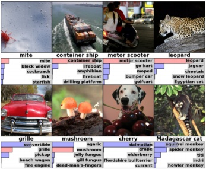

 $ (a) $

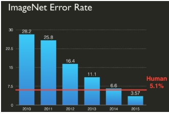

(b)

图 1.14: (a) ImageNet 数据集 [Rus+15] 中的样本图像。该子集包含 130 万张彩色训练图像，每张图像的大小为  $ 256 \times 256 $ 像素。共有 1000 个可能的标签，每张图像对应一个标签，任务是**最小化 top-5 错误率**，即确保正确标签位于前 5 个最可能的预测中。每张图像下方展示了真实标签，以及前 5 个预测标签的分布。如果真实标签位于前 5 名，其概率柱以红色显示。预测由一种名为“AlexNet”的卷积神经网络（CNN）生成（章节 14.3.2）。摘自 [KSH12] 的图 4。经 Alex Krizhevsky 许可使用。(b) 随时间变化的 ImageNet 竞赛 top-5 错误率。经 Andrej Karpathy 许可使用。

这类数据集称为 ImageNet [Rus+15]。这是一个包含约 1400 万张  $ 256 \times 256 \times 3 $ 大小图像的数据集，展示了来自 20,000 个类别的各种物体；图 1.14a 展示了一些示例。

ImageNet 数据集被用作 ImageNet 大规模视觉识别挑战赛（ILSVRC）的基础，该赛事于 2010 年至 2018 年举办。比赛使用了来自 1000 个类别的 130 万张图像子集。在比赛过程中，社区取得了显著进展，如图 1.14b 所示。特别是，2015 年标志着 CNN 首次在 ImageNet 图像分类任务上超越人类（或至少超越一位人类——即 Andrej Karpathy）。需要注意的是，这并不意味着 CNN 在视觉方面比人类更优秀（例如，[YL21] 中列出了一些常见的失败模式）。相反，这可能更多地反映了该数据集包含许多细粒度分类区分——例如区分“老虎”和“虎斑猫”——而这些区分对人类而言难以理解；相比之下，足够灵活的 CNN 可以学习任意模式，包括随机标签 [Zha+17a]。

尽管 ImageNet 作为分类基准比 MNIST 和 CIFAR 困难得多，但它也几乎“饱和”了 [Bey+20]。然而，方法在 ImageNet 上的相对性能往往是预测其在其他无关图像分类任务上性能的惊人良好指标（例如，参见 [Rec+19]），因此它仍然被广泛使用。

#### 1.5.2 一些常见的文本数据集

机器学习常被应用于文本以解决各种任务。这被称为自然语言处理或 NLP（详见 [JM20]）。下面我们简要介绍几个文本数据集。

作者：Kevin P. Murphy。 (C) 麻省理工学院出版社。CC-BY-NC-ND 许可。

---

1. 这部电影的选角、取景、情节、导演都堪称绝妙，每个演员都完美契合自己的角色，罗伯特 <UNK> 是一位令人惊叹的演员……

2. 大发型、大胸、糟糕的音乐和一枚巨大的安全别针——这些词最能形容这部糟糕的电影。我喜爱俗气的恐怖片，看过数百部……

表 1.3：我们展示了 IMDB 电影评论数据集中前两个句子的片段。第一个示例标注为正面，第二个为负面。（<UNK> 指代未知标记。）

本书将使用的数据集。

##### 1.5.2.1 文本分类

一个简单的 NLP 任务是文本分类，可用于电子邮件垃圾邮件分类、情感分析（例如电影或产品评论是正面还是负面）等。评估此类方法的一个常用数据集是来自 [Maa+11] 的 IMDB 电影评论数据集。（IMDB 代表“互联网电影数据库”。）该数据集包含 25k 个训练用标注样本和 25k 个测试用样本。每个样本都有一个二元标签，表示正面或负面评价。表 1.3 展示了一些示例句子。

##### 1.5.2.2 机器翻译

一个更困难的 NLP 任务是学习将一种语言的句子 x 映射到另一种语言中“语义等价”的句子 y；这被称为机器翻译。训练此类模型需要对齐的 (x, y) 对。幸运的是，存在多个这样的数据集，例如来自加拿大议会（英法语对）和欧盟（Europarl）的数据集。后者的一个子集，称为 WMT 数据集（机器翻译研讨会），由英语-德语对组成，并被广泛用作基准数据集。

##### 1.5.2.3 其他序列到序列任务

机器翻译的一个泛化是学习从一个序列 x 到任意另一个序列 y 的映射。这被称为序列到序列模型，可以看作是一种高维分类形式（详见第 15.2.3 节）。这种问题的框架非常通用，涵盖了许多任务，例如文档摘要、问答等。例如，表 1.4 展示了如何将问答问题表述为序列到序列问题：输入是文本 T 和问题 Q，输出是答案 A，它是由一组单词组成的，可能从输入中提取。

##### 1.5.2.4 语言建模

相当宏大的术语“语言建模”指的是创建文本序列的无条件生成模型的任务，即 p(x₁, …, x_T)。这只需要输入句子 x，而不需要任何对应的“标签” y。因此，我们可以将其视为一种无监督学习形式，我们在第 1.3 节中讨论。如果语言模型像序列到序列模型那样针对输入生成输出，我们可以将其视为条件生成模型。

---

T: 在气象学中，降水是大气水蒸气凝结后受重力作用落下的产物。主要降水形式包括毛毛雨、雨、冻雨、雪、霰和冰雹……降水形成于云层内较小水滴通过与其他雨滴或冰晶碰撞而合并的过程。在分散地点出现的短暂、高强度降雨被称为“阵雨”。

Q1: 导致降水下落的原因是什么？ A1: 重力

Q2: 除了毛毛雨、雨、雪、冻雨和冰雹之外，另一种主要降水形式是什么？ A2: 霰

Q3: 水滴在何处与冰晶碰撞形成降水？ A3: 云层内

表1.4: SQuAD数据集中示例段落的问题-答案对。每个答案都是段落中的一段文本。这可以通过句子对标记来解决。输入是段落文本T和问题Q，输出是对T中回答Q中问题的相关单词的标记。来自[Raj+16]的图1。经Percy Liang友好许可使用。

#### 1.5.3 预处理离散输入数据

许多机器学习模型假设数据由实值特征向量 $\boldsymbol{x} \in \mathbb{R}^D$ 组成。然而，有时输入可能包含离散输入特征，例如种族和性别等分类变量，或来自某个词汇表的词语。在以下小节中，我们讨论将这类数据预处理为向量形式的几种方法。这是许多不同类型模型中常用的操作。

##### 1.5.3.1 独热编码

当存在分类特征时，我们需要将其转换为数值尺度，以便计算输入的加权组合具有意义。预处理此类分类变量的标准方法是使用**独热编码**，也称为虚拟编码。如果一个变量 $x$ 有 $K$ 个取值，我们将其虚拟编码表示为：one-hot(x) = [I(x = 1), ..., I(x = K)]。例如，如果有三种颜色（比如红色、绿色和蓝色），则对应的独热向量为 one-hot(红色) = [1, 0, 0]，one-hot(绿色) = [0, 1, 0]，one-hot(蓝色) = [0, 0, 1]。

##### 1.5.3.2 特征交叉

对每个分类变量使用虚拟编码的线性模型可以捕捉每个变量的主效应，但无法捕捉它们之间的交互效应。例如，假设我们想根据两个分类输入变量（类型：SUV、卡车或家庭轿车；以及原产国：美国或日本）来预测车辆的燃油效率。如果我们将三值特征和二值特征的独热编码拼接起来，得到以下输入编码：

$$ \phi(\boldsymbol{x})=[1,\mathbb{I}\left(x_{1}=S\right),\mathbb{I}\left(x_{1}=T\right),\mathbb{I}\left(x_{1}=F\right),\mathbb{I}\left(x_{2}=U\right),\mathbb{I}\left(x_{2}=J\right)] \tag*{(1.34)} $$

其中 $x_{1}$ 是类型，$x_{2}$ 是原产国。

该模型无法捕捉特征之间的依赖关系。例如，我们预计卡车燃油效率较低，但来自美国的卡车可能比来自日本的卡车效率更低。这无法通过公式(1.34)中的线性模型来捕捉，因为原产国的贡献与汽车类型无关。

作者：Kevin P. Murphy. (C) MIT Press. CC-BY-NC-ND 许可证

---

我们可以通过计算显式的特征交叉来解决这个问题。例如，我们可以定义一个具有 $ 3 \times 2 $ 种可能取值的新复合特征，以捕捉类型与原产国之间的交互作用。新模型变为

$$  \begin{aligned}f(\boldsymbol{x};\boldsymbol{w})&=\boldsymbol{w}^{\top}\phi(\boldsymbol{x})\\&=w_{0}+w_{1}\mathbb{I}\left(x_{1}=S\right)+w_{2}\mathbb{I}\left(x_{1}=T\right)+w_{3}\mathbb{I}\left(x_{1}=F\right)\\&+w_{4}\mathbb{I}\left(x_{2}=U\right)+w_{5}\mathbb{I}\left(x_{2}=J\right)\\&+w_{6}\mathbb{I}\left(x_{1}=S,x_{2}=U\right)+w_{7}\mathbb{I}\left(x_{1}=T,x_{2}=U\right)+w_{8}\mathbb{I}\left(x_{1}=F,x_{2}=U\right)\\&+w_{9}\mathbb{I}\left(x_{1}=S,x_{2}=J\right)+w_{10}\mathbb{I}\left(x_{1}=T,x_{2}=J\right)+w_{11}\mathbb{I}\left(x_{1}=F,x_{2}=J\right)\\ \end{aligned}   \tag*{(1.35)}$$

可以看出，使用特征交叉将原始数据集转换为宽格式，增加了许多列。

#### 1.5.4 文本数据的预处理

在第1.5.2节中，我们简要讨论了文本分类及其他自然语言处理（NLP）任务。为了将文本数据输入分类器，我们需要处理多个问题。首先，文档长度可变，因此不适用于许多模型所假设的固定长度特征向量。其次，单词是类别型变量，具有大量可能取值（等于词汇表大小），因此相应的独热编码维度极高，且缺乏自然的相似性度量。第三，在测试时可能遇到训练中未出现过的单词（即所谓的词汇表外（OOV）单词）。下面我们讨论解决这些问题的一些方法。更多细节可参见例如 [BKL10; MRS08; JM20]。

##### 1.5.4.1 词袋模型

处理可变长度文本文档的一种简单方法是将它们解释为词袋（bag of words），即忽略单词顺序。为了将其转换为固定输入空间中的向量，我们首先将每个单词映射到某个词汇表中的标记（token）。

为了减少标记数量，我们通常使用各种预处理技术，例如：去除标点符号、将所有单词转换为小写；去除常见但无信息量的单词，如“and”和“the”（这称为停用词移除）；将单词替换为其基本形式，例如将“running”和“runs”替换为“run”（这称为词干提取）；等等。详情见例如 [BL12]，示例代码见 text preproc jax.ipynb。

设 $ x_{nt} $ 为第 $ n $ 个文档中位置 $ t $ 处的标记。如果词汇表中有 $ D $ 个不同的标记，那么我们可以将第 $ n $ 个文档表示为一个 $ D $ 维向量 $ \tilde{\mathbf{x}}_n $，其中 $ \tilde{x}_{nv} $ 是单词 $ v $ 在文档 $ n $ 中出现的次数：

 $$ \tilde{x}_{n v}=\sum_{t=1}^{T}\mathbb{I}\left(x_{n t}=v\right) $$ 

这里 $ T $ 是文档 $ n $ 的长度。这样，我们可以将文档解释为 $ \mathbb{R}^D $ 中的向量。这被称为文本的向量空间模型 [SWY75; TP10]。

传统上，我们将输入数据存储在一个 $ N \times D $ 的设计矩阵中，记为 $ \mathbf{X} $，其中 $ D $ 是特征数量。在向量空间模型的背景下，更常见的做法是将输入数据表示为

---

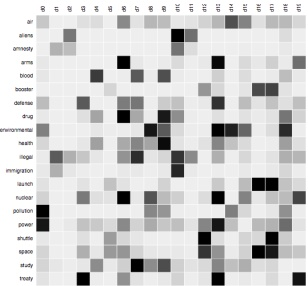

图 1.15：词项-文档矩阵示例，其中原始计数已被替换为 TF-IDF 值（参见第 1.5.4.2 节）。颜色越深的单元格值越大。经 Christoph Carl Kling 许可使用。

作为一个 $D \times N$ 的词频矩阵，其中 $TF_{ij}$ 是词项 i 在文档 j 中出现的频率。参见图 1.15 的示例。

##### 1.5.4.2 TF-IDF

将文档表示为词计数向量的一个问题是，高频词可能产生不当影响，仅仅因为它们的词计数数值更高，即使它们并不携带太多语义内容。对此的一个常见解决方案是对计数取对数，从而降低单个文档中多次出现的词的影响。

为了降低在整体（所有文档中）频繁出现的词的影响，我们计算一个称为逆文档频率的量，定义如下：$IDF_i \triangleq \log \frac{N}{1+DF_i}$，其中 $DF_i$ 是包含词项 i 的文档数量。我们可以结合这些变换，计算 TF-IDF 矩阵如下：

$$ \mathrm{TFIDF}_{ij}=\log(\mathrm{TF}_{ij}+1)\times\mathrm{IDF}_{i} \tag*{(1.38)}$$

（我们通常也会对每一行进行归一化。）这提供了更具意义的文档表示，并可用作许多机器学习算法的输入。参见 tfidf_demo.ipynb 的示例。

##### 1.5.4.3 词嵌入

尽管 TF-IDF 变换通过将更多权重赋予“信息性”词、更少权重赋予“非信息性”词，改进了原始计数向量，但它并未解决独热编码（计数向量由此派生）的根本问题：语义相似的词（如“man”和“woman”）在向量空间中可能并不比语义不相似的词（如“man”和“banana”）更接近。因此，大多数预测模型隐含假设的“输入空间中接近的点应有相似输出”这一假设是无效的。

作者：Kevin P. Murphy。(C) MIT Press。CC-BY-NC-ND 许可证。

---

解决该问题的标准方法是使用**词嵌入**。具体而言，我们将每个稀疏的独热向量 \( \boldsymbol{x}_{nt} \in \{0,1\}^V \) 映射为低维稠密向量 \( \boldsymbol{e}_{nt} \in \mathbb{R}^K \)，即 \( \boldsymbol{e}_{nt} = \boldsymbol{E}\boldsymbol{x}_{nt} \)，其中 \( \boldsymbol{E} \in \mathbb{R}^{K \times V} \) 通过训练学习得到，使得语义相近的词在向量空间中彼此靠近。关于词嵌入的学习方法有多种，我们将在第20.5节讨论。

一旦得到嵌入矩阵，我们可以将变长文本文档表示为词嵌入的**词袋**（bag of words）。然后，通过对嵌入求和（或取平均）将其转换为固定长度的向量：

$$ \overline{\boldsymbol{e}}_{n}=\sum_{t=1}^{T}\boldsymbol{e}_{n t}=\mathbf{E}\tilde{\boldsymbol{x}}_{n} \tag*{(1.39)} $$

其中 \( \tilde{x}_{n} \) 是公式(1.37)中的词袋表示。随后我们可将该向量用于逻辑回归分类器（第1.2.1.5节已简要介绍）。整体模型形式为：

$$ p(y=c|\boldsymbol{x}_{n},\boldsymbol{\theta})=\mathrm{softmax}_{c}(\mathbf{W}\mathbf{E}\tilde{\boldsymbol{x}}_{n}) \tag*{(1.40)} $$

我们通常使用预训练的词嵌入矩阵 \( \mathbf{E} \)，此时模型关于 \( \mathbf{W} \) 是线性的，从而简化了参数估计（见第10章）。关于上下文词嵌入的讨论请参见第15.7节。

##### 1.5.4.4 处理新词

在测试阶段，模型可能会遇到从未见过的全新词汇，这称为**词汇外**（out of vocabulary, OOV）问题。由于词汇集是开放类别，新词必然会出现。例如，专有名词（人名、地名）的集合是无界的。

解决该问题的一个标准启发式方法是：将所有新词替换为特殊符号 `UNK`，意为“未知”。但这会丢失信息。例如，若遇到单词“athazagoraphobia”，我们可猜测其意为“对某事物的恐惧”，因为“phobia”是英语中（源自希腊语）表示“恐惧”的常见后缀。（实际上，athazagoraphobia 意为“害怕被遗忘或忽视”。）

我们可以从字符级别入手，但这要求模型学习如何将常见字母组合分组为单词。更好的方法是利用单词具有子结构这一事实，将**子词单元**（subword units）或**词块**（wordpieces）作为输入 [SHB16; Wu+16]；这些通常通过**字节对编码**（byte-pair encoding, BPE）方法创建 [Gag94]，该方法是数据压缩的一种形式，通过创建新符号来表示常见子串。

#### 1.5.5 处理缺失数据

有时我们会遇到数据缺失的情况，即输入 \( x \) 或输出 \( y \) 的部分内容未知。若训练时输出未知，则该样本为无标签样本；我们将在第19.3节讨论此类半监督学习场景。因此，我们重点关注输入特征在训练或测试时（或两者）可能缺失的情况。

为建模此情况，设 \( \mathbf{M} \) 为 \( N \times D \) 的二元变量矩阵，其中 \( M_{nd} = 1 \) 表示样本 \( n \) 中的特征 \( d \) 缺失，否则 \( M_{nd} = 0 \)。设 \( \mathbf{X}_v \) 为输入特征矩阵的可见部分。

---

对应于 $ M_{nd} = 0 $，而 $ \mathbf{X}_h $ 为缺失部分，对应于 $ M_{nd} = 1 $。设 $ \mathbf{Y} $ 为输出标签矩阵，假设其被完全观测。如果我们假设 $ p(\mathbf{M}|\mathbf{X}_v, \mathbf{X}_h, \mathbf{Y}) = p(\mathbf{M}) $，则称数据为**完全随机缺失（MCAR）**，因为缺失不依赖于隐藏或观测特征。如果假设 $ p(\mathbf{M}|\mathbf{X}_v, \mathbf{X}_h, \mathbf{Y}) = p(\mathbf{M}|\mathbf{X}_v, \mathbf{Y}) $，则称数据为**随机缺失（MAR）**，因为缺失不依赖于隐藏特征，但可能依赖于可见特征。如果这两个假设均不成立，则称数据为**非随机缺失（NMAR）**。

在MCAR和MAR情形下，我们可以忽略缺失机制，因为它不提供关于隐藏特征的任何信息。然而，在NMAR情形下，我们需要对缺失数据机制进行建模，因为信息的缺失可能蕴含信息。例如，某人在调查中未回答敏感问题（如“你是否感染了新冠病毒？”）这一事实可能对潜在取值具有信息量。关于缺失数据模型的更多信息，可参见例如[LR87; Mar08]。

本书中，我们将始终采用MAR假设。但即使有此假设，当输入特征存在缺失时，我们仍无法直接使用判别模型（如DNN），因为输入 $\mathbf{x}$ 将包含未知值。

一种常用启发式方法称为**均值插补**，即用经验均值替换缺失值。更一般地，我们可以对输入拟合一个生成模型，并利用该模型填充缺失值。我们将在第20章简要讨论一些适用于此任务的生成模型，并在本书续集[Mur23]中更详细地探讨。

### 1.6 讨论

在本节中，我们将机器学习及本书置于更大的背景中。

#### 1.6.1 机器学习与其他领域的关系

多个子研究团体从事与机器学习相关的主题，它们具有不同的名称。预测分析领域类似于监督学习（尤其是分类和回归），但更侧重于商业应用。数据挖掘涵盖监督和非监督机器学习，但更侧重于结构化数据，通常存储在大型商业数据库中。数据科学采用机器学习和统计学技术，同时也强调其他主题，如数据整合、数据可视化以及与领域专家的协作，通常以迭代反馈循环的形式进行（例如参见[BS17]）。这些领域之间的差异往往仅在于术语。$ ^{12} $

机器学习也与统计学领域密切相关。事实上，斯坦福大学著名统计学教授杰里·弗里德曼（Jerry Friedman）曾指出$ ^{13} $：

[如果统计学领域]从一开始就将计算方法作为基本工具纳入，而不仅仅是应用现有工具的便捷途径，那么许多其他与数据相关的领域[如机器学习]本无需存在——它们本应成为统计学的一部分。——杰里·弗里德曼 [Fri97b]

---

机器学习也与人工智能（AI）密切相关。历史上，人工智能领域曾假设我们可以通过手工编程实现“智能”（例如，参见[RN10; PM17]），但这种方法在很大程度上未能达到预期，主要原因在于明确编码这些系统所需的所有知识被证明过于困难。因此，人们重新燃起了利用机器学习帮助AI系统获取自身知识的兴趣。（事实上，两者的联系如此紧密，以至于有时“ML”和“AI”这两个术语会被混用，尽管这可能会产生误导[Pre21]。）

#### 1.6.2 本书结构

我们已经看到，机器学习与数学、统计学、计算机科学等多个学科紧密相关。初学者可能会感到无从下手。

在本书中，我们选择了一条贯穿这些相互关联领域的具体路径，以概率论作为统贯的视角。第一部分介绍统计基础，第二部分至第四部分介绍监督学习，第五部分介绍无监督学习。有关这些（及其他）主题的更多信息，请参阅本书的续篇[Mur23]。

除了本书，您可能还会发现随书附带的在线Python笔记本很有帮助。详情请见probml.github.io/book1。

#### 1.6.3 注意事项

在本书中，我们将看到如何利用机器学习创建能够（尝试）根据输入预测输出的系统。这些预测随后可用于选择行动，以最小化预期损失。在设计此类系统时，很难设计一个准确指定我们所有偏好的损失函数；这可能导致**奖励黑客行为**，即机器优化我们赋予它的奖励函数，但我们随后意识到该函数并未捕捉我们忘记指定的各种约束或偏好[Wei76; Amo+16; D'A+20]。（当需要在多个目标之间进行权衡时，这一点尤其重要。）

奖励黑客行为是一个更大问题——**对齐问题** [Chr20]——的实例，该问题指的是我们要求算法优化的目标与我们实际期望它们为我们做的事情之间的潜在偏差；这引发了AI伦理和AI安全方面的各种担忧（例如，参见[KR19; Lia20; Spe+22]）。Russell [Rus19] 提出通过不显式指定奖励函数，而是迫使机器通过观察人类行为来推断奖励来解决这个问题，这种方法被称为逆强化学习（IRL）。当然，过于紧密地模仿当前或过去的人类行为可能并不理想，并且可能受到用于训练的数据的偏见影响（例如，参见[Pau+20]）。

上述AI观点认为，“智能”系统在没有人类参与的情况下自主做出决策，许多人相信这是通往“通用人工智能”或AGI的道路。另一种方法是将AI视为**增强智能**（有时称为智能增强或IA）。在这种范式中，AI是创建“智能工具”的过程，例如自适应巡航控制或搜索引擎中的自动补全；这类工具将人类保留在决策回路中。在这种框架下，包含AI/ML组件的系统与其他复杂的、半自主的人类造物（例如具有自动驾驶仪的飞机、在线交易平台或医疗诊断系统）并无本质区别（参见[Jor19; Ace]）。当然，随着AI工具变得越来越强大，它们可能会自行完成越来越多的工作，使得这种方法与AGI趋同。然而，在增强智能中，目标并非模仿或超越人类。

---

行为在于完成特定任务，而是为了更轻松地帮助人类完成工作；这也是我们对待大多数其他技术的方式 [Kap16]。

[Rus19] 提出的逆强化学习（IRL）方法是对此进行形式化的一种途径。具体而言，人类和机器都被视为一种名为“协助博弈”的双人合作博弈中的智能体，其中机器的目标是最大化用户的效用（奖励）函数，该函数基于人类行为进行推断。这样，如果机器不确定某个想法是否合适，它会谨慎行事（例如，通过询问用户的偏好），而不是盲目地解决错误的问题。（关于强化学习及相关主题的更多细节，参见 [Mur23]。）

---

请提供您需要翻译的英文学术 Markdown 文本。

---

第一部分

基础

---

请提供需要翻译的英文学术论文 Markdown 文本。

---

# 2 概率论：单变量模型

### 2.1 引言

本章简要介绍概率论的基础知识。有许多优秀著作对此进行了更详细的讨论，例如 [GS97; BT08; Cha21]。

#### 2.1.1 什么是概率？

概率论无非是把常识转化为计算。——皮埃尔·拉普拉斯，1812年

我们都习惯说，一枚（公平的）硬币正面朝上的概率是50%。但这意味着什么呢？实际上，概率有两种不同的解释。一种称为频率派解释。在这种观点下，概率表示可以多次发生的事件在长期运行中的频率。例如，上述陈述意味着，如果我们多次抛硬币，我们预期大约一半的次数会正面朝上。$^{1}$

另一种解释称为贝叶斯概率解释。在这种观点下，概率用于量化我们对某事物的不确定性或无知；因此它本质上是与信息相关的，而不是与重复试验相关 [Jay03; Lin06]。在贝叶斯观点下，上述陈述意味着我们相信下一次抛硬币时，正面和反面出现的机会相等。

贝叶斯解释的一大优点是，它可以用于建模我们对一次性事件（没有长期频率）的不确定性。例如，我们可能想要计算北极冰盖在公元2030年前融化的概率。这个事件会发生零次或一次，但不能重复发生。尽管如此，我们应该能够量化我们对这一事件的不确定性；基于我们认为该事件的可能性有多大，我们可以决定如何采取最优行动，如第5章所述。因此，本书将采用贝叶斯解释。幸运的是，无论采用哪种解释，概率论的基本规则都是相同的。

#### 2.1.2 不确定性的类型

我们预测中的不确定性可能源于两种根本不同的原因。第一种是由于我们对生成数据的潜在隐藏原因或机制的无知。这就是

---

这被称为**认知不确定性**，因为认识论（epistemology）是用于描述知识研究的哲学术语。不过，更简单的说法是模型不确定性。第二种不确定性源于固有的变异性，即使收集更多数据也无法减少。这有时被称为**偶然不确定性**[Hac75; KD09]，源自拉丁语“骰子”一词，但更简单的说法是数据不确定性。举个具体例子，考虑抛一枚均匀硬币。我们可能确切知道正面朝上的概率为 p = 0.5，因此不存在认知不确定性，但我们仍然无法完美预测结果。

这种区分对于主动学习等应用可能很重要。一种典型策略是查询那些 $ \mathbb{H}(p(y|\boldsymbol{x},\mathcal{D})) $ 较大的样本（其中 $ \mathbb{H}(p) $ 是熵，在第6.1节讨论）。然而，这可能是由于参数的不确定性，即较大的 $ \mathbb{H}(p(\boldsymbol{\theta}|\mathcal{D})) $，或者仅仅是由于结果的固有变异性，对应于 $ p(y|\boldsymbol{x},\boldsymbol{\theta}) $ 的熵较大。在后一种情况下，后续再采集更多样本意义不大，因为我们的不确定性不会减少。关于这一点，参见[Osb16]中的进一步讨论。

#### 2.1.3 概率作为逻辑的推广

在本节中，我们回顾概率的基本规则，遵循[Jay03]的阐述方式，将概率视为布尔逻辑的推广。

##### 2.1.3.1 事件的概率

我们将事件定义为二元变量 $ A $，表示世界的某种状态，该状态要么成立，要么不成立。例如，$ A $ 可以是事件“明天下雨”、“昨天下雨”、“标签 $ y = 1 $"、或“参数 $ \theta $ 介于1.5和2.0之间”等。表达式 $ \Pr(A) $ 表示你相信事件 $ A $ 为真的概率（或长期内 $ A $ 发生的频率）。我们要求 $ 0 \leq \Pr(A) \leq 1 $，其中 $ \Pr(A) = 0 $ 表示事件绝对不会发生，$ \Pr(A) = 1 $ 表示事件绝对会发生。我们用 $ \Pr(\overline{A}) $ 表示事件 $ A $ 不发生的概率；其定义为 $ \Pr(\overline{A}) = 1 - \Pr(A) $。

##### 2.1.3.2 两个事件同时发生的概率

我们用以下方式表示事件 A 和 B 同时发生的联合概率：

$$  \Pr(A\land B)=\Pr(A,B)   \tag*{(2.1)}$$

如果 A 和 B 是独立事件，则有

 $$ \Pr(A,B)=\Pr(A)\Pr(B) $$ 

例如，假设 $X$ 和 $Y$ 均匀随机地从集合 $\mathcal{X} = \{1, 2, 3, 4\}$ 中选取。令 A 为事件 $X \in \{1, 2\}$，B 为事件 $Y \in \{3\}$。那么我们有 $\Pr(A, B) = \Pr(A) \Pr(B) = \frac{1}{2} \cdot \frac{1}{4}$。

##### 2.1.3.3 两个事件至少有一个发生的概率

事件 A 或 B 发生的概率由下式给出：

$$  \Pr(A\lor B)=\Pr(A)+\Pr(B)-\Pr(A\land B)   \tag*{(2.3)}$$

“概率机器学习：导论”。在线版本。2024年11月23日

---

### 2.2. 随机变量

如果事件是互斥的（即它们不能同时发生），则得到

$$  \Pr(A\lor B)=\Pr(A)+\Pr(B)   \tag*{(2.4)}$$

例如，假设 $X$ 从集合 $\mathcal{X} = \{1, 2, 3, 4\}$ 中均匀随机选取。令 $A$ 为事件 $X \in \{1, 2\}$，$B$ 为事件 $X \in \{3\}$。那么有 $\Pr(A \vee B) = \frac{2}{4} + \frac{1}{4}$。

##### 2.1.3.4 一个事件在另一个事件发生下的条件概率

我们将事件 B 在 A 已发生条件下发生的条件概率定义如下：

$$  \Pr(B|A)\triangleq\frac{\Pr(A,B)}{\Pr(A)}   \tag*{(2.5)}$$

如果 $\Pr(A)=0$，则该定义不成立，因为我们不能对不可能事件进行条件化。

##### 2.1.3.5 事件的独立性

若事件 A 与事件 B 满足

$$  \Pr(A,B)=\Pr(A)\Pr(B)   \tag*{(2.6)}$$

则称事件 A 与事件 B 独立。

##### 2.1.3.6 事件的条件独立性

若事件 A 与事件 B 在给定事件 C 的条件下满足

$$  \Pr(A,B|C)=\Pr(A|C)\Pr(B|C)   \tag*{(2.7)}$$

则称事件 A 与事件 B 在事件 C 条件下条件独立，记为 $A \perp B|C$。事件之间往往是相互依赖的，但如果对相关中间变量进行条件化，则可能变得独立，我们将在本章后面更详细地讨论这一点。

### 2.2 随机变量

假设 X 代表某个未知的量，例如掷骰子时骰子的点数，或者当前屋外的温度。如果 X 的值未知和/或可能变化，我们称其为**随机变量**或 rv。所有可能取值的集合记为 $\mathcal{X}$，称为**样本空间**或**状态空间**。一个**事件**是给定样本空间中的一组结果。例如，如果 X 表示掷骰子的点数，即 $\mathcal{X} = \{1, 2, \ldots, 6\}$，那么事件“看到 1”记为 $X=1$，事件“看到奇数”记为 $X \in \{1, 3, 5\}$，事件“看到 1 到 3 之间的数”记为 $1 \leq X \leq 3$，等等。

#### 2.2.1 离散随机变量

如果样本空间 $\mathcal{X}$ 是有限或可数无限的，则 $X$ 称为**离散随机变量**。在这种情况下，我们将 $X$ 取值为 $x$ 的事件的概率记为 $\Pr(X = x)$。定义

作者：Kevin P. Murphy。(C) MIT Press。CC-BY-NC-ND 许可。

---

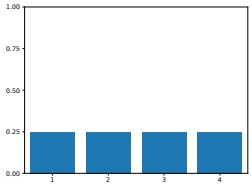

 $ (a) $

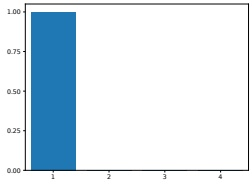

(b)

图 2.1：状态空间 $\mathcal{X} = \{1, 2, 3, 4\}$ 上的几个离散分布。(a) 均匀分布，$p(x = k) = 1/4$。(b) 退化分布（Delta 函数），将全部质量集中在 x = 1 上。由 discrete_prob_dist_plot.ipynb 生成。

概率质量函数（probability mass function, pmf）是一个函数，用于计算将随机变量设为每个可能值时所对应事件的概率：

$$  p(x)\triangleq\Pr(X=x)   \tag*{(2.8)}$$

pmf 满足性质 $0 \leq p(x) \leq 1$ 和 $\sum_{x \in \mathcal{X}} p(x) = 1$。

如果 $X$ 只有有限个取值，比如 $K$ 个，那么 pmf 可以表示为一个包含 $K$ 个数的列表，我们可以将其绘制成直方图。例如，图 2.1 展示了定义在 $\mathcal{X} = \{1, 2, 3, 4\}$ 上的两个 pmf。左边是均匀分布 $p(x) = 1/4$，右边是退化分布 $p(x) = \mathbb{I}(x = 1)$，其中 $\mathbb{I}()$ 是二值指示函数。因此，图 2.1(b) 中的分布表示 $X$ 始终等于取值 1。（由此可知，随机变量也可以是常数。）

#### 2.2.2 连续随机变量

如果 $X \in \mathbb{R}$ 是一个实值量，则称为连续随机变量。此时，我们无法再构造出它可能取值的有限（或可数）集合。然而，我们可以将实数轴划分为可数个区间。如果将事件与 $X$ 位于这些区间中的每一个相关联，就可以使用上述针对离散随机变量的方法。非正式地说，我们可以通过让区间大小趋近于零来表示 $X$ 取某个特定实数值的概率，如下所示。

##### 2.2.2.1 累积分布函数（cumulative distribution function, cdf）

定义事件 $A = (X \leq a)$、$B = (X \leq b)$ 和 $C = (a < X \leq b)$，其中 $a < b$。我们有 $B = A \lor C$，并且由于 $A$ 和 $C$ 互斥，加法规则给出

$$  \Pr(B)=\Pr(A)+\Pr(C)   \tag*{(2.9)}$$

因此，位于区间 $C$ 的概率为

$$  \Pr(C)=\Pr(B)-\Pr(A)   \tag*{(2.10)}$$

---

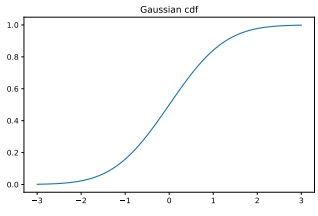

 $ (a) $

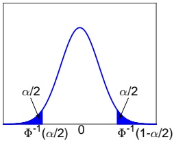

(b)

图2.2：(a) 标准正态分布 $\mathcal{N}(0,1)$ 的 cdf 图。由 gauss_plot.ipynb 生成。(b) 对应的 pdf。阴影区域各包含 $\alpha/2$ 的概率质量。因此非阴影区域包含 $1-\alpha$ 的概率质量。最左边的截止点为 $\Phi^{-1}(\alpha/2)$，其中 $\Phi$ 是高斯分布的 cdf。由对称性，最右边的截止点为 $\Phi^{-1}(1-\alpha/2)=-\Phi^{-1}(\alpha/2)$。由 quantile_plot.ipynb 生成。

通常，我们定义随机变量 X 的 **累积分布函数**（cdf）如下：

$$  P(x)\triangleq\Pr(X\leq x)   \tag*{(2.11)}$$

（注意我们使用大写 P 表示 cdf。）利用这一点，我们可以计算任意区间内的概率如下：

$$  \Pr(a<X\leq b)=P(b)-P(a)   \tag*{(2.12)}$$

cdf 是单调非递减函数。示例见图2.2a，其中展示了标准正态分布 $\mathcal{N}(x|0,1)$ 的 cdf；详见第2.6节。

##### 2.2.2.2 概率密度函数（pdf）

我们将 **概率密度函数**（pdf）定义为 cdf 的导数：

$$  p(x)\triangleq\frac{d}{dx}P(x)   \tag*{(2.13)}$$

（注意此导数并不总是存在，此时 pdf 未定义。）示例见图2.2b，其中展示了单变量高斯分布的 pdf（详见第2.6节）。

给定 pdf，我们可以按如下方式计算连续变量在有限区间内的概率：

$$  \Pr(a<X\leq b)=\int_{a}^{b}p(x)dx=P(b)-P(a)   \tag*{(2.14)}$$

随着区间变小，我们可以写成：

$$  \Pr(x<X\leq x+dx)\approx p(x)dx   \tag*{(2.15)}$$

直观上，这表示 X 落在 x 附近小区间内的概率等于 x 处的密度乘以区间宽度。

Author: Kevin P. Murphy. (C) MIT Press. CC-BY-NC-ND license

---

##### 2.2.2.3 分位数

如果累积分布函数（cdf）P是严格单调递增的，则它具有逆函数，称为逆累积分布函数、百分点函数（ppf）或分位函数。

如果$P$是X的cdf，则$P^{-1}(q)$是值$x_q$，使得$\Pr(X \leq x_q) = q$；这称为$P$的$q$分位数。值$P^{-1}(0.5)$是分布的中位数，一半的概率质量在左侧，一半在右侧。值$P^{-1}(0.25)$和$P^{-1}(0.75)$分别是下四分位数和上四分位数。

例如，令$\Phi$为高斯分布$\mathcal{N}(0,1)$的cdf，$\Phi^{-1}$为逆cdf。那么$\Phi^{-1}(\alpha/2)$左侧的点包含$\alpha/2$的概率质量，如Figure 2.2b所示。由对称性，$\Phi^{-1}(1-\alpha/2)$右侧的点也包含$\alpha/2$的质量。因此，中心区间$(\Phi^{-1}(\alpha/2), \Phi^{-1}(1-\alpha/2))$包含$1-\alpha$的质量。如果设$\alpha=0.05$，则中心95%的区间范围为

$$  (\Phi^{-1}(0.025),\Phi^{-1}(0.975))=(-1.96,1.96)   \tag*{(2.16)}$$

如果分布是$\mathcal{N}(\mu,\sigma^2)$，则95%区间变为$(\mu - 1.96\sigma,\mu + 1.96\sigma)$。这通常近似表示为$\mu \pm 2\sigma$。

#### 2.2.3 相关随机变量的集合

在本节中，我们讨论相关随机变量集合上的分布。

首先假设我们有两个随机变量X和Y。我们可以对X和Y所有可能的取值，使用$p(x, y) = p(X = x, Y = y)$来定义两个随机变量的联合分布。如果两个变量都有有限的基数，我们可以将联合分布表示为一个二维表格，表中所有条目之和为1。例如，考虑以下包含两个二值变量的例子：

<table border=1 style='margin: auto; word-wrap: break-word;'><tr><td style='text-align: center; word-wrap: break-word;'>$ p(X,Y) $</td><td style='text-align: center; word-wrap: break-word;'>Y = 0</td><td style='text-align: center; word-wrap: break-word;'>Y = 1</td></tr><tr><td style='text-align: center; word-wrap: break-word;'>X = 0</td><td style='text-align: center; word-wrap: break-word;'>0.2</td><td style='text-align: center; word-wrap: break-word;'>0.3</td></tr><tr><td style='text-align: center; word-wrap: break-word;'>X = 1</td><td style='text-align: center; word-wrap: break-word;'>0.3</td><td style='text-align: center; word-wrap: break-word;'>0.2</td></tr></table>

如果两个变量独立，我们可以将联合分布表示为两个边缘分布的乘积。如果两个变量都有有限的基数，我们可以将二维联合表格分解为两个一维向量的乘积，如Figure 2.3所示。

给定一个联合分布，我们如下定义随机变量的边缘分布：

$$  p(X=x)=\sum_{y}p(X=x,Y=y)   \tag*{(2.17)}$$

其中我们是对Y的所有可能状态进行求和。这有时称为求和规则或全概率规则。类似地定义$p(Y=y)$。例如，从上面的二维表格中，我们看到$p(X=0)=0.2+0.3=0.5$和$p(Y=0)=0.2+0.3=0.5$。（术语“边缘”来源于会计实务中将行和与列和写在表格的旁边或边缘。）

我们使用下式定义随机变量的条件分布：

$$  p(Y=y|X=x)=\frac{p(X=x,Y=y)}{p(X=x)}   \tag*{(2.18)}$$

我们可以重排此式得到

$$  p(x,y)=p(x)p(y|x)   \tag*{(2.19)}$$

---

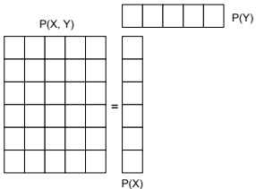

图 2.3：计算  $ p(x, y) = p(x)p(y) $，其中  $ X \perp Y $。这里 X 和 Y 是离散随机变量；X 有 6 种可能状态（取值），Y 有 5 种可能状态。两个这样的变量的一般联合分布需要  $ (6 \times 5) - 1 = 29 $ 个参数来定义（减去 1 是因为和为 1 的约束）。通过假设（无条件）独立性，我们只需要  $ (6 - 1) + (5 - 1) = 9 $ 个参数来定义  $ p(x, y) $。

这被称为乘积法则。

将乘积法则扩展到 D 个变量，我们得到概率的链式法则：

$$  p(\boldsymbol{x}_{1:D})=p(x_{1})p(x_{2}|x_{1})p(x_{3}|x_{1},x_{2})p(x_{4}|x_{1},x_{2},x_{3})\cdots p(x_{D}|\boldsymbol{x}_{1:D-1})   \tag*{(2.20)}$$

这提供了一种从一组条件分布构建高维联合分布的方法。我们将在第 3.6 节中更详细地讨论这一点。

#### 2.2.4 独立性与条件独立性

如果我们可以将联合分布表示为两个边缘分布的乘积（见图 2.3），则称 X 和 Y 是**无条件独立**或**边缘独立**，记为  $ X \perp Y $，即

$$  X\perp Y\iff p(X,Y)=p(X)p(Y)   \tag*{(2.21)}$$

一般而言，如果对于所有子集  $ \{X_1, \ldots, X_m\} \subseteq \{X_1, \ldots, X_n\} $，联合分布都可以写为边缘分布的乘积，即

$$  p(X_{1},\cdots,X_{m})=\prod_{i=1}^{m}p(X_{i})   \tag*{(2.22)}$$

则称一组变量  $ X_1, \ldots, X_n $ 是（相互）独立的。例如，如果以下条件成立：$ p(X_1, X_2, X_3) = p(X_1)p(X_2)p(X_3), p(X_1, X_2) = p(X_1)p(X_2), p(X_1, X_2) = p(X_2)p(X_3), p(X_1, X_2) = p(X_1)p(X_3) $，则称  $ X_1, X_2, X_3 $ 相互独立。^{2}

不幸的是，无条件独立是罕见的，因为大多数变量可以影响大多数其他变量。然而，这种影响通常是通过其他变量中介的，而不是直接的。因此，如果条件联合分布可以写为条件边缘分布的乘积，则称 X 和 Y 在给定 Z 下是**条件独立**（conditional independence, CI）的：

$$  X\perp Y\mid Z\iff p(X,Y|Z)=p(X|Z)p(Y|Z)   \tag*{(2.23)}$$

---

We can write this assumption as a graph X - Z - Y, which captures the intuition that all the dependencies between X and Y are mediated via Z. By using larger graphs, we can define complex joint distributions; these are known as graphical models, and are discussed in Section 3.6.

#### 2.2.5 Moments of a distribution

In this section, we describe various summary statistics that can be derived from a probability distribution (either a pdf or pmf).

##### 2.2.5.1 Mean of a distribution

The most familiar property of a distribution is its mean, or expected value, often denoted by  $ \mu $. For continuous rv's, the mean is defined as follows:

$$  \mathbb{E}\left[X\right]\triangleq\int_{\mathcal{X}}x\;p(x)d x   \tag*{(2.24)}$$

If the integral is not finite, the mean is not defined; we will see some examples of this later. For discrete rv's, the mean is defined as follows:

$$  \mathbb{E}\left[X\right]\triangleq\sum_{x\in\mathcal{X}}x\;p(x)   \tag*{(2.25)}$$

However, this is only meaningful if the values of x are ordered in some way (e.g., if they represent integer counts).

Since the mean is a linear operator, we have

$$  \mathbb{E}\left[a X+b\right]=a\mathbb{E}\left[X\right]+b   \tag*{(2.26)}$$

This is called the linearity of expectation.

For a set of n random variables, one can show that the expectation of their sum is as follows:

$$  \mathbb{E}\left[\sum_{i=1}^{n}X_{i}\right]=\sum_{i=1}^{n}\mathbb{E}\left[X_{i}\right]   \tag*{(2.27)}$$

If they are independent, the expectation of their product is given by

$$  \mathbb{E}\left[\prod_{i=1}^{n}X_{i}\right]=\prod_{i=1}^{n}\mathbb{E}\left[X_{i}\right]   \tag*{(2.28)}$$

##### 2.2.5.2 Variance of a distribution

The variance is a measure of the “spread” of a distribution, often denoted by  $ \sigma^{2} $. This is defined as follows:

$$  \begin{aligned}\mathbb{V}\left[X\right]&\triangleq\mathbb{E}\left[\left(X-\mu\right)^{2}\right]=\int(x-\mu)^{2}p(x)dx\\&=\int x^{2}p(x)dx+\mu^{2}\int p(x)dx-2\mu\int x p(x)dx=\mathbb{E}\left[X^{2}\right]-\mu^{2}\end{aligned}   \tag*{(2.29)}$$

“Probabilistic Machine Learning: An Introduction”. Online version. November 23, 2024

---

### 2.2. 随机变量

由此我们得到有用的结果

$$  \mathbb{E}\left[X^{2}\right]=\sigma^{2}+\mu^{2}   \tag*{(2.31)}$$

标准差定义为

$$  \mathrm{std}\left[X\right]\triangleq\sqrt{\mathbb{V}\left[X\right]}=\sigma   \tag*{(2.32)}$$

这很有用，因为它与 X 本身具有相同的量纲。

经平移和缩放后的随机变量的方差由下式给出

$$  \mathbb{V}\left[a X+b\right]=a^{2}\mathbb{V}\left[X\right]   \tag*{(2.33)}$$

如果有一组 n 个独立随机变量，它们和的方差等于各自方差之和：

$$  \mathbb{V}\left[\sum_{i=1}^{n}X_{i}\right]=\sum_{i=1}^{n}\mathbb{V}\left[X_{i}\right]   \tag*{(2.34)}$$

它们乘积的方差也可推导如下：

$$  \mathbb{V}\left[\prod_{i=1}^{n}X_{i}\right]=\mathbb{E}\left[\left(\prod_{i}X_{i}\right)^{2}\right]-\left(\mathbb{E}\left[\prod_{i}X_{i}\right]\right)^{2}   \tag*{(2.35)}$$

$$  =\mathbb{E}\left[\prod_{i}X_{i}^{2}\right]-(\prod_{i}\mathbb{E}\left[X_{i}\right])^{2}   \tag*{(2.36)}$$

$$  =\prod_{i}\mathbb{E}\left[X_{i}^{2}\right]-\prod_{i}(\mathbb{E}\left[X_{i}\right])^{2}   \tag*{(2.37)}$$

$$  =\prod_{i}(\mathbb{V}\left[X_{i}\right]+(\mathbb{E}\left[X_{i}\right])^{2})-\prod_{i}(\mathbb{E}\left[X_{i}\right])^{2}   \tag*{(2.38)}$$

$$  =\prod_{i}(\sigma_{i}^{2}+\mu_{i}^{2})-\prod_{i}\mu_{i}^{2}   \tag*{(2.39)}$$

##### 2.2.5.3 分布的众数

分布的众数是具有最大概率质量或概率密度的值：

$$  \boldsymbol{x}^{*}=\underset{\boldsymbol{x}}{\operatorname{argmax}}p(\boldsymbol{x})   \tag*{(2.40)}$$

如果分布是多峰的，那么众数可能不唯一，如图 2.4 所示。此外，即使存在唯一的众数，该点也可能不是分布的良好概括。

##### 2.2.5.4 条件矩

当有两个或多个相关的随机变量时，我们可以计算给定另一个变量信息时的矩。例如，迭代期望定律（也称为全期望定律）告诉我们

$$  \mathbb{E}\left[X\right]=\mathbb{E}_{Y}\left[\mathbb{E}\left[X|Y\right]\right]   \tag*{(2.41)}$$

作者：Kevin P. Murphy. (C) MIT Press. CC-BY-NC-ND 许可协议

---

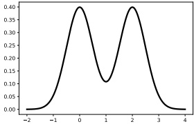

图 2.4: 两个一维高斯分布的混合示意图，$ p(x) = 0.5\mathcal{N}(x|0,0.5) + 0.5\mathcal{N}(x|2,0.5) $。由 bimodal_dist_plot.ipynb 生成。

为证明这一点，我们不妨假设 X 和 Y 均为离散随机变量。则有

$$  \begin{align*}\mathbb{E}_{Y}\left[\mathbb{E}\left[X|Y\right]\right]&=\mathbb{E}_{Y}\left[\sum_{x}x p(X=x|Y)\right]\\&=\sum_{y}\left[\sum_{x}x p(X=x|Y=y)\right]p(Y=y)=\sum_{x,y}x p(X=x,Y=y)=\mathbb{E}\left[X\right]\end{align*}   \tag*{(2.42)}$$

为了更直观地解释，考虑以下简单示例$^{3}$。设 X 为灯泡的使用寿命，Y 为生产该灯泡的工厂。假设 $\mathbb{E}[X|Y=1]=5000$ 且 $\mathbb{E}[X|Y=2]=4000$，表明工厂 1 生产的灯泡寿命更长。假设工厂 1 供应了 60% 的灯泡，即 $p(Y=1)=0.6$ 且 $p(Y=2)=0.4$。则随机灯泡的期望寿命为

$$  \mathbb{E}\left[X\right]=\mathbb{E}\left[X|Y=1\right]p(Y=1)+\mathbb{E}\left[X|Y=2\right]p(Y=2)=5000\times0.6+4000\times0.4=4600   \tag*{(2.44)}$$

方差也有类似的公式。具体地，全方差定律（也称为条件方差公式）告诉我们：

$$  \mathbb{V}\left[X\right]=\mathbb{E}_{Y}\left[\mathbb{V}\left[X|Y\right]\right]+\mathbb{V}_{Y}\left[\mathbb{E}\left[X|Y\right]\right]   \tag*{(2.45)}$$

为了理解这一点，我们定义条件矩 $\mu_{X|Y} = \mathbb{E}[X|Y]$，$s_{X|Y} = \mathbb{E}\left[X^{2}|Y\right]$ 以及 $\sigma_{X|Y}^{2} = \mathbb{V}[X|Y] = s_{X|Y} - \mu_{X|Y}^{2}$，这些量都是 Y 的函数（因此也是随机量）。于是我们有

$$  \mathbb{V}\left[X\right]=\mathbb{E}\left[X^{2}\right]-\left(\mathbb{E}\left[X\right]\right)^{2}=\mathbb{E}_{Y}\left[s_{X\mid Y}\right]-\left(\mathbb{E}_{Y}\left[\mu_{X\mid Y}\right]\right)^{2}   \tag*{(2.46)}$$

$$  =\mathbb{E}_{Y}\left[\sigma_{X|Y}^{2}\right]+\mathbb{E}_{Y}\left[\mu_{X|Y}^{2}\right]-\left(\mathbb{E}_{Y}\left[\mu_{X|Y}\right]\right)^{2}   \tag*{(2.47)}$$

$$  =\mathbb{E}_{Y}\left[\mathbb{V}\left[X|Y\right]\right]+\mathbb{V}_{Y}\left[\mu_{X|Y}\right]   \tag*{(2.48)}$$

为了直观理解这些公式，考虑 K 个单变量高斯分布的混合。设 Y 为隐藏指示变量，指定我们使用哪个混合成分，并设

---

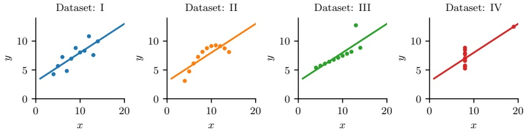

图2.5：安斯库姆四重奏示意图。所有这些数据集都具有相同的低阶汇总统计量。由 anscombes_quartet.ipynb 生成。

 $ X = \sum_{y=1}^{K} \pi_y \mathcal{N}(X | \mu_y, \sigma_y) $ 。在图2.4中，有 $ \pi_1 = \pi_2 = 0.5 $， $ \mu_1 = 0 $， $ \mu_2 = 2 $， $ \sigma_1 = \sigma_2 = 0.5 $ 。因此

$$  \mathbb{E}\left[\mathbb{V}\left[X|Y\right]\right]=\pi_{1}\sigma_{1}^{2}+\pi_{2}\sigma_{2}^{2}=0.25   \tag*{(2.49)}$$

$$  \mathbb{V}\left[\mathbb{E}\left[X|Y\right]\right]=\pi_{1}(\mu_{1}-\overline{\mu})^{2}+\pi_{2}(\mu_{2}-\overline{\mu})^{2}=0.5(0-1)^{2}+0.5(2-1)^{2}=0.5+0.5=1   \tag*{(2.50)}$$

于是我们得到了一个直观的结果：X 的方差主要取决于它来自哪个质心（即均值之间的差异），而不是每个质心周围的局部方差。

#### 2.2.6 汇总统计量的局限性  $ * $

尽管通常使用均值、方差等简单统计量来总结概率分布（或从分布中采样的点），但这可能会丢失大量信息。一个显著的例子是被称为 $ \text{Anscombe's quartet} $ [Ans73] 的数据集，如图2.5所示。该图展示了4个不同的 $(x,y)$ 配对数据集，它们都具有相同的均值、方差和相关系数 $\rho$（定义见第3.1.2节）：$\mathbb{E}[x]=9$，$\mathbb{V}[x]=11$，$\mathbb{E}[y]=7.50$，$\mathbb{V}[y]=4.12$，以及 $\rho=0.816$。然而，这些点被采样所来自的联合分布 $p(x,y)$ 显然非常不同。Anscombe 构造了这些数据集，每个包含10个数据点，旨在反驳统计学家中存在的“数值总结优于数据可视化”的印象 [Ans73]。

图2.6展示了这种现象的一个更引人注目的例子。该数据集形似一只恐龙 $^{5}$，此外还有另外11个数据集，它们都具有相同的低阶统计量。这组数据集称为 Datasaurus Dozen [MF17]。这些 $(x, y)$ 点的精确值可在网上获取 $^{6}$，它们是通过模拟退火算法（一种无导数优化方法，将在本书的续篇 [Mur23] 中讨论）计算得到的。（目标

---

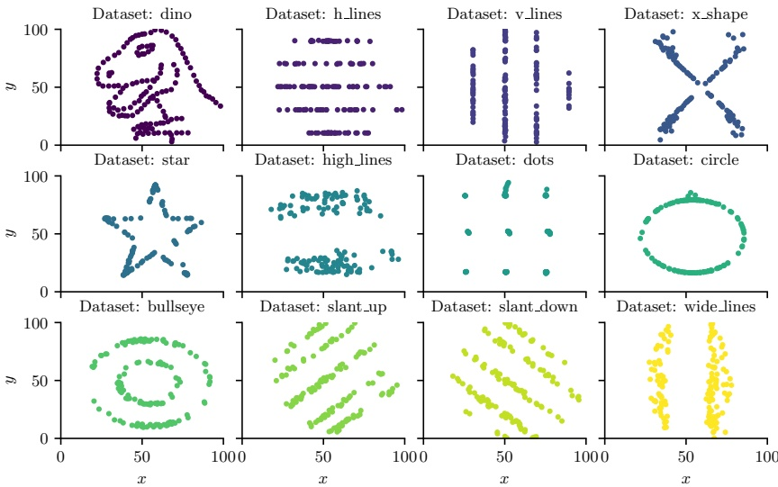

图 2.6：Datasaurus Dozen 数据集示意图。所有这些数据集都具有相同的低阶汇总统计量。改编自 [MF17] 的图 1。由 datasaurus_dozen.ipynb 生成。

被优化的函数衡量的是与原始恐龙目标汇总统计量的偏差，加上与特定目标形状之间的距离。)

同样的模拟退火方法也可应用于一维数据集，如图 2.7 所示。我们看到所有数据集都截然不同，但它们都具有相同的中位数和四分位距，如中间箱线图中阴影部分的中心所示。一种更好的可视化方法是右侧的提琴图。该图除了显示中位数和四分位距标记外，还显示了分布的一维核密度估计（第 16.3 节）（在垂直轴上展示了两个副本）。这种可视化能更好地区分分布之间的差异。然而，该方法仅限于一维数据。

### 2.3 贝叶斯规则

贝叶斯定理之于概率论，犹如毕达哥拉斯定理之于几何学。——哈罗德·杰弗里斯爵士，1973 [Jef73]。

本节中，我们讨论贝叶斯推断的基础。根据《韦氏词典》，“推断”一词指“从样本数据过渡到一般化的行为，通常带有计算出的确定性程度”。“贝叶斯”一词用于指代那些

---

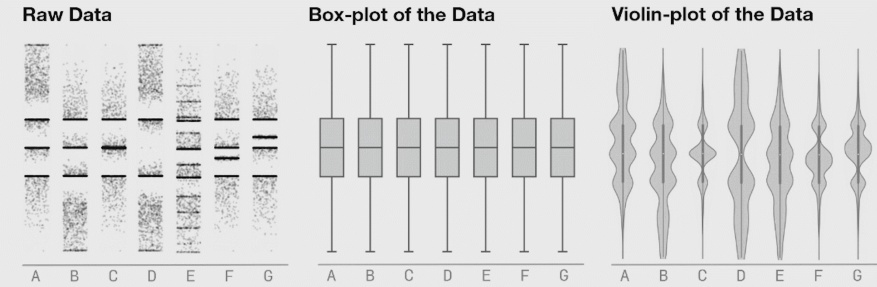

图 2.7：7 个不同数据集的示意图（左）、对应的箱线图（中）和小提琴图（右）。来自 https://www.autodesk.com/research/publications/same-stats-different-graphs 的图 8。经 Justin Matejka 友好许可使用。

使用概率论表示“确定程度”，并利用  $ \mathbf{Bayes}^{\prime} $ 规则 $ ^{7} $ 根据观测数据更新确定程度。

贝叶斯规则本身非常简单：它只是一个公式，用于在给定观测数据 Y = y 的情况下，计算未知（或隐藏）量 H 的可能取值上的概率分布：

$$  p(H=h|Y=y)=\frac{p(H=h)p(Y=y|H=h)}{p(Y=y)}   \tag*{(2.51)}$$

这直接由以下恒等式得出：

$$  p(h|y)p(y)=p(h)p(y|h)=p(h,y)   \tag*{(2.52)}$$

该恒等式本身源于概率的乘积规则。

在公式 (2.51) 中，项  $ p(H) $ 表示我们在看到任何数据之前对 H 可能取值的了解，这称为**先验分布**。（如果 H 有 K 个可能取值，则  $ p(H) $ 是一个包含 K 个概率的向量，其和为 1。）项  $ p(Y|H=h) $ 表示当 H=h 时我们期望看到的可能结果 Y 上的分布，这称为**观测分布**。当我们在实际观测值 y 对应的点上计算该分布时，得到函数  $ p(Y=y|H=h) $，称为**似然函数**。（注意，由于 y 固定，这是 h 的函数，但它不是概率分布，因为其和不为 1。）对于每个 h，将先验分布  $ p(H=h) $ 与似然函数  $ p(Y=y|H=h) $ 相乘，得到未归一化的联合分布  $ p(H=h,Y=y) $。通过除以  $ p(Y=y) $（称为**边际似然**，因为它通过对未知量 H 进行边际化计算得到），我们可以将其转化为归一化分布：

$$  p(Y=y)=\sum_{h^{\prime}\in\mathcal{H}}p(H=h^{\prime})p(Y=y|H=h^{\prime})=\sum_{h^{\prime}\in\mathcal{H}}p(H=h^{\prime},Y=y)   \tag*{(2.53)}$$

---

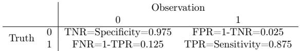

表 2.1：二元观测值 $Y$ 在两种可能的隐藏状态 $H$ 下的似然函数 $p(Y|H)$。每行之和为 1。缩写：TNR 为真阴性率，TPR 为真阳性率，FNR 为假阴性率，FPR 为假阳性率。

通过计算每个 $h$ 的 $p(H = h, Y = y)/p(Y = y)$ 对联合分布进行归一化，可得到后验分布 $p(H = h|Y = y)$，它代表我们对 $H$ 可能取值的新信念状态。

我们可以将贝叶斯规则总结为以下文字形式：

$$  \mathrm{p o s t e r i o r}\propto\mathrm{p r i o r}\times\mathrm{l i k e l i h o o d}   \tag*{(2.54)}$$

这里使用符号 $\propto$ 表示“正比于”，因为我们忽略了分母，该分母仅是一个与 $H$ 无关的常数。利用贝叶斯规则，根据相关的观测数据更新对某个感兴趣量的未知值的分布，称为贝叶斯推断或后验推断，也可简称为概率推断。

下面给出一些贝叶斯推断应用的简单示例。本书后续章节将展示更多有趣的实例。

#### 2.3.1 示例：新冠病毒检测

假设你怀疑自己感染了新冠病毒（COVID-19），这是一种由 SARS-CoV-2 病毒引起的传染病。你决定进行一项诊断测试，并希望利用其结果判断自己是否被感染。

令 $H = 1$ 表示感染事件，$H = 0$ 表示未感染事件。若检测结果为阳性，则 $Y = 1$；若为阴性，则 $Y = 0$。我们需要计算 $p(H = h|Y = y)$，其中 $h \in \{0,1\}$，$y$ 为观测到的检测结果。（为简洁起见，我们将 $[p(H = 0|Y = y), p(H = 1|Y = y)]$ 的分布简记为 $p(H|y)$。）这可以视为一种二元分类形式，其中 $H$ 是未知的类别标签，$y$ 是特征向量。

首先必须指定似然函数。该量显然取决于检测的可靠性。有两个关键参数：**灵敏度**（即真阳性率）定义为 $p(Y = 1|H = 1)$，即真实为阳性时检测呈阳性的概率。**假阴性率**定义为 1 减去灵敏度。**特异度**（即真阴性率）定义为 $p(Y = 0|H = 0)$，即真实为阴性时检测呈阴性的概率。**假阳性率**定义为 1 减去特异度。表 2.1 汇总了所有这些量。（更多细节见第 5.1.3.1 节。）根据 https://nyti.ms/3iMTZgV，我们将灵敏度设为 87.5%，特异度设为 97.5%。

接下来必须指定先验分布。$p(H = 1)$ 代表你所在地区的疾病**患病率**。我们将其设为 $p(H = 1) = 0.1$（即 10%），这是 2020 年春季纽约市的患病率。（此示例选择与 https://nyti.ms/31MTZgv 中的数字相匹配。）

---

现在假设你检测结果为阳性。我们有

$$  p(H=1|Y=1)=\frac{p(Y=1|H=1)p(H=1)}{p(Y=1|H=1)p(H=1)+p(Y=1|H=0)p(H=0)}   \tag*{(2.55)}$$

$$  \mathrm{TPR}\times\mathrm{prior}   \tag*{(2.56)}$$

 $$ \overline{\mathrm{TPR}\times\mathrm{prior}+\mathrm{FPR}\times(1-\mathrm{prior})} $$ 

$$  =\frac{0.875\times0.1}{0.875\times0.1+0.025\times0.9}=0.795   \tag*{(2.57)}$$

因此你有79.5%的概率被感染。

现在假设你检测结果为阴性。你被感染的概率由下式给出

 $$ p(Y=0|H=1)p(H=1) $$ 

$$  p(H=1|Y=0)=\frac{p(1=0|H=1)p(H=1)}{p(Y=0|H=1)p(H=1)+p(Y=0|H=0)p(H=0)}   \tag*{(2.58)}$$

 $$ \mathrm{FNR}\times\mathrm{prior} $$ 

$$  \overline{FNR\times prior+TNR\times(1-prior)}   \tag*{(2.59)}$$

$$  =\frac{0.125\times0.1}{0.125\times0.1+0.975\times0.9}=0.014   \tag*{(2.60)}$$

因此你只有1.4%的概率被感染。

如今COVID-19的流行率要低得多。假设我们使用1%的基础概率重复这些计算，则后验概率分别降至26%和0.13%。

即使检测结果为阳性，你感染COVID-19的概率也仅有26%，这非常反直觉。原因是，由于该疾病罕见，单次阳性结果更有可能是假阳性而非真实患病。为了理解这一点，假设我们有10万人口，其中1000人被感染。在感染者中，有 $875 = 0.875 \times 1000$ 人检测为阳性；在未感染者中，有 $2475 = 0.025 \times 99,000$ 人检测为阳性。因此阳性总数是 $3350 = 875 + 2475$，所以在检测阳性的条件下被感染的后验概率为 $875/3350 = 0.26$。

当然，上述计算假设我们知道检测的灵敏度和特异度。当这些参数存在不确定性时，可参阅文献[GC20]了解如何在诊断检测中应用贝叶斯规则。

#### 2.3.2 示例：蒙提霍尔问题

在本节中，我们考虑贝叶斯规则的一个更为“随意”的应用。具体而言，我们将其应用于著名的蒙提霍尔问题。

想象一个游戏节目，规则如下：有三扇门，分别标记为1、2、3。其中一个门后藏有奖品（例如一辆汽车）。你选择一扇门。然后游戏节目主持人会打开另外两扇门中的一扇（不是你选的那扇），并且保证不暴露奖品的位置。此时，你将获得一次重新选择门的机会：你可以坚持最初的选择，也可以换到另一扇未开的门。随后所有门将被打开，你将获得最终选择门后的奖品。

例如，假设你选择了1号门，游戏节目主持人打开了3号门，如约定那样门后空无一物。你应该（a）坚持选1号门，（b）换到2号门，还是（c）两者没有区别？

作者：Kevin P. Murphy. (C) MIT Press. CC-BY-NC-ND license

---

<table border=1 style='margin: auto; word-wrap: break-word;'><tr><td style='text-align: center; word-wrap: break-word;'>门 1</td><td style='text-align: center; word-wrap: break-word;'>门 2</td><td style='text-align: center; word-wrap: break-word;'>门 3</td><td style='text-align: center; word-wrap: break-word;'>换门</td><td style='text-align: center; word-wrap: break-word;'>坚持</td></tr><tr><td style='text-align: center; word-wrap: break-word;'>汽车</td><td style='text-align: center; word-wrap: break-word;'>-</td><td style='text-align: center; word-wrap: break-word;'>-</td><td style='text-align: center; word-wrap: break-word;'>输</td><td style='text-align: center; word-wrap: break-word;'>赢</td></tr><tr><td style='text-align: center; word-wrap: break-word;'>-</td><td style='text-align: center; word-wrap: break-word;'>汽车</td><td style='text-align: center; word-wrap: break-word;'>-</td><td style='text-align: center; word-wrap: break-word;'>赢</td><td style='text-align: center; word-wrap: break-word;'>输</td></tr><tr><td style='text-align: center; word-wrap: break-word;'>-</td><td style='text-align: center; word-wrap: break-word;'>-</td><td style='text-align: center; word-wrap: break-word;'>汽车</td><td style='text-align: center; word-wrap: break-word;'>赢</td><td style='text-align: center; word-wrap: break-word;'>输</td></tr></table>

表 2.2: 蒙提霍尔游戏的 3 种可能状态，表明换门比坚持最初选择平均胜率高出两倍。改编自 [PM18] 的表 6.1。

直觉上，这似乎没什么区别，因为你最初选择哪扇门并不会影响奖品的位置。然而，主持人打开了 3 号门这一事实告诉我们一些关于奖品位置的信息，因为他的选择是基于对真实位置和你的选择的了解而做出的。如下文所示，如果你换到 2 号门，获胜概率实际上会翻倍。

为了证明这一点，我们将使用贝叶斯定理。令 $ H_i $ 表示奖品在 i 号门后面的假设。我们做出以下假设：三个假设 $ H_1 $、$ H_2 $ 和 $ H_3 $ 先验等可能，即

$$  P(H_{1})=P(H_{2})=P(H_{3})=\frac{1}{3}.   \tag*{(2.61)}$$

在选择了 1 号门之后，我们接收到的数据要么是 Y = 3，要么是 Y = 2（分别表示打开了 3 号门或 2 号门）。我们假设这两个可能结果具有如下概率。如果奖品在 1 号门后面，那么主持人会随机选择 Y = 2 或 Y = 3。否则，主持人的选择是强制性的，概率为 0 或 1。

$$  \left|\begin{array}{l}P(Y=2|H_{1})=\frac{1}{2}\\ P(Y=3|H_{1})=\frac{1}{2}\end{array}\right|\left|\begin{array}{l}P(Y=2|H_{2})=0\\ P(Y=3|H_{2})=1\end{array}\right|\left|\begin{array}{l}P(Y=2|H_{3})=1\\ P(Y=3|H_{3})=0\end{array}\right|   \tag*{(2.62)}$$

现在，使用贝叶斯定理，我们计算假设的后验概率：

$$  P(H_{i}|Y=3)=\frac{P(Y=3|H_{i})P(H_{i})}{P(Y=3)}   \tag*{(2.63)}$$

$$  \left|\begin{array}{c}P(H_{1}|Y=3)=\frac{(1/2)(1/3)}{P(Y=3)}\ \left|\begin{array}{c}P(H_{2}|Y=3)=\frac{(1)(1/3)}{P(Y=3)}\ \left|\begin{array}{c}P(H_{3}|Y=3)=\frac{(0)(1/3)}{P(Y=3)}\ \end{array}\right.\end{array}\right.\end{array}\right.   \tag*{(2.64)}$$

分母 $ P(Y = 3) $ 为 $ P(Y = 3) = \frac{1}{6} + \frac{1}{3} = \frac{1}{2} $。因此

$$  \begin{array}{r c c c c c|c c c c c}{P(H_{1}|Y=3)}&{=}&{\displaystyle\frac{1}{3}}&{\Bigm|P(H_{2}|Y=3)}&{=}&{\displaystyle\frac{2}{3}}&{\Bigm|P(H_{3}|Y=3)}&{=}&{0.}\\ \end{array}   \tag*{(2.65)}$$

因此，参赛者应换到 2 号门，以获得最大获奖概率。具体示例见表 2.2。

许多人觉得这个结果令人惊讶。使结果更直观的一种方法是进行一个思想实验：将游戏推广到一百万个门。规则如下：参赛者先选择一扇门，然后主持人打开 999,998 扇门，且确保这些门后没有奖品，只剩下参赛者选择的门和另一扇门关闭。此时参赛者可以选择坚持或换门。想象一下，参赛者面对一百万个门，其中只有 1 号门和 234,598 号门未打开，而 1 号门是参赛者的最初选择。你认为奖品在哪里？

---

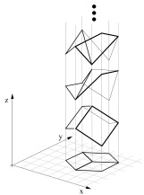

图 2.8：任何平面线条画在几何上与无穷多种三维结构一致。来自 [SA93] 的图 11。经 Pawan Sinha 许可使用。

#### 2.3.3 逆问题  $ * $

概率论关注的是，在给定关于世界状态 h 的知识（或假设）下，预测结果 y 上的分布。相反，逆概率关注的是根据结果观测推断世界状态。我们可以将其视为对  $ h \rightarrow y $ 映射的求逆。

例如，考虑从二维图像 y 推断三维形状 h，这是一个视觉场景理解中的经典问题。不幸的是，这是一个本质上的不适定问题，如图 2.8 所示，因为存在多个可能的隐藏 h 与同一观测 y 一致（例如，参见 [Piz01]）。类似地，我们可以将自然语言理解视为一个不适定问题，其中听者必须从说话者（通常含歧义的）词语中推断意图 h（例如，参见 [Sab21]）。

为了解决此类逆问题，我们可以使用贝叶斯规则计算后验  $ p(h|y) $，这给出了世界可能状态上的分布。这需要指定正向模型  $ p(y|h) $ 以及先验  $ p(h) $，后者可用于排除（或降低权重）不合理的世界状态。我们在本书的后续部分 [Mur23] 中更详细地讨论这一主题。

### 2.4 伯努利分布和二项分布

最简单的概率分布或许是伯努利分布，它可用于对二元事件建模，如下所述。

#### 2.4.1 定义

考虑抛硬币，其正面朝上的事件概率由  $ 0 \leq \theta \leq 1 $ 给出。令 Y = 1 表示该事件，Y = 0 表示硬币反面朝上的事件。因此我们假设  $ p(Y = 1) = \theta $ 且  $ p(Y = 0) = 1 - \theta $。这称为伯努利分布，可写作如下形式

$$  Y\sim\mathrm{B e r}(\theta)   \tag*{(2.66)}$$

作者：Kevin P. Murphy。(C) MIT Press。CC-BY-NC-ND 许可。

---

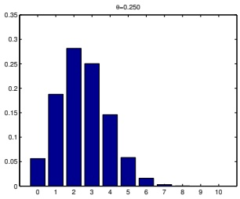

 $ (a) $

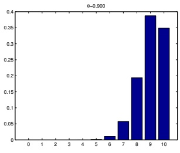

(b)

图 2.9：N = 10 且 (a) $ \theta = 0.25 $ 和 (b) $ \theta = 0.9 $ 的二项分布示意图。由 binom_dist_plot.ipynb 生成。

其中符号 $ \sim $ 表示“从……采样”或“服从……分布”，Ber 指伯努利分布。该分布的概率质量函数 (pmf) 定义如下：

$$  \mathrm{Ber}(y|\theta)=\begin{cases}1-\theta&if y=0\\\theta&if y=1\end{cases}   \tag*{(2.67)}$$

（关于 pmf 的详细信息，请参见第 2.2.1 节。）我们可以用更简洁的形式将其写为：

$$  \mathrm{B e r}(y|\theta)\triangleq\theta^{y}(1-\theta)^{1-y}   \tag*{(2.68)}$$

伯努利分布是二项分布的一种特殊情况。为解释这一点，假设我们观察到一组 $N$ 次伯努利试验，记为 $y_n \sim \mathrm{Ber}(\cdot|\theta)$，其中 $n = 1 : N$。具体而言，想象抛一枚硬币 $N$ 次。定义 $s$ 为正面朝上的总次数，$s \triangleq \sum_{n=1}^{N} \mathbb{I}(y_n = 1)$。则 $s$ 的分布由二项分布给出：

$$  \mathrm{Bin}(s|N,\theta)\triangleq\binom{N}{s}\theta^{s}(1-\theta)^{N-s}   \tag*{(2.69)}$$

其中

$$  \binom{N}{k}\triangleq\frac{N!}{(N-k)!k!}   \tag*{(2.70)}$$

是从 N 个物品中选出 k 个物品的方式数量（这被称为二项式系数，读作“N 选 k”）。二项分布的一些示例见图 2.9。如果 N = 1，二项分布退化为伯努利分布。

#### 2.4.2 Sigmoid（逻辑）函数

当我们希望在给定输入 $ \boldsymbol{x} \in \mathcal{X} $ 的情况下预测二值变量 $ y \in \{0,1\} $ 时，需要使用以下形式的条件概率分布

$$  p(y|\boldsymbol{x},\boldsymbol{\theta})=\mathrm{Ber}(y|f(\boldsymbol{x};\boldsymbol{\theta}))   \tag*{(2.71)}$$

---

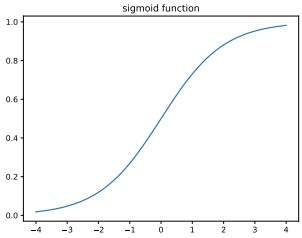

(a)

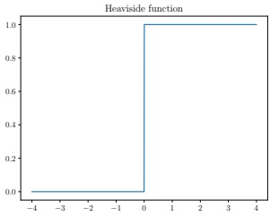

(b)

图 2.10: (a) Sigmoid（逻辑斯谛）函数  $ \sigma(a) = (1 + e^{-a})^{-1} $. (b) Heaviside 函数  $ \mathbb{I}(a > 0) $. 由 activation_fun_plot.ipynb 生成。

$$  \sigma(x)\triangleq\frac{1}{1+e^{-x}}=\frac{e^{x}}{1+e^{x}}   \tag*{(2.72)}$$

$$  \frac{d}{dx}\sigma(x)=\sigma(x)(1-\sigma(x))   \tag*{(2.73)}$$

$$  1-\sigma(x)=\sigma(-x)   \tag*{(2.74)}$$

$$  \sigma^{-1}(p)=\log\left(\frac{p}{1-p}\right)\triangleq\mathrm{logit}(p)   \tag*{(2.75)}$$

$$  \sigma_{+}(x)\triangleq\log(1+e^{x})\triangleq softplus(x)   \tag*{(2.76)}$$

$$  \frac{d}{dx}\sigma_{+}(x)=\sigma(x)   \tag*{(2.77)}$$

表 2.3: Sigmoid（逻辑斯谛）函数及其相关函数的一些有用性质。注意，logit 函数是 sigmoid 函数的逆函数，其定义域为 [0, 1]。

其中  $ f(\boldsymbol{x}; \boldsymbol{\theta}) $  是某个预测输出分布均值参数的函数。我们将在第二至第四部分考虑许多不同类型的函数  $ f $。

为了避免对  $ 0 \leq f(\boldsymbol{x}; \boldsymbol{\theta}) \leq 1 $  的要求，我们可以让  $ f $  为无约束函数，并使用以下模型：

$$  p(y|\boldsymbol{x},\boldsymbol{\theta})=\mathrm{Ber}(y|\sigma(f(\boldsymbol{x};\boldsymbol{\theta})))   \tag*{(2.78)}$$

这里  $ \sigma() $  是 sigmoid 或逻辑斯谛函数，定义如下：

$$  \sigma(a)\triangleq\frac{1}{1+e^{-a}}   \tag*{(2.79)}$$

其中 a = f(x; θ)。术语“sigmoid”意为 S 形：其图形见图 2.10a。我们看到它

Author: Kevin P. Murphy. (C) MIT Press. CC-BY-NC-ND license

---

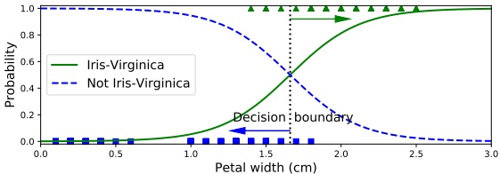

图 2.11：逻辑回归应用于鸢尾花数据集的 1 维二分类版本。由 iris_logreg.ipynb 生成。改编自 [Gér19] 的图 4.23。

将整个实数轴映射到 $[0,1]$ 区间，这对于将输出解释为概率（因此也是伯努利参数 $\theta$ 的有效值）是必要的。Sigmoid 函数可以看作是 Heaviside 阶跃函数的“软”版本，Heaviside 阶跃函数定义为

$$ H(a)\triangleq\mathbb{I}\left(a>0\right)   \tag*{(2.80)}$$

如图 2.10b 所示。

将 sigmoid 函数的定义代入式 $(2.78)$，可得

$$  p(y=1|\boldsymbol{x},\boldsymbol{\theta})=\frac{1}{1+e^{-a}}=\frac{e^{a}}{1+e^{a}}=\sigma(a)   \tag*{(2.81)}$$

$$  p(y=0|\boldsymbol{x},\boldsymbol{\theta})=1-\frac{1}{1+e^{-a}}=\frac{e^{-a}}{1+e^{-a}}=\frac{1}{1+e^{a}}=\sigma(-a)   \tag*{(2.82)}$$

量 $a$ 等于对数几率 $\log\left(\frac{p}{1-p}\right)$，其中 $p = p(y = 1|\boldsymbol{x};\boldsymbol{\theta})$。为看清这一点，注意到

$$  \log\left(\frac{p}{1-p}\right)=\log\left(\frac{e^{a}}{1+e^{a}}\frac{1+e^{a}}{1}\right)=\log(e^{a})=a   \tag*{(2.83)}$$

逻辑函数（或 sigmoid 函数）将对数几率 a 映射为 p：

$$  p=logistic(a)=\sigma(a)\triangleq\frac{1}{1+e^{-a}}=\frac{e^{a}}{1+e^{a}}   \tag*{(2.84)}$$

其逆函数称为 logit 函数，将 p 映射回对数几率 a：

$$  a=\operatorname{logit}(p)=\sigma^{-1}(p)\triangleq\log\left(\frac{p}{1-p}\right)   \tag*{(2.85)}$$

这些函数的一些有用性质见表 2.3。

#### 2.4.3 二元逻辑回归

在本节中，我们使用条件伯努利模型，其中采用形式为 $f(\boldsymbol{x};\boldsymbol{\theta})=\boldsymbol{w}^{\mathrm{T}}\boldsymbol{x}+b$ 的线性预测器。因此，模型形式为

$$  p(y|\boldsymbol{x};\boldsymbol{\theta})=\mathrm{Ber}(y|\sigma(\boldsymbol{w}^{\top}\boldsymbol{x}+b))   \tag*{(2.86)}$$

---

换句话说，

$$ p(y=1|\boldsymbol{x};\boldsymbol{\theta})=\sigma(\boldsymbol{w}^{\mathsf{T}}\boldsymbol{x}+b)=\frac{1}{1+e^{-(\boldsymbol{w}^{\mathsf{T}}\boldsymbol{x}+b)}} \tag*{(2.87)} $$

这就是逻辑回归。

例如，考虑鸢尾花数据集的一个一维、二分类版本，其中正类为“弗吉尼亚鸢尾”，负类为“非弗吉尼亚鸢尾”，使用的特征 $x$ 是花瓣宽度。我们对该数据拟合了一个逻辑回归模型，结果如图 2.11 所示。决策边界对应于满足 $p(y=1|x=x^*,\theta)=0.5$ 的 $x^*$ 值。我们看到，在此例中 $x^* \approx 1.7$。当 $x$ 远离该边界时，分类器对类标签的预测变得更加确信。

从这个例子可以清楚地看出，为什么线性回归不适用于（二）分类问题。在这样的模型中，当我们向右移动足够远时，概率会超过 1；向左移动足够远时，概率会低于 0。

关于逻辑回归的更多细节，请参见第 10 章。

### 2.5 类别分布与多项分布

为了表示有限标签集 $y \in \{1, \ldots, C\}$ 上的分布，我们可以使用类别分布，它将伯努利分布推广到 $C > 2$ 的情况。

#### 2.5.1 定义

类别分布是一种离散概率分布，每个类别有一个参数：

$$ \mathrm{Cat}(y|\boldsymbol{\theta})\triangleq\prod_{c=1}^{C}\theta_{c}^{\mathbb{I}(y=c)} \tag*{(2.88)} $$

换句话说，$p(y=c|\boldsymbol{\theta}) = \theta_c$。注意，参数受到约束，使得 $0 \leq \theta_c \leq 1$ 且 $\sum_{c=1}^{C} \theta_c = 1$；因此只有 $C-1$ 个独立参数。

我们可以通过将离散变量 $y$ 转换为一个包含 $C$ 个元素的独热向量，以另一种方式写出类别分布。独热向量中除了对应类标签的条目为 1 外，其余均为 0。（“独热”一词来源于电气工程，其中二进制向量被编码为一组电线上的电流，可以是激活（“热”）或不激活（“冷”）。）例如，若 $C=3$，我们将类别 1、2 和 3 分别编码为 $(1,0,0)$、$(0,1,0)$ 和 $(0,0,1)$。更一般地，我们可以使用单位向量对类别进行编码，其中 $e_c$ 除第 $c$ 维为 1 外其余均为 0。（这也称为虚拟编码。）使用独热编码，我们可以将类别分布写成如下形式：

$$ \mathrm{Cat}(\boldsymbol{y}|\boldsymbol{\theta})\triangleq\prod_{c=1}^{C}\theta_{c}^{y_{c}} \tag*{(2.89)} $$

类别分布是多项分布的一个特例。为了解释这一点，假设我们观察到 $N$ 次类别试验，$y_n \sim \text{Cat}(\cdot|\boldsymbol{\theta})$，$n = 1:N$。具体来说，想象掷一个 $C$ 面骰子 $N$ 次。定义 $\boldsymbol{y}$ 为一个向量，其中记录了每个面出现的次数。

---

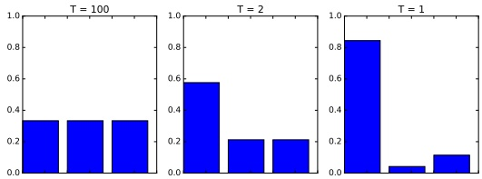

图 2.12：在温度 T = 100, T = 2 和 T = 1 下，softmax 分布 softmax(a/T)，其中 $\mathbf{a} = (3,0,1)$。当温度较高时（左图），分布是均匀的；而当温度较低时（右图），分布呈现“尖峰”状，大部分质量集中在最大的元素上。由 softmax_plot.ipynb 生成。

出现，即 $ y_c = N_c \triangleq \sum_{n=1}^{i\mathbb{N}} \mathbb{I}(y_n = c) $。此时 $\mathbf{y}$ 不再是独热向量，而是“多热”向量，因为对于所有 $N$ 次试验中观测到的每个 $c$ 值，它都有一个非零项。$\mathbf{y}$ 的分布由多项式分布给出：

$$ \mathcal{M}(\boldsymbol{y}|N,\boldsymbol{\theta})\triangleq\binom{N}{y_{1}\cdots y_{C}}\prod_{c=1}^{C}\theta_{c}^{y_{c}}=\binom{N}{N_{1}\cdots N_{C}}\prod_{c=1}^{C}\theta_{c}^{N_{c}} \tag*{(2.90)}$$

其中 $\theta_{c}$ 是面 $c$ 出现的概率，且

$$ \binom{N}{N_{1}\cdots N_{C}}\triangleq\frac{N!}{N_{1}!N_{2}!\cdots N_{C}!} \tag*{(2.91)}$$

是多项式系数，表示将一个大小为 $N = \sum_{c=1}^{C} N_c$ 的集合划分为大小分别为 $N_1$ 到 $N_C$ 的子集的方式数目。若 $N = 1$，则多项式分布退化为类别分布。

#### 2.5.2 Softmax 函数

在条件情况下，我们可以定义

$$ p(y|\boldsymbol{x},\boldsymbol{\theta})=\mathrm{Cat}(y|f(\boldsymbol{x};\boldsymbol{\theta})) \tag*{(2.92)}$$

也可以写作

$$ p(y|\boldsymbol{x},\boldsymbol{\theta})=\mathcal{M}(y|1,f(\boldsymbol{x};\boldsymbol{\theta})) \tag*{(2.93)}$$

我们要求 $ 0 \leq f_c(\boldsymbol{x}; \boldsymbol{\theta}) \leq 1 $ 且 $ \sum_{c=1}^C f_c(\boldsymbol{x}; \boldsymbol{\theta}) = 1 $。

为了避免 $f$ 直接预测概率向量的要求，通常将 $f$ 的输出送入 softmax 函数 [Bri90]（也称为多项 logit）。其定义如下：

$$ \mathrm{softmax}(\boldsymbol{a})\triangleq\left[\frac{e^{a_{1}}}{\sum_{c^{\prime}=1}^{C}e^{a_{c^{\prime}}}},\ldots,\frac{e^{a_{C}}}{\sum_{c^{\prime}=1}^{C}e^{a_{c^{\prime}}}}\right] \tag*{(2.94)}$$

《概率机器学习：导论》。在线版本。2024 年 11 月 23 日。

---

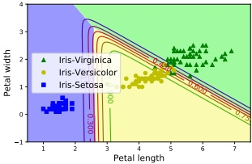

图 2.13：对鸢尾花数据集的 3 类、2 特征版本应用逻辑回归。改编自图 4.25 [Gér19]。由 iris_logreg.ipynb 生成。

这会将 $ \mathbb{R}^C $ 映射到 $ [0,1]^C $，并满足约束 $ 0 \leq \text{softmax}(\boldsymbol{a})_c \leq 1 $ 且 $ \sum_{c=1}^C \text{softmax}(\boldsymbol{a})_c = 1 $。softmax 的输入 $ \boldsymbol{a} = f(\boldsymbol{x}; \boldsymbol{\theta}) $ 称为 **logits（对数几率）**，是对数几率的一种推广。

softmax 函数之所以得名，是因为其行为类似于 argmax 函数。为了说明这一点，我们将每个 $ a_{c} $ 除以一个称为温度（temperature）的常数 T。$ ^{8} $ 那么当 $ T \rightarrow 0 $ 时，我们有

$$  \mathrm{softmax}(\boldsymbol{a}/T)_{c}=\left\{\begin{array}{ll}1.0&\text{如果 }c=\arg\max_{c^{\prime}}a_{c^{\prime}}\\ 0.0&\text{否则}\end{array}\right.   \tag*{(2.95)}$$

换言之，在低温下，分布将大部分概率质量放在最可能的状态上（这称为赢家通吃，winner takes all），而在高温下，它会均匀地分散质量。图 2.12 展示了这一现象。

#### 2.5.3 多项逻辑回归

如果我们使用形式为 $ f(\boldsymbol{x}; \boldsymbol{\theta}) = \boldsymbol{W}\boldsymbol{x} + \boldsymbol{b} $ 的线性预测器，其中 $ \boldsymbol{W} $ 是 $ C \times D $ 矩阵，$ \boldsymbol{b} $ 是 $ C $ 维偏置向量，则最终模型变为

$$  p(y|\boldsymbol{x};\boldsymbol{\theta})=\mathrm{Cat}(y|\mathrm{softmax}(\mathbf{W}\boldsymbol{x}+\boldsymbol{b}))   \tag*{(2.96)}$$

令 $ a = Wx + b $ 为 C 维 logits 向量。那么我们可以将上式重写如下：

$$  p(y=c|\boldsymbol{x};\boldsymbol{\theta})=\frac{e^{a_{c}}}{\sum_{c^{\prime}=1}^{C}e^{a_{c^{\prime}}}}   \tag*{(2.97)}$$

这称为多项逻辑回归（multinomial logistic regression）。

如果只有两个类别，它会退化为二项逻辑回归（binary logistic regression）。为了说明这一点，注意到

$$  \mathrm{softmax}(\boldsymbol{a})_{0}=\frac{e^{a_{0}}}{e^{a_{0}}+e^{a_{1}}}=\frac{1}{1+e^{a_{1}-a_{0}}}=\sigma(a_{0}-a_{1})   \tag*{(2.98)}$$

因此我们可以训练模型直接预测 $ a = a_1 - a_0 $。这可以通过单个权重向量 $ \boldsymbol{w} $ 实现；如果使用多类公式，我们将得到两个权重向量 $ \boldsymbol{w}_0 $ 和 $ \boldsymbol{w}_1 $。这种模型是过参数化的，可能损害可解释性，但预测结果相同。

---

我们在第10.3节中对此进行了更详细的讨论。现在，我们仅举一个例子。图2.13展示了我们将该模型拟合到仅使用2个特征的3类鸢尾花数据集时的结果。我们看到，每个类别之间的决策边界是线性的。通过对特征进行变换（例如使用多项式），我们可以创建非线性边界，这一点将在第10.3.1节中讨论。

#### 2.5.4 对数-求和-指数技巧

在本节中，我们讨论在使用softmax分布时需要注意的一个重要的实际细节。假设我们要计算归一化概率 $ p_c = p(y = c|\boldsymbol{x}) $，其表达式为

$$  p_{c}=\frac{e^{a_{c}}}{Z(\boldsymbol{a})}=\frac{e^{a_{c}}}{\sum_{c^{\prime}=1}^{C}e^{a_{c^{\prime}}}}   \tag*{(2.99)}$$

其中 $ \boldsymbol{a} = f(\boldsymbol{x}; \boldsymbol{\theta}) $ 是logits。在计算配分函数 $ Z $ 时，我们可能会遇到数值问题。例如，假设有3个类别，logits为 $ \boldsymbol{a} = (0, 1, 0) $，则 $ Z = e^0 + e^1 + e^0 = 4.71 $。但现在假设 $ \boldsymbol{a} = (1000, 1001, 1000) $，我们会得到 $ Z = \infty $，因为在计算机上，即使使用64位精度，$ \mathrm{np.exp}(1000) = \mathrm{inf} $。类似地，假设 $ \boldsymbol{a} = (-1000, -999, -1000) $，我们会得到 $ Z = 0 $，因为 $ \mathrm{np.exp}(-1000) = 0 $。为了避免数值问题，我们可以使用以下恒等式：

$$  \log\sum_{c=1}^{C}\exp(a_{c})=m+\log\sum_{c=1}^{C}\exp(a_{c}-m)   \tag*{(2.100)}$$

该式对任意 $ m $ 都成立。通常取 $ m = \max_c a_c $，这样可以确保取指数后的最大值不会超过零，因此绝对不会上溢，即使出现下溢，结果也是合理的。这被称为**对数-求和-指数技巧**。我们将在实现 $ \lsearrow $ 函数时使用这一技巧：

$$  \mathrm{lse}(\boldsymbol{a})\triangleq\log\sum_{c=1}^{C}\exp(a_{c})   \tag*{(2.101)}$$

我们可以利用它从logits计算概率：

$$  p(y=c|\boldsymbol{x})=\exp(a_{c}-\mathrm{l s e}(\boldsymbol{a}))   \tag*{(2.102)}$$

然后将其传递给交叉熵损失，该损失定义在公式 $ (5.41) $ 中。

然而，为了节省计算量并提高数值稳定性，通常会对交叉熵损失进行修改，使其直接接收logits a 作为输入，而不是概率向量 p。以二分类情况为例，单个样本的交叉熵损失为

$$  \mathcal{L}=-\left[\mathbb{I}\left(y=0\right)\log p_{0}+\mathbb{I}\left(y=1\right)\log p_{1}\right]   \tag*{(2.103)}$$

其中

$$  \log p_{1}=\log\left(\frac{1}{1+\exp(-a)}\right)=\log(1)-\log(1+\exp(-a))=0-\mathrm{lse}([0,-a])   \tag*{(2.104)}$$

$$  \log p_{0}=0-\mathrm{l s e}([0,+a])   \tag*{(2.105)}$$

---

### 2.6 单变量高斯（正态）分布

实值随机变量 $y \in \mathbb{R}$ 最常用的分布是高斯分布，也称为正态分布（关于这些名称的讨论见第 2.6.4 节）。

#### 2.6.1 累积分布函数

我们将连续随机变量 Y 的累积分布函数（cumulative distribution function, cdf）定义如下：

$$  P(y)\triangleq\Pr(Y\leq y)   \tag*{(2.106)}$$

（注意，我们用大写 P 表示累积分布函数。）利用该函数，我们可以计算任意区间内的概率如下：

$$  \Pr(a<Y\leq b)=P(b)-P(a)   \tag*{(2.107)}$$

累积分布函数是单调非递减函数。

高斯的累积分布函数定义为

$$  \Phi(y;\mu,\sigma^{2})\triangleq\int_{-\infty}^{y}\mathcal{N}(z|\mu,\sigma^{2})d z   \tag*{(2.108)}$$

图 2.2a 展示了其图像。注意，高斯的累积分布函数通常用 $\Phi(y;\mu,\sigma^2)=\frac{1}{2}[1+\operatorname{erf}(z/\sqrt{2})]$ 实现，其中 $z=(y-\mu)/\sigma$，而 $\operatorname{erf}(u)$ 是误差函数，定义为

$$  \mathrm{erf}(u)\triangleq\frac{2}{\sqrt{\pi}}\int_{0}^{u}e^{-t^{2}}dt   \tag*{(2.109)}$$

参数 $\mu$ 编码了分布的均值；对于高斯分布，这也等同于众数。参数 $\sigma^{2}$ 编码了方差。（有时我们讨论高斯的精度，它是方差的倒数，记为 $\lambda = 1/\sigma^{2}$。）当 $\mu = 0$ 且 $\sigma = 1$ 时，该高斯分布称为标准正态分布。

若 $P$ 是 $Y$ 的累积分布函数，则 $P^{-1}(q)$ 是满足 $p(Y \leq y_q) = q$ 的值 $y_q$；这称为 $P$ 的 $q$ 分位数。值 $P^{-1}(0.5)$ 是分布的中位数，一半概率质量在左侧，另一半在右侧。值 $P^{-1}(0.25)$ 和 $P^{-1}(0.75)$ 分别是下四分位数和上四分位数。

例如，设 $\Phi$ 为高斯分布 $\mathcal{N}(0,1)$ 的累积分布函数，$\Phi^{-1}$ 为逆累积分布函数（也称为 **probit 函数**）。那么 $\Phi^{-1}(\alpha/2)$ 左侧的点包含 $\alpha/2$ 的概率质量，如图 2.2b 所示。由对称性，$\Phi^{-1}(1-\alpha/2)$ 右侧的点也包含 $\alpha/2$ 的质量。因此，中心区间 $(\Phi^{-1}(\alpha/2), \Phi^{-1}(1-\alpha/2))$ 包含 $1-\alpha$ 的质量。若设 $\alpha=0.05$，则中心 95% 区间覆盖范围为

$$  (\Phi^{-1}(0.025),\Phi^{-1}(0.975))=(-1.96,1.96)   \tag*{(2.110)}$$

如果分布为 $\mathcal{N}(\mu,\sigma^2)$，则 95% 区间变为 $(\mu - 1.96\sigma,\mu + 1.96\sigma)$。这通常近似表示为 $\mu \pm 2\sigma$。

作者：Kevin P. Murphy。(C) MIT Press。CC-BY-NC-ND 许可证。

---

#### 2.6.2 概率密度函数

我们将概率密度函数（probability density function，简称pdf）定义为累积分布函数（cdf）的导数：

$$  p(y)\triangleq\frac{d}{d y}P(y)   \tag*{(2.111)}$$

高斯分布的pdf由下式给出：

$$  \mathcal{N}(y|\mu,\sigma^{2})\triangleq\frac{1}{\sqrt{2\pi\sigma^{2}}}e^{-\frac{1}{2\sigma^{2}}(y-\mu)^{2}}   \tag*{(2.112)}$$

其中 $ \sqrt{2\pi\sigma^2} $ 是归一化常数，用于确保密度积分为1（见习题2.12）。其图形见图Figure 2.2b。

给定一个pdf，我们可以计算连续变量落在有限区间内的概率如下：

$$  \Pr(a<Y\leq b)=\int_{a}^{b}p(y)dy=P(b)-P(a)   \tag*{(2.113)}$$

随着区间尺寸减小，我们可以写出：

$$  \Pr(y\leq Y\leq y+dy)\approx p(y)dy   \tag*{(2.114)}$$

直观上，这表明Y落在y附近小区间内的概率等于y处的密度乘以区间宽度。上述结果的一个重要推论是，单点处的pdf可能大于1。例如，$ \mathcal{N}(0|0,0.1) = 3.99 $。

我们可以利用pdf计算分布的均值（或期望值）：

$$  \mathbb{E}\left[Y\right]\triangleq\int_{\mathcal{Y}}y\;p(y)d y   \tag*{(2.115)}$$

对于高斯分布，我们有熟知的结果 $ \mathbb{E}\left[\mathcal{N}(\cdot|\mu,\sigma^2)\right]=\mu $。（但需注意，对于某些分布，该积分不收敛，因此均值未定义。）

我们还可以利用pdf计算分布的方差。方差是“离散程度”的度量，通常记作 $ \sigma^{2} $。方差的定义如下：

$$  \mathbb{V}\left[Y\right]\triangleq\mathbb{E}\left[\left(Y-\mu\right)^{2}\right]=\int\left(y-\mu\right)^{2}p(y)d y   \tag*{(2.116)}$$

$$  =\int y^{2}p(y)d y+\mu^{2}\int p(y)d y-2\mu\int y p(y)d y=\mathbb{E}\left[Y^{2}\right]-\mu^{2}   \tag*{(2.117)}$$

由此我们得到如下有用结果：

$$  \mathbb{E}\left[Y^{2}\right]=\sigma^{2}+\mu^{2}   \tag*{(2.118)}$$

标准差定义为：

$$  \mathrm{std}\left[Y\right]\triangleq\sqrt{\mathbb{V}\left[Y\right]}=\sigma   \tag*{(2.119)}$$

（标准差比方差更具可解释性，因为它与Y本身具有相同的量纲。）对于高斯分布，我们有熟知的结果：std $ \left[\mathcal{N}(\cdot|\mu,\sigma^2)\right] = \sigma $。

---

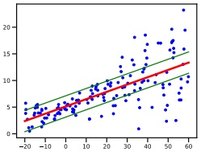

 $ (a) $

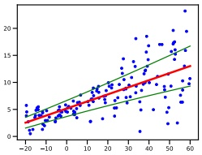

(b)

图 2.14：使用均值 $ \mu(x) = b + wx $ 的高斯输出的线性回归，以及 (a) 固定方差 $ \sigma^2 $（同方差）或 (b) 输入相关方差 $ \sigma(x)^2 $（异方差）。由 $ \text{linreg}_{1d\_hetero\_tfp.ipynb} $ 生成。

#### 2.6.3 回归

到目前为止，我们一直在考虑无条件的高斯分布。在某些情况下，使高斯参数成为某些输入变量的函数是有用的，即我们希望创建一个形式如下的条件密度模型：

$$  p(y|\boldsymbol{x};\boldsymbol{\theta})=\mathcal{N}(y|f_{\mu}(\boldsymbol{x};\boldsymbol{\theta}),f_{\sigma}(\boldsymbol{x};\boldsymbol{\theta})^{2})   \tag*{(2.120)}$$

其中 $  f_\mu(\boldsymbol{x}; \boldsymbol{\theta}) \in \mathbb{R}  $ 预测均值，$  f_\sigma(\boldsymbol{x}; \boldsymbol{\theta})^2 \in \mathbb{R}_+  $ 预测方差。

通常假设方差是固定的，并与输入无关。这称为 **同方差回归**。此外，通常假设均值是输入的线性函数。由此产生的模型称为线性回归：

$$  p(y|\boldsymbol{x};\boldsymbol{\theta})=\mathcal{N}(y|\boldsymbol{w}^{\top}\boldsymbol{x}+b,\sigma^{2})   \tag*{(2.121)}$$

其中 $ \boldsymbol{\theta} = (\boldsymbol{w}, b, \sigma^2) $。图 2.14(a) 展示了该模型在一维情况下的示例，第 11.2 节提供了该模型的更多细节。

然而，我们也可以让方差依赖于输入；这称为 **异方差回归**。在线性回归设置中，我们有：

$$  p(y|\boldsymbol{x};\boldsymbol{\theta})=\mathcal{N}(y|\boldsymbol{w}_{\mu}^{\mathsf{T}}\boldsymbol{x}+b,\sigma_{+}(\boldsymbol{w}_{\sigma}^{\mathsf{T}}\boldsymbol{x}))   \tag*{(2.122)}$$

其中 $ \theta = (w_\mu, w_\sigma) $ 是两类回归权重，而

$$  \sigma_{+}(a)=\log(1+e^{a})   \tag*{(2.123)}$$

是 softplus 函数，它将 $ \mathbb{R} $ 映射到 $ \mathbb{R}_{+} $，以确保预测的标准差非负。图 2.14(b) 展示了该模型在一维情况下的示例。

注意，图 2.14 绘制了 95% 的预测区间 $ [\mu(x) - 2\sigma(x), \mu(x) + 2\sigma(x)] $。这是在给定 x 下预测观测值 y 的不确定性，并捕捉了蓝点的变异性。相比之下，底层（无噪声）函数的不确定性由 $ \sqrt{\mathbb{V}[f_{\mu}(\mathbf{x};\boldsymbol{\theta})]} $ 表示，其中不包含 $ \sigma $ 项；此时不确定性是关于参数 $ \boldsymbol{\theta} $ 而非输出 y 的。关于如何建模参数不确定性的细节，请参见第 11.7 节。

作者：Kevin P. Murphy。 (C) MIT Press. CC-BY-NC-ND 许可。

---

#### 2.6.4 为什么高斯分布被如此广泛使用？

高斯分布是统计学和机器学习中使用最广泛的分布。其原因有几点：首先，它有两个易于解释的参数，能够捕捉分布最基本的性质，即均值和方差。其次，**中心极限定理**（第2.8.6节）告诉我们，独立随机变量之和近似服从高斯分布，这使得它成为建模残差或“噪声”的良好选择。第三，在给定均值和方差的约束下，高斯分布做出的假设最少（熵最大），如我们在第3.4.4节所示；这使得它在许多情况下成为良好的默认选择。最后，它具有简单的数学形式，从而能够导出易于实现且通常非常有效的方法，我们将在第3.2节中看到这一点。

从历史角度看，值得注意的是，“高斯分布”这一术语可能有些误导，正如Jaynes [Jay03, p241]所指出的：“该分布的基本性质及其主要特性在Gauss六岁时就已被Laplace注意到；而在Laplace出生之前，de Moivre就已经发现了该分布本身”。然而，Gauss在19世纪普及了该分布的使用，如今“高斯”一词在科学和工程领域被广泛使用。

“正态分布”这一名称似乎源于线性回归中的正规方程（见第11.2.2.2节）。然而，我们倾向于避免使用“正态”一词，因为它暗示其他分布是“非正态”的，而正如Jaynes [Jay03]所指出的，正是高斯分布是“反常”的，因为它具有许多一般分布所不具备的特殊性质。

#### 2.6.5 狄拉克δ函数作为极限情况

当高斯分布的方差趋近于0时，该分布会在均值处变成一个无限窄但无限高的“尖峰”。这可以表示为：

$$  \lim_{\sigma\to0}\mathcal{N}(y|\mu,\sigma^{2})\to\delta(y-\mu)   \tag*{(2.124)}$$

其中 $\delta$ 是狄拉克δ函数，定义为

$$  \delta(x)=\begin{cases}+\infty&if x=0\\0&if x\neq0\end{cases}   \tag*{(2.125)}$$

并且有

$$  \int_{-\infty}^{\infty}\delta(x)dx=1   \tag*{(2.126)}$$

该函数的一个微小变体是定义

$$  \delta_{y}(x)=\begin{cases}+\infty&if x=y\\0&if x\neq y\end{cases}   \tag*{(2.127)}$$

注意，

$$  \delta_{y}(x)=\delta(x-y)   \tag*{(2.128)}$$

---

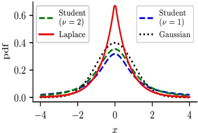

(a)

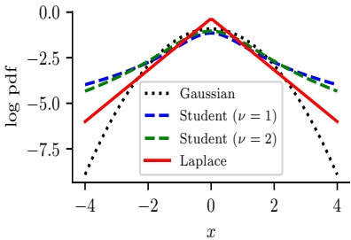

(b)

图2.15: (a) 对于 $\mathcal{N}(0,1)$、$\mathcal{T}(\mu=0,\sigma=1,\nu=1)$、$\mathcal{T}(\mu=0,\sigma=1,\nu=2)$ 和 Laplace(0,1/$\sqrt{2}$) 的概率密度函数。高斯分布和拉普拉斯分布的均值均为0，方差均为1。当 $\nu=1$ 时，学生分布退化为柯西分布，其均值和方差均不存在定义。(b) 这些概率密度函数的对数。注意，与拉普拉斯分布不同，学生分布在任何参数取值下都不是对数凹函数。尽管如此，两者都是单峰的。由 student_laplace_pdf_plot.ipynb 生成。

狄拉克δ函数分布满足以下筛选性质，我们稍后将用到：

$$  \int_{-\infty}^{\infty}f(y)\delta(x-y)dy=f(x)   \tag*{(2.129)}$$

### 2.7 其他常见单变量分布 $ * $

本节简要介绍本书中将用到的其他一些单变量分布。

#### 2.7.1 学生t分布

高斯分布对异常值相当敏感。高斯分布的一种稳健替代是学生t分布，我们将其简称为学生分布。$^{9}$ 其概率密度函数如下：

$$  \mathcal{T}(y|\mu,\sigma^{2},\nu)\propto\left[1+\frac{1}{\nu}\left(\frac{y-\mu}{\sigma}\right)^{2}\right]^{-(\frac{\nu+1}{2})}   \tag*{(2.130)}$$

其中 $\mu$ 是均值，$\sigma > 0$ 是尺度参数（而非标准差），$\nu > 0$ 称为自由度（尽管更合适的术语是“正态程度”[Kru13]，因为 $\nu$ 值较大时该分布的特性接近高斯分布）。

---

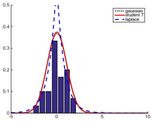

$ (a) $

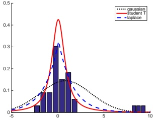

(b)

图 2.16：离群点对高斯分布、学生 t 分布和拉普拉斯分布拟合效果的影响示意图。(a) 无离群点（高斯曲线和学生 t 曲线彼此重叠）。(b) 有离群点。我们看到高斯分布受离群点的影响比学生 t 分布和拉普拉斯分布更大。改编自 [Bis06] 的图 2.16。由 robust_pdf_plot.ipynb 生成。

我们看到概率密度随距中心平方距离以多项式函数衰减，而非指数函数，因此尾部概率质量大于高斯分布，如图 2.15 所示。我们称学生 t 分布具有**重尾**特性，这使得它对离群点具有鲁棒性。

为了说明学生 t 分布的鲁棒性，考虑图 2.16。在左侧，我们展示了高斯分布和学生 t 分布对无离群点数据的拟合。在右侧，我们添加了一些离群点。我们看到高斯分布受到很大影响，而学生 t 分布几乎不变。我们将在 11.6.2 节讨论如何使用学生 t 分布进行鲁棒线性回归。

为便于后续引用，我们注意到学生 t 分布具有以下性质：

$$   mean=\mu,mode=\mu,var=\frac{\nu\sigma^{2}}{\left(\nu-2\right)}   \tag*{(2.131)}$$

均值仅当 $ \nu > 1 $ 时定义。方差仅当 $ \nu > 2 $ 时定义。当 $ \nu \gg 5 $ 时，学生 t 分布迅速趋近于高斯分布并失去其鲁棒性。通常取 $ \nu = 4 $，这在一系列问题中表现良好 [LLT89]。

#### 2.7.2 柯西分布

当 $ \nu = 1 $ 时，学生 t 分布称为柯西分布或洛伦兹分布。其概率密度函数定义为

$$  \mathcal{C}(x|\mu,\gamma)=\frac{1}{\gamma\pi}\left[1+\left(\frac{x-\mu}{\gamma}\right)^{2}\right]^{-1}   \tag*{(2.132)}$$

该分布与高斯分布相比具有非常重的尾部。例如，标准正态分布中 95% 的值位于 -1.96 和 1.96 之间，而标准柯西分布则位于 -12.7 和 12.7 之间。事实上，其尾部过重，以至于定义均值的积分不收敛。

---

半柯西分布是柯西分布（其中 $\mu = 0$）的一种变体，它自身发生了“折叠”，因此其所有概率密度都位于正实数上。其形式如下：

$$ \mathcal{C}_{+}(x|\gamma)\triangleq\frac{2}{\pi\gamma}\left[1+\left(\frac{x}{\gamma}\right)^{2}\right]^{-1} \tag*{(2.133)}$$

这在贝叶斯建模中非常有用，因为我们希望在正实数上使用一个具有重尾但原点处密度有限的分布。

#### 2.7.3 拉普拉斯分布

另一种具有重尾的分布是拉普拉斯分布 $^{10}$，也称为双指数分布。其概率密度函数如下：

$$ \mathrm{Laplace}(y|\mu,b)\triangleq\frac{1}{2b}\exp\left(-\frac{|y-\mu|}{b}\right) \tag*{(2.134)}$$

图 2.15 展示了其图像。其中 $\mu$ 是位置参数，$b > 0$ 是尺度参数。该分布具有以下性质：

$$ mean=\mu,mode=\mu,var=2b^{2} \tag*{(2.135)}$$

在第 11.6.1 节中，我们将讨论如何使用拉普拉斯分布进行稳健线性回归；在第 11.4 节中，我们将讨论如何使用拉普拉斯分布进行稀疏线性回归。

#### 2.7.4 贝塔分布

贝塔分布的支持区间为 $[0, 1]$，其定义如下：

$$ \mathrm{Beta}(x|a,b)=\frac{1}{B(a,b)}x^{a-1}(1-x)^{b-1} \tag*{(2.136)}$$

其中 $B(a,b)$ 是贝塔函数，定义为：

$$ B(a,b)\triangleq\frac{\Gamma(a)\Gamma(b)}{\Gamma(a+b)} \tag*{(2.137)}$$

这里 $\Gamma(a)$ 是伽马函数，定义为：

$$ \Gamma(a)\triangleq\int_{0}^{\infty}x^{a-1}e^{-x}d x \tag*{(2.138)}$$

图 2.17a 展示了一些贝塔分布的图像。

我们需要 $a,b > 0$ 以确保该分布是可积的（即确保 $B(a,b)$ 存在）。若 $a = b = 1$，则得到均匀分布。若 $a$ 和 $b$ 均小于 1，则得到在 0 和 1 处有“尖峰”的双峰分布；若 $a$ 和 $b$ 均大于 1，则分布是单峰的。

---

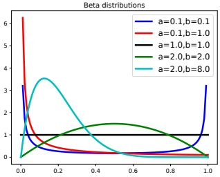

 $ (a) $

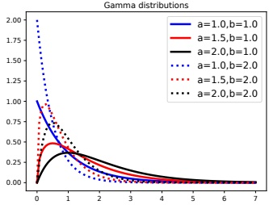

(b)

图 2.17：(a) 一些贝塔（beta）分布。如果 a < 1，左侧会出现一个“尖峰”；如果 b < 1，右侧会出现一个“尖峰”。如果 a = b = 1，则分布是均匀的。如果 a > 1 且 b > 1，则分布是单峰的。由 beta_dist_plot.ipymb 生成。(b) 一些伽马（gamma）分布。如果 a < 1，众数位于 0；否则众数不在 0。随着比率 b 增大，水平尺度减小，从而将图形向左和向上压缩。由 gamma_dist_plot.ipymb 生成。

作为后续参考，我们注意到该分布具有以下性质（练习 2.8）：

$$  \begin{aligned}mean=\frac{a}{a+b},mode&=\frac{a-1}{a+b-2},var=\frac{ab}{(a+b)^{2}(a+b+1)}\end{aligned}   \tag*{(2.139)}$$

注意，上述众数方程假设 a > 1 且 b > 1；如果 a < 1 且 $ b \geq 1 $，则众数为 0；如果 $ a \geq 1 $ 且 b < 1，则众数为 1。

#### 2.7.5 伽马分布

伽马分布是一种用于正实值随机变量（x > 0）的灵活分布。它由两个参数定义，称为形状参数 a > 0 和比率参数 b > 0：

$$  \mathrm{Ga}(x|\mathrm{shape}=a,\mathrm{rate}=b)\triangleq\frac{b^{a}}{\Gamma(a)}x^{a-1}e^{-x b}   \tag*{(2.140)}$$

有时该分布用形状参数 a 和尺度参数 s = 1/b 来参数化：

$$  \mathrm{G a}(x|\mathrm{s h a p e}=a,\mathrm{s c a l e}=s)\triangleq\frac{1}{s^{a}\Gamma(a)}x^{a-1}e^{-x/s}   \tag*{(2.141)}$$

图 2.17b 给出了伽马概率密度函数的一些图形。

作为参考，我们注意到该分布具有以下性质：

$$   mean=\frac{a}{b},mode=\max(\frac{a-1}{b},0),var=\frac{a}{b^{2}}   \tag*{(2.142)}$$

有几种分布只是伽马分布的特例，我们将在下面讨论。

---

### 2.7. 其他常见单变量分布  $ * $

• 指数分布。其定义为

$$  \mathrm{Expon}(x|\lambda)\triangleq\mathrm{Ga}(x|\mathrm{shape}=1,\mathrm{rate}=\lambda)   \tag*{(2.143)}$$

该分布描述了泊松过程中事件之间的间隔时间，即事件以恒定平均速率  $ \lambda $  连续且独立发生的过程。

• 卡方分布。其定义为

$$  \chi_{\nu}^{2}(x)\triangleq\mathrm{Ga}(x|\mathrm{shape}=\frac{\nu}{2},\mathrm{rate}=\frac{1}{2})   \tag*{(2.144)}$$

其中  $ \nu $  称为自由度。该分布是高斯随机变量平方和的分布。更精确地说，若  $ Z_i \sim \mathcal{N}(0,1) $，且  $ S = \sum_{i=1}^{\nu} Z_i^2 $，则  $ S \sim \chi_\nu^2 $。

• 逆伽马分布。其定义如下：

$$  \mathrm{IG}(x|\mathrm{shape}=a,\mathrm{scale}=b)\triangleq\frac{b^{a}}{\Gamma(a)}x^{-(a+1)}e^{-b/x}   \tag*{(2.145)}$$

该分布具有以下性质：

$$  \begin{aligned}mean=\frac{b}{a-1},mode=\frac{b}{a+1},var=\frac{b^{2}}{(a-1)^{2}(a-2)}\end{aligned}   \tag*{(2.146)}$$

均值仅在 $a > 1$ 时存在。方差仅在 $a > 2$ 时存在。注意：若 $X \sim \mathrm{Ga}(\mathrm{shape} = a, \mathrm{rate} = b)$，则 $1/X \sim \mathrm{IG}(\mathrm{shape} = a, \mathrm{scale} = b)$。（此时 $b$ 扮演了两个不同的角色。）

#### 2.7.6 经验分布

假设我们有一组 $N$ 个样本 $\mathcal{D} = \{x^{(1)}, \ldots, x^{(N)}\}$，这些样本来自分布 $p(X)$，其中 $X \in \mathbb{R}$。我们可以利用一组以这些样本为中心的狄拉克δ函数（第 2.6.5 节）或“冲激”来近似概率密度函数：

$$  \hat{p}_{N}(x)=\frac{1}{N}\sum_{n=1}^{N}\delta_{x^{(n)}}(x)   \tag*{(2.147)}$$

这称为数据集 D 的经验分布。图 2.18(a) 给出了一个 N=5 的示例。

相应的累积分布函数为：

$$  \hat{P}_{N}(x)=\frac{1}{N}\sum_{n=1}^{N}\mathbb{I}\left(x^{(n)}\leq x\right)=\frac{1}{N}\sum_{n=1}^{N}u_{x^{(n)}}(x)   \tag*{(2.148)}$$

其中  $ u_{y}(x) $  是在 y 处的阶梯函数，定义为：

$$  u_{y}(x)=\begin{cases}1&if x\geq y\\0&if x<y\end{cases}   \tag*{(2.149)}$$

这可以可视化为一个“阶梯”，如图 2.18(b) 所示，其中在每个样本处发生高度为 1/N 的跳跃。

作者：Kevin P. Murphy。(C) MIT Press。CC-BY-NC-ND 许可协议。

---

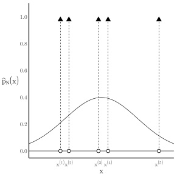

 $ (a) $

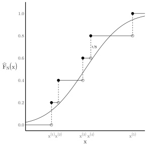

(b)

图 2.18：从一组 N = 5 个样本中得到的 (a) 经验概率密度函数（empirical pdf）和 (b) 经验累积分布函数（empirical cdf）的图示。来自 https://bit.ly/3hFgi0e。经 Mauro Escudero 许可使用。

### 2.8 随机变量的变换  $ * $

假设 $ \boldsymbol{x} \sim p() $ 是一个随机变量， $ \boldsymbol{y} = f(\boldsymbol{x}) $ 是其一个确定性变换。本节将讨论如何计算 $ p(\boldsymbol{y}) $。

#### 2.8.1 离散情况

若 $X$ 是离散随机变量，我们可以通过对所有满足 $f(x) = y$ 的 $x$ 的概率质量求和来推导 $Y$ 的概率质量函数（pmf）：

$$  p_{y}(y)=\sum_{x:f(x)=y}p_{x}(x)   \tag*{(2.150)}$$

例如，如果 $ f(X) = 1 $ 当 $ X $ 为偶数，否则 $ f(X) = 0 $，且 $ p_x(X) $ 在集合 $ \{1, \ldots, 10\} $ 上均匀分布，则 $ p_y(1) = \sum_{x \in \{2, 4, 6, 8, 10\}} p_x(x) = 0.5 $，因此 $ p_y(0) = 0.5 $。注意在该例子中， $ f $ 是一个多对一函数。

#### 2.8.2 连续情况

若 $X$ 是连续的，我们不能直接使用式 (2.150)，因为 $ p_x(x) $ 是概率密度而不是概率质量，无法对密度求和。相反，我们使用累积分布函数（cdf）来处理：

$$  P_{y}(y)\triangleq\Pr(Y\leq y)=\Pr(f(X)\leq y)=\Pr(X\in\{x|f(x)\leq y\})   \tag*{(2.151)}$$

如果 $f$ 可逆，我们可以通过对 cdf 求导来得到 $y$ 的概率密度，如下所示。如果 $f$ 不可逆，则可以使用数值积分或蒙特卡罗近似。

---

#### 2.8.3 可逆变换（双射）

在本节中，我们考虑单调函数（因此也是可逆函数）的情况。（注意，如果一个函数是双射，则它是可逆的。）在此假设下，存在一个求解 \(y\) 的概率密度函数（pdf）的简单公式，我们将看到这一点。（这可以推广到可逆但非单调的函数，但我们忽略这种情况。）

##### 2.8.3.1 变量变换：标量情形

我们从一个例子开始。假设 \(x \sim \text{Unif}(0,1)\)，且 \(y = f(x) = 2x + 1\)。该函数对概率分布进行了拉伸和平移，如图 Figure 2.19(a) 所示。现在让我们放大一个点 \(x\) 和另一个与其无限接近的点，即 \(x + dx\)。我们看到这个区间被映射到 \((y, y + dy)\)。这些区间中的概率质量必须相同，因此 \(p(x)dx = p(y)dy\)，从而 \(p(y) = p(x)dx/dy\)。然而，由于从概率守恒的角度来看，\(dx/dy > 0\) 或 \(dx/dy < 0\) 并不重要，我们得到

$$  p_{y}(y)=p_{x}(x)|\frac{dx}{dy}|   \tag*{(2.152)}$$

现在考虑对于任意 \(p_x(x)\) 和任意单调函数 \(f: \mathbb{R} \to \mathbb{R}\) 的一般情况。令 \(g = f^{-1}\)，则 \(y = f(x)\) 且 \(x = g(y)\)。如果我们假设 \(f: \mathbb{R} \to \mathbb{R}\) 是单调递增的，则得到

$$  P_{y}(y)=\Pr(f(X)\leq y)=\Pr(X\leq f^{-1}(y))=P_{x}(f^{-1}(y))=P_{x}(g(y))   \tag*{(2.153)}$$

求导可得

$$  p_{y}(y)\triangleq\frac{d}{d y}P_{y}(y)=\frac{d}{d y}P_{x}(g(y))=\frac{d x}{d y}\frac{d}{d x}P_{x}(g(y))=\frac{d x}{d y}p_{x}(g(y))   \tag*{(2.154)}$$

对于 \(f\) 是单调递减的情况，我们可以推导出类似的表达式（但符号相反）。为了处理一般情况，我们取绝对值得到

$$  p_{y}(y)=p_{x}\left(g(y)\right)\left|\frac{d}{d y}g(y)\right|   \tag*{(2.155)}$$

这被称为变量变换公式。

##### 2.8.3.2 变量变换：多元情形

我们可以将之前的结果扩展到多元分布，如下所示。令 \(f\) 是一个从 \(\mathbb{R}^n\) 到 \(\mathbb{R}^n\) 的可逆函数，其逆为 \(g\)。假设我们要计算 \(y = f(x)\) 的概率密度函数。与标量情形类比，我们有

$$  p_{y}(\boldsymbol{y})=p_{x}\left(\boldsymbol{g}(\boldsymbol{y})\right)\left|\det\left[\boldsymbol{J}_{g}(\boldsymbol{y})\right]\right|   \tag*{(2.156)}$$

其中 \(\mathbf{J}_g = \frac{dg(\mathbf{y})}{dy^\top}\) 是 \(\mathbf{g}\) 的雅可比矩阵，而 \(|\det\mathbf{J}(\mathbf{y})|\) 是在 \(\mathbf{y}\) 处计算的 \(\mathbf{J}\) 的行列式的绝对值。（关于雅可比矩阵的讨论，请参见 Section 7.8.5。）在 Exercise 3.6 中，你将使用该公式推导多元高斯分布的归一化常数。

作者：Kevin P. Murphy。 (C) MIT Press。 CC-BY-NC-ND 许可证。

---

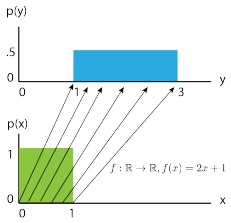

$ (a) $

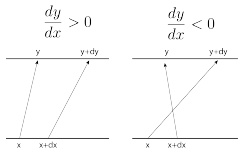

(b)

图 2.19: (a) 将均匀概率密度函数通过函数 $ f(x) = 2x + 1 $ 进行映射。(b) 说明两个邻近点 x 和 $ x + dx $ 在 f 作用下如何被映射。如果 $ \frac{dy}{dx} > 0 $，则函数局部递增；如果 $ \frac{dy}{dx} < 0 $，则函数局部递减。（在后一种情况下，若 $ f(x) = y + dy $，则 $ f(x + dx) = y $，因为 x 增加 dx 应使输出减少 dy。）$ x + dx > x $。摘自 [Jan18]。经 Eric Jang 许可使用。

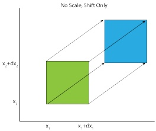

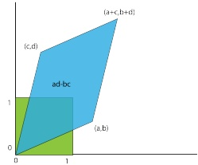

图 2.20: 仿射变换应用于单位正方形的示意图，$ f(\mathbf{x}) = \mathbf{A}\mathbf{x} + \mathbf{b} $。(a) 这里 $ \mathbf{A} = \mathbf{I} $。(b) 这里 $ \mathbf{b} = \mathbf{0} $。摘自 [Jan18]。经 Eric Jang 许可使用。

图 2.20 在二维情况下展示了这一结果，其中 $f(\boldsymbol{x})=\boldsymbol{A}\boldsymbol{x}+\boldsymbol{b}$，且 $\boldsymbol{A}=\begin{pmatrix}a&c\\ b&d\end{pmatrix}$

我们看到单位正方形的面积变化了因子 $ \det(\mathbf{A}) = ad - bc $，这正是平行四边形的面积。

另一个例子：考虑将从笛卡尔坐标 $ \boldsymbol{x} = (x_1, x_2) $ 的密度变换到极坐标 $ \boldsymbol{y} = \boldsymbol{f}(x_1, x_2) $，即 $ \boldsymbol{g}(r, \theta) = (r \cos \theta, r \sin \theta) $。那么

$$ \mathbf{J}_{g}=\begin{pmatrix}\frac{\partial x_{1}}{\partial r}&\frac{\partial x_{1}}{\partial\theta}\\\frac{\partial x_{2}}{\partial r}&\frac{\partial x_{2}}{\partial\theta}\end{pmatrix}=\begin{pmatrix}\cos\theta&-r\sin\theta\\\sin\theta&r\cos\theta\end{pmatrix} \tag*{(2.157)}$$

$$ \left|\det(\mathbf{J}_{g})\right|=\left|r\cos^{2}\theta+r\sin^{2}\theta\right|=\left|r\right| \tag*{(2.158)}$$

因此

$$ p_{r,\theta}(r,\theta)=p_{x_{1},x_{2}}(r\cos\theta,r\sin\theta)r \tag*{(2.159)}$$

“概率机器学习：导论”。在线版本。2024年11月23日。

---

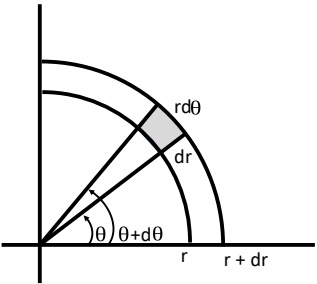

图 2.21：从极坐标到笛卡尔的变量变换。阴影区域的面积为 r dr dθ。改编自 [Ric95] 的图 3.16。

为了从几何角度理解这一点，注意到图 2.21 中阴影区域的面积由下式给出

$$  \Pr(r\leq R\leq r+dr,\theta\leq\Theta\leq\theta+d\theta)=p_{r,\theta}(r,\theta)drd\theta   \tag*{(2.160)}$$

在极限情况下，这等于该区域中心的密度乘以区域大小，即  $ r \, dr \, d\theta $。因此

$$  p_{r,\theta}(r,\theta)d r d\theta=p_{x_{1},x_{2}}(r\cos\theta,r\sin\theta)r d r d\theta   \tag*{(2.161)}$$

#### 2.8.4 线性变换的矩

假设 $f$ 是一个仿射函数，因此 $\boldsymbol{y} = \boldsymbol{A}\boldsymbol{x} + \boldsymbol{b}$。在这种情况下，我们可以轻松地推导出 $\boldsymbol{y}$ 的均值和协方差如下。首先，对于均值，我们有

$$  \mathbb{E}\left[y\right]=\mathbb{E}\left[\mathbf{A}x+b\right]=\mathbf{A}\mu+b   \tag*{(2.162)}$$

其中  $ \mu = \mathbb{E}[x] $。如果  $ f $ 是一个标量值函数，即  $ f(\boldsymbol{x}) = \boldsymbol{a}^\top \boldsymbol{x} + b $，相应的结果为

$$  \mathbb{E}\left[\boldsymbol{a}^{\top}\boldsymbol{x}+b\right]=\boldsymbol{a}^{\top}\boldsymbol{\mu}+b   \tag*{(2.163)}$$

对于协方差，我们有

$$  \mathrm{Cov}\left[\boldsymbol{y}\right]=\mathrm{Cov}\left[\boldsymbol{A}\boldsymbol{x}+\boldsymbol{b}\right]=\boldsymbol{A}\boldsymbol{\Sigma}\boldsymbol{A}^{\mathrm{T}}   \tag*{(2.164)}$$

其中  $ \Sigma = \text{Cov}[\boldsymbol{x}] $。我们将此证明留作练习。

作为一个特例，如果  $ y = \boldsymbol{a}^\top \boldsymbol{x} + b $，我们得到

$$  \mathbb{V}\left[y\right]=\mathbb{V}\left[\boldsymbol{a}^{\top}\boldsymbol{x}+b\right]=\boldsymbol{a}^{\top}\boldsymbol{\Sigma}\boldsymbol{a}   \tag*{(2.165)}$$

作者：Kevin P. Murphy。（C）MIT Press。CC-BY-NC-ND 许可协议。

---

<table border=1 style='margin: auto; word-wrap: break-word;'><tr><td style='text-align: center; word-wrap: break-word;'>-</td><td style='text-align: center; word-wrap: break-word;'>-</td><td style='text-align: center; word-wrap: break-word;'>1</td><td style='text-align: center; word-wrap: break-word;'>2</td><td style='text-align: center; word-wrap: break-word;'>3</td><td style='text-align: center; word-wrap: break-word;'>4</td><td style='text-align: center; word-wrap: break-word;'>-</td><td style='text-align: center; word-wrap: break-word;'>-</td><td style='text-align: center; word-wrap: break-word;'>-</td></tr><tr><td style='text-align: center; word-wrap: break-word;'>7</td><td style='text-align: center; word-wrap: break-word;'>6</td><td style='text-align: center; word-wrap: break-word;'>5</td><td style='text-align: center; word-wrap: break-word;'>-</td><td style='text-align: center; word-wrap: break-word;'>-</td><td style='text-align: center; word-wrap: break-word;'>-</td><td style='text-align: center; word-wrap: break-word;'>-</td><td style='text-align: center; word-wrap: break-word;'>-</td><td style='text-align: center; word-wrap: break-word;'>$ z_{0}=x_{0}y_{0}=5 $</td></tr><tr><td style='text-align: center; word-wrap: break-word;'>-</td><td style='text-align: center; word-wrap: break-word;'>7</td><td style='text-align: center; word-wrap: break-word;'>6</td><td style='text-align: center; word-wrap: break-word;'>5</td><td style='text-align: center; word-wrap: break-word;'>-</td><td style='text-align: center; word-wrap: break-word;'>-</td><td style='text-align: center; word-wrap: break-word;'>-</td><td style='text-align: center; word-wrap: break-word;'>-</td><td style='text-align: center; word-wrap: break-word;'>$ z_{1}=x_{0}y_{1}+x_{1}y_{0}=16 $</td></tr><tr><td style='text-align: center; word-wrap: break-word;'>-</td><td style='text-align: center; word-wrap: break-word;'>-</td><td style='text-align: center; word-wrap: break-word;'>7</td><td style='text-align: center; word-wrap: break-word;'>6</td><td style='text-align: center; word-wrap: break-word;'>5</td><td style='text-align: center; word-wrap: break-word;'>-</td><td style='text-align: center; word-wrap: break-word;'>-</td><td style='text-align: center; word-wrap: break-word;'>-</td><td style='text-align: center; word-wrap: break-word;'>$ z_{2}=x_{0}y_{2}+x_{1}y_{1}+x_{2}y_{0}=34 $</td></tr><tr><td style='text-align: center; word-wrap: break-word;'>-</td><td style='text-align: center; word-wrap: break-word;'>-</td><td style='text-align: center; word-wrap: break-word;'>-</td><td style='text-align: center; word-wrap: break-word;'>7</td><td style='text-align: center; word-wrap: break-word;'>6</td><td style='text-align: center; word-wrap: break-word;'>5</td><td style='text-align: center; word-wrap: break-word;'>-</td><td style='text-align: center; word-wrap: break-word;'>-</td><td style='text-align: center; word-wrap: break-word;'>$ z_{3}=x_{1}y_{2}+x_{2}y_{1}+x_{3}y_{0}=52 $</td></tr><tr><td style='text-align: center; word-wrap: break-word;'>-</td><td style='text-align: center; word-wrap: break-word;'>-</td><td style='text-align: center; word-wrap: break-word;'>-</td><td style='text-align: center; word-wrap: break-word;'>-</td><td style='text-align: center; word-wrap: break-word;'>7</td><td style='text-align: center; word-wrap: break-word;'>6</td><td style='text-align: center; word-wrap: break-word;'>5</td><td style='text-align: center; word-wrap: break-word;'>-</td><td style='text-align: center; word-wrap: break-word;'>$ z_{4}=x_{2}y_{2}+x_{3}y_{1}=45 $</td></tr><tr><td style='text-align: center; word-wrap: break-word;'>-</td><td style='text-align: center; word-wrap: break-word;'>-</td><td style='text-align: center; word-wrap: break-word;'>-</td><td style='text-align: center; word-wrap: break-word;'>-</td><td style='text-align: center; word-wrap: break-word;'>-</td><td style='text-align: center; word-wrap: break-word;'>7</td><td style='text-align: center; word-wrap: break-word;'>6</td><td style='text-align: center; word-wrap: break-word;'>5</td><td style='text-align: center; word-wrap: break-word;'>$ z_{5}=x_{3}y_{2}=28 $</td></tr></table>

表2.4：离散卷积，将 $\mathbf{x} = [1, 2, 3, 4]$ 与 $\mathbf{y} = [5, 6, 7]$ 进行卷积得到 $\mathbf{z} = [5, 16, 34, 52, 45, 28]$。一般地，$z_n = \sum_{k=-\infty}^{\infty} x_k y_{n-k}$。我们看到这一操作包括“翻转” $\mathbf{y}$，然后将其“拖拽”过 $\mathbf{x}$，逐元素相乘，并将结果相加。

例如，要计算两个标量随机变量之和的方差，我们可以设 $\boldsymbol{a} = [1, 1]$，得到

$$  \mathbb{V}\left[x_{1}+x_{2}\right]=\begin{pmatrix}1&1\end{pmatrix}\begin{pmatrix}\Sigma_{11}&\Sigma_{12}\\\Sigma_{21}&\Sigma_{22}\end{pmatrix}\begin{pmatrix}1\\1\end{pmatrix}   \tag*{(2.166)}$$

$$  =\Sigma_{11}+\Sigma_{22}+2\Sigma_{12}=\mathbb{V}\left[x_{1}\right]+\mathbb{V}\left[x_{2}\right]+2Cov\left[x_{1},x_{2}\right]   \tag*{(2.167)}$$

然而请注意，尽管某些分布（如高斯分布）完全由其均值和协方差刻画，但一般地，我们必须使用上述技术来推导y的完整分布。

#### 2.8.5 卷积定理

设 $ y = x_1 + x_2 $，其中 $ x_1 $ 和 $ x_2 $ 是独立随机变量。如果它们是离散随机变量，我们可以按如下方式计算和的概率质量函数(pmf)：

$$  p(y=j)=\sum_{k}p(x_{1}=k)p(x_{2}=j-k)   \tag*{(2.168)}$$

其中 $ j = \ldots, -2, -1, 0, 1, 2, \ldots $

如果 $ x_{1} $ 和 $ x_{2} $ 具有概率密度函数(pdf) $ p_{1}(x_{1}) $ 和 $ p_{2}(x_{2}) $，那么y的分布是什么？y的累积分布函数(cdf)由下式给出

$$  P_{y}(y^{*})=\Pr(y\leq y^{*})=\int_{-\infty}^{\infty}p_{1}(x_{1})\left[\int_{-\infty}^{y^{*}-x_{1}}p_{2}(x_{2})d x_{2}\right]d x_{1}   \tag*{(2.169)}$$

其中，我们在由 $ x_{1} + x_{2} < y^{*} $ 定义的区域 $R$ 上积分。因此，y的概率密度函数(pdf)为

$$  p(y)=\left[\frac{d}{d y^{*}}P_{y}(y^{*})\right]_{y^{*}=y}=\int p_{1}(x_{1})p_{2}(y-x_{1})d x_{1}   \tag*{(2.170)}$$

其中我们使用了积分号下求导法则（莱布尼茨法则）：

$$  \frac{d}{dx}\int_{a(x)}^{b(x)}f(t)dt=f(b(x))\frac{db(x)}{dx}-f(a(x))\frac{da(x)}{dx}   \tag*{(2.171)}$$