

问题的核心在于模型拥有足够多的参数来完美拟合观测到的训练数据，因此它能够完美匹配经验分布。然而，在大多数情况下，经验分布与真实分布并不相同，因此将所有概率质量集中在观测到的 \( N \) 个样本上，将不会为未来的新数据留下任何概率。也就是说，模型可能无法泛化。

解决过拟合的主要方法是使用正则化，即在负对数似然（NLL，Negative Log-Likelihood）或经验风险中添加一个惩罚项。因此，我们优化如下形式的目标函数：

$$  \mathcal{L}(\boldsymbol{\theta};\lambda)=\left[\frac{1}{N}\sum_{n=1}^{N}\ell(\boldsymbol{y}_{n},\boldsymbol{\theta};\boldsymbol{x}_{n})\right]+\lambda C(\boldsymbol{\theta})   \tag*{(4.89)}$$

其中 \(\lambda \geq 0\) 是正则化参数，\(C(\boldsymbol{\theta})\) 是某种形式的复杂度惩罚项。

一种常见的复杂度惩罚项是使用 \( C(\boldsymbol{\theta}) = -\log p(\boldsymbol{\theta}) \)，其中 \( p(\boldsymbol{\theta}) \) 是 \(\boldsymbol{\theta}\) 的先验。如果 \(\ell\) 是对数损失函数，则正则化后的目标函数变为：

$$  \mathcal{L}(\boldsymbol{\theta};\lambda)=-\frac{1}{N}\sum_{n=1}^{N}\log p(\boldsymbol{y}_{n}|\boldsymbol{x}_{n},\boldsymbol{\theta})-\lambda\log p(\boldsymbol{\theta})   \tag*{(4.90)}$$

通过设置 \( \lambda = 1 \) 并适当缩放 \( p(\boldsymbol{\theta}) \)，我们可以等价地最小化以下表达式：

$$  \mathcal{L}(\boldsymbol{\theta};\lambda)=-\left[\sum_{n=1}^{N}\log p(\boldsymbol{y}_{n}|\boldsymbol{x}_{n},\boldsymbol{\theta})+\log p(\boldsymbol{\theta})\right]=-[\log p(\mathcal{D}|\boldsymbol{\theta})+\log p(\boldsymbol{\theta})]   \tag*{(4.91)}$$

这等价于最大化对数后验：

$$  \hat{\boldsymbol{\theta}}=\underset{\boldsymbol{\theta}}{\operatorname{argmax}}\log p(\boldsymbol{\theta}|\mathcal{D})=\underset{\boldsymbol{\theta}}{\operatorname{argmax}}\left[\log p(\mathcal{D}|\boldsymbol{\theta})+\log p(\boldsymbol{\theta})-const\right]   \tag*{(4.92)}$$

这被称为 **最大后验估计**（MAP estimation, maximum a posteriori estimation）。

#### 4.5.1 示例：伯努利分布的 MAP 估计

再次考虑抛硬币的例子。如果只观测到一次正面，MLE（最大似然估计）的结果是 \(\theta_{\text{mle}} = 1\)，这将预测未来所有抛硬币的结果都是正面。为了避免这种过拟合，我们可以对 \(\theta\) 添加一个惩罚项，以抑制“极端”值（如 \(\theta = 0\) 或 \(\theta = 1\)）。我们可以通过使用 Beta 分布作为先验来实现这一点：\( p(\theta) = \text{Beta}(\theta | a, b) \)，其中 \( a, b > 1 \) 会鼓励 \(\theta\) 的值接近 \( a/(a + b) \)（详见第 2.7.4 节）。对数似然加上对数先验变为：

$$  \begin{align*}\ell(\theta)&=\log p(\mathcal{D}|\theta)+\log p(\theta)\\&=[N_{1}\log\theta+N_{0}\log(1-\theta)]+[(a-1)\log(\theta)+(b-1)\log(1-\theta)]\end{align*}   \tag*{(4.93)}$$

使用第 4.2.3 节的方法，我们发现 MAP 估计为：

$$  \theta_{map}=\frac{N_{1}+a-1}{N_{1}+N_{0}+a+b-2}   \tag*{(4.95)}$$

作者：Kevin P. Murphy。 (C) MIT Press. CC-BY-NC-ND 许可协议。

---

如果我们设 a = b = 2（这会轻微偏向于接近 0.5 的 $ \theta $ 值），则估计值变为

$$  \theta_{map}=\frac{N_{1}+1}{N_{1}+N_{0}+2}   \tag*{(4.96)}$$

这被称为加一平滑，是一种简单但广泛使用的避免零计数问题的技术。（另请参见第 4.6.2.9 节。）

零计数问题以及更一般的过拟合问题，类似于哲学中被称为黑天鹅悖论的问题。这基于古老的西方观念，即所有天鹅都是白色的。在这个背景下，黑天鹅被用来比喻不可能存在的事物。（17 世纪欧洲探险家在 Australia 发现了黑天鹅。）术语“黑天鹅悖论”最早由著名科学哲学家 Karl Popper 提出；该术语也成为了最近一本畅销书 [Tal07] 的书名。这个悖论被用来说明归纳问题，即如何从过去的特定观察中得出关于未来的一般结论。这个悖论的解决方案是承认归纳法在一般情况下是不可能的，我们能做的最好的事情就是结合经验数据和先验知识，对未来可能发生的情况做出合理的猜测。

#### 4.5.2 示例：多元高斯的 MAP 估计  $ * $

在第 4.2.6 节中，我们展示了 MVN 均值的 MLE 是经验均值， $ \hat{\mu}_{\text{mle}} = \overline{y} $。我们还展示了协方差的 MLE 是经验协方差， $ \hat{\Sigma} = \frac{1}{N} S_{\overline{y}} $。

在高维情况下， $ \Sigma $ 的估计容易变得奇异。一个解决方案是进行 MAP 估计，如下所述。

##### 4.5.2.1 收缩估计

 $ \Sigma $ 的一个方便的共轭先验是逆 Wishart 先验。这是一个定义在正定矩阵上的分布，其参数由先验散布矩阵 $ \breve{S} $ 和先验样本量或强度 $ \breve{N} $ 确定。可以证明，得到的 MAP 估计为

$$  \hat{\mathbf{\Sigma}}_{\mathrm{map}}=\frac{\breve{\mathbf{S}}+\mathbf{S}_{\overline{y}}}{\breve{N}+N}=\frac{\breve{N}}{\breve{N}+N}\frac{\breve{\mathbf{S}}}{\breve{N}}+\frac{N}{\breve{N}+N}\frac{\mathbf{S}_{\overline{y}}}{N}=\lambda\mathbf{\Sigma}_{0}+(1-\lambda)\hat{\mathbf{\Sigma}}_{\mathrm{m l e}}   \tag*{(4.97)}$$

其中 $ \lambda = \frac{\breve{N}}{\breve{N} + N} $ 控制正则化程度。

先验散布矩阵的一个常见选择（例如参见 [FR07, p6]）是使用 $ \check{\mathbf{S}}=\check{N} $  $ \text{diag}(\hat{\mathbf{\Sigma}}_{\text{mle}}) $。通过这一选择，我们得到 $ \Sigma $ 的 MAP 估计为

$$  \hat{\mathbf{\Sigma}}_{\mathrm{map}}(i,j)=\left\{\begin{array}{ll}\hat{\mathbf{\Sigma}}_{\mathrm{mle}}(i,j)&if i=j\\ (1-\lambda)\hat{\mathbf{\Sigma}}_{\mathrm{mle}}(i,j)&otherwise\end{array}\right.   \tag*{(4.98)}$$

因此我们看到，对角线元素等于它们的 ML 估计，而非对角线元素则向 0“收缩”了一定程度。因此这种技术被称为收缩估计。

另一个需要设置的参数是 $ \lambda $，它控制正则化程度（向 MLE 收缩）。通常通过交叉验证（第 4.5.5 节）来设置 $ \lambda $。或者，我们可以使用 [LW04a; LW04b; SS05] 中提供的闭式公式，该公式是最优的

---

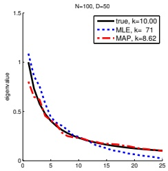

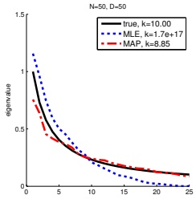

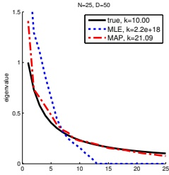

图 4.4：使用 $N \in \{100, 50, 25\}$ 个样本在 $D = 50$ 维空间中估计协方差矩阵。我们按降序绘制了真实协方差矩阵（黑色实线）、MLE（蓝色虚线）和MAP估计（红色虚线）的特征值，其中MAP估计使用了式(4.98)且 $\lambda = 0.9$。图例中还列出了每个矩阵的条件数。可以看出，MLE通常条件数较差，而MAP估计在数值上表现良好。改编自[SS05]的图1。由 shrinkcov plots 生成。

如果我们使用平方损失，这便是频率派估计。该估计在 sklearn 函数 https://scikit-learn.org/stable/modules/generated/sklearn.covariance.LedoitWolf.html 中实现。

这种方法的好处如图 4.4 所示。我们考虑将 50 维高斯分布拟合到 N = 100、N = 50 和 N = 25 个数据点上。可以看出，与 MLE 不同（关于条件数的讨论见第 7.1.4.4 节），MAP 估计始终是良态的。特别地，MAP 估计的特征值谱比 MLE 的特征值谱更接近真实矩阵的特征值谱，但特征向量不受影响。

#### 4.5.3 示例：权重衰减

在图 1.7 中，我们看到多项式回归次数过高会导致过拟合。一种解决方法是降低多项式的次数，但更通用的方法是对权重（回归系数）的大小进行惩罚。我们可以通过使用零均值高斯先验 $ p(\mathbf{w}) $ 来实现。由此得到的 MAP 估计为

$$  \hat{\boldsymbol{w}}_{\mathrm{map}}=\underset{\boldsymbol{w}}{\arg\min}\mathrm{N L L}(\boldsymbol{w})+\lambda||\boldsymbol{w}||_{2}^{2}   \tag*{(4.99)}$$

其中 $ \|w\|_{2}^{2}=\sum_{d=1}^{D}w_{d}^{2} $。（这里我们使用 $ \boldsymbol{w} $ 而不是 $ \boldsymbol{\theta} $，因为对权重向量的大小进行惩罚才有意义，而对偏置项或噪声方差等其他参数进行惩罚则不然。）

式 (4.99) 称为 $\ell_2$ 正则化或权重衰减。$\lambda$ 的值越大，参数因“过大”（偏离零均值先验）而受到的惩罚就越重，因此模型的灵活性也就越低。

在线性回归中，这种惩罚方案称为岭回归。例如，考虑第 1.2.2.2 节的多项式回归示例，其中预测器形式为

$$  f(x;\boldsymbol{w})=\sum_{d=0}^{D}w_{d}x^{d}=\boldsymbol{w}^{\mathsf{T}}[1,x,x^{2},\ldots,x^{D}]   \tag*{(4.100)}$$

作者：Kevin P. Murphy。(C) MIT 出版社。CC-BY-NC-ND 许可协议。

---

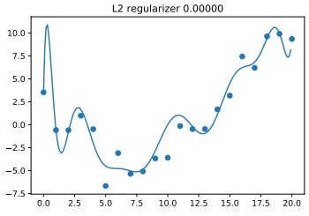

 $ (a) $

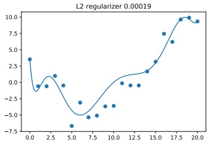

(b)

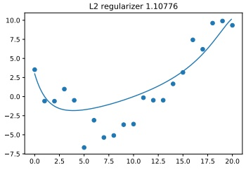

(c)

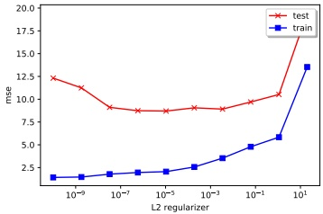

(d)

图4.5: (a-c) 岭回归应用于21个数据点的14次多项式拟合。(d) 均方误差(MSE)与正则化强度的关系。正则化程度从左到右增加，因此模型复杂度从左到右降低。由 linreg_poly_ridge.ipynb 生成。

假设我们使用一个高次多项式，例如 $D = 14$，尽管我们仅有一个包含 $N = 21$ 个样本的小数据集。参数的 MLE（最大似然估计）将使模型通过仔细调整权重来很好地拟合数据，但得到的函数非常“曲折”，从而导致过拟合。图4.5展示了增大 $\lambda$ 如何减少过拟合。关于岭回归的更多细节，请参见第11.3节。

#### 4.5.4 使用验证集选择正则化器

使用正则化时的一个关键问题是如何选择正则化强度 $\lambda$：较小的值意味着我们将专注于最小化经验风险，这可能导致过拟合；而较大的值意味着我们将专注于接近先验，这可能导致欠拟合。

在本节中，我们介绍一种简单但非常广泛使用的选择 $\lambda$ 的方法。基本思想是将数据划分为两个不相交的集合：训练集 $\mathcal{D}_{\text{train}}$ 和验证集 $\mathcal{D}_{\text{valid}}$（也称为开发集）。（通常我们使用大约80%的数据作为训练集，而

---

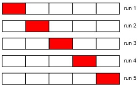

图 4.6: 5 折交叉验证示意图。

（验证集占 20%。）我们在 $\mathcal{D}_{\text{train}}$ 上拟合模型（针对每个 $\lambda$ 设置），然后在 $\mathcal{D}_{\text{valid}}$ 上评估其性能。然后选择使得验证性能最佳的 $\lambda$ 值。（这种优化方法是网格搜索的一维示例，详见第 8.8 节。）

为了更详细地解释该方法，我们需要一些符号。定义数据集上的正则化经验风险如下：

$$ R_{\lambda}(\boldsymbol{\theta},\mathcal{D})=\frac{1}{|\mathcal{D}|}\sum_{(\mathbf{x},\mathbf{y})\in\mathcal{D}}\ell(\mathbf{y},f(\mathbf{x};\boldsymbol{\theta}))+\lambda C(\boldsymbol{\theta}) \tag*{(4.101)} $$

对于每个 $\lambda$，我们计算参数估计：

$$ \hat{\boldsymbol{\theta}}_{\lambda}(\mathcal{D}_{train})=\underset{\boldsymbol{\theta}}{\arg\min}R_{\lambda}(\boldsymbol{\theta},\mathcal{D}_{train}) \tag*{(4.102)} $$

然后计算验证风险：

$$ R_{\lambda}^{\mathrm{v a l}}\triangleq R_{0}(\hat{\pmb{\theta}}_{\lambda}(\mathcal{D}_{\mathrm{t r a i n}}),\mathcal{D}_{\mathrm{v a l i d}}) \tag*{(4.103)} $$

这是对总体风险的估计，总体风险是在真实分布 $p^{*}(\boldsymbol{x}, \boldsymbol{y})$ 下的期望损失。最后我们选择：

$$ \lambda^{*}=\underset{\lambda\in\mathcal{S}}{\mathrm{a r g m i n}}R_{\lambda}^{\mathrm{v a l}} \tag*{(4.104)} $$

（这需要对 $\mathcal{S}$ 中的每个 $\lambda$ 值拟合一次模型，但在某些情况下可以更高效地完成。）

选取 $\lambda^*$ 后，我们可以在整个数据集 $\mathcal{D} = \mathcal{D}_{\text{train}} \cup \mathcal{D}_{\text{valid}}$ 上重新拟合模型，得到：

$$ \hat{\boldsymbol{\theta}}^{*}=\underset{\boldsymbol{\theta}}{\operatorname{a r g m i n}}R_{\lambda^{*}}(\boldsymbol{\theta},\mathcal{D}) \tag*{(4.105)} $$

#### 4.5.5 交叉验证

第 4.5.4 节中的技术效果非常好。然而，如果训练集规模较小，留出 20% 作为验证集可能会导致模型参数估计不可靠。

作者：Kevin P. Murphy. (C) MIT Press. CC-BY-NC-ND 许可证

---

一种简单但流行的解决方案是使用交叉验证（CV）。其思想如下：我们将训练数据分为 \( K \) 折；然后，对于每一折 \( k \in \{1, \ldots, K\} \)，我们以循环方式在所有折上训练，但排除第 \( k \) 折，并在第 \( k \) 折上测试，如图 4.6 所示。形式上，我们有

$$ R_{\lambda}^{\mathrm{c v}}\triangleq\frac{1}{K}\sum_{k=1}^{K}R_{0}(\hat{\boldsymbol{\theta}}_{\lambda}(\mathcal{D}_{-k}),\mathcal{D}_{k}) \tag*{(4.106)} $$

其中 \( \mathcal{D}_k \) 是第 \( k \) 折中的数据，而 \( \mathcal{D}_{-k} \) 是所有其他数据。这被称为交叉验证风险。图 4.6 展示了 \( K = 5 \) 时的这一过程。如果我们将 \( K = N \)，则得到一种称为**留一交叉验证**的方法，因为我们总是在 \( N - 1 \) 个样本上训练，并在剩余的一个样本上测试。

我们可以将 CV 估计值作为优化过程中的目标函数，以选择最优超参数 \( \hat{\lambda} = \argmin_{\lambda} R_{\lambda}^{\mathrm{cv}} \)。最后，我们合并所有可用数据（训练集和验证集），并使用 \( \hat{\boldsymbol{\theta}} = \argmin_{\boldsymbol{\theta}} R_{\hat{\lambda}}(\boldsymbol{\theta}, \mathcal{D}) \) 重新估计模型参数。更多细节参见 5.4.3 节。

##### 4.5.5.1 一倍标准误规则

CV 给出了 \( \hat{R}_\lambda \) 的估计值，但未提供任何不确定性度量。估计值不确定性的一个标准频率学派度量是**均值的标准误**，即估计值抽样分布的均值（参见 4.7.1 节）。我们可以按如下方式计算。首先，令 \( L_n = \ell(\mathbf{y}_n, f(\mathbf{x}_n; \hat{\boldsymbol{\theta}}_n(\mathcal{D}_{-n}))) \) 为第 \( n \) 个样本上的损失，其中我们使用从排除第 \( n \) 个样本的训练折中估计出的参数。（注意，\( L_n \) 依赖于 \( \lambda \)，但我们在符号中省略了这一点。）然后，令 \( \hat{\mu} = \frac{1}{N} \sum_{n=1}^N L_n \) 为经验均值，\( \hat{\sigma}^2 = \frac{1}{N} \sum_{n=1}^N (L_n - \hat{\mu})^2 \) 为经验方差。据此，我们定义估计值为 \( \hat{\mu} \)，该估计值的标准误为 \( \text{se}(\hat{\mu}) = \frac{\hat{\sigma}}{\sqrt{N}} \)。注意，\( \sigma \) 衡量的是不同样本间 \( L_n \) 的内在变异性，而 \( \text{se}(\hat{\mu}) \) 衡量的是我们关于均值 \( \hat{\mu} \) 的不确定性。

假设我们将 CV 应用于一组模型，并计算其估计风险的平均值和标准误。从这些带噪声的估计值中选择模型的一个常见启发式方法是：选择最简模型，其风险不超过最佳模型风险的一倍标准误；这称为**一倍标准误规则** [HTF01, p216]。

##### 4.5.5.2 示例：岭回归

作为一个示例，考虑为 4.5.3 节中的岭回归问题选择 \( \ell_2 \) 正则化项的强度。在图 4.7a 中，我们绘制了在训练集（蓝色）和测试集（红色曲线）上误差随 \( \log(\lambda) \) 的变化。我们看到测试误差呈 U 形曲线：随着正则化增强，误差先下降，然后随着开始欠拟合而上升。在图 4.7b 中，我们绘制了测试 MSE 的 5 折 CV 估计值随 \( \log(\lambda) \) 的变化。我们看到最小 CV 误差接近测试集的最优值（尽管由于样本量较小，它低估了 \( \lambda \) 较大时测试误差的尖峰）。

#### 4.5.6 早停法

一种非常简单的正则化形式，在实践中（尤其是对于复杂模型）通常非常有效，称为**早停法**。这利用了这样一个事实：优化算法

---

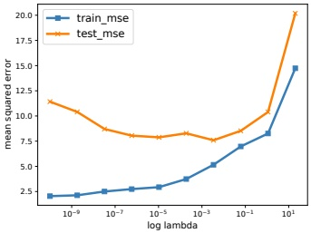

 $ (a) $

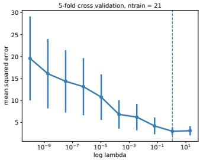

(b)

图 4.7：对图 4.5 中显示的 21 个数据点进行 14 次多项式拟合，并应用不同正则化参数 $\lambda$ 的岭回归。从左到右正则化程度增加，因此模型复杂度从左到右降低。(a) 训练集（蓝色）和测试集（红色）上的均方误差（MSE）随 $\log(\lambda)$ 的变化。(b) 使用 5 折交叉验证估计的测试 MSE；误差棒表示均值的标准误差。垂直线由“一倍标准误差规则”选定。由 polyfitRidgeCV.ipynb 生成。

迭代的优化过程需要许多步骤才能从初始参数估计中移动出来。如果检测到过拟合的迹象（通过监控验证集上的性能），我们可以停止优化过程，以防止模型记住训练集中的过多信息。如图 4.8 所示。

#### 4.5.7 使用更多数据

随着数据量的增加，过拟合的可能性（对于固定复杂度的模型）会降低（假设数据包含足够信息量的样本，并且没有过多冗余）。图 4.9 说明了这一点。我们展示了四种不同模型（阶数递增的多项式）在训练集和测试集上的均方误差（MSE）作为训练集大小 N 的函数。（误差随训练集大小的变化图称为学习曲线。）水平黑线表示贝叶斯误差，即最优预测器（真实模型）由固有噪声引起的误差。（在本例中，真实模型是二次多项式，噪声方差为 $\sigma^2 = 4$；这被称为噪声下限，因为我们无法低于该值。）

我们观察到几个有趣的现象。首先，即使 N 增加，阶数为 1 的测试误差仍然较高，因为该模型过于简单，无法捕捉真实情况；这被称为欠拟合。其他模型的测试误差减少到最优水平（噪声下限），但更简单的模型下降得更快，因为它们需要估计的参数更少。对于更复杂的模型，测试误差与训练误差之间的差距更大，但随着 N 的增长而减小。

另一个有趣的现象是，训练误差（蓝色线）最初随 N 增加而增加，至少对于足够灵活的模型是如此。其原因如下：随着数据集变大，我们观察到更多不同的输入-输出模式组合，因此拟合数据的任务变得更加困难。然而，最终训练集将变得类似于测试集，并且

作者：Kevin P. Murphy。(C) MIT Press。CC-BY-NC-ND 许可协议

---

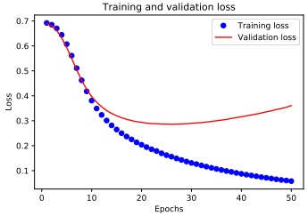

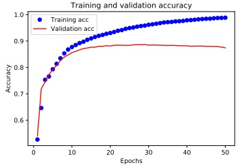

图4.8：在IMDB电影情感数据集上，文本分类器（使用平均池化对词嵌入袋进行处理的神经网络）的性能随训练轮次的变化。蓝色=训练集，红色=验证集。(a) 交叉熵损失。早停大约在第25个epoch触发。(b) 分类准确率。由imdb_mlp_bow_tf.ipynb生成。

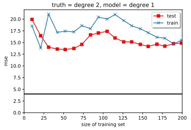

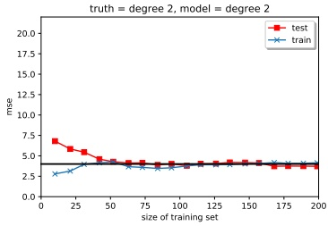

 $ (a) $

(b)

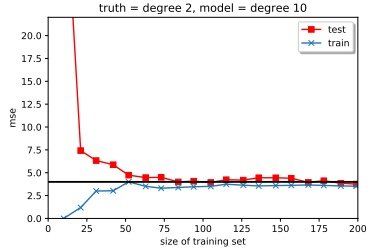

(c)

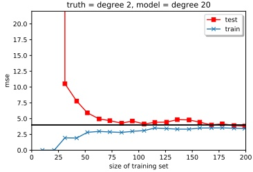

(d)

图4.9：对于从方差为 $ \sigma^2 = 4 $ 的高斯噪声的二次多项式生成的数据，训练集和测试集上的MSE随训练集大小的变化。我们对这些数据拟合了不同次数的多项式模型。由linreg_poly_vs_n.ipynb生成。

---

误差率将收敛，并反映该模型的最优性能。

### 4.6 贝叶斯统计 *

到目前为止，我们已经讨论了几种从数据中估计参数的方法。然而，这些方法忽略了估计值中的不确定性，而后者在某些应用中可能很重要，例如主动学习、避免过拟合，或者只是想知道在多大程度上信任某个具有科学意义的量值的估计。在统计中，使用概率分布（而非仅仅计算点估计）对参数的不确定性进行建模，被称为**推断**。

在本节中，我们使用后验分布来表示不确定性。这是贝叶斯统计领域所采用的方法。我们在此做简要介绍，更详细的内容可参见本书的续篇 [Mur23] 以及其他优秀著作，如 [Lam18; Kru15; McE20; Gel+14; MKL21; MFR20]。

为了计算后验，我们从一个**先验**分布 \(p(\boldsymbol{\theta})\) 开始，它反映了我们在看到数据之前所知道的信息。然后定义一个似然函数 \(p(\mathcal{D}|\boldsymbol{\theta})\)，它反映了对于参数的每种设定，我们预期看到的数据。接着，我们使用贝叶斯规则，基于观测数据对先验进行条件化，从而计算后验 \(p(\boldsymbol{\theta}|\mathcal{D})\)，如下所示：

$$ p(\boldsymbol{\theta}|\mathcal{D})=\frac{p(\boldsymbol{\theta})p(\mathcal{D}|\boldsymbol{\theta})}{p(\mathcal{D})}=\frac{p(\boldsymbol{\theta})p(\mathcal{D}|\boldsymbol{\theta})}{\int p(\boldsymbol{\theta}^{\prime})p(\mathcal{D}|\boldsymbol{\theta}^{\prime})d\boldsymbol{\theta}^{\prime}} \tag*{(4.107)}$$

分母 \(p(\mathcal{D})\) 称为**边际似然**，因为它通过对未知 \(\theta\) 进行边际化（或积分）计算得出。这可以解释为数据平均概率，该平均值是相对于先验而言的。但请注意，\(p(\mathcal{D})\) 是一个常数，与 \(\theta\) 无关，因此当我们仅想推断不同 \(\theta\) 值的相对概率时，通常会忽略它。

方程 (4.107) 类似于第 2.3.1 节中用于 COVID-19 检测的贝叶斯规则。区别在于，这里的未知量对应的是统计模型的参数，而不是患者未知的患病状态。此外，我们通常以一组观测值 D 为条件，而非单个观测值（例如单个检测结果）。具体来说，对于监督或条件模型，观测数据的形式为 \(\mathcal{D} = \{(\boldsymbol{x}_n, \boldsymbol{y}_n) : n = 1 : N\}\)。对于无监督或无条件模型，观测数据的形式为 \(\mathcal{D} = \{(\boldsymbol{y}_n) : n = 1 : N\}\)。

一旦我们计算出参数的后验，就可以通过边际化未知参数，计算出给定输入时输出的后验预测分布。在监督/条件情况下，这变为：

$$ p(\boldsymbol{y}|\boldsymbol{x},\mathcal{D})=\int p(\boldsymbol{y}|\boldsymbol{x},\boldsymbol{\theta})p(\boldsymbol{\theta}|\mathcal{D})d\boldsymbol{\theta} \tag*{(4.108)}$$

这可以被视为一种**贝叶斯模型平均 (BMA)**，因为我们使用无限个模型（参数值）集合进行预测，每个模型按其可能性大小加权。使用 BMA 降低了过拟合的风险（第 1.2.3 节），因为我们并非仅使用单一的最佳模型。

#### 4.6.1 共轭先验

在本节中，我们考虑一组（先验，似然）对，使得我们能够以闭式形式计算后验。具体来说，我们将使用与似然“共轭”的先验。

---

如果后验分布与先验分布属于同一参数化族，即 $p(\boldsymbol{\theta}|\mathcal{D}) \in \mathcal{F}$，则先验 $p(\boldsymbol{\theta}) \in \mathcal{F}$ 是似然函数 $p(\mathcal{D}|\boldsymbol{\theta})$ 的共轭先验。换句话说，$\mathcal{F}$ 在贝叶斯更新下是封闭的。若族 $\mathcal{F}$ 对应于指数族（在第 3.4 节中定义），则计算可以闭式进行。

在下面的小节中，我们将给出该框架的一些常见示例，这些示例将在本书后续内容中使用。为简单起见，我们专注于无条件模型（即只有结果或目标 y，没有输入或特征 x）；我们将在第 4.6.7 节中放宽这一假设。

#### 4.6.2 Beta-二项模型

假设我们抛一枚硬币 $N$ 次，希望推断出现正面的概率。令 $y_n = 1$ 表示第 $n$ 次试验结果为正面，$y_n = 0$ 表示第 $n$ 次试验结果为反面，并令 $\mathcal{D} = \{y_n : n = 1 : N\}$ 为所有数据。我们假设 $y_n \sim \mathrm{Ber}(\theta)$，其中 $\theta \in [0, 1]$ 是成功率参数（出现正面的概率）。在本节中，我们讨论如何计算 $p(\theta|\mathcal{D})$。

##### 4.6.2.1 伯努利似然

我们假设数据是 $\underline{\text{iid}}$（独立同分布）的。因此似然函数的形式为

$$  p(\mathcal{D}|\theta)=\prod_{n=1}^{N}\theta^{y_{n}}(1-\theta)^{1-y_{n}}=\theta^{N_{1}}(1-\theta)^{N_{0}}   \tag*{(4.109)}$$

其中我们定义了 $ N_1 = \sum_{n=1}^{\infty} \mathbb{1}(y_n = 1) $ 和 $ N_0 = \sum_{n=1}^{\infty} \mathbb{1}(y_n = 0) $，分别表示正面和反面的次数。这些计数称为数据的充分统计量，因为这是推断 $\theta$ 所需了解的 $\mathcal{D}$ 的所有信息。总计数 $ N = N_0 + N_1 $ 称为样本量。

##### 4.6.2.2 二项似然

注意，我们也可以考虑一个二项似然模型，在该模型中我们执行 N 次试验并观察到正面次数 y，而不是观察到一系列抛硬币的结果。此时似然函数形式如下：

$$  p(\mathcal{D}|\theta)=\mathrm{B i n}(y|N,\theta)=\binom{N}{y}\theta^{y}(1-\theta)^{N-y}   \tag*{(4.110)}$$

缩放因子 $\binom{N}{y}$ 与 $\theta$ 无关，因此我们可以忽略它。因此该似然与方程 (4.109) 中的伯努利似然成正比，所以我们对 $\theta$ 的推断对于两个模型将是相同的。

##### 4.6.2.3 先验

为简化计算，我们将假设先验 $p(\boldsymbol{\theta}) \in \mathcal{F}$ 是似然函数 $p(\boldsymbol{y}|\boldsymbol{\theta})$ 的共轭先验。这意味着后验分布与先验分布属于同一参数化族，即 $p(\boldsymbol{\theta}|\mathcal{D}) \in \mathcal{F}$。

---

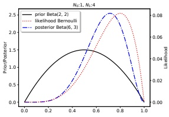

(a)

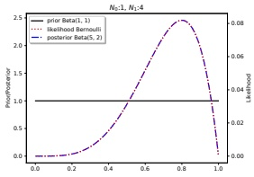

(b)

图 4.10：使用充分统计量 $ N_{1}=4, N_{0}=1 $ 的伯努利似然更新 Beta 先验。(a) Beta(2,2)先验。(b) 均匀 Beta(1,1)先验。由 beta_binom_post_plot.ipynb 生成。

为了在使用伯努利（或二项）似然时确保这一性质，应采用如下形式的先验：

$$  p(\theta)\propto\theta^{\breve{\alpha}-1}(1-\theta)^{\breve{\beta}-1}\propto\mathrm{Beta}(\theta|\breve{\alpha},\breve{\beta})   \tag*{(4.111)}$$

我们识别出这是 Beta 分布的概率密度函数（见第 2.7.4 节）。

##### 4.6.2.4 后验

将公式 (4.109) 中的伯努利似然与公式 (2.136) 中的 Beta 先验相乘，得到 Beta 后验：

$$  p(\theta|\mathcal{D})\propto\theta^{N_{1}}(1-\theta)^{N_{0}}\theta^{\alpha-1}(1-\theta)^{\widetilde{\beta}-1}   \tag*{(4.112)}$$

$$  \propto Beta(\theta|\ \breve{\alpha}+N_{1},\breve{\beta}+N_{0})   \tag*{(4.113)}$$

$$  =\mathrm{Beta}(\theta|\hat{\alpha},\hat{\beta})   \tag*{(4.114)}$$

其中，$ \widehat{\alpha}^{\triangle}\check{\alpha} + N_{1} $ 和 $ \widehat{\beta}^{\triangle}\check{\beta} + N_{0} $ 为后验的参数。由于后验与先验具有相同的函数形式，我们称 Beta 分布是伯努利似然的共轭先验。

先验的参数称为超参数。显然（在本例中），超参数起到类似于充分统计量的作用；因此，它们通常被称为伪计数。我们看到，只需将观察到的计数（来自似然）与伪计数（来自先验）相加，即可计算后验。

先验的强度由 $ N = \bar{\alpha} + \beta $ 控制；这称为等效样本量，因为它起到类似于观察样本量 $ N = N_0 + N_1 $ 的作用。

##### 4.6.2.5 示例

例如，假设我们设 $ \check{\alpha}=\check{\beta}=2 $。这相当于说，在看到实际数据之前，我们认为已经看到了两次正面和两次反面；这是对 $ \theta=0.5 $ 的非常弱的偏好。

---

使用该先验的效果如图4.10a所示。我们可以看到后验（蓝色线）是先验（红色线）与似然（黑色线）之间的“折中”。

若设定 $ \tilde{\alpha} = \tilde{\beta} = 1 $，则对应的先验变为均匀分布：

$$  p(\theta)=\operatorname{Beta}(\theta|1,1)\propto\theta^{0}(1-\theta)^{0}=\operatorname{Unif}(\theta|0,1)   \tag*{(4.115)}$$

使用该先验的效果如图4.10b所示。由于先验是“无信息的”，我们看到后验与似然具有完全相同的形状。

##### 4.6.2.6 后验众数（最大后验估计）

参数的最可能值由最大后验估计（MAP estimate）给出：

$$  \hat{\theta}_{\mathrm{m a p}}=\arg\max_{\theta}p(\theta|\mathcal{D})   \tag*{(4.116)}$$

$$  =\arg\max_{\theta}\log p(\theta|\mathcal{D})   \tag*{(4.117)}$$

$$  =\arg\max_{\theta}\log p(\theta)+\log p(\mathcal{D}|\theta)   \tag*{(4.118)}$$

通过微积分可以证明，该估计由下式给出：

$$  \hat{\theta}_{map}=\frac{\breve{\alpha}+N_{1}-1}{\breve{\alpha}+N_{1}-1+\breve{\beta}+N_{0}-1}   \tag*{(4.119)}$$

如果使用 Beta(θ|2,2) 先验，这相当于加一平滑（add-one smoothing）：

$$  \hat{\theta}_{map}=\frac{N_{1}+1}{N_{1}+1+N_{0}+1}=\frac{N_{1}+1}{N+2}   \tag*{(4.120)}$$

如果使用均匀先验 p(θ) ∝ 1，则由于 log p(θ) = 0，最大后验估计退化为最大似然估计（MLE）：

$$  \hat{\theta}_{\mathrm{m l e}}=\arg\max_{\theta}\log p(\mathcal{D}|\theta)   \tag*{(4.121)}$$

当使用 Beta 先验时，均匀分布对应于 $ \bar{\alpha}=\bar{\beta}=1 $。此时，最大后验估计简化为最大似然估计：

$$  \hat{\theta}_{mle}=\frac{N_{1}}{N_{1}+N_{0}}=\frac{N_{1}}{N}   \tag*{(4.122)}$$

如果 $ N_1 = 0 $，我们将估计 $ p(Y = 1) = 0.0 $，这意味着我们预测未来的任何观测都不会为 1。这是一个非常极端的估计，很可能由数据不足导致。我们可以通过使用更强的先验进行最大后验估计，或采用完全贝叶斯方法（如第4.6.2.9节所述，对 $ \theta $ 进行边缘化而非直接估计）来解决此问题。

##### 4.6.2.7 后验均值

后验众数可能不是后验的良好摘要，因为它仅对应一个单点。后验均值是更稳健的估计，因为它在整个空间上进行了积分。

---

如果 $p(\theta|\mathcal{D}) = \mathrm{Beta}(\theta|\hat{\alpha},\hat{\beta})$，则后验均值由下式给出

$$ \overline{{\theta}}\triangleq\mathbb{E}\left[\theta|\mathcal{D}\right]=\frac{\widehat{\alpha}}{\widehat{\beta}+\widehat{\alpha}}=\frac{\widehat{\alpha}}{\widehat{N}} \tag*{(4.123)}$$

其中 $\widehat{N}=\widehat{\beta}+\widehat{\alpha}$ 是后验的强度（等效样本量）。

现在我们将证明后验均值是先验均值 $m = \tilde{\alpha} / \tilde{N}$（其中 $\tilde{N} \triangleq \tilde{\alpha} + \tilde{\beta}$ 是先验强度）与 MLE：$\hat{\theta}_{\text{mle}} = \frac{N_1}{N}$ 的凸组合：

$$ \mathbb{E}\left[\theta|\mathcal{D}\right]=\frac{\breve{\alpha}+N_{1}}{\breve{\alpha}+N_{1}+\breve{\beta}+N_{0}}=\frac{\breve{N}m+N_{1}}{N+\breve{N}}=\frac{\breve{N}}{N+\breve{N}}m+\frac{N}{N+\breve{N}}\frac{N_{1}}{N}=\lambda m+(1-\lambda)\hat{\theta}_{\mathrm{m l e}} \tag*{(4.124)}$$

其中 $\lambda = \frac{\overline{N}}{\overline{N}}$ 是先验与后验等效样本量之比。因此，先验越弱，$\lambda$ 就越小，后验均值也就越接近 MLE。

##### 4.6.2.8 后验方差

为了捕捉估计中的不确定性，一种常见的方法是计算估计的标准误，即后验标准差：

$$ \mathrm{s e}(\theta)=\sqrt{\mathbb{V}\left[\theta|\mathcal{D}\right]} \tag*{(4.125)}$$

对于伯努利模型，我们已证明后验分布为 Beta 分布。Beta 后验的方差由下式给出

$$ \mathbb{V}\left[\theta|\mathcal{D}\right]=\frac{\widehat{\alpha}\widehat{\beta}}{(\widehat{\alpha}+\widehat{\beta})^{2}(\widehat{\alpha}+\widehat{\beta}+1)}=\mathbb{E}\left[\theta|\mathcal{D}\right]^{2}\frac{\widehat{\beta}}{\widehat{\alpha}\left(1+\widehat{\alpha}+\widehat{\beta}\right)} \tag*{(4.126)}$$

其中 $\widehat{\alpha}=\widetilde{\alpha}+N_{1}$ 且 $\widehat{\beta}=\widetilde{\beta}+N_{0}$。如果 $N\gg\widetilde{\alpha}+\widetilde{\beta}$，上式可简化为

$$ \mathbb{V}\left[\theta|\mathcal{D}\right]\approx\frac{N_{1}N_{0}}{N^{3}}=\frac{\hat{\theta}(1-\hat{\theta})}{N} \tag*{(4.127)}$$

其中 $\hat{\theta}$ 是 MLE。因此标准误为

$$ \sigma=\sqrt{\mathbb{V}\left[\theta|\mathcal{D}\right]}\approx\sqrt{\frac{\hat{\theta}(1-\hat{\theta})}{N}} \tag*{(4.128)}$$

我们看到不确定性以 $1/\sqrt{N}$ 的速度下降。同时，当 $\hat{\theta} = 0.5$ 时不确定性（方差）最大，当 $\hat{\theta}$ 接近 0 或 1 时不确定性最小。这是合理的，因为确定一枚硬币有偏比确定它公平更容易。

##### 4.6.2.9 后验预测

假设我们希望预测未来的观测值。一种非常常见的方法是首先基于训练数据计算参数估计 $\hat{\theta}(\mathcal{D})$，然后将该参数代入模型，使用 $p(y|\hat{\theta})$ 预测未来；这称为插件近似。然而，这可能导致过拟合。一个极端的例子是，假设我们连续观察到 N = 3 次正面朝上。MLE 为 $\hat{\theta} = 3/3 = 1$。但如果使用这个估计，我们将预测反面不可能出现。

一种解决方案是计算 MAP 估计并代入，正如我们在第 4.5.1 节中讨论的那样。这里我们讨论一种完全贝叶斯方法，即对 $\theta$ 进行边缘化。

---

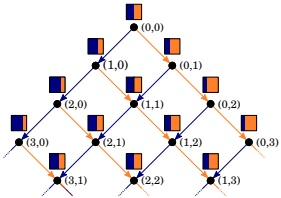

图4.11: beta-伯努利模型中序贯贝叶斯更新的示意图。每个彩色框表示预测分布 $ p(x_t|\mathbf{h}_t) $，其中 $ \mathbf{h}_t = (N_{1,t}, N_{0,t}) $ 是从截至时间 $ t $ 的观测历史中导出的充分统计量，即正面和反面的总次数。正面（蓝色条）的概率由 $ p(x_t = 1|\mathbf{h}_t) = (N_{t,1} + 1)/(t + 2) $ 给出，假设我们从均匀的 Beta($ \theta | 1,1 $)先验开始。来自[Ort+19]的图3。经Pedro Ortega许可使用。

##### 伯努利模型

对于伯努利模型，得到的后验预测分布形式为

$$  p(y=1|\mathcal{D})=\int_{0}^{1}p(y=1|\theta)p(\theta|\mathcal{D})d\theta   \tag*{(4.129)}$$

$$  =\int_{0}^{1}\theta\operatorname{Beta}(\theta|\widehat{\alpha},\widehat{\beta})d\theta=\mathbb{E}\left[\theta|\mathcal{D}\right]=\frac{\widehat{\alpha}}{\widehat{\alpha}+\widehat{\beta}}   \tag*{(4.130)}$$

在第4.5.1节中，我们不得不使用Beta(2,2)先验来恢复加一平滑，这是一种相当不自然的先验。在贝叶斯方法中，我们可以使用均匀先验 $ p(\theta) = \operatorname{Beta}(\theta|1,1) $ 达到相同效果，因为预测分布变为

$$  p(y=1|\mathcal{D})=\frac{N_{1}+1}{N_{1}+N_{0}+2}   \tag*{(4.131)}$$

这被称为**拉普拉斯继承法则**。图4.11展示了其在序贯设置下的应用。

##### 二项式模型

现在假设我们感兴趣的是预测未来M > 1次抛硬币试验中正面的次数，即我们使用的是二项式模型而非伯努利模型。 $ \theta $ 的后验与之前相同，但后验预测分布不同：

$$  \begin{align*}p(y|\mathcal{D},M)&=\int_{0}^{1}\mathrm{Bin}(y|M,\theta)\mathrm{Beta}(\theta|\widehat{\alpha},\widehat{\beta})d\theta\\&=\binom{M}{y}\frac{1}{B(\widehat{\alpha},\widehat{\beta})}\int_{0}^{1}\theta^{y}(1-\theta)^{M-y}\theta^{\widehat{\alpha}-1}(1-\theta)^{\widehat{\beta}-1}d\theta\end{align*}   \tag*{(4.132)}$$

---

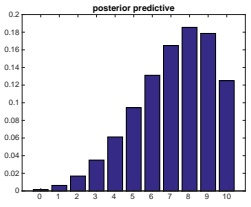

 $ (a) $

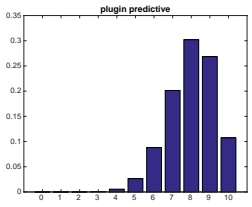

(b)

图 4.12: (a) 在观察到 $ N_{1}=4 $ 次正面和 $ N_{0}=1 $ 次反面后，10 次未来试验的**后验预测分布**。(b) 基于相同数据的**插件近似**。两种情形均使用均匀先验。由 beta_binom_post_pred_plot.ipynb 生成。

我们识别出该积分是 $ \mathrm{Beta}(\widehat{\alpha} + y, M - y + \widehat{\beta}) $ 分布的归一化常数。因此

$$  \int_{0}^{1}\theta^{y+\widehat{\alpha}-1}(1-\theta)^{M-y+\widehat{\beta}-1}d\theta=B(y+\widehat{\alpha},M-y+\widehat{\beta})   \tag*{(4.134)}$$

于是我们发现后验预测由下式给出，该式被称为（复合）Beta-二项分布：

$$  B b(x|M,\widehat{\alpha},\widehat{\beta})\triangleq\binom{M}{x}\frac{B(x+\widehat{\alpha},M-x+\widehat{\beta})}{B(\widehat{\alpha},\widehat{\beta})}   \tag*{(4.135)}$$

在图 4.12(a) 中，我们绘制了使用均匀 Beta(1,1) 先验、观察到 $ N_1 = 4 $ 次正面和 $ N_0 = 1 $ 次反面后，M = 10 时的后验预测密度。在图 4.12(b) 中，我们绘制了插件近似，由下式给出

$$  p(\theta|\mathcal{D})\approx\delta(\theta-\hat{\theta})   \tag*{(4.136)}$$

$$  p(y|\mathcal{D},M)=\int_{0}^{1}\mathrm{B i n}(y|M,\theta)p(\theta|\mathcal{D})d\theta=\mathrm{B i n}(y|M,\hat{\theta})   \tag*{(4.137)}$$

其中 $ \theta $ 是最大后验估计 (MAP)。观察图 4.12 可见，贝叶斯预测具有更长的尾部，其概率质量分布更广，因此不易出现过拟合和黑天鹅类悖论。（注意，两种情形我们都使用了均匀先验，因此差异并非源于先验的使用；而是因为贝叶斯方法在做出预测时对未知参数进行了积分。）

##### 4.6.2.10 边际似然

模型 M 的边际似然或证据定义为

$$  p(\mathcal{D}|\mathcal{M})=\int p(\boldsymbol{\theta}|\mathcal{M})p(\mathcal{D}|\boldsymbol{\theta},\mathcal{M})d\boldsymbol{\theta}   \tag*{(4.138)}$$

作者：Kevin P. Murphy. (C) MIT Press. CC-BY-NC-ND 许可协议

---

当对特定模型的参数进行推断时，我们可以忽略这一项，因为它相对于 $\theta$ 是常数。然而，在选择不同模型时，这个量起着至关重要的作用，我们将在第5.2.2节讨论。它还有助于从数据中估计超参数（这种方法称为经验贝叶斯），我们将在第4.6.5.3节讨论。

一般来说，计算边际似然可能很困难。然而，对于贝塔-伯努利模型，边际似然与后验归一化常数和先验归一化常数之比成正比。为了理解这一点，回顾贝塔-二项模型的后验由 $p(\theta|\mathcal{D}) = \text{Beta}(\theta|a', b')$ 给出，其中 $a' = a + N_1$ 且 $b' = b + N_0$。我们知道后验的归一化常数为 $B(a', b')$。因此

$$  p(\theta|\mathcal{D})=\frac{p(\mathcal{D}|\theta)p(\theta)}{p(\mathcal{D})}   \tag*{(4.139)}$$

$$  =\frac{1}{p(\mathcal{D})}\left[\frac{1}{B(a,b)}\theta^{a-1}(1-\theta)^{b-1}\right]\left[\binom{N}{N_{1}}\theta^{N_{1}}(1-\theta)^{N_{0}}\right]   \tag*{(4.140)}$$

$$  =\binom{N}{N_{1}}\frac{1}{p(\mathcal{D})}\frac{1}{B(a,b)}\left[\theta^{a+N_{1}-1}(1-\theta)^{b+N_{0}-1}\right]   \tag*{(4.141)}$$

所以

$$  \frac{1}{B(a+N_{1},b+N_{0})}=\binom{N}{N_{1}}\frac{1}{p(\mathcal{D})}\frac{1}{B(a,b)}   \tag*{(4.142)}$$

$$  p(\mathcal{D})=\binom{N}{N_{1}}\frac{B(a+N_{1},b+N_{0})}{B(a,b)}   \tag*{(4.143)}$$

贝塔-伯努利模型的边际似然与上述相同，只是缺少了 $\binom{N}{N_{1}}$ 项。

##### 4.6.2.11 共轭先验的混合

如我们所见，贝塔分布是二项似然的共轭先验，这使我们能够轻松地以闭合形式计算后验。然而，这种先验相当受限。例如，假设我们要预测赌场中抛硬币的结果，并且我们认为硬币可能是公平的，但也同样可能偏向正面。这种先验不能用贝塔分布表示。幸运的是，它可以表示为贝塔分布的混合。例如，我们可以使用

$$  p(\theta)=0.5Beta(\theta|20,20)+0.5Beta(\theta|30,10)   \tag*{(4.144)}$$

如果 $\theta$ 来自第一个分布，则硬币是公平的；但如果来自第二个分布，则偏向正面。

我们可以通过引入一个潜在指示变量 $h$ 来表示混合，其中 $h = k$ 意味着 $\theta$ 来自混合分量 $k$。先验形式为

$$  p(\theta)=\sum_{k}p(h=k)p(\theta|h=k)   \tag*{(4.145)}$$

---

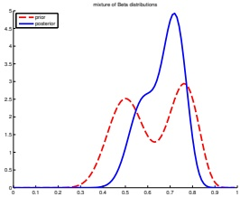

图 4.13：两个 Beta 分布的混合。由 mixbetademo.ipynb 生成。

其中每个 $p(\theta|h=k)$ 都是共轭的，而 $p(h=k)$ 被称为（先验）混合权重。可以证明（练习 4.6），后验同样可以写成共轭分布的混合形式，如下所示：

$$  p(\theta|\mathcal{D})=\sum_{k}p(h=k|\mathcal{D})p(\theta|\mathcal{D},h=k)   \tag*{(4.146)}$$

其中 $p(h = k|\mathcal{D})$ 为后验混合权重，由下式给出：

$$  p(h=k|\mathcal{D})=\frac{p(h=k)p(\mathcal{D}|h=k)}{\sum_{k^{\prime}}p(h=k^{\prime})p(\mathcal{D}|h=k^{\prime})}   \tag*{(4.147)}$$

这里 $p(\mathcal{D}|h=k)$ 是混合分量 $k$ 的边际似然（参见第 4.6.2.10 节）。

回到我们上面的例子，如果先验如公式 (4.144) 所示，且我们观测到 $N_{1}=20$ 次正面和 $N_{0}=10$ 次反面，那么根据公式 (4.143)，后验变为：

$$  p(\theta|\mathcal{D})=0.346Beta(\theta|40,30)+0.654Beta(\theta|50,20)   \tag*{(4.148)}$$

如图 4.13 所示。

我们可以按如下方式计算硬币偏向正面的后验概率：

$$  \Pr(\theta>0.5|\mathcal{D})=\sum_{k}\Pr(\theta>0.5|\mathcal{D},h=k)p(h=k|\mathcal{D})=0.9604   \tag*{(4.149)}$$

如果我们仅使用单个 Beta(20,20) 先验，得到的值为 $\Pr(\theta > 0.5|\mathcal{D}) = 0.8858$，略小一些。因此，如果我们一开始就“怀疑”赌场可能在使用 biased 硬币，那么我们的担忧会比从开放心态开始被说服时更快得到证实。

#### 4.6.3 Dirichlet-多项分布模型

本节我们将第 4.6.2 节的结果从二元变量（例如硬币）推广到 $K$ 元变量（例如骰子）。

作者：Kevin P. Murphy。 (C) MIT Press. CC-BY-NC-ND 许可证。

---

##### 4.6.3.1 似然

设 \( Y \sim \text{Cat}(\theta) \) 是一个服从类别分布的离散随机变量。似然的形式为

$$  p(\mathcal{D}|\boldsymbol{\theta})=\prod_{n=1}^{N}\mathrm{Cat}(y_{n}|\boldsymbol{\theta})=\prod_{n=1}^{N}\prod_{c=1}^{C}\theta_{c}^{\mathbb{I}(y_{n}=c)}=\prod_{c=1}^{C}\theta_{c}^{N_{c}}   \tag*{(4.150)}$$

其中 \( N_c = \sum_n \mathbb{I}(y_n = c) \)。

##### 4.6.3.2 先验

类别分布的共轭先验是狄利克雷分布，它是贝塔分布的多元推广。该分布定义在概率单纯形上，其支撑集为

$$  S_{K}=\left\{\boldsymbol{\theta}:0\leq\theta_{k}\leq1,\sum_{k=1}^{K}\theta_{k}=1\right\}   \tag*{(4.151)}$$

狄利克雷分布的概率密度函数定义如下：

$$  \mathrm{Dir}(\boldsymbol{\theta}|\breve{\boldsymbol{\alpha}})\triangleq\frac{1}{B(\breve{\boldsymbol{\alpha}})}\prod_{k=1}^{K}\theta_{k}^{\breve{\alpha}_{k}-1}\mathbb{I}\left(\boldsymbol{\theta}\in S_{K}\right)   \tag*{(4.152)}$$

其中 \( B(\breve{\alpha}) \) 是多元贝塔函数，

$$  B(\breve{\alpha})\triangleq\frac{\prod_{k=1}^{K}\Gamma(\breve{\alpha}_{k})}{\Gamma(\sum_{k=1}^{K}\breve{\alpha}_{k})}   \tag*{(4.153)}$$

图4.14展示了 \( K=3 \) 时狄利克雷分布的一些图示。我们看到 \( \widetilde{\alpha}_0 = \sum_k \widetilde{\alpha}_k \) 控制着分布的强度（即分布的尖峰程度），而 \( \widetilde{\alpha}_k \) 控制着峰值出现的位置。例如，Dir(1, 1, 1) 是均匀分布，Dir(2, 2, 2) 是以 (1/3, 1/3, 1/3) 为中心的宽广分布，Dir(20, 20, 20) 是以 (1/3, 1/3, 1/3) 为中心的狭窄分布。Dir(3, 3, 20) 是一个非对称分布，它将更多密度集中在其中一个角上。如果所有 \( \widetilde{\alpha}_k < 1 \)，我们会在单纯形的角上得到“尖峰”。当 \( \widetilde{\alpha}_k < 1 \) 时，分布中的样本将是稀疏的，如图4.15所示。

##### 4.6.3.3 后验

我们可以将多项似然与狄利克雷先验结合起来计算后验，如下所示：

$$  p(\boldsymbol{\theta}|\mathcal{D})\propto p(\mathcal{D}|\boldsymbol{\theta})\mathrm{Dir}(\boldsymbol{\theta}|\boldsymbol{\check{\alpha}})   \tag*{(4.154)}$$

$$  =\left[\prod_{k}\theta_{k}^{N_{k}}\right]\left[\prod_{k}\theta_{k}^{\breve{\alpha}_{k}-1}\right]   \tag*{(4.155)}$$

$$  =\mathrm{Dir}(\boldsymbol{\theta}|\boldsymbol{\alpha}_{1}+N_{1},\ldots,\boldsymbol{\alpha}_{K}+N_{K})   \tag*{(4.156)}$$

$$  =\mathrm{Dir}(\boldsymbol{\theta}|\hat{\boldsymbol{\alpha}})   \tag*{(4.157)}$$

“概率机器学习：导论”。在线版本。2024年11月23日。

---

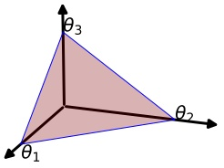

 $ (a) $

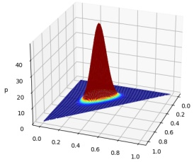

(b)

0.10,0.10,0.10

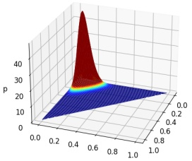

(c)

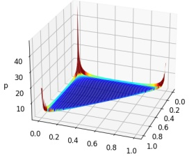

(d)

Figure 4.14: (a) 当 $K = 3$ 时，Dirichlet分布定义在单纯形上的分布，可以用三角形表面表示。该表面上的点满足 $0 \leq \theta_k \leq 1$ 且 $\sum_{k=1}^3 \theta_k = 1$。由 dirichlet_3d_triangle_plot.ipymb 生成。 (b) $\mathbf{\tilde{\alpha}} = (20, 20, 20)$ 时的Dirichlet密度图。 (c) $\mathbf{\tilde{\alpha}} = (3, 3, 20)$ 时的Dirichlet密度图。 (d) $\mathbf{\tilde{\alpha}} = (0.1, 0.1, 0.1)$ 时的Dirichlet密度图。由 dirichlet_3d_spiky_plot.ipymb 生成。

其中 $ \widehat{\alpha}_k = \widetilde{\alpha}_k + N_k $ 是后验的参数。因此我们看到，后验可以通过将经验计数加到先验计数上来计算。

后验均值由下式给出

$$  \overline{{\theta}}_{k}=\frac{\widehat{\alpha}_{k}}{\sum_{k^{\prime}=1}^{K}\widehat{\alpha}_{k^{\prime}}}   \tag*{(4.158)}$$

后验众数（对应于MAP估计）由下式给出

$$  \hat{\theta}_{k}=\frac{\hat{\alpha}_{k}-1}{\sum_{k^{\prime}=1}^{K}(\hat{\alpha}_{k^{\prime}}-1)}   \tag*{(4.159)}$$

Author: Kevin P. Murphy. (C) MIT Press. CC-BY-NC-ND license

---

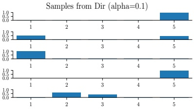

 $ (a) $

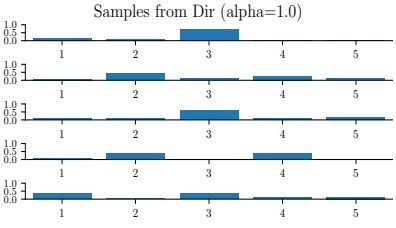

(b)

图 4.15：不同参数值下 5 维对称狄利克雷分布的样本。(a)  $ \mathbf{\check{a}}=(0.1,\ldots,0.1) $。这导致非常稀疏的分布，包含许多 0。(b)  $ \mathbf{\check{a}}=(1,\ldots,1) $。这产生更均匀（且密集）的分布。由 dirichlet_samples_plot.ipynb 生成。

如果我们使用对应于均匀先验的  $ \breve{\alpha}_{k}=1 $，则 MAP 估计退化为 MLE：

$$  \hat{\theta}_{k}=N_{k}/N   \tag*{(4.160)}$$

（关于该结果的更直接推导，请参见第 4.2.4 节。）

##### 4.6.3.4 后验预测

后验预测分布由下式给出：

$$  \begin{align*}p(y=k|\mathcal{D})&=\int p(y=k|\boldsymbol{\theta})p(\boldsymbol{\theta}|\mathcal{D})d\boldsymbol{\theta}\\&=\int\theta_{k} p(\theta_{k}|\mathcal{D})d\theta_{k}=\mathbb{E}\left[\theta_{k}|\mathcal{D}\right]=\frac{\widehat{\alpha}_{k}}{\sum_{k^{\prime}}\widehat{\alpha}_{k^{\prime}}}\end{align*}   \tag*{(4.162)}$$

换句话说，后验预测分布为：

$$  p(y|\mathcal{D})=\mathrm{Cat}(y|\overline{\boldsymbol{\theta}})   \tag*{(4.163)}$$

其中  $ \overline{\theta} \triangleq \mathbb{E}[\theta|\mathcal{D}] $ 是后验均值参数。如果改为使用 MAP 估计，我们将面临零计数问题。要获得与加一平滑相同的效果，唯一方法是使用  $ \check{\alpha}_c = 2 $ 的 MAP 估计。

方程 (4.162) 给出了在给定过去观测  $ \boldsymbol{y} = (y_1, \ldots, y_N) $ 的条件下，单一未来事件的概率。在某些情况下，我们需要知道观测到一批未来数据的概率，例如  $ \tilde{\boldsymbol{y}} = (\tilde{y}_1, \ldots, \tilde{y}_M) $。我们可以按如下方式计算：

$$  p(\tilde{\boldsymbol{y}}|\boldsymbol{y})=\frac{p(\tilde{\boldsymbol{y}},\boldsymbol{y})}{p(\boldsymbol{y})}   \tag*{(4.164)}$$

分母是训练数据的边际似然，分子是训练数据和未来测试数据的边际似然。我们将在第 4.6.3.5 节讨论如何计算此类边际似然。

---

##### 4.6.3.5 边缘似然

与4.6.2.10节相同的推理，可以证明Dirichlet-分类模型的边缘似然为

$$  p(\mathcal{D})=\frac{B(\mathbf{N}+\boldsymbol{\alpha})}{B(\boldsymbol{\alpha})}   \tag*{(4.165)}$$

其中

$$  B(\boldsymbol{\alpha})=\frac{\prod_{k=1}^{K}\Gamma(\alpha_{k})}{\Gamma(\sum_{k}\alpha_{k})}   \tag*{(4.166)}$$

因此，我们可以将上述结果改写为以下形式，这是文献中通常使用的形式：

$$  p(\mathcal{D})=\frac{\Gamma(\sum_{k}\alpha_{k})}{\Gamma(N+\sum_{k}\alpha_{k})}\prod_{k}\frac{\Gamma(N_{k}+\alpha_{k})}{\Gamma(\alpha_{k})}   \tag*{(4.167)}$$

#### 4.6.4 高斯-高斯模型

在本节中，我们推导高斯分布参数的后验。为简单起见，我们假设方差已知。（一般情况将在本书的续作[Mur23]以及其他关于贝叶斯统计的标准参考文献中讨论。）

##### 4.6.4.1 单变量情况

如果σ²是已知常数，则μ的似然函数形式为

$$  p(\mathcal{D}|\mu)\propto\exp\left(-\frac{1}{2\sigma^{2}}\sum_{n=1}^{N}(y_{n}-\mu)^{2}\right)   \tag*{(4.168)}$$

可以证明共轭先验是另一个高斯分布 $ \mathcal{N}(\mu|\tilde{m},\tilde{\tau}^2) $。如4.6.4.1节所述，应用高斯贝叶斯规则，我们发现相应的后验为

$$  p(\mu|\mathcal{D},\sigma^{2})=\mathcal{N}(\mu|\hat{m},\hat{\tau}^{2})   \tag*{(4.169)}$$

$$  \widehat{\tau}^{2}=\frac{1}{\frac{N}{\sigma^{2}}+\frac{1}{\breve{\tau}^{2}}}=\frac{\sigma^{2}\breve{\tau}^{2}}{N\breve{\tau}^{2}+\sigma^{2}}   \tag*{(4.170)}$$

$$  \widehat{m}=\widehat{\tau}^{2}\left(\frac{\breve{m}}{\breve{\tau}^{2}}+\frac{N\overline{y}}{\sigma^{2}}\right)=\frac{\sigma^{2}}{N\breve{\tau}^{2}+\sigma^{2}}\breve{m}+\frac{N\breve{\tau}^{2}}{N\breve{\tau}^{2}+\sigma^{2}}\overline{y}   \tag*{(4.171)}$$

其中 $ \overline{y} \triangleq \frac{1}{N} \sum_{n=1}^{N} y_{n} $ 是经验均值。

如果我们用精度参数（即方差的倒数）来表述，这个结果更容易理解。具体来说，令 $ \kappa = 1/\sigma^2 $ 为观测精度，$ \check{\lambda} = 1/\check{\tau}^2 $ 为

Author: Kevin P. Murphy. (C) MIT Press. CC-BY-NC-ND license

---

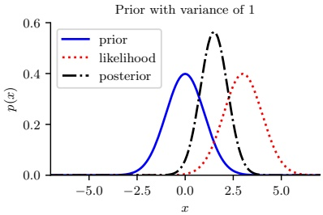

 $ (a) $

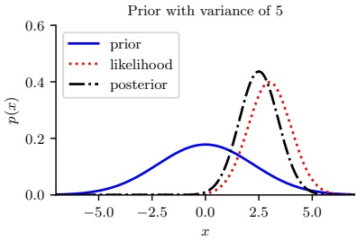

(b)

图 4.16: 在给定观测值 $ y = 3 $ 时，推断已知方差 $ \sigma^2 $ 的单变量高斯分布的均值。(a) 使用强先验， $ p(\mu) = \mathcal{N}(\mu|0,1) $。(b) 使用弱先验， $ p(\mu) = \mathcal{N}(\mu|0,5) $。由 gauss_infer_1d.ipynb 生成。

先验的精度。然后我们可以将后验重写如下：

$$  p(\mu|\mathcal{D},\kappa)=\mathcal{N}(\mu|\widehat{m},\widehat{\lambda}^{-1})   \tag*{(4.172)}$$

$$  \widehat{\lambda}=\check{\lambda}+N\kappa   \tag*{(4.173)}$$

$$  \hat{m}=\frac{N\kappa\overline{y}+\breve{\lambda}\breve{m}}{\hat{\lambda}}=\frac{N\kappa}{N\kappa+\breve{\lambda}}\overline{y}+\frac{\breve{\lambda}}{N\kappa+\breve{\lambda}}\breve{m}   \tag*{(4.174)}$$

这些公式非常直观：后验精度 $ \hat{\lambda} $ 是先验精度 $ \hat{\lambda} $ 加上 $ N $ 个测量精度单位 $ \kappa $。此外，后验均值 $ \hat{m} $ 是经验均值 $ \bar{y} $ 和先验均值 $ \hat{m} $ 的凸组合。这清楚地表明，后验均值是经验均值和先验均值之间的折中。如果先验相对于信号强度较弱（即 $ \bar{\lambda} $ 相对于 $ \kappa $ 较小），我们赋予经验均值更大的权重。如果先验相对于信号强度较强（即 $ \bar{\lambda} $ 相对于 $ \kappa $ 较大），我们赋予先验更大的权重。这一点如图 4.16 所示。还需注意，后验均值用 $ N\kappa\bar{y} $ 表示，因此拥有 $ N $ 个精度均为 $ \kappa $ 的测量值，等价于拥有一个值为 $ \bar{y} $ 且精度为 $ N\kappa $ 的测量值。

##### 在看到 N = 1 个样本后的后验

为更深入地理解这些公式，考虑在看到单个数据点 $ y $ 后的后验（即 $ N = 1 $）。此时后验均值可表示为以下等价形式：

$$  \hat{m}=\frac{\breve{\lambda}}{\hat{\breve{\lambda}}}\breve{m}+\frac{\kappa}{\hat{\breve{\lambda}}}y   \tag*{(4.175)}$$

$$  =m+\frac{\kappa}{\widehat{\lambda}}(y-\breve{m})   \tag*{(4.176)}$$

$$  =y-\frac{\breve{\lambda}}{\breve{\lambda}}(y-\breve{m})   \tag*{(4.177)}$$

第一个方程是先验均值与数据的凸组合。第二个方程是先验均值向数据 $ y $ 方向的调整。第三个方程是数据向先验方向的调整。

---

先验均值；这被称为收缩估计。如果定义权重 $ w = \tilde{\lambda}/\hat{\lambda} $（即先验精度与后验精度的比值），则更容易理解这一点。于是我们有

$$  \hat{m}=y-w(y-\breve{m})=(1-w)y+w\breve{m}   \tag*{(4.178)}$$

注意，对于高斯分布，后验均值与后验众数相同。因此我们可以使用上述方程进行最大后验估计。简单示例见练习4.2。

##### 后验方差

除了 $\mu$ 的后验均值或众数，我们可能还关心后验方差，它给出了估计的置信度度量。其平方根称为均值标准误：

$$  \mathrm{s e}(\mu)\triangleq\sqrt{\mathbb{V}\left[\mu|\mathcal{D}\right]}   \tag*{(4.179)}$$

假设我们使用 $\mu$ 的无信息先验，即设置 $\bar{\lambda}=0$（见第4.6.5.1节）。在这种情况下，后验均值等于最大似然估计 $\hat{m}=\bar{y}$。此外，假设我们使用样本方差来近似 $\sigma^2$：

$$  s^{2}\triangleq\frac{1}{N}\sum_{n=1}^{N}(y_{n}-\overline{y})^{2}   \tag*{(4.180)}$$

因此 $\widehat{\lambda}=N\widehat{\kappa}=N/s^{2}$，于是标准误变为

$$  \mathrm{se}(\mu)=\sqrt{\mathbb{V}\left[\mu|\mathcal{D}\right]}=\frac{1}{\sqrt{\lambda}}=\frac{s}{\sqrt{N}}   \tag*{(4.181)}$$

由此可见，$\mu$ 的不确定性以 $1/\sqrt{N}$ 的速率降低。

此外，我们可以利用高斯分布中95%的数据位于均值两个标准差之内的这一事实，来近似 $\mu$ 的95%可信区间：

$$  I_{.95}(\mu|\mathcal{D})=\overline{y}\pm2\frac{s}{\sqrt{N}}   \tag*{(4.182)}$$

##### 4.6.4.2 多元情形

对于 $D$ 维数据，似然函数具有如下形式（其中省略了与 $\mu$ 无关的项）：

$$  p(\mathcal{D}|\boldsymbol{\mu})=\prod_{n=1}^{N}\mathcal{N}(y_{n}|\boldsymbol{\mu},\boldsymbol{\Sigma})   \tag*{(4.183)}$$

$$  =\left(\frac{1}{(2\pi)^{D/2}|\boldsymbol{\Sigma}|^{\frac{1}{2}}}\right)^{N}\exp\left[-\frac{1}{2}\sum_{n=1}^{N}(\boldsymbol{y}_{n}-\boldsymbol{\mu})^{\mathsf{T}}\boldsymbol{\Sigma}^{-1}(\boldsymbol{y}_{n}-\boldsymbol{\mu})\right]   \tag*{(4.184)}$$

$$  \propto\mathcal{N}(\overline{{y}}|\mu,\frac{1}{N}\Sigma)   \tag*{(4.185)}$$

作者：Kevin P. Murphy。 (C) MIT Press. CC-BY-NC-ND 许可协议。

---

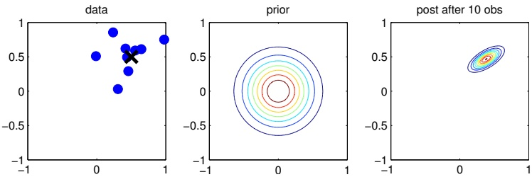

图 4.17：二维高斯均值贝叶斯推断示意图。(a) 数据由 $\mathbf{y}_n \sim \mathcal{N}(\boldsymbol{\mu}, \boldsymbol{\Sigma})$ 生成，其中 $\boldsymbol{\mu} = [0.5, 0.5]^\top$，$\boldsymbol{\Sigma} = 0.1[2, 1; 1, 1]$。(b) 先验为 $p(\boldsymbol{\mu}) = \mathcal{N}(\boldsymbol{\mu}|\mathbf{0}, 0.1\mathbf{I}_2)$。(c) 观测到 10 个数据点后的后验分布。由 gauss_infer_2d.ipynb 生成。

其中 $\overline{y} = \frac{1}{N} \sum_{n=1}^{N} y_n$。（最后一个等式的证明紧跟在方程 (3.65) 之后。）因此，我们用观测值的均值替换观测值集合，并将协方差缩小 $N$ 倍。

为简单起见，我们将使用共轭先验，在本例中为高斯先验，即

$$ p(\boldsymbol{\mu})=\mathcal{N}(\boldsymbol{\mu}|\breve{m},\breve{\mathbf{V}}) \tag*{(4.186)}$$

基于第 3.3.1 节的结果，我们可以推导出 $\mu$ 的高斯后验。得到

$$ p(\boldsymbol{\mu}|\mathcal{D},\boldsymbol{\Sigma})=\mathcal{N}(\boldsymbol{\mu}|\boldsymbol{\hat{m}},\hat{\mathbf{V}}) \tag*{(4.187)}$$

$$ \hat{\mathbf{V}}^{-1}=\check{\mathbf{V}}^{-1}+N\mathbf{\Sigma}^{-1} \tag*{(4.188)}$$

$$ \hat{m}=\hat{\mathbf{V}}\left(\mathbf{\Sigma}^{-1}(N\overline{y})+\check{\mathbf{V}}^{-1}\check{m}\right) \tag*{(4.189)}$$

图 4.17 给出了这些结果的一个二维示例。

#### 4.6.5 超越共轭先验

我们已经看到了共轭先验的各种例子，它们都来自指数族（见第 3.4 节）。这些先验易于解释（基于虚拟先验数据集的充分统计量），且计算方便。然而，对于大多数模型，指数族中不存在与似然共轭的先验。此外，即使存在共轭先验，共轭性的假设也可能过于局限。因此，在以下小节中，我们简要讨论其他几种先验。

##### 4.6.5.1 无信息先验

当我们几乎没有领域特定知识时，最好使用无信息、非信息性或客观先验，以“让数据自己说话”。例如，如果我们要推断一个实值量（如位置参数 $\mu \in \mathbb{R}$），可以使用平坦先验 $p(\mu) \propto 1$。这可以看作是一个“无限宽”的高斯分布。

---

不幸的是，定义无信息先验并没有唯一的方法，它们都编码了某种知识。因此，更宜使用术语“扩散先验”、“最小信息先验”或“默认先验”。更多细节参见本书续篇[Mur23]。

##### 4.6.5.2 层次先验

贝叶斯模型需要为参数指定一个先验 $ p(\boldsymbol{\theta}) $。先验的参数称为超参数，用 $ \boldsymbol{\xi} $ 表示。如果这些超参数未知，我们可以为它们设置一个先验；这就定义了一个层次贝叶斯模型，或称多层模型，可以表示为：$ \boldsymbol{\xi} \to \boldsymbol{\theta} \to \mathcal{D} $。我们假设超参数的先验是固定的（例如，可以使用某种最小信息先验），因此联合分布的形式为：

$$  p(\boldsymbol{\xi},\boldsymbol{\theta},\mathcal{D})=p(\boldsymbol{\xi})p(\boldsymbol{\theta}|\boldsymbol{\xi})p(\mathcal{D}|\boldsymbol{\theta})   \tag*{(4.190)}$$

其希望在于，我们可以通过将参数本身视为数据点来学习超参数。当需要估计多个相关参数（例如来自不同子群体或多个任务）时，这非常有用；它能为模型的顶层提供学习信号。详见本书续篇[Mur23]。

##### 4.6.5.3 经验先验

在第4.6.5.2节中，我们讨论了层次贝叶斯作为从数据推断参数的一种方法。遗憾的是，这类模型中的后验推断在计算上可能极具挑战性。在本节中，我们讨论一种计算便利的近似方法：首先计算超参数 $ \xi $ 的点估计，然后计算条件后验 $ p(\boldsymbol{\theta}|\boldsymbol{\xi},\mathcal{D}) $，而非联合后验 $ p(\boldsymbol{\theta},\boldsymbol{\xi}|\mathcal{D}) $。

为了估计超参数，我们可以最大化边际似然：

$$  \hat{\xi}_{\mathrm{m m l}}(\mathcal{D})=\underset{\boldsymbol{\xi}}{\operatorname{a r g m a x}}p(\mathcal{D}|\boldsymbol{\xi})=\underset{\boldsymbol{\xi}}{\operatorname{a r g m a x}}\int p(\mathcal{D}|\boldsymbol{\theta})p(\boldsymbol{\theta}|\boldsymbol{\xi})d\boldsymbol{\theta}   \tag*{(4.191)}$$

这种技术称为**第二类极大似然**，因为我们优化的是超参数而非参数。一旦估计出 $ \hat{\xi} $，我们便按照常规方式计算后验 $ p(\boldsymbol{\theta}|\boldsymbol{\hat{\xi}},\mathcal{D}) $。

由于我们是从数据中估计先验参数，这种方法称为**经验贝叶斯**（Empirical Bayes, EB）[CL96]。这违背了先验应独立于数据选取的原则。然而，我们可以将其视为对完整层次贝叶斯模型推断的一种计算廉价的近似，正如我们将 MAP 估计视为对单层模型 $ \theta \to \mathcal{D} $ 推断的近似一样。事实上，我们可以构建一个层次结构，其中执行的积分越多，就变得“越贝叶斯”，如下表所示。

<table border=1 style='margin: auto; word-wrap: break-word;'><tr><td style='text-align: center; word-wrap: break-word;'>方法</td><td style='text-align: center; word-wrap: break-word;'>定义</td></tr><tr><td style='text-align: center; word-wrap: break-word;'>极大似然</td><td style='text-align: center; word-wrap: break-word;'>$ \hat{\theta} = \arg\max_{\theta} p(\mathcal{D}|\boldsymbol{\theta}) $</td></tr><tr><td style='text-align: center; word-wrap: break-word;'>MAP估计</td><td style='text-align: center; word-wrap: break-word;'>$ \hat{\boldsymbol{\theta}}(\boldsymbol{\xi}) = \arg\max_{\boldsymbol{\theta}} p(\mathcal{D}|\boldsymbol{\theta})p(\boldsymbol{\theta}|\boldsymbol{\xi}) $</td></tr><tr><td style='text-align: center; word-wrap: break-word;'>ML-II（经验贝叶斯）</td><td style='text-align: center; word-wrap: break-word;'>$ \hat{\boldsymbol{\xi}} = \arg\max_{\boldsymbol{\xi}} \int p(\mathcal{D}|\boldsymbol{\theta})p(\boldsymbol{\theta}|\boldsymbol{\xi})d\boldsymbol{\theta} $</td></tr><tr><td style='text-align: center; word-wrap: break-word;'>MAP-II</td><td style='text-align: center; word-wrap: break-word;'>$ \hat{\boldsymbol{\xi}} = \arg\max_{\boldsymbol{\xi}} \int p(\mathcal{D}|\boldsymbol{\theta})p(\boldsymbol{\theta}|\boldsymbol{\xi})p(\boldsymbol{\xi})d\boldsymbol{\theta} $</td></tr><tr><td style='text-align: center; word-wrap: break-word;'>完全贝叶斯</td><td style='text-align: center; word-wrap: break-word;'>$ p(\boldsymbol{\theta}, \boldsymbol{\xi}|\mathcal{D}) \propto p(\mathcal{D}|\boldsymbol{\theta})p(\boldsymbol{\theta}|\boldsymbol{\xi})p(\boldsymbol{\xi}) $</td></tr></table>

Author: Kevin P. Murphy. (C) MIT Press. CC-BY-NC-ND license

---

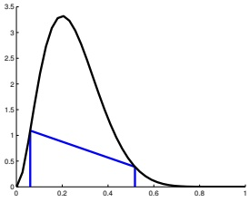

 $ (a) $

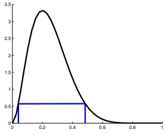

(b)

图 4.18：(a) Beta(3,9) 后验分布的中心区间和 (b) HPD（最高后验密度区域）。CI（可信区间）为 (0.06, 0.52)，HPD 为 (0.04, 0.48)。改编自 [Hof09] 的图 3.6。由 betaHPD.ipynb 生成。

注意，ML-II 比“常规”最大似然更不容易过拟合，因为超参数 $ \xi $ 通常比参数 $ \theta $ 少。详见本书续篇 [Mur23]。

#### 4.6.6 可信区间

后验分布（通常）是一个高维对象，难以可视化和处理。总结这种分布的一种常见方法是计算点估计，例如后验均值或众数，然后计算可信区间，该区间量化了与该估计相关的不确定性。（可信区间与置信区间不同，置信区间是频率统计中的一个概念，我们将在第 4.7.4 节中讨论。）

更精确地说，我们将 $ 100(1-\alpha)\% $ 可信区间定义为（连续的）区域 $ C=(\ell,u) $（代表下界和上界），该区域包含后验概率质量的 $ 1-\alpha $，即

$$  C_{\alpha}(\mathcal{D})=(\ell,u):P(\ell\leq\theta\leq u|\mathcal{D})=1-\alpha   \tag*{(4.192)}$$

可能有多个区间满足公式 (4.192)，因此我们通常选择一个使得每条尾部都有 $ (1-\alpha)/2 $ 质量的区间；这被称为 \textit{中心区间}。如果后验分布具有已知的函数形式，我们可以使用 $ \ell = F^{-1}(\alpha/2) $ 和 $ u = F^{-1}(1-\alpha/2) $ 来计算后验中心区间，其中 $ F $ 是后验分布的累积分布函数（cdf），$ F^{-1} $ 是逆累积分布函数。例如，如果后验分布是高斯分布 $ p(\theta|\mathcal{D}) = \mathcal{N}(0,1) $，且 $ \alpha = 0.05 $，那么我们有 $ \ell = \Phi^{-1}(\alpha/2) = -1.96 $，$ u = \Phi^{-1}(1-\alpha/2) = 1.96 $，其中 $ \Phi $ 表示高斯分布的累积分布函数。如图 Figure 2.2b 所示。这证明了以 $ \mu \pm 2\sigma $ 形式引用可信区间的常见做法是合理的，其中 $ \mu $ 表示后验均值，$ \sigma $ 表示后验标准差，而 $ 2 $ 是 1.96 的一个良好近似。

通常，很难计算后验分布的逆累积分布函数。在这种情况下，一个简单的替代方法是从后验分布中抽取样本，然后使用蒙特卡罗（Monte Carlo）近似来估计后验分位数：我们只需对 $S$ 个样本进行排序，并找到在排序列表中位于 $\alpha/S$ 位置的样本。当 $S \to \infty$ 时，这会收敛到真实分位数。有关演示，请参见 beta_credible_int_demo.ipynb。

中心区间的一个问题是，可能存在中心区间之外的点具有比内部点更高的概率，如图 Figure 4.18(a) 所示。这促使了

---

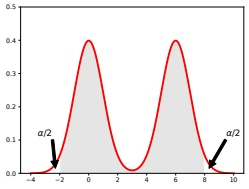

$ (a) $

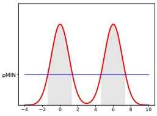

(b)

图 4.19：(a) 假设的多模态后验的中央区间和 (b) HPD 区域。改编自 [Gel+04] 的图 2.2。由 postDensityIntervals.ipynb 生成。

另一种称为最高后验密度（HPD）区域的量，是指概率高于某个阈值的点集。更精确地，我们在概率密度函数上找到阈值 $p^{*}$，使得

$$ 1-\alpha=\int_{\theta:p(\theta|\mathcal{D})>p^{*}}p(\theta|\mathcal{D})d\theta \tag*{(4.193)}$$

然后定义 HPD 为

$$ C_{\alpha}(\mathcal{D})=\{\theta:p(\theta|\mathcal{D})\geq p^{*}\} \tag*{(4.194)}$$

在一维情况下，HPD 区域有时称为最高密度区间（HDI）。例如，图 4.18(b) 展示了 Beta(3,9) 分布的 95% HDI，即 (0.04, 0.48)。我们看到它比中央区间更窄，尽管它仍然包含 95% 的质量；此外，其内部的每个点都具有比外部每个点更高的密度。

对于单峰分布，HDI 将是围绕众数且包含 95% 质量的最窄区间。为了理解这一点，想象反向的“注水”过程：我们降低水平面直到 95% 的质量暴露出来，仅 5% 被淹没。这给出了一维情况下计算 HDI 的简单算法：只需搜索使得区间包含 95% 质量且宽度最小的点。如果我们知道分布的逆 CDF，可以通过一维数值优化实现；如果有一袋样本，则可以通过对排序后的数据点进行搜索实现（有关代码，参见 betaHPD.ipynb）。

如果后验是多模态的，HDI 甚至可能不是一个连通区域：参见图 4.19(b) 的示例。然而，对多模态后验进行总结总是困难的。

#### 4.6.7 贝叶斯机器学习

到目前为止，我们一直关注形式为 $p(\boldsymbol{y}|\boldsymbol{\theta})$ 的无条件模型。在监督机器学习中，我们使用形式为 $p(\boldsymbol{y}|\boldsymbol{x},\boldsymbol{\theta})$ 的条件模型。参数的后验现在是 $p(\boldsymbol{\theta}|\mathcal{D})$，其中 $\mathcal{D}=\{(\boldsymbol{x}_{n},\boldsymbol{y}_{n}):n=1:N\}$。计算这个后验可以用我们已经讨论过的原理完成。这种方法称为贝叶斯机器学习，因为我们“以贝叶斯方式”对待模型参数。

作者：Kevin P. Murphy。(C) MIT 出版社。CC-BY-NC-ND 许可证。

---

##### 4.6.7.1 插件近似

一旦我们计算出了参数的后验分布，就可以通过边缘化未知参数来计算给定输入时输出的后验预测分布：

$$  p(\boldsymbol{y}|\boldsymbol{x},\mathcal{D})=\int p(\boldsymbol{y}|\boldsymbol{x},\boldsymbol{\theta})p(\boldsymbol{\theta}|\mathcal{D})d\boldsymbol{\theta}   \tag*{(4.195)}$$

当然，计算这个积分通常是棘手的。一个非常简单的近似是假设只有一个最佳模型，即 $ \pmb{\theta} $，例如最大似然估计（MLE）。这相当于将后验近似为所选值处的一个极窄但极高的“尖峰”。我们可以将其写成如下形式：

$$  p(\boldsymbol{\theta}|\mathcal{D})=\delta(\boldsymbol{\theta}-\hat{\boldsymbol{\theta}})   \tag*{(4.196)}$$

其中 $ \delta $ 是狄拉克 delta 函数（见第 2.6.5 节）。如果使用这个近似，那么预测分布可以通过简单地将点估计“插入”似然函数得到：

$$  p(\boldsymbol{y}|\boldsymbol{x},\mathcal{D})=\int p(\boldsymbol{y}|\boldsymbol{x},\boldsymbol{\theta})p(\boldsymbol{\theta}|\mathcal{D})d\boldsymbol{\theta}\approx\int p(\boldsymbol{y}|\boldsymbol{x},\boldsymbol{\theta})\delta(\boldsymbol{\theta}-\hat{\boldsymbol{\theta}})d\boldsymbol{\theta}=p(\boldsymbol{y}|\boldsymbol{x},\hat{\boldsymbol{\theta}})   \tag*{(4.197)}$$

这源于 delta 函数的筛选性质（公式 (2.129)）。

公式 (4.197) 中的方法被称为 **插件近似**。这种方法等价于机器学习中大多数标准方法所使用的做法：首先拟合模型（即计算点估计 $ \hat{\theta} $），然后利用它进行预测。然而，正如我们在第 1.2.3 节中讨论的，标准（插件）方法可能会遭受过拟合和过度置信的问题。完全的贝叶斯方法通过边缘化参数来避免这些问题，但计算成本较高。幸运的是，即使是简单的近似（例如对几个合理的参数值进行平均）也能改善性能。下面我们给出一些例子。

##### 4.6.7.2 示例：标量输入，二元输出

假设我们要进行二元分类，因此 $ y \in \{0,1\} $。我们将使用如下形式的模型：

$$  p(y|\boldsymbol{x};\boldsymbol{\theta})=\mathrm{Ber}(y|\sigma(\boldsymbol{w}^{\top}\boldsymbol{x}+b))   \tag*{(4.198)}$$

其中

$$  \sigma(a)\triangleq\frac{e^{a}}{1+e^{a}}   \tag*{(4.199)}$$

是 sigmoid 或 logistic 函数，它将 $ \mathbb{R} $ 映射到 $ [0,1] $，而 $ \mathrm{Ber}(y|\mu) $ 是均值为 $ \mu $ 的伯努利分布（详见第 2.4 节）。换句话说，

$$  p(y=1|\boldsymbol{x};\boldsymbol{\theta})=\sigma(\boldsymbol{w}^{\mathsf{T}}\boldsymbol{x}+b)=\frac{1}{1+e^{-(\boldsymbol{w}^{\mathsf{T}}\boldsymbol{x}+b)}}   \tag*{(4.200)}$$

这个模型被称为 **逻辑回归**（我们将在第 10 章中更详细地讨论）。

---

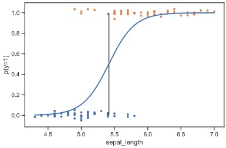

 $ (a) $

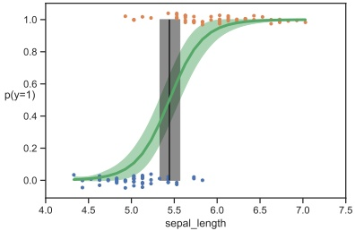

(b)

图 4.20：(a) 使用单个输入特征 x（对应萼片长度）对鸢尾花是否为杂色鸢尾（y=1）或山鸢尾（y=0）进行分类的逻辑回归。标记点已（垂直）抖动以避免过度重叠。垂直线为决策边界。由 $ \text{logreg\_iris\_1d.ipynb} $ 生成。(b) 与 (a) 相同，但展示了后验分布。改编自 [Mar18] 的图 4.4。由 $ \text{logreg\_iris\_bayes\_1d\_pymc3.ipynb} $ 生成。

让我们将该模型应用于以下任务：根据萼片长度 $ x_n $ 的信息，判断鸢尾花是否为山鸢尾或杂色鸢尾，即 $ y_n \in \{0,1\} $。（鸢尾花数据集的描述见第 1.2.1.1 节。）

我们首先使用极大似然估计，对数据集 $ \mathcal{D} = \{(x_n, y_n)\} $ 拟合以下形式的 1 维逻辑回归模型

$$  p(y=1|x;\boldsymbol{\theta})=\sigma(b+wx)   \tag*{(4.201)}$$

（有关如何计算该模型的 MLE 的详细信息，请参见第 10.2.3 节。）图 4.20a 展示了后验预测的插件近似 $ p(y = 1 | x, \hat{\theta}) $，其中 $ \hat{\theta} $ 是参数的 MLE。我们可以看到，随着萼片长度增加，我们对花朵是杂色鸢尾的信心也增加，这由 S 形的逻辑函数表示。

决策边界定义为输入值 $ x^* $，使得 $ p(y = 1|x^*; \hat{\theta}) = 0.5 $。我们可以通过以下方式求解该值：

$$  \sigma(b+wx^{*})=\frac{1}{1+e^{-(b+wx^{*})}}=\frac{1}{2}   \tag*{(4.202)}$$

$$  b+wx^{*}=0   \tag*{(4.203)}$$

$$  x^{*}=-\frac{b}{w}   \tag*{(4.204)}$$

从图 4.20a 中，我们看到 $ x^* \approx 5.5 \, cm $。

然而，上述方法没有对参数估计的不确定性建模，因此忽略了由此产生的输出概率及决策边界位置的不确定性。为了捕捉这一额外的不确定性，我们可以采用贝叶斯方法进行近似。

---

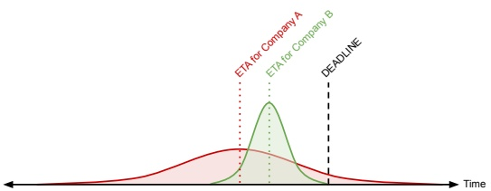

图4.21：两家不同航运公司的到达时间分布。ETA 是预计到达时间。A 公司的分布不确定性更大，可能风险过高。来自 https://bit.ly/39bc4XL。经 Brendan Hasz 许可使用。

后验分布 $p(\boldsymbol{\theta}|\mathcal{D})$（详见第10.5节）。基于此，我们可以使用蒙特卡洛近似来估计后验预测分布：

$$  p(y=1|x,\mathcal{D})\approx\frac{1}{S}\sum_{s=1}^{S}p(y=1|x,\boldsymbol{\theta}^{s})   \tag*{(4.205)}$$

其中 $\boldsymbol{\theta}^{s} \sim p(\boldsymbol{\theta}|\mathcal{D})$ 是后验样本。图4.20b绘制了该函数的均值与95%可信区间。可以看到，现在每个输入对应的预测概率都有一个范围。我们还可以通过蒙特卡洛近似来计算决策边界位置的分布：

$$  p(x^{*}|\mathcal{D})\approx\frac{1}{S}\sum_{s=1}^{S}\delta\left(x^{*}-(-\frac{b^{s}}{w^{s}})\right)   \tag*{(4.206)}$$

其中 $(b^{s}, w^{s}) = \theta^{s}$。该分布的95%可信区间如图4.20b中“加粗”的垂直线所示。

尽管在本应用中仔细建模不确定性可能并不重要，但在风险敏感的应用（如医疗和金融）中，这一点至关重要，我们将在第5章中讨论。

##### 4.6.7.3 示例：二元输入，标量输出

现在假设我们想要预测包裹的送达时间 $y \in \mathbb{R}$，分别由公司A或B发货。我们可以使用二元特征 $x \in \{0,1\}$ 对公司身份进行编码，其中 $x=0$ 表示公司A，$x=1$ 表示公司B。对于此问题，我们采用以下判别模型：

$$  p(y|x,\boldsymbol{\theta})=\mathcal{N}(y|\mu_{x},\sigma_{x}^{2})   \tag*{(4.207)}$$

其中 $\mathcal{N}(y|\mu,\sigma^{2})$ 是高斯分布：

$$  \mathcal{N}(y|\mu,\sigma^{2})\triangleq\frac{1}{\sqrt{2\pi\sigma^{2}}}e^{-\frac{1}{2\sigma^{2}}(y-\mu)^{2}}   \tag*{(4.208)}$$

《概率机器学习：导论》。在线版本。2024年11月23日。

---

并且 $ \boldsymbol{\theta} = (\mu_0, \mu_1, \sigma_0, \sigma_1) $ 是模型的参数。我们可以使用最大似然估计（maximum likelihood estimation）来拟合这个模型，正如我们在第4.2.5节中讨论的那样；或者，我们可以采用贝叶斯方法，如第4.6.4节所述。

贝叶斯方法的优势在于，通过捕获参数 $ \theta $ 中的不确定性，我们也能捕获预测 $ p(y|x,\mathcal{D}) $ 中的不确定性，而使用插件近似 $ p(y|x,\hat{\theta}) $ 则会低估这种不确定性。例如，假设我们对每个公司只使用一次，那么我们的训练集形式为 $ \mathcal{D}=\{(x_1=0,y_1=15),(x_2=1,y_2=20)\} $。正如我们在第4.2.5节中所示，均值的MLE将是经验均值 $ \hat{\mu}_0=15 $ 和 $ \hat{\mu}_1=20 $，但标准差的最大似然估计将是零，$ \hat{\sigma}_0=\hat{\sigma}_1=0 $，因为每个“类别”中只有一个样本。因此，得到的插件预测将无法捕获任何不确定性。

为了理解建模不确定性的重要性，请考虑图4.21。我们看到，公司A的预计到达时间（ETA）比公司B短；然而，A的分布方差更大，这使得如果你希望包裹能在指定截止日期前到达，选择A会更具风险。（关于如何在存在不确定性的情况下选择最优行动的更多细节，请参见第5章。）

当然，上述例子是极端的，因为我们假设每个快递公司只有一个样本。然而，当我们对某种输入只有少量例子时，这种问题就会出现，这在数据具有长尾新模式的场景下很常见，例如新单词组合或分类特征。

##### 4.6.7.4 扩展规模

以上例子都非常简单，涉及一维输入和一维输出，仅包含2到4个参数。大多数实际问题涉及高维输入，有时还有高维输出，因此使用的模型包含大量参数。不幸的是，在这种情况下计算后验 $ p(\boldsymbol{\theta}|\mathcal{D}) $ 和后验预测 $ p(\boldsymbol{y}|\boldsymbol{x},\mathcal{D}) $ 在计算上可能具有挑战性。我们在第4.6.8节中讨论这个问题。

#### 4.6.8 计算问题

给定似然 $ p(\mathcal{D}|\boldsymbol{\theta}) $ 和先验 $ p(\boldsymbol{\theta}) $，我们可以使用贝叶斯规则计算后验 $ p(\boldsymbol{\theta}|\mathcal{D}) $。然而，除了共轭模型（第4.6.1节）或所有潜在变量来自小有限值集合的模型等简单特殊情况外，实际执行这一计算通常是难以处理的。因此，我们需要近似后验。有大量方法用于执行近似后验推断，它们在精度、简单性和速度之间进行权衡。我们在下面简要讨论其中一些算法，但在本系列的后续书籍[Mur23]中会更详细地介绍。（另见[MFR20]对多种近似推断方法的综述，从贝叶斯1763年的原始方法开始。）

作为贯穿示例，我们将使用近似Beta-伯努利模型后验的问题。具体来说，目标是近似

$$  p(\theta|\mathcal{D})\propto\left[\prod_{n=1}^{N}\mathrm{Bin}(y_{n}|\theta)\right]\mathrm{Beta}(\theta|1,1)   \tag*{(4.209)}$$

其中D包含10个正面和1个反面（总观测数N=11），我们使用均匀先验。尽管我们可以精确计算这个后验（见图4.22），但使用

作者：Kevin P. Murphy。 (C) MIT Press. CC-BY-NC-ND许可证

---

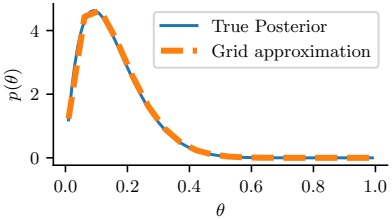

 $ (a) $

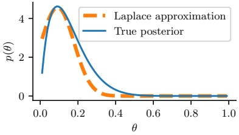

(b)

图 4.22: 对一个 beta-伯努利模型的后验进行近似。(a) 使用 20 个网格点的网格近似。(b) 拉普拉斯近似。由 laplace_approx_beta_binom_jax.ipynb 生成。

正如 4.b.2 节中讨论的方法，这是一个有用的教学示例，因为我们可以将近似与精确解进行比较。此外，由于目标分布只是一维的，可视化结果很容易。（但请注意，这个问题并不完全简单，因为由于使用了不平衡的样本（10 次正面和 1 次反面），后验高度偏斜。）

##### 4.6.8.1 网格近似

近似后验推断的最简单方法是将未知量可能取值的空间划分成一个有限集，记为 $ \theta_1, \ldots, \theta_K $，然后通过暴力枚举来近似后验，如下所示：

$$  p(\boldsymbol{\theta}=\boldsymbol{\theta}_{k}|\mathcal{D})\approx\frac{p(\mathcal{D}|\boldsymbol{\theta}_{k})p(\boldsymbol{\theta}_{k})}{p(\mathcal{D})}=\frac{p(\mathcal{D}|\boldsymbol{\theta}_{k})p(\boldsymbol{\theta}_{k})}{\sum_{k^{\prime}=1}^{K}p(\mathcal{D},\boldsymbol{\theta}_{k^{\prime}})}   \tag*{(4.210)}$$

这被称为网格近似。在图 4.22a 中，我们展示了将此方法应用于一维问题的结果。可以看到，它很容易捕捉到偏斜的后验。不幸的是，这种方法无法扩展到二维或三维以上的问题，因为网格点的数量随维度呈指数增长。

##### 4.6.8.2 二次（拉普拉斯）近似

在本节中，我们讨论一种使用多元高斯分布来近似后验的简单方法；这被称为拉普拉斯近似或二次近似（例如，参见 [TK86; RMC09]）。

为了

$$  p(\boldsymbol{\theta}|\mathcal{D})=\frac{1}{Z}e^{-\mathcal{E}(\boldsymbol{\theta})}   \tag*{(4.211)}$$

其中 $ \mathcal{E}(\boldsymbol{\theta}) = -\log p(\boldsymbol{\theta}, \mathcal{D}) $ 被称为能量函数，而 $ Z = p(\mathcal{D}) $ 是归一化常数。在众数 $ \hat{\boldsymbol{\theta}} $ （即最低能量状态）处进行泰勒级数展开，得到

$$  \mathcal{E}(\boldsymbol{\theta})\approx\mathcal{E}(\hat{\boldsymbol{\theta}})+(\boldsymbol{\theta}-\hat{\boldsymbol{\theta}})^{\top}\boldsymbol{g}+\frac{1}{2}(\boldsymbol{\theta}-\hat{\boldsymbol{\theta}})^{\top}\mathbf{H}(\boldsymbol{\theta}-\hat{\boldsymbol{\theta}})   \tag*{(4.212)}$$

---

其中 g 是众数处的梯度，H 是 Hessian 矩阵。由于 $ \theta $ 是众数，梯度项为零。因此

$$  \hat{p}(\boldsymbol{\theta},\mathcal{D})=e^{-\mathcal{E}(\hat{\boldsymbol{\theta}})}\exp\left[-\frac{1}{2}(\boldsymbol{\theta}-\hat{\boldsymbol{\theta}})^{\top}\mathbf{H}(\boldsymbol{\theta}-\hat{\boldsymbol{\theta}})\right]   \tag*{(4.213)}$$

$$  \hat{p}(\boldsymbol{\theta}|\mathcal{D})=\frac{1}{Z}\hat{p}(\boldsymbol{\theta},\mathcal{D})=\mathcal{N}(\boldsymbol{\theta}|\hat{\boldsymbol{\theta}},\mathbf{H}^{-1})   \tag*{(4.214)}$$

$$  Z=e^{-\mathcal{E}(\hat{\boldsymbol{\theta}})}\big(2\pi\big)^{D/2}|\mathbf{H}|^{-\frac{1}{2}}   \tag*{(4.215)}$$

最后一行来自多元高斯分布的归一化常数。

拉普拉斯近似易于应用，因为我们可以利用现有的优化算法来计算 MAP 估计，然后只需计算众数处的 Hessian 矩阵即可。（在高维空间中，我们可以使用对角近似。）

在图 Figure 4.22b 中，我们展示了将该方法应用于一维问题的结果。不幸的是，我们发现这并不是一个特别好的近似。这是因为后验分布是偏斜的，而高斯分布是对称的。此外，感兴趣的参数位于有界区间 $ \theta \in [0, 1] $ 内，而高斯分布假设无约束空间 $ \boldsymbol{\theta} \in \mathbb{R} $。幸运的是，我们可以通过变量变换来解决后一个问题。例如，在这种情况下，我们可以对 $ \alpha = \log(\theta) $ 应用拉普拉斯近似。这是一种简化推理工作的常用技巧。

##### 4.6.8.3 变分近似

在第 4.6.8.2 节中，我们讨论了拉普拉斯近似，它使用优化过程寻找 MAP 估计，然后基于 Hessian 矩阵近似该点处后验分布的曲率。在本节中，我们讨论变分推理（variational inference, VI），这是另一种基于优化的后验推理方法，但具有更大的建模灵活性（因此可以得到更精确的近似）。

VI 试图用一个易于处理的概率分布 $ q(\boldsymbol{\theta}) $ 来近似一个不易处理的概率分布，如 $ p(\boldsymbol{\theta}|\mathcal{D}) $，以最小化分布之间的某种差异 $ D $：

$$  q^{*}=\underset{q\in\mathcal{Q}}{\operatorname{argmin}}D(q,p)   \tag*{(4.216)}$$

其中 Q 是某个易于处理的分布族（例如，多元高斯分布）。如果我们将 D 定义为 KL 散度（见第 6.2 节），那么我们可以推导出对数边际似然的一个下界；这个量被称为证据下界（evidence lower bound, ELBO）。通过最大化 ELBO，我们可以提高后验近似的质量。详情请参见本书续集 [Mur23]。

##### 4.6.8.4 马尔可夫链蒙特卡洛（MCMC）近似

尽管 VI 是一种快速的基于优化的方法，但它可能给出有偏的后验近似，因为它局限于特定的函数形式 $ q \in \mathcal{Q} $。一种更灵活的方法是使用一组样本进行非参数近似：$ q(\boldsymbol{\theta}) \approx \frac{1}{S} \sum_{s=1}^{S} \delta(\boldsymbol{\theta} - \boldsymbol{\theta}^s) $。这被称为后验的蒙特卡洛近似。关键问题是如何高效地生成后验样本 $ \boldsymbol{\theta}^s \sim p(\boldsymbol{\theta} | \mathcal{D}) $，而无需计算归一化常数 $ p(\mathcal{D}) = \int p(\boldsymbol{\theta}, \mathcal{D}) \, d\boldsymbol{\theta} $。解决此问题的一种常见方法是马尔可夫链蒙特卡洛（Markov chain Monte Carlo, MCMC）。如果我们利用来自 $ \nabla \log p(\boldsymbol{\theta}, \mathcal{D}) $ 的梯度信息来增强该算法，我们可以

---

显著加速该方法；这被称为哈密顿蒙特卡洛（Hamiltonian Monte Carlo, HMC）。详细内容请参见本书的后续章节[Mur23]。

### 4.7 频率派统计学 *

我们在第4.6节中描述的统计推断方法被称为贝叶斯统计学。它将模型参数视作与任何其他未知随机变量一样，并应用概率论规则从数据中推断它们。人们曾尝试设计避免将参数视为随机变量的统计推断方法，从而避免使用先验和贝叶斯规则。这种替代方法被称为频率派统计学、经典统计学或正统统计学。

其基本思想（在第4.7.1节中形式化）是通过计算从数据中估计的量（如参数或预测标签）在数据变化时如何变化来表示不确定性。正是这种重复试验中变异的概念构成了频率派方法用于建模不确定性的基础。相比之下，贝叶斯方法从信息的角度而非重复试验的角度来看待概率。这使得贝叶斯方法能够计算一次性事件的概率，如我们在第2.1.1节中讨论的。也许更重要的是，贝叶斯方法避免了某些困扰频率派方法的悖论（见第4.7.5节和第5.5.4节）。这些病态问题导致著名统计学家George Box说过：

我相信，很难说服一个理智的人相信当前[频率派]统计实践是合理的，但通过似然和贝叶斯定理的方法则会容易得多。——George Box, 1962（引自[Jay76]）。

尽管如此，熟悉频率派统计学仍然是有用的，因为它被广泛使用，并且具有一些即使对贝叶斯派也有用的关键概念[Rub84]。

#### 4.7.1 抽样分布

在频率派统计学中，不确定性不是由随机变量的后验分布来表示，而是由估计量的抽样分布来表示。

术语“估计量”在第5.1节的决策论部分中定义，但简而言之，估计量 $ \delta: \mathcal{D} \to \mathcal{A} $ 是一个决策过程，它指定给定一些观测数据时应采取什么行动。行动可以是预测类别标签，或下一个观测值，或预测未知参数。在后一种情况下，估计量通常用 $ \hat{\theta} $ 表示，但这种表示法有歧义，因为它看起来像是表示参数向量而不是函数。因此，我们将改用 $ \hat{\Theta} $ 的表示法。该函数可以计算MLE，或矩估计等。当应用于一个大小为 $ N $ 的特定数据集时，该函数的输出记为 $ \hat{\boldsymbol{\theta}} = \hat{\boldsymbol{\Theta}}(\mathcal{D}) $，其中 $ \mathcal{D} = \{\boldsymbol{x}_1, \ldots, \boldsymbol{x}_N\} $。

频率派统计学的关键思想是将数据 $ \mathcal{D} $ 视为随机变量，而生成数据的参数 $ \boldsymbol{\theta}^* $ 视为固定但未知的常数。因此 $ \hat{\boldsymbol{\theta}} = \hat{\boldsymbol{\Theta}}(\mathcal{D}) $ 是一个随机变量，其分布被称为估计量的抽样分布。为了理解这意味着什么，假设我们创建 $ S $ 个不同的数据集，每个数据集形如

$$  \mathcal{D}^{(s)}=\{\boldsymbol{x}_{n}\sim p(\boldsymbol{x}_{n}|\boldsymbol{\theta}^{*}):n=1:N\}   \tag*{(4.217)}$$

---

为简洁起见，我们将其表示为 $ \mathcal{D}^{(s)} \sim \theta^* $。现在我们将估计量应用于每个 $ \mathcal{D}^{(s)} $，得到一组估计值 $ \{\hat{\theta}(\mathcal{D}^{(s)})\} $。当 $ S \to \infty $ 时，这组估计值所诱导的分布就是估计量的抽样分布。更精确地，我们有

$$  \mathrm{S a m p l i n g D i s t}(\hat{\Theta},\boldsymbol{\theta}^{*})=\mathrm{P u s h T h r o u g h}(p(\tilde{\mathcal{D}}|\boldsymbol{\theta}^{*}),\hat{\Theta})   \tag*{(4.218)}$$

其中我们将数据分布通过估计量函数进行推送，以诱导出估计值的分布。在某些情况下，我们可以解析地计算抽样分布，如第4.7.2节所述，尽管通常我们需要通过蒙特卡罗方法进行近似，如第4.7.3节所述。

#### 4.7.2 MLE抽样分布的高斯近似

最常见的估计量是MLE。当样本量变大时，某些模型的MLE的抽样分布趋于高斯分布。这被称为抽样分布的渐近正态性。更正式地，我们有如下结果：

定理4.7.1。如果参数是可识别的，则

$$  \mathrm{SamplingDist}(\hat{\boldsymbol{\Theta}}^{\mathrm{m l e}},\boldsymbol{\theta}^{*})\rightarrow\mathcal{N}(\cdot|\boldsymbol{\theta}^{*},(\boldsymbol{N}\mathbf{F}(\boldsymbol{\theta}^{*}))^{-1})   \tag*{(4.219)}$$

其中 $ \mathbf{F}(\boldsymbol{\theta}^{*}) $ 是费舍尔信息矩阵，定义于方程(4.220)。

等价地，上述结果说明 $ \sqrt{NF(\boldsymbol{\theta}^{*})(\hat{\boldsymbol{\theta}}-\boldsymbol{\theta}^{*})} $ 的分布趋近于 $ \mathcal{N}(\mathbf{0},\mathbf{I}) $，其中 $ \hat{\boldsymbol{\theta}}=\hat{\boldsymbol{\Theta}}^{\mathrm{mle}}(\tilde{\mathcal{D}}) $。

费舍尔信息矩阵衡量对数似然曲面在其峰值处的曲率大小，如下所示。更正式地，费舍尔信息矩阵（FIM）被定义为对数似然梯度（也称为得分函数）的协方差：

$$  \mathbf{F}(\boldsymbol{\theta})\triangleq\mathbb{E}_{\boldsymbol{x}\sim p(\boldsymbol{x}|\boldsymbol{\theta})}\left[\nabla\log p(\boldsymbol{x}|\boldsymbol{\theta})\nabla\log p(\boldsymbol{x}|\boldsymbol{\theta})^{\top}\right]   \tag*{(4.220)}$$

因此，其 $(i,j)$ 元素具有形式

$$  F_{ij}=\mathbb{E}_{\boldsymbol{x}\sim\boldsymbol{\theta}}\left[\left(\frac{\partial}{\partial\theta_{i}}\log p(\boldsymbol{x}|\boldsymbol{\theta})\right)\left(\frac{\partial}{\partial\theta_{j}}\log p(\boldsymbol{x}|\boldsymbol{\theta})\right)\right]   \tag*{(4.221)}$$

可以证明如下结果。

定理4.7.2。如果 $ \log p(\boldsymbol{x}|\boldsymbol{\theta}) $ 是二次可微的，并且在某些正则性条件下，FIM等于NLL（负对数似然）的期望海森矩阵，即

$$  \mathbf{F}_{ij}=-\mathbb{E}_{\mathbf{x}\sim\theta}\left[\frac{\partial^{2}}{\partial\theta_{i}\theta_{j}}\log p(\mathbf{x}|\boldsymbol{\theta})\right]   \tag*{(4.222)}$$

如果将关于x的期望替换为观测值，得到经验FIM，我们会发现它等于NLL的海森矩阵。这有助于理解方程(4.219)的结果：具有高曲率（大海森矩阵）的对数似然函数将产生低方差估计，因为参数被数据“很好地确定”，从而对重复抽样具有鲁棒性。

Author: Kevin P. Murphy. (C) MIT Press. CC-BY-NC-ND license

---

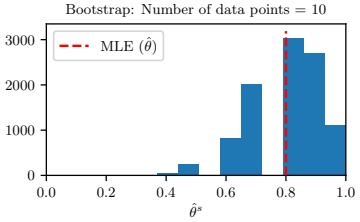

(a)

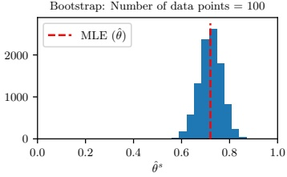

(b)

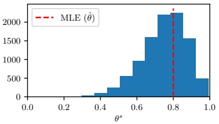

(c)

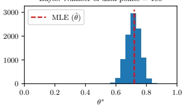

(d)

图 4.23：Bootstrap 方法（上行）与贝叶斯方法（下行）的对比。N 个数据案例由 $ \text{Ber}(\theta=0.7) $ 生成。左列：N = 10。右列：N = 100。(a-b) 伯努利分布 MLE 抽样分布的 Bootstrap 近似。我们展示了基于 B = 10,000 个 Bootstrap 样本的直方图。(c-d) 使用均匀先验从后验分布中抽取的 10,000 个样本的直方图。由 bootstrap_demo_bernoulli.ipynb 生成。

在标量情形下，我们有 $ \mathbb{V}\left[\hat{\theta} - \theta^*\right] \to \frac{1}{NF(\theta^*)} $。估计量抽样分布方差的平方根称为其 **标准误差**（standard error），记为 se。因此，$ \frac{\hat{\theta} - \theta^*}{\text{se}} $ 的分布趋近于 $ \mathcal{N}(0,1) $。实践中，se 未知，但可由数据估计得到。例如，假设 $ X_n \sim \text{Ber}(\theta^*) $，令 $ \hat{\theta} = \frac{1}{N} \sum_{n=1}^N X_n $ 为 MLE。标准误差为 $ \text{se} = \sqrt{\mathbb{V}\left[\hat{\theta}\right]} = \sqrt{\theta^*(1 - \theta^*)/N} $，因此估计的标准误差为 $ \hat{\text{se}} = \sqrt{\hat{\theta}(1 - \hat{\theta})/N} $。

#### 4.7.3 任意估计量抽样分布的 Bootstrap 近似

当估计量是数据的复杂函数（例如，不仅仅是 MLE）或样本量较小时，我们可以使用一种称为 **Bootstrap** 的蒙特卡罗技术来近似其抽样分布。

基本思想很简单：如果我们知道真实参数 $ \boldsymbol{\theta}^* $，我们就可以从真实分布中生成许多（例如 $ S $ 个）伪造数据集，每个大小为 $ N $，即 $ \hat{\mathcal{D}}^{(s)} = \{\boldsymbol{x}_n \sim p(\boldsymbol{x}_n | \boldsymbol{\theta}^*) : n = 1 : N\} $。然后每个样本计算估计值 $ \hat{\boldsymbol{\theta}}^s = \hat{\boldsymbol{\Theta}}(\tilde{\mathcal{D}}^{(s)}) $，并使用所得 $ \hat{\boldsymbol{\theta}}^s $ 的经验分布作为抽样分布的估计，如公式(4.218)所示。由于 $ \boldsymbol{\theta}^* $ 是

---

未知情况下，我们可以将数据集本身作为 $ p(\boldsymbol{x}_n|\boldsymbol{\theta}^*) $ 的经验近似。更精确地说，其思想是通过从原始数据集中有放回地采样 $ N $ 个数据点来生成每个 $ \tilde{D}^{(s)} $。（如果无放回地采样 $ N $ 次，我们只会得到原始数据集。）这就像“靠自己的靴襻把自己提起来”，因为我们使用观测到的数据样本生成新的假设数据样本。 $ ^6 $

图 4.23(a-b) 展示了一个示例，其中我们使用自助法计算伯努利分布的最大似然估计的采样分布。当 N = 10 时，我们看到采样分布是不对称的，因此与高斯分布相去甚远，但当 N = 100 时，分布看起来更接近高斯分布，正如理论所表明的那样（参见第 4.7.2 节）。

自助法样本中独特数据点的数量平均仅为 $ 0.632 \times N $。（要理解这一点，注意一个项目至少被选中一次的概率是 $ (1 - (1 - 1/N)^N) $，对于大的 $ N $ ，它趋近于 $ 1 - e^{-1} \approx 0.632 $。）然而，还有一些更复杂的自助法版本可以改进这一点（参见例如 [Efr87; EH16]）。

##### 4.7.3.1 自助法是“穷人的”后验

一个自然的问题是：由自助法计算出的参数估计 $ \hat{\boldsymbol{\theta}}^{s} = \hat{\Theta}(\mathcal{D}^{(s)}) $ 与从后验中采样的参数值 $ \boldsymbol{\theta}^{s} \sim p(\cdot|\mathcal{D}) $ 之间有什么联系？概念上它们截然不同。但在常见情况下，当估计器是最大似然估计且先验不是很强时，它们可能非常相似。例如，图 4.23(c-d) 展示了一个示例，其中我们使用均匀的 Beta(1,1) 先验计算后验，然后从中采样。我们看到后验与采样分布相当相似。因此，可以将自助法分布视为一种“穷人的”后验 [HTF01, p235]。

但也许令人惊讶的是，自助法可能比后验采样更慢。原因在于自助法需要生成 S 个采样数据集，然后对每一个拟合模型。相比之下，在后验采样中，我们仅需对给定的单个数据集“拟合”一次模型。（关于在应用于海量数据集时加速自助法的一些方法，在 [Kle+11] 中有所讨论。）

#### 4.7.4 置信区间

在频率统计中，我们使用采样分布引起的变异性来估计参数估计的不确定性。

特别地，我们将参数 $ \theta $ 的 $ 100(1 - \alpha)\% $ 置信区间定义为一个估计器，它返回一个以至少 $ 1 - \alpha $ 的概率包含真实参数的区间。用 $ I(\mathcal{D}) = (\ell(\mathcal{D}), u(\mathcal{D})) $ 表示该估计器。这个估计器的采样分布是通过采样 $ \tilde{D} \sim \theta^* $ 然后计算 $ I(\tilde{D}) $ 得到的分布。我们要求

$$  \operatorname{Pr}(\theta^{*}\in I(\tilde{\mathcal{D}})|\tilde{\mathcal{D}}\sim\theta^{*})\geq1-\alpha   \tag*{(4.223)}$$

通常取 $ \alpha = 0.05 $，得到 95% 的置信区间。这意味着，如果我们重复采样数据，并对每个这样的数据集计算 $ I(\tilde{\mathcal{D}}) $，那么大约 95% 的此类区间将包含真实参数 $ \theta $。

---

我们来举一个例子。假设 $\hat{\theta} = \hat{\Theta}(\mathcal{D})$ 是某个参数的估计量，其真实但未知的值为 $\theta^*$。同时，假设 $\Delta = \theta^* - \hat{\theta}$ 的采样分布已知。令 $\underline{\delta}$ 和 $\overline{\delta}$ 分别表示该分布的 $\alpha/2$ 和 $1 - \alpha/2$ 分位数，因此有

$$  \Pr(\underline{\delta}\leq\Delta\leq\overline{\delta})=\Pr(\underline{\delta}\leq\theta^{*}-\hat{\theta}\leq\overline{\delta})=1-\alpha   \tag*{(4.224)}$$

重新整理可得

$$  \Pr(\hat{\theta}+\underline{\delta}\leq\theta^{*}\leq\hat{\theta}+\overline{\delta})=1-\alpha   \tag*{(4.225)}$$

因此，我们可以按如下方式构造一个 $100(1-\alpha)\%$ 的置信区间：

$$  I(\mathcal{D})=(L,U)=(\hat{\theta}(\mathcal{D})+\underline{\delta}(\mathcal{D}),\hat{\theta}(\mathcal{D})+\overline{\delta}(\mathcal{D}))   \tag*{(4.226)}$$

在某些情况下，我们可以解析地计算上述区间的采样分布。然而，更常见的是假设采样分布服从高斯近似，如第 4.7.2 节所述。在这种情况下，我们有 $\hat{\theta} \approx \mathcal{N}(\theta^*, \hat{\mathbf{s}}^2)$。因此，我们可以利用下式计算出近似置信区间：

$$  I=(\hat{\theta}-z_{\alpha/2}\hat{\mathrm{s e}},\hat{\theta}+z_{\alpha/2}\hat{\mathrm{s e}})   \tag*{(4.227)}$$

其中 $z_{\alpha/2}$ 是高斯累积分布函数的 $\alpha/2$ 分位数。若令 $\alpha = 0.05$，则 $z_{\alpha/2} = 1.96$，这就证明了常用近似 $\hat{\theta} \pm 2\hat{s}e$ 的合理性。

如果高斯近似效果不佳，我们可以使用自助法近似（参见第 4.7.3 节）。具体地，我们从 $\hat{\theta}(\mathcal{D})$ 中采样 $S$ 个数据集，并对每个数据集应用该估计量，得到 $\hat{\theta}(\mathcal{D}^{(s)})$；然后利用 $\hat{\theta}(\mathcal{D}) - \hat{\theta}(\mathcal{D}^{(s)})$ 的经验分布作为 $\Delta$ 采样分布的近似。进而，我们可以使用该分布的 $\alpha/2$ 和 $1 - \alpha/2$ 分位数来推导出置信区间（详见 [Was04, p110]）。

#### 4.7.5 注意：置信区间并非可信区间

人们通常认为，给定数据 $\mathcal{D}$ 后，参数估计 $\theta$ 的 95% 置信区间 $I$ 意味着真实参数落在此区间内的概率为 0.95，即 $p(\theta^* \in I | \mathcal{D}) = 0.95$。然而，这个量实际上是贝叶斯可信区间（第 4.6.6 节）所计算的内容，而不是频率学家置信区间所计算的内容。相反，频率学派的方法仅意味着生成置信区间的过程在 95% 的情况下会包含真实值。也就是说，如果我们从 $\theta^*$ 反复采样数据集 $\mathcal{D}$，并计算它们的置信区间得到 $I(\mathcal{D})$，那么将有 $\Pr(\theta^* \in I(\mathcal{D})) = 0.95$，正如我们在第 4.7.4 节中所解释的那样。因此，我们看到这些概念是截然不同的：在频率学派方法中，$\theta$ 被视作未知的固定常数，而数据被视为随机的。在贝叶斯方法中，我们将数据视为固定的（因为它是已知的），而将参数视为随机的（因为它是未知的）。

这种反直觉的置信区间定义可能导致奇怪的结果。考虑以下来自 [Ber85, p11] 的例子。假设我们从下式中抽取两个整数 $\mathcal{D} = (y_1, y_2)$

$$  p(y|\theta)=\left\{\begin{array}{ll}0.5&if y=\theta\\0.5&if y=\theta+1\\0&otherwise\end{array}\right.   \tag*{(4.228)}$$

---

如果  $\theta = 39$，我们会期望以下结果各以概率 0.25 出现：

$$  \left(39,39\right),\left(39,40\right),\left(40,39\right),\left(40,40\right)   \tag*{(4.229)}$$

令  $m = \min(y_1, y_2)$，并定义如下区间：

$$  [\ell(\mathcal{D}),u(\mathcal{D})]=[m,m]   \tag*{(4.230)}$$

对于上述样本，这给出：

$$  \left[39,39\right],\quad\left[39,39\right],\quad\left[39,39\right],\quad\left[40,40\right]   \tag*{(4.231)}$$

因此，方程 (4.230) 显然是一个 75% 的置信区间，因为 39 包含在 3/4 的这些区间中。然而，如果我们观察到  $\mathcal{D} = (39, 40)$，那么  $p(\theta = 39|\mathcal{D}) = 1.0$，因此我们知道  $\theta$ 必须是 39，但我们却只有 75% 的“置信度”相信这一事实。我们看到，如果从不同的随机采样数据集中计算多个置信区间，那么置信区间将在 75% 的情况下“覆盖”真实参数，但如果我们只有一个观察到的数据集，因此只有一个置信区间，那么频率学派的“覆盖”概率可能会非常误导人。

另一个不那么人为构造的例子如下。假设我们要估计一个伯努利分布的参数  $\theta$。令  $\overline{y} = \frac{1}{N} \sum_{n=1}^{N} y_n$ 为样本均值。MLE 是  $\hat{\theta} = \overline{y}$。伯努利参数的近似 95% 置信区间为  $\overline{y} \pm 1.96 \sqrt{\frac{\overline{y}(1 - \overline{y})}{N}}$（这称为 Wald 区间，基于二项分布的高斯近似；与方程 (4.128) 比较）。现在考虑单次试验，其中  $N = 1$ 且  $y_1 = 0$。MLE 为 0，这导致了过拟合，正如我们在第 4.5.1 节中所见。但我们的 95% 置信区间也是  $(0, 0)$，这似乎更糟糕。有人可能会争辩说，上述缺陷是因为我们用高斯分布近似了真实的采样分布，或者因为样本量太小，或者参数“过于极端”。然而，即使在 N 很大且参数非极端的情况下，Wald 区间也可能表现得不好 [BCD01]。相比之下，采用无信息 Jeffreys 先验的贝叶斯可信区间则表现出我们期望的行为。

更多有趣的例子及其 Python 代码可以在 [Van14] 中找到。另见 [Hoe+14; Mor+16; Lyu+20; Cha+19b]，这些文章表明，包括专业统计学家在内的许多人，在实践中误解并误用了频率学派的置信区间，而贝叶斯可信区间则不存在这些问题。

#### 4.7.6 偏差-方差权衡

估计量是应用于数据并返回估计值的过程。令  $\hat{\theta}(\cdot)$ 为估计量， $\hat{\theta}(\mathcal{D})$ 为估计值。在频率学派统计学中，我们将数据视为从某个真实但未知的分布  $p^{*}(\mathcal{D})$ 中抽取的随机变量；这会在估计值上诱导出一个分布  $p^{*}(\hat{\theta}(\mathcal{D}))$，称为采样分布（见第 4.7.1 节）。在本节中，我们讨论该分布的两个关键性质：偏差和方差，如下定义。

##### 4.7.6.1 估计量的偏差

估计量的偏差定义为

$$  \mathrm{bias}(\hat{\theta}(\cdot))\triangleq\mathbb{E}\left[\hat{\theta}(\mathcal{D})\right]-\theta^{*}   \tag*{(4.232)}$$

作者：Kevin P. Murphy。 (C) MIT 出版社。 CC-BY-NC-ND 许可证

---

其中 $ \theta^* $ 为真实参数值，期望是相对于“自然分布” $ p(\mathcal{D}|\theta^*) $ 而言的。若偏差为零，则该估计量称为无偏估计量。例如，高斯均值的 MLE 是无偏的：

$$  \mathrm{bias}(\hat{\mu})=\mathbb{E}\left[\overline{x}\right]-\mu=\mathbb{E}\left[\frac{1}{N}\sum_{n=1}^{N}x_{n}\right]-\mu=\frac{N\mu}{N}-\mu=0   \tag*{(4.233)}$$

其中 $ \overline{x} $ 是样本均值。

然而，高斯方差的 MLE，即 $ \sigma_{\mathrm{mle}}^{2} = \frac{1}{N} \sum_{n=1}^{N} (x_{n} - \overline{x})^{2} $，并不是 $ \sigma^{2} $ 的无偏估计量。事实上，可以证明（练习 4.7）：

$$  \mathbb{E}\left[\sigma_{mle}^{2}\right]=\frac{N-1}{N}\sigma^{2}   \tag*{(4.234)}$$

因此，极大似然估计会略微低估方差。直观上，这是因为我们“用掉”了一个数据点来估计均值，所以当样本量为 1 时，方差估计会为零。然而，如果 $ \mu $ 已知，则极大似然估计是无偏的（见练习 4.8）。

现在考虑以下估计量：

$$  \sigma_{\mathrm{unb}}^{2}\triangleq\frac{1}{N-1}\sum_{n=1}^{N}(x_{n}-\overline{x})^{2}=\frac{N}{N-1}\sigma_{\mathrm{m l e}}^{2}   \tag*{(4.235)}$$

这是一个无偏估计量，我们可以如下简单证明：

$$  \mathbb{E}\left[\sigma_{\mathrm{unb}}^{2}\right]=\frac{N}{N-1}\mathbb{E}\left[\sigma_{\mathrm{mle}}^{2}\right]=\frac{N}{N-1}\frac{N-1}{N}\sigma^{2}=\sigma^{2}   \tag*{(4.236)}$$

##### 4.7.6.2 估计量的方差

直观上，我们希望估计量是无偏的，这似乎合理。然而，仅无偏是不够的。例如，假设我们要从 $\mathcal{D} = \{x_1, \ldots, x_N\}$ 中估计高斯分布的均值。仅考虑第一个数据点的估计量 $\hat{\theta}(\mathcal{D}) = x_1$ 是一个无偏估计量，但通常它比经验均值 $\overline{x}$（也是无偏的）更远离 $\theta^*$。因此，估计量的方差也很重要。

我们定义估计量的方差如下：

$$  \mathbb{V}\left[\hat{\theta}\right]\triangleq\mathbb{E}\left[\hat{\theta}^{2}\right]-\left(\mathbb{E}\left[\hat{\theta}\right]\right)^{2}   \tag*{(4.237)}$$

其中期望是相对于 $ p(\mathcal{D}|\theta^*) $ 取值的。这度量了当数据变化时，我们的估计会变化多少。我们可以将其扩展为向量值估计量的协方差矩阵。

直观上，我们希望估计量的方差尽可能小。因此，一个自然的问题是：方差能小到什么程度？一个著名结果——**克拉默-拉奥下界**——为任何无偏估计量的方差提供了一个下界。更精确地说，设 $ X_1, \ldots, X_N \sim p(X|\theta^*) $ 且 $ \hat{\theta} = \hat{\theta}(x_1, \ldots, x_N) $ 是 $ \theta^* $ 的一个无偏估计量。那么，在 $ p(X|\theta^*) $ 的各种光滑性假设下，我们有 $ \mathbb{V}\left[\hat{\theta}\right] \geq \frac{1}{NF(\theta^*)} $，其中 $ F(\theta^*) $ 是 Fisher 信息矩阵（第 4.7.2 节）。证明可见例如文献 [Ric95, p275]。

可以证明，MLE 达到了克拉默-拉奥下界，因此在所有无偏估计量中具有最小的渐近方差。因此，MLE 被称为**渐近最优**的。

---

##### 4.7.6.3 偏差-方差权衡

本节讨论在参数估计方法选择时需要做出的一种基本权衡，假设我们的目标是使估计的均方误差（MSE）最小化。令 $ \hat{\theta} = \hat{\theta}(\mathcal{D}) $ 表示估计值，$ \overline{\theta} = \mathbb{E}\left[\hat{\theta}\right] $ 表示估计值的期望（随着 $ \mathcal{D} $ 的变化而变化）。（所有期望和方差都是关于 $ p(\mathcal{D}|\theta^*) $ 的，但为符号简洁我们省略显式条件。）于是有

$$  \mathbb{E}\left[(\hat{\theta}-\theta^{*})^{2}\right]=\mathbb{E}\left[\left[(\hat{\theta}-\overline{\theta})+(\overline{\theta}-\theta^{*})\right]^{2}\right]   \tag*{(4.238)}$$

$$  =\mathbb{E}\left[\left(\hat{\theta}-\overline{\theta}\right)^{2}\right]+2(\overline{\theta}-\theta^{*})\mathbb{E}\left[\hat{\theta}-\overline{\theta}\right]+(\overline{\theta}-\theta^{*})^{2}   \tag*{(4.239)}$$

$$  =\mathbb{E}\left[\left(\hat{\theta}-\overline{\theta}\right)^{2}\right]+(\overline{\theta}-\theta^{*})^{2}   \tag*{(4.240)}$$

$$  =\mathbb{V}\left[\hat{\theta}\right]+\mathrm{b i a s}^{2}(\hat{\theta})   \tag*{(4.241)}$$

用文字表述为：

$$ \mathrm{M S E}=\mathrm{v a r i a n c e}+\mathrm{b i a s}^{2} $$

这被称为**偏差-方差权衡**（参见例如 [GBD92]）。这意味着，如果目标是使平方误差最小化，那么使用有偏估计可能是明智的，只要它使方差减少的程度超过偏差的平方。

##### 4.7.6.4 示例：高斯均值的最大后验估计

我们基于 [Hof09, p79] 给出一个例子。假设我们要从 $ \boldsymbol{x} = (x_1, \ldots, x_N) $ 中估计高斯分布的均值。假设数据采样自 $ x_n \sim \mathcal{N}(\theta^* = 1, \sigma^2) $。一个明显的估计是最大似然估计。它的偏差为0，方差为

$$  \mathbb{V}\left[\overline{x}|\theta^{*}\right]=\frac{\sigma^{2}}{N}   \tag*{(4.243)}$$

但我们也可以使用最大后验估计。在第4.6.4.2节中，我们展示了在形如 $ \mathcal{N}(\theta_0, \sigma^2/\kappa_0) $ 的高斯先验下，最大后验估计为

$$  \tilde{x}\triangleq\frac{N}{N+\kappa_{0}}\overline{x}+\frac{\kappa_{0}}{N+\kappa_{0}}\theta_{0}=w\overline{x}+(1-w)\theta_{0}   \tag*{(4.244)}$$

其中 $ 0 \leq w \leq 1 $ 控制着相对于先验我们对最大似然估计的信任程度。偏差和方差为

$$  \mathbb{E}\left[\tilde{x}\right]-\theta^{*}=w\theta^{*}+(1-w)\theta_{0}-\theta^{*}=\left(1-w\right)\left(\theta_{0}-\theta^{*}\right)   \tag*{(4.245)}$$

$$  \mathbb{V}\left[\tilde{x}\right]=w^{2}\frac{\sigma^{2}}{N}   \tag*{(4.246)}$$

作者：Kevin P. Murphy。 (C) MIT Press。 CC-BY-NC-ND 许可证。

---

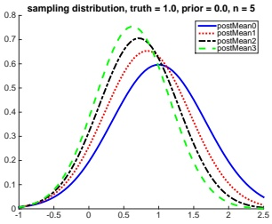

(a)

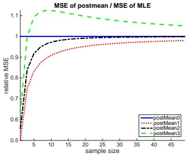

(b)

图4.24：左侧：在不同先验强度 $\kappa_0$ 下，基于 $\mathcal{N}(\theta_0 = 0, \sigma^2 / \kappa_0)$ 先验的MAP估计（等价于后验均值）的抽样分布。（若设 $\kappa = 0$，则MAP估计退化为MLE。）数据为从 $\mathcal{N}(\theta^* = 1, \sigma^2 = 1)$ 中抽取的 $n = 5$ 个样本。右侧：MSE相对于MLE的比值随样本量的变化。改编自[Hof09]的图5.6，由 samplingDistributionGaussianShrinkage.ipynb 生成。

因此，尽管MAP估计是有偏的（假设 $w < 1$），但其方差更低。

假设我们的先验略有误设，即使用 $\theta_0 = 0$，而真实值为 $\theta^* = 1$。在图4.24(a)中，我们看到当 $\kappa_0 > 0$ 时，MAP估计的抽样分布偏离了真实值，但方差比MLE更小（分布更窄）。

在图4.24(b)中，我们绘制了 $\text{mse}(\tilde{x})/\text{mse}(\overline{x})$ 随 $N$ 的变化曲线。可以看出，当 $\kappa_0 \in \{1, 2\}$ 时，MAP估计的MSE低于MLE。$\kappa_0 = 0$ 对应MLE，而 $\kappa_0 = 3$ 对应强先验，由于先验均值错误，这反而损害了性能。由此可见，只要先验强度被适当“调优”，MAP估计在最小化MSE方面可以优于ML估计。

##### 4.7.6.5 示例：线性回归的MAP估计

另一个关于偏差-方差权衡的重要例子出现在岭回归中，我们将在第11.3节讨论。简而言之，这对应于在高斯先验 $p(\boldsymbol{w}) = \mathcal{N}(\boldsymbol{w} | \boldsymbol{0}, \lambda^{-1} \mathbf{I})$ 下线性回归的MAP估计。零均值先验鼓励权重取小值，从而减少过拟合；精度项 $\lambda$ 控制该先验的强度。设 $\lambda = 0$ 得到MLE；使用 $\lambda > 0$ 则得到有偏估计。为了说明对方差的影响，考虑一个简单例子：用两个不同的 $\lambda$ 值拟合一维岭回归模型。图4.25左侧绘制了每条单独的拟合曲线，右侧绘制了平均拟合曲线。可以看出，随着正则化强度的增加，方差减小，但偏差增大。

另见图4.26，我们以漫画形式给出了模型复杂性方面的偏差-方差权衡示意图。

---

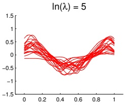

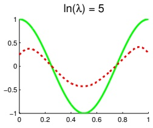

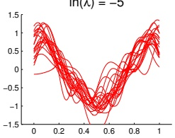

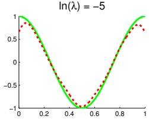

图4.25：岭回归的偏差-方差权衡示意图。我们从真实函数（绿色实线所示）生成了100个数据集。左图：绘制了20个不同数据集的正则化拟合结果。我们使用高斯RBF扩展进行线性回归，在[0,1]区间内均匀分布25个中心。右图：绘制了所有100个数据集的拟合平均值。顶行：强正则化——我们观察到各个拟合彼此相似（低方差），但平均值远离真实值（高偏差）。底行：弱正则化——我们观察到各个拟合彼此差异很大（高方差），但平均值接近真实值（低偏差）。改编自[Bis06]图3.5。由biasVarModelComplexity3.ipynb生成。

图4.26：偏差-方差权衡的卡通示意图。来自http://scott.fortmann-roe.com/docs/BiasVariance.html。经Scott Fortmann-Roe友好许可使用。

---

##### 4.7.6.6 分类的偏差-方差权衡

如果我们使用0-1损失而非平方误差，频率学派风险便无法再表示为偏差平方加方差。事实上，可以证明（[HTF09]的练习7.2）偏差和方差以乘法方式结合。如果估计值位于决策边界的正确一侧，则偏差为负，减小方差将降低误分类率。但如果估计值位于决策边界错误的一侧，则偏差为正，因此增加方差反而有益[Fri97a]。这一鲜为人知的事实表明，偏差-方差权衡对分类问题并不十分有用。更好的做法是关注期望损失，而非直接关注偏差和方差。我们可以通过交叉验证来近似期望损失，如第4.5.5节所述。

### 4.8 习题

##### Exercise 4.1 [一元高斯分布的MLE †]

证明一元高斯分布的MLE由下式给出

$$  \hat{\mu}=\frac{1}{N}\sum_{n=1}^{N}y_{n}   \tag*{(4.247)}$$

$$  \hat{\sigma}^{2}=\frac{1}{N}\sum_{n=1}^{N}(y_{n}-\hat{\mu})^{2}   \tag*{(4.248)}$$

##### Exercise 4.2 [一维高斯分布的MAP估计 $ \dagger $]

（来源：Jaakkola.）

考虑来自高斯随机变量的样本 $ x_1, \ldots, x_n $，其方差 $ \sigma^2 $ 已知，均值 $ \mu $ 未知。我们进一步假设均值上的先验分布（也是高斯分布）为 $ \mu \sim \mathcal{N}(m, s^2) $，其中均值 $ m $ 和方差 $ s^2 $ 固定。因此唯一的未知参数是 $ \mu $。

a. 计算MAP估计 $ \hat{\mu}_{MAP} $。你可以直接陈述结果而不提供证明。或者，通过更复杂的工作，你可以计算对数后验的导数，令其为零并求解。

b. 证明随着样本数量 n 增加，MAP估计收敛到最大似然估计。

c. 假设 $n$ 很小且固定。如果我们增大先验方差 $s^{2}$，MAP估计器收敛到什么？

d. 假设 n 很小且固定。如果我们减小先验方差 $ s^{2} $，MAP估计器收敛到什么？

##### Exercise 4.3 [高斯后验可信区间]

（来源：DeGroot.）

设 $ X \sim \mathcal{N}(\mu, \sigma^2 = 4) $，其中 $ \mu $ 未知但具有先验 $ \mu \sim \mathcal{N}(\mu_0, \sigma_0^2 = 9) $。观察到 $ n $ 个样本后的后验为 $ \mu \sim \mathcal{N}(\mu_n, \sigma_n^2) $。（这称为可信区间，是置信区间的贝叶斯类比。）$ n $ 需要多大才能确保

$$  p(\ell\leq\mu_{n}\leq u|D)\geq0.95   \tag*{(4.249)}$$

其中 $(\ell, u)$ 是一个宽度为1的区间（以 $\mu_n$ 为中心），$D$ 是数据？提示：回忆高斯分布95%的概率质量位于均值 $\pm 1.96\sigma$ 范围内。

---

##### 习题 4.4 [高斯分布的 BIC  $ \dagger $]

（来源：Jaakkola）

贝叶斯信息准则（BIC）是一种可用于模型选择的惩罚对数似然函数，其定义为

$$  B I C=\log p(\mathcal{D}|\hat{\pmb{\theta}}_{M L})-\frac{d}{2}\log(N)   \tag*{(4.250)}$$

其中 $d$ 是模型中的自由参数个数，$N$ 是样本数。本题中我们将探讨如何利用该准则在完全协方差高斯分布与对角协方差高斯分布之间进行选择。显然，完全协方差高斯分布具有更高的似然值，但如果相对于对角协方差矩阵的改进过小，则可能“不值得”增加额外的参数。因此，我们使用 BIC 分数来选择模型。

我们可以写出

$$  \log p(\mathcal{D}|\hat{\mathbf{\Sigma}},\hat{\boldsymbol{\mu}})=-\frac{N}{2}\mathrm{t r}\left(\hat{\mathbf{\Sigma}}^{-1}\hat{\mathbf{S}}\right)-\frac{N}{2}\log(|\hat{\mathbf{\Sigma}}|)   \tag*{(4.251)}$$

$$  \hat{\mathbf{S}}=\frac{1}{N}\sum_{i=1}^{N}(\mathbf{x}_{i}-\overline{\mathbf{x}})(\mathbf{x}_{i}-\overline{\mathbf{x}})^{T}   \tag*{(4.252)}$$

其中 $\hat{S}$ 是散布矩阵（经验协方差），矩阵的迹为其对角元素之和，并且我们使用了迹技巧。

a. 推导 $D$ 维完全协方差矩阵高斯分布的 BIC 分数。尽可能简化你的答案，充分利用最大似然估计的形式。务必明确自由参数个数 $d$。

b. 推导 $D$ 维对角协方差矩阵高斯分布的 BIC 分数。务必明确自由参数个数 $d$。提示：对于对角情形，$\Sigma$ 的最大似然估计与 $\hat{\Sigma}_{ML}$ 相同，只是非对角元素为零：

$$  \hat{\mathbf{\Sigma}}_{d i a g}=\mathrm{d i a g}(\hat{\mathbf{\Sigma}}_{M L}(1,1),\ldots,\hat{\mathbf{\Sigma}}_{M L}(D,D))   \tag*{(4.253)}$$

##### 习题 4.5 [二维离散分布的 BIC]

（来源：Jaakkola）

令 $x \in \{0,1\}$ 表示一次抛硬币的结果（$x=0$ 为反面，$x=1$ 为正面）。硬币可能有偏，因此正面出现的概率为 $\theta_1$。假设另一个人观察硬币翻转并向你报告结果 $y$，但此人不可靠，仅以概率 $\theta_2$ 正确报告结果；即 $p(y | x, \theta_2)$ 由下式给出

<table border=1 style='margin: auto; word-wrap: break-word;'><tr><td style='text-align: center; word-wrap: break-word;'></td><td style='text-align: center; word-wrap: break-word;'>y=0</td><td style='text-align: center; word-wrap: break-word;'>y=1</td></tr><tr><td style='text-align: center; word-wrap: break-word;'>x=0</td><td style='text-align: center; word-wrap: break-word;'>$ \theta_{2} $</td><td style='text-align: center; word-wrap: break-word;'>$ 1-\theta_{2} $</td></tr><tr><td style='text-align: center; word-wrap: break-word;'>x=1</td><td style='text-align: center; word-wrap: break-word;'>$ 1-\theta_{2} $</td><td style='text-align: center; word-wrap: break-word;'>$ \theta_{2} $</td></tr></table>

假设 $\theta_2$ 与 $x$ 和 $\theta_1$ 相互独立。

a. 写出联合概率分布 $p(x, y|\boldsymbol{\theta})$ 的 $2 \times 2$ 表格形式，用 $\boldsymbol{\theta} = (\theta_1, \theta_2)$ 表示。

b. 假设有以下数据集：$\boldsymbol{x} = (1, 1, 0, 1, 1, 0, 0)$，$\boldsymbol{y} = (1, 0, 0, 0, 1, 0, 1)$。求 $\theta_1$ 和 $\theta_2$ 的最大似然估计。解释你的答案。提示：注意似然函数可以分解为

$$  p(x,y|\boldsymbol{\theta})=p(y|x,\theta_{2})p(x|\theta_{1})   \tag*{(4.254)}$$

求 $p(\mathcal{D}|\hat{\boldsymbol{\theta}}, M_{2})$，其中 $M_{2}$ 表示这个双参数模型。（如果愿意，答案可以保留分数形式。）

作者：Kevin P. Murphy。 (C) MIT Press. CC-BY-NC-ND 许可证。

---

c. 现在考虑一个具有4个参数的模型，$ \boldsymbol{\theta} = (\theta_{0,0}, \theta_{0,1}, \theta_{1,0}, \theta_{1,1}) $，表示 $ p(x, y|\boldsymbol{\theta}) = \theta_{x,y} $。（其中只有3个参数可以自由变化，因为它们必须求和为1。）$\boldsymbol{\theta}$ 的最大似然估计（MLE）是什么？$ p(\mathcal{D}|\hat{\boldsymbol{\theta}}, M_4) $ 是多少？这里 $ M_4 $ 表示这个4参数模型。

d. 假设我们不确定哪个模型是正确的。我们计算2参数模型和4参数模型的留一法交叉验证对数似然，如下所示：

$$ L(m)=\sum_{i=1}^{n}\log p(x_{i},y_{i}|m,\hat{\theta}(\mathcal{D}_{-i})) \tag*{(4.255)} $$

其中 $ \hat{\theta}(\mathcal{D}_{-i}) $ 表示在去除第 i 行的 $\mathcal{D}$ 上计算得到的 MLE。交叉验证会选择哪个模型？为什么？提示：注意每次省略一个训练样本时，计数表会如何变化。

e. 回忆一下，交叉验证的一种替代方法是使用 BIC 分数，定义为

$$ \mathrm{B I C}(M,\mathcal{D})\triangleq\log p(\mathcal{D}|\hat{\boldsymbol{\theta}}_{M L E})-\frac{\mathrm{d o f}(M)}{2}\log N \tag*{(4.256)} $$

其中 $ \text{dof}(M) $ 是模型中自由参数的个数。计算两个模型的 BIC 分数（使用自然对数）。BIC 更偏好哪个模型？

习题4.6 [混合共轭先验是共轭的 $ \dagger $]

考虑一个混合先验

$$ p(\theta)=\sum_{k}p(z=k)p(\theta|z=k) \tag*{(4.257)} $$

其中每个 $ p(\theta|z=k) $ 对似然是共轭的。证明这是一个共轭先验。

习题4.7 [ML 估计量 $ \sigma_{mle}^{2} $ 是有偏的]

证明 $ \hat{\sigma}_{MLE}^2 = \frac{1}{N} \sum_{n=1}^N (x_n - \hat{\mu})^2 $ 是 $ \sigma^2 $ 的一个有偏估计量，即证明

$$ \mathbf{E}_{\mathrm{X}_{1},\ldots,\mathrm{X}_{\mathrm{n}}\sim\mathcal{N}(\mu,\sigma)}\big[\hat{\sigma}^{2}(\mathrm{X}_{1},\ldots,\mathrm{X}_{\mathrm{n}})\big]\neq\sigma^{2} $$

提示：注意 $ X_{1},\ldots,X_{N} $ 是独立的，并利用独立随机变量乘积的期望等于期望的乘积这一事实。

##### 习题4.8 [当 $ \mu $ 已知时 $ \sigma^{2} $ 的估计 $ \dagger $]

假设我们采样 $ x_1, \ldots, x_N \sim \mathcal{N}(\mu, \sigma^2) $，其中 $ \mu $ 是已知常数。推导这种情况下 $ \sigma^2 $ 的 MLE 表达式。它是否无偏？

习题4.9 [高斯方差的估计量的方差和 MSE $ \dagger $] 证明高斯方差 MLE 的标准误差为

$$ \sqrt{\mathbb{V}\left[\sigma_{mle}^{2}\right]}=\sqrt{\frac{2(N-1)}{N^{2}}}\sigma^{2} \tag*{(4.258)} $$

提示：利用以下事实

$$ \frac{N-1}{\sigma^{2}}\sigma_{\mathrm{unb}}^{2}\sim\chi_{N-1}^{2}, \tag*{(4.259)} $$

且 $ \mathbb{V}\left[\chi_{N-1}^{2}\right]=2(N-1) $。最后，证明 $ \mathrm{MSE}(\sigma_{\mathrm{unb}}^{2})=\frac{2N-1}{N^{2}}\sigma^{4} $ 且 $ \mathrm{MSE}(\sigma_{\mathrm{mle}}^{2})=\frac{2}{N-1}\sigma^{4} $。

---

## 5 决策理论

### 5.1 贝叶斯决策理论

贝叶斯推断通过计算后验概率 \( p(H|\mathbf{x}) \)，提供了在给定观测数据 \( \mathbf{X} = \mathbf{x} \) 时更新关于隐藏量 H 信念的最优方式。然而，最终我们需要将信念转化为可在现实中执行的动作。如何决定哪个动作最优？这正是贝叶斯决策理论发挥作用之处。本章进行简要介绍。更多细节可参见文献，例如 [DeG70; KWW22]。

#### 5.1.1 基础

在决策理论中，我们假设决策者（即 **智能体 (agent)**）拥有一组可能的动作 A 可供选择。例如，假设有一位医生正在治疗可能患有 COVID-19 的患者。可能的动作包括：不采取任何治疗，或给患者服用一种昂贵且有严重副作用但能挽救生命的药物。

每个动作都有成本和收益，具体取决于潜在的自然状态 \( H \in \mathcal{H} \)。我们可以将这些信息编码为损失函数 \( \ell(h, a) \)，它指定了当自然状态为 \( h \in \mathcal{H} \) 时采取动作 \( a \in \mathcal{A} \) 所遭受的损失。

例如，假设自然状态由患者年龄（年轻 vs 年老）以及是否患有 COVID-19 定义。注意，年龄可直接观测，但疾病状态必须通过含噪声的观测来推断，正如我们在第 2.3 节中所讨论的。因此，状态是部分可观测的。

假设无论患者状态如何，用药成本相同。然而，收益会有所不同。若患者年轻，预期寿命较长，因此若患有 COVID-19 而未用药，代价很高；但若患者年老，剩余寿命较短，则未用药的代价相对较小（尤其考虑到副作用）。在医学领域，常用的成本单位是质量调整生命年或 **QALY**。假设年轻患者的预期 QALY 为 60，年老患者为 10。假设药物因副作用导致的痛苦和折磨相当于 8 QALY 的成本。由此可得表 5.1 所示的损失矩阵。

这些数字反映了相对成本和收益，并取决于诸多因素。数字可通过询问决策者对不同可能结果的偏好来得出。决策理论中的一个定理表明，任何一致的偏好集合都可转化为序数成本尺度（参见例如 https://en.wikipedia.org/wiki/Preference_(economics)）。

一旦指定了损失函数，我们就可以计算后验期望损失或风险。

---

<table border=1 style='margin: auto; word-wrap: break-word;'><tr><td style='text-align: center; word-wrap: break-word;'>状态</td><td style='text-align: center; word-wrap: break-word;'>无治疗</td><td style='text-align: center; word-wrap: break-word;'>用药</td></tr><tr><td style='text-align: center; word-wrap: break-word;'>未患 COVID-19，年轻</td><td style='text-align: center; word-wrap: break-word;'>0</td><td style='text-align: center; word-wrap: break-word;'>8</td></tr><tr><td style='text-align: center; word-wrap: break-word;'>患 COVID-19，年轻</td><td style='text-align: center; word-wrap: break-word;'>60</td><td style='text-align: center; word-wrap: break-word;'>8</td></tr><tr><td style='text-align: center; word-wrap: break-word;'>未患 COVID-19，年长</td><td style='text-align: center; word-wrap: break-word;'>0</td><td style='text-align: center; word-wrap: break-word;'>8</td></tr><tr><td style='text-align: center; word-wrap: break-word;'>患 COVID-19，年长</td><td style='text-align: center; word-wrap: break-word;'>10</td><td style='text-align: center; word-wrap: break-word;'>8</td></tr></table>

表 5.1：决策者的假设损失矩阵，包含 4 种自然状态和 2 种可能行动。

<table border=1 style='margin: auto; word-wrap: break-word;'><tr><td style='text-align: center; word-wrap: break-word;'>检测结果</td><td style='text-align: center; word-wrap: break-word;'>年龄</td><td style='text-align: center; word-wrap: break-word;'>患 COVID-19 概率</td><td style='text-align: center; word-wrap: break-word;'>无治疗成本</td><td style='text-align: center; word-wrap: break-word;'>用药成本</td><td style='text-align: center; word-wrap: break-word;'>行动</td></tr><tr><td style='text-align: center; word-wrap: break-word;'>0</td><td style='text-align: center; word-wrap: break-word;'>0</td><td style='text-align: center; word-wrap: break-word;'>0.01</td><td style='text-align: center; word-wrap: break-word;'>0.84</td><td style='text-align: center; word-wrap: break-word;'>8.00</td><td style='text-align: center; word-wrap: break-word;'>0</td></tr><tr><td style='text-align: center; word-wrap: break-word;'>0</td><td style='text-align: center; word-wrap: break-word;'>1</td><td style='text-align: center; word-wrap: break-word;'>0.01</td><td style='text-align: center; word-wrap: break-word;'>0.14</td><td style='text-align: center; word-wrap: break-word;'>8.00</td><td style='text-align: center; word-wrap: break-word;'>0</td></tr><tr><td style='text-align: center; word-wrap: break-word;'>1</td><td style='text-align: center; word-wrap: break-word;'>0</td><td style='text-align: center; word-wrap: break-word;'>0.80</td><td style='text-align: center; word-wrap: break-word;'>47.73</td><td style='text-align: center; word-wrap: break-word;'>8.00</td><td style='text-align: center; word-wrap: break-word;'>1</td></tr><tr><td style='text-align: center; word-wrap: break-word;'>1</td><td style='text-align: center; word-wrap: break-word;'>1</td><td style='text-align: center; word-wrap: break-word;'>0.80</td><td style='text-align: center; word-wrap: break-word;'>7.95</td><td style='text-align: center; word-wrap: break-word;'>8.00</td><td style='text-align: center; word-wrap: break-word;'>0</td></tr></table>

表 5.2：针对每个可能观测值，COVID-19 患者治疗的最优策略。

对于每个可能的行动 a，给定所有相关证据（可以是单个数据点 x 或整个数据集 D，取决于具体问题）：

$$  \rho(a|\boldsymbol{x})\triangleq\mathbb{E}_{p(h|\boldsymbol{x})}\left[\ell(h,a)\right]=\sum_{h\in\mathcal{H}}\ell(h,a)p(h|\boldsymbol{x})   \tag*{(5.1)}$$

**最优策略** $\pi^{*}(x)$，也称为贝叶斯估计量或贝叶斯决策规则 $\delta^{*}(x)$，指定了在给定证据 x 时应采取何种行动，以最小化风险：

$$  \pi^{*}(\boldsymbol{x})=\underset{a\in\mathcal{A}}{\operatorname{argmin}}\mathbb{E}_{p(h|\boldsymbol{x})}\left[\ell(h,a)\right]   \tag*{(5.2)}$$

另一种等价表述如下：定义一个效用函数 $U(h,a)$，表示每个可能状态下每个可能行动的期望程度。如果设定 $U(h,a) = -\ell(h,a)$，则最优策略为：

$$  \pi^{*}(\boldsymbol{x})=\underset{a\in\mathcal{A}}{\operatorname{argmax}}\mathbb{E}_{h}\left[U(h,a)\right]   \tag*{(5.3)}$$

这被称为**最大期望效用准则**。

让我们回到 COVID-19 的例子。观测值 x 包括年龄（年轻或年长）和检测结果（阳性或阴性）。利用 2.3.1 节关于 COVID-19 诊断的贝叶斯规则结果，我们可以将检测结果转化为疾病状态的分布（即计算患者患 COVID-19 的概率）。基于这个信念状态以及表 5.1 中的损失矩阵，我们可以计算每个可能观测值对应的最优策略，如表 5.2 所示。

从表 5.2 可以看出，药物仅应给予检测结果为阳性的年轻人。然而，如果将药物成本从 8 个单位降低到 5，最优策略会发生变化：此时，应给予所有检测结果为阳性的人用药。该策略还可能根据其他因素而变化。

---

关于测试的可靠性。例如，如果将灵敏度从0.875提高到0.975，那么检测阳性者实际患有COVID-19的概率将从0.80增加到0.81，这使得最优策略变为对所有检测阳性者使用该药物，即使药物成本为8 QALY。（重现该示例的代码见 dtheory.ipynb。）

到目前为止，我们隐含地假设智能体是**风险中性**的。这意味着其决策不受一组结果中确定性程度的影响。例如，这样的智能体在面对确定获得50美元和50%概率获得100美元或0美元的选择时会无动于衷。相比之下，**风险厌恶**的智能体会选择前者。我们可以将贝叶斯决策理论的框架推广到**风险敏感**的应用中，但此处不展开讨论。（详情参见**Cho+15**等文献。）

#### 5.1.2 分类问题

在本节中，我们使用贝叶斯决策理论来确定给定观测输入 $ \boldsymbol{x} \in \mathcal{X} $ 时应预测的最优类别标签。

##### 5.1.2.1 0-1损失

假设自然状态对应于类别标签，即 $\mathcal{H} = \mathcal{Y} = \{1, \ldots, C\}$。此外，假设行动也对应于类别标签，即 $\mathcal{A} = \mathcal{Y}$。在此设定下，一种非常常用的损失函数是0-1损失 $\ell_{01}(y^{*}, \hat{y})$，其定义如下：

$$  \begin{array}{c|ccc}{{{}}&{{{\hat{y}=0}}}&{{{\hat{y}=1}}} \\{{{\hline y^{*}=0}}}&{{{0}}}&{{{1}}} \\{{{y^{*}=1}}}&{{{1}}}&{{{0}}} \\\end{array}   \tag*{(5.4)}$$

我们可以更简洁地将其写为：

$$  \ell_{01}(y^{*},\hat{y})=\mathbb{I}(y^{*}\neq\hat{y})   \tag*{(5.5)}$$

在这种情况下，后验期望损失为

 $$ \rho(\hat{y}|\boldsymbol{x})=p(\hat{y}\neq y^{*}|\boldsymbol{x})=1-p(y^{*}=\hat{y}|\boldsymbol{x}) $$ 

因此，使期望损失最小的行动是选择最可能的标签：

$$  \pi(\boldsymbol{x})=\underset{y\in\mathcal{Y}}{\operatorname{argmax}}p(y|\boldsymbol{x})   \tag*{(5.7)}$$

这对应于后验分布的众数，也称为最大后验（MAP）估计。

##### 5.1.2.2 代价敏感分类

考虑一个二分类问题，其损失函数 $\ell(y^{*},\hat{y})$ 如下：

$$  \left(\begin{array}{l l}\ell_{00}&\ell_{01}\\ \ell_{10}&\ell_{11}\end{array}\right)   \tag*{(5.8)}$$

作者：Kevin P. Murphy. (C) MIT Press. CC-BY-NC-ND 许可协议。

---

设 $p_0 = p(y^* = 0 | x)$ 和 $p_1 = 1 - p_0$。因此，当且仅当以下条件成立时，我们应选择标签 $\hat{y} = 0$：

$$  \ell_{00}p_{0}+\ell_{10}p_{1}<\ell_{01}p_{0}+\ell_{11}p_{1}   \tag*{(5.9)}$$

如果 $\ell_{00} = \ell_{11} = 0$，则上式简化为：

$$  p_{1}<\frac{\ell_{01}}{\ell_{01}+\ell_{10}}   \tag*{(5.10)}$$

现在假设 $\ell_{10} = c\ell_{01}$，即假阴性的代价是假阳性的 $c$ 倍。决策规则进一步简化为：当且仅当 $p_1 < 1/(1 + c)$ 时选择 $a = 0$。例如，如果假阴性的代价是假阳性的两倍，即 $c = 2$，则我们在判定为正类之前使用的决策阈值为 $1/3$。

##### 5.1.2.3 带“拒绝”选项的分类

在某些情况下，我们可能会说“我不知道”，而不是返回一个我们并不真正信任的答案；这被称为选择拒绝选项（参见例如 [BW08]）。这在医学和金融等领域尤其重要，因为这些领域我们可能规避风险。

我们可以如下形式化拒绝选项。设自然状态为 $\mathcal{H} = \mathcal{Y} = \{1, \ldots, C\}$，动作为 $\mathcal{A} = \mathcal{Y} \cup \{0\}$，其中动作 0 表示拒绝动作。现在定义以下损失函数：

$$  \ell(y^{*},a)=\left\{\begin{array}{ll}0&\text{if}y^{*}=a\text{and}a\in\{1,\ldots,C\}\\ \lambda_{r}&\text{if}a=0\\ \lambda_{e}&\text{otherwise}\end{array}\right.   \tag*{(5.11)}$$

其中 $\lambda_r$ 是拒绝动作的成本，$\lambda_e$ 是分类错误的成本。练习 5.1 要求你证明：如果最可能的类别的概率低于 $\lambda^* = 1 - \frac{\lambda_r}{\lambda_e}$，则最优动作是选择拒绝动作；否则应直接选择最可能的类别。换句话说，最优策略如下（称为 Chow 规则 [Cho70]）：

$$  a^{*}=\begin{cases}y^{*}&if p^{*}>\lambda^{*}\\ reject&otherwise\end{cases}   \tag*{(5.12)}$$

其中

$$  y^{*}=\underset{y\in\{1,\ldots,C\}}{\operatorname{argmax}}p(y|x)   \tag*{(5.13)}$$

$$  p^{*}=p(y^{*}|x)=\max_{y\in\{1,\ldots,C\}}p(y|x)   \tag*{(5.14)}$$

$$  \lambda^{*}=1-\frac{\lambda_{r}}{\lambda_{e}}   \tag*{(5.15)}$$

参见图 5.1 的图示。

拒绝选项的一个有趣应用出现在电视游戏节目 Jeopardy 中。在这个游戏中，参赛者必须解决各种字谜并回答各种琐事问题，但如果回答错误，他们会输钱。2011 年，IBM 推出了一款名为 Watson 的计算机系统