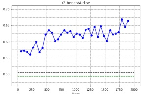
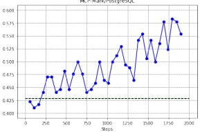
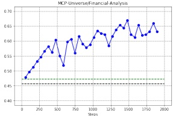
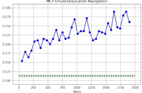

Table 5 | Accuracy of general synthesized tasks on different models.

<table border=1 style='margin: auto; word-wrap: break-word;'><tr><td style='text-align: center; word-wrap: break-word;'>Pass@K</td><td style='text-align: center; word-wrap: break-word;'>DeepSeek-v3.2-Exp</td><td style='text-align: center; word-wrap: break-word;'>Sonnet-4.5</td><td style='text-align: center; word-wrap: break-word;'>Gemini-3.0 Pro</td><td style='text-align: center; word-wrap: break-word;'>GPT-5-Thinking</td></tr><tr><td style='text-align: center; word-wrap: break-word;'>1</td><td style='text-align: center; word-wrap: break-word;'>12%</td><td style='text-align: center; word-wrap: break-word;'>34%</td><td style='text-align: center; word-wrap: break-word;'>51%</td><td style='text-align: center; word-wrap: break-word;'>62%</td></tr><tr><td style='text-align: center; word-wrap: break-word;'>2</td><td style='text-align: center; word-wrap: break-word;'>18%</td><td style='text-align: center; word-wrap: break-word;'>47%</td><td style='text-align: center; word-wrap: break-word;'>65%</td><td style='text-align: center; word-wrap: break-word;'>75%</td></tr><tr><td style='text-align: center; word-wrap: break-word;'>4</td><td style='text-align: center; word-wrap: break-word;'>26%</td><td style='text-align: center; word-wrap: break-word;'>62%</td><td style='text-align: center; word-wrap: break-word;'>74%</td><td style='text-align: center; word-wrap: break-word;'>82%</td></tr></table>

Figure 5 | RL training of DeepSeek-V3.2-SFT using exclusively synthetic general agent data.

ments over DeepSeek-V3.2-SFT on Tau2Bench, MCP-Mark, and MCP-Universe benchmarks. In contrast, restricting RL to code and search scenarios does not improve performance on these benchmarks, further highlighting the potential of synthetic data.

### 4.4. Context Management of Search Agent

Even with extended context windows such as 128k, agentic workflows, particularly in search-based scenarios, frequently encounter maximum length limitations that prematurely truncate the reasoning process. This bottleneck inhibits the full realization of test-time compute potential. To address this, we introduce context management employing simple strategies to extend token budgets at test time, when the token usage exceeds 80% of the context window length. These strategies include (1) Summary, which summarizes the overflowed trajectory and re-initiates the rollout; (2) Discard-75%, which discards the first 75% tool call history in the trajectory to free up spaces; (3) Discard-all, which resets the context by discarding all previous tool call history (similar to the new context tool (Anthropic, 2025a)). For comparison, we also implement a parallel scaling baseline, Parallel-fewest-step, which samples N independent trajectories and

表5 | 不同模型在通用合成任务上的准确率。

<table border=1 style='margin: auto; word-wrap: break-word;'><tr><td style='text-align: center; word-wrap: break-word;'>Pass@K</td><td style='text-align: center; word-wrap: break-word;'>DeepSeek-v3.2-Exp</td><td style='text-align: center; word-wrap: break-word;'>Sonnet-4.5</td><td style='text-align: center; word-wrap: break-word;'>Gemini-3.0 Pro</td><td style='text-align: center; word-wrap: break-word;'>GPT-5-Thinking</td></tr><tr><td style='text-align: center; word-wrap: break-word;'>1</td><td style='text-align: center; word-wrap: break-word;'>12%</td><td style='text-align: center; word-wrap: break-word;'>34%</td><td style='text-align: center; word-wrap: break-word;'>51%</td><td style='text-align: center; word-wrap: break-word;'>62%</td></tr><tr><td style='text-align: center; word-wrap: break-word;'>2</td><td style='text-align: center; word-wrap: break-word;'>18%</td><td style='text-align: center; word-wrap: break-word;'>47%</td><td style='text-align: center; word-wrap: break-word;'>65%</td><td style='text-align: center; word-wrap: break-word;'>75%</td></tr><tr><td style='text-align: center; word-wrap: break-word;'>4</td><td style='text-align: center; word-wrap: break-word;'>26%</td><td style='text-align: center; word-wrap: break-word;'>62%</td><td style='text-align: center; word-wrap: break-word;'>74%</td><td style='text-align: center; word-wrap: break-word;'>82%</td></tr></table>

图5 | 使用纯合成通用智能体数据对DeepSeek-V3.2-SFT进行RL训练。

> 在Tau2Bench、MCP-Mark和MCP-Universe基准测试上，相比DeepSeek-V3.2-SFT取得了显著提升。相比之下，将RL训练限制在代码和搜索场景中，并未在这些基准测试上带来性能改进，这进一步凸显了合成数据的潜力。

### 4.4. 搜索智能体的上下文管理

> 即使拥有像128k这样的扩展上下文窗口，智能体工作流，特别是在基于搜索的场景中，仍然经常遇到最大长度限制，导致推理过程被过早截断。这一瓶颈抑制了测试时计算潜力的充分发挥。为了解决这个问题，我们引入了上下文管理机制，采用简单的策略在测试时扩展token预算，当token使用量超过上下文窗口长度的80%时触发。这些策略包括：(1) 摘要，即总结溢出的轨迹并重新开始执行；(2) 丢弃-75%，即丢弃轨迹中前75%的工具调用历史以释放空间；(3) 丢弃-全部，即通过丢弃所有之前的工具调用历史来重置上下文（类似于新的上下文工具 (Anthropic, 2025a)）。为了比较，我们还实现了一个并行扩展基线，即Parallel-fewest-step，它采样N条独立的轨迹并...