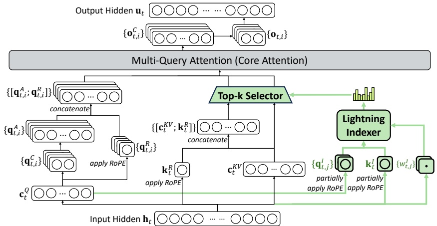
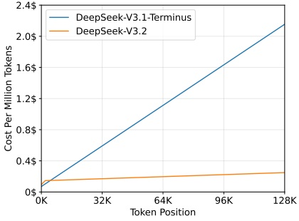
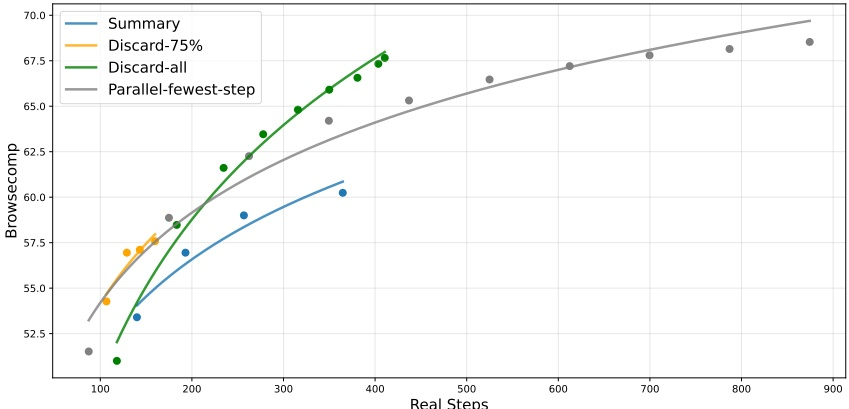
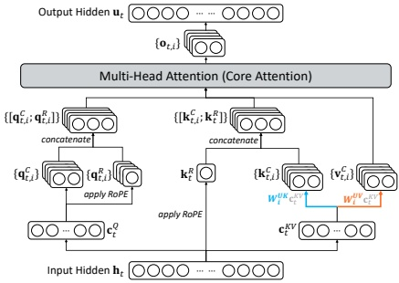

# DeepSeek-V3.2：开拓开放大型语言模型的前沿

DeepSeek-AI

research@deepseek.com

## 摘要

我们推出 **DeepSeek-V3.2**，一个**在高计算效率与卓越推理及智能体性能之间取得平衡**的模型。DeepSeek-V3.2 的关键技术突破如下：(1) **DeepSeek 稀疏注意力**：我们引入了 DSA，一种高效的注意力机制，**在长上下文场景中显著降低了计算复杂度，同时保持了模型性能**。(2) **可扩展的强化学习框架**：通过实施稳健的强化学习协议并扩展后训练计算量，DeepSeek-V3.2 的性能可与 GPT-5 相媲美。值得注意的是，我们的高计算量变体 **DeepSeek-V3.2-Specialist** 超越了 GPT-5，并在推理能力上与 Gemini-3.0-Pro 相当，在 **2025 年国际数学奥林匹克竞赛**和**国际信息学奥林匹克竞赛**中均取得了金牌表现。(3) **大规模智能体任务合成流程**：为了将推理能力融入工具使用场景，我们开发了一种新颖的合成流程，**系统性地大规模生成训练数据**。该方法促进了可扩展的智能体后训练，在复杂、交互式的环境中显著提升了**泛化能力和指令遵循的鲁棒性**。

图 1 | DeepSeek-V3.2 及其对应模型的基准测试结果。对于 HMMT 2025，我们报告了与基线一致的二月竞赛结果。对于 HLE，我们报告了纯文本子集的结果。

---

## 1. 引言

推理模型的发布（DeepSeek-AI, 2025; OpenAI, 2024a）标志着大语言模型（LLMs）演进过程中的一个关键时刻，在多个可验证领域引发了整体性能的**实质性飞跃**。自这一里程碑以来，LLMs的能力迅速发展。然而，在过去的几个月里，出现了一个明显的分化。尽管开源社区（MiniMax, 2025; MoonShot, 2025; ZhiPu-AI, 2025）持续取得进展，但闭源专有模型（Anthropic, 2025b; DeepMind, 2025a; OpenAI, 2025）的性能提升轨迹却以**显著更快的速度**加速。因此，闭源模型与开源模型之间的性能差距非但没有缩小，反而似乎在扩大，专有系统在复杂任务中展现出**日益优越的能力**。

通过我们的分析，我们识别出三个**关键缺陷**，这些缺陷限制了开源模型在复杂任务中的能力。首先，在架构上，主要依赖标准的注意力机制严重制约了长序列处理的效率。这种低效性对**可扩展部署**和**有效的训练后阶段**都构成了重大障碍。其次，在资源分配方面，开源模型在训练后阶段面临**计算投入不足**的问题，限制了其在困难任务上的表现。最后，在AI智能体的背景下，与专有模型相比，开源模型在**泛化能力和指令遵循能力**上表现出明显的滞后，这阻碍了其在真实部署中的有效性。

为了应对这些关键限制，我们首先引入了DSA，这是一种**高效的注意力机制**，旨在显著降低计算复杂度。该架构有效解决了效率瓶颈，即使在长上下文场景中也能保持模型性能。其次，我们开发了一个**稳定且可扩展的强化学习协议**，允许在训练后阶段进行大规模的计算扩展。值得注意的是，该框架分配的训练后计算预算超过了预训练成本的10%，从而**解锁了高级能力**。第三，我们提出了一种新颖的流程，以**在工具使用场景中培养可泛化的推理能力**。首先，我们利用DeepSeek-V3的方法实施了一个**冷启动阶段**，将推理和工具使用统一在单一轨迹中。随后，我们推进到**大规模智能体任务合成**，生成了超过1,800个不同的环境和85,000个复杂提示。这些**海量的合成数据**驱动了强化学习过程，显著增强了模型在智能体背景下的**泛化能力和指令遵循能力**。

DeepSeek-V3.2在多个推理基准测试中取得了与Kimi-k2-thinking和GPT-5相似的性能。此外，DeepSeek-V3.2显著提升了开源模型的**智能体能力**，在EvalSys（2025）、Li等人（2025）、Luo等人（2025）引入的长尾智能体任务上表现出**卓越的熟练度**。DeepSeek-V3.2成为智能体场景中一个**高性价比的替代方案**，在显著降低成本的同时，大幅缩小了开源模型与前沿专有模型之间的性能差距。值得注意的是，为了**推动开源模型在推理领域的边界**，我们放宽了长度限制以开发DeepSeek-V3.2-Speciale。因此，DeepSeek-V3.2-Speciale实现了与领先闭源系统Gemini-3.0-Pro的性能持平。它在IOI 2025、ICPC World Final 2025、IMO 2025和CMO 2025中展现了**金牌级别的表现**。

---

## 2. DeepSeek-V3.2 架构

### 2.1. DeepSeek 稀疏注意力

DeepSeek-V3.2 使用的架构与 DeepSeek-V3.2-Exp 完全相同。与 DeepSeek-V3.1 系列的最后一个版本 DeepSeek-V3.1-Terminus 相比，DeepSeek-V3.2 在架构上唯一的改动是**通过持续训练引入了 DeepSeek 稀疏注意力**。

**DSA 的原型**。DSA 的原型主要由两个部分组成：一个闪电索引器和一个细粒度的令牌选择机制。

闪电索引器计算查询令牌 $\mathbf{h}_t \in \mathbb{R}^d$ 与前一个令牌 $\mathbf{h}_s \in \mathbb{R}^d$ 之间的索引得分 $I_{t,s}$，以确定查询令牌要选择哪些令牌：

$$
I_{t,s}=\sum_{j=1}^{H^{I}}w_{t,j}^{I}\cdot\mathrm{R e L U}\left(\mathbf{q}_{t,j}^{I}\cdot\mathbf{k}_{s}^{I}\right),   \tag*{(1)}
$$

其中 $H^I$ 表示索引器头的数量；$\mathbf{q}_{t,j}^I \in \mathbb{R}^{d^I}$ 和 $w_{t,j}^I \in \mathbb{R}$ 源自查询令牌 $\mathbf{h}_t$；而 $\mathbf{k}_s^I \in \mathbb{R}^{d^I}$ 源自前一个令牌 $\mathbf{h}_s$。出于吞吐量的考虑，我们选择 ReLU 作为激活函数。鉴于闪电索引器头部数量少且可以在 FP8 下实现，其计算效率非常显著。

对于每个查询令牌 $\mathbf{h}_{t}$，在给定索引得分 $\{I_{t,s}\}$ 后，我们的细粒度令牌选择机制仅检索与**前 k 个索引得分**对应的键值条目 $\{c_{s}\}$。然后，通过在查询令牌 $\mathbf{h}_{t}$ 与**稀疏选择的键值条目** $\{c_{s}\}$ 之间应用注意力机制来计算注意力输出 $\mathbf{u}_{t}$：

$$
\mathbf{u}_{t}=\mathrm{A t t n}\big(\mathbf{h}_{t},\big\{\mathbf{c}_{s}\big|I_{t,s}\in\mathrm{T o p-k}\big(I_{t,:}\big)\big\}\big).   \tag*{(2)}
$$

**在 MLA 下实例化 DSA**。考虑到需要从 DeepSeek-V3.1-Terminus 进行持续训练，我们基于 MLA 为 DeepSeek-V3.2 实例化了 DSA。在核心层面，为了计算效率，每个键值条目必须在多个查询之间共享。因此，我们基于 MLA 的 MQA 模式实现了 DSA，其中每个潜在向量（MLA 的键值条目）将在查询令牌的所有查询头之间共享。基于 MLA 的 DSA 架构如图 2 所示。我们还提供了 DeepSeek-V3.2 的开源实现，以明确指定细节。

#### 2.1.1. 持续预训练

我们从上下文长度已扩展到 128K 的 DeepSeek-V3.1-Terminus 基础检查点开始，通过执行**持续预训练**和后续的训练后处理，最终创建了 DeepSeek-V3.2。

DeepSeek-V3.2 的持续预训练包含两个训练阶段。对于这两个阶段，训练数据的分布与用于 DeepSeek-V3.1-Terminus 的 128K 长上下文扩展数据**完全一致**。

---

图 2 | DeepSeek-V3.2 的注意力架构，其中 DSA 在 MLA 框架下实例化。绿色部分展示了 DSA 如何根据索引器选择 top-k 键值条目。

**稠密预热阶段**。我们首先使用一个简短的预热阶段来初始化闪电索引器。在此阶段，我们保持稠密注意力，并冻结除闪电索引器外的所有模型参数。为使索引器输出与主注意力分布对齐，对于第 t 个查询 token，我们首先**将所有注意力头的注意力分数求和进行聚合**。然后，该和在序列维度上进行 L1 归一化，以产生目标分布 $p_{t,:} \in \mathbb{R}^t$。基于 $p_{t,:}$，我们设定一个 KL 散度损失作为索引器的训练目标：

$$
\mathcal{L}^{I}=\sum_{t}\mathbb{D}_{\mathrm{K L}}\big(p_{t,:}\left\|\mathrm{S o f t m a x}\big(I_{t,:}\big)\right).   \tag*{(3)}
$$

对于预热，我们使用 $10^{-3}$ 的学习率。我们仅训练索引器 1000 步，每一步包含 16 个长度为 128K token 的序列，总计消耗 2.1B token。

**稀疏训练阶段**。在索引器预热之后，我们引入细粒度的 token 选择机制，并优化所有模型参数，以使模型适应 DSA 的稀疏模式。在此阶段，我们**同样保持索引器输出与主注意力分布的对齐**，但仅考虑被选中的 token 集合 $S_t = \{s \mid I_{t,s} \in \text{Top-k}(I_{t,:})\}$：

$$
\mathcal{L}^{I}=\sum_{t}\mathbb{D}_{\mathrm{K L}}\big(p_{t,S_{t}}\left\|\mathrm{S o f t m a x}\big(I_{t,S_{t}}\big)\right).   \tag*{(4)}
$$

值得注意的是，我们将索引器的输入从计算图中分离出来进行独立优化。索引器的训练信号仅来自 $\mathcal{L}^I$，而主模型的优化则仅依据语言建模损失。在此稀疏训练阶段，我们使用 $7.3 \times 10^{-6}$ 的学习率，并为每个查询 token 选择 2048 个键值 token。我们对主模型和索引器均训练 15000 步，每一步包含 480 个长度为 128K token 的序列，总计消耗 943.7B token。

---

### 2.2. 对等性评估

标准基准测试 2025年9月，我们在**一系列关注多样化能力的基准测试上评估了DeepSeek-V3.2-Exp**，并将其与性能相近的DeepSeek-V3.1-Terminus进行比较。虽然DeepSeek-V3.2-Exp在长序列上的计算效率有显著提升，但**在短上下文和长上下文任务上，我们均未观察到与DeepSeek-V3.1-Terminus相比有显著的性能下降**。

人类偏好评估 鉴于直接的人类偏好评估本质上容易受到偏见影响，我们采用ChatbotArena作为一个间接评估框架，以**近似衡量用户对新开发的基础模型的偏好**。DeepSeek-V3.1-Terminus和DeepSeek-V3.2-Exp采用了完全相同的后训练策略，并且它们在2025年11月10日评估中获得的Elo分数非常接近。这些结果表明，**尽管引入了稀疏注意力机制，新的基础模型达到了与前一版本相当的性能水平**。

长上下文评估 在DeepSeek-V3.2-Exp发布后，多个独立的长上下文评估使用之前未见过的测试集进行。一个代表性的基准是AA-LCR$^{3}$，其中DeepSeek-V3.2-Exp在推理模式下比DeepSeek-V3.1-Terminus高出四分。在Fiction.liveBench评估$^{4}$中，DeepSeek-V3.2-Exp在多个指标上持续优于DeepSeek-V3.1-Terminus。这些证据表明，**DeepSeek-V3.2-Exp的基础检查点在长上下文任务上并未出现性能衰退**。

### 2.3. 推理成本

DSA将主模型的核心注意力复杂度从$O(L^{2})$降低到$O(Lk)$，其中$k \ll L$是所选令牌的数量。**尽管闪电索引器的复杂度仍然是$O(L^{2})$，但与DeepSeek-V3.1-Terminus中的MLA相比，其所需的计算量要少得多**。结合我们优化的实现，DSA在长上下文场景中实现了显著的端到端加速。图3展示了DeepSeek-V3.1-Terminus和DeepSeek-V3.2的令牌成本如何随序列中令牌位置的变化而变化。这些成本是根据部署在H800 GPU上的实际服务进行基准测试估算的，GPU租赁价格为每小时2美元。需要注意的是，对于短序列预填充，我们专门实现了一种掩码MHA模式来模拟DSA，**这可以在短上下文条件下实现更高的效率**。

## 3. 后训练

在持续预训练之后，我们进行后训练以创建最终的DeepSeek-V3.2。**DeepSeek-V3.2的后训练也以与稀疏持续预训练阶段相同的方式采用稀疏注意力**。对于DeepSeek-V3.2，我们保持了与DeepSeek-V3.2-Exp相同的后训练流程，其中包括专家蒸馏和混合强化学习训练。

专家蒸馏 对于每个任务，我们首先开发一个专门针对该特定领域的专家模型，所有专家模型都从同一个基础模型进行微调。

---

(a) 预填充阶段

(b) 解码阶段

图3 | DeepSeek-V3.1-Terminus 与 DeepSeek-V3.2 在 H800 集群上的推理成本对比。

基于预训练的 DeepSeek-V3.2 基础检查点，我们的框架除了涵盖写作任务和通用问答外，还包含了六个专业领域：数学、编程、通用逻辑推理、通用智能体任务、智能体编程以及智能体搜索，**所有领域均支持思考模式与非思考模式**。每个专家模型均通过大规模强化学习（RL）计算进行训练。此外，我们采用不同的模型来生成长链思维推理（思考模式）和直接响应生成（非思考模式）的训练数据。一旦专家模型准备就绪，它们便被用于为最终检查点生成领域特定数据。实验结果表明，在蒸馏数据上训练的模型，其性能水平仅略低于领域专家模型，而这一性能差距通过后续的强化学习训练得以有效消除。

**混合强化学习训练** 对于 DeepSeek-V3.2，我们仍然采用**组相对策略优化（GRPO）** 作为强化学习训练算法。与 DeepSeek-V3.2-Exp 一样，我们将推理、智能体和人类对齐训练合并为一个强化学习阶段。这种方法**有效平衡了不同领域间的性能**，同时规避了多阶段训练范式常伴随的灾难性遗忘问题。对于推理和智能体任务，我们采用基于规则的结果奖励、长度惩罚和语言一致性奖励。对于通用任务，我们采用生成式奖励模型，其中每个提示都有其独立的评估标准。

**DeepSeek-V3.2 与 DeepSeek-V3.2-Speciale** DeepSeek-V3.2 整合了从专家模型蒸馏出的推理、智能体和人类对齐数据，并经过数千步的持续强化学习训练，最终达到检查点。为了探索扩展思维的潜力，我们还开发了一个实验性变体 DeepSeek-V3.2-Speciale。该模型**专门在推理数据上进行训练**，并在强化学习期间降低了长度惩罚。此外，我们引入了 DeepSeekMath-V2 的数据集和奖励方法，以增强数学证明方面的能力。

我们想重点强调我们在第 3.1 节中**如何创建稳定方案以扩展强化学习计算**，以及在第 3.2 节中**如何将思考能力整合到智能体任务中**的努力。

---

### 3.1. 扩展 GRPO

我们首先回顾 GRPO 的目标。GRPO 通过最大化以下目标函数来优化策略模型 $\pi_\theta$，该目标基于从旧策略 $\pi_{\text{old}}$ 中针对每个问题 $q$ 采样得到的一组响应 $\{o_1, \cdots, o_G\}$：

$$
\begin{align*}\mathcal{J}_{\mathrm{GRPO}}(\theta)=\mathbb{E}_{q\sim P(Q),\{o_{i}\}_{i=1}^{G}\sim\pi_{\mathrm{old}}(\cdot|q)}\left[\frac{1}{G}\sum_{i=1}^{G}\frac{1}{|o_{i}|}\sum_{t=1}^{|o_{i}|}\right.\\ \left.\min\left(r_{i,t}(\theta)\hat{A}_{i,t},\mathrm{clip}\left(r_{i,t}(\theta),1-\varepsilon,1+\varepsilon\right)\hat{A}_{i,t}\right)-\beta\mathbb{D}_{\mathrm{KL}}\left(\pi_{\theta}(o_{i,t})\left\|\pi_{\mathrm{ref}}(o_{i,t})\right.\right)\right],\end{align*}   \tag*{(5)}
$$

其中

$$
r_{i,t}(\theta)=\frac{\pi_{\theta}(o_{i,t}|q,o_{i,<t})}{\pi_{\mathrm{o l d}}(o_{i,t}|q,o_{i,<t})}   \tag*{(6)}
$$

是当前策略与旧策略之间的重要性采样比率。$\varepsilon$ 和 $\beta$ 是超参数，分别控制裁剪范围和 KL 惩罚强度。$\hat{A}_{i,t}$ 是 $o_{i,t}$ 的优势函数，通过**对组内结果奖励进行归一化**来估计。具体而言，使用一组奖励模型对组中每个输出 $o_i$ 评分，得到一个结果奖励 $R_i$，从而分别得到 $G$ 个奖励 $\boldsymbol{R} = \{R_1, \cdots, R_G\}$。$o_{i,t}$ 的优势函数通过从输出 $o_i$ 的奖励中减去该组的平均奖励来计算，即 $\hat{A}_{i,t} = R_i - \text{mean}(\boldsymbol{R})$。

接下来，我们将概述基于 GRPO 算法直接构建的、用于稳定强化学习扩展的额外策略。

**无偏 KL 估计** 给定 $o_{i,t}$ 是从旧策略 $\pi_{\text{old}}(\cdot|q,o_{i,\text{st}})$ 中采样的，我们对 K3 估计器 (Schulman, 2020) 进行修正，利用当前策略 $\pi_{\theta}$ 与旧策略 $\pi_{\text{old}}$ 之间的重要性采样比率，得到一个无偏的 KL 估计。

$$
\mathbb{D}_{\mathrm{K L}}\big(\pi_{\theta}(o_{i,t})\big\|\pi_{\mathrm{r e f}}(o_{i,t})\big)=\frac{\pi_{\theta}\big(o_{i,t}|q,o_{i,<t}\big)}{\pi_{\mathrm{o l d}}\big(o_{i,t}|q,o_{i,<t}\big)}\left(\frac{\pi_{\mathrm{r e f}}\big(o_{i,t}|q,o_{i,<t}\big)}{\pi_{\theta}\big(o_{i,t}|q,o_{i,<t}\big)}-\log\frac{\pi_{\mathrm{r e f}}\big(o_{i,t}|q,o_{i,<t}\big)}{\pi_{\theta}\big(o_{i,t}|q,o_{i,<t}\big)}-1\right).   \tag*{(7)}
$$

作为此项调整的直接结果，该 KL 估计器的梯度变为无偏，从而**消除了系统性估计误差，促进了稳定收敛**。这与原始的 K3 估计器形成了鲜明对比，尤其是在采样出的词元在当前策略下的概率远低于参考策略（即 $\pi_{\theta} \ll \pi_{ref}$）的情况下。在这种情况下，K3 估计器的梯度会分配过大且无界的权重来最大化这些词元的似然，导致梯度更新带有噪声，这些噪声在后续迭代中累积，会降低样本质量并导致训练动态不稳定。在实践中，我们发现不同领域受益于不同强度的 KL 正则化。对于某些领域（例如数学），应用相对较弱的 KL 惩罚甚至完全省略它，可能会带来更好的性能。

**离策略序列掩码** 为了提高强化学习系统的效率，我们通常会生成大量的 rollout 数据，随后将其分割成多个小批次用于若干次梯度更新步骤。这种做法本质上引入了离策略行为。此外，用于高效数据生成的推理框架通常经过高度优化，其实现细节可能与训练框架有所不同。这种训练与推理的不一致性

---

进一步加剧了离策略的程度。为稳定训练并提升对离策略更新的容忍度，我们对那些引入显著策略差异的负样本序列进行掩码处理，其差异程度通过数据采样策略 $\pi_{old}$ 与当前策略 $\pi_{\theta}$ 之间的KL散度来衡量。具体而言，我们在GRPO损失函数中引入一个二元掩码M：

$$
\begin{align*}\mathcal{J}_{\mathrm{GRPO}}(\theta)&=\mathbb{E}_{q\sim P(Q),\{o_{i}\}_{i=1}^{G}\sim\pi_{\mathrm{old}}(\cdot|q)}\left[\frac{1}{G}\sum_{i=1}^{G}\frac{1}{|o_{i}|}\sum_{t=1}^{|o_{i}|}\right.\\&\left.\quad\min\left(r_{i,t}(\theta)\hat{A}_{i,t},\mathrm{clip}\left(r_{i,t}(\theta),1-\varepsilon,1+\varepsilon\right)\hat{A}_{i,t}\right)M_{i,t}-\beta\mathbb{D}_{\mathrm{KL}}\left(\pi_{\theta}(o_{i,t})\left\|\pi_{\mathrm{ref}}(o_{i,t})\right.\right)\right],\end{align*}   \tag*{(8)}
$$

其中

$$
M_{i,t}=\begin{cases}0&\hat{A}_{i,t}<0,\frac{1}{\left|o_{i}\right|}\sum_{t=1}^{\left|o_{i}\right|}\log\frac{\pi_{\mathrm{old}}\left(o_{i,t}\left|q,o_{i,<t}\right.\right)}{\pi_{\theta}\left(o_{i,t}\left|q,o_{i,<t}\right.\right)}>\delta\\1&otherwise,\end{cases}   \tag*{(9)}
$$

且 $\delta$ 是控制策略差异阈值的超参数。需要注意的是，这里的 $\pi_{old}$ 表示推理框架直接返回的采样概率，因此旧策略与当前策略之间的KL散度同时涵盖了上述两种离策略来源。还需指出，我们**仅对优势值为负的序列进行掩码**。直观上，模型通过从自身错误中学习获益最大，而高度离策略的负样本则可能有害，可能误导或破坏优化过程的稳定性。我们通过实验观察到，这种**离策略序列掩码操作**在原本可能表现出不稳定的某些训练场景中，确实提升了稳定性。

**保持路由** 混合专家模型通过仅在推理时激活部分专家模块来提高计算效率。然而，推理与训练框架之间的差异，加之策略更新，可能导致即使对于相同输入，推理和训练过程中的专家路由也不一致。这种不一致会引发激活参数子空间的突变，从而破坏优化稳定性并加剧离策略问题。为缓解此问题，我们**保留推理框架在采样时使用的专家路由路径**，并在训练过程中强制执行相同的路由路径，确保优化的是相同的专家参数。这一保持路由操作被发现对MoE模型的RL训练稳定性至关重要，并已自DeepSeek-V3-0324以来被纳入我们的RL训练流程。

**保持采样掩码** Top-p和top-k采样是广泛使用的采样策略，用于提升大语言模型生成回答的质量。在RL训练中采用这些策略同样有益，因为它避免了将极低概率的token作为优化目标。尽管这种截断保持了样本质量，但它引入了 $\pi_{old}$ 与 $\pi_{\theta}$ 之间动作空间的不匹配，这违背了重要性采样的原则并破坏了训练稳定性。为解决此问题，我们在从 $\pi_{old}$ 采样时**保留截断掩码**，并在训练时将其应用于 $\pi_{\theta}$，确保两个策略共享相同的动作子空间。经验表明，**将top-p采样与保持采样掩码策略结合使用**，能有效维持RL训练过程中的语言一致性。

---

### 3.2. 工具使用中的思考

#### 3.2.1. 思考上下文管理

DeepSeek-R1 已经证明，**融入思考过程**可以显著增强模型解决复杂问题的能力。基于这一洞见，我们旨在将思考能力整合到工具调用的场景中。

我们观察到，如果照搬 DeepSeek-R1 的策略——在收到第二轮消息时丢弃推理内容——会导致**显著的令牌效率低下**。这种方法迫使模型在每次后续工具调用时，都需要冗余地重新对整个问题进行推理。为了缓解这一问题，我们开发了一种**专为工具调用场景量身定制的上下文管理机制**，如图 4 所示：

- 仅当对话中引入了**新的用户消息**时，才会丢弃历史推理内容。如果仅追加与工具相关的消息（例如，工具输出），则推理内容会在整个交互过程中保留。

- 当推理轨迹被移除时，工具调用的历史及其结果仍会保留在上下文中。

值得注意的是，某些智能体框架，例如 Roo Code 或 Terminus，通过用户消息来模拟工具交互。由于上述上下文管理规则，这些框架可能无法充分受益于我们增强的推理持久性。因此，我们建议在此类架构中使用**非思考型模型**以获得最佳性能。

图 4 | 工具调用场景中的思考保留机制。

#### 3.2.2. 冷启动

考虑到我们拥有推理数据（非智能体性质）和非推理的智能体数据，整合这两种能力的一个直接策略是**通过精心设计的提示**。我们认为，模型拥有足够的能力来准确遵循明确的指令，从而能够在推理过程中**无缝地融入工具执行**。

---

为了展示冷启动机制的运作方式，我们如附录表6–8所示，对训练数据进行了选择性采样。**值得注意的是**，不同的任务提示词与不同的系统提示词相关联。表6–8展示了一个对应于编程竞赛提示词的示例。表6展示了我们的推理数据示例，其中使用系统提示词明确要求模型在给出最终答案前进行推理，并使用特殊标签 `<think></think>` 来标记推理路径。表7展示了非推理的智能体数据提示词，其系统提示词包含了工具调用的指导。表8则呈现了我们设计的系统提示词，用于指导模型在其推理过程中整合多次工具调用。

通过这种方式，**尽管工具使用模式中的推理可能缺乏鲁棒性**，但模型偶尔能够生成期望的轨迹，从而为后续的强化学习阶段提供基础。

#### 3.2.3. 大规模智能体任务

多样化的强化学习任务对于增强模型的鲁棒性至关重要。对于搜索、代码工程和代码解释等任务，我们使用了真实世界的工具，包括实际的网络搜索API、编码工具和Jupyter Notebook。**虽然这些强化学习环境是真实的**，但所使用的提示词要么是从互联网来源提取的，要么是合成的，而非来自真实的用户交互。对于其他任务，环境和提示词都是合成的。我们使用的智能体任务详见表1。

表1 | 不同智能体任务的描述，包括任务数量、环境类型（真实或合成）和提示词来源（提取或合成）。

<table border=1 style='margin: auto; word-wrap: break-word;'><tr><td style='text-align: center; word-wrap: break-word;'></td><td style='text-align: center; word-wrap: break-word;'>任务数量</td><td style='text-align: center; word-wrap: break-word;'>环境</td><td style='text-align: center; word-wrap: break-word;'>提示词</td></tr><tr><td style='text-align: center; word-wrap: break-word;'>代码智能体</td><td style='text-align: center; word-wrap: break-word;'>24667</td><td style='text-align: center; word-wrap: break-word;'>真实</td><td style='text-align: center; word-wrap: break-word;'>提取</td></tr><tr><td style='text-align: center; word-wrap: break-word;'>搜索智能体</td><td style='text-align: center; word-wrap: break-word;'>50275</td><td style='text-align: center; word-wrap: break-word;'>真实</td><td style='text-align: center; word-wrap: break-word;'>合成</td></tr><tr><td style='text-align: center; word-wrap: break-word;'>通用智能体</td><td style='text-align: center; word-wrap: break-word;'>4417</td><td style='text-align: center; word-wrap: break-word;'>合成</td><td style='text-align: center; word-wrap: break-word;'>合成</td></tr><tr><td style='text-align: center; word-wrap: break-word;'>代码解释器</td><td style='text-align: center; word-wrap: break-word;'>5908</td><td style='text-align: center; word-wrap: break-word;'>真实</td><td style='text-align: center; word-wrap: break-word;'>提取</td></tr></table>

**搜索智能体** 我们采用了一个基于DeepSeek-V3.2的多智能体流程来生成多样化、高质量的训练数据。首先，我们从大规模网络语料库中采样了跨多个领域的信息性长尾实体。接着，一个提问构建智能体使用具有可配置深度和广度参数的搜索工具探索每个实体，并将发现的信息整合成问答对。**多个具有异构配置**（不同检查点、系统提示词等）的答案生成智能体为每个提出的问答对生成多样化的候选回答。一个具备搜索能力的验证智能体通过多次验证来核实所有答案，仅保留标准答案正确且所有候选答案均可验证为错误的样本。这些数据涵盖多种语言、领域和难度级别。为了补充这些可验证的样本并更好地反映真实世界的使用情况，我们还用现有有用强化学习数据集中经过筛选的实例来增强数据集，这些实例中搜索工具能提供可衡量的益处。随后，我们制定了涵盖多个质量维度的详细评估标准，并采用生成式奖励模型根据这些标准对回答进行评分。**这种混合方法使得我们能够同时优化事实可靠性和实际有用性**。

---

代码智能体 我们通过从 GitHub 挖掘数百万个问题与拉取请求（PR）配对，构建了用于软件问题解决的大规模、可执行环境。该数据集经过启发式规则和基于大语言模型的判断严格筛选，以确保高质量，要求每个条目包含合理的问题描述、相关的**黄金补丁**以及用于验证的测试补丁。我们部署了一个由 DeepSeek-V3.2 驱动的自动环境设置智能体，为这些配对构建可执行环境。该智能体负责包安装、依赖项解析和测试执行。测试结果以标准的 JUnit 格式输出，确保在不同编程语言和测试框架间解析的一致性。**只有当应用黄金补丁后，错误转正（F2P）测试用例数量非零（表明问题已修复），且通过转失败（P2F）测试用例数量为零（表明没有回归）时，一个环境才被视为成功构建。** 利用这一流程，我们成功构建了数万个可复现的问题解决环境，涵盖多种编程语言，包括 Python、Java、JavaScript、TypeScript、C、C++、Go 和 PHP。

代码解释器智能体 我们利用 Jupyter Notebook 作为代码解释器来处理复杂的推理任务。为此，我们整理了一套涵盖数学、逻辑和数据科学的多样化问题集，每个问题都需要模型利用代码执行能力来得出解决方案。

通用智能体 为了在强化学习中扩展智能体环境和任务，我们采用了一个自动环境合成智能体，合成了 1,827 个面向任务的环境。这些任务**难以解决但易于验证**。合成工作流程主要包括环境和工具集构建、任务合成以及解决方案生成。具体流程如下：

1.  给定一个任务类别（例如，规划旅行行程）和一个配备 bash 和搜索工具的沙箱，智能体首先使用这些工具从互联网生成或检索相关数据，并将其存储在沙箱数据库中。
2.  然后，智能体合成一组特定于任务的工具，每个工具都实现为一个函数。
3.  为了创建既具挑战性又可自动验证的任务，智能体首先基于当前数据库提出一个简单任务，以及其用 Python 实现的解决方案和验证函数。解决方案函数被限制为只能调用工具函数或执行逻辑计算，不能调用其他函数或直接访问数据库，**确保任务只能通过工具接口解决**。此外，解决方案函数产生的结果必须由验证函数进行验证。如果解决方案未通过验证，智能体将修改解决方案或验证函数，直到解决方案的输出通过验证。然后，智能体迭代地增加任务的难度，并更新相应的解决方案和验证函数。在此迭代过程中，如果当前工具集不足以解决任务，智能体将扩展工具集。

遵循此工作流程，我们获得了数千个 <环境, 工具, 任务, 验证器> 元组。然后，我们使用 DeepSeek-V3.2 在此数据集上进行强化学习，并仅保留通过率@100 非零的实例，最终得到 1,827 个环境及其对应的任务（总计 4,417 个）。下面展示了一个合成的旅行规划示例。此示例强调，**在庞大的组合空间中搜索满足所有约束的旅行计划具有挑战性，但检查一个给定的候选解决方案是否满足这些约束则相对简单。**

---

#### 一个旅行规划的综合任务示例

我正在规划一次从杭州出发的三天旅程，需要协助制定一份2025年10月1日至10月3日的行程。有几个重要要求：**整个旅程中，任何城市、酒店、景点或餐厅都不得重复**。同时，请确保您推荐的每家酒店、餐厅和景点**确实位于我当天所在的城市**。关于第二天还有一个注意事项——我希望能**明智地控制预算**。如果我最终预订了一家每晚价格在800元人民币或以上的**豪华酒店**，那么我需要**更加谨慎地控制其他开销**：两家餐厅（午餐和晚餐）的总花费应**保持在350元人民币以下**，两家餐厅的评分都**至少为4.0星**，并且下午景点的门票价格需要**低于120元人民币**。如果第二天的酒店属于**中高档**（500-800元人民币），那么我的预算会**稍微灵活一些**——我只需要确保**至少有一家选择的餐厅评分在4.0或以上**，并且景点门票**低于180元人民币**。对于**更经济实惠的酒店**（200-500元人民币范围），我只需要确保**至少有一家餐厅的评分在3.2或以上**。您能帮我制定这份行程吗？

##### 提交结果格式

{ "time": "2025-10-01", "city": "城市名称", "hotel": "酒店名称", "afternoon_restaurant": "餐厅名称", "afternoon_attraction": "景点名称", "evening_restaurant": "餐厅名称" },

{ "time": "2025-10-02", "city": "城市名称", "hotel": "酒店名称", "afternoon_restaurant": "餐厅名称", "afternoon_attraction": "景点名称", "evening_restaurant": "餐厅名称" },

{ "time": "2025-10-03", "city": "城市名称", "hotel": "酒店名称", "afternoon_restaurant": "餐厅名称", "afternoon_attraction": "景点名称", "evening_restaurant": "餐厅名称" }

### 旅行规划工具集

<table border=1 style='margin: auto; word-wrap: break-word;'><tr><td style='text-align: center; word-wrap: break-word;'>函数名称</td><td style='text-align: center; word-wrap: break-word;'>描述</td></tr><tr><td style='text-align: center; word-wrap: break-word;'>get_all_attractions_by_city(city)</td><td style='text-align: center; word-wrap: break-word;'>获取指定城市的所有景点。</td></tr><tr><td style='text-align: center; word-wrap: break-word;'>get_all_cities()</td><td style='text-align: center; word-wrap: break-word;'>从数据库中获取所有城市。</td></tr><tr><td style='text-align: center; word-wrap: break-word;'>get_all_hotels_by_city(city)</td><td style='text-align: center; word-wrap: break-word;'>获取指定城市的所有酒店。</td></tr><tr><td style='text-align: center; word-wrap: break-word;'>get_all_restaurants_by_city(city)</td><td style='text-align: center; word-wrap: break-word;'>获取指定城市的所有餐厅。</td></tr><tr><td style='text-align: center; word-wrap: break-word;'>get_city_by_attraction(attraction)</td><td style='text-align: center; word-wrap: break-word;'>根据景点名称获取其所在城市。</td></tr><tr><td style='text-align: center; word-wrap: break-word;'>get_city_by_hotel(hotel)</td><td style='text-align: center; word-wrap: break-word;'>根据酒店名称获取其所在城市。</td></tr><tr><td style='text-align: center; word-wrap: break-word;'>get_city_by_restaurant(restaurant)</td><td style='text-align: center; word-wrap: break-word;'>根据餐厅名称获取其所在城市。</td></tr><tr><td style='text-align: center; word-wrap: break-word;'>get_city_transport(city)</td><td style='text-align: center; word-wrap: break-word;'>获取指定城市的所有市内交通选项。</td></tr><tr><td style='text-align: center; word-wrap: break-word;'>get_infos_by_attraction(info_keywords, attraction)</td><td style='text-align: center; word-wrap: break-word;'>获取指定景点的特定信息。</td></tr><tr><td style='text-align: center; word-wrap: break-word;'>get_infos_by_city(info_keywords, city)</td><td style='text-align: center; word-wrap: break-word;'>获取指定城市的特定信息。</td></tr><tr><td style='text-align: center; word-wrap: break-word;'>get_infos_by_hotel(info_keywords, hotel)</td><td style='text-align: center; word-wrap: break-word;'>获取指定酒店的特定信息。</td></tr><tr><td style='text-align: center; word-wrap: break-word;'>get_infos_by_restaurant(info_keywords, restaurant)</td><td style='text-align: center; word-wrap: break-word;'>获取指定餐厅的特定信息。</td></tr><tr><td style='text-align: center; word-wrap: break-word;'>get_inter_city_transport(from_city, to_city)</td><td style='text-align: center; word-wrap: break-word;'>获取给定两个城市之间的所有交通方式。</td></tr><tr><td style='text-align: center; word-wrap: break-word;'>get_weather_by_city_date(city, date)</td><td style='text-align: center; word-wrap: break-word;'>获取指定城市和日期的天气。</td></tr><tr><td style='text-align: center; word-wrap: break-word;'>submit_result(answer_text)</td><td style='text-align: center; word-wrap: break-word;'>提交最终答案内容。</td></tr></table>

---

forces, Aider-Polyglot, AIME 2025, HMMT Feb 2025, HMMT Nov 2025, IMOAnswerBench, Terminal Bench 2.0, SWE-Verified, SWE Multilingual, BrowseComp, BrowseCompZh,  $\tau^{2}$-bench, MCP-Universe, MCP-Mark, and Tool-Decathlon。工具使用基准测试采用标准函数调用格式进行评估，其中模型被配置为思考模式。对于 MCP-Universe 和 MCP-Mark，我们使用内部环境评估所有模型，因为搜索和 playwright 环境可能与官方设置略有不同。我们将温度设置为 1.0，上下文窗口设置为 128K 个词元。对于数学相关任务，如 AIME、HMMT、IMOAnswerBench 和 HLE，我们使用以下模板进行评估：“{问题}\n请逐步推理，并将最终答案放在 \boxed{} 中。” 对于 HLE，我们还使用官方模板评估了 DeepSeek-V3.2-Thinking，得分为 23.9。

表 2 | DeepSeek-V3.2 与闭源/开源模型的比较。对于开源模型，我们仅比较支持工具使用中思考的模型。**粗体数字**代表每个模型类别（开源和闭源）中的**最佳分数**。 $\tau^{2}$-Bench 结果通过每个类别的平均值计算得出。关于 BrowseComp，使用上下文管理技术时的性能用 $*$ 标注。

<table border=1 style='margin: auto; word-wrap: break-word;'><tr><td style='text-align: center; word-wrap: break-word;'></td><td style='text-align: center; word-wrap: break-word;'>基准测试（指标）</td><td style='text-align: center; word-wrap: break-word;'>Claude-4.5-Sonnet</td><td style='text-align: center; word-wrap: break-word;'>GPT-5 High</td><td style='text-align: center; word-wrap: break-word;'>Gemini-3.0 Pro</td><td style='text-align: center; word-wrap: break-word;'>Kimi-K2 Thinking</td><td style='text-align: center; word-wrap: break-word;'>MiniMax M2</td><td style='text-align: center; word-wrap: break-word;'>DeepSeek-V3.2 Thinking</td></tr><tr><td rowspan="3">英语</td><td style='text-align: center; word-wrap: break-word;'>MMLU-Pro (EM)</td><td style='text-align: center; word-wrap: break-word;'>88.2</td><td style='text-align: center; word-wrap: break-word;'>87.5</td><td style='text-align: center; word-wrap: break-word;'>90.1</td><td style='text-align: center; word-wrap: break-word;'>84.6</td><td style='text-align: center; word-wrap: break-word;'>82.0</td><td style='text-align: center; word-wrap: break-word;'>85.0</td></tr><tr><td style='text-align: center; word-wrap: break-word;'>GPQA Diamond (Pass@1)</td><td style='text-align: center; word-wrap: break-word;'>83.4</td><td style='text-align: center; word-wrap: break-word;'>85.7</td><td style='text-align: center; word-wrap: break-word;'>91.9</td><td style='text-align: center; word-wrap: break-word;'>84.5</td><td style='text-align: center; word-wrap: break-word;'>77.7</td><td style='text-align: center; word-wrap: break-word;'>82.4</td></tr><tr><td style='text-align: center; word-wrap: break-word;'>HLE (Pass@1)</td><td style='text-align: center; word-wrap: break-word;'>13.7</td><td style='text-align: center; word-wrap: break-word;'>26.3</td><td style='text-align: center; word-wrap: break-word;'>37.7</td><td style='text-align: center; word-wrap: break-word;'>23.9</td><td style='text-align: center; word-wrap: break-word;'>12.5</td><td style='text-align: center; word-wrap: break-word;'>25.1</td></tr><tr><td rowspan="2">代码</td><td style='text-align: center; word-wrap: break-word;'>LiveCodeBench (Pass@1-COT)</td><td style='text-align: center; word-wrap: break-word;'>64.0</td><td style='text-align: center; word-wrap: break-word;'>84.5</td><td style='text-align: center; word-wrap: break-word;'>90.7</td><td style='text-align: center; word-wrap: break-word;'>82.6</td><td style='text-align: center; word-wrap: break-word;'>83.0</td><td style='text-align: center; word-wrap: break-word;'>83.3</td></tr><tr><td style='text-align: center; word-wrap: break-word;'>Codeforces (Rating)</td><td style='text-align: center; word-wrap: break-word;'>1480</td><td style='text-align: center; word-wrap: break-word;'>2537</td><td style='text-align: center; word-wrap: break-word;'>2708</td><td style='text-align: center; word-wrap: break-word;'>-</td><td style='text-align: center; word-wrap: break-word;'>-</td><td style='text-align: center; word-wrap: break-word;'>2386</td></tr><tr><td rowspan="4">数学</td><td style='text-align: center; word-wrap: break-word;'>AIME 2025 (Pass@1)</td><td style='text-align: center; word-wrap: break-word;'>87.0</td><td style='text-align: center; word-wrap: break-word;'>94.6</td><td style='text-align: center; word-wrap: break-word;'>95.0</td><td style='text-align: center; word-wrap: break-word;'>94.5</td><td style='text-align: center; word-wrap: break-word;'>78.3</td><td style='text-align: center; word-wrap: break-word;'>93.1</td></tr><tr><td style='text-align: center; word-wrap: break-word;'>HMMT Feb 2025 (Pass@1)</td><td style='text-align: center; word-wrap: break-word;'>79.2</td><td style='text-align: center; word-wrap: break-word;'>88.3</td><td style='text-align: center; word-wrap: break-word;'>97.5</td><td style='text-align: center; word-wrap: break-word;'>89.4</td><td style='text-align: center; word-wrap: break-word;'>-</td><td style='text-align: center; word-wrap: break-word;'>92.5</td></tr><tr><td style='text-align: center; word-wrap: break-word;'>HMMT Nov 2025 (Pass@1)</td><td style='text-align: center; word-wrap: break-word;'>81.7</td><td style='text-align: center; word-wrap: break-word;'>89.2</td><td style='text-align: center; word-wrap: break-word;'>93.3</td><td style='text-align: center; word-wrap: break-word;'>89.2</td><td style='text-align: center; word-wrap: break-word;'>-</td><td style='text-align: center; word-wrap: break-word;'>90.2</td></tr><tr><td style='text-align: center; word-wrap: break-word;'>IMOAnswerBench (Pass@1)</td><td style='text-align: center; word-wrap: break-word;'>-</td><td style='text-align: center; word-wrap: break-word;'>76.0</td><td style='text-align: center; word-wrap: break-word;'>83.3</td><td style='text-align: center; word-wrap: break-word;'>78.6</td><td style='text-align: center; word-wrap: break-word;'>-</td><td style='text-align: center; word-wrap: break-word;'>78.3</td></tr><tr><td rowspan="3">代码智能体</td><td style='text-align: center; word-wrap: break-word;'>Terminal Bench 2.0 (Acc)</td><td style='text-align: center; word-wrap: break-word;'>42.8</td><td style='text-align: center; word-wrap: break-word;'>35.2</td><td style='text-align: center; word-wrap: break-word;'>54.2</td><td style='text-align: center; word-wrap: break-word;'>35.7</td><td style='text-align: center; word-wrap: break-word;'>30.0</td><td style='text-align: center; word-wrap: break-word;'>46.4</td></tr><tr><td style='text-align: center; word-wrap: break-word;'>SWE Verified (Resolved)</td><td style='text-align: center; word-wrap: break-word;'>77.2</td><td style='text-align: center; word-wrap: break-word;'>74.9</td><td style='text-align: center; word-wrap: break-word;'>76.2</td><td style='text-align: center; word-wrap: break-word;'>71.3</td><td style='text-align: center; word-wrap: break-word;'>69.4</td><td style='text-align: center; word-wrap: break-word;'>73.1</td></tr><tr><td style='text-align: center; word-wrap: break-word;'>SWE Multilingual (Resolved)</td><td style='text-align: center; word-wrap: break-word;'>68.0</td><td style='text-align: center; word-wrap: break-word;'>55.3</td><td style='text-align: center; word-wrap: break-word;'>-</td><td style='text-align: center; word-wrap: break-word;'>61.1</td><td style='text-align: center; word-wrap: break-word;'>56.5</td><td style='text-align: center; word-wrap: break-word;'>70.2</td></tr><tr><td rowspan="3">搜索智能体</td><td style='text-align: center; word-wrap: break-word;'>BrowseComp (Pass@1)</td><td style='text-align: center; word-wrap: break-word;'>24.1</td><td style='text-align: center; word-wrap: break-word;'>54.9</td><td style='text-align: center; word-wrap: break-word;'>-</td><td style='text-align: center; word-wrap: break-word;'>$-/60.2^{*}$</td><td style='text-align: center; word-wrap: break-word;'>44.0</td><td style='text-align: center; word-wrap: break-word;'>51.4/67.6*</td></tr><tr><td style='text-align: center; word-wrap: break-word;'>BrowseCompZh (Pass@1)</td><td style='text-align: center; word-wrap: break-word;'>42.4</td><td style='text-align: center; word-wrap: break-word;'>63.0</td><td style='text-align: center; word-wrap: break-word;'>-</td><td style='text-align: center; word-wrap: break-word;'>62.3</td><td style='text-align: center; word-wrap: break-word;'>48.5</td><td style='text-align: center; word-wrap: break-word;'>65.0</td></tr><tr><td style='text-align: center; word-wrap: break-word;'>HLE (Pass@1)</td><td style='text-align: center; word-wrap: break-word;'>32.0</td><td style='text-align: center; word-wrap: break-word;'>35.2</td><td style='text-align: center; word-wrap: break-word;'>45.8</td><td style='text-align: center; word-wrap: break-word;'>44.9</td><td style='text-align: center; word-wrap: break-word;'>31.8</td><td style='text-align: center; word-wrap: break-word;'>40.8</td></tr><tr><td rowspan="4">工具使用</td><td style='text-align: center; word-wrap: break-word;'>$\tau^{2}$-Bench(Pass@1)</td><td style='text-align: center; word-wrap: break-word;'>84.7</td><td style='text-align: center; word-wrap: break-word;'>80.2</td><td style='text-align: center; word-wrap: break-word;'>85.4</td><td style='text-align: center; word-wrap: break-word;'>74.3</td><td style='text-align: center; word-wrap: break-word;'>76.9</td><td style='text-align: center; word-wrap: break-word;'>80.3</td></tr><tr><td style='text-align: center; word-wrap: break-word;'>MCP-Universe (Success Rate)</td><td style='text-align: center; word-wrap: break-word;'>46.5</td><td style='text-align: center; word-wrap: break-word;'>47.9</td><td style='text-align: center; word-wrap: break-word;'>50.7</td><td style='text-align: center; word-wrap: break-word;'>35.6</td><td style='text-align: center; word-wrap: break-word;'>29.4</td><td style='text-align: center; word-wrap: break-word;'>45.9</td></tr><tr><td style='text-align: center; word-wrap: break-word;'>MCP-Mark (Pass@1)</td><td style='text-align: center; word-wrap: break-word;'>33.3</td><td style='text-align: center; word-wrap: break-word;'>50.9</td><td style='text-align: center; word-wrap: break-word;'>43.1</td><td style='text-align: center; word-wrap: break-word;'>20.4</td><td style='text-align: center; word-wrap: break-word;'>24.4</td><td style='text-align: center; word-wrap: break-word;'>38.0</td></tr><tr><td style='text-align: center; word-wrap: break-word;'>Tool-Decathlon (Pass@1)</td><td style='text-align: center; word-wrap: break-word;'>38.6</td><td style='text-align: center; word-wrap: break-word;'>29.0</td><td style='text-align: center; word-wrap: break-word;'>36.4</td><td style='text-align: center; word-wrap: break-word;'>17.6</td><td style='text-align: center; word-wrap: break-word;'>16.0</td><td style='text-align: center; word-wrap: break-word;'>35.2</td></tr></table>

DeepSeek-V3.2 在推理任务上取得了与 GPT-5-high 相似的性能，但略逊于 Gemini-3.0-Pro。与 K2-Thinking 相比，DeepSeek-V3.2 在**显著减少输出词元**的情况下取得了可比的分数，如表 3 所示。这些性能提升可归因于**强化学习训练分配的计算资源增加**。近几个月来，我们观察到随着强化学习训练预算的延长，性能持续提升，该预算**已超过预训练成本的 10%**。我们假设，通过分配额外的计算预算，推理能力可以得到进一步增强。值得注意的是，本文展示的 DeepSeek-V3.2 性能受到长度约束奖励模型的限制；**一旦移除该限制，我们观察到其性能有进一步提升**。

---

在代码智能体评估中，DeepSeek-V3.2 在 SWE-bench Verified 和 Terminal Bench 2.0 上均显著优于开源大语言模型，展现了其在真实世界编码工作流中的潜力。关于 Terminal Bench 2.0，如前所述，我们为“思考模式”设计的上下文管理策略目前与 Terminus 框架不兼容；因此，报告的 46.4 分是使用 Claude Code 框架实现的。我们也在非思考模式下使用 Terminus 框架评估了 DeepSeek-V3.2，得分为 39.3。对于 SWE-bench Verified，主要分数是使用我们内部框架获得的。在其他设置下的鲁棒性测试——包括 Claude Code 和 RooCode 框架，以及非思考模式——都产生了一致的结果，分数在 72 到 74 之间。

对于搜索智能体评估，我们使用标准的商业搜索 API 来评估我们的模型。由于 DeepSeek-V3.2 仅支持最大 128K 的上下文长度，大约 20% 以上的测试用例超出了此限制。为了解决这个问题，我们采用了一种上下文管理方法来得出最终分数。作为参考，在不进行上下文管理的情况下，分数是 51.4。更多细节见第 4.4 节。

在工具使用基准测试上，DeepSeek-V3.2 **大幅缩小了开源与闭源大语言模型之间的性能差距**，尽管仍低于前沿模型。对于 $\tau^{2}$-bench，我们使用模型本身作为用户代理，最终获得的分类分数为 63.8（航空）、81.1（零售）和 96.2（电信）。对于 MCP 基准测试，我们采用函数调用格式，并将工具输出放在指定为“tool”角色而非“user”角色的消息中。在测试过程中，我们观察到 DeepSeek-V3.2 **经常进行冗余的自我验证**，生成了过长的轨迹。这种倾向常常导致上下文长度超过 128K 的限制，特别是在 MCP-Mark GitHub 和 Playwright 评估等任务中。因此，这种现象阻碍了 DeepSeek-V3.2 的最终性能。然而，整合上下文管理策略可以进一步提升性能。我们将此确定为未来的一个研究方向，也是用户实际使用中需要考虑的一点。即使 DeepSeek-V3.2 存在这个问题，它仍然显著优于现有的开源模型。值得注意的是，由于这些基准测试中使用的环境和工具集在 RL 训练期间并未遇到，观察到的改进表明 DeepSeek-V3.2 **能够将其推理策略泛化到领域外的智能体场景中**。非思考模型在智能体场景中的评估结果见附录表 9。

### 4.2. DeepSeek-V3.2-Speciale 的结果

表 3 表明，DeepSeek-V3.2-Speciale 通过利用更多的推理 token 实现了卓越的性能，在多个基准测试上超越了当前最先进的 Gemini-3.0-Pro。值得注意的是，如表 4 所示，这个通用模型在没有针对性训练的情况下，在 2025 年国际信息学奥林匹克竞赛（IOI）和国际大学生程序设计竞赛世界总决赛（ICPC WF）中达到了金牌级别的表现。此外，通过结合 Shao 等人（2025）的技术，该模型在复杂证明任务上表现出色，达到了 2025 年国际数学奥林匹克竞赛（IMO）和中国数学奥林匹克竞赛（CMO）的金牌门槛 $^{5}$。详细的评估方案见附录 D。

然而，DeepSeek-V3.2-Speciale 的 token 效率仍然显著低于 Gemini-3.0-Pro。为了降低部署成本和延迟，我们在训练官方 DeepSeek-V3.2 时施加了更严格的 token 限制，旨在优化性能与效率之间的权衡。

---

**表 3 | 推理模型的基准性能与效率。** 对于每个基准测试，单元格内显示的是准确率和输出令牌数（以千计）。每个基准测试中的最高准确率以**粗体**标出；次高准确率以下划线标出。

<table border=1 style='margin: auto; word-wrap: break-word;'><tr><td rowspan="2">基准测试</td><td style='text-align: center; word-wrap: break-word;'>GPT-5</td><td style='text-align: center; word-wrap: break-word;'>Gemini-3.0</td><td style='text-align: center; word-wrap: break-word;'>Kimi-K2</td><td style='text-align: center; word-wrap: break-word;'>DeepSeek-V3.2</td><td style='text-align: center; word-wrap: break-word;'>DeepSeek-V3.2</td></tr><tr><td style='text-align: center; word-wrap: break-word;'>High</td><td style='text-align: center; word-wrap: break-word;'>Pro</td><td style='text-align: center; word-wrap: break-word;'>Thinking</td><td style='text-align: center; word-wrap: break-word;'>Thinking</td><td style='text-align: center; word-wrap: break-word;'>Speciale</td></tr><tr><td style='text-align: center; word-wrap: break-word;'>AIME 2025 (Pass@1)</td><td style='text-align: center; word-wrap: break-word;'>94.6 (13k)</td><td style='text-align: center; word-wrap: break-word;'>95.0 (15k)</td><td style='text-align: center; word-wrap: break-word;'>94.5 (24k)</td><td style='text-align: center; word-wrap: break-word;'>93.1 (16k)</td><td style='text-align: center; word-wrap: break-word;'>96.0 (23k)</td></tr><tr><td style='text-align: center; word-wrap: break-word;'>HMMT Feb 2025 (Pass@1)</td><td style='text-align: center; word-wrap: break-word;'>88.3 (16k)</td><td style='text-align: center; word-wrap: break-word;'>97.5 (16k)</td><td style='text-align: center; word-wrap: break-word;'>89.4 (31k)</td><td style='text-align: center; word-wrap: break-word;'>92.5 (19k)</td><td style='text-align: center; word-wrap: break-word;'>99.2 (27k)</td></tr><tr><td style='text-align: center; word-wrap: break-word;'>HMMT Nov 2025 (Pass@1)</td><td style='text-align: center; word-wrap: break-word;'>89.2 (20k)</td><td style='text-align: center; word-wrap: break-word;'>93.3 (15k)</td><td style='text-align: center; word-wrap: break-word;'>89.2 (29k)</td><td style='text-align: center; word-wrap: break-word;'>90.2 (18k)</td><td style='text-align: center; word-wrap: break-word;'>94.4 (25k)</td></tr><tr><td style='text-align: center; word-wrap: break-word;'>IMOAnswerBench (Pass@1)</td><td style='text-align: center; word-wrap: break-word;'>76.0 (31k)</td><td style='text-align: center; word-wrap: break-word;'>83.3 (18k)</td><td style='text-align: center; word-wrap: break-word;'>78.6 (37k)</td><td style='text-align: center; word-wrap: break-word;'>78.3 (27k)</td><td style='text-align: center; word-wrap: break-word;'>84.5 (45k)</td></tr><tr><td style='text-align: center; word-wrap: break-word;'>LiveCodeBench (Pass@1-COT)</td><td style='text-align: center; word-wrap: break-word;'>84.5 (13k)</td><td style='text-align: center; word-wrap: break-word;'>90.7 (13k)</td><td style='text-align: center; word-wrap: break-word;'>82.6 (29k)</td><td style='text-align: center; word-wrap: break-word;'>83.3 (16k)</td><td style='text-align: center; word-wrap: break-word;'>88.7 (27k)</td></tr><tr><td style='text-align: center; word-wrap: break-word;'>CodeForces (Rating)</td><td style='text-align: center; word-wrap: break-word;'>2537 (29k)</td><td style='text-align: center; word-wrap: break-word;'>2708 (22k)</td><td style='text-align: center; word-wrap: break-word;'>-</td><td style='text-align: center; word-wrap: break-word;'>2386 (42k)</td><td style='text-align: center; word-wrap: break-word;'>2701 (77k)</td></tr><tr><td style='text-align: center; word-wrap: break-word;'>GPQA Diamond (Pass@1)</td><td style='text-align: center; word-wrap: break-word;'>85.7 (8k)</td><td style='text-align: center; word-wrap: break-word;'>91.9 (8k)</td><td style='text-align: center; word-wrap: break-word;'>84.5 (12k)</td><td style='text-align: center; word-wrap: break-word;'>82.4 (7k)</td><td style='text-align: center; word-wrap: break-word;'>85.7 (16k)</td></tr><tr><td style='text-align: center; word-wrap: break-word;'>HLE (Pass@1)</td><td style='text-align: center; word-wrap: break-word;'>26.3 (15k)</td><td style='text-align: center; word-wrap: break-word;'>37.7 (15k)</td><td style='text-align: center; word-wrap: break-word;'>23.9 (24k)</td><td style='text-align: center; word-wrap: break-word;'>25.1 (21k)</td><td style='text-align: center; word-wrap: break-word;'>30.6 (35k)</td></tr></table>

**性能与成本之间的权衡。** 我们相信，令牌效率仍然是未来研究的一个**关键领域**。

**表 4 | DeepSeek-V3.2-Speciale 在顶级数学与编程竞赛中的表现。** 对于 ICPC WF 2025，我们报告了每个成功解题的提交次数。DeepSeek-V3.2-Speciale 在 ICPC WF 2025 中排名第 2，在 IOI 2025 中排名第 10。

<table border=1 style='margin: auto; word-wrap: break-word;'><tr><td style='text-align: center; word-wrap: break-word;'>竞赛</td><td style='text-align: center; word-wrap: break-word;'>P1</td><td style='text-align: center; word-wrap: break-word;'>P2</td><td style='text-align: center; word-wrap: break-word;'>P3</td><td style='text-align: center; word-wrap: break-word;'>P4</td><td style='text-align: center; word-wrap: break-word;'>P5</td><td style='text-align: center; word-wrap: break-word;'>P6</td><td style='text-align: center; word-wrap: break-word;'>总分</td><td style='text-align: center; word-wrap: break-word;'>奖牌</td></tr><tr><td style='text-align: center; word-wrap: break-word;'>IMO 2025</td><td style='text-align: center; word-wrap: break-word;'>7</td><td style='text-align: center; word-wrap: break-word;'>7</td><td style='text-align: center; word-wrap: break-word;'>7</td><td style='text-align: center; word-wrap: break-word;'>7</td><td style='text-align: center; word-wrap: break-word;'>7</td><td style='text-align: center; word-wrap: break-word;'>0</td><td style='text-align: center; word-wrap: break-word;'>35/42</td><td style='text-align: center; word-wrap: break-word;'>金牌</td></tr><tr><td style='text-align: center; word-wrap: break-word;'>CMO 2025</td><td style='text-align: center; word-wrap: break-word;'>18</td><td style='text-align: center; word-wrap: break-word;'>18</td><td style='text-align: center; word-wrap: break-word;'>9</td><td style='text-align: center; word-wrap: break-word;'>21</td><td style='text-align: center; word-wrap: break-word;'>18</td><td style='text-align: center; word-wrap: break-word;'>18</td><td style='text-align: center; word-wrap: break-word;'>102/126</td><td style='text-align: center; word-wrap: break-word;'>金牌</td></tr><tr><td style='text-align: center; word-wrap: break-word;'>IOI 2025</td><td style='text-align: center; word-wrap: break-word;'>100</td><td style='text-align: center; word-wrap: break-word;'>82</td><td style='text-align: center; word-wrap: break-word;'>72</td><td style='text-align: center; word-wrap: break-word;'>100</td><td style='text-align: center; word-wrap: break-word;'>55</td><td style='text-align: center; word-wrap: break-word;'>83</td><td style='text-align: center; word-wrap: break-word;'>492/600</td><td style='text-align: center; word-wrap: break-word;'>金牌</td></tr><tr><td style='text-align: center; word-wrap: break-word;'>竞赛</td><td style='text-align: center; word-wrap: break-word;'>A</td><td style='text-align: center; word-wrap: break-word;'>B</td><td style='text-align: center; word-wrap: break-word;'>C</td><td style='text-align: center; word-wrap: break-word;'>E</td><td style='text-align: center; word-wrap: break-word;'>F</td><td style='text-align: center; word-wrap: break-word;'>H</td><td style='text-align: center; word-wrap: break-word;'>J</td><td style='text-align: center; word-wrap: break-word;'>L</td></tr><tr><td style='text-align: center; word-wrap: break-word;'>ICPC WF 2025</td><td style='text-align: center; word-wrap: break-word;'>3</td><td style='text-align: center; word-wrap: break-word;'>-</td><td style='text-align: center; word-wrap: break-word;'>1</td><td style='text-align: center; word-wrap: break-word;'>2</td><td style='text-align: center; word-wrap: break-word;'>-</td><td style='text-align: center; word-wrap: break-word;'>1</td><td style='text-align: center; word-wrap: break-word;'>1</td><td style='text-align: center; word-wrap: break-word;'>10/12</td></tr></table>

### 4.3. 合成智能体任务

在本节中，我们进行消融实验，以研究合成智能体任务的效果。我们主要关注两个问题。**首先，合成任务是否对强化学习具有足够的挑战性？其次，这些合成任务的泛化能力如何，即它们能否迁移到不同的下游任务或真实世界环境中？**

为了回答第一个问题，我们从通用的合成智能体任务中随机抽取 50 个实例，并对用于合成的模型以及前沿的闭源大语言模型进行评估。如表 5 所示，DeepSeek-V3.2-Exp 的准确率仅为 12%，而前沿闭源模型最高也只能达到 62%。这些结果表明，合成数据中包含了对 DeepSeek-V3.2-Exp 和前沿闭源模型都**具有挑战性**的智能体任务。

为了研究基于合成数据的强化学习能否泛化到不同的任务或真实世界环境，我们将强化学习应用于 DeepSeek-V3.2 的 SFT 检查点（记为 DeepSeek-V3.2-SFT）。为了排除长思维链和其他强化学习数据的影响，我们仅在非思考模式下对合成智能体任务进行强化学习。然后，我们将该模型与 DeepSeek-V3.2-SFT 以及 DeepSeek-V3.2-Exp 进行比较，其中 DeepSeek-V3.2-Exp 仅在搜索和代码环境中进行了强化学习训练。如图 5 所示，在合成数据上进行的大规模强化学习带来了**显著的性能提升**。

---

**表 5 | 不同模型在通用合成任务上的准确率。**

<table border=1 style='margin: auto; word-wrap: break-word;'><tr><td style='text-align: center; word-wrap: break-word;'>Pass@K</td><td style='text-align: center; word-wrap: break-word;'>DeepSeek-v3.2-Exp</td><td style='text-align: center; word-wrap: break-word;'>Sonnet-4.5</td><td style='text-align: center; word-wrap: break-word;'>Gemini-3.0 Pro</td><td style='text-align: center; word-wrap: break-word;'>GPT-5-Thinking</td></tr><tr><td style='text-align: center; word-wrap: break-word;'>1</td><td style='text-align: center; word-wrap: break-word;'>12%</td><td style='text-align: center; word-wrap: break-word;'>34%</td><td style='text-align: center; word-wrap: break-word;'>51%</td><td style='text-align: center; word-wrap: break-word;'>62%</td></tr><tr><td style='text-align: center; word-wrap: break-word;'>2</td><td style='text-align: center; word-wrap: break-word;'>18%</td><td style='text-align: center; word-wrap: break-word;'>47%</td><td style='text-align: center; word-wrap: break-word;'>65%</td><td style='text-align: center; word-wrap: break-word;'>75%</td></tr><tr><td style='text-align: center; word-wrap: break-word;'>4</td><td style='text-align: center; word-wrap: break-word;'>26%</td><td style='text-align: center; word-wrap: break-word;'>62%</td><td style='text-align: center; word-wrap: break-word;'>74%</td><td style='text-align: center; word-wrap: break-word;'>82%</td></tr></table>

**图 5 | 仅使用合成通用智能体数据对 DeepSeek-V3.2-SFT 进行的强化学习训练。**

在 Tau2Bench、MCP-Mark 和 MCP-Universe 基准测试上，相较于 DeepSeek-V3.2-SFT 模型取得了**显著提升**。相比之下，**将强化学习限制在代码和搜索场景并不能改善这些基准测试的性能**，这进一步凸显了合成数据的潜力。

### 4.4. 搜索智能体的上下文管理

即使拥有 128k 等扩展上下文窗口，智能体工作流，特别是在基于搜索的场景中，也**经常遇到最大长度限制，导致推理过程过早被截断**。这个瓶颈**抑制了测试时计算潜力的充分发挥**。为了解决这个问题，我们引入了上下文管理策略，在测试时标记使用量超过上下文窗口长度的 80% 时，采用简单策略来扩展标记预算。这些策略包括：(1) **摘要**：对溢出的轨迹进行摘要总结，然后重新启动推理；(2) **丢弃-75%**：丢弃轨迹中前 75% 的工具调用历史以释放空间；(3) **全部丢弃**：通过丢弃所有先前的工具调用历史来重置上下文（类似于新的上下文工具）。为了进行比较，我们还实现了一个并行扩展基线 **Parallel-fewest-step**，它对 N 个独立的轨迹进行采样，并

---

图 6 | 不同测试时计算扩展策略下 BrowseComp 的准确率。

选择步骤最少的轨迹。

我们在 BrowseComp 基准测试（Wei et al., 2025）上评估了这些策略。如图 6 所示，在不同的计算预算下，**上下文管理**通过允许模型扩展测试时计算，为执行额外的步骤提供了更多空间，从而带来了显著的性能提升。例如，Summary 策略将平均步骤数从 140 扩展到 364，性能从 53.4 提升至 60.2。然而，其整体效率相对较低。尽管 Discard-all 策略很简单，但在效率和可扩展性方面都表现良好，取得了 67.6 的分数，**在使用显著更少步骤的同时，达到了与并行扩展相当的性能**。

总而言之，测试时计算可以通过**上下文管理进行串行扩展**，也可以**并行扩展**，两者都能有效扩展模型的问题解决能力。然而，不同的策略表现出不同的效率和可扩展性。因此，在对模型性能进行基准测试时，**考虑实际的计算成本至关重要**。同时，**寻找串行与并行扩展的最佳组合，以同时最大化效率和可扩展性**，仍然是未来工作的一个关键方向。

## 5. 结论、局限性与未来工作

在这项工作中，我们介绍了 DeepSeek-V3.2，这是一个有效弥合计算效率与高级推理能力之间差距的框架。通过使用 DSA，我们在不牺牲长上下文性能的前提下，解决了关键的计算复杂度问题。通过增加计算预算，DeepSeek-V3.2 在推理基准测试中达到了与 GPT-5 相当的性能。最后，我们**大规模智能体任务合成流程的集成**显著增强了工具使用能力，为基于开源大语言模型的鲁棒且可泛化的人工智能智能体开辟了新的可能性。此外，我们的高计算变体 DeepSeek-V3.2-Speciale，凭借在 IMO 和 IOI 中取得的金牌成就得到了验证，为开源大语言模型树立了一个里程碑。

尽管取得了这些成就，与 Gemini-3.0-Pro 等前沿闭源模型相比，我们承认存在某些局限性。首先，由于总训练 FLOPs 较少，DeepSeek-V3.2 中**世界知识的广度仍然落后于领先的专有模型**。

---

模型。我们计划在未来的迭代中，通过扩大预训练的计算规模来解决这一知识缺口。其次，**令牌效率**仍然是一个挑战；DeepSeek-V3.2 通常需要更长的生成轨迹（即更多的令牌）才能达到如 Gemini-3.0-Pro 等模型的输出质量。未来的工作将侧重于**优化模型推理链的智能密度**，以提高效率。第三，在解决复杂任务方面，**表现仍落后于前沿模型**，这激励我们进一步**精炼基础模型和训练后策略**。

## 参考文献

Anthropic. System card: Claude opus 4.5, 2025a. URL https://assets.anthropic.com/m/64823ba7485345a7/Claude-Opus-4-5-System-Card.pdf.

Anthropic. Introducing claude sonnet 4.5, 2025b. URL https://www.anthropic.com/news/claude-sonnet-4-51.

M. Balunović, J. Dekoninck, I. Petrov, N. Jovanović, and M. Vechev. Matharena: Evaluating llms on uncontaminated math competitions. Proceedings of the Neural Information Processing Systems Track on Datasets and Benchmark, 2025.

V. Barres, H. Dong, S. Ray, X. Si, and K. Narasimhan.  $\tau^{2}$-bench: Evaluating conversational agents in a dual-control environment, 2025. URL https://arxiv.org/abs/2506.07982.

DeepMind. Gemini 2.5: Pushing the frontier with advanced reasoning, multimodality, long context, and next generation agentic capabilities. arXiv preprint arXiv:2507.06261, 2025a.

G. DeepMind. Gemini 3 pro model card, 2025b. URL https://storage.googleapis.com/deepmind-media/Model-Cards/Gemini-3-Pro-Model-Card.pdf.

DeepSeek-AI. Deepseek-v2: A strong, economical, and efficient mixture-of-experts language model. CoRR, abs/2405.04434, 2024. doi: 10.48550/ARXIV.2405.04434. URL https://doi.org/10.48550/arXiv.2405.04434.

DeepSeek-AI. Deepseek-v3 technical report, 2024. URL https://arxiv.org/abs/2412.19437.

DeepSeek-AI. Deepseek-r1 incentivizes reasoning in llms through reinforcement learning. Nature, 645(8081):633–638, 2025.

EvalSys. Mcpmark leaderboard, 2025. URL https://mcpmark.ai/leaderboard.

J. Li, W. Zhao, J. Zhao, W. Zeng, H. Wu, X. Wang, R. Ge, Y. Cao, Y. Huang, W. Liu, et al. The tool decathlon: Benchmarking language agents for diverse, realistic, and long-horizon task execution. arXiv preprint arXiv:2510.25726, 2025.

Z. Luo, Z. Shen, W. Yang, Z. Zhao, P. Jwalapuram, A. Saha, D. Sahoo, S. Savarese, C. Xiong, and J. Li. Mcp-universe: Benchmarking large language models with real-world model context protocol servers. arXiv preprint arXiv:2508.14704, 2025.

T. Luong, D. Hwang, H. H. Nguyen, G. Ghiasi, Y. Chervonyi, I. Seo, J. Kim, G. Bingham, J. Lee, S. Mishra, A. Zhai, C. H. Hu, H. Michalewski, J. Kim, J. Ahn, J. Bae, X. Song, T. H. Trinh, Q. V. Le, and J. Jung. Towards robust mathematical reasoning. In Proceedings of the 2025 Conference on Empirical Methods in Natural Language Processing, 2025. URL https://aclanthology.org/2025.emnlp-main.1794/.

---

MiniMax. https://www.minimax.io/news/minimax-m2, 2025. URL https://www.minimax.io/news/minimax-m2.

MoonShot. Introducing kimi k2 thinking, 2025. URL https://moonshotai.github.io/Kimi-K2/thinking.html.

OpenAI. Learning to reason with llms, 2024a. URL https://openai.com/index/learning-to-reason-with-llms/.

OpenAI. Introducing SWE-bench verified we're releasing a human-validated subset of swe-bench that more, 2024b. URL https://openai.com/index/introducing-swe-bench-verified/.

OpenAI. Introducing gpt-5, 2025. URL https://openai.com/index/introducing-gpt-5/.

L. Phan, A. Gatti, Z. Han, N. Li, J. Hu, H. Zhang, C. B. C. Zhang, M. Shaaban, J. Ling, S. Shi, et al. Humanity's last exam.  $\underline{\text{arXiv preprint arXiv:2501.14249, 2025.}}$

D. Rein, B. L. Hou, A. C. Stickland, J. Petty, R. Y. Pang, J. Dirani, J. Michael, and S. R. Bowman. GPQA: A graduate-level google-proof q&a benchmark. arXiv preprint arXiv:2311.12022, 2023.

J. Schulman. Approximating KL divergence, 2020. URL http://joschu.net/blog/kl-approx.html.

Z. Shao, P. Wang, Q. Zhu, R. Xu, J. Song, M. Zhang, Y. K. Li, Y. Wu, and D. Guo. Deepseek-math: Pushing the limits of mathematical reasoning in open language models. CoRR, abs/2402.03300, 2024. doi: 10.48550/ARXIV.2402.03300. URL https://doi.org/10.48550/arXiv.2402.03300.

Z. Shao, Y. Luo, C. Lu, Z. Ren, J. Hu, T. Ye, Z. Gou, S. Ma, and X. Zhang. Deepseekmath-v2: Towards self-verifiable mathematical reasoning, 2025.

N. Shazeer. Fast transformer decoding: One write-head is all you need.  $\underline{\text{CoRR}}$, abs/1911.02150, 2019. URL http://arxiv.org/abs/1911.02150.

A. Vaswani, N. Shazeer, N. Parmar, J. Uszkoreit, L. Jones, A. N. Gomez, L. Kaiser, and I. Polosukhin. Attention is all you need. pages 5998–6008, 2017. URL https://proceedings.neurips.cc/paper/2017/hash/3f5ee243547dee91fbd053c1c4a845aa-Abstract.html.

Y. Wang, X. Ma, G. Zhang, Y. Ni, A. Chandra, S. Guo, W. Ren, A. Arulraj, X. He, Z. Jiang, T. Li, M. Ku, K. Wang, A. Zhuang, R. Fan, X. Yue, and W. Chen. Mmlu-pro: A more robust and challenging multi-task language understanding benchmark. CoRR, abs/2406.01574, 2024. URL https://doi.org/10.48550/arXiv.2406.01574.

J. Wei, Z. Sun, S. Papay, S. McKinney, J. Han, I. Fulford, H. W. Chung, A. T. Passos, W. Fedus, and A. Glaese. Browsecomp: A simple yet challenging benchmark for browsing agents.  $\underline{\text{arXiv preprint arXiv:2504.12516}}$, 2025.

J. Yang, K. Lieret, C. E. Jimenez, A. Wettig, K. Khandpur, Y. Zhang, B. Hui, O. Press, L. Schmidt, and D. Yang. Swe-smith: Scaling data for software engineering agents, 2025. URL https://arxiv.org/abs/2504.21798.

---

J. Yuan, H. Gao, D. Dai, J. Luo, L. Zhao, Z. Zhang, Z. Xie, Y. Wei, L. Wang, Z. Xiao, Y. Wang, C. Ruan, M. Zhang, W. Liang, and W. Zeng. Native sparse attention: Hardware-aligned and natively trainable sparse attention. In W. Che, J. Nabende, E. Shutova, and M. T. Pilehvar, editors, Proceedings of the 63rd Annual Meeting of the Association for Computational Linguistics (Volume 1: Long Papers), ACL 2025, pages 23078–23097. Association for Computational Linguistics, 2025. URL https://aclanthology.org/2025.acl-long.1126/.

ZhiPu-AI. Glm-4.5: Agentic, reasoning, and coding (arc) foundation models. arXiv preprint arXiv:2508.06471, 2025.

P. Zhou, B. Leon, X. Ying, C. Zhang, Y. Shao, Q. Ye, D. Chong, Z. Jin, C. Xie, M. Cao, et al. Browsecomp-zh: Benchmarking web browsing ability of large language models in chinese. arXiv preprint arXiv:2504.19314, 2025.

## 附录

### A. MLA 的 MHA 与 MQA 模式

(a) MLA 的 MHA 模式。

(b) MLA 的 MQA 模式。

图 7 | MLA 的 MHA 和 MQA 模式示意图。对于 DeepSeek-V3.1-Terminus 模型，**MHA 模式用于训练和预填充阶段**，而 **MQA 模式用于解码阶段**。

图 7 展示了 MLA 的两个方面——MHA 和 MQA 模式——以及它们之间的转换。

### B. 冷启动模板

---

表6 | 推理数据系统提示词示例。该**系统提示词**要求模型在标签 <think></think> 中输出推理过程。

<table border=1 style='margin: auto; word-wrap: break-word;'><tr><td style='text-align: center; word-wrap: break-word;'>推理系统提示词</td><td style='text-align: center; word-wrap: break-word;'>你是一名专业的Python程序员。你将收到一个问题（问题说明），并需要生成一个正确的、符合说明且能通过所有测试的Python程序。请**在给出最终答案前先进行推理**。推理过程需包含在  $\langle think\rangle$  $\langle/think\rangle$ 标签内。最终答案在  $\langle/think\rangle$ 标签后输出。</td></tr><tr><td style='text-align: center; word-wrap: break-word;'>提示词</td><td style='text-align: center; word-wrap: break-word;'>给定一个链表，交换其中每两个相邻的节点并返回其头节点...</td></tr><tr><td rowspan="2">推理响应</td><td style='text-align: center; word-wrap: break-word;'>$\langle think\rangle$ ...</td></tr><tr><td style='text-align: center; word-wrap: break-word;'>$\langle/think\rangle$ [最终答案]</td></tr></table>

表7 | {工具描述} 和 {工具调用格式} 将被替换为具体的工具和我们设计的工具调用格式。

<table border=1 style='margin: auto; word-wrap: break-word;'><tr><td style='text-align: center; word-wrap: break-word;'>代理</td><td style='text-align: center; word-wrap: break-word;'>使用Python解释器工具来执行Python代码。该代码不会展示给用户。此工具应用于内部推理，而非用于意图展示给用户的代码（例如，在创建图表、表格或文件时）。当你向python发送包含Python代码的消息时，它将在**有状态的Jupyter笔记本环境**中执行。Python将返回执行输出，或在120.0秒后超时。</td></tr><tr><td style='text-align: center; word-wrap: break-word;'>系统</td><td style='text-align: center; word-wrap: break-word;'># 工具</td></tr><tr><td style='text-align: center; word-wrap: break-word;'>提示词</td><td style='text-align: center; word-wrap: break-word;'>你可以使用以下工具：{工具描述} **重要：** 请始终严格按照此格式进行工具调用：{工具调用格式}</td></tr><tr><td style='text-align: center; word-wrap: break-word;'>提示词</td><td style='text-align: center; word-wrap: break-word;'>给定一个链表，交换其中每两个相邻的节点并返回其头节点...</td></tr><tr><td style='text-align: center; word-wrap: break-word;'>代理响应</td><td style='text-align: center; word-wrap: break-word;'>[多轮工具调用] [最终答案]</td></tr></table>

表8 | 模型在推理过程中执行工具调用。

<table border=1 style='margin: auto; word-wrap: break-word;'><tr><td style='text-align: center; word-wrap: break-word;'>需要推理的代理系统提示词</td><td style='text-align: center; word-wrap: break-word;'>你是一个有用的助手，可以访问Python解释器。 - 你可以在推理过程中（即在 &lt;think&gt;&lt;/think&gt; 内）**多次**使用Python工具，最多可执行20次代码。 - **在推理早期就调用Python工具**以帮助解决任务。根据需要继续推理和调用工具，直到得出最终答案。一旦获得答案，就停止推理，并使用Markdown和LaTeX呈现你的解决方案。 - 在你呈现的最终解决方案步骤中**不要调用任何工具**。 - **为了提高效率和准确性，在可能的情况下，你应优先选择代码执行而非基于语言的推理**。保持你的推理简洁；让代码承担繁重的工作。 ## 工具 你可以使用以下工具：{工具描述} **重要：** 请始终严格按照此格式进行工具调用：{工具调用格式}</td></tr><tr><td style='text-align: center; word-wrap: break-word;'>提示词</td><td style='text-align: center; word-wrap: break-word;'>给定一个链表，交换其中每两个相邻的节点并返回其头节点...</td></tr><tr><td style='text-align: center; word-wrap: break-word;'>包含推理的代理响应</td><td style='text-align: center; word-wrap: break-word;'>&lt;think&gt; [多轮 先推理后工具调用] &lt;/think&gt; [最终答案]</td></tr></table>

---

### C. DeepSeek-V3.2 非思维模式智能体评估

表 9 | DeepSeek-V3.2 非思维模式与思维模式的对比。表中的终端基准分数是使用 Claude Code 框架评估的。使用 Terminus 框架评估的 Terminal Bench 2.0 非思维模式得分为 39.3。

<table border=1 style='margin: auto; word-wrap: break-word;'><tr><td style='text-align: center; word-wrap: break-word;'></td><td style='text-align: center; word-wrap: break-word;'>基准测试（指标）</td><td style='text-align: center; word-wrap: break-word;'>非思维模式 思维模式</td><td style='text-align: center; word-wrap: break-word;'></td></tr><tr><td rowspan="3">代码智能体</td><td style='text-align: center; word-wrap: break-word;'>Terminal Bench 2.0（准确率）</td><td style='text-align: center; word-wrap: break-word;'>37.1</td><td style='text-align: center; word-wrap: break-word;'>46.4</td></tr><tr><td style='text-align: center; word-wrap: break-word;'>SWE Verified（已解决率）</td><td style='text-align: center; word-wrap: break-word;'>72.1</td><td style='text-align: center; word-wrap: break-word;'>73.1</td></tr><tr><td style='text-align: center; word-wrap: break-word;'>SWE Multilingual（已解决率）</td><td style='text-align: center; word-wrap: break-word;'>68.9</td><td style='text-align: center; word-wrap: break-word;'>70.2</td></tr><tr><td rowspan="4">工具使用</td><td style='text-align: center; word-wrap: break-word;'>$\tau^{2}$-bench（Pass@1）</td><td style='text-align: center; word-wrap: break-word;'>77.2</td><td style='text-align: center; word-wrap: break-word;'>80.3</td></tr><tr><td style='text-align: center; word-wrap: break-word;'>MCP-Universe（成功率）</td><td style='text-align: center; word-wrap: break-word;'>38.6</td><td style='text-align: center; word-wrap: break-word;'>45.9</td></tr><tr><td style='text-align: center; word-wrap: break-word;'>MCP-Mark（Pass@1）</td><td style='text-align: center; word-wrap: break-word;'>26.5</td><td style='text-align: center; word-wrap: break-word;'>38.0</td></tr><tr><td style='text-align: center; word-wrap: break-word;'>Tool-Decathlon（Pass@1）</td><td style='text-align: center; word-wrap: break-word;'>25.6</td><td style='text-align: center; word-wrap: break-word;'>35.2</td></tr></table>

非思维模式的性能**略逊于**思维模式，但仍然**具有竞争力**。

### D. IOI、ICPC 世界总决赛、IMO 及 CMO 的评估方法

对于所有竞赛，模型的最大生成长度设置为 128k。**未使用任何工具或互联网访问**，并且测试**严格遵守**竞赛的时间和提交次数限制。

对于 IOI 评估，我们根据官方竞赛规则设计了提交策略，该规则允许每个问题最多提交 50 次，并根据所有子任务中获得的最高分对每次提交进行评分。具体来说，我们首先为每个问题采样 500 个候选解决方案，然后应用一个**多阶段过滤流程**。在初始阶段，我们剔除了未能通过提供的样例测试用例或超出长度限制的无效提交。随后，我们使用 DeepSeek-V32-Exp 模型来识别并移除那些模型**明确表示无法或拒绝解决问题**的样本。从剩余的有效候选方案中，我们选取了**思维轨迹最长的 50 个样本**用于最终提交。

对于 ICPC 评估，我们采用了相同的过滤方法，但**初始样本量较小**。我们为每个问题生成了 32 个候选解决方案，并应用相同的过滤标准来选择提交。

在 IMO 和 CMO 任务中，我们采用一个**生成-验证-优化**循环。模型会迭代地改进其解决方案，直到获得**完美的自我评估分数**或达到最大修订上限，此过程与 Shao 等人的方法相同。

---

### E. 作者名单

**研究及工程团队**：Aixin Liu、Aoxue Mei、Bangcai Lin、Bing Xue、Bingxuan Wang、Bingzheng Xu、Bochao Wu、Bowei Zhang、Chaofan Lin、Chen Dong、Chengda Lu、Chenggang Zhao、Chengqi Deng、Chenhao Xu、Chong Ruan*、Damai Dai、Daya Guo、Dejian Yang、Deli Chen、Erhang Li、Fangqi Zhou*、Fangyun Lin、Fucong Dai、Guangbo Hao、Guanting Chen、Guowei Li、H. Zhang、Hanwei Xu、Hao Li、Haofen Liang、Haoran Wei、Haowei Zhang、Haowen Luo、Haozhe Ji、Honghui Ding、Hongxuan Tang、Huanqi Cao、Huazuo Gao、Hui Qu、Hui Zeng、Jialiang Huang、Jiashi Li、Jiaxin Xu、Jiewen Hu、Jingchang Chen、Jingting Xiang、Jingyang Yuan、Jingyuan Cheng、Jinhua Zhu、Jun Ran*、Junguang Jiang、Junjie Qiu、Junjie Li*、Junxiao Song、Kai Dong、Kaige Gao、Kang Guan、Kexin Huang*、Kexing Zhou、Kezhao Huang、Kuai Yu、Lean Wang、Lecong Zhang、Lei Wang、Liang Zhao、Liangsheng Yin*、Lihua Guo、Lingxiao Luo、Linwang Ma、Litong Wang、Liyue Zhang、M.S. Di、M.Y Xu、Mingchuan Zhang、Minghua Zhang、Minghui Tang、Mingxu Zhou、Panpan Huang、Peixin Cong、Peiyi Wang、Qiancheng Wang、Qihao Zhu、Qingyang Li、Qinyu Chen、Qiushi Du、Ruiling Xu、Ruiqi Ge、Ruisong Zhang、Ruizhe Pan、Runji Wang、Runqiu Yin、Runxin Xu、Ruomeng Shen、Ruoyu Zhang、S.H. Liu、Shanghao Lu、Shangyan Zhou、Shanhuang Chen、Shaofei Cai、Shaoyuan Chen、Shengding Hu、Shengyu Liu、Shiqiang Hu、Shirong Ma、Shiyu Wang、Shuiping Yu、Shunfeng Zhou、Shuting Pan、Songyang Zhou、Tao Ni、Tao Yun、Tian Pei、Tian Ye、Tianyuan Yue、Wangding Zeng、Wen Liu、Wenfeng Liang、Wenjie Pang、Wenjing Luo、Wenjun Gao、Wentao Zhang、Xi Gao、Xiangwen Wang、Xiao Bi、Xiaodong Liu、Xiaohan Wang、Xiaokang Chen、Xiaokang Zhang、Xiaotao Nie、Xin Cheng、Xin Liu、Xin Xie、Xingchao Liu、Xingkai Yu、Xingyou Li、Xinyu Yang、Xinyuan Li*、Xu Chen、Xuecheng Su、Xuehai Pan、Xuheng Lin、Xuwei Fu、Y.Q. Wang、Yang Zhang、Yanhong Xu、Yanru Ma、Yao Li、Yao Li、Yao Zhao、Yaofeng Sun、Yaohui Wang、Yi Qian、Yi Yu、Yichao Zhang、Yifan Ding、Yifan Shi、Yiliang Xiong、Ying He、Ying Zhou、Yinmin Zhong、Yishi Piao、Yisong Wang、Yixiao Chen、Yixuan Tan、Yixuan Wei、Yiyang Ma、Yiyuan Liu、Yonglun Yang、Yongqiang Guo、Yongtong Wu、Yu Wu、Yuan Cheng、Yuan Ou、Yuanfan Xu、Yuduan Wang、Yue Gong*、Yuhan Wu、Yuheng Zou、Yukun Li、Yunfan Xiong、Yuxiang Luo、Yuxiang You、Yuxuan Liu、Yuyang Zhou、Z.F. Wu、Z.Z. Ren、Zehua Zhao、Zehui Ren、Zhangli Sha、Zhe Fu、Zhean Xu、Zhenda Xie、Zhengyan Zhang、Zhewen Hao、Zhibin Gou、Zhicheng Ma、Zhigang Yan、Zhihong Shao、Zhixian Huang、Zhiyu Wu、Zhuoshu Li、Zhuping Zhang、Zian Xu、Zihao Wang、Zihui Gu、Zijia Zhu、Zilin Li、Zipeng Zhang、Ziwei Xie、Ziyi Gao、Zizheng Pan、Zongqing Yao

**数据标注团队**：Bei Feng、Hui Li、J.L. Cai、Jiaqi Ni、Lei Xu、Meng Li、Ning Tian、R.J. Chen、R.L. Jin、S.S. Li、Shuang Zhou、Tianyu Sun、X.Q. Li、Xiangyue Jin、Xiaojin Shen、Xiaosha Chen、Xinnan Song、Xinyi Zhou、Y.X. Zhu、Yanping Huang、Yaohui Li、Yi Zheng、Yuchen Zhu、Yunxian Ma、Zhen Huang、Zhipeng Xu、Zhongyu Zhang

**商务及合规团队**：Dongjie Ji、Jian Liang、Jianzhong Guo、Jin Chen、Leyi Xia、Miaojun Wang、Mingming Li、Peng Zhang、Ruyi Chen、Shangmian Sun、Shaoqing Wu、Shengfeng Ye、T.Wang、W.L. Xiao、Wei An、Xianzu Wang、Xiaowen Sun、Xiaoxiang Wang、Ying Tang、Yukun Zha、Zekai Zhang、Zhe Ju、Zhen Zhang、Zihua Qu

作者名单**按名字首字母顺序排列**。标有 * 的姓名表示已离开我们团队的成员。