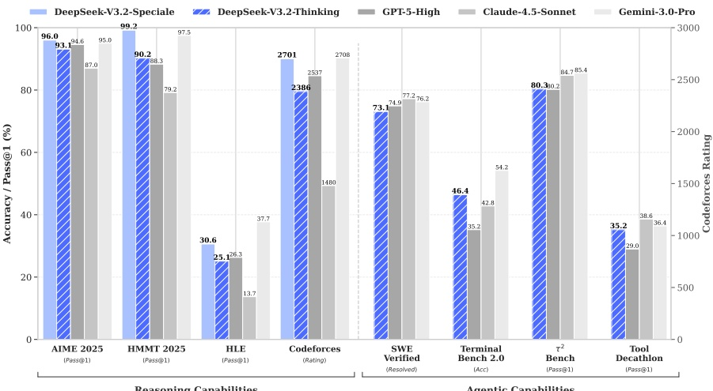
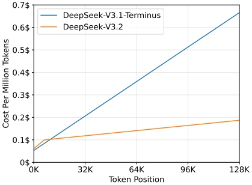
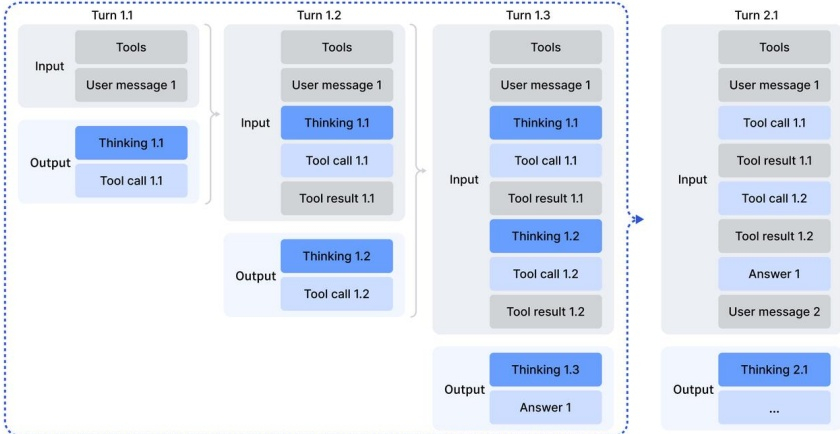
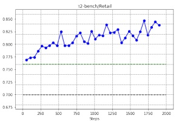
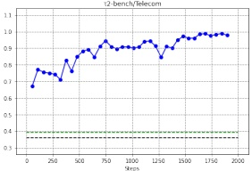
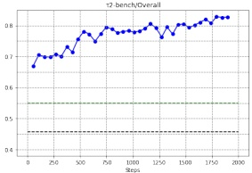
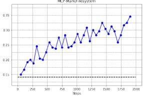
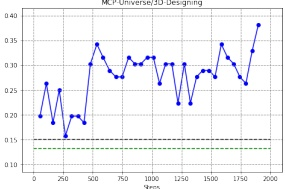
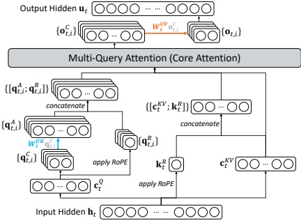

# DeepSeek-V3.2：推动开源大语言模型的边界

DeepSeek-AI

research@deepseek.com

## 摘要

我们推出 DeepSeek-V3.2，该模型在保持高计算效率的同时，实现了卓越的推理与智能体性能。DeepSeek-V3.2 的关键技术突破如下：(1) DeepSeek 稀疏注意力（DSA）：我们引入了 DSA，这是一种高效的注意力机制，能够在长上下文场景中大幅降低计算复杂度，同时保持模型性能。(2) 可扩展的强化学习框架：通过实施稳健的强化学习协议并扩展后训练计算量，DeepSeek-V3.2 的性能与 GPT-5 相当。值得注意的是，我们的高计算变体 DeepSeek-V3.2-Specialist 超越了 GPT-5，并展现出与 Gemini-3.0-Pro 相当的推理能力，在 2025 年国际数学奥林匹克竞赛（IMO）和国际信息学奥林匹克竞赛（IOI）中均获得金牌。(3) 大规模智能体任务合成流水线：为了将推理整合到工具使用场景中，我们开发了一种新颖的合成流水线，能够系统性地大规模生成训练数据。该方法支持可扩展的智能体后训练，在复杂交互环境中显著提升了泛化能力和指令遵循的鲁棒性。

图 1 | DeepSeek-V3.2 及其对应模型的基准测试结果。对于 HMMT 2025，我们报告的是二月份竞赛结果，与基线一致。对于 HLE，我们报告的是纯文本子集。

---

## 1. 引言

推理模型（DeepSeek-AI, 2025; OpenAI, 2024a）的发布标志着大语言模型（Large Language Models, LLMs）演进中的一个关键转折点，它推动了可验证领域整体性能的显著飞跃。自这一里程碑以来，LLMs 的能力迅速提升。然而，在过去几个月中，出现了一条明显的分化轨迹。尽管开源社区（MiniMax, 2025; MoonShot, 2025; 智谱AI, 2025）持续取得进展，但闭源专有模型（Anthropic, 2025b; DeepMind, 2025a; OpenAI, 2025）的性能提升速度却显著加快。因此，闭源与开源模型之间的性能差距并未缩小，反而似乎在扩大，专有系统在复杂任务中展现出日益优越的能力。

通过分析，我们识别出限制开源模型在复杂任务中能力的三个关键缺陷。首先，在架构上，对普通注意力机制（Vaswani et al., 2017）的普遍依赖严重制约了长序列的处理效率。这种低效性对可扩展部署和有效后训练均构成了重大障碍。其次，在资源分配方面，开源模型在后训练阶段面临计算投入不足的问题，限制了其在困难任务上的表现。最后，在 AI 智能体（AI agent）背景下，开源模型在泛化能力和指令遵循能力上明显落后于其专有对应物（EvalSys, 2025; Li et al., 2025; Luo et al., 2025），从而阻碍了其在实际部署中的有效性。

为应对这些关键限制，我们首先引入了 **DSA**，一种高效注意力机制，旨在大幅降低计算复杂度。该架构有效解决了效率瓶颈，即使在长上下文场景下也能保持模型性能。其次，我们开发了一套稳定且可扩展的强化学习（RL）协议，允许在后训练阶段进行显著的计算扩展。值得注意的是，该框架分配了超过预训练成本 10% 的后训练计算预算，从而解锁了高级能力。第三，我们提出了一种新流水线，以在工具使用场景中培养可泛化的推理能力。首先，我们利用 DeepSeek-V3（DeepSeek-AI, 2024）方法实施冷启动阶段，将推理和工具使用统一到单一轨迹中。随后，我们推进到大规模智能体任务合成，生成了超过 1,800 个不同的环境和 85,000 个复杂提示。这些大量合成的数据驱动 RL 过程，显著增强了模型在智能体上下文中的泛化能力和指令遵循能力。

DeepSeek-V3.2 在多个推理基准上取得了与 Kimi-k2-thinking 和 GPT-5 相当的性能。此外，DeepSeek-V3.2 显著提升了开源模型的智能体能力，在 EvalSys（2025）、Li et al.（2025）和 Luo et al.（2025）引入的长尾智能体任务上展现出卓越的熟练度。DeepSeek-V3.2 成为智能体场景下一种极具成本效益的替代方案，显著缩小了开源模型与前沿专有模型之间的性能差距，同时成本大幅降低。值得注意的是，为在推理领域推动开源模型的边界，我们放宽了长度约束，开发了 **DeepSeek-V3.2-Speciale**。结果，DeepSeek-V3.2-Speciale 与领先的闭源系统 Gemini-3.0-Pro（DeepMind, 2025b）实现了性能持平。它在 IOI 2025、ICPC 世界总决赛 2025、IMO 2025 和 CMO 2025 中均取得了金牌级表现。

---

## 2. DeepSeek-V3.2 架构

### 2.1. DeepSeek 稀疏注意力

DeepSeek-V3.2 使用了与 DeepSeek-V3.2-Exp 完全相同的架构。与 DeepSeek-V3.1 的最后一个版本 DeepSeek-V3.1-Terminus 相比，DeepSeek-V3.2 唯一的架构修改是通过持续训练引入了 DeepSeek 稀疏注意力（DeepSeek Sparse Attention，DSA）。

DSA 的原型。DSA 的原型主要由两个组件构成：一个闪电索引器（lightning indexer）和一个细粒度令牌选择机制（fine-grained token selection mechanism）。

闪电索引器计算查询令牌 $\mathbf{h}_t \in \mathbb{R}^d$ 与前面令牌 $\mathbf{h}_s \in \mathbb{R}^d$ 之间的索引分数 $I_{t,s}$，从而确定查询令牌选择哪些令牌：

$$  I_{t,s}=\sum_{j=1}^{H^{I}}w_{t,j}^{I}\cdot\mathrm{R e L U}\left(\mathbf{q}_{t,j}^{I}\cdot\mathbf{k}_{s}^{I}\right),   \tag*{(1)}$$

其中 $H^I$ 表示索引器头的数量；$\mathbf{q}_{t,j}^I \in \mathbb{R}^{d^I}$ 和 $w_{t,j}^I \in \mathbb{R}$ 来自查询令牌 $\mathbf{h}_t$；$\mathbf{k}_s^I \in \mathbb{R}^{d^I}$ 来自前面令牌 $\mathbf{h}_s$。出于吞吐量考虑，我们选择 ReLU 作为激活函数。由于闪电索引器头数较少且可以以 FP8 实现，因此其计算效率非常显著。

给定每个查询令牌 $\mathbf{h}_{t}$ 的索引分数 $\{I_{t,s}\}$，我们的细粒度令牌选择机制仅检索与 top-k 索引分数对应的键值项 $\{c_{s}\}$。然后，通过查询令牌 $\mathbf{h}_{t}$ 与稀疏选择的键值项 $\{c_{s}\}$ 之间的注意力机制计算注意力输出 $\mathbf{u}_{t}$：

$$  \mathbf{u}_{t}=\mathrm{A t t n}\big(\mathbf{h}_{t},\big\{\mathbf{c}_{s}\big|I_{t,s}\in\mathrm{T o p-k}\big(I_{t,:}\big)\big\}\big).   \tag*{(2)}$$

在 MLA 下实例化 DSA。为了从 DeepSeek-V3.1-Terminus 持续训练，我们基于 MLA（DeepSeek-AI，2024）为 DeepSeek-V3.2 实例化 DSA。在核级别，每个键值项必须在多个查询之间共享以提高计算效率（Yuan et al., 2025）。因此，我们基于 MLA 的 MQA（Multi-Query Attention）（Shazeer, 2019）模式实现了 DSA $^{1}$，其中每个潜在向量（MLA 的键值项）将在查询令牌的所有注意力头之间共享。基于 MLA 的 DSA 架构如图 2 所示。我们还提供了 DeepSeek-V3.2 的开源实现 $^{2}$，以明确指定细节。

#### 2.1.1. 持续预训练

从 DeepSeek-V3.1-Terminus 的基础检查点（其上下文长度已扩展至 128K）开始，我们进行持续预训练，随后进行后训练，从而创建 DeepSeek-V3.2。

DeepSeek-V3.2 的持续预训练包含两个训练阶段。在这两个阶段中，训练数据的分布与 DeepSeek-V3.1-Terminus 所用的 128K 长上下文扩展数据完全一致。

---

图2 | DeepSeek-V3.2 的注意力架构，其中 DSA 在 MLA 下实例化。绿色部分展示了 DSA 如何根据索引器选择 top-k 键值条目。

**密集预热阶段**。我们首先使用一个短期的预热阶段来初始化闪电索引器。在此阶段，我们保持密集注意力，并冻结除闪电索引器外的所有模型参数。为使索引器的输出与主注意力分布对齐，对于第 t 个查询词元，我们首先将所有注意力头的主注意力分数按头求和。然后沿序列维度对该求和结果进行 L1 归一化，得到目标分布 $p_{t,:} \in \mathbb{R}^t$。基于 $p_{t,:}$，我们使用 KL 散度损失作为索引器的训练目标：

$$  \mathcal{L}^{I}=\sum_{t}\mathbb{D}_{\mathrm{KL}}\big(p_{t,:}\left\|\mathrm{Softmax}\big(I_{t,:}\big)\right).   \tag*{(3)}$$

预热阶段我们使用 $10^{-3}$ 的学习率。索引器仅训练 1000 步，每步包含 16 个序列，每个序列长度为 128K 个词元，总计训练了 2.1B 个词元。

**稀疏训练阶段**。索引器预热后，我们引入细粒度的词元选择机制，并优化所有模型参数以使模型适应 DSA 的稀疏模式。在此阶段，我们仍保持索引器输出与主注意力分布的对齐，但仅考虑被选中的词元集合 $S_t = \{s \mid I_{t,s} \in \text{Top-k}(I_{t,:})\}$：

$$  \mathcal{L}^{I}=\sum_{t}\mathbb{D}_{\mathrm{KL}}\big(p_{t,S_{t}}\left\|\mathrm{Softmax}\big(I_{t,S_{t}}\big)\right).   \tag*{(4)}$$

值得注意的是，我们将索引器的输入从计算图中分离出来以进行独立优化。索引器的训练信号仅来自 $\mathcal{L}^I$，而主模型的优化仅依据语言建模损失。在此稀疏训练阶段，我们使用 $7.3 \times 10^{-6}$ 的学习率，并为每个查询词元选择 2048 个键值词元。主模型和索引器共同训练 15000 步，每步包含 480 个序列，每个序列长度为 128K 个词元，总计训练了 943.7B 个词元。

---

### 2.2. 性能评估

**标准基准测试** 在2025年9月，我们在多个涵盖不同能力的基准测试上评估 DeepSeek-V3.2-Exp，并与表现相近的 DeepSeek-V3.1-Terminus 进行对比。尽管 DeepSeek-V3.2-Exp 在长序列上显著提升了计算效率，但在短上下文和长上下文任务上，我们并未观察到相对于 DeepSeek-V3.1-Terminus 的显著性能下降。

**人类偏好** 鉴于直接的人类偏好评估本身容易受到偏见影响，我们采用 ChatbotArena 作为间接评估框架，以近似衡量用户对新开发基础模型的偏好。DeepSeek-V3.1-Terminus 和 DeepSeek-V3.2-Exp 采用完全相同的后训练策略，两者在2025年11月10日评估中获得的 Elo 评分非常接近。这些结果表明，尽管新基础模型引入了稀疏注意力机制，其性能仍与上一代模型持平。

**长上下文评估** DeepSeek-V3.2-Exp 发布后，我们使用未见过的测试集进行了多项独立的长上下文评估。一个代表性基准是 AA-LCR $ ^{3} $，在推理模式下 DeepSeek-V3.2-Exp 的得分比 DeepSeek-V3.1-Terminus 高四分。在 Fiction.liveBench 评估 $ ^{4} $ 中，DeepSeek-V3.2-Exp 在多项指标上持续优于 DeepSeek-V3.1-Terminus。这些证据表明，DeepSeek-V3.2-Exp 的基础检查点在长上下文任务上没有出现性能退化。

### 2.3. 推理成本

DSA 将主模型的核心注意力复杂度从 $ O(L^{2}) $ 降低到 $ O(Lk) $，其中 $ k \ll L $ 是选定的令牌数量。尽管闪电索引器的复杂度仍为 $ O(L^{2}) $，但其计算量远小于 DeepSeek-V3.1-Terminus 中的 MLA。结合我们的优化实现，DSA 在长上下文场景中实现了显著的端到端加速。图 Figure 3 展示了 DeepSeek-V3.1-Terminus 和 DeepSeek-V3.2 的令牌成本随序列中令牌位置的变化情况。这些成本基于对部署在 H800 GPU 上的实际服务进行基准测试估算得出，租金为每 GPU 小时 2 美元。需要注意的是，对于短序列预填充，我们专门实现了一种掩码 MHA 模式来模拟 DSA，该模式在短上下文条件下可以实现更高的效率。

## 3. 后训练

完成继续预训练后，我们进行后训练以生成最终的 DeepSeek-V3.2。DeepSeek-V3.2 的后训练采用与稀疏继续预训练阶段相同的稀疏注意力方式。对于 DeepSeek-V3.2，我们保持与 DeepSeek-V3.2-Exp 相同的后训练流程，包括专家蒸馏和混合强化学习训练。

**专家蒸馏** 对于每个任务，我们首先开发一个专门针对该领域的专用模型，所有专家模型均从相同的基础模型微调而来。

---

(a) 预填充

(b) 解码

图3 | DeepSeek-V3.1-Terminus与DeepSeek-V3.2在H800集群上的推理成本

预训练的DeepSeek-V3.2基础检查点。除写作任务和通用问答外，我们的框架涵盖六个专业领域：数学、编程、通用逻辑推理、通用智能体任务、智能体编程和智能体搜索，所有领域均支持思考模式与非思考模式。每个专业模型均通过大规模强化学习（Reinforcement Learning, RL）计算进行训练。此外，我们采用不同模型分别生成长链思维推理（思考模式）和直接响应生成（非思考模式）的训练数据。在专业模型准备就绪后，它们被用于为最终检查点生成领域特定数据。实验结果表明，基于蒸馏数据训练的模型性能仅略低于领域专业模型，且通过后续的RL训练可有效消除这一性能差距。

**混合RL训练** 对于DeepSeek-V3.2，我们仍采用**群体相对策略优化（Group Relative Policy Optimization, GRPO）** (DeepSeek-AI, 2025; Shao et al., 2024) 作为RL训练算法。与DeepSeek-V3.2-Exp类似，我们将推理、智能体与人类对齐训练合并为一个RL阶段。该方法能有效平衡各领域的性能，同时规避多阶段训练范式常见的灾难性遗忘问题。对于推理和智能体任务，我们采用基于规则的**结果奖励**、**长度惩罚**和**语言一致性奖励**。对于通用任务，我们使用**生成式奖励模型**，其中每个提示都有独立的评估标准。

**DeepSeek-V3.2与DeepSeek-V3.2-Speciale** DeepSeek-V3.2整合了从专业模型蒸馏出的推理、智能体和人类对齐数据，经过数千步的持续RL训练达到最终检查点。为探讨扩展思考的潜力，我们还开发了一个实验变体DeepSeek-V3.2-Speciale。该模型仅使用推理数据进行训练，并在RL过程中降低了长度惩罚。此外，我们引入了DeepSeekMath-V2 (Shao et al., 2025) 的数据集和奖励方法，以增强数学证明能力。

在此，我们强调第3.1节中关于如何构建稳定方案以扩展RL计算资源、第3.2节中如何将思考融入智能体任务的相关工作。

---

### 3.1. 扩展GRPO

我们首先回顾GRPO的目标。GRPO通过最大化以下目标来优化策略模型 $ \pi_\theta $，该目标基于每个问题 $ q $ 从旧策略 $ \pi_{\text{old}} $ 采样得到的一组响应 $ \{o_1, \cdots, o_G\} $ 上计算：

$$  \begin{align*}\mathcal{J}_{\mathrm{GRPO}}(\theta)=\mathbb{E}_{q\sim P(Q),\{o_{i}\}_{i=1}^{G}\sim\pi_{\mathrm{old}}(\cdot|q)}\left[\frac{1}{G}\sum_{i=1}^{G}\frac{1}{|o_{i}|}\sum_{t=1}^{|o_{i}|}\right.\\ \left.\min\left(r_{i,t}(\theta)\hat{A}_{i,t},\mathrm{clip}\left(r_{i,t}(\theta),1-\varepsilon,1+\varepsilon\right)\hat{A}_{i,t}\right)-\beta\mathbb{D}_{\mathrm{KL}}\left(\pi_{\theta}(o_{i,t})\left\|\pi_{\mathrm{ref}}(o_{i,t})\right.\right)\right],\end{align*}   \tag*{(5)}$$

其中

$$  r_{i,t}(\theta)=\frac{\pi_{\theta}(o_{i,t}|q,o_{i,<t})}{\pi_{\mathrm{o l d}}(o_{i,t}|q,o_{i,<t})}   \tag*{(6)}$$

是当前策略与旧策略之间的重要性采样比率。 $ \varepsilon $ 和 $ \beta $ 是分别控制裁剪范围和KL惩罚强度的超参数。 $ \hat{A}_{i,t} $ 是 $ o_{i,t} $ 的优势，通过归一化每组内的结果奖励来估计。具体而言，使用一组奖励模型为组中的每个输出 $ o_i $ 评分结果奖励 $ R_i $，分别得到 $ G $ 个奖励 $ \boldsymbol{R} = \{R_1, \cdots, R_G\} $。 $ o_{i,t} $ 的优势通过从输出 $ o_i $ 的奖励中减去该组的平均奖励来计算，即 $ \hat{A}_{i,t} = R_i - \text{mean}(\boldsymbol{R}) $。

接下来，我们概述直接在GRPO算法基础上稳定强化学习扩展的附加策略。

**无偏KL估计** 给定 $ o_{i,t} $ 是从旧策略 $ \pi_{\text{old}}(\cdot|q,o_{i,\text{st}}) $ 采样的，我们修正K3估计器（Schulman, 2020），使用当前策略 $ \pi_{\theta} $ 与旧策略 $ \pi_{\text{old}} $ 之间的重要性采样比率来获得无偏KL估计。

$$  \mathbb{D}_{\mathrm{K L}}\big(\pi_{\theta}(o_{i,t})\big\|\pi_{\mathrm{r e f}}(o_{i,t})\big)=\frac{\pi_{\theta}\big(o_{i,t}|q,o_{i,<t}\big)}{\pi_{\mathrm{o l d}}\big(o_{i,t}|q,o_{i,<t}\big)}\left(\frac{\pi_{\mathrm{r e f}}\big(o_{i,t}|q,o_{i,<t}\big)}{\pi_{\theta}\big(o_{i,t}|q,o_{i,<t}\big)}-\log\frac{\pi_{\mathrm{r e f}}\big(o_{i,t}|q,o_{i,<t}\big)}{\pi_{\theta}\big(o_{i,t}|q,o_{i,<t}\big)}-1\right).   \tag*{(7)}$$

作为此调整的直接结果，该KL估计器的梯度变得无偏，从而消除了系统估计误差，进而促进稳定收敛。这与原始K3估计器形成鲜明对比，特别是当采样到的token在当前策略下的概率显著低于参考策略时，即 $ \pi_{\theta} \ll \pi_{ref} $。在这种情况下，K3估计器的梯度会分配不成比例的大且无界的权重来最大化这些token的似然，导致噪声梯度更新累积，从而降低后续迭代中的样本质量并导致不稳定的训练动态。在实践中，我们发现不同领域受益于不同强度的KL正则化。对于某些领域，例如数学，应用相对较弱的KL惩罚甚至完全省略它可以带来性能提升。

**离策略序列掩码** 为了提高强化学习系统的效率，我们通常生成大批量的滚动数据，随后将其拆分为多个小批量进行若干梯度更新步骤。这种做法本质上引入了离策略行为。此外，用于高效数据生成的推理框架通常经过高度优化，可能在实现细节上与训练框架不同。这种训练-推理不一致性

---

进一步加剧了离策略程度。为稳定训练并提高对离策略更新的容忍度，我们根据数据采样策略 $ \pi_{\text{old}} $ 与当前策略 $ \pi_{\theta} $ 之间的KL散度，对导致显著策略差异的负序列进行掩码。更具体地，我们在GRPO损失中引入一个二元掩码M：

$$  \begin{align*}\mathcal{J}_{\mathrm{GRPO}}(\theta)&=\mathbb{E}_{q\sim P(Q),\{o_{i}\}_{i=1}^{G}\sim\pi_{\mathrm{old}}(\cdot|q)}\left[\frac{1}{G}\sum_{i=1}^{G}\frac{1}{|o_{i}|}\sum_{t=1}^{|o_{i}|}\right.\\&\left.\quad\min\left(r_{i,t}(\theta)\hat{A}_{i,t},\mathrm{clip}\left(r_{i,t}(\theta),1-\varepsilon,1+\varepsilon\right)\hat{A}_{i,t}\right)M_{i,t}-\beta\mathbb{D}_{\mathrm{KL}}\left(\pi_{\theta}(o_{i,t})\left\|\pi_{\mathrm{ref}}(o_{i,t})\right.\right)\right],\end{align*}   \tag*{(8)}$$

其中

$$  M_{i,t}=\begin{cases}0&\hat{A}_{i,t}<0,\frac{1}{\left|o_{i}\right|}\sum_{t=1}^{\left|o_{i}\right|}\log\frac{\pi_{\mathrm{old}}\left(o_{i,t}\left|q,o_{i,<t}\right.\right)}{\pi_{\theta}\left(o_{i,t}\left|q,o_{i,<t}\right.\right)}>\delta\\1&otherwise,\end{cases}   \tag*{(9)}$$

且 $ \delta $ 是控制策略差异阈值的超参数。注意，此处的 $ \pi_{\text{old}} $ 表示推理框架直接返回的采样概率，因此旧策略与当前策略之间的KL散度涵盖了上述两种离策略来源。还值得注意，我们仅对具有负优势的序列进行掩码。直观上，模型通过从自身错误中学习获益最大，而高度离策略的负样本可能有害，有可能误导优化过程或导致其不稳定。我们经验性地观察到，这种离策略序列掩码操作在某些原本不稳定的训练场景中提高了稳定性。

保持路由混合专家（MoE）模型通过在推理期间仅激活部分专家模块来提高计算效率。然而，推理与训练框架之间的差异，加上策略更新的影响，可能导致相同输入在推理和训练期间出现不一致的专家路由。这种不一致性会导致活跃参数子空间的突然变化，从而破坏优化稳定性并加剧离策略问题。为缓解这一问题，我们保留推理框架中采样时使用的专家路由路径，并在训练中强制执行相同的路由路径，确保优化相同的专家参数。这种保持路由操作对MoE模型的强化学习训练稳定性至关重要，且自DeepSeek-V3-0324以来已纳入我们的强化学习训练流程。

保持采样掩码 Top-p 和 top-k 采样是广泛使用的采样策略，用于提升大语言模型生成回复的质量。在强化学习训练中采用这些策略也有优势，因为它避免采样那些极低概率的 token，这些 token 会被用作优化目标。尽管这种截断保留了样本质量，但它引入了 $ \pi_{\text{old}} $ 与 $ \pi_{\theta} $ 之间动作空间的不匹配，违反了重要性采样原则，并导致训练不稳定。为解决这一问题，我们在从 $ \pi_{\text{old}} $ 采样时保留截断掩码，并在训练中将其应用于 $ \pi_{\theta} $，确保两种策略共享相同的动作子空间。经验上，我们发现结合 top-p 采样与保持采样掩码策略，能有效在强化学习训练中保持语言一致性。

---

### 3.2. 工具使用中的思考

#### 3.2.1. 思考上下文管理

DeepSeek-R1 已经证明，融入思考过程可以显著增强模型解决复杂问题的能力。基于这一洞见，我们旨在将思考能力整合到工具调用场景中。

我们观察到，直接复制 DeepSeek-R1 的策略——在收到第二轮消息时丢弃推理内容——会导致显著的 token 效率低下。这种方法迫使模型在每次后续工具调用时都冗余地对整个问题进行重新推理。为缓解这一问题，我们开发了一种严格针对工具调用场景的上下文管理策略，如图 4 所示：

- 仅在对话中引入新的用户消息时丢弃历史推理内容。如果仅附加与工具相关的消息（例如工具输出），则在整个交互过程中保留推理内容。
- 当移除推理轨迹时，工具调用及其结果的记录仍保留在上下文中。

值得注意的是，某些智能体框架（例如 Roo Code 或 Terminus）通过用户消息模拟工具交互。由于上述上下文管理规则，这些框架可能无法充分受益于我们增强的推理持久性。因此，我们建议在这种架构下使用非思考模型以获得最佳性能。

图 4 | 工具调用场景中的思考保留机制。

#### 3.2.2. 冷启动

鉴于存在推理数据（非智能体型）和非推理的智能体型数据，一种整合这两种能力的直接策略是通过精心设计的提示词。我们认为，模型具备足够的能力准确遵循显式指令，从而能够在推理过程中无缝融入工具执行。

---

为演示冷启动机制的操作，我们选择性地采样训练数据，如附录表6–8所示。需要特别注意的是，不同的任务提示（task prompt）关联不同的系统提示（system prompt）。表6–8给出了一个与竞赛编程提示相对应的示例。表6展示了一个推理数据示例，它使用系统提示明确要求模型在给出最终答案之前进行推理，并使用特殊标签<think></think>来标记推理路径。表7展示了非推理型代理数据（non-reasoning agentic data）的提示，其中的系统提示包含了工具调用（toolcall）的指导。表8展示我们设计的系统提示，用于指导模型在其推理过程中整合多次工具调用。

通过这种方式，尽管工具使用模式中的推理可能缺乏鲁棒性，但模型偶尔能够生成期望的轨迹，从而为后续的强化学习阶段提供基础。

#### 3.2.3. 大规模代理任务

多样化的强化学习（RL）任务对于增强模型鲁棒性至关重要。对于搜索、代码工程和代码解释等任务，我们使用真实世界的工具，包括实际的网络搜索API、编码工具和Jupyter Notebooks。尽管这些RL环境是真实的，但所使用的提示要么从互联网来源提取，要么合成生成，而非来自实际用户交互。对于其他任务，环境和提示都是合成构建的。我们使用的代理任务如表1所述。

表1 | 不同代理任务的描述，包括任务数量、环境类型（真实或合成）以及提示来源（提取或合成）。

<table border=1 style='margin: auto; word-wrap: break-word;'><tr><td style='text-align: center; word-wrap: break-word;'></td><td style='text-align: center; word-wrap: break-word;'>任务数量</td><td style='text-align: center; word-wrap: break-word;'>环境</td><td style='text-align: center; word-wrap: break-word;'>提示</td></tr><tr><td style='text-align: center; word-wrap: break-word;'>代码代理</td><td style='text-align: center; word-wrap: break-word;'>24667</td><td style='text-align: center; word-wrap: break-word;'>真实</td><td style='text-align: center; word-wrap: break-word;'>提取</td></tr><tr><td style='text-align: center; word-wrap: break-word;'>搜索代理</td><td style='text-align: center; word-wrap: break-word;'>50275</td><td style='text-align: center; word-wrap: break-word;'>真实</td><td style='text-align: center; word-wrap: break-word;'>合成</td></tr><tr><td style='text-align: center; word-wrap: break-word;'>通用代理</td><td style='text-align: center; word-wrap: break-word;'>4417</td><td style='text-align: center; word-wrap: break-word;'>合成</td><td style='text-align: center; word-wrap: break-word;'>合成</td></tr><tr><td style='text-align: center; word-wrap: break-word;'>代码解释器</td><td style='text-align: center; word-wrap: break-word;'>5908</td><td style='text-align: center; word-wrap: break-word;'>真实</td><td style='text-align: center; word-wrap: break-word;'>提取</td></tr></table>

搜索代理 我们采用基于 DeepSeek-V3.2 的多代理管道来生成多样化、高质量的训练数据。我们首先从大规模网络语料库中采样跨多个领域的信息量丰富的长尾实体。然后，一个问题构建代理使用可配置深度和广度的搜索工具探索每个实体，将发现的信息整合为问答对。多个具有异构配置（不同检查点、系统提示等）的答案生成代理为每个提出的问答对生成多样化的候选答案。一个具有搜索能力的验证代理通过多轮验证所有答案，仅保留那些真实答案正确且所有候选答案均可验证为错误的样本。这些数据涵盖多种语言、领域和难度级别。为了补充这些可验证样本并更好地反映实际使用情况，我们还从现有的帮助型RL数据集中筛选实例来增强数据集，在这些数据中，搜索工具提供了可衡量的益处。然后，我们制定了跨多个质量维度的详细评估标准，并使用生成式奖励模型根据这些标准对响应进行评分。这种混合方法能够对事实可靠性和实际帮助性进行优化。

---

**代码代理** 我们通过从 GitHub 挖掘数百万个问题-拉取请求（Issue-PR）对，构建了用于软件问题解决的大规模可执行环境。该数据集经过基于启发式规则和大型语言模型（LLM）判断的严格过滤，以确保高质量，要求每个条目包含合理的问题描述、关联的金标准补丁（gold patch）以及用于验证的测试补丁。我们采用由 DeepSeek-V3.2 驱动的自动化环境设置代理，为这些配对构建可执行环境。该代理负责处理包安装、依赖关系解析和测试执行。测试结果以标准 JUnit 格式输出，确保跨编程语言和测试框架的解析一致性。仅当应用金标准补丁后，产生了非零数量的 **从失败到通过**（False-to-Positive, F2P）测试用例（表明问题已修复）且零个 **从通过到失败**（Pass-to-Fail, P2F）测试用例（表明无回归）时，环境才被视为成功构建。通过该流水线，我们成功构建了数万个可复现的问题解决环境，涵盖多种编程语言，包括 Python、Java、JavaScript、TypeScript、C、C++、Go 和 PHP。

**代码解释器代理** 我们利用 Jupyter Notebook 作为代码解释器来处理复杂推理任务。为此，我们精心策划了一套多样化的问题集，涵盖数学、逻辑和数据科学，每个问题都要求模型利用代码执行能力来得出解决方案。

**通用代理** 为在强化学习（RL）中扩展代理环境和任务规模，我们采用了一种自动化环境合成代理，该代理合成了 1,827 个任务导向环境。这些任务难以解决但易于验证。合成工作流程主要包括环境和工具集构建、任务合成以及解决方案生成。具体而言，工作流程如下：

1. 给定一个任务类别（例如，规划旅行行程）以及一个配备有 bash 和搜索工具的沙盒，代理首先使用这些工具从互联网生成或检索相关数据，并将其存储在沙盒数据库中。
2. 随后，代理合成一组任务特定的工具，每个工具实现为一个函数。
3. 为了创建既具挑战性又可通过自动方式验证的任务，代理首先基于当前数据库提出一个简单任务，并附带其用 Python 实现的解决方案和验证函数。解决方案函数仅限于调用工具函数或执行逻辑计算，不能调用其他函数或直接访问数据库，从而确保任务只能通过工具接口解决。此外，解决方案函数产生的结果必须由验证函数进行验证。如果解决方案未通过验证，代理将修改解决方案或验证函数，直到解决方案的输出通过验证。然后，代理迭代地增加任务难度，并更新相应的解决方案和验证函数。在此迭代过程中，如果当前工具集不足以解决任务，代理将增强工具集。

遵循此工作流程，我们获得了数千个 <环境、工具、任务、验证器> 四元组。随后，我们使用 DeepSeek-V3.2 在此数据集上进行强化学习，并仅保留 pass@100 非零的实例，最终得到 1,827 个环境及其对应的任务（共 4,417 个任务）。以下展示了一个合成的旅行规划示例。该示例强调，虽然在大规模组合空间中搜索满足所有约束条件的旅行计划具有挑战性，但检查给定候选解是否满足这些约束则相对简单。

---

#### 合成任务示例：行程规划

我计划从杭州出发进行为期三天的旅行，需要协助制定从2025年10月1日至10月3日的行程安排。有几个重要要求：整个行程中不能重复选择任何城市、酒店、景点或餐厅。此外，请确保推荐的每家酒店、餐厅和景点实际位于当天住宿的城市。关于第二天还有一项预算管理要求：如果预订了每晚800元或以上的豪华酒店，则需要更严格控制其他开支——午餐和晚餐的总花费应低于350元，两家餐厅评分均需达到4.0星以上，下午景点门票价格需低于120元。若第二天酒店属于中高端价位（500-800元），则灵活性稍高——只需确保至少一家餐厅评分达到4.0或以上，景点门票低于180元。对于经济型酒店（200-500元），仅需保证至少一家餐厅评分在3.2以上。请问能否帮忙规划这份行程？

##### 提交结果格式

{ "time": "2025-10-01", "city": "cite_name", "hotel": "hotel_name", "afternoon_restaurant": "restaurant_name", "afternoon_attraction": "attraction_name", "evening_restaurant": "restaurant_name" },

{ "time": "2025-10-02", "city": "cite_name", "hotel": "hotel_name", "afternoon_restaurant": "restaurant_name", "afternoon_attraction": "attraction_name", "evening_restaurant": "restaurant_name" },

{ "time": "2025-10-03", "city": "cite_name", "hotel": "hotel_name", "afternoon_restaurant": "restaurant_name", "afternoon_attraction": "attraction_name", "evening_restaurant": "restaurant_name" }

### 行程规划工具集

<table border=1 style='margin: auto; word-wrap: break-word;'><tr><td style='text-align: center; word-wrap: break-word;'>函数名</td><td style='text-align: center; word-wrap: break-word;'>描述</td></tr><tr><td style='text-align: center; word-wrap: break-word;'>get_all_attractions_by_city(city)</td><td style='text-align: center; word-wrap: break-word;'>获取指定城市的所有景点。</td></tr><tr><td style='text-align: center; word-wrap: break-word;'>get_all_cities()</td><td style='text-align: center; word-wrap: break-word;'>获取数据库中的所有城市。</td></tr><tr><td style='text-align: center; word-wrap: break-word;'>get_all_hotels_by_city(city)</td><td style='text-align: center; word-wrap: break-word;'>获取指定城市的所有酒店。</td></tr><tr><td style='text-align: center; word-wrap: break-word;'>get_all_restaurants_by_city(city)</td><td style='text-align: center; word-wrap: break-word;'>获取指定城市的所有餐厅。</td></tr><tr><td style='text-align: center; word-wrap: break-word;'>get_city_by_attraction(attraction)</td><td style='text-align: center; word-wrap: break-word;'>根据景点名称获取所在城市。</td></tr><tr><td style='text-align: center; word-wrap: break-word;'>get_city_by_hotel(hotel)</td><td style='text-align: center; word-wrap: break-word;'>根据酒店名称获取所在城市。</td></tr><tr><td style='text-align: center; word-wrap: break-word;'>get_city_by_restaurant(restaurant)</td><td style='text-align: center; word-wrap: break-word;'>根据餐厅名称获取所在城市。</td></tr><tr><td style='text-align: center; word-wrap: break-word;'>get_city_transport(city)</td><td style='text-align: center; word-wrap: break-word;'>获取指定城市的所有市内交通选项。</td></tr><tr><td style='text-align: center; word-wrap: break-word;'>get_infos_by_attraction(info_keywords, attraction)</td><td style='text-align: center; word-wrap: break-word;'>获取指定景点的特定信息。</td></tr><tr><td style='text-align: center; word-wrap: break-word;'>get_infos_by_city(info_keywords, city)</td><td style='text-align: center; word-wrap: break-word;'>获取指定城市的特定信息。</td></tr><tr><td style='text-align: center; word-wrap: break-word;'>get_infos_by_hotel(info_keywords, hotel)</td><td style='text-align: center; word-wrap: break-word;'>获取指定酒店的特定信息。</td></tr><tr><td style='text-align: center; word-wrap: break-word;'>get_infos_by_restaurant(info_keywords, restaurant)</td><td style='text-align: center; word-wrap: break-word;'>获取指定餐厅的特定信息。</td></tr><tr><td style='text-align: center; word-wrap: break-word;'>get_inter_city_transport(from_city, to_city)</td><td style='text-align: center; word-wrap: break-word;'>获取给定城市对之间的所有交通方式。</td></tr><tr><td style='text-align: center; word-wrap: break-word;'>get_weather_by_city_date(city, date)</td><td style='text-align: center; word-wrap: break-word;'>获取指定城市日期的天气信息。</td></tr><tr><td style='text-align: center; word-wrap: break-word;'>submit_result(answer_text)</td><td style='text-align: center; word-wrap: break-word;'>提交最终答案内容。</td></tr></table>

## 4. 评估

### 4.1. 主要结果

我们在 MMLU-Pro (Wang et al., 2024)、GPQA Diamond (Rein et al., 2023)、Human Last Exam (HLE) 纯文本 (Phan et al., 2025)、LiveCodeBench (2024.08-2025.04)、Code

---

forces、Aider-Polyglot、AIME 2025、HMMT Feb 2025、HMMT Nov 2025 (Balunović et al., 2025)、IMOAnswerBench (Luong et al., 2025)、Terminal Bench 2.0、SWE-Verified (OpenAI, 2024b)、SWE Multilingual (Yang et al., 2025)、BrowseComp (Wei et al., 2025)、BrowseCompZh (Zhou et al., 2025)、$ \tau^{2} $-bench (Barres et al., 2025)、MCP-Universe (Luo et al., 2025)、MCP-Mark (EvalSys, 2025) 和 Tool-Decathlon (Li et al., 2025)。工具使用基准测试采用标准函数调用格式进行评估，模型被配置为思考模式。对于 MCP-Universe (Luo et al., 2025) 和 MCP-Mark (EvalSys, 2025)，我们使用内部环境对所有模型进行评估，因为搜索和 Playwright 环境可能与官方设置略有不同。我们将温度设置为 1.0，上下文窗口设置为 128K 词元。对于与数学相关的任务，如 AIME、HMMT、IMOAnswerBench 和 HLE，我们使用以下模板进行评估："{\question}\nPlease reason step by step, and put your final answer within \boxed{}." 对于 HLE，我们额外使用官方模板对 DeepSeek-V3.2-Thinking 进行了评估，得分为 23.9。

表 2 | DeepSeek-V3.2 与闭源/开源模型的对比。对于开源模型，我们仅与支持思考模式下的工具使用的模型进行比较。加粗数字表示每类模型（开源和闭源）中的最佳得分。$ \tau^{2} $-Bench 的结果为各类别的平均值。关于 BrowseComp，带 $ * $ 标记的是采用上下文管理技术后的性能。

<table border=1 style='margin: auto; word-wrap: break-word;'><tr><td style='text-align: center; word-wrap: break-word;'></td><td style='text-align: center; word-wrap: break-word;'>基准测试（指标）</td><td style='text-align: center; word-wrap: break-word;'>Claude-4.5-Sonnet</td><td style='text-align: center; word-wrap: break-word;'>GPT-5 High</td><td style='text-align: center; word-wrap: break-word;'>Gemini-3.0 Pro</td><td style='text-align: center; word-wrap: break-word;'>Kimi-K2 Thinking</td><td style='text-align: center; word-wrap: break-word;'>MiniMax M2</td><td style='text-align: center; word-wrap: break-word;'>DeepSeek-V3.2 Thinking</td></tr><tr><td rowspan="3">英语</td><td style='text-align: center; word-wrap: break-word;'>MMLU-Pro (EM)</td><td style='text-align: center; word-wrap: break-word;'>88.2</td><td style='text-align: center; word-wrap: break-word;'>87.5</td><td style='text-align: center; word-wrap: break-word;'>90.1</td><td style='text-align: center; word-wrap: break-word;'>84.6</td><td style='text-align: center; word-wrap: break-word;'>82.0</td><td style='text-align: center; word-wrap: break-word;'>85.0</td></tr><tr><td style='text-align: center; word-wrap: break-word;'>GPQA Diamond (Pass@1)</td><td style='text-align: center; word-wrap: break-word;'>83.4</td><td style='text-align: center; word-wrap: break-word;'>85.7</td><td style='text-align: center; word-wrap: break-word;'>91.9</td><td style='text-align: center; word-wrap: break-word;'>84.5</td><td style='text-align: center; word-wrap: break-word;'>77.7</td><td style='text-align: center; word-wrap: break-word;'>82.4</td></tr><tr><td style='text-align: center; word-wrap: break-word;'>HLE (Pass@1)</td><td style='text-align: center; word-wrap: break-word;'>13.7</td><td style='text-align: center; word-wrap: break-word;'>26.3</td><td style='text-align: center; word-wrap: break-word;'>37.7</td><td style='text-align: center; word-wrap: break-word;'>23.9</td><td style='text-align: center; word-wrap: break-word;'>12.5</td><td style='text-align: center; word-wrap: break-word;'>25.1</td></tr><tr><td rowspan="2">代码</td><td style='text-align: center; word-wrap: break-word;'>LiveCodeBench (Pass@1-COT)</td><td style='text-align: center; word-wrap: break-word;'>64.0</td><td style='text-align: center; word-wrap: break-word;'>84.5</td><td style='text-align: center; word-wrap: break-word;'>90.7</td><td style='text-align: center; word-wrap: break-word;'>82.6</td><td style='text-align: center; word-wrap: break-word;'>83.0</td><td style='text-align: center; word-wrap: break-word;'>83.3</td></tr><tr><td style='text-align: center; word-wrap: break-word;'>Codeforces (Rating)</td><td style='text-align: center; word-wrap: break-word;'>1480</td><td style='text-align: center; word-wrap: break-word;'>2537</td><td style='text-align: center; word-wrap: break-word;'>2708</td><td style='text-align: center; word-wrap: break-word;'>-</td><td style='text-align: center; word-wrap: break-word;'>-</td><td style='text-align: center; word-wrap: break-word;'>2386</td></tr><tr><td rowspan="4">数学</td><td style='text-align: center; word-wrap: break-word;'>AIME 2025 (Pass@1)</td><td style='text-align: center; word-wrap: break-word;'>87.0</td><td style='text-align: center; word-wrap: break-word;'>94.6</td><td style='text-align: center; word-wrap: break-word;'>95.0</td><td style='text-align: center; word-wrap: break-word;'>94.5</td><td style='text-align: center; word-wrap: break-word;'>78.3</td><td style='text-align: center; word-wrap: break-word;'>93.1</td></tr><tr><td style='text-align: center; word-wrap: break-word;'>HMMT Feb 2025 (Pass@1)</td><td style='text-align: center; word-wrap: break-word;'>79.2</td><td style='text-align: center; word-wrap: break-word;'>88.3</td><td style='text-align: center; word-wrap: break-word;'>97.5</td><td style='text-align: center; word-wrap: break-word;'>89.4</td><td style='text-align: center; word-wrap: break-word;'>-</td><td style='text-align: center; word-wrap: break-word;'>92.5</td></tr><tr><td style='text-align: center; word-wrap: break-word;'>HMMT Nov 2025 (Pass@1)</td><td style='text-align: center; word-wrap: break-word;'>81.7</td><td style='text-align: center; word-wrap: break-word;'>89.2</td><td style='text-align: center; word-wrap: break-word;'>93.3</td><td style='text-align: center; word-wrap: break-word;'>89.2</td><td style='text-align: center; word-wrap: break-word;'>-</td><td style='text-align: center; word-wrap: break-word;'>90.2</td></tr><tr><td style='text-align: center; word-wrap: break-word;'>IMOAnswerBench (Pass@1)</td><td style='text-align: center; word-wrap: break-word;'>-</td><td style='text-align: center; word-wrap: break-word;'>76.0</td><td style='text-align: center; word-wrap: break-word;'>83.3</td><td style='text-align: center; word-wrap: break-word;'>78.6</td><td style='text-align: center; word-wrap: break-word;'>-</td><td style='text-align: center; word-wrap: break-word;'>78.3</td></tr><tr><td rowspan="3">代码智能体</td><td style='text-align: center; word-wrap: break-word;'>Terminal Bench 2.0 (Acc)</td><td style='text-align: center; word-wrap: break-word;'>42.8</td><td style='text-align: center; word-wrap: break-word;'>35.2</td><td style='text-align: center; word-wrap: break-word;'>54.2</td><td style='text-align: center; word-wrap: break-word;'>35.7</td><td style='text-align: center; word-wrap: break-word;'>30.0</td><td style='text-align: center; word-wrap: break-word;'>46.4</td></tr><tr><td style='text-align: center; word-wrap: break-word;'>SWE Verified (Resolved)</td><td style='text-align: center; word-wrap: break-word;'>77.2</td><td style='text-align: center; word-wrap: break-word;'>74.9</td><td style='text-align: center; word-wrap: break-word;'>76.2</td><td style='text-align: center; word-wrap: break-word;'>71.3</td><td style='text-align: center; word-wrap: break-word;'>69.4</td><td style='text-align: center; word-wrap: break-word;'>73.1</td></tr><tr><td style='text-align: center; word-wrap: break-word;'>SWE Multilingual (Resolved)</td><td style='text-align: center; word-wrap: break-word;'>68.0</td><td style='text-align: center; word-wrap: break-word;'>55.3</td><td style='text-align: center; word-wrap: break-word;'>-</td><td style='text-align: center; word-wrap: break-word;'>61.1</td><td style='text-align: center; word-wrap: break-word;'>56.5</td><td style='text-align: center; word-wrap: break-word;'>70.2</td></tr><tr><td rowspan="3">搜索智能体</td><td style='text-align: center; word-wrap: break-word;'>BrowseComp (Pass@1)</td><td style='text-align: center; word-wrap: break-word;'>24.1</td><td style='text-align: center; word-wrap: break-word;'>54.9</td><td style='text-align: center; word-wrap: break-word;'>-</td><td style='text-align: center; word-wrap: break-word;'>$ -/60.2^{*} $</td><td style='text-align: center; word-wrap: break-word;'>44.0</td><td style='text-align: center; word-wrap: break-word;'>51.4/67.6*</td></tr><tr><td style='text-align: center; word-wrap: break-word;'>BrowseCompZh (Pass@1)</td><td style='text-align: center; word-wrap: break-word;'>42.4</td><td style='text-align: center; word-wrap: break-word;'>63.0</td><td style='text-align: center; word-wrap: break-word;'>-</td><td style='text-align: center; word-wrap: break-word;'>62.3</td><td style='text-align: center; word-wrap: break-word;'>48.5</td><td style='text-align: center; word-wrap: break-word;'>65.0</td></tr><tr><td style='text-align: center; word-wrap: break-word;'>HLE (Pass@1)</td><td style='text-align: center; word-wrap: break-word;'>32.0</td><td style='text-align: center; word-wrap: break-word;'>35.2</td><td style='text-align: center; word-wrap: break-word;'>45.8</td><td style='text-align: center; word-wrap: break-word;'>44.9</td><td style='text-align: center; word-wrap: break-word;'>31.8</td><td style='text-align: center; word-wrap: break-word;'>40.8</td></tr><tr><td rowspan="4">工具使用</td><td style='text-align: center; word-wrap: break-word;'>$ \tau^{2} $-Bench(Pass@1)</td><td style='text-align: center; word-wrap: break-word;'>84.7</td><td style='text-align: center; word-wrap: break-word;'>80.2</td><td style='text-align: center; word-wrap: break-word;'>85.4</td><td style='text-align: center; word-wrap: break-word;'>74.3</td><td style='text-align: center; word-wrap: break-word;'>76.9</td><td style='text-align: center; word-wrap: break-word;'>80.3</td></tr><tr><td style='text-align: center; word-wrap: break-word;'>MCP-Universe (Success Rate)</td><td style='text-align: center; word-wrap: break-word;'>46.5</td><td style='text-align: center; word-wrap: break-word;'>47.9</td><td style='text-align: center; word-wrap: break-word;'>50.7</td><td style='text-align: center; word-wrap: break-word;'>35.6</td><td style='text-align: center; word-wrap: break-word;'>29.4</td><td style='text-align: center; word-wrap: break-word;'>45.9</td></tr><tr><td style='text-align: center; word-wrap: break-word;'>MCP-Mark (Pass@1)</td><td style='text-align: center; word-wrap: break-word;'>33.3</td><td style='text-align: center; word-wrap: break-word;'>50.9</td><td style='text-align: center; word-wrap: break-word;'>43.1</td><td style='text-align: center; word-wrap: break-word;'>20.4</td><td style='text-align: center; word-wrap: break-word;'>24.4</td><td style='text-align: center; word-wrap: break-word;'>38.0</td></tr><tr><td style='text-align: center; word-wrap: break-word;'>Tool-Decathlon (Pass@1)</td><td style='text-align: center; word-wrap: break-word;'>38.6</td><td style='text-align: center; word-wrap: break-word;'>29.0</td><td style='text-align: center; word-wrap: break-word;'>36.4</td><td style='text-align: center; word-wrap: break-word;'>17.6</td><td style='text-align: center; word-wrap: break-word;'>16.0</td><td style='text-align: center; word-wrap: break-word;'>35.2</td></tr></table>

DeepSeek-V3.2 在推理任务上取得了与 GPT-5-high 相近的性能，但略逊于 Gemini-3.0-Pro。与 K2-Thinking 相比，DeepSeek-V3.2 以显著更少的输出词元获得了相当的成绩，如表 3 所示。这些性能提升可归因于用于强化学习训练的计算资源增加。近几个月来，我们观察到性能持续提升，与扩展的强化学习训练预算相关，该预算已超过预训练成本的 10%。我们假设，若分配额外的计算预算，推理能力可进一步增强。值得注意的是，本文展示的 DeepSeek-V3.2 性能受到长度约束奖励模型的限制；去除该限制后，我们观察到进一步改进。

---

模型性能详见第4.2节。

在代码智能体评估中，DeepSeek-V3.2 在 SWE-bench Verified 和 Terminal Bench 2.0 上均显著优于开源大语言模型，展现了其在真实编码工作流程中的潜力。关于 Terminal Bench 2.0，如前所述，我们针对“思考模式”的上下文管理策略目前与 Terminus 不兼容；因此，报告的 46.4 分是使用 Claude Code 框架获得的。我们还在非思考模式下使用 Terminus 评估了 DeepSeek-V3.2，得分为 39.3。对于 SWE-bench Verified，主要得分是基于我们内部框架获得的。在其他设置（包括 Claude Code 和 RooCode 框架，以及非思考模式）下的鲁棒性测试结果一致，介于 72 到 74 之间。

对于搜索智能体评估，我们使用标准商业搜索 API 评估模型。由于 DeepSeek-V3.2 支持的最大上下文长度仅为 128K，约 20% 以上的测试用例超出了此限制。为解决此问题，我们采用了一种上下文管理方法来得出最终得分。作为参考，无上下文管理时得分为 51.4。更多细节在第4.4节中提供。

在工具使用基准测试中，DeepSeek-V3.2 大幅缩小了开源与闭源大语言模型之间的性能差距，但仍低于前沿模型。对于 $ \tau^{2} $-bench，我们使用模型本身作为用户智能体，最终类别得分为 63.8（航空）、81.1（零售）和 96.2（电信）。对于 MCP 基准测试，我们采用函数调用格式，并将工具输出置于标记为“tool”角色的消息中，而非“user”角色。在测试过程中，我们观察到 DeepSeek-V3.2 经常进行冗余的自我验证，生成过长的轨迹。这种倾向常常导致上下文长度超过 128K 限制，特别是在 MCP-Mark GitHub 和 Playwright 评估等任务中。因此，这一现象阻碍了 DeepSeek-V3.2 的最终性能。然而，集成上下文管理策略可以进一步提升性能。我们将此识别为未来工作的方向，也是用户的一个实际考量。即使 DeepSeek-V3.2 受此问题影响，它仍然显著优于现有的开源模型。值得注意的是，由于这些基准测试中使用的环境和工具集在强化学习训练期间并未出现，观察到的改进证明了 DeepSeek-V3.2 将其推理策略泛化到领域外智能体场景的能力。非思考模型在智能体场景中的评估结果见附录表9。

### 4.2. DeepSeek-V3.2-Speciale 的结果

表3表明，DeepSeek-V3.2-Speciale 通过利用更多的推理 Token 取得了优越的性能，在多个基准测试上超越了最先进的 Gemini-3.0-Pro。值得注意的是，如表4所示，这个通用模型在2025年国际信息学奥林匹克竞赛（IOI）和 ICPC 世界总决赛（ICPC WF）中，未经针对性训练便达到了金牌级水平。此外，通过整合 Shao 等人（2025）的技术，该模型在复杂的证明任务上表现优异，达到了2025年国际数学奥林匹克竞赛（IMO）和中国数学奥林匹克竞赛（CMO）$^{5}$ 的金牌阈值。详细的评估协议见附录D。

然而，DeepSeek-V3.2-Speciale 的 Token 效率仍显著低于 Gemini-3.0-Pro。为了降低部署成本和延迟，我们在官方 DeepSeek-V3.2 的训练过程中施加了更严格的 Token 约束，旨在优化这一权衡。

---

表 3 | 推理模型的基准性能与效率。对于每个基准，单元格显示准确率和输出 token 数量（以千计）。每个基准的最高准确率以粗体显示；第二高准确率以下划线标出。

<table border=1 style='margin: auto; word-wrap: break-word;'><tr><td rowspan="2">基准</td><td style='text-align: center; word-wrap: break-word;'>GPT-5</td><td style='text-align: center; word-wrap: break-word;'>Gemini-3.0</td><td style='text-align: center; word-wrap: break-word;'>Kimi-K2</td><td style='text-align: center; word-wrap: break-word;'>DeepSeek-V3.2</td><td style='text-align: center; word-wrap: break-word;'>DeepSeek-V3.2</td></tr><tr><td style='text-align: center; word-wrap: break-word;'>High</td><td style='text-align: center; word-wrap: break-word;'>Pro</td><td style='text-align: center; word-wrap: break-word;'>Thinking</td><td style='text-align: center; word-wrap: break-word;'>Thinking</td><td style='text-align: center; word-wrap: break-word;'>Speciale</td></tr><tr><td style='text-align: center; word-wrap: break-word;'>AIME 2025 (Pass@1)</td><td style='text-align: center; word-wrap: break-word;'>94.6 (13k)</td><td style='text-align: center; word-wrap: break-word;'>95.0 (15k)</td><td style='text-align: center; word-wrap: break-word;'>94.5 (24k)</td><td style='text-align: center; word-wrap: break-word;'>93.1 (16k)</td><td style='text-align: center; word-wrap: break-word;'>96.0 (23k)</td></tr><tr><td style='text-align: center; word-wrap: break-word;'>HMMT Feb 2025 (Pass@1)</td><td style='text-align: center; word-wrap: break-word;'>88.3 (16k)</td><td style='text-align: center; word-wrap: break-word;'>97.5 (16k)</td><td style='text-align: center; word-wrap: break-word;'>89.4 (31k)</td><td style='text-align: center; word-wrap: break-word;'>92.5 (19k)</td><td style='text-align: center; word-wrap: break-word;'>99.2 (27k)</td></tr><tr><td style='text-align: center; word-wrap: break-word;'>HMMT Nov 2025 (Pass@1)</td><td style='text-align: center; word-wrap: break-word;'>89.2 (20k)</td><td style='text-align: center; word-wrap: break-word;'>93.3 (15k)</td><td style='text-align: center; word-wrap: break-word;'>89.2 (29k)</td><td style='text-align: center; word-wrap: break-word;'>90.2 (18k)</td><td style='text-align: center; word-wrap: break-word;'>94.4 (25k)</td></tr><tr><td style='text-align: center; word-wrap: break-word;'>IMOAnswerBench (Pass@1)</td><td style='text-align: center; word-wrap: break-word;'>76.0 (31k)</td><td style='text-align: center; word-wrap: break-word;'>83.3 (18k)</td><td style='text-align: center; word-wrap: break-word;'>78.6 (37k)</td><td style='text-align: center; word-wrap: break-word;'>78.3 (27k)</td><td style='text-align: center; word-wrap: break-word;'>84.5 (45k)</td></tr><tr><td style='text-align: center; word-wrap: break-word;'>LiveCodeBench (Pass@1-COT)</td><td style='text-align: center; word-wrap: break-word;'>84.5 (13k)</td><td style='text-align: center; word-wrap: break-word;'>90.7 (13k)</td><td style='text-align: center; word-wrap: break-word;'>82.6 (29k)</td><td style='text-align: center; word-wrap: break-word;'>83.3 (16k)</td><td style='text-align: center; word-wrap: break-word;'>88.7 (27k)</td></tr><tr><td style='text-align: center; word-wrap: break-word;'>CodeForces (Rating)</td><td style='text-align: center; word-wrap: break-word;'>2537 (29k)</td><td style='text-align: center; word-wrap: break-word;'>2708 (22k)</td><td style='text-align: center; word-wrap: break-word;'>-</td><td style='text-align: center; word-wrap: break-word;'>2386 (42k)</td><td style='text-align: center; word-wrap: break-word;'>2701 (77k)</td></tr><tr><td style='text-align: center; word-wrap: break-word;'>GPQA Diamond (Pass@1)</td><td style='text-align: center; word-wrap: break-word;'>85.7 (8k)</td><td style='text-align: center; word-wrap: break-word;'>91.9 (8k)</td><td style='text-align: center; word-wrap: break-word;'>84.5 (12k)</td><td style='text-align: center; word-wrap: break-word;'>82.4 (7k)</td><td style='text-align: center; word-wrap: break-word;'>85.7 (16k)</td></tr><tr><td style='text-align: center; word-wrap: break-word;'>HLE (Pass@1)</td><td style='text-align: center; word-wrap: break-word;'>26.3 (15k)</td><td style='text-align: center; word-wrap: break-word;'>37.7 (15k)</td><td style='text-align: center; word-wrap: break-word;'>23.9 (24k)</td><td style='text-align: center; word-wrap: break-word;'>25.1 (21k)</td><td style='text-align: center; word-wrap: break-word;'>30.6 (35k)</td></tr></table>

性能与成本之间的权衡。我们认为，token 效率仍是未来研究的关键领域。

表 4 | DeepSeek-V3.2-Speciale 在顶尖数学与编程竞赛中的表现。对于 ICPC WF 2025，我们报告了每个成功解题的提交次数。DeepSeek-V3.2-Speciale 在 ICPC WF 2025 中排名第 2，在 IOI 2025 中排名第 10。

<table border=1 style='margin: auto; word-wrap: break-word;'><tr><td style='text-align: center; word-wrap: break-word;'>竞赛</td><td style='text-align: center; word-wrap: break-word;'>P1</td><td style='text-align: center; word-wrap: break-word;'>P2</td><td style='text-align: center; word-wrap: break-word;'>P3</td><td style='text-align: center; word-wrap: break-word;'>P4</td><td style='text-align: center; word-wrap: break-word;'>P5</td><td style='text-align: center; word-wrap: break-word;'>P6</td><td style='text-align: center; word-wrap: break-word;'>总分</td><td style='text-align: center; word-wrap: break-word;'>奖牌</td></tr><tr><td style='text-align: center; word-wrap: break-word;'>IMO 2025</td><td style='text-align: center; word-wrap: break-word;'>7</td><td style='text-align: center; word-wrap: break-word;'>7</td><td style='text-align: center; word-wrap: break-word;'>7</td><td style='text-align: center; word-wrap: break-word;'>7</td><td style='text-align: center; word-wrap: break-word;'>7</td><td style='text-align: center; word-wrap: break-word;'>0</td><td style='text-align: center; word-wrap: break-word;'>35/42</td><td style='text-align: center; word-wrap: break-word;'>金牌</td></tr><tr><td style='text-align: center; word-wrap: break-word;'>CMO 2025</td><td style='text-align: center; word-wrap: break-word;'>18</td><td style='text-align: center; word-wrap: break-word;'>18</td><td style='text-align: center; word-wrap: break-word;'>9</td><td style='text-align: center; word-wrap: break-word;'>21</td><td style='text-align: center; word-wrap: break-word;'>18</td><td style='text-align: center; word-wrap: break-word;'>18</td><td style='text-align: center; word-wrap: break-word;'>102/126</td><td style='text-align: center; word-wrap: break-word;'>金牌</td></tr><tr><td style='text-align: center; word-wrap: break-word;'>IOI 2025</td><td style='text-align: center; word-wrap: break-word;'>100</td><td style='text-align: center; word-wrap: break-word;'>82</td><td style='text-align: center; word-wrap: break-word;'>72</td><td style='text-align: center; word-wrap: break-word;'>100</td><td style='text-align: center; word-wrap: break-word;'>55</td><td style='text-align: center; word-wrap: break-word;'>83</td><td style='text-align: center; word-wrap: break-word;'>492/600</td><td style='text-align: center; word-wrap: break-word;'>金牌</td></tr><tr><td style='text-align: center; word-wrap: break-word;'>竞赛</td><td style='text-align: center; word-wrap: break-word;'>A</td><td style='text-align: center; word-wrap: break-word;'>B</td><td style='text-align: center; word-wrap: break-word;'>C</td><td style='text-align: center; word-wrap: break-word;'>E</td><td style='text-align: center; word-wrap: break-word;'>F</td><td style='text-align: center; word-wrap: break-word;'>H</td><td style='text-align: center; word-wrap: break-word;'>J</td><td style='text-align: center; word-wrap: break-word;'>L</td></tr><tr><td style='text-align: center; word-wrap: break-word;'>ICPC WF 2025</td><td style='text-align: center; word-wrap: break-word;'>3</td><td style='text-align: center; word-wrap: break-word;'>-</td><td style='text-align: center; word-wrap: break-word;'>1</td><td style='text-align: center; word-wrap: break-word;'>2</td><td style='text-align: center; word-wrap: break-word;'>-</td><td style='text-align: center; word-wrap: break-word;'>1</td><td style='text-align: center; word-wrap: break-word;'>1</td><td style='text-align: center; word-wrap: break-word;'>10/12</td></tr></table>

### 4.3. 合成智能体任务

在本节中，我们进行消融实验以研究合成智能体任务的效果。我们关注两个问题。第一，合成任务是否对强化学习具有足够的挑战性？第二，这些合成任务的泛化能力如何，即它们能否迁移到不同的下游任务或真实世界环境中？

针对第一个问题，我们从通用合成智能体任务中随机抽取 50 个实例，并对用于合成的模型以及前沿闭源大语言模型进行评估。如表 5 所示，DeepSeek-V3.2-Exp 的准确率仅为 12%，而前沿闭源模型的准确率最高达到 62%。这些结果表明，合成数据中包含的智能体任务对 DeepSeek-V3.2-Exp 和前沿闭源模型均具有挑战性。

为了探究在合成数据上进行强化学习能否泛化到不同任务或真实世界环境，我们将强化学习应用于 DeepSeek-V3.2 的 SFT 检查点（记为 DeepSeek-V3.2-SFT）。为排除长 CoT 和其他强化学习数据的影响，我们仅在非思考模式下对合成智能体任务进行强化学习。然后，我们将该模型与 DeepSeek-V3.2-SFT 和 DeepSeek-V3.2-Exp 进行比较，其中 DeepSeek-V3.2-Exp 仅在搜索和代码环境中通过强化学习训练。如图 5 所示，在合成数据上进行大规模强化学习取得了显著的改进。

---

表 5 | 不同模型在通用合成任务上的准确率。

<table border=1 style='margin: auto; word-wrap: break-word;'><tr><td style='text-align: center; word-wrap: break-word;'>Pass@K</td><td style='text-align: center; word-wrap: break-word;'>DeepSeek-v3.2-Exp</td><td style='text-align: center; word-wrap: break-word;'>Sonnet-4.5</td><td style='text-align: center; word-wrap: break-word;'>Gemini-3.0 Pro</td><td style='text-align: center; word-wrap: break-word;'>GPT-5-Thinking</td></tr><tr><td style='text-align: center; word-wrap: break-word;'>1</td><td style='text-align: center; word-wrap: break-word;'>12%</td><td style='text-align: center; word-wrap: break-word;'>34%</td><td style='text-align: center; word-wrap: break-word;'>51%</td><td style='text-align: center; word-wrap: break-word;'>62%</td></tr><tr><td style='text-align: center; word-wrap: break-word;'>2</td><td style='text-align: center; word-wrap: break-word;'>18%</td><td style='text-align: center; word-wrap: break-word;'>47%</td><td style='text-align: center; word-wrap: break-word;'>65%</td><td style='text-align: center; word-wrap: break-word;'>75%</td></tr><tr><td style='text-align: center; word-wrap: break-word;'>4</td><td style='text-align: center; word-wrap: break-word;'>26%</td><td style='text-align: center; word-wrap: break-word;'>62%</td><td style='text-align: center; word-wrap: break-word;'>74%</td><td style='text-align: center; word-wrap: break-word;'>82%</td></tr></table>

图 5 | 仅使用合成通用代理数据的 DeepSeek-V3.2-SFT 的 RL 训练。

在 Tau2Bench、MCP-Mark 和 MCP-Universe 基准上，相比 DeepSeek-V3.2-SFT 取得了改进。相反，将 RL 限制在代码和搜索场景下并未提升这些基准的性能，这进一步凸显了合成数据的潜力。

### 4.4. 搜索代理的上下文管理

即使采用 128k 等扩展上下文窗口，代理工作流（尤其是在基于搜索的场景中）经常遇到最大长度限制，导致推理过程过早截断。这一瓶颈阻碍了测试时计算潜力的充分实现。为解决此问题，我们引入了上下文管理，采用简单策略在 Token 使用量超过上下文窗口长度 80% 时，在测试时扩展 Token 预算。这些策略包括：(1) 摘要（Summary），即溢出轨迹并重新启动展开；(2) 丢弃 75%（Discard-75%），即丢弃轨迹中前 75% 的工具调用历史以释放空间；(3) 全部丢弃（Discard-all），即丢弃所有之前的工具调用历史以重置上下文（类似于新上下文工具 (Anthropic, 2025a)）。作为对比，我们还实现了一个并行扩展基线 Parallel-fewest-step，它采样 N 条独立轨迹，并

---

图6 | 不同测试时计算扩展策略下的 BrowseComp 准确率。

选择步骤数最少的轨迹。

我们在 BrowseComp 基准测试（Wei 等人，2025）上评估了这些策略。如图6所示，在不同计算预算下，上下文管理通过允许模型扩展测试时计算，提供了更多执行额外步骤的空间，从而带来了显著的性能提升。例如，Summary 将平均步骤数从140扩展到364，性能从53.4提升至60.2。然而，其整体效率相对较低。尽管 Discard-all 方法简单，但在效率和可扩展性方面均表现良好，得分为67.6，与并行扩展相当，但使用的步骤数显著更少。

总之，测试时计算既可以通过上下文管理进行串行扩展，也可以通过并行方式扩展，两者均能有效增强模型的解题能力。然而，不同策略在效率和可扩展性上表现出差异。因此，在衡量模型性能时，必须考虑实际的计算成本。同时，如何找到串行扩展与并行扩展的最优组合，以最大化效率与可扩展性，仍是未来研究的重要方向。

## 5. 结论、局限与未来工作

在本工作中，我们提出了 DeepSeek-V3.2，这是一个有效弥合计算效率与高级推理能力之间差距的框架。通过使用动态稀疏注意力（DSA），我们解决了关键的计算复杂度问题，同时未牺牲长上下文性能。通过增加计算预算，DeepSeek-V3.2 在推理基准测试中达到了与 GPT-5 相当的性能。最后，我们的大规模智能体任务合成流水线显著提升了工具使用熟练度，为开源大语言模型实现鲁棒且可泛化的 AI 智能体开辟了新的可能性。此外，我们的高计算变体 DeepSeek-V3.2-Speciale 在 IMO 和 IOI 中获得金牌，为开源大语言模型树立了里程碑。

尽管取得了这些成就，与 Gemini-3.0-Pro 等前沿闭源模型相比，我们承认存在某些局限性。首先，由于总训练 FLOPs 较少，DeepSeek-V3.2 的世界知识广度仍然落后于领先的专有

---

模型。我们计划通过扩大预训练计算量，在未来的迭代中填补这一知识空白。其次，**Token 效率**仍是一个挑战；DeepSeek-V3.2 通常需要更长的生成轨迹（即更多 Token）才能达到如 Gemini-3.0-Pro 等模型的输出质量。未来工作将专注于优化模型推理链的智能密度以提高效率。第三，解决复杂任务的能力仍落后于前沿模型，这促使我们进一步改进基础模型和后训练方案。

## 参考文献

Anthropic. 系统卡：Claude Opus 4.5, 2025a. URL https://assets.anthropic.com/m/64823ba7485345a7/Claude-Opus-4-5-System-Card.pdf.

Anthropic. 介绍 Claude Sonnet 4.5, 2025b. URL https://www.anthropic.com/news/claude-sonnet-4-51.

M. Balunović, J. Dekoninck, I. Petrov, N. Jovanović, and M. Vechev. Matharena：在无污染数学竞赛上评估 LLM. 神经信息处理系统数据集与基准赛道会议论文集, 2025.

V. Barres, H. Dong, S. Ray, X. Si, and K. Narasimhan. $ \tau^{2} $-bench：在双控制环境中评估对话代理, 2025. URL https://arxiv.org/abs/2506.07982.

DeepMind. Gemini 2.5：以高级推理、多模态、长上下文和下一代代理能力推动前沿. arXiv预印本 arXiv:2507.06261, 2025a.

G. DeepMind. Gemini 3 Pro 模型卡, 2025b. URL https://storage.googleapis.com/deepmind-media/Model-Cards/Gemini-3-Pro-Model-Card.pdf.

DeepSeek-AI. DeepSeek-V2：一种强大、经济且高效的混合专家语言模型. CoRR, abs/2405.04434, 2024. doi: 10.48550/ARXIV.2405.04434. URL https://doi.org/10.48550/arXiv.2405.04434.

DeepSeek-AI. DeepSeek-V3 技术报告, 2024. URL https://arxiv.org/abs/2412.19437.

DeepSeek-AI. DeepSeek-R1：通过强化学习激励 LLM 的推理能力. Nature, 645(8081):633–638, 2025.

EvalSys. MCPMark 排行榜, 2025. URL https://mcpmark.ai/leaderboard.

J. Li, W. Zhao, J. Zhao, W. Zeng, H. Wu, X. Wang, R. Ge, Y. Cao, Y. Huang, W. Liu, et al. 工具十项全能：对语言代理在多样化、真实和长期任务执行上的基准测试. arXiv预印本 arXiv:2510.25726, 2025.

Z. Luo, Z. Shen, W. Yang, Z. Zhao, P. Jwalapuram, A. Saha, D. Sahoo, S. Savarese, C. Xiong, and J. Li. MCP-Universe：使用真实世界模型上下文协议服务器对大型语言模型进行基准测试. arXiv预印本 arXiv:2508.14704, 2025.

T. Luong, D. Hwang, H. H. Nguyen, G. Ghiasi, Y. Chervonyi, I. Seo, J. Kim, G. Bingham, J. Lee, S. Mishra, A. Zhai, C. H. Hu, H. Michalewski, J. Kim, J. Ahn, J. Bae, X. Song, T. H. Trinh, Q. V. Le, and J. Jung. 迈向稳健的数学推理. 2025年自然语言处理实证方法会议论文集, 2025. URL https://aclanthology.org/2025.emnlp-main.1794/.

---

MiniMax。https://www.minimax.io/news/minimax-m2, 2025。URL https://www.minimax.io/news/minimax-m2。

MoonShot。介绍Kimi K2思考，2025。URL https://moonshotai.github.io/Kimi-K2/thinking.html。

OpenAI。学习与大语言模型推理，2024a。URL https://openai.com/index/learning-to-reason-with-llms/。

OpenAI。介绍SWE-bench验证版：我们发布了一个经人工验证的SWE-bench子集，以更……，2024b。URL https://openai.com/index/introducing-swe-bench-verified/。

OpenAI。介绍GPT-5，2025。URL https://openai.com/index/introducing-gpt-5/。

L. Phan、A. Gatti、Z. Han、N. Li、J. Hu、H. Zhang、C. B. C. Zhang、M. Shaaban、J. Ling、S. Shi 等人。人类的最后考试。 $\underline{\text{arXiv preprint arXiv:2501.14249, 2025。}}$

D. Rein、B. L. Hou、A. C. Stickland、J. Petty、R. Y. Pang、J. Dirani、J. Michael 和 S. R. Bowman。GPQA：一个研究生级别的、防谷歌的问答基准。arXiv preprint arXiv:2311.12022, 2023。

J. Schulman。近似KL散度，2020。URL http://joschu.net/blog/kl-approx.html。

Z. Shao、P. Wang、Q. Zhu、R. Xu、J. Song、M. Zhang、Y. K. Li、Y. Wu 和 D. Guo。DeepSeek-Math：推动开放语言模型数学推理的极限。CoRR，abs/2402.03300，2024。doi: 10.48550/ARXIV.2402.03300。URL https://doi.org/10.48550/arXiv.2402.03300。

Z. Shao、Y. Luo、C. Lu、Z. Ren、J. Hu、T. Ye、Z. Gou、S. Ma 和 X. Zhang。DeepSeekMath-v2：迈向可自我验证的数学推理，2025。

N. Shazeer。快速Transformer解码：一个写头足矣。 $\underline{\text{CoRR}}$, abs/1911.02150, 2019。URL http://arxiv.org/abs/1911.02150。

A. Vaswani、N. Shazeer、N. Parmar、J. Uszkoreit、L. Jones、A. N. Gomez、L. Kaiser 和 I. Polosukhin。注意力机制足矣。第5998–6008页，2017。URL https://proceedings.neurips.cc/paper/2017/hash/3f5ee243547dee91fbd053c1c4a845aa-Abstract.html。

Y. Wang、X. Ma、G. Zhang、Y. Ni、A. Chandra、S. Guo、W. Ren、A. Arulraj、X. He、Z. Jiang、T. Li、M. Ku、K. Wang、A. Zhuang、R. Fan、X. Yue 和 W. Chen。MMLU-Pro：一个更鲁棒且更具挑战性的多任务语言理解基准。CoRR，abs/2406.01574，2024。URL https://doi.org/10.48550/arXiv.2406.01574。

J. Wei、Z. Sun、S. Papay、S. McKinney、J. Han、I. Fulford、H. W. Chung、A. T. Passos、W. Fedus 和 A. Glaese。BrowseComp：一个简单但具有挑战性的浏览智能体基准。 $\underline{\text{arXiv preprint arXiv:2504.12516}}$，2025。

J. Yang、K. Lieret、C. E. Jimenez、A. Wettig、K. Khandpur、Y. Zhang、B. Hui、O. Press、L. Schmidt 和 D. Yang。SWE-Smith：为软件工程智能体扩展数据，2025。URL https://arxiv.org/abs/2504.21798。

---

J. Yuan, H. Gao, D. Dai, J. Luo, L. Zhao, Z. Zhang, Z. Xie, Y. Wei, L. Wang, Z. Xiao, Y. Wang, C. Ruan, M. Zhang, W. Liang, and W. Zeng. 原生稀疏注意力：硬件对齐且原生可训练的稀疏注意力. In W. Che, J. Nabende, E. Shutova, and M. T. Pilehvar, editors, 第63届计算语言学协会年会论文集（第一卷：长篇论文）, ACL 2025, pages 23078–23097. 计算语言学协会, 2025. URL https://aclanthology.org/2025.acl-long.1126/.

ZhiPu-AI. Glm-4.5: 智能体、推理与编码（ARC）基础模型. arXiv preprint arXiv:2508.06471, 2025.

P. Zhou, B. Leon, X. Ying, C. Zhang, Y. Shao, Q. Ye, D. Chong, Z. Jin, C. Xie, M. Cao, et al. Browsecomp-zh：面向中文的大语言模型网页浏览能力基准测试. arXiv preprint arXiv:2504.19314, 2025.

## 附录

### A. MLA 的 MHA 与 MOA 模式

(a) MLA 的 MHA 模式。

(b) MQA 模式下的 MLA。

图7 | MLA 的 MHA 与 MQA 模式示意图。对于 DeepSeek-V3.1-Terminus，训练和预填充阶段使用 MHA 模式，解码阶段使用 MQA 模式。

图7展示了MLA的两个方面——MHA与MQA模式——以及它们之间的转换。

### B. 冷启动模板

---

表6 | 推理数据系统提示示例。系统提示要求模型在 `<think></think>` 标签中输出推理过程。

<table border=1 style='margin: auto; word-wrap: break-word;'><tr><td style='text-align: center; word-wrap: break-word;'>推理系统提示</td><td style='text-align: center; word-wrap: break-word;'>你是一位专业的 Python 程序员。将给出一个问题（问题说明），你需要生成一个符合说明并通过所有测试的正确 Python 程序。请先进行推理再给出最终答案。推理过程放在 `$ \langle think\rangle $` 和 `$ \langle/think\rangle $` 之间。最终答案在 `$ \langle/think\rangle $` 标签之后输出。</td></tr><tr><td style='text-align: center; word-wrap: break-word;'>提示</td><td style='text-align: center; word-wrap: break-word;'>给定一个链表，交换每两个相邻节点并返回其头节点……</td></tr><tr><td rowspan="2">推理响应</td><td style='text-align: center; word-wrap: break-word;'>`$ \langle think\rangle $` ……</td></tr><tr><td style='text-align: center; word-wrap: break-word;'>`$ \langle/think\rangle $` [最终答案]</td></tr></table>

表7 | {TOOL-DESCRIPTIONS} 和 {TOOLCALL-FORMAT} 将被替换为具体工具和设计的工具调用格式。

<table border=1 style='margin: auto; word-wrap: break-word;'><tr><td style='text-align: center; word-wrap: break-word;'>智能体</td><td style='text-align: center; word-wrap: break-word;'>使用 Python 解释器工具执行 Python 代码。代码不会展示给用户。此工具用于内部推理，不用于旨在对用户可见的代码（例如创建图表、表格或文件时）。当你向 Python 发送包含 Python 代码的消息时，代码将在一个有状态的 Jupyter notebook 环境中执行。Python 将返回执行输出或在 120.0 秒后超时。</td></tr><tr><td style='text-align: center; word-wrap: break-word;'>系统</td><td style='text-align: center; word-wrap: break-word;'># 工具</td></tr><tr><td style='text-align: center; word-wrap: break-word;'>提示</td><td style='text-align: center; word-wrap: break-word;'>你可以使用以下工具：{TOOL-DESCRIPTIONS} 重要提示：始终严格遵循此格式进行工具调用：{TOOLCALL-FORMAT}</td></tr><tr><td style='text-align: center; word-wrap: break-word;'>提示</td><td style='text-align: center; word-wrap: break-word;'>给定一个链表，交换每两个相邻节点并返回其头节点……</td></tr><tr><td style='text-align: center; word-wrap: break-word;'>智能体响应</td><td style='text-align: center; word-wrap: break-word;'>[多轮工具调用] [最终答案]</td></tr></table>

表8 | 模型在推理过程中执行工具调用。

<table border=1 style='margin: auto; word-wrap: break-word;'><tr><td style='text-align: center; word-wrap: break-word;'>需要推理的智能体系统提示</td><td style='text-align: center; word-wrap: break-word;'>你是一个有帮助的助手，拥有 Python 解释器访问权限。 - 你可以在推理过程中（即 `<think></think>` 中）**多次**使用 Python 工具，最多执行 20 次代码。 - 在推理早期调用 Python 工具有助于解决任务。继续推理并根据需要调用工具，直到得出最终答案。一旦有了答案，停止推理，并使用 Markdown 和 LaTeX 展示你的解决方案。 - 不要在最终方案步骤中调用任何工具。 - 为了提高效率和准确性，应尽可能优先使用代码执行而非基于语言的推理。保持推理简洁；让代码完成繁重的工作。 ## 工具 你可以使用以下工具：{TOOL-DESCRIPTIONS} 重要提示：始终严格遵循此格式进行工具调用：{TOOLCALL-FORMAT}</td></tr><tr><td style='text-align: center; word-wrap: break-word;'>提示</td><td style='text-align: center; word-wrap: break-word;'>给定一个链表，交换每两个相邻节点并返回其头节点……</td></tr><tr><td style='text-align: center; word-wrap: break-word;'>智能体响应（含推理）</td><td style='text-align: center; word-wrap: break-word;'>&lt;think&gt; [多轮推理-然后-工具调用] &lt;/think&gt; [最终答案]</td></tr></table>

---

### C. Non-thinking DeepSeek-V3.2 Agentic Evaluation

Table 9 | Comparison between DeepSeek-V3.2 non-thinking and thinking modes. The terminal bench scores are evaluated with the Claude Code framework in the table. Non-thinking score of Terminal Bench 2.0 with Terminus framework is 39.3.

<table border=1 style='margin: auto; word-wrap: break-word;'><tr><td style='text-align: center; word-wrap: break-word;'></td><td style='text-align: center; word-wrap: break-word;'>Benchmark (Metric)</td><td style='text-align: center; word-wrap: break-word;'>non-thinking thinking</td><td style='text-align: center; word-wrap: break-word;'></td></tr><tr><td rowspan="3">Code Agent</td><td style='text-align: center; word-wrap: break-word;'>Terminal Bench 2.0 (Acc)</td><td style='text-align: center; word-wrap: break-word;'>37.1</td><td style='text-align: center; word-wrap: break-word;'>46.4</td></tr><tr><td style='text-align: center; word-wrap: break-word;'>SWE Verified (Resolved)</td><td style='text-align: center; word-wrap: break-word;'>72.1</td><td style='text-align: center; word-wrap: break-word;'>73.1</td></tr><tr><td style='text-align: center; word-wrap: break-word;'>SWE Multilingual (Resolved)</td><td style='text-align: center; word-wrap: break-word;'>68.9</td><td style='text-align: center; word-wrap: break-word;'>70.2</td></tr><tr><td rowspan="4">ToolUse</td><td style='text-align: center; word-wrap: break-word;'>$ \tau^{2} $-bench (Pass@1)</td><td style='text-align: center; word-wrap: break-word;'>77.2</td><td style='text-align: center; word-wrap: break-word;'>80.3</td></tr><tr><td style='text-align: center; word-wrap: break-word;'>MCP-Universe (Success Rate)</td><td style='text-align: center; word-wrap: break-word;'>38.6</td><td style='text-align: center; word-wrap: break-word;'>45.9</td></tr><tr><td style='text-align: center; word-wrap: break-word;'>MCP-Mark (Pass@1)</td><td style='text-align: center; word-wrap: break-word;'>26.5</td><td style='text-align: center; word-wrap: break-word;'>38.0</td></tr><tr><td style='text-align: center; word-wrap: break-word;'>Tool-Decathlon (Pass@1)</td><td style='text-align: center; word-wrap: break-word;'>25.6</td><td style='text-align: center; word-wrap: break-word;'>35.2</td></tr></table>

The performance of non-thinking mode is slightly worse than the thinking mode, but still competitive.

### D. Evaluation Method of IOI, ICPC World Final, IMO, and CMO

For all competitions, the model’s maximum generation length is set to 128k. No tools or internet access are used, and testing strictly adheres to the contest’s time and attempt limits.

For the IOI evaluation, we designed our submission strategy in accordance with the official competition rules, which permit up to 50 submissions per problem and score each submission based on the maximum points achieved across all subtasks. Specifically, we first sampled 500 candidate solutions for each problem, then applied a multi-stage filtering pipeline. In the initial stage, we eliminated invalid submissions that failed to pass the provided sample test cases or exceeded the length constraints. Subsequently, we employed the DeepSeek-V32-Exp model to identify and remove samples in which the model explicitly indicated an inability or refusal to solve the problem. From the remaining valid candidates, we selected the 50 samples with the longest thinking traces for final submission.

For the ICPC evaluation, we adapted the same filtering methodology but with a smaller initial sample size. We generated 32 candidate solutions per problem and applied the identical filtering criteria to select submissions.

In the IMO and CMO tasks, we employ a generate-verify-refine loop. The model iteratively improves its solution until it achieves a perfect self-evaluation or hits the maximum revision cap, identical to the process in Shao et al. (2025).

---

### E. 作者列表

研究与工程：Aixin Liu, Aoxue Mei, Bangcai Lin, Bing Xue, Bingxuan Wang, Bingzheng Xu, Bochao Wu, Bowei Zhang, Chaofan Lin, Chen Dong, Chengda Lu, Chenggang Zhao, Chengqi Deng, Chenhao Xu, Chong Ruan*, Damai Dai, Daya Guo, Dejian Yang, Deli Chen, Erhang Li, Fangqi Zhou*, Fangyun Lin, Fucong Dai, Guangbo Hao, Guanting Chen, Guowei Li, H. Zhang, Hanwei Xu, Hao Li, Haofen Liang, Haoran Wei, Haowei Zhang, Haowen Luo, Haozhe Ji, Honghui Ding, Hongxuan Tang, Huanqi Cao, Huazuo Gao, Hui Qu, Hui Zeng, Jialiang Huang, Jiashi Li, Jiaxin Xu, Jiewen Hu, Jingchang Chen, Jingting Xiang, Jingyang Yuan, Jingyuan Cheng, Jinhua Zhu, Jun Ran*, Junguang Jiang, Junjie Qiu, Junlong Li*, Junxiao Song, Kai Dong, Kaige Gao, Kang Guan, Kexin Huang*, Kexing Zhou, Kezhao Huang, Kuai Yu, Lean Wang, Lecong Zhang, Lei Wang, Liang Zhao, Liangsheng Yin*, Lihua Guo, Lingxiao Luo, Linwang Ma, Litong Wang, Liyue Zhang, M.S. Di, M.Y Xu, Mingchuan Zhang, Minghua Zhang, Minghui Tang, Mingxu Zhou, Panpan Huang, Peixin Cong, Peiyi Wang, Qiancheng Wang, Qihao Zhu, Qingyang Li, Qinyu Chen, Qiushi Du, Ruiling Xu, Ruiqi Ge, Ruisong Zhang, Ruizhe Pan, Runji Wang, Runqiu Yin, Runxin Xu, Ruomeng Shen, Ruoyu Zhang, S.H. Liu, Shanghao Lu, Shangyan Zhou, Shanhuang Chen, Shaofei Cai, Shaoyuan Chen, Shengding Hu, Shengyu Liu, Shiqiang Hu, Shirong Ma, Shiyu Wang, Shuiping Yu, Shunfeng Zhou, Shuting Pan, Songyang Zhou, Tao Ni, Tao Yun, Tian Pei, Tian Ye, Tianyuan Yue, Wangding Zeng, Wen Liu, Wenfeng Liang, Wenjie Pang, Wenjing Luo, Wenjun Gao, Wentao Zhang, Xi Gao, Xiangwen Wang, Xiao Bi, Xiaodong Liu, Xiaohan Wang, Xiaokang Chen, Xiaokang Zhang, Xiaotao Nie, Xin Cheng, Xin Liu, Xin Xie, Xingchao Liu, Xingkai Yu, Xingyou Li, Xinyu Yang, Xinyuan Li*, Xu Chen, Xuecheng Su, Xuehai Pan, Xuheng Lin, Xuwei Fu, Y.Q. Wang, Yang Zhang, Yanhong Xu, Yanru Ma, Yao Li, Yao Li, Yao Zhao, Yaofeng Sun, Yaohui Wang, Yi Qian, Yi Yu, Yichao Zhang, Yifan Ding, Yifan Shi, Yiliang Xiong, Ying He, Ying Zhou, Yinmin Zhong, Yishi Piao, Yisong Wang, Yixiao Chen, Yixuan Tan, Yixuan Wei, Yiyang Ma, Yiyuan Liu, Yonglun Yang, Yongqiang Guo, Yongtong Wu, Yu Wu, Yuan Cheng, Yuan Ou, Yuanfan Xu, Yuduan Wang, Yue Gong*, Yuhan Wu, Yuheng Zou, Yukun Li, Yunfan Xiong, Yuxiang Luo, Yuxiang You, Yuxuan Liu, Yuyang Zhou, Z.F. Wu, Z.Z. Ren, Zehua Zhao, Zehui Ren, Zhangli Sha, Zhe Fu, Zhean Xu, Zhenda Xie, Zhengyan Zhang, Zhewen Hao, Zhibin Gou, Zhicheng Ma, Zhigang Yan, Zhihong Shao, Zhixian Huang, Zhiyu Wu, Zhuoshu Li, Zhuping Zhang, Zian Xu, Zihao Wang, Zihui Gu, Zijia Zhu, Zilin Li, Zipeng Zhang, Ziwei Xie, Ziyi Gao, Zizheng Pan, Zongqing Yao

数据标注：Bei Feng, Hui Li, J.L. Cai, Jiaqi Ni, Lei Xu, Meng Li, Ning Tian, R.J. Chen, R.L. Jin, S.S. Li, Shuang Zhou, Tianyu Sun, X.Q. Li, Xiangyue Jin, Xiaojin Shen, Xiaosha Chen, Xinnan Song, Xinyi Zhou, Y.X. Zhu, Yanping Huang, Yaohui Li, Yi Zheng, Yuchen Zhu, Yunxian Ma, Zhen Huang, Zhipeng Xu, Zhongyu Zhang

业务与合规：Dongjie Ji, Jian Liang, Jianzhong Guo, Jin Chen, Leyi Xia, Miaojun Wang, Mingming Li, Peng Zhang, Ruyi Chen, Shangmian Sun, Shaoqing Wu, Shengfeng Ye, T.Wang, W.L. Xiao, Wei An, Xianzu Wang, Xiaowen Sun, Xiaoxiang Wang, Ying Tang, Yukun Zha, Zekai Zhang, Zhe Ju, Zhen Zhang, Zihua Qu

作者按名字的字母顺序排列。标记有 * 的名字表示已离开本团队的成员。